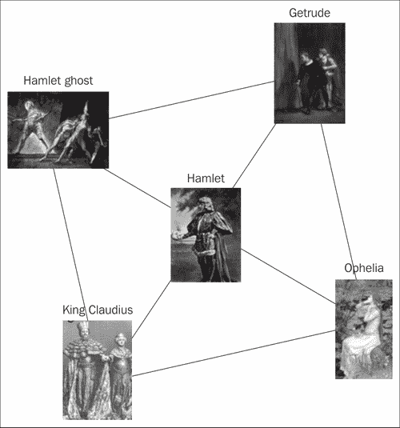
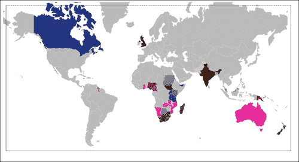
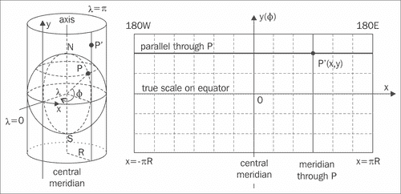

# 三、动画数据显示

在这一章中，我们将介绍以下食谱:

*   制作运动图表
*   显示力有向图
*   制作实时范围图过滤器
*   制作图像转盘
*   缩放和平移图表
*   使用网络通知应用编程接口
*   从数据集创建交互式地理图

# 简介

我们都生活在一个信息时代，每天都有大量的数据被创造出来。这些多余的数据迫切需要以用户可访问的格式呈现。

本章将介绍一些常见的动画数据可视化方法，包括一些小的交互。大多数示例都是数据驱动的文档，用 D3 以及其他一些动画数据显示方法绑定到页面。

### 注

在整本书中，我们使用 D3，所以了解它的一些起源是很好的。图书馆杰出的核心作者迈克·博斯托克(Mike Bostock)创建了图书馆，作为他在博士研究期间创建的名为“原型”的图书馆的继承者，考虑到了网络标准并进行性能改进。他还有一个惊人的可视化列表，大部分是为《纽约时报》制作的，可以在他的 http://bost.ocks.org/mike/网站上找到。

# 制作运动图

当处理基于时间的数据时，您通常希望有一个视图，其中时间变化将被可视化。这样做的一种方法是使用一个随时间更新的运动图表，这就是我们将用这个食谱创建的。


## 做好准备

我们将使用一个工具包来创建一个名为**人力车** 的交互图，它可以从[http://code.shutterstock.com/rickshaw/](http://code.shutterstock.com/rickshaw/)中检索，也是示例代码的一部分。除此之外，我们还需要`D3.js`包含在内，因为人力车是建立在它之上的。

## 怎么做...

为了创建配方，我们将添加 JavaScript 代码，该代码将随机生成数据，并使用人力车创建一个交互式图形。

1.  首先，我们在头部添加外部 JavaScript 和 CSS。按照惯例，我们可以将供应商库放在单独的文件夹`js/vendor/ and css/vendor/`中。

    ```html
    <!doctype html>
    <head>
      <link type="text/css" rel="stylesheet"href="css/vendor/graph.css">
      <title>Motion chart</title>
      <script src="http://d3js.org/d3.v2.js"></script>
      <script src="js/vendor/rickshaw.js"></script>
    </head>
    ```

2.  我们在正文部分添加了图表的占位符。

    ```html
    <div id="content">
      <div id="chart"></div>
    </div>
    ```

3.  我们继续主要部分，`js/example.js`文件，首先创建一个调色板，然后是刷新率。

    ```html
    (function () {
      //create a color palette
        var palette = new Rickshaw.Color.Palette({scheme: 'munin' });
      // we set the refresh rate in milliseconds
        var refreshRate = 500;
    ```

4.  下一步是通过`600px`和`line`类型创建`Rickshaw.Graph`大小为`900px`的支持向量机。我们使用之前选择的刷新率和指定的调色板。

    ```html
    // create graph
    var graph = new Rickshaw.Graph({
      element: document.getElementById("chart"),
      width: 900,

    height: 600,
      renderer: 'line',
      series: new Rickshaw.Series.FixedDuration(
        [
          { name : 'one' },
          { name : 'two' },
          { name : 'three' }
        ], palette, {
          timeInterval: refreshRate,
          maxDataPoints: 50
          }
        )
      });
    ```

5.  Following this we can add a Y axis to the created graph.

    ```html
    var yAxis = new Rickshaw.Graph.Axis.Y({
      graph: graph
    });
    ```

    因为我们创建了所需的对象，所以可以通过在它们上面调用`.render`来将它们渲染到屏幕上。

    ```html
    graph.render();
    yAxis.render();
    ```

6.  我们需要数据来显示，所以我们将生成一些随机数据，并将其添加到图表中。为了添加具有延迟的数据，请在刷新速率期间使用设置时间间隔。

    ```html
    //random util
    function getRandomInRange(n){
      return Math.floor(Math.random() * n);
    }
    // generate random data and add it to the graph
    setInterval( function() {
      var data = {
        one: getRandomInRange(50) + 100,
        two: Math.abs(Math.sin(getRandomInRange(30)+1) ) *(getRandomInRange(100) + 100),
        three: 400 + getRandomInRange(110)*2
      };
      graph.series.addData(data);
      //update
      graph.render();  yAxis.render();
    }, refreshRate );
    ```

在这一点上，我们应该会看到类似于食谱开头所示的图。

## 它是如何工作的...

我们选择的`Rickshaw.Color.Palette`是方案`munin`。还有其他调色板可供选择，如`spectrum14`或`cool`。调色板用于简化和自动选择图形的颜色。例如，如果我们手动调用。`color()`法多次。

```html
palette.color()
"#00cc00"
palette.color()
"#0066b3"
palette.color()
"#ff8000"

```

它总是会返回下一种颜色。调色板是一组预定义的颜色，可以在给定的规则集之间选择。例如，最初的任天堂游戏男孩有四种绿色，可以用来显示所有的游戏。如果我们看一下人力车中调色板的实现，我们可以注意到它们只是一个颜色列表。以下是调色板`cool`人力车源代码定义的片段:

```html
this.schemes.cool = [
  '#5e9d2f',
  '#73c03a',
  '#4682b4',
  '#7bc3b8',
  '#a9884e',
  '#c1b266',
  '#a47493',
  '#c09fb5'
  ];
```

如果我们看一下`Rickshaw.Graph`的创建，除了 SVG 的大小之外，我们选择了 ID 为`chart`的元素，在那里图形将被渲染。

```html
element: document.getElementById("chart")
```

另外，我们将`renderer`类型设置为`line`，但也可以根据结果设置为`area`、`stack`、`bar`或`scatterplot`。

对于`series`属性，我们使用以下代码片段:

```html
series: new Rickshaw.Series.FixedDuration([
  {name: 'one'},
  {name: 'two'},
  {name: 'three'}
  ], palette, {
  timeInterval: refreshRate,
  maxDataPoints: 50
  })
```

第一个参数是带有数据名称的数组，之后是调色板，最后是我们设置更新`timeInterval`的选项对象。此外，`maxDataPoints`被设置为`50`，该选项指定当前显示多少数据样本，这意味着我们将显示最后 50 个对象。

后来，我们第一次在`graph`和`yAxis`对象上调用`.render()`方法，之后，在`setInterval()`方法中，我们要求在每次数据更改时重新渲染它们。我们构建的渲染数据具有以下格式:

```html
var data = {
  one: someNumber,
  two: someNumber,
  three:  someNumber
  };
```

前面的格式表示特定时间点三行的值。

使用为`Rickshaw.Series.FixedDuration`定义的`addData()`方法将该数据对象传递到序列中，该方法设置`series`属性的最新更新。

```html
graph.series.addData(data);
```

如果我们需要获取所有显示帧的当前数据，我们可以调用`graph.series.dump()`方法。

例如，将返回以下结果:

```html
Object:
 color: "#00cc00"
 data: Array[50]
 name: "one"

```

## 还有更多...

自定义`chart` ID 有多种方式:过滤信息、添加控件或从远程服务器馈送数据。如果我们想要附加一个图例，我们可以在图形渲染之前简单地创建一个这样的对象，并将其附加到我们的图形对象上。

```html
var legend = new Rickshaw.Graph.Legend({
  element: document.getElementById('legend'),
  graph: myGraph
  });
```

# 显示力有向图

在这个食谱中，我们将创建一个由威廉·莎士比亚创作的戏剧《哈姆雷特》中的一些人物的图表。的想法是以一种有趣和互动的方式形象化人物之间的联系。将被可视化的图形类型称为**力导向**图形。



## 做好准备

为了可视化角色之间的联系，需要以某种方式存储它们。有一个示例`data.json`文件，它是您可以使用的代码示例的一部分。虽然我们鼓励您创建自己的示例数据，或者至少使用现有的数据，但是为了简单起见，我们将使用代码示例中提供的数据。

## 怎么做...

我们将创建一个 JSON 文件来包含关系和图像信息、HTML 和附带的 JavaScript。

1.  首先，我们可以从创建配方数据开始。我们可以定义`nodes`列表，对象将放置在属性为`name`的地方，属性为`name`将指定节点的名称，**图标**将是图像的 URL，组将是

    ```html
    {
      "nodes": [
        {
          "name": "Hamlet",
            icon":"http://upload.wikimedia.org/wikipedia/commons/thumb/4/4e/Bernhardt_Hamlet2.jpg/165px-Bernhardt_Hamlet2.jpg"
        },
        {
          "name": "King Claudius",
          "icon": "http://upload.wikimedia.org/wikipedia/commons/thumb/b/b4/Massalitinov_and_Knipper_in_Hamlet_1911.jpg/167px-Massalitinov_and_Knipper_in_Hamlet_1911.jpg"
        },
    ```

2.  在数据中添加节点后，我们还需要关于它们是如何连接的信息。为此，我们将在模型中添加一个`links`列表。

    ```html
    "links": [
      {
        "source": 1,
        "target": 0
      }
      {
        "source": 3,
        "target": 0
      }
    ]
    ```

3.  现在我们可以继续创建 HTML 文件了。对于这个实现，我们将使用`D3.js`，所以我们需要包含它，并设置两个 CSS 类，一个用于链接，另一个用于节点文本。

    ```html
    <script src="http://d3js.org/d3.v2.min.js"></script>
    <style>
    .link {
      stroke: #aaa;
    }
    .node text {
      pointer-events: all;
      font: 14px sans-serif;
      cursor: pointer;
      user-select: none;
    }
    </style>
    ```

4.  在这之后，我们可以开始添加主脚本中的部分。和前面的例子一样，我们将首先把 SVG 添加到具有一些预定义大小的`body`元素中。

    ```html
    (function (){
      var width = 960,    height = 600;
      var svg = d3.select("body").append("svg")
      .attr("width", width)
      .attr("height", height);
    }
    ```

5.  现在我们可以为图表创建布局了。

    ```html
    var force = d3.layout.force()
    .gravity(.04)
    .distance(350)
    .charge(-200)
    .size([width, height]);
    ```

6.  下一步是将 JSON 文档中的数据映射到 force 布局，并创建所有的`links`和`nodes`。

    ```html
    d3.json("data.json", function(json) {
      force.nodes(json.nodes)
      .links(json.links)
      .start();
      var link = svg.selectAll(".link")
      .data(json.links)
      .enter().append("line")
      .attr("class", "link");
      var node = svg.selectAll(".node")
      .data(json.nodes)
      .enter().append("g")
      .attr("class", "node")
      .call(force.drag);
    }
    ```

7.  然后我们从模型中追加`image`，定义为`icon`和`text`加上节点的名称。

    ```html
    node.append("image")
    .attr("xlink:href", function(d){return d.icon;})
    .attr("x", -32)
    .attr("y", -32)
    .attr("width", 100)
    .attr("height", 100);

    node.append("text")
    .attr("dx", -32)
    .attr("dy", -32)
    .text(function(d) { return d.name });
    ```

8.  同样在强制更改和更新时，我们将设置一个监听器来更新链接和节点位置。

    ```html
    force.on("tick", function() {
      link.attr("x1", function(d) { return d.source.x; })
      .attr("y1", function(d) { return d.source.y; })
      .attr("x2", function(d) { return d.target.x; })
      .attr("y2", function(d) { return d.target.y; });

      node.attr("transform", function(d) { return "translate(" + d.x + "," + d.y + ")"; });
      });
    }());
    ```

## 它是如何工作的...

首先，我们来看看 CSS，更具体地说，我们已经设置为`all`的`pointer-events`处。当指针位于内部或外围时，此设置使元素成为鼠标事件的目标，并且只能在 SVG 元素上使用。为了禁用文本的选择，我们使用 CSS 属性`user-select`，并将其设置为`none`的值。

### 类型

`user-select`在不同浏览器之间是不一致的，为了使用它，我们可以添加浏览器特定的 CSS hack，比如如下:

```html
-webkit-touch-callout: none;
-webkit-user-select: none;
-khtml-user-select: none;
-moz-user-select: none;
-ms-user-select: none;
user-select: none;
```

用于此食谱的布局是`d3.layout.force()`，它不创建固定的视觉表示，而是我们定义参数，如`friction`、`distance`和`gravity strength`。根据数据和鼠标交互，我们会得到不同的视图。

```html
var force = d3.layout.force()
.gravity(.04)
.distance(350)
.charge(-200)
.size([width, height]);
```

在设置`links`、`nodes`的参数和数据信息后构建布局时，需要调用、`start()`方法。

```html
force.nodes(json.nodes)
.links(json.links)
.start();
```

我们想从我们的数据中为所有的`nodes`创建`g`元素，并设置合适的 CSS 类`node`。

```html
var node = svg.selectAll(".node")
.data(json.nodes)
.enter().append("g")
.attr("class", "node")
.call(force.drag);
```

另外，添加一个允许使用`.call(force.drag)`进行交互式拖动的行为。

`g`元素代表一个容器，可以用来对其他元素进行分组。应用于`g`元素的变换也在其所有子元素上执行。此功能使该元素成为组织视图块不同部分的良好选择。

### 注

更多关于`g`元素的信息可以在来自[http://www.w3.org/TR/SVG/struct.html#Groups](http://www.w3.org/TR/SVG/struct.html#Groups)的 SVG 规范中找到。

`force.drag()`方法是在`d3.layout.force()`方法中预先定义的。拖动事件被固定到`mouseover`上的工作，以允许捕捉移动的节点。当接收到`mousedown`事件时，节点被拖动到鼠标位置。有趣的是，这种行为支持来自移动设备的触摸事件，如 iOS 或安卓。为了在拖动时禁用节点的点击事件，将捕获`mouseup`并停止传播。

为了给节点创建一个图像，我们从存储在`d.icon`的数据中添加带有`xlink:href`的 SVG `image`标签到网址。

```html
node.append("image")
.attr("xlink:href", function(d){return d.icon;})
```

为了从布局中进行更新，在可视化的每个刻度上调度`tick`事件。为了保持元素的更新，我们为事件添加了一个监听器。

```html
force.on("tick", function() {
  link.attr("x1", function(d) { return d.source.x; })
  .attr("y1", function(d) { return d.source.y; })
  .attr("x2", function(d) { return d.target.x; })
  .attr("y2", function(d) { return d.target.y; });
  node.attr("transform", function(d) { return "translate(" + d.x + "," + d.y + ")"; });
  });
```

听众将动作的正确位置设置为`link`和`node`。

## 还有更多...

这里一个更明显的选择是给可视化添加更多的交互。节点可以折叠，链接可以添加到节点。节点之间的关系可以设置为更细粒度的级别。有一些方法可以使数据随着时间的推移而刷新，并重新加载图形的某些部分。如果需要，可以有预设的预期布局，这样节点会尽量确认一定的定位。

### 注

从[https://github.com/mbostock/d3/wiki/Force-Layout](https://github.com/mbostock/d3/wiki/Force-Layout)了解更多关于 D3 力布局和相关功能的信息。

# 制作动态范围图过滤器

在处理大量数据的时候，我们通常要加入一些过滤或者拾取什么数据来显示的方式。这个配方将包括一个简单的图表范围过滤器和一个显示随时间变化的数据序列的图表。


## 做好准备

我们将使用*制作运动图*配方中的相同工具包来创建交互式图表。必要的库人力车可以从[http://code.shutterstock.com/rickshaw/](http://code.shutterstock.com/rickshaw/)中检索，也是示例代码的一部分。除此之外，我们还需要 D3，因为人力车在它上面工作。

## 怎么做...

我们将创建一个包含 JavaScript 文件的 HTML 页面，同时为图形生成随机数据，并添加额外的过滤元素。

1.  首先，我们将制作一个 HTML 页面，并包含库所需的 CSS。

    ```html
    <!DOCTYPE html>
      <html>
        <head>
          <link type="text/css" rel="stylesheet"href="css/vendor/graph.css">
          <link type="text/css" rel="stylesheet"href="css/vendor/legend.css">
          <link rel="stylesheet" type="text/css"href="http://code.jquery.com/ui/1.9.2/themes/base/jquery-ui.css">
          <link type="text/css" rel="stylesheet"
            href="css/main.css">
        </head>
    ```

2.  注意我们添加了一个额外的文件`legend.css`，它包含了关于图形图例的布局信息。然后我们可以添加我们的自定义 CSS 文件。

    ```html
    <link type="text/css" rel="stylesheet" href="css/main.css">
    ```

3.  图形、图例和幻灯片的 HTML 占位符将是常规的`div`元素。

    ```html
    <div id="content">
    <div id="chart"></div>
    <div id="legend"></div>
    </div>
    <div style="clear:both"></div>
    <div id="slider"></div>
    ```

4.  我们添加了库的依赖项。除了人力车及其依赖关系 D3 之外，我们还将添加 jQuery 和 jQuery UI，因为我们将从那里使用控件。现在，我们可以进入主 JavaScript，从定义调色板和刷新率开始。

    ```html
    var refreshRate = 300;
    var palette = new Rickshaw.Color.Palette( { scheme: 'munin' } );
    ```

5.  下一步是在图表元素中按`500px`大小创建`900px`图形。

    ```html
    var graph = new Rickshaw.Graph( {
      element: document.getElementById("chart"),
      width: 900,
      height: 500,
      renderer: 'area',
      series: new Rickshaw.Series.FixedDuration([{
        color: palette.color(),
        name: 'NASDAQ'
      },
      {
        color: palette.color(),
        name: 'NIKKEI'
      }], palette, {
        timeInterval: refreshRate,
        maxDataPoints: 200,
        timeBase: new Date().getTime() / 1000
      })
    });
    ```

6.  至于`slider`属性，人力车为我们提供了一个现成的控件，我们可以将其连接到我们创建的图形。

    ```html
    var slider = new Rickshaw.Graph.RangeSlider({
      graph: graph,
      element: $('#slider')
    });
    ```

7.  要绘制一个 Y 轴，我们可以创建它，并将其连接到我们的图形。

    ```html
    var yAxis = new Rickshaw.Graph.Axis.Y({
      graph: graph
    });
    ```

8.  为了在显示的数据样本的颜色和名称上创建一个图例，我们可以使用一个控件并将其与我们的图形连接起来，同时我们还可以指定它将被呈现的元素。

    ```html
    var legend = new Rickshaw.Graph.Legend({
      graph: graph,
      element: $('#legend').get(0)
    });
    ```

9.  因为这个例子有一个时间序列部分，我们将生成随机数据。数据生成后，我们调用`graph.series.addData(data)`并重新渲染`graph`和`yAxis`属性。这种生成、数据更新和渲染每隔`refreshRate`毫秒发生一次。

    ```html
    function getRandomInRange(n){
      return Math.floor(Math.random() * n);
    }
    setInterval( function() {
      var data = {
        one: getRandomInRange(50) + 100,
        two: 400 + getRandomInRange(110)*2
      };
      graph.series.addData(data);
      graph.render();
      yAxis.render();
    }, refreshRate );
    ```

## 它是如何工作的...

让我们看看图的系列输入参数。

```html
series: new Rickshaw.Series.FixedDuration([{
  color: palette.color(),
  name: 'NASDAQ'
  }, {
  color: palette.color(),
  name: 'NIKKEI'
  }], palette,
```

除了图形数据，我们还有一个`name`和一个`color`属性。现在，你可能会问自己的第一件事是，为什么要有一个`color`属性并输入调色板？我们这样做是为了让其他插件能够读取这些信息。

其中一个插件是`Rickshaw.Graph.Legend`，它构建了一个图例框，显示每个数据流的信息。

我们还用`Rickshaw.Graph.RangeSlider`在 X 轴上添加了一个范围过滤。

```html
var slider = new Rickshaw.Graph.RangeSlider({
  graph: graph,
  element: $('#slider')
});
```

在后台，`slider`属性使用设置为`range:true`的 jQuery UI 控件。最小值和最大值使用当前图形数据。`slider`属性有一个`slide`事件，用于限制图表上显示的样本大小。

因为有数据不断地添加到图表中，所以`slider`属性的最小值和最大值由图表中的一个事件相应地设置。这些是您在开发自定义控件时需要记住的一些注意事项。


滑块设置为仅显示给定的时间部分。因为时间会改变，滑块会随着数据一起移动。

# 制作图像转盘

图像传送带是网站上最受欢迎的营销和展示工具。它们还可以用来显示图像库或演示文稿。

在这个食谱中，我们将建立一个图像转盘。它将支持自动定时转换，如果用户在转盘区域移动，该转换将停止。它将有一个由控制矩形组成的导航区域，表示当前活动的图像和剩余图像的数量。

这将是一个利用 HTLM5 功能的 3D 转盘，例如 CSS3 3D 转换。

## 做好准备

我们需要目录中的三个图像以及我们的代码。应该分别命名为`1.jpg`、`2.jpg`和`3.jpg`。

## 怎么做...

我们将使用 jQuery、HTML5 和 CSS 转换来创建图像转盘。

1.  首先，我们将创建一个带有旋转木马和灰色图像控件的 HTML 页面。我们将把控制装置放在转盘的中底部。

    ```html
    <!DOCTYPE html>
    <html>
      <head>
        <title>Image carousel</title>
        <style type="text/css">
    ```

2.  要获得有深度的三维视图，主容器必须有一个`perspective`属性。它表示观看者离屏幕的距离。它会让附近的东西看起来更大，而远处的东西看起来更小。

    ```html
    #carousel {
     perspective: 500px;
      -webkit-perspective: 500px;
      position:relative; display:inline-block;
      overflow:hidden;
    }
    ```

3.  我们将把所有的图像放入旋转器中，然后旋转旋转器本身。为此，旋转器上的旋转必须保留子元素的三维变换。
4.  此外，旋转器和图像都将有一个过渡动画。我们通过添加`transition`属性来指定这一点。在我们的例子中，转换将对转换起作用，并且将是一秒钟长。

    ```html
    #rotator {
      transform-style: preserve-3d;
      -webkit-transform-style: preserve-3d;
      position:relative;
      margin:30px 100px;
      width:200px; height:200px;
      transition: transform 1s;
      -webkit-transition: -webkit-transform 1s;
    }
    #rotator img {
      position:absolute;
      width: 200px; height:200px;
      transition: transform 1s;
      -webkit-transition: -webkit-transform 1s;
    }
    #controls {
      text-align: center;
      position:absolute;
      left:0; bottom:0.5em;
      width:100%;
    }
    #controls span {
      height: 1em; width: 1em;
      background-color:#ccc;
      margin: 0 0.5em;
      display: inline-block;
    }
      </style>
    </head>
    <body>
      <div id="carousel">
        <div id="rotator">
          
          
          
          </div>
        <div id="controls"></div>
      </div>
      <script src="http://ajax.googleapis.com/ajax/libs/jquery/1.8.2/jquery.min.js"></script>
      <script type="text/javascript" src="example.js">
    </script>
    </body>
    </html>
    ```

5.  激活旋转木马并使控件可点击的代码将在`example.js`中。

    ```html
    (function() {
      $("#carousel").on('mouseover', pause);
      $("#carousel").on('mouseout', start);
      var position = 0;
      var all = $("#carousel").find('.image');
      var total = all.length;
    ```

6.  我们将把所有的图像放在它们在三维空间中的适当位置，每个图像旋转一个角度的倍数，并移动一个计算的量。更多信息参见*如何工作...*本食谱的一节。

    ```html
      var angle = (360 / total);
      var deg2radfac = 2 * Math.PI / 360;
      var zMovement = $("#rotator").width() / 2 *Math.tan(deg2radfac * angle / 2);
      all.each(function(k) {
        var trans = 'rotateY(' + (angle * k).toFixed(0) + 'deg)'
        + 'translateZ('+ zMovement.toFixed(0) + 'px)';
        $(this).css('transform', trans);
      });
      $("#rotator").css('transform', 'translateZ('+ (0 - zMovement).toFixed(0) + 'px)');
    ```

7.  对于每个图像我们添加一个控制标记，可以激活该图像。

    ```html
    for (var k = 0; k < all.length; ++k) {
      $('<span />').attr('data-id', k).appendTo("#controls");
    }
    $("#controls").on('click', 'span', function() {
      changeTo(position = $(this).attr('data-id'));
    });
    ctrls = $("#controls span");
    start();
    ```

8.  最后，让我们编写改变转盘位置的函数。`change`功能通过`dir`元素改变位置，`changeTo`直接将位置改变到指定元素。然后我们可以启动转盘计时器。

    ```html
    function change(dir) {
      dir = dir || 1;
      position += dir;
        if (position >= all.length) position = 0;
        else if (position < 0) position = 0;
        changeTo(position);
      }
    function changeTo(position, cb) {
      ctrls.css({'opacity': 0.33});
      ctrls.eq(position).css({'opacity': 1});
      $("#rotator").css('transform',
      'translateZ('+ (0 - zMovement).toFixed(0) + 'px) ' +
      'rotateY(' + (angle * position).toFixed() + 'deg) ');
      }
    function start() { timer = setInterval(change, 5000); }
    function pause() {
      if (timer) { clearInterval(timer); timer = null; }
      }
    }());
    ```

## 它是如何工作的...


构建我们的旋转木马取决于我们要使用的图像数量。为了更好地理解我们应用变换时到底发生了什么，让我们来看看旋转木马的顶视图。上图显示了一个有五个边的转盘。每条边从中心点平移一段距离`z`，然后旋转一个角度`a`多次。角度可以计算如下:`a = 360 / number Of sides`。

然而的翻译稍微难一点。为此，我们需要观察由`z`和一半边宽组成的三角形。通过应用三角方程`tan(a/2) = (w/2) / z`我们可以计算`z = w/2 / tan(a/2)`。

为了旋转转盘，我们每 5 秒钟将`rotator`父代旋转一个角度`a`。允许用户点击控件来改变旋转。

我们还通过`z`向相反方向移动`rotator`，以使转盘中前元素的距离相同，就像它没有被平移一样。

我们希望这个食谱通过使用一些新的 HTML5 功能，为略显沉闷的转盘制作话题增加一些乐趣和新鲜感，这一定会让用户惊叹不已。

### 注

在撰写本文时，CSS3 的一些特性还没有广泛应用。Internet Explorer 9 不支持许多 HTML5，尽管它们在 Internet Explorer 10 中可用。在使用这些技术之前，请查看目标浏览器的要求。

# 缩放和平移图表

我们在本书前一章中讨论的图表是静态的。因此，它们非常适合可视化有限数量的数据。但是，当数据集变得太大时，用户可能需要交互选择图表中显示的数据范围。

为了实现这一点，我们将制作一个能够交互控制的图表，例如缩放和平移。 Flot 图表库通过其导航插件轻松支持这一点。

在这个食谱中，我们将以 30 分钟为增量显示一周的温度历史。我们将允许用户缩放和平移历史。

## 做好准备

我们需要从官方网站[http://www.flotcharts.org/](http://www.flotcharts.org/)下载 Flot，并将内容提取到单独的文件夹`flot`中。

## 怎么做...

为了创建这个食谱，我们将添加 Flot、jQuery，并创建一个 HTML 文件。

1.  首先，我们创建一个带有图表占位符的基本 HTML 页面。我们还将包括 jQuery(Flot 需要)、Flot 本身和 Flot 导航插件。Flot 需要在图表画布上绘制一个占位符`div`，所以我们将提供一个。占位符需要通过 CSS 指定`width`和`height`；否则，Flot 可能无法正确绘制图表。

    ```html
    <!DOCTYPE HTML>
    <html>
      <head>
        <title>Chart example</title>
      </head>
      <body>
        <div id="chart" style="height:200px;width:800px;"></div>
        <script src="http://ajax.googleapis.com/ajax/libs/jquery/1.8.2/jquery.min.js"></script>
        <script src="flot/jquery.flot.js"></script>
        <script src="flot/jquery.flot.navigate.js"></script>
        <script type="text/javascript" src="example.js"></script>
      </body>
    </html>
    ```

2.  我们将在`example.js`中添加我们的代码。

    ```html
    $(function() {
      var now  = Date.now();
      var hour = 60 * 60 * 1000, day = 24*hour;
      var weekAgo = now - 7*day;
      var zoomOut = null;

      function getData(cb) {
        var temperatures = [];
        // Generate random but convincing-looking data.
        for (var k = 24 * 7; k >= 0; --k)
        temperatures.push([now - k*hour,Math.random()*2 + 10*Math.sin(k/4 + 2)]);
        cb(temperatures);
      }

      getData(function(data) {
        var p = $.plot("#chart", [{data: data}], {
          xaxis: {
            mode: 'time',
            zoomRange: [day / 2, 7 * day],
            panRange: [weekAgo, now]
          },
        yaxis: { zoomRange: false,   panRange: false },
        zoom: { interactive: true },pan:  { interactive: true }
        });
      zoomOut = p.zoomOut.bind(p);
      });
      $('<input type="button" value="zoom out">')
      .appendTo("#chart")
      .click(function (e) {
        e.preventDefault();
        zoomOut && zoomOut();
      });
    });
    ```

## 它是如何工作的...

为了绘制图表，首先我们编写了函数`getData`来生成一些看起来令人信服的温度随机数据，这些数据白天上升，晚上下降。因为它是基于回调的，我们可以用一个从服务器获取数据的函数来代替这个函数。

绘图功能`$.plot`有三个参数。第一个是绘图占位符，第二个是我们需要绘制的系列数组，第三个是绘制选项。我们只会通过一个系列赛。

我们的图表新增了绘图选项和缩小按钮。我们在轴选项中指定缩放和平移范围。我们的 Y 轴不支持缩放和平移，因此它已被禁用。

`zoomRange`选项指定缩放时整个绘图的最小和最大范围。例如，我们的选项指定该图将缩放至显示最少半天和最多一周的全范围。

`panRange`选项指定 X 轴上的最小和最大值。在我们的示例中，我们指定用户不能平移图表使其最小值低于`weekAgo`，也不能平移图表使其最大值高于`now`。

最后，我们指定缩放和平移是交互式的。这意味着用户可以使用双击来放大，也可以通过鼠标拖动来平移。

为了允许用户重置缩放，我们添加了一个`zoomOut`按钮，调用`zoomOut`功能。每当我们重绘绘图时，我们都需要更新这个函数，因为从`$.plot`调用返回的对象发生了变化。这种方式允许多次`getData`呼叫。

通过这种方式，我们增加了图表的交互性，允许用户自定义他们想要查看的数据范围。Flot 导航适用于各种图表；请务必查看前一章，了解支持的一些图表类型的概述。

# 使用网络通知应用编程接口

网络通知是现代浏览器中新增的新功能之一。它们旨在为网页上下文之外的用户提供提醒。这个想法是让它们成为浏览器，例如，当使用移动浏览器时，通知可以进入设备的主屏幕。在桌面上，它们通常显示在屏幕的右上角，至少在大多数桌面环境中是这样。


## 做好准备

对于这个例子，我们将使用来自古腾堡工程[http://www.gutenberg.org/](http://www.gutenberg.org/)的数据。数据是孙子兵法*中*使用间谍*一章的提示，可以在`data.json`下的食谱代码示例中找到。*

 *## 怎么做...

为了创建这个食谱，我们将创建一个 HTML 文件，为了简单起见，使用 jQuery。

1.  首先，我们可以从 HTML 部分开始，如果浏览器不支持通知，我们只需要创建一个简单的`button`和一个带有我们将要使用的 ID `fallback`的`div`元素。

    ```html
    <body>
     <button id="show">Show quote</button>
     <div id="fallback" ></div>
      <script src="http://ajax.googleapis.com/ajax/libs/jquery/1.8.2/jquery.min.js"></script>
      <script src="js/notification.js"></script>
      <script src="js/display.js"></script>
    </body>
    ```

2.  让我们首先创建`notification.js`文件，我们将使用它作为工具来创建`simpleNotifations.show(data)`。我们要做的第一个检查是核实对`webkitNotifications`的支持，这是在撰写本文时唯一的全面实施。

    ```html
    var simpleNotification = (function () {
      var my = {};
       my.show = function (data) {
        if (window.webkitNotifications) {
          //check if there is a support for webkitNotifications
          if (window.webkitNotifications.checkPermission()== 0) {
            var notification = webkitNotifications.createNotification(data.icon, data.title, data.body);
            notification.show();
            //set timeout to hide it
            setTimeout(function(){
            notification.cancel();
          }, data.timeout);
        } else {
          webkitNotifications.requestPermission(function () {
            //call the same function again
            my.show(data);
          });
        }
      }
    ```

3.  接下来是对基于真正标准的 web 通知对象的检查，在未来，随着浏览器越来越多地实现它，它应该是第一个。

    ```html
    else if (window.Notification) {
      if ("granted" === Notification.permissionLevel()) {
        var notification = new Notification(data.title, data);
          notification.show();
        } else if ("default" === Notification.permissionLevel() ) {
          Notification.requestPermission(function () {
            //call the same function again
            my.show(data);
          });
        }
      }
    ```

4.  最后的情况；如果系统不支持任何类型的通知，我们只使用回调来处理这种情况，在这种情况下，我们也会关闭实用程序。

    ```html
      }else{
        //Notifications not supported, going with fallback
        data.errorCallback();
        }
      };
      return my;
    }());
    ```

5.  接下来，我们可以继续创建`display.js`文件，该文件将从数据中获得随机报价，并调用先前定义的`simpleNotification.show()`方法。首先我们来取钱。

    ```html
      function fetchRandomQuote(location,data){
        $.ajax(
          {
            url:location,
            dataType:'json',
            success: function(result){
              var quoteNumber = Math.floor(Math.random()*26)+1;
              var obj = result.quotes[quoteNumber];
              for(var key in obj){
                data.title += key;
                data.body = obj[key];
            }
           simpleNotification.show(data);
        }}
        );
      };
    ```

6.  因为我们希望所有通知都有一些默认行为，比如图标、默认消息或回退功能，所以我们使用默认的`data`对象进行标注。

    ```html
    $(document).ready(function() {
      $("#show").click(function (){
        var data = {
          icon: "images/war.png",
          title: "The Art of War - The Use of Spies ",
          body: "text",
          timeout : 7000,
          errorCallback: function(){
            $("#fallback").text(this.body);
            }
          };
        fetchRandomQuote('js/data.json',data);
        });});
    ```

## 它是如何工作的...

我们将更深入地了解的`notification.js`文件，大部分通知逻辑都在那里。我们对通知`if (window.webkitNotifications)`和`if (window.Notification)`进行的检查测试试图查看浏览器中是否有这样的对象。如果没有这样的对象，这意味着不支持这种类型的通知。而另一方面，如果满足`if`条件，这意味着我们有支持，可以请求许可。

```html
  if (window.webkitNotifications.checkPermission() == 0)
```

之后，我们可以自由创建通知，并使用给定的参数`icon`、`title`和`body`进行显示。

```html
var notification = webkitNotifications.createNotification(data.icon, data.title, data.body);
notification.show();
```

如果我们希望通知在给定的超时后隐藏，我们可以添加以下函数:

```html
setTimeout(function(){
  notification.cancel()
}, data.timeout);
```

另一方面如果我们没有显示通知的权限，我们需要向用户请求，在那里我们可以再次调用我们的函数。

```html
webkitNotifications.requestPermission(function () {
  my.show(data);
}
```

### 类型

对权限的请求必须来自某个 HTML 元素上的用户触发事件。在我们的例子中，这是按钮上的`onClick`功能。更具体地说，jQuery 点击`$("#show").click(function (){ ...}`。

对于数据的获取，我们不需要太多的细节，但是在我们的默认对象中，我们有值为`images/war.png`的`icon`参数，我们将用于通知，以及`fallback`功能和`timeout`配置。

```html
var data = {
  icon: "images/war.png",
  title: "The Art of War - The Use of Spies ",
  body: "text",
  timeout : 7000,
  errorCallback: function(){
    $("#fallback").text(this.body);
    } };
```

### 注

在撰写本文时，Chrome 是相当长一段时间内唯一完全支持通知的浏览器，但 Safari 6.0 和 Firefox 22 Aurora 也有初步实现。

网页通知的完整规范可以从[http://www.w3.org/TR/notifications/](http://www.w3.org/TR/notifications/)找到。

# 从数据集创建交互式地理图

在这个食谱中，我们将看到如何创建看起来很酷的交互式地理图表，以及如何使用它们来显示数据。这些越来越常见于更大地理区域的统计数据显示，通常来自选举结果或全球变暖的影响。为了有一个覆盖多个不同国家的地图，我们将可视化英联邦成员国和成员国申请国的统计数据。

### 注

英联邦是一个由 54 个独立主权国家组成的自愿协会(其中一个国家的成员资格目前被暂停)。大多数是前英国殖民地，或者这些殖民地的属地。英联邦中没有一个政府像在政治联盟中那样对其他政府行使权力。相反，这种关系是一种国际组织关系，通过这种关系，具有不同社会、政治和经济背景的国家被视为地位平等，并在《新加坡宣言》所概述的共同价值观和目标框架内开展合作，该宣言可从

[英联邦成员国](http://en.wikipedia.org/wiki/Member_states_of_the_Commonwealth_of_Nations)。



## 做好准备

有 JSON 对象，定义了主要来自公共领域数据集的价值区域和比例级别的边界，可在[http://www.naturalearthdata.com/downloads/](http://www.naturalearthdata.com/downloads/)获得。

在我们的例子中，我们使用了一个`world-data.json`文件，它可以作为代码示例的一部分找到。

## 怎么做...

拿到`world-data.json`文件后。我们可以从创建 HTML 和 JavaScript 文件开始。

1.  Let's first take a look at this country boundaries data in the `world-data.json` file for example, at the Bahamas.

    ```html
    {
      "type":"Feature",
      "properties":{
        "name":"The Bahamas"
      },
      "geometry":{
        "type":"MultiPolygon",
        "coordinates":[":[
            [
              [
                [
                  -77.53466,
                  23.75975
                ],
                  [
                    -77.78,
                    23.71
                  ], …
                ]}}
    ```

    在他们的属性中，我们有国家的名称，国家的几何图形表示为具有多个点的多边形。

    ### 注

    有许多不同的方法来创建和表示边界数据。为了创建您自己的边界或获得已经可用的数据，开放街道地图([http://www.openstreetmap.org/](http://www.openstreetmap.org/))是一个提供这种选项的伟大项目。例如，一个叫做渗透的工具可以用来从[http://wiki.openstreetmap.org/wiki/Osmosis](http://wiki.openstreetmap.org/wiki/Osmosis)获取不同缩放级别的特定对象的矢量数据。

2.  我们可以继续在头部`D3.js`中添加 CSS 和依赖项。

    ```html
    <style>
      .frame {
        stroke: #333;
        fill: none;
        pointer-events: all;
      }
      .feature {
        stroke: #ccc;
      }
    </style>
    <script src="http://d3js.org/d3.v2.js"></script>
    ```

3.  在正文部分，我们直接从`example.js`文件开始，用欧元区国家名称部分的数据和生成随机数和颜色的实用程序来定义助手。

    ```html
    <script>
    var commonwealth = [
    "Australia", "Algeria",
    "The Bahamas", "Bangladesh",
    "Belize", "Botswana",
    "Brunei", "Cameroon",
    "Canada", "Cyprus",
    "Gambia", "Ghana",
    "Guyana", "India",
    "Jamaica", "Kenya",
    "Lesotho", "Malawi",
    "Malaysia", "Mozambique",
    "Madagascar", "Namibia",
    "New Zealand", "Nigeria",
    "Pakistan", "Papua New Guinea",
    "Rwanda", "Sierra Leone",
    "Solomon Islands", "Somaliland",
    "South Africa", "South Sudan",
    "Sudan", "Sri Lanka",
    "Swaziland", "United Republic of Tanzania",
    "Trinidad and Tobago", "Yemen",
    "Uganda", "United Kingdom",
    "Vanuatu", "Zambia"
    ];

    function random(number) {
      return Math.floor(Math.random()*number).toString(16)
    }
    function randomColor() {
      return "#"+random(255)+random(255)+random(255);
    }
    ```

4.  在那里我们增加了一个实用功能来获得一个随机的颜色，如果这个国家是这个区域的一部分，如果不是的话`#bbb`。

    ```html
    function getColorForCountry(name){
      if(commonwealth.indexOf(name)<0){
        return "#bbb";
      }else {
        return randomColor();
      }
    }
    ```

5.  然后为了获得酷炫的框架效果，我们在它周围设置了边距。

    ```html
    var margin = {
      top: 10,  right: 10,
      bottom: 10,  left: 10
    },
      width = 960 - margin.left - margin.right,
      height = 500 - margin.top – margin.bottom;
    ```

6.  接下来，我们定义投影、缩放行为和路径的类型，其中缩放行为在`zoom`事件上向`move()`方法添加回调。

    ```html
    var projection = d3.geo.mercator()
      .scale(width)
      .translate([width / 2, height / 2]);

    var path = d3.geo.path()
      .projection(projection);
    var zoom = d3.behavior.zoom()
      .translate(projection.translate())
      .scale(projection.scale())
      .scaleExtent([height, 10 * height])
      .on("zoom", move);
    ```

7.  我们使用先前设置的宽度和高度值创建SVG 图像，并调用缩放行为进入选定的缩放级别。

    ```html
    var svg = d3.select("body").append("svg")
      .attr("width", width + margin.left + margin.right)
      .attr("height", height + margin.top + margin.bottom)
    .append("g")
      .attr("transform", "translate(" + margin.left + "," + margin.top + ")")
      .call(zoom);
    ```

8.  首先，我们为地图的选定要素创建`g`元素。

    ```html
    var feature = svg.append("g")
      .selectAll(".feature");
    ```

9.  然后，我们通过创建 SVG 矩形来添加地图周围的框架。

    ```html
    svg.append("rect")
      .attr("class", "frame")
      .attr("width", width)
      .attr("height", height);
    ```

10.  现在我们需要从`world-data.json`文件中获取数据，为国家创建路径，并根据`d.properties.name`是否是所需组的一部分，用适当的颜色填充它们。

    ```html
    d3.json("js/world-data.json", function(data) {
      feature = feature
        .data(data.features)
        .enter().append("path")
        .attr("class", "feature")
        .attr("d", path)
        .style("fill", function(d){return getColorForCountry(d.properties.name)});
      });
    ```

11.  最后，缩放时调用移动()功能。

    ```html
    function move() {
      projection.translate(d3.event.translate).scale(d3.event.scale);
      feature.attr("d", path);
    }
    ```

## 它是如何工作的...

首先，`d3.geo.mercator()`从球面数据表示构建**墨卡托投影** 。

### 注

墨卡托投影是杰拉杜斯·麦卡托于 1569 年创建的圆柱形地图投影。它非常常用于表示地图，但它的问题是，当我们从赤道向两极移动时，物体的大小和形状会扭曲。更多关于墨卡托投影的内容可以从[https://en.wikipedia.org/wiki/Mercator_projection](https://en.wikipedia.org/wiki/Mercator_projection)和[中找到。](https://en.wikipedia.org/wiki/File:Cylindrical_Projection_basics2.svg)



`d3.geo.path()`方法使用一些预定义的设置创建新的地理世代。我们将该路径生成器设置为使用我们的`projection`类型。

```html
var path = d3.geo.path()
  .projection(projection);
```

`d3.behavior.zoom()`方法使我们能够在给定的缩放比例和范围内`scaleExtent`为我们的`projection`类型添加自动缩放功能。此外，这将在`zoom`事件上创建一个侦听器，调用 `move()`函数。

```html
d3.behavior.zoom()
  .scale(projection.scale())
  .scaleExtent([height, 10 * height])
  .on("zoom", move);
```

创建县的主要特征是我们从`world-data`获取特征数据，并创建实际代表单个国家的 SVG 路径，然后我们可以用颜色对其进行样式化和填充。

```html
d3.json("js/world-data.json", function(data) {
  feature = feature
    .data(data.features)
    .enter().append("path")
```

这种类型的地图也被称为地图，意思是专题地图，其中显示了一些统计变量。

文件`js/world-data.json`包含了每个国家的边界和一些元数据。元数据与我们的英联邦国家名单相匹配。如果他们匹配，这个国家就是有色人种。请注意，在我们的地图数据中几乎没有其他国家不可用。


## 还有更多...

使用 JavaScript 和地图时，经常会弹出两种格式。一个是 GeoJSON([http://www.geojson.org/](http://www.geojson.org/))，一种多种地理数据结构的格式。另一个叫 TopoJSON([https://github.com/mbostock/topojson](https://github.com/mbostock/topojson))，是 GeoJSON 的扩展，对拓扑进行编码。TopoJSON 使用称为圆弧的线段来获得比 GeoJSON 更好的特性。

有一家名为 CartoDB、[http://cartodb.com/](http://cartodb.com/)的公司专门制作地图，同时在后台大量使用 D3。他们提供一个免费计划，有很多选择值得一试，即使这是一个商业产品。*