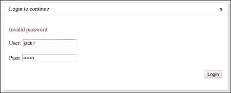
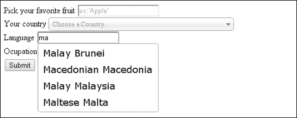
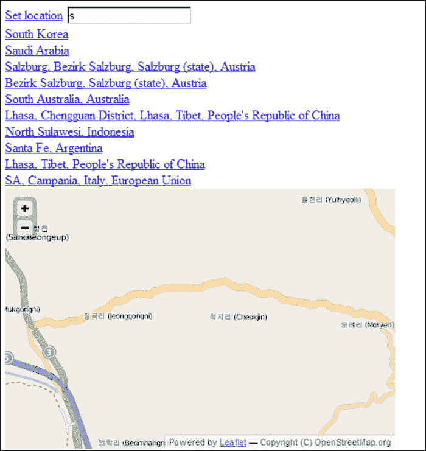

# 五、自定义输入组件

在本章中，我们将介绍以下内容:

*   使用内容可编辑进行基本的富文本输入
*   高级富文本输入
*   创建下拉菜单
*   创建自定义对话框
*   为输入创建自动完成功能
*   创建自定义单一选择列表
*   创建多选列表
*   使用地图输入地理位置

# 简介

到目前为止，我们展示了几种从用户那里获取输入的不同方法。HTML5 提供了许多新的特性，支持以前用 JavaScript 实现的输入组件的功能。

通常，需要扩展这个标准功能。在本章中，我们将看到创建一些自定义输入组件和使用现有组件的方法，其中我们添加了额外的功能来扩展或简化最终用户体验。

# 使用内容可编辑进行基本的富文本输入

有了 HTML5 中新的 `contentEditable`属性，我们可以将每个元素变成一个可编辑的富文本字段。理论上，这可以让我们编写复杂的富文本编辑器，在浏览器中正常工作。

其中，新的 API 可以用来发送编辑命令。这是使用`document.execCommand`函数完成的，该函数将命令字符串作为第一个参数，将选项作为第三个参数。

实际上，每个浏览器厂商实现的界面略有不同。然而，大多数现代浏览器都是完全兼容的。

您可以在[http://tifftiff.de/contenteditable/compliance_test.html](http://tifftiff.de/contenteditable/compliance_test.html)测试浏览器的合规性；但是，该测试没有考虑到某些浏览器对同一命令的行为可能不同的可能性。

在这个食谱中，我们将制作一个非常简单的`contentEditable`字段，它支持很少的命令(段落样式、撤销/重做、粗体/斜体/下划线、项目符号和编号列表)。

## 怎么做...

我们将创建一个内部有`contentEditable` div 的 HTML 页面。

1.  我们将在 div 中添加一些填充，以便于点击。在 div 上方，我们将放置格式按钮和一个下拉菜单:

    ```html
    <!DOCTYPE HTML>
    <html>
        <head>
            <title>Simple rich text editor</title>
            <style type="text/css">
                #edit { margin: 0.5em 0.1em; padding:0.5em;
               border: solid 1px #bbb; }
            </style>
       </head>
       <body>
       <div>
           <select class="btn style">
               <option value="P">Normal</option>
           </select>
           <button class="btn undo">Undo</button>
           <button class="btn redo">Redo</button>
           <button class="btn bold">B</button>
           <button class="btn italic">I</button>
           <button class="btn under">U</button>
           <button class="btn bullet">Bullet</button>
           <button class="btn number">Number</button>
       </div>
       <div id="edit" contentEditable="true">
       </div>
       <script src="http://ajax.googleapis.com/ajax/libs/jquery/1.8.2/jquery.min.js"></script>
       <script type="text/javascript" src="example.js"></script>
       </body>
    </html>
    ```

2.  然后我们可以让编辑控件在我们的`example.js`文件中工作:

    ```html
    $(function() {
        var editCommand = function(cmd, arg) { return document.execCommand(cmd, true, arg); };
    ```

3.  我们将把所有的`editCommand`绑定放在一个对象中:

    ```html
        var bindings = {
            '.undo': editCommand.bind(this, 'undo'),
            '.redo': editCommand.bind(this, 'redo'),
            '.bold': editCommand.bind(this, 'bold'),
            '.italic': editCommand.bind(this, 'italic'),
            '.under': editCommand.bind(this, 'underline'),
            '.bullet': editCommand.bind(this, 'insertUnorderedList'),
            '.number': editCommand.bind(this, 'insertOrderedList')
        };
    ```

4.  然后我们将它们应用到适当的编辑控件:

    ```html
        for (var key in bindings) $(key).on('click', bindings[key]);
    ```

5.  最后，我们将定义并添加额外的段落样式:

    ```html
        var styles = {
            'Heading 1': 'H1',
            'Heading 2': 'H2',
            'Heading 3': 'H3',
        };
        for (var key in styles)
            $('<option>').html(key).attr('value', styles[key]).appendTo('.style');

        $('.style').on('change', function() {
            editCommand('formatBlock', $(this).val());
        });
    });
    ```

## 它是如何工作的...

`document.execCommand`功能允许我们向当前激活的`contentEditable`字段发送命令。这些命令就像普通富文本编辑器中的工具栏按钮一样工作。例如，命令“粗体”切换文本的粗体；第二次应用时，它会将文本恢复到原始状态。该函数采用以下三个参数:

*   `commandName`:这是要执行的命令的名称。
*   `showDefaultUI` ( `boolean`):这告诉浏览器是否应该向用户显示与命令相关的默认用户界面，如果需要的话。
*   `Value`:这为命令提供了一个依赖于命令类型的参数。例如，粗体、斜体和下划线采用`boolean`值。

在这个食谱中，我们没有跟踪光标当前选择的状态。我们将把这种跟踪留给一个食谱，在那里我们将创建一个更高级的编辑器版本。不过，这里值得一提的是，我们可以使用`document.queryCommandState`功能在当前光标位置(或者如果当前选择有活动选择)检索属于命令的状态。

# 高级富文本输入

虽然基本的基于`contentEditable`的富文本输入字段在大多数情况下是足够的，但有时是不够的。我们可能希望允许用户插入更复杂的对象，例如图像和表格。

在这个食谱中，我们将制作一个支持插入图像和基本表格的高级富文本编辑器。

我们将基于*中演示的简单富文本编辑器来构建这个编辑器，使用 contentEditable 进行基本富文本输入*方法。

## 做好准备

我们将从*中的代码开始，使用 contentEditable 进行基本的富文本输入*配方，并对其进行改进。

## 怎么做...

我们来写代码。

1.  我们将取原始的`index.html`和`example.js`文件，但是我们将修改 HTML 文件。我们将添加两个控件:一个表格按钮和一个用于插入图像的文件选择器:

    ```html
    <!DOCTYPE HTML>
    <html>
        <head>
            <title>Simple rich text editor</title>
            <style type="text/css">
                #edit {margin: 0.5em 0.1em;padding:0.5em;border:solid 1px #bbb;}
                #edit table td { border: solid 1px #ccc; }
            </style>
       </head>
       <body>
       <div>
           <select class="btn style">
                  <option value="P">Normal</option>
           </select>
           <button class="btn undo">Undo</button>
           <button class="btn redo">Redo</button>
           <button class="btn bold">B</button>
           <button class="btn italic">I</button>
           <button class="btn under">U</button>
           <button class="btn bullet">Bullet</button>
           <button class="btn number">Number</button>
           <button class="btn table">Table</button>
           <input type="file" class="btn image">Image</input>
       </div>
       <div id="edit" contentEditable="true">
       </div>
       <script src="http://ajax.googleapis.com/ajax/libs/jquery/1.8.2/jquery.min.js"></script>
       <script type="text/javascript" src="example.js"></script>
       <script type="text/javascript" src="example-table.js"></script>
       <script type="text/javascript" src="example-image.js"></script>
       </body>
    </html>
    ```

2.  为了将表格添加到我们的富文本中，我们将创建一个名为`example-table.js`的新脚本。表格按钮将具有双重功能。一个功能是改变当前活动表格的行数/列数。如果没有活动表，它将插入具有指定行数和列数的新表。以下是`example-table.js`中的代码:

    ```html
    $(function() {
        var editCommand = function(cmd, arg) {
            return document.execCommand(cmd, true, arg);
        };
        $('.table').on('click', function() {
            var rows = prompt("How many rows?"),
                cols = prompt("How many columns?");
            var loc = document.getSelection().getRangeAt(0)
                    .startContainer.parentElement;
            while (loc.id != 'edit'
                && loc.nodeName.toLowerCase() != 'table')
                    loc = loc.parentElement;
            var isInTable = loc.nodeName.toLowerCase() == 'table';
            var contents;
            if (isInTable)
                contents = $(loc).find('tr').toArray().map(function(tr) {
                    return $(tr).find('td').toArray().map(function(td) {
                        return td.innerHTML;
                    });
                });
            var table = $('<table />');
            for (var k = 0; k < rows; ++k) {
                var row = $('<tr />').appendTo(table);
                for (var i = 0; i < cols; ++i) {
                    var cell = $('<td />').appendTo(row);
                    if (contents && contents[k] && contents[k][i])
                        cell.html(contents[k][i]);                
                    else cell.html('&nbsp;');
                }            
            }
            if (isInTable) $(loc).remove();
            editCommand('insertHTML', table[0].outerHTML);
        });    

    });
    ```

3.  为了给我们的富文本添加图像，我们将创建一个名为`example-image.js`的新脚本。图像拾取器将在指定位置插入用户选择的图像。以下是`example-image.js`的内容:

    ```html
    $(function() {
        var editCommand = function(cmd, arg) {
            return document.execCommand(cmd, true, arg);
        };
        $(".image").on('change', function(e) {
            for (var k = 0; k < this.files.length; ++k) {
                var f = this.files[k];
                var fr = new FileReader();
                if (f.type && f.type.match('image/.+'))
                    fr.readAsDataURL(f);
                else
                    fr.readAsText(f);
                (function(f) {
                  fr.onload = function(e) {
                    if (f.type && f.type.match('image/.+'))
                        editCommand('insertHTML',
                            $("").attr('src',     e.target.result)[0].outerHTML);
                    }
                }(f));
            }
        });
    });
    ```

## 它是如何工作的...

我们在编辑器中添加了两个新的控件:表格控件和插入图像控件。

表控件要求用户首先指定行数和列数。它通过检查当前光标位置的父元素来判断用户当前是否在表中。如果找到一个表，它的内容会被记住。

然后，用指定数量的列和行构造一个新表。如果旧表在行/列位置包含一些内容，这些内容将被复制到新构造的单元格中。最后，如果存在旧表，则删除旧表，并使用`insertHTML`命令添加新表。

图像插入控件使用 HTML5 文件 API 进行文件输入，以读取用户选择的图像文件作为数据 URL。阅读后，它使用相同的`insertHTML`命令将它们添加到内容中。

## 还有更多…

使用这种方法，很容易构建新的控件，将任何类型的内容添加到`contentEditable`字段。这使我们能够创建具有专门功能的自定义富文本或页面编辑器。

但是，如果目标是向我们的页面添加一个功能全面的通用富文本编辑器，我们建议使用许多已经可用的优秀编辑器组件之一，例如 TinyMCE([http://www.tinymce.com/](http://www.tinymce.com/))。

# 创建下拉菜单

下拉菜单通常用于网络应用中，以显示扩展的功能。使用频率较低或对少数用户有用的操作可以添加到菜单中，从而产生更简洁的界面。

HTML5 和 CSS3 允许我们构建完全用 CSS 编写的下拉菜单。我们将在这个食谱中创建这样一个菜单。

## 做好准备

让我们分析一下下拉菜单的结构。下拉菜单有一个激活按钮，用于显示它和以下一个或多个项目:

*   常规(行动)项目
*   分隔符项目
*   子菜单项(激活子菜单)

我们的 HTML 元素结构应该反映下拉菜单结构。我们的 CSS 代码将控制菜单的定位和显示。

我们将有三个按钮显示略有不同，但结构相同的菜单。

第一个将具有默认行为—下拉，与出现在右侧的子菜单左对齐。

第二个将具有修改后的行为——与出现在左侧的子菜单右对齐。

最后，第三种会有截然不同的行为；它将出现在按钮上方，子菜单出现在右侧，但向上。


## 怎么做...

为了创建菜单，我们将使用 HTML 和 CSS。

1.  让我们首先在 HTML 文件中创建菜单结构。本质上，它是之前讨论过的相同结构，复制了三次，样式略有不同，尤其是在包含菜单和子菜单的无序列表元素上:

    ```html
    <!DOCTYPE HTML>
    <html>
    <head>
    <title>Dropdown menu</title>
    <link rel="stylesheet" type="text/css" href="example.css">
    <style type="text/css">
    .screen-bottom {
        position:fixed;
        bottom:3em;
    }
    </style>
    </head>
    <body>

    <div class="dropdown-menu">
        <a class="btn">Normal</a>
        <ul class="menu">
            <li><a href="item1">Item 1</a>
            <li><a href="item2">Item 2</a>
            <li class="separator"></li>
            <li class="dropdown-menu">
            <a href="#" class="submenu">More...</a>
            <ul class="menu">
                <li><a href="item3">Item 3</a>
                <li><a href="item4">Item 4</a>
            </ul>
            </li>
        </ul>
    </div>

    <div class="dropdown-menu">
        <a class="btn">Right aligned</a>
        <ul class="menu right-align">
            <li><a href="item1">Item 1</a>
            <li><a href="item2">Item 2</a>
            <li class="separator"></li>
            <li class="dropdown-menu">
            <a href="#" class="submenu">More to the left...</a>
            <ul class="menu left-side">
                <li><a href="item3">Item 3</a>
                <li><a href="item4">Item 4</a>
            </ul>
            </li>
        </ul>
    </div>

    <div class="screen-bottom">
        <div class="dropdown-menu">
            <a class="btn">Up above</a>
            <ul class="menu up">
                <li><a href="item1">Item 1</a>
                <li><a href="item2">Item 2</a>
                <li class="separator"></li>
                <li class="dropdown-menu">
                <a href="#" class="submenu">More bottom-align</a>
                <ul class="menu bottom-align">
                    <li><a href="item3">Item 3</a>
                    <li><a href="item4">Item 4</a>
                </ul>
                </li>
            </ul>
        </div>
    </div>
    </body>
    </html>
    ```

2.  然后让我们在`example.css`中为这个菜单添加合适的 CSS。我们将使用`border-box`尺寸模型。与常规模型不同，在常规模型中，边框和填充超出了元素的指定尺寸(宽度或高度)，在`border-box`模型中，填充和边框包含在指定尺寸中:

    ```html
    .dropdown-menu * {
        -webkit-box-sizing: border-box; /* Safari/Chrome, WebKit */
            -moz-box-sizing: border-box; /* Firefox, other Gecko */
                box-sizing: border-box;
    }
    div.dropdown-menu {
        display:inline-block;
        position:relative;
        margin:0 1em;
    }
    ```

3.  我们将为显示下拉菜单的菜单项以及菜单本身添加样式。默认情况下，内部菜单绝对位于其余内容的下方:

    ```html
    a.btn {
        padding: 0.5em 2em;
        background-color:#f1f1f1;
    }
    .dropdown-menu ul.menu {
        width:auto;
        background-color:#f9f9f9;
        border: solid 1px #ddd;
        display:none;
        position:absolute;
        top:50%;
        left:0;
        list-style:none;
        padding:0;
        min-width:170px;
    }
    ```

4.  当按钮激活时，我们需要在悬停时显示菜单:

    ```html
    .dropdown-menu:hover > ul.menu,
    .dropdown-menu:active > ul.menu {
        display:block;
    }
    ```

5.  我们需要子菜单相对于它们的父项目定位:

    ```html
    .dropdown-menu > ul.menu > li {
        position:relative;
    }
    ```

6.  我们将设置一个常规项目和一个分隔符项目的样式:

    ```html
    .dropdown-menu > ul.menu > li:hover {
        background-color:#eee;
    }
    .dropdown-menu > ul.menu > li > a {
        padding:0.3em 1.5em;
        display:block;
    }
    .dropdown-menu > ul.menu > li.separator {
        height:0.01em;
        margin:0.3em 0;
        border-bottom: solid 1px #ddd;
    }
    ```

7.  常规子菜单的位置略有不同:与它们的父项目成一直线，但与左侧成 90%:

    ```html
    li.dropdown-menu ul.menu {
        left:90%;
        right:auto;
        top:0em;
    }
    ```

8.  最后，我们为右对齐和上滚菜单以及与其父菜单底部对齐的子菜单应用专门的样式:

    ```html
    .dropdown-menu ul.menu.right-align {
        left:auto;
        right:0;
    }
    .dropdown-menu ul.menu.up {
        top: auto;
        bottom:50%;
    }
    li.dropdown-menu ul.menu.left-side {
        right: 90%;
        left: auto;
    }
    li.dropdown-menu ul.menu.bottom-align {
        top:auto;
        bottom:0;
    }
    ```

## 它是如何工作的...

为了动态显示我们的菜单，我们使用`hover`和`active` CSS 伪选择器。当光标悬停在元素上或当元素被标记为`active`时，它们使我们能够以不同的方式设置元素的样式。将整个菜单放在菜单项中，允许我们使用菜单项上的这些选择器来显示它。

为了定位菜单和子菜单，我们使用了`position:relative`父菜单项和`position:absolute`子菜单项的组合。当我们使用这种组合时，我们的子定位属性是相对于第一个相对父项(即项目)的。

这允许我们将菜单放在任何地方:默认情况下放在父菜单的下面，或者作为选项放在上面(对于子菜单，默认情况下放在右边，作为选项放在左边)。它还允许我们以任何我们喜欢的方式对齐子菜单:默认为左对齐，作为选项为右对齐(对于子菜单，默认为顶部对齐，作为选项为底部对齐)。

这些组合应该允许我们在任意位置构建菜单，而不用担心菜单可能会离开屏幕。

# 创建自定义对话框

自定义对话框可用于各种用户输入。我们可以要求用户填写表单(例如，登录表单可以显示为对话框)。我们还可以使用它们来要求用户接受或拒绝一些需要立即关注的操作(例如，询问用户“您确定要删除所选项目吗？”).

因为理论上我们可以在一个对话框中显示任何其他页面片段，如果我们有一个单一的灵活的方法来做到这一点，那就太好了。获得灵活性的最简单方法是将对话框分成三个部分:视图、模型和控制器。

在这个食谱中，我们将创建一个通用对话框。它将由一个视图(支持 JavaScript 模板的 HTML)、一个模型(可从模板中获得)和一个构成控制器的事件绑定列表组成。

这是一个高级食谱。如果您不熟悉**嵌入式 JavaScript 模板** ( **EJS** )，我们建议您在阅读本食谱之前，先阅读[第 9 章](09.html "Chapter 9. Client-side Templates")、*客户端模板*中的 EJS 食谱。



## 做好准备

我们将使用约翰·瑞西对类似 EJS 的模板的简单实现。这是一个将 EJS 模板转换成 JavaScript 函数的编译器。我们不打算解释编译器——只要知道它获取包含模板内容的元素的 ID 并返回模板函数就足够了。该函数在应用于对象时给出一个 HTML 输出。

以下是模板编译器函数:

```html
// Simple JavaScript Templating
// John Resig - http://ejohn.org/ - MIT Licensed
(function(){
  var cache = {};

  this.tmpl = function tmpl(str, data){
    // Figure out if we're getting a template, or if we need to
    // load the template - and be sure to cache the result.
    var fn = !/\W/.test(str) ?
      cache[str] = cache[str] ||
        tmpl(document.getElementById(str).innerHTML) :

      // Generate a reusable function that will serve as a template
      // generator (and which will be cached).
      new Function("obj",
        "var p=[],print=function(){p.push.apply(p,arguments);};" +

        // Introduce the data as local variables using with(){}
        "with(obj){p.push('" +

        // Convert the template into pure JavaScript
        str
          .replace(/[\r\t\n]/g, " ")
          .split("<%").join("\t")
          .replace(/((^|%>)[^\t]*)'/g, "$1\r")
          .replace(/\t=(.*?)%>/g, "',$1,'")
          .split("\t").join("');")
          .split("%>").join("p.push('")
          .split("\r").join("\\'")
      + "');}return p.join('');");

    // Provide some basic currying to the user
    return data ? fn( data ) : fn;
  };
})();
```

### 注

解释 JavaScript 微模板的原创文章可以在[http://ejohn.org/blog/javascript-micro-templating/](http://ejohn.org/blog/javascript-micro-templating/)找到。

## 怎么做...

我们将编写页面代码和对话框库。

1.  让我们创建一个名为`index.html`的文件。它将包含一个秘密`div`区域和一个登录对话框模板，能够预填充`username`并显示一条错误消息:

    ```html
    <!DOCTYPE HTML>
    <html>
        <head>
            <title>Simple rich text editor</title>
            <link rel="stylesheet" type="text/css" href="dialog.css">
            <style type="text/css">
            .dialog.tmplExample .button-area { margin-top: 20px; text-align:right; }
            .dialog.tmplExample p.error.hidden { display:none; }
            .dialog.tmplExample p.error { color:#c00; }
            div.secret { display:none; }
            </style>
       </head>
       <body>
       <div>
           <div class="secret">
               Welcome to the secret place, where only authenticated users may roam.
           </div>
       </div>
       <script id="tmplExample" type="text/html">
            <p class="error hidden"></p>
            <p><label for="user">User:</label>
              <input name="user" type="text" value="<%= user %>" ></p>
            <p><label for="pass">Pass:</label>
              <input name="pass" type="password" value="<%= pass %>" ></p>
            <p class="button-area">
                <button class="login" type="button">Login</button>
            </p>
       </script>
       <script src="http://ajax.googleapis.com/ajax/libs/jquery/1.8.2/jquery.min.js"></script>
       <script type="text/javascript" src="tmpl.js"></script>
       <!--<script type="text/javascript" src="dialog.js"></script>-->
       <script type="text/javascript" src="example.js"></script>
       </body>
    </html>
    ```

2.  为了了解我们希望对话框应用编程接口如何工作，我们接下来将创建`example.js`。它将立即显示一个登录对话框，一旦输入正确的密码，该对话框将关闭，然后将显示机密内容。否则，对话框内将显示一条错误消息:

    ```html
    $(function() {
        dialog("tmplExample", {title: 'Login to continue', user: 'jack.r', pass: ''}, {
            'button.login => click': function(dialog, ev) {
                var data = dialog.data();
                if (data.pass == 'secret') { dialog.close(); $('.secret').show(); }            
                else { dialog.find('p.error').text('Invalid password').show(); }
            }
        });
    });
    ```

3.  接下来让我们创建`dialog.js`。它应该导出一个名为`dialog`的函数，该函数接受三个参数:对话框模板的标识、要填充到模板中的数据以及一个包含事件绑定的对象:

    ```html
    (function() {
        window.dialog = function(template, data, bindings) {
    ```

    1.  首先，构建`dialog`铬:

        ```html
                var holder = $("<div />").addClass('dialog')
                        .addClass(template);
                var titlebar = $("<div />").addClass('title')
                        .appendTo(holder);
                var titletext = $("<span />").addClass('titletext')
                        .appendTo(titlebar);
                var close = $("<span />").addClass('close')
                        .html('x').appendTo(titlebar);
                var form = $("<form />").addClass('dialog')
                        .appendTo(holder);
        ```

    2.  用模板化的 HTML 填充，设置标题，显示:

        ```html
                form.html(tmpl(template, data));
                $(titletext).text(data.title || "Dialog");
                holder.appendTo('body');
        ```

    3.  应用`selector => event`格式的绑定:

        ```html
                for (var key in bindings) if (bindings.hasOwnProperty(key))
                  (function(key) {
                    var selectorEvent = key.split(/\s+=>\s+/);
                    form.find(selectorEvent[0]).on(selectorEvent[1],
                        function() {
                            var args = [].slice.call(arguments);
                            args.unshift(self);
                            bindings[key].apply(this, args);
                        });
                }(key));
        ```

    4.  构建`dialog`对象返回。为字段提供`find()`功能、`data()`功能将所有表单数据提取为 JSON 对象，以及事件绑定和关闭功能:

        ```html
                var self = {};
                self.find = form.find.bind(form);
                self.data = function() {
                    var obj = {};
                    form.serializeArray().forEach(function(item) {
                        if (obj[item.name]) {
                            if (!(obj[item.name] instanceof 'array'))
                                obj[item.name] = [ obj[item.name] ];
                            obj[item.name].push(item.value);
                        }
                        else obj[item.name] = item.value;
                    });
                    return obj;
                }
                self.close = function() {
                    holder.trigger('dialog:close');
                    holder.remove();
                };
                self.on = holder.on.bind(holder);
                close.on('click', self.close);
                return self;
            };
        }());
        ```

    5.  最后，我们将在`dialog.css` :

        ```html
        div.dialog {
            position:fixed;
            top:10%;
            left: 50%;
            margin-left: -320px;
            width:640px;
            height:auto;
            border: solid 1px #ccc;
            background-color:#fff;
            box-shadow: 2px 2px 5px #ccc;
        }
        div.dialog div.title { border-bottom: solid 1px #eee; }
        div.dialog div.title span { padding: 0.5em 1em; display:inline-block; }
        div.dialog div.title span.close { float: right; cursor: pointer; }
        div.dialog form.dialog { padding: 1em; }
        ```

        中自定义对话框的定位和样式

## 它是如何工作的...

为了制作一个灵活的对话框库，我们将显示对话框所需的数据分为视图、模型和控制器。

`tmpl.js`库提供了使用所提供的模型对象处理 EJS 模板的功能。这个功能的内部不在这个配方的范围之内。

我们的`dialog`功能构建了一个包含标题栏、关闭按钮和表单的 chrome。然后，它用模板和数据填写表单。最后，它将我们的绑定应用于该表单的内容。绑定采用 jQuery `selector => event`格式，可用于响应任何类型的用户输入。

该函数返回一个`dialog`对象(在变量 self 中构造)。该对象提供以下便利功能:

*   `find`:这允许用户使用选择器在表单中查找元素
*   `data`:这将所有数据输入提取到表单中，作为一个易于使用的 JSON 对象
*   `close`:这将关闭对话框
*   `on`:这允许用户添加额外的绑定(例如，`dialog:close`事件)

该对象还提供了一个名为`dialog:close`的便利事件，该事件在对话框关闭时被触发。

我们使用`dialog.css`来设计这个对话框。该对话框是用纯基于 CSS 的定位方法定位的:使用固定宽度和负边距，我们避免了读取窗口宽度的需要，因此设法完全避免使用 JS。

灵活的模板语言允许我们创建任何复杂的对话内容，而`bindings`语法允许完全控制所有用户输入。我们可以通过提供模板和部分或全部绑定来简化一些常见对话框的创建。

使用这种通用方法，创建简单的消息框、通用文本提示或具有可变字段数的复杂对话框同样容易。

# 为输入创建自动完成功能

通常与搜索字段或输入相关的一个常见功能是，我们可以在键入一些数据后猜测文本。这可以是我们数据库中的任何字段，例如员工姓名。在这个食谱中，我们将看一下创建自动完成输入的一些可能方法；由您来决定什么最适合您的用例。



## 做好准备

在本例中，我们将使用一个示例 JSON 文件，该文件将模拟 REST 应用编程接口返回的结果。这个文件可以从例子中检索到，它的名字是`countries.json`，在这里我们有一个对象列表——国家及其相应语言的映射。在示例中，我们将同时使用**jQueryUI**([http://jqueryui.com/](http://jqueryui.com/))和名为**精选**([https://github.com/harvesthq/chosen](https://github.com/harvesthq/chosen))的库。为什么两者都用？好吧，我们可以使用它们中的任何一个，或者不使用，但是这里的想法是展示使用列表选择来创建良好用户体验的不同方式。此外，由于我们将模拟 REST 服务，我们需要一个运行的服务器；在[附录 A](13.html "Appendix A. Installing Node.js and Using npm") 、*安装 Node.js 和使用 npm* 中可以获得更多信息。

## 怎么做...

例如，我们将使用 HTML 和附带的 JavaScript 和 CSS:

1.  我们将首先从`head`部分开始，添加 jQueryUI 和 Chosen 的 CSS 依赖项。此外，我们添加了一个小的 CSS 部分，在其中我们将定义选择的单个选择器的大小:

    ```html
     <head>
        <meta charset="utf-8">
        <title>Autocomplete</title>
        <link rel="stylesheet" href="//cdnjs.cloudflare.com/ajax/libs/jqueryui/1.10.2/css/lightness/jquery-ui-1.10.2.custom.css" type="text/css" media="all">
        <link rel="stylesheet" type="text/css" href="//cdnjs.cloudflare.com/ajax/libs/chosen/0.9.11/chosen.css">
        <style type="text/css">
          .marker{
            width:350px;
          }
        </style>
     </head>
    ```

2.  接下来，我们可以添加我们将创建表单的 HTML 的主体部分。首先，我们将创建一个块，该块将有一个输入文本字段，该字段将连接到一个建议水果列表:

    ```html
    <div>
            <label>
              Pick your favorite fruit <input name="favFruit" type="text" list="fruit" placeholder="Example:'Apple'">
            </label>
            <datalist id="fruit">
              <option value="apple" label="Apple"></option><option value="apricot"></option><option value="banana"></option><option value="berries"></option>
            </datalist>
          </div>
    ```

3.  下一个输入字段用于选择国家，我们将使用选择类型的选择器，该选择器将自动完成作为控制的一部分:

    ```html
         <div>
            <label for="country">Your country </label>
            <select id="country" name="country" data-placeholder="Choose a Country..." class="marker">
                <option value=""></option>
                <option value="United States">United States</option>
                <option value="United Kingdom">United Kingdom</option>
                <option value="Afghanistan">Afghanistan</option>
                <option value="Aland Islands">Aland Islands</option>
                <option value="Andorra">Andorra</option>
                <option value="Angola">Angola</option>
                <option value="Anguilla">Anguilla</option>
                <option value="Antarctica">Antarctica</option>
                <option value="Antigua and Barbuda">Antigua and Barbuda</option>
               </select>
         </div>
    ```

4.  另一个输入元素是语言选择。我们将使用从服务器检索的 JSON 数据，或者在我们的例子中是一个 JSON 文件来实现它。此外，我们将添加职业输入和提交按钮:

    ```html
       <div>
            <label for="language">Language</label>
            <input type="text" id="language" name="language" placeholder="Example: English"/>
         </div>
         <div>
            <label for="occupation">Occupation</label>
            <input type="text" id="occupation" name="occupation" placeholder="Example: prog">
         </div>
         <div>
          <input type="submit">
         </div>
    ```

5.  不要忘记这个区块需要成为`form`的一部分才能提交。另一个选项是让元素指定一个`form`属性:

    ```html
    <input type="text" id="occupation" name="occupation" placeholder="Example: prog" form ="someFormId" >
    ```

6.  这将设置谁是给定元素的所有者，从而允许我们将元素放在文档中的任何位置。这里的限制是，对于给定的元素，我们只能有一种形式。
7.  下一部分将包括 jQuery、jQueryUI 和 select 的外部供应商 JavaScripts】
8.  之后，我们可以开始 jQuery 选择和逻辑:

    ```html
    $(function() { ...}
    ```

9.  要为元素启用选择，我们选择它们并直接在它们上面调用插件；就这么简单:

    ```html
    $(".marker").chosen();
    ```

10.  另一个选择是使用 jQueryUI `autocomplete`插件。一种方法是将数据放在本地，然后将其应用于一些选择:

    ```html
     var occupation = ["programmer","manager","doctor","designer"];
          $("#occupation").autocomplete({
              source:occupation,
              minLength:2,
              delay:200
          });
    ```

11.  In the configuration of the component, the `source` attribute can accept a list of possible string options, and the `minLength` attribute designates the minimal number of characters that should be inserted before the autocomplete is triggered. The `delay` can be set in milliseconds between a keystroke and a search on the source data.

    ### 注

    请注意，将延迟设置为`low`会产生对数据源进行大量请求的不良副作用。

12.  数据也可以在远程服务器上，并作为插件的源进行检索，在插件中可以应用一些额外的过滤:

    ```html
       $("#language").autocomplete({
         source: function (request, response) {
         //matcher for terms filtering on client side
         var matcher = new RegExp( "^" + $.ui.autocomplete.escapeRegex( request.term ), "i" );
                  //simulate a server side JSON api
         $.getJSON("countries.json?term=" + request.term,
            function (data) {
         response($.map(data, function (value, key) {
           for(var name in value) {
             var result = {};
               if(matcher.test( value[name])){
                 result.label=value[name]+" "+name;
                 result.value=value[name];
                 return result;
               }
            }
          })
         );
       });
      },
      minLength: 2,
      delay: 200
        });
    ```

## 它是如何工作的...

最简单的情况是我们使用标准的 HMTL5 标签来获得自动完成。我们有以下代码:

```html
<input name="favFruit" type="text" list="fruit" placeholder="Example:'Apple'" />
```

该`list="fruit"`属性将输入字段连接到`datalist`。该属性用于标识将向用户建议的预定义选项列表。

另一个选择是使用精选，一个支持用户友好选择的 JavaScript 插件。这可以通过以下简单的 HTML 来实现:

```html
        <select id="country" name="country" data-placeholder="Choose a Country..." class="marker">
            <option value=""></option>
            <option value="United States">United States</option>
            <!-- … Other options -->
        </select>
```

插件将使用 jQuery 选择器来激活插件元素:

```html
     $(".marker").chosen();
```

选择将自动设置选择的样式并添加自动完成，如果我们设置了`data-placeholder`属性，它将模仿 HTML5 `placeholder`属性的标准行为。

### 注

请注意，为了简单起见，其他国家被移除，在实际使用案例中，您可以使用在 ISO 3166-1([http://www.iso.org/iso/country_codes.htm](http://www.iso.org/iso/country_codes.htm))和相应的维基百科文章[http://en.wikipedia.org/wiki/ISO_3166-1](http://en.wikipedia.org/wiki/ISO_3166-1)中定义的国家列表。

另一种选择是使用 jQueryUI 自动完成组件。这就是为什么我们要更详细地分析一个服务器端数据源的例子。有三种选择:

*   **客户端过滤**:我们获取整个 JSON 文档，或者任何其他文档，我们在客户端过滤数据。如果可能的话，这通常是一个很好的方法。并非所有情况都是如此。包含该列表的数据可能非常庞大。考虑搜索引擎上的自动完成功能，可能的结果列表是巨大的。
*   **服务器端过滤**:我们只得到一部分被某个查询参数过滤的数据。过滤是在服务器上完成的，因此在大多数情况下速度较慢。发出额外的请求会增加一些额外的延迟，即使数据被立即返回而无需进行太多处理，但情况可能并非如此。
*   **Server-side and client-side filtering**: When working with large datasets, a combination of the both methods may be our best way. We could only ask the server for more data only if a certain threshold is met.

    ### 注

    作为旁注，值得一提的是，如果我们正在创建一个搜索输入字段，使用 HTML5 `input type="search"`在语义上是正确的。该控件启用单行输入字段，并可添加`autosave`属性，以启用先前搜索术语的现成下拉列表。代码如下:

    ```html
    <input id="mySearchField" type="search" autosave>
    ```

为了使用从服务器检索的数据作为用户类型，我们可以在配置的`source`属性中使用一个函数:

```html
source: function (request, response) {
```

在`request`对象中，我们可以通过`request.term`属性获取插入到`input`元素中的当前数据。然后，如果我们想像我们的例子一样在客户端过滤数据，我们可以创建一个正则表达式匹配器，因为我们总是会访问同一个 JSON 文件:

```html
  var matcher = new RegExp( "^" + $.ui.autocomplete.escapeRegex( request.term ), "i" );
```

之后，我们使用对服务的 Ajax 调用读取数据:

```html
   $.getJSON("countries.json?term=" + request.term, function (data) {
```

请注意，大多数 REST 应用编程接口都有自己的过滤功能，通常是通过`request`参数进行过滤，在我们的例子中，我们没有这个功能，但是为了说明，我们可以很容易地进行如下操作:

```html
'countries.json?term=' + request.term
```

因此回调函数接收 JSON 数据，但是当我们得到所有未过滤的数据时，我们使用`jQuery.map( arrayOrObject, callback( value, indexOrKey ) )`来完成，它按照`callback`函数中定义的规则，将新数组中的所有项目从原始对象数组中翻译出来。

在我们的例子中，JSON 具有以下格式:

```html
[
  {
    "Afghanistan": "Pashto"
  },
  {
    "Albania": "Albanian"
  }
…
]
```

为了使用`language`名称过滤数据，我们应该返回一个符合我们在`matcher`中定义的标准的对象的子列表:

```html
function (data) {
  response($.map(data, function (value, key) {
    for(var name in value) {
     var result = {};
     if(matcher.test( value[name])){
        result.label=value[name]+" "+name;
        result.value=value[name];
        return result;
     }
   }
  }));
  }
```

您可能会注意到返回的结果具有`label`和`value`属性；这是因为它是`source`的可能格式之一，在那里我们有一系列像这样的对象。

如果我们要比较 jQueryUI 处理数据的方法和 selected 库，我们可以得出结论，jQueryUI 在处理不同的数据源时更加灵活。另一方面，在某种程度上，选择只是标准的 HTML 元素的样式，比做聪明的黑客更顺从。此外，Chosen 非常专注于做一些非常好的事情，并且在没有像 jQueryUI 这样的大型库带来的负担的情况下，提供了出色的用户体验。

## 还有更多...

除了被忽略的`hidden`、`checkbox`、`radio`、`file`或`button`类型外，`list`属性可用于所有输入类型。仔细想想，不使用这些类型是很有意义的，因为对它们进行自动完成没有太多实际用途。

如果我们需要在较旧的浏览器上有相同的行为，或者有一个后备模式，我们可以将该内容放在`datalist`元素中:

```html
 <datalist id="fruits">
  <label>
   or select on from this list of element:
   <select name="Fallback">
    <option value="">
    <option>Apple</option>
    <option>Orange</option>
    <!-- ... -->
   </select>
  </label>
 </datalist>
```

如果支持`datalist`元素，则不会显示该数据，使我们能够添加对旧版浏览器的支持。

还有各种其他数据源可以与 jQueryUI 自动完成一起使用，例如 JSONP 或 XML。

# 创建自定义单项选择列表

在之前的食谱中，我们使用了精选。在本食谱中，我们将深入研究简单选择框的创建，使之成为最方便用户的挑选方式之一。

## 做好准备

在这个食谱中，我们将使用选择的([https://github.com/harvesthq/chosen](https://github.com/harvesthq/chosen))及其依赖项 jQuery，方法是从一个 CDN 中添加它们。

## 怎么做...

我们创建一个 HTML 文件和附带的 JavaScript 代码:

1.  首先，我们将从 HTML 的头部开始，在那里我们将包括所选的 CSS 样式:

    ```html
     <head>
        <meta charset="utf-8">
        <title>Single select list</title>
        <link rel="stylesheet" type="text/css" href="//cdnjs.cloudflare.com/ajax/libs/chosen/0.9.11/chosen.css">
        <style type="text/css">
           .drop-down{
            width: 250px;
          }
        </style>
     </head>
    ```

2.  我们将创建一个简单的表单，用户可以在其中选择他们喜欢的编程语言和职位。为此，我们添加了带有几个可用选项的`select`元素:

    ```html
    <form>
        <div>
          <label>
            Favorite programming language:
            <select id="programming" data-placeholder="Your favorite programming language" class="drop-down">
              <option value=""></option>
              <option>Java</option>
              <option>Python</option>
              <option>Clojure</option>
              <option>C</option>
              <option selected>Java Script </option>
              <option>Lisp</option>
              <option>Pascal</option>
              <option>VB</option>
            </select>
        </label>
        </div>
    ```

3.  可以使用`optgroup`元素 :

    ```html
    <div>
         <label>
           You consider your self to be a:
            <select id="occupation" data-placeholder="Occupation" class="drop-down">
              <optgroup label="Software">
                  <option>Java developer</option>
                  <option>Node developer</option>
                  <option>Software Achitect</option>
                  <option selected>Engineer</option>
                  <option>Manager</option>
              <optgroup>
              <optgroup label="Hardware">
                <option>Semiconductor</option>
                <option>Manager</option>
                <option>Computer Hardware Engineer</option>
              </optgroup>
            </select>
          </label>
        </div>
    ```

    对可能的选项进行分组
4.  最后，我们只是为表单添加一个简单的提交:

    ```html
        <input type="submit" />
        </form>
    ```

5.  为了包括被选择的，我们从 CDN 中添加它们的实现:

    ```html
     <script src="//cdnjs.cloudflare.com/ajax/libs/jquery/1.8.3/jquery.min.js"></script>
       <script src="//cdnjs.cloudflare.com/ajax/libs/chosen/0.9.11/chosen.jquery.min.js"></script>
    ```

6.  为了指定应该应用选择的元素，我们使用 jQuery 选择:

    ```html
             $(function() {
              $("#programming").chosen({
                 allow_single_deselect:true
              });
              $("#occupation").chosen();
             });
    ```

## 它是如何工作的...

selected 最大的优点是简单；我们只需用 jQuery 选择元素并应用插件。有一个选项允许我们在创建这些类型的元素时取消选择:

```html
    $("#programming").chosen({allow_single_deselect:true});
```

### 注

注意选择的可以和 **原型 JS** 一起使用，而不是 jQuery 在那里，元素的选择将是`new Chosen(someElement);`。

此外，我们可以添加一个名为`data-placeholder`的属性，该属性将包含默认文本，如`Occupation`，如我们的示例所示。如果未指定，单次选择默认为`Select Some Option`。

### 类型

在`select`元素上，如果没有指定`selectedIndex`或者没有带有`selected`属性的选项，浏览器将假定选择第一个元素。为了允许无选择，我们可以将第一个选项设置为空白，从而启用`data-placeholder`文本支持。

## 还有更多...

如果您需要将数据用于在最初创建“已选择”后会改变的选项，您可以动态更新组件，然后在选定的字段上触发`liszt:updated`事件。 `liszt:updated`事件是特定于所选的内部事件。在调用事件后，Chosen 将根据更新的内容重建列表。例如，在 ID 为`countries`的元素上，触发如下:

```html
   $("#form_field").trigger("liszt:updated");
```

# 创建多选列表

选择的可以用来创建好看的多选。在这个食谱中，我们将为菜单排序创建一个表单，在表单中使用这种类型的选择。


## 做好准备

该配方将包含与*相同的部分，创建一个定制的单项选择列表*，并在此基础上进行构建。

## 怎么做...

我们从拥有与*相同的基础开始，创建一个自定义的单项选择列表*，并添加以下部分:

1.  首先，我们添加选择，它将具有我们在标题部分创建的`drop-down` CSS 类:

    ```html
                    <div>
          <label for="cocktails">Place the order for cocktails</label>
         <select id="cocktails" data-placeholder="Add cocktails"  multiple class="drop-down" name="cocktails">
              <option value=""></option>
              <option>Black Velvet</option>
              <option>Moonwalk</option>
              <option>Irish coffee</option>
              <option>Giant Panda</option>
              <option selected>Jungle Juice</option>
              <option selected>Mojito</option>
              <option selected disabled>Joker</option>
              <option disabled>Long Island Iced Tea</option>
              <option disabled>Kamikaze</option>
         </select>
        </div>
    ```

2.  我们也可以对具有部分的`select`元素使用选项分组，例如`Starters`和`Pizza` :

    ```html
    <div>
          <label for="food">Select the food order</label>
         <select id="food" data-placeholder="Select some off the menu element" multiple class="drop-down" name="food">
          <optgroup label="Starters">
                <option>White Pizza</option>
                <option>Calzone</option>
            <optgroup>
           <optgroup label="Pizza">
                <option>Chees and Tomato</option>
                <option>Garden Veggie</option>
                <option>Pepperoni</option>
            <optgroup>
            <optgroup label="Salads">
              <option>House Salad</option>
              <option>Cezar Salad</option>
              <option>Sopska</option>
            </optgroup>
         </select>
        </div>
    ```

3.  只需选择所有具有`drop-down` CSS 类的元素，并为它们启用“选择:

    ```html
      <script type="text/javascript">
       $(function() {
        $('.drop-down').chosen();
        }
       </script>
    ```

## 它是如何工作的...

无痛设置是的主要特性之一，所以 JavaScript 部分相当简单，因为我们只有基本的元素选择。通过在选项上设置`selected`属性，可以在页面呈现给用户之前选择选项，例如`Mojito`。他们也可以通过使用`disabled`属性被禁止选择，所以在我们的例子中，选项`Long Island Iced Tea`不会出现在选择中。

Optgroups、所选状态、多个属性以及其他属性都受到尊重，就像标准的 HTML5 行为一样。这意味着我们不需要期待一些特殊的东西或者在服务器端处理表单时做一些定制。

# 使用地图输入地理位置

自从 HTML5 地理定位 API 的引入，读取用户位置变得简单多了。然而，有时我们可能希望允许用户纠正或验证他的位置，或者指定一个不同于他们自己的位置。

在本章中，我们将进行位置输入，允许用户通过在地图上标记来指定位置。

我们的位置选择器将显示为一个链接。点击链接后，用户将可以选择使用输入字段搜索他们的位置，然后通过点击地图选择位置。

和我们所有的地图食谱一样，我们将使用流行的传单([http://leafletjs.com/](http://leafletjs.com/))地图库。

## 做好准备

我们希望我们的地图输入行为类似于大多数输入字段。我们将使用下拉样式机制，类似于大多数日期选择器组件。用户将点击链接修改位置，结果会出现一个地图下拉列表。用户做出选择后，下拉菜单将消失。

我们还将添加一个搜索框，以帮助用户在地图上找到所需的位置。为此，我们将使用由 OpenStreetMap 提供的免费地理编码服务**([http://nominatim.openstreetmap.org/](http://nominatim.openstreetmap.org/))。下面是一个示例，展示了一个名为 Nominatim JSON 的响应是什么样子的:**

```html
[{
    [snip]
    "lat": "52.5487969264788",
    "lon": "-1.81642935385411",
    "display_name": "135, Pilkington Avenue, Castle Vale, Birmingham, West Midlands, England, B72 1LH, United Kingdom",
    [snip]
}]
```

这是一个包含各种数据的搜索结果数组，其中包含了我们需要的数据，例如纬度、经度和显示名称。

## 怎么做...

让我们写代码。

1.  As always, we start with our HTML page. Our input field consists of three components: the link to be clicked, a hidden input field containing latitude and longitude data, and a map-based location picker. The map and search box are not included in the HTML—they're created on demand.

    为了使地图下拉到链接下面，它相对于它的容器定位。为了使自动完成链接出现在单独的行上，它们的显示样式被设置为`block`。

    ```html
    <!DOCTYPE HTML>
    <html>
        <head>
            <title>Location input using a map</title>
            <style type="text/css">
                div[data-input-map] {
                    position:relative;
                }
                div[data-map] {
                    width: 480px;
                    height: 320px;
                    position:absolute;
                    top:100%;
                    left:0;
                }
                div[data-results] a {
                    display:block;
                }
            </style>
            <link rel="stylesheet" href="http://cdn.leafletjs.com/leaflet-0.4/leaflet.css" />
            <!--[if lte IE 8]>
            <link rel="stylesheet" href="http://cdn.leafletjs.com/leaflet-0.4/leaflet.ie.css" />
            <![endif]-->
        </head>
        <body>
            <div data-input-map>
                <a href="#">Set location</a>
                <input data-location type="hidden" name="location" value="51.5,-0.09" />
            </div>
            <script src="http://ajax.googleapis.com/ajax/libs/jquery/1.8.2/jquery.min.js"></script>
            <script src="http://cdn.leafletjs.com/leaflet-0.4/leaflet.js"></script>
            <script type="text/javascript" src="example.js"></script>
        </body>
    </html>
    ```

2.  In order to make this picker work, the following code is added in `example.js`:

    ```html
    $('body').on('click', '[data-input-map] > a', function(e) {
        e.preventDefault();
        var par = $(this).parent();

        // Read the current location of the input
        var location = par.find('[data-location]');
        var latlng = location.val().split(',').map(parseFloat);

        // Create the map element and center the map at the current
        // location. Add a marker to that location.
        var mape = $('<div data-map />')
            .appendTo(par)[0];
        var map = L.map(mape).setView(latlng, 13)
        L.tileLayer('http://{s}.tile.openstreetmap.org/{z}/{x}/{y}.png',{
            attribution:'Copyright (C) OpenStreetMap.org',
            maxZoom:18
        }).addTo(map);
        var marker = L.marker(latlng).addTo(map);

        // Update the location when a new place is clicked.
        map.on('click', function(e) {
            marker.setLatLng(e.latlng);
            location.val([e.latlng.lat, e.latlng.lng].join(','));
            setTimeout(function() {
                $(mape).remove();
                inpe.remove();
            }, 500);
        });

        // Given a street address return a list of locations with
        // names and latlngs using the nominatim service.
        function findLocation(query, callback) {
            $.ajax('http://nominatim.openstreetmap.org/search', {
                data: { format: 'json', q: query },
                dataType: 'json'
            }).success(function(data) {
                callback(data.map(function(item) {
                    return {
                        latlng: [item.lat, item.lon],
                        name: item.display_name
                    };
                }));
            });
        }

        // Add a search box
        var inpe = $('<input type="text" data-search />')
            .appendTo(par);
        delaySearch = null;

        // Fire a search 1 second after the input stops changing,
        // displaying the results in a list  
        inpe.on('keydown keyup keypress', function() {
            if (delaySearch) clearTimeout(delaySearch);
            delaySearch = setTimeout(function() {
                par.find('div[data-results]').remove();
                var autocomplete = $('<div data-results />')
                    .appendTo(par);
                findLocation(inpe.val(), function(results) {
                    results.forEach(function(r) {
                        $('<a href="#" />')
                            .attr('data-latlng', r.latlng.join(','))
                            .text(r.name).appendTo(autocomplete);
                    });
                    // When a result is picked, center the map there and
                    // allow the user to pick the exact spot.
                    autocomplete.on('click', 'a', function(e) {
                        e.preventDefault();
                        var latlng = $(this).attr('data-latlng')
                            .split(',');
                        map.setView(latlng, 13);
                        autocomplete.remove()
                    });
                });
            }, 1000);
        });

    });
    ```

    

## 它是如何工作的...

在`example.js`中找到的代码使用户能够点击**设置位置**链接并使用地图选择位置。将`click`事件绑定添加到文档正文中，以便于向页面添加新的位置输入。

我们从隐藏的输入字段中解析纬度和经度，然后创建一个以这些坐标为中心的地图，并在同一位置放置一个标记。

当用户点击地图时，位置被更新，并且地图在 500 毫秒后被移除。这应该足够长，让用户注意到他的更改已成功应用。

此外，我们在点击的链接旁边添加了一个搜索框。当用户在里面输入搜索查询时，通过向 inquisitm 发出 Ajax 请求来执行搜索。为了避免服务过载，搜索会延迟 1 秒；如果用户在第二次通过之前键入了一些内容，查询将被取消，并计划在 1 秒后发送新的查询。

获取结果后，代码将它们显示为链接列表。当点击时，他们将重新定位地图，使其位于点击的搜索结果的确切位置的中心。搜索结果列表将被删除，用户将被允许选择确切的位置。**