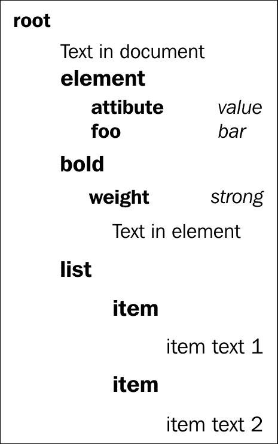

# 七、数据序列化

在本章中，我们将介绍以下食谱:

*   将 JSON 反序列化为 JavaScript 对象
*   将对象序列化为 JSON 字符串
*   解码 base64 编码的二进制数据
*   将二进制数据或文本编码为 base64
*   将二进制数据序列化为 JSON
*   序列化和反序列化 cookies
*   将表单序列化为请求字符串
*   用 DOMParser 读取 XML 文档
*   在客户端序列化 XML 文档

# 简介

数据存储和传输的基本概念之一是序列化。我们将通过一些方法来准备数据，以便发送到另一个环境或永久保存。除此之外，我们将看到读取由另一个计算机环境序列化的一些数据的方法。

# 将 JSON 反序列化为 JavaScript 对象

所有情况中最简单的就是将 JSON 数据读入 JavaScript 对象。以这种方式格式化的数据是轻量级的，此外，它还是 JavaScript 的子集。有几种方法可以读取这些数据，我们将看看如何通过创建一个简单的 JSON 片段，然后将其转换为 JavaScript 对象来实现这一点。

## 怎么做...

这个例子足够简单，可以是一个 HTML 文件中的脚本，甚至可以在 firebug 或开发人员工具控制台上执行:

1.  我们首先需要以下序列化的 JSON 字符串:

    ```html
    var someJSONString = '{"comment":"JSON data usually is retrieved from server","who":"you"}';
    ```

2.  在不添加外部 JavaScript 依赖的情况下，很少有不同的方法可以做到这一点，一种是通过使用`eval`，另一种是通过使用`json`:T2
3.  此后，我们将尝试访问反序列化对象的一些属性:

    ```html
         document.writeln(someJSONString.who + " access without conversion <br/>" );
         document.writeln(jsonData.who + " with parse <br/>" );
         document.writeln(evalData.who + " with eval <br/>");
    ```

执行时，第一个`document.writeln`方法应该返回`undefined`，因为我们试图访问尚未反序列化的 JSON 字符串的属性，而在另外两个方法中，我们应该得到您想要的值。

## 它是如何工作的...

JSON 是独立于语言的格式，但同时 JSON 是 JavaScript，这意味着我们可以使用`eval`函数。现在它非常简单，因为这是一个顶级函数，它接受字符串作为输入，将得到评估。如果作为参数传递的字符串有 JavaScript 语句`eval`将执行这些语句。这可能是一件危险的事情，因为它会执行传递给它的代码。如果它被用在你不信任的代码上，那么你可能会被潜在的恶意第三方利用。对于`eval`的大多数用例，已经有了很好的替代方案。当我们使用`eval`时，调试也会非常困难，所以这是我们在大多数情况下应该避免的。

说到 JSON 解析，在大多数现代浏览器上，我们可以使用已经添加到 JavaScript 1.7 中的`JSON.parse(text[, reviver])`语句。该函数将一个字符串解析为 JSON，并有一个可选参数`reviver`，这是一个可以转换解析产生的值的函数。例如，如果我们想在每个值上附加`"a?"`，我们可以定义如下:

```html
    var transformed = JSON.parse(someJSONString, function(key, val) {
      if (key === "") return val;
      return val +' a?';
     });
```

现在，如果我们尝试访问`transformed.who`，我们将获得`"you a?"`。最终对象将包含以下信息:

```html
{comment: "JSON data usually is retrieved from server a?", who: "you a?"}
```

这意味着被解析的原始字符串的每个值都有一个附加到它的值`'a?'`，并且给定迭代的键取值`comment`和`who`。

如果`reviver`函数为给定值返回`undefined`或`null` ，该属性将被删除，因此可以用作过滤机制。

## 还有更多...

如果旧的浏览器不支持 JSON，会发生什么。有两个简单的选项，我们可以只包含 JSON 2 或 JSON 3:

```html
   <script src="//cdnjs.cloudflare.com/ajax/libs/json3/3.2.4/json3.min.js"></script>
   <script src="//cdnjs.cloudflare.com/ajax/libs/json2/20121008/json2.js"></script>
```

JSON 3 是一个 polyfill，它兼容几乎所有的 JavaScript 平台，在某种程度上，它是 JSON 2 的较新实现，这是我们应该使用的。有几个不一致和特殊的情况没有被 JSON 2 正确处理，尽管在编写时旧版本更为普遍。此外，JSON 3 解析器不使用`eval`或`regex`，这使得它更加安全，并在移动环境中给它带来了性能优势，如果这一点非常重要的话。

如果您的项目中已经有了可以使用的 jQuery`jQuery.parseJSON( json )`相似性原型 JS 有自己的实现`String#evalJSON()`。

### 类型

一个常见的错误是使用单引号而不是双引号。JSON 的大多数实现不允许使用单引号，这可能是为了简单起见。引用道格拉斯·克洛克福特的话:JSON 的设计目标是最小化、可移植、文本化和 JavaScript 的子集。为了进行互操作，我们越不需要达成一致，我们就越容易进行互操作。

# 将对象序列化为 JSON 字符串

与前面的方法相反的是将 JavaScript 对象序列化为 JSON 字符串。同样，关于让浏览器支持 JSON 的相同规则也适用，但这在大多数浏览器中并不是问题。一种方法是手动创建字符串，但这只是一种容易出错和混乱的浏览器的方法，所以我们将尝试一些可用的方法。

## 怎么做...

在下面的例子中，我们只使用了 JavaScript，所以我们可以把它放在 HTML 文件的一个简单的脚本标签中:

1.  首先需要数据以便将其序列化为字符串，因此我们将创建一个简单的 JavaScript 对象:

    ```html
        var someJSON = {
          "firstname":"John",
          "lastname":"Doe",
          "email":"john.doe@example.com"
         };
    ```

2.  我们创建了另一个对象，它将具有`toJSON()`功能:

    ```html
        var customToJSON = {
          "firstname":"John",
          "lastname":"Doe",
          "email":"john.doe@example.com",
          toJSON: function () {
          return {"custom":"rendering"};
          }
        };
    ```

3.  为了将 JavaScript 对象转换成字符串，我们将使用`JSON.stringify(value [, replacer [, space]])`函数:

    ```html
         var jsonString = JSON.stringify(someJSON);
         var jsonStringCustomToJSON = JSON.stringify(customToJSON);
    ```

4.  之后，我们将尝试相同函数的其他参数，对于`replacer`，我们将创建一个允许属性的列表，对于第三个参数，我们将尝试两个不同的选项:

    ```html
        var allowedProperties=["firstname","lastname"];
         var jsonCensured = JSON.stringify(someJSON , allowedProperties);
         var jsonCensured3Spaces = JSON.stringify(someJSON,allowedProperties,30);
         var jsonCensuredTab = JSON.stringify(someJSON,allowedProperties,"\t");
    ```

5.  我们可以简单地将输出写入文档对象:

    ```html
         document.writeln(jsonString + "  <br/>" );
         document.writeln(jsonStringCustomToJSON + "  <br/>" );
         document.writeln(jsonCensured + "  <br/>" );
         document.writeln(jsonCensured3Spaces + "  <br/>" );
         document.writeln(jsonCensuredTab + "  <br/>" );
    ```

## 它是如何工作的...

JSON `stringify`方法接受三个参数，其中最后两个是可选的。当仅使用一个参数时，它将从 JavaScript 对象中返回一个 JSON 字符串，其中如果对象中的某些属性未定义，那么当在数组中找到时，它将被省略或审查为空。如果在对象内部定义了一个`toJSON()`函数，则该函数用于选择将会转换的对象。这允许对象定义它们自己的 JSON 表示。在我们的案例中，`JSON.stringify(customToJSON)`的评估版本如下:

```html
{"custom":"rendering"} 
```

`stringify`的全功能定义如下:

```html
JSON.stringify(value[, replacer ] [, space])
```

我们可以使用`replacer`来过滤将被白色列出的属性。`replacer`可以是一个由`String`和`Number`对象组成的数组，用作允许的参数列表。

可以添加`space`参数，并且该参数具有类型为`String`或`Number`的值。如果是`Number`，则表示用作空格的空格字符数。在我们的例子中，如果您在浏览器中打开生成的 HTML，就可以看到这一点。如果`space`参数是`String`，那么传递的值的前 10 个字符被用作创建 JSON 的空格。

需要注意的一点是，对于非数组对象，序列化属性的顺序不能保证。序列化对象后，不能依赖对象内属性的顺序。因此，序列化可能不是流程最准确的定义，所以这就是为什么通常称之为字符串化。

## 还有更多...

同样，对于不支持 JSON 的老用户代理，我们也有类似的问题。对于这种用途，我们推荐 JSON 3:

```html
   <script src="//cdnjs.cloudflare.com/ajax/libs/json3/3.2.4/json3.min.js"></script>
```

此外，您不应该使用`stringify`函数进行调试，因为正如我们前面提到的它以特定的方式转换未定义的对象，所以这样做可能会得到错误的结论。这个错误的结论是只和顺序和 JSON 兼容相关，但是用它进行对象的通用调试是完全有效的。

# 解码 base64 编码的二进制数据

直到最近，JavaScript 还没有任何对存储二进制数据类型的本地支持。大多数二进制数据是作为字符串处理的。无法使用字符串(例如图像)处理的二进制数据被作为 base64 编码字符串处理。

### 注

Base64 是一种通过将字节组转换为 base64 数字组来编码二进制数据的方法。目标是通过仅使用不会以特殊方式解释的可打印字符来安全地表示二进制数据，从而避免数据丢失。

HTML5 对二进制数据有更好的支持，可以使用`ArrayBuffer`类和类型化数组类进行存储和操作。但是，遗留库和 API 可能仍然使用 base64 数据。为了在现代浏览器中进行更有效的二进制处理，我们可能希望将这些数据转换成数组缓冲区。

在本食谱中，我们将编写一个转换函数，将 base64 编码的字符串转换为数组缓冲区。

## 做好准备

要编写这个函数，首先我们需要了解 base64 编码是如何工作的。

访问二进制数据的通常方式是一次一个字节。一个字节有 8 位。如果我们试图给一个字节分配一个数字解释，它将能够代表 2 个^ 8 = 256 个不同的数字。换句话说，一个字节可以代表一个基数为 256 的数字。

我们需要将二进制数据表示为 64 位基数。它们由字母`A-Z`、`a-z`、`0-9`、`+`和`/`表示，总共 64 个字符，足以存储每个字符 6 位数据。为此，我们必须从二进制数据中提取 6 位组。6 位和 8 位的最小公分母是 24 位，这意味着每组 3 个字节由一组 4 个 64 位数字表示。

我们可以得出结论，解码过程将采用所有四组 base64 编码数字，并从每组中产生 3 个字节。

但是如果字节总数不能被 3 整除会发生什么呢？Base64 使用一个附加字符“`=`”(等号)来表示最后一个组中缺少的字节数。字符串末尾添加一个字符，表示最后一组少了 1 字节(最后一组只有两个)。当少了 2 个字节(最后一组中只有一个字节)时，会添加两个字节。

现在我们已经了解了 base64 的工作原理，我们准备编写一个 base64 解码器。

## 怎么做...

我们开始吧。

1.  创建一个包含文本字段的`index.html`页面，输入`text`和两个`div`元素。其中一个元素将用于显示 base64 字符串，而另一个元素将用于显示转换字节的十进制值:

    ```html
    <!DOCTYPE HTML>
    <html>
        <head>
          <title>Text to base64 and binary</title>
       </head>
       <body>
       <input type="text" id="text" value="Enter text here">
       <div id="base64"></div>
       <div id="bytes"></div>
       <script src="http://ajax.googleapis.com/ajax/libs/jquery/1.8.2/jquery.min.js"></script>
       <script type="text/javascript" src="atobuf.js"></script>
       <script type="text/javascript" src="example.js"></script>
       </body>
    </html>
    ```

2.  创建`example.js`并在用户输入文本时将应用更改的代码放在页面上:

    ```html
    $(function() {
        $("#text").on('keyup keypress', function() {
          var base64 = btoa($(this).val()),
          buf = atobuf(base64),
          bytes = new Uint8Array(buf),
          byteString = [].join.call(bytes, ' ');
          $("#base64").text(base64);
          $("#bytes").text(byteString);
        });
    }
    ```

3.  创建 `atobuf.js`，它导出一个采用 base64 字符串的函数，并返回一个带有解码字节的 ArrayBuffer 对象:

    ```html
    (function(exports) {
        var key = {};
        'ABCDEFGHIJKLMNOPQRSTUVWXYZabcdefghijklmnopqrstuvwxyz 0123456789+/='
            .split('').forEach(function(c, i) {
                key[c] = i;
            });

        exports.atobuf = function atobuf(b64str) {
            var b64l = b64str.length,
                bytes = b64l / 4 * 3;
            if (b64str[b64str.length - 1] == '=') bytes -= 1;
            if (b64str[b64str.length - 2] == '=') bytes -= 1;

            var buf = new ArrayBuffer(bytes),
                arr = new Uint8Array(buf),
                at = 0;

            for (var k = 0; k < bytes; k+=3) {
                var e1 = key[b64str[at++]],
                    e2 = key[b64str[at++]],
                    e3 = key[b64str[at++]],
                    e4 = key[b64str[at++]];

                var b1 = (e1 << 2) | (e2 >> 4),
                    b2 = ((e2 & 0xF) << 4) | (e3 >> 2),
                    b3 = ((e3 & 0x3) << 6) | e4;

                arr[k] = b1;
                if (k+1<bytes) arr[k+1] = b2;
                if (k+2<bytes) arr[k+2] = b3;
            }

            return buf;
        };

    }(typeof(exports) !== 'undefined' ? exports : this));
    ```

## 它是如何工作的...

`index.html`和`example.js`中的代码相当简单，我们设置了一个页面来轻松预览和测试转换函数的结果。为了存储字节，我们在传递的缓冲区上创建一个`Uint8Array`对象。这是 HTML5 中引入的一种新的数组类型，它使我们能够将`ArrayBuffer`对象中的单个字节作为无符号 8 位整数读取。

值得注意的一点是一个`Uint8Array`对象没有`join`方法。这就是为什么我们通过编写`[].join.call(bytes, ' ')`从空数组中“借用”该方法，它调用`join`方法(通常属于空数组)，就好像它是对象字节的方法一样。

在`atobuf.js`中，我们将 `atobuf`函数导出为 CommonJS 模块(通过附加到`exports`对象)或附加到全局对象的函数。

为了加快转换速度，我们预定义了一个转换字典，将字符映射到它们相应的数值。


让我们看看位操作代码是如何工作的。编码值有 6 位，而解码值有 8 位。阅读说明时，请注意位是从右向左枚举的，位 0 是最右边的位，位 1 是第二个最右边的位，依此类推。

对于第一个解码字节，我们需要存储在第一个编码值中的 6 位，作为解码值中的第 2 到第 7 位。所以我们把它们向左移动了两个位置。对于第一个解码值，我们还需要第二个编码值的第 4 位和第 5 位，即第 0 位和第 1 位。这意味着我们需要将它们向右移动四个位置。

对于第二个字节，我们需要第二个编码值的第 0 到 3 位，作为解码值的第 4 到 7 位。为此，我们使用二进制“与”运算将第 4 位和第 5 位清零，并将其余四位向左移动。我们还需要第三个编码值的第 2 位到第 5 位，即第 0 位到第 3 位，因此我们需要将它们向右移动两个位置。

对于第三个字节，我们需要第三个编码值的第 0 到 1 位，位于第 6 到第 7 位，这意味着使用“与”将其余部分清零，并向左移动六个位置。最后一个编码值的位都在第三个字节的正确位置，所以我们按原样取它们。

# 将二进制数据或文本编码为 base64

HTML5 对二进制数据的支持是通过一个`ArrayBuffer`对象，相关的类型数组。当传输数据时，通常的方法是通过 base64。这主要用于处理文本数据，但是随着数据 URI 的使用的兴起，base64 变得越来越相关。在这个食谱中，将看到如何使用这个方案编码数据。

## 怎么做...

我们将创建一个 HTML 文件，其中我们将使用`canvas`元素，它将生成一些数据，这些数据将被编码为 base64:

1.  为了有二进制数据，我们将使用 canvas 创建一个图像，因此我们添加了一个`canvas`元素:

    ```html
    <!doctype html>
    <html>
      <head>
        <meta charset="utf-8">
        <title>Binary data to Base64</title>
      </head>
      <body>
        <canvas id="myCanvas" width="100" height="100"></canvas>
    ```

2.  我们可以有一些输入字段，可以用来显示文本编码:

    ```html
        <input type="text" id="text" placeholder="Insert some text">
    ```

3.  在该元素之后，我们可以放置两个输出元素，一个用于来自图像的编码二进制数据，另一个用于编码文本:

    ```html
        <div>
          <b> Text Base64:</b>
          <output id="content"></output>
        </div>
        <hr />
        <div>
          <b> Image Base64:</b>
          <output id="imgBase"></output>
        </div>
    ```

4.  然后我们包含了对 jQuery 的依赖和`example.js` :

    ```html
        <script src="http://ajax.googleapis.com/ajax/libs/jquery/1.8.2/jquery.min.js"></script>
        <script type="text/javascript" src="example.js"></script>
    ```

5.  Since we have included the `example.js` file, we can then proceed to creating logic for encoding the data. In order to have some binary data, we will create an image of a square with canvas:

    ```html
      var canvas = $('#myCanvas')[0],
      context = canvas.getContext('2d');
      context.beginPath();
      context.rect(0, 0, 100, 100);
      context.fillStyle = 'green';
      context.fill();
      var imgdata = context.getImageData(0,0, 200, 200);
    ```

    ### 注

    目前`CanvasRenderingContext2D`的方法定义可以在 WHATWG:[http://www . WHATWG . org/specs/web-apps/current-work/multipage/the-canvasrenderingcontext2d](http://www.whatwg.org/specs/web-apps/current-work/multipage/the-canvas-element.html#canvasrenderingcontext2d)上找到。

6.  为了创建 base64 编码的数据，我们要将数组转换为字符串，这样我们就可以定义如下函数:

    ```html
    function arrayToString(inputArray){
        var stringData = '';
        var bytes = new Uint8ClampedArray(inputArray);
        var length = bytes.byteLength;
        for (var i = 0; i < length; i++) {
          stringData += String.fromCharCode(bytes[i]);
        }
        return stringData;
      }
    ```

7.  现在我们可以调用该函数，并使用内部`btoa()`方法来接受将被编码的字符串:

    ```html
      var stringData = arrayToString(imgdata.data);
      var b64encoded = btoa(stringData);
    ```

8.  为了证明我们现在可以返回，我们将使用`atob`来解码 base64 编码的字符串数据:

    ```html
      var originalStringData = atob(b64encoded);
    ```

9.  现在为了从解码后的字符串数据返回到原始二进制数组，我们需要定义如下函数:

    ```html
      function stringToArray(raw){
       var rawLength = raw.length;
       var array = new Uint8ClampedArray(new ArrayBuffer(rawLength));
        for(i = 0; i < rawLength; i++) {
          array[i] = raw.charCodeAt(i);
        }
       return array;
      }
    ```

10.  之后，我们可以在解码数据上调用该函数:

    ```html
    var originalArray = stringToArray(originalStringData);
    ```

11.  我们将把 base64 编码的字符串打印到页面上:

    ```html
      $("#imgBase").text(b64encoded);
    ```

12.  由于 base64 算法所做的某些假设，UTF 最初不受支持。对此有一个变通办法，由约翰·桑德斯特伦创造，它利用标准函数并使 UTF 成为可能:

    ```html
      function utf8ToB64(str) {
        return window.btoa(unescape(encodeURIComponent(str)));
      }

      function b64ToUtf8(str) {
        return decodeURIComponent(escape(window.atob(str)));
      }
    ```

13.  这只是我们对文本数据感兴趣，所以我们可以通过连接输入字段和输出标签来尝试，在输出标签中我们将有 base64 编码的文本:

    ```html
      $("#text").keyup(function(e) {
        var currentValue = $(this).val();
        $("#content").val(utf8ToB64(currentValue));
      });
    ```

## 它是如何工作的...

现代浏览器支持`atob("base64encoded")`和`btoa("stringToBeEncoded")`。这些方法允许对 base64 字符串进行编码和解码。我们使用`btoa()`对字符串数据进行编码，得到的结果是 ASCII 字符`A-Z,a-z,0-9`、和符号`(/,+,=)`，使得数据便于传输。数据范围的限制是有代价的，编码的数据现在比原始的二进制流大了大约 33%的开销。另一方面，编码后的数据通常更具可压缩性，因此 gzip 或多或少会放大。

### 注

JavaScript 类型的数组提供了一种比使用标准类型更有效地访问原始二进制数据的方法。所有现代浏览器和 IE 10 都支持它们。关于类型化数组的更多信息，可以在 MDN:[https://developer . Mozilla . org/en-US/docs/JavaScript/Typed _ arrays](https://developer.mozilla.org/en-US/docs/JavaScript/Typed_arrays)上找到。

为了测试二进制数据编码，我们采用了从 HTML 画布生成的数组。为了在那里检索二进制数组表示，我们使用了以下语句:

```html
context.getImageData(0,0, 200, 200);
```

这将返回包含属性宽度、高度和数据的`ImageData`对象。数据属性表示为一个`Uint8ClampedArray`对象。这些类型的数组类似于标准的`Array`对象，其中每一项都是一个 8 位(1 字节)无符号整数。存储在该数组中的所有值都在 0 到 255 的范围内，这非常适合颜色。在我们的例子中，我们可以通过`console.log()`记录来查看数组中存储的值，我们得到的值如下:

```html
 [0,128,0,255,0,128,0,255 …]

```

0 代表红色，128 代表绿色，第三个 0 代表蓝色，255 代表不透明度。因为我们想要将数组的数据编码为 base64，所以我们不能简单地调用`btoa(theArray)`，因为我们只存储`toString`值，而不是整个数组:

```html
[Object Uint8ClampedArray]

```

### 注

如果我们将`Uint8array`与`Uint8ClampedArray`进行比较，主要区别是当插入的值超出范围时，第一个使用模缩短，而被夹紧的一个很好地夹紧了这些值。例如，如果我们将值 300 设置为 255，那么对于`Uint8ClampedArray`它将变为 255，但是对于另一个将变为 45。类似地，值-1 将被箝位到 0。有关`Uint8ClampedArray`的更多信息，请访问:

[http://www . khronos . org/registry/typedarray/specs/latest/# 7.1](http://www.khronos.org/registry/typedarray/specs/latest/#7.1)

我们添加`arrayToString`的主要原因是为了给我们创建一个字符串，我们可以在`btoa`中后期使用。同样，我们需要`stringToArray`来扭转这种转变。

说到文字核心功能`btoa()/atob()`没有支持 Unicode。如果我们尝试转换大于`"\u0100"`值的字符，我们将得到:

```html
Error: InvalidCharacterError: DOM Exception 5

```

为了解决这个问题，我们增加了方法`utf8ToB64()`和`b64ToUtf8()`。

### 注

这两个是 Johan sundstrom 做的聪明的黑客攻击，是 MDN 推荐的修复。更多信息可从[http://ecmanaut . blogspot . com/2006/07/编解码-utf8-in-javascript.html](http://ecmanaut.blogspot.com/2006/07/encoding-decoding-utf8-in-javascript.html) 获取。

黑客利用了标准函数对`encodeURIComponent()/decodeURIComponent()`和`escape()/unescape()`。

`encodeURICompoenent`和`unescape`的这种组合是如何工作的？

下面是这个方法如何工作的一个例子:

```html
 > encodeURICompoenent(" ");
 "%20"

```

我们得到的结果是一个百分比编码的字符串，其中 UTF-8 字符被替换为适当的百分比表示。现在我们可以只使用`encodeURIComponent`，因为百分比编码只使用 ASCII 字符:

```html
> "\u2197"
"↗"
> encodeURIComponent("\u2197")
"%E2%86%97"
> btoa(encodeURIComponent('\u2197'));
"JUUyJTg2JTk3"
```

但是这种方法有一个缺点，那就是产生的百分比编码字符串比初始字符串大得多，而且由于 base64 增加了额外的开销，它很容易变得很大。

`escape`和`unescape`函数不推荐使用，因为它们不适用于非 ASCII 字符，但在我们的情况下，输入是有效的，因此可以使用。至于未来的版本，它们不是标准的一部分，但它们可能会保留下来。`unescape`函数返回指定十六进制编码值的 ASCII 字符串。使用它的好处是现在我们有了一个更小的字符串表示。这个黑客的另一个伟大之处在于，它使用浏览器可用的多种编码功能来扩展标准功能。

## 还有更多...

说到用户代理支持，IE 是目前唯一还没有包含`btoa()`和`atob()`的浏览器，但这仅适用于 IE 10 之前的版本。为了在不受支持的用户代理上启用它，我们可以使用 polyfill。这个有几种不同的聚合填充，但是我们可以用一个叫做`base64.js`、([https://bitbucket.org/davidchambers/base64.js)](https://bitbucket.org/davidchambers/base64.js))的。

有一个有趣的异步资源加载器叫做`yenope.js`，它非常快，并且允许自定义检查。如果我们想包含`base64.js`我们可以测试所需功能的存在，如果不存在，那么它将自动包含它。

```html
yepnope({
    test: window.btoa && window.atob,
    nope: 'base64.js',
    callback: function () {
       //safe to use window.btoa and window.atob
    }
});
```

### 注

Yepnope 是众多条件资源加载器中的一种，但它是简单的一种。`yepnope`功能是整个装载机的核心。因此，它非常小，集成在 Modernizer 中；更多信息可在[http://yepnopejs.com/](http://yepnopejs.com/)找到。

# 将二进制数据序列化为 JSON

在使用 REST API 的时，如果需要将二进制数据作为 JSON 的一部分，那么最简单的方法之一就是使用 base64。图像和类似的资源应该很可能作为单独的资源存在，但是它们也可以是 JSON 文档的一部分。在本食谱中，我们将介绍一个在 JSON 文档中包含图像的简单示例。

## 怎么做...

我们将从一个`canvas`元素中生成一些二进制数据，并将其序列化为 JSON:

1.  我们从创建一个 HTML 文件开始，在这里我们可以放置一个简单的`canvas`，一个用于输出的`div`元素，并包括 jQuery 以及随后将创建的脚本:

    ```html
    <!doctype html>
    <html>
      <head>
        <meta charset="utf-8">
        <title>Binary data to json</title>
        <style type="text/css">
          div {
            word-wrap: break-word;
          }
        </style>
      </head>
      <body>
        <canvas id="myCanvas" width="75" height="75"></canvas>
        <hr />
        <div>
          <output id="generatedJson"> </output>
        </div>
        <script src="http://ajax.googleapis.com/ajax/libs/jquery/1.8.2/jquery.min.js"></script>
        <script type="text/javascript" src="example.js"></script>
      </body>
    </html>
    ```

2.  在 `example.js`脚本中，我们可以在`canvas`元素上创建一个简单的圆:

    ```html
      var canvas = $('#myCanvas')[0],
          context = canvas.getContext('2d');
      context.beginPath();
      context.arc(50, 50, 20, 0, Math.PI*2, true);
      context.closePath();
      context.fillStyle = 'green';
      context.fill();
     var imgdata = context.getImageData(0,0, 50, 50);
    ```

3.  然后我们定义相同的`arrayToString`函数，我们在*中使用该函数序列化 base64* 部分中的二进制数据或文本:

    ```html
      function arrayToString(inputArray){
        var stringData = '',
        len = inputArray.byteLength;
        for (var i = 0; i < len; i++) {
          stringData += String.fromCharCode(inputArray[i]);
        }
        return stringData;
      }
    ```

4.  然后我们对数据进行编码，并创建一个 JavaScript 对象，同时还创建两个数据 URI 形成`canvas`元素，一个`jpeg`，另一个`png` :

    ```html
      var imageEncoded = btoa(arrayToString(imgdata.data));
     var jsObject = {
        "name":"pie chart or not a pie...chart",
        "dataURL" : {
          "jpeg": canvas.toDataURL('image/jpeg'),
          "png": canvas.toDataURL('image/png')
        },
        "image" : imageEncoded
      };
    ```

5.  为了创建 JSON 对象，我们可以使用`JSON.stringify`然后将结果打印到`generatedJson` div:

    ```html
     var jsonString = JSON.stringify(jsObject, null , 2);
      $("#generatedJson").text(jsonString);
    ```

## 它是如何工作的...

代码与前面的配方非常相似，我们使用画布的 2D 上下文创建了一个简单的圆:

```html
  context.beginPath();
  context.arc(50, 50, 20, 0, Math.PI*2, true);
  context.closePath();
```

然后，我们从图像中获取二进制数据，并应用与*相同的逻辑，将二进制数据或文本编码到 base64* 配方中。一个特殊的特性是使用数据 URI，它可以简单地以指定的格式创建 base64 编码的图像渲染。在我们的例子中，我们在`jpeg`和`png`中创建了一个渲染。如果您复制出

```html
  "dataURL" : {
      "jpeg": "copy data rendered here",
      "png":"or copy data from here"
    }
```

并将其粘贴到浏览器的 URL 选择中，它将呈现图像。URI 数据将在标题为*数据存储*的章节中详细介绍。

## 还有更多...

base 64 编码可以与 XML 一起使用来存储更复杂的数据或二进制数据。因为编码的字符基数不干扰解析，所以不需要 CDATA 部分。

有许多其他格式可以与服务器交换二进制数据，如 BSON、Base32 或黑森。Base64 是最常用的，因为它非常简单，易于集成。

base64 的一个很好的用法是将文本存储到一个网址参数中，使文本易于表示和重建，您可以在 [http://hashify.me](http://hashify.me) 上看到。

# 序列化和反序列化 cookies

尽管 HTML5 取得了所有的进步，浏览器仍然有一个非常奇怪的 cookie 应用编程接口。它的工作方式容易出错，并且不符合 JavaScript 的正常语义。

全局 `document`对象有一个`cookie`属性，如果给它分配了一个字符串，它会神奇地将指定的 cookie 添加到 cookie 列表中。当尝试读取 cookie 时，将返回包含所有 cookie 的不同值。

如果没有包装器，这个应用编程接口就不是很有用。在这个食谱中，我们将把这个应用编程接口包装在一个真正有意义的包装器中。我们将通过制作一个表单页面来测试这个包装器，该表单页面在每次修改时都会保存自己两分钟(在页面重新加载后保存数据)。

## 做好准备

让我们来看看`document.cookie`是如何工作的。我们可以如下设置 cookie:

```html
document.cookie = "name=test; expires=Fri, 18 Jan 2023 00:00:00 GMT; path=/";
```

这为当前网站的整个域名设置了一个名为 test 的 cookie，将于 2023 年 1 月 18 日到期。现在如果我们试着从`document.cookie`读取，我们会得到“`name=test`”，这意味着所有额外的数据都被剥离了。如果我们继续添加另一个 cookie:

```html
document.cookie = "otherName=test; expires=Fri, 18 Jan 2023 00:00:00 GMT; path=/"
```

然后尝试访问`document.cookie`，我们得到两个 cookies:

```html
"name=test; otherName=test"
```

要真正清除 cookie，我们需要在路径中设置`expires`日期，如下所示:

```html
document.cookie = "otherName=test; expires=Fri, 18 Jan 2000 00:00:00 GMT; path=/"
```

然后我们回到包含`"name=test"`的`document.cookie`。

最后，如果我们忽略`expires`日期，我们将获得一个 cookie，它将持续到用户关闭浏览器，或者直到我们通过设置过去的过期日期来清除它:

```html
document.cookie = "otherName=test; path=/"
```

但是如果值包含字符`;`会发生什么？cookie 值将在该字符处被切断，下一个参数(过期日期或路径)将被忽略。幸运的是，我们可以通过使用`encodeURIComponent`对值进行编码来解决这个问题。

现在我们有足够的信息来编写我们的 cookie 处理库。

## 怎么做...

让我们编写代码:

1.  在`index.html`中创建表单页面，它将包含三个文本字段，并包含我们的 cookie 包装脚本和表单保存脚本:

    ```html
    <!DOCTYPE HTML>
    <html>
    <head>
    <title>Cookie serialization</title>
    </head>
    <body>
    <form method="post">
        <input type="text" name="text1" value="Form data will be saved"><br>
        <input type="text" name="text2" value="in the cookie formdata"><br>
        <input type="text" name="text3" value="and restored after reload">
    </form>
    <script src="http://ajax.googleapis.com/ajax/libs/jquery/1.8.2/jquery.min.js"></script>
    <script type="text/javascript" src="cookie.js"></script>
    <script type="text/javascript" src="example.js"></script>
    </body>
    </html>
    ```

2.  创建`cookie.js`，实现并导出 cookie API。它将具有以下功能:
    *   `cookie.set` ( `name, value, options`):该函数设置 cookie 的值。该值可以是任意对象，只要它可以被`JSON.stringify`序列化。可用选项有`expires`、`duration`和`path`。

        ```html
        (function(exports) {

            var cookie = {};

            cookie.set = function set(name, val, opt) {
              opt = opt || {};
              var encodedVal = encodeURIComponent(JSON.stringify(val)),
              expires = opt.expires  ? opt.expires.toUTCString()
              : opt.duration ? new Date(Date.now()
                                             + opt.duration * 1000).toUTCString()
              : null;

              var cook = name +'=' + encodedVal + ';';
              if (expires) cook += 'expires=' + expires;
              if (opt.path) cook += 'path=' + opt.path;
              document.cookie = cook;
            };

            cookie.del = function(name) {
              document.cookie = name + '=deleted; expires='
              + new Date(Date.now() - 1).toUTCString();
            }
            cookie.get = function get(name) {
              var cookies = {};
              var all = document.cookie.split(';').forEach(function(cs) {
              var c = cs.split('=');
              if (c[1])
              cookies[c[0]] =
              JSON.parse(decodeURIComponent(c[1]));
              });
            if (name)
              return cookies[name]            
              else
              return cookies
            };

            exports.cookie = cookie;
        }(typeof(exports) !== 'undefined' ? exports : this));
        ```

3.  创建`example.js`来测试新的 cookie API。在文档加载时加载表单数据，更改时保存:

    ```html
    $(function() {
        var savedform = cookie.get('formdata');
        savedform && savedform.forEach(function(nv) {
          $('form')
          .find('[name="'+nv.name+'"]')
          .val(nv.value);
        });
        $('form input').on('change keyup', function() {
          cookie.set('formdata', $('form').serializeArray(),
          {duration: 120});
        });
    });
    ```

## 它是如何工作的...

我们的 API 实现了几个处理 cookies 的方便函数。

`cookie.set`功能允许我们设置一个饼干。它需要三个参数:名称、值和选项。

值用`JSON.stringify`序列化，然后用`encodeURIComponent`编码。因此，我们可以存储任何可以用`JSON.stringify`序列化的对象(然而，不同的浏览器有不同的大小限制)。

options 参数是一个可以包含三个属性的对象:过期、持续时间和路径。`expires`属性是 cookie 应该过期的日期。或者，可以提供`duration`-它是 cookie 应该持续的时间，以秒为单位。如果这两者都被忽略，cookie 将持续到当前浏览器会话结束。最后，`path`属性是指定 cookie 可用路径的字符串。默认为当前路径。

## 还有更多...

Cookies 不应用于存储大量数据。大多数浏览器将每个 cookie 的大小限制在 4 KB。一些浏览器将所有 cookies 的总大小限制为 4 KB。存储在 cookies 中的数据随着向服务器发出的每一个请求而传输，从而增加了带宽的总使用量。

对于较大的数据，我们可以使用本地存储来代替。更多信息可参见[第 10 章](10.html "Chapter 10. Data Binding Frameworks")、*数据绑定框架*。

请注意，当在本地文件系统上打开时，此示例不起作用。要使其工作，必须运行本地 HTTP 服务器。关于如何运行简单的 HTTP 服务器的更多信息，请参见附录。

# 将表单序列化为请求字符串

使用表单时，一个常见的任务是需要创建实际的请求字符串。有几种不同的方法可以做到这一点，想到的第一件事就是选择每个单独的表单元素并获取它的值，然后通过将名称属性附加到值来创建字符串。这非常容易出错，所以我们将使用`jQuery.serialize()`来看看更好的解决方案。

## 怎么做...

像往常一样，我们可以从 HTML 开始:

1.  首先，我们添加基本的`head`部分和一个输出元素，其中将显示生成的请求字符串:

    ```html
    <!doctype html>
    <html>
      <head>
        <meta charset="utf-8">
        <title>JavaScript objects to form data</title>
      </head>
      <body>
        <label><b>Generated string:</b></label>
        <output id="generated">none</output>
        <hr/>
        <output id="generatedJson">none</output>
        <hr/>
    ```

2.  然后我们可以继续创建一个简单的表单，在这里我们添加全名、电子邮件和敬畏百分比的输入:

    ```html
      <form id="theForm">
        <label>Full name</label>
        <input type="text" id="fullName" name="fullName" placeholder="Some Name">
        <label>Email address </label>
        <input type="email" id="email" name="email" placeholder="example@example.com">
        <label>Percent of awesomeness </label>
        <input type="number" id="awesomeness" name="awesomeness" value="50" min="1" max="100">
        <br/>
        <input type="submit">
      </form>
    ```

3.  在之后，我们可以将所需的 JavaScript 依赖项包含到 jQuery 和我们的`example.js`脚本中:

    ```html
     <script src="http://ajax.googleapis.com/ajax/libs/jquery/1.8.2/jquery.min.js"></script>
        <script src="example.js"></script>
    ```

4.  然后我们可以继续创建`example.js`文件，在该文件中，表单元素的每次更新都会被序列化:

    ```html
    $(function() {
    $("#theForm").keyup(function(){
        var theForm = $("#theForm"),
        parameterArray = theForm.serializeArray();
        $("#generated").text(theForm.serialize());
        $("#generatedJson").text(JSON.stringify(parameterArray));
       });
    });
    ```

## 它是如何工作的...

`.serialize()`函数将表单元素及其值转换为百分比编码的字符串。百分比编码通常被称为 URL 编码，是一种以 URI 友好方式表示信息的方式。因此，在使用的大多数表单中，它是一个核心部分，它有一个 MIME 类型`application/x-www-form-urlencoded`。

如果表单中有一个按钮，它将不会被视为生成的字符串的一部分，因为该按钮不是为了提交表单而被单击的。此外，复选框和单选按钮中的值只有在被选中时才是生成的字符串的一部分。

另一方面，如果我们需要一些 JSON 表示，那么我们可以使用`.serializeArray()`，一个将创建一个 JavaScript 数组的函数。有了这个元素数组后，我们可以使用`JSON.stringify()`创建一个 JSON。默认的 JSON 表示在大多数情况下可能不是很有用，但是我们可以很容易地重组和过滤元素。

`.serializeArray()`和`.serialize()`函数只保存 W3C([http://www.w3.org/TR/html401/interact/forms.html#h-17.13.2](http://www.w3.org/TR/html401/interact/forms.html#h-17.13.2))定义的“成功控件”，在这里您将获得相同的行为，就好像表单是通过点击按钮定期提交的一样。

## 还有更多...

首先要注意的是，来自文件选择元素的数据没有使用这两种方法进行序列化。为此目的和其他类似的用例，在`XMLHttpRequest Level 2`中引入了`FormData`对象。该对象允许创建一组键/值对，以便使用`XMLHttpRequest`发送。使用此方法创建的数据以与标准提交相同的方式发送，其中编码设置为`"multipart/form-data"`。

我们在的例子中看到，即使使用`.serializeArray()`，从表单元素创建 JSON 对象也会变得混乱。为了简化事情并能够直接从元素`form2js`、[中轻松创建更复杂的 JSON，创建了 https://github.com/maxatwork/form2js](https://github.com/maxatwork/form2js)。这个工作原理的一个小例子是创建一个简单的 person 对象:

```html
{
    "person" :
    {
        "contact" :
        {
            "email" : "test@example.com",
            "phone" : "0123456789"
        }
    }
}
```

为了实现这一点，我们只在`name`属性中创建定义，脚本处理其他一切:

```html
<input type="email" name="person.contact.email" value="test@example.com" />
<input type="text" name="person.contact.phone" value="0123456789" />
```

这个库有一个标准的 JavaScript 版本和一个 jQuery 插件。它还具有其他功能，例如具有对象数组或自定义字段处理程序。

# 用 DOMParser 读取 XML 文档

虽然`XMLHttpRequest`允许我们下载和解析 XML 文档，但有时我们可能希望手动解析 XML 数据文档。例如，手动解析将使能够让我们在页面内的`script`标签中包含任意的 XML 数据(例如，基于 XML 的模板)。这有助于减少发送到浏览器的请求数量。

在这个食谱中，我们将从一个`textarea`输入中读取一个简单的 XML 文档，并使用`DOMParser`解析它，然后将结果显示为一棵树。

## 怎么做...

让我们编写测试 HTML 页面和解析器:

1.  创建`index.html`，它应该包含一个用于输入 XML 的`textarea`元素(包括一个示例 XML 文档)，一个文档`body`对象的占位符，以及文档树的一些 CSS 样式:

    ```html
    <!DOCTYPE HTML>
    <html>
    <head>
    <title>Deserializing XML with DOMParser</title>
    <style type="text/css">
    div.children { padding-left: 3em; }
    h3 { padding:0; margin:0; }
    .children .text { padding-top: 0.5em; }
    .attribute .name { padding-left: 1.5em; width:5em;
        display:inline-block; font-weight:bold; }
    .attribute .value { padding-left: 1em; font-style:oblique; }
    </style>
    </head>
    <body>
    <textarea rows="11" cols="60">
    &lt;?xml version=&quot;1.0&quot; encoding=&quot;UTF-8&quot; ?&gt;
    &lt;root&gt;
        Text in document
        &lt;element attribute=&quot;value&quot; foo=&quot;bar&quot; /&gt;
        &lt;bold weight=&quot;strong&quot;&gt;Text in element&lt;/bold&gt;
        &lt;list&gt;
          &lt;item&gt;item text 1&lt;/item&gt;
          &lt;item&gt;item text 2&lt;/item&gt;
        &lt;/list&gt;        
    &lt;/root&gt;
    </textarea>
    <div id="tree">
    </div>
    <script src="http://ajax.googleapis.com/ajax/libs/jquery/1.8.2/jquery.min.js"></script>
    <script type="text/javascript" src="example.js"></script>
    </body>
    </html>
    ```

2.  创建`example.js` ，并添加解析文档并将其转换为 HTML 树的代码:

    ```html
    $(function() {
      function parseDocument(text) {
        function displayElement(e) {
          var holder = $("<div />").addClass('element');
          $("<h3 />").text(e.nodeName).appendTo(holder);
          if (e.attributes && e.attributes.length) {
            var attrs = $("<div />").addClass('attributes')
            .appendTo(holder);
            for (var a = 0; a < e.attributes.length; ++a) {
              var nameval = e.attributes[a];
              var attr = $("<div />").addClass('attribute')
              .appendTo(attrs);
              $('<span />').addClass('name')
              .text(nameval.name).appendTo(attr);
              $('<span />').addClass('value')
                            .text(nameval.value).appendTo(attr);
              }
            }
            if (e.childNodes.length) {
              var children = $("<div />").appendTo(holder)
              .addClass('children');
              for (var c = 0; c < e.childNodes.length; ++c) {
                var child = e.childNodes[c];
                if (child.nodeType == Node.ELEMENT_NODE)
                            displayElement(child).appendTo(children);
                        else if (child.nodeType == Node.TEXT_NODE
                              || chilc.nodeType == Node.CDATA_SECTION_NODE)
                            $("<div />").addClass('text')
                                .text(child.textContent)
                                .appendTo(children);
                    }
                }
                return holder;
            }
            var parser = new DOMParser();
            var doc = parser.parseFromString(text, 'application/xml');
            window.doc = doc;
            return displayElement(doc.childNodes[0]);
        }
        function update() {
          $('#tree').html('')
            parseDocument($('textarea').val()).appendTo('#tree');
        }
        update();
        $('textarea').on('keyup change', update);
    });
    ```

## 它是如何工作的...

为了解析一个 XML 文档，我们创建一个新的`DOMParser`对象并调用`parseFromString`方法。我们将文档类型指定为应用程序/XML–解析器还可以解析`text/html`并返回一个`HTMLDocument`元素，或者`image/svg+xml`返回一个`SVGDocument`元素。

生成的文档具有与`window.document`中找到的非常相似的应用编程接口(相同的 DOM 应用编程接口可用)。我们创建一个递归函数，迭代根元素的所有子元素并生成 HTML。它为元素名构造头，为属性名和值构造跨度元素，为文本节点构造 div 元素，并调用自己生成 HTML 来显示元素节点。结果是一个 DOM 树:



# 客户端 XML 文档的序列化

JSON 比 JavaScript 使用起来极其简单；已经有很多 REST 服务使用了 XML。在本食谱中，我们将创建一个简单的表单，该表单将使用用于 XML 的 DOM 应用编程接口来构建一个 XML 文档。

## 怎么做...

让我们开始吧:

1.  首先我们创建一个简单的 HTML 文档:

    ```html
    <!doctype html>
    <html>
      <head>
        <meta charset="utf-8">
        <title>Create XML from JavaScript objects</title>
      </head>
      <body>
        <output id="log"> </output>
    ```

2.  After this we are going to include a KML document inside the text, in a real life application this will probably get loaded by AJAX, but for simplicity we will add the data directly:

    ```html
      <kml id="test" >
        <Document>
          <name>Red Pyramid</name>
          <description><![CDATA[]]></description>
          <Style id="style1">
            <IconStyle>
              <Icon>
                <href></href>
              </Icon>
            </IconStyle>
          </Style>
          <Placemark>
            <name>Red Pyramid</name>
            <styleUrl>#style1</styleUrl>
            <Point>
              <coordinates>31.206320,29.808853,0.000000</coordinates>
            </Point>
          </Placemark>
        </Document>
      </kml>
    ```

    ### 注

    你可能已经注意到这个食谱中使用了 **KML** ( **钥匙孔标记语言** ) 。最初这是一个由谷歌收购的公司开发的格式，但现在它是一个国际开放标准。这种格式广泛用于描述地标和位置。更多信息请访问:

    [https://developers.google.com/kml/documentation/](https://developers.google.com/kml/documentation/)

3.  在这个块之后，我们可以包含 JavaScript `example.js` :

    ```html
        <script src="example.js"></script>
      </body>
    </html>
    ```

4.  我们将从头开始创建一个简单的 XML 文档，并将其序列化为字符串。该代码将简单地检索 HTML 文档的一部分，其中我们有 KML 数据，将其序列化为字符串，然后在文本区域显示数据:

    ```html
    ;(function() {
     var doc = document.implementation.createDocument("","root", null),
           node = doc.createElement("someNode");
      doc.documentElement.appendChild(node);

      document.getElementById('first')
      .appendChild(
        document.createTextNode(
          new XMLSerializer()
        .serializeToString(doc))
      );

      var kml = document.getElementById('test');
      document.getElementById('second')
      .appendChild(
        document.createTextNode(
          new XMLSerializer()
          .serializeToString(kml))
      );
    }());
    ```

## 它是如何工作的...

这个例子的核心是`XMLSerializer()`方法，可以用来把 DOM 子树或者整个文档转换成文本。大多数现代浏览器和 IE 9+都支持该对象，但是对于较旧的版本，您需要使用类似于以下的某种回退:

```html
function xmlStringify(someXML) {
  if (typeof XMLSerializer !== 'undefined') {
    return (new XMLSerializer()).serializeToString(someXML);
  }
  // fallback for IE
  if (someXML.xml) {
    return someXML.xml;
  }
  //Not supported
}
```

标准的 DOM 操作可以用来创建一个 XML 文档。同样的事情也适用于 jQuery，我们有现成的功能来创建文档。如果我们需要处理更大的文档或者用 XML 做大量的工作，事情只会变得更加复杂。如今大多数 REST 服务都有某种内容协商，所以通常 JSON 是一个可用的更好的选择。

## 还有更多...

还有一个名为 JXON([https://developer.mozilla.org/en-US/docs/JXON](https://developer.mozilla.org/en-US/docs/JXON))的功能，代表 JavaScript XML 对象标记法，是 JavaScript 中与创建和使用 XML 文档相关的 API 的通称。这基本上为 JSON 和 XML 之间的双向转换定义了一个约定。

在广泛使用 XML 的同时，XPath 可以成为你最好的朋友。它提供了一种非常灵活的方式来访问符合特定模式的文档的特定部分。

### 注

**XPath** **(XML 路径语言** ) 是一种在 XML 文档中选择节点的查询语言。很像 SQL，它提供了一定的计算功能。在[https://developer.mozilla.org/en-US/docs/XPath](https://developer.mozilla.org/en-US/docs/XPath)有大量的 MDN 文件，在[http://www.w3.org/TR/xpath20/](http://www.w3.org/TR/xpath20/)有大量的规格文件。