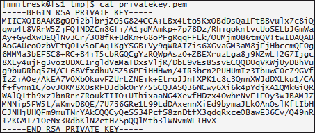
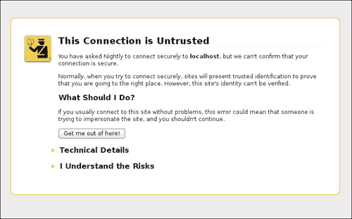

# 第八章。与服务器通信

在本章中，我们将涵盖以下主题:

*   创建一个获取 JSON 的 HTTP GET 请求
*   创建带有自定义标题的请求
*   版本控制你的应用编程接口
*   用 JSONP 获取 JSON 数据
*   从服务器读取 XML 数据
*   使用表单数据接口
*   向服务器发布二进制文件
*   用节点创建一个 SSL 连接
*   使用 Ajax 推送进行实时更新
*   使用网络套接字交换实时消息

# 创建一个获取 JSON 的 HTTP GET 请求

从服务器检索信息的基本方法之一是使用 HTTP GET。这种 RESTful 方式的方法应该只用于读取数据。所以，GET 调用永远不应该改变服务器状态。现在，这可能不是每个可能的情况都是如此，例如，如果我们在某个资源上有一个视图计数器，这是一个真正的变化吗？嗯，如果我们按照字面上的定义，那么是的，这是一个变化，但它远没有重要到被考虑在内。

在浏览器中打开一个网页会产生一个 GET 请求，但是我们通常希望有一种脚本化的方式来检索数据。这通常是为了实现**异步 JavaScript 和 XML** ( **AJAX** )，允许在不进行完整页面重载的情况下重新加载数据。尽管有这个名字，但不需要使用 XML，现在，JSON 是首选格式。

JavaScript 和`XMLHttpRequest`对象的结合提供了异步交换数据的方法，在这个食谱中，我们将看到如何使用普通 JavaScript 和 jQuery 为服务器读取 JSON。为什么使用普通的 JavaScript 而不是直接使用 jQuery？我们坚信 jQuery 简化了 DOM API，但是它并不总是对我们可用，此外，我们需要知道异步数据传输背后的底层代码，以便完全掌握应用程序是如何工作的。

## 做好准备

服务器将使用 Node.js 实现，关于如何在你的机器上安装 Node.js，如何使用 npm，请参考[附录 A](13.html "Appendix A. Installing Node.js and Using npm") 、*安装 Node.js 和使用 npm* 。在这个例子中，为了简单起见，我们将使用**restify**([http://mcavage.github.io/node-restify/](http://mcavage.github.io/node-restify/))，一个 Node.js 模块来创建正确的 REST web 服务。

## 怎么做...

让我们执行以下步骤。

1.  为了在服务器端脚本的根目录中包含`restify`到我们的项目中，使用以下命令:

    ```html
    npm install restify

    ```

2.  添加依赖项后，我们可以继续创建服务器代码。我们创建一个将由 Node.js 运行的`server.js`文件，并在它的开头添加`restify` :

    ```html
    var restify = require('restify');
    ```

3.  有了这个`restify`对象，我们现在可以创建一个服务器对象并为`get`方法添加处理程序:

    ```html
    var server = restify.createServer();
    server.get('hi', respond);
    server.get('hi/:index', respond);
    ```

4.  `get`处理程序回调一个名为`respond`的函数，所以我们现在可以定义这个函数来返回 JSON 数据。我们将创建一个名为`hello`的示例 JavaScript 对象，如果调用的函数包含请求的参数索引部分，它将从`"hi/:index"`处理程序中调用:

    ```html
     function respond(req, res, next) {
      console.log("Got HTTP " + req.method + " on " + req.url + " responding");
      var hello = [{
        'id':'0',
        'hello': 'world'
      },{
        'id':'1',
        'say':'what'
      }];
      if(req.params.index){
        var found = hello[req.params.index];
        if(found){
          res.send(found);
        } else {
          res.status(404);
          res.send();
        }
      };
      res.send(hello);
      addHeaders(req,res);
      return next();
    }
    ```

5.  我们在开始时调用的下面的`addHeaders`函数正在添加报头，以便能够访问从不同的域或不同的服务器端口提供的资源:

    ```html
    function addHeaders(req, res) {
      res.header("Access-Control-Allow-Origin", "*");
      res.header("Access-Control-Allow-Headers", "X-Requested-With");
     };
    ```

6.  标题的定义及其含义将在本章后面讨论。现在，假设它们支持使用 AJAX 从浏览器访问资源。最后，我们添加一段代码，将服务器设置为监听端口 8080:

    ```html
    server.listen(8080, function() {
      console.log('%s listening at %s', server.name, server.url);
    });
    ```

7.  要使用命令行启动服务器，我们键入以下命令:

    ```html
    node server.js

    ```

8.  如果一切顺利，我们会在日志中得到一条消息:

    ```html
    restify listening at http://0.0.0.0:8080
    ```

9.  然后，我们可以通过直接从浏览器访问我们定义的网址`http://localhost:8080/hi`来测试它，或者使用[附录 A](13.html "Appendix A. Installing Node.js and Using npm") 、*安装 Node.js 和使用 npm* 中讨论的一些工具来查看通信。

现在我们可以继续客户端的 HTML 和 JavaScript 了。我们将实现从服务器读取数据的两种方式，一种使用标准`XMLHttpRequest`，另一种使用`jQuery.get()`。请注意，并非所有功能都与所有浏览器完全兼容。

1.  我们创建了一个简单页面，其中有两个`div`元素，一个带有 ID `data`，另一个带有 ID `say`。这些元素将用作占位符，将数据从服务器加载到它们之中:

    ```html
        Hello <div id="data">loading</div>
        <hr/>
        Say <div id="say">No</div>s
        <script src="http://ajax.googleapis.com/ajax/libs/jquery/1.8.2/jquery.min.js"></script>
        <script src="example.js"></script>
        <script src="exampleJQuery.js"></script>
    ```

2.  在`example.js`文件中，我们定义了一个名为`getData`的函数，该函数将创建一个对给定`url`的 AJAX 调用，并在请求成功时进行回调:

    ```html
      function getData(url, onSuccess) {
        var request = new XMLHttpRequest();
        request.open("GET", url);
        request.onload = function() {
          if (request.status === 200) {
            console.log(request);
            onSuccess(request.response);
          }
        };
        request.send(null);
      }
    ```

3.  之后我们可以直接调用函数，但是为了演示调用发生在页面加载之后，我们会在三秒的超时后调用:

    ```html
     setTimeout(
        function() {
          getData(
            'http://localhost:8080/hi',
            function(response){
              console.log('finished getting data');
              var div = document.getElementById('data');
              var data = JSON.parse(response);
              div.innerHTML = data[0].hello;
            })
        },
        3000);
    ```

4.  jQuery 版本要干净得多，因为标准 DOM API 和事件处理带来的复杂性大大降低了:

    ```html
        (function(){
        $.getJSON('http://localhost:8080/hi/1', function(data) {
          $('#say').text(data.say);
     });
    }())
    ```

## 它是如何工作的...

一开始，我们用`npm install restify`安装了依赖；这足以让它工作，但是为了以更具表达性的方式定义依赖关系，npm 有一种指定它的方法。我们可以添加一个名为`package.json`的文件，这是一种打包格式，主要用于发布 Node.js 应用程序的详细信息。在我们的例子中，我们可以用流动的代码定义`package.json`:

```html
{
  "name" : "ch8-tip1-http-get-example",
  "description" : "example on http get",
  "dependencies" : ["restify"],
  "author" : "Mite Mitreski",
  "main" : "html5dasc",
  "version" : "0.0.1"
}
```

如果我们有一个这样的文件，npm 会在从放置`package.json`文件的目录中的命令行调用`npm install`后自动处理依赖项的安装。

`Restify`有一个简单的路由，其中函数被映射到给定 URL 的适当方法。对`'/hi'`的 HTTP GET 请求被映射到`server.get('hi', theCallback)`，在这里`theCallback`被执行，并且应该返回一个响应。

当我们有一个参数化的资源时，例如在`'hi/:index'`中，与`:index`相关的值将在`req.params`下可用。例如，在对`'/hi/john'`访问`john`值的请求中，我们简单拥有`req.params.index`。此外，索引的值将在传递给我们的处理程序之前自动得到 URL 解码。`restify`中请求处理程序的另一个值得注意的部分是我们在最后调用的`next()`函数。在我们的例子中，它通常没有太大的意义，但是一般来说，如果我们想要调用链中的下一个处理函数，我们负责调用它。在特殊情况下，也可以选择用触发自定义响应的`error`对象调用`next()`。

说到客户端代码，`XMLHttpRequest`是异步调用背后的机制，在调用最后一个参数值为`true`的`request.open("GET", url, true)`时，我们得到了真正的异步执行。现在你可能想知道为什么这个参数在这里，调用不是已经在加载页面之后完成了吗？确实如此，调用是在加载页面后完成的，但是，例如，如果参数设置为`false`，请求的执行将是一个阻塞方法，或者用外行的话来说，脚本将暂停，直到我们得到响应。这可能看起来像一个小细节，但它会对性能产生巨大影响。

jQuery 部分非常简单；有一个接受资源的 URL 值的函数，数据处理函数，以及一个在成功获得响应后被调用的`success`函数:

```html
jQuery.getJSON( url [, data ] [, success(data, textStatus, jqXHR) ] )
```

当我们打开`index.htm`时，服务器应该记录如下内容:

```html
Got HTTP GET on /hi/1 responding
Got HTTP GET on /hi responding

```

这里一个来自 jQuery 请求，另一个来自普通的 JavaScript。

## 还有更多...

**XMLHttpRequest 2 级** 是浏览器新增的改进之一，虽然不是 HTML5 的一部分，但仍然是一个重大的变化。级别 2 的更改有几个特性，主要是为了能够处理文件和数据流，但是我们已经使用了一个简化。早先我们必须使用`onreadystatechange`并通过所有的状态，如果`readyState`是`4`，等于`DONE`，我们可以读取数据:

```html
var xhr = new XMLHttpRequest();
xhr.open('GET', 'someurl', true);
xhr.onreadystatechange = function(e) {
  if (this.readyState == 4 && this.status == 200) {
   // response is loaded
  }
}
```

然而，在 2 级请求中，我们可以直接使用`request.onload = function() {}`而不检查状态。表中可以看到可能的状态:

<colgroup><col style="text-align: left"> <col style="text-align: left"> <col style="text-align: left"></colgroup> 
| 

州名

 | 

数值

 | 

描述

 |
| --- | --- | --- |
| `UNSENT` | `0` | 创建的对象 |
| `OPENED` | `1` | `open`方法被称为 |
| `HEADERS_RECEIVED` | `2` | 所有重定向都已完成，最终对象的所有标头现在都可用 |
| `LOADING` | `3` | 这种反应正在复苏 |
| `DONE` | `4` | 传输过程中收到数据或出现问题，例如无限重定向 |

还有一点需要注意的是`XMLHttpRequest`等级 2 在所有主流浏览器和 IE 10 中都支持；旧的`XMLHttpRequest`在旧版本的 IE(比 IE 7 旧)上有不同的实例化方式，我们可以通过新的`ActiveXObject("Msxml2.XMLHTTP.6.0");`通过 ActiveX 对象来访问它。

# 创建带有自定义标题的请求

HTTP 头是发送到服务器的`request`对象的一部分。它们中的许多给出了关于客户端的用户代理设置和配置的信息，因为这有时是描述从服务器获取的资源的基础。其中`Etag`、`Expires`、`If-Modified-Since`等几个与缓存密切相关，而其他如代表“不追踪”的`DNT`([http://www . w3 . org/2011/tracking-protection/drafts/tracking-DNT . html](http://www.w3.org/2011/tracking-protection/drafts/tracking-dnt.html))可能颇具争议。在本食谱中，我们将了解一种在服务器端和客户端代码中使用自定义`X-Myapp`头的方法。

## 做好准备

服务器将使用 Node.js 实现，关于如何在机器上安装 Node.js，如何使用 npm，可以参考[附录 A](13.html "Appendix A. Installing Node.js and Using npm") 、*安装 Node.js 和使用 npm* 。在这个例子中，同样为了简单起见，我们将使用 restify([http://mcavage.github.io/node-restify/](http://mcavage.github.io/node-restify/))。此外，监控浏览器和服务器中的控制台对于了解后台发生的情况至关重要。

## 怎么做...

1.  我们可以从在`package.json`文件中定义服务器端的依赖关系开始:

    ```html
    {
      "name" : "ch8-tip2-custom-headers",
      "dependencies" : ["restify"],
      "main" : "html5dasc",
      "version" : "0.0.1"
    }
    ```

2.  After that, we can call `npm install` from the command line that will automatically retrieve `restify` and place it in a `node_modules` folder created in the root directory of the project. After this part, we can proceed to creating the server-side code in a `server.js` file where we set the server to listen on port 8080 and add a route handler for `'hi'` and for every other path when the request method is `HTTP OPTIONS`:

    ```html
    var restify = require('restify');
    var server = restify.createServer();
    server.get('hi', addHeaders, respond);
    server.opts(/\.*/, addHeaders, function (req, res, next) {
      console.log("Got HTTP " + req.method + " on " + req.url + " with headers\n");
     res.send(200);
      return next();
    });
    server.listen(8080, function() {
      console.log('%s listening at %s', server.name, server.url);
    });
    ```

    ### 注

    在大多数情况下，当我们在 Restify 上编写应用程序的构建时，文档应该足够了，但是有时，查看一下源代码也是一个好主意。可以在[https://github.com/mcavage/node-restify/](https://github.com/mcavage/node-restify/)上找到。

3.  One thing to notice is that we can have multiple chained handlers; in this case, we have `addHeaders` before the others. In order for every handler to be propagated, `next()` should be called:

    ```html
    function addHeaders(req, res, next) {
      res.setHeader("Access-Control-Allow-Origin", "*");
      res.setHeader('Access-Control-Allow-Headers', 'X-Requested-With, X-Myapp');
      res.setHeader('Access-Control-Allow-Methods', 'GET, OPTIONS');
      res.setHeader('Access-Control-Expose-Headers', 'X-Myapp, X-Requested-With');
      return next();
    };
    ```

    `addHeaders`增加了访问控制选项，以实现跨来源的资源共享。**跨来源资源共享** ( **CORS** ) 定义了浏览器和服务器交互的方式，以确定是否应该允许请求。它比允许所有跨来源请求更安全，但比简单地允许所有请求更强大。

4.  After this, we can create the handler function that will return a JSON response with the headers the server received and a hello world kind of object:

    ```html
       function respond(req, res, next) {
      console.log("Got HTTP " + req.method + " on " + req.url + " with headers\n");
      console.log("Request: ", req.headers);
      var hello = [{
        'id':'0',
        'hello': 'world',
        'headers': req.headers
      }];
      res.send(hello);
      console.log('Response:\n ', res.headers());
      return next();
    }
    ```

    我们还将请求和响应头记录到服务器控制台日志中，以便查看后台发生的情况。

5.  对于客户端代码，我们需要一个简单的“普通”JavaScript 方法和 jQuery 方法，所以为了做到这一点，包括`example.js`和`exampleJquery.js`以及一些`div`元素，我们将使用它们来显示从服务器检索到的数据:

    ```html
         Hi <div id="data">loading</div>
        <hr/>
        Headers list from the request: <div id="headers"></div>
        <hr/>
        Data from jQuery: <div id="dataRecieved">loading</div>
        <script src="http://ajax.googleapis.com/ajax/libs/jquery/1.8.2/jquery.min.js"></script>
        <script src="example.js"></script>
        <script src="exampleJQuery.js"></script>
    ```

6.  添加标题的一个简单方法是在调用`open()` :

    ```html
      function getData(url, onSucess) {
        var request = new XMLHttpRequest();
        request.open("GET", url, true);
        request.setRequestHeader("X-Myapp","super");
        request.setRequestHeader("X-Myapp","awesome");
        request.onload = function() {
          if (request.status === 200) {
            onSuccess(request.response);
          }
        };
        request.send(null);
      }
    ```

    之后调用`XMLHttpRequest`对象上的`setRequestHeader`
7.  The `XMLHttpRequest` automatically sets headers, such as `"Content-Length"`,`"Referer"`, and `"User-Agent"`, and does not allow you to change them using JavaScript.

    ### 注

    更完整的标题列表及其背后的原因可以在 W3C 文档中找到。

8.  为了打印出的结果，我们添加了一个函数，将每个标题键和值添加到一个无序列表中:

    ```html
      getData(
        'http://localhost:8080/hi',
        function(response){
          console.log('finished getting data');
          var data = JSON.parse(response);
          document.getElementById('data').innerHTML = data[0].hello;
          var headers = data[0].headers,
              headersList = "<ul>";
          for(var key in headers){
            headersList += '<li><b>' + key + '</b>: ' + headers[key] +'</li>';
          };
          headersList += "</ul>";
          document.getElementById('headers').innerHTML = headersList;
        });
    ```

9.  当这个被执行的时候。所有请求标题的列表应该显示在一个页面上，我们的自定义`x-myapp`应该显示为:

    ```html
     host: localhost:8080
     connection: keep-alive
     origin: http://localhost:8000
     x-myapp: super, awesome
     user-agent: Mozilla/5.0 (X11; Linux x86_64) AppleWebKit/537.27 (KHTML, like Gecko) Chrome/26.0.1386.0 Safari/537.27
    ```

10.  jQuery 方法要简单得多，我们可以使用`beforeSend`钩子来调用一个设置`'x-myapp'`头的函数。当我们收到响应时，将其记到 ID 为`dataRecived` :

    ```html
    $.ajax({
        beforeSend: function (xhr) {
          xhr.setRequestHeader('x-myapp', 'this was easy');
        },
        success: function (data) {
         $('#dataRecieved').text(data[0].headers['x-myapp']);
        }
    ```

    的元素中
11.  jQuery 示例的输出将是包含在`x-myapp`头中的数据:

    ```html
    Data from jQuery: this was easy

    ```

## 它是如何工作的...

您可能已经注意到，在服务器端，我们添加了一个路由，该路由有一个`HTTP OPTIONS`方法的处理程序，但是我们从未在那里显式地进行调用。如果我们看一下服务器日志，应该会有如下输出:

```html
      Got HTTP OPTIONS on /hi with headers
      Got HTTP GET on /hi with headers
```

发生这种情况是因为浏览器首先发出**预检请求** ，这在某种程度上是浏览器的问题是否有权限发出“真实”请求。一旦接收到许可，就会发生最初的 GET 请求。如果`OPTIONS`响应被缓存，浏览器将不会为后续请求发出任何额外的预检调用。

`XMLHttpRequest`的`setRequestHeader`函数实际上将每个值作为逗号分隔的值列表追加。由于我们调用了函数两次，标题的值如下:

```html
'x-myapp': 'super, awesome'
```

## 还有更多...

对于大多数用例来说，我们不需要自定义头来作为我们逻辑的一部分，但是有很多 API 可以很好地利用它们。例如，许多服务器端技术会添加包含一些元信息的`X-Powered-By`头，如`JBoss 6`或`PHP/5.3.0`。另一个例子是谷歌云存储，在其他标题中有`x-goog-meta`前缀的标题，如`x-goog-meta-project-name`和`x-goog-meta-project-manager`。

# 版本化你的应用编程接口

在进行第一次实施时，我们并不总是有最佳的解决方案。API 可以扩展到某个点，但之后需要经历一些结构性的变化。但是我们可能已经有依赖于当前版本的用户，所以我们需要一种方法来拥有相同资源的不同表示版本。一旦一个模块有了用户，API 就不能随意更改了。

解决这个问题的一种方法是使用所谓的网址版本控制，我们只需添加一个前缀。例如，如果旧的网址是`http://example.com/rest/employees`，新的网址可能是`http://example.com/rest/v1/employees`，或者在子域下，它可能是[http://v1.example.com/rest/employee](http://v1.example.com/rest/employee)。只有当您直接控制所有服务器和客户端时，这种方法才有效。否则，您需要有一种处理回退到旧版本的方法。

在这个食谱中，我们将实现一个所谓的“语义版本化”[http://semver.org/](http://semver.org/)，使用 HTTP 头来指定接受的版本。

## 做好准备

服务器将使用 Node.js 实现，关于如何在机器上安装 Node.js 以及如何使用 npm，可以参考[附录 A](13.html "Appendix A. Installing Node.js and Using npm") 、*安装 Node.js 和使用 npm* 。在这个例子中，我们将使用 restify([http://mcavage.github.io/node-restify/](http://mcavage.github.io/node-restify/))作为服务器端逻辑来监控请求，以了解发送了什么。

## 怎么做...

让我们执行以下步骤。

1.  我们需要先定义依赖关系，安装`restify`后，就可以继续创建服务器代码了。与前面例子的主要区别是`"Accept-version"`表头的定义。restify 使用**版本化路线** 对此标题进行内置处理。创建服务器对象后，我们可以设置哪个版本将调用哪些方法:

    ```html
    server.get({ path: "hi", version: '2.1.1'}, addHeaders, helloV2, logReqRes);
    server.get({ path: "hi", version: '1.1.1'}, addHeaders, helloV1, logReqRes);
    ```

2.  我们还需要`HTTP OPTIONS`的处理程序，因为我们正在使用跨来源资源共享，浏览器需要做额外的请求以获得权限:

    ```html
    server.opts(/\.*/, addHeaders, logReqRes, function (req, res, next) {
      res.send(200);
      return next();
    });
    ```

3.  版本 1 和版本 2 的处理程序将返回不同的对象，以便我们容易地注意到 API 调用之间的差异。一般情况下，资源应该是相同的，但可以有不同的结构变化。对于版本 1，我们可以有以下内容:

    ```html
    function helloV1(req, res, next) {
      var hello = [{
        'id':'0',
        'hello': 'grumpy old data',
        'headers': req.headers
      }];
      res.send(hello);
      return next()
    }
    ```

4.  至于版本 2，我们有如下:

    ```html
    function helloV2(req, res, next) {
      var hello = [{
        'id':'0',
        'awesome-new-feature':{
          'hello': 'awesomeness'
        },
        'headers': req.headers
      }];
      res.send(hello);
      return next();
    }
    ```

5.  One other thing we must do is add the CORS headers in order to enable the `accept-version` header, so in the route we included the `addHeaders` that should be something like the following:

    ```html
    function addHeaders(req, res, next) {
      res.setHeader("Access-Control-Allow-Origin", "*");
      res.setHeader('Access-Control-Allow-Headers', 'X-Requested-With, accept-version');
      res.setHeader('Access-Control-Allow-Methods', 'GET, OPTIONS');
      res.setHeader('Access-Control-Expose-Headers', 'X-Requested-With, accept-version');
      return next();
    };
    ```

    ### 注

    请注意，为了调用路由链中的下一个函数，不要忘记调用`next()`。

6.  为了的简单性，我们将只在 jQuery 中实现客户端，因此我们创建了一个简单的 HTML 文档，其中包含了必要的 JavaScript 依赖项:

    ```html
         Old api: <div id="data">loading</div>
        <hr/>
         New one: <div id="dataNew"> </div>
        <hr/>
        <script src="http://ajax.googleapis.com/ajax/libs/jquery/1.8.2/jquery.min.js"></script>
        <script src="exampleJQuery.js"></script>
    ```

7.  在`example.js`文件中，我们对我们的 REST API 进行了两次 AJAX 调用，一次设置为使用版本 1，另一次设置为使用版本 2:

    ```html
      $.ajax({
          url: 'http://localhost:8080/hi',
          type: 'GET',
          dataType: 'json',
          success: function (data) {
          $('#data').text(data[0].hello);
        },
        beforeSend: function (xhr) {
          xhr.setRequestHeader('accept-version', '~1');
        }
      });
      $.ajax({
          url: 'http://localhost:8080/hi',
          type: 'GET',
          dataType: 'json',
          success: function (data) {
          $('#dataNew').text(data[0]['awesome-new-feature'].hello);
        },
        beforeSend: function (xhr) {
          xhr.setRequestHeader('accept-version', '~2');
        }
      });
    ```

注意`accept-version`表头包含数值`~1`和`~2`。这些表示所有的语义版本，如 1.1.0 和 1.1.1 1.2.1 将被`~1`匹配，同样的对于`~2`也是如此。最后，我们应该得到如下文本的输出:

```html
Old api:grumpy old data
New one:awesomeness

```

## 它是如何工作的...

版本化路线是 restify 的一个内置特性，通过使用`accept-version`来工作。在我们的例子中，我们使用了版本`~1`和`~2`，但是如果我们不指定版本会发生什么？restify 将为我们做选择，因为该请求将被视为客户端发送了一个`*`版本。将使用我们代码中第一个定义的匹配路由。还可以通过为某个处理程序添加版本列表来设置路由以匹配多个版本:

```html
  server.get({path: 'hi', version: ['1.1.0',  '1.1.1',  '1.2.1']}, sendOld);
```

这种版本控制非常适合在不断增长的应用程序中使用的原因是，随着应用编程接口的变化，客户端可以坚持使用他们的应用编程接口版本，而无需在客户端开发中进行任何额外的努力或更改。这意味着我们不必对应用程序进行更新。另一方面，如果客户端确信他们的应用程序将在更新的应用编程接口版本上工作，他们可以简单地更改请求头。

## 还有更多...

版本化可以通过使用前缀为`vnd`的自定义内容类型来实现，例如`application/vnd.mycompany.user-v1`。这方面的一个例子是谷歌地球的内容类型 KML，它被定义为`application/vnd.google-earth.kml+xml`。请注意，内容类型可以分为两部分；我们可以有`application/vnd.mycompany-v1+json`，其中第二部分将是响应的格式。

# 用 JSONP 获取 JSON 数据

带有填充的 JSONP 或 JSON 是一种利用`<script>`标签的优势进行跨域请求的机制。AJAX 传输是通过简单地在一个`script`元素上设置`src`属性或者添加元素本身来完成的，如果不存在的话。浏览器会做一个 HTTP 请求来下载指定的 URL，而这不受同一个源策略的约束，这意味着我们可以用它来从不受我们控制的服务器上获取数据。在这个食谱中，我们将创建一个简单的 JSONP 请求，以及一个简单的服务器来备份它。

## 做好准备

我们将对前面示例中使用的服务器进行简化实现，因此我们需要通过定义`package.json`或简单安装来安装 Node.js 和 restify([http://mcavage.github.io/node-restify/](http://mcavage.github.io/node-restify/))。关于使用 Node.js，请参考[附录 A](13.html "Appendix A. Installing Node.js and Using npm") 、*安装 Node.js 和使用 npm* 。

## 怎么做...

1.  首先，我们将创建一个简单的路由处理程序，它将返回一个 JSON 对象:

    ```html
    function respond(req, res, next) {
      console.log("Got HTTP " + req.method + " on " + req.url + " responding");
      var hello = [{
        'id':'0',
        'what': 'hi there stranger'
      }];
      res.send(hello);
      return next();
    }
    ```

2.  我们可以推出自己的版本，将响应包装成一个具有给定名称的 JavaScript 函数，但是为了在使用 restify 时启用 JSONP，我们可以简单地启用捆绑的插件。这是通过指定要使用的插件来完成的:

    ```html
    var server = restify.createServer();
    server.use(restify.jsonp());
    server.get('hi', respond);
    ```

3.  之后，我们只需将服务器设置为监听端口 8080:

    ```html
    server.listen(8080, function() {
      console.log('%s listening at %s', server.name, server.url);
    });
    ```

4.  内置插件在请求字符串中检查名为`callback`或`jsonp`的参数，如果找到这些参数，结果将是 JSONP，其中一个参数的函数名作为值传递。例如，在我们的例子中，如果我们在`http://localhost:8080/hi`上打开浏览器，我们会得到如下结果:

    ```html
    [{"id":"0","what":"hi there stranger"}]
    ```

5.  If we access the same URL with the `callback` parameter or a JSONP set, such as `http://localhost:8080/hi?callback=great`, we should receive the same data wrapped with that function name:

    ```html
    great([{"id":"0","what":"hi there stranger"}]);
    ```

    这就是 JSONP 中代表填充的 P 出现的地方。

6.  因此，我们接下来需要做的是创建一个 HTML 文件，在其中显示来自服务器的数据，并包含两个脚本，一个用于纯 JavaScript 方法，另一个用于 jQuery 方式:

    ```html
        <b>Hello far away server: </b>
        <div id="data">loading</div>
        <hr/>
        <div id="oneMoreTime">...</div>
        <script src="http://ajax.googleapis.com/ajax/libs/jquery/1.8.2/jquery.min.js"></script>
        <script src="example.js"></script>
        <script src="exampleJQuery.js"></script>
    ```

7.  我们可以继续创建`example.js`，在这里我们创建两个函数；一个将创建一个`script`元素并将`src`的值设置为`http://localhost:8080/?callback=cool.run`，另一个将在收到数据时作为回调:

    ```html
    var cool = (function(){
      var module = {};

      module.run = function(data){
        document.getElementById('data').innerHTML = data[0].what;
      }

      module.addElement = function (){
        var script = document.createElement('script');
        script.src = 'http://localhost:8080/hi?callback=cool.run'
        document.getElementById('data').appendChild(script);
        return true;
      }
      return module;
    }());
    ```

8.  Afterwards we only need the function that adds the element:

    ```html
    cool.addElement();
    ```

    这将从服务器读取数据，并显示类似以下的结果:

    ```html
    Hello far away server:
    hi there stranger

    ```

    从`cool`对象，我们可以直接运行`addElement`函数，因为我们将其定义为可自执行的。

9.  jQuery 的例子要简单得多；我们可以将数据类型设置为 JSONP，其他一切都与任何其他 AJAX 调用相同，至少从 API 的角度来看:

    ```html
    $.ajax({
        type : "GET",
        dataType : "jsonp",
        url : 'http://localhost:8080/hi',
        success: function(obj){
          $('#oneMoreTime').text(obj[0].what);
        }
    });
    ```

我们现在可以使用标准的`success`回调来处理从服务器接收的数据，并且我们不必在请求中指定参数。jQuery 会自动在 URL 中添加一个`callback`参数，并将调用委托给`success`回调。

## 它是如何工作的...

我们在这里做的第一个大飞跃是信任数据的来源。从服务器下载数据后，将评估服务器的结果。已经有一些努力在 http://json-p.org/上定义一个更安全的 JSONP，但是它还远未普及。

下载本身是一种`HTTP GET`方法，给可用性增加了另一个主要限制。**超媒体作为应用程序状态的引擎** ( **HATEOAS** )，等定义了创建、更新和删除操作的 HTTP 方法的使用，使得 JSONP 对于那些用例非常不稳定。

另一个有趣的点是 jQuery 如何将调用委托给`success`回调。为了实现这一点，创建一个唯一的函数名，并将其发送到`callback`参数，例如:

```html
/hi?callback=jQuery182031846177391707897_1359599143721&_=1359599143727
```

该函数稍后回调`jQuey.ajax`的适当处理程序。

## 还有更多...

使用 jQuery，如果应该处理`jsonp`的服务器参数没有被调用`callback`，我们也可以使用自定义函数。这是使用流动配置完成的:

```html
jsonp: false, jsonpCallback: "my callback"
```

与 JSONP 一样，我们不做`XMLHttpRequest`并期望与 AJAX 调用一起使用的任何函数被执行，或者它们的参数被填充为这样的调用。期望如此是一个非常常见的错误。更多信息可以在 http://api.jquery.com/category/ajax/的 jQuery 文档中找到。

# 从服务器读取 XML 数据

REST 服务的另一种常见数据格式是 XML。如果我们可以选择来选择一种格式，有极少数情况下 JSON 不是更好的选择。如果我们需要使用多个名称空间和模式进行严格的消息验证，或者出于某种原因，我们使用**可扩展样式表语言转换** ( **XSTL** )，那么 XML 是一个更好的选择。最大的原因是需要使用和支持不使用 JSON 的遗留环境。大多数现代服务器端框架都内置了对内容协商的支持，这意味着根据客户端的请求，它们可以以不同的格式提供相同的资源。在这个食谱中，我们将创建一个简单的 XML 服务器，并从客户端使用它。

## 做好准备

在服务器端，我们将使用带有 restify 的 node . js([http://mcavage.github.io/node-restify/](http://mcavage.github.io/node-restify/))来提供 REST 服务，使用 xmlbuilder([https://github.com/oozcitak/xmlbuilder-js](https://github.com/oozcitak/xmlbuilder-js))来创建简单的 XML 文档。为此，我们可以使用 npm 来安装依赖项或定义一个简单的`package.json`文件，例如示例文件中可用的文件。

## 怎么做...

让我们按照这些步骤来演示 XML 的使用。

1.  服务器代码类似于我们之前创建的其他基于 restify 的示例。因为我们只想演示 XML 的使用，所以我们可以用 xmlbuilder 创建一个简单的结构:

    ```html
    var restify = require('restify');
    var builder = require('xmlbuilder');
    var doc = builder.create();
    doc.begin('root')
      .ele('human')
        .att('type', 'female')
          .txt('some gal')
          .up()
      .ele('human')
        .att('type', 'male')
          .txt('some guy')
      .up()
      .ele('alien')
        .txt('complete');
    ```

2.  The use of it is very straightforward; the `doc.begin('root')` statement creates the root of the document and the `ele()` and `att()` statements create an element and attribute accordingly. As we are always adding new parts on the level of nesting where we added the last one, in order to move the cursor on level up, we just call the `up()` function.

    在我们的案例中，将生成的文档如下:

    ```html
    <root>
      <human type="female">some gal</human>
      <human type="male">some guy</human>
      <alien>complete</alien>
    </root>
    ```

3.  要为资源创建路由，我们可以创建`server.get('hi', addHeaders, respond)`，其中`add`头是 CORS 的头，响应将返回我们创建的字符串形式的 XML 文档:

    ```html
    function respond(req, res, next) {
      res.setHeader('content-type', 'application/xml');
      res.send(doc.toString({ pretty: true }));
      return next();
    }
    ```

4.  restify does not have a direct support for `application/xml`; if we leave it like this, the server's response will be of type `application/octet-stream`. In order to add support, we will create the `restify` object and add a formatter that will accept XML:

    ```html
    var server = restify.createServer({
      formatters: {
       'application/xml': function formatXML(req, res, body) {
          if (body instanceof Error)
            return body.stack;

          if (Buffer.isBuffer(body))
            return body.toString('base64');

          return body;
        }
      }
    });
    ```

    服务器应该返回正确的`content-type`和 CORS 报头以及响应数据:

    ```html
    < HTTP/1.1 200 OK
    < Access-Control-Allow-Origin: *
    < Access-Control-Allow-Headers: X-Requested-With
    < content-type: application/xml
    < Date: Sat, 02 Feb 2013 13:08:20 GMT
    < Connection: keep-alive
    < Transfer-Encoding: chunked

    ```

5.  当我们准备好服务器后，我们可以通过创建一个基本的 HTML 文件来继续客户端，其中将包含 jQuery 和一个简单的脚本:

    ```html
       Hello <div id="humans"></div>
       <hr/>
      <script src="http://ajax.googleapis.com/ajax/libs/jquery/1.8.2/jquery.min.js">
      </script>
      <script src="exampleJQuery.js"></script>
    ```

6.  为了简单，我们使用`jQuery.ajax()`，其中`dataType`的值将是`xml` :

    ```html
            (function(){
      $.ajax({
        type: "GET",
        url: "http://localhost:8080/hi",
        dataType: "xml",
        success: function(xml) {
          $("root > human", xml).each(function(){
            var p = $("<p></p>");
            $(p).text($(this).text()).appendTo("#humans");
          });
        }
      });
    }())
    ```

## 它是如何工作的...

虽然大多数示例代码应该是简单明了的，但是您可能想知道的第一件事是`application/octet-stream`是什么？这是一种互联网媒体类型的通用二进制数据流。如果我们用浏览器打开资源，它会问我们在哪里保存它，或者应该用什么应用程序打开它。

我们在`restify`实现中添加的`formatter`接受带有请求、响应和主体的函数。我们最感兴趣的是`body`这个物体；我们检查它是否是`Error`的实例，以便以某种方式处理它。另一个需要做的检查是`body`是否是`Buffer`的实例。JavaScript 不能很好地处理二进制数据，因此创建了一个`Buffer`对象来存储原始数据。在我们的例子中，我们只是返回主体，因为我们已经构建了 XML。如果我们像这样进行大量处理，直接为 JavaScript 对象添加格式可能会有意义，而不是手动创建一个包含 XML 数据的字符串。

在客户端端，我们使用`jQuery.ajax()`来获取 XML，当这种情况发生时，`success`回调不仅接收文本，还接受一个我们可以使用标准 jQuery 选择器遍历的 DOM 元素。在我们的例子中，使用`"root> human"`，我们选择所有的`human`元素，对于里面的文本，它们每个都在`"#humans"`后面附加一个段落，就像使用 HTML 一样:

```html
.   $("root > human", xml).each(function(){
        var p = $("<p></p>");
        $(p).text($(this).text()).appendTo("#humans");
      });  
```

## 还有更多...

当我们必须支持 XML 时，https://developer.mozilla.org/en-US/docs/JXON 是一个很好的选择。没有标准化，它遵循一个简单的惯例将 XML 转换为 JSON。使用 XML 的另一个好选择是使用 XPath——XML 路径语言([http://www.w3.org/TR/xpath/](http://www.w3.org/TR/xpath/))，这是一种查询语言，可用于从某些节点检索值或选择它们进行其他操作。XPath 是大多数用例中最简单的选项，因此，它通常应该是我们的首选。

早期版本的 jQuery(版本 1.1.2 之前)支持开箱即用的 XPath，但后来被移除了，因为标准选择器在进行 HTML 转换时要强大得多。

用于 XML 的 ECMAScript 或通常称为 E4X 是一种编程语言扩展，支持对 XML 的本机支持。尽管它在最新版本的火狐中有几种实现，但它正在被移除。

# 使用表单数据界面

添加到`XMLHttpRequest`2 级([http://www.w3.org/TR/XMLHttpRequest2/](http://www.w3.org/TR/XMLHttpRequest2/))的新特性之一是`FormData`对象。这使我们能够使用一组可以使用 AJAX 发送的键值对。最常见的用途是发送二进制文件或任何其他大量数据。在这个食谱中，我们将创建两个发送`FormData`的脚本，一个使用普通的 JavaScript，另一个使用 jQuery，以及支持它的服务器端代码。

## 做好准备

服务器将在 Nodejs 中使用 restify([http://mcavage.github.io/node-restify/](http://mcavage.github.io/node-restify/))完成。为了安装依赖项，可以创建一个`package.json`文件，其中将添加 restify。

## 怎么做...

1.  服务器应该可以接受`multipart/form-data`类型的`HTTP POST`；这就是为什么`restify`有一个名为`BodyParser`的内置插件。这将阻止对 HTTP 请求正文的解析:

    ```html
    var server = restify.createServer();
    server.use(restify.bodyParser({ mapParams: false }));
    server.post('hi', addHeaders, doPost);
    ```

2.  这将切换内容类型，并根据内容类型为`application/json`、`application/x-ww-form-urlencoded`和`mutipart/form-data`执行适当的逻辑。`addHeaders`参数将与我们在启用 CORS 的其他示例中添加的参数相同。为了简单起见，在我们的`doPost`处理程序中，我们只记录请求体并返回 HTTP 200:

    ```html
    function doPost(req, res, next) {
      console.log("Got HTTP " + req.method + " on " + req.url + " responding");
      console.log(req.body);
      res.send(200);
      return next();
    }
    ```

3.  对于客户端，我们创建一个 HTML 文件，它将有一个简单的脚本:

    ```html
    (function (){
    var myForm = new FormData();
    myForm.append("username", "johndoe");
    myForm.append("books", 7);
    var xhr = new XMLHttpRequest();
    xhr.open("POST", "http://localhost:8080/hi");
    xhr.send(myForm);
      }());
    ```

4.  `jQuery`方式简单很多；我们可以将`FormData`设置为`jQuery.ajax()`中`data`属性的一部分，此外，我们需要在发送和离开原始内容类型之前禁用数据处理:

    ```html
    (function(){
      var formData = new FormData();
      formData.append("text", "some strange data");
      $.ajax({
        url: "http://localhost:8080/hi",
        type: "POST",
        data: formData,
        processData: false,  // don't process data
        contentType: false   // don't set contentType
      });
    }());
    ```

## 它是如何工作的...

传输的数据将具有与我们提交的具有`multipart/form-data`编码类型的表单相同的格式。对这种编码的需求来自于将混合数据和文件一起发送。大多数网络浏览器和网络服务器都支持这种编码。编码可以用于非 HTML 的表单，甚至不是浏览器的一部分。

如果我们查看正在发送的请求，我们可以看到它包含以下数据:

```html
Content-Length:239
Content-Type:multipart/form-data; boundary=----WebKitFormBoundaryQXGzNXa82frwui6S
```

有效载荷如下:

```html
------WebKitFormBoundaryQXGzNXa82frwui6S
Content-Disposition: form-data; name="username"
johndoe
------WebKitFormBoundaryQXGzNXa82frwui6S
Content-Disposition: form-data; name="books"
7
------WebKitFormBoundaryQXGzNXa82frwui6S--
```

您可能会注意到，这些部分中的每一部分都包含一个`Content-Disposition`部分，该部分带有作为数据来源的控件的名称，或者在我们的例子中，我们在每个附加到`FormData`对象中设置的键。还有一个选项可以设置每个单独部分的内容类型，例如，如果我们有来自某个名为`profileImage`的控件的图像，那么该部分可以如下所示:

```html
Content-Disposition: form-data; name="profileImage"; filename="me.png"
Content-Type: image/png
```

当我们发送类型为`FormData`的对象时，最后一次调用`example.js`中的`xhr.sent()`会自动设置内容类型。

如果我们需要支持没有`XMLHttpRequest`2 级的旧版本浏览器，我们可以检查`FormData`是否存在，并相应地处理这种情况:

```html
if (typeof FormData === "undefined")
```

我们用作后备的方法不能是 AJAX 调用，但这应该不是问题，因为所有现代浏览器 IE<10 版本都不支持它。

# 向服务器发送二进制文件

向服务器发布文本、XML 或 JSON 相对容易，大多数 JavaScript 库都针对这种情况进行了优化。

发布二进制数据稍微有点棘手。现代应用程序可能需要能够上传生成的二进制文件；示例包括在 HTML5 画布上绘制的图像、用 JSZip 创建的 ZIP 文件等。

另外，可以方便的上传使用 HTML5 文件 API 选择的文件。我们可以用它做一些有趣的事情，比如通过将文件分割成更小的部分来上传可恢复的文件，并将每个部分分别上传到服务器。

在本食谱中，我们将使用文件输入上传用户选择的文件。

## 做好准备

服务器将使用 Node.js 实现——可以从[http://nodejs.org/](http://nodejs.org/)下载安装 Node.js。服务器将采用 Node.js 框架**Connec**T5【t】T6([http://www.senchalabs.org/connect/](http://www.senchalabs.org/connect/))实现。

## 怎么做...

让我们编写客户机和服务器代码。

1.  创建名为`index.html`的文件—文件上传页面，包括文件输入、上传按钮、进度条和消息容器:

    ```html
    <!DOCTYPE HTML>
    <html>
    <head>
    <title>Upload binary file</title>
    <style type="text/css">
    .progress {
        position:relative;
        height:1em; width: 12em;
        border: solid 1px #aaa;
    }
    .progress div {
        position: absolute;
        top:0; bottom:0; left:0;
        background-color:#336699;
    }
    </style>
    </head>
    <body>
    <input type="file"   id="file" value="Choose file">
    <input type="button" id="upload" value="Upload"><br>
    <p id="info"></p>
    <div class="progress"><div id="progress"></div></div>
    <script src="http://ajax.googleapis.com/ajax/libs/jquery/1.8.2/jquery.min.js"></script>
    <script type="text/javascript" src="uploader.js"></script>
    <script type="text/javascript" src="example.js"></script>
    </body>
    </html>
    ```

2.  创建一个名为`uploader.js`的文件，实现一个二进制文件上传器。它将文件发布到指定的 URL，并返回一个允许绑定进度事件的对象:

    ```html
    window.postBinary = function(url, data) {
        var self = {},
            xhr = new XMLHttpRequest();
        xhr.open('POST', url, true);
        xhr.responseType = 'text';    
        self.done = function(cb) {
            xhr.addEventListener('load', function() {
                if (this.status == 200)
                    cb(null, this.response)
                else
                    cb(this.status, this.response)
            });
            return self;
        }
        self.progress = function(cb) {
            xhr.upload.addEventListener('progress', function(e) {
                if (e.lengthComputable) 
                    cb(null, e.loaded / e.total);
                else
                    cb('Progress not available');
            });
            return progress;
        };
        xhr.send(data);    
        return self;
    };
    ```

3.  创建名为`example.js`的文件，该文件使用`uploader.js`提供的 API 将上传功能添加到上传表单:

    ```html
    $(function() {
        var file;
        $("#file").on('change', function(e) {
            file = this.files[0]
        });
        $("#upload").on('click', function() {
            $("#info").text("Uploading...");
            $("#progress").css({width:0});
            if (!file) {
                $("#info").text('No file selected')
                return;
            }
            var upload =  postBinary('/upload/' + file.name, file);
            upload.progress(function(err, percent) {
                if (err) {
                    $("#info").text(err);
                    return;
                }
                $("#progress").css({width: percent + '%'});
            });
            upload.done(function(err, res) {
                if (err) {
                    $("#info").text(err + ' ' + res);
                    return;
                }
                $("#progress").css({width: '100%'});
                $("#info").text("Upload complete");
            });

        });
    });
    ```

4.  创建一个名为`server.js`的文件——一个基于 Node.js Connect 框架的 Node.js 服务器，处理文件上传并服务静态文件:

    ```html
    var path = require('path'),
        connect = require('connect'),
        fs = require('fs');

    connect()
        .use('/upload', function(req, res) {        
            var file = fs.createWriteStream(
                path.join(__dirname, 'uploads', req.url))
            req.pipe(file);
            req.on('end', function() {
                res.end("ok");
            });
        })
        .use(connect.static(__dirname))
        .listen(8080);
    ```

5.  从`server.js`所在的目录打开命令提示符，输入以下命令创建上传目录，安装连接库，启动服务器:

    ```html
    mkdir uploads
    npm install connect
    node server.js

    ```

6.  将浏览器导航至以测试该示例。所有创建的文件(包括`server.js`)应该在同一个目录下。

## 它是如何工作的...

HTML5 中新的`XMLHttpRequest`对象有一个`send`方法，支持更多类型的数据。可以接受`File`、`Blob`、`ArrayBuffer`对象。我们将这一新功能与 HTML5 文件应用编程接口一起用于上传用户选择的文件。您可以在[第 4 章](04.html "Chapter 4. Using HTML5 Input Components")、*使用 HTML5 输入组件*的*客户端使用文件输入*配方中找到更多关于该 API 的信息。

新的应用编程接口还提供了一个类型为`XMLHttpRequestUpload`的`upload`对象。它允许我们附加事件监听器来监控上传进度。我们使用这个功能来显示上传的进度条。

服务器在`'/upload'`接受上传，并将文件保存到`uploads`目录。此外，它还服务于示例目录中的静态文件。

## 还有更多…

新的 XHR 应用编程接口仅在 Internet Explorer 10 及更高版本中可用。

某些浏览器可能无法触发上传进度事件。

# 用 Node.js 创建一个 SSL 连接

常见的安全问题是所谓的中间人攻击，这是一种窃听形式，攻击者与受害者建立独立的连接，并将消息转发到所需的位置。攻击者必须能够拦截消息并自行更改它们。只有当攻击者能够成功模拟两个相关方时，这才是可能的。**安全套接字层** ( **SSL** )及其继任者**传输层安全** ( **TSL** )通过加密数据来防止此类攻击。在这个食谱中，我们使用 restify 创建了一个支持 HTTPS 的 Node.js 服务器。

## 做好准备

我们将使用证书和服务器私钥来启用 HTTPS。为了生成这个，我们需要 OpenSSL([http://www.openssl.org/](http://www.openssl.org/))，一个实现 SSL 和 TLS 的全功能开源工具包，以及一个通用的密码库。

首先，在命令行上，生成一个 RSA([http://en . Wikipedia . org/wiki/RSA _(算法)](http://en.wikipedia.org/wiki/RSA_(algorithm)))私钥:

```html
 openssl genrsa -out privatekey.pem 1024

```


将生成的实际密钥应该如下所示:



你生成的应该会长很多。

### 注

请注意，私钥被称为 *private* 是有原因的，你不应该在任何版本控制系统中拥有它，也不应该让每个人都可以访问它。这应该是安全的，因为这是你真正的身份证明。

接下来，我们将使用我们刚刚创建的私钥创建一个 **证书签名请求** ( **CSR** )文件，其中包含一些提示输入的附加信息:

```html
openssl req -new -key privatekey.pem -out csr.pem

```

填写完表格后，我们会生成一个企业社会责任文件，用于要求证书颁发机构签署您的证书。这个文件可以发送给他们进行处理，他们会给我们一个证书。由于我们只创建了一个简单的例子，我们将使用我们的私钥对文件进行自签名:

```html
openssl x509 -req -in csr.pem -signkey privatekey.pem -out publiccert.pem

```

`publiccert.pem`文件是我们将在服务器中用作证书的文件。

## 怎么做...

1.  First we add the dependencies, and then we create an `options` object where we read out the key and the certificate that we generated:

    ```html
    var restify = require('restify');
    var fs = require('fs');
    // create option for the https server instance
    var httpsOptions = {
      key: fs.readFileSync('privatekey.pem'),//private key
      certificate: fs.readFileSync('publiccert.pem')//certificate
    };
    ```

    ### 注

    Node.js 中的文件 IO 是使用`fs`模块提供的。这是标准 POSIX 功能的包装。关于它的文件可以在[http://nodejs.org/api/fs.html](http://nodejs.org/api/fs.html)找到。

2.  我们继续创建路由和处理程序，为了不复制两个服务器实例的逻辑，我们创建了一个公共的`serverCreate`函数:

    ```html
    var serverCreate = function(app) {
      function doHi(req, res, next) {
        var name = 'nobody';
        if(req.params.name){
          name = req.params.name;
        }
        res.send('Hi ' + name);
        return next();
      }
      app.get('/hi/', doHi);
      app.get('/hi/:name', doHi);
    }
    ```

3.  然后我们可以使用这个函数来创建两个服务器的实例:

    ```html
    serverCreate(server);
    serverCreate(httpsServer);
    ```

4.  我们可以设置标准服务器监听端口`80`，HTTPS 版本监听端口`443` :

    ```html
    server.listen(80, function() {
      console.log('started at %s', server.url);
    });

    httpsServer.listen(443, function() {
      console.log('started at %s', httpsServer.url);
    });
    ```

5.  现在我们可以调用`node server.js`启动服务器，尝试从浏览器访问以下页面:
    *   `http://localhost:80/hi/John`
    *   `http://localhost:443/hi/UncleSam`

## 它是如何工作的...

运行服务器时，您可能遇到的第一件事是类似于以下内容的错误:

```html
Error: listen EACCES
 at errnoException (net.js:770:11)
 at Server._listen2 (net.js:893:19)

```

这里的问题是服务器本身不能绑定到小于 1024 的端口，除非它有 root 或管理特权(众所周知)。

我们刚刚创建的 HTTPS 服务器使用公钥加密技术。每个对等体有两个密钥:一个公钥和一个私钥。

### 注

在密码学中，通常涉及的各方被称为爱丽丝和鲍勃，所以我们将使用相同的名字。关于这个话题的更多信息可以在维基百科[http://en.wikipedia.org/wiki/Alice_and_Bob](http://en.wikipedia.org/wiki/Alice_and_Bob)上找到。

爱丽丝和鲍勃的公钥与每个人共享，他们的私钥是保密的。为了让爱丽丝加密她需要发送给鲍勃的消息，她需要鲍勃的公钥和私钥。另一方面，如果鲍勃需要解密他从爱丽丝那里收到的相同消息，他需要她的公钥和他的私钥。

在 TLS 连接中，公钥就是证书。这是因为签名是为了证明真正的主人是他们自称的人；例如鲍勃。TSL 证书可以由证书颁发机构签署，该机构实际上确认鲍勃就是它声称的那个人。火狐、Chrome 和其他浏览器都有一个根证书颁发机构的列表。该根证书颁发机构可以向向公众出售证书的其他签名机构颁发证书；非常有趣的生意，你不觉得吗？

在我们的例子中，我们自签名我们的证书，所以它不被浏览器信任，当我们打开它时，我们得到下面可爱的小页面:



当我们使用 CA 签名的证书时，该消息不会出现，因为我们的浏览器会将某个授权机构识别为可信的。

## 还有更多...

开放网络应用安全项目，或 OWASP([https://www.owasp.org/](https://www.owasp.org/))拥有一个全面的数据库，其中包含了创建网络应用时常见的安全问题和陷阱。在那里你可以找到一个关于 HTML5 应用程序安全性的很好的备忘单([https://www.owasp.org/index.php/HTML5_Security_Cheat_Sheet](https://www.owasp.org/index.php/HTML5_Security_Cheat_Sheet))。说到 HTTPS，一个常见的问题是混合内容并不总是来自同一个协议。提高安全性的一个简单方法是通过 TLS/SSL 发送每个请求。

# 利用 Ajax Push 进行实时更新

**Comet** 是一个 web 模型，在这个模型中，长期持有的 HTTP 请求允许服务器将数据从服务器“推”到浏览器，而不需要浏览器明确地做出请求。彗星以许多不同的名字而闻名，Ajax 推送、服务器推送、反向 Ajax 双向网络等等。在这个食谱中，我们将创建一个简单的服务器，将当前时间发送或“推”给客户端。

## 做好准备

对于这个例子，我们将使用 Node.js 和一个名为 **Socket 的库。**IO([http://socket.io/](http://socket.io/))。依赖关系可以包含在`package.json`文件中，也可以直接从 npm 安装。

## 怎么做...

我们开始吧。

1.  首先，我们将从服务器端开始，在这里我们将为 Socket 添加所需的`require`语句。输入输出、超文本传输协议和文件系统:

    ```html
    var app = require('http').createServer(requestHandler),
        io = require('socket.io').listen(app),
        fs = require('fs')
    ```

2.  服务器是用`requestHandler`初始化的，在这里我们将只提供一个`index.html`文件，该文件位于稍后我们将创建的目录中:

    ```html
    function requestHandler (req, res) {
      fs.readFile('index.html',
        function (err, data) {
          if (err) {
            res.writeHead(500);
            return res.end('Error loading index.html');
          }
        res.writeHead(200);
        res.end(data);
        });
    }
    ```

3.  If the file cannot be read, it returns HTTP 500, and if everything is fine, it just returns the data, a very simplified handler. We set the server to listen on port 80 with `app.listen(80)` and afterwards we can continue with the Socket.IO-related configuration:

    ```html
    io.configure(function () {
      io.set("transports", ["xhr-polling"]);
      io.set("polling duration", 10);
    });
    ```

    在这里，为了示例的目的，我们将唯一允许的传输设置为`xhr-polling`。插座。IO 支持向客户端发送服务器端事件的多种不同方式，因此我们禁用了其他所有功能。

    ### 注

    请注意，在实际应用程序中，您可能希望保留其他传输方法，因为它们可能是给定客户端的更好选择，或者充当后备机制。

4.  之后，我们可以继续事件。在我们得到的每一个连接上，我们第一时间向客户端发出带有一些 JSON 数据的`ping`事件，在收到的每一个`pong`事件上，等待 15 秒，然后再次发送带有当前服务器时间的一些 JSON 数据:

    ```html
    io.sockets.on('connection', function (socket) {
      socket.emit('ping', {
        timeIs: new Date()
      });
      socket.on('pong', function (data) {
        setTimeout(function(){
        socket.emit('ping', {
          timeIs: new Date()
        });
        console.log(data);
        }, 15000);
      });
    });
    ```

5.  现在在客户端，我们将包括`socket.io.js`文件，并且当我们从节点提供我们的`index.html`文件时，它将被添加以下默认路径:

    ```html
      <script src="/socket.io/socket.io.js"></script>
    ```

6.  之后，我们连接到`localhost`并等待一个`ping`事件，在每个这样的事件上，我们附加一个带有服务器时间的`p`元素。然后我们向服务器发出`pong`事件:

    ```html
        <script>
          var socket = io.connect('http://localhost');
          socket.on('ping', function (data) {
            var p = document.createElement("p");
            p.textContent = 'Server time is ' + data.timeIs;
            document.body.appendChild(p);
            socket.emit('pong', {
              my: 'clientData'
            });
          });
        </script>
    ```

现在，当我们启动服务器并通过打开`http://localhost`访问`index.html`时，我们应该在没有明确要求的情况下获得服务器更新:

```html
Server time is 2013-02-05T06:14:33.052Z
```

## 它是如何工作的...

如果我们不将唯一的传输方法设置为 Ajax 池或 xhr-polling，Socket。IO 将尝试使用现有的最佳方法。目前，支持几种传输方式:WebSocket、Adobe Flash Socket、AJAX 长轮询、AJAX 多部分流、Forever IFrame 和 JSONP 轮询。

根据所使用的浏览器，不同的方法可能更好、更差或不可用，但可以肯定地说，网络套接字是未来。长轮询在浏览器端更容易实现，适用于每一个支持`XMLHttpRequest`的浏览器。

顾名思义，长轮询与请求服务器事件的客户端一起工作。在服务器向浏览器发送一些新数据或关闭连接之前，此请求保持打开状态。

如果我们在示例中打开一个控制台，我们可以看到向服务器发出了一个请求，但是由于响应没有完成，请求没有关闭:

<colgroup><col style="text-align: left"> <col style="text-align: left"> <col style="text-align: left"></colgroup> 
| 第六特别行动组第九特别行动组第九特别行动组？t=1360049439710/socket . io/1/xhr-轮询 | 得到 | (待定) |

当我们使用`io.set("polling duration", 10)`将服务器拉取持续时间配置为 10 秒时，此连接将被关闭，另一个连接将被重新打开。你可能想知道的第一件事是为什么我们需要关闭连接？如果我们不这样做，服务器上的资源将很容易耗尽。

您可能会注意到服务器控制台中数据的关闭和发送:

```html
   debug - xhr-polling received data packet 5:::{"name":"pong","args":[{"my":"clientData"}]}
   debug - setting request GET /socket.io/1/xhr-polling/5jBJdDQ6Uc2ZYXzZHcqd?t=1360050667340
   debug - setting poll timeout
   debug - discarding transport
```

需要注意的另一件事是，一旦连接由于收到响应或服务器端超时而关闭，就会创建一个新的连接。新创建的请求通常有一个等待它的服务器连接，从而显著减少延迟。

## 还有更多...

插座。IO 还有很多我们没有涉及到的其他特性。其中之一是向所有连接的客户端广播消息。例如，为了让每个人都知道新用户已连接，我们可以执行以下操作:

```html
  io.sockets.on('connection', function (soc) {
  soc.broadcast.emit('user connected');
});
```

即使我们不使用 Node.js，comet 技术或“黑客”在大多数编程语言中都是可用的，并且是改善用户体验的好方法。

# 使用网络套接字交换实时消息

在 HTML5 Web Sockets 之前，需要实现实时更新的 Web 应用程序，例如聊天消息和游戏移动，不得不求助于低效的方法。

最流行的方法是使用长轮询，在事件到来之前，与服务器的连接保持打开。另一种流行的方法是将分块的 JavaScript 块流式传输到一个`iframe`元素，也称为**彗星流式传输** 。

HTML5 网络套接字允许与网络服务器交换实时消息。该应用编程接口更干净、更容易使用、更不容易出错，并且提供了更低的消息延迟。

在这个食谱中，我们将实现一个基于网络套接字的简单聊天系统。为了使系统更容易扩展，我们将在底层 WebSockets 之上使用 dnode。dnode 库为多种语言和平台提供了完全基于回调的 RPC:node . js、Ruby、Java 和 Perl。本质上，它使我们能够调用服务器端代码，就像它在客户端执行一样。

## 做好准备

服务器将使用 Node.js 实现——可以从[http://nodejs.org/](http://nodejs.org/)下载安装 Node.js。

要自己准备，还需要安装一些节点模块。为配方创建一个新目录，并输入以下命令来安装节点模块:

```html
npm install -g browserify
npm install express shoe dnode

```

## 怎么做...

让我们编写客户端和服务器。

1.  在`index.html`中创建包含消息列表、用户列表和文本输入框的主聊天页面。聊天页面的样式会填满整个浏览器视窗。

    ```html
    <!DOCTYPE HTML>
    <html>
    <head>
    <title>Using websockets</title>
    <style type="text/css">
    #chat { position: absolute; overflow: auto;
        top:0; left:0; bottom:2em; right:12em; }
    #users { position: absolute; overflow: auto;
        top:0; right: 0; width:12em; bottom: 0; }
    #input { position: absolute; overflow: auto;
        bottom:0; height:2em; left: 0; right: 12em; }

    #chat .name { padding-right:1em; font-weight:bold; }
    #chat .msg { padding: 0.33em; }
    </style>
    </head>
    <body>
    <div id="chat">
    </div>
    <div id="users">
    </div>
    <input type="text" id="input">
    <script src="http://ajax.googleapis.com/ajax/libs/jquery/1.8.2/jquery.min.js"></script>
    <script type="text/javascript" src="example.min.js"></script>
    </body>
    </html>
    ```

2.  创建一个名为`chat.js`的文件—JavaScript 中的聊天室实现。`chat()`功能创建聊天室，返回`chatroom`的公共 API，由`join`、`leave`、`msg`、`ping`和`listen`功能组成。

    ```html
    function keysOf(obj) {
        var k = [];
        for (var key in obj)
            if (obj.hasOwnProperty(key))
                k.push(key);
        return k;
    }
    function chat() {
        var self = {},
            users = {},
            messages = [];

        // Identify the user by comparing the data provided
        // for identification with the data stored server-side
        function identify(user) {
            return users[user.name] && user.token
                == users[user.name].token;
        }
        // Send an event to all connected chat users that
        // are listening for events
        function emit(event) {
            console.log(event);
            for (var key in users) if (users.hasOwnProperty(key))
                if (users[key].send) users[key].send(event);
        }
        // This function resets the timeout countdown for a
        // specified user. The countdown is reset on every user
        // action and every time the browser sends a ping
        // If the countdown expires, the user is considered
        // to have closed the browser window and no longer present
        function resetTimeout(user) {
            if (user.timeout) {
                clearTimeout(user.timeout);
                user.timeout = null;
            }
            user.timeout = setTimeout(function() {
                self.leave(user, function() {});
            }, 60000);
        }

        // When a user attempts to join, he must reserve a
        // unique name. If this succeeds, he is given an auth
        // token along with the name. Only actions performed
        // using this token will be accepted as coming from
        // the user. After the user joins a list of users and
        // past messages are sent to him along with the
        // authentication information.
        self.join = function(name, cb) {
            if (users[name]) return cb(name + " is in use");
            users[name] = {
                name: name,
                token: Math.round(Math.random() * Math.pow(2, 30))
            }
            resetTimeout(users[name]);
            emit({type: 'join', name: name});
            cb(null, { you: users[name], messages: messages,
               users: keysOf(users) });
        }
        // The leave function is called when the user leaves
        // after closing the browser window.
        self.leave = function(user, cb) {
            if (!identify(user)) return
            clearTimeout(users[user.name].timeout);
            delete users[user.name];
            emit({type: 'leave', name: user.name});
            cb(null);
        }
        // The message function allows the user to send a
        // message. The message is saved with a timestamp
        // then sent to all users as an event.
        self.msg = function(user, text) {
            if (!identify(user)) return;
            resetTimeout(users[user.name]);
            var msg = {
                type: 'msg',
                name: user.name,
                text: text,
                time: Date.now()
            }
            messages.push(msg);
            emit(msg);
        }
        // The ping function allows the browser to reset
        // the timeout. It lets the server know that the
        // user hasn't closed the chat yet.
        self.ping = function(user) {
            if (identify(user))
                resetTimeout(users[user.name]);
        }
        // The listen function allows the user to provide
        // a callback function to be called for every event.
        // This way the server can call client-side code.
        self.listen = function(user, send, cb) {
            if (!identify(user)) return
            users[user.name].send = send;
        }
        return self;
    };
    module.exports = chat;
    ```

3.  让我们创建名为`server.js`的 Node.js 脚本，实现网络服务器:

    ```html
    var express = require('express'),
        http    = require('http'),
        chat    = require('./chat.js'),
        shoe    = require('shoe'),
        dnode   = require('dnode')
    // Create an express app
    var app = express();
    // that serves the static files in this directory
    app.use('/', express.static(__dirname));
    // then create a web server with this app
    var server = http.createServer(app);
    // Create a chat room instance,
    var room = chat();
    // then create a websocket stream that
    // provides the chat room API via dnode
    // and install that stream on the http server
    // at the address /chat
    shoe(function (stream) {
        var d = dnode(room);
        d.pipe(stream).pipe(d);
    }).install(server, '/chat');
    // start the server
    server.listen(8080);
    ```

4.  创建名为`example.js`的文件到实现聊天客户端:

    ```html
    var shoe = require('shoe'),
        dnode = require('dnode');

    $(function() {

        // Add a message to the message div
        function addMsg(msg) {
            var dMsg = $("<div />").addClass('msg'),
                dName = $("<span />").addClass('name')
                    .text(msg.name).appendTo(dMsg),
                dText = $("<span />").addClass('text')
                    .text(msg.text).appendTo(dMsg);
            dMsg.appendTo("#chat");
            $("#chat").scrollTop($("#chat")[0].scrollHeight);
        }

        // Re-display a list of the present users.
        function showUsers(users) {
            $("#users").html('');
            users.forEach(function(name) {
                $("<div />").addClass('user')
                    .text(name).appendTo('#users');
            });
        }

        // Create a client-side web sockets stream
        // piped to a dnode instance
        var stream = shoe('/chat');
        var d = dnode();
        // When the remote chat API becomes available
        d.on('remote', function (chat) {
            // Attempt to join the room until a suitable
            // nickname that is not already in use is found
            function join(cb, msg) {
                var name = prompt(msg || "Enter a name");
                chat.join(name, function(err, data) {
                    if (err) join(cb, err);
                    else cb(data);
                });
            }
            join(function(data) {
                var me = data.you,
                    users = data.users;
                // Show the users and messages after joining
                showUsers(users);
                data.messages.forEach(addMsg);
                // Allow the user to send messages
                $("#input").on('keydown', function(e) {
                    if (e.keyCode == 13) {
                        // sending works by calling the
                        // remote's msg function.
                        chat.msg(me, $(this).val());
                        $(this).val('');
                    }

                });
                // Tell the remote we're listening for
                // events
                chat.listen(me, function(e) {
                    if (e.type == 'msg')
                        return addMsg(e);
                    if (e.type == 'leave')
                        delete users[users.indexOf(e.name)];
                    else if (e.type == 'join')
                        users.push(e.name);
                    showUsers(users);
                });
                // Tell the remote every 30 seconds that
                // we're still active
                setInterval(function() {
                    chat.ping(me);
                }, 30000);

            });
        });
        // pipe dnode messages to the websocket stream
        // and messages from the stream to dnode
        d.pipe(stream).pipe(d);
    });
    ```

5.  使用 `browserify`创建`example.min.js` :

    ```html
    browserify example.js –-debug -o example.min.js

    ```

6.  启动节点服务器:

    ```html
    node server.js

    ```

7.  将浏览器导航到 [http://localhost:8080](http://localhost:8080) 来测试这个例子。

## 它是如何工作的...

这里我们没有直接使用网络套接字应用编程接口。原因是，使用原始网络套接字发送响应消息并不容易——它们不支持请求-响应周期。因此，实现一些 RPC 调用会困难得多，例如询问服务器名称是否可用。

另一方面，dnode 协议支持将本地回调传递给远程函数，而远程函数又可以将自己的回调传递给接收到的回调等等——从而产生一个非常强大的完整 RPC 实现。这使我们能够扩展我们的应用程序，以满足新的需求。额外的好处是，最终的应用编程接口更加清晰，表达能力更强。

下面是我们用 dnode 实现聊天室的方法:

1.  我们创建了一个简单的对象，它使用延续传递样式为所有函数返回错误和值。这是我们的聊天室对象，为我们的应用程序定义了 RPC API。
2.  我们定义了一个基于`shoe`库的网络套接字服务器，它为每个连接的客户端创建一个新的 Node.js 流。然后我们将其安装到`/chat`路由的常规 HTTP 服务器上。
3.  我们通过将每个连接的客户端流管道连接到一个新创建的基于聊天室对象的 dnode 流来连接这两者。

仅此而已！然后，要在客户机上使用该应用编程接口，请执行以下操作:

1.  我们定义了一个基于`shoe`库的网络套接字客户端，它在`/chat`路由上连接到 HTTP 服务器，并在连接建立时创建一个新的 Node.js 流。
2.  我们将该流传输到一个新创建的 dnode 客户端。
3.  建立连接后，dnode 客户端收到一个包含步骤 1 中定义的 API 的对象—所有功能都可用。

### 注

在[https://github.com/substack/dnode](https://github.com/substack/dnode)了解更多关于 dnode 的信息。

IE 9 之前的 IE 版本不支持 WebSockets API。截至 2013 年 2 月，最新版本安卓(v 4.2)内置的浏览器也不支持 WebSockets API。