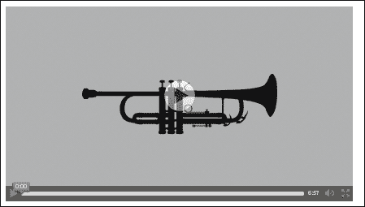

# 十二、多媒体

在这一章中，我们将涵盖以下食谱:

*   播放音频文件
*   播放视频文件
*   自定义媒体元素的控件
*   向视频添加文本
*   嵌入多媒体
*   使用 HTML5 音频将文本转换为语音

# 简介

HTML5 增加了音频和视频两个元素，这两个元素提供了一种功能，这种功能以前是通过在浏览器中使用附加组件来实现的。在大多数情况下，我们发现基于闪存的播放器，但最近正在改变。现在大多数浏览器都很好地支持基本的 HTML5 媒体元素相关功能。

该播放器的定制选项非常有限，并且因供应商而异。大多数网站都有，有些网站仍然有自己的自定义播放器，这些播放器都是在 Flash 中完成的，因为这是完成这项工作的最佳方式。

闪存本身不会突然消失，但是拥有一个使用开放标准的替代产品总是能令人信服地说明为什么不使用它。同样的情况也发生在网络游戏行业，HTML5 每天都在接管基于 Flash 的游戏市场。

# 播放音频文件

音频元素支持在浏览器中播放音频文件的简单方法。采纳这一要素引起了许多有争议的讨论，主要是因为缺乏一种格式的共同基础。最初，Ogg Vorbis([http://www.vorbis.com/](http://www.vorbis.com/))是 W3C 规范中建议的格式。

### 注

关于不同格式的浏览器支持的最新信息可以在`www.caniuse.com`上找到。

在这个食谱中，我们将看一下元素和一些可以应用在元素上的基本属性。

## 做好准备

为了播放音频，我们需要一个实际的音频文件。你可以自己选一个，或者用例子附带的那个。该文件将从音乐文件夹中提供。我们将使用莫扎特的《单簧管协奏曲》622，II。杰森·温伯格的《慢板》可在免费音乐档案馆获得。

该文件的类型是`.mp3`，但是对于本例来说，我们还需要一个`.ogg`文件。线上和线下都有很多转换器，所以我们可以使用[例如。如果你不想麻烦的话，在示例文件中还有一个转换后的`song.ogg`文件。](http://media.io)

## 怎么做...

我们将创建一个包含音频播放器的 HTML 文件:

1.  正文部分将包含以下内容:

    ```html
        <p>
          <audio id="mulipleSrc" controls preload loop>
              Audio not supported
            <source src="music/Jason_Weinberger__the_WCFSO_-_04_-_Mozart_-_Clarinet_Concerto_in_A_K_622_II_Adagio.mp3"type="audio/mpeg" />
            <source src="music/song.ogg" type="audio/ogg" />
        <a href="music/song.ogg">download file </a>
          </audio>
        <p>
    ```

2.  归属的小文本:

    ```html
        Mozart - Clarinet Concerto in A K. 622, II. Adagio by <a href="http://freemusicarchive.org/music/Jason_Weinberger__the_WCFSO/Jason_Weinberger__the_Waterloo-Cedar_Falls_Symphony_Orchestra/">Jason Weinberger</a> & the WCFSO is licensed under a Creative Commons Attribution License.
        </p>
    ```

就是这样，你应该有一个可以在浏览器中访问的音频播放器。

## 它是如何工作的...

旧的方式是使用`<object>`和`<embed>`，将许多玩家特定的参数传递给嵌入的`.swf`文件，看起来像下面的代码:

```html
<object data="somePlayer.swf">
  <param name="quality" value="medium">
</object>
```

新方法相当简单，我们可以添加一个指定了`src`属性的音频元素:

```html
<audio src="myFile.ogg" autoplay>
  Some fallback HTML code
</audio>
```

这将自动播放页面上的文件，而不会给用户停止音乐的选项。为了让用户代理渲染玩家，我们添加了属性控件。我们通过设置`src`属性强加的另一个限制是，将只播放该文件。你可能想知道为什么我们需要多个来源，但原因很简单。在当前状态下，一些浏览器支持某些格式，但其他浏览器不支持。如果我们想在所有现代浏览器中得到支持，那么我们提供了拥有多个来源的选项。

### 注

在撰写本文时，这是使用 Windows 作为操作系统的浏览器格式支持的大致状态。

<colgroup><col style="text-align: left"> <col style="text-align: left"> <col style="text-align: left"> <col style="text-align: left"> <col style="text-align: left"> <col style="text-align: left"></colgroup> 
| 

浏览器/功能

 | 

声音资源文件

 | 

作品

 | 

Ogg

 | 

MP3 文件

 | 

(美)空中管制中心(Air Control Center)

 |
| --- | --- | --- | --- | --- | --- |
| Firefox 20 | 是 | 是 | 是 | 不 | 不 |
| 铬 26 | 是 | 是 | 是 | 是 | 是 |
| IE 9 | 不 | 不 | 不 | 是 | 是 |
| 歌剧 | 是 | 不 | 是 | 不 | 不 |

### 注

除了提供浏览器支持统计数据的标准网站之外，你还可以使用由 SoundCloud 完成的测试套件，在[http://areweplayingyet.org/](http://areweplayingyet.org/)或[https://github.com/soundcloud/areweplayingyet](https://github.com/soundcloud/areweplayingyet)上检查单个功能。

源元素为我们提供了为任何媒体元素指定多个替代资源的功能。它本身没有任何意义，所以它应该是某种媒体标签的一部分。我们可以有多个具有不同`src`、类型和媒体属性的源元素。例如，我们可以有以下元素:

```html
<source src='audio.oga' type='audio/ogg; codecs=flac'>
```

如果您不确定您提供的任何源是否可以在用户浏览器中使用，您可以在`source`元素上附加`onerror`事件监听器。这个处理程序可以用来执行回退。

几乎没有其他属性可用于媒体元素。除了全局属性，媒体指定的属性还有:

*   `autoplay`属性:这是一个布尔值属性，它定义了当浏览器有足够大的媒体文件部分时，浏览器是否应该开始播放。这个元素的默认状态是缺失，这意味着我们默认没有自动播放。
*   `preload`属性:提示浏览器即使用户还没有点击播放也要下载源文件。这里的想法是，我们期望在未来的某个时间点播放该文件，这等同于将该值设置为`auto`。该值也可以设置为`none`，这提示浏览器应该保持预加载，因为我们不希望用户按下播放按钮。也可以选择元数据的值，这意味着只加载媒体文件的元数据，例如长度。
*   `muted`属性:也是一个基于布尔的属性，默认值为假，表示会有声音。
*   `loop`属性:完成后将音频设置为开始。
*   `controls`属性:只是增加了玩家控制。
*   `mediagroup`属性:用于对多个媒体元素进行分组，例如，如果我们希望两个元素有相同的控件，我们可以将它们设置为使用相同的媒体组。
*   `crossorigin`属性:可以指定限制 src 属性符合 **跨产地资源共享** ( **CORS** )。

其他大部分自定义和从 JavaScript 的访问将是以下方法的一部分。如果我们使用没有设置控件属性的元素，最好将音频元素的 CSS 设置为`display:none`，以确保它不会占用页面空间。

# 播放视频文件

为了在浏览器中增加对视频的本地支持，HTML5 引入了视频元素。这与音频元素非常相似，并且由于它们共享公共接口，因此应用了相同的属性。很少有其他属性仅适用于视频元素。同样，源的编解码器也大部分不同，对于视频，我们有 H.264/MPEG-4、VP8、VP9 和 Theora。

在这个食谱中，我们将看到如何通过创建一个简单的页面来使用内置播放器。

### 注

关于媒体元素的 HTML5 规范可以在[http://www . what WG . org/specs/web-apps/current-work/multipage/the-video-element . html](http://www.whatwg.org/specs/web-apps/current-work/multipage/the-video-element.html)上找到。

## 做好准备

我们需要一个视频文件来玩我们的播放器，所以你可以自己选择一个。我们选择使用 http://archive.org/details/animationandcartoons 的某个视频。

该视频被“沃尔特·兰茨制作公司”称为“布吉·伍吉军号男孩”，并于 1941 年获得奥斯卡提名。

### 注

Archive.org 也被称为互联网档案馆，是一个非营利性的数字图书馆，其使命是“普及所有知识”。除了作为一个图书馆，它还拥有各种各样的多媒体。其中一个比较著名的子项目是回送机[http://archive.org/web/web.php](http://archive.org/web/web.php)，一个过去网站状态的快照档案。还有一个名为[nasaimages.org](http://nasaimages.org)的子项目，旨在让美国宇航局的图像和视频更贴近公众。互联网档案中的数据量是巨大的，这使得它成为一个很好的信息来源。

此外，我们将使用海报图像，该图像将在视频开始之前显示；图片标题为`poster.png`，是示例来源的一部分，但是你可以使用任何你喜欢的图片。

## 怎么做...

我们创建了一个简单的 HTML，它将包含视频元素并有一个视频源:

1.  正文部分将包含以下代码:

    ```html
        <p>
          <video width="640" height="360" poster="poster.png" controls preload loop>
              Video not supported <a href="http://archive.org/download/WalterLantz-BoogieWoogieBugleBoy1941/WalterLantz-BoogieWoogieBugleBoy1941.ogv"> download </a> instead
            <source src="http://archive.org/download/WalterLantz-BoogieWoogieBugleBoy1941/WalterLantz-BoogieWoogieBugleBoy1941.ogv" type="video/ogg" />
          </video>
    ```

2.  并且归属将包含以下代码:

    ```html
        <p>
        Video is part of animation shorts on <a href="http://archive.org/details/more_animation"> archive.org</a>. The video
        is titled : Walter Lantz - Boogie Woogie Bugle Boy
        </p>
    ```

打开后，我们应该有一个运行的视频播放器像下面的截图:



## 它是如何工作的...

视频元素非常类似于音频元素，音频的所有属性都应用于视频元素。视频的特定属性有:

*   `Width`和`height`:表示元素的宽度和高度。控件将重新调整视频的大小以适合指定的大小。视频的实际大小取决于正在播放的文件。
*   `poster`:是一个属性让我们可以提供一个静态的图像显示在视频元素上，直到用户决定播放视频。

通过给视频添加各种属性组合，可以让用户体验更好；在我们的代码示例中，视频将居中，因为宽度和高度属性与视频的实际宽度和高度不匹配。

如果我们想播放特定范围的视频，也有一个内置的支持。例如，我们可能希望从第 30 秒到第 40 秒播放视频。为了在`src`属性的 URL 中做到这一点，我们在片段定义后面附加一个散列(`#`)，如下面的代码所示:

```html
<source src="myvideo.ogv#t=30,40" />
```

通用定义如下:

```html
#t=[starttime],[endtime]
```

变量`starttime`和`endtime`是可选的，可以有一个指定从开始的秒数的数字，也可以有`hours:minutes:seconds`。

如果我们想从第 80 秒一直播放到视频结束，来源会如下:

```html
<source src="myvideo.ogv#t=80" />
```

视频通常以某种有损压缩格式进行编码，因为它们非常大，无法以原始格式传输。

### 注

您可以在以下链接[https://en.wikipedia.org/wiki/Lossy_compression](https://en.wikipedia.org/wiki/Lossy_compression)上阅读更多关于有损压缩的内容。主要思想是通过牺牲一定级别的信息和质量来显著减小原始视频的大小。

微软和苹果拥有使用 H.264 的许可，或者更常见的扩展`.mp4` 或`.m4v`。该编解码器可能有不同的版本和组合，此外，它得到了 YouTube 和 iTunes 的支持，使其成为一个非常受欢迎的选择。火狐和 Chrome 计划放弃对它的支持，因为这种格式是专有的，必须支付一定的版税，这使得它成为一个非常有争议的选择。Firefox 计划在未来支持该编解码器，但前提是有第三方解码器可用。

### 注

关于 H.264 的更多信息可以在[http://en.wikipedia.org/wiki/H.264/MPEG-4_AVC](http://en.wikipedia.org/wiki/H.264/MPEG-4_AVC)上找到。

Ogg Theora 来自[Xiph.org](http://Xiph.org)，该组织提供了`.ogg` 容器和我们在音频元素配方中使用的 Vorbis 音频编解码器，以及其他贡献。火狐、Opera 和 Chrome 都支持这一点，但 IE 和 Safari 不支持，至少默认情况下不支持。

### 注

更多关于奥格瑟拉的信息可以在[http://www.theora.org/](http://www.theora.org/)上找到。

WebM is 支持 Vorbis 作为音频编解码器，支持 VP8 作为视频。VP8 是一家名为 On2 的公司开发的编解码器，被谷歌收购。此外，Chrome、Opera 和 Firefox 本身也支持 WebM，至于 IE 和 Safari，用户需要下载额外的插件。

### 注

关于 WebM 的更多信息，其格式、工具和文档可以在[http://www.webmproject.org/](http://www.webmproject.org/)上找到。

## 还有更多...

有多个来源是好的，但并不总是一个选择。我们也希望有一个旧浏览器的后备方案，为此我们必须依赖一个插件。

如果你参考的是来自第三方付费网站如 YouTube 或 Vimeo 的视频，你可以简单地放置一个嵌入式播放器的`iframe`:

```html
<iframe width="420" height="345"src="http://www.youtube.com/embed/WEbzZP-_Ssc">
</iframe>
```

还有服务器 JavaScript 库，使回退过程变得简单。其中之一就是[http://mediaelementjs.com/](http://mediaelementjs.com/)。

安装很简单，因为我们只包含`.js`和`.css`文件作为依赖项，如下代码所示:

```html
<code><script src="jquery.js"></script>
  <script src="mediaelement-and-player.min.js"></script>
  <link rel="stylesheet" href="mediaelementplayer.css" />
</code>
```

至于玩家后援玩家:

```html
<video src="myvideo.ogv" />
  <!-- other sources -->
  <object width="320" height="240" type="application/x-shockwave-flash" data="flashmediaelement.swf">
    <param name="movie" value="flashmediaelement.swf" />
    <param name="flashvars" value="controls=true&file=myvideo.mp4" />
    
  </object>
</video>
```

后备玩家只是`mediaelement.js`附带的众多功能之一；移动浏览器有很多选项，API 也有很多简化。

### 注

如果您对可能的转换工具或编解码器背后的政治以及对它们的详细解释感兴趣，请查看马克·皮尔格姆的书*深入 HTML5* ，该书可在[http://fortuito.us/diveintohtml5/video.html](http://fortuito.us/diveintohtml5/video.html)获得。

还有一篇有趣的文章，题目是“人人视频”，主题是在不同浏览器上启用视频支持，[http://camendesign.com/code/video_for_everybody](http://camendesign.com/code/video_for_everybody)。

# 自定义媒体元素的控件

媒体元素，目前是视频和音频，可以使用 JavaScript 进行控制，因为元素主题本身包含有用的方法和属性。在本食谱中，我们将介绍一些最基本的功能和方法，这些功能和方法可以应用于具有`HTMLMediaElement`界面的元素。

### 注

关于 HTML5 媒体元素的规范可以在[http://www . w3 . org/TR/html 5/embedded-content-0 . html # html media element](http://www.w3.org/TR/html5/embedded-content-0.html#htmlmediaelement)上找到。

## 做好准备

在这个食谱中，我们还需要一个视频文件，所以我们可以使用上一个食谱中的相同文件。

## 怎么做...

我们从开始创建一个 JavaScript 控制器，它将具有媒体播放器的基本功能。

1.  Our controller methods will accept a selector for a command and execute the command, we need the following:

    ```html
    var videoController = (function () {
      var my = {};
      function findElement(selector){
       var result = document.querySelector(selector);
       if (!result) {
        throw "element " + selector + " not found ";
       }
       return result;
      }

      function updatePlaybackRate(el, speed) {
       el.playbackRate += speed;
      }

      function updateVolume(el, amount) {
       el.volume += amount;
      }

      my.play = function(video) {
       var el = findElement(video);
       el.play();
      }

      my.pause = function(video) {
       var el = findElement(video);
       el.pause();
      }

      my.toggleMute = function(video) {
       var el = findElement(video);
        el.muted = !el.muted;
      }

      my.increasePlaybackRate = function(video, speed) {
       var el = findElement(video);
       updatePlaybackRate(el, speed);
      }

      my.decreasePlaybackRate = function(video, speed) {
       var el = findElement(video);
       updatePlaybackRate(el, -speed);
      }

      my.increaseVolume = function(video, amount) {
       var el = findElement(video);
       updateVolume(el, amount)
      }
      return my;
    }());
    ```

    现在，在一个简单的场景中，我们可能只使用标准方法而不添加另一层，但是这里的想法是我们可以扩展我们认为合适的功能，因为我们有来自 JavaScript 的可访问元素。

2.  对于超文本标记语言，我们将有一个类似于播放视频食谱中的版本。我们将有几个按钮，将使用我们的视频控制器，此外还增加了一个简单的风格。让我们在头部增加以下内容:

    ```html
      <head>
        <title>Video custom controls</title>
        <style>
          video {
            box-shadow: 0 0 10px #11b;
          }
        </style>
      </head>
    ```

3.  身体部位将包含控制按钮:

    ```html
        <p>
          <video id="theVideo" width="640" height="480" poster="poster.png" preload loop>
              Video playback not supported <a href="http://archive.org/download/WalterLantz-BoogieWoogieBugleBoy1941/WalterLantz-BoogieWoogieBugleBoy1941.ogv"> download </a>
            <source src="http://archive.org/download/WalterLantz-BoogieWoogieBugleBoy1941/WalterLantz-BoogieWoogieBugleBoy1941.ogv" type="video/ogg" />
          </video>
        </body>
        <p>
        The Dashboard: <br/>
          <button onclick="videoController.play('#theVideo')">Play</button>
          <button onclick="videoController.pause('#theVideo')">Pause</button>
          <button onclick="videoController.increasePlaybackRate('#theVideo',0.1)">Speed++</button>
          <button onclick="videoController.decreasePlaybackRate('#theVideo',0.1)">Speed-- </button>
          <button onclick="videoController.decreaseVolume('#theVideo', 0.2) ">Vol-</button>
          <button onclick="videoController.increaseVolume('#theVideo', 0.2) ">Vol+</button>
          <button onclick="videoController.toggleMute('#theVideo')">Toggle Mute</button>
        <p>
        Video is part of animation shorts on <a href="http://archive.org/details/more_animation"> archive.org</a>. The video
        is titled : Walter Lantz - Boogie Woogie Bugle Boy
        </p>
    ```

4.  我们将依赖项添加到我们的`example.js`文件中。

    ```html
    <script src="example.js"> </script>
    ```

之后我们应该有一个全运行的视频播放器。

## 它是如何工作的...

使用 JavaScript，我们可以访问和操作任何媒体元素的属性。这个选项使我们能够对标准元素进行许多不同类型的定制。这些属性大多在`HTMLMediaElement`中定义；在那里我们可以读写`currentTime`、`playbackRate`、`volume`、`muted`、`defaultMuted`等等。

### 注

更全面的列表`HTMLMediaElement`属性和只读内容请参考[http://www . w3 . org/TR/html 5/embedded-content-0 . html # media-elements](http://www.w3.org/TR/html5/embedded-content-0.html#media-elements)上的规范。

通过改变的属性我们可以制作自定义的播放器，也可以进行各种不同的视觉更新。有大量不同的事件被媒体元素触发。在事件上，我们可以附加事件监听器，并根据状态变化进行更新。触发以下事件:`loadstart`、`abort`、`canplay`、`canplaythrough`、`durationchange`、`emptied`、`ended`、`error`、`loadeddata`、`loadedmetadata`、`pause`、`play`、`playing`、`progress`、`ratechange`、`seeked`、`seeking`、`stalled`、`suspend`、`timeupdate`、`volumechange`、`waiting`。

### 注

事件的名称是不言自明的，如果您对特定事件的更多细节感兴趣，您可以在[http://www . w3 . org/TR/html 5/embedded-content-0 . html # media events](http://www.w3.org/TR/html5/embedded-content-0.html#mediaevents)的文档中阅读它们的目的。

在我们的示例中，我们可以在显示当前速率的速率上添加一个监听器:

```html
  my.displayRate = function (video, output) {
   var vid = findElement(video),
       out = findElement(output);

   vid.addEventListener('ratechange', function(e) {
     console.log(e);
     out.innerHTML = 'Speed x' + this.playbackRate;
   }, false);
  }
```

然后在 HTML 中添加一个输出元素，并调用我们新添加的方法:

```html
    <output id="speed"></output>
    <script>
      videoController.displayRate("#theVideo","#speed");
    </script>
```

现在，第一次播放视频时，会触发速率变化事件 get，并将速率设置为`1`。每次连续的汇率变化都会触发相同的事件。

### 注

W3C 在 http://www.w3.org/2010/05/video/mediaevents.html有一个关于媒体元素触发的事件的很好的演示。

这里需要注意的另一个有趣的事情是`<audio>` 元素也可以用在视频文件上，但是只能播放文件中的音频流。

# 向视频中添加文本

当显示多语言视频时，我们通常希望为说其他语言的人提供文本。这是许多会议演讲以及大量电影和电视节目的常见做法。为了在视频中启用外部文本轨道资源，创建了 WebVTT([http://dev.w3.org/html5/webvtt/](http://dev.w3.org/html5/webvtt/))标准。

## 做好准备

为了简单起见，我们将使用相同的视频和海报图像，与我们在其他示例中使用的相同。至于其他文件，我们将自己创建。你也可以自己选择其他视频，因为视频本身并不那么重要。

## 怎么做...

我们从 HTML 开始，在这里我们包括视频元素，此外还添加了轨道元素以及简单的`example.js`。请执行以下步骤:

1.  在主体元素中，我们包括:

    ```html
        <p>
          <video width="640" height="360" poster="poster.png" controls preload loop>
         Video playback not supported <a href="http://archive.org/download/WalterLantz-BoogieWoogieBugleBoy1941/WalterLantz-BoogieWoogieBugleBoy1941.ogv"> download</a> instead
            <source
            src="http://archive.org/download/WalterLantz-BoogieWoogieBugleBoy1941/WalterLantz-BoogieWoogieBugleBoy1941.ogv" type="video/ogg" />
            <track src="video.vtt" kind="subtitles" srclang="en" label="English" default />
            <track src="karaoke.vtt" kind="captions" srclang="gb" label="Other" />
          </video>
        <p>
        Video is part of animation shorts on <a href="http://archive.org/details/more_animation"> archive.org</a>. The video
        is titled : Walter Lantz - Boogie Woogie Bugle Boy
        </p>
        <script src="example.js"></script>
    ```

2.  JavaScript 将只记录我们的视频元素可用的对象。这里的想法是显示轨道可以被代码访问和操纵。脚本将包含以下内容:

    ```html
    (function(){
      var video = document.getElementById('theVideo'),
          textTracks = video.textTracks;

       for(var i=0; i < textTracks.length; i++){
        console.log(textTracks[i]);
       }
    }())
    ```

3.  至于我们包含在轨迹中的`.vtt`苍蝇，我们将手动创建它们。文件`video.vtt`将包含以下内容:

    ```html
    WEBVTT

    1
    00:00:01.000 --> 00:00:13.000
    this is the video introduction

    2
    00:00:15.000 --> 00:00:40.000
    There is also some awesome info in
    multiple lines.
    Why you ask?
    Why not ...

    3
    00:00:42.000 --> 00:01:40.000
    We can use <b>HTML</b> as well
    <i> Why not?</i>

    4
    00:01:42.000 --> 00:02:40.000
    {
    "name": "Some JSON data",
    "other": "it should be good for meta data"
    }

    5
    00:02:41.000 --> 00:03:40.000 vertical:lr
    text can be vertical

    6
    00:03:42.000 --> 00:04:40.000 align:start size:50%
    text can have different size relative to frame
    ```

4.  至于`karaoke.vtt`将包含以下代码:

    ```html
    WEBVTT

    1
    00:00:01.000 --> 00:00:10.000
    This is some karaoke style  <00:00:01.000>And more <00:00:03.000> even more  <00:00:07.000>  
    ```

运行示例后，我们应该在给定的范围内有字幕。

### 类型

如果您手动构建 WebVTT 文件，您会注意到很容易出错。在[http://quuz.org/webvtt/](http://quuz.org/webvtt/)有很好的验证器，源代码在[https://github.com/annevk/webvtt](https://github.com/annevk/webvtt)上。

## 它是如何工作的...

视频已经有相当一段时间了，但添加字幕不是一个选项。track 元素使我们能够以标准的方式向视频中添加信息。曲目不仅用于字幕，还可以用于其他类型的定时提示。

### 注

*cue* 这个词的一般定义是，它代表一件事情说或做，作为一个信号，演员或其他表演者进入或开始他们的演讲或表演。

提示可以包含其他数据格式，如 JSON、XML 或 CSV。在我们的例子中，我们包含了一个小的 JSON 数据片段。这些数据在许多不同的方面都是有用的，因为它与给定的时间部分有关，但是字幕并不是它的真正用途。

轨迹元素的`kind`属性可以包含以下值:

*   **字幕**:是给定语言的转录或翻译。
*   **字幕**:和字幕很像，但也可能包括音效或者其他音频。这种类型的主要目的是用于音频不可用的情况。
*   **描述**:这是视频的文字描述，用于视觉部分不可用的地方。例如，它可以为失明或无法跟随屏幕的用户提供描述。
*   **章节**:该曲目可以包含给定时期的章节标题。
*   **元数据**:这是一个轨道对于存储元数据非常有用，后者可以被脚本使用。

除了种类属性之外，还有`src`属性，它是强制性的，显示了轨道源的网址。轨道元素也可以包含`srclang`，包含定时轨道的语言标签。

### 注

语言税通常有两个字母的唯一键来表示特定的语言。更多细节可以看看[http://tools.ietf.org/html/bcp47](http://tools.ietf.org/html/bcp47)。

还有一个属性`default`，如果出现在一个轨道上，那就是默认显示的轨道。

我们还可以使用`label`属性，该属性可以具有为元素指定唯一标签的自由文本值。

### 注

赛道元素的一个巧妙运用可以在:[http://www.samdutton.net/mapTrack/](http://www.samdutton.net/mapTrack/)上找到。

WEBVTT 标准定义文件需要以字符串“WebVTT”开始。接下来我们有线索定义，零个或更多这样的元素。

每个提示元素都有以下形式:

```html
[idstring]
[hh:]mm:ss.ttt --> [hh:]mm:ss.ttt [cue settings]
Text string
```

`idstring`是一个可选元素，但是如果我们需要使用脚本访问提示，最好指定它。至于`timestamp`我们有一个标准格式，时间是可选的。第二个`timestamp`一定比第一个大。

文本字符串允许包含简单的 HTML 格式，如`<b>`、`<i>`和`<u>`元素。有一个选项可以添加`<c>` 元素，该元素可以用于为部分文本添加 CSS 类，例如`<c.className>styled text </c>`。还有一个选项就是添加所谓的语音标签`<v someLabel> the awesome text </v>`。

提示设置也是可选的，并且附加在时间范围之后。在此设置中，我们可以选择文本是水平显示还是垂直显示。这些设置区分大小写，因此它们必须是小写的，如示例所示。可以应用以下设置:

*   **竖排**:与值`vertical:rl`一起使用，其中`rl`代表从右向左书写，`vertical:lr`代表从左向右书写。
*   **行**:这个设置指定了文本垂直显示的位置，或者在我们已经使用垂直的情况下，它指定了水平位置。该值用百分比或数字指定，其中正值表示顶部，负值表示底部。例如，`line:0``line:0%`表示顶部，`line:-1%`或`line:100%`表示底部。
*   **位置**:这是一个设置，指定文本将在哪里水平显示，或者如果我们有垂直属性设置，它指定文本在哪里垂直显示。它的值应该在 0 到 100%之间。比如可以是`position:100%`意为对。
*   **大小**:根据额外的垂直设置，以百分比形式指定文本区域的宽度/高度。例如，`size:100%`表示将显示文本区域。
*   **对齐**:它是一个属性，设置文本在大小设置定义的区域内的对齐方式。它可以有以下值`align:start`、`align:middle`和`align:end`。

在文本字符串中，我们还可以添加给定单词的更详细的出现顺序，类似于卡拉 ok 风格。例如，请参见以下内容:

```html
This is some karaoke style  <00:00:02.000>And more <00:00:03.000>
```

它指出，在 2 秒之前，我们有一些文本，活动提示`And more`在 2 到 3 秒之间。

关于文本字符串还有一点需要注意，它不能包含字符串`-->` 字符串、&和或小于字符`<`，因为它们是保留的。但是不用担心，我们总是可以使用转义版本，例如`&amp;`表示&符号。

如果我们将文件用于元数据跟踪，则这些限制不适用。

## 还有更多...

我们还可以选择使用 CSS 来设置文本的样式。如前所述，VTT 文件可以包含带有`<c.someClass>`的轨迹，以获得更精细的样式，但一般情况下，我们希望在整个轨迹上应用样式。可以为所有提示应用样式:

```html
::cue  {
        color: black;
        text-transform: lowercase;
        font-family: "Comic Sans";
}
```

但是你可能会通过在漫画中制作字幕来疏远用户。

还有选择器，用于过去的提示`::cue:past{}`和`::cue:future{}`，它们可以用于制作类似卡拉 ok 的渲染。我们也可以使用`::cue(selector)`伪选择器来定位符合某些标准的节点。

不是所有的功能都在现代浏览器中完全可用，在撰写本文时，最值得称赞的是 Chrome，所以对于其他浏览器来说，使用 polyfill 是一个好主意。一个这样的库是[http://captionatorjs.com/](http://captionatorjs.com/)，它增加了对所有现代浏览器的支持。除了增加对网络视频的支持，它还支持像`.sub`、`.srt`和 YouTube 的`.sbv`这样的格式。

还有一种为视频轨道开发的格式。名称为**定时文本标记语言**(**TTML**)1.0[http://www.w3.org/TR/ttaf1-dfxp/](http://www.w3.org/TR/ttaf1-dfxp/)仅支持 IE，在编写时没有任何计划在其他浏览器中获得支持。该标准更加复杂，并且是基于 XML 的，但同样也更加冗长。

# 嵌入多媒体

媒体元素可以与其他元素配合组合。各种 CSS 属性可以应用于元素，并且有选项可以将视频与 SVG 相结合。我们可以在画布元素中嵌入视频，并对渲染图像进行处理。

在这个食谱中，我们将创建一个简单的案例，在画布中嵌入视频。

## 做好准备

在这个食谱中，我们需要一个视频作为我们的视频元素，另外一个要求是该视频支持跨来源资源共享，或者位于我们的本地服务器上。确保这一点的最简单方法是在本地运行的服务器上播放视频。

### 注

在 http://www.spacetelescope.org/videos/astro_bw/有许多不同格式的视频可以从美国宇航局和欧空局获得。

## 怎么做...

我们将通过执行以下步骤在画布元素上渲染视频:

1.  首先从我们添加视频元素和画布的 HTML 文件开始:

    ```html
          <video id="myVideo" width="640" height="360" poster="poster.png" controls preload>
              Video not supported
            <source src="video.mp4" type="video/mp4" />
          </video>
            <canvas id="myCanvas" width="640" height="360"> </canvas>
            <button id="start">start showing canvas </button>
        <script src="example.js"> </script>
    ```

2.  我们的 JavaScript 代码示例将附加事件处理程序，该程序将开始在画布元素上呈现视频的灰度版本:

    ```html
    (function (){
      var button = document.getElementById('start'),
          video = document.getElementById('myVideo'),
          canvas = document.getElementById('myCanvas');

      button.addEventListener("click", function() {
        console.log('started drawing video');
        drawVideo();
      },false);

      function drawVideo(){
       var context = canvas.getContext('2d');
       // 0,0 means to right corner
      context.drawImage(video, 0, 0);
       var pixels = context.getImageData(0,0,640,480);
       pixels = toGrayScale(pixels);
       context.putImageData(pixels,0,0);
       // re-draw
       setTimeout(drawVideo,10);
      }

      function toGrayScale(pixels) {
        var d = pixels.data;
        for (var i=0; i<d.length; i+=4) {
          var r = d[i],
              g = d[i+1],
              b = d[i+2],
              v = 0.2126*r + 0.7152*g + 0.0722*b;
          d[i] = d[i+1] = d[i+2] = v
        }
        return pixels;
      };
    }())
    ```

我们应该有一个运行的例子。这里还有一个注意事项，我们的原始视频应该是彩色的，以便注意到差异。

## 它是如何工作的...

此时视频元素应该是清晰的，至于画布，我们将从限制开始。在画布上绘制图像有 CORS 限制。这种安全约束实际上是有意义的，因为我们从图像中读取数据，并据此执行代码。这可能被一些恶意来源利用，因此添加了约束。

使用 `canvas.getContext('2d')`我们得到一个绘制上下文，在这里我们可以从我们的视频元素中绘制当前图像。在绘制图像时，我们可以修改单个像素。这为我们提供了在视频上创建滤镜的选项。

对于我们的例子，我们创建了一个简单的灰度过滤器。过滤函数`toGrayScale`迭代像素数据，由于每三个值代表一个像素在 RGB 中的颜色，我们读取它们的数据并创建一个调整值:

```html
  v = 0.2126*r + 0.7152*g + 0.0722*b;
```

接下来，我们将调整后的值应用于所有三个值。之所以选择这个神奇的数字，是为了补偿红色和蓝色值，因为一般人的眼睛不善于看到它们。我们可以使用这三个值的平均值，得到类似的结果。

### 注

如果你对其他滤镜感兴趣，http://www.html5rocks.com/en/tutorials/canvas/imagefilters/有一篇关于这个主题的好文章，滤镜适用于图像，但同样的规则也适用于视频。

## 还有更多...

另一个值得一看的有趣的演示是类似立方体的视频播放器，[http://html5playbook.appspot.com/#Cube](http://html5playbook.appspot.com/#Cube)，它使用各种不同的方式来创造酷的效果。

如果你对在 HTML5 应用程序中处理和合成音频感兴趣，在[http://www.w3.org/TR/webaudio/](http://www.w3.org/TR/webaudio/)有一个新的高级应用编程接口可以实现这一点。

# 使用 HTML5 音频将文本转换为语音

如果我们今天要构建一个基于网络的导航应用程序，大部分组件将已经可用。有谷歌地图或开放的街道地图组件来显示地图，以及提供驾驶方向的 API 服务。

但是基于语音的导航导航呢？这难道不需要另一个将文本转换成语音的 API 服务吗？

多亏了 HTML5 音频和 Emscripten(一个 C 到 JavaScript 的编译器)，我们现在可以使用一个名为 espeak 的免费文本到语音转换引擎，它可以在浏览器中完全工作。

在本例中，我们将使用 espeak 生成用户在简单页面上输入的文本。大部分工作将包括准备工作——我们将需要建立`espeak.js`。

## 做好准备

我们需要从([http://github.com/html5-ds-book/speak-js](http://github.com/html5-ds-book/speak-js)下载 speak.js。单击下载 zip 按钮，将归档文件下载到新创建的文件夹中。提取该文件夹中的档案——它应该创建一个名为`speak-js-master`的子文件夹。

## 怎么做...

请执行以下步骤:

1.  创建包含文本输入字段和`Speak`按钮:

    ```html
    <!doctype html>
    <html>
      <head>
        <script src="http://ajax.googleapis.com/ajax/libs/jquery/1.8.2/jquery.min.js"></script>
        <script src="speak-js-master/speakClient.js"></script>
        <script src="example.js"></script>
        <meta charset="utf8">    
      </head>
      <body>
        <div id="audio"></div>
        <input type="text" id="text" value="" placeholder="Enter text here">
        <button id="speak">Speak</button>
      </body>
    </html>
    ```

    的页面`index.html`
2.  创建`example.js`并在按钮上添加点击操作:

    ```html
    $(function() {
        $("#speak").on('click', function(){
            speak($("#text").val());
        });
    });
    ```

3.  从命令行安装`http-server`如果尚未安装，则启动服务器:

    ```html
    npm install -g http-server
    http-server
    ```

4.  在浏览器中打开 [http://localhost:8080](http://localhost:8080) ，测试演示。

## 它是如何工作的...

将文本转换为语音的引擎是 eSpeak([http://espeak.sourceforge.net/](http://espeak.sourceforge.net/))。这个引擎是用 C 语言编写的，然而，浏览器本地支持的唯一语言是 JavaScript。我们如何在浏览器中使用这个引擎？

Emscripten 是一个旨在解决这一限制的编译器。它从 C 或 C++源代码中获取 LLVM 编译器生成的 LLVM 字节码，并将其转换为 JavaScript。Emscripen 利用了许多现代 JavaScript 特性，如类型化数组，并依赖于现代优化 JavaScript JIT 编译器的出色性能。

为了避免阻塞浏览器，语音生成器是从在`speakClient.js`中创建的网络工作者调用的。生成的 WAV 数据由工作人员传回，转换为 base64 编码，并作为数据 URL 传递给新创建的音频元素。该元素又被附加到页面上的#audio 元素，通过调用`play`方法激活播放。

## 还有更多..

Espeak 是在 GNU GPL v3 许可下获得许可的。因此，它可能不适合专有项目。

更多关于电子脚本的信息可以在 https://github.com/kripken/emscripten/wiki 的电子脚本维基上找到。