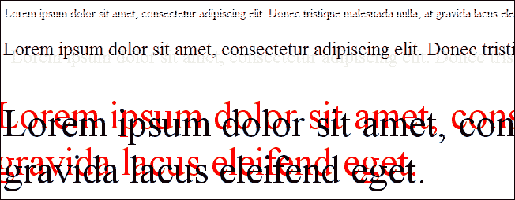
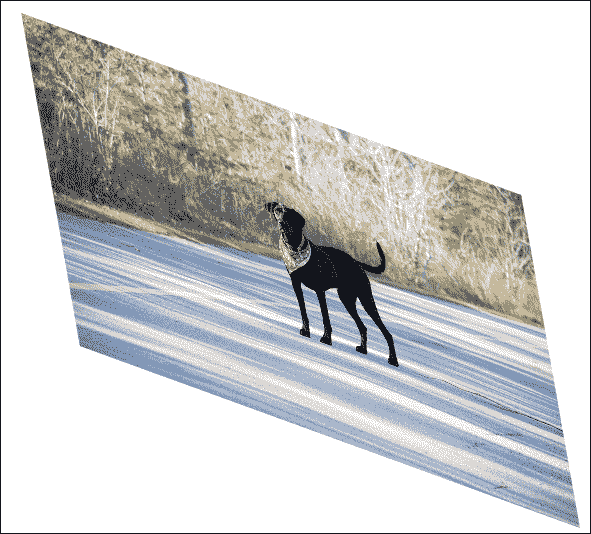
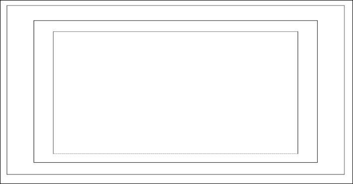
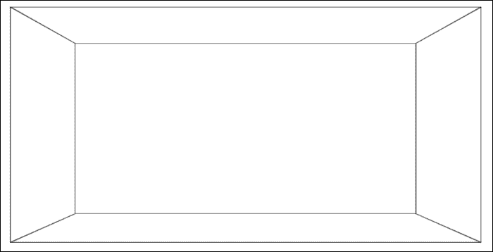
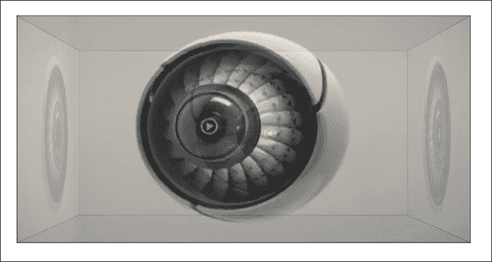
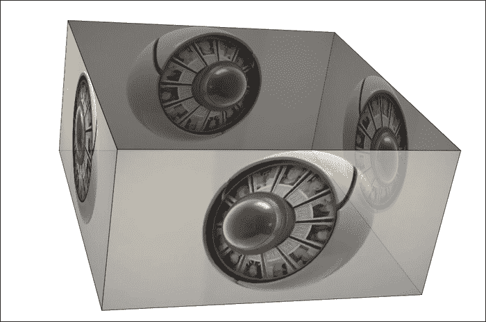

# 第三章。可伸缩性、局限性和效果

随着我们的媒体资产为 HTML5 集成做好准备，让我们继续这一旅程，看看 CSS3 和 JavaScript 中一些新的令人兴奋的对象操作特性，以及它们与您作为 Flash 开发者所熟悉的内容之间的关系。在本章的过程中，我们将回顾 HTML5 的许多特定功能，这些功能使它获得了广泛的使用和普及，变得更像典型的 Flash 开发。

我们将在本章中介绍:

*   初始开发限制和避免这些限制的方法
*   一些新的和令人兴奋的 CSS3 的增加
*   为移动和桌面开发响应性布局
*   使用 CSS 媒体查询为特定显示定位 CSS 样式
*   控制和流式传输音频和视频，以及与闪存相比的局限性
*   客户端文件集成和操作
*   用 HTML5 Web Workers 将繁重的进程发送到后台
*   介绍使用网络套接字的服务器端通信
*   理解画布元素是什么以及它为什么重要
*   WebGL 简介及其与 Stage3D 的关系

# HTML5 限制

如果你到现在还没有注意到，你将使用的许多 HTML5 特性要么有故障保险、多个版本，要么有特殊的语法，使你的代码能够覆盖所有的浏览器，并在其中支持 HTML5 特性集。久而久之和标准变得固化，人们可以假设这些故障保险和其他内容显示措施中的许多将成熟为所有浏览器共享的单一标准。然而，在现实中，这个过程可能需要一段时间，即使在最好的情况下，开发人员可能仍然不得不无限期地利用这些故障保护功能。因此，对何时、何地以及为什么使用这些故障保护措施的深刻理解将使您能够以一种在所有现代浏览器上都可以查看的方式开发您的 HTML5 网页。

为了帮助开发人员克服这些前面提到的问题，已经创建了许多框架和外部脚本，并且是开源的，这使得开发人员在启动每个新项目时可以有一个更通用的开发环境，从而节省了无数的时间。Modernizr([http://modernizr.com](http://modernizr.com))已经迅速成为许多 HTML5 开发人员的必备之选，因为它包含了允许开发人员编写更少代码和覆盖更多浏览器所需的许多条件和验证。Modernizr 通过在客户端浏览器中检查 HTML5 中可用的大部分(超过 40 个)新功能来实现所有这些，并在几毫秒内报告它们是否可用。这将允许您作为开发人员来决定是否应该向用户显示内容的替代版本或警告。

让你的网页内容在所有浏览器中正确显示是并且一直是任何网页开发人员面临的最大挑战，当涉及到创建前沿有趣的内容时，这个挑战通常会变得更加困难。本章不仅将涵盖许多新的 HTML5 内容操作特性，还将在代码示例中演示它们。为了让您在不使用第三方集成的情况下更好地理解这些特性，我们将暂时避免使用外部库。值得注意的是这些特性和其他特性在所有浏览器中的表现。因此，一定要测试这些例子以及你自己的作品，不仅仅是在你最喜欢的浏览器中，还有很多其他流行的选择。

# 用 CSS3 操纵物体

在 CSS3 出现之前，网络开发人员使用了一系列内容操作、资产准备和资产呈现技术，以便在每个浏览器中以他们想要的方式获得他们的网页布局。这些技术中的大多数都被认为是“黑客”，因为它们基本上是为了让浏览器做一些它通常不会做的事情。诸如圆角、阴影和变换等功能都不在 web 开发人员的武库中，以您想要的方式获得东西的过程可能会让人头脑麻木。可以理解的是，对于所有 web 开发人员来说，围绕 CSS3 的兴奋程度非常高，因为它使开发人员能够执行比以往更多的内容操作技术，而无需事先准备或特殊的浏览器黑客攻击。虽然 CSS3 中的可用房产列表非常多，但让我们来看看其中一些最新最令人兴奋的。

## 框影

的确，一些设计师和开发人员说阴影是过去的一部分，但是阴影 HTML 元素的使用仍然是许多人的流行设计选择。过去，网络开发人员需要执行一些技巧，比如拉伸小的渐变图像，或者直接在背景图像中创建阴影，以在他们的 HTML 文档中实现这种效果。CSS3 已经通过创建`box-shadow`属性解决了这个问题，允许在你的 HTML 元素上出现类似阴影的效果。

为了提醒我们这种效果是如何在 ActionScript 3 中实现的，让我们回顾一下这段代码片段:

```html
var dropShadow:DropShadowFilter = new DropShadowFilter();
dropShadow.distance = 0;
dropShadow.angle = 45;
dropShadow.color = 0x333333;
dropShadow.alpha = 1;
dropShadow.blurX = 10;
dropShadow.blurY = 10;
dropShadow.strength = 1;
dropShadow.quality = 15;
dropShadow.inner = false;
var mySprite:Sprite = new Sprite();
mySprite.filters = new Array(dropShadow);
```

如前所述，CSS3 中新的 `box-shadow`属性允许您相对容易地附加这些阴影效果，并且具有许多相同的配置属性:

```html
.box-shadow-example {
  box-shadow: 3px 3px 5px 6px #000000;
}
```

尽管应用于这种样式的每个值都缺少属性名，但是您可以看到许多值类型与我们在 ActionScript 3 中创建的投影相一致。

这个`box-shadow`属性被分配给`.box-shadow-example`类，因此将应用于任何附加了该类名的元素。通过用`box-shadow-example`类创建一个`div`元素，我们可以改变我们的内容，看起来如下:

```html
<div class="box-shadow-example">CSS3 box-shadow Property</div>
```


这个 CSS 属性很容易添加到您的项目中，它在一行中声明了很多值。让我们回顾一下这些值，以便更好地理解它们，以便将来使用。为了简化属性中每个变量的标识，每个变量都被更新为不同的:

```html
box-shadow: 1px 2px 3px 4px #000000;
```

这些变量解释如下:

*   初始值(`1px`)是阴影的**水平偏移** 或者阴影是向左还是向右。正值会将阴影放置在元素的右侧，负偏移会将阴影放置在左侧。
*   第二个值(`2px`)是**，和水平偏移值一样，负数会产生向上的阴影，正值会产生向下的阴影。**
***   第三个值(`3px`)是 **模糊半径** ，控制将为阴影添加多少模糊效果。例如，声明一个值`0`将不会产生模糊并显示一个非常清晰的阴影。放置在模糊半径中的负值将被忽略，并且渲染与使用 0 没有区别。*   第四个值(`4px`)也是最后一个数值属性是 **扩散半径**。扩散半径控制投影模糊扩散超过初始阴影大小声明的距离。如果使用值`0`，阴影将以默认的模糊半径设置显示，并且不应用任何更改。正值将产生进一步模糊的阴影，负值将使阴影模糊变小。*   最后一个值是十六进制颜色值，表示阴影的颜色。**

 **或者，您可以使用`box-shadow`将阴影效果应用到元素的内部，而不是然后应用到外部。在动作脚本 3 中，这是通过将`dropShadow.inner = true;`附加到您的`DropShadowFiler`对象的参数列表中来实现的。以这种方式应用`box-shadow`属性的 CSS3 语法非常相似，只需要添加`inset`关键字。例如，考虑以下代码片段:

```html
.box-shadow-example {
  box-shadow: 3px 3px 5px 6px #666666 inset;
}
```

这将产生一个阴影，如下图所示:


### 类型

本章的代码示例中包含了一个盒子阴影工具，它可以让您更好地理解每个属性的影响。

## 文字-阴影

就像`box-shadow`属性一样， `text-shadow`通过创建相同的投影效果而名副其实，特别是对于文本:

```html
text-shadow: 2px 2px 6px #ff0000;
```

像`box-shadow`一样，`text-shadow`的初始两个值是阴影放置的水平和垂直偏移。可选的第三个值是模糊大小，第四个值是十六进制颜色:



## 边界半径

就像元素或文本阴影一样，在 CSS3 之前给元素添加圆角是一件苦差事。开发人员通常会附加单独的图像或使用其他对象操作技术来在典型的方形或矩形元素上实现这种效果。随着 CSS3 中`border-radius`设置的增加，开发人员只需几行 CSS 就可以轻松动态地设置元素角圆度，而无需像在 Flash 中那样使用矢量 9 切片。

由于 HTML 元素有四个角，在追加`border-radius`样式时，我们可以单独针对每个角，也可以一次针对所有角。为了轻松地将边框半径设置同时附加到所有的角上，我们将创建如下 CSS 属性:

```html
#example {
  background-color:#ff0000; // Red background
  width: 200px;
  height: 200px;
border-radius: 10px;
}
```

前面的 CSS 不仅通过使用现代浏览器使用的所有属性将 10px 的边框半径附加到`#example`元素的所有角上，，我们可以确信所有试图查看该内容的用户都可以看到该效果:


如上所述，元素的每个单独的角可以被定位为仅将半径附加到元素的特定部分:

```html
#example {
  border-top-left-radius: 0px; // This is doing nothing
  border-top-right-radius: 5px;
  border-bottom-right-radius: 20px;
  border-bottom-left-radius: 100px;
}
```

前面的 CSS 现在通过将其设置为`0px`来移除我们的`#example`元素的左边框半径，并为其他每个角设置一个特定的半径。这里值得注意的是，将边框半径设置为等于`0`与将该属性完全排除在 CSS 样式之外没有区别:


## 来源

多年来，在 Flash 中处理定制字体时有起伏。任何需要在 Flash 应用程序中集成和使用定制字体的 Flash 开发人员可能都知道选择字体嵌入方法带来的痛苦，也知道如何确保它能正确地适用于在电脑上没有安装字体的用户查看 Flash 应用程序。

CSS3 字体嵌入实现了一种“不大惊小怪”的方式，通过添加`@font-face`声明将自定义字体包含到您的 HTML5 文档中:

```html
@font-face {
  font-family: ClickerScript;
  src: url('ClickerScript-Regular.ttf'),
    url('ClickerScript-Regular .otf'),
    url('ClickerScript-Regular .eot');
}
```

CSS 现在可以直接引用你的 TTF，OTF，或 EOT 字体，这些字体可以放在你的网页服务器上。在我们的 CSS 文档中声明了字体源，并对其应用了唯一的`font-family`标识，我们可以通过使用 `font-family`属性开始在特定元素上使用它:

```html
#example {
  font-family: ClickerScript;
}
```

由于我们在 `@font-face`属性中声明了一个特定的字体系列名称，因此我们可以在此后的几乎任何元素上使用该自定义名称。自定义字体几乎可以应用于 HTML 文档中包含文本的任何内容。按钮标签和文本输入等表单元素也可以设置为使用自定义字体。您甚至可以使用原始资产创建中使用的相同自定义字体，在纯 HTML 和 CSS 中重新制作资产，如网站徽标。

### 可接受的字体格式

像许多其他在线资产嵌入方法一样，字体需要转换成多种格式才能使所有常见的现代浏览器正确显示它们。几乎所有可用的浏览器都能够处理常见的真实类型字体(`.ttf`文件类型)或开放类型字体(`.otf`文件类型)，因此只需要嵌入这两种格式中的一种。不幸的是，Internet Explorer 9 没有内置对这两种流行格式的支持，并且要求字体以 EOT 文件格式保存。

### 外部字体库

在过去的几年里，许多优秀的服务出现在网上，让网络开发者可以毫无痛苦地准备字体并嵌入到他们的网站中。谷歌的网络字体档案可在[http://www.google.com/webfonts](http://www.google.com/webfonts)获得，其中包含大量开源字体，可以添加到您的项目中，而无需担心许可或支付问题。只需在您的 HTML 文档中添加几行额外的代码，您就可以开始了。

另一个值得一看的伟大网站是字体松鼠，可以在[http://www.fontsquirrel.com](http://www.fontsquirrel.com)找到。像谷歌网络字体一样，字体松鼠拥有一个网络字体的大型档案库，里面有可以复制粘贴的代码片段，可以将它们添加到您的文档中。这个网站的另一个很棒的功能是`@font-face`生成器，它能让你把你已经存在的字体转换成所有网络兼容的格式。

在得意忘形，将所有喜欢的字体转换为网络就绪格式并将其集成到您的工作之前，值得注意的是字体附带的最终用户许可协议或 EULA 协议。转换许多可用的字体用于网络将违反许可协议，并可能给你带来法律问题。

## 不透明度

对 Flash 开发人员来说，更常见的说法是“alpha”，设置元素的不透明度不仅允许您更改设计的外观和感觉，还允许您添加诸如淡入淡出的内容等功能。虽然这个概念看起来很简单，但对于 web 开发人员可用的 CSS 属性列表来说，它相对较新。设置元素的不透明度非常容易，如下所示:

```html
#example {
  opacity: 0.5;
}
```

从前面的例子可以看出，和 ActionScript 3 一样，不透明度值是介于 0 和 1 之间的数值。前面的示例将以 50%的透明度显示一个元素。CSS3 中的不透明度属性现在在所有主要的浏览器中都支持，因此在声明它时无需担心使用替代属性语法。

## RGB 和 RGBA 着色

在 CSS 中处理颜色值时，许多开发人员通常会使用十六进制值，类似于`#000000`来声明黑色的用法。通过使用`rgb()`或`rgba()`调用代替十六进制值，颜色也可以在 CSS 中以其 RGB 表示实现。从方法名称可以看出，CSS 中的`rgba`颜色查找也需要第四个参数，该参数声明颜色α透明度或不透明度。在 CSS3 中使用 RGBA 而不是十六进制颜色可能是有益的，原因有几个。假设您刚刚创建了一个`div`元素，它将显示在您的网页布局中的现有内容之上。

如果您曾经想要将`div`的背景颜色设置为特定颜色，但只希望该背景是半透明的，而不是内部内容，那么 RGBA 颜色声明现在允许您轻松完成此操作，因为您可以设置颜色透明度:

```html
#example {
  // Background opacity
  background: rgba(0, 0, 0, 0.5); // Black 50% opacity

  // Box-shadow
  box-shadow: 1px 2px 3px 4px rgba(255, 255, 255, 0.8); // White 80% opacity
```

```html
  // Text opacity
  color: rgba(255, 255, 255, 1); 	// White no transparency
  color: rgb(255, 255, 255);	// This would accomplish the same styling

  // Text Drop Shadows (with opacity)
  text-shadow: 5px 5px 3px rgba(135, 100, 240, 0.5);
}
```

如您在前面的示例中所见，在 CSS 语法中需要颜色值的任何地方，您都可以自由使用 RGB 和 RGBA 值，而不是十六进制。

## 元素变换

就我个人而言，我发现 CSS3 转换是 CSS 中最令人兴奋和有趣的新特性之一。在闪存集成开发环境和动作脚本中转换资产一直都很容易访问和实现。转换 HTML 元素对 CSS 来说是一个相对较新的特性，并且仍然得到所有现代浏览器的全力支持。

变换一个元素允许你通过打开大量的动画和视觉效果的可能性来操纵它的形状和大小，而不需要事先准备源代码。当我们提到“转换一个元素”时，我们实际上是在描述一些可以应用于转换的属性，以赋予它不同的特性。如果您以前在 Flash 或 Photoshop 中转换过对象，这些属性可能是您所熟悉的。

### 翻译

作为一个 Flash 开发人员，习惯于在定位元素时主要处理 X 和 Y 坐标，CSS3 Translate Transform 属性是一种非常方便的放置元素的方式，它在相同的主体上工作。`translate`属性采用两个参数，即 X 和 Y 值来平移或有效移动元素:

```html
transform:translate(-25px, -25px);
```

不幸的是，为了让您的转换在所有浏览器中工作，您将需要在追加转换样式时针对它们中的每一个。因此，标准的转换样式和属性现在看起来像这样:

```html
transform:translate(-25px, -25px);
-ms-transform:translate(-25px, -25px);     /* IE 9 */
-moz-transform:translate(-25px, -25px);    /* Firefox */
-webkit-transform:translate(-25px, -25px); /* Safari and Chrome */
-o-transform:translate(-25px, -25px);      /* Opera */
```

### 旋转

旋转相当不言自明，极其容易实现。属性采用单个参数来指定应用于特定元素的旋转量(以度为单位):

```html
transform:rotate(45deg);
-ms-transform:rotate(45deg);       /* IE 9 */
-moz-transform:rotate(45deg);      /* Firefox */
-webkit-transform:rotate(45deg);   /* Safari and Chrome */
-o-transform:rotate(45deg);        /* Opera */
```

值得注意的是不管提供的值总是以度为单位的值，该值必须总是附加**度**以正确识别该值。

### 刻度

就像`rotate`变换一样，缩放非常简单。`scale`属性需要两个参数，分别声明 X 和 Y 的比例量:

```html
transform:scale(0.5, 2);
-ms-transform:scale(0.5, 2);      /* IE 9 */
-moz-transform:scale(0.5, 2);     /* Firefox */
-webkit-transform:scale(0.5, 2);  /* Safari and Chrome */
-o-transform:scale(0.5, 2);       /* Opera */
```

### 歪斜

倾斜元素将导致 X 轴和 Y 轴的角度:

```html
transform:skew(10deg, 20deg);
-ms-transform:skew(10deg, 20deg);      /* IE 9 */
-moz-transform:skew(10deg, 20deg);     /* Firefox */
-webkit-transform:skew(10deg, 20deg);  /* Safari and Chrome */
-o-transform:skew(10deg, 20deg);       /* Opera */
```

下图是具有前述属性的图像倾斜的表示:



### 矩阵

`matrix`属性将前面所有的变换组合成一个单独的属性，可以很容易地消除源代码中的许多额外的 CSS 行:

```html
transform:matrix(0.586, 0.8, -0.8, 0.586, 40, 20);
/* IE 9 */
-ms-transform:matrix(0.586, 0.8, -0.8, 0.586, 40, 20);
/* Firefox */
-moz-transform:matrix(0.586, 0.8, -0.8, 0.586, 40, 20); 
/* Safari and Chrome */  
-webkit-transform:matrix(0.586, 0.8, -0.8, 0.586, 40, 20);
/* Opera */
-o-transform:matrix(0.586, 0.8, -0.8, 0.586, 40, 20); 
```

前面的示例利用 CSS 变换矩阵属性在一次调用中应用多个变换样式。`matrix`属性需要六个参数来旋转、缩放、移动和倾斜元素。只有当您需要在实现所有的变换属性一次时，使用矩阵属性才真正有用。如果您只需要利用元素转换的一个方面，那么您最好只使用那个 CSS 样式属性。

### 3D 变换

到目前为止，我们复习的所有变换性质都是二维变换。CSS3 现在也支持 3D 和 2D 变换。CSS3 3D 转换最好的部分之一是，许多设备和浏览器支持硬件加速，允许在您的显卡 GPU 上完成这种复杂的图形处理。在撰写本书时，只有 Chrome、Safari 和 Firefox 支持 CSS 3D 转换。

### 类型

在您开始开发之前，对哪些浏览器将支持所有这些伟大的 HTML5 特性感兴趣？查看[http://caniuse.com](http://caniuse.com)了解一个简单易用的网站支持哪些流行浏览器。

当处理三维世界中的元素时，我们使用 Z 坐标，这允许使用一些新的变换属性。

```html
transform:rotateX(angle)
transform:rotateY(angle)
transform:rotateZ(angle)
transform:translateZ(px)
transform:scaleZ(px)
```

让我们用 HTML 元素创建一个三维立方体，将所有这些属性放入一个工作示例中。为了开始创建我们的三维立方体，我们将从编写包含立方体的 HTML 元素以及组成立方体本身的元素开始:

```html
<body>
  <div class="container">
    <div id="cube">
      <div class="front"></div>
      <div class="back"></div>
      <div class="right"></div>
      <div class="left"></div>
      <div class="top"></div>
      <div class="bottom"></div>
    </div>
  </div>
</body>
```

这个 HTML 为我们的立方体创建了一个简单的布局，不仅创建了六个边中的每一个边，这构成了一个具有特定类名的立方体，还创建了整个立方体的容器以及显示我们所有页面内容的主容器。当然，由于这些容器中没有内部内容，也没有样式，在浏览器中打开这个 HTML 文件会产生一个空页面。因此，让我们开始编写我们的 CSS，使所有这些元素可见，并定位每个元素以形成我们的三维立方体。我们将首先设置我们的主容器，它将放置我们的内容并包含我们的立方体侧面:

```html
.container {
  width: 640px;
  height: 360px;
  position: relative;
  margin: 200px auto;

  /* Currently only supported by Webkit browsers. */
  -webkit-perspective: 1000px;
  perspective: 1000px;
}
#cube {
      width: 640px;
      height: 320px;
      position: absolute;

/* 
Let the transformed child elements preserve 
the 3D transformations: 
*/
  transform-style: preserve-3d;
      -webkit-transform-style: preserve-3d;
      -moz-transform-style: preserve-3d;
}
```

`container`类是我们的主要元素，它包含了这个例子中的所有其他元素。添加宽度和高度后，我们将上边距设置为`200px`以将显示向下推一点，以便更好地查看，并将左右边距设置为自动，这将使该元素在页面中心对齐:

```html
#cube div {
  display: block;
  position: absolute;
     border: 1px solid #000000;
     width: 640px;
     height: 320px;
     opacity:0.8;
}
```

通过为`#cube div`定义属性，我们为`#cube`元素中的每个`div`元素设置样式。我们也是的一种欺骗立方体系统，通过将宽度和高度设置为矩形比例，因为目的是一旦我们构建和定位它，就将视频添加到立方体的每一面。

添加了基本的立方体侧面样式后，就到了开始变换每一面以形成三维立方体的时候了。我们将从立方体的正面开始，在 Z 轴上平移它，使它更接近透视:

```html
#cube .front  {
-webkit-transform: translateZ(320px);
   -moz-transform: translateZ(320px);
   transform: translateZ(320px);
}
```

为了在所有现代浏览器中将这种样式附加到我们的元素中，我们需要在多个语法中为每个不支持默认`transform`属性的浏览器指定属性:


前面的截图显示了追加 320px 的 Z 翻译后`.front` div 发生了什么。更大的矩形是`.front` div，现在更接近我们的视角 320px。为了简单起见，让我们对`.back` div 做同样的操作，并将其推离视角 320px:

```html
#cube .back   {
  -webkit-transform:
      rotateX(-180deg) 
      rotate(-180deg) 
      translateZ(320px);
  -moz-transform: 
      rotateX(-180deg) 
      rotate(-180deg) 
      translateZ(320px);
  transform: 
      rotateX(-180deg) 
      rotate(-180deg) 
      translateZ(320px);
}
```

从前面的代码中可以看到，为了在不倒置的情况下将`.back`元素正确移动到位，我们将元素在 X 轴上翻转 180 度，然后像对`.front`一样将 Z 平移 320px。请注意，我们没有在平移 Z 上设置负值，因为元素被翻转了。有了`.back` CSS 样式，我们的立方体应该如下所示:



现在可见的最小的矩形是类名为`.back`的元素，最大的是我们的`.front`元素，中间的矩形是剩下的需要变换的元素。

为了定位立方体的边，我们需要在 Y 轴上旋转边元素，使它们面向正确的方向。一旦它们旋转到位，我们可以平移 Z 轴上的位置，将其从中心推出，就像我们对正面和背面所做的那样:

```html
#cube .right {
    -webkit-transform: rotateY(90deg) translateZ( 320px );
    -moz-transform: rotateY(90deg) translateZ( 320px );
    transform: rotateY(90deg) translateZ( 320px );
}
```


右侧就位后，我们可以对左侧进行同样的操作，但以相反的方向旋转，使其面向另一个方向:

```html
#cube .left {
-webkit-transform: rotateY(-90deg) translateZ( 320px );
   -moz-transform: rotateY(-90deg) translateZ( 320px );
   transform: rotateY(-90deg) translateZ( 320px );
}
```


现在我们已经正确对齐了立方体的所有四个边，我们可以通过对齐顶面和底面来最终确定立方体的位置。为了适当调整顶部和底部的大小，我们将设置它们自己的宽度和高度，以覆盖在`#cube` div 样式中设置的初始值:

```html
#cube .top {
   	width: 640px;
   height: 640px;

   -webkit-transform: rotateX(90deg) translateZ( 320px );
   -moz-transform: rotateX(90deg) translateZ( 320px );
   transform: rotateX(90deg) translateZ( 320px );
}
#cube .bottom {
   	width: 640px;
   height: 640px;

   -webkit-transform: rotateX(-90deg) translateZ( 0px );
   -moz-transform: rotateX(-90deg) translateZ( 0px );
   transform: rotateX(-90deg) translateZ( 0px );
}
```

为了正确定位顶部和底部，我们在 X 轴上将`.top`和`.bottom`元素旋转±90 度，使它们上下面对，只需要在 Z 轴上平移顶部，将其提升到合适的高度，即可与所有其他侧面连接。

所有这些变换都附加到我们的布局中，生成的立方体应该如下所示:



虽然它看起来是 3D 的，因为容器中什么都没有，所以透视并没有很好地展示我们的立方体。因此，让我们在立方体的每一侧添加一些内容，例如视频，以更好地可视化我们的工作。在每一面中，让我们添加相同的 HTML5 视频元素代码:

```html
<video width="640" height="320" autoplay="true" loop="true">
  <source src="cube-video.mp4" type="video/mp4">
  <source src="cube-video.webm" type="video/webm">
  Your browser does not support the video tag.
</video>
```

由于我们没有添加元素回放控制来显示立方体的更多可见区域，我们的视频元素被设置为*自动播放*视频以及*循环*完成回放。现在，我们得到了一个结果，它恰当地展示了 3D 变换的功能，并且在视觉上更加吸引人:



由于我们设置了每个立方体边的不透明度，我们现在可以看到所有四个视频在每一边播放，非常酷！既然我们已经在这里了，为什么不把它再提升一个等级，给这个立方体增加用户交互，这样我们就可以旋转它，看到每一边的视频。

为了执行这种用户交互，我们需要使用 JavaScript 将页面文档上的鼠标坐标转换为我们的立方体的 X 和 Y 3D 旋转。让我们从创建 JavaScript 来监听鼠标事件开始:

```html
window.addEventListener("load", init, false);

function init() {
  // Listen for mouse movement
  window.addEventListener('mousemove', onMouseMove, false);
}

function onMouseMove(e) {
  var mouseX = 0;
  var mouseY = 0;

  // Get the mouse position
  if (e.pageX || e.pageY) {
    mouseX = e.pageX;
    mouseY = e.pageY;
  } else if (e.clientX || e.clientY) {
    mouseX = e.clientX + document.body.scrollLeft + document.documentElement.scrollLeft;
    mouseY = e.clientY + document.body.scrollTop + document.documentElement.scrollTop;
  }

  console.log("Mouse Position: x:" + mouseX + " y:" + mouseY);
}
```

从前面的代码示例中可以看到，当`mousemove`事件触发并调用`onMouseMove`函数时，我们需要运行一些条件语句来正确解析正确的鼠标位置。因为，像网络开发的许多其他部分一样，检索鼠标坐标在不同的浏览器之间是不同的，我们在中添加了一个简单的条件，试图以两种不同的方式收集鼠标 X 和 Y。

随着鼠标位置准备好被转换成我们的立方体的变换旋转，在设置 CSS 样式更新之前，我们需要完成最后一点准备。由于不同的浏览器支持不同语法的 CSS 转换应用，我们需要在 JavaScript 中找出在运行时使用哪种语法来允许我们的脚本在所有浏览器上运行。下面的代码示例就是这样做的。通过设置可能属性值的预定义数组，并尝试检查每个属性值的类型作为元素样式属性，我们可以找到哪个元素不是未定义的，并知道它可以用于 CSS 转换样式:

```html
// Get the support transform property
var availableProperties = [
      'transform',
      'MozTransform',
      'WebkitTransform',
      'msTransform',
      'OTransform'
      ];
// Loop over each of the properties
for (var i = 0; i < availableProperties.length; i++) {
  // Check if the type of the property style is a string (ie. valid)
  if (typeof document.documentElement.style[availableProperties[i]] == 'string'){
    // If we found the supported property, assign it to a variable
    // for later use.
        var supportedTranformProperty = availableProperties[i];
      }
}
```

现在我们已经有了用户的鼠标位置和我们的立方体的 CSS 变换更新的正确语法，我们可以把它们放在一起，最终拥有了我们的视频立方体的 3D 旋转控制:

```html
<script>
  var supportedTranformProperty;

  window.addEventListener("load", init, false);

  function init() {
    // Get the support transform property
    var availableProperties = ['transform', 'MozTransform','WebkitTransform', 'msTransform', 'OTransform'];
    for (var i = 0; i < availableProperties.length; i++) {
      if (typeof document.documentElement.style[availableProperties[i]] == 'string'){
                supportedTranformProperty = availableProperties[i];
          }
}

    // Listen for mouse movement
    window.addEventListener('mousemove', onMouseMove, false);
  }

  function onMouseMove(e) {
    // Get the mouse position
    if (e.pageX || e.pageY) {
      mouseX = e.pageX;
      mouseY = e.pageY;
    } else if (e.clientX || e.clientY) {
      mouseX = e.clientX + document.body.scrollLeft + document.documentElement.scrollLeft;
      mouseY = e.clientY + document.body.scrollTop + document.documentElement.scrollTop;
}

    // Update the cube rotation
    rotateCube(mouseX, mouseY);
  }

  function rotateCube(posX, posY) {
    // Update the CSS transform styles
  document.getElementById("cube").style[supportedTranformProperty] = 'rotateY(' + posX + 'deg) rotateX(' + posY * -1 + 'deg)';
  }

</script>
```

不管我们已经尝试允许多浏览器使用这个例子的事实如何，值得在每个例子中打开它，看看像带有大量内部内容的 3D 转换是如何运行的。在撰写本书期间，所有 WebKit 浏览器都是查看此类内容时的轻松选择，因为 Firefox 和 Internet Explorer 等浏览器以更慢、更低质量的输出呈现此示例:



## 过渡

借助 CSS3，我们可以在将从一种样式更改为另一种样式时添加效果，而无需使用 Flash 动画或 JavaScripts:

```html
div {
  transition: width 2s;
  -moz-transition: width 2s;    /* Firefox 4 */
  -webkit-transition: width 2s; /* Safari and Chrome */
  -o-transition: width 2s;      /* Opera */
}
```

如果持续时间没有指定，过渡将没有效果，因为默认值是 0:

```html
div {
  transition: width 2s, height 2s, transform 2s;
  -moz-transition: width 2s, height 2s, -moz-transform 2s;
  -webkit-transition: width 2s, height 2s, -webkit-transform 2s;
  -o-transition: width 2s, height 2s,-o-transform 2s;
}
```

### 类型

应该是值得注意的是，目前 Internet Explorer 不支持 CSS3 过渡。

## 浏览器兼容性

如果你还没有注意到的话，浏览器兼容性之战是 web 开发人员工作的最大方面之一。随着时间的推移，许多优秀的服务和应用程序被创造出来，以比试错技术简单得多的方式帮助开发人员克服这些障碍。像[http://css3test.com](http://css3test.com)[http://caniuse.com](http://caniuse.com)和[http://html5readiness.com](http://html5readiness.com)这样的网站都是保持 HTML5 规范开发者和浏览器对其中所有特性支持的绝佳资源。

# 帧率

人们会假设，既然你，读者，来自一个 Flash 开发背景，那么在开发 HTML5 应用程序时，应该花一点时间来谈论帧率或每秒帧数。由于 Flash 应用程序中的每项资产都是基于时间轴模型的，因此计算该时间轴每秒显示多少帧是一项非常简单的计算。然而，构成 HTML5 开发的所有技术都不依赖于运行时时间线的使用。因此，计算网页的每秒帧数或 FPS 值并不总是衡量 HTML5 项目性能的准确标准。

### 类型

我们在章节代码示例中找到的 CSS 3D Transform 示例包括使用一个名为 **Stats.js** 的很棒的 JavaScript 来监控每秒的帧数，ms. Stats.js 是一个开源项目，可以在[https://github.com/mrdoob/stats.js](https://github.com/mrdoob/stats.js)找到。

## 向移动化发展

HTML5 流行背后的另一个驱动力是它在大多数现代移动浏览器([http://mobilehtml5.org](http://mobilehtml5.org))上的压倒性支持。随着 Flash Player 现在在所有移动平台上的丢失，使用 HTML5 来传递内容的比例空前高，并且使用量每天都在增长。jQuery Mobile([http://jquerymobile.com](http://jquerymobile.com))、Phone Gap([http://phonegap.com](http://phonegap.com))、Appcelerator([http://www.appcelerator.com](http://www.appcelerator.com))和 Mobile boileplate([http://html 5 boileplate . com/html 5 boileplate . com/dist/Mobile](http://html5boilerplate.com/html5boilerplate.com/dist/mobile))等应用程序、框架和模板，所有这些都将在[第 5 章](05.html "Chapter 5. Code Once, Release Everywhere")、*代码一次，发布无处不在*中详细介绍，它们都是专门为帮助 web 而构建的 CSS 可以以响应的方式进行设置，以允许根据用户查看内容的设备和视口配置，以优化的格式显示相同的页面内容。

## 响应性布局

随着 HTML5 的发展越来越受欢迎，“响应性布局”这个术语似乎被越来越频繁地使用。对一些人来说，它已经成为定义良好的 HTML5 开发的关键特性之一的关键词。不管这个术语是如何使用的，归根结底，当我们在网络开发中提到“响应性布局”时，我们指的是使用现代网络开发技术来使相同的页面内容能够转换其布局和内容，以适应用户设备和观看分辨率。换句话说，确保您的页面内容针对所有查看分辨率进行了优化设置，并且能够在任何一种布局之间进行转换，而无需刷新页面内容。

## CSS 媒体查询

创建响应性布局时最重要的资产之一是使用 CSS 媒体查询。媒体查询允许您根据用户的设备、分辨率、旋转等来定位特定的 CSS 样式。尽可能多地了解加载 HTML 文档的设备和软件，不仅可以让您指定特定设备和浏览器如何显示您的内容，还可以让您的代码监控查看方式的实时变化。例如，以下“媒体查询”示例根据设备旋转来更改背景颜色:

```html
@media screen and (orientation:portrait) {
  background-color: #FF0000;
}

@media screen and (orientation:landscape) {
  background-color: #0000FF;
}
```

CSS 媒体查询属性的列表很短，但是当创建您的条件时，了解什么对您可用是很重要的。因此，让我们快速回顾一下在编写媒体查询时您可以使用哪些属性:

*   `width`:描述目标显示区域的宽度。
*   `height`:描述目标显示区域的高度。
*   `device-width`:描述输出设备渲染显示的宽度。
*   `device-height`:描述输出设备渲染显示的高度。
*   `orientation`:当高度媒体特征的值大于或等于宽度媒体特征的值时为`portrait` 。否则定位是`landscape`。
*   `aspect-ratio`:定义为媒体特征的值与`height`媒体特征的值的比值。
*   `device-aspect-ratio`:定义为`device-width`媒体特征的值与`device-height`媒体特征的值的比值。
*   `color`:描述输出设备每个颜色分量的位数。如果设备不是彩色设备，则该值为零。
*   `color-index`:描述输出设备颜色查找表中条目的数量。如果设备不使用颜色查找表，则该值为零。
*   `monochrome`:描述单色帧缓冲区中每个像素的位数。如果设备不是单色设备，输出设备值为`0`。
*   `resolution`:描述输出设备的分辨率，即像素的密度。当查询具有非正方形像素的设备时，在`min-resolution`查询中，必须将最小密度维度与指定值进行比较，而在`max-resolution`查询中，必须将最大密度维度进行比较。`resolution`(没有“min-”或“max-”前缀)查询从不匹配非方形像素的设备。
*   **扫描**:描述“电视”输出设备的扫描过程。
*   **网格**:用于查询输出设备是网格还是位图。如果输出设备是基于网格的(例如“tty”终端，或者只有一种固定字体的电话显示器)，则该值将为`1`。否则，该值将为`0`。

# 音视频播放控制

正如我们在上一章中看到的，将带有基本控件的音频和视频资产集成到 HTML5 文档中是极其容易的。但是，如果您打算以其他形式使用您的多媒体，而不仅仅是简单的视频回放元素，那么您将需要了解可用于自定义回放代码集成的属性。

## 预压

默认情况下，当 HTML5 文档中显示音频或视频元素时，其中声明的源资产将被预加载，以便在用户启动播放器时进行即时回放。资源将仅在浏览器认为必要时预加载，以实现流畅的不间断播放。要覆盖此设置，我们可以使用音频元素中的`preload`参数来声明当用户查看我们的页面时我们想要预加载的内容。

将预加载参数设置为`auto`将在页面加载时预加载整个音频，并且对于您几乎可以确定用户将在页面加载后的某个时间点观看的任何音频来说，这可能是一个有用的补充。通过设置`preload`参数，我们的音频元素看起来如下所示:

```html
<audio controls preload="all">
  <source src="my-audio .mp3" type="audio/mpeg">
  <source src="my-audio.ogg" type="audio/ogg">
  Your browser does not support the audio element.
</audio>
```

除了预加载一切，我们还可以通过设置`preload="none"`而不是`auto`来预加载绝对没有的东西。从音频中移除预加载将允许用户在不需要不必要的音频下载的情况下浏览您的页面，但是一旦用户启动音频回放，将导致音频加载到播放器的时间更长。最后我们也可以通过设置`preload="metatdata"`在预加载时只加载音频元数据。这将允许音频元素查看它将要加载什么数据，这在动态地将音频添加到音频元素中并且在尝试这样做之前需要验证它是否适合回放时非常有用。

## 自动播放

如[第二章](02.html "Chapter 2. Preparing for the Battle")、*准备战斗*所述，将`autoplay`设置附加到视频元素后，视频将在能够播放的时刻开始播放，而无需停止视频进行进一步缓冲。与 HTML 中的许多其他元素参数不同，`autoplay`参数不需要值。所以只要在元素上加上`autoplay`就足够了。值得注意的是`autoplay`设置在几乎所有手机浏览器上加载时都会被忽略。移动浏览器倾向于忽略此设置，以节省无线连接的带宽。

## 循环

将循环设置附加到音频元素后，视频将在每次结束时重新开始。与`autoplay`参数一样，`loop`参数不需要值。如果您只想让一个视频循环特定的次数，您可以使用`loop`参数设置观看它的循环次数，然后在必要时删除它，或者使用 JavaScript 控制整个回放，以控制循环计数，而不使用视频元素中的循环参数。

## 音效

使用 HTML5 音频元素和 JavaScript，可以通过多种方式在特定时刻播放音效。在最简单的形式中，播放声音效果可以通过下面的代码示例来实现:

```html
<body>
  <audio src="audio/ping.mp3" preload="auto" id="audio-ping">
  </audio>

  <script>
    window.addEventListener("load", init, false);

    function init() {
      window.addEventListener(
          'mousedown', 
          onMouseDown, 
          false
      );
    }

    function onMouseDown(e) {
      document.getElementById('audio-ping').play();
    }
  </script>
</body>
```

当在 HTML 文档体内部创建音频元素时，我们设置`preload="auto"` ，这将确保音频尽快完全预加载。我们这样做是为了在效果事件期间需要声音时没有延迟。音频元素还被赋予一个标识，以便在 JavaScript 中向下引用几行。使用窗口加载事件侦听器，我们等待页面加载，然后将事件侦听器应用于浏览器窗口中任何地方的任何 `mousedown`事件。当这个触发时，我们通过 ID 选择我们的音频元素，并调用内置的`play()`方法，从而在每次点击浏览器窗口时播放音频。

## 媒体回放操纵

除了前面例子中的`play(`方法之外，JavaScript 还可以直接控制更多的音频和视频元素。音量可以设置为`0`和`1`之间的值，如下例所示:

```html
document.getElementById('audio-ping').volume = 0.5; // Set the volume to 50%
```

我们还可以通过利用元素中的以下公开对象来收集元素的所有统计信息:

```html
var media = document.getElementById('audio-ping');
media.seekable.start(); // Start time (seconds)
media.seekable.end(); 	  // End time (seconds)
media.currentTime = 20; // Seeks playback to 20 seconds
// Total amount of seconds the playback has displayed
media.played.end();
```

# 用文件 API 读取本地文件

另一个将 HTML5 内容引入更像应用程序的特性集的特性是添加了文件应用编程接口。用户现在可以比以往任何时候都更深入地与他们的本地内容进行交互。用户可以以传统的 HTML 形式导入文件，或者现在只需将文件拖到 HTML5 布局中指定的拖放区。一旦用户将文件提交到网页，您的 JavaScript 文件应用编程接口的使用可以允许您在将文件数据提交到服务器之前查看、编辑和操作文件数据。在接下来的章节中，我们将深入研究文件应用编程接口的许多例子。

# 网络工作者

过去，当执行处理器密集型 JavaScript 时，浏览器往往会冻结，直到处理完成并返回结果。随着 HTML5 Web Workers 的出现，您现在可以执行处理器密集型的 JavaScript 代码作为后台进程，而不会影响活动文档的性能。当用户等待网络工作人员在后台完成其工作时，他们将能够继续按预期使用该网站。

为了方便检查用户的浏览器是否支持 HTML5 Web Workers，我们可以检查`Worker`对象的类型是否未定义:

```html
if(typeof(Worker) == "undefined") {
  // This browser doesn't support Web Workers...
}
```

根据浏览器是否支持 Web Workers 的使用，我们可以通过实例化一个新的`Worker`对象和对其 JavaScript 源的引用，随时轻松创建一个新的 worker:

```html
worker = new Worker("worker.js");
```

在前面的例子中，我们创建了一个新的工人，并将其引用到`worker.js`文件中的源。下一步是为工作人员发布更新时创建事件侦听器。为了创建这个监听器，我们在`onmessage`属性上创建一个函数，并从`event.data`属性中检索消息:

```html
// Create an event listener for worker updates.
worker.onmessage = function (event) {
  console.log('New worker event - ' + event.data);
};
```

工作程序中的代码可以是任何东西，尽管对它来说最有意义的是它通常会在短时间内冻结浏览器。无论您的工作人员在做什么，要启用对代码的回调，您将使用`postMessage`内置函数:

```html
postMessage(YOUR_DATA);
```

### 类型

由于您的 Web Worker 代码位于外部文件中，因此它将无法访问其 JavaScript 源中的窗口、文档或父对象。

当我们开始构建更大的 JavaScript 项目时，您将在本章的示例文件以及后续章节中的一些示例中找到更多对 Web Workers 的使用。

# 网络套接字

随着网络套接字的出现，将服务器端通信添加到您的网页以启用多用户交互或推送通知等功能变得越来越流行。简而言之，当您需要服务器与客户端通信而不需要客户端的请求时，网络套接字填补了这个空白。

在构建 Flash 应用程序时，通常会使用诸如**实时媒体流协议** ( **RTMFP** )或 SmartFoxServer([http://www.smartfoxserver.com](http://www.smartfoxserver.com))等技术和框架来支持基于服务器的多用户应用程序。这个概念现在随着网络套接字的使用而变得可用，并且是 HTML 规范发展的真实证明。

在接下来的章节中，我们将继续深入研究 WebSockets 在起作用的更彻底的例子，以及一些其他有趣的连接查看您的 HTML5 内容的用户的方法，例如 socket . io([http://socket . io](http://socket.io))、node . js([http://nodejs.org](http://nodejs.org))和 Google V8([http://code.google.com/p/v8](http://code.google.com/p/v8))。

# 画布元素

至少在开始提到 HTML5 Canvas 元素之前，我们无法完成这一章。Canvas 允许开发人员使用 Canvas 2D 绘图 API 将图形动态绘制到一个空的可控区域。从 Flash 开发人员的角度来看，理解 Canvas 元素特性集最简单的方法是，它在 HTML 布局的空白区域内使用与 ActionScript 3 绘图和图形 API 相似的特性，这与 Flash Stage 非常相似。

为了更好地理解大惊小怪的原因，让我们使用画布创建一个简单的绘图应用程序。首先，我们需要将 Canvas 元素追加到 HTML 文档的主体中。元素的标签中不需要包含任何内容，因为只有当用户试图从不支持 Canvas 元素的浏览器中查看此内容时，它才是可见的:

```html
<body>
  <canvas id="example" width="640" height="480" style="border:1px  solid #000000;">
    Your browser does not support the HTML5 Canvas element.
  </canvas>
</body>
```

在本例中，画布上添加了两个重要的内容，它们是元素标识，将在后面的步骤中用于 JavaScript，以及宽度和高度声明。如果没有在元素中设置宽度和高度，大多数浏览器会以 300 像素 x 150px 像素渲染画布。为了帮助我们开发这个应用程序，在画布上添加了一个 1px 边框，让我们可以准确地看到它的边界在浏览器窗口中的位置。最后，如上所述，只有当呈现画布元素的浏览器不支持该元素时，该元素中的内部内容才会显示。如果应用程序也被编写为 Flash 应用程序，那么 Flash SWF 的对象嵌入可以用来代替我们在这个例子中使用的文本警告。

下一步是在 JavaScript 中设置对我们的 Canvas 及其 2D 上下文的引用，由于我们在元素上设置了一个 ID，我们可以很容易地将其引用到代码中的一个变量:

```html
var canvas, context; // Variables to hold Canvas references

window.addEventListener("load", init, false);

function init() {
  // Set the canvas reference to a JavaScript variable.
  canvas = document.getElementById('example');

  // Get the 2D canvas context to allow for 2D Drawing API integration
   context = canvas.getContext('2d');
      if(!context) {
        alert("Failed to get canvas context!");
    return;
}

  canvas.addEventListener('mousemove', onMouseMove, false);
  canvas.addEventListener('mousedown', onMouseDown, false);
  canvas.addEventListener('mouseup', onMouseUp, false);
}

function onMouseDown(e) {
  isDrawing = true;
}
function onMouseUp(e) {
  isDrawing = false;
}
```

我们的画布被引用，并且鼠标事件监听器被设置为当用户按下鼠标按钮时进行观察，让我们通过编写我们的`onMouseMove`函数来完成这个例子，当`isDrawing`变量为`true`时绘制一条线:

```html
function onMouseMove(e) {
    var x, y;

  if (e.pageX || e.pageY) {
    x = e.pageX;
    y = e.pageY;
  } else if (e.clientX || e.clientY) {
    x = e.clientX + document.body.scrollLeft + document.documentElement.scrollLeft;
    y = e.clientY + document.body.scrollTop + document.documentElement.scrollTop;
  }

    if(!isDrawing) {
    // Since the mouse isn't down, just move 
// the context to the latest mouse position.
        context.beginPath();
        context.moveTo(x, y);
  } else {
        // The mouse is down so draw the line to 
// the current mouse position.
        context.lineTo(x, y);
        context.stroke();
  }
}
```

如果您注意到，我们的`onMouseMove`函数中的初始代码取自我们的 3D Transforms 示例，允许我们在不同的现代浏览器上读取鼠标的 X 和 Y 位置。如果你在动作脚本 3 中使用了绘图应用编程接口，那么鼠标位置查找之后的情况应该看起来有点熟悉。假设鼠标是向下的，我们画一条线到当前的鼠标位置，并在上面设置默认的笔画。在这种情况下，默认笔画是 1px 黑色实线。当鼠标不在下方时，我们只需将上下文移动到鼠标位置，但不绘制任何线条。这允许我们不断地重置并等待新线路的启动。在浏览器中测试时，该示例看起来如下所示:


这个例子实际上只是开发人员可用的的开始，但希望能让您了解它是如何工作的。我们将在下一章继续研究 Canvas 元素。

# 阶段 3D 对网络总帐

在我们结束本章之前，应该提及一下 WebGL 的可用性及其与 Adobe Flash 中 Stage3D 的异同。webGL 是一个跨平台的 Web 标准，允许开发者创建和操作低级 3D 图形，为 Web 带来无插件的 3D 开发。WebGL 可以在所有现代浏览器中实现和查看，一个例外是 Internet Explorer。

### 类型

请注意，微软似乎计划发布支持 WebGL 的 Internet Explorer 11。

WebGL 和 Stage 3D 的关键之处在于，它们都支持使用硬件加速。这可以在适当的支持下，在设备和浏览器上查看内容时，大幅提高图形处理负载的性能。虽然这本书没有太多的空间来深入探讨 WebGL 的使用，我们将在[第 6 章](06.html "Chapter 6. HTML5 Frameworks and Libraries")、 *HTML5 框架和库*中查看一些支持和使用它的框架和库。

### 类型

要了解更多信息并查看您当前的网络浏览器是否支持使用 WebGL，请前往[http://get.webgl.org、](http://get.webgl.org, )WebGL 公共维基([http://www.khronos.org/webgl/wiki](http://www.khronos.org/webgl/wiki))或在[http://www.khronos.org/webgl/wiki/Demo_Repository](http://www.khronos.org/webgl/wiki/Demo_Repository)查看一些有趣的示例。

# 总结

虽然在本章中我们已经介绍了大量有趣的特性，但是在接下来的章节中，我们还会看到许多非常酷的 HTML5 的补充。从我们到目前为止所讨论的内容中，要带走的关键思想是 Flash 和 HTML5 中的特性之间的关系是如何既相似又不同的。对于任何优秀的开发人员来说，了解什么样的技术能够让你以最好的方式开发应用程序是一个关键特征。在下一章中，我们将深入研究 JavaScript 的使用，以及当以面向对象的方式编程时，它与 ActionScript 3 的关系。**