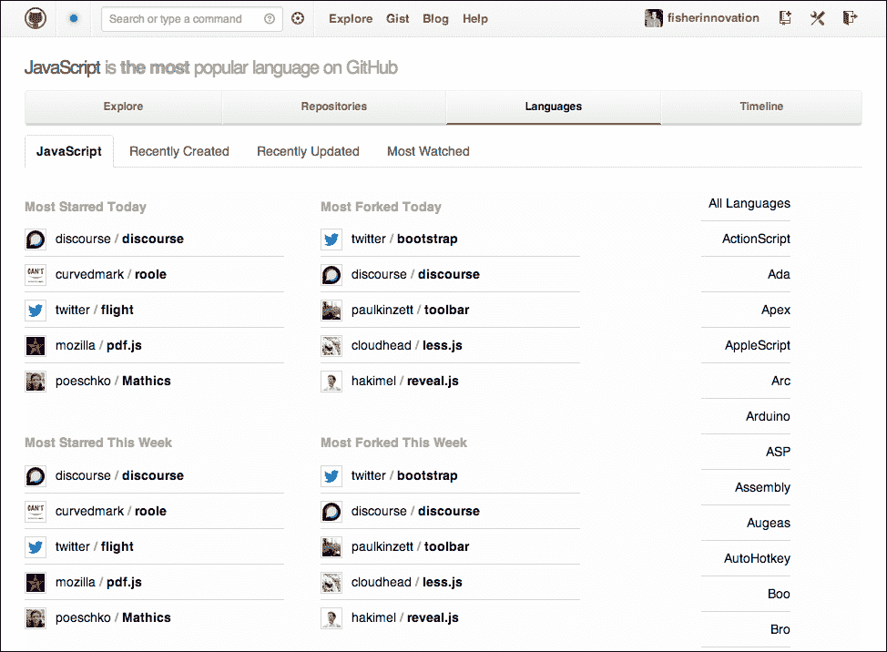
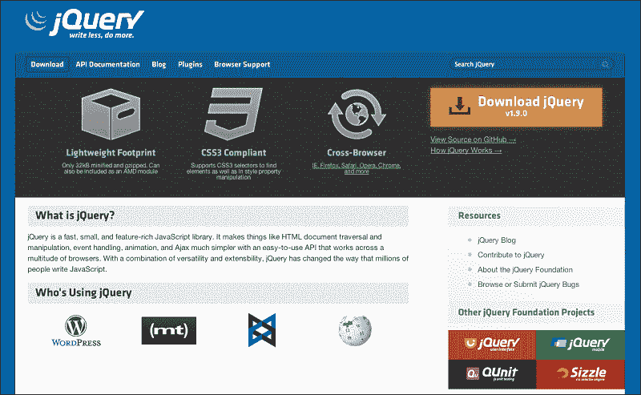
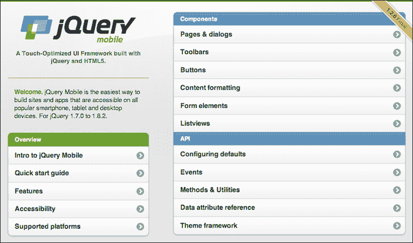
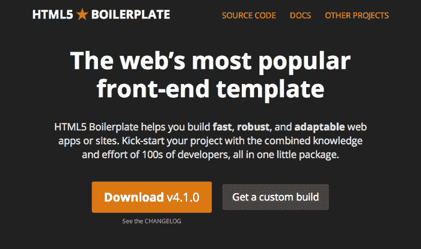
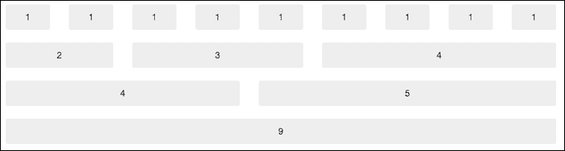
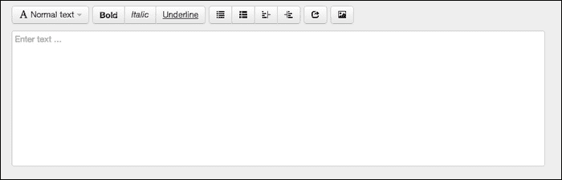
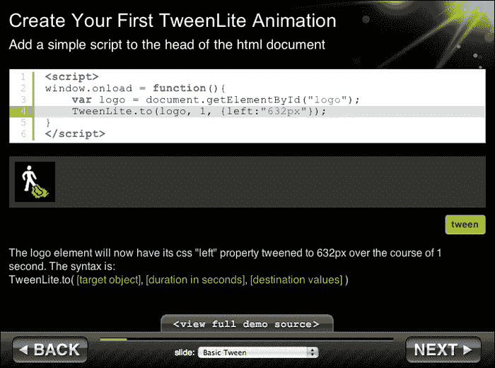
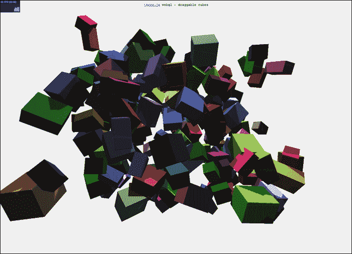
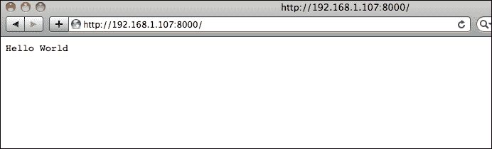

# 六、HTML5 框架和库

使用任何编程语言最令人兴奋的方面之一是发现新的库和框架，这些库和框架可以用来扩展和简化驱动应用的代码。随着围绕 HTML5 开发的流行度在许多不同的平台和设备上的上升，已经公开可用以帮助任何人开发 HTML5 的代码量以惊人的速度增长。在本章中，我们将概述一些最流行的库和框架，您可以随时使用它们，不仅可以节省时间，还可以让您更加专注于用户体验，而不是编写复杂的 JavaScript 来在每个现代浏览器中工作。

在本章中，我们将介绍以下内容:

*   框架和库如何让你的生活更轻松
*   我们可以用框架或库来创建的东西
*   一直流行的 jQuery 库和 jQuery 移动框架概述
*   使用 **HTML5** 样板模板构建 **HTML** 页面
*   使用 Bootstrap 创建响应迅速的统一页面布局
*   使用熟悉的补间引擎和格林斯托克动画平台制作内容动画
*   用流行的 **MVC** 结构开发你的 JavaScript
*   用 WebGL 和`Three.js`编程硬件加速 3D 图形
*   查看谷歌的 V8 项目，了解 JavaScript 编译器的概况
*   借助`Node.js`将 JavaScript 推向应用开发的极限

# 框架和库如何让你的生活更轻松？

从局外人或非开发人员的角度来看，在您的项目中使用他人代码的想法可能会带来许多负面含义。如果你使用的代码是由你不认识的人创建并自由分发的，你怎么能相信它会像 所宣传的那样运行并且不会显示恶意功能呢？传统上，在任何编程语言中导入库和使用框架时，只会利用整个代码库的一小部分。这会导致更大的开销，并可能影响应用运行时的执行速度。尽管所有这些论点都是正确的，但许多关于使用外部库和框架的普遍担忧已经得到解决。在 **HTML5** 项目中使用外部资源的概念已经变得如此普遍，以至于 JavaScript 很容易成为社交编码网站 GitHub([https://github.com/languages](https://github.com/languages))上共享的最流行的编程语言。

得益于 GitHub([http://github.com](http://github.com))等网站，分享和贡献开源项目的概念已经爆炸式增长。在外部库和框架的帮助下，开发人员可以很容易地从他们头脑中的一个概念或想法转移到在几分钟到几小时内构建一个原型。开发人员也可以更专注于实际的概念集成，而不是处理浏览器优化和平台支持等小问题。因此，随着开发人员周围环境的扩展和支持项目的开源项目的增长，升级您的外部依赖关系将导致您的应用的功能集得到最新和最大的支持。

## 我能用 JavaScript 框架和库做什么？

正如您在本书到目前为止的章节中所看到的，现代网络浏览器对 JavaScript 的支持每天都在变得越来越好。将所有应用类型的整个典型应用流转移到网络上的想法越来越成为现实久而久之。 JavaScript 现在开始进入桌面和移动操作系统应用。随着这种新的扩展到如此多的平台，JavaScript 可以做许多你现在可能还不知道的事情。作为一名有创建 Flash 应用经验的开发人员，您可能会发现，在理解和实现许多新的有趣的 JavaScript APIs 时，您将在转到 **HTML5** 方面占据另一个上风。从麦克风和摄像头集成到支持触摸的设备上的多点触摸手势，您可以使用 JavaScript 做的事情数量每天都在增长。为了让您对可能发生的事情更加兴奋，这里列出了 HTML5 应用可以做的一些伟大的事情:

*   动态控制 **CSS** 属性来创建 2D 和三维动画
*   来自客户端摄像头和麦克风的实时音频和视频流
*   借助硬件加速渲染三维图形和高帧率
*   将 JavaScript 直接编译成机器代码，作为服务器或应用运行

## 为您的项目找到合适的库或框架

当涉及到寻找合适的外部资源来包含到您的项目中时，这可能会成为一项繁琐的任务，因为所有项目似乎都在做同样的事情。随着当前 JavaScript 开发的流行，人们只能预计随着越来越多的开发人员发布他们的项目，这个问题会继续恶化。谢天谢地，开发社区是站在你这边的！那么，在他们的 **HTML5** 项目中，人们去哪里寻找最新的和伟大的开源项目呢？嗯，就像互联网上的任何东西一样，没有一站式商店可以找到所有这些可用的项目。然而，随着时间的推移，越来越多的项目被托管在 GitHub([http://github.com](http://github.com))上，这很容易允许开发人员在利用 Git 版本控制系统的同时共享和贡献项目。

像 GitHub 这样的社交编码网站在尝试寻找新项目时，最好的方面不仅是能够按照特定的编程语言对项目进行排序，还能按照项目当前的受欢迎程度进行排序([https://github.com/explore](https://github.com/explore))。GitHub 根据观看、分叉和参与讨论中的项目的其他用户的数量对项目的受欢迎程度进行排名。因此，只要对这些值进行排序，就会显示出无数受欢迎的最新项目。当然，使用网站搜索只会在寻找特定主题和平台时优化您的结果:



因此，在深入研究之后，您可能已经找到了几个您认为适合您需求的库或框架。下一个决定是将选择范围缩小到你可以开始做的事情。那么你怎么选择呢？显然这个问题也没有简单的答案。但是，在下载和实现您已经找到的库或框架之前，有一些重要的注意事项值得考虑。首先要考虑的应该是你预期的最终结果是什么。如果你只是为了学习新框架而为自己编写代码，那么你可以自由下载和测试任何你想要的东西。如果您正在考虑将此代码用于专业用途或一个可能对公众开放的项目，那么花一些时间研究关于所讨论项目的更多细节将有助于您避免今后的麻烦。如果你碰巧发现了一个感兴趣的开源项目，但是这个项目包含很少或者没有开发活动，不管是错误修复还是更新，很有可能它背后的开发团队已经转向了新的项目。因此，您将下载和使用的代码版本将要求您维护和更新它，以便毫无问题地实现和使用它。如果一开始创建项目的开发人员已经放弃了它，他们可能不会很快回来专门帮助你解决问题。另一方面，如果您正在查看一个刚刚诞生或仍处于早期开发阶段的项目，那么如果您将该项目实施到您的项目中，您将需要手动纠正依赖关系中的任何关键问题无论何时出现，都要将其返回到您的项目中。虽然这是大多数开发情况的典型，但在项目的早期阶段(挑选和选择外部资产)您可能会在项目的生命周期中使用这些代码，这始终是值得牢记在心的。

为了让您了解最新的特性，让我们来概述一下在下一个项目中等待您使用的一些优秀的开源项目。

# jQuery

如果不从 jQuery 开始，我们就无法从 JavaScript 库列表开始。到目前为止，在本书中，我们还没有在任何示例中使用 jQuery。然而，如果你在阅读这本书之前花了任何时间研究网络开发，很可能你已经听说过这个项目。jQuery 最初于 2006 年发布，现在已经上升为最受欢迎的 JavaScript 库，在互联网上访问量最大的 10，000 个网站中，超过 55%的网站使用了 jQuery。由于 jQuery 在分散在互联网上的从大到小的项目中的压倒性使用，它已经成为 **HTML5** 开发人员库中几乎必不可少的技能。

### 类型

为了让您了解与 jQuery 相关的所有信息，请前往项目网站[http://jquery.com](http://jquery.com)。

当然，随着 jQuery 的普及，随之而来的是使用它的大量文档、示例和教程。因此，我们不会花大量时间来研究 jQuery 中的所有特性，而只是概述它的工作原理以及您可以使用它做什么。

与本书的所有主题一样，如果你想了解更多，快速的谷歌搜索将会非常有帮助:



那么 jQuery 到底是什么呢？jQuery 是一个相对较小的 JavaScript 库，用于帮助各种常见的 JavaScript 开发任务和问题。通过在文档中轻松选择元素、创建和处理各种事件、在文档中制作元素动画、使用 Ajax 调用和检索外部数据，jQuery 可以为您提供一个更简单、易用和统一的语法，可以在大量的网络浏览器中工作。jQuery 最好的一点是，它可以完成所有这些工作，只需要花费导入一个小于 50 KB 的 JavaScript 文件的成本。

## 将 jQuery 付诸行动

与所有 JavaScript 项目一样，理解 jQuery 的最佳方式是通过示例。因此，让我们快速了解如何将 jQuery 正确地添加到您的项目中，以及如何开始在您的代码中使用它的功能。

一切都从前往 jQuery 项目网站获取项目的最新稳定版本开始([http://jquery.com](http://jquery.com))。可能值得注意的是，对于几乎所有积极开发的开源项目，您会发现许多不同的构建类型可供您下载和使用。一般在访问 jQuery 网站等项目网站时，通常会找到下载项目最新稳定版本的链接。积极开发项目的稳定版本一般不是最新版本，但稳定版本是经过测试并被批准供公众使用的版本。随着开发人员对项目的贡献不断增加，他们将继续增加，直到开发团队批准当前的代码库准备好供公众使用。因此，在软件的每个版本发布之间的整个时间里，都会有一个项目的开发版本，在很多情况下你也可以下载并使用，当然有遇到新的和未记录的问题的已知可能性。

到达 jQuery 下载页面([http://jquery.com/download](http://jquery.com/download))后，您可以选择下载当前版本的压缩或未压缩版本。压缩代码的原因是为了减小文件大小，并在 web 服务器请求时允许更快的加载时间。压缩或压缩 JavaScript 实际上是您可以用代码轻松完成的事情，我们将在后面的章节中继续深入探讨这个主题。现在，您可以继续将这些 jQuery 源 JavaScript 文件保存在您的计算机上，最好保存在您将要创建的 **HTML5** 项目的目录中。一旦创建了一个空的 HTML 文档，导入 jQuery 就像导入任何其他外部 JavaScript 文档一样简单:

```html
<!DOCTYPE html>
<html lang="en">
  <head>
    <meta charset="utf-8" />
    <title>jQuery Importing Example</title>
    <script src="jquery.min.js"></script>
  </head>

  <body>
  </body>
</html>
```

完成这项艰苦的工作后，您现在可以在项目中利用 jQuery 的所有功能。然而，通常需要从一个关键的地方开始，那就是控制代码准备执行的时间点。到目前为止，我们已经使用了许多常见的技术来完成这项任务，例如将`body onload`参数设置为一个 JavaScript 函数。

```html
<body onload="init()">
```

或者在`window`对象上设置`onload`事件:

```html
window.onload = function() {
	// Start executing your code here...
}
```

这种调用 JavaScript 的方式的一个问题是，这种等待加载文档的方式包括等待加载所有图像资产，包括不受控制的外部资产，如横幅广告。因此，jQuery 创建了自己的文档就绪事件处理程序语法来避免这个问题。通常，对于所有基于 jQuery 的项目，要追加的第一段代码将是文档就绪处理程序:

```html
$( document ).ready( function() {
  // Start executing your code here...
});
```

## 用 jQuery 选择元素

jQuery 最伟大的方面之一是它的选择器引擎，也被称为 Sizzle([http://sizzlejs.com](http://sizzlejs.com))。选择器引擎之所以如此出色，是因为在处理 HTML 文档中的交互元素时，它使整个开发过程变得非常容易。考虑我们的工作示例，其中包含一些简单的内容添加:

```html
<!DOCTYPE html>
<html lang="en">
  <head>
    <meta charset="utf-8" />
    <title>jQuery Importing Example</title>

    <!-- Always import external libraries before your custom site code. -->
    <script src="jquery.min.js"></script>

    <script>
      $( document ).ready( function() {
        // Start executing your code here...
      });
    </script>
  </head>

  <body>
    <div>
        <p>
        <a href="http://www.google.com">Go to Google</a>
        </p>
    </div>
  </body>
</html>
```

虽然这个页面布局很简单，但是组成页面的每个元素都可以通过使用 jQuery 选择器在代码中轻松控制。要将事件侦听器添加到我们的谷歌链接中，我们可以将其添加到文档就绪回调函数中:

```html
$( document ).ready(function() {
  $("a").click(function(event) {
    alert("Tell Google I said hello!");
  });
});
```

虽然前面的例子非常简单，但是有几个关键的方面，应该马上涵盖。jQuery 选择器语法依赖于`$()`语法。在我们的例子中，在选择器语法括号内，我们提供参数“`a"`来选择文档主体内的所有`<a>`元素标签。仅仅选择一个元素不会让你走得太远；因此，示例中的下一步是将一个点击事件监听器链接到所选元素。当然，click 事件远不是您可以应用于元素的唯一可用事件，您可以参考事件文档来查看整个列表([http://api.jquery.com/category/events](http://api.jquery.com/category/events))。最后一步是定义用于事件回调的方法，在我们的例子中，我们只是将函数直接定义到回调参数中。

添加、保存并在浏览器中重新加载此更改后，当单击链接时，产生的操作将是一个警告对话框，随后是页面位置([http://google.com)](http://google.com))。如您所见，我们的事件监听器已经在移动到锚点标签中引用的 **URL** 的预定义动作之前被触发。与大量 jQuery 事件配合使用的选择器引擎允许您控制页面中可能发生的大量用户和 web 交互。

覆盖预定义的动作也很容易完成。正如您在我们的示例中定义的回调函数中所看到的，当它被调用时，它会将事件变量传递给方法。此事件属性用于控制事件，可以轻松操作或完全覆盖:

```html
$(document).ready(function() {
	$("a").click(function(event) {
		alert("You're not going anywhere!");
		event.preventDefault();
	});
});
```

通过在事件对象上调用 `preventDefault()`方法，我们可以禁用事件的默认动作，并使用我们自己的代码来控制结果。

## 通过 jQuery 控制 CSS

jQuery 的另一个很好的方面是能够用 CSS3 属性轻松控制元素的外观和感觉。在使用 jQuery 选择器和 CSS 方法时，获取和设置任何元素的 CSS 值都是轻而易举的事情:

```html
$("#example").css("width", 200);
$("#example").css("height", 300);
```

正如您在前面的示例中看到的，为特定元素的宽度和高度设置 CSS 属性非常简单。我们可以将这两行 CSS 属性更新简化为一行，方法是将 CSS 属性传递给一个对象，而不是单独传递它们:

```html
$("#example").css({ width:200, height:300 });
```

这相当于在文档的 CSS 结构中附加以下内容:

```html
#example {
  width:200px;
  height:300px;
}
```

jQuery 中的 CSS 操作不仅仅是为了设置文档中元素的宽度和高度。jQuery 现在完全支持 CSS3 属性，包括圆角、文本效果、不透明度、阴影 2D 和 3D 变换以及滤镜等属性。

### CSS 动画

因为通过 jQuery 控制几乎任何元素的 CSS 属性是可能的，所以也可以轻松地激活它们。

在看一些例子之前，有一些要点需要注意。如[第 2 章](02.html "Chapter 2. Preparing for the Battle")、*备战*和[第 3 章](03.html "Chapter 3. Scalability, Limitations, and Effects")、*可伸缩性、局限性和效果*中所述，与 ActionScript 3 API 相比，当覆盖 CSS 属性及其值时，在文档中定位元素时的值不是基于传统的 x 和 y 值集。相反，在制作元素位置的动画时，应注意元素位置值，以便在想要移动元素时正确定义移动元素的正确值:

```html
<!DOCTYPE html>
<html lang="en">
  <head>
    <meta charset="utf-8" />
    <title>jQuery CSS Animation Example</title>

    <style>
      html, body {
        margin:0;
        padding:0;
        height:100%;
      }
      #example {
        width:200px;
        margin:auto;
        background-color:#EFEFEF;
        border:1px solid #000;
        text-align:center;
        cursor:pointer;
      }
    </style>

    <script src="jquery.min.js"></script>
    <script>
      $( document ).ready( function() {
        $('#example').click(function(event){ 
          // Animate the #example element
          $("#example").animate({
              marginLeft: '0',
              width:'100%',
              height:'100%',
              fontSize:'40px'
          }, 500, function(event) {
          // Update the element paragraph inner HTML.
            $("#example p").html('Animation Complete!');
          });
        });
      });
    </script>
  </head>

  <body>
    <div id="example">
      <p>Click To Begin Animation</p>
  </div>
  </body>
</html>
```

## 用 jQuery Ajax 请求外部数据

由于动作脚本 3 中内置的`URLLoader`和`URLRequest`类，请求项目本地或网络外部的外部数据非常简单。创建一个`URLLoader`以及一个包含数据路径引用的`URLRequest`对象。最后将`URLRequest`对象传递到加载器对象中，调用`load`方法:

```html
Var loader:URLLoader = new URLLoader();
var request:URLRequest = new URLRequest("data.xml");
loader.load(request);
```

当然，为了正确完成这个例子，您需要添加事件处理程序来捕获数据的返回，并知道何时可以开始操作或利用它。然而，从应用中调用和检索外部数据的概念对您来说可能并不陌生。

当用 JavaScript 开发应用时，这种功能的 goto 是 **AJAX** 。 **AJAX** ( **异步 JavaScript 和 XML)** 是一种概念，即在客户端使用您的网页时与您的网络服务器交换数据，而无需重新加载页面。今天在网络上使用 **AJAX** 是如此广泛，以至于在你回复的众多网站或服务中，几乎不可能有一天不使用它。这方面的一个完美例子是在查看脸书时间线或推特订阅源时的无限滚动。当您向下滚动页面查看内容时，运行在引擎盖下的 JavaScript 会检测到您正在到达页面底部，并调用服务器获取更多数据以不断填充列表。传统上，这是通过将数据应用于多个页面并要求用户为每个视图刷新页面来完成的。

那么 jQuery 能做些什么来帮助开发应用的 **AJAX** 功能呢？在 jQuery 库中，有许多方法是专门设计来处理 **AJAX** 请求和请求类型的。

在最基本的形式中，jQuery `load`方法可以检索外部数据，并将其放在选定的元素中，所有这些都在一行 JavaScript 中:

```html
$('#myElement').load('example.html');
```

当然外部资产不需要是 **HTML** 文档。【AJAX 请求中支持 XML 、JavaScript、JSON、纯文本和 HTML 文档。

可以理解的是，您可能并不总是想将来自您的 **AJAX** 请求的传入数据直接放入您的文档中，因此响应处理程序通常放在这些类型的调用中。这可以通过在一个自我实例化的 jQuery 语法中使用 **AJAX** 方法本身来实现:

```html
$.ajax({
    url: 'example.html'
}).done(function(data) {
  if(data != '') {
    $("body").append(data);
  }
});
```

现在有了返回的数据，您可以很容易地操作和验证从 **AJAX** 调用返回的数据，然后假设它已经准备好包含在您的文档中。

数据也可以通过调用外部数据来提供。根据参考文档中脚本的要求，您可以选择通过 **HTTP** GET 请求发送数据:

```html
$.get("getmyphotos.php", { user:"johnsmith", id:"200" })
.done(function(data) {
	console.log(data);
});
```

或者，您可以选择通过 HTTP POST 请求发送数据:

```html
$.post("getmyphotos.php", { user:"johnsmith", id:"200" })
.done(function(data) {
	console.log(data);
});
```

## jQuery Mobile

在不久前，jQuery 背后的团队发布了 jQuery Mobile([http://jquerymobile.com](http://jquerymobile.com))，为开发者构建内容创建了统一的 **HTML5** 用户界面，并将在各种现代移动设备上适当显示。就像 jQuery 本身一样，jQuery Mobile 非常轻量级，甚至带有预构建的打包主题，用于主题化元素设计。jQuery Mobile 旨在通过允许您更专注于应用内容，而不是为浏览器支持编写特殊的垫片和条件代码，来简化您的移动开发过程。开发团队发布更新的速度能够跟上移动设备市场惊人的速度。因此，您可以编写将在尽可能多的设备上运行的移动 web 应用，而不必专门针对每个设备:


自从最初发布以来，jQuery Mobile 已经成长为全网大大小小的网站所使用。jQuery Mobile 框架的核心方面包括页面、对话框、工具栏、列表视图和按钮的使用。通过在框架内围绕这些核心元素开发您的网页和内容，您可以为移动设备布局页面，而无需打开 Photoshop。

jQuery Mobile 充分利用了自定义数据属性，这是 **HTML5** 中的一项新功能。如果您检查下面的示例多页 jQuery Mobile 布局，您将看到许多使用`data-*`语法的元素属性。这些是定制数据属性，现在任何人都可以在他们的 **HTML5** 项目中实现。它们可以有任何字符串，至少是一个字符，可以用来在设置元素属性时轻松声明值:

```html
<body>
  <div data-role="page" id="one">
    <div data-role="header">
      <h1>Page 1</h1>
    </div>
    <div data-role="content" >
      <h2>Page One</h2>
      <p><a href="#two" data-role="button">Show Page 2</a></p>
      <p><a href="page3.html" data-role="button">Show Page 3</a></p>
    </div>
    <div data-role="footer" data-theme="d">
      <h4>Page Footer</h4>
    </div>
  </div>

  <div data-role="page" id="two" data-theme="a">
    <div data-role="header">
      <h1>Page 2</h1>
    </div>

    <div data-role="content" data-theme="a">	
      <h2>Page Two</h2>
      <p><a href="#one" data-direction="reverse" data-role="button" data-theme="b">Back to Page 1</a></p>	
    </div>

    <div data-role="footer">
      <h4>Page Footer</h4>
    </div>
  </div>
</body>
```

如您所见，这个单一的 **HTML** 文件实际上是两页长，用`data-role="page"`元素分隔成 DIV 元素。现在，当 jQuery Mobile 框架加载包含这两个页面的 **HTML** 文件时，将只显示初始页面，第二个页面将等待用户交互滑入视图。在第一页中，您可以看到我们第二页的链接实际上只是一个锚标签，因为它在引用当前 **HTML** 文档中另一页的标识之前使用了`#`字符。为了进一步证明这种差异，在初始页面导航中有第二个到第三个页面的链接，它以传统方式链接到外部 **HTML** 文档。

默认情况下，当请求一个新页面时，数据被加载(如果它还没有被加载的话)并显示在一个 DIV 元素中，这对于最终用户来说实际上是不可见的。当数据加载和文档准备完成后，新页面会从右向左移动到用户可见的显示区域。这种内容动画是许多现代移动设备应用用户界面的典型，因此使您的应用对您的最终用户更加熟悉:


jQuery Mobile 最简单、最精炼的例子之一就是框架的文档。正如您在前面的截图中看到的，默认情况下，jQuery Mobile 的用户界面看起来非常移动友好。按钮很大，很容易伸展以适合页面，允许用户轻松选择菜单项，而不用担心误点击。标题和段落文本易于阅读，并以像素完美的方式定位。图标被添加到文档导航中的特定元素。在打印的截图中看不到的是布局的响应性。为了更好地说明移动端响应能力的重要性，以下是同一 jQuery Mobile 文档网页的截图，窗口更大:



如您所见，同一页面现在响应了更大的浏览器窗口大小，并重新调整了页面布局，以更好地适应可见的显示区域。jQuery Mobile 使用 **CSS** 媒体查询来定义当前视口大小，并调整页面内容的方向，使其适合不同的浏览器大小，而不是让同一个页面显示多个设计。在用 jQuery Mobile 构建网站时，这个过程最大的一部分是，你不需要费心自己写一行 **CSS** 或者定义特殊的**CSS**Media query。

# HTML5 样板

像 jQuery 这样的库非常有助于你轻松地编写 JavaScript，但是让你的项目启动并运行是另外一个问题。页面布局、浏览器故障保护和跟踪代码通常是您最终将添加到项目中的所有内容，这些只是 **HTML5** 样板([http://html5boilerplate.com](http://html5boilerplate.com))中的一些出色功能。HTML5 样板在技术上不是一个库或框架，因为它的核心只是创建 HTML5 文档的一个起点。

然而，由于它的简单性，渴望与网络上的所有变化保持同步，以及它背后的一大群开源贡献，这个 **HTML5** 模板在处理任何大小项目时都是一个很好的开始:



从项目网站下载最新版本的 **HTML5** 样板文件后，您会发现一个文件集合，其中不仅包括您的基本现成`index.html`文件及其引用，还包括一组通常在公共网络服务器上的基础级网站目录中找到的其他常见文件。

为了确切了解这个模板看起来像什么，它实际上为您做了什么，让我们快速浏览一下以下默认的`index.html`文件:

```html
<!DOCTYPE html>
<!--[if lt IE 7]>      <html class="no-js lt-ie9 lt-ie8 lt-ie7"> <![endif]-->
<!--[if IE 7]>         <html class="no-js lt-ie9 lt-ie8"> <![endif]-->
<!--[if IE 8]>         <html class="no-js lt-ie9"> <![endif]-->
<!--[if gt IE 8]><!--> <html class="no-js"> <!--<![endif]-->
    <head>
        <meta charset="utf-8">
        <meta http-equiv="X-UA-Compatible" content="IE=edge,chrome=1">
        <title></title>
        <meta name="description" content="">
        <meta name="viewport" content="width=device-width">

        <!-- Place favicon.ico and apple-touch-icon.png in the root directory -->

        <link rel="stylesheet" href="css/normalize.css">
        <link rel="stylesheet" href="css/main.css">
        <script src="js/vendor/modernizr-2.6.2.min.js"></script>
    </head>
    <body>
        <!--[if lt IE 7]>
            <p class="chromeframe">You are using an <strong>outdated</strong> browser. Please <a href="http://browsehappy.com/">upgrade your browser</a> or<a href="http://www.google.com/chromeframe/?redirect=true"> activate Google Chrome Frame</a> to improve your experience.</p>
        <![endif]-->

        <!-- Add your site or application content here -->
        <p>Hello world! This is HTML5 Boilerplate.</p>

        <script src="//ajax.googleapis.com/ajax/libs/jquery/1.9.0/jquery.min.js"></script>
        <script>window.jQuery || document.write('<script src="js/vendor/jquery-1.9.0.min.js"><\/script>')</script>
        <script src="js/plugins.js"></script>
        <script src="js/main.js"></script>

        <!-- Google Analytics: change UA-XXXXX-X to be your site's ID. -->
        <script>
            var _gaq=[['_setAccount','UA-XXXXX-X'],['_trackPageview']];
            (function(d,t){var g=d.createElement(t),s=d.getElementsByTagName(t)[0];
            g.src=('https:'==location.protocol?'//ssl':'//www')+'.google-analytics.com/ga.js';
            s.parentNode.insertBefore(g,s)}(document,'script'));
        </script>
    </body>
</html>
```

正如你所看到的，这个模板 HTML 文件做得很好，谢天谢地，它被很好地记录了下来。从上到下，这个例子充满了浏览器检查和故障保护，对网络和移动平台的网站图标的引用，对 Modernizr 的引用，以清理开发环境并将其设置为一个统一的平台作为开始，以及对 jQuery 和默认代码的引用，包括谷歌分析访问者跟踪。

HTML5 样板文件是在麻省理工学院的许可下开发的，甚至包括一些改进和优化的网络服务器配置，如果你有兴趣简化你的网络服务器传递内容的方式，可以使用这些配置。

# 自举

如果你像我一样，喜欢写代码，而不是在 Photoshop 中处理设计和创建页面，你可能会对 Bootstrap 非常感兴趣，Bootstrap 是由两名 Twitter 员工创建的。Bootstrap 是一个 HTML5 框架，旨在允许开发人员基于 12 列网格系统轻松创建强大且响应迅速的页面布局和设计。通过支持在所有现代设备和浏览器上正确呈现页面布局，Bootstrap 省去了编写几个小时的 CSS 和 JavaScript 的需要，以便以通用方式向所有用户正确显示您的内容，无论他们试图如何查看您的内容:


像本章介绍的许多项目一样，使用 Bootstrap 开发的新项目启动和运行非常简单。只需前往[http://twitter.github.com/bootstrap](http://twitter.github.com/bootstrap)的项目网站，下载最新版本。下载并取消归档后，将下载的目录内容移动到项目目录的根目录中。您会注意到，下载的引导文件并不包含一个可供您开始工作的 HTML 文件，而是希望您自己生成。这是因为页面没有被定义为特定的布局模板。Bootstrap 利用网格布局系统，允许开发人员轻松地将他们的站点内容以网格的格式放置，从而轻松地允许适当定义的布局，该布局可以轻松地响应动态浏览器窗口大小:



默认的引导布局建立在 12 列网格布局上，有无限多的行，因为行溢出只会导致典型的网页滚动。回顾上图中的示例网格布局，您可以非常直观地看到您每天使用的每个网站，以及它是如何在这样的网格中排列的。因为这个网格布局系统对几乎任何网页设计都非常有价值，所以它可以在您将来遇到的几乎每个 HTML5 项目中对您有用。

如果您仍然不相信 Bootstrap 是您网站的可行解决方案，请前往 Bootstrap 项目网站的**示例**部分，查看使用该项目的热门网站的最新列表[。](http://twitter.github.com/bootstrap/getting-started.html#examples)

## 引导加载项

随着Bootstrap 的流行以如此快的速度增长，用户贡献的数量也开始跟着增长。许多这些第三方外部插件和功能可以添加到现有的引导设置中，以扩展其基本功能。让我们快速浏览一下这些项目中最受欢迎的一些，让您对可用的内容有所了解。

### StyleBootstrap.info

虽然 Bootstrap 在创建元素时有许多不同的颜色可供选择，但是你想要进一步定制 T2 的可能性还是很高的。`StyleBootstrap.info`([http://style bootstrap . info](http://stylebootstrap.info))是一个很好的在线资源，只需简单的点击和选择用户界面，就可以轻松定制您的 Bootstrap 设置的外观和感觉。一旦你完成了你的设计，网站将生成必要的 **CSS** 文件供你下载并包含在你的项目中。

### 字体惊人

另一个扩展 Bootstrap 中已经存在的特性集的伟大库是 Font Awesome([http://fortawesome.github.com/Font-Awesome](http://fortawesome.github.com/Font-Awesome))。虽然听起来这是框架新增的字体，但实际上是一个附加的图标集，可以很容易地实现到你的设计中。引用字体概念的原因是，图标集实际上是在打包的字体中实现的，以实现可缩放的矢量图形，而不是在 **HTML** 文档中找到的典型位图图形。由于您来自 Flash 背景，您可能已经了解了矢量图形在缩放图像时有多重要，因此您可能会明白为什么使用字体打包概念会形成一个非常易于使用的库。包中的所有图标都有特定的名称，通过在 **HTML** 元素中将该唯一的图标名称作为类调用，可以很容易地在页面中实现:


正如您在前面的截图中所看到的，它只显示了包中可用图标的一小部分，每个图标都有一个特定的名称。根据项目文档的规定，将图标附加到文档中的最佳方式是在`<i>`的类属性中调用唯一的图标名称或斜体 **HTML** 标记。例如，如果我们想在文档中的单词“Books”旁边放置一个 book 图标，HTML 语法将表示如下:

```html
<p><i class="icon-book"></i> Books</p>
```

由于斜体标签几乎可以放在任何 HTML 元素中，这允许您将图标放在任何需要的地方，比如在 Bootstrap 自定义按钮中:

```html
<a href="books.html" class="btn">
<i class="icon-book"></i> Books
</a>
```

同样，值得注意的是，由于字体包是以矢量格式保存的，以允许动态字体大小，默认引导设置中的图标以及该项目中的图标都是矢量格式的。要更改文档中图标的大小，您只需设置`font-size`属性或将其附加到已经配置了字体样式的元素中。

### 自举-wyshitml 5

如果你正在计划构建需要大量基于文本的用户输入的网络应用，那么 Bootstrap **所见即所得**(所见即所得)库值得一看([http://jhollingworth.github.com/bootstrap-wysihtml5](http://jhollingworth.github.com/bootstrap-wysihtml5))。只需几行代码，您就可以轻松地为用户实现优雅的基于工具的输入表单，以构建基于格式化的 **HTML** 文本内容:



虽然很简单，但这只是在互联网上免费分发并随时供您在项目中使用的众多优秀示例中的另一个。

# Hammer.js

如果你计划进入移动网络开发的快速发展世界，处理新的事件，如触摸交互将是必须的。虽然在支持触摸的设备上使用时，传统的 JavaScript 鼠标事件会直接转换为基本的触摸事件，但是像滑动和捏捏这样的事件在传统的桌面用户交互中并不常见([http://eightmedia.github.com/hammer.js](http://eightmedia.github.com/hammer.js))。

Hammer.js 目前支持轻敲、双击、轻扫、按住、捏(变换)和拖动事件，无论您是否使用 jQuery，都可以轻松实现到任何已存在的网站中。由于库的简单性，缩小和压缩后的结果文件大小仅为 2 KB:

```html
<!DOCTYPE html>
<html lang="en">
  <head>
    <meta charset="utf-8" />
    <title>Hammer.js Example</title>

    <style>
      body {
        padding:10px;	
      }
          #touch-area {
              border: 5px dashed #000;
              text-align: center;
              width: 100%;
              line-height:10px;
              padding-top:200px;
              padding-bottom:200px;
          }
          #touch-area p {
          font-size: 30px;
          }
          #touch-area p.subtext {
          	font-size:12px;
          	color:#666;
          }
      </style>

      <script type="text/javascript" src="http://code.jquery.com/jquery-1.9.1.min.js"></script>
    <script type="text/javascript" src="lib/hammer.js"></script>
    <script type="text/javascript"  src="lib/jquery.specialevent.hammer.js"></script>
    <script>
      function hammerLog(event){
          event.preventDefault();
          $('#output').prepend( "Type: " + event.type + ", Fingers: " + event.touches.length + ", Direction: " + event.direction + "<br/>" );
      }

      $(document).ready(function() {
        var events = ['hold', 'tap', 'swipe', 'doubletap', 'transformstart', 'transform', 'transformend', 'dragstart', 'drag', 'dragend', 'swipe', 'release'];

        $.each(events, function(key, val) {
          console.log('NOTICE: Applying Touch Event: ' + val);
          $('#touch-area').on(val,  hammerLog);
        });  
      });
    </script>
  </head>

  <body>
    <div id="touch-area">
      <p>Touch here to see results<p>
      <p class="subtext">For best results, open this page on a touch enabled device.</p>
    </div>

    <p id="output"></p>
  </body>
</html>
```

# 格林斯托克动画平台

如果你花了足够多的时间开发 Flash 应用，很可能你之前已经进入了绿色锁 TweenMax 或 TweenLite 库。TweenMax 和 TweenLite 库支持 ActionScript 2 和 ActionScript 3 项目，使您可以轻松地在舞台周围切换 Flash 对象。格林斯托克现在已经生产并发布了他们的库的纯 JavaScript 实现，没有依赖关系，为您的 HTML5 项目带来了许多熟悉的特性。

那么在看了 jQuery 动画方法和它们能做什么之后，为什么需要使用这样的库呢？嗯，与 jQuery 不同，GSAP JS 是为了非常好地做一件也是唯一一件事情而构建的。像对动画进行排序以启用正确定时的动画、覆盖控件以随时停止运行动画，以及对几乎任何东西进行动画制作的能力这样的功能将相对容易地扩展您的 web 应用的视觉吸引力。

和 ActionScript 配套程序一样，GreenSock JavaScript 库([http://www.greensock.com/v12](http://www.greensock.com/v12))包含了大量最新的优秀文档和示例，将引导您朝着正确的方向出发。事实上，他们专门创建了一个可视化的跳转开始指南，让您轻松启动并运行库，并在浏览器中演示代码的结果:



GSAP JS 文档最好的补充是交互式跳转开始指南，可以在[http://www.greensock.com/jump-start-js/](http://www.greensock.com/jump-start-js/)找到。这个简单易用的交互式应用让你从以前从未使用过这个库，到在几分钟内准确理解它能做什么；我不能强调这是一个多么伟大的功能。

同样，如果您在之前的任何 Flash 项目中使用过 GreenSock TweenMax 或 TweenLite 库，那么您将会非常轻松地转到 GSAP JS。如上所述，大多数 ActionScript 3 开发人员在使用这个库时将面临的主要问题是正确处理 **CSS3** 属性，这些属性是为 Tweens 正确运行而提供的。

# 三. js

如果硬件世界加速 3D 图形合你意，`Three.js`([http://mrdoob.github.com/three.js](http://mrdoob.github.com/three.js))绝对值得一看。这个轻量级的 3D 库非常容易启动和运行，并且在网络上有大量的例子和文档。`Three.js`不仅使用`<canvas>`元素进行渲染，还使用`<svg>`、`CSS3D`和`WebGL`来支持各种现代浏览器和设备。

为了让对`Three.js`在印刷方面的能力有所了解，请查看我在查看`Three.js`项目网站上的一些示例项目时拍摄的一些漂亮的屏幕截图:





从前面的截图中可以看到，JavaScript 和 WebGL 在很短的时间内取得了长足的进步。同样，所有这些截图都是从`Three.js`项目网站上找到的例子中截取的，所以一定要去那里亲自尝试一下，看看它们在你的机器和浏览器上运行得有多好。请记住许多现代移动设备网络浏览器都渴望获得更强大的 WebGL 支持，因此也可以在手机或平板电脑上尝试一下。

在开始开发您的`Three.js`项目之前，确保您熟悉 3D 编程的许多常见方面和原理是明智的。在其核心，典型的`Three.js`应用将包括场景、渲染器、相机和对象。这些元素中的每一个都将相互协作，以创建三维环境。在线学习`Three.js`最好的入门教程之一是由*Paul Lewis*(http://www . aerotwist . com/tutories/入门三个 js )撰写的*入门三个 js* 文章。其中，他涵盖了 3D 编程的所有原则，以及如何在`Three.js`框架内利用它们。

在不涉及太多细节的情况下，因为已经有许多优秀的书籍和在线资源来学习 Three.js 开发，这里有一个非常简单的代码布局，用于在`Three.js`中渲染场景:

```html
// Scene sizes
var WIDTH = 500;
var HEIGHT = 300;

// set some camera attributes
var VIEW_ANGLE = 45,
    ASPECT = WIDTH / HEIGHT,
    NEAR = 0.1,
    FAR = 10000;

// get the DOM element to attach to
var $container = document.getElementById('example');

// create a WebGL renderer, camera
// and a scene
var renderer = new THREE.WebGLRenderer();
var camera = new THREE.PerspectiveCamera(  VIEW_ANGLE,
                                ASPECT,
                                NEAR,
                                FAR  );
var scene = new THREE.Scene();

// the camera starts at 0,0,0 so pull it back
camera.position.z = 300;

// start the renderer
renderer.setSize(WIDTH, HEIGHT);

// attach the render-supplied DOM element
$container.append(renderer.domElement);

// create the sphere's material
var sphereMaterial = new THREE.MeshLambertMaterial({ color: 0xCC0000 });

// Set up the sphere vars
var radius = 50, segments = 16, rings = 16;

// Create a new mesh with sphere geometry -
// we will cover the sphereMaterial next!
var sphere = new THREE.Mesh(
   new THREE.SphereGeometry(radius, segments, rings),
   sphereMaterial);

// Add the sphere to the scene
scene.add(sphere);

// and the camera
scene.add(camera);

// create a point light
var pointLight = new THREE.PointLight( 0xFFFFFF );

// set its position
pointLight.position.x = 10;
pointLight.position.y = 50;
pointLight.position.z = 130;

// add to the scene
scene.add(pointLight);

// draw!
renderer.render(scene, camera);
```

从前面`Three.js`代码示例的顶部开始，我们可以看到最初阶段的大小被附加到一个`WIDTH`和`HEIGHT`变量。这些属性是每个 Flash 开发人员都熟悉的，它们定义了将呈现内容的可视区域。舞台配置之后是初始摄像机配置。创建 3D 场景时，渲染前端的结果视图将来自场景中放置的摄像机的视角。就像任何其他对象一样，相机可以根据 x、y 和 z 值以及视角、相机纵横比和缩放能力等属性四处移动。在相机配置之后，我们需要将文档中的一个特定元素设置为我们的舞台，对我们已经在 HTML 文档中创建的元素进行`document.getElementById`查找就可以了。设置好配置值，选择一个元素准备设置场景，我们就可以开始初始化`scene`元素了。

当然`Three.js`项目不要求百分百是 JavaScript。一旦场景设置完毕并准备好进行查看，转到 3D 建模软件(如 Blender 或 Maya)将允许您创建极其详细的 3D 对象，这些对象可以轻松地导入回您的 HTML5 项目中。正如您在之前的一些示例图像中看到的，可以获得的细节水平简直令人惊叹。

关于在 JavaScript 中使用 3D 或 WebGL 的最后一个注意事项:。浏览器中当前对 WebGL 的支持已经在桌面环境中广泛存在。在几乎每一个现代桌面网络浏览器中查看或测试你的项目应该没有什么问题；但是，您可能仍然会发现移动浏览器的许多限制。随着 Chrome 实验网站([http://www.chromeexperiments.com/webgl/](http://www.chromeexperiments.com/webgl/))的出现，谷歌桌面和手机上的 Chrome Browser 正试图推动 WebGL 的极限。该网站包含大量优秀的示例和项目，可以让您轻松测试正在运行的任何浏览器、设备或平台，以了解它在硬件加速图形处理方面的表现。

# 编译 JavaScript

将 JavaScript 仅仅视为用于 HTML 元素操作的前端开发语言的日子已经一去不复返了。随着 JavaScript 编译器的出现，只需编写一些 JavaScript 代码就可以完成一些难以想象的事情。就像你在 Flash 中使用的方法一样，ActionScript 被编译成二进制包，JavaScript 编译器将纯 JavaScript 转换成机器代码，机器代码可以像任何其他应用一样在计算机上运行。就这个概念而言，实际上有很多很好的理由，最好是在网络浏览器中使用。

## 谷歌的 V8 引擎

2008 年末，谷歌发布了 Chrome 的初始版本，随之而来的还有 V8 引擎的初始版本。V8 将 JavaScript 直接编译为本机机器代码，甚至在编译时优化代码。结果是应用可以像用 Python 或 C++编写的应用一样运行。 V8 是用 C++编写的，自最初发布以来一直是开源的，公众可以免费获得。您可以通过访问位于[http://code.google.com/p/v8](http://code.google.com/p/v8)的项目网站了解更多关于谷歌 V8 项目的信息。

## Node.js

谷歌 V8 引擎诞生的最酷的新项目之一是 node . js([http://nodejs.org](http://nodejs.org))。`Node.js`允许你用 100%的 JavaScript 编写服务器端应用(通常是 web 服务器)，这通常是用编程语言完成的，比如 **PHP** 、 **Perl** 、 **Python、**甚至 **C** 或 **C++** 。

像本章介绍的许多框架和库一样，`Node.js`在网络上有大量的优秀文档和示例。然而，随着一些项目的开发速度，可用的文档很容易过时。`Node.js`的最佳资源之一是由`Node.js`项目的早期核心贡献者之一*菲利克斯·盖森德尔*创建的[http://nodeguide.com](http://nodeguide.com)，该资源不断更新到项目的当前稳定版本。

由于`Node.js`是在服务器端运行的，而不是将其包含在您的 **HTML5** 项目中，因此您必须将其安装在计算机上作为应用运行。因此，在您选择的机器上下载并安装`Node.js`文件后，您现在可以像运行任何其他命令行应用一样，从命令行运行您的`Node.js`就绪的 JavaScript 文件。

为了演示如何启动`Node.js`应用的基本用法，我们将使用流行的`Node.js` web 服务器示例，该示例可以在官方文档中找到。用文件名`example.js`创建一个新的 JavaScript 文件，并用以下 JavaScript 填充它:

```html
var http = require('http');

http.createServer(
  function (request, response)
  {
    response.writeHead(200, {'Content-Type': 'text/plain'});
    response.end('Hello World\n');
  }
).listen(8000);

console.log('Server running at http://localhost:8000/');
```

示例代码的第一行是在`Node.js`框架内导入 **HTTP** 模块。包含 HTTP 模块后，调用`createServer`方法，并提供一个成功函数。该功能包含一个简单的“你好世界”问候语，并将`Content-Type`设置为`text/plain`，因此查看它的浏览器知道它只是纯文本。最后，`listen`方法被链接到服务器声明中以指定端口，服务器将在该端口上监听请求。

保存文件后，在运行`Node.js`的系统上打开命令行，将当前工作目录指向新的 JavaScript 文件的位置，并键入以下命令。使用`Node.js`执行文件就像使用*节点*应用引用 JavaScript 文件一样简单:

```html
% node example.js

```

执行此命令将导致以下响应:

```html
Server running at http://localhost:8000/

```

命令行将等待物理终止。在停止服务器之前，我们必须进行测试，以确保它能够工作。因此，在执行`node`命令后，前往响应中所述的网址:



虽然这个输出很简单，但事实是您只使用 JavaScript 创建了一个简单的自定义 web 服务器。这只是`Node.js`所能提供的开始，最棒的是`Node.js`可以完成的许多伟大的事情，已经完成了，并且可以让你随时找到和使用。`Node.js`不是花几个小时在谷歌上搜索要包含在你的项目中的模块，而是使用自己的系统来查找更多的功能并将其安装到你的`Node.js`服务器中。

## 节点包管理器

如果你还不确定`Node.js`能为你做什么， **NPM** ( **节点包管理器** ) 也许能帮到你。包管理器是一个包的在线集合，可以在节点项目中轻松下载和使用。由于`Node.js`安装在您的机器上，当检查依赖项、版本和平台支持时，包管理器可以完成所有的艰苦工作。要轻松搜索当前的`Node.js`**【NPM】**目录，前往[https://npmjs.org](https://npmjs.org)并四处浏览，直到找到您感兴趣的安装:


通过在命令行中运行 install 命令，可以很容易地将注册表中的任何软件包安装到您的系统上:

```html
% npm install PACKAGE-NAME

```

如前所述，如果您请求安装的软件包需要注册表中的其他软件包，它们也会自动下载并安装，而无需您自己去寻找合适的版本。当开发人员处理您可能正在使用的软件包并发布更新时，NPM 注册中心将自动负责用发布信息更新您，并允许轻松更新您可能已经安装的任何过期软件包。

## 托管公共 Node.js 服务器

由于您需要有一个服务器来运行您的`Node.js`项目，您将需要设置一个面向公众的服务器来托管您希望对互联网开放的任何项目。由于在您的计算机上安装`Node.js`进行测试无法实现这一点，您将需要自行设置适当的网络，或者从`Node.js`托管公司支付这项服务的费用。由于您用于网络托管的公司通常不允许您实现这一点，因此查看 Nodejitsu([http://nodejitsu.com](http://nodejitsu.com))等服务可能会有所帮助:


就像传统的网络托管公司一样，Nodejitsu 提供了自己的面向公众的`Node.js`服务器，可以从你的任何网络项目在线使用。你可以从一个免费的试用账户开始，了解这项服务如何让你从世界任何地方使用你的`Node.js`服务器，然后如果你的需求继续，进入付费账户。

# 总结

这一章只是对你作为一个 **HTML5** 开发者所能得到的东西进行了表面的掸灰。这里展示的是一些目前最流行的库和框架的集合。世界各地的开发人员已经公开发布并积极开发的大量惊人代码正在以似乎超出指数级的速度增长。分配和利用像本章中列出的外部资产，要求您(开发人员)在将它们实现到一个公开可用的网站之前，了解使用库或框架的含义和好处。

花时间去挖掘、测试和贡献太多你感兴趣的项目，不仅能让你现有的开发技能受益，还能让你利用手头工作的最佳工具。久而久之和网络开发的格局在继续发展，保持这些流行的库和框架的更新将总是有助于你保持对整个 **HTML5** 开发环境的更新。

在下一章中，我们将把这种新获得的 HTML5 框架和库的知识扩展到直接将您现有的 Flash 应用移植到 HTML5 网络就绪项目的领域。