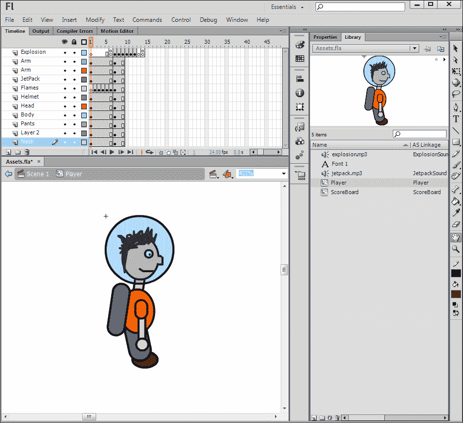
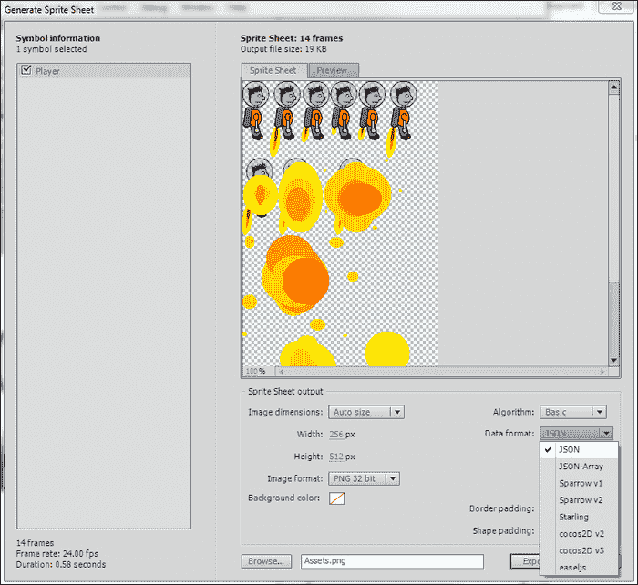
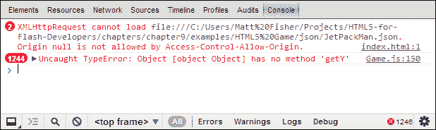
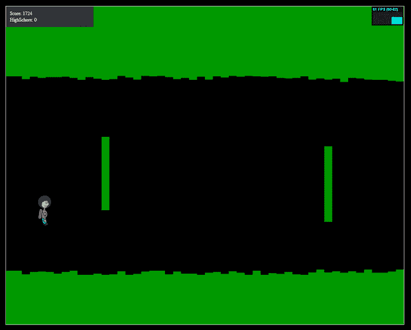
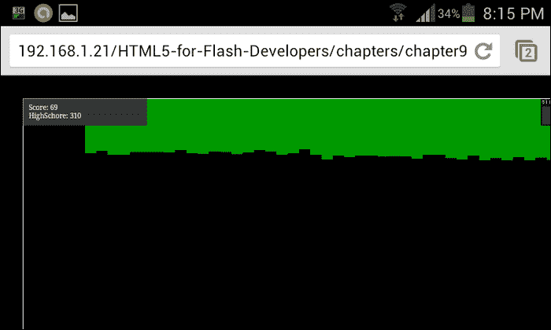

# 九、避开障碍

到目前为止，在本书中，我们已经用 HTML5 介绍了 web 开发的许多令人兴奋的新方面。然而，在这段时间里，我们只把每个特性看作是一个独立的方面，而不是一个更大项目的一部分。当涉及到为现实世界构建应用时，您将不可避免地开始将这些新功能合并在一起，以在您的应用中构建适当的功能集。在这一章中，我们将使用作为网络开发者的你可以使用的一些新的和旧的特性来构建一个可玩的游戏。从一个内置闪存的版本开始，我们将在 HTML5 中构建一个应用的直接端口，并讨论您在处理资产和功能时可能遇到的差异和问题，这些资产和功能是您在动作脚本和闪存开发世界中已经习惯的。

# 喷气背包游戏

我们将构建的应用是一个简单的 2D 侧滚游戏，具有简单的控件，可以轻松转换为移动设备的触摸事件。为了让事情易于解释和理解，我将这款游戏模仿了流行多年的《直升机游戏》([【http://www.helicopter-game.org/】](http://www.helicopter-game.org/))进行建模。

以下截图显示了直升机游戏:


虽然网上已经有很多版本的这个游戏，但是最流行的都是用 Flash 写的，让很多手机和桌面浏览器上的用户无法玩。游戏的玩法和控制非常简单，只需要玩家用键盘上的一个键或者用鼠标点击就可以了。

我们不会试图直接复制这款热门游戏，而是将其作为游戏设计的起点。为了给游戏增加我们自己的个人风格，我们将把直升机角色切换成一个带喷气背包的小个子。在我们开始之前，看一下下面的游戏截图，以便更好地了解我们的最终结果是什么样子。当然，您可以通过查看本章示例文件中包含的该应用的 Flash 和 HTML 版本来自己玩游戏:


你在这个游戏中扮演的角色是上一张截图左边显示的喷气背包男。你的目标是通过激活他的喷气背包来控制角色的高度。随着你的角色深入洞穴系统，不仅洞穴会变得越来越紧，而且会有随机放置的障碍物，你需要引导自己绕过。重力也起着重要的作用，因为当你的喷气背包没有被激活的时候，你的玩家会开始掉回地面。随着玩家深入洞穴，关卡对象会实时动态生成，随着难度的增加，关卡对象会被限制在更紧的位置。在游戏源代码的每个间隔期间，检查关卡的每个部分是否与玩家冲突，以确定游戏是否结束。游戏的每个间隔也会增加玩家当前的分数，所以你进入洞穴越深，你的分数就会越高。高分在游戏实例中被跟踪并显示在用户界面中，以允许玩家容易地看到下一次尝试的目标是什么。

正如我之前提到的，我们将首先查看用 ActionScript 3 编写的这个游戏的源代码，以了解我是如何编写它的。当然，这伴随着免责声明，虽然这个游戏代码的某些方面可能在其他项目中对你有用，但是这个游戏的源代码已经被设置来帮助我们学习和理解动作脚本 3 到 HTML5 的转换。这款游戏还没有优化到应该公开发行的程度，我会在这一章尽我所能指出其中的一些不足之处。考虑到所有这些，让我们直接跳到这个喷气背包游戏的 Flash 版本的源代码结构。

## 在 Flash 中构建游戏

为了让事情变得简单明白，我们将在这个游戏中保持最少的行数和文件数。我们将从名为`Game`的动作脚本项目的基类开始。查看下面的压缩基类示例，了解游戏的代码结构。您可以随时查看可下载章节示例文件的完整版本:

```html
package {
  import flash.display.Sprite;
  import flash.events.Event;
  import flash.events.KeyboardEvent;

  [SWF(width='1000', height='800', backgroundColor='#000000', frameRate='60')]
  public class Game extends Sprite {
    private var _levelBlocks:Array = new Array();
    private var _interval:int;
    private var _blockInterval:int;
    private var _player:JetPackMan;
    private var _difficulty:int = 10;
    private var _speed:int = 10;
    private var _keyDown:Boolean;
    private var _score:int;
    private var _highScore:int;
    private var _scoreBoard:ScoreBoard;
    private var _gameOver:Boolean;

    public function Game() {
      generateLevel();
      createPlayer();
      displayScore();

      this.addEventListener(Event.ENTER_FRAME, updateI terval, false, 0, true);
      stage.addEventListener(KeyboardEvent.KEY_DOWN, onKeyDown, false, 0, true);
      stage.addEventListener(KeyboardEvent.KEY_UP, onKeyUp, false, 0, true);
    }

    // Starts a new game.
    private function startNewGame():void {
      // Reset the game switches and counters.
      _gameOver = false;
      _score = 0;
      _speed = 10;
      _difficulty = 10;

      for each(var block:LevelBlock in _levelBlocks) {
        block.destroy();
        removeChild(block);
      }
      _levelBlocks = new Array();

      removeChild(_player);
      _player.destroy();
      _player = null;

      generateLevel();
      createPlayer();

      this.addEventListener(Event.ENTER_FRAME, updateInterval, false, 0, true);
    }

    // Adds the score board to the stage.
    private function displayScore():void {
      _scoreBoard = new ScoreBoard();
      _scoreBoard.x = -40;
      _scoreBoard.y = -20;
      addChild(_scoreBoard);
    }

    // Generates the beginnings of a new level.
    private function generateLevel():void {
      for(var i:int = 0; i < 20; i++) {
        var randomHeight:int = (Math.floor(Math.random() * (_difficulty - (_difficulty - 10) + 1)) + (_difficulty - 10));
        var levelBlock:LevelBlock = new LevelBlock(_speed, 800 + (20 * i), randomHeight - 10, 20, 100);
        _levelBlocks.push(levelBlock);
        addChildAt(levelBlock, 0);

        randomHeight = (Math.floor(Math.random() * (_difficulty - (_difficulty - 10) + 1)) + (_difficulty - 10));
        var bottomLevelBlock:LevelBlock = new LevelBlock(_speed, 800 +(20 * i), (randomHeight * -1) + 750, 20, 100);
        _levelBlocks.push(bottomLevelBlock);
        addChildAt(bottomLevelBlock, 0);
      }
    }

    // Creates and adds a player object to the stage.
    private function createPlayer():void {
      _player = new JetPackMan();
      _player.x = 80;
      _player.y = 400;
      addChild(_player);
    }

    // Called on keyboard key down.
    private function onKeyDown(e:KeyboardEvent):void {
      if(_gameOver) startNewGame();
      _keyDown = true;
    }

    // Called on keyboard key up.
    private function onKeyUp(e:KeyboardEvent):void {
      _keyDown = false;
    }

    // Game interval. Called on each frame.
    private function updateInterval(e:Event):void {
      _score = _score + 1;
      _scoreBoard.score.text = String(_score);

      if(_keyDown) {
        _player.jetPackOn();
        _player.y = _player.y - 5;
      } else {
        _player.jetPackOff();
        _player.y = _player.y + 5;
      }

      _interval++;
      var increaseSpeed:Boolean = false;
      if(_interval >= 100) {
        increaseSpeed = true;
        _difficulty = _difficulty + 5;
        //_speed++;
        _interval = 0;
      }

      // Update every block
      for each(var block:LevelBlock in _levelBlocks) {
        block.update();

        if(block.hitTestObject(_player)) {
          _player.explode();
          _gameOver = true;

          if(_score > _highScore) {
            _highScore = _score;
            _scoreBoard.highscore.text = String(_highScore);
          }

          this.removeEventListener(Event.ENTER_FRAME, updateInterval);
        }

        if(increaseSpeed) block.setSpeed(_speed);
      }

      // Check if new blocks need to be added
      if(_levelBlocks[_levelBlocks.length - 1].currentX() < 2000) {
        var randomHeight:int = (Math.floor(Math.random() * (_difficulty - (_difficulty - 10) + 1)) + (_difficulty - 10));
        var levelBlock:LevelBlock = new LevelBlock(_speed, _levelBlocks[_levelBlocks.length - 1].currentX() + 20, randomHeight - _difficulty, 20, 100 + _difficulty);
        _levelBlocks.push(levelBlock);
        addChildAt(levelBlock, 0);

        randomHeight = (Math.floor(Math.random() * (_difficulty - (_difficulty - 10) + 1)) + (_difficulty - 10));
        var bottomLevelBlock:LevelBlock = new LevelBlock(_speed, _levelBlocks[_levelBlocks.length - 1].currentX(), (randomHeight * -1) + 750, 20, 100 + _difficulty);
        _levelBlocks.push(bottomLevelBlock);
        addChildAt(bottomLevelBlock, 0);
}

      // Add a random block every now and then to make things interesting.
      // We will base the frequency of random blocks on the // current difficulty in the game.
      _blockInterval++;
      if(_blockInterval > 5000 / _difficulty) {
        _blockInterval = 0;

        randomHeight = (Math.floor(Math.random() * (750 - 5 + 1)) + 5);
        var randomY:int = (Math.floor(Math.random() * (750 - 5 + 1)) + 5);
        var randomBlock:LevelBlock = new LevelBlock(_speed, _levelBlocks[_levelBlocks.length - 1].currentX(), randomY, 20, 100 + _difficulty);
        _levelBlocks.push(randomBlock);
        addChildAt(randomBlock, 0);
      }
    }

  }
}
```

这个单一的类设法处理大部分的游戏性和用户交互。游戏根据游戏内设定的当前难度系数不断更新。随着游戏的进行，难度被转化为滚动速度，因为等级内的每个资产都被更新并被设置为以更大的数量改变其 x 位置值。虽然还有两个类可以支持玩家和所有关卡的创建，但我会留给你去挖掘。

## 转换游戏资产

为了开始准备这款游戏移植到 HTML5，我们将从游戏中使用的资产开始，将它们转换并为网络做准备。为了在这个游戏中创建用户界面和玩家对象，我创建并发布了一个 Flash SWC，它包含在 Flash Builder 的这个动作脚本项目中。SWC 内的资产不仅包含游戏中使用的对象和动画，还包含声音，如下图所示:



正如你在之前的截图中所看到的，我粗糙的手绘喷气背包男有一个基于时间线的关键帧动画序列附在他身上，允许他在视觉上打开和关闭他的喷气背包，以及当他撞击任何墙壁时爆炸。这个时间线动画有一些简单的动作脚本附加到一些帧，这使得动画序列容易停止和循环。

要将播放器电影剪辑转换为 HTML5 就绪资产，我们将使用前几章中讨论过的 Sprite 工作表生成器工具，如下图所示:



在**生成精灵表**窗口中，将图像压缩为尽可能小的布局并优化输出属性后，将**数据格式**属性设置为 **JSON** 并导出数据。编译后的精灵表以及 **JSON** 文件将用于复制我们的 HTML5 转换的玩家动画。一旦我们准备好了玩家精灵表，我们就可以暂时把它放在一边，同时转换剩余的资产。

现在让我们继续准备游戏中使用的音频。Flash SWF 中的音频资产可以很容易地为 HTML5 做好准备，只需找到源 MP3 文件并将其放在 HTML5 游戏项目目录中。由于 MP3 文件在`<audio>`元素下支持在 HTML5 中使用，所以不需要进一步的准备来为我们的转换准备音频。HTML5 音频的棘手部分只有在您需要在代码中处理它时才会出现，我们将很快进入这一部分。

如果不使用 Flash 时间轴或任何其他 HTML5 子画面库，我们将不得不完全独立地导入和操作我们播放器的子画面数据。像`gotoAndPlay();`和`stop();`这样方便的调用在 JavaScript 中是不存在的，所以我们需要自己重新创建那个功能。这听起来可能是一项艰巨的任务，但请放心，Sprite Sheets 图像和数据集包含了正确显示它们所需的所有必要信息。您所需要的只是理解数据格式和需要引用的属性。由于 Sprite Sheets 被分解成帧，因此通过数字帧引用进行回放控制的概念应该是您非常熟悉的。在子画面数据集中导出的帧将直接对应于源影片剪辑中的帧的数值。然而，由于 **JSON** 文件中的帧数据是在一个数组中，如果我们不补偿数字数组键从 0 而不是 1 开始的事实，我们将会遇到一个`off by one`错误。同样，值得一提的是，这种显示 Sprite Sheet 的方法只是 HTML5 中数千个 Sprite Sheet 实现之一。许多开发人员已经创建了他们自己的开源项目，以减轻在每个项目中不得不自己动手的压力。

### 类型

网络上有大量优秀的开源资源，可以帮助将 Sprite Sheet 集成到您的 HTML5 项目中。一个值得查看的库是[http://www.spritely.net](http://www.spritely.net)，一个完全基于 HTML5 和 jQuery 的 Sprite Sheet 库。

看一下转换后的`JetPackMan`类的浓缩版，如下 JavaScript 所示。这将让你对这个精灵表的帧控制有一个更清晰的概念:

```html
var JetPackMan = function() {
  var _jetPackSound = document.getElementById("jetpack");
  _jetPackSound.addEventListener("ended", onSoundDone, false);

  var _explosionSound = document.getElementById("explosion");
  var _soundPlaying = false;

  var _animationData = Array();
  var _imageSource = 'imgs/JetPackMan.png';
  var _currentFrame = 0;
  var _canvas = document.getElementById("player");
  var _context = _canvas.getContext("2d");

  var _imageObj = new Image();
  _imageObj.src = _imageSource;

  var _currentY = 0;
  var _jetPackOn = false;
  var _explode = false;
  var _interval;

  var _xVal = 0;
  var _yVal = 0;
  var _widthVal = 0;
  var _heightVal = 0;

  // Append the Sprite Sheet JSON to a local Array.
  $.each(JetPackManData['frames'], function(key, val) {
    _animationData.push(val);
  });

  _widthVal = _animationData[_currentFrame]['frame']['w'];
  _heightVal = _animationData[_currentFrame]['frame']['h'];

  // Starts the animation sequence.
  this.startAnimation = function() {
    runAnimation();
  }

  // Turns the Jet Pack on.
  this.jetPackOn = function() {
    _jetPackOn = true;

    if(!_soundPlaying) {
      _jetPackSound.play();
      _soundPlaying = true;
    }
  }

  // Runs the character's animation sequence.
  function runAnimation() {
    // Clear the entire canvas as the player sits in its own.
    _context.clearRect(0, 0, 1000, 800);

    if(_jetPackOn) {
      if(_currentFrame == 0) _currentFrame = 1;

      if(_currentFrame == 5) {
        _currentFrame = 0;
      } else {
        _currentFrame++;
      }
    }

    if(_explode) {
      if(_currentFrame < 7) {
        _currentFrame = 7;
      } else {
        if(_currentFrame < 13)
          _currentFrame++;
        else
          return; // The explosion has finished, stop the interval.
      }
    }

    _currentY = _yVal;

    _context.drawImage(
      _imageObj, 
      _animationData[_currentFrame]['frame']['x'], 
      _animationData[_currentFrame]['frame']['y'], 
      _animationData[_currentFrame]['frame']['w'], 
      _animationData[_currentFrame]['frame']['h'], 
      _xVal,
      _yVal,
      _animationData[_currentFrame]['frame']['w'],
      _animationData[_currentFrame]['frame']['h']
    );

    _widthVal = _animationData[_currentFrame]['frame']['w'];
    _heightVal = _animationData[_currentFrame]['frame']['h'];

    // Call the animation interval again.
    setTimeout(runAnimation, 1000/60);
  }

  // Called on jetpack sound effect complete.
  function onSoundDone(e) {
    _soundPlaying = false;
  }

  // Turns the Jet Pack off.
  this.jetPackOff = function() {
    _jetPackOn = false;
    _currentFrame = 0;
  }

  // Explodes the JetPackMan.
  // To be called on level collision.
  this.explode = function() {
    _explode = true;
    _jetPackOn = false;
    _explosionSound.play();
  }

  this.setX = function(x) { _xVal = x; }
  this.setY = function(y) { _yVal = y; }
  this.currentX = function() { return _xVal; }
  this.currentY = function() { return _yVal; }
  this.currentWidth = function() { return _widthVal; }
  this.currentHeight = function() { return _heightVal; }

  // Destroys the JetPackMan.
  this.destroy = function() {
    _explosionSound = null;
    _jetPackSound = null;
  }
}
```

这种图形操作方法虽然类似于 Flash 时间轴中使用的概念，但不同之处在于我们使用的是 100%位图数据，这要求我们在每个帧间隔手动重绘子画面的可见区域。在动画序列的每个更新间隔期间，我们利用内置的`drawImage();`方法将更新的帧位置附加到 HTML `<canvas>`元素。这意味着，如果在上一帧中绘制到画布上的预先存在的可见数据没有被手动从画布上移除，则下一个`drawImage();`调用将在旧帧之上追加新帧图形。为了避免这个问题，我们调用另一个内置方法`clearRect();`，其位置值是预先存在的图形所在的位置。这可能听起来令人困惑，但是有一个非常简单的方法来可视化这个 Sprite Sheet 操作。如果您打开本章示例文件中包含的喷气背包游戏的 HTML5 版本，并在`runAnimation`功能中注释掉`clearRect();`，您现在可以玩游戏并查看运行时玩家元素的样子。久而久之和更多的帧显示在彼此之上，它可以很快成为一个混乱的分层图像，永远不会得到更新。尽管这很烦人，但它确实有很大的用途，因为它可以用于一些非常有趣的可视化。然而，由于我们一次只想要游戏中的一个角色，我们必须确保在每个间隔清理画布显示。

虽然在本例中避免了这种情况，但是关于集成这个子画面，另一个值得注意的重要问题是，在尝试导入包含子画面帧属性的 **JSON** 数据集时，您可能会遇到如下问题:

```html
$.getJSON('json/JetPackMan.json', function(data) { 
  // Your code here…
});
```

如果用于外部数据加载，流行的 jQuery `getJSON`方法([http://api.jquery.com/jQuery.getJSON/](http://api.jquery.com/jQuery.getJSON/))将尝试向外部数据源发出 AJAX 请求，以便读取数据并将其传递回返回方法。但是，如果您在不使用 web 服务器的情况下从本地计算机执行 JavaScript，您的浏览器将不会接受该请求，并显示类似以下控制台屏幕截图的警告:



解决这个问题的一种方法是简单地将您的 HTML5 项目发布到一个工作的网络服务器上。从那里，您可以在浏览器中打开对来自网站网址的数据的引用。您也可以在电脑上设置自己的网络服务器，使其能够连接到`http://localhost`以查看您的内容。像 WAMP([)http://www.wampserver.com/en/(](http://www.wampserver.com/en/))和 MAMP([)http://www.mamp.info/en/index.html(](http://www.mamp.info/en/index.html))这样的项目都是包括 Apache web 服务器、MySQL Server 和 PHP 在内的一体化包。这些服务器设置传统上运行在 Linux 服务器上，允许您轻松模拟您的网站最终将驻留的环境，并为您提供上述软件堆栈的所有好处。

当然，你在本地网络服务器上运行的内容不会在互联网上公开，所以除非你开始执行一些网络配置，否则你将无法与朋友分享(如果你感兴趣，可以在谷歌上搜索“端口转发”)。当试图在没有网络服务器的情况下在本地运行这段代码时，解决这个问题的最后一个，也可能是更合理的方法是从 JSON Sprite Sheet 输出中剥离数据，并将其附加到包含在游戏的 HTML 文档中的 JavaScript 源代码中，如下所示:

```html
var JetPackManData = {
  "frames": {
    "Player0000": {
      "frame": {"x":0…
```

通过简单地将从闪存导出的 JSON 对象附加到一个标准的 JavaScript 变量，我们现在可以调用`JetPackManData`变量而不是 jQuery `getJSON()`调用，从而允许我们在本地运行这个游戏，而不会有进一步的访问控制问题。

### 类型

Mozilla 开发者网络有一个很好的资源来获得更多关于为什么会出现访问控制问题的详细信息。

您可能会遇到的另一个问题是，当用户试图控制游戏中的玩家时，浏览器页面滚动或其他不想要的动作，这取决于您用来玩此游戏的浏览器大小。

## 转换动作脚本类

既然你已经通过查看`Player`类看到了转换后的游戏源代码，该类已经被修改为处理雪碧工作表而不是 Flash 时间轴，让我们继续看如何在 HTML5 中设置应用的基类。为了帮助一些事件侦听器和元素选择，我在这个项目中包含了 jQuery 库。我已经在本书的前几章中注意到了这个有争议的决定，但是值得再次注意的是，许多开发人员不喜欢 jQuery 仅仅用于元素选择。由于我们目前转换为 HTML5 的游戏极其简单，因此在这个例子中真的不需要 jQuery。然而，如果你要把这个简单的游戏源码扩展成一个更发达的游戏，有丰富的 UI 和更好的游戏玩法，那么像 jQuery 这样的库的使用将很容易变得极其有效。

以下来源是`Game.js`文件的简化副本，包含在这个游戏的 HTML5 版本中。我简化了代码，并进一步添加了注释文档，以帮助理解这个游戏源代码的流程是如何运行的:

```html
// Wait for the page load to finish before starting the game.
$( document ).ready( function() {
  // Create a new instance of our Game object.
  // This is effectively like declaring our base class
  // in our Flash Builder ActionScript project.
  var game = new Game();
});

// Declaring the Game Object
var Game = function() {
  // Setup all of the private object variables.
  var _levelBlocks = Array();
  var _interval = 0;
  var _blockInterval = 0;

  // Calls the (JetPackMan) object source we just reviewed above
  var _player = new JetPackMan();

  var _difficulty = 10;
  var _speed = 10;
  var _keyDown = false;
  var _score = 0;
  var _highScore = 0;
  var _gameOver = false;
  var _gameInterval;

  // Use the 'game' canvas for level assets.
  var _canvas = document.getElementById("game");

  // Append the stats display to the stage for benchmarking.
  var _stats = new Stats();
  _stats.setMode(0);
  document.body.appendChild(_stats.domElement);
  _stats.domElement.style.position = 'absolute';
  _stats.domElement.style.left = '960px';
  _stats.domElement.style.top = '41px';
  _stats.domElement.style.zIndex = '2';

  // Prepare the initial aspecs of the level.
  generateLevel();

  // Create a player object for the user to control.
  createPlayer();

  // Set up Enter Frame and keyboard even listeners.
  // To emulate the 60 frames per second runtime in the Flash
  // version of this game, we divide 1000 by the specific frame
  // rate.
  _gameInterval = setInterval(
    function() {
      // On every frame interval
      updateInterval(); 
    }
  , 1000 / 60);

  // Set up the keyboard event listeners as they were set up
  // in the Flash version. 
  $(document).keydown(function() { onKeyDown(); });
  $(document).keyup(function() { onKeyUp(); });

  // Do the same for the mouse click events.
  window.addEventListener('mousedown', onKeyDown, false);
  window.addEventListener('mouseup', onKeyUp, false);

  // Finally add support for touch events.
  window.addEventListener('touchstart', onKeyDown, false);
  window.addEventListener('touchend', onKeyUp, false);

  /**
  * Starts a new game.
  * Note: The structure of this function declares it as a 
  * private function within the Game object scope.
  */
  function startNewGame() {
    // Reset the game switches and counters.
    _gameOver = false;
    _score = 0;
    _speed = 10;
    _difficulty = 10;

    // Clear all level blocks by calling the destroy method
    // on each of the active blocks.
    // NOTE: By appending the _levelBlocks.length to a 
    // variable prior to looping over the Array, we avoid
    // having to duplicate the same lookup multiple times.
    var l = _levelBlocks.length;
    for(var i = 0; i < l; i++) {
      _levelBlocks[i].destroy();
    }
    _levelBlocks = new Array();

    // Remove player.
    _player.destroy();
    _player = null;

    generateLevel();
    createPlayer();

    // Start the game interval event again.
    _gameInterval = setInterval(function() { updateInterval(); }, 1000 / 60);
  }

  /**
  * Generates the beginnings of a new level.
  * By running this prior to starting the game, we can
  * assure that there is some level already created for the
  * Player to initially fly into.
  */
  function generateLevel() {
    // Run a loop to generate LevelBlocks on both the top 
    // and bottom of the level.
    for(var i = 0; i < 20; i++) {
      // Top LevelBlocks
      // Base the height of the LevelBlock on the
      // current game difficulty.
      var randomHeight = (Math.floor(Math.random() * (_difficulty - (_difficulty - 10) + 1)) + (_difficulty - 10));
      var levelBlock = new LevelBlock(_speed, 800 + (20 * i), randomHeight - 10, 20, 100);
      // Once created, add the LevelBlock reference to
      // the _LevelBlocks Array.
      _levelBlocks.push(levelBlock);

      // Bottom LevelBlocks
      // We will perform the same operation as above
      // with some some changes to place this block on
      // the bottom of the level.
      randomHeight = (Math.floor(Math.random() * (_difficulty - (_difficulty - 10) + 1)) + (_difficulty - 10));
      var bottomLevelBlock = new LevelBlock(_speed, 800 + (20 * i), (randomHeight * -1) + 750, 20, 100);
      _levelBlocks.push(bottomLevelBlock);
    }
  }

  /**
  * Creates and adds a player object to the stage.
  */
  function createPlayer() {
    _player = new JetPackMan();
    _player.setX(80);
    _player.setY(400);
    _player.startAnimation();
  }

  /**
  * Called on keyboard key down.
  */
  function onKeyDown(e) {
    // Start a new game if the current one has ended.
    if(_gameOver) startNewGame();

    _keyDown = true;
  }

  /**
  * Called on keyboard key up.
  */
  function onKeyUp(e) {
    _keyDown = false;
  }

  /**
  * Game interval. Called on each frame.
  */
  function updateInterval(e) {
    _stats.begin();

    // Update the player's score.
    _score = _score + 1;
    $('#scoreboard .score').html(String(_score));

    // Move player
    if(_keyDown) {
      _player.jetPackOn();
      _player.setY(_player.currentY() - 5);
    } else {
      _player.jetPackOff();
      _player.setY(_player.currentY() + 5);
    }

    // Speed game up as it plays
    _interval++;

    // Check if the interval is far enough to increase
    // the difficulty factor.
    var increaseSpeed = false;
    if(_interval >= 100) {
      increaseSpeed = true;
      _difficulty = _difficulty + 5;
      //_speed++;
      _interval = 0;
    }

    // Update every block
    var l = _levelBlocks.length;
    for(var i = 0; i < l; i++) {
      _levelBlocks[i].update();

      // This is where things get really interesting.
      // Since we do not have access to the 
      // hitTestObject() method like in ActionScript 3
      // we will need to do our own collision detec-tion.
      // This process is further explained after this
      // code example.
      if(
        _levelBlocks[i].currentX() < _player.currentX() + _player.currentWidth()  && 
        _levelBlocks[i].currentX() + _levelBlocks[i].currentWidth()  > _player.currentX() &&_levelBlocks[i].currentY() < _player.currentY() + _player.currentHeight() && _levelBlocks[i].currentY() + _levelBlocks[i].currentHeight() > _player.currentY()
      ) {
        _player.explode();
        _gameOver = true;

        // Check for highscore.
        if(_score > _highScore) {
          _highScore = _score;
          $('#scoreboard .highscore').html(String(_highScore));
        }

        // Like the Flash version, we need to stop
        // the game interval once the user has hit
        // a part of the level. To do this, we can 
        // utilize the clearInterval() method and
        // pass in the _gameInterval reference.
        window.clearInterval(_gameInterval);
      }

      // If the condition for the game speed to increase
      // was met and the increaseSpeed Boolean is set to 
      // true, call the setSpeed method on each of the 
      // LevelBlocks.
      if(increaseSpeed) _levelBlocks[i].setSpeed(_speed);
    }

    // As time passes and the LevelBlocks scroll across
    // the screen we need to check if new blocks need to be
    // added in order to keep the level filled with blocks.
    // To do this, we just monitor the X position value of
    // last block in the _levelBlocks Array.
    if(_levelBlocks[_levelBlocks.length - 1].currentX() < 2000) {
      // Just as in the generateLevel() method, we
      // create a block on both the top and bottom 
      // and set its height based on the _ difficulty.
      var randomHeight = (Math.floor(Math.random() * (_difficulty - (_difficulty - 10) + 1)) + (_difficulty - 10));
      var levelBlock = new LevelBlock(_speed, _levelBlocks[_levelBlocks.length - 1].currentX() + 20, randomHeight - _difficulty, 20, 100 + _difficulty);
      _levelBlocks.push(levelBlock);

      // Bottom
      randomHeight = (Math.floor(Math.random() * (_difficulty - (_difficulty - 10) + 1)) + (_difficulty - 10));
      var bottomLevelBlock = new LevelBlock(_speed, _levelBlocks[_levelBlocks.length - 1].currentX(), (randomHeight * -1) + 750, 20, 100 + _difficulty);
      _levelBlocks.push(bottomLevelBlock);
    }

    // To make the game interesting, we add a random block
    // every now and then to make things interesting.
    // We will base the frequency of random blocks on the
    // current difficulty in the game. 
    _blockInterval++;
    if(_blockInterval > 5000 / _difficulty) {
      // When the condition is met, reset the counter.
      _blockInterval = 0;

      // Create random height and Y position values
      // to keep things interesting. This method of
      // generating a random number within a range
      // is one of the most common.
      // Math.floor(Math.random()*(max-min+1))+min;
      randomHeight = (Math.floor(Math.random() * (750 - 5 + 1)) + 5);
      var randomY = (Math.floor(Math.random() * (750 - 5 + 1)) + 5);
      var randomBlock = new LevelBlock(_speed, _levelBlocks[_levelBlocks.length - 1].currentX(), randomY, 20, 100 + _difficulty);
      _levelBlocks.push(randomBlock);
    }

    _stats.end();
  }
};
```

在印刷中，这可能看起来像一大堆代码，但实际上这是一个非常简单的用 JavaScript 构建的 2D 游戏的例子。请务必阅读代码中包含的注释，这些注释突出了代码的每个部分实现了什么以及它是如何布局的。当一切都说完了，主`index.html`文件在符合 HTML5 的网络浏览器中打开时，您将有望在 100% html 5 中看到最终的 Jet Pack 游戏，如下图所示:



请注意，我们甚至设法在游戏区域的右上角获得了一个统计读数，就像在我们的 Flash 版本中一样。就像我们在[第 7 章](07.html "Chapter 7. Choosing How You Develop")、*选择如何开发*中回顾的一样，我们利用了同一个开发人员(Ricardo Cabello Miguel 也称为 Doob 先生)提供的统计数据显示，该开发人员为我们提供了我们在 Flash 中使用的统计数据显示。查看`Stats.js`([https://github.com/mrdoob/stats.js/](https://github.com/mrdoob/stats.js/))的 GitHub 页面，了解更多项目信息。

# 处理音频和回放

利用我们在本书中概述 HTML5 音频文件类型和编解码器支持时获得的知识，我们可以非常容易地为这个游戏设置音频。在将音频导入到 HTML5 项目中时，我们可以不使用我们的 Flash 项目中使用的 SWC 导入方法，而是将对源的引用直接追加到 HTML 文档正文的`<audio>`元素中，如下所示:

```html
<!DOCTYPE html>
<html lang="en">
  <head>
    <meta charset="utf-8" />
    <title>Jet Pack</title>

    <link rel="stylesheet" type="text/css" href="css/Game.css">

    <script src="js/jquery.min.js"></script>
    <script src="js/Stats.js"></script>
    <script src="js/LevelBlock.js"></script>
    <script src="js/JetPackMan.js"></script>
    <script src="js/JetPackManData.js"></script>
    <script src="js/Game.js"></script>
  </head>

  <body>
    <canvas id="game" width="1000" height="800"></canvas>
    <canvas id="player" width="1000" height="800"></canvas>

    <div id="scoreboard">
      <p>Score: <span class="score">0</span></p>
      <p>HighSchore: <span class="highscore">0</span></p>
    </div>

 <audio id="explosion" src="audio/explosion.mp3"></audio>
 <audio id="jetpack" src="audio/jetpack.mp3"></audio>
  </body>
</html>
```

默认情况下，音频不会播放，因为我们排除了创建回放控件的选项，所以在页面呈现期间，不会在 HTML 文档中创建任何可见元素。因此开始利用 JavaScript 中的音频，这将允许我们按需播放它，我们从引用附加到 HTML 文档中的元素开始，如下所示:

```html
var _jetPackSound = document.getElementById("jetpack");
```

有了引用的音频文件，我们可以通过调用`_jetPackSound`变量上的`play()`方法轻松开始控制播放。但是，为了避免在游戏过程中多次重叠相同的音轨，我们还可以在声音回放完成时向要调用的元素追加一个事件侦听器，如下所示:

```html
_jetPackSound.addEventListener("ended", onSoundComplete, false);
```

通过为这个监听器创建事件处理程序，我们还可以更新位于`JetPackMan`类中的`_soundPlaying`布尔变量。从这一点开始，我们现在可以很容易地确定声音效果是否在`JetPackMan`物体内的任何地方播放。

### 类型

你可以在 Mozilla 开发者网网站[https://Developer . Mozilla . org/en-US/docs/HTML/Using _ HTML5 _ audio _ and _ video](https://developer.mozilla.org/en-US/docs/HTML/Using_HTML5_audio_and_video)上找到一些关于 HTML 5 音视频播放控制的更详细的信息。

# 重写无法直接转换的 AS3 代码

正如我在前面的一个代码示例中提到的，在任何 HTML5 项目中缺少 ActionScript 3 中常用的`hitTestObject()`方法，这意味着这些常见但复杂的功能中有许多需要自己编写。在 HTML5 中的 Jet Pack 游戏示例中，我们使用了一种更简单的碰撞检测方法，即检查玩家的边界框或玩家占据的区域，并将其与生成的每个级别块进行比较。简化后，这个条件看起来像下面的代码:

```html
if(
  a.x < b.x + b.width && a.x + a.width > b.x && a.y < b.y + b.height && a.y + a.height > b.y
) {
  // 'a' is touching 'b'
}
```

实现像冲突检测这样的功能的一个棘手的方面是，随着 HTML5 中 Canvas 元素的出现，有多种方法可以在 HTML 文档中创建和操作元素。Flash 应用的优势在于利用了一些很好的内置功能，因为开发结构更加结构化。当开发严重依赖 JavaScript 的 HTML5 应用时，开发流程变得有点像狂野西部的设定。

### 类型

当深入了解其他开发人员如何实现像冲突检测这样的功能时，Github 一直是一个很好的资源。Github 项目搜索允许您将搜索范围缩小到特定的编程语言，从而更容易找到可能帮助您的开源项目([https://github.com/search?l=JavaScript&q =碰撞+检测&ref = cmd form&type = Repositories](https://github.com/search?l=JavaScript&q=Collision +Detection&ref=cmdform&type=Repositories))。

# 移动平台支持

由于我们现在有了一个 HTML5 就绪版本的游戏，我们可以考虑的一个初步好处是，大多数移动设备浏览器将支持这个应用的回放。但是，因为我们已经专门设置了通过用户键盘控制的游戏，所以我们没有为无法访问的用户创建控制方法。在我们的喷气背包游戏中纠正这个问题实际上非常容易，因为我们的控制系统只使用一个输入。实际上，我们有两种选择来实现这个功能，因为几乎每个支持触摸事件的移动浏览器都会将它们注册为点击事件。这意味着我们既可以将同一个键盘事件监听器实现为特定的触摸事件，也可以实现为常见的鼠标点击事件。将鼠标事件设置在触摸事件上的好处是，鼠标事件也将注册给任何碰巧也用鼠标在设备上玩游戏的用户。仅使用默认的 JavaScript 语法，我们可以通过以下代码来完成:

```html
window.addEventListener('mousedown', onKeyDown, false);
window.addEventListener('mouseup', onKeyUp, false);
```

如您所见，由于我们没有在`onKeyDown`或`onKeyUp`方法中对按键进行条件化，因此我们可以简单地将鼠标事件绑定到同一个事件处理程序上，并就此结束。根据您是否宁愿使用触摸事件而不是鼠标事件，我们只需修改`addEventListener`调用中的事件参数，如下所示:

```html
window.addEventListener('touchstart', onKeyDown, false);
window.addEventListener('touchend', onKeyUp, false);
```

### 类型

Mozilla 开发者网络还包含一个详细的大纲，说明在开发支持触摸的 HTML5 应用([https://developer.mozilla.org/en-US/docs/DOM/Touch_events](https://developer.mozilla.org/en-US/docs/DOM/Touch_events))时，可以使用哪些触摸事件和其中的属性。虽然这是一个 Mozilla 网站，但大多数文档都是跨浏览器兼容的。

在移动设备上测试这款游戏最麻烦的一个方面可能是，用来显示游戏元素的画布元素具有静态宽度和高度。我最初创建游戏时选择的宽度和高度是 1000 像素乘 600 像素。这些尺寸可能会在某些移动设备上正确呈现，但如果您要在手机上播放，画布的某些区域可能会被切断显示，或者以缩放画布以适合屏幕的方式呈现，如下图所示:



上一张截图直接取自三星 Galaxy S2，清楚地显示了游戏是如何从横向显示的默认视图中被切掉的。放大和缩小页面仍然可以作为交互式浏览器功能，但是即使当游戏处于横向显示时缩小，我也无法查看整个可视游戏区域。现在查看下一张在同一部手机上拍摄的人像游戏截图:


现在页面视图完全缩小，我们可以看到整个游戏区域，但是可视区域的下半部分被浪费了，因为游戏被设置为在 1000 px×600 px 的显示器上显示。这个问题虽然处理起来很痛苦，但实际上对许多 Flash 开发人员来说是非常常见的。如果您在 Flash 中开发了任何需要可伸缩显示的 web 应用，您将不得不在应用中编写事件监听器来监视窗口大小调整，并相应地移动应用中元素的位置。通过调用元素宽度和高度属性，您可以使用以下代码轻松地从 JavaScript 更新画布大小:

```html
myCanvas.width = 1920;
myCanvas.height = 1080;
myCanvas.style.width = "1920px";
myCanvas.style.height = "1080px";
```

此设置通过更新元素的 CSS 样式以及基础元素的宽度和高度值来覆盖所有基础。当然，有了这个更新，你还必须手动更新这个游戏中所有可玩元素的位置值。如果你想继续挖掘这个游戏的来源，我建议要么尝试扩展游戏性，要么使用画布元素调整动态窗口显示大小。

# 总结

通过使用最初在 Flash 中构建的应用，在本章中，我们已经介绍了 HTML5 开发的一些更有趣的方面。通过在不使用任何第三方 JavaScript 库的情况下开发我们游戏的 HTML5 版本，我们可以很容易地比较这两种开发范式。现实中，Flash 和 HTML5 开发极其相似。资产准备和操作是将动作脚本和 Flash 开发经验过渡到 HTML5 开发的最复杂的方面之一。了解您的限制，无论它们是特定于浏览器还是特定于设备，都是确保您准备好向尽可能多的用户显示内容的关键因素。

在本书的下一章，也是最后一章，我们将继续把工作的 HTML5 应用放在一起，更加强调为公开发布做准备。我们将尝试突破 HTML5 对网络摄像头和麦克风等外设的限制，并讨论一旦你完成这本书，你在 HTML5 开发中的下一步会是什么。