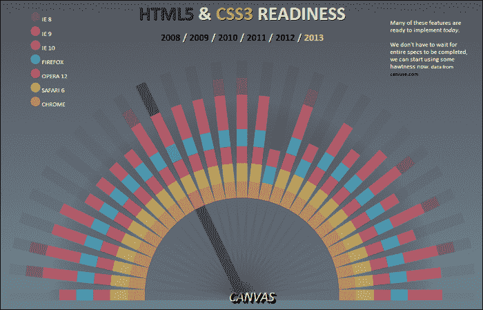
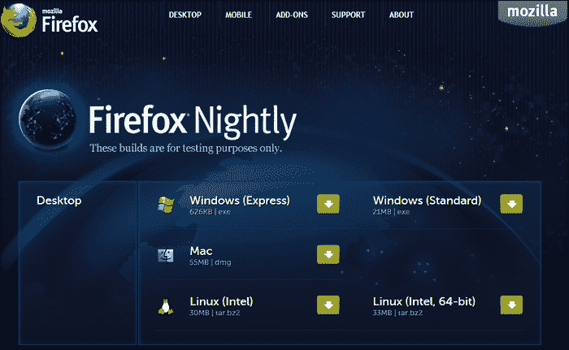
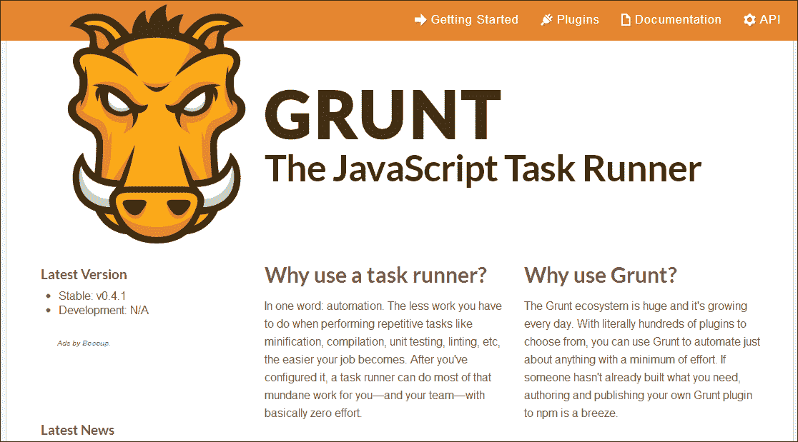

# 十、准备发布

在本书的各个章节中，我们已经介绍了许多不同的应用和工具来开发您的 HTML5 内容。与您已经习惯的 Flash 开发周期一样，在 HTML5 应用开发流程的最后阶段，您通常需要花费一些时间来优化您的应用，以便在网络上使用。谢天谢地，就像我们 HTML5 开发的资产管理和编码阶段一样，有大量的资源可以帮助准备将您的应用移动到面向公众的网络服务器上。在开发 HTML5 应用的计算机上本地测试它们时，除非经过特殊配置，否则本地网络不允许在任何其他计算机上查看内容，无论是在本地网络上还是在互联网上。如果您要在计算机上安装网络服务器，并将网络配置为允许传入连接，只有这样，您才能在互联网上与其他人共享您的工作。为了避免任何域名或安全问题，在互联网上托管您的工作的常见方式是从供应商在线购买网络托管计划。通过这种方式，您的内容是在工作版本之外的，并且被放置在专门用于托管您的 web 内容的服务器上。无论如何，这个过程对于 HTML5 来说并不新鲜，它是典型的你用你的 Flash **SWF** 文件所做的事情，前提是你有同样的意图。然而，由于 HTML5 项目没有被编译成单一的二进制文件，如 Flash，我们需要非常小心地确保我们的项目资产和代码被正确设置，以向我们的最终用户提供快速和安全的体验。在这一章中，我们将通过查看许多为网络准备项目的最佳方法来结束这本书。

# 瞄准支持的网络浏览器

许多开发人员在 HTML5 开发过程中未能在多个网页浏览器中不断测试他们的工作，要么是因为他们懒得花时间去做，要么是他们只是一起忘记了。测试和发布最终应用供公众使用时，您会遇到的最大问题之一就是浏览器支持。如果你没有设法在不同平台的不同浏览器中测试你的项目，当用户抱怨你的应用不适合他们时，你可能会感到惊讶。由于 HTML5 仍然是新的一代，许多浏览器仍然在运行，以赶上正确显示 HTML5 内容所需的功能支持。

作为一名开发人员，在 HTML5 特性支持领域，与当前的网络浏览器保持同步是一项极其重要的资产。让你自己和你的项目远离即将到来的厄运，因为你能够很早就发现特定设备或平台缺乏支持，不仅能为你节省大量时间，还能节省金钱。网络浏览器 HTML5 功能支持检查的一个很好的“一站式商店”是[http://caniuse.com](http://caniuse.com)。在网络浏览器中打开网站后，您可以轻松选择任何指定的 HTML5 功能，并查看哪些浏览器，更重要的是，哪些浏览器版本支持该特定功能:


看看前面 **Canvas** 标签元素支持统计的截图(写这本书的时候)我们可以看到 **Canvas** 元素现在被大约 85%的浏览器支持。当你坐下来为你的项目创建最初的技术大纲时，这个网站几乎是必不可少的。即使对项目中可能使用的 HTML5 中的一些功能略有了解，您也可以直接跳到[http://caniuse.com](http://caniuse.com)并确定您的最终用户需要使用什么来正确查看您的内容。

[http://html5readiness.com](http://html5readiness.com)是一个伟大的 HTML5 项目的一个很好的例子，该网站使用来自[http://caniuse.com](http://caniuse.com)的数据，以一个易于查看的单页交互式图形显示 HTML5 **就绪状态**。



这可能是一个很好的资源，就像[http://caniuse.com](http://caniuse.com)一样，然而你的客户或设计师可能更喜欢它的易用性和支持时间轴可视化的特性。

拥有全球浏览器支持的概述是一个很好的资源，但是如果你有兴趣深入了解你在电脑上使用的浏览器的规格和统计数据，前往[http://html5test.com](http://html5test.com)，让网站为你的浏览器打分。


网站产生的分数可以作为这个网站测试你的浏览器的所有 HTML5 特性的概述。向下滚动结果页面，您会发现每个测试特性的完整轮廓，以及它是否通过测试。


有了这些易于使用的工具，这些工具都可以在网上免费访问，您可以在指尖获得所有数据，以便对您的 HTML5 应用进行适当的规划和概述。请记住，随着新浏览器的发布和当前版本的更新，这些数据将继续发展。您甚至可能会发现，在项目开发开始时引用的一些数据在完成时已经发生了变化。因此，在开发过程中测试项目的浏览器兼容性总是值得付出额外的努力。

### 类型

一定要在[http://html5test.com/results/mobile.html](http://html5test.com/results/mobile.html)也检查移动浏览器的 HTML5 测试。在那里，您可以很容易地找到哪些当前的移动设备不仅最好地支持您的 HTML5 应用使用的功能，而且还支持整个 HTML5 规范。当你想购买下一部手机或平板电脑时，这个资源会有很大的帮助。

# 客户端测试

随着拥有符合 HTML5 的浏览器的移动和桌面设备的数量以指数级的速度增长，要求开发人员在各种不同的设置上测试应用或网络内容已经成为一种要求。不幸的是，在所有这些设备上设置测试环境所需的时间会很快增加。为了在测试阶段为自己节省大量时间，您可能有兴趣查看[http://www.browserstack.com](http://www.browserstack.com)。


注册 BrowserStack 后，您可以从该服务轻松访问所有现代桌面和移动浏览器。不是必须独立配置每台机器和浏览器，BrowserStack 只提供对您选择的特定浏览器的访问，已经预先配置了开发工具，从而为您完成了所有的艰苦工作。BrowserStack 是一项付费服务，但如果您感兴趣，可以免费试用。就我个人而言，我仍然建议至少手动进行一次这种类型的测试，看看你能证明这样一项服务的成本有多合理。如果你是那种地下室里有 10 台电脑的人，那就一定要建立自己的测试环境。您也可以在您的开发计算机上设置许多虚拟机，使您能够从一台计算机上打开和关闭您的测试机器。不管你怎么做，你厌倦了花无数个小时来维护你的测试环境，而像 BrowserStack 这样的服务可能是最终的解决方案，这通常只是时间问题。

## 浏览器夜间构建

如果你真的在挑战 HTML5 的极限，那么在查看你网站的所有预期浏览器的绝对最新版本上测试你的内容可能是一个明智的决定。有了 Internet Explorer 等私人开发的浏览器，你将不得不等待微软发布或预发行下一个版本，但有了 Google Chrome([https://www.google.com/intl/en/chrome/browser/](https://www.google.com/intl/en/chrome/browser/))或 Mozilla 的 Firefox([http://www.mozilla.org/en-US/firefox/new/](http://www.mozilla.org/en-US/firefox/new/))等开源浏览器，你可以下载 Nightly 或主动开发的软件版本，看看下一个版本的发展方向。


谷歌浏览器的夜间版本被称为加那利版本，可以在[https://www.google.ca/intl/en/chrome/browser/canary.html](https://www.google.ca/intl/en/chrome/browser/canary.html)找到。从前面项目网站截图的标语中可以看到，Chrome 的这一版本绝对是最新的，并带有可能不稳定的警告。值得记住的是，您可以在计算机上安全地安装标准版本的谷歌浏览器，以便继续用于正常的网络使用。加那利版本可以随时打开，并预设为在发布新版本供公众使用时，从谷歌分发服务器不断更新自己。

当然，如前所述，Mozilla 也有自己的火狐夜间版本，可以在[http://nightly.mozilla.org](http://nightly.mozilla.org)下载。



火狐的夜间版本目前有桌面和移动版本的网络浏览器，同样可以很容易地与你现有的火狐稳定版本并排安装在你的电脑上。使用这些流行网络浏览器的开发版本，不仅可以让你在即将推出的软件上测试你的代码，还可以让你深入了解一些新的令人兴奋的功能，这些功能在下一个稳定版本发布之前，一般公众可能无法使用。

那么，在这些浏览器上进行测试真的值得吗？实际上，还没有人真正在使用这些浏览器。嗯，对你的开发采取先发制人的态度真的可以为那些在互联网上没有更新或补丁的应用带来回报。如果你不能抓住这样一个事实，即你的 HTML5 网络应用不能在你发布应用几个月后发布的浏览器中工作，这可能是一件非常糟糕的事情。除此之外，花时间在这些新的网络浏览器上只会让你在开发应用时更清楚和了解你可以利用哪些功能。您也将开始了解特定浏览器开发和发布周期的内部工作方式。

## web TC

移动到利用媒体输入，如摄像头和麦克风，在你的 HTML5 应用中的历史最高水平，网络 RTC 已经为这个问题提供了一个解决方案。WebRTC 项目目前由谷歌、Mozilla 和 Opera支持，项目网站可在[http://www.webrtc.org](http://www.webrtc.org)找到。从 Flash 开发者的角度来看，使用网络摄像头和麦克风而不需要第三方插件的概念应该会让你对 HTML5 的开发更加兴奋。WebRTC 已经开始带给 HTML5 开发者的特性将 HTML5 所能做的极限推向了 Flash 的极限。

### 类型

如果你有一个朋友在线，你想测试一个简单的 WebRTC 网络摄像头聊天应用，前往[http://apprtc.appspot.com](http://apprtc.appspot.com)并连接到服务器，该服务器将为你的用户返回一个 ID。将该 ID 与网站的 URL 一起发送给朋友，并在纯 HTML5 音频和视频聊天中在线相互连接。

由于 WebRTC 仍然是一个非常新的规范，目前只有一些现代浏览器支持它，不幸的是，对于开发人员来说，每个浏览器的支持方法都有点不同。任何使用 WebRTC 的开发人员都应该做的第一步是检查当前的浏览器是否支持这个特性。这可以通过一些 JavaScript 函数来完成，例如下面的代码片段:

```html
function hasGetUserMedia() {
  return !!(navigator.getUserMedia || 
            navigator.webkitGetUserMedia ||
            navigator.mozGetUserMedia || 
            navigator.msGetUserMedia
          );
}
```

如您所见，在 JavaScript 中与用户媒体对象元素交互的方法从`getUserMedia`一直到`msGetUserMedia`都是不同的，这取决于试图加载它的网络浏览器的类型。通过将查找用户媒体对象的所有方法都限制在一个返回语句中，如果浏览器支持，该函数将返回用户媒体对象，如果没有找到，则返回 false 值。通过将这个`hasGetUserMedia`函数应用到 HTML5 项目中，我们可以很容易地将函数调用合并到进一步的代码中，如果可以的话，将用户的网络摄像头输入应用到网页上。

```html
var video = document.getElementById('camera');
if(hasGetUserMedia()) {
  navigator.webkitGetUserMedia(
{
audio: true, 
video: true
}, function(stream) {
video.src = window.URL.createObjectURL(stream);
      }, onConnectionFail);
} else {
      alert('WebRTC is not supported!');
}
```

这个代码示例的第一行将 ID 为`camera`的元素应用于变量`video`。HTML 文档中的这个元素实际上是一个视频标签元素，如下所示:

```html
<video id="camera" autoplay></video>
```

您可能还记得，视频元素可以通过 CSS3 属性进行样式化，为您提供了大量显示网络摄像机视频源的设计选项。因此，让我们将这些与 WebRTC 相关的代码片段扩展成一个带有一些 CSS3 样式的工作示例。我们将首先创建我们的初始网页，以显示在网络浏览器中。

```html
<!DOCTYPE html>
<html lang="en">
  <head>
    <meta charset="utf-8" />
    <title>Web RTC Demo</title>
    <style>
      .grayscale {
        -webkit-filter:grayscale(1);
      }
      .sepia {
        -webkit-filter:sepia(1);
      }
      .blur {
        -webkit-filter:blur(10px)
      }
    </style>
  </head>

  <body>
    <video id="camera" autoplay></video>
    <p>
      <button id="button0">Clear Styles</button>
      <button id="button1">Grayscale</button>
      <button id="button2">Sepia</button>
      <button id="button3">Blur</button>
    </p>
    <script src="js/webrtc.js"></script>
  </body>
</html>
```

在这个 HTML 页面中，我们还添加了一些简单的 CSS3 过滤器，每个过滤器都有唯一的类名。附加到 HTML 文档中的每种不同的 CSS 样式也有一个与之对应的 HTML 按钮元素，位于文档正文中。最后我们引用外部 JavaScript 文件，该文件将处理我们接下来将创建的 WebRTC 功能。

当用户点击 HTML 页面上的按钮时，保存了 HTML 文件，并打开了一个新文件来编写我们的 JavaScript，我们可以将已经看过的代码片段以及一些附加 CSS 样式的代码附加到视频元素中。

```html
var video = document.getElementById('camera');
var clearBtn = document.getElementById('button0');
var grayscaleBtn = document.getElementById('button1');
var speiaBtn = document.getElementById('button2');
var blurBtn = document.getElementById('button3');

if(hasGetUserMedia()) {
  navigator.webkitGetUserMedia({audio: true, video: true}, function(stream) {
    video.src = window.URL.createObjectURL(stream);
  }, onConnectionFail);
} else {
  alert('getUserMedia() is not supported in your browser');
}

// Checks if the users browser has Web RTC support.
function hasGetUserMedia() {
  return !!(navigator.getUserMedia || 
            navigator.webkitGetUserMedia ||
            navigator.mozGetUserMedia || 
            navigator.msGetUserMedia
          );
}

// Called if the connection to the video stream fails.
var onConnectionFail = function(e) {
  console.log('ERROR: User Media connection failure!', e);
};

// Clear Styles
clearBtn.addEventListener('click', function() {
  video.className = '';
});

// Grayscale
grayscaleBtn.addEventListener('click', function() {
  video.classList.add('grayscale');
});

// Sepia
speiaBtn.addEventListener('click', function() {
  video.classList.add('sepia');
});

// Blur
blurBtn.addEventListener('click', function() {
  video.classList.add('blur');
});
```

如您所见，这个 JavaScript 的大部分是处理视频元素的 CSS 操作，而不是网络摄像机流的设置。只要终端用户的浏览器支持，只需几行 JavaScript 就可以轻松建立与终端用户的 WebRTC 连接。


谢天谢地，我足够聪明，在前面的截图中使用这个例子添加了模糊效果来隐藏自己。请记住，就像 Flash 中的摄像头和麦克风连接一样，流完全是用户本地的，不会发送到任何其他服务器，除非您已经手动将该功能添加到应用中。对于多用户聊天和公共流等应用，您将需要一台服务器来发送音频或视频流。如果这种类型的 HTML5 开发听起来让你兴奋的话，Node.js 将是一个完美的开始。甚至有一个 Node.js 包专门用来处理 WebRTC([https://npmjs.org/package/webrtc.io](https://npmjs.org/package/webrtc.io))来帮助你开始朝着正确的方向前进。

在不使用第三方插件(如 Flash Player)的情况下，要获得通过互联网传输音频和视频的能力，隐私可能是一个巨大的问题。因此，当试图通过 WebRTC 连接到其媒体频道时，网络浏览器总是会提示最终用户批准。如果您正在开发 HTML5 应用，计划利用 WebRTC 中的特性，这是一个需要记住的重要事实。如果用户决定不启用他们的麦克风或网络摄像头，您的应用的用户体验可能会完全崩溃。一些浏览器(如谷歌浏览器)为保证您的在线安全而采取的另一个步骤是在任何附加了活动媒体流的浏览器标签上应用一个独特的图标。无论流是将内容传递给第三方服务器还是仅在本地使用，图标都将始终可见。


正如你在前面的截图中看到的，当 WebRTC 已经在谷歌 Chrome 中被激活，并且用户正在将音频或视频流式传输到网站时，浏览器选项卡会获得一个发光的红色录制图标，提醒你提要是活动的。

### 类型

如果您不仅想了解 WebRTC 项目的起源及其在现代浏览器上的支持，还想了解如何在项目中正确使用它，请查看关于*在 HTML 中捕获音频&视频*在[http://www.html5rocks.com/en/tutorials/getusermedia/intro/](http://www.html5rocks.com/en/tutorials/getusermedia/intro/)上的精彩文章。

WebRTC 更令人兴奋的是这项技术可能的未来。正如您在到目前为止对这项技术的概述中所看到的，其目的实际上是让音频和视频在不依赖于网络的情况下工作。然而，还有一个目标是让一个专用的数据通道在 WebRTC 中工作，这可以实现一系列惊人的基于网络的新技术，因为您的计算机在使用特定的网络应用时可以真正充当自己的服务器。

# WebGL 支持

WebGL 和 WebRTC 一样，是开始在桌面和手机上的许多现代网络浏览器上看到高质量支持的新的令人兴奋的特性之一。利用客户端计算机或设备上的硬件加速图形，可以让您带来过去开发 Flash 项目时可能使用过的许多全功能 2D 和 3D 动画和交互。当试图验证您使用的浏览器是否支持 WebGL 时，最简单的验证工具可以在[http://get.webgl.org](http://get.webgl.org)找到。


如果您的浏览器通过了 WebGL 验证测试，该站点将显示为上一张截图所示，呈现一个三维线框旋转立方体，并显示提醒您结果的文本。你当然可以利用[http://caniuse.com](http://caniuse.com)查看目前有哪些浏览器支持 WebGL，也可以翻看在[http://www.khronos.org/webgl/wiki/Main_Page](http://www.khronos.org/webgl/wiki/Main_Page)找到的官方 WebGL 公共维基。

### 类型

如果您有兴趣在 HTML5 中了解更多关于 WebGL 的精彩世界，请查看 Packt Publishing 网站([http://www . packtpub . com/WebGL-JavaScript-初学者-指南/book](http://www.packtpub.com/webgl-javascript-beginners-guide/book) )上的 *WebGL 初学者指南*。

## 移动浏览器上的 WebGL

根据您正在查看的 WebGL 应用的强度，您可能会注意到非常慢的帧速率，以及可能变得无响应的应用。随着 WebGL 在少量设备和浏览器上获得支持，开发社区正在慢慢利用这项技术为移动体验创建优化。不幸的是，大多数桌面和移动设备之间的处理能力仍然相差甚远，因此，如果打算让移动浏览器查看它们，开发人员优化其体验的要求至关重要。

在你的移动设备上查看 WebGL 内容的一个很好的资源是在[http://threejs.org](http://threejs.org)找到的三. js 项目页面。从主页上的项目和示例索引中，您可以轻松了解一些最酷的 WebGL 示例如何在任何设备上运行。

### 类型

如果您有兴趣深入了解任何网络浏览器的网络 GL 功能，请查看[http://webgl-bench.appspot.com](http://webgl-bench.appspot.com)获取在线基准测试工具，以帮助检查和显示您的网络 GL 渲染统计数据。

# 允许用户找到你的作品

虽然搜索引擎索引与 HTML5 没有直接关系，但既然你是从 Flash 开发者的角度来看，那绝对值得注意。许多搜索引擎在解析 Flash 内容以获得搜索引擎结果方面变得越来越好，但归根结底，创建一个完整的 Flash 网站将需要您执行一些工作来正确显示您的内容，当有人试图搜索它时。搜索引擎机器人将更容易阅读你的 HTML5 项目，因为他们有一个更直接的方法来阅读关于你网站页面的重要数据。

随着 HTML 元素标签现在可能包含的内容的增长，在您的网站上标记特定元素的能力，特别是对于搜索引擎，是一种优化您网站的搜索引擎优化的新的令人兴奋的方法。谷歌搜索引擎近年来寻找的网络内容的一个关键方面是与作者身份相关的内容。例如，如果你的网站上有一篇特定作者写的文章或文章，你可以很容易地将作者的信息作为元数据集成到 HTML 页面中。

如果标记得当，这不仅可以让搜索引擎，也可以让社交网站轻松解析这些特定页面的内容。例如，考虑一些在你的 HTML 源中定义特定元素的方法:

```html
<!-- 
    Link to a Spanish version of your site, defined by the
    'hreflang' parameter.
-->
<link hreflang="es" href="index_es.html" rel="alternate">

<!-- The link to the authors website (external) -->
<link rel="author" href="https://www.johnsmith.com″>
```

在这些例子中，我们附加了`rel`和`hreflang`标签元素来帮助抢先描述链接的内容。

```html
<a rel="license" href="licensing.html">License information</a>
<a rel="next" href="index3.html">Next</a> 
<a rel="prev" href="index1.html">Previous</a>

<link rel="search" href="http://www.johnsmith.com/search.xml">

<figure id="myfigure>
  
  <figcaption>A Photo of my Cat</figcaption>
</figure>
```

虽然在开发您的 HTML 文档时，这些标签都不是技术上必需的，但是将元数据放入您的内容中的努力，尤其是如果它将被动态提供的话，一旦您的网站被在线发布，很可能会带来更好的流量和搜索引擎结果排名。

如上所述，许多社交网站，如谷歌+或脸书，会试图解析你的网页内容，创建一个详细的链接结构回到你的网站。当用户链接回您的网站时，您可以向试图阅读它的网站和系统提供的更可行的内容和元数据将导致更好的链接结构和信息输出。

## html 5 历史 API

如果您之前碰巧完全在 Flash 中构建了一个网站，您可能有过使用诸如 swfadress([http://www.asual.com/swfaddress](http://www.asual.com/swfaddress))之类的 JavaScript 库来模拟正常网页显示典型的 URL 更新功能的经验。如果你不知道这个项目，或者不知道更新网址的想法，这个概念很简单当你在互联网上加载一个新页面时，地址栏中的网址会根据你正在查看的页面的位置而变化。对于典型的 HTML 网页内容，每个页面都显示在一个新的 HTML 文档中，因此可以很容易地为网站的每个部分定义网址。有了一个内置在 Flash 中的网站，所有的内容都将被编译成一个单独的 SWF，嵌入到一个单独的 HTML 页面中。因此，当 Flash 中的内容发生变化时，网络浏览器的地址栏不会发生变化，因为没有请求新页面。通过将 swfadress 包含到您的 web Flash 项目中，您可以轻松地通过 SWFAddress JavaScript API 发送命令，将定制的更新附加到 web 浏览器的地址栏中。最重要的是，如果一个用户点击了你的应用已经使用过的一个自定义网址，你可以很容易地将用户体验直接跳转到他们最初打算访问的应用部分。随着诸如画布元素和 HTML5 中的 AJAX 请求等功能的流行，许多网站在每次请求时都需要物理重新加载网页的需求正在下降。因此，需要一个类似于 SWFAddress 的系统来正确地整合你的网站。

html 5 History API([http://www . whatwg . org/specs/web-apps/current-work/multipage/History . html](http://www.whatwg.org/specs/web-apps/current-work/multipage/history.html))不仅是控制客户端 web 浏览器地址栏的关键，也是控制其浏览器历史记录中许多元素的关键，以使浏览器的后退和前进功能继续工作。虽然一些流行的现代浏览器的旧版本缺乏对 HTML5 History API 的支持，但现在所有可用浏览器的绝大多数最新版本似乎都支持该功能([http://caniuse.com/#feat=history](http://caniuse.com/#feat=history))。然而，当试图使用任何你不是 100%肯定的功能时，每次使用都会得到支持，一些初始检查通常是值得的。为了检查历史应用编程接口支持，我们可以尝试查找`history.pushState`对象的类型，该对象负责向浏览器页面历史记录写入更改。

```html
if (typeof history.pushState === 'undefined') {
  // The HTML5 History API is Unavailable...
} else {
  // The HTML5 History API is Available!
}
```

如果一切都过去了，你就可以向客户端的浏览器历史记录读写数据了。Mozilla 已经编写了一份关于历史应用编程接口及其用法的精彩概述，可在[https://developer . Mozilla . org/en/docs/DOM/ManagEment _ the _ browser _ History](https://developer.mozilla.org/en/docs/DOM/Manipulating_the_browser_history)上找到。

### 类型

关于 HTML5 历史应用编程接口的实际例子，请查看 HTML5 演示版([http://html5demos.com/history](http://html5demos.com/history))的在线演示和源代码。

关于历史应用编程接口和搜索引擎优化，需要注意的重要因素是，当在浏览器地址栏中显示的网址中引用应用状态时，您的应用可以自由使用。为内容中的特定位置和元素设置唯一的 URL 将允许更容易地调试和生成用户统计和分析。

# 预制测试和基准解决方案

在前几章中，我们已经介绍并利用了许多现代 web 浏览器开发工具集的特性，主要是利用 JavaScript 控制台在开发过程中进行简单的输出和代码调试。流行的网络浏览器中的许多预装开发工具集还包括许多工具，这些工具不仅允许您深入自己的网站结构来定位问题，还可以调试互联网上的其他网站，以了解它们的内部工作方式。

## 谷歌的网络开发工具集

当谈到在浏览器中调试和分析 HTML5 内容的工具时，谷歌不仅创建了 Chrome 开发者工具([https://developers.google.com/chrome-developer-tools/](https://developers.google.com/chrome-developer-tools/))而且还创建了谷歌网络工具包([https://developers.google.com/web-toolkit/overview](https://developers.google.com/web-toolkit/overview)),这确实是一个进步。所有这些工具结合在一起，可以用来进行应用在公共部署之前可能需要的大部分深层应用调试。例如，如果你已经成功开发了自己的 HTML5 游戏，并且需要深入游戏结构并流向以确定需要优化的地方，你可以为游戏的每个元素编写测试，或者你可以使用像谷歌的 Speed Tracer([https://developers.google.com/web-toolkit/speedtracer/index](https://developers.google.com/web-toolkit/speedtracer/index))这样的工具。


正如您在 Speed Tracer 的截图中看到的，应用设法深入到应用运行时，以显示活动应用在给定机器上实际运行方式的许多方面的统计数据。统计输出包括加载时间、执行时间、显示时间等等。以传统方式显示内容和视频的简单网站可能找不到使用这种深度挖掘工具的任何好处。然而，对于任何对构建健壮的交互式 Canvas、WebGL 或任何其他重计算感兴趣的人，或者可能需要调试运行时的计算应用，这个工具非常值得研究。

对于绝大多数 HTML5 开发来说，Chrome Developer Tools 是一个浏览器功能，许多网络开发人员离不开它。Chrome 的每次安装都包含了整个工具集，您可以在几秒钟内轻松打开并开始调试任何带有该工具的网站。从使用元素检查器检查页面元素及其相关样式(如下图所示)，到使用网络检查器显示页面在加载时和运行时发出的每个内部和外部请求的加载时间，调试内容所需的几乎所有内容都在一个方便的内置窗口中。


由于谷歌在过去几年里一直在非常好地推广这款软件，我真的不需要在这里详细介绍它的使用。在项目网站上可以很容易地找到许多精彩的视频教程，以及应用特性集中每个特性的大量文档。

### 类型

Chrome 开发者工具项目网站包含大量视频和文本资源，有助于理解扩展所能做的一切。务必前往[https://developers . Google . com/chrome-developer-tools/docs/video](https://developers.google.com/chrome-developer-tools/docs/videos)查看。

久而久之，当你浏览网页时，你可能会发现自己很快地打开和关闭了这个扩展。作为一名开发人员，HTML5 开发的一个伟大之处在于，当内容公开时，运行它的代码也是公开的。探究某人是如何创造出让你惊讶的网络内容的，这是一个非常简单的方法，可以让你对 HTML5 栈有非常深入的了解。

## YSlow 网站评分

虽然我们中的许多人讨厌在学校里取得成绩，但是让别人给你的网站打分是一个非常有用的资源。YSlow([http://yslow.org](http://yslow.org))浏览器扩展是一个开源项目，可以添加到 Chrome、Firefox、Opera、 Safari 和许多其他形式的网络内容中。打开并激活扩展后，您可以在当前已在网络浏览器中打开的网站上运行系统。在[http://www.packtpub.com](http://www.packtpub.com)上运行测试后，考虑 YSlow 扩展窗口。


在扩展窗口的左上角，可以看到网站被评为 B 级。现在没有任何关于分数构成的细节，这些数据实际上是无用的。所以为了确认评分结果，让我们来探究一下为什么这个网站获得了它所获得的分数。在彩色编码列表中的等级下方，您会发现由 YSlow 检查的所有区域的单独测试结果。在绝大多数测试中，帕克特出版网站的得分非常高。然而，测试得出的结论是，首先，网站可以发出更少的 HTTP 请求，这意味着组成页面的太多代码和资产都是从各种外部资源中引用的。其次，测试结果也显示了包含过期标题的不良结果。

这意味着页面上有许多资产的缓存过期时间很远。像这样的配置很可能导致一些用户在页面加载期间看到实际上已经在服务器上更新的页面内容。因为有些资产的缓存时间是在未来设置的，如果用户之前去过你的网站，他们的网页浏览器可能不会重新请求相同的资产，认为既然缓存时间这么远，数据就不可能有变化。

### 类型

如果你对 YSlow 如何做到这一点感兴趣，一定要前往 GitHub 项目页面了解更多信息([https://github.com/marcelduran/yslow](https://github.com/marcelduran/yslow))。

YSlow 涵盖的不仅仅是上一张截图中可以看到的简短结果列表。由于测试只需要几秒钟，并且应用的浏览器扩展设置允许您在几秒钟内安装它，所以我强烈建议下载这个扩展并测试它；不仅仅是你的网页内容，还有其他的。

# 代码最小化和混淆

开发完 HTML5 应用后，您可能会注意到对外部 JavaScript 和 CSS 文件的引用量可能有点失控。开始争取更快页面加载的最简单方法之一是将 JavaScript 和 CSS 源代码最小化到尽可能小的文件大小。这将允许客户端在更短的时间内通过互联网检索内容，从而允许页面的其余部分完成加载。

一些 CSS 编译器，如LESS([http://lesscss.org](http://lesscss.org))和SAS([http://sass-lang.com](http://sass-lang.com))包含自动最小化你的 CSS 的能力，为你省去了每次更新网站后记得自己做的麻烦。但是，如果您没有使用 CSS 编译器，仍然有许多很好的方法来完成同样的任务。我个人最喜欢的 CSS 压缩在线资源之一是[http://www.csscompressor.com](http://www.csscompressor.com)。这种易于使用的 CSS 压缩器不仅可以配置为优化 CSS 而执行的操作，还可以控制压缩级别。为了更好地了解这种压缩的样子，请考虑以下示例 CSS 语法:

```html
#example {
  width:800px;
  height:600px;
  overflow:hidden;
  margin-right:10px;
  top:20px;
}
#example a {
  color:#FFFFFF;
  text-decoration:none;
}
#example li {
  line-height:20px;
  color:#EFEFEF;
  padding-left:20px;
}
#example .alert {
  display:none;
}
```

这些 CSS 样式没有什么特别之处，除了我们只设计了 `#example`标签元素及其内部内容。这个 CSS 示例实际上只是作为一个例子，说明您可能习惯于在您的项目中看到什么。当然，您的最终应用可能包含远不止四个 CSS 属性，但是不管 CSS 源代码的代码大小如何，最终结果都是一样的。为了保持简单和节省书内的空间，我们将只使用这些风格。

打开网络浏览器，前往[http://www.csscompressor.com](http://www.csscompressor.com)后，我们可以将这些样式复制到网站的大文本区域。


在我们开始 CSS 压缩器之前，请注意文本输入区域上方的选项。虽然这个特定的 CSS 最小化网站只是互联网上众多免费提供的网站之一，但是一般的配置属性是一样的。正如你在前面的截图中看到的，你也可以选择**排序属性**，这将输出你的 CSS 样式，这些样式被排序成极简的配置，有效地优化了你的代码。最重要的是下拉选择器，它允许您为压缩输出选择压缩模式。例如，选择**高**并压缩我们的示例 CSS 将输出以下内容:

```html
#example{width:800px;height:600px;overflow:hidden;margin-right:10px;top:20px}
#example a{color:#FFF;text-decoration:none}
#example li{line-height:20px;color:#EFEFEF;padding-left:20px}
#example .alert{display:none}
```

因为我们的示例 CSS 开始很简单，所以在配置中压缩代码的工作量非常小。实际上，压缩器需要做的就是从提供的 CSS 中移除所有额外的空白，并将所有元素属性放在一行中。这看起来似乎是最少的工作量和输出，但事实是，压缩的 CSS 源文件现在比最初提供的源文件小 14.8%。仅仅几分钟的工作，这是一个巨大的优化量。通过选择压缩模式的**最高**选项，我们可以更进一步。选择此选项后，压缩器现在将把整个压缩的 CSS 源放在一行中。通过这种设置，我们的文件大小又减少了 2.2%，文件大小总共减少了 16%。

```html
#example{width:800px;height:600px;overflow:hidden;margin-right:10px;top:20px}#example a{color:#FFF;text-decoration:none}#example li{line-height:20px;color:#EFEFEF;padding-left:20px}#example .alert{display:none}
```

如前所述，像这样的文件压缩不仅仅是针对你的 CSS 源代码。这种技术实际上对 JavaScript 更有用。由于您的 JavaScript 源代码通常负责所有客户端操作，因此源代码的大小可能会变得非常大。这种外部源代码不仅文件大小很大，而且还可能包含一些您希望最终用户不知道的半敏感代码。当然，JavaScript 不是硬编码用户名和密码的地方，但是如果你要用 JavaScript 编写一个游戏，你可能不希望用户找到方法来进入下一个级别。您可以使用 JavaScript 压缩来帮助您争取代码隐私，但是当然要记住 JavaScript 是一种客户端语言。不管你怎么努力，最终用户总是可以访问你的源代码，所以在开发你的应用时，一定要记住这一点。

JavaScript 压缩在许多流行的 JavaScript 库和框架中很常见，其中许多我们已经在本书中讨论过了。jQuery([http://jquery.com](http://jquery.com))库有两个不同的包，开发和生产。两者之间的区别在于生产版本是压缩的，可以在线使用，而开发版本是用户友好的 JavaScript 源代码，可以进一步操作。像[http://www.minifyjavascript.com](http://www.minifyjavascript.com)这样的网站是一个很好的在线资源，可以用你自己的自定义 JavaScript 来完成这个任务，它包含在你的 HTML5 项目中。

# 外部依赖

随着您的 HTML5 项目变得越来越功能丰富，包含外部依赖项的需求(如 jQuery 或各种 jQuery 插件)可能也会增加。到应用开发周期结束时，您可能会从一个 HTML 文件中引用十几个外部 JavaScript 文件。虽然从人的角度来看，将应用的所有功能隔离在单独的文件中可能是最便于开发的，但是当涉及到在 web 上发布所有这些文件时，您实际上是在试图加载内容时让您的最终用户连接做更多的工作。由于 JavaScript(或 CSS)功能的每一部分都可能被分解到不同的文件中，因此浏览器需要在文档完成加载之前单独请求和接收文档中引用的每个文件。这个问题的一个解决方案是将所有外部第三方 JavaScript 或 CSS 文件组合成一个文件，供您的 HTML 文档请求。这样只向服务器发出一个请求，减少了页面加载时间和带宽消耗。但是，在大多数情况下，您可能只想将 JavaScript 和 CSS 内容结合起来，而不打算在将来进行编辑。当您的所有文件合并成一个文件时，调试问题的难度系数会增加。将自定义的 JavaScript 和 CSS 保存在它们自己的文件中可以让编辑和重新发布变得更加容易。

在您发布的网站在互联网上运行一段时间后，无论您是否更新它，您的应用使用的依赖项都很有可能会过时。您的应用所使用的项目背后的开发人员可能会在您不知情的情况下发布对其库或框架的整个版本更新的小错误修复。尽管你的应用应该可以毫无问题地运行，如果它以前运行过的话，你可能会倾向于更新一个特定的插件来获得最新的特性集或安全修复。例如，如果一个 jQuery Plugin 的更新版本发布到了一个使用 jQuery 的版本已经过时或不兼容的站点，那么在尝试运行应用时，您可能会遇到各种各样的问题。

通过将您的站点使用的 jQuery 版本更新为所需的版本，可以轻松解决该问题；但是，如果您正在使用的其他插件与您添加的最新版本的 jQuery 不兼容，这些插件也可能会损坏。

正是因为这种螺旋式下降，我强调所有 HTML5 开发人员都应该知道的两件具体的事情。首先，尝试掌握项目中使用的外部依赖的开发进度。即使您对扩展的功能集不感兴趣，这些项目的开发人员也经常发布安全更新和代码优化。最后，尝试花时间适当地研究和测试更新您的项目使用的任何依赖项是否会直接影响与之一起工作的任何其他依赖项。

# 简化部署

如果您正在处理一个需要不断更新的 HTML5 网站或应用，您可能会有兴趣寻找方法来减轻手动文件更新对您的网络服务器发布更新的痛苦。通过 FTP 或 SFTP 连接到您的 web 服务器手动更新可能位于不同目录中的特定文件很容易成为一个难题。寻找自动化任何浪费时间的过程的方法通常是任何开发人员的兴趣点。因此，为了您在未来项目中保持理智，让我们介绍一下 web 开发人员可以使用的一些有趣的选项，用于自动化从压缩代码到部署网站的许多过程。

## 用咕噜声创建任务

grunt([)http://gruntjs.com](http://gruntjs.com))是网络开发板块中相对较新的一个孩子，但自 2011 年成立以来，已经经历了极其活跃的开发。软件背后的概念非常简单——自动化。Grunt 在 HTML5 网络开发者社区取得成功的关键是你编写的自动执行定制任务的脚本完全是用 JavaScript 编写的。这允许任何有编写 JavaScript 经验的人创建通常用 BASH 脚本或其他命令行部署的编程语言创建的任务。



Grunt 建立在Node.js([http://nodejs.org/](http://nodejs.org/))框架上，需要将 node . js 安装在使用它的机器上。由于 Grunt 与 Node.js 的关系，您可以找到插件来开始您的 Grunt 任务的基础，并像安装 Node.js 包一样安装它们。就将网站源自动部署到 web 服务器而言，您可能需要首先弄清楚如何通过 FTP 或 SFTP 建立从 Grunt 脚本代码到 web 服务器的连接。幸运的是，如前所述，Node.js 包管理器或 NPM 系统可以让你在[https://npmjs.org](https://npmjs.org)上快速搜索 Grunt SFTP。在结果中，您将找到 grunt-sftp-deploy([https://npmjs.org/package/grunt-sftp-deploy](https://npmjs.org/package/grunt-sftp-deploy))插件，该插件将使您的 Grunt 任务能够通过 sftp 连接轻松地将您的本地网站源连接并部署到外部网络服务器。

### 类型

如果您有兴趣了解更多关于 Grunt 的信息，或者想在您的计算机上安装它，请前往官方 Grunt 文档，网址为[http://gruntjs.com/getting-started](http://gruntjs.com/getting-started)，并遵循*入门*教程。

在现实中，当谈到用 Grunt 创建定制任务时，你的想象力真的是极限了。如果你发现自己一遍又一遍地做着同样的任务，并且想要自动化重复，不管这个问题是个人的还是全局的，写一些代码来为你执行自动化可以是一个非常棒的学习体验和时间节省。前往办公室项目网站([http://gruntjs.com/plugins](http://gruntjs.com/plugins))上的咕噜人插件页面，为您可以创建或利用的伟大任务找到更多灵感。

## 用 Git 部署内容

另一个你可能会发现自己正在使用的软件是 Git([http://git-scm.com/](http://git-scm.com/))。Git 是一个免费的开源版本控制系统，被世界各地的大小项目所使用。大多数开发人员无法理解他们没有使用某种版本控制软件的世界，大多数使用它的网络开发人员都使用 Git。Git 在网络开发领域的大部分成功不仅仅是因为它是如此伟大和可靠的一款软件，还因为像Github([https://github.com](https://github.com))和BitBucket([https://bitbucket.org](https://bitbucket.org))这样的网站已经被创建出来，允许开发人员私下存储他们的代码或公开共享。开发人员可以下载整个代码存储库，其中包括其他开发人员之前所做的所有编辑历史，而不是将代码作为存档的 ZIP 文件自由分发。这也意味着，如果您对其他人的代码进行了更改，他们仍然可以保留选择将您的编辑集成到其版本中的权利。版本控制的好处可以填满整本书，所以如果你还没有使用 Git 或者其他形式的版本控制，一定要深入挖掘。

使用 Git 自动部署您的 web 内容一开始可能会有点棘手，但是一旦配置好，该设置不仅允许您轻松地将内容发布到您的 web 服务器，还允许任何其他开发人员在同一应用上工作。Git 利用分支的思想，允许开发人员在他们自己的应用代码环境中工作，而不会踩到其他开发人员的脚趾。当两个开发人员都完成了对各自分支中应用的更新时，可以利用 Git 将两个分支中的编辑内容自动合并回一个文件中。通过利用分支的概念，开发人员可以同意将特定的分支(通常是主分支)作为部署在应用 web 服务器上的工作分支。如果您将 Git 存储库附加到 web 服务器本身，并从基于 web 的脚本中调用 Git pull 命令，那么您的开发团队中的任何人都可以轻松地将网站的最新版本从 Git 存储库推送到活动的 web 服务器，而不必通过 FTP 或 SFTP 进行连接并手动复制文件。

### 类型

如果您有兴趣了解更多信息，或者对如何为您的一个基于 web 的 HTML5 项目设置这种类型的解决方案感到好奇，请查看 Github([https://github.com/git-deploy/git-deploy](https://github.com/git-deploy/git-deploy))上的 git-deploy 项目。

# 总结

在这一章中，我们花了一些时间来讨论准备 HTML5 应用或网站在公共网络服务器上部署的一些常见方面。虽然没有针对 web 的项目准备的通用实践，但是有许多方面，如代码和文件结构的优化，当给定适当的时间时，将保持您的内容稳定，并将服务器请求的交付时间保持在最低限度。有时，在您的项目完成有效的用户测试之前，预测问题是不现实的。这种形式的用户测试，除非你有一个团队可以支配，通常是在你的应用首次向公众发布时出现的。确保您的应用以报告错误或生成统计数据的方式设置，将减少您查找和纠正任何可能出现的问题所需的时间。即使是像在你的网站中添加谷歌分析([http://www.google.ca/analytics/](http://www.google.ca/analytics/))这样简单的添加，也能让你看到用户可能在哪里遇到了死胡同或糟糕的请求。

学习 HTML5 的道路和它为网络开发社区提供的是一个无尽的承诺，这将极大地有利于你作为一名开发人员的职业生涯。尽管仍处于早期阶段，但这一最新版本的 HTML 规范已被证明是将 web 转变为更像应用的基础架构的最重要方面之一。HTML5 开发的世界已经向来自其他语言的开发人员敞开了大门。作为一名在 Flash 和 ActionScript 3 方面有经验的开发人员，您不仅已经在 JavaScript 提供的学习曲线方面有了优势，而且每个 Flash 开发人员对多媒体及其在代码中的集成的理解将是一项宝贵的技能，在您继续学习的过程中可以不断依靠。

最后，我想对你花时间通读这本书的内容表示衷心的感谢。我希望你对 HTML5 开发的探索和我一样愉快。过去几年涌现出的令人惊叹的项目证明了围绕 HTML5 的兴奋和规范中增加的新功能。似乎每周都会有一些令人兴奋的新框架或库被放入社区聚光灯下。尽管项目种类繁多，但在您的项目中可以利用的大量第三方内容意味着您需要对使用什么做出有效的决定，您需要尽可能地跟上最新的发展。跳上你最喜欢的社交网络，找一些和你自己兴趣相似的其他开发者，开始一个新的项目，把你用 HTML5 能完成的事情推到极限。谁知道呢，也许我最终会使用你在我下一个项目中写的一个库！