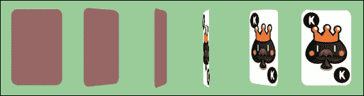
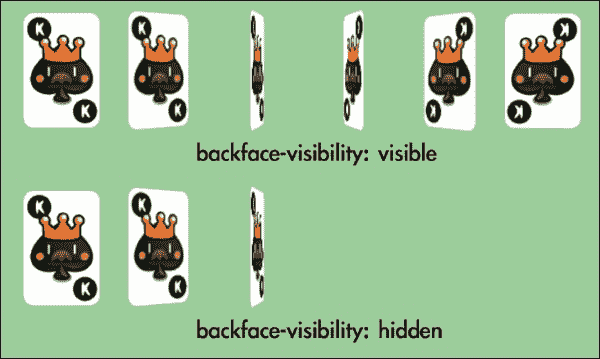
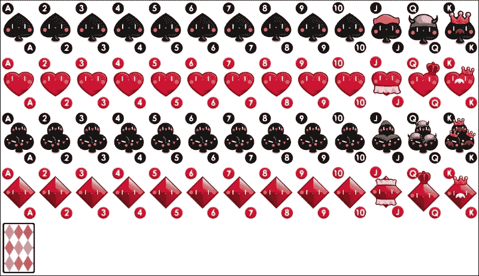
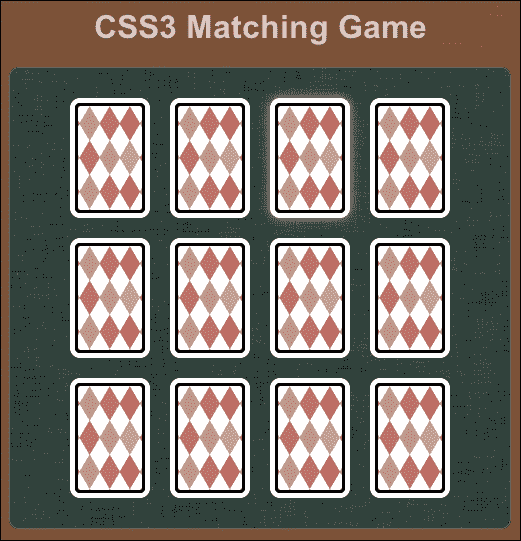
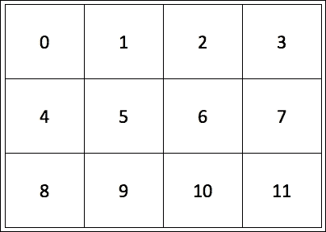
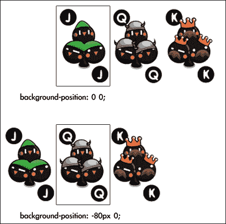
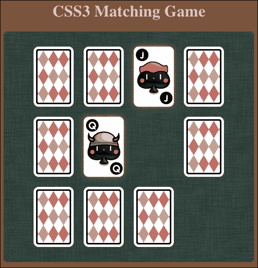
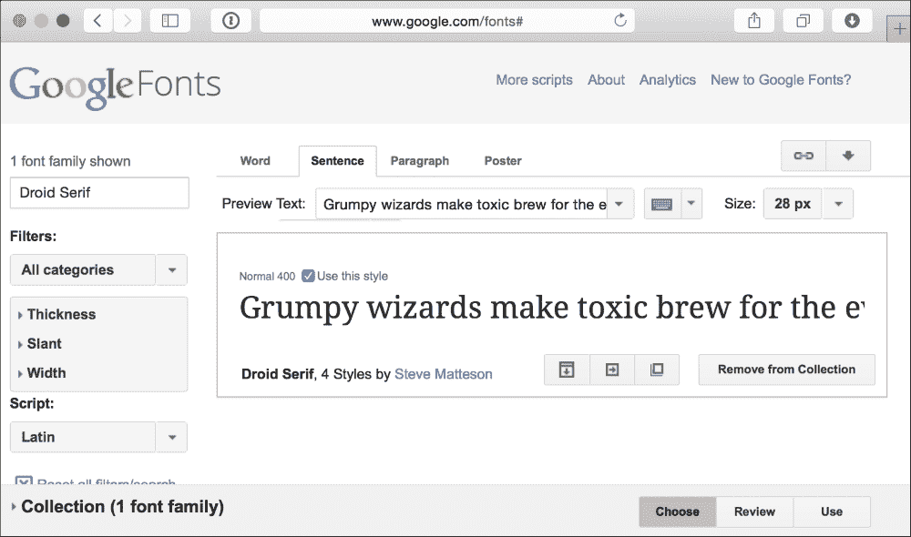

# 三、在 CSS3 中构建一个卡片匹配游戏

*CSS3 引入了许多令人兴奋的功能。在本章中，我们将探索并使用其中的一些来创建一个卡片匹配游戏。CSS3 设计游戏对象的外观和动画，而 jQuery 库帮助我们定义游戏逻辑。*

在本章中，我们将：

*   使用动画变换扑克牌
*   使用新的 CSS3 属性翻转扑克牌
*   创建整个内存匹配游戏
*   将自定义 web 字体嵌入到我们的游戏中

您可以在下面的 URL 上尝试卡片匹配游戏，以了解我们将在本章中实现的目标：

[http://makzan.net/html5-games/card-matching/](http://makzan.net/html5-games/card-matching/)

那么，让我们继续吧。

# 使用 CSS3 转换移动游戏对象

在[第一章](01.html "Chapter 1. Introducing HTML5 Games")*介绍 HTML5 游戏*中，当我们浏览新的 CSS3 功能时，我们瞥见了 CSS3 过渡和转换模块。我们通常希望通过简化属性来设置游戏对象的动画。Transition 是为此目的而设计的 CSS 属性。假设我们在网页上有一张扑克牌，并希望在五秒钟内将其移动到另一个位置。我们必须使用 JavaScript 设置计时器，并编写自己的函数，每隔几毫秒更改一次位置。通过使用`transition`属性，我们只需要指定开始和结束样式以及持续时间。浏览器会优化输出，并执行所有缓和和中间动画。

让我们来看看一些例子来理解这一点。

# 行动时间-移动扑克牌

在本例中，我们将在网页上放置两张扑克牌，并将它们转换为不同的位置、比例和旋转。我们将通过设置转换来实现转换：

1.  为此，请创建具有以下层次结构的新项目文件夹。`css3transition.css`和`index.html`文件现在是空的，我们稍后会添加代码。`jquery-2.1.3.min.js`文件是我们在上一章中使用的 jQuery 库。

    ```html
    index.html
    js/
      js/jquery-2.1.3.js
    css/
      css/css3transition.css
    img/
    ```

2.  在本例中，我们使用了两个扑克牌图形图像。它们是`AK.png`和`AQ.png`。这些图像在代码包中提供，或者您可以从图书资产网站[下载它们 http://mak.la/book-assets/](http://mak.la/book-assets/) 。
3.  将两张卡片图像放入`images`文件夹中。
4.  下一步是用两个 card DIV 元素对 HTML 进行编码。加载页面时，我们将对这两个卡片元素应用 CSS 转换样式：

    ```html
    <!DOCTYPE html>
    <html lang="en">
    <head>
      <meta charset="utf-8">
      <title>Getting Familiar with CSS3 Transition</title>
      <link rel="stylesheet" href="css/css3transition.css" />
    </head>
    <body>
      <header>
        <h1>Getting Familiar with CSS3 Transition</h1>
      </header>

      <section id="game">
        <div id="cards">
          <div id="card1" class="card cardAK"></div>
          <div id="card2" class="card cardAQ"></div>
        </div> <!-- #cards -->
      </section> <!-- #game -->
      <footer>
        <p>This is an example of transitioning cards.</p>
      </footer>
    <script src="js/jquery-2.1.3.min.js"></script>
    <script>
    $(function(){
      $("#card1").addClass("move-and-scale");
      $("#card2").addClass("rotate-right");
    });
    </script>
    </body>
    </html>
    ```

5.  是时候通过 CSS 定义扑克牌的视觉样式了。它包含基本的 CSS 2.1 属性和 CSS3 的新属性。在下面的代码中，突出显示了新的 CSS3 属性：

    ```html
    body {
      background: LIGHTGREY;
    }
    /* defines styles for each card */
    .card {
      width: 80px;
      height: 120px;
      margin: 20px;
      position: absolute;
     transition: all 1s linear;
    }

    /* set the card to corresponding playing card graphics */
    .cardAK {
      background: url(img/AK.png);
    }
    .cardAQ {
      background: url(img/AQ.png);
    }
    /* rotate the applied DOM element 90 degree */
    .rotate-right {
     transform: rotate3d(0, 0, 1, 90deg);
    }

    /* move and scale up the applied DOM element */
    .move-and-scale {
     transform: translate3d(150px, 150px, 0) scale3d(1.5, 1.5, 1);
    }
    ```

6.  Let's save all the files and open the `index.html` file in the browser. The two cards should animate as shown in the following screenshot:

    

## *刚才发生了什么事？*

我们刚刚创建了两个动画效果，通过使用 CSS3 转换到`transform`属性之间。

以下是 CSS 转换的用法：

```html
transform: transform-function1 transform-function2;
```

`transform`属性的参数是函数。有两组函数：2D 和 3D 变换函数。**CSS transform**函数用于移动、缩放、旋转和倾斜目标 DOM 元素。以下各节介绍变换函数的用法。

## 二维变换函数

2D`rotate`函数在给定正变元上顺时针旋转元素，在给定负变元上逆时针旋转元素：

```html
rotate(angle)
```

`translate`功能通过给定的*x*和*y*位移移动元件：

```html
translate (tx, ty)
```

通过调用`translateX`和`translateY`函数，我们可以独立平移*x*或*y*轴，如下所示：

```html
translateX(number)
translateY(number)
```

`scale`函数通过给定的`sx`和`sy`向量对元素进行缩放。如果我们只传递第一个参数，那么`sy`将与`sx`具有相同的值：

```html
scale(sx, sy)
```

此外，我们还可以独立缩放*x*和*y*轴，如下所示：

```html
scaleX(number)
scaleY(number)
```

## 3D 变换功能

3D 旋转函数将 3D 空间中的元素旋转给定的[x，y，z]单位向量。例如，我们可以使用`rotate3d(0,``1,``0,``60deg)`将*y*轴旋转 60 度：

```html
rotate3d(x, y, z, angle)
```

我们也可以通过调用以下方便的函数来旋转一个轴：

```html
rotateX(angle)
rotateY(angle)
rotateZ(angle)
```

与 2D`translate`功能类似，`translate3d`允许我们在所有三个轴上移动元件：

```html
translate3d(tx, ty, tz)
translateX(tx)
translateY(ty)
translateZ(tz)
```

此外，`scale3d`在 3D 空间中缩放元素：

```html
scale3d(sx, sy, sz)
scaleX(sx)
scaleY(sy)
scaleZ(sz)
```

我们刚才讨论的`transform`函数是常见的，我们将多次使用它们。还有其他几个`transform`函数没有讨论；它们是`matrix`、`skew`和`perspective`。

如果您想找到最新的 CSS 转换工作规范，可以访问 W3C CSS 转换模块网站，网址为：[http://www.w3.org/TR/css3-3d-transforms/](http://www.w3.org/TR/css3-3d-transforms/) 。

## 使用 CSS3 转换进行样式间的转换

CSS3 中有大量新的特性。过渡模块是中对游戏设计影响最大的模块之一。

什么是**CSS3 过渡**？W3C 用一句话对此进行了解释：

> *CSS 转换允许 CSS 值中的属性更改在指定的持续时间内平稳发生。*

通常，当我们更改元素的任何属性时，属性会立即更新为新值。过渡减慢了变化的过程。它在给定的持续时间内从旧值向新值缓和之间创建平滑。

以下是`transition`属性的用法：

```html
transition: property_name duration timing_function delay
```

下表解释了`transition`属性中使用的每个参数：

<colgroup><col style="text-align: left"> <col style="text-align: left"></colgroup> 
| 

论点

 | 

释义

 |
| --- | --- |
| `property_name` | 这是应用转换的属性的名称。可设置为`all`。 |
| `duration` | 这是过渡所需的持续时间。 |
| `timing_function` | `timing`函数定义起始值和结束值之间的插值。默认值为`ease`。通常，我们将使用`ease`、`ease-in`、`ease-out`和`linear`。 |
| `delay` | `delay`参数将转换的开始延迟给定秒。 |

我们可以将多个`transition`属性放在一行中。例如，以下代码在 0.3 秒内转换不透明度，在 0.5 秒内转换背景色：

```html
transition: opacity 0.3s, background-color 0.5s
```

我们还可以使用以下属性分别定义每个转换属性：

```html
transition-property, transition-duration, transition-timing-function and transition-delay
```

### 提示

**CSS3**模块

根据 W3C，CSS3 不同于 CSS 2.1，因为只有一个 CSS 2.1 规范。CSS3 分为不同的模块。每一个模块都会被单独审查。例如，有一个过渡模块、二维/三维变换模块和灵活的长方体布局模块。

将规范划分为模块的原因是，CSS3 每个部分的工作进度不一样。一些 CSS3 特性相当稳定，比如 BorderRadius，而一些还没有稳定下来。将整个规范划分为不同的部分允许浏览器供应商支持稳定的模块。在这种情况下，慢节奏的特性不会降低整个规范的速度。CSS3 规范的目标是标准化 web 设计中最常见的视觉用法，此模块符合这一目标。

## 做个英雄吧

我们已经翻译、缩放和旋转了扑克牌。我们尝试更改示例中的不同值如何？`rotate3d`功能中有三个轴。如果我们旋转另一个轴会发生什么？亲自体验代码，熟悉转换和转换模块。

# 创造翻牌效果

想象一下，现在我们不仅仅是在移动扑克牌，我们还想翻转扑克牌元素，就像我们翻转一张真正的扑克牌一样。通过使用`rotation``transform`功能，现在可以创建翻牌效果。

# 行动时间-使用 CSS3 翻牌

我们将启动一个新的项目并在点击扑克牌时创建一个翻牌效果：

1.  让我们继续前面的代码示例。
2.  卡片现在包含两个面：正面和背面。替换 HTML 代码中`body`标记中的以下代码：

    ```html
    <section id="game">
      <div id="cards">
        <div class="card">
          <div class="face front"></div>
          <div class="face back cardAK"></div>
        </div> <!-- .card -->
        <div class="card">
          <div class="face front"></div>
          <div class="face back cardAQ"></div>
        </div> <!-- .card -->
      </div> <!-- #cards -->
    </section> <!-- #game -->
    <script src="js/jquery-2.1.3.min.js"></script>
    ```

3.  然后，在`css` 文件夹中创建一个新的`css3flip.css` 文件来测试翻转效果。
4.  在`index.html` 文件中，将 CSS 外部链接更改为`css3flip.css`文件：

    ```html
    <link rel="stylesheet" href="css/css3flip.css" />
    ```

5.  现在，让我们将样式添加到`css3flip.css`：

    ```html
    #game {
      background: #9c9;
      padding: 5px;
    }
    /* Define the 3D perspective view and dimension of each card. */
    .card {
      perspective: 600px;
      width: 80px;
      height: 120px;
    }
    ```

6.  每张卡片上有两张脸。我们将慢慢旋转卡片的面。因此，我们通过 CSS3 的`transition`属性定义面如何转换。我们还隐藏背面的可见性。稍后我们将查看该物业的详细信息：

    ```html
    .face {
      border-radius: 10px;
      width: 100%;
      height: 100%;
      position: absolute;
      transition: all .3s;
     backface-visibility: hidden;
    }
    ```

7.  现在，是时候给每一张脸设计样式了。正面的 z 指数高于背面：

    ```html
    .front {
      background: #966;
    }
    .back {
      background: #eaa;
      transform: rotate3d(0,1,0,-180deg);
    }
    ```

8.  当我们翻转卡片时，我们将正面旋转到背面，背面旋转到正面。我们还交换正面和背面的 z 索引：

    ```html
    .card-flipped .front {
      transform: rotate3d(0,1,0,180deg);
    }
    .card-flipped .back {
      transform: rotate3d(0,1,0,0deg);
    }
    .cardAK {
      background: url(img/AK.png);
    }
    .cardAQ {
      background: url(img/AQ.png);
    }
    ```

9.  接下来，我们将在加载 jQuery 库后添加逻辑，以在单击卡片时切换卡片翻转状态：

    ```html
    <script>
    (function($){
      $(function(){
        $("#cards").children().each(function(index) {
          // listen the click event on each card DIV element.
          $(this).click(function() {
            // add the class "card-flipped".
            // the browser will animate the styles 
            // between current state and card-flipped state.
            $(this).toggleClass("card-flipped");
          });
        });
      });
    })(jQuery);
    </script>
    ```

10.  The styles and the scripts are now ready. Let's save all the files and preview it in our web browser. Click on the playing card to flip it over, and click on it again to flip it back.

    

## *刚才发生了什么事？*

我们已经创建了一个可以通过鼠标点击来切换的卡片翻转效果。您可以在[处尝试该示例 http://makzan.net/html5-games/simple-card-flip/](http://makzan.net/html5-games/simple-card-flip/) 。

该示例使用了几个 CSS 转换属性和 JavaScript 来处理鼠标单击事件。

## 使用 jQuery 的 toggleClass 函数切换类

当鼠标单击卡片时，我们将`card-flipped`类应用于卡片元素。在第二次单击时，我们希望删除应用的卡片翻转样式，以便卡片再次翻转。这被称为**切换类**样式。

jQuery 为我们提供了一个名为`toggleClass`的简便函数，可以根据是否应用了类自动添加或删除类。

要使用该函数，只需将要切换的类作为参数传递。

例如，以下代码向 ID 为`card1`的元素添加或删除`card-flipped`类：

```html
$("#card1").toggleClass("card-flipped");
```

`toggleClass`函数同时接受来自多个类的切换指令。我们可以传入几个类名，并使用空格分隔它们。下面是一个同时切换两个类的示例：

```html
$("#card1").toggleClass("card-flipped scale-up");
```

## 介绍 CSS 的透视属性

CSS3 允许我们在 3D 中呈现元素，并且我们能够在 3D 空间中变换元素。`perspective`属性定义三维透视视图的外观。可以在查看对象时尽可能地处理该值。距离越近，查看对象上的透视失真越大。

以下两个三维立方体演示了不同的透视值如何更改图元的透视视图：


## 做个英雄吧

立方体是通过将六个面与应用于每个面的三维变换放在一起创建的。它使用了我们讨论过的技术。尝试创建一个立方体，并尝试使用`perspective`属性。

以下网页对创建 CSS3 立方体进行了全面的说明，并说明了如何使用键盘控制立方体的旋转：

[http://paulrhayes.com/experiments/cube-3d/](http://paulrhayes.com/experiments/cube-3d/)

## 引入背面可视性

在`backface-visibility`属性引入之前，页面上的所有元素都将其正面呈现给访问者。实际上，元素的正面或背面没有概念，因为呈现正面是唯一的选择。虽然 CSS3 在三个轴上引入了旋转，但我们可以旋转一个元素，使其面位于背面。试着看着你的手掌，转动你的手腕，你的手掌转动，你会看到你的手掌背面。旋转的元素也会发生这种情况。

CSS3 引入了一个名为`backface-visibility`的属性来定义我们是否可以看到元素的背面。默认情况下，它是可见的。下图展示了`backface-visibility`属性的两种不同行为：



### 注

您可以在其官方 Webkit 博客[上阅读 CSS 3D 转换中不同属性和功能的更多详细信息 http://webkit.org/blog/386/3d-transforms/](http://webkit.org/blog/386/3d-transforms/) 。

# 创建卡片匹配记忆游戏

我们已经学习了 CSS 中的一些基本技术。现在，让我们使用这些技术制作一个游戏。我们要做一个纸牌游戏。纸牌游戏将利用转换来翻转纸牌，转换来移动纸牌，JavaScript 来保存逻辑，HTML5 的一个新功能叫做**自定义数据属性**来存储自定义数据。别担心，我们将逐步讨论每个组件。

## 下载扑克牌精灵单

在翻牌示例中，我们使用了两张不同的扑克牌的图形。现在，我们将为整个扑克牌组准备图形。虽然我们在匹配游戏中将只使用六张扑克牌，但我们将准备整个扑克牌组，以便我们可以在我们可能创建的其他扑克牌游戏中重用这些图形。

一副牌中有 52 张扑克牌，背面还有一张图案。与使用 53 个单独的文件不同，将单独的图形放入一个大的 sprite 工作表文件是一种很好的做法。Sprite sheet 是一种图形技术，它将一个图形的纹理加载到内存中，并为每个游戏组件显示部分图形。

使用大精灵表而不是单独的图像文件的一个好处是，我们可以减少**HTTP 请求**的数量。当浏览器加载网页时，它会创建一个新的 HTTP 请求来加载每个外部资源，包括 JavaScript 文件、CSS 文件和图像。为每个单独的小文件建立一个新的 HTTP 请求需要相当长的时间。将图形合并到一个文件中，可以大大减少请求量，从而提高在浏览器中加载游戏时的响应能力。

在一个文件中放置图形的另一个好处是避免文件格式头的开销，并减少 HTTP 请求的数量。加载包含 53 个图像的精灵工作表的时间比加载每个文件中包含文件头的 53 个不同图像的时间要快。

下面一组扑克牌图形是在 Adobe Illustrator 中绘制和对齐的。您可以从[下载 http://mak.la/deck.png](http://mak.la/deck.png) 。

### 注

您可以使用即时精灵生成器（[创建自己的精灵表 http://instantsprite.com](http://instantsprite.com) 。[的文章 http://css-tricks.com/css-sprites/](http://css-tricks.com/css-sprites/) 详细解释了为什么以及如何创建和使用 CSS 精灵表。



## 搭建游戏环境

一旦图形准备就绪，我们将需要设置一个静态页面，其中包含准备好并放置在游戏区域的游戏对象。这样以后添加游戏逻辑和交互就更容易了：

# 行动时间-准备卡片匹配游戏

在将复杂的游戏逻辑添加到我们的匹配游戏之前，让我们准备 HTML 游戏结构和所有 CSS 样式：

1.  让我们继续我们的项目。在`js`文件夹中创建一个名为`matchgame.js`的新文件。
2.  将`index.html`文件替换为以下 HTML 代码：

    ```html
    <!DOCTYPE html>
    <html lang="en">
    <head>
      <meta charset=utf-8>
      <title>CSS3 Matching Game</title>
      <link rel="stylesheet" href="css/matchgame.css" />
    </head>
    <body>
      <header>
        <h1>CSS3 Matching Game</h1>
      </header>

      <section id="game">
        <div id="cards"> 
          <div class="card">
            <div class="face front"></div>
            <div class="face back"></div>
          </div> <!-- .card -->
        </div> <!-- #cards -->
      </section> <!-- #game -->

      <footer>
        <p>This is an example of creating a matching game with CSS3.</p>
      </footer>

    <script src="js/jquery-2.1.3.min.js"></script>
    <script src="js/matchgame.js"></script>
    </body>
    </html>
    ```

3.  为了让游戏更具吸引力，我为游戏桌和页面准备了背景图片。这些图形资源可以在代码示例包中找到。背景图像是可选的，它们不会影响游戏性和匹配游戏的逻辑。
4.  我们还将把甲板的精灵表图形放入图像文件夹。然后，我们将从[下载`deck.png`文件 http://mak.la/deck.png](http://mak.la/deck.png) 并保存在 images 文件夹中。
5.  为我们的游戏创建一个名为`matchgame.css`的专用 CSS 文件，并将其放入`css`文件夹中。
6.  现在，在编写任何逻辑之前，让我们为匹配游戏添加样式。打开`matchgame.css`并添加以下主体样式：

    ```html
    body {
      text-align: center;
      background: BROWN url(img/bg.jpg);
    }
    ```

7.  我们将继续向`game`元素添加样式。这将是游戏的主要区域：

    ```html
    #game {
      border-radius: 10px;
      border: 1px solid GRAY;
      background: DARKGREEN url(img/table.jpg);
      width: 500px;
      height: 460px;
      margin: 0 auto;
      display: flex;
      justify-content: center;
      align-items: center;
    }
    ```

8.  我们将把所有卡片元素放入名为`cards`的父 DOM 中。通过这样做，我们可以很容易地将所有卡置于游戏区域的中心：

    ```html
    #cards {
      position: relative;
      width: 380px;
      height: 400px;
    }
    ```

9.  对于每一张卡，我们定义一个`perspective`属性以赋予其视觉深度效果：

    ```html
    .card {
      perspective: 600px;
      width: 80px;
      height: 120px;
      position: absolute;
      transition: all .3s;
    }
    ```

10.  每张卡片上有两个面。稍后将旋转背面，我们将定义过渡属性以设置样式更改的动画。我们还要确保背面是隐藏的：

    ```html
    .face {
      border-radius: 10px;
      width: 100%;
      height: 100%;
      position: absolute;
      transition-property: opacity, transform, box-shadow;
      transition-duration: .3s;

      backface-visibility: hidden;
    }
    ```

11.  现在，我们将设置正面和背面的样式。它们几乎与翻转卡片示例相同，只是我们现在给它们提供背景图像和方框阴影：

    ```html
    .front {
      background: GRAY url(img/deck.png) 0 -480px;
    }
    .back {
      background: LIGHTGREY url(img/deck.png);
      transform: rotate3d(0,1,0,-180deg);
    }
    .card:hover .face, .card-flipped .face {
      box-shadow: 0 0 10px #aaa;
    }
    .card-flipped .front {
      transform: rotate3d(0,1,0,180deg);
    }
    .card-flipped .back {
      transform: rotate3d(0,1,0,0deg);
    }
    ```

12.  当任何卡被移除时，我们希望它淡出。因此，我们声明一个不透明度为 0 的卡片移除类：

    ```html
    .card-removed {
      opacity: 0;
    }
    ```

13.  为了显示与卡片组的精灵表不同的扑克牌图形，我们将卡片的背景剪辑到不同的背景位置：

    ```html
    .cardAJ {background-position: -800px 0;}
    .cardAQ {background-position: -880px 0;}
    .cardAK {background-position: -960px 0;}
    .cardBJ {background-position: -800px -120px;}
    .cardBQ {background-position: -880px -120px;}
    .cardBK {background-position: -960px -120px;}
    .cardCJ {background-position: -800px -240px;}
    .cardCQ {background-position: -880px -240px;}
    .cardCK {background-position: -960px -240px;}
    .cardDJ {background-position: -800px -360px;}
    .cardDQ {background-position: -880px -360px;}
    .cardDK {background-position: -960px -360px;}
    ```

14.  我们已经定义了很多 CSS 样式。现在是 JavaScript 逻辑的时候了。我们将打开`js/matchgame.js`文件，并将以下代码放入其中：

    ```html
    $(function(){
      // clone 12 copies of the card
      for(var i=0; i<11; i++){
        $(".card:first-child").clone().appendTo("#cards");
      }
      // initialize each card's position
      $("#cards").children().each(function(index) {
        // align the cards to be 4x3 ourselves.
        var x = ($(this).width() + 20) * (index % 4);
        var y = ($(this).height() + 20) * Math.floor(index / 4);
        $(this).css("transform", "translateX(" + x + "px) translateY(" + y + "px)");
      });
    });
    ```

15.  Now, we will save all the files and preview the game in the browser. The game should be well styled, and 12 cards should appear in the center. However, we cannot click on the cards yet because we have not set any interaction logic for the cards.

    

## *刚才发生了什么事？*

我们用 HTML 创建了游戏结构，并将样式应用于 HTML 元素。您可以在[找到当前进度的游戏工作示例 http://makzan.net/html5-games/card-matching-wip-step1/](http://makzan.net/html5-games/card-matching-wip-step1/) 。

我们还使用 jQuery 在 web 加载并准备就绪后在游戏区域创建 12 张卡。翻转和移除卡片的样式也已经准备好，稍后将使用游戏逻辑应用到卡片上。

由于我们对每张卡使用绝对定位，我们需要自己将卡对齐为 4x3 瓷砖。在 JavaScript 逻辑中，我们循环遍历每个卡，并通过计算循环索引的位置将其对齐：

```html
$("#cards").children().each(function(index) {
  // align the cards to be 4x3 ourselves.
  var x = ($(this).width() + 20) * (index % 4);
  var y = ($(this).height() + 20) * Math.floor(index / 4);
  $(this).css("transform", "translateX(" + x + "px) translateY(" + y + "px)");
});
```

JavaScript 中的%字符是**模运算符**，它返回除法后剩余的数。当我们循环卡片时，余数用于获取列计数。下图显示了与索引号的行/列关系：



另一方面，除法用于获取行数，以便我们可以将卡定位到相应的行上。

以指标 3 为例；3%4 等于 3。因此，索引 3 处的卡片位于第三列。3/4 是 0，所以它在第一行。

让我们选择另一个数字，看看公式是如何工作的。让我们看看索引 8；8%4 是 0，它位于第一列。8/4 是 2，所以它在第三排。

## 使用 jQuery 克隆 DOM 元素

在我们的 HTML 结构中，我们只有一张卡片，结果是，我们有 12 张卡片。这是因为我们在 jQuery 中使用了`clone`函数来克隆 card 元素。克隆目标元素后，我们调用`appendTo`函数将克隆的 card 元素作为子元素追加到 cards 元素中：

```html
$(".card:first-child").clone().appendTo("#cards");
```

## 使用子过滤器在 jQuery 中选择元素的第一个子元素

当我们选择并克隆卡元素时，我们使用了以下选择器：

```html
$(".card:first-child")
```

`:first-child`过滤器是**子过滤器**，用于选择给定父元素的第一个子元素。

除`:first-child`外，我们还可以使用`:last-child`选择最后一个子项。

### 注

您还可以在 jQuery 文档中的[上查看其他与子级相关的选择器 http://api.jquery.com/category/selectors/child-filter-selectors/](http://api.jquery.com/category/selectors/child-filter-selectors/) 。

## 垂直对齐 DOM 元素

我们将 cards DIV 放在游戏元素的中心。**CSS3 柔性箱布局模块**介绍了实现**垂直中心对齐**的简易方法，如下：

```html
display: flex;
justify-content: center;
align-items: center;
```

当容器中有额外空间时，“柔性箱”模块定义图元的对齐方式。我们可以使用 display、一个 CSS2 属性和一个新的 CSS3 属性值，将元素设置为一个灵活的 box 容器。

`justify-content` 和`align-items`是两个属性，用于定义如何在水平和垂直方向对齐和使用额外的自由空间。我们可以通过将两个属性都设置为`center`来居中元素。

垂直对齐只是柔性箱布局模块的一小部分。当你在网页设计中做布局时，它非常强大。您可以在模块的 W3C 页面上找到更多信息（[http://www.w3.org/TR/css3-flexbox/](http://www.w3.org/TR/css3-flexbox/) 或 CSS3 技巧的网站（[http://css-tricks.com/snippets/css/a-guide-to-flexbox/](http://css-tricks.com/snippets/css/a-guide-to-flexbox/) ）。

## 使用带有背景位置的 CSS 精灵

CSS sprite 表单是一个包含许多单独图形的大图像。采用大精灵片图像作为元素的背景图像。我们可以通过将背景位置移动到固定的宽度和高度元素来剪裁每个图形。

我们的甲板图像共包含 53 个图形。为了轻松演示背景位置，我们假设有一个包含三张卡片图像的图像，如以下屏幕截图所示：


在 CSS 样式中，我们将 card 元素的宽度设置为 80px，高度设置为 120px，背景图像设置为大组图像。如果我们想要左上角的图形，我们将背景位置的*x*和*y*轴的值都更改为 0。如果我们想要第二个图形，我们将背景图像 80px 移到左边。这意味着将 X 位置设置为`-80px`，Y 设置为 0。因为我们有一个固定的宽度和高度，只有 80 x 120 的裁剪区域显示背景图像。以下屏幕截图中的矩形显示了可视区域：



# 将游戏逻辑添加到匹配游戏中

现在让我们想象一下手里拿着一副真正的牌，然后设置匹配游戏。

我们先洗牌，然后把每张牌放在桌子上，背面朝上。为了更简单的游戏，我们将卡片排列成 4 x 3 的阵列。现在，游戏已经准备好了，我们要开始玩了。

我们拿起一张卡片，将其翻转，使其正面朝上。我们再挑一个，面朝上。之后，我们有两种可能的行动。如果这两张牌的图案相同，我们就把它们拿走。否则，我们就把它们面朝下放回去，好像我们没有碰过它们一样。游戏一直持续到我们把所有的牌配对为止。

在我们考虑了这个逐步的场景之后，代码流将更加清晰。事实上，本例中的代码与我们使用真实甲板的过程完全相同。我们只需要将人类语言替换为 JavaScript 代码。

# 行动时间-向匹配游戏添加游戏逻辑

在上一个示例中，我们已经准备好了游戏环境，并决定游戏逻辑应该与玩真正的牌组相同。现在是编写 JavaScript 逻辑的时候了：

1.  让我们从上一个匹配游戏示例开始。我们已经设计了 CSS，现在，是时候在 `js/matchgame.js`文件中添加游戏逻辑了。
2.  这个游戏是配对扑克牌。我们现在有 12 张牌，所以我们需要 6 副扑克牌。将以下代码放入`js/matchgame.js`文件中。阵列声明六对卡片图案：

    ```html
    var matchingGame = {};
    matchingGame.deck = [
      'cardAK', 'cardAK',
      'cardAQ', 'cardAQ',
      'cardAJ', 'cardAJ',
      'cardBK', 'cardBK',
      'cardBQ', 'cardBQ',
      'cardBJ', 'cardBJ',
    ];
    ```

3.  在上一章中，我们将 jQuery 的`ready`函数中的卡片对齐。现在我们需要在`ready`函数中准备和初始化更多的代码。为此，将`ready`函数更改为以下代码。此处突出显示更改后的代码：

    ```html
    $(function(){
     matchingGame.deck.sort(shuffle);

      for(var i=0;i<11;i++){
        $(".card:first-child").clone().appendTo("#cards");
      }

      $("#cards").children().each(function(index) {
        var x = ($(this).width() + 20) * (index % 4);
        var y = ($(this).height() + 20) * Math.floor(index / 4);
        $(this).css("transform", "translateX(" + x + "px) translateY(" + y + "px)");

     // get a pattern from the shuffled deck
     var pattern = matchingGame.deck.pop();

     // visually apply the pattern on the card's back side.
     $(this).find(".back").addClass(pattern);

     // embed the pattern data into the DOM element.
     $(this).attr("data-pattern",pattern);

     // listen the click event on each card DIV element.
     $(this).click(selectCard);
      });
    });
    ```

4.  类似于玩真正的牌组，我们要做的第一件事就是洗牌。为此，我们需要在 JavaScript 文件中添加以下`shuffle`函数：

    ```html
    function shuffle() {
      return 0.5 - Math.random();
    }
    ```

5.  当我们点击卡片时，我们翻转它并安排检查功能。因此，我们必须在 JavaScript 文件中附加以下代码：

    ```html
    function selectCard() {
      // we do nothing if there are already two card flipped.
      if ($(".card-flipped").size() > 1) {
        return;
      }
      $(this).addClass("card-flipped");
      // check the pattern of both flipped card 0.7s later.
      if ($(".card-flipped").size() === 2) {
        setTimeout(checkPattern,700);
      }
    }
    ```

6.  打开两张卡时，执行以下功能。它控制我们是移除卡还是将卡翻转回来：

    ```html
    function checkPattern() {
      if (isMatchPattern()) {
        $(".card-flipped").removeClass("card-flipped").addClass("card-removed");
        $(".card-removed").bind("transitionend",removeTookCards);
      } else {
        $(".card-flipped").removeClass("card-flipped");
      }
    }
    ```

7.  是时候使用模式检查功能了。下面的函数访问打开的卡片的自定义图案属性，比较它们是否在同一图案中：

    ```html
    function isMatchPattern() {
      var cards = $(".card-flipped");
      var pattern = $(cards[0]).data("pattern");
      var anotherPattern = $(cards[1]).data("pattern");
      return (pattern === anotherPattern);
    }
    ```

8.  匹配的卡片淡出后，我们执行以下功能移除卡片：

    ```html
    function removeTookCards() {
      $(".card-removed").remove();
    }
    ```

9.  游戏逻辑现在准备好了。让我们在浏览器中打开游戏的 HTML 文件并进行游戏。记得检查**开发者工具**中的控制台窗口是否有错误。

以下屏幕截图显示了 CSS3 卡匹配游戏：



## *刚才发生了什么事？*

我们对 CSS3 匹配游戏的游戏逻辑进行了编码。逻辑将鼠标点击交互添加到扑克牌中，并控制模式检查的流程。您可以在[上尝试游戏并查看完整的源代码 http://makzan.net/html5-games/card-matching-wip-step2/](http://makzan.net/html5-games/card-matching-wip-step2/) 。

## CSS 转换结束后执行代码

我们在玩淡出转换后移除成对的牌。我们可以使用`transitionend`事件来安排在转换结束后执行的函数。下面的代码片段来自我们的代码示例，它向成对的卡添加了一个`card-removed`类来启动转换。然后，它绑定`transitionend`事件以移除带有 DOM 的卡，然后：

```html
$(".card-flipped").removeClass("card-flipped").addClass("card-removed");
$(".card-removed").bind("transitionend", removeTookCards);
```

## 延迟翻转卡片上的代码执行

游戏逻辑流程的设计方式与玩真牌相同。一个很大的区别是我们使用了几个`setTimeout`函数来延迟代码的执行。当点击第二张卡片时，我们使用下面的代码示例片段安排`checkPattern`函数在 0.7 秒后执行：

```html
if ($(".card-flipped").size() == 2) {
  setTimeout(checkPattern, 700);
}
```

我们延迟函数调用的原因是给玩家时间来记忆纸牌图案。

## 在 JavaScript 中随机化数组

JavaScript 中没有内置数组随机化函数。我们必须自己写。幸运的是，我们可以从内置的数组排序功能获得帮助。

以下是`sort`功能的用法：

```html
sort(compare_function);
```

`sort`函数接受一个可选参数：

<colgroup><col style="text-align: left"> <col style="text-align: left"> <col style="text-align: left"></colgroup> 
| 

论点

 | 

释义

 | 

讨论

 |
| --- | --- | --- |
| `compare_function` | 定义数组排序顺序的函数。`compare_function`需要两个参数。 | `sort`函数使用`compare`函数比较数组中的两个元素。因此，`compare`函数需要两个参数。当`compare`函数返回任何大于 0 的值时，它将第一个参数的索引设置为低于第二个参数的索引。当返回值小于 0 时，它将第二个参数置于比第一个参数更低的索引中。 |

这里的技巧是我们使用`compare`函数返回一个介于-0.5 和 0.5 之间的随机数：

```html
anArray.sort(shuffle);
function shuffle(a, b) {
  return 0.5 - Math.random();
}
```

通过在`compare`函数中返回一个随机数，`sort`函数以不一致的方式对同一数组进行排序。换句话说，我们洗牌数组。

### 注

以下来自 Mozilla 开发者网络的链接提供了关于使用`sort`函数的详细说明，并举例说明：

[https://developer.mozilla.org/en/JavaScript/Reference/Global_Objects/Array/sort](https://developer.mozilla.org/en/JavaScript/Reference/Global_Objects/Array/sort)

## 使用 HTML5 自定义数据属性存储内部自定义数据

我们可以使用**自定义数据属性**在 DOM 元素中存储自定义数据。我们可以创建一个带有`data-`前缀的自定义属性名，并为其赋值。

例如，我们可以在以下代码中将自定义数据嵌入列表元素：

```html
<ul id="games">
  <li data-chapter="2" data-difficulty="easy">Ping-Pong</li>
  <li data-chapter="3" data-difficulty="medium">Matching Game</li>
</ul>
```

这是 HTML5 规范中提出的一项新功能。根据 W3C，自定义数据属性旨在存储页面或应用专用的自定义数据，而没有更合适的属性或元素。

W3C 还声明，此自定义数据属性“旨在供站点自己的脚本使用，而不是用于公共可用元数据的通用扩展机制。”

我们正在对匹配游戏进行编码，并将自己的数据嵌入到卡元素中；因此，自定义数据属性适合我们的使用。

我们使用定制的属性将卡片模式存储在每张卡片中，这样我们就可以通过比较模式值来检查两张翻转的卡片在 JavaScript 中是否匹配。此外，该图案还用于将扑克牌样式设置为相应的图形：

```html
$(this).find(".back").addClass(pattern);
$(this).attr("data-pattern",pattern);
```

## 突击测验

问题 1。根据 W3C 关于自定义数据属性的指导原则，以下哪项陈述是正确的？

1.  我们可以创建一个`data-link`属性来存储`css`标记的链接。
2.  我们可以在第三方游戏门户网站中访问自定义数据属性。
3.  我们可以在每个玩家的 DOM 元素中存储一个`data-score`属性来对我们网页中的排名进行排序。
4.  我们可以在每个玩家的 DOM 元素中创建一个`ranking`属性来存储排名数据。

## 使用 jQuery 访问自定义数据属性

在匹配游戏示例中，我们使用 jQuery 库中的函数`attr`来访问我们的自定义数据：

```html
pattern = $(this).attr("data-pattern");
```

`attr`函数返回给定属性名的值。例如，我们可以通过调用以下代码获取所有`a`标记中的链接：

```html
$("a").attr("href");
```

对于 HTML5 自定义数据属性，jQuery 为我们提供了另一个访问 HTML5 自定义数据属性的函数。这是`data`函数。

`Data`函数用于将自定义数据嵌入 HTML 元素的 jQuery 对象中。它是在 HTML5 自定义数据属性之前设计的。

以下是`data`功能的用法：

```html
.data(key)
.data(key,value)
```

`data`函数接受两种类型的函数：

<colgroup><col style="text-align: left"> <col style="text-align: left"> <col style="text-align: left"></colgroup> 
| 

功能类型

 | 

参数定义

 | 

讨论

 |
| --- | --- | --- |
| `.data(key)` | `key`参数是一个命名数据项的字符串。 | 当只给出了`key`参数时，`data`函数读取与 jQuery 对象关联的数据并返回相应的值。在最近的 jQuery 更新中，该函数被扩展以支持 HTML5 自定义数据属性。 |
| `.data(key,``value)` | `The key`参数是一个命名数据项的字符串。`The value`参数是要与 jQuery 对象关联的数据。 | 当`key`和`value`参数都给定时，`data`函数将为 jQuery 对象设置一个新的数据条目。`value`参数可以是任何 JavaScript 类型，包括数组和对象。 |

为了支持 HTML5 自定义数据属性，jQuery 扩展了`data`函数，允许其访问 HTML 代码中定义的自定义数据。

现在，让我们看看如何使用`data`函数。考虑下面的 HTML 代码行：

```html
<div id="target" data-custom-name="HTML5 Games"></div>
```

现在，使用前一行代码，我们可以通过调用 jQuery 中的`data`函数来访问`data-custom-name`属性：

```html
$("#target").data("customName")
```

这将返回“HTML5 游戏”。

### 注

请记住，将始终返回一个字符串值。但是，`data`方法将尝试将 HTML 字符串值转换为 JavaScript 值，例如数字或布尔值。

## 突击测验

问题 1。给定以下 HTML 代码，哪些 jQuery 语句读取自定义分数数据并以整数格式返回 100？

```html
<div id="game" data-score="100"></div>
```

1.  `$("#game").attr("data-score");`
2.  `$("#game").attr("score");`
3.  `$("#game").data("data-score");`
4.  `$("#game").data("score");`

## 做个英雄吧

我们已经创建了 CSS3 匹配游戏。那么，这里缺少什么？游戏逻辑不检查游戏是否结束。游戏结束后，尝试添加“你赢了！”文本。您还可以使用我们在本章中讨论的技术为文本设置动画。

## 制作其他纸牌游戏

这种 CSS3 扑克牌方法适合制作纸牌游戏。卡片上有两面适合翻转。转换功能适用于移动卡。通过移动和翻转，我们可以定义游戏规则并充分利用纸牌游戏。

## 做个英雄吧

你能使用扑克牌图形和翻转技术来创建另一个游戏吗？扑克怎么样？

# 将网页字体嵌入我们的游戏

多年来，我们一直使用有限的字体设计网页。我们无法使用我们想要的任何字体，因为浏览器从访问者的本地机器加载了字体，我们无法控制或确保访问者拥有我们想要的字体。

虽然我们可以使用有限的字体格式将**web 字体**嵌入到 Internet Explorer 5 中，但我们必须等待浏览器供应商支持嵌入最常见的 TrueType 字体格式。

想象一下，我们可以通过嵌入不同风格的网页字体来控制游戏的情绪。然后，我们可以用我们想要的字体设计游戏，并对游戏的吸引力有更多的控制。让我们尝试将 web 字体嵌入到内存匹配游戏中。

# 是时候采取行动了——从谷歌字体目录中嵌入字体

**谷歌字体**目录是一项网络字体服务，列出免费使用的网络字体。我们将嵌入从 Google Fonts 目录中选择的 web 字体：

1.  进入[的谷歌字体目录站点 http://google.com/fonts](http://google.com/fonts) 。
2.  在 font 目录中，有一个 web 字体列表，这些字体在开源许可下可用，可以自由使用。
3.  选择其中一个，然后单击字体名称继续下一步。在这个例子中，我使用了**Droid 衬线**。
4.  单击字体后，字体目录将显示有关该字体的详细信息。我们可以在这里执行几个操作，例如预览字体、从变体中选择，最重要的是，获取字体嵌入代码。
5.  In MAC, click on the **Get the code** tab and you will see the following screenshot; this shows a guide on how to embed this font into our web page. Alternatively, in Windows, you can click on the **Use** tab and you will find instructions to get the code:

    

6.  复制谷歌提供的`link`标签，然后粘贴到 HTML 代码中。这应该放在任何其他样式定义之前：

    ```html
    <link href='http://fonts.googleapis.com/css?family=Droid+Serif:regular,bold&subset=latin' rel='stylesheet' type='text/css'>
    ```

7.  现在，我们可以使用字体来设置文本的样式。将主体的字体族属性设置为以下代码：

    ```html
    body {
      font-family: 'Droid Serif', Arial, serif;
    }
    ```

8.  Save all the files and open the `index.html` file. The browser will download the font from the Google server and embed it into the web page. Keep an eye on the fonts; they should be loaded and rendered as our selected Google font.

    

## *刚才发生了什么事？*

我们刚刚用一种不同寻常的网页字体设计了我们的游戏。字体通过谷歌字体目录托管和交付。

除了使用字体目录，我们还可以使用`@font face`嵌入我们的字体文件。以下链接提供了嵌入字体的防弹方法：

[http://www.fontspring.com/blog/the-new-bulletproof-font-face-syntax](http://www.fontspring.com/blog/the-new-bulletproof-font-face-syntax)

### 提示

**嵌入**前检查字体许可证

通常，字体许可证不包括其在网页上的使用。确保在嵌入字体之前检查许可证。谷歌字体目录中列出的所有字体都是根据开源许可证授权的，可以在任何网站上使用。您可以查看目录[中列出的单个字体的许可证 https://www.google.com/fonts/attribution](https://www.google.com/fonts/attribution) 。

## 选择不同的字体交付服务

谷歌字体目录只是字体交付服务之一。类型套件（[http://typekit.com](http://typekit.com) 和 Fontdeck（[http://fontdeck.com](http://fontdeck.com) 是另外两种字体服务，通过年度订阅计划提供数百种高质量字体。

# 总结

在本章中，您学习了如何使用 CSS3 的不同新属性来创建游戏。

具体来说，我们介绍了如何构建基于 CSS3 样式和动画的纸牌游戏。您学习了如何使用“过渡”模块变换游戏对象并设置其动画。我们可以用透视深度错觉来回翻转卡片。我们还从在线字体交付服务中嵌入了 web 字体。

现在，您已经了解了如何借助 CSS3 功能创建基于 DOM 的 HTML5 游戏，我们将在下一章中探索使用新的`canvas`标记和绘图 API 创建 HTML5 游戏的另一种方法。