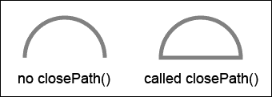
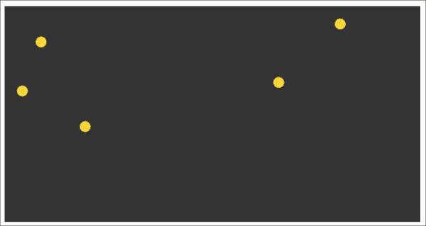
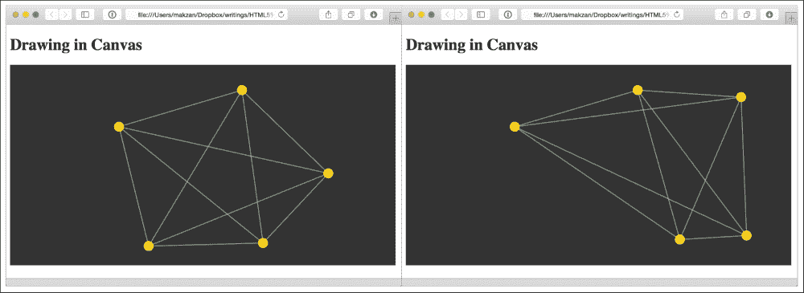
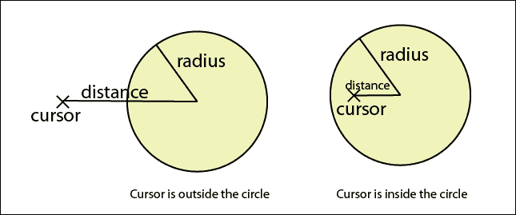
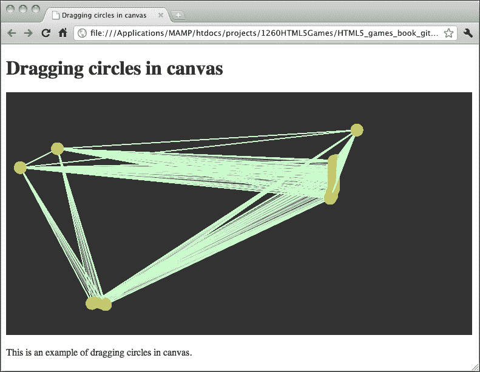
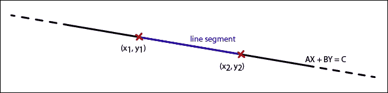

# 四、使用画布和绘图 API 构建你画我猜游戏

*HTML5 中一个突出的新特性是`canvas`元素。我们可以将其视为一个动态区域，在这里我们可以使用脚本绘制图形和形状。*

*网站上的图片多年来一直是静态的。有动画 GIF，但它们不能与访客互动。画布是动态的。我们通过 JavaScript 绘图 API 动态地在画布中绘制和修改上下文。我们还可以在画布上添加交互，从而制作游戏。*

在前两章中，我们讨论了使用 CSS3 和一些 HTML5 特性的基于 DOM 的游戏开发。在接下来的两章中，我们将重点介绍如何使用新的 HTML5 功能来创建游戏。在本章中，我们将看一看核心功能、画布和一些基本绘图技术。

在本章中，我们将介绍以下主题：

*   介绍 HTML5`canvas`元素
*   在画布上画一个圆
*   在`canvas`元素中绘制线条
*   使用鼠标事件与画布中绘制的对象交互
*   检测直线交点
*   支持触摸设备中的拖放功能

解开谜题游戏是一种游戏，玩家在游戏中被赋予圆圈，圆圈与圆圈之间有几条线相连。这些线可能与其他线相交，玩家需要拖动圆圈，这样就没有线相交了。

下面的屏幕截图预览了我们将通过本章实现的游戏：


您也可以在以下 URL 尝试游戏：

[http://makzan.net/html5-games/untangle-wip-dragging/](http://makzan.net/html5-games/untangle-wip-dragging/)

让我们从头开始制作画布游戏。

# 引入 HTML5 画布元素

W3C 社区声明`canvas`元素和绘图功能如下：

> *一种与分辨率相关的位图画布，可用于动态渲染图形、游戏图形或其他视觉图像。*

`canvas`元素包含绘图上下文，实际图形和形状由 JavaScript 绘图 API 绘制。使用`canvas`和通常的 HTMLDOM 元素之间有一个关键区别。画布是即时模式，而 DOM 是保留模式。我们用元素和属性描述 DOM 树，浏览器为我们呈现和跟踪对象。在画布中，我们必须自己管理所有属性和渲染。浏览器没有保存我们所画的内容的信息。它只保留绘制的像素数据。

# 在画布上画一个圆圈

让我们从基本形状圆开始在画布中开始绘图。

# 行动时间-在画布上画彩色圆圈

1.  首先，让我们为示例设置新的环境。也就是说，一个包含`canvas`元素的 HTML 文件，一个帮助我们使用 JavaScript 的 jQuery 库，一个包含实际绘图逻辑的 JavaScript 文件，以及一个样式表：

    ```html
    index.html
    js/
      js/jquery-2.1.3.js
      js/untangle.js
      js/untangle.drawing.js
      js/untangle.data.js
      js/untangle.input.js
    css/
      css/untangle.css
    img/
    ```

2.  将以下 HTML 代码放入`index.html`文件中。它是一个基本的 HTML 文档，包含`canvas`元素：

    ```html
    <!DOCTYPE html>
    <html lang="en">
    <head>
      <meta charset="utf-8">
      <title>Drawing Circles in Canvas</title>
      <link rel="stylesheet" href="css/untangle.css">
    </head>
    <body>
      <header>
        <h1>Drawing in Canvas</h1>
      </header>  

      <canvas id="game" width="768" height="400">
        This is an interactive game with circles and lines connecting them.
      </canvas>

    <script src="js/jquery-2.1.3.min.js"></script>
    <script src="js/untangle.data.js"></script>
    <script src="js/untangle.drawing.js"></script>
    <script src="js/untangle.input.js"></script>
    <script src="js/untangle.js"></script>
    </body>
    </html>
    ```

3.  使用 CSS 设置`untangle.css`

    ```html
    canvas {
      background: grey;
    }
    ```

    内画布的背景色
4.  在`untangle.js`JavaScript 文件中，我们放置了一个 jQuery`document``ready`函数，并在其中画了一个颜色圈：

    ```html
    $(document).ready(function(){
      var canvas = document.getElementById("game");  
      var ctx = canvas.getContext("2d");
      ctx.fillStyle = "GOLD";
      ctx.beginPath();
      ctx.arc(100, 100, 50, 0, Math.PI*2, true); 
      ctx.closePath();
      ctx.fill();
    });
    ```

5.  Open the `index.html` file in a web browser and we will get the following screenshot:

    

## *刚才发生了什么事？*

我们刚刚创建了一个带有圆圈的简单**画布上下文**。元素本身的设置不多。我们设置画布的宽度和高度，就像我们固定了真实画纸的尺寸一样。此外，我们还为画布分配了一个 ID 属性，以便在 JavaScript 中更容易引用：

```html
<canvas id="game" width="768" height="400">
  This is an interactive game with circles and lines connecting them.
</canvas>
```

## 当 web 浏览器不支持画布时放入回退内容

并非每个 web 浏览器都支持`canvas`元素。如果不支持`canvas`元素，`canvas`元素提供了一种简单的方式来提供**回退内容**。内容也为任何屏幕阅读器提供有意义的信息。`canvas`元素的打开和关闭标记中的任何内容都是后备内容。如果 web 浏览器支持该元素，则此内容将隐藏。不支持`canvas`的浏览器将显示该回退内容。在回退内容中提供有用的信息是一种良好的做法。例如，如果 AutoT5A.TAG 的目的是一个动态的图片，我们可以考虑在那里放置一个 Ty6 T6 替代品。或者我们也可以提供一些现代网络浏览器的链接，让访问者轻松升级浏览器。

## 画布语境

当我们在画布中绘制时，我们实际上调用了**画布渲染上下文**的绘制 API。您可以将画布和上下文的关系视为画布是真实图形表面的框架和上下文。目前，我们有`2d`、`webgl`和`webgl2`作为上下文选项。在我们的示例中，我们将通过调用`getContext("2d")`来使用 2D 绘图 API。

```html
var canvas = document.getElementById("game");  
var ctx = canvas.getContext("2d");
```

## 使用画布圆弧功能绘制圆和形状

没有圆函数来画圆。画布绘制 API 提供了一个函数来绘制不同的圆弧，包括圆。`arc`函数接受以下参数：

<colgroup><col style="text-align: left"> <col style="text-align: left"></colgroup> 
| 

论据

 | 

讨论

 |
| --- | --- |
| `X` | 圆弧在*x*轴上的中心点。 |
| `Y` | *y*轴上圆弧的中心点。 |
| `radius` | 半径是中心点和圆弧周长之间的距离。绘制圆时，半径越大，表示圆越大。 |
| `startAngle` | 起点是以弧度为单位的角度。它定义在周长上开始绘制圆弧的位置。 |
| `endAngle` | 终点为弧度角。从起始角位置到该终止角绘制圆弧。 |
| `counter-clockwise` | 这是一个布尔值，表示从`startingAngle`到`endingAngle`的弧以顺时针或逆时针方向绘制。这是一个具有默认值`false`的可选参数。 |

## 将度转换为弧度

`arc`函数中使用的角度参数是**弧度**而不是**度**。如果您熟悉度角，则可能需要将度转换为弧度，然后再将该值输入圆弧函数。我们可以使用以下公式转换角度单位：

```html
radians = π/180 x degrees
```

## 在画布中执行路径绘制

当我们调用函数`arc`或其他路径绘制函数时，我们没有立即在画布中绘制路径。相反，我们将其添加到路径列表中。在执行绘图命令之前，不会绘制这些路径。

有两个图形执行命令：一个用于填充路径的命令，另一个用于绘制笔划。

我们通过调用`fill`函数填充路径，并通过调用`stroke`函数绘制路径的笔划，我们将在以后绘制线条时使用该函数：

```html
ctx.fill();
```

## 开始每种风格的路径

`fill`和`stroke`函数在画布中填充并绘制路径，但不清除路径列表。以下面的代码片段为例。在用红色填充圆圈后，我们添加其他圆圈并用绿色填充。代码的变化是两个圆圈都用绿色填充，而不是只有新的圆圈用绿色填充：

```html
var canvas = document.getElementById('game');  
var ctx = canvas.getContext('2d');
ctx.fillStyle = "red";
ctx.arc(100, 100, 50, 0, Math.PI*2, true); 
ctx.fill();

ctx.arc(210, 100, 50, 0, Math.PI*2, true);
ctx.fillStyle = "green";
ctx.fill();
```

这是因为，当调用第二个`fill`命令时，画布中的路径列表包含两个圆。因此，`fill`命令用绿色填充两个圆圈，并覆盖红色圆圈。

为了解决此问题，我们希望确保在每次绘制新的形状之前调用`beginPath`。

`beginPath`函数清空路径列表，因此下次调用`fill`和`stroke`命令时，它们将只应用于最后一个`beginPath`之后的所有路径。

## 做个英雄吧

我们刚刚讨论了一个代码片段，其中我们打算画两个圆圈：一个是红色的，另一个是绿色的。代码最后以绿色绘制了两个圆。我们如何在代码中添加一个`beginPath`命令，使其正确绘制一个红色圆圈和一个绿色圆圈？

## 封闭路径

`closePath`功能将从最新路径的最后一点到路径的第一点绘制一条直线。这称为关闭路径。如果我们只填充路径而不绘制笔划轮廓，`closePath`函数不会影响结果。下面的屏幕截图比较了一个呼叫`closePath`和另一个不呼叫`closePath`的半圆上的结果：



## 突击测验

问题 1。如果我们只想填充颜色而不绘制轮廓笔划，是否需要对正在绘制的形状使用`closePath`功能？

1.  是的，我们需要使用`closePath`功能。
2.  不，我们是否使用`closePath`功能并不重要。

## 将圆图包装成函数

画一个圆是我们经常使用的一个常见功能。最好现在创建一个函数来画一个圆，而不是输入几行代码。

# 行动时间–将圆圈绘制代码放入函数

让我们做一个函数来画圆，然后在画布上画一些圆。我们将把代码放在不同的文件中，以使代码更简单：

1.  在我们的代码编辑器中打开`untangle.drawing.js`文件，输入以下代码：

    ```html
    if (untangleGame === undefined) {
      var untangleGame = {};
    }

    untangleGame.drawCircle = function(x, y, radius) {
      var ctx = untangleGame.ctx;
      ctx.fillStyle = "GOLD";
      ctx.beginPath();
      ctx.arc(x, y, radius, 0, Math.PI*2, true);
      ctx.closePath();
      ctx.fill();
    };
    ```

2.  打开`untangle.data.js`文件，将以下代码放入其中：

    ```html
    if (untangleGame === undefined) {
      var untangleGame = {};
    }

    untangleGame.createRandomCircles = function(width, height) {
      // randomly draw 5 circles
      var circlesCount = 5;
      var circleRadius = 10;
      for (var i=0;i<circlesCount;i++) {
        var x = Math.random()*width;
        var y = Math.random()*height;
        untangleGame.drawCircle(x, y, circleRadius);
      }
    };
    ```

3.  然后打开`untangle.js`文件。将 JavaScript 文件中的原始代码替换为以下代码：

    ```html
    if (untangleGame === undefined) {
      var untangleGame = {};
    }

    // Entry point
    $(document).ready(function(){
      var canvas = document.getElementById("game");
      untangleGame.ctx = canvas.getContext("2d");

      var width = canvas.width;
      var height = canvas.height;

      untangleGame.createRandomCircles(width, height);

    }); 
    ```

4.  Open the HTML file in the web browser to see the result:

    

## *刚才发生了什么事？*

图纸圈代码在页面加载就绪后执行。我们使用循环在画布上的任意位置绘制了几个圆。

## 将代码分为文件

我们正在将代码放入不同的文件中。目前有`untangle.js`、`untangle.drawing.js`和`untangle.data.js`文件。`untangle.js`是游戏的入口点。然后我们将与上下文绘制相关的逻辑放入`untangle.drawing.js`中，并将与数据操作相关的逻辑放入`untangle.data.js`文件中。

我们使用`untangleGame`对象作为在所有文件中访问的全局对象。在每个 JavaScript 文件的开头，如果该对象不存在，我们有以下代码来创建该对象：

```html
if (untangleGame === undefined) {
  var untangleGame = {};
}
```

## 在 JavaScript 中生成随机数

在游戏开发中，我们经常使用函数。我们可能想要随机召唤一个怪物让玩家战斗，我们可能想要在玩家进步时随机放弃奖励，我们可能想要一个随机数字作为掷骰子的结果。在这段代码中，我们将圆随机放置在画布中。

为了在 JavaScript 中生成一个随机数，我们使用了`Math.random()`函数。`random`函数中没有参数。它总是返回一个介于 0 和 1 之间的浮点数。该数字等于或大于 0 且小于 1。使用`random`功能有两种常见方式。一种方法是在给定范围内生成随机数。另一种方法是生成真值或假值。

<colgroup><col style="text-align: left"> <col style="text-align: left"> <col style="text-align: left"></colgroup> 
| 

用法

 | 

密码

 | 

讨论

 |
| --- | --- | --- |
| 获取 a 和 B 之间的随机整数 | `Math.floor(Math.random()*B)+A` | `Math.floor()`函数将给定数字的小数点切掉。以`Math.floor(Math.random()*10)+5`为例。`Math.random()`返回一个介于 0 到 0.9999 之间的十进制数…。`Math.random()*10`是介于 0 到 9.9999 之间的十进制数…。`Math.floor(Math.random()*10)`是介于 0 到 9 之间的整数。最后，`Math.floor(Math.random()*10)``+``5`是一个介于 5 到 14 之间的整数。 |
| 获取一个随机布尔值 | `(Math.random() > 0.495)` | `(Math.random()``>``0.495)`表示百分之五十`false`和百分之五十`true`。我们可以进一步调整真/假比率。`(Math.random()``>``0.7)`表示近 70%的`false`和 30%的`true`。 |

## 保存圆圈位置

当我们开发基于DOM 的游戏时，比如我们在前几章中构建的游戏，我们通常将游戏对象放入 DIV 元素中，然后在代码逻辑中访问它们。在基于画布的游戏开发中，这是一个不同的故事。

为了在画布中绘制游戏对象后访问它们，我们需要自己记住它们的状态。假设现在我们想知道画了多少个圆，它们在哪里，我们需要一个数组来存储它们的位置。

# 行动时间-保存圆圈位置

1.  在文本编辑器中打开`untangle.data.js`文件。
2.  在 JavaScript 文件中添加以下`circle`对象定义代码：

    ```html
    untangleGame.Circle = function(x,y,radius){
      this.x = x;
      this.y = y;
      this.radius = radius;
    }
    ```

3.  现在我们需要一个数组来存储圆的位置。向`untangleGame`对象

    ```html
    untangleGame.circles = [];
    ```

    添加新数组
4.  在画布中绘制每个圆时，我们将圆的位置保存在`circles`数组中。在调用`drawCircle`函数之前，在`createRandomCircles`函数中添加以下行：

    ```html
    untangleGame.circles.push(new untangleGame.Circle(x,y,circleRadius));
    ```

5.  步骤完成后，我们应该在`untangle.data.js`文件中有以下代码：

    ```html
    if (untangleGame === undefined) {
      var untangleGame = {};
    }

    untangleGame.circles = [];

    untangleGame.Circle = function(x,y,radius){
      this.x = x;
      this.y = y;
      this.radius = radius;
    };

    untangleGame.createRandomCircles = function(width, height) {
      // randomly draw 5 circles
      var circlesCount = 5;
      var circleRadius = 10;
      for (var i=0;i<circlesCount;i++) {
        var x = Math.random()*width;
        var y = Math.random()*height;
        untangleGame.circles.push(new untangleGame.Circle(x,y,circleRadius));
        untangleGame.drawCircle(x, y, circleRadius);
      }
    };
    ```

6.  现在我们可以在 web 浏览器中测试代码。在画布中绘制随机圆时，此代码与上一个示例在视觉上没有区别。这是因为我们正在保存圆圈，但没有更改任何影响外观的代码。我们只是确保它看起来相同，并且没有新的错误。

## *刚才发生了什么事？*

我们保存了每个圆的位置和半径。这是因为画布绘制是一种即时模式。我们无法直接访问画布中绘制的对象，因为没有此类信息。所有线条和形状都以像素的形式绘制在画布上，我们无法将线条或形状作为单个对象进行访问。想象一下，我们正在一块真正的画布上画画。我们不能仅仅移动油画中的房子，同样，我们也不能直接操纵`canvas`元素中的任何绘制项目。

## 用 JavaScript 定义基本类定义

我们可以在 JavaScript 中使用**面向对象编程**。我们可以定义一些对象结构供使用。`Circle`对象为我们提供了一个数据结构，可以方便地存储*x*和*y*位置和半径的集合。

在定义了`Circle`对象后，我们可以使用以下代码创建一个新的`Circle`实例，该实例具有*x*、*y*和半径值：

```html
var circle1 = new Circle(100, 200, 10);
```

### 注

有关 JavaScript 中的面向对象编程的更多详细用法，请通过以下链接查看 Mozilla 开发者中心：

[https://developer.mozilla.org/en/Introduction_to_Object-Oriented_JavaScript](https://developer.mozilla.org/en/Introduction_to_Object-Oriented_JavaScript)

## 做个英雄吧

我们在画布上随机画了几个圆圈。它们样式相同，大小相同。我们随机画出圆圈的大小如何？用不同的颜色填充圆圈？尝试修改代码，然后使用绘图 API。

# 在画布上画线

现在我们这里有几个圆，那么用线把它们连接起来怎么样？让我们在每个圆之间画一条直线。

# 行动时间-在每个圆圈之间画直线

1.  打开我们刚才在圆图示例中使用的`index.html`文件。
2.  将 h1 中的文字从**在画布上画圆圈**改为**在画布上画线条**。
3.  打开`untangle.data.js`JavaScript 文件。
4.  我们定义了一个`Line`类来存储每行所需的信息：

    ```html
    untangleGame.Line = function(startPoint, endPoint, thickness) {
      this.startPoint = startPoint;
      this.endPoint = endPoint;
      this.thickness = thickness;
    }
    ```

5.  保存文件并切换到`untangle.drawing.js`文件。
6.  我们还需要两个变量。在 JavaScript 文件中添加以下行：

    ```html
    untangleGame.thinLineThickness = 1;
    untangleGame.lines = [];
    ```

7.  在`untangle.drawing.js`文件中已有的`drawCircle`函数之后，我们在代码中添加了以下`drawLine`函数。

    ```html
    untangleGame.drawLine = function(ctx, x1, y1, x2, y2, thickness) {    
      ctx.beginPath();
      ctx.moveTo(x1,y1);
      ctx.lineTo(x2,y2);
      ctx.lineWidth = thickness;
      ctx.strokeStyle = "#cfc";
      ctx.stroke();
    }
    ```

8.  然后我们定义一个新函数，该函数迭代圆列表并在每对圆之间绘制一条线。在 JavaScript 文件中追加以下代码：

    ```html
    untangleGame.connectCircles = function() {
      // connect the circles to each other with lines
      untangleGame.lines.length = 0;
      for (var i=0;i< untangleGame.circles.length;i++) {
        var startPoint = untangleGame.circles[i];
        for(var j=0;j<i;j++) {
          var endPoint = untangleGame.circles[j];
          untangleGame.drawLine(startPoint.x, startPoint.y, endPoint.x,
          endPoint.y, 1);
          untangleGame.lines.push(new untangleGame.Line(startPoint, endPoint,
          untangleGame.thinLineThickness));
        }
      }
    };
    ```

9.  最后，我们打开`untangle.js`文件，在调用`untangleGame.createRandomCircles`函数后，在 jQuery 文档`ready`函数的末尾添加以下代码：

    ```html
    untangleGame.connectCircles();
    ```

10.  Test the code in the web browser. We should see there are lines connected to each randomly placed circle:

    

## *刚才发生了什么事？*

我们用连接每个生成的圆的行来增强代码。您可以在以下 URL 中找到一个工作示例：

[http://makzan.net/html5-games/untangle-wip-connect-lines/](http://makzan.net/html5-games/untangle-wip-connect-lines/)

与保存圆位置的方式类似，我们有一个数组来保存绘制的每条线段。我们声明一个 line 类定义来存储线段的一些基本信息。也就是说，我们保存了起点和终点以及线的厚度。

## 引入线描 API

有一些绘图API 供我们绘制线条笔划并对其进行样式设置：

<colgroup><col style="text-align: left"> <col style="text-align: left"></colgroup> 
| 

线条绘制功能

 | 

讨论

 |
| --- | --- |
| `moveTo` | `moveTo`功能就像我们手里拿着一支笔，在纸上移动它，而不用笔去碰它。 |
| `lineTo` | 此功能就像把笔放在纸上，画一条直线到达目的点。 |
| `lineWidth` | `lineWidth`函数设置我们随后绘制的笔划的厚度。 |
| `stroke` | `stroke`功能用于执行图纸。我们设置了一组`moveTo`、`lineTo`或样式化函数，最后调用`stroke`函数在画布上执行。 |

我们通常使用`moveTo`和`lineTo`对来画线。就像在现实世界中一样，我们把笔放在纸上，移动到一条线的起点，然后放下笔来画一条线。然后，继续画另一条线或在画之前移动到另一个位置。这正是我们在画布上画线的流程。

### 注

我们刚刚演示了如何画一条简单的线。我们可以为画布中的线条设置不同的线条样式。有关线条样式的更多详细信息，请阅读 W3C 中的样式指南，网址为[http://www.w3.org/TR/2dcontext/#line-样式](http://www.w3.org/TR/2dcontext/#line-styles)和位于[的 Mozilla 开发中心 https://developer.mozilla.org/en-US/docs/Web/API/Canvas_API/Tutorial/Applying_styles_and_colors](https://developer.mozilla.org/en-US/docs/Web/API/Canvas_API/Tutorial/Applying_styles_and_colors) 。

# 使用鼠标事件与画布中绘制的对象交互

到目前为止，我们已经证明我们可以根据我们的逻辑在画布上动态地绘制形状。游戏开发中缺少一部分，那就是输入。

现在，假设我们可以在画布上拖动圆圈，连接线将跟随圆圈。在本节中，我们将向画布添加鼠标事件，以使我们的圆圈**可拖动**。

# 行动时间-在画布上拖动圆圈

1.  让我们继续前面的代码。打开`html5games.untangle.js`文件。
2.  我们需要一个函数来清除画布中的所有图形。在`untangle.drawing.js`文件末尾添加以下功能：

    ```html
    untangleGame.clear = function() {
      var ctx = untangleGame.ctx;
      ctx.clearRect(0,0,ctx.canvas.width,ctx.canvas.height);
    };
    ```

3.  我们还需要另外两个函数来绘制所有已知的圆和线。在`untangle.drawing.js`文件中追加以下代码：

    ```html
    untangleGame.drawAllLines = function(){
      // draw all remembered lines
      for(var i=0;i<untangleGame.lines.length;i++) {
        var line = untangleGame.lines[i];
        var startPoint = line.startPoint;
        var endPoint = line.endPoint;
        var thickness = line.thickness;
        untangleGame.drawLine(startPoint.x, startPoint.y, endPoint.x,
        endPoint.y, thickness);
      }
    };

    untangleGame.drawAllCircles = function() {
      // draw all remembered circles
      for(var i=0;i<untangleGame.circles.length;i++) {
        var circle = untangleGame.circles[i];
        untangleGame.drawCircle(circle.x, circle.y, circle.radius);
      }
    };
    ```

4.  `untangle.drawing.js`文件已经处理完毕。让我们切换到`untangle.js`文件。在 jQuery document ready 函数中，在函数结束之前，我们添加了以下代码，它创建了一个游戏循环来不断绘制圆圈和线条：

    ```html
    // set up an interval to loop the game loop
    setInterval(gameloop, 30);

    function gameloop() {
      // clear the Canvas before re-drawing.
      untangleGame.clear();
      untangleGame.drawAllLines();
      untangleGame.drawAllCircles();
    }
    ```

5.  在进入输入处理代码实现之前，让我们将以下代码添加到`untangle.js`文件中的 jQuery document ready 函数中，该函数调用我们将定义的`handleInput`函数：

    ```html
    untangleGame.handleInput();
    ```

6.  是时候实现我们的输入处理逻辑了。切换到`untangle.input.js`文件，并在文件中添加以下代码：

    ```html
    if (untangleGame === undefined) {
      var untangleGame = {};
    }

    untangleGame.handleInput = function(){
      // Add Mouse Event Listener to canvas
      // we find if the mouse down position is on any circle
      // and set that circle as target dragging circle.
      $("#game").bind("mousedown", function(e) {
        var canvasPosition = $(this).offset();
        var mouseX = e.pageX - canvasPosition.left;
        var mouseY = e.pageY - canvasPosition.top;

        for(var i=0;i<untangleGame.circles.length;i++) {
          var circleX = untangleGame.circles[i].x;
          var circleY = untangleGame.circles[i].y;
          var radius = untangleGame.circles[i].radius;
          if (Math.pow(mouseX-circleX,2) + Math.pow(mouseY-circleY,2) < Math.pow(radius,2)) {
            untangleGame.targetCircleIndex = i;
            break;
          }
        }
      });

      // we move the target dragging circle 
      // when the mouse is moving
      $("#game").bind("mousemove", function(e) {
        if (untangleGame.targetCircleIndex !== undefined) {
          var canvasPosition = $(this).offset();
          var mouseX = e.pageX - canvasPosition.left;
          var mouseY = e.pageY - canvasPosition.top;
          var circle = untangleGame.circles[untangleGame.targetCircleIndex];
          circle.x = mouseX;
          circle.y = mouseY;
        }
        untangleGame.connectCircles();
      });

      // We clear the dragging circle data when mouse is up
      $("#game").bind("mouseup", function(e) {
        untangleGame.targetCircleIndex = undefined;
      });
    };
    ```

7.  Open `index.html` in a web browser. There should be five circles with lines connecting them. Try dragging the circles. The dragged circle will follow the mouse cursor and the connected lines will follow too.

    

## *刚才发生了什么事？*

我们已经设置了三个鼠标事件侦听器。它们是鼠标落下、移动和上升事件。我们还创建了游戏循环，它根据圆圈的新位置更新画布绘图。您可以在以下位置查看示例的当前进度：[http://makzan.net/html5-games/untangle-wip-dragging-basic/](http://makzan.net/html5-games/untangle-wip-dragging-basic/) 。

## 在画布的圆圈中检测鼠标事件

在讨论了基于 DOM 的开发与基于画布的开发之间的差异之后，我们无法直接聆听画布中绘制的任何形状的鼠标事件。没有这样的事。我们无法监视画布中绘制的任何形状的事件。我们只能获取`canvas`元素的鼠标事件并计算画布的相对位置。然后我们根据鼠标的位置改变游戏对象的状态，最后在画布上重新绘制。

*我们怎么知道我们在点击一个圆圈？*我们可以使用**圆中的点**公式。这是为了检查圆的中心点与鼠标位置之间的距离。当距离小于圆的半径时，鼠标单击圆。我们用这个公式得到两点之间的距离：*距离=（x2-x1）2+（y2-y1）2*。

下图显示，当中心点和鼠标光标之间的距离小于半径时，光标位于圆中：



我们使用的以下代码解释了如何应用距离检查，以了解鼠标光标是否位于鼠标按下事件处理程序中的圆圈内：

```html
if (Math.pow(mouseX-circleX,2) + Math.pow(mouseY-circleY,2) < Math.pow(radius,2)) {
  untangleGame.targetCircleIndex = i;
  break;
}
```

### 注

请注意，`Math.pow`是一个昂贵的函数，在某些情况下可能会影响性能。如果性能是一个问题，我们可以使用边界框碰撞检查，我们在[第 2 章](02.html "Chapter 2. Getting Started with DOM-based Game Development")、*基于 DOM 的游戏开发入门*中介绍过。

当我们知道鼠标光标按下画布中的圆圈时，我们将其标记为要在鼠标移动事件中拖动的目标圆圈。在鼠标移动事件处理程序中，我们将目标拖动圆的位置更新为最新的光标位置。当鼠标向上时，我们清除目标圆的参考。

## 突击测验

问题 1。我们可以直接访问画布中已绘制的形状吗？

1.  对
2.  不

问题 2。我们可以使用哪种方法检查点是否在圆内？

1.  点的坐标小于圆心的坐标。
2.  点与圆心之间的距离小于圆的半径。
3.  点的*x*坐标小于圆的半径。
4.  点与圆心之间的距离大于圆的半径。

## 游戏循环

在[第 2 章](02.html "Chapter 2. Getting Started with DOM-based Game Development")*开始基于 DOM 的游戏开发*中，我们讨论了**游戏循环**方法。在乒乓球游戏中，游戏循环操纵键盘输入并更新基于 DOM 的游戏对象的位置。

在这里，游戏循环用于重新绘制画布以显示稍后的游戏状态。如果我们在改变状态后不重新绘制画布，比如说圆的位置，我们将看不到它。

## 清理画布

当我们拖动圆圈时，我们重新绘制画布。问题是画布上已经绘制的形状不会自动消失。我们将继续向画布添加新路径，最终将画布中的所有内容都搞乱。下面的屏幕截图是如果我们在每次重画时都不清除画布而一直拖动圆圈，将会发生的情况：



因为我们已经用 JavaScript 保存了所有游戏状态，所以我们可以安全地清除整个画布，并用最新的游戏状态绘制更新的线条和圆圈。为了清除画布，我们使用画布绘制 API 提供的`clearRect`函数。`clearRect`功能通过提供矩形剪裁区域来清除矩形区域。它接受以下参数作为剪裁区域：

```html
context.clearRect(x, y, width, height)
```

<colgroup><col style="text-align: left"> <col style="text-align: left"></colgroup> 
| 

论点

 | 

释义

 |
| --- | --- |
| `x` | 矩形剪裁区域的左上方点，位于*x*轴上。 |
| `y` | 矩形剪裁区域的左上点，位于*y*轴上。 |
| `width` | 矩形区域的宽度。 |
| `height` | 矩形区域的高度。 |

`x`和`y`值设置要清除区域的左上角位置。`width`和`height`值定义要清除的面积。为了清除整个画布，我们可以向`clearRect`函数提供（0,0）作为左上角位置以及画布的宽度和高度。以下代码清除在整个画布上绘制的所有内容：

```html
ctx.clearRect(0, 0, ctx.canvas.width, ctx.canvas.height);
```

## 突击测验

问题 1。我们可以使用 clearRect 函数清除画布的一部分吗？

1.  对
2.  不

问题 2。下面的代码是否清除了绘制画布上的内容？

```html
ctx.clearRect(0, 0, ctx.canvas.width, 0);
```

1.  对
2.  不

# 在画布中检测线交点

画布上有可拖动的圆圈和连接线。有些线条与其他线条相交，有些则不相交。现在假设我们想要区分相交的线。我们需要一些数学公式来检查它们，然后加厚那些相交的线。

# 行动时间-区分相交线

让我们增加相交线的厚度，以便在画布上区分它们

1.  在文本编辑器中打开 `untangle.drawing.js`文件。
2.  我们将`thinLineThickness`变量作为默认的线条厚度。我们添加以下代码来定义粗体线的厚度：

    ```html
    untangleGame.boldLineThickness = 5;
    ```

3.  打开`untangle.data.js`文件。我们创建一个函数来检查给定的两条线是否相交。在 JavaScript 文件末尾添加以下函数：

    ```html
    untangleGame.isIntersect = function(line1, line2) {
      // convert line1 to general form of line: Ax+By = C
      var a1 = line1.endPoint.y - line1.startPoint.y;
      var b1 = line1\. startPoint.x - line1.endPoint.x;
      var c1 = a1 * line1.startPoint.x + b1 * line1.startPoint.y;

      // convert line2 to general form of line: Ax+By = C
      var a2 = line2.endPoint.y - line2.startPoint.y;
      var b2 = line2\. startPoint.x - line2.endPoint.x;
      var c2 = a2 * line2.startPoint.x + b2 * line2.startPoint.y;

      // calculate the intersection point    
      var d = a1*b2 - a2*b1;

      // parallel when d is 0
      if (d === 0) {
        return false;
      }

      // solve the interception point at (x, y)
      var x = (b2*c1 - b1*c2) / d;
      var y = (a1*c2 - a2*c1) / d;

      // check if the interception point is on both line segments
      if ((isInBetween(line1.startPoint.x, x, line1.endPoint.x) || isInBetween(line1.startPoint.y, y, line1.endPoint.y)) &&
         (isInBetween(line2.startPoint.x, x, line2.endPoint.x) || isInBetween(line2.startPoint.y, y, line2.endPoint.y))) {
          return true;
        }

        // by default the given lines is not intersected.
        return false;
    };

    // return true if b is between a and c,
    // we exclude the result when a==b or b==c
    untangleGame.isInBetween = function(a, b, c) {
      // return false if b is almost equal to a or c.
      // this is to eliminate some floating point when
      // two value is equal to each other 
      // but different with 0.00000...0001
      if (Math.abs(a-b) < 0.000001 || Math.abs(b-c) < 0.000001) {
        return false;
      }

      // true when b is in between a and c
      return (a < b && b < c) || (c < b && b < a);
    };
    ```

4.  让我们继续使用`untangle.data.js`文件。我们定义以下函数来检查直线是否相交，并用粗体标记该直线。在文件末尾追加以下新函数：

    ```html
    untangle.updateLineIntersection = function() {
      // checking lines intersection and bold those lines.
      for (var i=0;i<untangleGame.lines.length;i++) {
        for(var j=0;j<i;j++) {
          var line1 = untangleGame.lines[i];
          var line2 = untangleGame.lines[j];

          // we check if two lines are intersected, 
          // and bold the line if they are.
          if (isIntersect(line1, line2)) {
            line1.thickness = untangleGame.boldLineThickness;
            line2.thickness = untangleGame.boldLineThickness;
          }              
        }
      }
    }
    ```

5.  Finally, we update the line intersection by adding the following function call in two places. Open the `untangle.js` file. Add the following line of code inside the jQuery document-ready function, probably before the game-loop function:

    `untangleGame.updateLineIntersection();`

6.  然后，打开`untangle.input.js`文件，在鼠标移动事件处理程序中添加相同的代码。
7.  是时候在 web 浏览器中测试交叉点了。在画布中查看圆和线时，有交点的线应比没有交点的线厚。尝试拖动圆以更改相交关系，直线将变细或变粗。

## *刚才发生了什么事？*

我们刚刚在现有的圆拖动示例中添加了一些线交点的代码检查。线路交点代码包含一些数学公式，用于获取两条线路的**交点**，并检查该点是否在我们提供的线段内。您可以在以下位置查看示例的当前进度：[http://makzan.net/html5-games/untangle-wip-intersected-lines/](http://makzan.net/html5-games/untangle-wip-intersected-lines/) 。

让我们看看数学元素，看看它是如何工作的。

## 确定两条线段是否相交

根据我们从几何学中学习到的交点方程，用一般形式的两条给定直线，我们可以得到交点。

什么是**通用表格**？在我们的代码中，我们在*x*和*y*坐标中有一条直线的起点和终点。这是一条**直线段**，因为它在数学上只是直线的一部分。线的一般形式由`Ax``+``By``=``C`表示。

下图以一般形式解释了直线上的线段：



我们可以将**x1**中的点 1、**y1**中的点 1、**x2**中的点 2、**y2**中的线段通过以下等式转换为一般形式：

```html
A = y2-y1
B = x1-x2
C = A * x1 + B * y2
```

现在我们有一个直线方程`AX+BY``=``C`，其中`A`、`B`、`C`已知，`X`和`Y`未知。

我们正在检查两条相交的线。我们可以将两条线转换为一般形式，得到两条线方程：

```html
Line 1: A1X+B1Y = C1
Line 2: A2X+B2Y = C2
```

把两个一般形式的方程放在一起，`X`和`Y`是两个未知的变量。然后我们可以解这两个方程，得到*x*和*y*的交点。

如果`A1``*``B2``-``A2``*``B1`为零，则两条线平行，没有交点。否则，我们使用以下等式得到拦截点：

```html
X = (B2 * C1 – B1 * C2) / (A1 * B2 – A2 * B1)
Y = (A1 * C2 – A2 * C1) / (A1 * B2 – A2 * B1)
```

这些一般形式的交点仅规定两条线彼此不平行，并将在某一点上相交。它不能保证交点位于两条线段上。

下图显示了交点和给定线段的两种可能结果。交点不在左图中两条线段之间；在这种情况下，两条线段不相交。在右侧图形中，点位于两条线段之间，因此这两条线段相互相交：


因此，我们需要另一个名为`isInBetween`的函数来确定提供的值是否介于起始值和结束值之间。然后，我们使用此函数检查方程中的交点是否位于我们正在检查的两条线段之间。

在得到直线相交的结果后，我们画一条粗线来表示那些相交的直线。

# 增加平板电脑触摸支持

在平板电脑和移动设备中，拖放是触摸设备中常见的手势。目前，我们的游戏不支持这些触摸设备。我们希望在本节中为游戏添加触摸支持。

# 行动时间–添加触摸输入支持

让我们允许平板电脑用户通过以下步骤拖放圆圈：

1.  默认情况下，在 iOS 设备的`canvas`元素中有一个高亮显示的选项。我们希望去掉这个突出显示的部分，以使拖动交互变得平滑。将以下 CSS 规则添加到`canvas`CSS 中。请注意，我们在这里使用了`webkit`供应商前缀，因为在撰写本书时，此规则专门针对`webkit`：

    ```html
    canvas {
      /* for iOS devices */
      -webkit-tap-highlight-color: transparent;
    }
    ```

2.  打开`untangle.input.js file`按钮。在上一步中，我们将鼠标事件绑定到画布上。现在我们添加了对触摸事件的支持。我们使用`MouseEvent.pageX`和`pageY`计算鼠标位置。使用触摸设备，可以进行多次触摸。我们修改代码以添加触摸支持：

    ```html
    $("#game").bind("mousedown touchstart", function(e) {
      // disable default drag to scroll behavior
      e.preventDefault();

      // touch or mouse position
      var touch = e.originalEvent.touches && e.originalEvent.touches[0];
      var pageX = (touch||e).pageX;
      var pageY = (touch||e).pageY;

      var canvasPosition = $(this).offset();
      var mouseX = pageX - canvasPosition.left;
      var mouseY = pageY - canvasPosition.top;

      // existing code goes here.

    }
    ```

3.  我们同样修改了`mousemove`事件。我们绑定`mousemove`和`touchmove`事件，并计算触摸位置：

    ```html
    $("#game").bind("mousemove touchmove", function(e) {
      // disable default drag to scroll behavior
      e.preventDefault();

      // touch or mouse position
      var touch = e.originalEvent.touches && e.originalEvent.touches[0];
      var pageX = (touch||e).pageX;
      var pageY = (touch||e).pageY;

      var canvasPosition = $(this).offset();
      var mouseX = pageX - canvasPosition.left;
      var mouseY = pageY - canvasPosition.top;

      // existing code goes here.    
    }
    ```

4.  对于原始的`mouseup`事件处理程序，我们添加了`touchend`处理：

    ```html
    $("#game").bind("mouseup touchend", function(e) {
     // existing code goes here.
    }
    ```

## *刚才发生了什么事？*

我们刚刚为我们的你画我猜游戏添加了触摸支持。您可以在[找到代码和示例 http://makzan.net/html5-games/untangle-wip-dragging/](http://makzan.net/html5-games/untangle-wip-dragging/) 。

在 CSS 中，我们通过将`-webkit-tap-highlight-color`设置为透明来禁用默认的点击高光。我们需要供应商前缀`-webkit-`，因为这是专为其触摸设备设计的仅限 WebKit 的规则。

## 处理触摸

我们使用以下代码获得`touch`事件对象：

```html
var touch = e.originalEvent.touches && e.originalEvent.touches[0];
```

触摸阵列保存屏幕上的所有当前触摸。因为我们在 jQuery 中处理触摸事件，所以我们需要访问`originalEvent`来访问触摸，因为这些是浏览器本机事件，而不是 jQuery 事件。

在这个游戏中，我们只关心一次触球，这就是为什么我们只检查`touches[0]`参数。我们还确认在使用数组表示法之前存在`originalEvent.touches`，否则，浏览器会在非触摸设备上抛出错误。

然后我们访问`touch`对象或鼠标事件对象的`pageX`属性。如果出现`touch`对象，JavaScript 将使用`touch.pageX`。否则，JavaScript 将使用鼠标事件的`pageX`属性：

```html
var pageX = (touch||e).pageX;
```

## 鼠标移动和触摸移动

我们为我们的`mousedown`/`touchstart`、`mousemove`/`touchmove`和`mouseup`/`touchend`事件重用了相同的逻辑。通常`mousedown`和`touchstart`在拖动启动时具有非常相似的逻辑。`mouseup`和`touchend`事件在拖动端点方面也有类似的逻辑。然而，`mousemove`和`touchmove`事件有细微的区别。在有鼠标输入的桌面设备中，`mousemove`事件总是在鼠标移动时触发，而不管按下鼠标按钮。这就是为什么我们需要使用一个变量`targetCircleIndex`来确定按钮是否被按下，然后在鼠标移动时选择某个圆圈。另一方面，`touchmove`事件只有当一个手指实际落在屏幕上并拖动时才会发生。这种差异有时可能会影响我们处理逻辑的不同方式。

# 总结

在本章中，您学习了很多关于绘制形状以及创建与新 HTML5`canvas`元素和绘图 API 的交互的知识。

具体来说，您学习了在画布上绘制圆和线。我们添加了鼠标事件和与画布中绘制的路径的触摸拖动交互。我们借助数学公式确定了直线交点。我们将复杂的代码逻辑分离到不同的文件中，以使代码可维护。我们将逻辑划分为数据、绘图和输入。

现在，您已经了解了画布中的基本绘图功能和绘图 API，现在可以学习画布中的一些高级绘图技术了。在下一章中，我们将继续代码示例，创建一个你画我猜游戏。您还将学习更多画布绘制技术，例如绘制文本、绘制图像和创建多个绘图层。