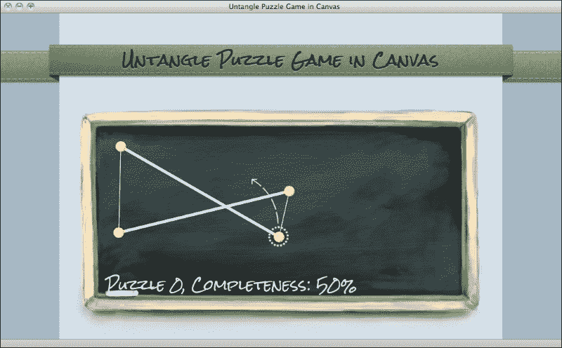
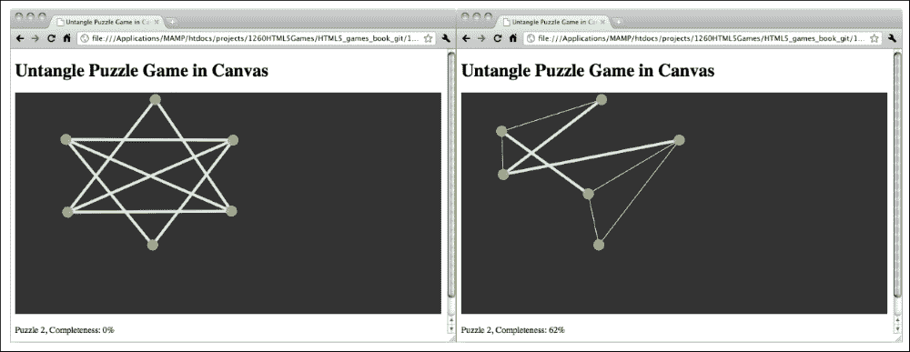
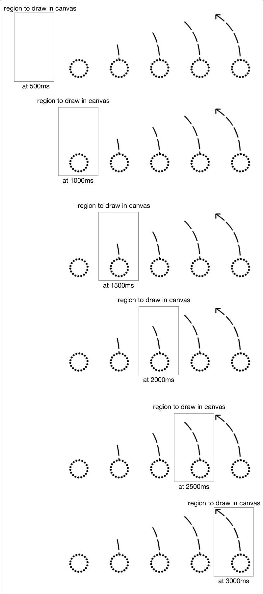
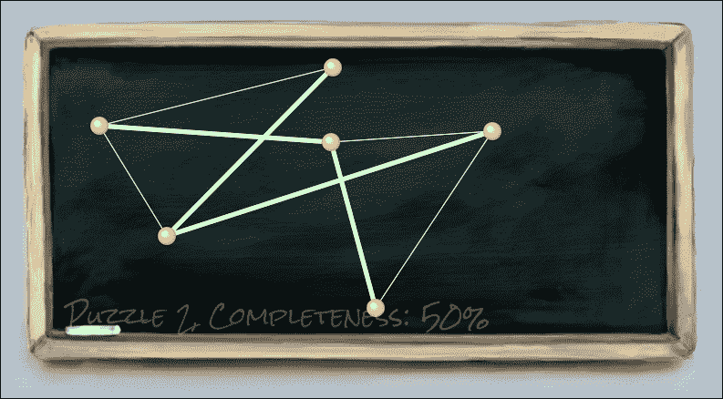
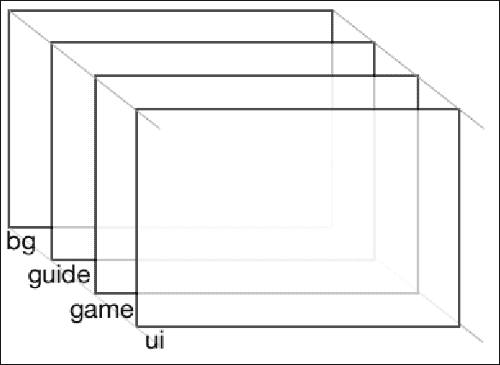

# 五、构建画布游戏的进阶课

*在上一章中，我们探索了一些基本的画布上下文绘制 API，并创建了一个名为 Untangle 的游戏。在本章中，我们将通过使用其他一些上下文绘制 API 来增强游戏。*

在本章中，您将学习如何执行以下操作：

*   实现你画我猜游戏逻辑
*   使用自定义 web 字体填充画布中的文本
*   在画布中绘制图像
*   设置精灵图纸图像的动画
*   构建多个画布层

下面的屏幕截图是我们将通过本章构建的最终结果的预览。这是一款基于画布的你画我猜游戏，带有动画游戏指南和一些微妙的细节：



您也可以在[尝试最后一个游戏示例 http://makzan.net/html5-games/untangle/](http://makzan.net/html5-games/untangle/) 。

让我们继续吧。

# 制作解开谜题游戏

现在我们已经创建了一个交互式画布，我们可以拖动圆，以及连接与其他线相交的圆的线。我们把它变成游戏怎么样？有一些预定义的圆和线，我们的目标是拖动这些圆，以便没有线与其他线相交。这就是所谓的**解开谜题游戏**。

# 行动时间-在画布上制作解开谜题游戏

让我们将游戏逻辑添加到我们的线交点代码中：

1.  我们还需要两个游戏逻辑文件。创建两个名为`untangle.game.js`和`untangle.levels.js`文件的新文件。将它们放入`js`文件夹中。
2.  在文本编辑器中打开`index.html`文件。添加以下代码以包括我们新创建的文件。在包含`js/untangle.js`文件

    ```html
    <script src="js/untangle.levels.js"></script>
    <script src="js/untangle.game.js"></script>
    ```

    之前，将代码放入文件中
3.  仍然在`index.html`文件中，我们在`canvas`元素之后添加以下代码。显示游戏级别信息：

    ```html
    <p>Puzzle <span id="level">0</span>, Completeness: <span id="progress">0</span>%</p>
    ```

4.  打开`untangle.levels.js`文件。将以下级别数据定义码放入文件中。这是一个预定义级别的数据，供玩家使用。这是一组数据，定义了圆的放置位置以及它们最初如何相互连接：

    ```html
    if (untangleGame === undefined) {
      var untangleGame = {};
    }
    untangleGame.levels = [
      {
        circles : [
              {x : 400, y : 156},
              {x : 381, y : 241},
              {x : 84, y : 233},
              {x : 88, y : 73}],
        relationship : [
              {connectedPoints : [1,2]},
              {connectedPoints : [0,3]},
              {connectedPoints : [0,3]},
              {connectedPoints : [1,2]}
        ]
      },
      {
        circles : [
              {x : 401, y : 73},
              {x : 400, y : 240},
              {x : 88, y : 241},
              {x : 84, y : 72}],
        relationship : [
              {connectedPoints : [1,2,3]},
              {connectedPoints : [0,2,3]},
              {connectedPoints : [0,1,3]},
              {connectedPoints : [0,1,2]}
        ]
      },
      {
        circles : [
              {x : 192, y : 155},
              {x : 353, y : 109},
              {x : 493, y : 156},
              {x : 490, y : 236},
              {x : 348, y : 276},
              {x : 195, y : 228}],
        relationship : [
              {connectedPoints : [2,3,4]},
              {connectedPoints : [3,5]},
              {connectedPoints : [0,4,5]},
              {connectedPoints : [0,1,5]},
              {connectedPoints : [0,2]},
              {connectedPoints : [1,2,3]}
        ]
      }
    ];
    ```

5.  在文本编辑器中打开`untangle.game.js`文件。我们将把游戏逻辑放到这个文件中。
6.  这是一个新文件，所以我们在文件开头定义了`untangleGame`对象：

    ```html
    if (untangleGame === undefined) {
      var untangleGame = {};
    }
    ```

7.  在`untangle.game.js`文件中继续。将以下变量添加到文件中。它们存储当前的等级和游戏的等级进度：

    ```html
    untangleGame.currentLevel = 0;
    untangleGame.levelProgress = 0;
    ```

8.  在每个级别上启动时，我们需要设置初始级别数据。为了使代码更具可读性，我们创建了一个函数。将以下代码附加到`untangle.game.js`JavaScript 文件：

    ```html
    untangleGame.setupCurrentLevel = function() {
      untangleGame.circles = [];
      var level = untangleGame.levels[untangleGame.currentLevel];
      for (var i=0; i<level.circles.length; i++) {
        untangleGame.circles.push(new untangleGame.Circle(level.circles[i].x, level.circles[i].y, 10));
      }

      untangleGame.levelProgress = 0;

      untangleGame.connectCircles();
      untangleGame.updateLineIntersection();
      untangleGame.checkLevelCompleteness();
      untangleGame.updateLevelProgress();
    }
    ```

9.  这是一个有几个关卡的游戏。我们需要检查玩家是否在当前关卡中解决了难题，并跳到下一个难题。在`untangle.game.js`文件末尾添加以下功能：

    ```html
    untangleGame.checkLevelCompleteness = function () {
      if (untangleGame.levelProgress === 100) {
        if (untangleGame.currentLevel+1 < untangleGame.levels.length) {
          untangleGame.currentLevel+=1;
        }
        untangleGame.setupCurrentLevel();
      }
    }
    ```

10.  我们需要另一个功能更新游戏进度。在`untangle.game.js` 文件末尾增加以下功能：

    ```html
    untangleGame.updateLevelProgress = function() {
      // check the untangle progress of the level
      var progress = 0;
      for (var i=0; i<untangleGame.lines.length; i++) {
        if (untangleGame.lines[i].thickness === untangleGame.thinLineThickness) {

          progress+=1;
        }
      }
      var progressPercentage = Math.floor(progress/untangleGame.lines.length*100);

      untangleGame.levelProgress = progressPercentage;
      $("#progress").text(progressPercentage);

      // display the current level
      $("#level").text(untangleGame.currentLevel);
    }
    ```

11.  打开`untangle.input.js` 文件。我们将以下代码添加到鼠标移动事件处理程序中，以更新级别进度：

    ```html
    untangleGame.updateLevelProgress();
    ```

12.  我们将以下代码添加到鼠标向上事件处理程序中，以检查玩家是否完成该级别：

    ```html
    untangleGame.checkLevelCompleteness();
    ```

13.  现在在编辑器中打开`untangle.js`文件。在 jQuery 文档的`ready`函数中，我们有代码来设置圆圈和线条。它们现在被我们的级别设置代码所取代。删除对`untangleGame.createRandomCircles`和`untangleGame.connectCircles`函数的调用。将其替换为以下代码：

    ```html
    untangleGame.setupCurrentLevel();
    ```

14.  最后，在代码编辑器中打开的`untangle.drawing.js`文件。我们根据级别数据替换`connectCircles`功能连接圆圈：

    ```html
    untangleGame.connectCircles = function() {
      // set up all lines based on the circles relationship
      var level = untangleGame.levels[untangleGame.currentLevel];
      untangleGame.lines.length = 0;
      for (var i in level.relationship) {
        var connectedPoints = level.relationship[i].connectedPoints;
        var startPoint = untangleGame.circles[i];
        for (var j in connectedPoints) {
          var endPoint = untangleGame.circles[connectedPoints[j]];
          untangleGame.lines.push(new untangleGame.Line(startPoint, endPoint, untangleGame.thinLineThickness));
        }
      }
    }
    ```

15.  Save all files and test the game in the browser. We can drag the circles and the line thickness will indicate whether it is intersected with other lines. During the mouse dragging, the level completeness percentage should change when more or less line intersections are detected. If we solve the puzzle, that is when no lines are intersected, the game will jump to the next level. When the game reaches the last level, it will keep showing the last level again. This is because we have not yet added the game over screen.

    

## *刚才发生了什么事？*

我们在画布上添加了游戏逻辑，这样我们就可以播放本章中创建的循环拖动代码。本节更改了很多代码。您可以在以下位置找到未压缩源代码的工作示例：[http://makzan.net/html5-games/untangle-wip-gameplay/](http://makzan.net/html5-games/untangle-wip-gameplay/) 。

让我们回忆一下我们添加到`untangleGame`对象的变量。下表列出了这些功能的说明和用法：

<colgroup><col style="text-align: left"> <col style="text-align: left"></colgroup> 
| 

变量

 | 

描述

 |
| --- | --- |
| `circleRadius` | 所有绘图圆的半径设置。 |
| `thinLineThickness` | 绘制细线时的线厚度。 |
| `boldLineThickness` | 画粗体线条时的线条厚度。 |
| `circles` | 一个数组，用于在画布中存储所有绘制的圆。 |
| `lines` | 一个数组，用于在画布中存储所有绘制的线。 |
| `targetCircle` | 跟踪我们正在拖动的圆圈。 |
| `levels` | 以 JSON 格式存储每个级别的所有初始数据。 |
| `currentLevel` | 一个帮助你记住当前等级的数字。 |
| `levelProgress` | 非相交直线占所有直线的百分比。 |

## 定义水准测量数据

在每一层中，我们都有一个解开谜题的圆圈初始位置。标高数据设计为对象数组。每个对象包含每个级别的数据。在每个级别的数据中，有三个属性：级别编号、圆和连接圆的线。下表显示了每个级别数据中的属性：

<colgroup><col style="text-align: left"> <col style="text-align: left"> <col style="text-align: left"></colgroup> 
| 

水平属性

 | 

释义

 | 

讨论

 |
| --- | --- | --- |
| `circles` | 水平仪中圆圈位置的数组。 | 这定义了设置标高时最初放置圆的方式。 |
| `relationships` | 定义哪些圆相互连接的关系数组。 | 在每一层中都有一些线连接着圆圈。我们设计线路连接，以便在每个级别都有一个解决方案。每个关系的数组索引表示目标圆。直线关系的值定义了哪个圆连接到目标圆。例如，以下代码表示目标圆同时连接到圆 1 和圆 2：

```html
{"connectedPoints" : [1,2]}
```

 |

## 确定液位上升

当没有相互相交的线时，该级别已完成。我们把每一条线都绕了一圈，看看有多少条线是细的。细线表示它们不与其他线相交。我们可以将细线用于所有线比率，以获得完整性级别的百分比：

```html
var progress = 0;
for (var i in untangleGame.lines) {
  if (untangleGame.lines[i].thickness === untangleGame.thinLineThickness) {
    progress+=1;
  }
}
var progressPercentage = Math.floor(progress/untangleGame.lines.length * 100);
```

然后，当进度达到 100%时，我们可以简单地确定该级别已完成。

## 显示当前级别和完成进度

我们在画布游戏下方展示了一个句子，描述了当前关卡状态和进度。它用于向玩家显示游戏状态，以便他们知道自己正在游戏中取得进展：

```html
<p>Puzzle <span id="level">0</span>, Completeness: <span id="progress">0</span>%</p>
```

我们使用[第 2 章](02.html "Chapter 2. Getting Started with DOM-based Game Development")*基于 DOM 的游戏开发入门*中讨论的 jQuery`text`函数来更新完整性进度：

```html
$("#progress").text(progressPercentage);
```

## 做个英雄吧

到目前为止，我们在示例解开谜题游戏中只定义了三个级别。但是仅仅玩三个关卡是不够有趣的。给游戏增加更多关卡怎么样？如果你想不出一个关卡，试着在互联网上搜索类似的你画我猜游戏，从关卡上获得一些灵感。

# 在画布上绘制文本

想象一下，现在我们想要直接在画布中显示进度级别。Canvas 为我们提供了在画布中绘制文本的方法。

# 行动时间–在画布元素内显示进度级别文本

1.  我们将继续使用我们的你画我猜游戏。在文本编辑器中打开 `untangle.drawing.js`JavaScript 文件。在`gameloop`功能中的画布绘制代码后添加以下代码，用于在画布内绘制当前级别和进度文本：

    ```html
    untangleGame.drawLevelProgress = function() {
      var ctx = untangleGame.ctx;
      ctx.font = "26px Arial";
      ctx.fillStyle = "WHITE";
      ctx.textAlign = "left";
      ctx.textBaseline = "bottom";
      ctx.fillText("Puzzle "+untangleGame.currentLevel+", Completeness: " + untangleGame.levelProgress + "%", 60, ctx.canvas.height-60);
    }
    ```

2.  打开`untangle.js`文件。我们在`gameloop`函数中放入以下代码：

    ```html
    untangleGame.drawLevelProgress();
    ```

3.  Save the file and preview the `index.html` in a web browser. We will see that the text is now drawn inside the Canvas.

    

## *刚才发生了什么事？*

我们刚刚在基于画布的游戏中绘制了标题和关卡进度文本。我们使用`fillText`函数在画布上绘制文本。下表显示了我们如何使用该函数：

```html
fillText(string, x, y);
```

<colgroup><col style="text-align: left"> <col style="text-align: left"></colgroup> 
| 

论点

 | 

释义

 |
| --- | --- |
| `String` | 我们要画的文本 |
| `X` | 文本绘制的*x*坐标 |
| `Y` | 文本绘制的*y*坐标 |

这是绘制一些文本的基本设置。还有几个图形上下文属性可用于设置文本图形：

<colgroup><col style="text-align: left"> <col style="text-align: left"> <col style="text-align: left"></colgroup> 
| 

上下文属性

 | 

释义

 | 

讨论

 |
| --- | --- | --- |
| `context.font` | 文本的字体样式 | 这个与我们在 CSS 中声明字体样式时使用的语法相同。例如，以下代码使用 Arial 字体将字体样式设置为 20 像素粗体：

```html
ctx.font = "bold 20px Arial";
```

 |
| `context.textAlign` | 文本对齐 | **对齐方式**定义了文本的对齐方式。它可以是以下值之一：

*   `start`
*   `end`
*   `left`
*   `right`
*   `center`

例如，如果我们要在画布的右边缘放置一些文本，使用`left`对齐意味着我们需要计算文本的宽度，以便知道文本的 x 坐标。在这种情况下使用右对齐时，我们需要做的就是将 x 位置直接设置为画布宽度。然后文本将自动放置在画布的右边缘。 |
| `context.textBaseline` | 文本基线 | 下面的列出了`textBaseline`属性的公共值：

*   `top`
*   `middle`
*   `bottom`
*   `alphabet`

与文本对齐类似，`bottom`基线在我们希望将文本放置在画布底部时非常有用。`fillText`函数的*y*位置基于文本的底部基线，而不是顶部基线。`alphabet`基线根据小写字母对齐 y 位置。下面的屏幕截图显示了我们使用**字母表**基线绘制的文本。 |

### 注

请注意，画布中的文本图形被视为位图图像数据。这意味着访问者不能选择文本；搜索引擎无法索引文本；我们无法搜索文本。因此，我们应该仔细考虑是要在画布中绘制文本，还是直接将其放置在 DOM 中。或者，我们应该更改`canvas`元素内的回退文本以反映绘图文本。

## 突击测验–在画布中绘制文本

问题 1。如果我们要在画布右下角附近绘制一些文本，哪种对齐和基线设置更好？

1.  左对齐，底部基线。
2.  中心对齐，字母基线。
3.  右对齐，底部基线。
4.  中心对齐，中间基线。

问题 2。我们将用最新的开放网络标准制作一本具有翻页效果的写实书。以下哪种设置更好？

1.  在画布上绘制写实的书，包括所有文本和翻转效果。
2.  将所有文本和内容放在 DOM 中，并在画布中绘制逼真的翻页效果。

## 在画布内使用嵌入式 web 字体

我们在内存中使用了自定义字体，与前面章节中的游戏相匹配。自定义字体嵌入也适用于画布。让我们在画布上的你画我猜游戏中进行一个绘制自定义字体的实验。

# 是时候采取行动了——在画布元素中嵌入谷歌网页字体

让我们用手写的字体绘制画布文本：

1.  首先，进入谷歌字体目录，选择一种手写字体。我使用的字体是**岩盐**，您可以从以下 URL 获取：[http://www.google.com/fonts/specimen/Rock+盐](http://www.google.com/fonts/specimen/Rock+Salt)。
2.  谷歌字体目录提供了一个 CSS 链接代码，我们可以添加到我们的游戏中，以嵌入字体。将以下 CSS 链接添加到`index.html`的头部：

    ```html
    <link href='http://fonts.googleapis.com/css?family=Rock+Salt' rel='stylesheet' type='text/css'>
    ```

3.  下一步是使用字体。我们打开`untangle.drawing.js`JavaScript 文件，将`drawLevelProgress`函数中的 context`font`属性修改为：

    ```html
    ctx.font = "26px 'Rock Salt'";
    ```

4.  It is time to open our game in the web browser to test the result. The text drawn in the Canvas is now using the font we chose in the Google font directory.

    

## *刚才发生了什么事？*

我们只是选择了一种网络字体，并在绘制文本时将其嵌入画布中。这表明我们可以像其他 DOM 元素一样，在画布中设置填充文本的字体系列的样式。

### 提示

有时，不同字体系列的文本宽度不同，尽管它们的字数相同。在这种情况下，我们可以使用`measureText`函数获得我们绘制的文本的宽度。Mozilla 开发者网络解释了我们如何使用位于[的函数 https://developer.mozilla.org/en/Drawing_text_using_a_canvas#measureText（）](https://developer.mozilla.org/en/Drawing_text_using_a_canvas#measureText())。

# 在画布上绘制图像

我们在画布内绘制了一些文本。画一个图像怎么样？对绘制图像和图像处理是画布的一大特色。

# 行动时间-为游戏添加图形

我们将为游戏绘制黑板背景：

1.  从代码示例包或以下 URL 下载图形文件：[http://mak.la/book-assets](http://mak.la/book-assets) 。图形文件包括我们在本章中需要的所有图形。
2.  将新下载的图形文件放入名为`images`的文件夹中。
3.  现在是时候真正加载图像了。我们刚下载的图形文件中有一个`board.png`文件。这是一个黑板图形，我们将在画布上绘制作为背景。在上一步刚刚添加的代码后面添加以下代码：

    ```html
    untangleGame.loadImages = function() {
      // load the background image
      untangleGame.background = new Image();

      untangleGame.background.onerror = function() {
        console.log("Error loading the image.");
      }
      untangleGame.background.src = "img/board.png";
    };
    ```

4.  由于图像加载需要时间，我们还需要确保在绘制之前加载：

    ```html
    untangleGame.drawBackground = function() {
      // draw the image background
      untangleGame.ctx.drawImage(untangleGame.background, 0, 0);
    };
    ```

5.  打开 jQuery 文档`ready`功能中的`untangle.js`文件：

    ```html
    untangleGame.loadImages();
    ```

6.  在`untangle.js`文件中的`gameloop`函数中，我们在清除上下文后，在绘制任何其他内容之前，在画布中绘制图像：

    ```html
    untangleGame.drawBackground();
    ```

7.  接下来，我们不希望画布设置背景色，因为我们有一个带有透明边框的 PNG 背景。打开`untangle.css`文件并删除画布中的背景属性。
8.  Now, save all files and open the `index.html` file in the web browser. The background should be there and the handwritten fonts should match our blackboard theme.

    

## *刚才发生了什么事？*

我们刚刚在`canvas`元素中绘制了一幅图像。您可以在以下 URL 找到工作示例：

[http://makzan.net/html5-games/untangle-wip-graphics1/](http://makzan.net/html5-games/untangle-wip-graphics1/)

在画布中绘制图像有两种常用方法。我们可以引用现有的``标记，也可以在 JavaScript 中动态加载图像。

以下是我们在`canvas`中引用现有图像标记的方式，假设我们在 HTML 中有以下`img`标记：

```html

```

我们可以使用以下 JavaScript 代码在画布中绘制图像：

```html
var img = document.getElementById('board');
context.drawImage(img, x, y);
```

下面是另一个代码片段，用于加载图像，而无需将``标记附加到 DOM 中。如果我们在 JavaScript 中加载图像，我们需要确保在画布中绘制图像之前加载了图像。因此，我们在图像的`onload`事件后绘制图像：

```html
var board = new Image();
board.onload = function() {
  context.drawImage(board, x, y);
}
board.src = "img/board.png";
```

### 提示

设置`onload`事件处理程序并分配图像`src`时，顺序很重要。

当我们将`src`属性分配给图像时，如果图像被浏览器缓存，一些浏览器会立即触发`onload`事件。如果我们在分配了`src`属性之后放置`onload`事件处理程序，我们可能会错过它，因为它是在我们设置事件处理程序之前触发的。

在我们的例子中，我们使用了后一种方法。我们创建一个对象并加载背景。

加载图像时，我们应该处理的另一个事件是`onerror`事件。当我们访问额外的网络数据时，它特别有用。我们使用以下代码片段检查示例中的错误：

```html
untangleGame.background.onerror = function() {
  console.log("Error loading the image.");
}
```

## 做个英雄吧

错误加载现在只在控制台中显示一条消息。玩家通常不会看到控制台。在画布上写一条消息告诉玩家游戏无法加载游戏资产，怎么样？

## 使用 drawImage 功能

使用`drawImage`功能在画布上绘制图像有三种方式。我们可以在给定的坐标上不做任何修改就绘制图像，我们也可以在给定的坐标上绘制具有比例因子的图像，或者我们甚至可以裁剪图像并只绘制剪裁区域。

`drawImage`函数接受几个参数：

*   `drawImage(image, x, y);`中出现的每个参数在下表中解释：

    <colgroup><col style="text-align: left"><col style="text-align: left"><col style="text-align: left"></colgroup>
    | 

    论点

     | 

    释义

     | 

    讨论

     |
    | --- | --- | --- |
    |  | 我们将要绘制的图像的 参考。 | 我们要么通过使用现有的 `img`元素获取图像引用，要么创建一个 JavaScript`Image`对象。 |
    | `x` | *x*的 位置，图像将放置在画布坐标中。 | *x*和 *y*坐标是我们相对于图像左上角放置图像的位置。 |
    | `y` | *y*的 位置，图像将放置在画布坐标中。 |

*   下表解释了`drawImage(image, x, y, width, height);`中出现的每个参数：

    <colgroup><col style="text-align: left"><col style="text-align: left"><col style="text-align: left"></colgroup>
    | 

    论点

     | 

    释义

     | 

    讨论

     |
    | --- | --- | --- |
    | `image` | 我们将要绘制的图像参考。 | 我们 要么使用现有的 `img`元素获取图像引用，要么创建一个 JavaScript`Image`对象。 |
    | `x` | *x*的位置，图像将放置在画布坐标中。 | *x*和 *y*坐标是我们 相对于图像左上角放置图像的位置。 |
    | `y` | *y*在画布坐标中放置图像的位置。 |
    | `width` | 最终绘制图像的宽度。 | 如果 图像的宽度和高度与原始图像不同，我们 会对其应用比例。 |
    | `height` | 最终绘制图像的高度。 |

*   `drawImage(image, sx, sy, sWidth, sHeight, dx, dy, width, height);`中出现的每一个参数在下表中解释：

    <colgroup><col style="text-align: left"><col style="text-align: left"><col style="text-align: left"></colgroup>
    | 

    论点

     | 

    释义

     | 

    讨论

     |
    | --- | --- | --- |
    |  | 我们将要绘制的图像参考。 | 我们 要么通过获取一个现有的 `img`元素来获取图像引用，要么创建一个 JavaScript`Image`对象。 |
    | `sx` | 剪切区域左上角的 *x*坐标。 | 剪切 *x*、*y*、宽度、高度共同定义一个矩形剪切区域。给定的图像被此矩形剪裁。 |
    | `sy` | 剪切区域左上角的 *y*坐标。 |
    | `sWidth` | 剪切区域的 宽度。 |
    | `sHeight` | 剪切区域的 高度。 |
    | `dx` | *x*的 位置，图像将放置在画布坐标中。 | *x*和 *y*坐标是我们相对于图像左上角放置图像的位置。 |
    |  | *y*的 位置，图像将放置在画布坐标中。 |
    | `width` | 最终绘制图像的 宽度。 | 如果宽度和高度与剪裁尺寸不同，我们将对剪裁图像应用缩放。 |
    | `height` | 最终绘制图像的 高度。 |

## 有一个英雄——优化背景图像

在本例中，我们在每次调用`gameloop`函数时都会绘制黑板图像作为背景。由于我们的背景是静态的，不会随时间而改变，因此一次又一次地清除它并重新绘制它是在浪费 CPU 资源。我们如何优化这个性能问题？在后面的部分中，我们将把游戏分成多个层，以避免重画静态背景图像。

## 装饰基于画布的游戏

我们用渐变和图像增强了画布游戏。在继续之前，让我们装饰一下画布游戏的网页。

# 行动时间-在游戏中添加 CSS 样式和图像装饰

我们将构建一个中心对齐的布局，并带有一个游戏标题：

1.  在文本编辑器中打开`index.html`。对于我们来说，使用一个分组 DOM 元素来设置布局样式更容易。我们将主体内的所有元素与`id`页面放在一个部分中。将 HTML 文件的内容替换为以下内容：

    ```html
    <section id="page">
      <header>
        <h1>Untangle Puzzle Game in Canvas</h1>
      </header>

      <canvas id="game" width="768" height="400">
        This is an interactive game with circles and lines connecting them.
      </canvas>
      <p>Puzzle <span id="level">0</span>, Completeness: <span id="progress">0</span>%</p>

      <footer>
        <p>This is an example of Untangle Puzzle Game in Canvas.</p>
      </footer>
    </section>
    ```

2.  让我们将CSS 应用于页面布局。将`untangle.css`文件中的现有内容替换为以下代码：

    ```html
    html, body {
      background: url(img/title_bg.png) 50% 0 no-repeat, 
          url(img/bg_repeat.png) 50% 0 repeat-y #889ba7;
      margin: 0;
      color: #111;
    }

    #game{
      position:relative;
    }

    #page {
      width: 820px;
      min-height: 800px;
      margin: 0 auto;
      padding: 0;
      text-align: center;
      text-shadow: 0 1px 5px rgba(60,60,60,.6);
    }

    header {
      height: 88px;
      padding-top: 36px;
      margin-bottom: 50px;
      font-family: "Rock Salt", Arial, sans-serif;
      font-size: 14px16px;
      text-shadow: 0 1px 0 rgba(200,200,200,.5);
      color: #121;
    }
    ```

3.  It is time to save all the files and preview the game in a web browser. We should see a title ribbon and a well-styled layout that is center-aligned. The following screenshot shows the result:

    

## *刚才发生了什么事？*

我们刚刚装饰了包含我们基于画布的游戏的网页。虽然我们的游戏是基于画布绘制的，但它并不限制我们用图形和 CSS 样式装饰整个网页。

### 注

**画布元素**的默认背景

`canvas`元素的默认背景为透明。如果我们不为画布设置任何背景 CSS 样式，它将是透明的。当我们的图形不是矩形时，这很有用。在本例中，纹理布局背景显示在画布区域内。

## 突击测验-设计画布背景样式

问题 1。如何将画布背景设置为透明？

1.  将背景色设置为`#ffffff`。
2.  什么也不做。默认情况下，它是透明的。

# 在画布上设置精灵床单动画

当展示一副扑克牌时，我们首先使用[第三章](03.html "Chapter 3. Building a Card-matching Game in CSS3")中的**精灵表**图像*在 CSS3*中构建一个卡片匹配游戏。

# 行动时间-制作游戏指南动画

图像文件夹中有一个名为`guide_sprite.png`的图形文件。这是一个游戏指南图形，包含动画的每个步骤。


让我们用**动画**将本指南引入我们的游戏：

1.  在文本编辑器中打开`untangle.drawing.js`JavaScript 文件。
2.  在`untangleGame.loadImages`功能中，添加以下代码：

    ```html
    // load the guide sprite image
    untangleGame.guide = new Image();
    untangleGame.guide.onload = function() {
      // setup timer to switch the display frame of the guide sprite
      untangleGame.guideFrame = 0;
      setInterval(untangleGame.guideNextFrame, 500);
    }
    untangleGame.guide.src = "img/guide_sprite.png";
    ```

3.  仍然在`untangleGame.drawing.js`文件中，我们添加了以下函数，每 500 毫秒将当前帧移动到下一帧：

    ```html
    untangleGame.guideNextFrame = function() {
      untangleGame.guideFrame++;
      // there are only 6 frames (0-5) in the guide animation.
      // we loop back the frame number to frame 0 after frame 5.
      if (untangleGame.guideFrame > 5) {
        untangleGame.guideFrame = 0;
      }
    }
    ```

4.  接下来，我们在`untangleGame.drawing.js`文件中定义`drawGuide`函数。此功能根据当前帧

    ```html
    untangleGame.drawGuide = function() {
      var ctx = untangleGame.ctx;
      // draw the guide animation
      if (untangleGame.currentLevel === 0) {
        // the dimension of each frame is 80x130.
        var nextFrameX = untangleGame.guideFrame * 80;
        ctx.drawImage(untangleGame.guide, nextFrameX, 0, 80, 130, 325, 130, 80, 130);
      }
    };
    ```

    绘制向导动画
5.  让我们切换到`untangle.js`文件。在`gameloop`函数中，我们在结束`gameloop`函数之前调用引导绘制函数。

    ```html
    untangleGame.drawGuide();
    ```

6.  Let's watch the animation in the web browser by opening the `index.html` file. The following screenshot demonstrates the animation of the game guideline. The guideline animation will play and loop until the player levels up:

    

## *刚才发生了什么事？*

使用`drawImage`上下文函数时，我们只能绘制图像的区域。

下面的屏幕截图演示了一步一步地制作动画的过程。矩形是剪切区域：



我们使用一个名为`guideFrame`的变量来控制要显示的帧。每帧的宽度是 80。因此，我们通过乘以宽度和当前帧数得到剪切区域的 x 位置：

```html
var nextFrameX = untangleGame.guideFrame * 80;
ctx.drawImage(untangleGame.guide, nextFrameX, 0, 80, 130, 325, 130, 80, 130);
```

`guideFrame`变量通过以下`guideNextFrame`功能每 500 毫秒更新一次：

```html
untangleGame.guideNextFrame = function() {
  untangleGame.guideFrame += 1;
  // there are only 6 frames (0-5) in the guide animation.
  // we loop back the frame number to frame 0 after frame 5.
  if (untangleGame.guideFrame > 5) {
     untangleGame.guideFrame = 0;
  }
}
```

制作精灵动画是开发游戏时常用的技术。在开发传统视频游戏时，使用精灵动画有一些好处。这些原因可能不适用于网络游戏开发，但使用 sprite sheet 动画还有其他好处：

*   所有帧都作为一个文件加载，因此一旦加载精灵文件，整个动画就准备就绪。
*   将所有帧放入一个文件意味着我们可以减少从 web 浏览器到服务器的 HTTP 请求。如果每个帧都是一个文件，浏览器会多次请求该文件，而现在它只请求一个文件并使用一个 HTTP 请求。
*   将不同的图像放入一个文件中还可以减少文件的重复，这有助于减少重复文件的页眉、页脚和元数据。
*   将所有帧放在一幅图像中意味着我们可以轻松地剪辑图像以显示任何帧，而无需复杂的代码来更改图像源。

精灵表动画通常用于角色动画。下面的屏幕截图是我在 HTML5 游戏**邻居**中使用的一只愤怒的猫的**精灵动画**。


在本例中，我们通过剪裁帧并自行设置计时器来构建精灵表动画。在处理大量动画时，我们可能希望使用第三方 sprite 动画插件或创建自己的画布 sprite 动画，以便更好地重用和管理逻辑代码。

### 注

精灵动画是 HTML5 游戏开发中的一个重要话题，有很多在线资源在讨论这个话题。以下链接是其中的一部分：

精灵动画教程（[http://simurai.com/blog/2012/12/03/step-animation/ Simurai 的](http://simurai.com/blog/2012/12/03/step-animation/)讨论了如何仅使用 CSS 制作精灵动画。

精灵（[http://www.spritely.net/ 另一方面，](http://www.spritely.net/)），通过 CSS 在 DOM 元素上提供精灵动画。当我们想要在不使用画布的情况下为精灵设置动画时，它非常有用。

# 打造多层画布游戏

现在所有事物都被绘制到上下文中，上下文没有其他状态来区分绘制的项目。我们可以将画布游戏分成不同的层，并对逻辑进行编码，以便一次控制和绘制每一层。

# 行动时间-将游戏分为四层

我们将把你画我猜游戏分为四层：

1.  在`index.html`中，我们需要用以下代码更改或替换当前的`canvas`标签。它应该在一个部分中包含几个画布：

    ```html
    <section id="layers">
      <canvas id="bg" width="768" height="440">
        This is an interactive game with circles and lines connecting them.
      </canvas>
      <canvas id="guide" width="768" height="440"></canvas>
      <canvas id="game" width="768" height="440"></canvas>
      <canvas id="ui" width="768" height="440"></canvas>
    </section>
    ```

2.  我们还需要将一些样式应用于画布，以便它们彼此重叠以创建多层效果。我们还必须准备一个`fadeout`类和一个`dim`类，以使目标透明。将以下代码添加到`untangle.css`文件中：

    ```html
    #layers {
      position: relative;
      margin: 0 auto;
      width:768px;
      height: 440px;
    }
    #layers canvas{
      top: 0;
      left: 0;
      position: absolute;
    }
    #guide {
      opacity: 0.7;
      transition: opacity 0.5s ease-out;
    }
    #guide.fadeout {
      opacity: 0; 
    }
    #ui {
      transition: opacity 0.3s ease-out;
    }
    #ui.dim {
      opacity: 0.3;
    }
    ```

3.  打开`untangle.js`JavaScript 文件。我们修改代码以支持层功能。首先，我们添加一个数组来存储每个画布的上下文引用。将其添加到文件开头、jQuery document ready 函数之前和`untangleGame`定义之后：

    ```html
    untangleGame.layers = [];
    ```

4.  然后，我们删除 jQuery document ready 函数中的以下代码行。

    ```html
    var canvas = document.getElementById("game");
    untangleGame.ctx = canvas.getContext("2d");
    ```

5.  我们将删除的代码替换为以下代码。我们获取每个画布层的上下文引用并将其存储在数组中：

    ```html
    // prepare layer 0 (bg)
    var canvas_bg = document.getElementById("bg");
    untangleGame.layers[0] = canvas_bg.getContext("2d");

    // prepare layer 1 (guide)
    var canvas_guide = document.getElementById("guide");
    untangleGame.layers[1] = canvas_guide.getContext("2d");

    // prepare layer 2 (game)
    var canvas = document.getElementById("game");    
    var ctx = canvas.getContext("2d");
    untangleGame.layers[2] = ctx;

    // prepare layer 3 (ui)
    var canvas_ui = document.getElementById("ui");
    untangleGame.layers[3] = canvas_ui.getContext("2d");
    ```

6.  让我们切换到`untangle.drawing.js`文件。我们将在几个地方更新上下文引用以支持多层。
7.  现在我们可以清除四个画布上下文。找到现有的`clear`功能，并将其替换为以下内容：

    ```html
    untangleGame.clear = function(layerIndex) {
      var ctx = untangleGame.layers[layerIndex];
      ctx.clearRect(0,0,ctx.canvas.width,ctx.canvas.height);
    };
    ```

8.  在`drawCircle`和`drawLine`功能中，将`var ctx = untangleGame.ctx;`替换为以下代码：

    ```html
    var ctx = untangleGame.layers[2];
    ```

9.  在`drawLevelProgress`功能中，将`var ctx = untangleGame.ctx;`替换为以下代码：

    ```html
    var ctx = untangleGame.layers[3];
    ```

10.  在`drawBackground`函数中，我们将现有代码替换为以下代码，它使用索引`0`绘制背景层：

    ```html
    untangleGame.drawBackground = function() {
      // draw the image background
      var ctx = untangleGame.layers[0];
      ctx.drawImage(untangleGame.background, 0, 0);
    };
    ```

11.  然后，我们转到`loadImages`函数。将以下代码添加到函数中。它绘制一次背景：

    ```html
    untangleGame.background.onload = function() {
      untangleGame.drawBackground();
    }
    ```

12.  在`drawGuide`功能中，将`var ctx = untangleGame.ctx;`替换为以下代码：

    ```html
    var ctx = untangleGame.layers[1];
    ```

13.  实际上，我们在这个函数中也淡出了引导层。因此，我们将整个`drawGuide`函数替换为以下内容：

    ```html
    untangleGame.drawGuide = function() {
      var ctx = untangleGame.layers[1];
      // draw the guide animation
      if (untangleGame.currentLevel < 2) {
        // the dimension of each frame is 80x130.
        var nextFrameX = untangleGame.guideFrame * 80;
        ctx.drawImage(untangleGame.guide, nextFrameX, 0, 80, 130, 325,
        130, 80, 130);
      }

      // fade out the guideline after level 0
      if (untangleGame.currentLevel === 1)   {
        $("#guide").addClass('fadeout');
      }
    };
    ```

14.  在`guideNextFrame`函数中，我们清除引导层并重新绘制它。在函数末尾添加以下代码：

    ```html
    untangleGame.clear(1);
    untangleGame.drawGuide();
    ```

15.  在拖动圆圈的过程中，我们不希望进度文本层阻止游戏元素。因此，我们将定义一个额外的函数，当有任何游戏圆重叠该层时，该函数将使进度层的不透明度变暗：

    ```html
    untangleGame.dimUILayerIfNeeded = function() {
      // get all circles,
      // check if the ui overlap with the game objects
      var isOverlappedWithCircle = false;
      for(var i in untangleGame.circles) {
        var point = untangleGame.circles[i];
        if (point.y > 280) {
          isOverlappedWithCircle = true;
        }
      }
      if (isOverlappedWithCircle) {
        $("#ui").addClass('dim');
      } else {
        $("#ui").removeClass('dim');
      }
    };
    ```

16.  我们已经完成了的`untangle.drawing.js`文件。让我们切换回`untangle.js`文件。在`gameloop`函数中，我们删除对`drawBackground`和`drawGuide`函数的调用。然后，我们调用`dimUILayerIfNeeded`函数。我们还清除了每个游戏循环中的第 2 层游戏元素和第 3 层进度。现在`gameloop`功能变成如下：

    ```html
    function gameloop() {
      // clear the canvas before re-drawing.
      untangleGame.clear(2);
      untangleGame.clear(3);

      untangleGame.drawAllLines();
      untangleGame.drawAllCircles();
      untangleGame.drawLevelProgress();
      untangleGame.dimUILayerIfNeeded();
    }
    ```

17.  最后，打开`untangle.input.js`文件。我们在`#game`画布上设置了鼠标下移和上移事件侦听器。由于游戏画布现在是重叠的，我们在`game`画布中的鼠标事件侦听器不再启动。我们可以将侦听器更改为从其父级`#layers`DIV 侦听事件，父级`#layers`DIV 具有与画布相同的位置和维度：

    ```html
    $("#layers"). bind("mousedown touchstart", function(e){
      // existing code that handles mousedown and touchstart.
    });
    $("#layers"). bind("mousemove touchmove", function(e) {
      // existing code that handles mousemove and touchmove.
    });
    $("#layers"). bind("mouseup touchend", function(e){
      // existing code that handles mouseup and touchend.
    });
    ```

18.  Save all the files and check our code changes in the web browser. The game should be displayed as if we haven't changed anything. Try dragging the circle down close to the bottom edge of the blackboard. The level progress text should dim to a low opacity. When you finish the first level, the guideline animation will fade out gracefully. The following screenshot shows the level progress in half opacity:

    

## *刚才发生了什么事？*

我们将工作游戏分为四层。这一部分有很多变化。您可以在以下位置尝试工作示例：[http://makzan.net/html5-games/untangle/](http://makzan.net/html5-games/untangle/) 。通过观察源代码，您可以查看未压缩的代码示例。

现在总共有四张画布。每个画布负责一层。各层分为背景、游戏指南、游戏本身和显示级别进度的用户界面。

默认情况下，画布与其他元素一样，一个接一个地放置。为了重叠所有画布以构建层效果，我们对其应用了`absolute`位置。

下面的屏幕截图显示了我们游戏中的四层。默认情况下，后面添加的 DOM 位于前面添加的 DOM 之上。因此，`bg`画布位于底部，`ui`位于顶部：



通过使用不同的层，我们可以为每个层创建特定的逻辑。例如，这个游戏的背景是静态的。我们只画一次。引导层是 6 帧动画，每帧 500 毫秒。我们每隔 500 毫秒重新绘制引导层。游戏层和 UI 层是核心游戏逻辑，我们每秒绘制 30 次。

## 将 CSS 技术与画布绘制相结合

我们正在创建一款基于画布的游戏，但我们不局限于仅使用画布绘制 API。每一层都是一个单独的画布层。我们可以将 CSS 技术应用于任何层。级别进度信息现在位于 ID 为`ui`的另一个画布中。在这个例子中，我们混合了我们在[第 3 章](03.html "Chapter 3. Building a Card-matching Game in CSS3")中讨论的 CSS 技术，*在 CSS3*中构建一个卡片匹配游戏。

当我们在画布上拖动圆圈时，它们可能与标高信息重叠。在绘制 UI 画布层时，我们检查是否有任何圆的坐标过低，并且与文本重叠。然后我们淡入 UI 画布 CSS 不透明度，这样就不会分散玩家对圆圈的注意力。

我们也会在玩家升级后淡出指导动画。这是通过淡出整个`guide`画布来完成的，CSS 转换将不透明度降低到 0。由于`guide`画布仅负责该动画，因此隐藏该画布不会影响其他元素：

```html
if (untangleGame.currentLevel === 1) {
  $("#guide").addClass('fadeout');
}
```

### 提示

**仅清除已更改的区域以提高画布性能**

我们可以使用 clear 函数只清除画布上下文的一部分。这将提高性能，因为它避免了每次重新绘制整个画布上下文。这是通过标记自上次绘制以来已更改状态的上下文的“脏”区域来实现的。

在我们的示例中的引导画布层中，我们可以考虑只清除 SpRITE 片材图像绘制的区域而不是整个画布。

在简单的画布示例中，我们可能看不到明显的差异，但当我们有一个包含许多精灵图像动画和复杂形状图形的复杂画布游戏时，它有助于提高性能。

## 做个英雄吧

当玩家升级到 2 级时，我们会淡出向导。当玩家拖动任何圆圈时，我们如何淡出引导动画？我们怎么能做到呢？

# 总结

在本章中，您学习了很多关于在画布中绘制渐变、文本和图像的知识。具体来说，我们构建了你画我猜游戏逻辑，并使用了几种高级画布技术，包括在绘制图像时使用剪切功能的精灵表动画。我们通过堆叠几个`canvas`元素将游戏分为几层。这使我们能够在独立的特定逻辑中处理游戏渲染的不同部分。最后，我们在一个基于画布的游戏中混合了 CSS 转换动画。

本书中我们没有提到的一件事是画布中的位图操作。画布上下文是位图数据，我们可以在其中对每个像素应用操作。例如，我们可以在画布上绘制一幅图像，并对图像应用类似 Photoshop 的过滤器。我们不会在本书中讨论这一点，因为图像处理是一个高级主题，应用可能与游戏开发无关。

现在，您已经了解了如何在画布中构建游戏以及如何为游戏对象（如游戏角色）制作动画，我们准备在下一章中为游戏添加音频组件和音效。

我们将回到[第 9 章](09.html "Chapter 9. Building a Physics Car Game with Box2D and Canvas")*中基于画布的游戏，用 Box2D 和画布*构建一个物理汽车游戏。