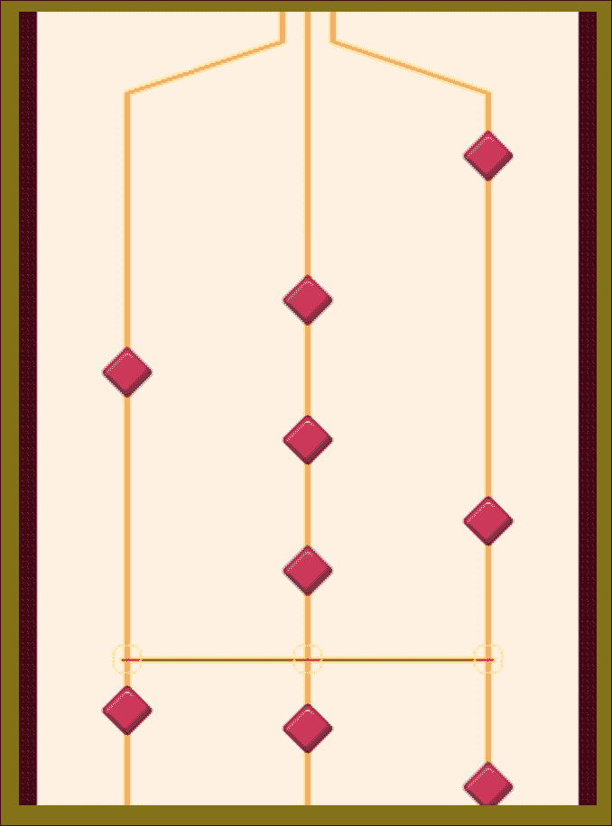
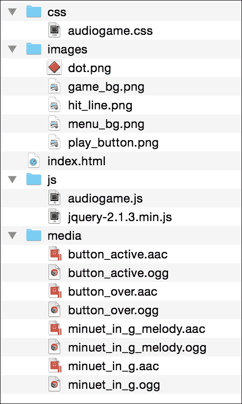
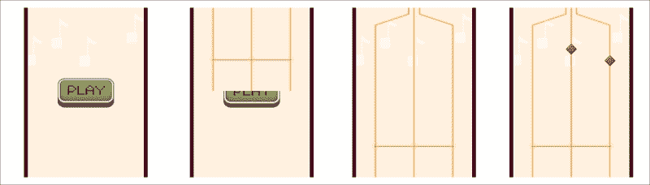
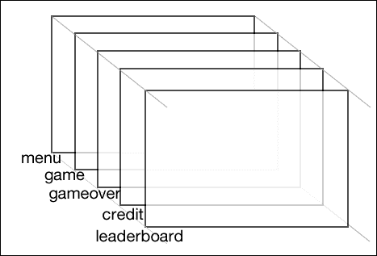
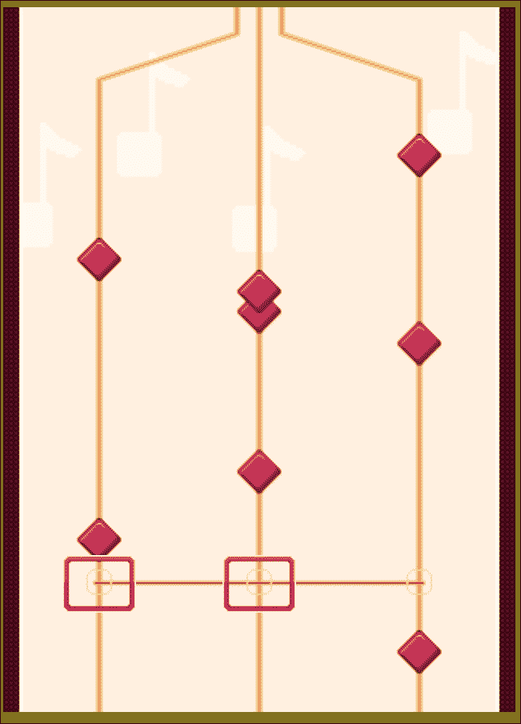
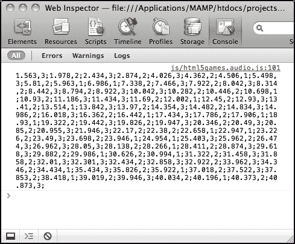

# 六、为游戏添加音效

*在前面的章节中，我们讨论了几种可视化绘制游戏对象的技术。在本章中，我们将重点介绍如何使用 HTML5 规范中引入的`audio`标记。我们可以通过 JavaScript API 添加声音效果、背景音乐和控制音频。此外，我们将在本章中构建一个音乐游戏。这是一款游戏，要求玩家在正确的时间弹奏正确的琴弦来演奏音乐。*

在本章中，您将学习以下主题：

*   为**播放**按钮添加音效
*   构建迷你钢琴音乐游戏
*   链接音乐游戏和**播放**按钮
*   为游戏添加键盘和触摸输入
*   创建键盘驱动的音乐游戏
*   用关卡数据记录完成音乐游戏，游戏结束

您可以在[处玩游戏示例 http://makzan.net/html5-games/audiogame/](http://makzan.net/html5-games/audiogame/) 。

以下屏幕截图显示了我们将通过本章创建的最终结果：



那么，让我们继续吧。

# 为播放按钮添加音效

在前面的章节中的你画我猜游戏示例中，我们有几个鼠标交互。现在想象一下，我们希望通过鼠标交互获得声音效果。这需要我们指导游戏使用的音频文件。当点击按钮时，我们将使用`audio`标签创建声音效果。

# 行动时间-向播放按钮添加音效

我们将从代码包中提供的代码示例开始。我们将有一个类似于以下屏幕截图所示的文件夹结构：



执行以下一组步骤，为**播放**按钮添加音效：

1.  `index.html`文件包含 HTML 的基本结构。现在我们将以下代码添加到`index.html`文件的主体部分：

    ```html
       <div id="game">
         <section id="menu-scene" class="scene">
           <a href="#game"><span>Play</span></a>
         </section>
       </div>
       <audio id="buttonover">
         <source src="media/button_over.aac" />
         <source src="media/button_over.ogg" />
       </audio>
       <audio id="buttonactive">
         <source src="media/button_active.aac" />
         <source src="media/button_active.ogg" />
       </audio>
    ```

2.  HTML 文件使用样式表成功运行。可以在名为`audiogame.css`的代码包中找到该文件。
3.  接下来，我们在 JavaScript 文件中创建基本代码结构。在`audiogame.js`文件中添加以下 JavaScript:

    ```html
    (function($){
      var audiogame = {
        // game init method
        initGame: function() {
          this.initMedia();
          this.handlePlayButton();
        },
        // init medias
        initMedia: function() {
           // TODO: init media related logic
        },

        handlePlayButton: function() {
          // TODO: logic for the play button
        }

      };

      // init function when the DOM is ready
      $(function(){
        audiogame.initGame();
      });
    })(jQuery);
    ```

4.  然后我们存储音频标签的引用。在`initMedia`函数中增加以下代码：

    ```html
    initMedia: function() {
      // get the references of the audio element.
      this.buttonOverSound = document.getElementById("buttonover");
      this.buttonOverSound.volume = 0.3;
      this.buttonActiveSound = document.getElementById("buttonactive");
      this.buttonActiveSound.volume = 0.3;
    },
    ```

5.  我们向 JavaScript 文件中的按钮添加了一个声音效果。在`handlePlayButton`函数中添加以下 JavaScript:

    ```html
    handlePlayButton: function() {
      var game = this;

      // listen the button event that links to #game
      $("a[href='#game']")
      .hover(function(){
        game.buttonOverSound.currentTime = 0;
        game.buttonOverSound.play();
      },function(){
        game.buttonOverSound.pause();
      })
      .click(function(){
        game.buttonActiveSound.currentTime = 0;
        game.buttonActiveSound.play();

        return false;
      });
    }
    ```

6.  Open the `index.html` file in a browser. There, you should see a **PLAY** button on a yellow background, as shown in the following screenshot. Try to move the mouse on the button and click on it. You should be able to hear a sound when you hover over the button and another sound when you click on it:

    

## *刚才发生了什么事？*

我们刚刚创建了一个基本的 HTML5 游戏布局，其中一个播放按钮放在页面的中间。JavaScript 文件处理鼠标悬停和按钮点击，并播放相应的声音效果。

## 定义音频元素

使用`audio`标记的最简单方法是提供源文件。以下代码片段显示了如何定义音频元素：

```html
<audio>
  <source src="media/button_active.aac" >
  <source src="media/button_active.ogg" >
  <!-- Any code for browser that does not support audio tag -->
</audio>
```

除了设置`audio`标记的源文件外，我们还可以通过使用多个属性进行额外的控制。下表显示了我们可以为音频元素设置的属性：

<colgroup><col style="text-align: left"> <col style="text-align: left"> <col style="text-align: left"></colgroup> 
| 

论据

 | 

释义

 | 

解释

 |
| --- | --- | --- |
| `src` | 定义音频元素的源文件 | 当使用`audio`标记中的`src`属性时，它为音频文件指定一个源文件。例如，我们在以下代码中加载一个 sound effect Ogg 文件：

```html
<audio src='sound.ogg'>
```

如果我们想指定具有不同格式的多个文件，那么我们在音频元素中使用`source`标记。以下代码指定了不同格式的`audio`标记，以支持不同的 web 浏览器：

```html
<audio>
   <source src='sound.ogg'>
   <source src='sound.aac'>
   <source src='sound.wav'>
</audio>
```

 |
| `autoplay` | 指定音频加载后自动播放 | 自动播放作为独立属性使用。这意味着以下两行代码没有区别：

```html
<audio src='file.ogg' autoplay>
<audio src='file.ogg autoplay="autoplay">
```

 |
| `loop` | 指定在播放完成后重新从头播放音频 | 这也被用作独立属性。 |
| `preload` | 指定加载页面后加载音频源 | `preload`属性采用以下任一值：

*   `preload="auto"`
*   `preload="metadata`
*   `preload="none"`

当`preload`用作独立属性并设置为`auto`时，浏览器将预加载音频。当`preload`设置为`metadata`时，浏览器不会预加载音频内容。但是，它将加载音频的元数据，例如持续时间和大小。当`preload`设置为`none`时，浏览器根本不会预加载音频。内容和元数据在播放后加载。 |
| `controls` | 显示音频的播放控制 | `controls`属性是独立属性。它指示浏览器在音频位置显示播放控件。 |

以下屏幕截图显示了Chrome 显示控件：


## 播放声音

我们可以通过调用`getElementById`函数来获取音频元素的引用。然后，我们通过调用`play`函数来播放它。以下代码播放`buttonactive`音频：

```html
<audio id="buttonactive">
  <source src="media/button_active.aac" />
  <source src="media/button_active.ogg" />
</audio>
<script>
  document.getElementById("buttonactive").play();
</script>
```

`play`函数播放经过时间的音频，该音频存储在`currentTime`属性中。`currentTime`的默认值为零。以下代码从 3.5 秒开始播放音频：

```html
document.getElementById("buttonactive").currentTime = 3.5;
document.getElementById("buttonactive").play();
```

## jQuery 的选择器与浏览器选择器

我们使用 jQuery 的查询选择器`$("#buttonactive")`来选择元素。我们将 DOM 操作应用于那些选定的元素，例如切换类或获取文本内容。在本例中，我们使用`document.getElementById("buttonactive")`获取元素的引用。这是因为我们在元素上使用浏览器的 Web 音频 API。我们不需要 jQuery 对象，我们需要 browser DOM 元素。

另一种方法是通过 jQuery 选择元素，并使用其`.get()`方法检索 jQuery 对象的 DOM 元素。

## 暂停一个声音

与播放按钮类似，我们也可以使用`pause`功能暂停音频元素的播放。以下代码暂停`buttonactive`音频元素：

```html
<script>
  document.getElementById("buttonactive").pause();
</script>
```

### 注

没有停止音频元素的`stop`功能。相反，我们可以暂停音频，将元素的`currentTime`属性重置为零。以下代码显示了如何停止音频元素：

```html
function stopAudio(){
  document.getElementById("buttonactive").pause();
  document.getElementById("buttonactive").currentTime = 0;
}
```

## 调整音量

我们还可以设置音频元素的音量。音量必须介于 0 和 1 之间。我们可以将音量设置为 0 使其静音，并将最大音量设置为 1。下面的代码片段将`buttonactive`音频的音量设置为 30%：

```html
document.getElementById("buttonactive").volume = 0.3;
```

## 使用 jQuery 悬停事件

jQuery 提供了一个`hover`函数来定义鼠标悬停 DOM 元素时的行为。下面是我们如何使用`hover`功能：

```html
.hover(handlerIn, handlerOut);
```

`hover`函数的参数解释如下：

<colgroup><col style="text-align: left"> <col style="text-align: left"></colgroup> 
| 

论据

 | 

讨论

 |
| --- | --- |
| `handlerIn` | 当鼠标移入时，执行功能。 |
| `handlerOut` | 这是可选的。该功能在鼠标移出时执行。未提供此函数时，移出行为与第一个函数相同。 |

在以下代码中，我们将在移入鼠标时播放鼠标悬停的声音效果，并在移出鼠标时暂停声音：

```html
$("a[href='#game']").hover(function(){
   audiogame.buttonOverSound.currentTime = 0;
   audiogame.buttonOverSound.play();
},function(){
   audiogame.buttonOverSound.pause();
});
```

## WebAudio 的文件格式

在定义音频元素的源时，我们使用**AAC**格式和**Ogg**格式文件。Ogg 是 Mozilla Firefox 支持的一种免费开源媒体容器格式。有应用程序可以将音频文件转换为 Ogg文件。大胆就是其中之一。此外，还提供了便于使用的在线工具。在线转换（[http://audio.online-convert.com](http://audio.online-convert.com) 是之一。

### 注

我们没有使用 MP3 格式，因为许可证费用太高。根据 MP3 许可证网站（[的数据，在分布式游戏中使用 MP3 的版税费率为每游戏 2500 美元，前提是分发副本超过 5000 份 http://www.mp3licensing.com/royalty/games.html](http://www.mp3licensing.com/royalty/games.html) 。

下表显示了撰写本书时最新流行的 web 浏览器支持的音频格式：

<colgroup><col style="text-align: left"> <col style="text-align: left"> <col style="text-align: left"> <col style="text-align: left"></colgroup> 
| 

浏览器

 | 

Ogg

 | 

AAC

 | 

WAV

 |
| --- | --- | --- | --- |
| 火狐 | 对 | 对 | 对 |
| 游猎 | - | 对 | 对 |
| 铬 | 对 | 对 | 对 |
| 歌剧 | 对 | 对 | 对 |
| Internet Explorer | - | 对 | - |

## 突击测验–使用音频标签

问题 1。我们如何才能阻止`audio`元素的播放？

1.  使用`stop`功能。
2.  使用`pause`功能，将`currentTime`的值重置为`0`。
3.  将`currentTime`的值重置为`0`。

问题 2。我们如何在不支持`audio`标记的浏览器中显示回退内容？

# 打造迷你钢琴音乐游戏

现在想象一下，我们不仅在播放音效，而且在播放带有`audio`标签的完整歌曲。随着歌曲的播放，有一些音乐点向下移动，作为音乐的可视化。

# 行动时间-为音乐游戏创建基本背景

首先，我们将在画布上绘制一条路径作为音乐播放的背景。

1.  我们将继续使用我们的示例并绘制背景。在文本编辑器中打开`index.html`文件，添加以下突出显示的代码，该代码定义了设置了两个画布的游戏场景：

    ```html
    <div id="game">
      <div id="menu-scene" class="scene">
        <a href="#game"><span>Play</span></a>
      </div>

      <div id="game-scene" class="scene">
        <canvas id="game-canvas" width="320" height="440">
          This is an interactive audio game with some music notes moving from top to bottom.
        </canvas>
      </div>
    </div>
    ```

2.  我们在 HTML 文件中添加了一个游戏场景。我们希望将其放在菜单场景的顶部，因此我们通过在`audiogame.css`中添加以下内容来设置游戏场景的样式，使其具有`absolute`位置：

    ```html
    #game {
      position: relative;
      width: 320px;
      height: 440px;
      overflow: hidden;
    }
    .scene {
      position: absolute;
      width: 100%;
      height: 100%;
    }

    #menu-scene {
      background: url(img/menu_bg.png);
      display: flex;
      justify-content: center;
      align-items: center;
    }

    #game-scene {
      background: url(img/game_bg.png);
      top: -440px;
    }

    #game-scene.show-scene {
      top: 0;
      transition: top 0.3s ease-out;
    }
    ```

3.  现在，我们将转到JavaScript 部分。打开`html5games.audio.js`JavaScript 文件。
4.  在**播放**按钮点击处理程序中，我们添加了以下突出显示的代码：

    ```html
    $("a[href='#game']").click(function(){
       // existing code here.

       $("#game-scene").addClass('show-scene');
       return false;
    });
    ```

保存所有文件并在浏览器中打开`index.html`。当我们点击**播放**按钮时，动画中应该有一个幻灯片来显示音乐播放场景。以下屏幕截图序列显示了动画中的幻灯片：



## *刚才发生了什么事？*

我们用画布创建了一个游戏场景。在这个音乐游戏示例中，我们介绍了 HTML5 游戏中的基本场景管理。我们创建了一个链接菜单场景和游戏场景的过渡。

## 在游戏中创造场景

在游戏中创建**场景**与创建**层**、类似，就像我们在上一章中所做的一样。场景是包含多个子元素的 DOM 元素。所有子元素都位于绝对位置。现在我们的示例中有两个场景。以下代码片段显示了整个游戏中可能的场景结构，其中包括游戏场景、信用场景和排行榜场景：

```html
<div id="game">
  <div id="menu-scene" class="scene"></div>
  <div id="game-scene" class="scene"></div>
  <div id="gameover-scene" class="scene"></div>
  <div id="credit-scene" class="scene"></div>
  <div id="leaderboard-scene" class="scene"></div>
</div>
```

下面的屏幕截图显示了场景在网页上的相同位置。它与层结构非常相似。不同之处在于，我们将通过显示和隐藏每个场景来控制场景：



## 在 CSS3 中创建生效的幻灯片

点击播放按钮时，游戏场景从顶部滑入。此场景过渡效果通过使用 CSS3 过渡移动游戏场景来实现。游戏场景位置最初放置为负值。然后，我们通过一个过渡将顶部位置从负值更改为零，因此它将从顶部设置动画到正确的位置。

使滑动效果生效的另一件重要事情是将场景的父 DIV 的溢出设置为`hidden`。如果没有隐藏溢出，游戏场景即使在顶部位置为负数的情况下也是可见的。因此，将场景的父 DIV 设置为隐藏溢出非常重要。

下面的屏幕截图演示了游戏场景的幻灯片过渡。`#game`DIV 是菜单场景和游戏场景的父级。当我们添加`.show-scene`类时，游戏场景从顶部移动，该类通过一个转换将顶部值设置为 0：


## 有一个围棋英雄——创造不同的场景过渡效果

我们在播放游戏时为场景转换制作了一张幻灯片。通过使用 JavaScript 和 CSS3，我们可以创造性地制作许多不同的场景过渡效果。尝试在游戏中添加您自己的过渡效果，例如淡入、从右侧推入，甚至通过 3D 旋转翻转。

## 可视化音乐播放

如果您曾经玩过舞蹈革命、吉他英雄或踢踏复仇游戏，那么您可能熟悉向下或向上移动的音乐点，以及玩家在移动到正确位置时敲击音乐点。下面的屏幕截图演示了踢踏复仇游戏：


我们将在`audio`标签中播放一首歌曲，在画布中播放类似的音乐可视化。

# 行动时间-在音乐游戏中创建播放可视化

要在音乐游戏中创建播放可视化，您需要执行以下步骤：

1.  我们需要一首既有旋律部分又有基础部分的歌曲。从下载的文件或`media`文件夹中的代码包中复制`minuet_in_g.ogg`、`minuet_in_g.aac`、`minuet_in_g_melody.ogg`和`minuet_in_g_melody.aac`文件。
2.  然后，添加带有歌曲的`audio`标记作为源文件。打开`index.html`文件并添加以下代码：

    ```html
    <audio id="melody">
      <source src="media/minuet_in_g_melody.aac" />
      <source src="media/minuet_in_g_melody.ogg" />
    </audio>

    <audio id="base">
      <source src="media/minuet_in_g.aac" />
      <source src="media/minuet_in_g.ogg" />
    </audio>
    ```

3.  音乐可视化主要是用 JavaScript 实现的。在文本编辑器中打开`audiogame.js`JavaScript 文件。
4.  添加一个`MusicNote`对象类型来表示音乐数据，添加一个`Dot`对象类型来表示画布中音符的可视点，如下所示：

    ```html
    function MusicNote(time,line){
       this.time = time;
       this.line = line;
    }
    function Dot(distance, line) {
       this.distance = distance;
       this.line = line;
       this.missed = false;
    }
    ```

5.  然后，我们需要几个游戏变量来存储`MusicNote`实例、`Dot`实例以及其他信息。级别数据是一个时间序列和以分号分隔的显示行。我们将在后面的章节中记录并创建我们自己的数据。级别数据表示音符应出现的时间和行：

    ```html
    var audiogame = {
      // an array to store all music notes data.
      musicNotes: [],
      leveldata: "1.592,3;1.984,2;2.466,1;2.949,2;4.022,3;",
      // the visual dots drawn on the canvas.
      dots: [],
      // for storing the starting time
      startingTime: 0,
      // reference of the dot image
      dotImage: new Image(),

      // existing code inside audiogame object.
    }
    ```

6.  级别数据被序列化并以字符串格式存储。我们有以下函数提取`MusicNote`对象实例中的字符串并存储在数组中：

    ```html
    var audiogame = {
      // existing code inside audiogame object.

      setupLevelData: function() {
        var notes = this.leveldata.split(";");

        // store the total number of dots
        this.totalDotsCount = notes.length;

        for(var i=0, len=notes.length; i<len; i++) {
          var note = notes[i].split(",");
          var time = parseFloat(note[0]);
          var line = parseInt(note[1]);
          var musicNote = new MusicNote(time,line);
          this.musicNotes.push(musicNote);
        }
      },
    }
    ```

7.  在`initMedia`函数中添加以下代码。它引用了`melody`和`base`音频标签，并加载点阵图像供以后使用：

    ```html
    initMedia: function() {
      // existing code goes here.

      // melody and base
      this.melody = document.getElementById("melody");
      this.base = document.getElementById("base");

      // load the dot image
      this.dotImage.src = "img/dot.png";
    }
    ```

8.  在`initGame`函数中添加以下代码。它引用画布和`canvasContext`变量以供以后使用：

    ```html
    initGame: function() {
      // existing code goes here.
      this.canvas = document.getElementById("game-canvas");
      this.canvasContext = this.canvas.getContext('2d');
    }
    ```

9.  在 JavaScript 文件中添加以下两个函数。`startGame`功能设置启动时间并延迟执行`playMusic`功能。后一个函数同时播放旋律和基本音频：

    ```html
    var audiogame = {
      // existing code goes here.
      startGame: function() {
        var date = new Date();
        this.startingTime = date.getTime();

        this.registerMusicPlayback();
      },

      registerMusicPlayback: function() {
         // play both the melody and base
        this.melody.play();
        this.base.play();

        // pause for 3550ms to sync with the music dots movement.
        this.melody.pause();
        this.base.pause();
        setTimeout(this.playMusic.bind(this), 3550);
      },

      playMusic: function() {
        this.melody.play();
        this.base.play();
      },
    };
    ```

10.  将下面的函数添加到 JavaScript 中。`gameloop`功能在游戏顶部创建新点，并将现有音符向下移动：

    ```html
    var audiogame = {
      // existing code goes here.

      gameloop: function() {
        var canvas = this.canvas;
        var ctx = this.canvasContext;

        // show new dots
        // if the game is started
        if (this.startingTime !== 0)  {
          for(var i=0, len=this.musicNotes.length; i<len; i++) {
            var date = new Date();
            var elapsedTime = (date.getTime() - this.startingTime)/1000;
            var note = this.musicNotes[i];

            var timeDiff = note.time - elapsedTime;

            // When time difference is short enough.
            if (timeDiff >= 0 && timeDiff <= 0.03)  {
              var dot = new Dot(ctx.canvas.height-150, note.line);
              this.dots.push(dot);
            }
          }
        }

        // loop again to remove dots that are out of the screen.
        for(var i=this.dots.length-1; i>=0; i--) {
          // remove missed dots after moved to the bottom
          if (this.dots[i].distance < -100)  {
            this.dots.splice(i, 1);
          }
        }

        // move the dots
        for(var i=0, len=this.dots.length; i<len; i++) {
          this.dots[i].distance -= 2.5;
        }

        // only clear the dirty area, that is the middle area
        ctx.clearRect(ctx.canvas.width/2-200, 0, 400, ctx.canvas.height);

        // draw the music note dots
        for(var i=0, len=this.dots.length; i<len; i++) {
          // draw the music dot.
          ctx.save();
          var center = canvas.width/2;
          var dot = this.dots[i];
          var x = center-100
          if (dot.line === 2) {
            x = center;
          } else if (dot.line === 3) {
            x = center+100;
          }
          ctx.translate(x, ctx.canvas.height-80-this.dots[i].distance);
          ctx.drawImage(this.dotImage, -this.dotImage.width/2, -this.dotImage.height/2);
          ctx.restore();
        }
      }
    };
    ```

11.  现在，在 jQuery ready 函数的末尾添加以下代码：

    ```html
    audiogame.setupLevelData();
    setInterval(audiogame.gameloop.bind(audiogame), 30);
    ```

12.  最后，我们在**播放**按钮的点击事件处理程序中调用`startGame`函数：

    ```html
    game.startGame();
    ```

13.  Save all files and open the `index.html` file in a web browser. The following screenshot shows the music playing with the music dots appearing on the top and moving downwards:

    

## *刚才发生了什么事？*

我们刚刚制作了一款功能齐全的音乐游戏。这是基本的播放功能。它播放歌曲的旋律和基础部分与一些音乐点向下移动。

## 为音乐游戏选择合适的歌曲

在为音乐游戏选择歌曲时，我们必须小心版权问题，因为这通常需要您支付使用费或与歌曲版权所有者达成协议。如果你正在制作一款商业音乐游戏，它将在游戏行业中大受欢迎，并且收益可以超过版权使用费用，那么这是很好的。然而，作为一本书的例子，我们将使用一首无版权的歌曲。这就是为什么我们在 G 中使用经典歌曲*分钟，这是一首公共领域的免费歌曲，也是由没有版权的计算机软件生成的。*

### 注

即使歌曲本身是免费的，音乐表演也可以获得版权保护。

## 在移动设备上播放音频

在移动设备上播放音频有限制，特别是在 iOS 和 Android 上。带有 Chrome 浏览器的最新 Android 只能播放由用户触发的音频。这就是为什么我们不能在超时后直接播放音频。我们需要在单击处理程序之后立即播放音频，然后将音频暂停适当的时间延迟，以便将音频与我们的音乐点同步。在 iOS 中，也有类似的用户触发限制。我们无法在 mobile Safari 中以编程方式控制音量。在移动狩猎中，我们可能无法将旋律调暗。除此之外，游戏仍然可以玩。

## 存储和提取歌曲级数据

在音乐游戏部分中创建播放可视化的*动作的*时间**中显示的级别数据只是整个级别数据的部分。它是一个非常长的字符串，用于存储音符信息，包括时间和行。它以我提出的以下格式存储：**

```html
music_current_time, line; music_current_time, line; …
```

每个音乐点数据包含两条信息：显示的时间和显示的行。此数据用逗号分隔。每段音乐点数据都用分号分隔。只要拆分器与数据内容不冲突，就可以选择任何字符来分隔数据。例如，在这里选择数字或句号将是一个错误的选择。以下代码通过拆分分号和逗号将级别字符串提取到`MusicNote`对象中：

```html
musicNotes = [];
leveldata = "1.592,3;1.984,2;2.466,1;2.949,2;4.022,3;";
function setupLevelData() {
   var notes = audiogame.leveldata.split(";");
   for(var i=0, len=notes.length; i<len; i++) {
      var note = notes[i].split(",");
      var time = parseFloat(note[0]);
      var line = parseInt(note[1]);
      var musicNote = new MusicNote(time,line);
      musicNotes.push(musicNote);
   }
}
```

电平数据字符串由键盘记录，我们将在本章后面讨论记录。

### 提示

级别数据在此仅包含几个音符。在代码包中，有完整歌曲的整个级别数据。

JavaScript`parseInt`函数有一个可选的第二个参数。它定义要分析的数字的基数。默认情况下，它使用十进制，但当字符串以零开头时，`parseInt`将把字符串解析为八进制。例如，`parseInt("010")`返回结果 8 而不是 10。如果我们想要十进制数，那么我们可以使用`parseInt("010",10)`来指定基数。

## 获取游戏经过的时间

虽然我们通过访问`currentTime`属性知道音频元素的经过时间，但我们希望从游戏开始时就获得时间。

我们可以通过在开始游戏时存储当前计算机时间并减去当前时间值来获得经过的时间。

我们使用`Date`对象获得当前计算机时间。下面的代码片段显示了我们如何使用`startingTime`获取经过的时间，以毫秒为单位：

```html
// starting game
var date = new Date();
audiogame.startingTime = date.getTime();

// some time later
var date = new Date();
var elapsedTime = (date.getTime() - audiogame.startingTime)/1000;
```

以下屏幕截图显示了在控制台中运行的上述代码段：


## 创作音乐点

在`gameloop`函数中，我们检查所有`MusicNote`实例，看看是否是时候创建该音符的可视点了。下面的代码显示了我们用来创建可视音乐点的逻辑：

```html
if (audiogame.startingTime !== 0) {
  for(var i in audiogame.musicNotes) {
    // get the elapsed time from beginning of the melody
    var date = new Date();
    var elapsedTime = (date.getTime() - audiogame.startingTime)/1000;
    var note = audiogame.musicNotes[i];

    // check whether the dot appear time is as same as the elapsed time
    var timeDiff = note.time - elapsedTime;
    if (timeDiff >= 0 && timeDiff <= 0.03) {
      // create the dot when the appear time is within one frame of the elapsed time
      var dot = new Dot(ctx.canvas.height-150, note.line);
      audiogame.dots.push(dot);
    }
  }
}
```

基本上，我们得到游戏的运行时间，并将其与每个音符的当前时间进行比较。如果便笺的当前时间和经过的时间之间的时间差在 30 毫秒以内，那么我们创建 VisualDot 实例并让`gameloop`函数绘制它。

## 移动音乐点

游戏开始和音乐开始之间存在时间差异。游戏在歌曲开始播放前几秒钟开始。这是因为我们需要显示音乐点，并在音乐开始前将其向下移动。

当点位于灰线上时，音乐点应与歌曲匹配。音乐点从游戏顶部出现，并向下移动到灰线。我们延迟音乐播放，等待圆点从上到下移动。在本例中，这大约是 3.55 秒，因此我们将音乐播放延迟 3.55 秒。播放不同的歌曲时，延迟可能会有所不同。因此，如果我们扩展游戏以支持多首歌曲播放，我们可能会在以后存储这些信息。

当创建点时，它被放置在给定的距离处。每次执行`gameloop`功能时，我们将所有点的距离减少 2.5。距离存储在每个`dot`对象中，表示距离灰线的距离：

```html
for(var i=0, len=this.dots.length; i<len; i++) {
   audiogame.dots[i].distance -= 2.5;
}
```

点的*y*位置由灰线计算，减去距离如下：

```html
// draw the dot
ctx.save();
var x = ctx.canvas.width/2-100
if (audiogame.dots[i].line === 2) {
   x = ctx.canvas.width/2;
}
else if (audiogame.dots[i].line === 3) {
   x = ctx.canvas.width/2+100;
}
ctx.translate(x, ctx.canvas.height-80-audiogame.dots[i].distance);
ctx.drawImage(audiogame.dotImage, -audiogame.dotImage.width/2, -audiogame.dotImage.height/2);
```

下面的屏幕截图显示了灰线和每个点之间的距离。当距离为零时，它正好位于灰线上：


# 打造键盘驱动的迷你钢琴音乐游戏

现在我们可以点击**播放**按钮。音乐游戏将滑入并播放音乐，同时音乐音符将下降。我们的下一步是在音符中添加交互。因此，我们将添加键盘事件来控制三行来敲击音符。

# 行动时间-打造迷你钢琴音乐游戏

执行以下步骤：

1.  我们想在按下键盘时显示一个指示。打开`index.html`文件并添加以下突出显示的 HTML:

    ```html
    <div id="game-scene" class="scene">
       <!-- existing code goes here -->
       <div id="hit-line-1" class="hit-line hide"></div>
       <div id="hit-line-2" class="hit-line hide"></div>
       <div id="hit-line-3" class="hit-line hide"></div>
    </div>
    ```

2.  然后，我们可能要通知访客，他们可以按*J*、*K*和*L*键玩游戏。修改页脚内容如下：

    ```html
    <footer>
       <p>This is an example of making audio game in HTML5\. Press J, K, L to play.
       </p>
    </footer>
    ```

3.  现在，我们将继续讨论样式表。打开`css/audiogame.css`文件，将以下代码放在文件末尾：

    ```html
    #hit-line-1 {
      left: 35px;
      top: 335px;
    }

    #hit-line-2 {
      left: 135px; /* 320/2-50/2 */
      top:  335px;
    }

    #hit-line-3 {
      left: 235px;
      top: 335px;
    }
    ```

4.  接下来，我们将在 JavaScript 部分添加键盘事件。打开 `audiogame.js`JavaScript 文件，在音频游戏对象中添加以下代码：

    ```html
    initKeyboardListener: function() {
      var game = this;

      // keydown
      $(document).keydown(function(e){
        // our target is J(74), K(75), L(76)
        var line = e.which-73;

        game.hitOnLine(line);

      });
      $(document).keyup(function(e){
        var line = e.which-73;
        $('#hit-line-'+line).removeClass('show');
        $('#hit-line-'+line).addClass('hide');
      });
    },

    hitOnLine: function (lineNo) {
      $('#hit-line-'+lineNo).removeClass('hide');
      $('#hit-line-'+lineNo).addClass('show');

      // check if hit a music note dot
      for(var i=this.dots.length-1; i>=0; i--) {
        if (lineNo === this.dots[i].line && Math.abs(this.dots[i].distance) < 20) {
          // remove the hit dot from the dots array
          this.dots.splice(i, 1);
        }
      }
    },
    ```

5.  最后，我们在`initGame`函数中调用`initKeyboardListener`函数：

    ```html
    initGame: function() {
      // existing code goes here.
      this.initKeyboardListener();
    },
    ```

6.  Now save all the files and open the game in a browser. Try pressing the *J*, *K*, and *L* keys. The three hit line indicator should appear and fade out when the key is pressed. If the music dot passes by the horizontal line when hitting the right key, then it disappears:

    

## *刚才发生了什么事？*

我们刚刚在音乐游戏中添加了键盘交互。敲击关键点时会出现光晕动画。当在正确的时间按下右键时，音乐点将消失。您可以查看以下 URL 以获取当前进度的示例：[http://makzan.net/html5-games/audiogame-wip-keyboard/](http://makzan.net/html5-games/audiogame-wip-keyboard/) 。

## 按向下键敲击三条音乐线

我们使用*J*、*K*和*L*键点击游戏中的三条音乐线。*J*键控制左线，*K*键控制中间线，*L*键控制右线。

还有一个迹象表明，我们刚刚达到了高潮。这是通过将以下图像放置在水平线和垂直线的交点处完成的：


接下来，我们可以使用以下 jQuery 代码控制命中指示图形的显示和隐藏：

```html
$(document).keydown(function(e){
   var line = e.which-73;
   $('#hit-line-'+line).removeClass('hide');
   $('#hit-line-'+line).addClass('show');
});
$(document).keyup(function(e){
   var line = e.which-73;
   $('#hit-line-'+line).removeClass('show');
   $('#hit-line-'+line).addClass('hide');
});
```

*J*、*K*和*L*键控制音乐线 1 至 3。由于 J、K 和 L 分别有键码 74、75 和 76，我们通过从键码中减去 73 就知道它是哪个行号。

## 下键确定音乐点点击

如果点几乎位于灰色水平线上，则距离接近于零。这有助于我们确定这些点是否击中了灰线。通过检查按键向下事件和点距离，我们可以确定是否成功击中音乐点。下面的代码片段表明，当距离足够近时，我们会考虑点被击中；在这种情况下，它在 20 像素以内：

```html
// check whether we hit a music note dot
  for(var i=this.dots.length-1; i>=0; i--)  {
    if (lineNo === this.dots[i].line && Math.abs(this.dots[i].distance) < 20)    {
      // remove the hit dot from the dots array
      this.dots.splice(i, 1);
    }
  }
```

我们下定决心，在击打音乐点时将其移除。漏掉的点仍将穿过灰线并向底部移动。这将创建一个基本的游戏，玩家必须在播放歌曲的正确时刻正确地敲击音乐点，从而消除所有的音乐点。

### 注

当我们在迭代中删除数组中的元素时，我们通常向后迭代，以避免在数组中删除元素后出现空引用错误。

## 移除具有给定索引的数组中的元素

当音乐点数据被点击时，我们将其从数组中移除（因此它将不再被绘制）。要删除数组中的元素，我们使用`splice`函数。以下代码行从给定索引处的数组中删除一个元素：

```html
array.splice(index, 1);
```

`splice`函数使用起来有点棘手。这是因为它允许我们在数组中添加或删除元素。然后，它将删除的元素作为另一个数组返回。

这就是我们使用`splice`功能的方式：

```html
array.splice(index, length, element1, element2, …, elementN);
```

下表显示了我们如何使用参数：

<colgroup><col style="text-align: left"> <col style="text-align: left"> <col style="text-align: left"></colgroup> 
| 

论点

 | 

释义

 | 

讨论

 |
| --- | --- | --- |
| `index` | 指定要在数组中添加或删除的元素的索引 | 索引从 0 开始。0 表示第一个元素，1 表示第二个元素，依此类推。我们还可以使用负索引，例如-1，表示最后一个元素，-2，表示最后一个元素，等等。 |
| `length` | 指定要删除的元素数 | 放置 0 表示不删除任何元素。 |
| `element1`、`element2`、`elementN` | 要添加到阵列中的新元素 | 这是可选的。在这里放置元素列表意味着我们在给定的索引处添加元素。 |

### 注

Mozilla 开发者网络链接在[讨论`splice`功能的不同用法 https://developer.mozilla.org/en/JavaScript/Reference/Global_Objects/Array/splice](https://developer.mozilla.org/en/JavaScript/Reference/Global_Objects/Array/splice) 。

## 做个英雄吧

在类似的商业音乐游戏中，当玩家点击或错过一个音乐点时，会出现一些文字。我们如何将此功能添加到游戏中？

# 为迷你钢琴游戏添加额外功能

我们在游戏中创建了基本的交互。我们可以通过添加旋律音量反馈进一步改进游戏。这将使表演更逼真，并计算表演的成功率。

## 根据播放器调节音乐音量

想象一下，现在我们正在演奏音乐。我们点击音乐点来演奏旋律。如果我们错过了其中任何一个，那么我们就不能很好地演奏，旋律也就消失了。

# 行动时间-删除遗漏的旋律音符

我们将存储一些游戏统计数据，并使用它们调整旋律音量。我们将继续使用 JavaScript 文件：

1.  首先，在变量声明区域添加以下变量：

    ```html
    var audiogame = {
      totalSuccessCount: 0,

      // storing the success count of last 5 results.
      successCount: 5,

      // existing code goes here.

    };
    ```

2.  我们不仅要删除一个点，而且要在使用键盘点击它时跟踪结果。在`hitOnLine`函数中添加以下代码：

    ```html
    // check if hit a music note dot
    for(var i in audiogame.dots) {
       if (lineNo === audiogame.dots[i].line && Math.abs(audiogame.dots[i].distance) < 20) {
          // remove the hit dot from the dots array
          audiogame.dots.splice(i, 1);

          // increase the success count
          audiogame.successCount+=1;

          // keep only 5 success count max.
          audiogame.successCount = Math.min(5, audiogame.successCount);

          // increase the total success count
          audiogame.totalSuccessCount +=1;
       }
    }
    ```

3.  在`gameloop`函数中，我们计算所有漏点并存储结果。然后，我们可以使用这些统计数据来获得游戏的成功率。在`gameloop`功能中添加以下代码：

    ```html
    // loop again to remove dots that's out or the screen.
    // existing code goes here.

    // check missed dots
    for(var i=this.dots.length-1; i>=0; i--) {
       if (!audiogame.dots[i].missed && audiogame.dots[i].distance < -10) {
          // mark the dot as missed if it's not marked before
          audiogame.dots[i].missed = true;

          // reduce the success count
          audiogame.successCount -= 1;

          // reset the success count to 0 if it is lower than 0.
          audiogame.successCount = Math.max(0, audiogame.successCount);
       }

       // remove missed dots after moved to the bottom
       if (audiogame.dots[i].distance < -100) {
          audiogame.dots.splice(i, 1);
       }
    }

    // calculate the percentage of the success in last 5 music dots
    var successPercent = audiogame.successCount / 5;

    // prevent the successPercent to exceed range(fail safe)
    successPercent = Math.max(0, Math.min(1, successPercent));

    // move the dots
    // existing code goes here.
    ```

4.  最后，我们使用成功率调整旋律音量。在`gameloop`函数中刚添加的代码后面加上以下代码：

    ```html
    audiogame.melody.volume = successPercent;
    ```

5.  保存所有文件并在浏览器中测试我们的游戏。当玩家继续玩好游戏时，旋律会继续播放。当播放器错过几个音乐点时，旋律消失，只播放基本音乐点。

## *刚才发生了什么事？*

我们只是用演奏者的表现作为旋律音量的反馈。这给了玩家一种我们真的在演奏音乐的感觉。当我们演奏得不好时，旋律的音量很低，歌曲的声音也很差。您可以在以下 URL 尝试工作示例：[http://makzan.net/html5-games/audiogame-wip-volume/](http://makzan.net/html5-games/audiogame-wip-volume/) 。

## 从游戏中删除点

我们想在圆点落下底线后或被玩家击中时移除圆点。游戏循环在游戏画布上显示点列表中的所有点。我们可以通过从点阵列中删除点图形的数据来删除点图形。我们将使用以下`splice`函数删除目标索引数组中的一个条目：

```html
audiogame.dots.splice(index, 1);
```

## 存储最近五次结果中的成功计数

在我们的游戏中，我们需要存储最后五个结果中的成功计数来计算成功率。我们可以通过使用一个计数器来实现这一点。当一个点成功击中时，计数器增加 1，但当玩家未能击中一个点时，计数器减少 1。

然后，如果我们在示例中将计数器的范围限制为 0 到 5，则计数器表示最近几个结果中的成功计数。

## 做个英雄吧

在上一章中，我们讨论了如何在你画我猜游戏中显示游戏进度。我们可以在音乐游戏中应用类似的技术吗？我们有玩家在游戏中的成功率。在游戏顶部显示一个百分比栏怎么样？

## 将音符记录为电平数据

游戏依赖于级别的数据进行游戏。如果没有级别数据，则播放可视化将不起作用。如果回放可视化不起作用，我们也无法播放它。那么，我们如何记录这一级别的数据呢？

想象一下，现在播放的音乐中没有出现任何音乐点。我们仔细听音乐，播放音乐时按*J*、*K*、*L*键。音乐结束后，我们打印出所有按键和按下的时间。然后，这些数据将用于音乐的播放可视化。

# 行动时间–添加功能记录音乐级别数据

执行以下步骤：

1.  首先，我们创建一个变量在录制模式和正常播放模式之间切换。打开`html5games.audio.js`文件，添加如下代码：

    ```html
      var audiogame = {
        isRecordMode : true,
        //existing code here
    ```

2.  接下来，我们在`keydown`事件处理程序中添加以下突出显示的代码。此代码将所有按下的键存储在一个数组中，并在按下分号键时将其打印到控制台：

    ```html
    if (game.isRecordMode) {
      // print the stored music notes data when press ";" (186)
      if (e.which === 186) {
        var musicNotesString = "";
        for(var i=0, len=game.musicNotes.length; i<len; i++)     {
          musicNotesString += game.musicNotes[i].time + "," + game.musicNotes[i].line+";";
        }
        console.log(musicNotesString);
      }

      var currentTime = game.melody.currentTime.toFixed(3);
      var note = new MusicNote(currentTime, e.which-73);
      game.musicNotes.push(note);
    }
    ```

3.  最后，我们希望确保`setupLevelData`和`gameloop`功能在录制模式下不会执行。这些功能仅用于播放模式：

    ```html
    if (!audiogame.isRecordMode) {
      audiogame.setupLevelData();
      setInterval(audiogame.gameloop.bind(audiogame), 30);
    }
    ```

4.  Now open the `index.html` file in a browser. After clicking on the **Play** button, the game starts and the music plays without the music notes. Try pressing the *J*, *K*, and *L* keys following the music beat. After finishing the music, press the semicolon to print the level data in the console. The following screenshot shows the console displaying the level data string:

    

## *刚才发生了什么事？*

我们刚刚在游戏中添加了一个录音功能。我们现在可以录制音乐笔记了。我们可以通过将`audiogame.isRecordMode`变量设置为`true`和`false`来切换录制模式和播放模式。

每按一次键，我们都会得到旋律经过的时间，并创建一个带有时间和行号的`MusicNote`实例。下面的代码显示了如何记录按下的键。`currentTime`在保存前被剪切为两位小数：

```html
var currentTime = audiogame.melody.currentTime.toFixed(3);
var note = new MusicNote(currentTime, e.which-73);
audiogame.musicNotes.push(note);
```

我们还捕获分号键，将所有记录的`MusicNote`数据打印成字符串。该字符串遵循`time,line;time,line;`格式，因此我们可以直接复制打印的字符串并将其粘贴为级别数据进行播放。

### 注

`toFixed`函数用给定的尾随小数数格式化数字。在我们的示例中，我们使用它来获取带有`3`尾随小数的当前时间。

# 增加触摸支持

现在这款游戏在桌面浏览器上运行良好。但我们也希望让游戏能够在移动设备上玩。

# 行动时间–在控制台中指示游戏结束事件

我们瞄准水平线和垂直线之间的 3 个交点。

1.  我们在这里定义了三个 DIV 元素，用于在点击*J*、*K*和*L*键时显示图形。我们修改 HTML 以向这些元素添加数据行 no 属性：

    ```html
    <div id="hit-line-1" data-line-no="1" class="hit-line hide"></div>
    <div id="hit-line-2" data-line-no="2" class="hit-line hide"></div>
    <div id="hit-line-3" data-line-no="3" class="hit-line hide"></div>
    ```

2.  我们转向 JavaScript。我们在`audiogame`对象中定义了一个新函数：

    ```html
    initTouchAndClick: function() {
      var game = this;
      $('.hit-line').bind('mousedown touchstart', function() {
        var line = $(this).data('lineNo') * 1; // parse in int
        game.hitOnLine(line);
        return false;
      });

      $('.hit-line').bind('mouseup touchend', function(){
        var line = $(this).data('lineNo') * 1; // parse in int
        $('#hit-line-'+line).removeClass('show');
        $('#hit-line-'+line).addClass('hide');
      });
    },
    ```

3.  我们在`initGame`函数中调用新创建的`initTouchAndClick`函数：

    ```html
    initGame: function() {
      // existing code goes here.

      this.initTouchAndClick();
    },
    ```

4.  我们现在可以在手机浏览器中打开游戏，用手指玩。

## *刚才发生了什么事？*

我们在游戏中添加了一个触摸事件。HTML 元素中的 data line no 属性让我们知道播放器正在触摸哪一行。然后我们调用与`keydown`事件调用的`hitOnLine`函数相同的函数，该函数共享一些处理命中或未命中判定的代码。

# 处理回放完成事件中的音频事件

我们现在可以玩游戏，但是游戏结束时没有的指示。想象一下，现在我们想知道游戏结束后我们玩得有多好。我们将捕捉旋律结束信号并显示游戏的成功率。

# 行动时间–在控制台中指示游戏结束事件

执行以下步骤：

1.  打开 `audiogame.js`JavaScript 文件。
2.  在 jQuery ready 函数中添加以下代码：

    ```html
    $(audiogame.melody).bind('ended', onMelodyEnded);
    ```

3.  在文件末尾添加以下事件处理程序函数：

    ```html
      // show game over scene on melody ended.
      function onMelodyEnded() {
        console.log('song ended');
        alert ('success percent: ' + audiogame.totalSuccessCount / audiogame.totalDotsCount * 100 + '%');
      }
    })(jQuery);
    ```

4.  现在是保存所有文件并在 web 浏览器中玩游戏的时候了。当游戏结束时，我们会看到一个带有成功率的弹出警报。

## *刚才发生了什么事？*

我们只听了音频元素的和`ended`事件，并使用处理函数进行处理。

## 处理音频事件

音频元素中还有许多其他事件。下表列出了一些常用的音频事件：

<colgroup><col style="text-align: left"> <col style="text-align: left"></colgroup> 
| 

事件

 | 

讨论

 |
| --- | --- |
| `ended` | 音频元素完成播放时发送 |
| `play` | 音频元素播放或恢复时发送 |
| `pause` | 音频元素暂停时发送 |
| `progress` | 下载音频元素时定期发送 |
| `timeupdate` | 当`currentTime`属性改变时发送 |

这里我们只列出了一些常用的事件；您可以在Mozilla 开发者中心的[中查阅完整的音频事件列表 https://developer.mozilla.org/En/Using_audio_and_video_in_Firefox#Media_events](https://developer.mozilla.org/En/Using_audio_and_video_in_Firefox#Media_events) 。

## 做个英雄吧

在我们的音乐游戏中，游戏结束后，我们会在控制台中打印成功率。在我们的游戏中添加一个游戏场景，并在游戏结束时显示出来，怎么样？这将是很好的使用动画过渡时，显示一个游戏的场景太多。

### 注

我们已经管理了声音资产，并使用本机 JavaScript API 播放了音频。有时，管理大量音频加载和播放会变得很麻烦。有一些 JS 库可以帮助您更轻松地管理 HTML5 音频。以下是其中的几个：

*   SoundJS（[http://www.createjs.com/SoundJS](http://www.createjs.com/SoundJS)
*   嗡嗡声（[http://buzz.jaysalvat.com](http://buzz.jaysalvat.com)
*   AudioJS（[http://kolber.github.io/audiojs/](http://kolber.github.io/audiojs/)

# 总结

在本章中，您学到了很多关于使用 HTML5 音频元素和构建音乐游戏的知识。具体来说，我们通过使用 HTML 音频标记和相关 JavaScript API 来管理和控制音频播放。您了解了更改音频标记行为的不同属性。我们利用音频标签创建了一个基于键盘的画布游戏。我们还通过共享键盘输入和触摸输入之间的通用逻辑，使游戏在触摸设备上运行。我们用一种特殊的模式创建了这个游戏，它可以帮助游戏关卡设计者创建关卡数据。

您了解了如何在我们的 HTML5 游戏中添加音乐和音效。现在我们准备在下一章中添加一个排行榜来存储游戏分数，从而构建一个更完整的游戏。