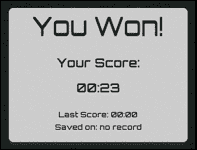
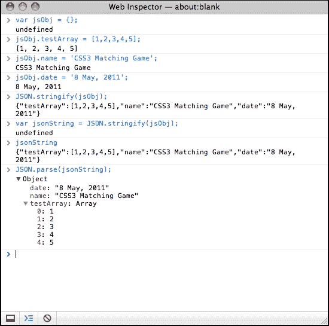
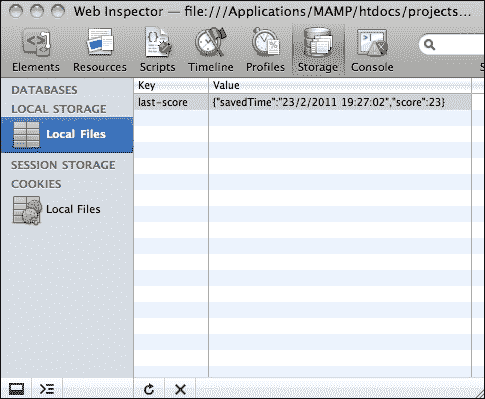
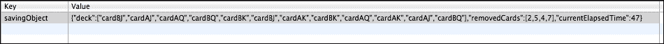
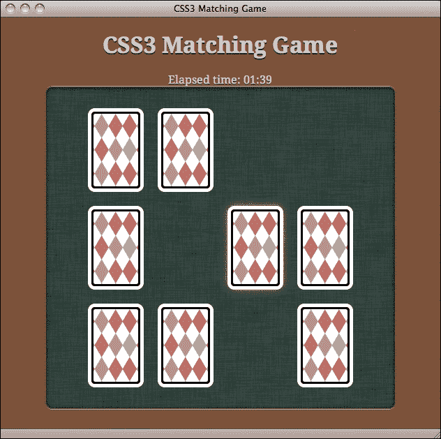

# 七、保存游戏进度

*本地存储是 HTML5 的新规范。它允许网站在本地浏览器中存储信息，并在以后访问存储的数据。这在游戏开发中是一个很有用的功能，因为我们可以将它用作内存槽，在 web 浏览器中本地保存任何游戏数据。*

我们将在[第三章](03.html "Chapter 3. Building a Card-matching Game in CSS3")中构建的 CSS3 卡匹配游戏中添加存储游戏数据的功能，*在 CSS3*中构建卡匹配游戏。除了存储和加载游戏数据外，我们还将在玩家使用纯 CSS3 样式的漂亮 3D 色带打破记录时通知玩家。

在本章中，我们将介绍以下主题：

*   使用 HTML5 本地存储存储数据
*   将对象保存在本地存储器中
*   当玩家以漂亮的丝带效果打破新记录时通知他们
*   保存整个游戏的进度

您可以在[尝试决赛 http://makzan.net/html5-games/card-matching/](http://makzan.net/html5-games/card-matching/) 。

以下屏幕截图显示了我们将在本章中创建的最终结果：


那么，让我们继续吧。

# 使用 HTML5 本地存储存储数据

还记得我们在[第 3 章](03.html "Chapter 3. Building a Card-matching Game in CSS3")中制作的 CSS3 卡匹配游戏吗？*在 CSS3*中构建一个卡匹配游戏？想象一下，现在我们已经发布了我们的游戏，玩家们正在尽最大努力在游戏中表现出色。

我们想让球员们看看他们比上次踢得好还是差。我们将保存最新的分数，并通过比较分数告知玩家这次他们是否更好。

我们希望这样做的原因是，当球员表现更好时，这会给他们一种自豪感，他们可能会沉迷于我们的比赛，试图获得更高的分数，这对我们有好处。

## 创建游戏结束对话

在将任何东西保存到本地存储之前，我们需要一个屏幕上的游戏。我们在前几章做了一些游戏。我们做了一个乒乓球游戏、卡片配对游戏、解开谜题游戏和一个音乐游戏。在这些游戏中，我们没有在屏幕上创建任何游戏。想象一下，现在我们正在玩我们在[第 3 章](03.html "Chapter 3. Building a Card-matching Game in CSS3")中构建的 CSS3 卡片匹配游戏，*在 CSS3*中构建一个卡片匹配游戏。我们成功匹配并移除所有卡。一旦我们完成一个游戏，屏幕就会弹出，显示我们完成游戏所花的时间。

# 行动时间–创建一个游戏结束对话，并显示已过的游戏时间

我们将继续使用我们在[第三章](03.html "Chapter 3. Building a Card-matching Game in CSS3")中制作的卡片匹配游戏中的代码，*在 CSS3*中构建一个卡片匹配游戏。执行以下步骤：

1.  打开 CSS3 匹配游戏文件夹作为我们的工作目录。
2.  从以下 URL 下载背景图像（我们将使用它作为弹出窗口的背景）：[http://mak.la/book-assets](http://mak.la/book-assets)
3.  将图像放入`images`文件夹中。
4.  在任何文本编辑器中打开`index.html`。
5.  我们需要一个字体的游戏超过弹出窗口。在`head`部分添加以下嵌入 CSS 的字体：

    ```html
    <link href="http://fonts.googleapis.com/css?family=Orbitron:400,700" rel="stylesheet" type="text/css">
    ```

6.  在`game`部分之前，我们添加了一个名为`timer`的`div`来显示经过的播放时间。此外，我们还添加了一个新的`popup`部分，其中包含弹出对话框的 HTML 标记：

    ```html
    <div id="timer">
     Elapsed time: <span id="elapsed-time">00:00</span>
    </div>
    <section id="game">
       <div id="cards">
          <div class="card">
             <div class="face front"></div>
             <div class="face back"></div>
          </div> <!-- .card -->
       </div> <!-- #cards -->
    </section> <!-- #game -->

    <section id="popup" class="hide">
     <div id="popup-bg">
     </div>
     <div id="popup-box">
     <div id="popup-box-content">
     <h1>You Won!</h1>
     <p>Your Score:</p>
     <p><span class='score'>13</span></p>
     </div>
     </div>
    </section>

    ```

7.  现在我们将继续讨论样式表。因为它只是用于样式化，与我们的逻辑还没有关系，所以我们可以简单地从代码示例包中的`01-gameover-dialog`复制`matchgame.css`文件。
8.  是时候编辑游戏的逻辑部分了。在编辑器中打开 `matchgame.js`文件。
9.  在 jQuery`ready`函数中，我们需要一个变量来存储游戏经过的时间。然后，我们创建一个计时器，每秒对游戏进行计数，如下所示：

    ```html
    $(document).ready(function(){
       ...
      // reset the elapsed time to 0.
      matchingGame.elapsedTime = 0;

      // start the timer
      matchingGame.timer = setInterval(countTimer, 1000);
    }
    ```

10.  接下来，我们添加一个每秒执行一次的`countTimer`函数。它以分秒格式显示经过的秒数：

    ```html
    function countTimer() {
      matchingGame.elapsedTime++;

      // calculate the minutes and seconds from elapsed time
      var minute = Math.floor(matchingGame.elapsedTime / 60);
      var second = matchingGame.elapsedTime % 60;

      // add padding 0 if minute and second is less than 10
      if (minute < 10) minute = "0" + minute;
      if (second < 10) second = "0" + second;

      // display the elapsed time
      $("#elapsed-time").html(minute+":"+second);
    }
    ```

11.  在我们前面编写的`removeTookCards`函数中，添加以下高亮显示的代码，在移除所有卡牌后通过逻辑执行游戏：

    ```html
    function removeTookCards() {
      $(".card-removed").remove();

      // check whether all cards are removed and show game over
      if ($(".card").length === 0) {
        gameover();
      }
    }
    ```

12.  最后，我们创建以下`gameover`函数。它停止计时，在弹出窗口上显示游戏中经过的时间，最后显示弹出窗口：

    ```html
    function gameover() {
      // stop the timer
      clearInterval(matchingGame.timer);

      // set the score in the game over popup
      $(".score").html($("#elapsed-time").html());

      // show the game over popup
      $("#popup").removeClass("hide");
    }
    ```

13.  Now, save all files and open the game in a browser. Try finishing the card matching game and the game over screen will popup, as shown in the following screenshot:

    

## *刚才发生了什么事？*

我们使用 CSS3 过渡动画在弹出窗口上显示游戏。我们使用玩家完成游戏的时间来衡量分数。

### 计数时间

我们使用时间间隔来计算经过的时间。我们提供了一个间隔，例如，1 秒，浏览器以提供的间隔执行我们的逻辑。在逻辑中，我们计算经过的秒数。我们需要记住，`setInterval`不能保证在给定的时间间隔内精确地执行逻辑。这是一个近似值。如果需要更精确的经过时间，可以获取时间戳并从开始时间中减去它。

## 在浏览器中保存分数

现在想象一下，我们将展示这位球员上次的表现。“游戏结束”屏幕将经过的时间与当前游戏分数一起作为最后一个分数。然后，玩家可以看到他们这次的表现与上次相比有多好。

# 行动时间-保存游戏分数

1.  首先，我们需要在`popup`部分添加一些标记，以显示最后的分数。在`index.html`中的`popup-box`中添加以下 HTML。更改后的代码突出显示：

    ```html
    <section id="popup" class="hide">
      <div id="popup-bg">
      </div>
      <div id="popup-box">
        <div id="popup-box-content">
          <h1>You Won!</h1>
          <p>Your Score:</p>
          <p><span class='score'>13</span></p>
          <p>
     <small>Last Score: <span class='last-score'>20</span>
     </small>
     </p>
        </div>
      </div>
    </section>
    ```

2.  然后，我们打开 `matchgame.js`来修改`gameover`函数中的一些游戏逻辑。
3.  在`gameover`函数中添加以下突出显示的代码。它从本地存储器加载保存的分数，并将其显示为上次的分数。然后，我们将当前分数保存在本地存储器中：

    ```html
    function gameover() {
      // stop the timer
      clearInterval(matchingGame.timer);

      // display the elapsed time in the game over popup
      $(".score").html($("#elapsed-time").html());

      // load the saved last score from local storage
     var lastElapsedTime = localStorage.getItem("last-elapsed-time");

     // convert the elapsed seconds
     //into minute:second format
     // calculate the minutes and seconds
     // from elapsed time
     var minute = Math.floor(lastElapsedTime / 60);
     var second = lastElapsedTime % 60;

     // add padding 0
     if (minute < 10) minute = "0" + minute;
     if (second < 10) second = "0" + second;

     // display the last elapsed time in game over popup
     $(".last-score").html(minute+":"+second);

     // save the score in local storage
     localStorage.setItem("last-elapsed-time", matchingGame.elapsedTime);

      // show the game over popup
      $("#popup").removeClass("hide");
    }
    ```

4.  It is now time to save all the files and test the game in the browser. When you finish the game for the first time, the last score should be `00:00`. Then, try to finish the game for the second time. The game over popup will show the elapsed time when you played the last time. The following screenshot shows the game over screen with the current and last score:

    

## *刚才发生了什么事？*

我们刚刚建立了一个基本的评分系统，用来比较一个球员的分数和他们最后的分数。

## 使用本地存储器存储和加载数据

我们可以使用中`localStorage`对象的`setItem`函数存储数据，如下所示：

```html
localStorage.setItem(key, value);
```

下表显示了该功能的用法：

<colgroup><col style="text-align: left"> <col style="text-align: left"> <col style="text-align: left"></colgroup> 
| 

论点

 | 

释义

 | 

描述

 |
| --- | --- | --- |
| `key` | 键是我们用来标识条目的记录的名称 | 键是一个字符串，每条记录都有一个唯一的键。将新值写入现有键会覆盖旧值。 |
| `value` | 值是将要存储的任何数据 | 这可以是任何数据，但最终存储在字符串中。我们将很快讨论这个问题。 |

在我们的示例中，我们使用`last-elapsed-item`键将游戏经过的时间保存为分数，代码如下：

```html
localStorage.setItem("last-elapsed-time", matchingGame.elapsedTime);
```

作为对`setItem`的补充，我们使用`getItem`函数以以下方式获取存储的数据：

```html
localStorage.getItem(key);
```

函数返回给定键的存储值。试图获取不存在的密钥时返回`null`。这可用于检查我们是否存储了特定密钥的任何数据。

## 本地存储器保存字符串值

本地存储器以键值对的形式存储数据。键和值都是字符串。如果保存数字、布尔值或字符串以外的任何类型，则浏览器将在保存时将值转换为字符串。对于对象和数组，我们将在后面的部分中使用 JSON 进行转换。

通常，从本地存储器加载保存的值时会出现问题。无论我们保存的是哪种类型，加载的值都是字符串。在使用之前，我们需要显式地将值解析为正确的类型。

例如，如果我们将一个浮点数保存到本地存储器中，我们需要在加载它时使用`parseFloat`函数。下面的代码片段显示了如何使用`parseFloat`检索存储的浮点数：

```html
var score = 13.234;

localStorage.setItem("game-score",score);
// result: stored "13.234".

var gameScore = localStorage.getItem("game-score");
// result: get "13.234" into gameScore;

gameScore = parseFloat(gameScore);
// result: 13.234 floating value
```

在前面的代码段中，如果我们忘记将`gameScore`从字符串转换为浮点，则操作可能不正确。例如，如果我们在没有`parseFloat`函数的情况下将`gameScore`增加 1，结果将是**13.2341**，而不是**14.234**。因此，请确保将本地存储中的值转换为正确的类型。

### 提示

**本地存储的大小限制**

对于每个域，通过`localStorage`存储的数据有大小限制。在不同的浏览器中，此大小限制可能略有不同。通常，大小限制为 5 MB。如果超出限制，则浏览器在将键值设置到`localStorage`时抛出`QUOTA_EXCEEDED_ERR`异常。

## 将本地存储对象视为关联数组

除了使用`setItem`和`getItem`函数外，我们还可以将`localStorage`对象视为关联数组，并使用方括号访问存储的条目。例如，考虑下面的代码行：

```html
localStorage.setItem("last-elapsed-time", elapsedTime);
var lastElapsedTime = localStorage.getItem("last-elapsed-time");
```

我们可以将前面的代码块替换为以下代码块，并将`localStorage`作为数组访问：

```html
localStorage["last-elapsed-time"] = elapsedTime;
var lastElapsedTime = localStorage["last-elapsed-time"];
```

# 保存本地存储器中的对象

现在，假设我们不仅保存分数，还保存创建排名的日期和时间。我们可以为乐谱和播放日期时间保存两个单独的键，或者将这两个值打包到一个对象中并存储在本地存储器中。

我们将所有游戏数据打包到一个对象中并存储它。

# 行动的时间——在分数旁边节省时间

执行以下步骤：

1.  首先，打开我们的 CSS3 卡匹配游戏中的`index.html`文件。
2.  将 HTML 标记替换为最后一个分数，并使用以下 HTML（它在弹出的游戏中同时显示分数和日期时间）：

    ```html
    <p>
      <small>Last Score: <span class='last-score'>0</span><br>
        Saved on: <span class='saved-time'></span>
      </small>
    </p>
    ```

3.  HTML 标记现在已经准备好了。我们将继续讨论游戏逻辑。在文本编辑器中打开`html5games.matchgame.js`文件。
4.  我们将修改`gameover`函数。将以下突出显示的代码添加到`gameover`函数中。它获取游戏结束时的当前日期和时间，并将格式化的日期和时间与经过的时间一起打包到本地存储器中：

    ```html
    function gameover() {
       // stop the timer
       clearInterval(matchingGame.timer);

       // display the elapsed time in the game over popup
       $(".score").html($("#elapsed-time"));

       // load the saved last score and save time from local storage
     var lastScore = localStorage.getItem("last-score");

     // check if there is no saved record
     lastScoreObj = JSON.parse(lastScore);
     if (lastScoreObj === null) {
     // create an empty record if there is no saved record
     lastScoreObj = {"savedTime": "no record", "score": 0};
     }
     var lastElapsedTime = lastScoreObj.score;

       // convert the elapsed seconds into minute:second format
       // calculate the minutes and seconds from elapsed time
       var minute = Math.floor(lastElapsedTime / 60);
       var second = lastElapsedTime % 60;

       // add padding 0 if minute and second is less than 10
       if (minute < 10) minute = "0" + minute;
       if (second < 10) second = "0" + second;

       // display the last elapsed time in game over popup
       $(".last-score").html(minute+":"+second);

       // display the saved time of last score
     var savedTime = lastScoreObj.savedTime;
     $(".saved-time").html(savedTime);

     // get the current datetime
     var currentTime = new Date();

     // convert date time to string
     var now = currentTime.toLocaleString();

     //construct the object of datetime and game score
     var obj = { "savedTime": now, "score": matchingGame.elapsedTime};

     // save the score into local storage
     localStorage.setItem("last-score", JSON.stringify(obj));
       // show the game over popup
       $("#popup").removeClass("hide");
    }
    ```

5.  我们将保存文件并在 web 浏览器中打开游戏。
6.  When we finish the game for the first time, we will get a screen similar to the following screenshot, which will show our game score and state that there are no previous records:

    

7.  Now try reloading the page and play the game again. When we finish the game for the second time, the game over dialog will show our saved record. The following screenshot shows how it should look:

    

## *刚才发生了什么事？*

我们只是在 JavaScript 中使用了一个`Date`对象来获取游戏结束时的当前日期和时间。此外，我们将游戏的日期和时间以及游戏运行时间打包到一个对象中，并将其保存在本地存储器中。保存的对象编码为 JSON 字符串。它还将从存储器中加载上次保存的日期和时间以及游戏运行时间，并将其从字符串解析回 JavaScript 对象。

## 获取 JavaScript 中的当前日期和时间

JavaScript 中的`Date`对象用于处理日期和时间。当我们从`Date`对象创建实例时，默认情况下它存储当前日期和时间。我们可以使用`toLocaleString`方法获得字符串表示。

除了字符串表示之外，我们还可以操作 date 对象中的每个组件。下表列出了`Date`对象中获取日期和时间的一些有用函数：

<colgroup><col style="text-align: left"> <col style="text-align: left"></colgroup> 
| 

作用

 | 

描述

 |
| --- | --- |
| `getFullYear` | 返回四位数的年 |
| `getMonth` | 返回整数形式的月份，从 0 开始（一月为 0，十二月为 11） |
| `getDate` | 返回当月的第几天，从 1 开始 |
| `getDay` | 返回一周中的某一天，从 0 开始（周日为 0，周六为 6） |
| `getHours` | 返回小时，从 0 到 23 |
| `getMinutes` | 返回分钟 |
| `getSeconds` | 返回秒数 |
| `getMilliseconds` | 返回以 3 位数字表示的毫秒数 |
| `getTime` | 返回自 1970 年 1 月 1 日 00:00 起的毫秒数 |

### 注

Mozilla 开发者网络提供了关于使用位于[的`Date`对象的详细参考 https://developer.mozilla.org/en/JavaScript/Reference/Global_Objects/Date](https://developer.mozilla.org/en/JavaScript/Reference/Global_Objects/Date) 。

## 使用本机 JSON 将对象编码为字符串

我们在[第 4 章](04.html "Chapter 4. Building the Untangle Game with Canvas and the Drawing API")*中使用 JSON 表示游戏级数据，使用画布和绘图 API*构建你画我猜游戏。

JSON 是一种对象表示格式，便于机器解析和生成。在本例中，我们将最终经过的时间以及日期和时间打包到一个对象中。然后，我们将对象编码为 JSON。现代 web 浏览器具有本机 JSON 支持。通过使用`stringify`函数，我们可以轻松地将任何 JavaScript 对象编码为 JSON，如下所示：

```html
JSON.stringify(anyObject);
```

通常情况下，我们只为`stringify`函数使用第一个参数。这是我们将要编码为字符串的对象。以下代码段演示了编码 JavaScript 对象的结果：

```html
var jsObj = {};
jsObj.testArray = [1,2,3,4,5];
jsObj.name = 'CSS3 Matching Game';
jsObj.date = '8 May, 2011';
JSON.stringify(jsObj);
// result: {"testArray":[1,2,3,4,5],"name":"CSS3 Matching Game","date":"8 May, 2011"}
```

### 注

`stringify`方法可以很好地将具有数据结构的对象解析为字符串。但是，它无法将对象中的任何内容转换为字符串。例如，如果我们试图向其中传递 DOM 元素，它将返回一个错误。如果我们传递一个`Date`对象，它将返回表示日期的字符串。或者，它将删除解析对象的所有方法定义。

## 从 JSON 字符串加载存储对象

**JSON**的完整形式为**JavaScript****对象****符号**。从名称中，我们知道它使用 JavaScript 中的语法来表示对象。因此，将 JSON 格式的字符串解析回 JavaScript 对象非常容易。

以下代码片段显示了如何在 JSON 对象中使用 parse 函数：

```html
JSON.parse(jsonFormattedString);
```

我们可以在**Web Inspector**中打开控制台来测试 JSON JavaScript 函数。以下屏幕截图显示了在对对象进行编码和解析时运行我们刚才讨论的代码段的结果：



## 检查控制台窗口中的本地存储

在本地存储中保存了之后，在写入加载部分之前，我们可能想知道到底保存了什么。我们可以使用**Web Inspector**中的存储面板检查我们保存的内容。它列出了同一域下所有保存的键值对。下面的屏幕截图显示，我们使用值**{“savedTime”保存了**上一个分数**键：“23/2/2011 19:27:02”，“分数”：23}**。

该值是我们用来将对象编码为 JSON 的`JSON.stringify`函数的结果。您也可以尝试直接在本地存储器中保存对象：



### 注

除了`localStorage`，还有其他未讨论的存储方法。**IndexedDB**是另一种选择。查看以下 URL 以查看有关此的更多详细信息：[https://developer.mozilla.org/en/IndexedDB](https://developer.mozilla.org/en/IndexedDB) 。

# 当玩家以漂亮的丝带效果打破新记录时通知他们

想象一下，我们想要鼓励玩家，告知他们打破了与上一次得分相比的新记录。我们想展示一条带有`New``Record`文本的丝带。由于新的 CSS3 属性，我们可以完全在 CSS 中创建 ribbon 效果。

# 行动时间-在 CSS3 中创建功能区

我们将创建一个新的记录功能区，并在一名玩家打破其最后分数时显示它。因此，请执行以下步骤：

1.  首先，打开`index.html`，我们将在其中添加 ribbon HTML 标记。
2.  在`popup-box`之后和`popup-box-content`之前添加以下突出显示的 HTML:

    ```html
    <div id="popup-box">
      <div class="ribbon hide">
        <div class="ribbon-body">
          <span>New Record</span>
        </div>
        <div class="triangle"></div>
      </div>
      <div id="popup-box-content">
      ...
    ```

3.  接下来，我们需要关注样式表。整个 ribbon 效果是在 CSS 中完成的。在文本编辑器中打开`matchgame.css`文件。
4.  在`popup-box`样式中，我们需要为其添加一个相对位置。我们的做法如下：

    ```html
    #popup-box {
      position: relative;
    }
    ```

5.  然后，我们需要在 CSS 文件中添加以下创建 ribbon 效果的样式：

    ```html
    .ribbon.hide {
      display: none;
    }
    .ribbon {
      float: left;
      position: absolute;
      left: -7px;
      top: 165px;
      z-index: 0;

      font-size: .5em;
      text-transform: uppercase;
      text-align: right;
    }

    .ribbon-body {
      height: 14px;
      background: #ca3d33;
      padding: 6px;
      z-index: 100;
      box-shadow: 2px 2px 0 rgba(150,120,70,.4);
      border-radius: 0 5px 5px 0;

      color: #fff;
      text-shadow: 0px 1px 1px rgba(0,0,0,.3);
    }

    .triangle {
      position: relative;
      height: 0px;
      width: 0;
      left: -5px;
      top: -32px;
      border-style: solid;
      border-width: 6px;
      border-color: transparent #882011 transparent transparent;
      z-index: -1;
    }
    ```

6.  最后，我们需要稍微修改一下游戏逻辑。打开文件，定位`gameover`功能。
7.  在`gameover`函数中添加以下代码，将当前分数与上一个分数进行比较，以确定新记录：

    ```html
    if (lastElapsedTime === 0 || matchingGame.elapsedTime < lastElapsedTime) {
       $(".ribbon").removeClass("hide");
    }
    ```

8.  We will test the game in a web browser. Try finishing a game slowly and then finish another game fast. When you break the last score, the game over popup shows a nice **NEW** **RECORD** ribbon, as shown in the following screenshot:

    

## *刚才发生了什么事？*

我们刚刚创建了一个纯 CSS3 风格的色带效果，并借助 JavaScript 的一些帮助来显示和隐藏它。功能区由一个矩形覆盖的小三角形组成，如以下屏幕截图所示：


现在，我们如何在 CSS 中创建三角形？我们可以通过将宽度和高度设置为`0`并只绘制一个边框来创建三角形。三角形的大小由边框宽度决定。以下是我们在新的 record ribbon 中使用的三角形 CSS 的代码：

```html
.triangle {
   position: relative;
   height: 0px;
   width: 0;
   left: -5px;
   top: -32px;
   border-style: solid;
   border-width: 6px;
   border-color: transparent #882011 transparent transparent;
   z-index: -1;
}
```

### 注

以下 PVM Garage 网站提供了纯 CSS3 功能区用法的详细说明：

[http://www.pvmgarage.com/2010/01/how-to-create-depth-and-nice-3d-ribbons-only-using-css3/](http://www.pvmgarage.com/2010/01/how-to-create-depth-and-nice-3d-ribbons-only-using-css3/)

## 拥有一个英雄——只保存和比较最快的时间

每次游戏结束时，它都会将最后一个分数与当前分数进行比较。然后，它保存当前分数。如何更改代码以保存最高分数，并在打破最高分数时显示新记录功能区？

# 保存整个游戏进度

我们通过在屏幕上添加一个游戏并存储最后的游戏记录，增强了我们的 CSS3 卡匹配游戏。现在想象一下，一名玩家正在玩游戏，意外地关闭了 web 浏览器。一旦玩家再次打开游戏，游戏将从头开始，玩家正在玩的游戏将丢失。通过本地存储，我们可以将整个游戏的数据编码为 JSON 并存储。通过这种方式，玩家可以在以后继续他们的游戏。

我们将把游戏数据打包成一个对象，并每秒将其保存到本地存储器中。

# 行动时间-将所有重要游戏数据保存在本地存储器中

我们将继续使用 CSS3 卡匹配游戏：

1.  打开 `matchgame.js`JavaScript 文件。
2.  声明`matchingGame`变量后，在 JavaScript 文件顶部添加以下代码。此代码创建一个名为`savingObject`的对象来保存牌组的数组、移除的牌和当前经过的时间：

    ```html
    matchingGame.savingObject = {};

    matchingGame.savingObject.deck = [];

    // array to store which card is removed by their index.
    matchingGame.savingObject.removedCards = [];

    // store the counting elapsed time.
    matchingGame.savingObject.currentElapsedTime = 0;
    ```

3.  在 jQuery`ready`函数中，添加以下高亮显示的代码。它将甲板的顺序克隆到`savingObject`。此外，它为 DOM 数据属性中的每个卡分配一个索引：

    ```html
    $(document).ready(function(){
       // existing code goes here.

       // shuffling the deck
       matchingGame.deck.sort(shuffle);

       // copying the deck into saving object.
     matchingGame.savingObject.deck = matchingGame.deck.slice();

       // clone 12 copies of the card DOM
       for(var i=0;i<11;i++){
          $(".card:first-child").clone().appendTo("#cards");
       }

       // existing code goes here.

    // embed the pattern data into the DOM element.
    $(this).attr("data-pattern",pattern);

    // save the index into the DOM element,
    //so we know which is the next card.
    $(this).attr("data-card-index",index);
    ...
    ```

4.  我们有一个每秒执行的`countTimer`函数。我们在`countTimer`函数中添加以下突出显示的代码。它将当前经过的时间保存在`savingObject`中，并将对象保存在本地存储器中：

    ```html
    function countTimer() {
       matchingGame.elapsedTime++;

       // save the current elapsed time in savingObject.
     matchingGame.savingObject.currentElapsedTime = matchingGame.elapsedTime;
       ...
       // save the game progress
     saveSavingObject();
    }
    ```

5.  当玩家找到一对匹配的牌时，游戏将移除牌。我们在`removeTookCards`函数中将原来的`$(".card-removed").remove();`代码替换为以下突出显示的代码。它会记住在`savingObject`：

    ```html
    function removeTookCards() {
       // add each removed card into the array
     // which stores the removed cards
     $(".card-removed").each(function(){
     matchingGame.savingObject.removedCards.push($(this).data("card-index"));
     $(this).remove();
     });

       // check whether all cards are removed and show game over
       if ($(".card").length === 0) {
          gameover();
       }
    }
    ```

    中删除了哪些卡
6.  游戏结束后，我们必须将保存在本地存储器中的游戏数据删除。在`gameover`函数末尾添加以下代码：

    ```html
    function gameover() {
       // existing code goes here.

       //at last, we clear the saved savingObject
       localStorage.removeItem("savingObject");
    }
    ```

7.  最后，我们使用一个函数将`savingObject`保存在本地存储器中：

    ```html
    function saveSavingObject() {
        // save the encoded saving object in local storage
        localStorage["savingObject"] = JSON.stringify(matchingGame.savingObject);
    }
    ```

8.  We have modified the code a lot and it is now time to test the game in a web browser. After the game runs, try clearing several matching cards. Then, open the storage panel in the **Web Inspector**. The local storage should contain an entry similar to the one shown in the following screenshot:

    

    它是一个记录，带有一个键`savingObject`和一个带有 JSON 格式的长字符串的值。JSON 字符串包含洗牌牌组、移除的牌和当前经过的时间

## *刚才发生了什么事？*

我们刚刚将所有重要的游戏数据输入一个名为`savingObject`的对象。此`savingObject`包含我们以后重新创建游戏所需的所有信息。它包括卡的顺序、移除的卡以及当前经过的时间。我们将在下一节中实现游戏恢复逻辑。

最后，我们每秒钟都在`localStorage`中保存`savingObject`。该对象使用本章前面使用的`stringify`函数以 JSON 编码。

## 从本地存储器中删除记录

游戏结束后，我们需要删除保存的记录。否则，新游戏将无法启动。本地存储器提供`removeItem`功能来删除特定记录。下面是我们如何使用函数删除具有给定键的记录：

```html
localStorage.removeItem(key);
```

### 提示

如果要删除所有存储的记录，则可以使用`localStorage.clear()`功能。

## 在 JavaScript 中克隆数组

我们在`savingObject`中克隆了洗牌的牌组，这样我们可以在继续游戏时使用牌组的顺序来重新创建牌。但是，我们不能通过将数组分配给另一个变量来复制数组。以下代码无法将数组`a`复制到数组`b`：

```html
var a = [1,2,3,4,5];
var b = a;
a.pop();
// result:
// a: [1,2,3,4]
// b: [1,2,3,4]
```

`slice`函数提供了一种简单的方法来克隆一个只包含基本类型元素的数组，例如整数数组或字符串数组。我们可以使用`slice`函数克隆一个数组，只要它不包含另一个数组或对象作为元素。以下代码成功将阵列`a`克隆到`b`：

```html
var a = [1,2,3,4,5];
var b = a.slice();
a.pop();
// result:
// a: [1,2,3,4]
// b: [1,2,3,4,5]
```

`slice`函数通常用于通过从现有阵列中选择范围的元素来创建新阵列。当使用不带任何参数的`slice`函数时，它会克隆整个数组。Mozilla 开发者网络提供了有关`slice`功能的详细信息，网址为：[https://developer.mozilla.org/en/JavaScript/Reference/Global_Objects/Array/slice](https://developer.mozilla.org/en/JavaScript/Reference/Global_Objects/Array/slice) 。

## 恢复游戏进度

我们已经保存了游戏进度，但是我们还没有编写恢复游戏的逻辑。那么，让我们转到恢复部分。

# 行动时间-从本地存储恢复游戏

执行以下步骤：

1.  打开 `matchgame.js`JavaScript 文件。
2.  在 jQuery 文档`ready`函数中，我们使用了上一场游戏中保存的牌组顺序，而不是洗牌新牌组。在 jQuery`ready`函数中添加以下突出显示的代码：

    ```html
    $(document).ready(function(){
      // reset the elapsed time to 0.
      matchingGame.elapsedTime = 0;

      // start the timer
      matchingGame.timer = setInterval(countTimer, 1000);

    // shuffling the deck
      matchingGame.deck.sort(shuffle);

      // re-create the saved deck
     var savedObject = savedSavingObject();
     if (savedObject !== undefined) {
     matchingGame.deck = savedObject.deck;
     }

    // copying the deck into saving object.
      matchingGame.savingObject.deck = matchingGame.deck.slice();
    });
    ```

3.  仍然在 jQuery 文档`ready`函数中，我们将以下突出显示的代码附加到函数的末尾。它删除保存数据中标记为已删除的任何卡。我们还从保存的值恢复了保存的已用时间：

    ```html
    $(document).ready(function(){
    // existing card creation code goes here.

     // removed cards that were removed in savedObject.
     if (savedObject !== undefined) {
     matchingGame.savingObject.removedCards = savedObject.removedCards;
     // find those cards and remove them.
     for(var i in matchingGame.savingObject.removedCards) {
     $(".card[data-card-index="+matchingGame.savingObject.removedCards[i]+"]").remove();
     }
     }

     // reset the elapsed time to 0.
     matchingGame.elapsedTime = 0;

     // restore the saved elapsed time
     if (savedObject !== undefined) {
     matchingGame.elapsedTime = savedObject.currentElapsedTime;
     matchingGame.savingObject.currentElapsedTime = savedObject.currentElapsedTime;
     }
    });
    ```

4.  最后，我们创建以下函数从本地存储中检索`savingObject`：

    ```html
    // Returns the saved savingObject from the local storage.
    function savedSavingObject() {
       // returns the saved saving object from local storage
       var savingObject = localStorage["savingObject"];
       if (savingObject !== undefined) {
          savingObject = JSON.parse(savingObject);
       }
       return savingObject;
    }
    ```

5.  Save all the files and open the game in a web browser. Try playing the game by removing several matching cards. Then, close the browser window and open the game again. The game should resume from the state where we closed the window, as shown in the following screenshot:

    

## *刚才发生了什么事？*

通过解析整个游戏状态的保存的 JSON 字符串，我们刚刚完成了游戏的加载部分。

然后，我们从加载的对象`savingObject`恢复经过的时间和甲板的顺序。恢复这两个属性只是变量赋值的一种情况。棘手的部分是重新创建删除卡。在游戏保存部分，我们使用**自定义****数据****属性**`data-card-index`为每张卡的 DOM 分配了一个索引。我们在保存游戏时存储了每张移除的卡的索引，这样我们就可以知道在加载游戏时哪些卡被移除。然后，我们可以在游戏开始时移除这些卡。以下代码删除 jQuery 游戏`ready`功能中的卡：

```html
if (savedObject !== undefined) {
   matchingGame.savingObject.removedCards = savedObject.removedCards;
   // find those cards and remove them.
   for(var i in matchingGame.savingObject.removedCards) {
      $(".card[data-card-index="+matchingGame.savingObject.removedCards[i]+"]").remove();
   }
}
```

### 提示

**使用存储事件**跟踪存储更改

有时候，我们可能想听听`localStorage`中的变化。我们可以通过收听`storage`事件来做到这一点。当`localStorage`中的任何内容发生更改时，它将被触发。以下链接来自**深入 HTML5**提供了关于如何使用该活动的详细讨论：[http://diveintohtml5.org/storage.html#storage-事件](http://diveintohtml5.org/storage.html#storage-event)。

## 突击测验-使用本地存储

问题 1。请考虑下列语句中的每一个是否正确：

1.  我们可以直接在本地存储器中保存和恢复对象数据。
2.  我们可以将对象的数据编码为字符串，从而将其保存在本地存储器中。
3.  我们可以使用`localStorage["hello"] = "world"`将键为“hello”的值“world”保存在本地存储器中。

# 缓存游戏进行离线访问

我们可以使用 AppCache 清单文档启用脱机缓存。页面首先从互联网加载后，其相关文件缓存在设备中，即使设备处于离线模式（如飞机模式），用户也可以加载页面并玩游戏。

# 行动时间–添加 AppCache 清单

执行以下步骤使游戏离线：

1.  在`index.html`文件中，我们添加了一个`manifest`属性：

    ```html
    <html lang="en" manifest="game.appcache">
    ```

2.  然后我们创建一个名为`game.appcache`的文件，其内容如下：

    ```html
    CACHE MANIFEST
    # 2015-03-01:v3

    CACHE:
    index.html
    css/matchgame.css
    img/bg.jpg
    img/deck.png
    img/popup_bg.jpg
    img/table.jpg
    js/jquery-1.11.2.min.js
    js/html5games.matchgame.js

    # Resources that require the user to be online.
    NETWORK:
    *
    ```

3.  In order to test the caching, we need to host the game online. Upload the project folder to a web server, then open the game and inspect the console, we should see messages about the browser downloading or using the AppCache resources, as shown in the following screenshot:

    

## *刚才发生了什么事？*

我们刚刚在`index.html`文件中添加了一个 AppCache 清单文件。现在，一旦游戏加载，它将在离线和飞行模式下工作。

## AppCache 文件

AppCache 文件为纯文本文件。它以`CACHE MANIFEST`开头。有两个部分：缓存和网络。我们通过在 AppCache 文件中使用一行带`CACHE:`和`NETWORK:`的代码来指定它们。可以为未缓存文件的回退资产提供可选的回退部分。

在缓存部分，我们逐行指定要缓存的文件。我们需要明确指定每个文件。在“网络”部分中，我们指定了应该访问网络的文件（如果该文件未在“缓存”部分中列出）。如果不指定文件，即使存在 Internet 连接，浏览器也不会获取非缓存文件。大多数情况下，通配符（`*`）都非常适合并能正常工作。

以开头的任何一行都是注释。我们通常使用一行注释来指定缓存文件的版本。原因是，一旦浏览器缓存了资产，它将不会更新缓存的文件，直到清单文件本身发生更改。因此，注释行可以强制浏览器更新缓存的资源。

### 注

HTML5Rocks 有以下文章提供了关于使用 AppCache 文件的更多细节，包括使用 JavaScript 处理缓存事件。请点击：[查看 http://www.html5rocks.com/en/tutorials/appcache/beginner/](http://www.html5rocks.com/en/tutorials/appcache/beginner/) 。

# 总结

在本章中，您学到了很多关于使用本地存储在 web 浏览器中保存游戏数据的知识。具体来说，我们在键值对本地存储器中保存和检索基本数据。我们将一个对象编码为 JSON 格式的字符串，并将该字符串解析回 JavaScript 对象。我们保存了整个游戏的进度，所以即使中途离开，游戏也可以继续。我们还使用 AppCache 使游戏离线。在视觉上，我们创建了一个漂亮的 3D 色带，作为纯 CSS3 样式的新唱片徽章。

现在，您已经了解了如何通过使用本地存储来改进我们以前的游戏，您可以进入下一章，在这里您将了解一个名为**WebSockets**的高级功能，我们可以使用该功能在实时交互中将玩家连接在一起。