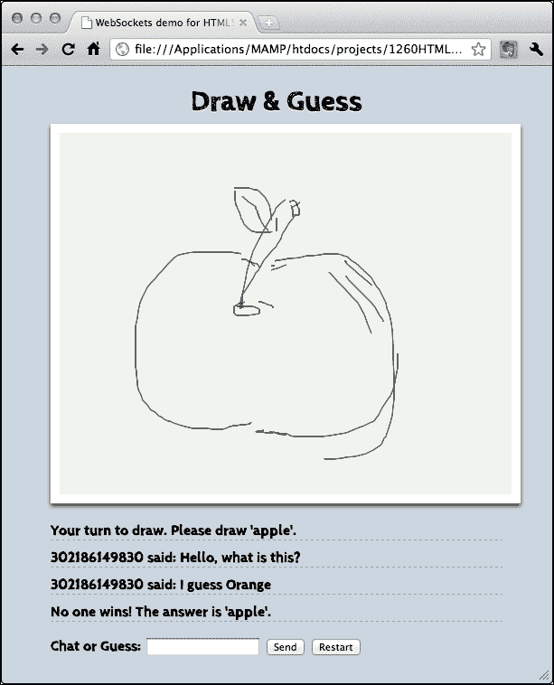
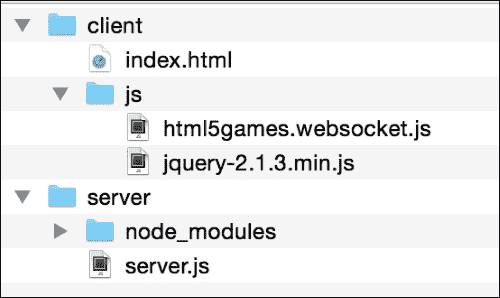
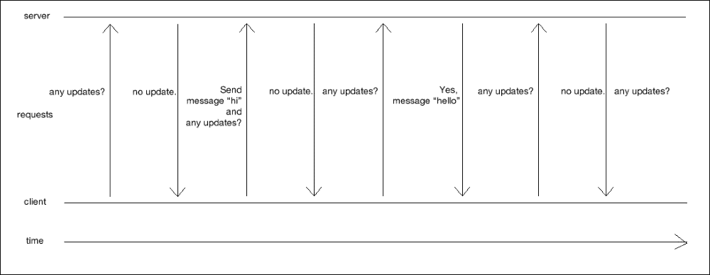
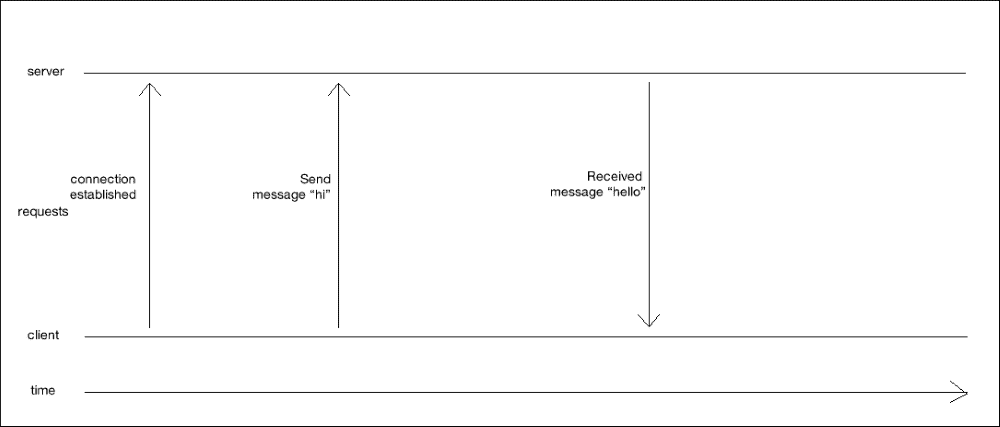
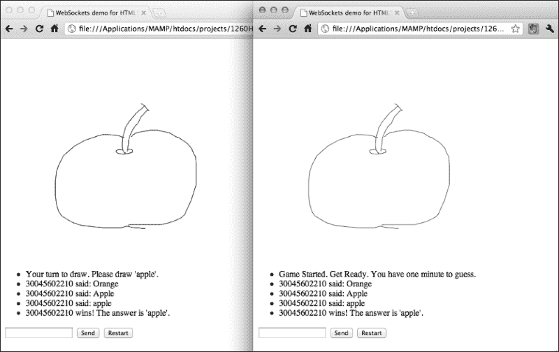

# 第 8 章。使用 WebSocket 构建多人平局猜谜游戏

*在前面的章节中，我们构建了几个本地单人游戏。在本章中，我们将借助 WebSocket 构建一个多人游戏。WebSocket 使我们能够创建基于事件的服务器-客户端体系结构。消息会立即在所有连接的浏览器之间传递。我们将结合画布绘制、JSON 数据打包和前几章中学习的一些技术来构建绘制和猜测游戏。*

在本章中，我们将学习以下主题：

*   尝试现有的多用户画板，该画板通过 WebSocket 显示来自不同连接用户的图形
*   安装由 node.js 实现的 WebSocket 服务器
*   从浏览器连接服务器
*   使用 WebSocket API 创建即时聊天室
*   在画布中创建多用户绘图板
*   通过将聊天室和绘图与游戏逻辑相结合，构建一个绘图和猜测游戏

下面的屏幕截图显示了我们将在本章中创建的抽签和猜测游戏：



那么，让我们继续吧。

# 安装 WebSocket 服务器

HTML5WebSocket 提供了一个客户端 API，用于将浏览器连接到后端服务器。此服务器必须支持 WebSockets 协议才能保持连接的持久性。

## 安装 Node.js WebSocket 服务器

在本节中，我们将下载并安装一个名为 Node.js 的服务器，在该服务器上我们可以安装 WebSockets 模块。

# 行动时间-安装 Node.js

1.  转到网址[http://nodejs.org](http://nodejs.org) ，其中包含 Node.js 服务器的源代码。
2.  点击页面上的**安装**按钮。这将根据您的操作系统下载安装包。
3.  按照安装程序的说明安装 Node.js 包。安装完成后，我们可以通过以下命令检查 Node.js 的版本来检查 Node.js 是否已安装：

    ```html
    $ node --version
    ```

4.  前面的命令应该打印 node.js 的版本号。就我而言，它是版本 0.12.0:

    ```html
    v0.12.0
    ```

5.  我们还需要检查`npm`包管理器是否安装了以下命令：

    ```html
    $ npm --version
    ```

6.  前面的命令应该打印 npm 的版本号 Node.js packages manager。就我而言，它是 2.5.1 版。

## *刚才发生了什么事？*

我们刚刚下载并安装了`Node.js`服务器。我们将在此环境之上构建服务器逻辑。WebSocket 服务器不一定在 Node.js 上运行。WebSockets 协议有不同的服务器端实现。我们选择 Node.js 是因为它使用 JavaScript，在前几章构建了四个 HTML5 游戏之后，我们对它很熟悉。

Node.js 中有一个名为io.js（[的 forkhttp://iojs.org](http://iojs.org) 。在写这本书的时候，io.js 还是很新的。如果您计划在未来的项目中使用 Node，那么您需要检查两个平台上的最新状态及其差异。

### 注

在一些 Linux 发行版中，二进制文件从`node`重命名为`nodejs`。您可以使用以下命令创建`nodejs`到`node`的符号链接。您可能需要`sudo`来运行该命令：

```html
ln -s "$(which nodejs)" /usr/bin/node
```

## 创建 WebSocket 服务器发送连接计数

我们刚刚安装了`node.js`服务器。现在，我们将使用 WebSocket 构建一些东西。想象一下，现在我们需要一个服务器，它接受来自浏览器的连接，然后将连接计数发送给所有用户。

# 行动时间-运行 WebSocket 服务器

1.  为我们的代码创建一个项目文件夹。在其中，创建一个名为`server`的新目录。
2.  使用终端或 shell 命令提示符将目录更改为新创建的文件夹。
3.  键入以下将安装 WebSocket 服务器的命令：

    ```html
    npm install --save ws
    ```

4.  在`server`目录下新建一个名为`server.js`的文件，内容如下：

    ```html
    var port = 8000;

    // Server code
    var WebSocketServer = require('ws').Server;
    var server = new WebSocketServer({ port: port });

    server.on('connection', function(socket) {
      console.log("A connection established");
    });

    console.log("WebSocket server is running.");
    console.log("Listening to port " + port + ".");
    ```

5.  打开终端并切换到服务器目录。
6.  键入以下命令以执行服务器：

    ```html
    node server.js
    ```

7.  如果成功，您应该得到以下结果：

    ```html
    $ node server.js 
    WebSocket server is running.
    Listening to port 8000.
    ```

## *刚才发生了什么事？*

我们刚刚创建了一个简单的服务器逻辑，用于初始化 WebSockets 库并侦听连接事件。

## 初始化 WebSocket 服务器

在`Node.JS`中，不同的函数被打包到模块中。当我们需要特定模块中的功能时，我们使用`require`加载它。我们加载 WebSocket 模块，然后使用服务器逻辑中的以下代码初始化服务器：

```html
var WebSocketServer = require('ws').Server;
var server = new WebSocketServer({ port: port });
```

由于`ws`模块由`npm`管理，所以安装在名为`node_modules`的文件夹中。当我们需要一个只有名称的库时，Node.js 运行时会在`node_modules`文件夹中查找该模块。

我们使用`8000`作为服务器的端口号，客户端通过该端口号连接到此服务器。我们可以选择不同的端口号，但必须确保所选的端口号不会与其他公共服务器服务重叠。

## 在服务器端监听连接事件

`node.js`服务器基于事件。这意味着大多数逻辑是在触发某个事件时执行的。我们在示例中使用的以下代码侦听`connection`事件并对其进行处理：

```html
server.on('connection', function(socket) {
  console.log("A connection established");
});
```

`connection`事件带有一个套接字参数。稍后我们将需要存储此套接字，因为我们使用此对象与连接客户端进行交互。

## 创建连接到 WebSocket 服务器的客户端并获取总连接数

我们在上一个示例中构建了服务器，现在，我们将构建一个连接到 WebSocket 服务器并从服务器接收消息的客户端。该消息将包含来自服务器的总连接计数。

# 操作时间–显示 WebSocket 应用程序中的连接计数

执行以下步骤：

1.  创建一个名为`client`的新目录。
2.  在`client`文件夹中创建一个名为`index.html`的 HTML 文件。
3.  现在，在我们的 HTML 文件中添加一些标记。为此，请将以下代码放入`index.html`文件中：

    ```html
    <!DOCTYPE html>
    <html lang="en">
    <head>
      <meta charset="utf-8">
      <title>WebSockets demo for HTML5 Games Development: A Beginner's Guide</title>
    </head>
    <body>
      <!-- game elements goes here later -->
      <script src="js/jquery-2.1.3.min.js"></script>
      <script src="js/html5games.websocket.js"></script>
    </body>
    </html>
    ```

4.  创建一个名为`js`的目录，并将 jQuery JavaScript 文件放入其中。
5.  创建一个名为`html5games.websockets.js`的新文件，如下所示：

    ```html
    var websocketGame = {
    }
    // init script when the DOM is ready.
    $(function(){
      // check if existence of WebSockets in browser
      if (window["WebSocket"]) {

        // create connection
        websocketGame.socket = new WebSocket("ws://127.0.0.1:8000");

        // on open event
        websocketGame.socket.onopen = function(e) {
          console.log('WebSocket connection established.');
        };

        // on close event
        websocketGame.socket.onclose = function(e) {
          console.log('WebSocket connection closed.');
        };      
      }
    });
    ```

6.  After these steps, we should have the following folder structure created in our project directory:

    

7.  我们现在将测试代码。首先，您需要使用终端中**服务器**目录中的`node``server.js`使用我们的`server.js`代码运行节点服务器。
8.  接下来，在 web 浏览器中打开客户机目录中的`index.html`文件两次，这样我们就有了两个并排运行的客户机实例。
9.  检查服务器终端。应该有类似以下的日志消息，指示连接信息和总连接计数：

    ```html
    $ node server.js 
    WebSocket server is running.
    Listening to port 8000.
    A connection established.
    A connection established.
    ```

10.  在两个 web 浏览器中，打开**开发者工具**中的控制台。您还应该在控制台中看到**WebSocket 连接已建立**消息。

## *刚才发生了什么事？*

我们刚刚构建了一个客户端，它与上一节构建的服务器建立了WebSocket 连接。然后，客户端将从服务器接收到的任何消息打印到**开发者工具**的**检查器**中的控制台面板。

## 建立 WebSocket 连接

在任何支持WebSocket 的浏览器中，我们都可以通过使用以下代码创建一个新的 WebSocket 实例来建立连接：

```html
var socket = new WebSocket(url);
```

`url`参数是带有 WebSockets URL 的字符串。在我们的示例中，我们在本地运行服务器。因此，我们使用的 URL 是`ws://127.0.0.1:8000`，其中 8000 表示我们要连接的服务器的端口号。它是 8000，因为当我们构建服务器端逻辑时，服务器正在侦听端口 8000。

## WebSocket 客户端事件

与服务器类似，我们在客户端有几个 WebSocket 事件。下表列出了我们将用于处理 WebSocket 的事件：

<colgroup><col style="text-align: left"> <col style="text-align: left"></colgroup> 
| 

事件名称

 | 

描述

 |
| --- | --- |
| `onopen` | 当建立与服务器的连接时，会触发此 |
| `onmessage` | 当接收到来自服务器的任何消息时，将触发此操作 |
| `onclose` | 这是在服务器关闭连接时触发的 |
| `onerror` | 当连接中出现任何错误时，将触发 |

## 向所有连接的浏览器发送消息

一旦服务器收到一个新`connection`事件，我们将更新的连接计数发送给所有客户端。向所有客户发送消息很容易。我们只需要调用`server`实例中的`sendAll`函数，并使用`string`参数作为消息。

以下代码段向所有连接的浏览器发送服务器消息：

```html
var message = "a message from server";
server.sendAll(message);
```

# 行动时间–向所有用户发送总计数

执行以下步骤来创建游戏的基础逻辑：

1.  在服务器文件夹中，我们创建了一个名为`game.js`的新文件。我们将在这个文件中存储房间和游戏逻辑。
2.  我们定义了一个`User`类，该类存储套接字连接对象并创建一个随机 ID。

    ```html
    function User(socket) {
      this.socket = socket; 
      // assign a random number to User.
      // Long enough to make duplication chance less.
      this.id = "1" + Math.floor( Math.random() * 1000000000);
    }
    ```

3.  我们还定义了一个`Room`类。我们在这个类中存储一组用户实例。

    ```html
    function Room() {
      this.users = []; 
    }
    ```

4.  我们在`Room`类中定义了两个实例方法，用于管理用户的添加和删除。

    ```html
    Room.prototype.addUser = function(user){
      this.users.push(user); 
      var room = this; 

      // handle user closing
      user.socket.onclose = function(){
        console.log('A connection left.');
        room.removeUser(user);
      }
    };
    Room.prototype.removeUser = function(user) {
      // loop to find the user
      for (var i=this.users.length; i >= 0; i--) {
        if (this.users[i] === user) {
          this.users.splice(i, 1);
        }
      }
    };
    ```

5.  然后，我们定义了另一种方法，负责向房间中所有连接的用户发送消息：

    ```html
    Room.prototype.sendAll = function(message) {
      for (var i=0, len=this.users.length; i<len; i++) {
        this.users[i].socket.send(message);
      }
    };
    ```

6.  在继续之前，我们需要导出新定义的类`User`和`Room`类，以便其他文件使用它们：

    ```html
    module.exports.User = User;
    module.exports.Room = Room;
    ```

7.  在`server.js`文件中，我们用以下代码替换连接处理程序，将用户计数发送给所有连接的用户：

    ```html
    var User = require('./game').User;
    var Room = require('./game').Room;
    var room1 = new Room();
    server.on('connection', function(socket) {
      var user = new User(socket);
      room1.addUser(user);
      console.log("A connection established");
      var message = "Welcome " + user.id 
         + " joining the party. Total connection: "
         + room1.users.length;
      room1.sendAll(message);
    });
    ```

8.  然后我们转到客户机。在**clients****js**文件夹中的`html5games.websocket.js`文件中，我们添加了一个处理程序来打印从服务器接收到的消息。

    ```html
    // on message event
    websocketGame.socket.onmessage = function(e) {
      console.log(e.data);
    };
    ```

9.  Finally, we test the code. Launch the server by executing `node` `server.js` in the server directory. Then, open the `index.html` file, and we should see something similar to the following screenshot on the console:

    

## *刚才发生了什么事？*

我们在一个`game.js`文件中定义了两个类`User`和`Room`，我们使用来管理所有连接的套接字。

## 定义类和即时实例方法

在 JavaScript 中，**面向对象编程**是使用函数和原型完成的。当我们通过调用`new``Room()`创建房间实例时，浏览器会将`Room.prototype`中的所有属性和方法克隆到实例中。

## 处理新连接的用户

对于每个连接的用户，我们需要通过事件处理程序与他们交互。为了便于管理，我们将用户对象添加到数组中。当用户断开连接时，我们需要处理`onclose`事件。为此，我们将该用户从阵列中删除。

## 导出模块

在`game.js`文件中定义了我们的类之后，我们将它们导出。通过将它们导出到模块中，我们可以使用`require`方法将它们导入到另一个文件中，如下所示：

```html
var User = require('./game').User;
var Room = require('./game').Room;
```

## 向客户端发送消息

WebSocket 具有从服务器向用户发送消息的能力。传统上，客户端请求服务器，然后服务器响应。在套接字服务器中，所有用户都已连接，因此可以触发消息并向两个方向发送。在这里，我们通过所有用户循环发送广播消息：

```html
Room.prototype.send = function(message) {
  for (var i=0, len=this.users.length; i<len; i++) {
    this.users[i].socket.send(message);
  }
};
```

然后，我们使用`onmessage`事件处理程序在客户机上侦听服务器消息。

```html
// on message event
websocketGame.socket.onmessage = function(e) {
  console.log(e.data);
};
```

# 用 WebSocket 搭建聊天应用

我们现在知道连接了多少个浏览器。假设我们想建立一个聊天室，用户可以在各自的浏览器中键入消息，并立即将消息发送给所有连接的用户。

## 向服务器发送消息

我们将让用户输入一条消息，然后将消息发送到`node.js`服务器。然后，服务器将消息转发到所有连接的浏览器。一旦浏览器接收到该消息，它就会将其显示在聊天区中。在这种情况下，用户加载网页后即连接到即时聊天室。

# 行动时间–通过 WebSocket 向服务器发送消息

1.  首先，编写服务器逻辑代码。
2.  打开`servergame.js`。向处理用户消息的文件中添加以下函数：

    ```html
    Room.prototype.handleOnUserMessage = function(user) {
      var room = this;
      user.socket.on("message", function(message){
        console.log("Receive message from " + user.id + ": " + message);
      });
    };
    ```

3.  在调用我们新创建的函数的`Room.prototype.addUser`方法中添加以下代码：

    ```html
    this.handleOnUserMessage(user);
    ```

4.  现在，转到`client`文件夹。
5.  打开`index.html`文件并在`body`部分添加以下标记。这为用户输入并向服务器发送消息：

    ```html
    <input type="text" id="chat-input" autocomplete="off">
    <input type="button" value="Send" id="send">
    ```

6.  然后，将以下代码添加到`html5games.websocket.js`JavaScript 文件中。当用户点击`send`按钮或按下*回车*键

    ```html
    $("#send").click(sendMessage);

    $("#chat-input").keypress(function(event) {
       if (event.keyCode === 13) {  
          sendMessage();  
       }  
    });

    function sendMessage() {
       var message = $("#chat-input").val();
       websocketGame.socket.send(message);
       $("#chat-input").val("");
    }
    ```

    时，会向服务器发送消息
7.  在测试代码之前，请检查服务器终端并查看节点服务器是否仍在运行。按*Ctrl*+*C*终止，使用`node``server.js`命令再次运行。
8.  Open `index.html` in a web browser. You should see an input text field with a **Send** button, as shown in the following screenshot:

    

9.  尝试在输入文本字段中键入内容，然后单击**发送**按钮或按*输入*。输入文本将被清除。
10.  Now, switch to the server terminal, and you will see the server printing the text that we just sent. You can also put the browser and server terminal side by side to see how the message is sent instantly from the client to the server. The following screenshot shows the server terminal with messages from two connected browsers:

    

## *刚才发生了什么事？*

我们只是扩展了我们的连接示例，添加了一个输入文本字段，供用户在其中键入一些文本并发送出去。文本将作为消息发送到 WebSocket 服务器。然后服务器将在终端中打印接收到的消息。

## 从客户端向服务器发送消息

为了从客户端向服务器发送消息，我们在`WebSocket`实例中调用以下`send`方法：

```html
websocketGame.socket.send(message);
```

在下面的示例代码片段中，我们从输入文本字段获取消息并将其发送到服务器：

```html
var message = $("#chat-input").val();
websocketGame.socket.send(message);
```

## 在服务器端接收消息

在服务器端，我们需要处理刚刚从客户端发送的消息。我们在 WebSocket`node.js`库的连接实例中有一个名为`message`的事件。我们可以侦听 ConnectionMessage 事件以从每个客户端连接接收消息。

以下代码段显示了如何使用消息事件侦听器在服务器终端上打印消息：

```html
socket.on("message", function(message){
  console.log("Receive message: " + message);
});
```

# 在服务器端发送收到的每条消息，创建聊天室

在上一个示例中，服务器可以接收浏览器发送的消息。但是，服务器除了在终端中打印接收到的消息外，什么也不做。因此，我们将向服务器添加一些逻辑来发送消息。

# 行动时间-向所有连接的浏览器发送消息

执行以下步骤：

1.  打开服务器端逻辑的**服务器**文件夹中的`game.js`文件。
2.  将以下突出显示的代码添加到消息事件侦听器处理程序：

    ```html
    user.socket.on("message", function(message){
      console.log("Receive message from " + user.id + ": " + message); 
      // send to all users in room.
      var msg = "User " + user.id + " said: " + message;
      room.sendAll(msg);
    });
    ```

3.  服务器端就是这样。转到`client`文件夹并打开`index.html`文件。
4.  我们想在聊天记录区域显示聊天信息。为此，向 HTML 文件中添加以下代码：

    ```html
    <ul id="chat-history"></ul>
    ```

5.  接下来，我们需要客户端 JavaScript 来处理从服务器接收到的消息。我们使用它将其打印到控制台面板中，在`onmessage`事件处理程序中将`console.log`代码替换为以下突出显示的代码：

    ```html
    socket.onmessage = function(e) {
      $("#chat-history").append("<li>"+e.data+"</li>");
    };
    ```

6.  让我们测试一下我们的代码。按*Ctrl*+*C*终止任何正在运行的节点服务器。然后，再次运行服务器。
7.  Open the `index.html` file twice and put them side by side. Type something in the text field and press *Enter*. The message will appear on both the opened browsers. If you open many instances of the HTML file, the message would appear on all the browsers. The following screenshot shows two browsers displaying the chat history side by side:

    

## *刚才发生了什么事？*

这是我们前面例子的扩展。我们讨论了服务器如何向所有连接的客户端发送连接计数。我们还讨论了客户端如何向服务器发送消息。在本例中，我们将这两种技术结合起来，让服务器将接收到的消息发送给所有连接的用户。

## 比较 WebSocket 和轮询方法

如果您曾经使用服务器端语言和数据库构建过网页聊天室，那么您可能想知道 WebSocket 实现与传统实现之间的区别。

传统的聊天室方法通常使用**轮询**方法实现。客户端定期向服务器请求更新。服务器响应客户机时，要么不更新，要么更新数据。然而，传统的方法有几个问题。客户端在下次请求服务器之前，不会从服务器获取更新的新数据。这意味着数据更新会随着时间的推移而周期性延迟，并且响应不够及时。如果我们想通过缩短轮询持续时间来改善这个问题，那么会利用更多的带宽，因为客户端需要不断向服务器发送请求。

下图显示了客户端和服务器之间的请求。它显示发送了许多无用的请求，但服务器响应客户端时没有任何新数据：



有一种更好的轮询方法，名为**长轮询**：客户端向服务器发送请求并等待响应。与传统的轮询方法不同，传统的轮询方法是服务器响应“不更新”，服务器在需要将某个内容推送到服务器之前根本不响应。在这种方法中，只要有更新，服务器就可以将某些内容推送到客户端。一旦客户机收到来自服务器的响应，它将创建另一个请求并等待下一个服务器通知。下图显示了长轮询方法，其中客户端请求更新，而服务器仅在有更新时响应：


在 WebSockets 方法中，请求的数量远远少于轮询方法。这是因为客户端和服务器之间的连接是持久的。一旦建立连接，只有在有任何更新时，才会发送来自客户端或服务器端的请求。例如，客户端在需要向服务器更新某些内容时向服务器发送消息。服务器仅在需要通知客户端数据更新时才向客户端发送消息。在连接过程中不会发送其他无用的请求。因此，使用的带宽更少。下图显示了 WebSockets 方法：



# 使用画布和 WebSocket 制作共享绘图白板

假设我们想要一个共享的画板。任何人都可以在画板上画画，其他人都可以查看。我们学习了如何在客户端和服务器之间传递消息。我们将进一步发送图纸数据。

## 建立本地绘图画板

在我们处理数据发送和服务器处理之前，让我们先做一个绘图白板。我们将使用画布构建本地绘图画板。

# 行动时间-用画布制作本地绘图白板

执行以下步骤：

1.  在本节中，我们将只关注客户端。打开`index.html`文件，添加以下`canvas`标记：

    ```html
    <canvas id='drawing-pad' width='500' height='400'>
    </canvas>
    ```

2.  我们将在画布上绘制一些东西，我们需要鼠标相对于画布的位置。我们在[第 4 章](04.html "Chapter 4. Building the Untangle Game with Canvas and the Drawing API")中做了这项工作，*使用画布和绘图 API*构建解开游戏。将以下样式添加到画布：

    ```html
    <style>
      canvas{position:relative;}
    </style>
    ```

3.  然后，打开`html5games.websocket.js`JavaScript 文件添加绘图逻辑。
4.  将`websocketGame`全局对象替换为 JavaScript 文件顶部的以下变量：

    ```html
    var websocketGame = {
       // indicates if it is drawing now.
       isDrawing : false,

       // the starting point of next line drawing.
       startX : 0,
       startY : 0,
    }

    // canvas context
    var canvas = document.getElementById('drawing-pad');
    var ctx = canvas.getContext('2d');
    ```

5.  在 jQuery`ready`函数中，添加以下鼠标事件处理程序代码。该代码处理鼠标的向下、移动和向上事件：

    ```html
    // the logic of drawing in the Canvas
    $("#drawing-pad").mousedown(function(e) {
      // get the mouse x and y relative to the canvas top-left point.
      var mouseX = e.originalEvent.layerX || e.offsetX || 0;
      var mouseY = e.originalEvent.layerY || e.offsetY || 0;

      websocketGame.startX = mouseX;
      websocketGame.startY = mouseY;

      websocketGame.isDrawing = true;
    });

    $("#drawing-pad").mousemove(function(e) {
      // draw lines when is drawing
      if (websocketGame.isDrawing) {
        // get the mouse x and y 
        // relative to the canvas top-left point.
        var mouseX = e.originalEvent.layerX || e.offsetX || 0;
        var mouseY = e.originalEvent.layerY || e.offsetY || 0;

        if (!(mouseX === websocketGame.startX && mouseY === websocketGame.startY)) {
          drawLine(ctx, websocketGame.startX, websocketGame.startY,mouseX,mouseY,1);

          websocketGame.startX = mouseX;
          websocketGame.startY = mouseY;
        }
      }
    });

    $("#drawing-pad").mouseup(function(e) {
      websocketGame.isDrawing = false;
    });
    ```

6.  最后，我们有下面的功能，在画布上画一条线，有给定的起点和终点：

    ```html
    function drawLine(ctx, x1, y1, x2, y2, thickness) {
       ctx.beginPath();
       ctx.moveTo(x1,y1);
       ctx.lineTo(x2,y2);
       ctx.lineWidth = thickness;
       ctx.strokeStyle = "#444";
       ctx.stroke();
    }
    ```

7.  Save all files and open the `index.html` file. You should see an empty space where you can draw something by using the mouse. The drawings are not sent to the server yet, so others cannot view your drawings:

    

## *刚才发生了什么事？*

我们刚刚创建了一个本地绘图板。这就像一块白板，玩家可以通过拖动鼠标在画布上画画。但是，图形数据尚未发送到服务器；所有图形仅在本地显示。

`drawing``line`函数与[第 4 章](04.html "Chapter 4. Building the Untangle Game with Canvas and the Drawing API")*使用画布和绘图 API*构建解开游戏时使用的函数相同。我们还使用相同的代码来获取鼠标相对于`canvas`元素的位置。但是，鼠标事件的逻辑不同于[第 4 章](04.html "Chapter 4. Building the Untangle Game with Canvas and the Drawing API")*使用画布和绘图 API*构建解开游戏。

### 画布上的绘画

当我们在电脑上画东西时，通常意味着我们点击画布并拖动鼠标（或笔）。这条线一直绘制到鼠标按钮向上。然后，用户单击另一个位置并再次拖动以绘制线。

在我们的示例中，我们有一个名为`isDrawing`的布尔标志来指示用户是否正在绘图。`isDrawing`标志默认为`false`。当鼠标按钮位于某一点时，我们将标志转到`true`。当鼠标移动时，我们在移动的点和鼠标按钮按下时的最后一个点之间画一条线。然后，当鼠标按钮打开时，我们将`isDrawing`标志设置为`false`。这就是绘图逻辑的工作原理。

## 有一个围棋英雄——用颜色画图

我们可以通过添加颜色支持来修改绘图画板吗？添加五个红色、蓝色、绿色、黑色和白色按钮怎么样？玩家可以在绘图时选择颜色。或者，我们也可以为用户提供不同的笔刷宽度选项。

## 将图纸发送到所有连接的浏览器

我们将进一步将我们的图纸数据发送到服务器，并让服务器将图纸发送到所有连接的浏览器。

# 行动时间-通过 WebSocket 发送图纸

执行以下步骤：

1.  首先，我们需要修改服务器逻辑。打开`game.js`文件，在文件开头添加两个常量，如下所示：

    ```html
    // Constants
    var LINE_SEGMENT = 0;
    var CHAT_MESSAGE = 1;
    ```

2.  在`Room.prototype.addUser`方法中，在方法开头添加以下代码：

    ```html
    this.users.push(user);
    var room = this;
    // tell others that someone joins the room
    var data = {
      dataType: CHAT_MESSAGE,
      sender: "Server",
      message: "Welcome " + user.id 
         + " joining the party. Total connection: " + this.users.length
    };  
    room.sendAll(JSON.stringify(data));
    ```

3.  我们使用 JSON 格式的字符串来传递绘图操作和聊天消息。将以下代码添加到消息事件处理程序上的用户套接字：

    ```html
    user.socket.on("message", function(message){
      console.log("Receive message from " + user.id + ": " + message);

      // construct the message
      var data = JSON.parse(message);
      if (data.dataType === CHAT_MESSAGE) {
        // add the sender information into the message data object.
        data.sender = user.id;
      }

      // send to all clients in room.
      room.sendAll(JSON.stringify(data));
    });
    ```

4.  在`server.js`中不需要向房间发送欢迎信息，因为这是通过`Room.addUser`方法处理的。从`server.js`文件中删除以下代码：

    ```html
    room1.sendAll(message);
    ```

5.  在客户端，我们需要逻辑以相同的数据对象定义响应服务器。打开**客户端**下**js**目录下的`html5games.websocket.js`JavaScript 文件。
6.  将以下常量添加到`websocketGame`全局变量中。服务器端逻辑中还定义了具有相同值的相同常量。

    ```html
    // Contants
    LINE_SEGMENT : 0,
    CHAT_MESSAGE : 1,
    ```

7.  在客户端处理消息事件时，将 JSON 格式的字符串转换回数据对象。如果数据是聊天信息，那么我们将其显示为聊天历史记录，否则我们将在画布中将其绘制为线段。将`onmessage`事件处理程序替换为以下代码：

    ```html
    websocketGame.socket.onmessage = function(e) {
       // check if the received data is chat or line segment
       console.log("onmessage event:",e.data);
       var data = JSON.parse(e.data);
       if (data.dataType === websocketGame.CHAT_MESSAGE) {
          $("#chat-history").append("<li>" + data.sender
              + " said: "+data.message+"</li>");
       }
       else if (data.dataType === websocketGame.LINE_SEGMENT) {
          drawLine(ctx, data.startX, data.startY, data.endX, data.endY, 1);
       }

    };
    ```

8.  当鼠标移动时，我们不仅在画布上画线，还将线数据发送到服务器。将以下突出显示的代码添加到`mousemove`事件处理程序：

    ```html
    $("#drawing-pad").mousemove(function(e) {
       // draw lines when is drawing
       if (websocketGame.isDrawing) {
          // get the mouse x and y 
          // relative to the canvas top-left point.
          var mouseX = e.originalEvent.layerX || e.offsetX || 0;
          var mouseY = e.originalEvent.layerY || e.offsetX || 0;

          if (!(mouseX === websocketGame.startX && mouseY === websocketGame.startY)) {
             drawLine(ctx, websocketGame.startX, websocketGame.startY,mouseX,mouseY,1);

             // send the line segment to server
     var data = {};
     data.dataType = websocketGame.LINE_SEGMENT;
     data.startX = websocketGame.startX;
     data.startY = websocketGame.startY;
     data.endX = mouseX;
     data.endY = mouseY;
     websocketGame.socket.send(JSON.stringify(data));

             websocketGame.startX = mouseX;
             websocketGame.startY = mouseY;
          }

       }
    });
    ```

9.  最后，我们需要修改发送消息逻辑。现在，我们将消息打包成一个对象，并在将其发送到服务器时将其格式化为 JSON。将`sendMessage`功能更改为以下代码：

    ```html
    function sendMessage() {
       var message = $("#chat-input").val();

       // pack the message into an object.
       var data = {};
       data.dataType = websocketGame.CHAT_MESSAGE;
       data.message = message;

       websocketGame.socket.send(JSON.stringify(data));
       $("#chat-input").val("");
    }
    ```

10.  保存所有文件并重新启动服务器。
11.  在两个浏览器实例中打开`index.html`文件。
12.  First, try the chat room feature by typing some messages and sending them. Then, try drawing something in the Canvas. Both browsers should display the same drawing, as shown in the following screenshot:

    

## *刚才发生了什么事？*

我们刚刚建立了一个多用户画板。这类似于我们在本章开头尝试的画板。我们通过将复杂数据对象作为消息发送，扩展了您在构建聊天室时学到的内容。

## 定义一个数据对象，用于客户端和服务器之间的通信

当一条消息中包含大量数据时，为了在服务器和客户端之间正确通信，我们必须定义一个客户端和服务器都能理解的数据对象。

数据对象中有几个属性。下表列出了这些属性以及我们需要它们的原因：

<colgroup><col style="text-align: left"> <col style="text-align: left"></colgroup> 
| 

属性名

 | 

为什么我们需要这个财产

 |
| --- | --- |
| `dataType` | 这是一个重要属性，有助于我们理解整个数据。数据是聊天信息或绘图线段数据。 |
| `sender` | 如果数据是聊天信息，客户端需要知道是谁发送了该信息。 |
| `message` | 当数据类型是聊天消息时，我们当然需要将消息内容本身包含到数据对象中。 |
| `startX` | 当数据类型为绘制线段时，我们包括线起点的*x*/*y*坐标。 |
| `startY` |
| `endX` | 当数据类型为绘制线段时，我们包括线端点的*x*/*y*坐标。 |
| `endY` |

另外，我们在客户端和服务器端都定义了以下常量；这些常数用于`dataType`属性：

```html
// Contants
LINE_SEGMENT : 0,
CHAT_MESSAGE : 1,
```

使用这些常量，我们可以将数据类型与以下可读代码进行比较，而不是使用无意义的整数：

```html
if (data.dataType === websocketGame.CHAT_MESSAGE) {…}
```

## 将绘制线数据打包成 JSON 发送

我们在上一章中使用了`JSON.stringify`函数，将 JavaScript对象存储到本地存储器中 JSON 格式的字符串中。现在，我们需要在服务器和客户端之间以字符串格式发送数据。我们使用相同的方法将绘制线数据打包到对象中，并将其作为 JSON 字符串发送。

下面的代码片段显示了如何在客户端打包线段数据，并使用 JSON 格式的字符串将其发送到服务器：

```html
// send the line segment to server
var data = {};
data.dataType = websocketGame.LINE_SEGMENT;
data.startX = startX;
data.startY = startY;
data.endX = mouseX;
data.endY = mouseY;
websocketGame.socket.send(JSON.stringify(data));
```

## 收到其他客户的图纸线后，重新创建图纸线

JSON 解析通常是作为`stringify`的一对。当我们从服务器收到消息时，我们必须将其解析为 JavaScript 对象。客户端上的以下代码解析数据并更新聊天历史记录或基于数据绘制一条线：

```html
var data = JSON.parse(e.data);
if (data.dataType === websocketGame.CHAT_MESSAGE) {
  $("#chat-history").append("<li>"+data.sender+" said: "+data.message+"</li>");
}
else if (data.dataType === websocketGame.LINE_SEGMENT) {
  drawLine(ctx, data.startX, data.startY, data.endX, data.endY, 1);
}
```

# 建立多人平局猜谜游戏

在本章前面，我们建立了一个即时聊天室。此外，我们刚刚构建了一个多用户画板。如何结合这两种技术，建立一个抽签猜谜游戏？抽签猜谜游戏是一种游戏，其中一名玩家被给予一个单词来抽签。所有其他玩家都不知道这个词，根据图纸猜出这个词。画画的人和猜对单词的人都能得分。

# 行动时间-构建抽签猜谜游戏

我们将实施抽签猜谜游戏的游戏流程如下：

1.  首先，我们将在客户端添加游戏逻辑。
2.  打开客户端目录中的`index.html`文件。在*发送*按钮后添加以下重启按钮：

    ```html
    <input type="button" value="Restart" id="restart">
    ```

3.  打开`html5games.websocket.js`JavaScript。
4.  我们还需要一些常数来确定游戏中的不同状态。将以下突出显示的代码添加到文件顶部：

    ```html
    // Constants
    LINE_SEGMENT : 0,
    CHAT_MESSAGE : 1,
    GAME_LOGIC : 2,

    // Constant for game logic state
    WAITING_TO_START : 0,
    GAME_START : 1,
    GAME_OVER : 2,
    GAME_RESTART : 3,

    ```

5.  此外，我们需要一个标志，表明这个球员是负责绘图。将以下布尔全局变量添加到代码中：

    ```html
    isTurnToDraw : false,
    ```

6.  当客户端收到来自服务器的消息时，会对其进行解析，并检查它是聊天消息还是线条图。我们现在有另一种类型的消息名为`GAME_LOGIC`，用于处理游戏逻辑。游戏逻辑消息包含不同游戏状态的不同数据。将以下代码添加到`onmessage`事件处理程序中：

    ```html
    else if (data.dataType === websocketGame.GAME_LOGIC) {
      if (data.gameState === websocketGame.GAME_OVER) {
        websocketGame.isTurnToDraw = false;
        $("#chat-history").append("<li>" + data.winner
           +" wins! The answer is '"+data.answer+"'.</li>");
        $("#restart").show();
      }
      if (data.gameState === websocketGame.GAME_START) {
        // clear the Canvas.
        canvas.width = canvas.width;

        // hide the restart button.
        $("#restart").hide();

        // clear the chat history
        $("#chat-history").html("");

        if (data.isPlayerTurn) {
          websocketGame.isTurnToDraw = true;
          $("#chat-history").append("<li>Your turn to draw. Please draw '" + data.answer + "'.</li>");
        }
        else {
          $("#chat-history").append("<li>Game Started. Get Ready. You have one minute to guess.</li>");
        }
      }
    }
    ```

7.  客户端逻辑还有最后一步。我们希望通过向服务器发送重启信号来重启游戏。同时，我们清除了绘图和聊天历史。为此，在`html5games.websocket.js`文件中添加以下代码。

    ```html
    // restart button
    $("#restart").hide();
    $("#restart").click(function(){
      canvas.width = canvas.width;
      $("#chat-history").html("");
      $("#chat-history").append("<li>Restarting Game.</li>");

      // pack the restart message into an object.
      var data = {};
      data.dataType = websocketGame.GAME_LOGIC;
      data.gameState = websocketGame.GAME_RESTART;
      websocketGame.socket.send(JSON.stringify(data));

      $("#restart").hide();
    });
    ```

8.  现在是转到服务器端的时候了。我们需要更多的州来控制游戏流程。用以下代码替换`game.js`文件开头的常量。

    ```html
    // Constants
    var LINE_SEGMENT = 0;
    var CHAT_MESSAGE = 1;
    var GAME_LOGIC = 2;
    // Constant for game logic state
    var WAITING_TO_START = 0;
    var GAME_START = 1;
    var GAME_OVER = 2;
    var GAME_RESTART = 3; 
    ```

9.  在前面的示例中，服务器端只负责向所有连接的浏览器发送任何传入消息。这对于多人游戏来说是不够的。服务器将充当控制游戏流程和确定获胜条件的游戏主机。我们用能够处理游戏流程的`GameRoom`扩展了`Room`类。
10.  现在，将以下代码添加到`game.js`文件的末尾。这是一个名为`GameRoom`的新类的构造函数，用于初始化游戏逻辑。

    ```html
    function GameRoom() { 
      // the current turn of player index.
      this.playerTurn = 0;

      this.wordsList = ['apple','idea','wisdom','angry'];
      this.currentAnswer = undefined;

      this.currentGameState = WAITING_TO_START;

      // send the game state to all players.
      var gameLogicData = {
        dataType: GAME_LOGIC,
        gameState: WAITING_TO_START
      };

      this.sendAll(JSON.stringify(gameLogicData));

    }
    ```

11.  然后，我们将现有的`Room`功能扩展到`GameRoom`原型中，这样`GameRoom`将默认访问`Room`类的原型功能。

    ```html
    // inherit Room
    GameRoom.prototype = new Room();
    ```

12.  在`GameRoom`类中定义以下`addUser`函数。在我们现有的`GameRoom`代码后追加代码。这保留了原始房间的`addUser`功能，并添加了额外的逻辑，直到有足够的玩家加入才能开始游戏：

    ```html
    GameRoom.prototype.addUser = function(user) {
      // a.k.a. super(user) in traditional OOP language.
      Room.prototype.addUser.call(this, user);

      // start the game if there are 2 or more connections
      if (this.currentGameState === WAITING_TO_START && this.users.length >= 2) {
        this.startGame();
      }
    };
    ```

13.  与前面的示例不同，服务器只将用户消息传递给所有连接的客户端，现在服务器需要确定来自用户的消息是否是游戏流的一部分。在已有的`GameRoom`逻辑后追加以下代码；它将原来房间的`handleOnUserMessage`功能改写为处理聊天信息、线段和游戏流程控制的新逻辑：

    ```html
    GameRoom.prototype.handleOnUserMessage = function(user) {
      var room = this;
      // handle on message
      user.socket.on('message', function(message){
        console.log("[GameRoom] Receive message from " 
              + user.id + ": " + message); 

        var data = JSON.parse(message);
        if (data.dataType === CHAT_MESSAGE) {
          // add the sender information into the message data object.
          data.sender = user.id;
        }
        room.sendAll(JSON.stringify(data));

        // check if the message is guessing right or wrong
        if (data.dataType === CHAT_MESSAGE) {
          console.log("Current state: " + room.currentGameState);

          if (room.currentGameState === GAME_START) {
            console.log("Got message: " + data.message 
                + " (Answer: " + room.currentAnswer + ")");
          }

          if (room.currentGameState === GAME_START && data.message === room.currentAnswer) {
            var gameLogicData = {
              dataType: GAME_LOGIC,
              gameState: GAME_OVER,
              winner: user.id,
              answer: room.currentAnswer
            };

            room.sendAll(JSON.stringify(gameLogicData));

            room.currentGameState = WAITING_TO_START;

            // clear the game over timeout
            clearTimeout(room.gameOverTimeout);
          }
        }

        if (data.dataType === GAME_LOGIC && data.gameState === GAME_RESTART) {
          room.startGame();
        }
      });
    };
    ```

14.  让我们继续和`GameRoom`逻辑。将以下新函数添加到`game.js`文件中。这在房间里创造了一个新的游戏，选择一个玩家作为抽屉，其他人作为猜测者；然后，它随机选择一个单词供抽屉绘制：

    ```html
    GameRoom.prototype.startGame = function() {
      var room = this;

      // pick a player to draw
      this.playerTurn = (this.playerTurn+1) % this.users.length;

      console.log("Start game with player " + this.playerTurn 
          + "'s turn.");

      // pick an answer
      var answerIndex = Math.floor(Math.random() * this.wordsList.length);
      this.currentAnswer = this.wordsList[answerIndex];

      // game start for all players
      var gameLogicDataForAllPlayers = {
        dataType: GAME_LOGIC,
        gameState: GAME_START,
        isPlayerTurn: false
      };

      this.sendAll(JSON.stringify(gameLogicDataForAllPlayers));

      // game start with answer to the player in turn.
      var gameLogicDataForDrawer = {
        dataType: GAME_LOGIC,
        gameState: GAME_START,
        answer: this.currentAnswer,
        isPlayerTurn: true
      };

      // the user who draws in this turn.
      var user = this.users[this.playerTurn];
      user.socket.send(JSON.stringify(gameLogicDataForDrawer));

      // game over the game after 1 minute.
      gameOverTimeout = setTimeout(function(){
        var gameLogicData = {
          dataType: GAME_LOGIC,
          gameState: GAME_OVER,
          winner: "No one",
          answer: room.currentAnswer
        };

        room.sendAll(JSON.stringify(gameLogicData));

        room.currentGameState = WAITING_TO_START;
      },60*1000);

      room.currentGameState = GAME_START;
    };
    ```

15.  最后，我们导出`GameRoom`类，以便其他文件，如`server.js`可以访问`GameRoom`类：

    ```html
    module.exports.GameRoom = GameRoom;
    ```

16.  在`server.js`中，我们必须调用新的`GameRoom`构造函数，而不是通用的`Room`构造函数。将原有的`Room`相关代码替换为以下`GameRoom`代码：

    ```html
    var GameRoom = require('./game').GameRoom;
    var room1 = new GameRoom();
    ```

17.  我们将保存所有文件并重新启动服务器。然后，我们将在两个浏览器实例中启动`index.html`文件。一个浏览器将从服务器收到一条消息，通知玩家画一些东西。另一方面，另一个浏览器会通知玩家在一分钟内猜出另一个玩家在画什么。
18.  The player who is told to draw something can draw in the Canvas. The drawings are sent to all the other connected players. The players who are told to guess cannot draw anything in the Canvas. Instead, players type what they guess in the text field and send it to the server. If the guess is correct, then the game ends. Otherwise, the game continues until the one-minute countdown finishes.

    

## *刚才发生了什么事？*

我们刚刚在 WebSockets 和 Canvas 中创建了一个多人猜谜游戏。游戏和多用户画板之间的主要区别在于服务器现在控制游戏流程，而不是让所有用户绘制。

## 继承房间类

在 JavaScript 中，我们可以用新类继承定义的类。我们定义继承`Room`类的`GameRoom`。`GameRoom`类将具有其继承的`Room`逻辑以及专门为游戏流设计的额外逻辑。继承是通过在原型中创建类的实例来完成的，如下所示：

```html
GameRoom.prototype = new Room();
```

现在，`GameRoom`拥有`Room`的原型方法。然后我们可以在`GameRoom`中定义更多的逻辑，比如`startGame`方法。我们还可以通过在`GameRoom`类中定义一个同名的新原型方法来覆盖现有逻辑；例如，我们覆盖`handleOnUserMessage`方法来发送游戏开始和获胜逻辑。

有时，我们希望扩展现有逻辑，而不是用新逻辑替换旧逻辑。在这种情况下，我们需要执行由同名方法重写的逻辑。我们可以使用以下代码来执行原始原型中的方法；我们在`addUser`方法中使用此方法来保持原始逻辑：

```html
// a.k.a. super(user) in traditional OOP language.
Room.prototype.addUser.call(this, user);
```

## 控制多人游戏的游戏流程

控制多人游戏的游戏流程比单个游戏要困难得多。我们可以简单地使用几个变量来控制单个游戏的游戏流程，但我们必须使用消息传递来通知每个玩家特定的更新游戏流程。

首先，我们需要`dataType`的以下突出显示的`GAME_LOGIC`常量。我们使用此数据发送和接收与游戏逻辑控制相关的消息：

```html
// Constants
var LINE_SEGMENT = 0;
var CHAT_MESSAGE = 1;
var GAME_LOGIC = 2;
```

游戏流程中有几个状态。在游戏开始之前，连接的玩家正在等待游戏开始。一旦有足够的多人游戏连接，服务器将向所有玩家发送游戏逻辑消息，通知他们游戏开始。

当游戏结束时，服务器向所有玩家发送一个游戏结束状态。然后，游戏结束，游戏逻辑停止，直到任何玩家点击重启按钮。单击“重新启动”按钮后，客户端将向服务器发送游戏重新启动状态，指示服务器准备新游戏。然后，游戏又开始了。

我们在客户端和服务器中将四种游戏状态声明为以下常量，以便它们理解它们：

```html
// Constant for game logic state
var WAITING_TO_START = 0;
var GAME_START = 1;
var GAME_OVER = 2;
var GAME_RESTART = 3;
```

服务器端的以下代码包含一个索引，指示现在轮到哪个玩家：

```html
var playerTurn = 0;
```

发送给玩家（轮到谁）的数据与发送给其他玩家的数据不同。其他玩家仅通过游戏开始信号接收以下数据：

```html
var gameLogicDataForAllPlayers = {
  dataType: GAME_LOGIC,
  gameState: GAME_START,
  isPlayerTurn: false
};
```

另一方面，玩家（轮到绘制）接收包含单词信息的以下数据：

```html
var gameLogicDataForDrawer = {
  dataType: GAME_LOGIC,
  gameState: GAME_START,
  answer: this.currentAnswer,
  isPlayerTurn: true
};  
```

## 游戏室和游戏室

在这个示例的末尾，我们创建了两种类型的房间：普通房间和游戏室。具体来说，普通房间具有最基本的功能：管理用户和在房间内聊天。游戏室建立在普通游戏室的基础上，增加了另一个大的逻辑块来管理抽签和猜测游戏流程。游戏流程包括等待游戏开始、启动游戏、确定游戏结束以及触发超时。所有这些游戏流控件都封装在`GameRoom`类中。

将来，我们可以通过添加不同类型的游戏来轻松扩展多人游戏。例如，我们可以通过在`GameRoom`中创建一个共享类似等待和重新启动游戏逻辑的`TicTacToeGameRoom`类来创建一个 2 人 tic tac toe 游戏。但是，`TicTacToeGameRoom`类将处理其他游戏流，例如传递游戏板数据和处理平局游戏。由于所有游戏逻辑都封装在特定的游戏室中，不同类型的多人游戏不会相互影响。

## 改进游戏

我们刚刚创建了一个可玩的多人游戏。然而，仍有许多地方需要改进。在下面的部分中，我们列出了游戏的两个可能的改进。

### 改进风格

游戏现在看起来很简单。我们可以通过添加 CSS 样式和装饰图像来改善其视觉外观。在代码包中，您将发现一个示例，其中应用了额外的 CSS 样式，以使游戏看起来更好。您也可以尝试不同的造型效果。

### 在每场比赛中存储绘制的线

在游戏中，抽屉画出条线，其他玩家猜出这幅画。现在，假设两个玩家在玩，第三个玩家加入他们。由于在任何地方都没有用于绘制线条的存储空间，第三个玩家无法看到抽屉绘制的内容。这意味着第三个玩家必须等到游戏结束后才能玩。

## 做个英雄吧

我们怎么能让一个晚加入的玩家继续比赛而不失去底线？我们如何为新连接的玩家重建图形？在服务器上存储当前游戏的所有绘图数据如何？

### 完善答案检查机制

服务器端的答案检查将消息与`currentAnswer`变量进行比较，以确定玩家猜测是否正确。如果案例不匹配，则答案视为不正确。当答案是“苹果”时看起来很奇怪，当玩家猜到“苹果”时，他们被告知答案是错的。

## 做个英雄吧

如何改进答案检查机制？如何改进答案检查逻辑，以便在使用不同的大小写或类似的单词时将答案视为正确？当前的游戏风格非常简单。请将您的装饰添加到游戏中，使其对玩家更具吸引力。

# 总结

在本章中，我们学到了很多关于将浏览器连接到 WebSocket 的知识。来自一个浏览器的消息和事件几乎实时发送到所有连接的浏览器。

具体来说，我们学习了 WebSocket 如何通过在现有的多人画板上绘制来提供实时事件。它显示连接的其他用户的图形。我们选择 Node.js 作为服务器端 WebSocket 服务器。通过使用此服务器，我们可以轻松构建基于事件的服务器来处理来自浏览器的 WebSocket 请求。我们讨论了服务器和客户端之间的关系，它将 WebSocket 与其他方法（如长轮询）进行比较。我们构建了一个即时聊天室应用程序。我们学习了如何实现一个服务器脚本，将所有传入的消息发送到其他连接的浏览器。我们还学习了如何在客户端显示从服务器收到的消息。接下来，我们构建了一个多用户绘图板，并通过将聊天与绘图板集成在一起，最终构建了一个绘制和猜测游戏。

现在您已经学习了如何构建多人游戏，我们准备在下一章中借助物理引擎构建物理游戏。