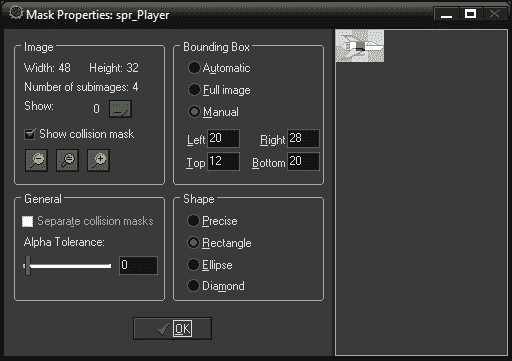
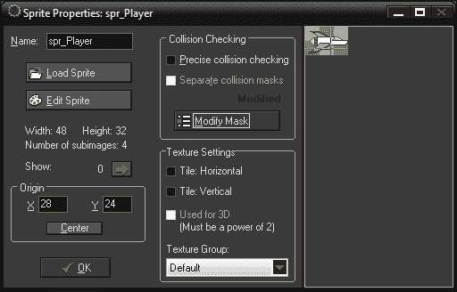
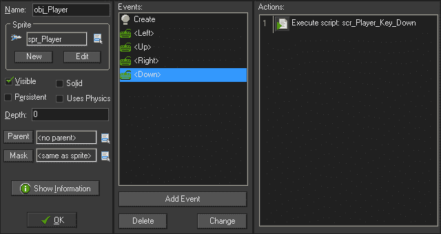
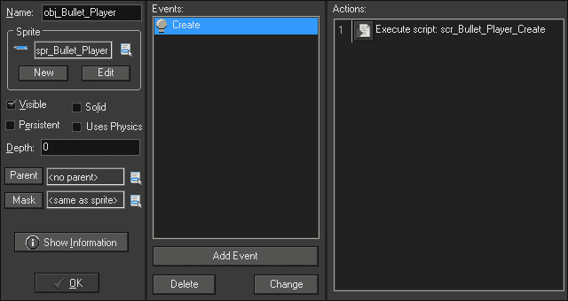
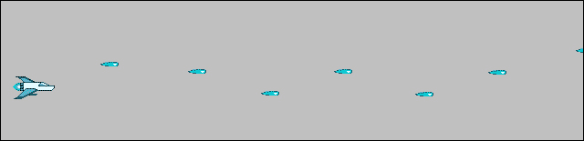
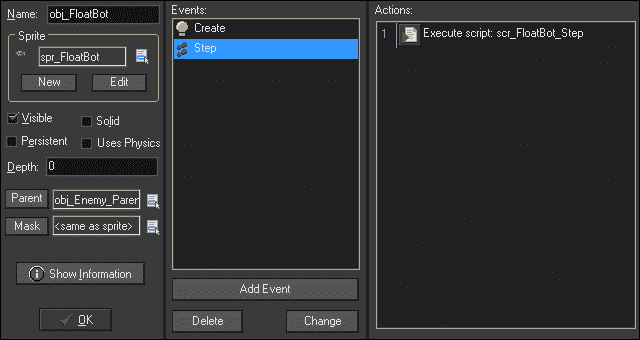
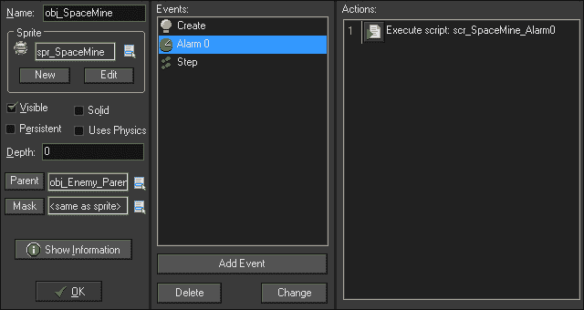
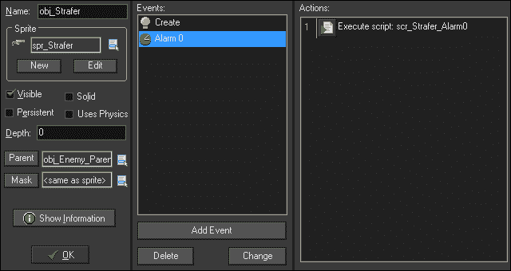
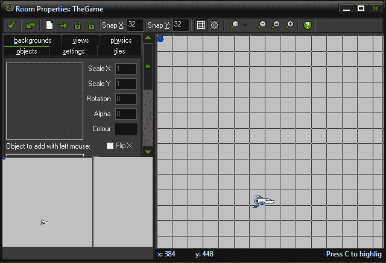

# 三、拍摄他们：制作一个侧滚射击游戏

在本章中，我们将创建一个非常简单的侧滚射击游戏，向我们介绍使用 GML 代码制作完整游戏的基础知识。我们将有一个玩家角色，可以在游戏区域内移动并发射武器。如果它们与敌人或敌人的子弹相撞，它们将被摧毁，如果它们还有剩余的生命，它们可以重生。

我们将在屏幕上创建三种不同类型的敌人：

*   **漂浮机器人**：它没有武器，但很难被击中，因为它在移动时会上下浮动。
*   **太空地雷**：它是速度最慢的敌人，如果玩家离得太近，它会发射一圈子弹。
*   **斯特拉弗**：直线飞行的是速度最快的敌人，直接向玩家所在位置发射子弹。

我们将通过显示乐谱和玩家生活来完善游戏，滚动背景以创建运动错觉，播放音乐，并添加爆炸。最后，我们将通过实现赢/输条件来重新启动游戏。游戏将如以下屏幕截图所示：


# 编码约定

为了编写有效的代码，无论使用何种编程语言，都必须遵循推荐的编码约定。这将有助于确保其他人能够阅读和理解代码试图执行的操作并对其进行调试。虽然许多语言遵循类似的准则，但编程实践并没有通用的标准。**GameMaker 语言**（**GML**没有官方推荐的一套约定，部分原因是它被开发为一种学习工具，因此非常宽容。

在本书中，我们将根据常见做法和易学性定义我们自己的约定。

*   所有资源（房间除外）都将以简单的类型符号和下划线开头。例如：
    *   **精灵**：`spr_`
    *   **对象**：`obj_`
    *   **脚本**：`scr_`
*   即使可以使用 Execute Code DnD 直接在事件上编写代码，所有代码都将放入脚本中，命名约定将指示它所附加到的对象及其应用到的事件。这将使在以后的调试中更容易找到。例如，放置在玩家对象的**创建**事件上的代码将有一个名为`scr_Player_Create`的脚本。
*   如果一个脚本打算由多个对象使用，则该名称应使用对其所做操作的清晰描述。例如：如果要在对象离开屏幕后删除该对象，脚本将命名为`scr_OffScreenRemoval`。
*   如果使用多个单词，变量将使用 CamelCase 编写；第一个单词以小写字母开头，后面的每个单词以大写字母开头，例如：`variableWithManyWords`。
*   布尔变量应作为问题提出，例如：`canShoot`、`isPlaying`。
*   常量使用所有大写字母和下划线来分隔单词，例如：`LEFT`、`MAX_GRAVITY`。
*   `if`语句中的表达式总是用括号括起来。GameMaker 不需要这样做，但它确实使代码更容易阅读；例如：`if (x > 320)`。

# 打造玩家

我们将从构建玩家对象开始。我们已经简要描述了设计，但是我们还没有将设计分解成我们可以开始创建的东西。首先，我们应该重点指出每个特性及其所包含的内容，以确保我们拥有我们需要的所有**变量**和**事件**。

*   箭头键将使玩家在游戏区域内移动
    *   必须留在游戏区
*   太空棒将发射武器
    *   每次按下按钮都会发射一颗子弹
*   与子弹或敌人碰撞会造成伤害
    *   应根据类型使用不同的值

## 设置玩家精灵

让我们创建玩家精灵并为游戏做准备：

1.  创建一个新项目并将其命名为`Chapter_03`。
2.  创建一个新精灵并将其命名为`spr_Player`。
3.  Click on **Load Sprite** and load `Chapter 3/Sprites/Player.gif`, with **Remove Background** checked. This `.art` file has a spaceship with transparency and several frames of animation.

    接下来，我们要调整宇宙飞船的碰撞区域。默认碰撞是一个矩形，覆盖具有像素数据的精灵的整个区域。这意味着即使在视觉上没有接触到任何东西，船舶也会受到损害。我们想要的是有一个非常小的碰撞区域。

4.  Click on **Modify Mask**. This will open the **Mask Properties** editor as shown in the following screenshot:

    

    在**遮罩属性**编辑器中，我们可以控制碰撞遮罩的大小、形状和位置，即精灵中发生碰撞检测的区域。有些游戏需要像素完美碰撞，碰撞是在单个像素的基础上确定的。这是可能发生的最精确的碰撞，但计算成本也很高。然而，大多数游戏都可以使用更简单的形状，例如矩形。这种方法效率更高，但限制了碰撞的视觉精度。选择哪一个取决于游戏的设计以及需要多少控制才能达到预期的效果。

5.  我们想要完全控制碰撞区域，所以将**边界框**设置为**手动**，并将**形状**保留为**矩形**。
6.  **边界框**的参数调整有两种方式。我们可以输入框角的精确位置，也可以直接在精灵的图像上绘制框。如前一个屏幕截图所示，用鼠标左键大致拖动宇宙飞船中心的一个小框。
7.  Click on **OK**.

    现在我们回到**精灵属性**编辑器中，我们可以看到**碰撞检查**现在声明它已经**修改**。我们对这个精灵做的最后一件事就是把原点移到飞船的枪口。通过这样做，我们不必担心在通过代码创建时抵消项目符号。

    

8.  将**原点**设置为**X**：`28`、**Y**：`24`，然后点击**确定**。

## 控制玩家对象

让我们创建玩家对象并让它在世界各地移动。

1.  创建一个新对象并将其命名为`obj_Player`。
2.  指定`spr_Player`为其精灵。
3.  我们需要为玩家的移动速度初始化一个变量。这将使以后更容易更改该值，并使`obj_Player`中的所有脚本都引用该值。创建一个新脚本并将其命名为`scr_Player_Create`。

    ```html
    mySpeed = 8; 
    ```

4.  在`obj_Player`中，添加**创建**事件。
5.  将执行脚本图标从**控件**拖动到**操作：**区域，并将`scr_Player_Create`应用到脚本选项。点击**确定**。
6.  创建一个新脚本并将其命名为`scr_Player_Key_Left`。此脚本将包含左箭头键的代码。
7.  While we want the player to be able to move left, we also want to prevent the player from going offscreen. Write the following code into the script:

    ```html
    if ( x >= sprite_width )
    {
        x -= mySpeed;
    }
    ```

    我们从一个条件`if`语句开始，该语句询问玩家当前的`x`位置是否大于或等于精灵的宽度。在这种情况下，这意味着播放器的原点大于图像的 48 像素宽度。如果它更大，我们将对象放置在当前位置左侧八个像素处。

    我们在这里使用的运动方法不是传统意义上的运动。没有速度被应用到物体上，而是我们将物体从一个位置传送到另一个位置。使用此方法的好处是，如果没有按下键，对象将不会移动。这在这个游戏中是必要的，因为我们不能使用**无钥匙**事件，因为我们必须射击武器。

8.  在`obj_Player`中，在**键盘**下添加**左**事件。
9.  Drag an Execute Script icon from **Control** into the **Actions:** area, and apply the scr`_Player_Key_Left` to the **Script** option. Click on **OK**.

    在我们继续讨论所有其他键及其脚本之前，最好检查对象是否按预期工作。

10.  创建一个新房间。
11.  在**设置**选项卡中，将名称更改为`TheGame`，将**宽度**更改为`800`。使房间更宽将给玩家更多的回旋空间，更容易识别敌人。
12.  In the **objects** tab, select `obj_Player` and place a single instance near the center of the room as seen in the following screenshot:

    

13.  Run the game.

    如果所有设置都正确，则仅当按下左箭头时，玩家才应向左移动，并应保持在游戏区域内。我们现在可以转到其他控件。

14.  创建一个新脚本并将其命名为`scr_Player_Key_Right`。这将用于右箭头键。
15.  The script will be similar to the left, except we need to also take into consideration the width of the room. Write the following code:

    ```html
    if (x <= room_width - sprite_width)
    {
        x += mySpeed;
    }
    ```

    这里我们正在测试玩家当前的`x`位置是否小于房间宽度减去精灵宽度。如果小于该值，则将`mySpeed`添加到当前位置。这将确保玩家在向右移动时保持在屏幕上。

16.  在`obj_Player`中，在**键盘**下添加**右**事件。
17.  Drag an Execute Script icon from **Control** into the **Actions:** area, and apply `scr_Player_Key_Right`. Click on **OK**.

    我们现在有了水平控制，需要添加垂直运动。我们将讨论上键和下键脚本的代码，但是现在您应该能够将它们实现到对象中。

18.  For the up arrow key, create a new Script and name it `scr_Player_Key_Up`, and write the following code:

    ```html
    if (y >= sprite_height)
    {
        y -= mySpeed;
    }
    ```

    它类似于水平代码，只是我们现在看到的是精灵的`y`位置和高度。

19.  For the down arrow key, create a new Script and name it `scr_Player_Key_Down`, and write the following code:

    ```html
    if (y <= room_height - sprite_height)
    {
        y += mySpeed;
    }
    ```

    同样，这里我们看到的是房间的高度减去精灵的高度，这是我们可以向下移动的最远点。移动控件现在已完成，对象属性应如以下屏幕截图所示：

    

20.  运行游戏。

玩家应该能够在整个屏幕上移动，但决不能离开屏幕。我们剩下的唯一一个控制按钮就是开火的按钮。然而，在我们能够实现之前，我们需要一颗子弹！

## 制造子弹

子弹很容易制造，因为一旦发射，它们通常只是沿着直线移动。

1.  创建一个新精灵并将其命名为`spr_Bullet_Player`。
2.  点击**加载精灵**并加载`Chapter 3/Sprites /Bullet_Player.gif`。
3.  由于我们目前将玩家对象的原点设置为枪尖，我们希望子弹的**原点**位于前面。这将有助于使子弹看起来像是从枪里出来的，而无需直接编码。将值设置为**X**：`17`、**Y**：`4`。
4.  我们可以让其他一切保持原样，所以点击**确定**。
5.  子弹在发射时也应该发出声音，所以让我们把声音带进来。我们需要做的第一件事是切换回传统的声音引擎，以便确保在所有浏览器中都能听到音频。导航至**资源****更改全球游戏设置**并在**常规**选项卡下，取消选中**使用新音频引擎**框。
6.  创建一个新声音并将其命名为`snd_Bullet_Player`。
7.  点击**加载声音**并加载`Chapter 3/Sounds/Bullet_Player.wav`。
8.  确保**种类**设置为**正常声音**。然后点击**确定**。
9.  现在是让子弹自行移动的时候了。创建一个新脚本并将其命名为`scr_Bullet_Player_Create`。
10.  We want the bullet to move horizontally to the right. This is easy to do with the following code:

    ```html
    hspeed = 16;
    sound_play(snd_Bullet_01); 
    ```

    **Hspeed**是 GameMaker:Studio 中表示对象水平速度的属性。我们需要在子弹在世界上被实例化的那一刻应用这段代码。我们还播放了一次子弹的声音。

11.  创建一个新对象并将其命名为`obj_Bullet_Player`，然后将精灵设置为`spr_Bullet_Player`。
12.  添加一个**创建**事件。**创建**事件在创建时只执行一次。
13.  Apply the `scr_Bullet_Player_Create` and click on **OK**.

    

如前面的截图所示，子弹现在已经完成并准备发射。让我们回到宇宙飞船上！

## 开枪

子弹只有在发射后才会对敌人造成危险。玩家飞船将处理此代码。

1.  创建一个新脚本并将其命名为`scr_Player_KeyPress_Space`。
2.  Write the following code:

    ```html
    instance_create(x, y, obj_Bullet_Player);
    ```

    使用这段代码，我们只需创建一个项目符号的实例，其中玩家飞船的当前位置是，或者更具体地说，玩家飞船精灵的原点是。这会使子弹看起来像是从船上的枪里射出来的。

3.  在`obj_Player`中，从**按键**添加**空格**事件，并应用`scr_Player_KeyPress_Space`。**按键**事件检查指示的按键是否已按下。这将运行一次，需要释放密钥才能再次运行。
4.  运行游戏。

如果一切正常，我们应该能够在屏幕周围移动并以击中空格键的速度发射子弹，如下图所示。我们几乎准备好开始添加游戏性了，但在添加之前，我们还有一点清理工作要做。



### 注

如果一切正常，但仍无法看到预期结果，请尝试刷新浏览器。偶尔，浏览器会将游戏保存在内存中，不会立即加载更新版本。

## 从世界上移除子弹

每次我们创建一个对象的实例时，需要将其放入内存中，计算机需要对其进行跟踪。我们有所有这些子弹，这些子弹在屏幕外再也看不到了，但是电脑看到了它们。这意味着，随着时间的推移，电脑可能会试图观看数以百万计的子弹浪费，这反过来意味着游戏将开始放缓。由于我们不希望这种情况发生，我们需要摆脱所有这些屏幕外的子弹。

1.  创建一个新脚本并将其命名为`scr_OffScreenRemoval`。这个脚本可以应用到游戏中任何屏幕外的物体上，我们想摆脱它。
2.  要从世界上删除实例，请编写以下代码：

    ```html
    instance_destroy();
    ```

3.  在`obj_Bullet_Player`中，添加**其他**中的**房间外**事件，并应用脚本。**房间外**事件是一个特殊事件，用于检查实例化对象的整个精灵是否完全在房间外。

好了！我们现在有了一艘宇宙飞船，它可以在屏幕上移动，发射子弹，并且我们可以保持低内存使用率。让我们树敌吧！

# 构筑三个小敌人

在这个游戏中，我们将有三种独特的敌人供玩家对抗：漂浮机器人、太空地雷和扫射者。每个敌人的移动方式不同，攻击也不同。但是，它们有一些共同的元素，例如它们都会与子弹和玩家发生碰撞，但不会相互碰撞。

考虑各种对象的共性总是很有用的，因为可能有一些方法可以简化和减少所需的工作量。在本例中，当我们处理碰撞时，我们可以使用**父**对象。

## 让敌人成为父母

育儿对象是游戏制作者工作室中一个非常有用的能力。它允许一个对象**父对象**将其属性向下传递给其他对象**子对象**对象，通常称为**继承**。思考这种关系的最佳方式是，父母是一个群体，孩子是个人。这意味着我们可以告诉一个团队去做一些事情，每个人都会去做。

我们将创建一个父对象并将其用于所有常见的碰撞事件。这样我们就不必为每个不同的敌人应用新的碰撞事件。

1.  创建一个新对象并将其命名为`obj_Enemy_Parent`。我们不需要一个精灵为这个对象，因为它将永远不会在游戏中看到。
2.  创建一个新脚本并将其命名为`scr_Enemy_Collision_Player`。
3.  Write the following code:

    ```html
    with (other)
    {
           instance_destroy();
    }
    instance_destroy();
    ```

    这里我们使用一个`with`语句，它允许我们将代码应用到另一个对象。在本例中，我们还可以使用一个名为`other`的特殊变量，该变量仅在碰撞事件中可用。这是因为始终涉及两个实例，并且两个实例之间只有一个冲突。谁拥有代码，谁就被识别为`self`，然后是另一个。当`obj_Enemy_Parent`或其任何子项与`obj_Player`发生冲突时，我们将移除玩家，然后移除与其发生冲突的实例。

4.  In `obj_Enemy_Parent`, add an `obj_Player` event from **Collision** and apply this collision script.

    玩家碰撞现在可以工作了，但当子弹碰撞时，目前什么都不会发生。如果要删除所有实例，我们可以使用相同的脚本。在这种情况下，如果一个敌人被玩家的子弹击中，我们想做一些不同的事情。我们想要奖励积分。

5.  与其创建一个新脚本，不如让我们复制刚才创建的冲突脚本。在资源树中，右键点击`scr_Enemy_Collision_Player`并选择**复制**。
6.  Name this script `scr_Enemy_Collision_Bullet`, and add the following line of code at the top of the script:

    ```html
    score += 20;
    ```

    这将使比赛的总分增加 20 分。为了确保所有设置都正确，此脚本的整个代码应如下所示：

    ```html
    score += 20;
    with (other)
    {
           instance_destroy();
    }
    instance_destroy();
    ```

7.  Back in `obj_Enemy_Parent`, add an `obj_Bullet` event from **Collision** and apply `scr_Enemy_Collision_Bullet`. Enemies will now be destroyed and points will be awarded when they collide with bullets!

    我们需要父对象监视的最后一个事件是，如果敌人离开屏幕，将其移除。我们不能使用与子弹清理脚本相同的脚本，因为我们将在屏幕右侧生成敌人。因此，我们需要确保它们仅在离开左侧时才被移除。

8.  创建一个新脚本并将其命名为`scr_Enemy_Removal`。
9.  Write the following code:

    ```html
    if (x < 0)
    {
        instance_destroy();
    }
    ```

    首先，我们检查实例的`x`位置是否小于`0`，或者是否在屏幕左侧。如果是，我们将其从游戏中删除。

10.  In `obj_Enemy_Parent`, add an **Outside Room** event from **Other** and apply this script. We are done with the parent object and it should look like the following screenshot:

    

我们现在有了一个父对象，它将处理子弹碰撞，并在敌人离开屏幕时移除他们。让我们做几个孩子来测试一下。

## 建造漂浮机器人

漂浮机器人是游戏中最基本的敌人。它不会发射武器，这使得它更像是一个需要避免的障碍。浮动机器人将在屏幕上向左移动，在移动过程中上下浮动。

1.  创建一个新精灵并将其命名为`spr_FloatBot`。
2.  加载已选中**移除背景**的精灵`Chapter 3/Sprites/FloatBot.gif`。
3.  这是一个动画精灵，其形状在每一帧上都会发生变化。因此，我们希望确保碰撞发生相应的变化。在**碰撞检查**中，勾选**精确碰撞检查**框。
4.  We want the origin to be in the center of this Sprite, so that it moves correctly when we add the bobbing motion. Set **Origin** to **X**: `16`, **Y**: `16`. Click on **OK**.

    我们需要两个脚本来让 FloatBot 按照我们想要的方式运行。在创作时，我们将应用水平运动，然后在每一步之后，我们将调整垂直摆动运动。

5.  创建一个新脚本并将其命名为`scr_FloatBot_Create`。
6.  Write the following code:

    ```html
    hspeed = -4;
    angle = 0;
    ```

    水平速度的负值表示它将向左移动。`angle`是一个变量，我们将在下一个脚本中使用该变量进行摆动运动。

7.  创建一个新脚本并将其命名为`scr_FloatBot_Step`。
8.  To get the vertical motion we desire, we are going to use some simple trigonometry. Write the following code:

    ```html
    vspeed = sin(angle) * 8;
    angle += 0.1
    ```

    这里，我们根据以弧度为单位的可变角度的正弦值乘以基准速度`8`，来改变垂直速度。我们还增加了每一步的`angle`值，这是使其跟随正弦波所必需的。

9.  创建一个新对象，将其命名为`obj_FloatBot`，并将`spr_FloatBot`设置为精灵。
10.  我们希望将此对象设置为子对象，因此在**父对象**下拉框中选择`obj_Enemy Parent`。
11.  添加一个**创建**事件并应用`scr_FloatBot_Create`脚本。
12.  Add a **Step** event and apply the `scr_FloatBot_Step` script. The FloatBot is now ready for testing and should look like the following screenshot:

    

13.  重新打开房间`TheGame`并在屏幕右侧某处放置`obj_FloatBot`的实例。
14.  运行游戏。

如果一切正常，FloatBot 应该在屏幕上向左移动，并以下一个屏幕截图所示的类似模式上下摆动 240 像素左右的高度。如果我们用子弹击中浮动机器人，子弹和浮动机器人都会消失。我们还成功地建立了亲子关系。让我们再创造一个！


## 创建太空地雷

太空地雷将变成一个缓慢移动的物体，如果玩家靠得太近，它会射出一圈子弹。因为这需要两个对象，所以我们应该从最简单的一个开始，即子弹。

1.  创建一个新精灵并将其命名为`spr_Bullet_SpaceMine`。加载`Chapter 3/Sprites/Bullet_SpaceMine.gif`并检查**移除背景**。
2.  以原点为中心。我们不需要更改**碰撞检查**，因为正方形可以很好地用于此对象。
3.  创建一个新对象，将其命名为`obj_Bullet_SpaceMine`，并将精灵设置为`spr_Bullet_SpaceMine`。
4.  创建一个新脚本并将其命名为`scr_Bullet_SpaceMine_Create`。
5.  这一次我们希望使用`speed`和`direction`的实例属性，因为我们需要稍后设置方向。编写以下代码：

    ```html
    speed = 16;
    direction = 180;
    ```

6.  在`obj_Bullet_SpaceMine`中，添加**创建**事件并应用此脚本。
7.  We need to add collision to the bullet and to do this quickly, we can reuse the `scr_Enemy_Collision_Player` script. Add an `obj_Player` event from **Collision** and apply the script. We are done with the bullet for now, as can be seen in the following screenshot:

    

8.  是时候自己建造太空矿了。创建一个新的精灵，将其命名为`spr_SpaceMine`，并加载`Chapter 3/Sprites/SpaceMine.gif`并选中**移除背景**。如您所见，SpaceMine 具有动画闪烁灯光。
9.  将原点居中，检查**精确碰撞检查**。
10.  当太空地雷发射时，我们需要一个射击声，所以创建一个新的声音，`snd_Bullet_SpaceMine`并加载`Chapter 3/Sounds/Bullet_SpaceMine.wav`。我们不会将其附加到子弹本身，因为我们将创建八个子弹，但我们只需要播放一次声音。
11.  如果尚未将**种类**设置为**正常声音**，点击**确定**。创建一个新对象并将其命名为`obj_SpaceMine`。
12.  将**精灵**设置为`spr_SpaceMine`，将**父项**设置为`obj_Enemy_Parent`。
13.  Create a new Script and name it `scr_SpaceMine_Create`.

    我们需要太空矿来做一些事情。它将发射子弹，所以我们需要一个变量来控制它何时发射。它需要在屏幕上移动，所以我们需要应用速度。最后，我们希望减慢动画的速度，使其不会闪烁得太快。

14.  Write the following code:

    ```html
    hspeed = -2;
    canFire = false;
    image_speed = 0.2;
    ```

    首先，我们将水平速度设置为缓慢向左移动。`canFire`是一个布尔变量，用于确定是否要拍摄。最后，`image_speed`设置动画的速度。以`0.2`的速度，它将以正常值的 20%进行动画制作，或者换句话说，动画的每一帧将保持五个步骤。

15.  在`obj_SpaceMine`中，添加**创建**事件并应用此脚本。
16.  Create another new script and name it `scr_SpaceMine_Step`.

    每一步我们都想看看玩家是否在太空矿附近。如果玩家离得太近，太空地雷将开始发射子弹。我们不想要子弹流，所以我们需要在每次发射之间增加延迟。

17.  Write the following code:

    ```html
    if ( distance_to_object( obj_Player ) <= 200 && canFire == false )
    {
        alarm[0] = 60;
        sound_play(snd_Bullet_SpaceMine)
        for (i = 0; i < 8; i += 1)
        {
            bullet = instance_create(x,y,obj_Bullet_SpaceMine);
            bullet.direction = 45 * i;
               bullet.hspeed -= 2;
        }
        canFire = true;
    }
    ```

    我们首先检查两个语句；太空地雷与`obj_Player`之间的距离，以及我们是否能够发射。我们选择的距离是`200`像素，应该有足够的空间让玩家避免偶尔触发。如果玩家在射程内，我们可以射击，我们将`alarm`设置为`60`步数（2 秒），并播放一次子弹声。

    ### 注

    报警是一种事件，触发时将执行一次代码。

    要创建子弹环，我们将使用`for`循环。当我们创建一个对象的实例时，它返回该实例的唯一 ID。我们需要将其捕获到一个变量中，以便我们能够与对象对话并影响它。这里我们使用一个名为`bullet`的变量，它是`obj_Bullet_SpaceMine`的一个实例。然后我们可以更改项目符号的属性，例如方向。在这种情况下，每个子弹将偏移 45 度。我们还将一些额外的`hspeed`应用到子弹上，以便它们与太空地雷一起移动。最后，我们将`canFire`变量设置为`true`，表示我们已经发射了子弹。

18.  在`obj_SpaceMine`中添加**步骤**事件并应用此脚本。
19.  我们几乎已经完成了 SpaceMine，我们只需要在我们可以触发的警报中添加一些代码，这样它就可以多次发射。创建一个新脚本并将其命名为`scr_SpaceMine_Alarm0`。
20.  将`canFire`变量设置回`false`：

    ```html
    canFire = false;
    ```

21.  In `obj_SpaceMine`, add an **Alarm 0** event and apply this script. We are now done with the SpaceMine and it should look like the following screenshot:

    

22.  打开`TheGame`，在屏幕右侧添加`obj_SpaceMine`实例，运行游戏。

如果一切设置正确，太空地雷将在屏幕左侧缓慢移动并闪烁。当玩家靠近太空地雷时，如下一个屏幕截图所示，应该会有八颗子弹从中射出。每两秒钟，只要玩家还在射程内，就会从该实例中发射另一枚戒指。如果太空地雷被玩家的子弹击中，它将被摧毁。最后，如果玩家与敌人的子弹相撞，玩家将消失。让我们转到我们最后的敌人！


## 制作 Strafer

斯特拉弗是游戏中最危险的敌人。它在一条直线上快速移动，无论玩家在哪里，它都会以玩家为目标。再一次，需要两个对象，所以让我们从项目符号开始。

1.  创建一个新精灵并将其命名为`spr_Bullet_Strafer`。加载`Chapter 3/Sprites/Bullet_Strafer.gif`并检查**移除背景**。
2.  以原点为中心。
3.  创建一个新对象并将其命名为`obj_Bullet_Strafer`并将精灵设置为`spr_Bullet_Strafer`。
4.  我们想要一个独特的拍摄声音，所以创建一个新的声音，`snd_Bullet_Strafer`，然后加载`Chapter 3/Sounds/Bullet_Strafer.wav`。
5.  如果尚未将**种类**设置为**正常声音**，点击**确定**。
6.  创建一个新脚本并将其命名为`scr_Bullet_Strafer_Create`。
7.  这个脚本将类似于`scr_Bullet_SpaceMine_Create`，只是这个子弹更快，并且播放子弹的声音。编写以下代码：

    ```html
    speed = 20;
    direction = 180;
    sound_play(snd_Bullet_Strafer);
    ```

8.  在`obj_Bullet_Strafer`中，添加**创建**事件并应用此脚本。
9.  与其他敌方子弹一样，让我们通过重用`scr_Enemy_Collision_Player`脚本为子弹添加碰撞。从**碰撞**中添加`obj_Player`事件并应用脚本。我们的子弹用完了，让我们来造敌人吧。
10.  创建一个新的精灵并将其命名为`spr_Strafer`，加载`Chapter 3/Sprites/Strafer.gif`并选中**移除背景**。
11.  我们希望子弹来自飞船的前部，所以我们需要手动将原点移动到正确的位置。将**原点**设置为**X**：`0`、**Y**：`19`。
12.  创建一个新对象并将其命名为`obj_Strafer`。
13.  将**精灵**设置为`spr_Strafer`，将**父项**设置为`obj_Enemy_Parent`。
14.  创建一个新脚本并将其命名为`scr_Strafer_Create`。
15.  The Strafer is going to move quickly across the screen and fire bullets at the player constantly. Write the following code:

    ```html
    hspeed = -10;
    alarm[0] = 10;
    ```

    就像太空地雷一样，我们已经将`hspeed`设置为向左移动，并设置了警报，以便扫射者立即开始射击。

16.  在`obj_Strafer`中，添加**创建**事件并应用此脚本。
17.  我们只需要一个脚本，这是报警。创建一个新脚本并将其命名为`scr_Strafer_Alarm0`。
18.  When the alarm goes off, we need to create a bullet, launch it at the player, and then reset the alarm so that it can fire again. To do this write the following code:

    ```html
    bullet = instance_create(x, y, obj_Bullet_Strafer);
    if (instance_exists(obj_Player))
    {
        bullet.direction = point_direction(x,y, obj_Player.x,obj_Player.x, obj_Player.y);
    } 
    alarm[0] = irandom(30) + 15;
    ```

    我们从这里开始创建一个`obj_Bullet_Strafer`实例。创建实例时，函数返回该实例的唯一 ID；我们然后将其捕获到一个变量中，例如`bullet`。接下来，我们查询播放器是否存在。这是一个非常重要的步骤，因为如果没有这项检查，如果玩家已经死亡，扫射者试图瞄准它，游戏将出错并崩溃。

    如果玩家确实存在，我们将子弹的方向设置为玩家。这是通过`point_direction`函数完成的，该函数获取空间中的任意两点（x1，y1）和（x2，y2），并以度为单位返回角度。

    最后，我们重置了警报。在这种情况下，为了使事情更有趣，我们添加了一些随机性。`irandom`函数将返回一个介于零和传递给它的数字之间的整数。我们这里的代码会给我们一个介于`0`和`30`之间的随机值，我们会在其中添加`15`。这意味着每半秒到一秒半之间会产生一个新的子弹。

19.  In `obj_Strafer`, add an **Alarm 0** event and apply this script.

    

20.  The Strafer is now complete, so let's test it out and place one in `TheGame` on the left-hand side.

    

如果一切正常的话，扫射者会快速地在屏幕上移动，并直接向玩家的位置发射子弹。确保你在房间里移动玩家，确保它向各个方向开火！玩家应该能够射击并摧毁扫射者。如果被扫射者的子弹击中，玩家应该消失。

游戏中的敌人都是完整的；现在我们只需要一种方法来填充游戏世界。让我们请来一位霸主！

# 与霸主把持游戏

在这个游戏中，我们将使用霸王作为游戏的主控者，来控制敌人的繁殖，监视玩家的生命，以及处理赢/输的情况。胜利的条件就是在敌人的浪潮中生存两分钟。失败的情况是玩家的生命耗尽。

## 滋生一波敌人

我们需要先创造一波敌人，这样游戏才可以玩。为此，我们将利用循环时间线来繁殖各种敌人。我们将有三个不同的波，每两秒产生一个不同的敌人。

1.  创建三个新脚本，并将它们命名为：`scr_Wave_Strafer`、`scr_Wave_SpaceMine`和`scr_Wave_FloatBot`。
2.  We will start with the wave of Strafer, as it will be the simplest wave. Write the following code in `scr_Wave_Strafer`:

    ```html
    instance_create(room_width - 64, room_height/2 - 64, obj_Strafer);
    instance_create(room_width - 64, room_height/2 + 64, obj_Strafer);
    ```

    这里我们产生了两个 Strafer 实例，位于屏幕右侧`64`像素处。这将确保我们不会看到它们突然出现。我们还将它们从房间的垂直中心偏移`64`像素。

3.  For the SpaceMine, we will want them vertically placed in random positions to keep things interesting. Write the following code in `scr_Wave_SpaceMine`:

    ```html
    placeY = irandom_range(64, room_height - 64);
    instance_create(room_width - 64, placeY, obj_SpaceMine);
    ```

    我们正在创建一个名为`placeY`的变量来保存垂直位置的值。GameMaker:Studio 有一个特殊的函数`irandom_range`，它将返回传递给它的任意两个数字之间的整数。我们使用的数字将确保 SpaceMine 距离屏幕顶部和底部至少 64 像素。然后，我们在创建实例时使用`placeY`变量。

4.  The FloatBot is going to use a similar setup for placement on the vertical axis, but we will want three instances flying in a "V" formation. Write the following code in `scr_Wave_FloatBot`:

    ```html
    placeY = irandom_range(80, room_height - 80);
    instance_create(room_width - 32, placeY, obj_FloatBot);
    instance_create(room_width - 64,placeY - 32, obj_FloatBot);
    instance_create(room_width - 64, placeY + 32, obj_FloatBot);
    ```

    这里我们再次使用了`placeY`变量，但是数字的范围更窄。我们需要一些额外的填充，以便所有三架飞机都能在屏幕上显示。创建的第一个实例是编队的前部单元。接下来的两个实例在第一个实例后面生成 32 个像素，在第一个实例上面和下面偏移 32 个像素。

5.  所有的 wave 都是脚本化的，因此我们现在可以在时间线中实现它们。当第一次实现时间线时，保持数字简单很有用，例如相隔两秒。在游戏开发的波兰阶段就需要适当地平衡时间，而在所有内容进入之前花费太多的时间试图将其做好很可能是浪费时间。创建新的时间线并将其命名为`tm_Wave_Spawning`。
6.  点击**添加**，将**表示**的时刻设置为`60`，并应用`scr_Wave_FloatBot`脚本。这将在游戏中产生第一个敌人，持续两秒。
7.  我们将在两秒钟后添加 SpaceMines。点击**添加**，将**表示**的时刻设置为`120`，并应用`scr_Wave_SpaceMine`脚本。
8.  Finally we bring in the Strafer after six seconds. Click on **Add**, set **Indicate the Moment** as `180`, and apply the `scr_Wave_Strafer` script. The Time Line is now ready to be used and should look like the following screenshot:

    

## 打造霸主

我们现在准备开始建造霸王并应用我们的产卵系统。

1.  创建一个新对象并将其命名为`obj_Overlord`。
2.  不需要精灵，所以将**精灵**设置为**无精灵**。
3.  We will start the Time Line immediately upon creation of the Overlord. Create a new Script, name it `scr_Overlord_Create`, and write the following code:

    ```html
    timeline_index = tm_Wave_Spawning;
    timeline_running = true;
    timeline_loop = true;
    ```

    第一行代码定义了我们想要运行的时间线，在我们的例子中，我们只有一个：`tm_Wave_Spawning`。接下来，我们开始计时，然后让它循环。最后两个是布尔变量，这意味着它们只能打开和关闭。

4.  在霸王中，添加**创建**事件并应用此脚本。
5.  打开**游戏**并在房间的任何地方放置一个霸王实例。位置并不重要，但左上角是放置位置的常用位置。
6.  Remove any instances of the enemies that remain in the room. There should be only one instance of the Player and one of the Overlord as can be seen in the following screenshot:

    

7.  Run the game.

    

游戏现在有敌人了！第一个敌人漂浮机器人出现需要几秒钟，但在那之后，敌人将永远继续繁殖。目前，我们已经实现了以下大部分核心游戏：

*   我们可以在屏幕上移动播放器，但不能将其移出屏幕
*   我们可以射杀和消灭敌人
*   敌人可以射击并摧毁玩家
*   敌人会不断繁殖

在这个阶段玩游戏时，唯一剩下的元素是非常明显的；玩家可能会死，但游戏不会停止。我们需要实施赢/输条件。

# 处理玩家的生死

由于这是一个关于生存的游戏，我们希望赢/输的条件相当简单。在获胜的情况下，我们会让玩家存活一定的时间。输球的情况将是球员死亡，但我们不想让人觉得比赛太难，所以我们将给球员三条生命。这意味着我们需要让玩家重生。最后，为了让它正常工作，我们需要给霸主更多的职责。

## 设置赢条件

这场比赛的获胜条件是生存一定时间。我们可以通过使用一个警报和一个变量向霸主发出信号，表明玩家已经幸存下来，从而实现这一点。

1.  We will need to set up some variables for the lives, win, and lose conditions. Reopen `scr_Overlord_Create` and add the following code at the bottom:

    ```html
    lives = 3;
    isVictory = false;
    isDefeat = false;
    ```

    GameMaker:Studio 有一些内置的全局变量，包括`lives`。这个变量可以被游戏中的每个实例访问，并且永远不会消失。在这里，我们将其设置为`3`，并将其作为起点。我们还创建了另外两个变量，`isVictory`和`isDefeat`，我们将其设置为`false`。我们之所以使用两个变量来表示游戏的输赢，而不是一个变量，是因为我们希望在游戏过程中检查这些变量，因为它们既没有赢也没有输。

2.  We can also set our win condition in this script by setting an alarm for 90 seconds. To do this add the following line of code after the code in step 1:

    ```html
    alarm[0] = 2700;
    ```

    `scr_Overlord_Create`脚本现在总共应该如下所示：

    ```html
    timeline_index = tm_Wave_Spawning;
    timeline_running = true;
    timeline_loop = true;

    lives = 3;
    isVictory = false;
    isDefeat = false;

    alarm[0] = 2700;

    ```

3.  Next, we have to set up a script for the alarm event for the victory condition. Create a new Script, name it `scr_Overlord_Victory`, and write the following code:

    ```html
    timeline_running = false;
    with ( obj_Enemy_Parent )
    {
        instance_destroy();
    }
    alarm[1] = 90; 
    isVictory = true;
    ```

    我们要做的第一件事就是停止时间线，因为我们不想再产生任何敌人。下一步是清除游戏中所有活着的敌人。我们使用一个`with`语句来执行`obj_Enemy_Parent`所有实例的代码。因为所有的敌人都是这个物体的后代，他们也会被摧毁。我们最终会想重新启动游戏，所以我们设置了另一个警报 3 秒钟。最后，我们将`isVictory`变量设置为 true。

4.  在`obj_Overlord`中添加**报警 0**事件，并应用胜利脚本。
5.  让我们通过创建重启脚本来结束这个过程。创建一个新脚本，将其命名为`scr_Overlord_GameRestart`并编写以下代码：

    ```html
    game_restart();
    ```

6.  添加一个**报警 1**事件并应用此重启脚本。胜利的条件现在正在发挥作用，所以请随时尝试。

## 以鬼物重生

我们现在可以继续失去的状态和重生。当玩家死亡时，我们不想让玩家立即重生，而是拥有一个较小的无敌缓冲区。要做到这一点，我们需要创建一个幽灵对象，它将临时代替玩家。

1.  创建一个新的精灵，将其命名为`spr_Ghost`，并加载`Chapter 3/Sprites/Ghost.gif`并选中**移除背景**。它看起来很像飞机，但稍微透明，设置动画时会闪烁。
2.  我们需要将原点设置为与`spr_Player`的原点完全相同。将**原点**设置为**X**：`43`、**Y**：`22`，然后点击**确定**。
3.  创建一个新对象，将其命名为`obj_Ghost`，并应用`spr_Ghost`作为精灵。
4.  When the player dies, we are going to have the Ghost appear offscreen to the left and then move into the gameplay area. Create a new Script, name it `scr_Ghost_Create`, and write the following code:

    ```html
    x = -64;
    y = room_height * 0.5;
    hspeed = 4;
    ```

    我们首先将`x`坐标设置为`64`像素的屏幕外坐标。然后，通过将`y`坐标设置为房间高度的一半，我们将重影垂直居中。最后，我们对幽灵施加正速度，使它开始自行移动。

5.  将**创建**事件添加到`obj_Ghost`并应用此脚本。
6.  The Ghost is going to move on the screen, and we will need to change it into the player at some point. In our case, we will make the switch once the Ghost has passed quarter way into the gameplay area. Create a new script, name it `scr_Ghost_Step`, and write the following code:

    ```html
    if ( x >= 200 )
    {
        hspeed = 0;
        instance_change(obj_Player, true);
    }
    ```

    在这里，我们检查幽灵的`x`坐标是否与`200`像素相交。如果有，我们停止前进速度，然后我们转换成玩家。`instance_change`函数要求两个参数：转换成什么对象，以及是否要运行这个新对象的**创建**事件。

7.  将**步骤**事件添加到`obj_Ghost`并应用此脚本。
8.  One issue we will encounter with this setup is that the player has no control of the Ghost, and could end up in a dangerous position near an enemy when they transform. We don't want that, so let's give the player some limited controls. We can reuse the existing `scr_Player_Key_Up` and `scr_Player_Key_Down` scripts, so that the player has vertical movement. Add the appropriate Keyboard events and attach these scripts.

    鬼对象的属性应该像下面的屏幕截图一样，现在可以成为游戏的一部分了。我们只需要改变玩家被击中时发生的情况。

    

9.  重新打开`scr_Enemy_Collision_Player`。
10.  Currently, we are destroying both the bullet and the player. We need to change the `with` statement to allow for respawning. Remove line **3**:

    ```html
    instance_destroy();
    ```

    并将其替换为：

    ```html
    if ( lives > 0 )
    {
        instance_change(obj_Ghost, true);
    }
    else
    {
        instance_destroy();
    }
    lives -= 1;
    ```

    我们只想成为一个幽灵，如果我们有生命，所以我们开始检查。如果我们至少有一次生命，我们就会把玩家变成幽灵。否则，我们只会摧毁玩家，玩家将永久死亡。最后，无论我们是否有生命，我们每次都减去一个生命。最终代码应如下所示：

    ```html
    with ( other ) 
    {
     if ( lives > 0 )
     {
     instance_change(obj_Ghost, true);
     }
     else
     {
     instance_destroy();
     }
     lives -= 1;
    }
    instance_destroy();
    ```

    在这一点上，我们可以玩游戏。请注意，当玩家死亡时：

    *   玩家消失了
    *   一个鬼魂被创建并移动到游戏区域
    *   鬼魂可以上下移动
    *   鬼又变成了玩家

    这当然会发生三次，然后玩家永远消失。然而，游戏的其余部分仍在继续，就好像什么都没发生一样。我们需要增加失败的条件。

11.  Create a new Script, `scr_Overlord_Step`, and write the following code:

    ```html
    if ( lives < 0 && isDefeat == false ) {
        alarm[1] = 90;    
        isDefeat = true;
    }
    ```

    这段代码中的每一步都会检查玩家是否还有生命。如果玩家没有剩余生命，且变量`isDefeat`仍然是`false`，则会设置*重启游戏*警报三秒。最后，我们将`isDefeat`变量设置为`true`，这样我们就不会再次运行此代码。

12.  在`obj_Overlord`中，添加**步骤**事件并应用此脚本。玩家死亡三次后，游戏将重新开始。

游戏的核心机制现在已经完成，但玩家还不太清楚到底发生了什么。玩家可以死而复生几次，但没有迹象表明还有多少生命。也没有任何关于玩家是否赢得或输掉比赛的信息显示。让我们来解决这个问题！

# 绘制用户界面

在创造一个伟大的游戏中，最重要的元素之一是确保玩家拥有玩游戏所需的所有信息。其中大部分内容通常在**平视显示器**中显示，也被称为**HUD**。每个游戏都有不同的组件，可以作为 HUD 的一部分，包括我们需要的记分牌和生命计数器等。

1.  首先，我们需要一种字体来显示我们想要显示的文本。我们提供了一种名为**Retroheavyfuture**的字体，用于此游戏，需要安装在您的计算机上。要在 Windows 7 计算机上安装此字体，请右键单击`Chapter 3/Fonts/RETRRG__.ttf`并单击**安装**。然后在提示时按照说明进行操作。
2.  回到 GameMaker:Studio，创建一个新字体并将其命名为`fnt_Scoreboard`。
3.  选择**后置**作为**字体**。
4.  将**样式**下的**尺寸**设置为`16`。
5.  We want a decent sized font to display the score and lives during the game. It should look like the following screenshot, so click on **OK**:

    

6.  当我们显示赢/输条件时，我们需要字体的第二个版本。创建新字体并将其命名为`fnt_WinLose`。
7.  再次选择**Retroheavyfuture**作为**字体**，但这次将**大小**设置为`32`。我们现在有了所有需要的游戏内字体，所以点击**确定**。
8.  Let's move on to the new Script, `scr_Overlord_Draw`. We will start by setting the color and the font for the scoreboard text with this code:

    ```html
    draw_set_color(c_white);
    draw_set_font(fnt_Scoreboard);
    ```

    第一行代码使用 GameMaker:Studio 的预制颜色之一`c_white`设置颜色。然后，下一行将记分板设置为字体。

    ### 注

    设置颜色全局应用于`draw`事件。这意味着，如果不设置颜色，它将使用上次设置的颜色，而不考虑对象。

9.  With the font set we can start applying the HUD. We will start with the player lives. Add this code to the script:

    ```html
    draw_set_halign(fa_left);
    if ( lives >= 0 )
    {
        draw_text(8, 0, "Lives: " + string(lives));
    } else {
        draw_text(8, 0, "Lives: " );
    }
    ```

    为了确保文本格式正确，我们将文本的水平对齐设置为左对齐。文本本身需要是字符串，这可以通过两种方式完成。首先，引号中的任何内容都被视为字符串，例如`"Lives: "`。如果我们想要传递一个数字，比如我们拥有的生命数量，我们需要通过传递字符串函数来转换它。如图所示，如果我们还有生命，我们可以将这两件事连接起来，创建一个句子*lives:3*，并在屏幕的左上角绘制它。如果我们失去了生命，我们会画出没有连接值的文本。

10.  The other HUD element we want is the score, which we will place on the opposite side of the screen in the upper-right corner. Add the following code:

    ```html
    draw_set_halign(fa_right);
    draw_text(room_width-8, 0, "SCORE: " + string(score));
    ```

    正如我们对上一个文本所做的那样，我们正在设置水平对齐，这次是向右。然后，我们使用相同的分数连接方法将文本放置在适当的位置。

11.  现在让我们通过向`obj_Overlord`添加**绘制 GUI**事件来测试并应用此脚本。
12.  Run the game. As seen in the next screenshot, the game should now display the lives in the upper-left corner and update each time the player dies. It should also display the score in the upper right-hand corner and increase with every enemy killed.

    

13.  We now need to add the display for when the player wins or loses. Add the following code at the end of `scr_Overlord_Draw`:

    ```html
    draw_set_font(fnt_WinLose);
    draw_set_halign(fa_center);
    if ( isVictory == true )
    {
        draw_text(room_width / 2, room_height/2, "VICTORY");
    }
    if ( isDefeat == true )
    {
        draw_text(room_width / 2, room_height/2, "DEFEAT");
    }
    ```

    我们将字体更改为`fnt_WinLose`，并将水平对齐设置为中心。我们不希望文本一直显示，相反，我们应该只在适当的时候显示**胜利**或**失败**。我们已经为游戏条件实现了霸王中的代码，所以我们只需检查每个步骤`isVictory`是`true`还是`isDefeat`是`true`。一旦游戏赢了或输了，我们就在房间中央画出适当的文字。

    完整的`scr_Overlord_Draw`脚本应该如下代码所示：

    ```html
    draw_set_color(c_white);
    draw_set_font(fnt_Scoreboard);

    draw_set_halign(fa_left);
    draw_text(8, 0, "LIVES: " + string(lives));

    draw_set_halign(fa_right);
    draw_text(room_width-8, 0, "SCORE: " + string(score));

    draw_set_font(fnt_WinLose);
    draw_set_halign(fa_center);
    if ( isVictory == true )
    {
        draw_text(room_width / 2, room_height/2, "VICTORY");
    }
    if ( isDefeat == true )
    {
        draw_text(room_width / 2, room_height/2, "DEFEAT");
    }
    ```

# 在游戏中添加收尾细节

游戏现在功能上已经完成，但是它没有任何润色或者我们期望的完整游戏的收尾细节。没有音乐，没有背景艺术，也没有爆炸！让我们现在就解决这个问题。

## 添加游戏音乐

我们希望音乐从一开始就开始，并在游戏的持续时间内播放。当胜负情况发生时，我们希望音乐淡出，让玩家知道游戏结束了。

1.  创建一个新声音并将其命名为`snd_Music`。
2.  加载`Chapter 3/Sounds/Music.mp3`。**种类**应设置为**背景音乐**。
3.  Reopen `scr_Overlord_Create`. Since the Overlord controls the overall game, we will use it to control the music as well. After the last line of code, add the following:

    ```html
    sound_play(snd_Music);
    sound_loop(snd_Music);
    volume = 1;
    sound_global_volume(volume);
    ```

    我们从播放音乐开始，并将其设置为循环。然后我们创建一个变量`volume`，用于控制声级和衰减。我们已将音量设置为`1`，即满音量。最后，我们将全局声级或主增益级设置为变量`volume`。

4.  Reopen `scr_Overlord_Step`. To fade the music out we will need to lower the global volume over several steps, but only if the game has ended. After the last line of code, add the following:

    ```html
    if ( isDefeat == true || isVictory == true )
    {
        volume -= 0.02;
        sound_global_volume(volume);
    }
    ```

    在这里，我们检查输赢条件是否设置为`true`。如果是，我们将音量变量减少`0.02`并将其应用于主增益电平。要使音量从满音量变为静音，需要 50 个步骤，这大约是游戏重新启动前持续时间的一半。

5.  运行游戏。您现在应该可以听到背景音乐的播放。如果玩家快速死亡三次并触发失败条件，你应该会听到声音逐渐消失。

## 背景移动

这个游戏在太空中进行，所以我们需要添加一个太空背景。为了让游戏世界感觉玩家在移动，我们需要让背景不断向左移动。

1.  创建一个新的背景并将其命名为`bg_Starscape`。
2.  在`Chapter 3/Backgrounds/Starscape.gif`中加载未选中的**移除背景**。这就是我们需要做的，所以点击**确定**。
3.  打开`TheGame`并选择**背景**选项卡。
4.  将`bg_Starscape`设置为**背景图像**。它应该自动发生，但要确保**背景 0**高亮显示，并且在房间启动时**可见。**
5.  星图只会水平移动，因此我们只需要**瓦。**已选中，以便图像环绕。
6.  To move the background, set **Hor. Speed:** to `-2`. This will make it move to the left, which will make the player appear to move to the right. The settings should look like the following screenshot:

    

7.  Run the game. You should now see a moving starscape! Check out the following screenshot:

    

## 制造爆炸

让敌人从的存在中闪现不仅看起来很糟糕，而且对玩家来说也不是很有回报。让我们加入一些爆炸，让这更令人兴奋！

1.  创建一个新的精灵`spr_Explosion`，并在`Chapter 3/Sprites/Explosion.gif`中加载选中了**移除背景**的精灵。
2.  将原点设置为中心，点击**确定**。
3.  创建一个新声音`snd_Explosion`并加载`Chapter 3/Sounds/Explosion.wav`。
4.  如果尚未将**种类**设置为**正常声音**，点击**确定**。
5.  Create a new Object, `obj_Explosion`, and set the sprite to `spr_Explosion`.

    我们希望爆炸发出声音，播放其动画，然后将其自身从游戏中移除。

6.  创建一个新脚本`scr_Explosion_Create`，并编写以下代码来一次性播放爆炸声：

    ```html
    sound_play(snd_Explosion);
    ```

7.  添加一个**创建**事件并应用此脚本。
8.  要使爆炸自行移除，最好在动画完成时完成。幸运的是，GameMaker:Studio为此举办了一场活动。从**其他**中添加**动画结束**事件，然后创建一个新脚本应用于该事件，名为`scr_Explosion_AnimEnd`，使用以下代码删除实例：

    ```html
    instance_destroy();
    ```

9.  The explosion is now prepared and all we have to do is spawn it when we destroy an enemy. Open `scr_Enemy_Collision_Bullet` and add the following line of code at the very top of the script on line **1**:

    ```html
    instance_create(x,y, obj_Explosion);
    ```

    这将在敌人所在地制造爆炸。这需要在我们将敌人从游戏中移除之前发生。

10.  使用`scr_Enemy_Collision_Player`重复此代码添加。
11.  Run the game. You should now see explosions whenever something is destroyed as shown in the following screenshot:

    

# 总结

祝贺您刚刚完成了第一个侧面滚动射击游戏的创建。我们在这一章中讲了很多。我们应用了所有三种移动方法：手动调整 X 和 Y 坐标，使用`hspeed`和`vspeed`，并设置`speed`和`direction`变量。我们现在可以在游戏世界中动态添加和删除实例。通过这些项目符号，我们学会了通过捕获实例的 ID 并通过点操作符访问它，将信息从一个实例传递到另一个实例，例如移动的方向。

我们发现了奇妙的`with`语句，它使我们能够影响单个实例、一个对象的所有实例，甚至涉及碰撞的`other`实例。我们查看了全局变量，例如`lives`和`score`，并使用**Draw**事件来显示它。敌人的浪潮是使用时间线产生的。移动的错觉是通过滚动背景图像产生的。应用声音并调整音量以创建淡出效果。我们甚至用了一点三角法！

随着本章中的技能和知识的发展，现在轮到你进行本游戏并将其进一步扩展。尝试添加你自己的敌人、收藏物品和武器电源。玩得开心点！

在下一章中，我们将通过制作一个诡异的冒险游戏来学习更多关于碰撞和玩家控制的知识。我们还将研究人工智能，并使用路径使敌人看起来能够独立思考和行动。