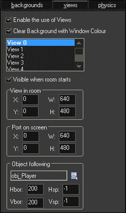
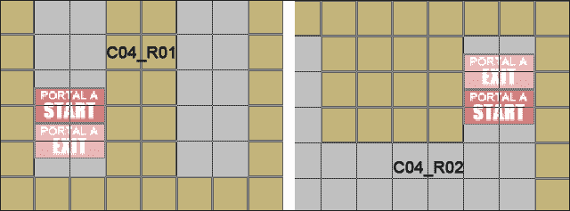
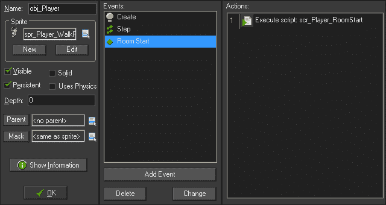
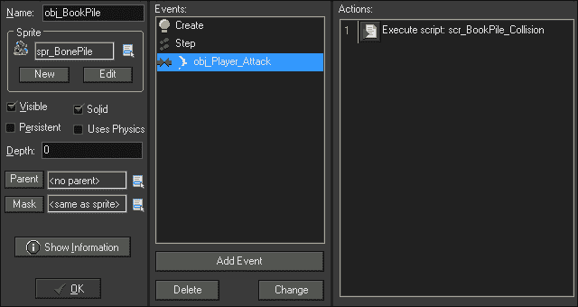
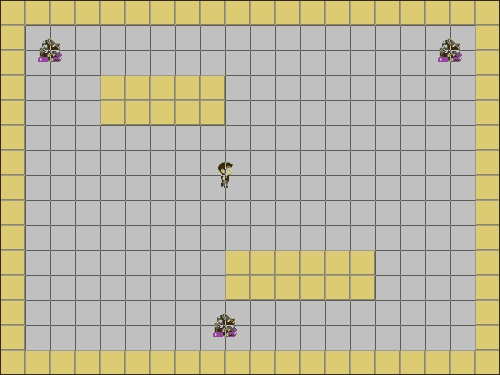
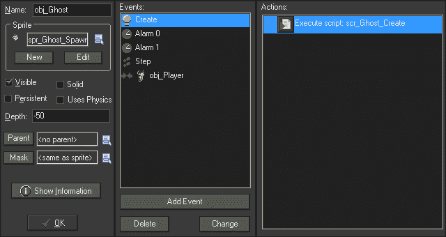

# 第四章，冒险开始

在本章中，我们将创建一个有趣的小动作冒险游戏，它将建立在我们的基础知识之上。我们将从一个动画玩家角色开始，这个角色可以在世界上导航并进行近战攻击。游戏世界将由多个房间组成，玩家可以在保留所有数据的同时从一个房间移动到另一个房间。我们将在单个脚本中放置播放器控件的所有代码并处理墙碰撞，以创建更高效的项目。

从下一个截图可以看出，这个游戏的主题是高中的恐怖，世界上有三个基本人工智能的敌人：幽灵图书馆员、斗殴和教练。如果玩家靠近其休息地，幽灵图书管理员将出现，并将追逐玩家，直到玩家离得太远，然后返回到其来源地。斗殴会在房间里的一条小路上游荡，如果它发现了玩家，它的大小和速度都会增加。教练是奖杯的保护者，将独自驾驶世界。如果它看到了球员，它会在避开墙壁和其他教练的同时追逐，如果距离足够近，它会对球员进行近战攻击。


# 制作动画人物

到目前为止，我们创建的玩家对象非常基本。在[第 1 章](0.html "Chapter 1. Getting to Know the Studio with Your First Game")*中，玩家通过您的第一个游戏*了解工作室时，没有动画。在[第三章](2.html "Chapter 3. Shoot 'em Up: Creating a Side-scrolling Shooter")*拍摄他们：制作一个侧滚射击游戏*中，飞船有动画，但始终面向右侧。在本章中，我们将有一个可以在四个方向移动的角色，每个方向都有一个动画精灵。我们还将实施近战攻击，可以在角色面对的方向上使用。

## 简化人物动作

玩家角色的行走循环需要四个独立的精灵。我们将遍历第一个，然后您可以创建其他三个。

1.  让我们从创建一个名为`Chapter_04`的新项目开始。
2.  创建一个精灵并将其命名为`spr_Player_WalkRight`。
3.  加载`Chapter 4/Sprites/ Player_WalkRight.gif`并检查**移除背景**。
4.  将**原点**设为**中心**。
5.  Click on **Modify Mask** to open the **Mask Properties** editor, and select the radio button of **Full image** under **Bounding Box**. The will set the collision box to be the entire sprite as shown in the following screenshot:

    

6.  点击**确定**。重复此过程加载`spr_Player_WalkLeft`、`spr_Player_WalkUp`和`spr_Player_WalkDown`。
7.  创建一个对象`obj_Player`，并将`spr_Player_WalkRight`指定为精灵。实际上，我们在这里设置的是哪个玩家精灵并不重要，因为我们将使用代码来更改显示的精灵。
8.  We need to set up some initial variables, so create a new Script, `scr_Player_Create`, and write the following code:

    ```html
    mySpeed = 4;
    myDirection = 0;
    isAttacking = false;
    isWalking = false;
    health = 100;
    image_speed = 0.5;
    ```

    前两个变量是球员速度和方向的占位符。这将是有用的，因为我们可以影响这些值，而不会影响对象的局部`mySpeed`和`myDirection`变量，例如对象朝一个方向移动而朝另一个方向移动的击退效应。变量`isAttacking`将用于指示我们何时开始战斗，`isWalking`将指示玩家何时移动。接下来，我们有一个全局变量`health`，它被设置为 100%。最后，我们将动画速度设置为 50%，以便正确播放行走循环。

    ### 注

    要了解更多关于 GameMaker:Studio 的内置变量和功能，请点击**帮助****内容**查看 GameMaker 用户手册。

9.  Now we can go onto the player movement. Instead of having multiple scripts for each key, we are going to simplify the code by placing all the controls into a single script. Create a new Script, `scr_Player_Step`, and we will start with the following code:

    ```html
    isWalking = false;
    if (keyboard_check(vk_right) && place_free(x + mySpeed, y))
    {
        x += mySpeed;
        myDirection = 0;
        sprite_index = spr_Player_WalkRight;
        isWalking = true;
    }
    ```

    我们首先将`isWalking`设置为`false`，这样它就成为玩家正在做的事情的默认状态。之后，我们检查键盘是否有右箭头键（`vk_right`），当前按下，并检查当前位置右侧是否有实体。`place_free`函数返回指定点是否无碰撞。如果播放机能够移动并且按键被按下，我们将向右移动并将方向设置为零以指示向右。我们将精灵更改为右向行走循环，然后将`isWalking`更改为`true`，这将覆盖我们将其设置为`false`的第一行代码。

10.  对其余三个方向中的每个方向重复此代码，并进行相应调整。每个人都应该看看握着的是什么钥匙，看看前方是否有碰撞。
11.  We have one more thing to do before the movement controls are complete. If the player is not moving, we want the animation to stop and start playing again once it starts moving. At the end of the script, add the following code:

    ```html
    if (isWalking == true)
    {
        image_speed = 0.5;
    } else {
        image_speed = 0;
    }
    ```

    我们创建了变量`isWalking`在行走和停止状态之间切换。如果玩家正在移动，精灵将设置动画。如果播放器没有移动，我们也会停止动画。

    代码完成后应如下所示：

    ```html
    isWalking = false;
    if (keyboard_check(vk_right) && place_free(x + mySpeed, y))
    {
        x += mySpeed;
        myDirection = 0;
        sprite_index = spr_Player_WalkRight;
        isWalking = true;
    }
    if (keyboard_check(vk_up) && place_free(x, y - mySpeed))
    {
        y -= mySpeed;
        myDirection = 90;
        sprite_index = spr_Player_WalkUp;
        isWalking = true;
    }
    if (keyboard_check(vk_left) && place_free(x - mySpeed, y))
    {
        x -= mySpeed;
        myDirection = 180;
        sprite_index = spr_Player_WalkLeft;
        isWalking = true;
    }
    if (keyboard_check(vk_down) && place_free(x, y + mySpeed))
    {
        y += mySpeed;
        myDirection = 270;
        sprite_index = spr_Player_WalkDown;
        isWalking = true;
    }
    if (isWalking == true)
    {
        image_speed = 0.5;
    } else {
        image_speed = 0;
    } 
    ```

12.  Apply these scripts to the appropriate events, a **Create** event for `scr_Player_Create`, and a **Step** event for `scr_Player_Step`.

    玩家已经准备好正确移动和设置动画，但是如果不添加一些坚实的障碍，我们将无法完全测试代码。让我们做一堵墙。

13.  创建一个新精灵，`spr_Wall`，加载`Chapter 4/Sprites/Wall.png`，取消选中**删除背景**。我们使用的是 PNG 文件，因为这面墙是略微透明的，这在我们以后装饰房间时会很有用。
14.  创建一个新对象`obj_Wall`，并将精灵设置为`spr_Wall`。
15.  勾选**固体**框。墙现在被标识为可碰撞对象。
16.  创建一个新房间并将其命名为`Sandbox`。我们将使用这个房间来测试功能。
17.  在房间中央的某个地方放置一个`obj_Player`实例。
18.  Place instances of `obj_Wall` around the perimeter of the room, and add a few extra sections as can be seen in the following screenshot:

    

19.  运行游戏。在这一点上的玩家应该能够在开放区域内自由地在房间内走动，并在与墙壁碰撞时停止。

## 实施近战攻击

现在我们有了玩家移动功能，我们可以开始进攻了。我们正在创建的攻击只需要影响玩家角色前面的对象。为了实现这一点，我们将创建一个近战攻击对象，该对象将根据命令生成并自行从游戏中移除。

1.  创建一个精灵`spr_Player_Attack`，并加载`Chapter 4/Sprites/Player_Attack.gif`并选中**移除背景**。这是一个动画精灵，将代表一个摇摆的近战攻击。
2.  我们希望碰撞区域影响精灵的整个高度，而不是整个宽度。点击**修改掩码**上的，在**掩码属性**编辑器中，选择**边界框**下**手动**单选按钮。
3.  Adjust the **Bounding Box** values for **Left**: `0`, **Right**: `24`, **Top**: `0` and **Bottom**: `4`. The end result should look like the following screenshot. Click on **OK**.

    

4.  我们希望这个对象总是在玩家前面生成。确保这一点的最简单方法之一是让该对象随播放器一起旋转。为此，将**原点**设置为**X:**`-16`**Y:**`24`。将 X 坐标设置为左侧意味着该对象在生成时将有 16 个像素的偏移。然后我们可以旋转攻击以匹配玩家的方向。
5.  创建一个对象`obj_Player_Attack`，并指定`spr_Player Attack`作为其精灵。
6.  将**深度**设置为`-100`。**深度**确定一个对象的实例是在另一个对象的后面还是上面绘制在屏幕上。将其设置为负值意味着它将绘制在具有更高深度值的任何对象的顶部。将该值设置为`-100`允许我们拥有其他深度在默认`0`和`-99`之间的对象，而无需担心以后重新调整。
7.  Create a new Script, `scr_Player_Attack_Create` with the following code:

    ```html
    image_angle = obj_Player.myDirection;
    image_speed = 0.3;
    alarm[0] = 6;
    obj_Player.isAttacking = true;
    ```

    在这里，我们旋转图像，使其面向与播放器相同的方向，设置偏移原点意味着它将位于播放器前面。我们还降低了动画速度，并为六帧设置了警报。此警报将在其关闭时移除攻击对象。最后我们告诉玩家它正在进攻。

8.  在`obj_Player_Attack`中添加**创建**事件并附加此脚本。
9.  Let's move onto the alarm script, `scr_Player_Attack_Alarm`. It will not only need to remove the attack, but it also needs to let the player know that it is gone and that they can attack once again. We only need two lines of code to do all this:

    ```html
    obj_Player.isAttacking = false;
    instance_destroy();
    ```

    我们可以直接与玩家的`isAttacking`变量对话，并将其设置回`false`。然后我们摧毁近战攻击的实例。将此脚本附加到**报警 0**事件。

10.  All we need to do now is to get the player to spawn an instance of the attack. Reopen `scr_Player_Step` and at the bottom, add the following code:

    ```html
    if (keyboard_check_pressed(ord('Z')) && isAttacking == false)
    {
        instance_create(x, y, obj_Player_Attack);
    }
    ```

    `keyboard_check_pressed`功能仅在按键实际按下动作时激活，而不是处于向下位置，在这种情况下，我们正在检查*Z*键。键盘上的各种字母没有特殊的命令，因此我们需要使用`ord`函数，该函数为已传递的字符返回相应的 ASCII 码。我们也会检查球员目前是否还没有进攻。如果这都是真的，我们就会产生攻击，并且该攻击会将`isAttacking`变量更改为真，因此这种情况只发生一次。

    ### 注

    使用`ord`功能时，请务必使用大写字母，否则可能会给出错误的数字！

11.  Run the game. You should be able to tap the *Z* key and see the distinctive swinging motion in front of the player no matter which way the character is facing as shown in the following screenshot. The player is now ready for battle!

    

# 在房间之间导航

如果所有的事情都发生在一个非常大的房间里，那么冒险游戏将非常无聊。它不仅效率不高，而且世界也将缺乏探索的感觉。从一个房间切换到另一个房间很容易，但确实会带来问题。

第一个问题是在一个房间和另一个房间之间保留玩家的统计信息，比如健康状况。一种解决方案是在播放器上激活**持久性**。持久性意味着我们只需要将一个对象的单个实例放在一个房间中，从那时起，它将保留在游戏世界中。

第二个问题是在一个有多个入口的房间里放置玩家的位置。如果玩家不坚持，我们可以把玩家放在房间里，但总是从同一个地方开始。如果玩家是持久的，那么当他们改变房间时，他们将保持在与前一个房间完全相同的坐标。这意味着我们需要将球员重新安置到我们在每个房间选择的位置。

如果你的游戏有很多空间，这可能会是一个很大的工作。有一个简单的方法来解决这个问题，创建自我感知的传送者和使用房间创建代码。

## 设置房间

让我们从建造几个房间开始，从标题屏幕开始。

1.  创建一个新房间，在**设置**中，将其命名为`TitleScreen`。
2.  创建一个新的背景`bg_Title`，并在`Chapter 4/Backgrounds/Title.png`中加载未选中的**移除背景**。
3.  在`TitleScreen`的**背景**页签中，将`bg_Title`应用为**背景 0**并勾选**开始时可见**。
4.  创建另一个房间并将其命名为`C04_R01`。此处的名称代表章节和房间，如第 4 章第 1 房间所示。
5.  将**宽度**和**高度**设置为`1024`。这将使我们有很多空间去探索。
6.  我们不希望同时看到房间中的所有内容，因此需要约束视图。点击**视图**选项卡，选中**启用视图**的复选框。选择**视图 0**并勾选**在房间启动时可见的框**。这将激活房间的摄像头系统。
7.  We will also want the view to focus on the player and move with it. Still in the **Views** tab, select `obj_Player` under **Object following** and set **Vbor:** and **Hbor:** to `200`. This will make the camera follow the player and leave a buffer of 200 pixels around the edges of the view. Look at the following screenshot to ensure you have everything set up correctly:

    

8.  再创建两个房间`C04_R02`和`C04_R03`，设置与我们刚才使用的`C04_R01`相同。
9.  In the Resource tree, reorder the room by dragging `Sandbox` down to the bottom and `TitleScreen` to the very top. It should look like the following screenshot:

    

10.  Finally with all three rooms, create a labyrinth using the wall objects. The design isn't important at the moment; just make sure that the player would be able to get from one side to the other. An example of what it could look like can be seen in the following screenshot:

    

## 创建房间门户

为了更换房间我们将创建可重用的门户。实际上，每个入口由两个独立的对象组成，一个**开始**对象和一个**退出**对象。“开始”对象将表示当玩家进入房间时应放置在哪里的着陆平台。退出对象是改变玩家所在房间的传送器。我们将利用四个独特的门户，这将允许我们在地图的每一边都有一扇门，如果我们愿意的话。

1.  For the room teleportation system to work we are going to need to use some global variables, which need to be initialized at the start of the game. Create a new Script, `scr_Globals_StartGame`, with the following code:

    ```html
    global.portalA = 0;
    global.portalB = 0;
    global.portalC = 0;
    global.portalD = 0;
    global.lastRoom = C04_R01;
    ```

    我们为四个门户创建全局变量，并给它们一个零值作为开始。我们还记录了我们在的最后一个房间，这样我们就知道在新房间里我们需要进入哪个门户。

2.  创建新对象`obj_Globals`，添加**游戏开始**事件，并附加此脚本。此对象不需要精灵，因为它只是一个数据对象。
3.  将一个`obj_Globals`实例放入`TitleScreen`中。
4.  We need to be able to enter the game from the title screen, so let's create a quick fix by adding a **Draw** event and creating a new Script, `scr_Globals_Draw`, and with this code add the following:

    ```html
    draw_set_color(c_white);
    draw_set_halign(fa_center);
    draw_text(room_width/2, 360, "Press ANY key");
    if (keyboard_check_pressed(vk_anykey))
    {
        room_goto_next();
    }
    ```

    在这里，我们只是写一些白色的，居中的文本，让玩家知道他们可以如何开始游戏。我们使用特殊变量`vk_anykey`查看键盘是否被按下，如果被按下，我们将按照资源树中的顺序转到下一个房间。

    ### 注

    您不必总是关闭脚本，因为即使打开多个脚本窗口，游戏也会运行。

5.  让我们制作一些门户！创建一个新精灵，`spr_Portal_A_Start`，加载`Chapter 4/Sprites/Portal_A_Start.png`，取消选中**删除背景**。将原点居中，然后单击**确定**。
6.  创建一个新对象`obj_Portal_A_Start`，将精灵设置为`spr_Portal_A_Start`。这是当玩家进入房间时，我们将移动玩家的着陆平台。它不需要任何代码，所以点击**确定**。
7.  创建一个新的精灵`spr_Portal_A_Exit`，加载`Chapter 4/Sprites/Portal_A_Exit.png`，取消选中**删除背景**，原点居中。
8.  创建一个新对象`obj_Portal_A_Exit`，并相应地设置精灵。这是真正的传送者，我们将在与玩家发生碰撞时更换房间。
9.  For an `obj_Player` event, create a new Script, `scr_Portal_A_Exit_Collision`, and write the following code:

    ```html
    global.lastRoom = room;
    room_goto(global.portalA);
    ```

    在传送之前，我们需要将最后一个房间设置为玩家当前所在的房间。为此，我们使用内置变量`room`，它存储游戏当前显示的房间的索引号。之后，我们进入该门户的全局变量指示我们应该进入的房间。

10.  对门户 B、C 和 D 重复步骤 5 到 9，确保更改所有适当的值以反映正确的门户名称。

门户已完成，我们可以将它们添加到房间中。没有必要在每个房间使用所有四个入口；你只需要最少一次启动和一次退出。在房间中放置这些对象时，必须只使用一个相同类型的入口。起始入口应始终位于可播放区域，并确保只能从一个方向进入出口。您还应该确保，如果一个房间底部有**入口 A**，那么它要进入的房间顶部应该有**入口 A**，如下面的屏幕截图所示。这将帮助玩家了解他们在世界上的位置。



现在是有趣的部分。我们需要更改每个房间中的全局门户值，我们不希望有一个庞大的脚本来检查所有房间以查看发生了什么。相反，我们可以在房间中使用**创建代码**，在玩家进入时更改这些值。让我们通过将`C04_R01`中的门户 A 转到`C04_R02`来尝试这一点，反之亦然。

1.  In the `C04_R01` **Settings** tab, click on **Creation Code** to open a code editor and write the following code:

    ```html
    global.portalA = C04_R02;
    global.portalB = 0;
    global.portalC = 0;
    global.portalD = 0;
    ```

    我们将**入口 A**设置为第二个房间。所有其他门户都没有被使用，所以我们将变量设置为零。每个房间都需要将所有这些变量设置为某个值，可以是特定房间，也可以是零，否则可能会导致错误。

2.  在`C04_R02`**设置**页签中，点击**创建代码**打开代码编辑器，编写以下代码：

    ```html
    global.portalA = C04_R01;
    global.portalB = 0;
    global.portalC = 0;
    global.portalD = 0;
    ```

现在，我们将入口 A 设置为第一个房间，这很有意义。如果我们通过那个入口，我们应该能够通过它返回。您可以随意更改这些设置，以应用于您想要的所有门户。

## 传送一个执着的玩家

所有的房间都已建成，可以使用了。留给我们的就是让玩家从一个房间移动到另一个房间。让我们从让玩家持久化开始，这样我们在游戏中只需要一个。

1.  打开`obj_Player`并检查**持续**。
2.  Next, we need to relocate the player to the proper portal. We will create a new Script, `scr_Player_RoomStart`, with this code on a **Room Start** event for `obj_Player`.

    ```html
    if (global.lastRoom == global.portalA)
    {
        obj_Player.x = obj_Portal_A_Start.x;
        obj_Player.y = obj_Portal_A_Start.y;
    } else if (global.lastRoom == global.portalB) {
        obj_Player.x = obj_Portal_B_Start.x;
        obj_Player.y = obj_Portal_B_Start.y;
    } else if (global.lastRoom == global.portalC) {
        obj_Player.x = obj_Portal_C_Start.x;
        obj_Player.y = obj_Portal_C_Start.y;
    } else if (global.lastRoom == global.portalD) {
        obj_Player.x = obj_Portal_D_Start.x;
        obj_Player.y = obj_Portal_D_Start.y;
    } 
    ```

    当玩家进入一个房间时，我们会检查哪个入口与玩家刚刚离开的房间相关联。然后我们将玩家移动到相应的着陆平台。为确保播放器构建正确，其属性应如以下屏幕截图所示：

    

3.  将玩家的一个实例放入`C04_R01`。不要将玩家放在任何其他房间，否则您将在游戏中得到该玩家的多个实例。
4.  运行游戏。我们应该能够在第一个房间周围移动，通过入口 A，进入第二个房间的入口 A 着陆平台。有了这个系统，一个游戏可以有数百个房间，而且只需要管理四个入口。

# 复活敌人

敌人不仅仅是需要避免的障碍。好的敌人给玩家一种潜在的**人工智能**（**人工智能**）的感觉。敌人似乎知道你什么时候在附近，他们可以围着墙追你，自己四处游荡。在本章中，我们将创造三种居住在这个世界上的生物，每种生物都有自己独特的 AI。

## 召唤幽灵图书管理员

第一个生物将由两部分组成：过期的书堆和保护它的幽灵图书管理员。如果玩家靠近书堆，一个鬼魂将产生并追逐玩家。如果玩家离鬼魂太远，鬼魂将返回产生它的书堆。如果玩家攻击鬼魂，它将消失并从书堆中重生。如果玩家摧毁书堆，它产生的幽灵也将被摧毁。

1.  让我们从书堆开始。创建一个新的精灵`spr_BookPile`，并在`Chapter 4/Sprites/BookPile.gif`中加载选中了**移除背景**的精灵。
2.  将原点居中，点击**确定**。
3.  我们还需要一个可怕的噪音来提醒玩家注意危险。创建一个新声音`snd_GhostMoan`并加载`Chapter 4/Sounds/GhostMoan.wav`。点击**确定**。
4.  创建一个新对象`obj_BookPile`，并将`spr_BookPile`指定为精灵。
5.  我们不希望玩家能够穿过书堆，所以请勾选**固体**框。
6.  We will need to initialize some variables, so create a new Script, `scr_BookPile_Create`, and write the following code:

    ```html
    myRange = 100;
    hasSpawned = false;
    ```

    第一个变量设置玩家激活所需的距离值，第二个变量为布尔值，用于确定此书堆是否产生了鬼。

7.  添加一个**创建**事件并应用此脚本。
8.  Next we need a new Script, `scr_BookPile_Step`, which will be applied to a **Step** event and contain the following code:

    ```html
    if (instance_exists(obj_Player))
    {  
        if (distance_to_object(obj_Player) < myRange && hasSpawned == false)
        {
            ghost = instance_create(x, y, obj_Ghost);
            ghost.myBooks = self.id;
            sound_play(snd_GhostMoan);
            hasSpawned = true;
        }     
    }
    ```

    代码的第一行非常重要。在做其他事情之前，我们先检查一下玩家是否存在。如果玩家确实存在，我们检查到玩家对象的距离是否在范围内，以及这个书堆是否产生了幽灵。如果玩家在射程内并且没有产生任何东西，我们会产生一个幽灵。我们还将使用`self`变量将这个书堆的唯一 ID 发送到 ghost 中，以便它知道它来自何处。接下来我们播放幽灵呻吟的声音，确保它不会循环。最后，我们通过将`hasSpawned`变量更改为`true`来表示我们已经生成了一个幽灵。

9.  The only element remaining is to add an `obj_Player_Attack` event with a new Script, `scr_BookPile_Collision`, and write the following code:

    ```html
    if (instance_exists(ghost))
    {
        with (ghost)
        {
            instance_destroy();
        }
    }
    instance_destroy();
    ```

    再一次，我们首先检查是否有鬼魂从这堆书堆中产生，并且仍然存在。如果是的话，我们就消灭那个鬼魂，然后把书堆本身移走。书堆现在已完成，应如以下屏幕截图所示：

    

10.  现在我们需要建造幽灵。为此，我们需要引入两个精灵，一个用于产卵，一个用于追逐。创建精灵，选中`spr_Ghost`和`spr_Ghost_Spawn`中的**移除背景**，分别加载`Chapter 4/Sprites/Ghost.gif`和`Chapter 4/Sprites/Ghost_spawn.gif`。
11.  在两个精灵中，将原点居中。
12.  将**深度：**区域设置为`-50`，这样幽灵将出现在大多数对象上，但在玩家攻击对象下方。我们没有其他需要做的事情，所以点击**确定**。
13.  创建一个新对象`obj_Ghost`，并应用`spr_Ghost_Spawn`作为精灵。这将使生成动画成为初始精灵，然后我们将通过代码将其更改为常规鬼。
14.  我们需要在新脚本`scr_Ghost_Create`中初始化几个变量，如以下代码所示：

    ```html
    mySpeed = 2;
    myRange = 150;
    myBooks = 0;
    isDissolving = false;
    image_speed = 0.3; 
       alarm[0] = 6;
    ```

15.  我们为移动速度、鬼魂将跟踪的范围、产生鬼魂的人（我们将通过书堆进行更改）设置变量，并为鬼魂是否返回书堆设置变量。请注意，重影的范围大于书堆的范围。这将确保幽灵立即开始追逐玩家。然后，我们设置动画速度并为六个步骤设置警报，我们将使用这些步骤来更改精灵。
16.  添加一个**Alarm0**事件，然后应用一个新脚本`scr_Ghost_Alarm0`，该脚本包含以下代码行以更改精灵：

    ```html
    sprite_index = spr_Ghost;
    ```

我们现在准备开始实施一些人工智能。鬼魂将是最基本的敌人，它将追逐玩家穿过房间，包括穿过墙壁和其他敌人，直到玩家离开射程。在这一点上，鬼魂将浮回它来自的书堆。

1.  We will start with chasing the player. Create a new script, `scr_Ghost_Step`, and write the following code:

    ```html
    if (instance_exists(obj_Player))
    {
        targetDist = distance_to_object(obj_Player)
        if (targetDist < myRange)
        {       
            move_towards_point(obj_Player.x, obj_Player.y, mySpeed);
        }   
    }
    ```

    在检查以确保播放器处于活动状态后，我们创建一个变量，该变量将保持从幽灵到播放器的距离。我们之所以创建了一个`targetDist`变量，是因为我们会多次需要这个信息，这样我们就不必在每次有`if`语句时都重新检查距离。然后，我们将距离与追逐范围进行比较，如果玩家在范围内，我们将向玩家移动。`move_towards_point`函数计算方向，并向该方向的对象应用速度。

2.  添加一个**步骤**事件并应用此脚本。我们将继续向这个脚本添加代码，但它已经可以正常工作了。
3.  Let's take a moment to test everything we have done so far. First, in the Resource tree, move `Sandbox` up to the near top, so that it is the room immediately after the title screen. Open the `Sandbox` room and place a couple of instances of `obj_BookPile` around the edges as shown in the following screenshot:

    

4.  运行游戏。如果你离书堆太近，一个鬼魂就会从书堆中诞生，它会慢慢地追逐玩家。如果玩家离鬼魂太远，鬼魂将继续朝着它最后一个方向移动，并最终离开屏幕。
5.  Let's get the Ghost to return to its BookPile. In `scr_Ghost_Step`, within the braces for the player existence check, add the following code:

    ```html
    else if (targetDist > myRange && distance_to_point(myBooks.x, myBooks.y) > 4)
    {      
    move_towards_point(myBooks.x, myBooks.y, mySpeed);
    }
    ```

    首先，我们检查玩家是否在射程之外，幽灵是否在自己的书堆附近。这里我们使用的是`distance_to_point`，因此我们要检查的是书堆的原点，而不是`distance_to_object`要寻找的碰撞区域的边缘。如果这一切都是真的，鬼魂将开始移回它的书堆。

6.  让我们再来一次比赛。和以前一样，鬼魂会追逐玩家，如果玩家走得太远，鬼魂会回到书堆。
7.  There is an issue with the fact that the Ghost ends up ping-ponging over the top of the BookPile. This is due to the Ghost having velocity-based speed and not having any code telling it to stop. We can fix this by adding this code after the last `else if` statement:

    ```html
    else 
    {
    speed = 0;
    if (isDissolving == false)
    {
          myBooks.hasSpawned = false;
    sprite_index = spr_Ghost_Spawn;
    image_speed = -1;
    alarm[1] = 6;
    isDissolving = true;
    }
    }
    ```

    这里我们有一个最后的`else`语句，如果玩家在射程之外并且鬼魂靠近它的书堆，将执行该语句。我们先停止鬼魂的速度。然后我们检查它是否能溶解。如果是这样，我们告诉书堆幽灵可以再次繁殖，我们将精灵更改回繁殖动画，通过将`image_speed`设置为`-1`，它将反向播放该动画。我们还设置了另一个警报，这样我们就可以从世界上移除鬼魂，并取消溶解检查。

    整个`scr_Ghost_Step`应该看起来像下面的代码：

    ```html
     if (instance_exists(obj_Player))
    {
        targetDist = distance_to_object(obj_Player)
        if (targetDist < myRange)
        {       
            move_towards_point(obj_Player.x, obj_Player.y, mySpeed);
        } else if (targetDist > myRange && distance_to_point(myBooks.x, myBooks.y) > 4) {      
            move_towards_point(myBooks.x, myBooks.y, mySpeed);
        } else {
            speed = 0;
            if (isDissolving == false)
            {
                myBooks.hasSpawned = false;
                sprite_index = spr_Ghost_Spawn;
                image_speed = -1;
                alarm[1] = 6;
                isDissolving = true;
            }
        }
    }
    ```

8.  One last Script is needed, `scr_Ghost_Alarm1`, that is attached to an **Alarm 1** event and has one line of code to remove the instance:

    ```html
    instance_destroy();
    ```

    幽灵几乎完成了。它产卵，追逐玩家，然后回到它的书堆，但是如果它抓住了玩家会发生什么呢？有了这个鬼魂，我们希望它砸到玩家身上，造成一些伤害，然后消失在一股烟雾中。为此，我们需要为死鬼创建一个新资产。

9.  创建一个新的精灵`spr_Ghost_Dead`，并在`Chapter 4/Sprites/Ghost_Dead.gif`中加载选中了**移除背景**的精灵。
10.  将原点居中，点击**确定**。
11.  创建一个新对象`obj_Ghost_Dead`，并应用精灵。
12.  In a new Script, `scr_Ghost_Dead_AnimEnd`, write the following line of code and attach it to an **Animation End** event:

    ```html
    instance_destroy();
    ```

    当播放精灵的最后一张图像时，**动画结束**事件将执行代码。在这种情况下，我们有一个烟雾动画的 poof，在最后将从游戏中删除对象。

13.  All we need now is to reopen `obj_Ghost` and add an **obj_Player** event with a new script, `scr_Ghost_Collision`, with the following code:

    ```html
    health -= 5;
    myBooks.hasSpawned = false;
    instance_create(x, y, obj_Ghost_Dead);
    instance_destroy();
    ```

    我们先移除五点生命值，然后告诉鬼魂的书堆它可以重生。下一步，我们将创建鬼魂死亡对象，当我们将其从游戏中移除时，它将隐藏真实的鬼魂。如果所有内容都正确构建，则应如以下屏幕截图所示：

    

14.  Run the game. The Ghost should now function exactly as designed. It will spawn and chase the player. If it catches the player it will cause damage and disappear. If the player gets away, the Ghost will return to its BookPile and dissolve out of existence. Great work!

    最后一件事，因为房间是用来做实验的沙箱，而不是实际游戏的一部分，我们应该清理房间，为下一个敌人做准备。

15.  打开`Sandbox`房间，移除所有书堆实例。

## 制造流浪斗殴

我们将创造的下一个敌人是一场在房间里四处游荡的斗殴。如果玩家离敌人太近，斗殴会变得越来越大，移动速度越来越快，尽管它不会离开它的路径。一旦玩家超出射程，它会平静下来，并收缩到原来的大小和速度。玩家将无法杀死这个敌人，但是如果有接触，斗殴将对玩家造成伤害。

对于斗殴，我们将使用一条路径，我们将需要三个精灵：一个用于正常状态，一个用于状态的转换，另一个用于愤怒状态。

1.  创建一个新的精灵`spr_Brawl_Small`，并在`Chapter 4/Sprites/Brawl_Small.gif`中加载选中了**移除背景**的精灵。这是正常状态下的精灵。将原点居中，点击**确定**。
2.  创建另一个新精灵`spr_Brawl_Large`，并加载`Chapter 4/Sprites/Brawl_Large.gif`并选中**移除背景**。我们需要将原点居中，这样争吵将与此图像适当缩放。愤怒状态的大小是正常状态的两倍。
3.  我们还需要在这两种状态之间进行转换，所以让我们创建一个新的精灵，`spr_Brawl_Change`并加载`Chapter 4/Sprites/Brawl_Change.gif`，仍然选中**删除背景**。别忘了将原点居中。
4.  下一步，我们需要一条争吵的道路。创建新路径并将其命名为`pth_Brawl_01`。
5.  我们希望战斗顺利进行，因此在**连接类型**下检查**平滑曲线**，并将**精度**更改为`8`。
6.  To see what we can do with paths, let's make the Path in the shape of a figure eight as can be seen in the following screenshot:

    

7.  让我们也创建一个新的声音`snd_Brawl`，并加载`Chapter 4/Sounds/Brawl.wav`。
8.  创建一个新对象`obj_Brawl`，并应用`spr_Brawl_S`作为默认精灵。
9.  We'll start with initializing some variables in a Create event script, `scr_Brawl_Create`.

    ```html
    mySpeed = 2;
    canGrow = false;
    isBig = false;
    isAttacking = false;
    image_speed = 0.5;
    sound_play(snd_Brawl);
    sound_loop(snd_Brawl);
    path_start(pth_Brawl_01, mySpeed, 1, true);
    ```

    第一个变量设置打架的基本速度。接下来的三个变量是检查转换和愤怒状态，以及是否受到攻击。接下来，我们设置动画速度，然后播放打架声，在这种情况下，我们希望声音循环。最后，我们以两倍的速度将斗殴放在小路上；当它到达路径的末端时，它将循环，最重要的是，路径设置为绝对，这意味着它将根据路径编辑器中的设计运行。

10.  We can now start working on the AI of the Brawl. Create a new script for a **Step** event named `scr_Brawl_Step` and we will start by getting the movement working.

    ```html
    image_angle = direction;
    if (isBig == true)
    {
        path_speed = mySpeed * 2;
    } else {
        path_speed = mySpeed;
    }
    ```

    在这里，我们首先旋转精灵自身，使其朝向正确的方向。这将起作用，因为我们的精灵图像面向右侧，这与零度相同。接下来，我们检查斗殴是否严重。如果斗殴是愤怒版本，我们将路径速度设置为基本速度乘以 2。否则，我们将速度设置为默认的基本速度。

11.  在房间的任何地方放置一个斗殴实例，然后运行游戏。斗殴应该围绕着图 8 移动，并正确地面对正确的方向。
12.  Next, we will add in the first transformation, becoming enraged. Right after the previous line of code, add:

    ```html
    if (instance_exists(obj_Player))
    {
        if (distance_to_object(obj_Player) <= 200) 
        {
            if (canGrow == false)
            {
                if (!collision_line(x, y, obj_Player.x, obj_Player.y, obj_Wall, false, true))
                {
                    sprite_index = spr_Brawl_Change;
                    alarm[0] = 12;
                    canGrow = true;
                }      
            }
        }
    }
    ```

    我们首先确定玩家存在，然后检查玩家是否在射程内。如果玩家在射程内，我们检查是否被激怒。如果斗殴还没有扩大，我们使用`collision_line`函数来查看斗殴是否真的可以看到玩家。此函数在两点之间绘制一条线，在本例中为打架的位置和玩家的位置，并确定对象或墙的实例是否穿过该线。如果斗殴可以看到玩家，我们将精灵更改为转换精灵，设置警报以便完成转换，并指示斗殴已经扩大。

13.  让我们为一个**报警 0**事件创建一个脚本`scr_Brawl_Alarm0`，代码将切换到愤怒的精灵，并指示争吵现在已经完全结束。

    ```html
    sprite_index = spr_Brawl_Large;
    isBig = true;
    ```

14.  运行游戏以确保代码正常工作。斗殴应该保持小规模，直到它可以清楚地看到玩家，在这种情况下，它将转化为大规模的，愤怒的斗殴。
15.  We have the Brawl growing larger, now we need to calm it down and have it shrink. Back in `scr_Brawl_Step`, add an `else` statement on the distance check, which would be before the final brace and add the following code:

    ```html
    else 
    {
    if (canGrow == true)
    {
    sprite_index = spr_Brawl_Change;
    alarm[1] = 12;
    canGrow = false;
    }
    }
    ```

    如果玩家超出范围，此`else`语句将激活。我们检查斗殴是否仍在激化。如果是，我们将精灵更改为转换，设置第二个警报，并指示斗殴恢复正常。

    以下是完整的`scr_Brawl_Step`脚本：

    ```html
    image_angle = direction;
    if (isBig == true)
    {
        path_speed = mySpeed * 2;
    } else {
        path_speed = mySpeed;
    }

    if (instance_exists(obj_Player))
    {
        if (distance_to_object(obj_Player) <= 200) 
        {
            if (canGrow == false)
            {
                if (!collision_line(x, y, obj_Player.x, obj_Player.y, obj_Wall, false, true))
                {
                    sprite_index = spr_Brawl_Change;
                    alarm[0] = 12;
                    canGrow = true;
                }      
            }
        } 
        else 
        {
            if (canGrow == true)
            {
                sprite_index = spr_Brawl_Change;
                alarm[1] = 12;
                canGrow = false;
            }
        }
    }
    ```

16.  复制`scr_Brawl_Alarm0`脚本，将其命名为`scr_Brawl_Alarm1`，并调整值，如下代码所示。记住将其添加为**报警 1**事件。

    ```html
    sprite_index = spr_Brawl_Small;
    isBig = false;
    ```

17.  运行游戏，确认当玩家靠近并在视线范围内时，斗殴会变得更大、更快，当超出范围时，斗殴会恢复正常。
18.  The only thing we have left is the attack. Create a new Script, `scr_Brawl_Collision`, for a **obj_Player** event with the following code:

    ```html
    if (isAttacking == false)
    {
        health -= 10;
        alarm[2] = 60;
        isAttacking = true;
    }
    ```

    如果玩家第一次与斗殴发生冲突，我们将移除 10 点生命值，并设置两秒警报，让斗殴再次攻击。

19.  To wrap up the Brawl, all we need is the final **Alarm 2** event with a new Script, `scr_Brawl_Alarm2`, that contains the following line of code:

    ```html
    isAttacking = false;
    ```

    这场斗殴现在已经完成，并按计划进行。如果所有内容都正确实现，则对象属性应如以下屏幕截图所示：

    

20.  从`Sandbox`房间中移除任何`obj_Brawl`实例，以便我们可以为最终敌人重新开始。

## 创建 Coach

我们将创造的最后一个敌人，教练，将是迄今为止最具挑战性的对手。这个敌人将在房间里四处移动，随机地从一个奖杯移动到另一个奖杯，以确保它仍然存在。如果它看到玩家，它会追逐他们，如果它足够靠近，它会进行近战攻击。如果玩家逃跑，它将等待片刻再返回任务。教练有一个身体，所以他需要绕过障碍物，甚至避开其他教练。这也意味着如果玩家能够攻击它，它可能会死亡。

1.  由于这个敌人在守卫什么东西，我们将从创造奖杯开始。创建一个新的精灵`spr_Trophy`，并在`Chapter 4/Sprites/Trophy.gif`中加载选中了**移除背景**的精灵。
2.  创建一个新对象`obj_Trophy`，并应用`scr_Trophy`作为其精灵。
3.  由于这是一个动画精灵，我们希望添加一个**创建**事件，并通过在新脚本中编写以下代码`scr_Trophy_Create`：

    ```html
    image_speed = 0;
    image_index = 0;
    ```

    使其不具有动画效果
4.  This is all we need for now for the trophy, so click on **OK**.

    就像玩家一样，我们需要四个精灵来控制敌人移动的四个方向。

5.  创建一个新的精灵`spr_Coach_WalkRight`，并在`Chapter 4/Sprites/Coach_WalkRight.gif`中加载**移除背景**复选框。
6.  居中原点，点击**修改遮罩**，勾选**边框**下的**全图**。
7.  对`spr_Coach_LWalkLeft`、`spr_Coach_WalkDown`和`spr_Coach_WalkUp`精灵重复此过程。
8.  Create a new Object, `obj_Coach`, and apply `spr_Coach_WalkRight` as its Sprite.

    我们将动态地为这个敌人创建路径，以便它能够自己导航到奖杯。我们还希望它能够避开障碍和其他敌人。这并不太难实现，但需要在初始化时进行大量设置。

9.  Create a new Script, `scr_Coach_Create`, apply it to a **Create** event, and then we will start with some basic variables:

    ```html
    mySpeed = 4;
    isChasing = false;
    isWaiting = false;
    isAvoiding = false;
    isAttacking = false;
    image_speed = 0.3;
    ```

    我们再次从设置对象的速度开始。然后我们有四个变量，代表我们需要检查的各种状态，都设置为`false`。我们还为精灵设置动画速度。

    接下来我们需要建立路径系统，该系统将利用 GameMaker 的**运动规划**功能。这里的基本概念是，我们创建一个网格，覆盖我们希望能够移动敌人的区域。然后，我们找到所有我们希望敌人避开的物体，如墙壁，并将网格中的这些区域标记为禁止区域。然后，我们可以在自由区域中指定起点和终点位置，并在它们之间创建一条路径，同时避开障碍物。

10.  Still in `scr_Coach_Create`, add the following code to the end of the script:

    ```html
    myPath = path_add();
    myPathGrid = mp_grid_create(0, 0, room_width/32, room_height/32, 32, 32);
    mp_grid_add_instances(myPathGrid, obj_Wall, false);
    ```

    首先需要一条空路径，我们可以将其用于所有未来路径。接下来，我们将创建一个网格，用于设置路径贴图的尺寸。`mp_grid_create`属性的参数包括它在世界上的位置、宽度和高度的网格数以及每个网格单元的大小。在本例中，我们从左上角的网格开始，以 32 像素的增量覆盖整个房间。将房间尺寸除以 32 意味着这将适用于任何大小的房间，而无需调整代码。最后，我们获取房间中找到的所有墙实例，并将其添加到网格中，作为不允许路径的区域。

11.  Now, we need to find a destination for the Coach to go. Continue adding the following code at the end of the script:

    ```html
    nextLocation = irandom(instance_number(obj_Trophy)-1);
    target = instance_find(obj_Trophy, nextLocation);
    currentLocation = nextLocation;
    ```

    我们首先根据房间里奖杯的数量得到一个四舍五入的随机数。注意，我们从奖杯的数量中减去了一个。我们需要这样做，因为在下面的代码行中，我们正在使用`instance_find`函数搜索特定实例。此函数从数组中提取，数组中的第一项始终以零开头。最后，我们创建了第二个变量，用于何时更改目的地。

12.  All we have to do now is make a path and use it. Add the following code at the end of the script:

    ```html
    mp_grid_path(myPathGrid, myPath, x, y, target.x, target.y, false);
    path_start(myPath, mySpeed, 0, true);
    ```

    在这里，我们选择我们创建的网格和空路径，并创建一条从 Coach 位置到目标位置的新路径，该路径不会沿着对角线。然后我们让马车开动，这一次，当它到达路的尽头时，它会停下来。`path_start`函数中的最终值将路径设置为绝对值，在本例中，由于路径是动态创建的，所以我们需要绝对值。

    以下是整个`scr_Coach_Create`脚本：

    ```html
    mySpeed = 4;
    isChasing = false;
    isWaiting = false;
    isAvoiding = false;
    isAttacking = false;
    image_speed = 0.3;

    myPath = path_add();
    myPathGrid = mp_grid_create(0, 0, room_width/32, room_height/32, 32, 32);
    mp_grid_add_instances(myPathGrid, obj_Wall, false);

    nextLocation = irandom(instance_number(obj_Trophy)-1);
    target = instance_find(obj_Trophy, nextLocation);
    currentLocation = nextLocation;

    mp_grid_path(myPathGrid, myPath, x, y, target.x, target.y, false);
    path_start(myPath, mySpeed, 0, true); 
    ```

13.  Open up Sandbox, and place two instances of `obj_Coach` in the corners and three instances of `obj_Trophy` as seen in the following screenshot:

    

14.  运行游戏。你应该看到教练随机选择一个奖杯并朝它移动。试着重新启动几次，看看每辆车走的是哪条路。
15.  With the basic setup complete, we can move on to the AI. We will start by switching the sprites based on the direction of movement. Create a new Script, `scr_Coach_Step`, apply it to a **Step** event and write the following code:

    ```html
    if (direction > 45 && direction <= 135) { sprite_index = spr_Coach_WalkUp; }
    else if (direction > 135 && direction <= 225) { sprite_index = spr_Coach_WalkLeft; }
    else if (direction > 225 && direction <= 315) { sprite_index = spr_Coach_WalkDown; }
    else { sprite_index = spr_Coach_WalkRight; }
    ```

    在这里，我们根据实例移动时的方向更改精灵。我们可以在这里这样做，因为我们不允许路径上的对角线运动。

16.  Next, we will get the Coach to watch for the player, and if spotted, they will leave their path in pursuit. Add the following code after the Sprite change code:

    ```html
    targetDist = distance_to_object(obj_Player);
    if (targetDist < 150  && targetDist > 16)
    {
        canSee = collision_line(x, y, obj_Player.x, obj_Player.y, obj_Wall, false, false)
        if (canSee == noone)
        {
            path_end();
            mp_potential_step(obj_Player.x, obj_Player.y, 4, all);
            isChasing = true;
        }
     }
    ```

    我们再次使用一个变量来保存播放机距离的值，以节省一些编码时间并最小化函数调用。如果球员在射程内而不是打击距离内，我们会进行视线检查。`collision_line`函数返回该线穿过的任何墙实例的 ID。如果它不与任何墙实例相交，它将返回一个名为`noone`的特殊变量。如果球员在视线范围内，我们结束教练所走的道路，开始向球员移动。`mp_potential_step`功能将使对象在避开障碍物的同时沿所需方向移动，在这种情况下，我们将避开所有情况。最后，我们指出教练正在追逐球员。

17.  This works well for starting the chase, but what if the player escapes? Let's have the Coach wait for a moment and then go back to patrolling. Add an `else` statement to the sightline check with the following code:

    ```html
    else if (canSee != noone && isChasing == true)
    {
        alarm[0] = 60;
        isWaiting = true;
        isChasing = false;
    }
    ```

    此`else`语句表示，如果看不到球员，且教练正在追逐，则会设置一个寻找新目的地的警报，让其等待，追逐结束。

18.  We have set an alarm, so let's create a new Script, `scr_Coach_Alarm0`, and apply it to an **Alarm 0** event. Write the following code in the script:

    ```html
    while (nextLocation == currentLocation)
    {
        nextLocation = irandom(instance_number(obj_Trophy)-1);
    }

    target = instance_find(obj_Trophy, nextLocation);
    currentLocation = nextLocation;

    mp_grid_path(myPathGrid, myPath, x, y, target.x, target.y, false);
    path_start(myPath, mySpeed, 1, false);

    isWaiting = false;
    ```

    我们从`while`循环检查开始，看看下一个位置是否与旧位置相同。这将确保教练总是移动到另一个奖杯。正如我们在初始设置中所做的那样，我们选择一个新目标并设置当前位置变量。我们还创建了一条路径并开始移动，这意味着教练不再等待。

19.  我们还有最后一个元素需要添加到追逐序列中，那就是攻击。如果教练离球员足够近，就应该对球员进行近战攻击。为此，我们需要首先创建一个新的精灵`spr_Coach_Attack`，加载`Chapter 4/Sprites/Coach_Attack.gif`并选中**删除背景**。
20.  就像玩家的攻击一样，将**原点**设置为**X:**`-16`、**Y:**`24`并将**边界框**值调整为**左**：`0`、**右**：`24`、【T18 上、`0`、**下**：`4`。
21.  创建一个新对象`obj_Coach_Attack`，对其应用精灵，并将**深度**设置为`-100`。
22.  添加一个**创建**事件并应用一个新脚本`scr_Coach_Attack_Create`，该脚本带有控制动画速度的代码，设置一个警报以删除实例，以及一个我们可以打开的变量。

    ```html
    image_speed = 0.3;
    alarm[0] = 6;
    isHit = false;
    ```

23.  添加一个带有新脚本`scr_Coach_Attack_Alarm0`的**报警 0**事件，该脚本将删除该实例。

    ```html
    instance_destroy();
    ```

24.  Finally, add an **obj_Player** event, and apply a new Script, `scr_Coach_Attack_Collision` with the following code:

    ```html
    if (isHit == false)
    {
        health -= 15;
        isHit = true;
    }
    ```

    如果这是第一次碰撞，我们将删除一个健康点，然后停用此检查。

25.  We are done with the attack. Now to have it activated in the Coach, reopen `scr_Coach_Step` and add the attack code as an `else if` statement, after the last brace:

    ```html
    else if (targetDist <= 16)
    {
        if (isAttacking == false)
        {
            swing = instance_create(x, y, obj_Coach_Attack);
            swing.image_angle = direction;
            alarm[1] = 90;
            isAttacking = true;
        }
    }
    ```

    如果教练靠近球员并且还没有攻击，我们将创建一个教练攻击的实例。然后，我们旋转攻击精灵，使其面向与教练相同的方向。在再次运行此代码之前，将报警设置为三秒以允许通气孔。

26.  我们需要一个**报警 1**事件来重置攻击，因此创建一个新脚本`scr_Coach_Alarm1`并关闭攻击。

    ```html
    isAttacking = false;
    ```

27.  Run the game. The Coach will now chase the player, and if it gets close enough to the player it will attack.

    教练现在只做了一半的工作，追逐球员。我们还需要增加定期巡逻任务。目前，如果教练没有看到球员，而球员到达了路径的尽头，教练就会停止，不再做任何事情。它应该只等待几秒钟，然后进入下一个奖杯。

28.  Reopen `scr_Coach_Step` and add an `else` statement to the very end of the script with this code:

    ```html
    else 
    {
        if (isWaiting == false)
        {
            if (distance_to_object(target) <= 8) 
            {
                alarm[0] = 60;
                path_end();
                isWaiting = true;
            }
        }
    }
    ```

    此`else`语句表示玩家超出范围。然后我们检查长途汽车是否在等待。如果它没有等待，但距离目标奖杯的距离在 8 像素以内，我们将为选择新目的地设置警报两秒钟，结束路径以停止移动，并声明我们正在等待。

29.  在比赛中，你会看到教练们，当他们没有追逐球员时，会在奖杯附近停下来，暂停片刻，然后移动到另一个奖杯。
30.  There is an issue, however, if both coaches go to the same trophy. Sometimes they will both overlap each other. Let's fix that by adding the following code after the distance check for the trophy:

    ```html
    if (isAvoiding == true)
    {
         mp_potential_step (target.x, target.y, 4, all);
    }
    ```

    我们需要做的第一件事是做一个变量检查，看看教练是否需要避免一些事情。如果是这样，我们将使用`mp_potential_step`函数，该函数将向指定目标移动一个实例，同时尝试避开某些对象，或者在本例中，避开所有实例。

31.  Now, we need to set up the condition for when avoidance should occur. Immediately after the last code is inserted, write the following:

    ```html
     if (distance_to_object(obj_Coach) <= 32 && isAvoiding == false)
     {
         path_end();
         isAvoiding = true;
     }
     else if (distance_to_object(obj_Coach) > 32 && isAvoiding == true)
     {
         mp_grid_path(myPathGrid, myPath, x, y, target.x, target.y, false);
         path_start(myPath, mySpeed, 1, true);
         isAvoiding = false;
     }
    ```

    首先，我们检查 Coach 的实例是否在附近，并且它没有试图避开它。如果这是真的，那么我们就让马车离开它的路径，开始躲避。我们随后发表了一份`else if`声明，检查我们是否离另一辆我们试图避开的教练足够远。如果是这样，我们将设置一条新路径到达目的地，开始在其上移动，并结束回避。

32.  There is still one little issue remaining, which you can see if you run the game for a while. Sometimes two coaches will get too close together and they both stop. This is because they are trying to avoid each other, but are actually touching and can't let go. At the very end of the `scr_Coach_Step` Script, write the following:

    ```html
    if (place_meeting(x, y, obj_Coach))
    {
        x = xprevious;
        y = yprevious;
        mp_potential_step(target.x, target.y, 4, all);
    }
    ```

    这将检查 Coach 的两个实例是否相互碰撞。如果是，我们将`x`和`y`坐标设置为特殊变量`xprevious`和`yprevious`，这表示实例在上一步中的位置。一旦他们后退一步，我们就可以尝试再次绕过他们。

    教练现在完成了。要检查您是否正确编写了`scr_Coach_Step`的所有代码，请将其填写完整：

    ```html
    if (direction > 45 && direction <= 135) { sprite_index = spr_Coach_WalkUp; }
    else if (direction > 135 && direction <= 225) { sprite_index = spr_Coach_WalkLeft; }
    else if (direction > 225 && direction <= 315) { sprite_index = spr_Coach_WalkDown; }
    else { sprite_index = spr_Coach_WalkRight; }

    targetDist = distance_to_object(obj_Player);
    if (targetDist < 150  && targetDist > 16)
    {
        canSee = collision_line(x, y, obj_Player.x, obj_Player.y, obj_Wall, false, false)
        if (canSee == noone)
        {
            path_end();
            mp_potential_step(obj_Player.x, obj_Player.y, 4, all);
            isChasing = true;
        }
        else if (canSee != noone && isChasing == true)
        {
            alarm[0] = 60;
            isWaiting = true;
            isChasing = false;
        }
    }
    else if (targetDist <= 16)
    {
        if (isAttacking == false)
        {
            swing = instance_create(x, y, obj_Coach_Attack);
            swing.image_angle = direction;
            alarm[1] = 90;
            isAttacking = true;
        }
    }
    else 
    {
        if (isWaiting == false)
        {
            if (distance_to_object(target) <= 8)
            {
                alarm[0] = 60;
                path_end();
                isWaiting = true;
            }
            if (isAvoiding == true)
            {
                mp_potential_step(target.x, target.y, 4, all);
            }
            if (distance_to_object(obj_Coach) <= 32 && isAvoiding == false)
            {
                path_end();
                isAvoiding = true;
            }
            else if (distance_to_object(obj_Coach) > 32 && isAvoiding == true)
            {
                mp_grid_path(myPathGrid, myPath, x, y, target.x, target.y, false);
                path_start(myPath, mySpeed, 1, true);
                isAvoiding = false;
            }
        }
    }
    if (place_meeting(x, y, obj_Coach))
    {
        x = xprevious;
        y = yprevious;
        mp_potential_step(target.x, target.y, 4, all);
    }
    ```

# 为游戏添加收尾细节

游戏功能已经完成，但还有一些元素需要改进。首先，玩家受到伤害但不会死亡，也没有**平视显示器**（**HUD**）来显示这一点。让我们快速创建一个霸主。

1.  创建一个新对象`obj_Overlord`，不应用精灵，并检查持久性。
2.  Add a **Draw GUI** event and a new Script for it, `scr_Overlord_DrawGUI`, with the following code:

    ```html
    draw_healthbar(0, 0, 200, 16, health, c_black, c_red, c_green, 0, true, true);

    if (health <= 0)
    {
        with (obj_Player) { instance_destroy(); }
        room_goto(TitleScreen);
        instance_destroy();
    }
    ```

    首先，我们使用函数`draw_healthbar`，您可以看到它有很多参数。前四个是矩形条的大小和位置。接下来是一个变量，在我们的例子中，这个变量是全局健康变量。接下来的三个是背景色和最小/最大颜色。下一个是横杆应该落下的方向，零在左边。最后两个布尔值用于绘制我们想要的背景和边框。

    在那之后，我们做一个健康检查，如果玩家已经死亡，我们将移除玩家，返回前端，然后移除霸王。删除世界上任何持久实例都很重要，否则它们不会消失！

3.  将一个`obj_Overlord`实例放入`C04_R01`中。
4.  在房间里安置各种各样的敌人。如果我们使用打架，我们要么需要创建一个与我们创建的路径一致的房间，要么更好，重新绘制路径以适合我们的房间布局。
5.  Make sure the `Sandbox` room is moved back to the bottom of the Resource tree and run the game. We should see the health bar at the top of the screen and if you take damage, the health bar should go down. If the player takes too much damage, the game will end and return to the frontend.

    剩下的就是创建关卡，用一组瓷砖绘制世界，并添加一些背景音乐。在这一点上，你应该知道如何做到这一点，所以我们将留给你。为此，我们在 `Chapter 4`文件夹中提供了一些额外的资产。完成后，您应该有如下屏幕截图：

    

# 总结

祝贺您完成第二场比赛！我们学习了如何通过将键盘检查和碰撞预测放在一个脚本中来简化播放器控件。我们介绍了几种处理精灵动画的方法，从旋转图像到设置应该显示哪些精灵。我们处理全局变量，并使用它们实现房间转换系统。我们深入讨论了一些新的对象属性和持久性。然后我们花了一些时间通过使用接近检测和路径发现来处理人工智能。我们甚至发现了如何让一个物体在躲避障碍物的同时独自在房间里导航。

通过本章中的技能磨练，您现在将能够构建具有多个房间的游戏，其中敌人似乎在思考。现在轮到你通过添加更多独特的敌人来扩展游戏，打开奖杯并获得战利品。享受乐趣，探索你新发现的能力！

在下一章中，我们将为 platformer 风格的游戏构建一个史诗般的 boss 战斗。会有枪和激光，还有很多乐趣。我们将开始通过创建可重用脚本和学习如何系统地构造代码来提高代码的效率。所有这些都将帮助我们使我们的游戏更快更简单，所以让我们开始吧！