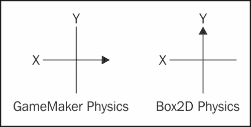
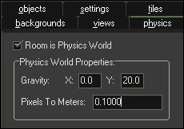
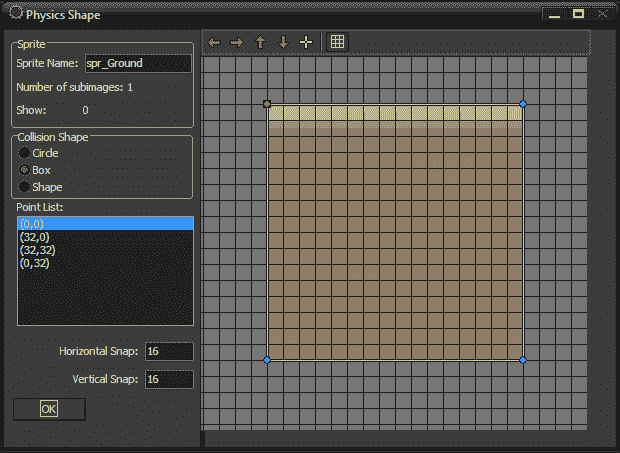
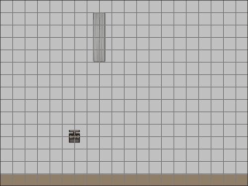
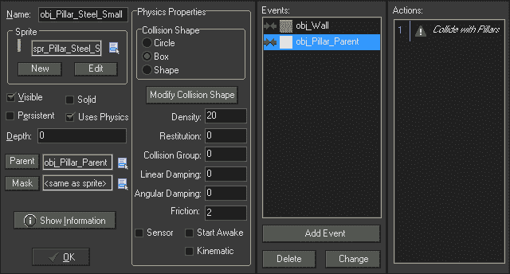
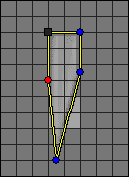
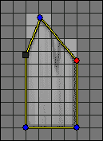
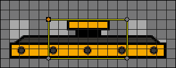
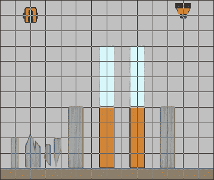
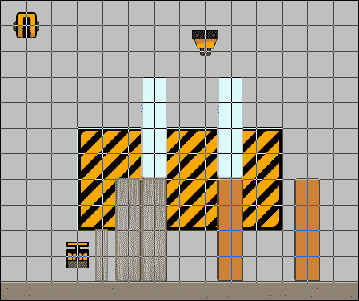

# 六、倒塌的塔楼

在本书的其余部分中，我们将着重于创建一个从概念到完整的、发布的产品的单一游戏。我们将利用迄今为止所学的一切，并将介绍各种附加功能，如 GameMaker:Studio 的物理和粒子系统。我们将建立更多的系统来允许角色对话和资源清册。最后，我们将看看发布游戏的不同方式，包括在 Facebook 上。

在本章中，我们将构建一个基于物理的塔楼倒塌游戏，演示 GameMaker:Studio 对 Box2D 开源物理引擎的实现。它将以各种不同材料制成的塔为特色，如玻璃、木材和钢。游戏的目标是通过使用各种工具摧毁这些塔来清除限制区。我们将制造出向外爆炸的 TNT，一个向下摆动的破坏球，以及一个吸引松散部件的磁铁。最重要的是，所有的碰撞和移动都将由发动机本身完成！

# 了解物理引擎

当构建一个基于物理的游戏时，它需要一种不同的思维方式来思考如何创造事物。到目前为止，我们的重点是通过 X/Y 坐标传送或更改`speed`、`vspeed`和`hspeed`变量将运动应用于实例。当我们使用物理引擎时，这些属性被忽略。相反，系统本身通过对实例施加力来处理运动。该实例将根据其自身特性对力作出反应，并相应地采取行动。

另外，在物理世界中，世界坐标的方向是不一样的。GameMaker 标准物理世界中的零度表示向右，而在Box2D 物理世界中，零度表示向上，如下图所示：



为了全面了解Box2D 物理引擎的工作原理，我们需要了解它由以下四个组件组成：

*   物理世界
*   固定设施
*   关节
*   军队

## 激活世界

就像真实世界一样，物理世界从引力的应用开始。重力的大小将决定物体下落的速度，以及需要多少力来抵消它。在我们可以在游戏中使用任何物理功能之前，我们需要激活世界物理。

1.  让我们开始一个名为`Chapter_06`的新项目。
2.  创建一个新房间，并将其命名为`Sandbox`。我们将仅将此房间用于测试目的。
3.  点击**物理**页签，勾选**房间是物理世界**。
4.  在**物理世界属性**中，将**重力**设置为**X:**`0.0`和**Y:**`20.0`。这将决定世界引力的方向和强度。如果你想得到地球上的重力，我们会将该值设置为**Y:**`9.8`。我们将其设置为`20.0`，因此物体看起来下落更快。
5.  最后，有一个选项可以将**像素设置为米：**。整个物理系统基于真实世界的测量，因此我们需要确定一个像素代表多少个真实世界的米，以便计算准确。我们将保留默认值 0.1 米/像素，或约 10 厘米。

世界现在准备好使用物理引擎了！房间的物理设置应如以下屏幕截图所示：



## 用夹具定义属性

为了使物体受到重力和其他类似力的影响，物体需要**夹具**。夹具是定义物理对象形状和属性的装置。我们将需要建造两个物体：一个永远不会移动的地面物体和一个会对重力产生反应的钢柱。

1.  我们将从创建地面对象开始。创建一个新的精灵`spr_Ground`，并在`Chapter 6/Sprites/Ground.png`中加载未选中的**移除背景**。将**原点**留在**X**：`0`、**Y**：`0`，点击**确定**。
2.  创建一个新对象`obj_Ground`，并将`spr_Ground`指定为精灵。
3.  In order to make this object responsive in the physics engine, we need to check **Uses Physics**. This will display **Physics Properties** as shown in the following screenshot:

    

    我们需要设置的第一个元素是**碰撞形状**。有三个选项可供选择：**圆**、**盒**和**形**。最常见的形状是**长方体**，它只有四个点，总是呈矩形。**圆**形状适用于完美的圆形对象，因为它是由半径决定的，因此不适用于鸡蛋这样的圆形。**形状**是最有用的选择，因为您最多可以有八个碰撞点。这样做的一个缺点是所有形状都必须是凸面的，否则将无法工作。请参阅以下屏幕截图，以更好地了解什么是可接受的：

    

4.  地面为矩形物体，因此在**物理属性**下的**碰撞形状**中，选择**框**。
5.  The default shape will be created with its starting point based on the origin of the Sprite, which in this case is in the upper-left corner. That means we will need to either adjust the **Origin**, or the **Physics Shape** to make it fit properly. For this object we will do the latter. Click on **Modify Collision Shape** to open the **Physics Shape** editor. Place the points so that they are correctly positioned on the sprite, as seen in the following screenshot, and then click on **OK**.

    

    现在形状已经完成，我们可以设置其他物理属性。这里有六个可调整的属性可供我们使用：

    *   **密度**：此表示物体每单位体积的质量。您可以将其视为一个对象相对于其整体大小的重量。
    *   **恢复**：此表示对象的弹性。数值越大，碰撞时对象的反弹越大。这并不意味着对象的形状将变形。不会，因为这是刚体物理模拟。
    *   **碰撞组**：这些组有助于简化哪些物体会相互碰撞。此处的正数表示该组号内的所有对象将始终碰撞。负数表示该组号中的对象从不相互碰撞。如果设置为零，则需要将碰撞事件放置到每个对象中，以使其发生碰撞。应尽量减少使用组，因为这将显著增加处理时间。
    *   **线性阻尼**：此表示运动中物体速度的降低。您可以将其视为空气摩擦，因为物体不需要与任何其他物体接触即可减速。
    *   **角阻尼**：与**线性阻尼**非常类似，这是物体旋转运动的减少。
    *   **摩擦力**：摩擦力是碰撞过程中与运动物体相对作用的力。这与**线性阻尼**的工作方式类似，因为它会减慢物体的速度。区别在于它需要发生碰撞。

    现实世界中的不同材质对于每个属性都具有不同的值。有许多图表可以显示许多类型材料的值，例如密度为 7820 千克/立方米的钢，当接触其他钢时摩擦系数为 0.78。当所有这些值与游戏中的对象相对应时，试图去想这些值很快就会变得势不可挡。幸运的是，游戏不需要使用真实世界的值，但我们可以使用材料的一般概念，例如钢具有高密度，而冰具有低密度。下面是一张图表，其中包含一些基本概念，说明我们需要如何处理**密度**、**恢复**和**摩擦**的值。对于**线性阻尼**和**角度阻尼**来说，这有点棘手，因为它们更多地与对象的形状相关。例如，圆钢销的**角阻尼**比方形钢销小。所有这些材料，无论我们设置的值是什么，都应该进行调整，直到它们适合所处的游戏。一个金属棒在一个游戏中的密度为 3，在另一个游戏中的密度为 300，这是完全有效的，只要它按照开发者的意愿行事。

    <colgroup><col style="text-align: left"> <col style="text-align: left"> <col style="text-align: left"> <col style="text-align: left"></colgroup> 
    | 

    布料

     | 

    密集

     | 

    归还

     | 

    摩擦

     |
    | --- | --- | --- | --- |
    | 钢 | 高的 | 低的 | 中等的 |
    | 玻璃 | 低的 | 中等的 | 低的 |
    | 木材 | 中等的 | 中等的 | 中等的 |
    | 橡胶 | 中等的 | 高的 | 中等的 |
    | 石 | 高的 | 低的 | 高的 |

6.  由于该地面不会移动或感受重力的影响，我们需要将**密度**设置为`0`。当对象没有密度时，它被视为静态对象。
7.  我们不希望地面有弹性，所以将**恢复**设置为`0`。
8.  我们将以默认的`0`离开**碰撞组**。
9.  由于物体不运动，我们不妨将**线性阻尼**和**角度阻尼**设置为`0`。
10.  最后，我们确实希望物体快速停在地面上，所以让我们将**摩擦力**设置为`1`。我们已经完成了`obj_Ground`，所以点击**确定**。
11.  接下来，我们将制作钢柱。创建一个新的精灵`spr_Pillar_Steel`，并在`Chapter 6/Sprites/Pillar_Steel.png`中加载选中了**移除背景**的精灵。将原点居中，点击**确定**。
12.  创建一个新对象`obj_Pillar_Steel`，并将`spr_Pillar_Steel`设置为其**精灵**。
13.  勾选**使用物理**的方框。
14.  在**物理属性**下的**碰撞形状**中，选择**框**。当我们将原点放置在精灵的中心时，形状应该与精灵正确一致，这样我们就不必修改它。但是，我们应该始终打开**物理形状**编辑器，以确保其位置正确，以防止出现任何重大问题。
15.  我们希望这个物体相当重，所以将**密度**设置为`20`。
16.  钢柱也不应该很光滑，所以将**摩擦力**设置为`2`。
17.  将所有其他属性设置为`0`，因为我们不希望减慢此对象的速度或使其反弹。现在，我们已完成此对象的属性设置。
18.  The only thing we have left to do is to add an `obj_Ground` event. As can be seen in the next screenshot, we don't need any code, we just need a comment. Drag a **Comment** from the **Controls** tab under **Actions:** and write `Collide with Ground`. With this little trick the Pillar will now have active collision with the Ground.

    

19.  Reopen the `Sandbox` room and place an instance of `obj_Pillar_Steel` somewhere near the top in the center horizontally. Also, place instances of `obj_Ground` along the bottom with one additional instance located right above the floor and just slightly under where the Steel Pillar will fall, as seen in the following screenshot. To move an instance freely in the **Room Properties** editor, hold down the *Alt* key while holding down the left mouse button.

    

20.  运行游戏。钢柱应坠落并与地面上的小树桩碰撞。然后它应该倒在一边休息。

我们刚刚完成了第一次物理模拟！现在让我们来看看关节。

## 用关节连接物体

有时我们希望两个或多个对象相互约束，例如链条或布娃娃身体。在物理引擎中，它是通过使用**接头**的实现的。我们可以使用五种不同类型的接头：

*   **距离接头**：这些将保持两个实例以设定的距离彼此连接。例如，手推车将有一个距离接头，以使前轮与把手保持设定的距离，无论如何推动。
*   **旋转关节**：这些将围绕另一个实例旋转一个实例。对于示例，门铰链是一个旋转接头，可绕门框旋转门。
*   **棱柱关节**：这些将允许一个实例相对于另一个实例在单个方向上移动。例如，弹球柱塞会有一个棱柱形接头，因为它只能向后拉或向前推到机器中。
*   **滑轮接头**：这些将允许一个实例影响另一个的运动。例如，一组天平使用滑轮接头来称量物体。如果一边更重，它会下降，而另一边会上升。
*   **齿轮接头**：这些会影响一个实例在另一个实例旋转的基础上的移动。例如，钓竿的旋转卷筒是齿轮接头；当它旋转时，它会把鱼拉进去。

Let's take a look at how Joints work by creating a simple chain that is attached to an Anchor.

1.  我们将首先建造锚，它将是世界上一个静止的物体。创建一个新的精灵`spr_Anchor`，并在`Chapter 6/Sprites/Anchor.png`中加载选中了**移除背景**的精灵。将原点居中，点击**确定**。
2.  创建一个新对象`obj_Anchor`，并将`spr_Anchor`设置为精灵。
3.  勾选**使用物理**的框，将**碰撞形状**更改为**框**。
4.  Set **Density** and **Restitution** to `0`. We can leave the other properties at the default values and it should look like the following screenshot:

    

5.  接下来，我们需要创建链环。创建一个新的精灵`spr_ChainLink`，并在`Chapter 6/Sprites/ChainLink.png`中加载**移除背景**复选框。将原点居中，点击**确定**。
6.  创建一个新对象`obj_ChainLink`，并将`spr_ChainLink`设置为**精灵**。
7.  勾选**使用物理**的框，将**碰撞形状**改为**框**。
8.  我们希望链条非常坚固和沉重，因此将**密度**设置为`50`。
9.  The Chain should not stretch and swings freely, therefore we need to set the **Restitution**, **Linear Damping**, **Angular Damping**, and **Friction** to `0`. The final settings should look like the following screenshot:

    

10.  The component parts are now complete; we will just need to build the entire Chain and attach it to the Anchor. Create a new Script, `scr_Anchor_Create`, write the following code, and add this to a **Create** event in `obj_Anchor`:

    ```html
    for (i = 1; i < 10; i++)
    {   
        chain[i] = instance_create(x+ (i * 16), y, obj_ChainLink);
    }
    ```

    为了构建链，我们运行一个循环，开始创建链的九个链接。我们在`1`处开始循环，以便链条正确偏移。我们使用一个基本的一维数组来存储每个链环的 ID，因为我们在添加关节时需要这个 ID。我们在创建过程中使用的`x`偏移将创建水平距离相等的每个链接。

11.  Next, we need to apply a Revolute Joint to the first link of the Chain. After the previous code, add:

    ```html
    physics_joint_revolute_create(self, chain[1], self.x, self.y, 0, 0, false, 0, 0, false, false);
    ```

    我们首先创建一个从锚点到第一个链节的旋转关节。旋转将围绕锚点的 X 轴和 Y 轴进行。接下来的三个参数与旋转限制有关：最小和最大旋转角度，以及这些限制是否处于活动状态。在这种情况下，我们不在乎，所以我们关闭了任何角度限制。以下三个参数用于关节是否将自行旋转，以及“最大速度”、“设定速度”和“关节是否处于活动状态”的值。同样，我们关闭了它，这样链条就可以挂在空中了。最后一个参数是关于锚点是否会与链碰撞，我们不希望在这里发生这种情况。

12.  Now that we have the first link attached, let's join the rest of the Chain together. Still in the same script, at the end add:

    ```html
    for (i = 1; i < 9; i++)
    {    
        physics_joint_revolute_create(chain[i], chain[i+1], chain[i].x, chain[i].y, -20, 20, true, 0, 0, false, false);
    }
    ```

    这里我们再次使用了一个循环，这样我们就可以遍历每个链接并附加下面的链接。请注意，循环在`9`处停止，因为我们已经连接了一条链。在链的情况下，我们不希望每个链接都有完全的旋转自由。我们已经激活了旋转极限，并将其设置为任意方向的 20 度。

13.  我们现在有一条小链条拴在锚上。让我们把它添加到世界上。重新打开`Sandbox`并在房间顶部附近添加一个`obj_Anchor`实例。
14.  Run the game. The Anchor should remain at the top of the room with the Chain Links extending out to the right of it. The Chain will fall due to the gravity in the room, though each link will remain attached to the one above it, with the top link still attached to the Anchor. It should look something like the following screenshot:

    

## 对物体施力

为了在物理世界中移动一个物体，除了重力引起的运动，它需要对其施加**力**。这些力可以从世界上的某个点或局部应用于实例。物体对力的反应取决于它的性质。就像现实世界一样，物体越重，移动它所需的力就越大。

为了观察部队，我们将制造 TNT，它将爆炸，射出八个碎片。这些碎片将非常密集，需要很大的力才能移动。

1.  让我们先从片段开始。创建一个新的精灵`spr_TNT_Fragment`，并在`Chapter 6/Sprites/TNT_Fragment.png`中加载未选中的**移除背景**。将原点居中，点击**确定**。
2.  创建一个新对象`obj_TNT_Fragment`，并将`spr_TNT_Fragment`指定为**精灵**。
3.  勾选**使用物理**的框，将**碰撞形状**改为**框**。
4.  将**密度**设置为`10`。我们将此值设置得非常高，这样当它与对象（如钢柱）碰撞时，它将能够移动它。
5.  将所有剩余属性设置为`0`。
6.  As we need several fragments to shoot out from the TNT, we need to be able to control the direction in which it is going to move. Therefore, we need to establish some variables. Create a new Script, `scr_TNT_Fragment_Create`, with the following variables:

    ```html
    mySpeedX = 0;
    mySpeedY = 0;
    ```

    力的强度和方向由向量决定，这就是为什么我们需要 X 和 Y 变量。我们已经将其设置为零，因此默认情况下它不会移动。不要忘记将其应用于`obj_TNT_Fragment`中的**创建**事件。

7.  As these fragments are meant to represent an explosion, we will want to constantly apply force to them, so that they aren't overly affected by gravity. Create a new Script, `scr_TNT_Fragment_Step`, and apply some force. Add this script to a **Step** event.

    ```html
    physics_apply_force(x, y, mySpeedX, mySpeedY);
    ```

    函数`physics_apply_force`是基于世界的力，前两个参数表示力来自世界何处，后两个参数是要施加的力的矢量。

8.  Currently, these fragments will never stop moving, which is a problem. We are going to want to limit how far they can move outwards. Add the following code at the end of the script:

    ```html
    if (point_distance(x, y, xstart, ystart) > 128)
    {
        instance_destroy();    
    }
    ```

    我们在这里所做的只是检查片段是否从创建位置移动了超过 128 个像素。如果有，我们就把它从世界上移除。

9.  我们希望这些碎片与游戏中的其他元素发生碰撞。同时，我们不想让他们经历任何事情，所以我们会摧毁他们。创建新脚本`scr_TNT_Fragment_Collision`并删除实例。

    ```html
    instance_destroy();
    ```

10.  添加一个`obj_Ground`事件并添加此脚本。如果碎片落地，这将移除碎片。
11.  我们希望它能影响钢柱，但由于我们计划创建更多类型的柱，让我们为柱构建一个父对象以进行碰撞检测。创建一个新对象，`obj_Pillar_Parent`。这就是它现在所需要的，所以点击**确定**。
12.  重新打开`obj_Steel_Pillar`并将**父项**设置为`obj_Pillar_Parent`。
13.  当我们处于`obj_Steel_Pillar`时，我们还可以让它对其他支柱做出反应。添加一个`obj_Pillar_Parent`并将一个**注释**从**控件**拖动到**动作：**区域，输入`Collides with Pillars`作为注释。
14.  返回到 obj_TNT_ 片段，添加一个`obj_Pillar_Parent`并应用`scr_TNT_Fragment_Collision`。我们现在将与所有支柱发生碰撞！
15.  我们现在需要做的就是制造 TNT 并让它爆炸。创建一个新的精灵`spr_TNT`，并在`Chapter 6/Sprites/TNT.png`中加载选中了**移除背景**的精灵。将原点居中，点击**确定**。
16.  创建一个新对象`obj_TNT`，并应用`spr_TNT`作为精灵。我们将在游戏中手动放置 TNT，我们不需要它对世界物理做出反应，所以我们不需要*而*需要打开**使用物理**。
17.  Let's create a new Script, `scr_TNT_Activate`, and for testing purposes, add it to a **Space** event under **Key Press**. We are going to create only a single Fragment and have it launch outwards to the right, so we can see how forces work in the world.

    ```html
    frag_01 = instance_create(x, y, obj_TNT_Fragment);
    frag_01.mySpeedX = 100;
    ```

    我们首先创建一个片段并在变量中捕获其 ID。然后我们将水平力设置为 100 个单位。这个值看起来应该有足够的力把这个物体推向右边。

18.  Let's test it out. Reopen `Sandbox` and place a single instance slightly to the left of where the Steel Pillar will fall and three grid spaces above the Ground. Also, let's remove the extra instance of Ground and the Chain. The Room should look like the following screenshot:

    

19.  运行游戏并按空格键生成碎片。你应该看到碎片向右移动，但它也在向下下落。当碎片与钢柱碰撞时，碎片消失，钢柱无任何反应。所有这一切都是碎片没有足够的力量造成的。
20.  让我们加大力度。重新打开`scr_TNT_Activate`并将第二行更改为：

    ```html
    frag_01.mySpeedX = 1000;
    ```

21.  运行游戏并按空格键，查看这将如何改变情况。碎片现在看起来只是向右移动，与钢柱接触时，它会使它稍微晃动。然而，无论我们撞了钢柱多少次，它都不会倒下来。这是因为钢柱的密度是碎片的两倍，需要更大的力才能将其击倒。
22.  再一次，让我们通过在末尾添加一个零来调整数字。将力更改为：

    ```html
    frag_01.mySpeedX = 10000;
    ```

23.  再次运行游戏并尝试将钢柱打翻。它需要快速敲击三下，然后就会掉下来。我们可以看到，像碎片这样的小物体需要很大的力才能移动像钢柱这样的大物体。
24.  现在我们有一个片段在工作，让我们把其余的放进去。我们还需要七个碎片以 45 度的增量移动。我们还希望移除 TNT，这样它只能触发一次。

    ```html
    frag_01 = instance_create(x, y, obj_TNT_Fragment);
    frag_01.mySpeedX = 10000;
    frag_02 = instance_create(x, y, obj_TNT_Fragment);
    frag_02.mySpeedX = -10000;
    frag_03 = instance_create(x, y, obj_TNT_Fragment);
    frag_03.mySpeedY = 10000;
    frag_04 = instance_create(x, y, obj_TNT_Fragment);
    frag_04.mySpeedY = -10000;
    frag_05 = instance_create(x, y, obj_TNT_Fragment);
    frag_05.mySpeedX = 5000;
    frag_05.mySpeedY = 5000;
    frag_06 = instance_create(x, y, obj_TNT_Fragment);
    frag_06.mySpeedX = 5000;
    frag_06.mySpeedY = -5000;
    frag_07 = instance_create(x, y, obj_TNT_Fragment);
    frag_07.mySpeedX = -5000;
    frag_07.mySpeedY = -5000;
    frag_08 = instance_create(x, y, obj_TNT_Fragment);
    frag_08.mySpeedX = -5000;
    frag_08.mySpeedY = 5000;
    instance_destroy();
    ```

正如我们所看到的，对于每个碎片，我们在 X 和 Y 方向上应用一个适当的力值。我们不需要拿出计算器和一些奇特的方程式来计算到底需要多少力，特别是在有角度的物体上。记住，这是一个电子游戏，我们只需要担心整体效果和体验玩家必须看看结果是否正确。当你运行游戏时，它应该看起来像下面的屏幕截图：


至此，我们对 Box2D 物理引擎的工作原理有了很好的基础知识。我们建造了一个物理激活的房间，并创建了几个具有固定装置和物理属性的对象。我们使用关节将一系列实例连接在一起，并对对象施加力以使其移动。我们现在已经准备好开始创建塔楼倒塌游戏！

# 打造一场倒塔游戏

为了制作一个倒塔游戏，我们需要创建的第一个元素是支撑结构。我们已经有一个钢柱，这将是最坚固的一块，但我们还需要几个。将有三种材料类型，每种材料都具有独特的物理特性：钢、木材和玻璃。还需要有两种不同的尺寸，大的和小的，以供变化。最后，我们希望大型建筑能够分解成小块碎片。

## 建造柱子和碎片

我们将从建造所有额外的钢柱和碎片开始。

1.  创建一个新的精灵`spr_Pillar_Steel_Small`，并在`Chapter 6/Sprites/Pillar_Steel_Small.png`中加载选中了**移除背景**的精灵。将原点居中，点击**确定**。
2.  右键单击`obj_Pillar_Steel`并**复制**对象，而不是创建新对象。这将保持属性不变，因此我们不必重复大部分工作。将其重命名为`obj_Pillar_Steel_Small`。
3.  将精灵更改为`spr_Pillar_Steel_Small`。
4.  As this is a duplicate of a larger object, we need to adjust the fixture. Click on **Modify Collision Shape** to open the **Physics Shape** editor, and move the points to properly fit the smaller sprite. We are done with this Pillar and the **Object Properties** should look like the following screenshot:

    

5.  创建一个新的精灵`spr_Debris_Steel_01`，并在`Chapter 6/Sprites/Debris_Steel_01.png`中加载选中了**移除背景**的精灵。
6.  当一根柱子变成碎片时，我们要确保每一块都正确放置和旋转。为了做到这一点，我们需要放置原点，因为它将对应于柱的原点。这些碎片来自左上角，因此将原点设置为**X**：`16`、**Y**：`64`并点击**确定**。
7.  让我们再次复制`obj_Pillar_Steel`，将其命名为`obj_Debris_Steel_01`并将精灵更改为`spr_Debris_Steel_01`。
8.  所有碎片的形状都很奇怪，我们希望碰撞能反映出这一点。在**物理属性**编辑器中，将**碰撞形状**更改为**形状**。
9.  Click on **Modify Collision Shape** to open the **Physics Shape** editor and move the points to properly fit the Debris. You will notice that it likely has given you a triangle to start. To add additional points, just click away from the existing points. One other important note is that a Shape fixture must always be built in a clockwise manner in order for the physics to work properly. The collision shape should look like the following screenshot:

    

10.  创建一个新的精灵`spr_Debris_Steel_``02`，并在**移除背景**选中的情况下加载`Chapter 6/Sprites/Debris_Steel_02.png`。
11.  将原点设置为**X**：`0`、**Y**：`64`并点击**确定**。
12.  复制`obj_Debris_Steel_01`，将其重命名为`obj_Debris_Steel_02`，并将**精灵**设置为`spr_Debris_Steel_02`。
13.  Once again, click on **Modify Collision Shape** and adjust the points appropriately as seen in the following screenshot:

    

14.  我们还要制作一块碎片，创建一个新的精灵`spr_Debris_Steel_03`，并在`Chapter 6/Sprites/Debris_Steel_03.png`中加载**移除背景**检查。
15.  将原点设置为**X**：`16`、**Y**：`0`并点击**确定**。
16.  复制`obj_Debris_Steel_01`，重命名为`obj_Debris_Steel_03`，将**精灵**更改为`spr_Debris_Steel_03`。
17.  We will need five total points on this object, so click on Modify **Collision Shape** and adjust the points appropriately as seen in the following screenshot. We are done with the Steel Debris:

    

18.  接下来，我们将建造木柱和相关部件。我们不会经历每一步，因为它只是重复我们刚刚用钢柱经历的过程。然而，我们将建造其他材料类型的第一根支柱。创建一个新精灵，`spr_Pillar_Wood`并在**移除背景**选中的情况下加载`Chapter 6/Sprites/Pillar_Wood.png`。将原点居中，点击**确定**。
19.  创建一个新对象`obj_Pillar_Wood`，并将`spr_Pillar_Wood`指定为**精灵**。
20.  将**父项**设置为`obj_Pillar_Parent`。
21.  检查**使用物理**。
22.  将**碰撞形状**更改为**盒**。碰撞形状应该自动适合精灵，因为它是一个新对象，所以我们不需要修改形状。
23.  木头比钢轻得多，所以我们想用一点力让它移动。将**密度**设置为`8`。
24.  木材也会反弹很多，因为它很容易弯曲，因此我们应该将**恢复**设置为`0.2`。
25.  我们会说这种木材比钢材粗糙，并将**摩擦力**设置为`0.5`。
26.  将**碰撞组**、**线性阻尼**和**角度阻尼**的值设置为`0`，因为我们不希望立柱受到它们的影响。
27.  我们需要为`obj_Ground`和`obj_Pillar_Parent`添加事件，并附上注释，以便碰撞检测工作。如果你想知道为什么我们不把它放在`obj_Pillar_Parent`中，那是因为我们以后会在这些事件中添加碎片脚本。
28.  We are done with the Wood Pillar, which means we can now create the Small Wood Pillar and the Wood Debris. Go ahead and build all these parts with the files provided in `Chapter 6/Sprites/`. Make sure the object properties are all the same as can be seen in the following screenshot:

    

29.  我们最后一根支柱，也是最薄弱的支柱，是由玻璃制成的。创建一个新的精灵`spr_Pillar_Glass`，并将**移除背景**选中后加载`Chapter 6/Sprites/Pillar_Glass.png`。将原点居中，点击**确定**。
30.  创建一个新对象`obj_Pillar_Glass`，将其**精灵**设置为`spr_Pillar_Glass`。
31.  将父项设置为`obj_Pillar_Parent`。
32.  勾选**使用物理**并将**碰撞形状**更改为**框**。
33.  玻璃是最轻的材料，我们希望它以很小的力量移动。将**密度**设置为`2`。
34.  我们希望玻璃发出很大的嘎嘎声，所以我们将**归还**设置为`0.3`。
35.  玻璃应该非常光滑，**摩擦**值为`0.07`。
36.  与其他支柱一样，将**碰撞组**、**线性阻尼**和**角度阻尼**的值设置为`0`，因为我们不希望支柱受到影响。
37.  Finally, we need to add events for `obj_Ground` and `obj_Pillar_Parent` with comments attached for the collision detection to work. The final set up should look like the following screenshot:

    

38.  与其他支柱一样，使用`Chapter 6/Sprites/`中提供的资产创建剩余的玻璃件。
39.  既然所有的柱子都被创造出来了，重新打开沙箱，放置一些柱子和一些 TNT。运行游戏并注意各种材料的反应。当钢相当坚硬时，玻璃很容易移动。木材似乎在这两者之间的某个地方起反应。

## 将柱子打碎成碎片

我们已经创建了所有的必要对象，以便从支柱中产生碎片；我们只需要为两者之间的切换编写功能。为此，我们将构建一个可供所有支柱使用的简单系统。在这场比赛中，我们只会打破更大的支柱。如果施加足够的力，小支柱和碎片将被破坏。

1.  We will start with the weakest object, the Glass Pillar, by initializing some variables. Create a new Script, `scr_Pillar_Glass_Create`, and apply this to a **Create** event in `obj_Pillar_Glass`.

    ```html
    myDamage = 5;
    debris01 = obj_Debris_Glass_01;
    debris02 = obj_Debris_Glass_02;
    debris03 = obj_Debris_Glass_03;
    ```

    我们得到的第一个变量将用于计算支柱可能承受的损坏程度。在这种情况下，玻璃柱需要至少五个损坏点才能断开。接下来，我们将为我们需要繁殖的每一块碎片设置变量。

2.  Create a new Script, `scr_Pillar_BreakApart` with the following code:

    ```html
    if (abs(other.phy_linear_velocity_x) > myDamage || abs(other.phy_linear_velocity_y) > myDamage)
    {
        if (phy_mass <= other.phy_mass)
        {     
            p1 =instance_create(x, y, debris01);
            p1.phy_speed_x = phy_speed_x;
            p1.phy_speed_y = phy_speed_y;
            p1.phy_rotation = phy_rotation;

            p2 =instance_create(x, y, debris02);
            p2.phy_speed_x = phy_speed_x;
            p2.phy_speed_y = phy_speed_y;
            p2.phy_rotation = phy_rotation;

            p3 =instance_create(x, y, debris03);
            p3.phy_speed_x = phy_speed_x;
            p3.phy_speed_y = phy_speed_y;
            p3.phy_rotation = phy_rotation;

            instance_destroy();
        } 
    } 
    ```

    We start by determining the velocity of the collision, so that it only applies to moving objects, not static ones. We are using a function called abs, which will ensure that the velocity we are given is always a positive number. This will make the comparison much easier, as we don't need to consider the direction of movement. If the colliding object is moving faster than the damage amount of the Pillar, we then check a second conditional statement comparing the mass of the two instances involved in the collision. We only want the Pillar to break apart if it is hit by something stronger than itself. It would not make any sense to have a Glass Pillar destroy a Steel Pillar. If a Pillar is hit by a heavier object, we then spawn the Debris. For each piece of Debris, we need to place it in the appropriate position based on the physics speed and rotation of the Pillar it is spawning from. Once we have created the Debris, we destroy the Pillar.

3.  将此脚本添加到`obj_Pillar_Glass`中的`obj_Pillar_Parent`事件中。我们可以删除注释，因为碰撞不再需要它。
4.  Reopen `Sandbox` and place a single instance of TNT, with a Glass Pillar and Steel Pillar on either side. It should look like the following screenshot:

    

5.  Run the game and explode the TNT. We should see the Glass Pillars push out to the side, collide with the Steel Pillars, and then break apart into a pile of Debris, like the following screenshot:

    

6.  Let's move onto the Wood Pillar. Create a new Script, `scr_Pillar_Wood_Create`, and initialize the necessary variables. Add them to a **Create** event in `obj_Pillar_Wood`.

    ```html
    myDamage = 16;
    debris01 = obj_Debris_Wood_01;
    debris02 = obj_Debris_Wood_02;
    debris03 = obj_Debris_Wood_03;
    ```

    我们已经提高了所需的伤害速度，以使其破裂。玻璃容易破碎，而木头则不容易。我们还为木材分配了适当的碎片。

7.  从`obj_Pillar_Parent`中删除注释，并添加`scr_Pillar_BreakApart`。
8.  重新打开`Sandbox`并用木柱替换玻璃柱。
9.  运行游戏并引爆 TNT。木头会向外移动，但不会破碎。正如我们所说，我们需要更多的力量来打破这个结果。
10.  在`Sandbox`中已有的 TNT 实例下方添加另一个 TNT 实例。这将在引爆时施加更大的力。
11.  Run the game. As can be seen in the next screenshot, this time the Wood Pillars move outwards and shatter on contact. The Steel Pillars will also be knocked over with this amount of force!

    

12.  We only have the Steel Pillar remaining. We will set it up to function properly, though at this point we will not be able to test it, as there are no objects with more density than it. Create a new Script, `scr_Pillar_Steel_Create`, and add it to a **Create** event in `obj_Pillar_Steel`.

    ```html
    myDamage = 25;
    debris01 = obj_Debris_Steel_01;
    debris02 = obj_Debris_Steel_02;
    debris03 = obj_Debris_Steel_03;
    ```

    和以前一样，我们增加了伤害所需的速度，并设置了正确的碎片产卵。

13.  我们还需要删除`obj_Pillar_Parent`中的注释，并将其替换为`scr_Pillar_BreakApart`。
14.  We now have the Pillars breaking apart into smaller pieces when they are hit with enough force. Next, we need to destroy the small Pillars and the Debris when enough force collides with them. Create a new Script, `scr_Pillar_Destroy`, with the following code:

    ```html
    if (abs(other.phy_linear_velocity_x) > myDamage || abs(other.phy_linear_velocity_y) > myDamage)
    { 
        if (phy_mass < other.phy_mass)
        { 
            instance_destroy();
        }
    }
    ```

    与`scr_Pillar_BreakApart`类似，我们检查碰撞物体的速度，然后比较质量，看它是否应该被摧毁。这里是密度和质量之间的差异变得明显的地方。所有碎片的密度都与产生它们的柱子的密度相同，这意味着它们的坚固性是相同的。然而，物体越大，质量就越大。这意味着较小的碎片块可以被较大的碎片块破坏。

15.  将此脚本应用于`obj_Pillar_Parent`事件中的所有小柱子和碎片。
16.  这个脚本使用与支柱类型相同的变量，这意味着我们需要初始化它们。我们可以重用现有脚本来节省一些时间。对于每个小支柱和碎片，添加一个**创建**事件，并应用适当的支柱创建脚本，因为在所有玻璃中都应该指定`scr_Pillar_Glass_Create`。
17.  Time to test this out. Reopen `Sandbox` and place two instances of Glass Pillars on top of the Wood Pillars, so that it looks like the following screenshot:

    

18.  运行游戏并引爆 TNT。玻璃柱应该很容易破碎，大部分碎片会很快消失。木柱也会碎裂，大部分碎片也会消失。钢柱会轻微晃动，但不会受损。

# 加入碰撞声

由于缺少声音，虽然有点无聊，但一切都正常。这么快被摧毁的碎片也不是很令人满意。让我们解决这两个问题。

1.  首先我们需要引入一些声音。创建一个新声音`snd_Shatter_Glass`并加载`Chapter 6/Sounds/Shatter_Glass.wav`。默认值将起作用，只需确保将**种类**设置为**正常声音**。当玻璃破裂时，此效果将生效。
2.  我们还希望在玻璃柱没有破裂时发出声音。创建另一个新声音`snd_Impact_Glass`并加载`Chapter 6/Sounds/Impact_Glass.wav`。
3.  对木材和钢材的声音效果重复此过程。
4.  We need to initialize some variables, so reopen `scr_Pillar_Glass_Create` and add the following at the end of the script:

    ```html
    impact = snd_Impact_Glass;
    shatter = snd_Shatter_Glass;

    isTapped = false;
    isActive = false;
    alarm[0] = room_speed;
    ```

    我们首先为`Impact`和`Shatter`声音分配变量。我们只希望允许冲击声音播放一次，因此我们创建了`isTapped`变量。将使用`isActive`变量和警报，以便在游戏开始时不会发出声音。当物理系统开始时，世界上所有活动的实例都将应用重力，这将导致碰撞。这反过来意味着，当没有任何物体移动时，会发出撞击声。

5.  重新打开`scr_Pillar_Wood_Create`和`scr_Pillar_Steel_Create`，并添加相同的代码和相应的声音。
6.  Now we can start implementing the sounds. Open `scr_Pillar_BreakApart` and insert the following line of code before the instance is destroyed:

    ```html
    sound_play(shatter);
    ```

    当碎片产生时，我们将播放一次破碎声。请注意，我们已将此声音的优先级设置为 10，这意味着如果需要播放太多的声音，将选择此声音而不是较低优先级的声音。

7.  Still in the script, we need to play the impact sound if a collision occurs, but does not break the Pillar. We will add an `else` statement immediately after the instance is destroyed.

    ```html
    } else {
        if (!isTapped)
        {
            sound_play(impact);
            isTapped = true;
        }
    }
    ```

    如果只是发生了轻微的碰撞，我们会检查之前是否运行过声音。如果没有，则以低优先级播放冲击音，并停止再次执行此代码。

8.  在这个脚本中，我们只剩下一件事要做，那就是将所有代码放入一个条件语句中，这样它只在实例处于活动状态时执行。在脚本顶部添加复选框，并在所有现有代码周围放置大括号。完成后，整个脚本将如下所示：

    ```html
    if (isActive)
    {
        if (abs(other.phy_linear_velocity_x) > myDamage || abs(other.phy_linear_velocity_y) > myDamage)
        {
            if (phy_mass < other.phy_mass)
            {     
                p1 =instance_create(x, y, debris01);
                p1.phy_speed_x = phy_speed_x;
                p1.phy_speed_y = phy_speed_y;
                p1.phy_rotation = phy_rotation;

                p2 =instance_create(x, y, debris02);
                p2.phy_speed_x = phy_speed_x;
                p2.phy_speed_y = phy_speed_y;
                p2.phy_rotation = phy_rotation;

                p3 =instance_create(x, y, debris03);
                p3.phy_speed_x = phy_speed_x;
                p3.phy_speed_y = phy_speed_y;
                p3.phy_rotation = phy_rotation;

                sound_play(shatter);

                instance_destroy();
            } else {
                if (!isTapped)
                {
                    sound_play(impact);
                    isTapped = true;
                }
            }
        } 
    }
    ```

9.  我们需要对`scr_Pillar_Destroy`重复此过程，以便在销毁时播放破碎声，在轻微碰撞时播放撞击声，所有这些都是在实例处于活动状态时播放的。以下是完整的代码：

    ```html
    if (isActive)
    {
        if (abs(other.phy_linear_velocity_x) > myDamage || abs(other.phy_linear_velocity_y) > myDamage)
        { 
            if (phy_mass < other.phy_mass)
            { 
                sound_play(shatter);
                instance_destroy();
            }        else {
                if (!isTapped)
                {
                    sound_play(impact);
                    isTapped = true;
                }
            }
        }
    }
    ```

10.  为了让声音起作用，我们需要让它们活跃起来。创建一个新脚本，`scr_Pillar_Alarm0`并将`isActive`设置为`true`。
11.  我们不需要为每个支柱和碎片添加警报，只需在`obj_Pillar_Parent`中添加**警报 0**事件即可。这不会导致任何冲突，因为每个实例只运行一次报警，并且只更改一个变量。
12.  运行游戏，引爆 TNT，然后聆听。当柱子断裂并相互碰撞时，我们可以听到不同的声音。还要注意，现在还有更多的碎片。这是因为在它们能够自我毁灭之前，现在有一秒的延迟，这允许碎片有时间逃避任何在创造时发生的碰撞。

# 搭建拆除设备

我们拥有建造塔楼所需的一切，但这个游戏是关于拆除的。如果玩家只有 TNT 来摧毁塔楼，他们就会感到厌烦。我们将利用更多的物理功能，创造一些新的设备：一个破坏球和一个磁力起重机。

## 制造破坏球

让我们从破坏球开始，因为我们已经建造了它的大部分。我们将使用链条和锚，并在其上添加一个球。

1.  创建一个新的精灵`spr_WreckingBall`，并在`Chapter 6/Sprites/WreckingBall.png`中加载选中了**移除背景**的精灵。将原点居中，点击**确定**。
2.  创建一个新对象`obj_WreckingBall`，并应用`spr_WreckingBall`作为其**精灵**。
3.  我们会希望破坏球总是被拉到固定它的链条前面。将**深度**设置为`-100`。
4.  勾选**使用物理**的方框。我们不需要改变碰撞形状，因为碰撞球是一个圆。
5.  我们希望这个破坏球非常强大，所以将**密度**设置为`50`。
6.  由于它是一个如此沉重的物体，悬挂在链条上，它不应该能够旋转很多。要减缓旋转，请将**角度阻尼**设置为`5`。
7.  此对象的所有其他物理值应设置为`0`。
8.  We are done building the Wrecking Ball, so now we need to add it to the Anchor and Chain. Reopen `scr_Anchor_Create` and add the following code at the end of the script:

    ```html
    ball = instance_create(chain[9].x +24, y, obj_WreckingBall);
    physics_joint_revolute_create(chain[9], ball , chain[9].x, chain[9].y, -30, 30, true, 0, 0, false, false);
    ```

    在这里，我们将在链的末端创建一个破坏球，偏移量为 24 像素，以便正确定位。然后，我们在链条的最后一个连杆和破坏球之间添加一个旋转关节，在任一方向的旋转极限为 30 度。

9.  接下来，我们需要添加碰撞。我们不会将碰撞放置在破坏球上，因为现有脚本将查找破坏球将不具有的变量。相反，我们将重新打开`obj_Pillar_Parent`并添加`obj_WreckingBall`事件，然后附加`scr_Pillar_Destroy`。由于所有支柱和碎片都是对象的子对象，因此它们都将响应此事件。
10.  While this last step will work fine, it also means the large Pillars will be destroyed on contact as well. We want the large Pillars to always break apart first. We can still do this by reopening the three Pillars, `obj_Pillar_Glass`, `obj_Pillar_Wood`, and `obj_Pillar_Steel`, and add an `obj_WreckingBall` event with `scr_Pillar_BreakApart` attached. If a parent object and one of its children both have the same type of event, be it collision, step, or whatever, the child's event will be executed and the parent's event will be ignored.

    ### 注

    可以使用子事件代码中的函数`event_inherited()`同时执行父事件和子事件。

11.  Let's test this out. Reopen `Sandbox` and place an instance of `obj_Anchor` in the room, just off to the right of the existing Pillars. We can also remove the TNT as we do not need it for this test. The setup should look like the following screenshot:

    

12.  运行游戏。我们应该看到破坏球在链子和锚上向下摆动。当破坏球与钢柱碰撞时，钢柱与其他许多柱一样断裂。一切正常，但有一点问题。在等待触发时，破坏球会立即落下。让我们来解决这些问题。
13.  为了让我们阻止破坏球立即移动，我们需要从世界物理学中去激活它。对于我们要停止的每个实例，只需将`phy_active`变量设置为 false 即可。重新打开`scr_Anchor_Create`和将此更改应用于破坏球和每条链条。整个脚本可以在以下代码中看到：

    ```html
    for (i = 1; i < 10; i++)
    {   
        chain[i] = instance_create(x+(i * 16), y, obj_ChainLink);
        chain[i].phy_active = false;
    }

    physics_joint_revolute_create(self, chain[1], self.x, self.y, 0, 0, false, 0, 0, false, false);

    for (i = 1; i < 9; i++)
    {    
        physics_joint_revolute_create(chain[i], chain[i+1], chain[i].x, chain[i].y, -20, 20, true, 0, 0, false, false);
    }

    ball = instance_create(chain[9].x +24, y, obj_WreckingBall);
    ball.phy_active = false;
    physics_joint_revolute_create(chain[9], ball , chain[9].x, chain[9].y, -30, 30, true, 0, 0, false, false);
    ```

14.  The Wrecking Ball and Chain will no longer move at the start, but we still need to be able to trigger it at some point. Create a new Script, `scr_Anchor_Activate`, and for testing purposes, attach it to a **Space** event under **Key Press**.

    ```html
    for (i = 1; i < 10; i++)
    {
        chain[i].phy_active = true; 
    }
    ball.phy_active = true; 
    ```

    当这个脚本运行时，一个简单的`for`循环激活每条链，然后激活破坏球。

15.  运行游戏。破坏球应向右伸出并保持静止。当我们按空格键时，破坏球和链条应激活并向下摆动，撞到塔上。碰撞本身在塔上要高得多，因为链条现在相当坚硬，只有一点弹性。看来我们完了！

## 制作磁力起重机

我们的第三件拆除设备将是一台磁力起重机。这台起重机将下降并捡起任何小柱子和钢制碎片。然后，它会用收集到的任何东西把自己举起来。

1.  我们将从建造磁铁本身开始。创建一个新的精灵`spr_Magnet`，并在`Chapter 6/Sprites/Magnet.png`中加载选中了**移除背景**的精灵。将原点居中，点击**确定**。
2.  创建一个新对象`obj_Magnet`，并将`spr_Magnet`指定为**精灵**。
3.  勾选**使用物理**框，将**碰撞形状**设置为**框**。
4.  We will want to make the collision area smaller, so that when it picks up objects, the effect appears more believable. Click on **Modify Collision Shape** and pull the sides in so that it looks like the following screenshot:

    

5.  磁铁需要相当重，以便其他物体不能推动它。将**密度**设置为`50`。
6.  将所有其他属性设置为`0`，因为我们不希望它们影响磁铁的运动。
7.  由于我们的意图是让磁铁只拾取由钢制成的小物体，因此我们应该改变钢碎片的生成方式。目前，出于碰撞目的，它是`obj_Pillar_Parent`的子对象。我们仍然需要具备这种能力，但我们希望磁引力对一些物体来说是独一无二的。要做到这一点，我们可以将碎片设置为任何具有`obj_Pillar_Parent`作为其父对象的对象的父对象。让我们将所有钢碎片的父级设置为`obj_Pillar_Steel_Small`。
8.  我们还需要在所有由钢制成的材料中添加一个变量，以便我们知道是否收集了这些材料。重新打开`scr_Pillar_Steel_Create`并在脚本末尾添加以下代码行：

    ```html
    isCollected = false;
    ```

9.  Now we can make the script for the magnetic attraction. Create a new Script, `scr_Magnet_Step`, and attach it to a **Step** event in `obj_Magnet`.

    ```html
    if (phy_active)
    {
        if (instance_exists(obj_Pillar_Steel_Small))
        {
            with (obj_Pillar_Steel_Small)
            {
                if (!isCollected)
                {
                    myMagnet = instance_nearest(x,y,obj_Magnet)
                    myDist = point_distance(phy_position_x, phy_position_y, myMagnet.x, myMagnet.y);
                    myDir = point_direction(phy_position_x, phy_position_y, myMagnet.x, myMagnet.y);
                    if (myDist < 200 && myDir > 60 && myDir < 120)
                    {
                        physics_apply_impulse(x, y, 0, -2000)
                    }
                }
            }
        }
    }
    ```

    我们首先看看磁铁是否处于活动状态，是否可以开始收集废金属。接下来，我们检查世界上是否有任何小的钢柱，或任何与之相关的东西。如果存在实例，我们将通过`with`语句直接向它们应用代码。如果还没有收集到实例，我们将找到最近的磁铁，看看它有多远，朝哪个方向。在物理游戏中检查物体的 X 和 Y 坐标时，我们需要使用`phy_position_x`和`phy_position_y`值来准确知道它们在世界空间中的位置。接下来，我们将查看实例是否在磁性范围内，以及它是否位于磁铁下方。如果是的话，我们向上施加一个强大的脉冲，这将使它向磁铁移动。

10.  Once a small Steel Pillar or Debris comes in contact with the Magnet, we want to consider it collected and to always move with it. To do this, we will dynamically create a joint to any instance that collides with the Magnet. Create a new Script, `scr_Magnet_Collsion`, and attach it to an `obj_Pillar_Steel_Small` event in `obj_Magnet`.

    ```html
    physics_joint_prismatic_create(id, other, x, y, 0, 1, 0, 0, true, 0, 0, false, false);
    other.isCollected = true;
    ```

    这里我们用磁铁和与之碰撞的实例制作一个棱柱形关节。前两个参数是要连接的两个实例，然后是它们在世界上的连接位置。第五个和第六个参数是它可以移动的方向，在这种情况下，它只是垂直的。接下来的三个是运动的极限。我们不希望它移动，所以我们将最小/最大值设置为零。这些限制确实需要启用，否则它们将无法与磁铁一起提升。以下三项用于确定是否有电机移动此关节。最后一个参数用于与我们要避免的对象发生碰撞。创建关节后，我们将收集的变量设置为`false`。

11.  接下来，我们需要为起重机制作一个底座，其功能类似于锚。创建一个新的精灵`spr_CraneBase`，并在`Chapter 6/Sprites/CraneBase.png`中加载**移除背景**复选框。将原点居中，点击**确定**。
12.  创建一个新对象`obj_CraneBase`，并将`spr_CraneBase`应用为**精灵**。
13.  勾选**使用物理**框，将**碰撞形状**设置为**框**。
14.  这个物体在物理世界中是静态的，所以我们需要将**密度**设置为`0`。所有其他属性都可以保留其默认值。
15.  We will want the crane base to spawn the magnet and set the joint up. Create a new Script, `scr_CraneBase_Create`, and attach it to a **Create** event.

    ```html
    magnet = instance_create(x, y+160, obj_Magnet);
    magnet.phy_active = false;
    crane = physics_joint_prismatic_create(id, magnet, x, y, 0, 1, -128, 128, true, 100000, 20000, true, false);
    ```

    我们正在起重机底座下方制造磁铁，并将其从物理世界中停用。然后，我们在两个实例之间应用棱柱连接。这一次，我们允许在垂直方向上移动 128 像素。我们还运行一个电机，这样磁铁就可以自己上下移动。电机可以施加的最大力为`100000`，我们让电机以`20000`的电机速度放下磁铁。如你所见，我们使用的数值非常高，其原因是为了确保重磁铁能够提升大量钢碎片。

16.  As with the Wrecking Ball, we need to activate the crane base. Create a new Script, `scr_CraneBase_Activate`, and for testing purposes, attach it to the **Space** event under **Key Press**.

    ```html
    magnet.phy_active = true;
    alarm[0] = 5 * room_speed;
    ```

    我们希望磁铁先下降，所以我们让它在物理世界中活跃起来。我们正在使用一个 5 秒钟的警报，这将使磁铁上升。

17.  Create a new Script, `scr_CraneBase_Alarm0` and attach it to an **Alarm 0** event.

    ```html
    physics_joint_set_value(crane, phy_joint_motor_speed, -20000);
    ```

    我们正在将电机速度的值设置为`-20000`的值。再一次，我们使用了一个非常大的数字，以确保它回去和额外的重量支柱碎片。

18.  The last thing we need to do for the Crane is to add a cable between the crane base and the magnet. For this we will simply draw a line between the two. Create a new Script, `scr_CraneBase_Draw`, and apply it to a **Draw** event.

    ```html
    draw_self();
    draw_set_color(c_dkgray);
    draw_line_width(x, y, magnet.x, magnet.y-16, 8);
    ```

    无论何时使用**绘制**事件，它都会覆盖对象默认精灵的绘制。因此，我们使用`draw_self`来纠正该超控。接下来我们设置要使用的颜色，这里我们使用默认的深灰色，然后在起重机底座和磁铁顶部之间绘制一条 8 像素宽的线。

19.  All we need to do now is to add an instance of crane base to `Sandbox`. Place the instance off to the left-hand side of the existing Pillars. Also add a few instances of Debris and the small Steel Pillar as can be seen in the following screenshot:

    

20.  运行游戏。磁铁应该放在空中，我们应该注意到碎片有点晃动，好像有一些磁引力在发生。当我们撞上太空时，磁铁应该落下并收集一些碎片。几秒钟后，磁铁将升起，带走收集的碎片。还要注意，其他碎屑或支柱均不受磁铁影响。

# 完成游戏

到目前为止，我们已经建立了一个有趣的小玩具，但它还不是一个游戏。我们没有输赢的条件，没有挑战，没有回报。我们需要给球员一些事情做，挑战他们自己。我们将从实施双赢条件开始；从预设区域中删除所有支柱。我们将创建一些带有各种塔楼和区域的楼层进行清理。我们还将创建一个设备菜单，以便玩家可以选择他们想要使用的项目并将其放置在世界上。

## 设置赢的条件

这场游戏的获胜条件是清除特定区域的所有柱子和碎片。玩家只能激活设备一次，并有少量时间清除区域。如果他们搞定了，他们就赢了，继续前进。如果未清除，他们将失败并重试。

1.  我们将从开始制作一个包含所有代码的父区域，但从未实际放置到世界中。创建一个新对象，`obj_Zone_Parent`。没有可附着的精灵。
2.  Create a new Script, `scr_Zone_Create`, and add it to a **Create** event.

    ```html
    image_speed = 0;
    isTouching = true;
    ```

    我们首先停止指定精灵的动画。所有区域将由具有两帧动画的精灵组成。第一帧显示碰撞，第二帧显示完全清除信号。我们还将使用一个变量来确定支柱或碎片是否与该区域接触。

3.  The Zone will need to constantly update whether it is clear of collision or not. Create a new Script, `scr_Zone_Step`, and attach it to a **Step** event with the following code:

    ```html
    if (collision_rectangle(bbox_left, bbox_top, bbox_right , bbox_bottom, obj_Pillar_Parent, false, false))
    {
        image_index = 0;
        isTouching = true;
    } else {
        image_index = 1;
        isTouching = false;
    }
    ```

    这里我们使用一个函数`collision_rectangle`，来确定支柱父节点当前是否与区域接触。我们不能使用碰撞事件来检查接触，因为我们需要观察是否会发生碰撞。我们使用精灵的边界框参数来确定碰撞区域的大小。这将允许我们在没有任何额外代码的情况下拥有多种大小的多区域精灵。如果存在碰撞，我们将切换到动画的第一帧，并指示当前正在发生碰撞。否则，我们将切换到动画的第二帧，并指示该区域当前没有碰撞。

4.  现在我们已经构建了父区域，我们可以构建子区域，这些子区域将被放置到世界中。创建一个新的精灵`spr_Zone_01`，并在`Chapter 6/Sprites/Zone_01.gif`中加载**移除背景**复选框。将原点留在**X**:`0`**Y**:`0`处，以便碰撞正常工作。点击**确定**。
5.  创建一个新对象`obj_Zone_01`，并将`spr_Zone_01`应用为其**精灵**。
6.  我们希望该区域始终绘制在塔楼后面，因此将**深度**设置为`100`。
7.  将父项设置为`obj_Zone_Parent`并点击**确定**。
8.  我们在`Chapter 6`中提供了更多的雪碧以供选择。使用附加分区的适当命名约定重复步骤 4 至 6。
9.  Open `Sandbox` and place an instance of `obj_Zone_01`, so that it covers some of the Glass Pillars only, as seen in the following screenshot:

    

10.  运行游戏并激活设备。只要区域内有柱子或碎片，您就会看到该区域保持红色。一旦清除，它将变为浅蓝色，表示没有碰撞。
11.  接下来，我们需要创建一个霸王来检查胜利条件。创建一个新对象并将其命名为`obj_Overlord`。
12.  Create a new Script, `scr_Overlord_Create`, and attach it to a **Create** event, so that we can initialize some variables.

    ```html
    isTriggered = false;
    isVictory = false;
    ```

    我们将使用两个变量。我们将使用`isTriggered`检查设备是否已激活。`isVictory`变量将确定是否发生了 win 条件。

13.  我们将把激活从单个设备中移除，并将其放置到霸王中。重新打开`obj_TNT`、`obj_Anchor`和`obj_CraneBase`，并移除**按键**下的**空格**事件。
14.  Create a new Script, `scr_Overlord_Step`, and add it to a **Step** event in `obj_Overlord`.

    ```html
    if (isTriggered) 
    {
        if (instance_exists(obj_TNT))
        {
            with(obj_TNT) { scr_TNT_Activate(); }
        }
        if (instance_exists(obj_Anchor))
        {
            with(obj_Anchor) { scr_Anchor_Activate(); }
        }
        if (instance_exists(obj_CraneBase))
        {
            with(obj_CraneBase) { scr_CraneBase_Activate(); }
        }
        alarm[0] = 8 * room_speed;
        isTriggered = false;
    }
    ```

    此代码仅在变量`isTriggered`为`true`时执行。如果是，我们检查是否存在任何 TNT 实例。如果有实例，我们将使用一个`with`语句为每个实例运行激活脚本。我们对锚和起重机底座也这样做。我们还添加了一个 8 秒的警报集，这是我们检查 win 条件的时间。最后，我们将`isTriggered`设置回`false`，以便第二次运行。

15.  让我们启动设备。新建脚本`scr_Overlord_KeyPress`，并将其添加到**按键**下的**空格**事件中。

    ```html
    isTriggered = true;
    ```

16.  At some point we may want to have more than one Zone in a level that needs to be cleared. This poses a bit of a problem, in that we need to ensure that all Zones are clear while not knowing in what order we are going to check each Zone. What we need to do is have any Zone that has collision. Stop the checking process and set the win condition to `false`. Create a new Script, `scr_WinCondition`, with the following code:

    ```html
    with (obj_Zone_Parent)
    {
        if (isTouching)
        {
            return false;
        }
    }
    return true;
    ```

    通过使用`with`语句检查`obj_Zone_Parent`，我们可以查找该对象及其所有子对象的所有实例。我们将在这里使用`return`语句来帮助我们退出脚本。执行返回时，脚本将立即停止，之后的任何代码都不会运行。如果任何实例发生冲突，我们返回`false`；否则，如果没有实例发生冲突，则返回`true`。

17.  We can now use `scr_WinCondition` in our alarm event. Create a new Script, `scr_Overlord_Alarm0`, and add it to an **Alarm 0** event.

    ```html
    isVictory = scr_WinCondition();
    if (isVictory)
    {
        if (room_exists(room_next(room)))
        {
            room_goto_next();
        }
    } else {
        room_restart();
    }
    ```

    我们首先在`isVictory`变量中捕获`scr_WinCondition`返回的`boolean`。如果是`true`，我们检查当前房间之后是否有房间。房间的顺序由它们在资源树中的位置决定，下一个房间是资源树中它下面的房间。如果有房间，我们就去。如果 win 条件为`false`，我们将重新启动房间。

18.  重新打开`Sandbox`并在房间的任何地方放置一个`obj_Overlord`实例。
19.  我们不能用一个房间来测试 win 条件，所以让我们复制`Sandbox`并将其命名为`Sandbox_02`。
20.  Rearrange the Pillars and equipment in the room so that you can tell that it is not the same room as Sandbox. Also move the Zone closer to the ground so that it guarantees the win condition will not happen, as shown in the following screenshot:

    

21.  运行游戏并按空格键。在第一个房间中，我们应该看到一些破坏清除了区域，几分钟后，房间将切换到`Sandbox_02`。当设备这次激活时，会有一些破坏，但区域内仍会有柱子和碎片。过一会儿，这个房间将重新启动。赢的条件有效！

## 创建设备菜单

虽然我们现在有一个胜利的条件，但球员仍然没有什么可以做的。我们将通过添加一个**设备菜单**来解决这个问题。这个菜单将被放置在游戏屏幕的底部，并且有 TNT、破坏球和磁性起重机的可选图标。单击图标时，将创建相应设备的可放置幻影版本。要放置装备，玩家只需点击世界上的某个地方，幽灵就会变成真正的物品。

1.  要构建设备菜单，我们需要几个精灵。创建新精灵并从`Chapter 6/Sprites/`为以下精灵加载适当的文件，且**删除背景**未选中。将原点留在**X**：0 和**Y**：`0`。
    *   `spr_Menu_BG`
    *   `spr_Menu_TNT`
    *   `spr_Menu_WreckingBall`
    *   `spr_Menu_MagneticCrane`
2.  创建一个新对象并将其命名为`obj_Menu`。我们不会将精灵应用于此对象。
3.  我们只需要初始化一个变量来指示菜单何时处于活动状态。创建一个新脚本`scr_Menu_Create`，并将其应用于**创建**事件。

    ```html
    isActive = false;
    ```

4.  In this game we are going to require rooms of varying sizes, so that we can have tall or wide towers. This means that the menu will need to adapt to fit properly. This could be very frustrating except for the fact that we are going to set screen size to 640 x 480 at all times. If we use GameMaker's **Draw GUI** event, it ignores the world positioning and uses the coordinates based on the window size. Create a new script, `scr_Menu_DrawGUI`, and apply it to a **Draw GUI** event.

    ```html
    draw_sprite(spr_Menu_BG, 0, 0, 400);

    menuItem_Zone = 32;
    menuItems_Y = 440;
    menuItem1_X = 40;
    draw_sprite(spr_Menu_TNT, 0, menuItem1_X, menuItems_Y);

    menuItem2_X = 104;
    draw_sprite(spr_Menu_WreckingBall, 0, menuItem2_X, menuItems_Y);

    menuItem3_X = 168;
    draw_sprite(spr_Menu_MagneticCrane, 0, menuItem3_X, menuItems_Y);
    ```

    正如我们所知，每个房间都将以 640 x 480 的分辨率显示，我们首先在屏幕底部绘制背景精灵。我们将使用一个变量`menuItem_Zone`，来帮助在精灵上使用鼠标坐标。在将来编写代码时，我们需要知道图标的确切位置，因此我们为每个菜单项的坐标创建变量，然后在屏幕上绘制精灵。

5.  重新打开`Sandbox`和将房间的**设置**更改为**宽度：**`800`、**高度：**`600`。
6.  在**视图**选项卡下，选中**复选框，启用在房间启动**时可见的视图和**的使用。**
7.  将房间中的**视图更改为**W:**`800`**H:** `600`。请勿更改屏幕**上**端口的值。通过这样做，我们将能够看到整个房间，并以标准的 640 x 480 分辨率显示。**
8.  现在在房间的任何地方放置一个`obj_Menu`实例。
9.  Run the game. You should see the menu with the three icons at the bottom of the screen as shown in the following screenshot:

    

10.  要使菜单正常工作，我们需要首先创建所有重影对象。我们不需要引入任何新的精灵，，因为我们将为每件设备使用现有的精灵。让我们首先创建一个新对象`obj_Ghost_TNT`，并将`spr_TNT`应用为**精灵**。
11.  Create a new Script, `scr_Ghost_TNT_Create`, and apply it to a **Create** event with the following code:

    ```html
    image_alpha = 0.5;
    myTool = obj_TNT;
    ```

    为了区分幽灵 TNT 和真实 TNT，我们首先将透明度设置为 50%。我们将对所有重影使用一些通用脚本，因此我们需要一个变量来指示这个重影代表什么。

12.  接下来，我们需要能够使用鼠标在房间周围移动该对象以进行放置。为了做到这一点，我们将编写一个脚本，所有的幽灵都可以使用它。创建新脚本`scr_Ghost_Step`并将其应用于**步骤**事件。

    ```html
    x = mouse_x;
    y = mouse_y;
    ```

13.  Create another new Script, `scr_Ghost_Released`, and add it to a **Left Released** event under **Mouse**.

    ```html
    winHeight = window_get_height();
    winMouse = window_mouse_get_y();
    if (!place_meeting(x, y, obj_Pillar_Parent) &&  winMouse < winHeight - 64) 
    {
        instance_create(x, y, myTool);
        obj_Menu.isActive = false;
        instance_destroy();
    }
    ```

    我们不希望能够将项目放在菜单的顶部，或者放在我们试图破坏的其他实例的顶部。要实现这一点，我们首先需要获取显示区域的高度和鼠标在显示器中的位置。需要注意的是，我们不能使用标准`mouseY`变量，因为它与世界范围内的位置有关，因为我们需要知道它在屏幕上的位置。我们检查房间中的当前位置是否没有与任何支柱发生碰撞，并且屏幕上的鼠标位于底部上方 64 像素处，这确保它位于菜单上方。如果这都是真的，我们将创建一个要放置的任何项目的实例，告诉菜单它不再处于活动状态，并从世界中移除幽灵。我们现在已经完成了幽灵 TNT。

14.  接下来是幽灵破坏球。创建一个新对象，`obj_Ghost_WreckingBall`并将`spr_Anchor`指定为其**精灵**。
15.  我们有一些常用脚本，所以让我们快速应用它们。添加一个**步骤**事件，应用`scr_Ghost_Step`，并在**鼠标**下添加一个**左释放**事件，附带`scr_Ghost_Released`。
16.  创建一个新脚本`scr_Ghost_WreckingBall_Create`，并将其添加到**创建**事件中。这里我们只需要初始化放置时将创建的项。

    ```html
    myTool = obj_Anchor;
    ```

17.  We can't build this exactly the same as the TNT, as the Wrecking Ball is comprised of several parts. For this Ghost we will need a **Draw** event and a new Script, `scr_Ghost_WreckingBall_Draw` with the following code:

    ```html
    draw_set_alpha(0.5);
    draw_sprite(spr_Anchor, 0, x, y)
    for (i = 1; i < 10; i++)
    {
        draw_sprite(spr_ChainLink, 0, x + i * 16, y)    
    }
    draw_sprite(spr_WreckingBall, 0, x + (9 * 16 + 24), y);
    draw_set_alpha(1);
    ```

    我们首先将实例设置为半透明，使其看起来像一个幽灵。然后我们拉锚，运行一个`for`循环来拉链条，然后在链条的末端拉破坏球。最后，我们需要在代码末尾将透明度重置为完全透明。我们这样做是至关重要的，因为绘制事件会影响屏幕上绘制的所有内容。如果我们不重置它，世界上的每个对象都会有半透明度。

18.  现在来看幽灵磁力起重机。创建一个新对象`obj_Ghost_MagneticCrane`，并将`spr_CraneBase`应用为**精灵**。
19.  与其他重影相同，在**鼠标**下添加**步骤**事件和**左释放**事件，并应用相应的脚本。
20.  创建一个新脚本`scr_Ghost_MagneticCrane_Create`，并初始化必要的变量。

    ```html
    myTool = obj_CraneBase;
    ```

21.  Now draw the pieces. Create another Script, `scr_Ghost_MagneticCrane_Draw`, and add it as a **Draw** event.

    ```html
    draw_set_alpha(0.5);
    draw_sprite(spr_CraneBase, 0, x, y)
    draw_set_color(c_dkgray);
    draw_line_width(x, y, x, y + 144, 8);
    draw_sprite(spr_Magnet, 0, x, y + 160);
    draw_set_alpha(1);
    ```

    以类似于幽灵破坏球的方式，我们首先将透明度设置为 50%。然后，我们画起重机底座，画一条粗灰线，并将磁铁放在放置时的相同位置。然后，我们将透明度设置为完全透明。

22.  The Ghosts are now all complete; we just need to spawn them. Reopen `scr_Menu_DrawGUI` and add the following code at the end:

    ```html
    if (!isActive)
    {
        win_X = window_mouse_get_x();
        win_Y = window_mouse_get_y();
        if ((win_Y > menuItems_Y - menuItem_Zone && win_Y < menuItems_Y + menuItem_Zone))
        {
            if ((win_X > menuItem1_X - menuItem_Zone && win_X < menuItem1_X + menuItem_Zone))
            {
                draw_sprite(spr_Menu_TNT, 1, menuItem1_X, menuItems_Y);
                if (mouse_check_button_pressed(mb_left))
                {        
                    instance_create(menuItem1_X, menuItems_Y, obj_Ghost_TNT);
                    isActive = true;
                }
            }
            if ((win_X > menuItem2_X - menuItem_Zone && win_X < menuItem2_X + menuItem_Zone))
            {
                draw_sprite(spr_Menu_WreckingBall, 1, menuItem2_X, menuItems_Y);
                if (mouse_check_button_pressed(mb_left))
                {        
                    instance_create(menuItem1_X, menuItems_Y, obj_Ghost_WreckingBall);
                    isActive = true;
                }
            }
            if ((win_X > menuItem3_X - menuItem_Zone && win_X < menuItem3_X + menuItem_Zone))
            {
                draw_sprite(spr_Menu_MagneticCrane, 1, menuItem3_X, menuItems_Y);
                if (mouse_check_button_pressed(mb_left))
                {        
                    instance_create(menuItem1_X, menuItems_Y, obj_Ghost_MagneticCrane);
                    isActive = true;
                }
            }
        }
    }
    ```

    我们首先检查菜单是否处于活动状态。如果选择了某个菜单项但尚未放置，则该菜单将被视为活动菜单。如果我们能够选择一个菜单项，我们就可以在屏幕上抓取鼠标的位置。我们先用 Y 坐标和区域偏移检查鼠标在屏幕上的位置，看看鼠标是否在菜单顶部，然后用 X 坐标和每个项目的区域。如果鼠标位于其中一个图标的顶部，我们将在动画的第二帧上重新绘制精灵，以指示悬停状态。然后，我们检查鼠标左键是否被按下，如果被按下，我们将生成相应的重影项，菜单现在处于活动状态。现在我们可以生产 TNT、破坏球和磁力起重机。

23.  运行游戏。我们已经在屏幕上显示了菜单，但现在当您将鼠标悬停在图标上时，它们应该高亮显示。单击图标时，它会创建相应的重影项目，该项目将随鼠标移动。当您在可播放区域中单击时，将创建该项目的实例并可使用。

## 建造塔楼

我们现在有一个工作游戏，剩下的就是创建一些关卡来玩。我们将建造一些不同塔楼和房间大小的楼层，以确保所有代码正常工作。

1.  创建一个新的文件室，在**设置**选项卡中，将其命名为`Level_01.Make`，确保该文件室已移动到资源树的文件室部分的顶部。
2.  打开**物理**页签，勾选**房间是物理世界**框，将**重力**设置为**X:**`0`Y:`20`。
3.  在**对象**选项卡中，选择`obj_Ground`并将实例放置在距离底部 64 像素的位置，穿过房间的宽度。菜单将占用底部 64 个像素，因此我们不需要在那里放置任何地面。
4.  Add single instances of `obj_Overlord` and `obj_Menu` in the area below the Ground instances. While technically they can go anywhere in the room, this will just keep things a bit more organized.

    由于这是第一关，让我们让玩家更容易，只使用玻璃柱。在本书中，到目前为止，我们只在创建对象时放置它们。当放置支柱时，我们可以轻松地旋转它们并将它们放置在世界上。若要在**房间属性**编辑器中旋转实例，请首先将实例正常放置在房间中，在仍处于选中状态时，更改**对象**选项卡中的**旋转**值。可以选择缩放实例，但我们不能在物理模拟中使用这些选项，因为它不会影响夹具尺寸。

5.  Using only `obj_Pillar_Glass` and `obj_Pillar_Glass_Small`, construct a simple two story tower as seen in the following screenshot:

    

6.  最后，将一个`obj_Zone_01`实例放置在塔的后面，大致垂直放置在的中心。这个房间现在已经完工了。
7.  让我们建造最后一个房间，这意味着要在游戏的后期进行，但这次要大得多，并且有多个区域。新建一个房间，在**设置**中将其命名为`Level_12`，并将**宽度**更改为`1280`，将**高度**更改为`960`。
8.  在资源树中，移动此房间，使其紧跟在`Level_01`之后。
9.  这个房间现在是`Level_01`的两倍大，但我们希望在屏幕上以相同的大小显示它。在**视图**选项卡中，选中**复选框，启用在房间启动**时可见的视图和**的使用。**
10.  将房间中的**视图更改为**W:**`1280`**H:**`960`。请勿更改屏幕**上**端口的值。同样，通过这样做，我们将能够以标准的 640 x 480 分辨率看到整个房间。**
11.  在**物理**页签中，勾选**房间是物理世界**框，将**重力**设置为**X:**`0`Y:`20`。
12.  我们将以`obj_Ground`开始铺地。由于房间是原来的两倍大，我们的号码也需要加倍。在这个房间里，菜单将以 64 像素的屏幕分辨率显示，这意味着地面距离底部应为 128 像素。
13.  将`obj_Overlord`和`obj_Menu`的单个实例放置在地面实例下方的区域。
14.  由于这个关卡是游戏中的一个较后关卡，我们可以使用所有类型的小而规则大小的柱子。建造两座不同高度和建筑材料的塔楼。
15.  Add an instance of `obj_Zone_01` behind each of the towers. An example of what the level could look like can be seen in the following screenshot:

    

16.  Run the game. The first level should only need a few, well placed pieces of TNT to successfully destroy it. The next level should be much more difficult to complete, and requires all three types of equipment. The challenge now is to see how few pieces of equipment are needed to destroy everything. Have fun smashing things up as shown in the following screenshot:

    

# 总结

我们在这一章中介绍了很多材料。我们从使用 Box2D 物理系统的基础知识开始。我们学习了如何为对象指定装置，以及可以更改哪些不同的特性。我们创造了一个链条和破坏球，利用旋转关节，使每一块都能和前面的一块一起旋转。我们建造了 TNT 和一台磁力起重机，利用外力在世界各地移动物体。当大柱子与更重、更强的物体相撞时，我们也会使碎片从柱子中产生。此外，我们还了解了 Draw GUI 事件以及房间中显示的精灵位置与屏幕上显示的位置之间的差异。这使我们能够创建一个菜单，无论房间大小都能正确显示在屏幕上。

我们将在下一章继续研究这个游戏。我们将创建一个存储和库存系统，以便玩家拥有有限数量的设备，并可以购买额外的物品。我们还将深入到显示对话框中，以便我们可以在游戏中添加一些基本的故事元素，以激励玩家销毁更多的东西！