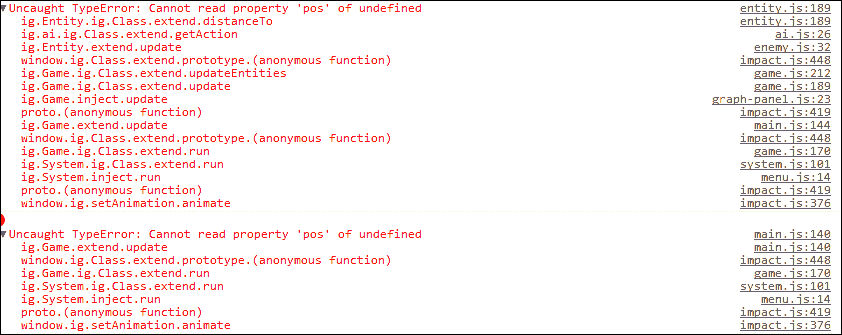
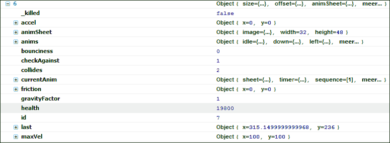
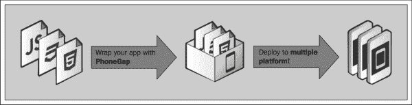

# 第一章。启动你的第一个冲击游戏

既然我们已经在*前言*中看到了为什么 Impact Engine 对于游戏开发者来说是一个不错的选择，那么是时候开始工作了。为了开发一款游戏，你首先需要设置你的工作环境。就像画家需要画笔、画布和颜料一样，您需要设置代码编辑器、服务器和浏览器。到本章结束时，你将为自己配备开始冒险甚至在电脑上运行游戏所需的所有工具。

在本章中，我们将涵盖以下主题:

*   使用 XAMPP 设置您自己的本地服务器
*   在此服务器上运行预先制作的游戏
*   可供选择的脚本编辑器的简短列表
*   使用浏览器和 ImpactJS 调试器脚本调试您的游戏
*   一些有趣的工具，你应该考虑帮助你创造你的游戏

# 安装 XAMPP 服务器

当开发任何东西时，无论是应用、网站还是游戏，创作者总是有一个舞台。集结地就像实验室；它的意思是在向世界展示之前构建和测试一切。即使发布了游戏，你也会先在实验室里做一些改变，看看事情是否不会在你面前爆炸。在*炸掉你自己的*脸没问题，但是你不希望这种事情发生在你的游戏玩家身上。我们的集结地将是一个本地服务器，在本书中，我们将使用 **XAMPP** 。XAMPP 的 X 表示该服务器可用于不同的操作系统(跨环境，因此为 X)。

其他字符( **AMPP** )代表**阿帕奇****MySQL****PHP****Perl**。根据您下载和安装的版本，您可以在 Windows、Linux 或 Mac 上安装 XAMPP。XAMPP 也有替代品，比如 **WAMP** (适用于 Windows)和 **LAMP** (适用于 Linux)。当然，这些替代方案也很好。

Apache 是开源网络服务器软件，可以让你运行你的代码。MySQL 是一个开源的数据库系统，使您能够用 SQL 语言存储和查询数据。PHP 是一种能够将 SQL 命令(可以操作数据库)连接到网站或游戏代码(JavaScript)的语言。Perl 经常被称为“编程语言的瑞士军刀”，因为它用途广泛。安装 XAMPP 服务器相当简单。

您可以访问以下网站并为您的系统下载合适的安装程序:

[http://www . apachevries . org/en/xampp . html](http://www.apachefriends.org/en/xampp.html)

安装完基本上是通过标准安装向导的 XAMPP 服务器后，是时候查看 **XAMPP 控制面板**页面了。


在此面板中，您可以看到服务器的不同组件，这些组件可以打开和关闭。您需要确保至少 Apache 组件已经启动并运行。其他的也可以打开，但是 Apache 对于运行你的游戏是绝对必要的。

现在进入你的浏览器。在本书的过程中，我们将使用 Chrome 和火狐浏览器。但是，建议也安装最新的 Internet Explorer 和 Safari 浏览器进行测试。在地址栏中只需输入`localhost`。Localhost 是本地安装的服务器的默认位置。看到下面的 *XAMPP 闪屏*了吗？


那么恭喜你，你已经成功设置了自己的本地服务器！

一个已知的问题是 **IIS** ( **互联网信息服务** ) 占用您的必要端口。您可能必须禁用甚至删除它们，以便为 XAMPP 释放您的端口。

对于**MAMP**T4(**M**代表 **Mac** ，可能需要指定端口 8888 才能工作。所以输入`localhost: 8888`而不仅仅是`localhost`。

总结前面的内容，步骤如下:

1.  下载并安装 XAMMP。
2.  打开控制面板，启动 Apache。
3.  打开浏览器，在地址栏中输入`localhost`。

# 安装游戏引擎:ImpactJS

接下来你需要的是实际的 ImpactJS 游戏引擎，你可以在[http://impactjs.com/](http://impactjs.com/)的 ImpactJS 网站上购买，或者在[http://www.appmobi.com](http://www.appmobi.com)的 AppMobi 网站上与**AppMobi**T5 一起打包购买。

无论您在哪里购买引擎，您都将寻找一个充满 JavaScript 文件的(压缩的)文件夹。这就是 ImpactJS 的本质，它是一个 JavaScript 库，使得在 HTML 环境中构建 2D 游戏变得更加容易。

现在您已经启动并运行了您的服务器，并且您已经获得了这个 ImpactJS 引擎，您所需要做的就是将它放在正确的位置并测试它是否工作。

在 ImpactJS 版本(v1.21)中，在写这本书的时候，你会得到一个名为`impact`的文件夹和一个`license.txt`文件。

许可证文件会告诉您可以和不可以使用您购买的影响许可证，因此建议您至少阅读它。

`impact`文件夹本身不仅仅由 Impact 游戏引擎组成；它还包括级别编辑器。文件夹结构应该能够保存你未来所有的游戏文件。

现在，只要知道可以将整个`impact`文件夹复制到服务器的根位置就足够了。

对 XAMPP 来说，这应该是:`"your installation location"\xampp\htdocs`。

对 WAMP 来说，这是:`"your installation location"\wamp\www`。

让我们也复制这个文件夹，并将其重命名为`myfirstawesomegame` ，以使其更加个性化。现在您有了我们稍后将在[第 3 章](03.html "Chapter 3. Let's Build a Role Playing Game")、*中使用的原始文件夹，让我们构建一个角色扮演游戏*和[第 4 章](04.html "Chapter 4. Let's Build a Side Scroller Game")、*让我们在名为`myfirstawesomegame`的新文件夹旁边构建一个侧滚游戏*。

您还应该在 XAMPP 安装位置`\xampp\htdocs\myfirstawesomegame`和 WAMP 安装位置`\wamp\www\myfirstawesomegame`具有以下文件夹结构。

在`myfirstawesomegame`文件夹中应该有`lib`、`media`和`tools`子文件夹以及`index.html`和`Weltmeister.html`文件。

是时候做个小测试了！只需进入浏览器，在地址栏中输入`localhost/myfirstawesomegame`。

**它起作用了！**消息现在应该让你心中充满喜悦！如果它没有出现在屏幕上，就说明出了可怕的问题。如果您没有收到消息，请确保您的所有文件都存在并且在正确的位置。

ImpactJS 附带一个名为`Box2D`的*物理引擎*。检查您的文件夹结构中是否有此文件夹。如果没有，您可以通过下载 Impact 引擎的个人下载链接下载包含该引擎的演示游戏。这个演示是一个名为 *Biolab 灾难*的游戏，在这里你应该可以找到`box2d`文件夹。如果没有，多米尼克(ImpactJS 的创建者)还提供了一个名为`physics`的单独文件夹。由于 Box2D 是标准引擎的插件，最好在您的`lib`文件夹中搜索`plugins`文件夹，如下图所示，并将`box2d`文件夹放在这里。


总结前面的内容，步骤如下:

*   购买 ImpactJS 许可证并下载其核心脚本
*   将所有必要的文件放在服务器目录中一个新创建的名为`myfirstawesomegame`的文件夹中
*   打开浏览器，在地址栏中输入`localhost/myfirstawesomegame`
*   下载 Box2D 插件，并将其添加到自己服务器上的`plugins`文件夹中

# 选择脚本编辑器

我们现在有一个安装了 ImpactJS 游戏引擎的服务器，但是我们还没有一个工具可以用来编写游戏代码。这就是*脚本编辑器*的作用。

为了选择适合您需求的代码编辑器，最好区分纯编辑器和 IDE。 **IDE** 或**集成开发环境**既是脚本编辑器又是编译器。这意味着在一个程序中，你可以改变和运行你的游戏。另一方面，脚本编辑器只是用来修改脚本的。它不会向您显示输出，但在大多数情况下，会在您将要犯语法错误时提前告诉您。虽然编辑器会显示 JavaScript 代码中的语法错误，但实际执行代码会揭示逻辑错误，并让您看到一些(漂亮的)东西。

对于 ImpactJS，有一个名为 AppMobi 的 IDE，它是免费的，但是需要额外的服务。使用 AppMobi 的替代方法是您刚刚安装的 XAMPP 服务器。

剧本编辑，即使是非常好的，也经常是免费的。在选择你喜欢的之前，你应该先看看一些不错的是 **Eclipse** 、 **记事本++** 、 **科莫多编辑** ，以及 **威震编辑 2** 。具体对于 Mac 来说，有**【Textmate】**，这是一个经常使用的编辑器，但并不是免费的。当然还有苹果官方开发者编辑器 **Xcode** 。

所有这些脚本编辑器都会检查您在 JavaScript 代码中犯的错误，但是它们不会检查特定于 ImpactJS 的代码。为此，您可以制作自己的脚本颜色编码包，或者从那些花时间构建脚本颜色编码包的人那里下载。

下载并安装几个前面提到的脚本编辑器，选择一个你最喜欢的。他们都会很好地完成任务，这只是个人喜好的问题。

# 运行预先准备的游戏

是时候在你的电脑上启动并运行一个游戏了。为了做到这一点，你需要随书附带的文件。这些可以从以下网站下载:

[http://www.PacktPub.com/support](http://www.PacktPub.com/support)

现在你应该拥有一切。复制[第 1 章](01.html "Chapter 1. Firing Up Your First Impact Game")、*启动你的第一个冲击游戏*的可下载资料。将 ImpactJS 库附带的`index.html`和`main.js`脚本替换为`index.html`和`main.js`脚本，可以从 Packt Publishing 的下载页面下载。同时用提供的文件夹覆盖你电脑上的`media`、`entities`和`levels`文件夹。

返回浏览器，重新加载`localhost/myfirstawesomegame`链接。瞧啊！一款功能齐全的冲击类游戏！以防你还看到**它起作用了！**消息如下图所示，在游戏出现之前，您可能需要清除浏览器缓存或刷新页面几次。万一出了别的问题，等我们了解调试的时候就知道了。


总结前面的内容，步骤如下:

*   从 packtpub 下载服务器下载必要的文件，并将它们放在自己服务器上的正确位置
*   打开浏览器，在地址栏中输入`localhost/myfirstawesomegame`

# 用浏览器和 ImpactJS 调试你的游戏

在可以调试游戏之前，你最不应该知道的就是*impact js 代码*的大致结构。正如您可能已经注意到的，ImpactJS 有一个主脚本，用于实际控制整个游戏。`main.js`脚本包括所有其他必要的脚本和`ImpactJS`库。它包含的每个脚本代表一个模块。像这样，游戏中的每一个关卡和实体都有一个模块。它们就像乐高积木，聚集在一个大的(`main.js`)城堡里。实际上，主脚本，如下面的代码片段所示，本身就是一个模块，需要所有其他模块:

```html
ig.module( 
  'game.main' 
)
.requires(
  'impact.game',
  'impact.font',
  'game.entities.player',
  'game.entities.enemy',
  'game.levels.main',
  ...
```

### 类型

**下载示例代码**

您可以从您在[http://www.packtpub.com](http://www.packtpub.com)的账户中下载您购买的所有 Packt 书籍的示例代码文件。如果您在其他地方购买了这本书，您可以访问[http://www.packtpub.com/support](http://www.packtpub.com/support)并注册，以便将文件直接通过电子邮件发送给您。

如果你看一下关卡脚本，你会发现它是用 **JSON** ( **JavaScript 对象符号**)编写的，这是**对象文字符号** 的子集。JSON 和普通文字在以下方面有所不同:

1.  JSON 键是用双引号封装的字符串。
2.  JSON 用于数据传输。
3.  不能将函数作为值分配给 JSON 对象。

关于 JSON 更深入的信息可以在[http://json.org/](http://json.org/)上找到。文字在整个 ImpactJS 中使用，看起来像下面的代码片段:

```html
  EntityPlayer = ig.Entity.extend({
    size: {x:20,y:40},
    offset:{x:6,y:4},
    vel: {x:0,y:0},
    maxVel:{x:200,y:200},
    health: 400,
```

属性是用冒号(`:`)和逗号(`,`)分隔的。在普通的 JavaScript 中，这是以不同的方式完成的，如下所示:

```html
if(ig.input.state('up') || ig.input.pressed('tbUp')){
  this.vel.y = -100;
  this.currentAnim = this.anims.up;
}
```

等号(`=`)用于为属性赋值，分号(`;`)用于分隔不同的属性和其他变量。

综上所述，结论如下:

*   ImpactJS 使用三种类型的 JavaScript 符号:JSON、文字和普通符号
*   影响级脚本在 json 代码中
*   ImpactJS 同时使用了文字和普通的 JavaScript 符号

## 用浏览器调试

在用新安装的脚本编辑器编写代码时，您会注意到可以立即避免 JavaScript 语法错误，因为编辑器会告诉您哪里出错了。但是，有些错误只有在浏览器中实际运行代码时才能发现。也许你不想让公主在英雄救她时被烧死，但意想不到的结果确实发生了。这意味着你应该随时打开你的浏览器，这样你就可以一遍又一遍地重新加载你的游戏，直到一切都如你所愿。

然而，当你的游戏崩溃或甚至没有完全加载时，找到原因可能是一个真正的痛苦。即使一次更改一小块代码，错误也会在意想不到的地方出现。

为此，火狐和 Chrome 都有很好的工具可以使用。

### Firebug——火狐调试器

对于火狐，你可以安装 **Firebug** 插件，一个不错的 JavaScript 调试器，它会告诉你你的错误在哪一行代码上，并且有一个简单的资源管理器来管理你游戏的 **DOM** ( **文档对象模型**)。DOM 基本上是包含所有实体和功能的 HTML 文档的结构；深入了解 DOM 是必须的。

这个 DOM 浏览器对于检查某些变量的值非常有用，比如你的英雄的健康状况或者屏幕上的敌人数量。使用调试器(火狐和 Chrome)很容易发现导致游戏崩溃的错误。但是为了发现你在敌人的生命值末尾多加了两个零(这样那些生物就不会死了！)，您将需要探索 DOM。


### Chrome 调试器

对于 Chrome，你甚至不需要下载插件，因为它与 JavaScript 控制台捆绑在一起。这个控制台可以在**选项**|**Extra**|**JavaScript 控制台**下找到，是一个可以一起工作的梦想。您也可以通过右键单击您的网页并选择**检查元素**来调出控制台。


Chrome 调试器(也称为 Chrome 开发者工具)有八个选项卡，其中四个对调试 Impact 游戏特别有用。

**元素**标签允许你检查页面的 HTML 代码，甚至可以当场编辑。例如，这样你就可以改变游戏的画布大小。尽管只对加载的网页进行了更改，但您必须注意这一点；它们不会保存到您的 HTML 或 JavaScript 文件中。

在**资源**选项卡中，您可以查找关于您的*本地存储*的信息。本地存储对于构建游戏来说不是必需的，但它是一个很酷的功能，用于保存高分等。

**Sources** 选项卡非常有用，因为它允许您检查和更改(再次临时)您的 JavaScript 代码。你可以像在火狐一样在这个标签中找到你的 DOM。代码可以手动暂停，也可以使用条件断点暂停。例如，如果你的角色可以获得经验，你可以在升级时暂停游戏，看看是否所有变量都取你期望的值。

调试器最重要的部分是**控制台**选项卡。控制台会显示您的错误在哪里，甚至会指出发生错误的 JavaScript 文件和行。控制台非常通用，因此可以在任何其他选项卡打开时调用它。这样你可以在**来源**标签中检查你的代码，如果你有错误，点击右下角的 **X** 图标调用控制台。随着**信号源**和**控制台**标签的打开，调试变成了在公园里散步。

其他四个选项卡是**网络****时间线****档案** 和**审核**选项卡。它们很有用，但是您将花费大部分时间打开**信号源**和**控制台**组件。

在本书的过程中，Firebug 和 Chrome 调试器可以互换使用。

如果启用了缓存，仅仅改变游戏和重新加载浏览器通常是不够的。只要你的游戏被缓存，你就不能 100%确定你是在评估你的游戏的最新版本，还是浏览器锁定在内存中的先前版本。开发游戏时，关闭缓存是明智的。在火狐中，这可以通过下载和使用插件来完成。在 Chrome 中，它只是 Chrome 开发工具本身的一个选项。当调试器打开时，单击右下角的齿轮符号打开设置。在**常规**选项卡下，可以禁用缓存，如下图所示:


调试可以在单个浏览器中完成，但明智的做法是至少在四个浏览器上测试您的游戏是否运行流畅，例如 Chrome、Safari、Internet Explorer 和 Firefox。有了这四个，您至少覆盖了 95%的浏览器使用。

如果你想为某些设备启动游戏，测试它们也是必要的。这可以通过拥有您希望游戏在其上运行的设备之一(例如，iPad、iPhone、HTC、Galaxy 等)并在`one.com`等网络托管公司的帮助下将游戏放到网上来实现。或者，您可以使用 AppMobi，它为此提供了一个设备查看器。

另一个测试游戏的好方法是使用模拟器。模拟器是模拟真实智能手机的程序。这些都很好，但是让我们看一个实际的例子。

### 使用 Chrome 和 Firebug 调试中的练习

在前面的部分中，我们启动并运行了游戏。现在让我们看看如果真的出了问题会发生什么(前提是直到现在一切正常)。

我们首先需要一些*有缺陷的代码文件*。所以从`debugging tutorial`文件夹中复制`main.js`、`player.js`、`projectile.js`和`enemy.js`脚本，并用这些脚本替换旧的脚本。`main.js`应该位于你的`game`文件夹中，`enemy.js`可以在`entities`文件夹中找到。

现在你的特殊(读:有缺陷)脚本已经准备好了，是时候重启游戏了。重新加载您的浏览器，并确保缓存是空的，否则不会显示错误。

从下面的加载栏可以看到，游戏没有完全加载:


这可能会在你开发新游戏时经常发生。例如，如果不同的 JavaScript 文件的依赖关系是错误的，这种情况就会发生。要查看现在发生了什么，请打开 Chrome 调试器。


转到**控制台**选项卡，查看错误信息: **i 未定义** **main.js:51** 。在编辑器中的指定行号处打开`main.js`脚本。果然，出现了如下代码所示的错误:

```html
i.input.bind(ig.KEY.UP_ARROW, 'up');
ig.input.bind(ig.KEY.DOWN_ARROW,'down');
```

没有叫`i`的物体，这个应该和其他的一样是`ig`。

既然我们解决了这个问题，请再次重新加载游戏。它加载！太好了。根据定义，这并不意味着一切都没有错误。打开调试器，看看是否有其他东西干扰了你的游戏。暂时没有，让我们开始探索吧。

如果一切顺利，当你想向左走的时候，你的游戏应该会暂停。



您收到消息，**无法读取未定义的**的属性“位置”。问题是很难找到错误实际发生的地方，因为几乎每个脚本中都会出现错误。然而，我们所知道的是`pos`是一个实体的参数，并且在错误发生之前我们已经按下了`left`按钮。我们至少应该检查所有定义或使用`left`按钮的地方。

如果打开`player.js`脚本，会发现向左移动的命令比较奇特，如下面的代码所示:

```html
else if(ig.input.state('left') || ig.input.pressed('tbLeft')){
  this.vel.x = -100;
  this.currentAnim = this.anims.left;
  this.kill();
}
```

因此实体向左移动，将其动画设置为向左，然后杀死自己。随意扔来扔去的`kill()`功能并不是一件好事。在这种情况下，`kill()`功能的意外点导致玩家消失，因此玩家不再有位置，这在游戏的`update`循环中产生了错误。移除此`kill()`功能，不应再发生游戏崩溃。

所以有时候控制台显示错误，但还是你的机智会引导你找到根本原因。控制台只是一个工具，你才是真正的主谋。

我们已经删除了所有主要的 bug，因为 Chrome 目前没有显示 bug。确保检查所有级别，因为不同级别通常有其他可能有问题的实体。然而，现在，让我们开始杀死一些敌人！

你可能已经注意到要消灭这些讨厌的生物是相当困难的。我们不再有任何真正的错误，但可能有其他事情没有按照计划进行。我们似乎不能杀死它，所以要么我们没有造成足够的伤害，要么它有巨大的生命值。让我们深入探讨可能涉及的两个实体:`projectile`和`enemy`。我们应该检查`projectile`实体而不是`player`实体，因为即使玩家发射了炮弹，造成伤害的也是炮弹。枪不会杀人，子弹会。打开`projectile.js`和`enemy.js`脚本，它们都在`entities`文件夹中。或者，您可以打开 Chrome 调试器并选择**脚本**选项卡下的文件。

在`projectile.js`脚本中，查找以下代码:

```html
check: function(other){
  if(other.name == 'enemy'){other.receiveDamage(100,this);}
  this.kill();
  this.parent();
```

我们将很快深入研究这段代码的细节。现在只要知道子弹在撞击敌人时会造成伤害就足够了。

现在查看`enemy.js`脚本中敌人的健康情况。以下代码显示了运行状况:

```html
health:200000,
```

是的。这是个问题。敌人比预想的强大一千倍。将血量改为`200`即可两枪杀死敌人。或者，您可以将`projectile`实体的伤害设置为`100,000`。将`damage`属性更改为大数字可能会很有用，以便吸引那些喜欢看到大数字而不是小数字的玩家。(玩过魔兽世界的人都知道我在说什么)。

如果你保存代码并重新加载关卡，你应该不会再有杀死敌人的问题了。

另一种找出可能错误的方法是通过探索 DOM 来查看单个实体。让我们用 Firebug 来做这个。如果你还没有在你的火狐上安装它，谷歌一下并安装它。

我们向敌人开了两枪，发现他无意死亡。我们可以通过在 DOM 中导航来查看派生的实体本身，而不是检查代码。要找到敌人的生命值，你必须在浏览器中按下 bug 符号打开 Firebug，然后选择 **DOM** 选项卡。现在按顺序打开`ig`、`game`和`entities`文件夹。您将看到一个编号列表，该编号是特定实体在`entities`数组中的位置。现在可以打开部分号码，直到找到 **19800** 为**生命值**的敌人，如下图截图所示:



敌人被埋在其他实体的列表中，但是通过他的属性我们可以看到这里发生了什么。我们拍摄了两次，现在它的**生命值**为 **19800** 。这是有道理的，因为射弹的伤害是 **100** 。

掌握 DOM 需要付出一些努力，但是了解您的代码是否如预期的那样工作是非常有用的。此外，您可以更好地了解 ImpactJS 的核心元素是如何相互关联的。在继续之前，建议在这里花一些时间来感受一下整体结构。

因此，我们看到了三种不同类型的错误，从容易解决到相当难发现和修复。在第一个场景中，控制台告诉您有一个地方出错了，您去纠正它。第二个场景显示了一个单一的根本原因，游戏同时在几个点上产生错误。这取决于你和你的逻辑大脑来推断是什么破坏了游戏。最后，我们得到了意想不到的结果，这并不是真正的错误。控制台不会显示这些错误，因为它无法读取您的想法(也许在下一个版本中，谁知道呢)。这些是最难找到的，将从你的角度进行一些测试。

综上所述，结论如下:

*   火狐和 Chrome 的功能都是非常强大的调试器。
*   Firebug 特别推荐用来探索游戏的 DOM。
*   Chrome 有八个有趣的组件，其中最有用的是检测错误的控制台。
*   错误有不同的类型:语法错误、代码逻辑错误和游戏逻辑错误。
*   一个好的脚本编辑器可以抢先检测到大多数语法错误。
*   一个简单的语法错误将在调试器控制台中显示为单行错误。这使得定位和修复变得容易。
*   代码逻辑错误可能很难检测到，因为语法通常是正确的，但在其他位置会显示错误。
*   游戏逻辑错误是非常主观的错误，因为它们不会使游戏崩溃，但会导致游戏性差。

## 用 ImpactJS 调试

ImpactJS 本身自带一个内置在引擎中的调试器。但是默认是关闭的，可以通过对`main.js`脚本进行小修改来打开。`main.js`脚本是(顾名思义)你游戏的主脚本，调用你所有其他的 JavaScript 文件。正是这个脚本被加载到浏览器的 HTML 画布中，并一遍又一遍地循环，以使您的游戏运行。`main.js`脚本可以在`game`文件夹中找到，应该与您的 Impact 许可证一起提供，如以下代码片段所示:

```html
ig.module(
  'game.main' 
)
.requires(
  'impact.game',
  'impact.font',
  'impact.debug.debug',
```

一切从`ig`(冲击游戏)对象开始。当你调试游戏和检查变量和函数时，这个对象就是你要在 DOM 中寻找的对象。在`main.js`脚本中，有一个对`.module`函数的调用，它将`game.main`定义为你的游戏的一个模块。模块名称需要与其位置和文件名相同！所以 JavaScript 文件`lib/game/entities/bigmonster.js`最终会被定义为`game.entities.bigmonster`。将`debug`面板添加到游戏中可以通过以下步骤完成:

1.  `.requires()`函数调用它需要的所有脚本，以便能够成功执行代码。不是每个模块都需要这个，但是`main.js`脚本总是至少需要`impact`库。
2.  正是在这个函数调用中，您将想要添加`impact.debug.debug`脚本，正如您所猜测的那样，该脚本调用文件夹`lib/impact/debug`中的脚本`debug.js`。
3.  保存`main.js`脚本，在 Chrome 中重新运行`localhost/myfirstawesomegame`。
4.  如果一切按计划进行，你现在应该会在浏览器底部看到一个名为 **impact.debug** 的新工具栏。
5.  调试器有三个选项卡:**背景图**、**实体**和**性能**以及右上角的四个关键指标。
6.  这些指标从左到右如下:
    *   运行一帧游戏所需的毫秒数。
    *   游戏每秒的 **fps** 指示器或帧数。
    *   已经发生的**绘制**的次数。如果你正在谈话，这包括人物。
    *   在右手边，你可以找到游戏中当前实体的数量。

虽然这些指标很快向您展示了需要考虑的最重要的事情，但下面截图中显示的三个选项卡更深入一些:


如果你选择**背景地图**，你会看到游戏中所有的图形图层。假设你想以史诗般的性格跑到一棵树前；你会期望树的一部分消失在角色后面，而不是相反。当角色移动到树后面时，你会希望它被树隐藏起来。所以你看，你至少需要两层才能画出这样的树。一层在玩家前面(很可能是树顶)，另一层在玩家后面(树干)。

在调试器部分，如下图所示，您可以打开和关闭图层。如果图层被设置为预渲染，您将能够看到该图层的块。在下面的截图中，**检查&碰撞**打开，而其他选项关闭:


使用**实体** 选项卡，您可以打开和关闭几个有趣的指示器。如果你打开**显示碰撞盒**，你将能够看到你的角色周围有一个红色的盒子和几个不断检查碰撞的(不可见的)实体。这些红色方框表示触发点碰撞的边界。这很重要，因为如果你的英雄角色周围的碰撞盒比图像大得多，他可能再也装不下门了，或者被还在远处的敌人神秘地击中。您可以在编写代码时自己设置这些碰撞盒的大小，允许一些有趣的效果，例如只能通过向老板的眼球开枪来杀死他。

当你打开**显示速度**时，你应该带着你的角色四处走动。你现在会看到一条线在他面前伸出，这表明他目前的速度有多快。

通过显示名称和目标，您可以看到所有命名实体及其目标。这是一个有趣的特性，但是你最好使用 ImpactJS 级别的编辑器(**weltmester**)来实现你的目的。

最后 **Performance** 选项卡向您展示了浏览器运行游戏所需执行的不同任务的工作量，如下图所示:


在上图中可以看到两条水平线:**33 毫秒**和**16 毫秒**线。这些线对应于大约 60 fps 和 30 fps 的帧速率。游戏运行速度低于 30 帧/秒是不可取的，因为这样会让游戏看起来落后，玩这样的游戏没有乐趣。如果你发现你的游戏落后了，检查哪一部分消耗了所有的能量，并尝试解决这个问题。

在大多数情况下，绘制游戏(图形)会占用大部分资源。这由**性能**选项卡中的**绘制**来表示。如果出现这种情况，请尝试使用更少的图层或更大的图块。在这种情况下，预渲染也可以提高性能。

另一部分资源被你的实体占据，以及它们如何相互作用。如果你有成千上万个不同的实体聚集在你的屏幕上，因为你决定一群海鸥应该由一个单独的实体代表每只鸟，你可能会很快陷入困境。

系统滞后有一个单独的指示器，这是一个您无法控制的参数，因为它显示了浏览器的性能。系统滞后通常会产生峰值，降低帧速率。然而，在大多数情况下，它不能被真正感觉到，因为真正巨大的尖峰来得快去得也快。

综上所述，结论如下:

*   impacts 自带调试器，但默认情况下是关闭的
*   调试器有几个组件，允许洞察实体行为、冲突和游戏性能
*   ImpactJS 调试器对于跟踪性能问题非常有用，在开发过程中应该始终保持打开状态

# 有哪些有用的工具

如果你有一个像样的脚本编辑器、ImpactJS 库、一个(本地)服务器和一个具有调试功能的浏览器，你就可以构建一个 ImpactJS 游戏了。然而，有几个有趣的工具可以大大方便你的旅程。有**自带 ImpactJS，是 iPhone 和 iPad 发布游戏更高效的方式。 **AppMobi** 是一个很好的工具，为你的游戏准备网络商店。 **PhoneGap** 是一个用于创建应用的开源框架。有了 **lawnchair** 你可以更方便地利用本地数据存储。还有**scored oid**，一个免费的游戏云服务。最后是**play tomic**——一款游戏分析工具。在这一章中，我们将在其中的每一个处进行一个短峰。**

 **## 喷出物

《喷射器》是一部精巧的作品，可通过以下链接免费下载到:

[http://impactjs.com/ejecta](http://impactjs.com/ejecta)

它完全取代了 **iOSImpact** ，这是将游戏作为苹果商店的原生应用进行准备的一种方式。多米尼克称弹出是“没有浏览器的浏览器”。它没有开销，只有画布，你的游戏功能和音频元素。

对于 ImpactJS 来说，experia 运行良好，但它也可以用于其他应用。和之前的 iOSImpact 一样，它利用**OpenGL**T2 制作动画，**OpenAL**T5 制作音频，大幅提升了游戏性能。如果你打算把你的游戏发布到 iPhone 上，experia 当然值得一看。

## AppMobi

AppMobi 提供一个 **XDK** ( **跨平台开发套件** ) ，和 ImpactJS 配合非常好。他们实际上有一个独立的开发工具包，除了他们的普通工具包(AppMobi XDK)之外。

开发套件的使用是免费的，但额外的服务，如他们的云服务、实时更新功能、和安全支付是可获得的额外费用。你可以在[http://www.appmobi.com/](http://www.appmobi.com/)上找到一切。

只有在您的帐户中注册了 Impact 密钥并包含了他们的 JavaScript 库的情况下，Impact XDK 才会允许您开发 Impact 游戏。正确设置后，XDK 可以让你模拟几个设备，如 iPad、iPhone、Galaxy 等等。XDK 只在谷歌浏览器上运行，尽管这并不是一个真正的弱点。你可以打开一个脚本编辑器，但是它没有我们之前看到的好。您可以选择调用调试器，但它只是谷歌 Chrome 调试器，而不是他们自己构建的调试器。

**Apphub** (它是你的控制中心)允许你在把应用发送到商店之前构建和测试它们。当然，为了发布一款游戏，你仍然需要你想要服务的平台的开发者账号。

AppMobi 还有他们所谓的**直接画布加速** ，通过绕过你游戏的画布元素来增加游戏的性能。它非常类似于喷射器所做的，但是它是由 AppMobi 交付的。

下面的截图是 AppMobi 可以提供的不同地形的概述，这会让一些开发人员松一口气。虽然 AppMobi 在编写游戏脚本时用处有限，但它可以在测试和部署期间提供出色的支持。


不可能直接连接到移动设备。但是，您可以向任何拥有链接的人发送链接。这样，如果你的朋友安装了 **AppMobi applab** ，他们就可以测试你的最新作品。

总的来说，AppMobi 很容易上手，如果你在发布游戏的整个过程中需要一些帮助，当然值得考虑，尽管对于开发来说，你几乎完全靠自己。

## 语音间隙

PhoneGap (原名**科尔多瓦** )是另一个开发移动原生应用的 XDK。

就功能而言，PhoneGap 可以与 AppMobi 相提并论，但 AppMobi 非常直观，对新手更友好。PhoneGap 可以让你构建 **OS** ( **操作系统** ) 原生的应用，整合 **PayPal** ，使用推送通知。

如下图所示，PhoneGap 提供了一种构建应用的方法，以便分发给不同的渠道:



PhoneGap 的入门比 AppMobi 复杂一点。你需要安装 **eclipse** (免费)，安卓开发工具和 SDK。安装 **Git** 可能是针对特定平台所必需的。如果你想为 iPhone 或 iPad 发布，你还需要 **xcode** 。

总之，绝对值得一看。幸运的是，他们有非常好的文档，因为它往往会变得有点复杂。更多信息可以在[http://phonegap.com/](http://phonegap.com/)上找到。

## lawnchair

lawnchair 为提供了一种使用**本地存储** 的免费便捷方式。本地存储用于在运行游戏的设备上存储您的数据(保存文件和高分)。

在客户端保存一切比在服务器端保存有很多优势。首先，你不需要知道 SQL。网站通过使用 SQL、PHP 和 JavaScript 来保存数据库中的所有内容。如果使用本地存储，只需要 JavaScript。存储空间的大小不受服务器的限制，而是受用户的限制。因此，如果您有许多游戏玩家，他们每个人都使用少量的空间，您将永远不会遇到本地存储的问题，而您可能会在单独使用服务器存储时遇到麻烦。因为它不需要一直传输到服务器，所以您可以离线玩游戏，并且仍然保留您的保存。

这些都是很好的优势，但是法律是如何运作的呢？lawnchair 是一个类似 ImpactJS 的 JavaScript 库(不过这次是免费的)。您只需要将它包含在您的其他 JavaScript 文件中，您就可以开始使用特定的命令来保存数据。

通过从[http://brian.io/lawnchair/](http://brian.io/lawnchair/)下载库并在您的`index.html`文件中包含`lawnchair.js`脚本，可以实现包含 lawnchair 功能，如以下代码示例所示:

```html
<html>
  <head>
    <title>my osim app</theitle>
  </head>
  <body>
    <script src="lawnchair.js"></script>
    <script src="app.js"></script>
  </body>
</html>
```

lawnchair 使用 JSON 将数据保存在游戏的 DOM 中。如果您想要一个这样的例子，您可以在您选择的代码编辑器中打开任何 ImpactJS `level`脚本，因为这些脚本也是用 JSON 编码的。

如果你的游戏需要**保存游戏**、**高分**、**游戏进程**或任何其他需要跟踪的选项，这样玩家就不需要从头开始，你会想看看 lawnchair。更多信息可以在[http://brian.io/lawnchair/](http://brian.io/lawnchair/)上找到。

## 记分牌

Scoreoid 是一款**游戏云服务**，旨在照顾一些高级功能，如**排行榜** 、**玩家登录** 、 **ingame 通知** 。

为了使用 Scoreoid 及其功能，您需要在他们的网站上注册，并在必要时在您的网站内实现他们的代码。不同的功能有不同的代码。下面的代码片段是一个示例模板，用于存储加载您的游戏的人的信息:

```html
$.post("API URL",{api_key:"apikey",game_id:"gameid",response:"xml"},
  function(data){
    alert("Data Loaded: "+ data);
    console.log("Data Loaded: "+ data);
  });
```

你填写 **API URL** 、自己的 **API 键** 、**游戏 ID** ，以及**数据编码类型** 进行传输(XML 或 JSON)就可以走了。

账户是免费的，但是他们可以选择保费账户，这也是免费的。但这只是因为他们目前仍在为高级账户定义额外功能。你可以在他们的网站[http://www.scoreoid.net/](http://www.scoreoid.net/)订阅。

## 玩具

玩法是游戏监控的谷歌分析。

基本账户免费，但高级账户目前定价为*$ 15/月*或*$ 120/年*。你可以在他们的网站[http://www.playtomic.com](http://www.playtomic.com)上订阅。

让分析流程开始运行并不太困难。在您的`index.html`文件中，您包含了对他们的 JavaScript 库的引用，如以下脚本所示:

```html
<script type="text/javascript"src="http://api.playtomic.com/js/playtomic.v2.1.min.js">
</script>
```

在您的`main.js`脚本中，您可以添加一个命令，将数据发送到他们的服务器，如下所示:

```html
Playtomic.Log.View(gameid, "guid", "apikey", document.location);
```

这两段代码是 Playtomic 建议的。但是，如果您以纯文本形式将数据发送到他们的服务器，可能会发生错误。因此最好将脚本类型`text`替换为`application`，如下面的代码片段所示:

```html
<script type="application/javascript"src="http://api.playtomic.com/js/playtomic.v2.1.min.js">
</script>
```

## one.com 网东

一个**网络主持人** 就是如果你想把自己的游戏放到自己的网站上，你需要的东西。

你并不总是需要自己的网站，因为云主机如 Scoreoid 也允许你把你的游戏放到网上。然而，有时在万维网上有自己的小地方是很好的。

[one.com](http://www.one.com)在一个套餐中销售网络空间和一个域名。这项服务的价格相当不错，尤其是与您需要做什么来获得相同的结果相比。你需要有一台安装了 XAMPP 的电脑，并且它应该一直运行。此外，如果你是认真的，你仍然需要购买一个域名，或者从某个地方获得一个免费的域名，并将你的 IP 重新路由到它。如果你的知识产权一直保持不变，这是可行的。然而，更多时候，这是互联网提供商的优质服务。您可以在[http://www.one.com](http://www.one.com)开户。

如果你想使用网络托管，有更多的提供商，但在所有情况下都建议下载并安装 **FileZilla** 。FileZilla 是一个高效的文件传输程序，这正是您将所有文件从 PC 上传输到沙漠中某处的服务器所需的程序。文件可通过以下链接下载:

[http://filezilla-project.org/](http://filezilla-project.org/)

综上所述，结论如下:

*   有很多工具可以让你的游戏开发者生活变得更加愉快
*   对于向 iPad 和 iPhone 发布游戏来说，弹出是一个高效的解决方案
*   AppMobi 是一个免费的云工具，它可以帮助发布和开发几乎每个分销渠道
*   PhoneGap 与 AppMobi 有很多共同之处，尽管使用起来稍微复杂一些
*   lawnchair 提供了一种解决本地数据存储的方法
*   Scoreoid 是一个免费的游戏云服务，它将托管您的游戏，并提供诸如排行榜集成等功能
*   Playtomic 是一个游戏分析工具，允许你标记游戏的某些元素，并将数据存储在它们的服务器上

# 总结

在第一章中，我们已经做好了作为游戏开发者的准备。我们已经设置了一个本地服务器，可以用作开发和初始测试环境。为了编写我们的代码，我们需要一个脚本编辑器，所以我们简单地浏览了一下那里的一些编辑器。调试是程序员的主要技能之一；为此，我们不仅可以使用 Chrome 和 Firefox 调试器，还可以使用 ImpactJS 调试模块。最后，我们看了几个对 ImpactJS 游戏开发非常有用的工具。

现在我们已经准备好了一切。在下一章中，我们将通过摆弄一个预先准备好的小示例游戏来深入研究 ImpactJS。**