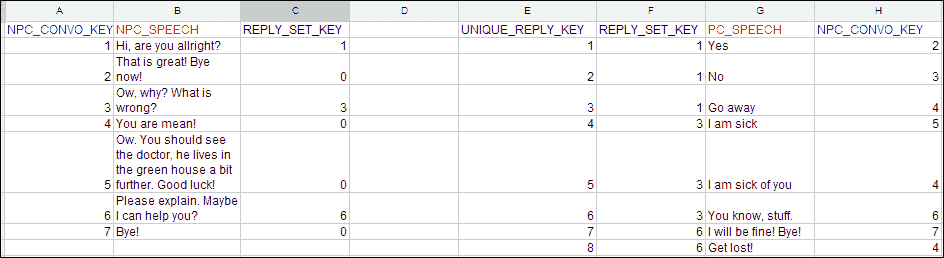
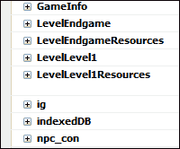
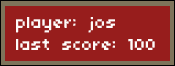
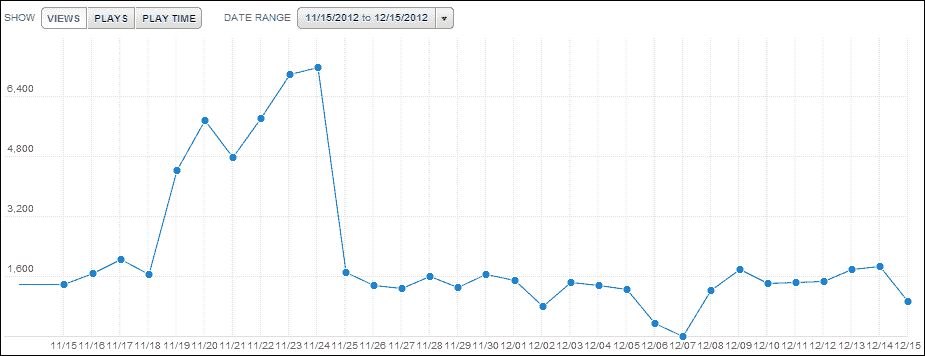
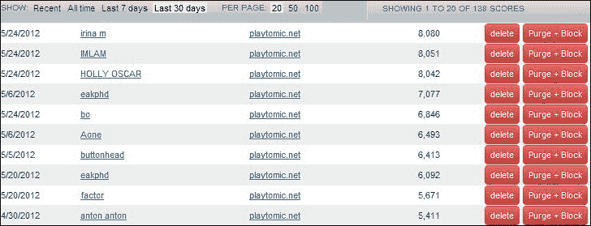

# 第五章。为您的游戏添加一些高级功能

在前面的章节中，我们看到了如何设置工作环境，看了一下 Impact 引擎，甚至构建了两种类型的游戏。现在是时候看看一些有趣的额外内容了。

要测试本章所涵盖的元素，最好下载`chapter 5`文件夹中的代码材料，或者直接构建在我们在[第 3 章](03.html "Chapter 3. Let's Build a Role Playing Game")、*中设计的游戏上，让我们构建一个角色扮演游戏*。由于我们不会在本章中使用 Box2D 扩展，有些东西将与[第 4 章](04.html "Chapter 4. Let's Build a Side Scroller Game")、*中的侧滚游戏不兼容，让我们构建一个侧滚游戏*。在本章中，我们将介绍:

*   制作开始和胜利画面
*   额外的调试可能性，并引入定制的 ImpactJS 调试面板
*   用 cookies 和 lawnchair 应用保存数据，并将 Excel 文件转换成有用的游戏数据
*   [第三章](03.html "Chapter 3. Let's Build a Role Playing Game")、*角色扮演游戏(RPG)的一些额外游戏功能让我们构建一个角色扮演游戏*
*   用鼠标移动你的角色
*   智能产卵地点
*   添加基本对话
*   显示玩家的健康栏
*   用蜂群思维扩展人工智能
*   实现游戏分析的游戏化

# 开始和游戏结束屏幕

当玩家开始你的游戏时，你可能首先想让他看到的是一个闪屏。这个屏幕通常有游戏的名字和其他有趣的信息；通常它包含一些关于游戏故事或控制的信息。在游戏结束时，你可以有一个胜利屏幕，告诉玩家他做得有多好，把他取得的分数放在排行榜上。

关于代码，这可以通过在实际游戏旁边引入新的游戏实例来实现。每一个屏幕:开始、游戏结束和胜利是 ImpactJS 游戏类的直接扩展。让我们从创建开始屏幕开始。

## 游戏的开始画面

为了使成为一个漂亮的开屏画面，我们需要一个背景图像和我们信任的`main.js`脚本:

1.  打开`main.js`脚本，插入如下代码:

    ```html
    OpenScreen = ig.Game.extend({
      StartImage : new ig.Image('media/StartScreen.png'),
      init:function(){
      if(ig.ua.mobile){
        ig.system.setGame(MyGame);
      }
        ig.input.bind(ig.KEY.SPACE,'LoadGame');
      },
      init:function(){
        if(ig.ua.mobile){ig.input.bindTouch( '#canvas','LoadGame' );}
        else {ig.input.bind(ig.KEY.SPACE,'LoadGame');}
      },
    ```

2.  开屏是`ig.Game`功能的延伸，就像我们的游戏一样。事实上，当我们在这里完成时，我们将有四个游戏实例:一个名为`MyGame` 的真实游戏，以及其他三个游戏，它们将仅充当开始、胜利或游戏结束屏幕。这可能有点违背直觉，因为你会期望屏幕是同一个游戏的一部分。事实上，这肯定是真的。然而，在代码中，将这些屏幕变成单独的游戏类扩展更方便。
3.  在`OpenScreen`代码的这一部分，我们首先定义将要显示的图像:`StartScreen.png`。
4.  最后，我们将空格键绑定到一个名为`LoadGame` 的动作状态，如下所示:

    ```html
      update:function(){
        if(ig.input.pressed('LoadGame')){
          ig.system.setGame(MyGame);
        }
      },
    ```

5.  现在我们可以通过按空格键来加载游戏，但是我们仍然需要在屏幕上实际显示一些东西。
6.  我们可以通过操纵任何 ImpactJS 类的`draw()`函数来可视化事物，如下面的代码片段所示:

    ```html
      draw: function(){
        this.parent();
        this.StartImage.draw(0,0);
        var canvas = document.getElementById('canvas');
        if(canvas.getContext){
          var context = canvas.getContext('2d');
          context.fillStyle = "rgb(150,29,28)";
          context.fillRect (10,10,100,30);
        }
        var font = new ig.Font('media/font.png');
        font.draw('player:' + GameInfo.name,10,10);
      }
    }),
    ```

7.  `draw()`功能将绘制我们在初始化`OpenScreen`功能时指定的背景图像。这样做之后，它还会添加一个红色的小矩形，如果有的话，我们会在其中打印玩家的名字。当我们在本章稍后查看游戏数据时，我们将进入获取这个名称并存储它以供以后使用。就目前而言，`GameInfo.name`变量是未定义的，它的出现就像开始一个新游戏一样。
8.  为了确保我们全新的开始屏幕被实际使用，我们需要在我们的`ig.main`函数调用中用`OpenScreen`函数替换`MyGame`游戏类实例，如下面的代码行所示:

    ```html
    ig.main( '#canvas', OpenScreen, 60, 320, 240, 2 );
    ```

我们现在有一个开放屏幕！添加游戏结束屏幕和胜利屏幕是非常相似的程序。在制作这些其他屏幕之前，让我们快速回顾一下我们刚刚完成的工作:

*   我们确保了背景图像在`media`文件夹中可用
*   我们增加了`OpenScreen`功能作为新的游戏实例
*   我们绑定了空格键，这样它就可以用来加载实际的游戏
*   我们设置了`Draw()`功能，这样以后就可以显示背景，甚至玩家的名字
*   我们在`OpenScreen`函数窗口而不是`MyGame`游戏类实例中初始化了我们的画布

## 胜利和游戏结束屏幕

胜利画面是游戏实体相对简单的扩展。对于我们想要展示的每一种类型的屏幕来说，程序都是几乎相同的。要设置胜利屏幕，请执行以下步骤:

1.  打开`game.js`文件，添加我们新的`GameEnd`游戏类，如下图代码所示:

    ```html
    GameEnd = ig.Game.extend({
      EndImage : new ig.Image('media/Winner.png'),

      init:function(){
        if(ig.ua.mobile){ig.input.bindTouch( '#canvas','LoadGame' );}
        else {ig.input.bind(ig.KEY.SPACE,'LoadGame');}
      },
    ```

2.  这里我们需要初始化的是我们将要显示的图像和重启游戏的一个键。
3.  类似于开始屏幕，我们使用空格键来加载一个新游戏。我们通过在`update`功能中添加以下`if`语句来不断检查空格键是否被按下:

    ```html
      update:function(){
        if(ig.input.pressed('LoadGame')){
          ig.system.setGame(MyGame);
        }
      },
    ```

4.  我们需要绘制实际的游戏结束图像，并使用以下代码放置文本**点击空间重启**。这样，我们可以确保玩家不会使用空格键而非刷新浏览器。

    ```html
      draw: function(){
        this.parent();
        var font = new ig.Font('media/font.png');
        this.StartImage.draw(0,0);

      if(ig.ua.mobile){
        font.draw('HIT THE SCREEN TO RESTART:',100,100);
      }
    else font.draw('HIT SPACE TO RESTART:',100,100);
      }
    }),
    ```

5.  当玩家结束游戏时，需要显示胜利画面。在我们的案例中，这将是老板实体被击败的时候。打开`boss.js`文件，更改如下代码所示的`kill()`方法，让他死时加载胜利画面:

    ```html
    kill: function(){
      ig.game.gameWon();
    }
    ```

6.  在`kill()`方法中，我们调用`gameWon()`函数，这是我们当前游戏的一个方法，还没有定义。
7.  打开`game.js`文件，添加`gameWon()`方法作为`MyGame`文件的新方法，如下代码所示。

    ```html
    gameWon: function(){
      ig.system.setGame(GameEnd);
    }
    ```

8.  At the moment, it may seem rather pointless to introduce an extra intermediary function to call the Victory screen. However, this will start to make sense once we get into handling game data. Eventually, this function will not only call the Victory screen, but will also save the player's score. Using an intermediary function is a cleaner way of programming than adding the `ig.system.setGame()` function directly into the player entity.

    ### 注

    游戏结束屏幕可以完全等同于胜利屏幕，只是使用了另一个图像，并且是由玩家的死亡而不是老板的死亡触发的。

9.  将`gameOver`功能添加到`game.js`文件中，如以下代码片段所示:

    ```html
    gameOver = ig.Game.extend({
      gameOverImage : new ig.Image('media/GameOver.png'),
      init: function(){
        ig.input.bind(ig.KEY.SPACE,'LoadGame');
      },
      update:function(){
        if(ig.input.pressed('LoadGame')){
          ig.system.setGame(MyGame);
        }
      },
      draw: function(){
        this.parent();
        var font = new ig.Font('media/font.png');
        this.gameOverImage.draw(0,0);
        font.draw('HIT SPACE TO RESTART',150,50);
      }
    }),
    ```

10.  使用以下代码调整`kill()`方法，确保`gameOver`功能由我们玩家的死亡触发:

    ```html
    kill: function(){
        ig.game.gameOver();
    }
    ```

11.  我们再次调用这个中间函数来处理实际的屏幕加载。该功能需要作为一种方法添加到`MyGame`游戏类实例中。
12.  在`game.js`脚本中，将`gameOver()`方法添加到`MyGame`游戏类实例中，如下代码所示:

    ```html
    gameOver: function(){
      ig.system.setGame(gameOver);
    },
    ```

这些都是非常基础的 Start 和 Game-over 画面，说明可以用`ig.game`类作为起点来完成。“胜利”和“游戏结束”屏幕的一个好主意是显示排行榜或游戏期间收集的任何其他有趣的信息。

当游戏通过增加高级功能变得更加复杂时，调试变得越来越重要，以应对这些增加的复杂性。我们现在将了解一下我们可以使用的高级调试选项。但是，在此之前，让我们快速回顾一下胜利和游戏结束屏幕:

*   我们制作了两个新的游戏实例，作为胜利和游戏结束屏幕
*   `update`功能适用于收听空格键，而`draw`功能适用于显示背景图像和**点击空格键重启**消息
*   老板和玩家实体的功能都被调整为触发胜利和游戏结束屏幕
*   我们使用了名为`gameOver()`和`gameWon()`的中间函数，因为我们希望稍后对它们进行调整，以便它们触发 lawnchair 应用来存储分数

## 更高级的调试选项

在[第 1 章](01.html "Chapter 1. Firing Up Your First Impact Game")*启动你的第一个冲击游戏*中，我们看了一下如何使用浏览器进行调试以及冲击调试面板提供了什么。在这里，我们将更进一步，让自己成为一个新的 ImpactJS 调试面板。多米尼克在他的 ImpactJS 网站上很容易获得这些代码，但是许多人忽略了这个功能，尽管它非常有用。

在[第 1 章](01.html "Chapter 1. Firing Up Your First Impact Game")*点燃你的第一个冲击游戏*中，我们也谈到了逻辑错误，这个错误非常难发现，因为它不一定会在浏览器调试控制台中产生错误。为了处理这类错误，程序员经常使用一种称为单元测试的方法。这基本上包括提前定义每段代码的预期结果，将这些预期结果转化为条件，并测试输出是否符合这些条件。让我们看一个简短的例子。

## 单元测试简介

我们的 ImpactJS 脚本最基本的组件之一是函数。我们的一些函数返回值，其他的直接改变属性。假设我们有一个名为`dummyUnitTest()`的函数，它接受一个参数:`functioninput`。

```html
dummyUnitTest: function(inputnumber){
  var outputnumber= Math.pow(inputnumber,2);
  return null; // can cause an error in subsequentfunctions,comment out to fix it
  return outputnumber;
}
```

一个`inputnumber`变量可以是任何数字，但是我们的函数将`inputnumber`变量转换成一个`outputnumber`变量，然后返回。`inputnumber`升到 2 的幂的变量应该总是返回一个正数。因此，我们至少可以对这个函数的期望说两件事:输出不能为空，也不能为负。

我们可以通过添加专门用于检查某些条件的`assert`功能来对该功能进行单元测试。一个`assert`函数检查一个条件，当它为假时，它将向控制台日志写入一条消息。控制台元素本身有这个功能，但是当调试模块被激活时，ImpactJS 也有这个功能。`ig.assert()`功能相当于`Console.assert()`功能。记住激活 ImpactJS 调试可以通过在`main.js`文件中包含`'impact.debug.debug'`来完成。使用 `ig.assert`功能优于`console.assert()`功能。这是因为在准备启动游戏时去掉`ig`类消息，只需关闭 ImpactJS 调试模块即可。控制台类的方法(如`console.assert()`调用)需要单独关闭。一般来说，`assert()`功能是这样的:

```html
ig.assert(this.dummyUnitTest('expected')==='expected','you introduced a logical error you should retrieve the same value as the input');
```

对于我们的具体示例，我们可以执行几个测试，如以下代码所示:

```html
ig.assert(typeof argument1 === 'number','the input is not a number');
ig.assert(typeof argument2 === 'number','the output is not a number');
ig.assert(typeof argument2 >= 0,'the output is negative');
ig.assert(typeof argument2 != null,'the output is null);
```

我们可以继续，这种方法也不是没有矫枉过正的陷阱。但是总的来说，当你计划构建一个非常复杂的游戏时，单元测试可以通过减少你寻找逻辑错误来源的时间来提供巨大的帮助。例如，如果在这种情况下我们的输出是负数，函数本身不会失败；也许大多数依赖于这个函数的代码也不会，但是在链的某个地方，有些东西会。虽然引入了所有这些依赖关系，一个函数建立在另一个之上，等等，但是单元测试当然是合理的。

紧挨着`ig.assert()`和`ig.log()`功能的是另一个有趣的功能。它相当于`console.log()`函数的 ImpactJS，将一直写入日志，无需检查某些条件。这对于监视敌人的健康非常有用，而不必在**文档对象模型** ( **DOM** 中寻找它。

在进入我们自己的 ImpactJS 调试面板之前，让我们快速回顾一下单元测试的内容:

*   单元测试是关于预见你期望你的代码组件做什么，并返回和检查输出的有效性。
*   我们使用`ig.assert()`或`console.assert()`功能来检查某些条件，如果违反了这些条件，我们会在日志中打印一条消息。

## 向 ImpactJS 调试器添加您自己的调试面板

如前所述，激活调试面板只需在`main.js`文件中包含`'impact.debug'`语句。当开始新游戏时，面板在屏幕底部最小化，只需点击它就可以完全可见。

让我们开始构建我们自己的面板，这将使我们能够在玩游戏时激活和停用实体。这样，我们就可以安然无恙地冒险，通过将我们最凶猛的敌人冻结在原地，越过他们。让我们开始吧:

1.  打开一个新文件，保存为`MyDebugPanel.js`。
2.  在文件中插入以下代码:

    ```html
    ig.module(
      'plugins.debug.MyDebugPanel'
    )
    .requires(
      'impact.debug.menu',
      'impact.entity',
      'impact.game'
    )
    .defines(function(){
    ig.Game.inject({
      loadLevel: function( data ) {
        this.parent(data);
        ig.debug.panels.fancypanel.load(this);
      }
    })
    })
    ```

3.  在我们真正定义我们的面板之前，我们将在两个 ImpactJS 核心类中注入代码:`Game`和`Entity`。注入代码就像扩展一样，只是我们不创建新的类。原始代码被其自身的扩展版本替换。在前面的代码中，我们告诉核心`loadlevel()`功能也加载我们的面板，这将被称为**花式面板**。
4.  然后我们通过添加一个新的属性来升级我们的核心实体代码:`_shouldUpdate`，如下面的代码所示:

    ```html
    ig.Entity.inject({
      _shouldUpdate: true,update: function() {if( this._shouldUpdate ) {this.parent();}
      }
    });
    ```

5.  为真时，将调用实体的`update`方法，这也是默认方法。但是，当为假时，`update()`功能被旁路，实体不会执行任何实际操作。
6.  现在让我们来看看面板本身。我们可以看到面板中包含以下代码:

    ```html
    MyFancyDebugPanel = ig.DebugPanel.extend({
      init: function( name, label ) {
        this.parent( name, label ); 
        this.container.innerHTML = '<em>Entities not loadedyet.</em>';
      },
    }
    ```

7.  Our fancy panel is initialized as an extension of the panel of ImpactJS, called the `DebugPanel`. Calling the `this.parent` function will make sure a DIV container is supplied to the panel so that it can be shown in HTML5\. The container would not hold anything if there were no entities in the game, so then a message is placed instead. For example, this will be the case for our start and end screens. Since the `this.container.innerHTML` function will hold the panel's content, opening the panel while in the start screen should result in the message **Entities not loaded yet**.

    

    为了显示前面的消息，我们应该在`this.container.innerHTML`函数中添加以下代码:

    ```html
    load: function( game ) {
      this.container.innerHTML = '';
        for( var i = 0; i < game.entities.length; i++ ) {
          var ent = game.entities[i];
          if( ent.name ) {
            var opt = new ig.DebugOption( 'Entity ' + ent.name, ent,'_shouldUpdate' );
            this.addOption( opt );
            this.container.appendChild(document.createTextNode('health: '+ ent.name + ' :' +ent.health));
          }
        }
    },
    ```

8.  在加载关卡时，我们的面板中充满了游戏中的所有实体和关闭它们的`update()`功能的选项。此外，他们的健康也显示出来了。`addOption()`功能可以在需要时将`_shouldUpdate`属性从真切换到假，然后再切换回来。它需要两个参数:一个标签和一个需要在真和假之间交替的变量。
9.  最后这些功能并不用于我们特定的面板，但仍然有用。下面的代码解释了前面的功能:

    ```html
    ready: function() {
      // This function is automatically called when a new gameis created.
      // ig.game is valid here!
    },
    beforeRun: function() {
      // This function is automatically called BEFORE eachframe is processed.
    },
    afterRun: function() {
      // This function is automatically called AFTER each frameis processed.
    }
    });
    ```

10.  `load()``ready()``beforeRun()`和`afterRun()`功能的主要区别在于它们在游戏中被调用的时刻。根据您的需要，您可以使用一种、另一种或组合方式。我们使用了`load()`方法，当一个关卡被加载时调用。但是对于其他面板，您可能希望使用其他方法。
11.  作为最后一步，我们实际上将定制面板添加到我们的标准面板集合中，如以下代码所示:

    ```html
    ig.debug.addPanel({
      type: MyFancyDebugPanel,
      name: 'fancypanel',
      label: 'Fancy Panel'
    });
    ```

12.  Reload your game and take a look at your new panel. Try freezing your enemies! You will notice that the enemies will still face the player but not move towards him. This is because we disabled their `update()` method but not their `draw()` methods.

    

我们现在将转到使用游戏数据，但是让我们先看一下我们刚刚介绍的内容:

*   ImpactJS 有一个非常有趣的调试器，您可以为它设计自己的面板。
*   激活 ImpactJS 调试器是通过在主脚本中包含`'impact.debug.debug'`命令来完成的。
*   我们通过扩展 ImpactJS `DebugPanel`类使自己成为一个面板。我们自己的面板需要使我们能够冻结任何实体到位，这样我们就可以不受阻碍地探索我们的水平。
*   利用一种叫做注射的技术；我们改变了我们的核心实体类，这样调试面板就可以控制每个实体的`update`功能。
*   最后，我们将调试面板添加到标准设置中，这样我们就可以随时使用它。

# 处理游戏数据

处理数据对于游戏构建至关重要。简单的游戏不需要明确的数据管理。然而，当我们开始关注以对话为特色或保持高分的游戏时，理解数据处理就成为一个重要的话题。我们将讨论两件事:

*   将数据带入游戏
*   存储游戏中生成的数据

对于后者，我们将研究两种不同的方法来解决这个问题:cookies 和 lawnchair 应用。

让我们先来看看，如果我们想为 NPC 和球员之间的对话引入数据，我们需要做些什么。

## 向游戏中添加数据

如前所述，RPG 中经常充斥着玩家和几个不可玩角色(NPC)之间的对话。在这些对话中，玩家在回答问题的时候会得到几个选项。这方面的代码机制可能会变得相当复杂，我们将在本章的后面讨论，但首先我们需要实际的句子本身。我们可以在 Excel 等应用中准备这些。



设置 RPG 对话是一门艺术；有很多方法可以做到这一点，每种方法都有其优缺点。创建一个体面的对话设置和流程，甚至数据库方面的，是一个超出本书范围的讨论。在这里，我们将尽量保持简单，并使用两个表:一个用于 NPC 能说的所有事情，一个用于玩家能回答的问题。我们游戏的对话流程如下:

1.  NPC 说了些什么。一个 NPC 人能说的每一句话都有一个独特的关键词叫做**NPC _ 卷积 _KEY** 。
2.  玩家会得到一组可能的答案。每一组都有一个名为**回复设置键**的键。除此之外，虽然不会被我们使用，但是每个答案都有自己唯一的密钥，我们称之为 **UNIQUE_REPLY_KEY** 。从本质上来说，拥有可用的主键是一个很好的做法，即使您还没有使用它们。
3.  玩家选择其中一个答案。一个答案有一把外国钥匙，这又回到了 NPC。我们将这个外键命名为:**NPC _ 卷积 _KEY** 。
4.  使用**NPC _ 卷积 _KEY** ，NPC 知道下一步要说什么，我们已经完成了循环。这种情况会持续下去，直到对话突然中止或自然结束。

实际的句子保存在变量 **PC_SPEECH** 和 **NPC_SPEECH** 中。

我们可以很容易地在 Excel 文档中准备我们的数据，但我们仍然需要将其导入到我们的游戏中。我们将通过使用转换器来实现这一点，例如以下网站上的转换器:[http://shancarter.com/data_converter/](http://shancarter.com/data_converter/)。

只需将数据从 Excel 复制粘贴到转换器中，选择**JSON-列数组**即可在 JSON 格式的文档中获取数据。

一旦我们有了这种格式，我们所需要做的就是将数据复制并粘贴到单独的模块中。以下代码是我们的 excel 数据转换为 JSON 后的样子:

```html
ig.module('plugins.conversation.npc_con')
.defines(function(){
npc_con=/*JSON[*/{
  "NPC_CONVO_KEY":[1,2,3,4,5,6,7],
  "NPC_SPEECH":["Hi, are you allright?","That is great! Bye now!","Ow, why? What is wrong?","You are mean!","Ow. You should see the doctor, he lives in the green house a bitfurther. Good luck!","Please explain. Maybe I can help you?","Bye!"],
  "REPLY_SET_KEY":[1,0,3,0,0,6,0]
}
});
```

我们以 JSON 格式存储数据，就像 Weltmeister 存储级别文件一样。下面的代码是播放器的语音数据变成了 JSON:

```html
ig.module( 'plugins.conversation.pc_con' )
.defines(function(){
pc_con=/*JSON[*/{
  "UNIQUE_REPLY_KEY":[1,2,3,4,5,6,7,8],
  "REPLY_SET_KEY":[1,1,1,3,3,3,6,6],
  "PC_SPEECH":["Yes","No","Go away","I am sick","I am sick of you","You know, stuff.","I will be fine! Bye!","Get lost! "],
  "NPC_CONVO_KEY":[2,3,4,5,4,6,7,4]
}
});
```

现在剩下的就是将数据放入我们的游戏目录中，并将这两个文件都包含在`main.js`文件中:

```html
'plugins.conversation.npc_con',
'plugins.conversation.pc_con',
```

如果你要重新加载你的游戏，你应该可以用 Firebug 应用在 DOM 中探索你新引入的数据，如下图所示:




现在我们已经了解了如何引入数据，接下来让我们看一下在玩家的计算机上存储数据的两种方法，从 cookies 开始。但是让我们先总结一下我们在这里做了什么:

*   建立对话是一种艺术形式，这一点在本章中不会深入探讨
*   我们在 Excel 或等效应用中建立了一个简单的对话
*   该 Excel 表被转换为 JSON 格式的文档。您可以通过使用在线转换器来做到这一点，例如[http://shancarter.com/data_converter/](http://shancarter.com/data_converter/)上的转换器
*   我们将新的 json 编码数据转换成 impacts 模块
*   最后，我们在主脚本中包含了两个新创建的数据模块

## 使用 cookies 在玩家电脑上存储数据

Cookies】只不过是存储在你浏览器中的一段字符串数据，被很多网站用来跟踪访客。如果你是谷歌分析的用户，你可能知道谷歌提供了一个脚本，为每个访问者放置几个不同的 cookies。谷歌分析并不是唯一以这种方式工作的程序。在网上冲浪一整天后，你的浏览器里全是饼干；他们中的一些人会在那里呆几个月，直到最后删除自己。

在用户浏览器中存储玩家姓名和高分等信息是有意义的；您不需要存储，因此，不需要 PHP 或 SQL 编码。不利的一面是，如果玩家决定是时候清理他的浏览器，数据会丢失。另外，在使用 cookies 时，与玩家没有真正的一对一关系。一个人可以有几个设备，甚至每个设备有几个浏览器。饼干因此被推荐给你总是从头开始重播的游戏。对于需要玩家投入大量时间的游戏来说，这当然不好；例如，大型多人在线角色扮演游戏倾向于这样做。对于这些更高级的游戏来说，使用帐户和服务器端数据库是必由之路。

让我们自己建立一个 cookie 插件，使用以下步骤，它将能够存储玩家的名字，以便我们可以在重新启动游戏时检索它:

1.  打开一个新文件，保存为`cookie.js`。插入基本类扩展代码如下:

    ```html
    ig.module('plugins.data.cookie').
      defines(function(){
        ig.cookie = ig.Class.extend({
        userName : null,
        init: function(){
          this.checkCookie();
      },
    ```

2.  我们首先将 cookie 插件定义为一个 ImpactJS 类扩展。我们知道它稍后必须存储一个用户名，所以让我们用值`null`初始化它。我们的新 DOM 对象在创建时要做的第一件事就是调用`checkCookie()`函数。`checkCookie()`功能将检查是否已经有一个相同用户名的 cookie 存储在里面。这里当然有两种可能:要么存在，要么不存在。如果没有，则需要提示并存储该名称。如果用户名以前存储过，它可以被检索。
3.  放置饼干是通过`setCookie()`功能完成的，如下面的代码所示:

    ```html
    setCookie: function(c_name,value,exdays){
      var exdate=new Date();
      exdate.setDate(exdate.getDate() + exdays);
      var c_value=escape(value) + ((exdays==null) ? "" : ";expires="+exdate.toUTCString());
    document.cookie=c_name + "=" + c_value;
    },
    ```

4.  这个函数接受三个参数:
    *   `c_name`:它需要存储的变量的名称，也就是用户名
    *   `value`:用户名的值
    *   `exdays`:允许 cookie 存在的天数，直到它从浏览器中删除为止
5.  `setcookie()`功能用于检查输入数据的有效性。价值被转化了，所以业余黑客更难插入破坏代码而不是名字。然后数据被存储在`document.cookie`变量中，这是存储所有 cookies 的 DOM 的一部分，并且在关闭页面时不会丢失。进入复杂的`document.cookie`变量的工作将带领我们走得太远，但是它表现得非常特别。如前面的代码片段所示，为`document.cookie`变量赋值不会用新赋值替换已经存在的变量。相反，它将被添加到堆栈的其余部分。
6.  如果有`setCookie()`函数，当然有`getCookie()`函数，如下面的代码片段所示:

    ```html
    getCookie: function(c_name){
      var i,x,y,ARRcookies=document.cookie.split(";");
      for (i=0;i<ARRcookies.length;i++){
        x=ARRcookies[i].substr(0,ARRcookies[i].indexOf("="));
        y=ARRcookies[i].substr(ARRcookies[i].indexOf("=")+1);
        x=x.replace(/^\s+|\s+$/g,"");
        if (x==c_name){
          return unescape(y);
        }
      }
    },
    ```

7.  前面的代码将解码转换后的 cookie 并返回它。它唯一的输入参数是您要查找的变量的名称。
8.  在编程中，尤其是在 Java 中，使用`set`和`get`函数的组合来更改属性是非常常见的。所以使用这个编程逻辑，一个`health`属性应该总是有一个`setHealth()` 和`getHealth()`函数。直接改变参数有好处也有坏处。直接改变属性的主要优势是实用主义；事情保持简单直观的理解。一个很大的缺点是维护代码有效性的困难。如果一切都可以从任何地方改变任何实体的任何属性，那么如果你看不到东西，你最终会遇到严重的问题。
9.  `checkCookie()`功能通过使用`getCookie()`功能检查用户名是否存在于浏览器中:

    ```html
    checkCookie :function(){
      var username=this.getCookie("username");
      if (username!=null && username!=""){
      this.setUserName(username);
      }
      else {
        username=prompt("Please enter your name:","");
        if (username!=null && username!=""){
          this.setCookie("username",username,365);
        }
      }
    },
    ```

10.  如果存在 cookie ，则使用提取的用户名作为输入参数调用`setUserName()`函数。如果没有 cookie，则提示玩家输入他或她的名字，随后通过`setCookie()`功能存储。
11.  本例中`getUserName()``setUserName()`功能保持相对基本，如下图所示:

    ```html
    getUserName: function(){
      return this.userName;
    },
    setUserName: function(userName){
      if(userName.length > 10){alert("username is too long");}
      else { this.userName = userName; }
    }
    ```

12.  通过使用`checkCookie()`和`setCookie()`功能直接获取或设置`this.username`命令，可以省去`setUsername()`和`getUsername()`功能。然而，如前所述，在需要更改属性的地方使用`set`和`get`语句是一种很好的编程实践。如`setUserName()`功能所示，这些功能中可以内置一些额外的检查。虽然`getCookie()`和`setCookie()`功能确保数据以无害的方式存储并适当提取，但`setUserName()`和`getUserName()`功能可用于检查其他约束，如名称长度。
13.  既然我们已经完成了我们的 cookie 扩展，我们实际上可以利用它。打开`main.js`文件，在`GameInfo`类中添加以下两行:

    ```html
    this.cookie = new ig.cookie();//ask username or retrieve ifnot set
    this.userName = this.cookie.getUserName();//store theusername
    ```

14.  `GameInfo`类就很适合这个；我们想要在游戏实例之外保持可用的一切都需要收集在`GameInfo`类中。当游戏变得越来越复杂时，将数据组件与游戏逻辑尽可能分离是保持事物整洁和可理解的一种方式。
15.  我们的第一个代码行将创建一个`ig.cookie`数组，并立即检查用户名是否存在。如果不存在，将出现一个提示，并且在玩家填写完提示警告后将存储名称。
16.  The second line simply hands over the username to the `GameInfo` object that we first encountered in [Chapter 3](03.html "Chapter 3. Let's Build a Role Playing Game"), *Let's Build a Role Playing Game*. As you might remember, we used the `GameInfo.name` variable in the beginning of this chapter but it was undefined. Now it will be set to `null` until the player gives his name and is, henceforth, used for every game he plays.

    

最初玩家的名字是未知的， **null** 会显示在屏幕上，如前一张截图所示。


然而，玩家被提示在窗口中填写他或她的名字，如前一张截图所示。


此后真实姓名如前一截图所示显示在屏幕上。

虽然你应该可以使用 cookies 四处走动，但还有另一种存储数据的方式，可能更通用、更容易使用:lawnchair。lawnchair 应用使用 HTML5 本地存储，也称为 DOM 存储。在进入 lawinchair 应用之前，我们将快速浏览一下如何在不使用 lawinchair 应用的情况下使用 HTML5 本地存储:

*   Cookies 是在玩家浏览器中存储数据的一种方式。许多网站利用它们，包括网络分析平台谷歌分析。Cookies 对于旨在反复玩的短游戏很有用，但对于需要长时间存储许多东西的复杂游戏就没用了。
*   我们可以通过创建一个`cookies`插件来实现 cookies 的使用。这个插件一旦被激活，将检查一个 cookie 是否已经被激活，如果没有找到就放一个。
*   在这个例子中，我们使用 cookie 来存储和检索玩家的名字，如果没有 cookie，我们首先要求他填写。
*   重点是使用`set()`和`get()`功能。这些函数是 Java 中的标准实践，并且是一种有用的技术，可以保持对事物的关注，并检查代码中变得更加复杂的任何属性的有效性。

## 本地存储

本地存储，也称为 DOM 存储，是一个 HTML5 特性，允许您将信息保存在用户的计算机上。它在几乎所有方面都优于 cookies，但是旧的浏览器不支持它。使用本地存储相当简单，我们可以在下面的代码片段中看到:

```html
ig.module('plugins.data.local').
defines(function(){
  ig.local = ig.Class.extend({
    setData: function(key, data){
      localStorage.setItem(key, data);
    },
    getData: function(key){ 
      return localStorage.getItem(key);
    }
  });
})
```

为了利用本地存储，这个插件并不是绝对必要的。这仅仅是对`get`和`set`技术的扩展，以便检查数据有效性。您可以通过在您的`main.js`脚本中包含`'plugins.data.local'`命令并调用`setData()`和`getData()`功能来使用该插件。

```html
Ls = new ig.local(); //localstorage
  Ls.setData("name","Davy");
  alert(Ls.getData("name"));
```

现在，我们将快速了解如何使用本地存储；让我们看看 lawnchair 应用能提供什么。

## 使用 lawnchair 作为存储数据的通用方式

lawnchair 应用是一个免费且非常专业的解决方案，用于在客户端存储数据。它能够以多种方式存储数据，一个用于 ImpactJS 的插件也很容易获得。让我们看看如何使用 lawnchair 应用来存储数据:

1.  从以下网站下载 lawnchair 应用:[http://brian.io/lawnchair/](http://brian.io/lawnchair/)，也可以在[https://github.com/jmo84/Lawnchair-plugin-for-ImpactJS](https://github.com/jmo84/Lawnchair-plugin-for-ImpactJS)下载 ImpactJS 改编版。
2.  将文件放入您的`plugin`文件夹中。在本例中，它们被放置在名为`data`和`Lawnchair`的独立子文件夹中。但是，您可以自由使用任何您想要的结构，只要您确保相应地更改代码。
3.  将`impact-plugin`文件包含在您的`main.js`文件中，如以下代码所示:

    ```html
    'plugins.data.lawnchair.impact-plugin',
    ```

4.  Add a store element to your `GameInfo` class by the use of the newly acquired `ig.Lawnchair()` method as shown in the following code line:

    ```html
    this.store = new ig.Lawnchair({adaptor:'dom',table:'allscores'},function() { ig.log('teststore is ready'); }),
    ```

    `ig.Lawnchair()`方法取两个输入参数:

    *   The first parameter is the most important one and is actually an array. In this array you will need to specify two things: which method you want to use to store everything, and the name of the data storage you want to create. The first variable is called the `adaptor` because the lawnchair application uses the adaptor pattern technique to decide what needs to happen next. The lawnchair application is programmed very efficiently and this immediately becomes apparent by this use of patterns. An adaptor pattern is essentially a piece of code that will link your own code to that of the lawnchair application's storing system. Without this pattern, it would be really difficult to communicate with the actual lawnchair application's source code, which saves your data. Here we choose to save it as a permanent DOM storage, but other options such as Webkit-SQLite are available.

        ### 注

        Webkit-SQLite 不同于永久 DOM 存储，它更像一个普通的数据库，但在客户端的本地存储上。例如，像其他数据库一样，您可以用 SQL 查询 Webkit-SQLite 存储。

    *   第二个输入参数是可选的。这里可以放上`store`变量准备好后需要执行的函数。这是放置日志消息的最佳位置。
5.  现在我们已经准备好了存储元素，只需要通过调用`store.save()`方法来存储您想要的任何数据。假设我们想要存储我们玩家的分数。为此，我们可以给我们的`GameInfo`类添加一个方法，做同样的事情。

    ```html
    this.saveScore = function(){
      this.store.save({score:this.score});
    }
    ```

6.  `saveScore()`功能可以添加到我们在建立胜利和游戏结束屏幕时创建的`gameOver()` 和`gameWon()`方法中，如下所示:

    ```html
    gameOver: function(){
     GameInfo.saveScore();
      ig.system.setGame(gameOver); 
    },
    gameWon: function(){
     GameInfo.saveScore();
      ig.system.setGame(GameEnd); 
    }
    ```

7.  当玩家死亡或赢得游戏时，他的分数使用 lawnchair 永久 DOM 方法保存。永久 DOM 并不意味着 DOM 永久保存在用户的 PC 上；它只是本地存储的另一个名称。
8.  我们需要做的最后一件重要的事情是检索数据。为此，我们在`GameInfo`类中引入了三个新函数:
    *   `setScore()`功能将输入参数保存为一个`GameInfo.score`类，如果是实际数字，如下图所示:

        ```html
        this.setScore = function(score){
          if(typeof score == 'number')
          this.score = score;
        }; 
        ```

    *   The `getScore()` method will just return the `score value` stored in the `GameInfo.score` class as shown in the following code:

        ```html
        this.getScore = function() {
          return this.score;
        };
        ```

        ### 注

        无论是`setScore()`还是`getScore()`看起来都不太重要，但是正如在查看 cookies 概念时所解释的，使用`set`和`get`语句对于检查数据有效性是有用的。

    *   `GameInfo.getSavedScore()`法是 `GameInfo.saveScore()`法的镜像对立面，我们可以在下面的代码中看到:

        ```html
        this.getSavedScore = function(){
          this.store.get('score',function(score){GameInfo.setScore(score.value) });
          return this.getScore();
        };
        ```

9.  `getSavedScore()`方法 利用`setScore()`功能将`GameInfo.score`等级设置为其从存储器中取出的数字。然后它使用`getScore()`方法返回这个分数，其中可以对数据有效性进行一些额外的测试。
10.  现在，您可以随时检索上次获得的分数！
11.  We can adapt our opening screen so that it shows the last achieved score by adding the following code line to its `draw()` function.

    ```html
    font.draw('last score: ' + GameInfo.getSavedScore(), 10,20); 
    ```

    玩家的最后得分显示如下截图所示:

    

关于数据存储已经讲得够多了，让我们快速回顾一下 cookies、本地存储和使用本地存储的更通用的方式 lawnchair 之间的区别。

<colgroup><col style="text-align: left"> <col style="text-align: left"> <col style="text-align: left"> <col style="text-align: left"></colgroup> 
|   | 

存储大小

 | 

截止日期

 | 

信息安全

 |
| --- | --- | --- | --- |
| **饼干** | 非常有限 | 固定的；不变的 | 可以在 URL 中看到，并将被发送到接收服务器并返回到本地计算机。 |
| **本地存储** | 大的 | 会话或无限制 | 存储在本地计算机上，没有任何内容发送到服务器或从服务器接收。 |
| **lawnchair** | 大的 | 取决于选择的技术 | 存储在本地计算机上，没有任何内容发送到服务器或从服务器接收。 |

简而言之，本地存储是在本地保存数据的较新方式。你仍然可以使用 cookies，但是新的隐私规则规定你必须在使用前获得许可。

总结完整的数据存储概念，我们得出结论:

*   lawnchair 应用是一个可免费下载的代码包，可以处理您所有的客户端存储需求。它可以使用几种方法保存，例如永久 DOM 存储或 Webkit-SQLite。
*   推荐的可下载代码包位于[https://github.com/jmo84/Lawnchair-plugin-for-ImpactJS](https://github.com/jmo84/Lawnchair-plugin-for-ImpactJS)，因为它附带了一个 ImpactJS 插件。
*   利用 lawnchair 存储系统包括库，并初始化我们的一个`GameInfo`类变量作为 lawnchair 应用的对象。然后，我们可以通过使用`this`对象来存储和检索数据，因为它继承了所有的 lawnchair 方法。

# RPG 的额外功能

在这一节中，我们将看看一些额外的功能，它们可能对自上而下的游戏特别有用，比如我们在[第三章](03.html "Chapter 3. Let's Build a Role Playing Game")*中设计的 **RPG** 。让我们构建一个角色扮演游戏*。首先，我们将通过鼠标点击来实现角色移动，这对于移动游戏尤其有用，因为触摸屏幕相当于点击鼠标。然后我们将添加一个智能产卵点。该产卵点首先检查产卵实体是否会导致碰撞，并相应地调整其产卵坐标。第三个元素增加了玩家和一个不可玩角色(NPC)之间的对话。最后一个附加组件是一个基本的平视显示器(HUD)，它允许玩家跟踪他们的健康状况。

## 点击鼠标移动玩家

在此之前，我们使用键盘箭头键来移动我们的玩家。这是非常直观的，但有时是不可能的。如果您要在 iPad 或任何其他移动设备上打开游戏，则无法移动角色，因为没有箭头键。在这里，如果我们的角色只是走向我们在屏幕上触摸的地方，那会更有用。在 ImpactJS 中，鼠标点击和触摸被视为同一件事，它只是取决于设备。因此，通过鼠标点击实现移动会自动导致移动设备通过触摸进行移动。要让玩家通过点击鼠标或触摸屏幕来移动，您需要遵循以下步骤:

1.  在`main.js`文件中，将鼠标点击绑定到名为`'mouseclick'`的动作。

    ```html
    ig.input.bind(ig.KEY.MOUSE1, 'mouseclick');
    ```

2.  打开`player.js`文件，增加一些额外的初始变量。一旦我们开始使用我们将要添加的鼠标功能的移动，我们将需要这个。

    ```html
    name: "player",
    movementspeed : 100,
    mousewalking : 0,
    takemouseinput : 0,
    animSheet: new ig.AnimationSheet|( 'media/player.png', 32, 48 ),
    ```

3.  如果`movementspeed`变量还没有作为`"player"`属性存在，请务必现在添加它。`mousewalking`命令是一个标志变量；`1`的值意味着玩家必须按照鼠标点击的命令行走。单击鼠标时，`takemouseinput`变量的值被设置为`1`，并在计算目标坐标后立即返回到`0`。如果没有这个变量，就有可能通过鼠标的位置来控制你的角色，而不是一次点击。这是一个选择的问题；通过鼠标位置而不是鼠标点击来控制当然是有效和直观的控制方案的一部分。
4.  使用以下代码将`mousemovement()`方法添加到`"player"`实体中:

    ```html
    mousemovement: function(player){
    if (player.mousewalking == 1 && player.takemouseinput == 1){
      player.destinationx = ig.input.mouse.x + ig.game.screen.x;
      player.destinationy = ig.input.mouse.y + ig.game.screen.y;
      player.takemouseinput = 0;
    }
    else if(player.mousewalking == 1){
      var distancetotargetx = player.destinationx - player.pos.x - (player.size.x/2) ;
      var distancetotargety = player.destinationy - player.pos.y -(player.size.y/2) ;
      if (Math.abs(distancetotargetx) > 5 ||Math.abs(distancetotargety) > 5){
        if (Math.abs(distancetotargetx) > Math.abs(distancetotargety)){
          if (distancetotargetx > 0){
            player.vel.x = player.movementspeed;
            var xydivision = distancetotargety / distancetotargetx;
            player.vel.y = xydivision * player.movementspeed;
            player.currentAnim = player.anims.right;
            player.lastpressed = 'right';
          }
          else{
            player.vel.x = -player.movementspeed;
            var xydivision = distancetotargety /Math.abs(distancetotargetx);
            player.vel.y = xydivision * player.movementspeed;
            player.currentAnim = player.anims.left;
            player.lastpressed = 'left';
          }
          }
        else{
          if (distancetotargety > 0){
            player.vel.y = player.movementspeed;
            var xydivision = distancetotargetx / distancetotargety;
            player.vel.x = xydivision * player.movementspeed;
            player.currentAnim = player.anims.down;
            player.lastpressed = 'down';
          }
          else{
            player.vel.y = -player.movementspeed;
            var xydivision = distancetotargetx /Math.abs(distancetotargety);
            player.vel.x = xydivision * player.movementspeed;
            player.currentAnim = player.anims.up;
            player.lastpressed = 'up';
          }
          }
        }
      else{
        player.vel.y = 0;
        player.vel.x = 0;
        player.mousewalking = 0;
        player.currentAnim = player.anims.idle;
      }
    }
    },
    ```

5.  这个函数的长度可能有点令人生畏，但实际上相同的逻辑被重复了几次。该功能基本上做了两件事:它可以设置目的地坐标，它可以使玩家向目标移动。在大多数情况下，没有必要计算新的目标。因此，第一个检查是是否需要使用新的目的地。为此，`player.takemouseinput`T4 和`player.mousewalking`变量都需要是`true`。在目标位置坐标的计算中，对游戏屏幕的位置进行校正。
6.  然后，该功能继续实际移动；是否继续由`player.mousewalking`变量(`True`或`False`的值设定。
7.  如果玩家需要行走，计算 x 轴和 y 轴到目标的实际距离，并存储在局部变量`distancetotargetx` 和`distancetotargety`中。当目标在任一轴上距离玩家 5 像素以内时，玩家不会移动。
8.  但是，如果距离大于 5 像素，玩家将以线性方式向他的目标移动。为了确保玩家以预设的移动速度移动，它将在剩余距离最大的轴上移动。假设玩家在 x 轴上离目标很远，但在 y 轴上却没有那么远。在这种情况下，他将在 x 轴上以预设的移动速度移动，但小于 y 轴的预设移动速度。此外，他将面向左或右，而不是向上或向下。
9.  两个最重要的触发变量: `player.mousewalking`和`player.takemouseinput`被初始化为`0`值；注册鼠标点击时，需要将它们设置为`1`值。我们在`update()`功能中这样做，如下代码所示:

    ```html
    if( ig.input.pressed('mouseclick')){
    this.mousewalking = 1;
    this.takemouseinput = 1;
    }
    ```

10.  我们只是确保游戏检查鼠标是否在每一个新的帧被点击。
11.  如果我们现在通过添加对`mousemovement()`方法的调用来调用我们的更新功能，玩家将会走到屏幕上注册鼠标点击的任何地方。

    ```html
    mousemovement();
    ```

12.  当然，我们的键盘控制仍然存在，这将导致问题。为了使这两种控制方法都起作用，我们只需在每次按下其中一个键时将`player.mousewalking`变量的值设置为`0`，如下面的向上箭头键代码所示:

    ```html
    if(ig.input.state('up')){
      this.mousewalking = 0;
      this.vel.y =this.movementspeed;
      this.currentAnim = this.anims.up;
      this.lastpressed = 'up';
    }
    ```

13.  需要使用以下代码不断检查`player.mousewalking`变量的值是否为`0`。如果没有，我们的旧控制系统将立即停止移动，因为没有注册键盘输入。

    ```html
    Elseif(this.mousewalking == 0){
      this.vel.y = 0; 
      this.vel.x = 0;
      this.currentAnim = this.anims.idle;
    }
    ```

14.  最后，保存你的文件，重新加载游戏。

你现在应该可以在屏幕上的任何地方点击鼠标到处跑了。如果玩家遇到障碍，你可能会注意到轻微的路线调整。然而，如果障碍太大，他不够聪明，实际上绕不过去。作为一名球员，你需要自己避开障碍。

让我们看看如何创建一个智能产卵位置。但在此之前，让我们回顾一下刚刚讲述的内容:

*   当移动到移动设备时，能够通过鼠标点击来移动播放器是一个有趣的特性，因为在那里键盘不是一个选项。在 ImpactJS 中，鼠标的点击被认为和触摸 iPad 的屏幕是一样的。
*   目前我们的玩家可以用键盘移动，所以我们需要实现使用键盘箭头键和鼠标的可能性。所有的调整都将在玩家实体内进行。
*   我们引入了一个新的方法叫做`mousemovement()`，在玩家的`update`功能中被反复调用。在任何时候，我们的方法都会检查是否给出了鼠标点击移动的命令，如果给出了，就会将玩家移动到想要的位置。
*   除了添加这个新方法，我们还需要调整旧的移动代码，这样就可以通过鼠标点击来组合箭头键和新实现的移动。

## 添加智能产卵位置

当在技能库中建造一个关卡时，你可以立即将你的敌对实体添加到关卡本身。这是不错，但是有时候增加一点不可预测性会增加你游戏的重播价值。这可以通过增加智能产卵来实现:在随机的地方产卵敌人，但是要考虑到与其他实体和碰撞层的碰撞。为了做到这一点，我们需要通过以下步骤创建一个新的插件:

1.  新建一个文件，保存为`spawnlocations.js`。
2.  将`'plugins.functions.spawnlocations'`命令添加到您的`main.js`文件中。
3.  创建一个`ig.spawnlocations`变量作为 ImpactJS 类的扩展，如下面的代码所示:

    ```html
    ig.module('plugins.functions.spawnlocations').defines(function(){
      ig.spawnlocations = ig.Class.extend({
      });
    })
    ```

4.  添加`spawnIf()`方法，这是一个回调函数，如下代码所示。当满足某些条件时，它可以再次调用自己。

    ```html
    spawnIf: function(x, y)
    {
      if (this.CollisionAt(x,y) || this.getEntitiesAt(x,y)){
        var x1 = x + Math.round(Math.random())*10;
        var x2 = x + Math.round(Math.random())*10;
        this.spawnIf(x1,x2); //recursion
      }
      ig.game.spawnEntity('EntityEnemy', x, y);
    },
    ```

5.  `spawnIf()`功能接收 x 和 y 起始坐标，并检查是否与碰撞层或实体发生碰撞。如果是这种情况，原始坐标会在两个轴上用随机数量的像素进行调整。这些新的坐标然后被重新提交给`spawnIf()`功能，直到它找到一个自由点。一旦没有更多的碰撞被检测到，一个敌人就在那个位置繁殖。它需要的 `CollisionAt()`和`getEntitiesAt()`功能也是`spawnlocations`类的一部分。
6.  `getEntitiesAt()`功能将检测与需要繁殖的敌人重叠的实体。以下代码描述了`getEntitiesAt()`功能应用的检测过程:

    ```html
    getEntitiesAt: function(x, y)
    {
      var n = ig.game.entities.length;
      var ents = [];
      for (var i=0; i<n; i++)
      {
        var ent = ig.game.entities[i],
        x0 = ent.pos.x,
        x1 = x0 + ent.size.x,
        y0 = ent.pos.y,
        y1 = y0 + ent.size.y;
        if (x0 <= x && x1 > x && y0 <= y && y1 > y)
          return true;
      }
      return false;
    },
    ```

7.  逐个检查实体，使用它们的位置、宽度和高度来查看它们是否重叠。如果与单个实体重叠，循环中止，`getEntitiesAt()`函数返回值`true`。如果没有检测到重叠，它将返回值`false`。
8.  当`getEntitiesAt()`函数检查可能与其他实体的碰撞时，`CollisionAt()`函数检查敌人是否会与碰撞层重叠，如以下代码片段所示:

    ```html
    CollisionAt: function(x,y)
    {
      var Map = ig.game.collisionMap;
      var ent = new EntityEnemy();
      var res = Map.trace( x, y, x+ ent.size.x,y + ent.size.y,ent.size.x,ent.size.y ); // position, distance, size
      // true if there is a collision on either x or y axis 
      return res.collision.x || res.collision.y;
    }
    ```

9.  最重要的功能是`collisionMap`方法的`trace()`功能。`trace()`功能将检查在`x`坐标的值与`x`和`ent.size.x`变量坐标的值之和之间，或者在`y`坐标的值与`y`和`ent.size.y`变量坐标的值之和之间。最后两个参数是实体的`size`。这通常用于检查轨迹，但我们使用它来检查特定的位置。如果 x 轴或 y 轴发生碰撞，`CollisionAt()`函数将返回值`true`，而`spawnIf()`函数将需要寻找新的产卵位置。
10.  最后一件事我们需要做的是实际上繁殖一个敌人。我们可以使用以下代码在`main.js`文件中的`MyGame`内做到这一点:

    ```html
    var spaw = new ig.spawnlocations();
    spaw.spawnIf(100,200);
    ```

11.  如果有空闲空间，敌人现在会在这些坐标下产卵，否则，坐标会被调整，直到找到合适的地点。

现在我们在游戏中增加了一个智能产卵点，现在是时候进入一个有点复杂的游戏元素了:对话。但是，在我们开始对话过程之前，让我们快速回顾一下我们刚刚做的事情:

*   智能产卵点的目的是为敌人寻找一个可以产卵的空地。为此，需要检查游戏中已经存在的实体和关卡的碰撞层。
*   我们构建了一个由三部分组成的插件:
    *   一个回调函数，它将调整坐标，直到找到一个好的位置，然后产生敌人。它利用了我们的种子点类中的另外两个函数。
    *   必须检查与其他实体的潜在重叠的功能。
    *   检查与碰撞层重叠的功能。
*   在游戏中增加一个敌人现在可以通过启动一个新的产卵点并使用其`spawnIf()`方法将新的敌人放入游戏世界来完成。

## 介绍基本会话

许多角色扮演游戏都有玩家和一些不可玩角色之间的对话。在部分，我们将介绍一种在游戏中进行简单对话的方法。主要的先决条件是我们在本章前面添加到游戏中的对话数据。我们需要建立一个对话菜单，包含玩家可以使用以下步骤选择的项目。有声电影，我们可爱的 NPC，来自[第三章](03.html "Chapter 3. Let's Build a Role Playing Game")、*让我们建立一个角色扮演游戏*，将作为我们的犯罪伙伴。玩家不仅可以在每次有声电影说话时有几个回答选项，还可以让 NPC 通过打开新选项来回应玩家想要说的话。循环应该能够继续，直到所有选项都用尽或对话突然中止:

1.  打开一个新文件，将其保存为`plugins`文件夹的`conversation`子文件夹中的`menu.js`。
2.  将`'plugins.conversation.menu'`命令添加到您的`main.js`文件中。
3.  创建一个`window.Menu`类作为 ImpactJS 类的扩展，如下面的代码所示:

    ```html
    ig.module(
      'plugins.conversation.menu'
    )
    .defines(function(){
      window.Menu = ig.Class.extend({
        init: function(_font,_choice_spacing,_choices,_entity){
          this.selectedChoice = 0;
          this.cursorLeft = ">>";
          this.cursorRight = "<<";
          this.cursorLeftWidth =_font.widthForString(this.cursorLeft);
          this.cursorRightWidth =_font.widthForString(this.cursorRight);
          var i,labeled_choice;
          for(i=0;i<_choices.length;i++){
            _choices[i].labelWidth =_font.widthForString(_choices[i].label);
          } 
          this.font = _font;
          this.choices = _choices;
          this.choice_spacing = _choice_spacing;
          this.entity = _entity;
          this.MenubackgroundMenubackground = newig.Image('media/black_square.png');
          this.Menubackground.height = this.choices.length *this.choice_spacing;
        }
      }
    },
    ```

4.  我们的菜单`init()`功能 将需要四个输入变量；我们将把它们都变成`menu`属性，这样它们就可以在我们的`menu`方法中使用；这四个输入变量如下:
    *   `_font`:这是我们将要使用的字体
    *   `_choice_spacing`:这个就是我们想要在屏幕上显示的每个选项之间的空间
    *   `_choices`:这个是玩家在对话特定部分的一系列选择
    *   `_entity` : 这是需要和玩家对话的 NPC；在这种情况下，那将是`Talkie`
5.  我们的`init()`方法包含如下一些其他重要变量:
    *   `this.selectedChoice`:这个是存储当前选择的数组索引的变量。它被初始化为一个值`0`，这个值总是任何数组的第一个元素，因此也是玩家的第一个选项。`this.selectedChoice`变量很重要，因为符号`<<`和`>>`将作为视觉辅助显示在当前所选选项的侧面。
    *   `this.cursorLeft`和`this.cursorRight`:它们是存储视觉辅助符号`<<`和`>>`的变量。
    *   `this.cursorLeftWidth` 和 `this.cursorRightWidth`:它们是存储所选字体的`<<`和`>>`符号长度的变量，以便在屏幕上实际绘制选项时考虑到这一点。
    *   `_choices[i].labelWidth` : 该局部变量存储为每个选项计算的宽度。计算出的宽度存储在菜单属性数组`choices[i].labelWidth`中。在屏幕上绘制选项时，`cursorLeftWidth`和`cursorRightWidth`变量将用于确定屏幕定位。
    *   `this.Menubackground` : 这个变量会保存一个黑色的方块，作为背景，这样对话的白色字符总是可读的，不管当前的级别是什么样子。背景会自动适应最长选项的长度和选项的数量。这样，它不会占用超过绝对必要的空间。
6.  `draw()`方法保存了所有的菜单逻辑，因此我们将使用以下代码分块讨论:

    ```html
    draw: function(_baseX, _baseY){
      var _choices = this.choices;
      var _font = this.font;
      var i,choice,x,y;
      if (this.choices.length > 0){
        var Menubackground = newig.Image('media/black_square.png');
        Menubackground.height = this.choices.length *this.choice_spacing;
        Menubackground.width = 1;
        for(var k=0;k<_choices.length;k++){
          choice = _choices[k];
          if(this.font.widthForString(choice.label)>Menubackground.width){
            Menubackground.width =this.font.widthForString(choice.label);
          }
        }
      Menubackground.width = this.Menubackground.width +this.cursorLeftWidth + this.cursorRightWidth + 16;
      Menubackground.draw(_baseX-this.Menubackground.width/2,_baseY);
      };
    }
    ```

7.  第一个主要功能是`draw()`调整菜单的背景，这样在给定所选字体的情况下，它总是足够大以适合不同的句子。除了其他逻辑之外，这个逻辑也可以存储在`update()`函数中，而不是`draw()`函数中。这是一个选择的问题，你当然可以随意重写`menu`课。底线是每一帧都调用`draw()`和`update()`函数，这是这些方法最重要的共同属性。在下面的代码中，我们可以检查一个`draw()`函数的功能:

    ```html
    for(i=0;i<_choices.length;i++){
      choice = _choices[i];
      choice.labelWidth = _font.widthForString(choice.label);
      y = _baseY + i * this.choice_spacing + 2;
      _font.draw(choice.label, _baseX, y,ig.Font.ALIGN.CENTER);
      if (this.selectedChoice === i){
        x = _baseX - (choice.labelWidth / 2) -this.cursorLeftWidth - 8;
        _font.draw(this.cursorLeft, x, y - 1);
        x = _baseX + (choice.labelWidth / 2) + 8;
        _font.draw(this.cursorRight, x, y - 1);
      }
    }
    ```

8.  现在确定了文本的位置，每一个选择都写在屏幕上。检查以查看当前选择了哪个选项。这个选项由 **< <** 和 **> >** 符号封装，让玩家意识到自己即将选择什么。为了添加这些功能，我们将查看以下代码:

    ```html
    if(ig.input.pressed('up')){
      this.selectedChoice--;
      this.selectedChoice = (this.selectedChoice < 0) ? 0 :this.selectedChoice;
    }
    else if(ig.input.pressed('down')){
      this.selectedChoice++;
      this.selectedChoice = (this.selectedChoice >=_choices.length) ?_choices.length-1 : this.selectedChoice;
    }
    else if(ig.input.pressed('interact')){var chosen_reply_key = _choices[this.selectedChoice].npcreply();ig.game.spawnEntity('EntityTextballoon',this.entity.pos.x -10,this.entity.pos.y - 70,{wrapper:npc_con.NPC_SPEECH[chosen_reply_key]});
      this.choices =_choices[this.selectedChoice].changechoices(chosen_reply_key);
    }
    ```

9.  玩家有三个选择:他可以按向上箭头、向下箭头，或者键盘上的交互按钮；最后一个动作状态对应*进入*键。这里我们将解释它是如何为一个普通的桌面做的。尝试在移动设备上实现这一点是一个很好的练习:
    *   如果`'up'`输入状态被激活，`'up'`状态当前应绑定到键盘的向上箭头，并且所选选项向上移动一个位置。在数组中，这转化为具有较低索引的元素。但是，如果到达指数中的位置 0，它就不能再低了，因为这是第一个选项。在这种情况下，它停留在第一个选项。
    *   一个等效的逻辑用于使用向下箭头键向下菜单。
    *   如果`'interact'`状态尚未绑定到*进入*键，现在通过将`ig.input.bind( ig.KEY.ENTER, 'interact' );`命令添加到`main.js`文件中来进行。玩家按下*进入*键进行选择。使用`npcreply()`功能，NPC 知道该说什么，并将生成一个包含他的回复的文本气球。基于这个回复，`this.choices`功能将会充满新的选择供玩家选择。
10.  菜单是由不同的项目组成的；每个单独的选项对应一个菜单项。使用以下代码将该菜单项类添加到`menu.js`文件中:

    ```html
    window.MenuItem = ig.Class.extend({
      init: function(label,NPC_Response){
        this.label = label;
        this.NPC_Response = NPC_Response;
        this.entity = entity;
        },
      });
    });
    ```

11.  菜单项由以下两个输入参数初始化:
    *   标签，它是选项或选项的实际文本。
    *   `NPC_Response`，这是 NPC 回复的主键。有了这个键，就可以查找 NPC 需要回答的问题，并构建新的选项供玩家选择。
12.  `npcreply()`方法使用`NPC_Response`键，如下面的代码所示，在我们在本章前面构建的`NPC_CON`数组中查找 NPC 将给出的回复的数组编号:

    ```html
    npcreply: function(){
      for(var i= 0;i<=npc_con.NPC_CONVO_KEY.length; i++){
        if (npc_con.NPC_CONVO_KEY[i] == this.NPC_Response){
        return i;
        }
      }
    },
    ```

13.  您可能还记得，只有两个数组组成了我们的整个对话:
    *   `NPC_CON`:这个数组构成了我们 NPC 要说的一切
    *   `PC_CON`:这个阵构成了我们玩家能说的一切
14.  在菜单代码中，该键存储在名为`chosen_reply_key` 的局部变量中，然后以以下两种方式重复使用:
    *   为了做出 NPC 的回答
    *   通过输入新选项作为`changechoices()`方法的参数来构建新选项
15.  最后，`changechoices()`方法接受 NPC 所说的，如下面的代码所示，并通过查看我们在本章前面构建的`PC_CON`数组来构建新的选项。

    ```html
    changechoices: function(chosen_reply_key){
      var choices =  []
      for(var k= 0;k<=pc_con.REPLY_SET_KEY.length; k++){
        if (pc_con.REPLY_SET_KEY[k] ==npc_con.REPLY_SET_KEY[chosen_reply_key]){
          choices.push(new MenuItem(pc_con.PC_SPEECH[k],pc_con.NPC_CONVO_KEY[k]));
        }
      }
    return choices;
    }
    ```

对话是一个循环，理论上可以永远继续下去。然而，我们仍然需要一个开始。我们可以通过在 NPC 初始化我们的 NPC 菜单来做到这一点。这是一个非常实用的方法，但是话说回来，这个对话插件的整个实现也是如此，您可以随意修改和扩展它。

我们仍然需要调整我们的`Talkie`实体，然后才能开始与他交谈:

1.  打开 `talkie.js`文件，将以下代码作为属性添加到文件中:

    ```html
    var i;
    this.choices = [
    new MenuItem(pc_con.PC_SPEECH[0],pc_con.NPC_CONVO_KEY[0],this),
    new MenuItem(pc_con.PC_SPEECH[1],pc_con.NPC_CONVO_KEY[1],this),
    new MenuItem(pc_con.PC_SPEECH[2],pc_con.NPC_CONVO_KEY[2],this)
    ];
    var menufont = new ig.Font('media/04b03.font.png');
    this.contextMenu = new Menu(menufont,8,this.choices,this);
    ```

2.  我们现在已经为步话机添加了一个对话菜单，并在我们的`PC_CON`数组的前三个选项中初始化了它。
3.  现在我们需要一个功能来检查是否真的选择了步话机。否则，如果我们同时引入几个 NPC，就会产生冲突。为了检查是否已经实际选择了对讲机，我们编写了以下代码:

    ```html
    checkSelection:function(){
      this.mousecorrectedx = ig.input.mouse.x + ig.game.screen.x;
      this.mousecorrectedy = ig.input.mouse.y + ig.game.screen.y;
      return (
        (this.mousecorrectedx >= this.pos.x && this.mousecorrectedx <=this.pos.x+this.animSheet.width)&& (this.mousecorrectedy >= this.pos.y && this.mousecorrectedy <=this.pos.y+this.animSheet.height)
        );
      },
    }
    ```

4.  该功能将检查鼠标被点击的位置，并为游戏屏幕校正其位置。如果我们的关卡完全适合视口，就不需要进行任何修正，但这几乎从来都不是这样，所以需要进行修正。该函数返回一个`true`或`false`值。如果选择了实体，则返回值`true`，否则返回`false`。
5.  在我们的`update()`方法中，我们现在可以检查鼠标点击，并使用以下代码查看是否实际选择了报话机:

    ```html
    if( ig.input.pressed('mouseclick') ) {
      this.contexted = this.checkSelection();
    }
    ```

6.  如果是，我们将其全新属性`contexted`设置为`true`。如果没有选择对讲机，`contexted`设置为`false`。
7.  如果`Talkie`实体被点击，并且有一个菜单可用，它将被绘制在`Talkie`实体的下面，代码如下:

    ```html
    draw: function() {
      if(this.contexted && this.contextMenu){
        this.contextMenu.draw(this.pos.x+(this.animSheet.width/2)-ig.game.screen.x,this.pos.y+(this.animSheet.height)-ig.game.screen.y);
      }
    this.parent();
    },
    ```

8.  对讲机现在可以通话了！当然，试着建立你自己的对话，看看它在你的游戏中展开。

作为最后一个有用的插件，在我们继续讨论一些高级人工智能之前，我们将添加一个漂亮的栏，直观地呈现玩家的健康状况。但是，在此之前，我们将首先回顾一下对话插件:

*   我们想在我们的球员和 NPC 之间建立一个对话。为此，我们将利用本章前面导入的数据和一个名为`Menu`的新插件。
*   `Menu`插件由两部分组成:菜单本身和菜单内的选项。我们将这两者都创建为`ImpactJS`类的扩展。
*   在设置了`Menu`插件和菜单项之后，需要对我们友好的 NPC 对讲机进行一些额外的调整。当玩家用鼠标点击`Talkie`实体时，菜单会出现在他的下方，菜单上有几个选项。当选择其中一个选项时，对讲机会回复。为了显示回复，我们使用了我们在[第三章](03.html "Chapter 3. Let's Build a Role Playing Game")、*中创建的语音气球，让我们构建一个角色扮演游戏*。
*   整个对话是一个循环，当玩家或 NPC 用完句子或玩家走开时结束。

## 添加基本平视显示器

我们的玩家有的生命值，但是他不知道在任何给定的时间里他还剩多少。因为意识到你作为一个玩家还剩下多少健康是如此重要，我们将在屏幕上以数字和健康条的形式显示这一点。为此，我们使用以下步骤为自己构建平视显示器插件:

1.  打开一个新文件，并将其保存为`plugin`文件夹下的`hud`子文件夹。
2.  将`'plugins.hud.hud'`命令添加到`main.js`脚本中。
3.  首先在新的`plugin`文件中插入以下代码:

    ```html
    ig.module('plugins.hud.hud').
    defines(function(){
      ig.hud = ig.Class.extend({ 
        canvas  : document.getElementById('canvas'), //get the canvas
        context : canvas.getContext('2d'),
        maxHealth  : null,
        init: function(){
          ig.Game.inject({
            draw: function(){
              this.parent();
              // draw hud if there is a player
              if(ig.game.getEntitiesByType('EntityPlayer').length  !=0){
                if (this.hud){
                this.hud.number();
                this.hud.bar();
                } 
              }
            }
          })
        }, 
      }
    }
    ```

4.  像往常一样，我们基于 ImpactJS 类定义了一个新的类。我们启动两个变量:画布和上下文，这将允许我们看到游戏是否被观看。此外，我们在值`null`处启动一个`maxHealth`变量。然而，与通常的情况不同，我们使用注入技术，就像我们在构建调试面板时所做的那样。扩展代码时，您创建了原始代码的新实例，并为其提供了新名称。无论如何，它是原件的副本，不同的是您添加了额外的代码。但是在注入的时候，你修改了原始代码。在这种情况下，我们覆盖了我们游戏的`draw()`功能。`this.parent()`功能指向我们的前`draw()`功能，所以所有已经存在的东西都保留下来。我们添加的是检查玩家实体的存在。如果游戏中有玩家，会绘制一个 HUD。我们的平视显示器由两部分组成:数字和健康栏。
5.  `number`功能将绘制一个黑色的略透明的矩形，其中健康状况将是可见的，使用以下代码:

    ```html
    number: function(){ 
      if(!this.context) return null;
      var player =ig.game.getEntitiesByType('EntityPlayer')[0];
      // draw a transparant black rectangle 
      var context = this.canvas.getContext('2d');
      context.fillStyle = "rgb(0,0,0)";
      context.setAlpha(0.7); //set transparency 
      context.fillRect(10,10,100,30);
      //draw text on top of the rectangle 
      context.fillStyle = "rgb(255,255,255)";
      context.font = "15px Arial";
      context.fillText('health: ' + player.health,20,30);
      //font used is the default canvas font
      context.setAlpha(1);
      return null;
    },
    ```

6.  在我们的`number()`函数的第一部分，我们定义并绘制矩形。因为它需要位于数字下面，所以需要先画出来。与之前不同的是，我们是直接使用画布元素的属性在屏幕上进行绘制。例如，不需要使用 ImpactJS `ig.font`功能来设置字体。如这里所示，您可以通过直接寻址画布并设置画布的“`font` 属性来将字符写入屏幕。我们在这里使用的画布属性非常简单，如下所示:
    *   `fillstyle`:该属性将设置颜色
    *   `font`:该属性将设置字体
    *   `setAlpha()`:该属性将设置透明度，值`1`为实心，`0`为全透明
    *   `fillRect()`:这个属性会在给定的位置给屏幕画一个给定宽度和高度的矩形
    *   `fillText()`:这个属性会在屏幕上的某个位置绘制文字
7.  我们的健康条形函数的工作方式与数字函数类似，如下代码所示:

    ```html
    bar: function(){
      if(!this.context) return null;
      var player = ig.game.getEntitiesByType('EntityPlayer')[0];
      // draw a transparant black rectangle 
      var h = 100*Math.min(player.health / this.maxHealth,100);
      var context = this.canvas.getContext('2d');
      context.fillStyle = "rgb(0,0,0)";
      context.setAlpha(0.7);
      context.fillRect(10,50,100,10);
      //either draw a blue or red rectangle on top of theblack one var color = h < 30 ? "rgb(150,0,0)" :"rgb(0,0,150)";
      context.fillStyle = color;
      context.setAlpha(0.9);
      context.fillRect(10,50,h,10);
      context.setAlpha(1);
      return null;
    },
    ```

8.  这里我们在彼此的顶部画两个矩形。底部的一个一直是黑色的，稍微透明。顶部矩形为蓝色或红色，取决于玩家还剩多少生命值。如果玩家的生命值为`30`或更高，横条为蓝色，否则为红色，表示即将灭亡。
9.  黑色透明底栏的大小始终不变，但其宽度取决于玩家开始游戏时的血量。这一点我们可以用`setMaxHealth()`方法捕捉，如下面的代码所示:

    ```html
    setMaxHealth: function(health){
      this.maxHealth = health;
    }
    ```

10.  我们现在需要做的就是初始化一个 HUD，并使用我们的`setMaxHealth()`方法用玩家的健康来喂养它。将以下代码添加到`main.js`文件中:

    ```html
    MyGame = ig.Game.extend({
      font: new ig.Font( 'media/04b03.font.png' ),ai: new ig.general_ai(),
     hud: new ig.hud(),
      init: function() {
        this.loadLevel(LevelLevel1);
     var player = ig.game.getEntitiesByType('EntityPlayer')[0];
     this.hud.setMaxHealth(player.health);
      }
    }
    ```

11.  While reloading the game, we should now have a blue health bar and an indication that we have a **health** value of **100** left, as shown in the following screenshot:

    

12.  However, after a small battle with our foes we can see by our red health bar that it is time to consult a doctor, as shown in the following screenshot:

    

既然我们看了[第 3 章](03.html "Chapter 3. Let's Build a Role Playing Game")*的一些有趣的扩展，让我们构建一个角色扮演游戏*，让我们重新审视我们的人工智能，并引入一个新的复杂性级别。在继续之前，让我们快速回顾一下我们构建平视显示器的方式:

*   平视显示器或平视显示器可以快速查看玩家的几个关键指标，这有助于玩家取得成功。在射手中，这描述了他还剩多少弹药，包括总弹药和当前弹匣中的弹药。它可以指示其他项目或他的总得分。在这里，我们允许他使用一个经典的健康栏来记录他的健康状况。
*   `hud`插件是 ImpactJS 类的扩展，有两个元素:健康作为一个数字和一个彩色条。它们在`hud`插件中都有各自独立的方法。您可以通过添加表示其他可跟踪统计数据的新方法来扩展`hud`插件。
*   在构建平视显示器时，我们使用`canvas`属性作为使用冲击类(如`ig.font`)的替代。

# 人工智能:蜂群思维

在[第三章](03.html "Chapter 3. Let's Build a Role Playing Game")、*让我们构建一个角色扮演游戏*中，我们已经讲述了 AI 以及为什么行为应该与决策过程分离。我们也看了的策略，但是只应用了一个策略:进攻。在这里，我们将建立一个补充的智能层，它将决定哪个实体将遵循哪个策略。因为决策过程考虑到了同一层级的所有敌人，我们称之为蜂群思维智能。这与蜂巢女王或战场上决定谁应该进攻谁应该原地不动的将军非常相似。在我们蜂巢头脑中决定的策略被发送到我们在[第 3 章](03.html "Chapter 3. Let's Build a Role Playing Game")、*我们来构建一个角色扮演游戏*中放置的人工智能，在那里它被解释并转化为行为。行为命令又被发送到实体本身，然后实体对它们进行操作。让我们使用以下步骤创建我们的通用`ai`插件:

1.  打开一个新文件，保存为`general_ai.js`。
2.  在`main.js`文件中插入`'plugins.ai.general_ai'`类。
3.  创建`ig.general_ai`类作为 ImpactJS 类扩展。通常，类`general_ai.js`已经创建，如下代码所示:

    ```html
    ig.module('plugins.ai.general_ai').
    defines(function(){
      ig.general_ai = ig.Class.extend({
        init: function(){
          ig.ai.STRATEGY = { Rest:0,Approach:1};
      },
    }
    ```

4.  我们首先要做的是定义可能的策略。这里我们只发布两个策略:`Approach`或者`Rest`。
5.  `getStrategy()`函数位于我们的蜂群思维决定保持它的地方，并且它是我们的人工智能为了接收策略而应该调用的函数。这个策略又通过以下代码转化为行为:

    ```html
    getStrategy: function(ent){
      // part 1: get player and list of enemies
      var playerList = ig.game.getEntitiesByType('EntityPlayer');
      var player = playerList[0];
      var EnemyList = ig.game.getEntitiesByType('EntityEnemy');
      // part 2: store distance to player if that enemy has enoughhealth to attack
      var distance =  [];
      for(var i = 0;i < EnemyList.length; i++){
        //for every enemy > 100 health: put in array
        EnemyList[i].health > 100 ?distance.push(EnemyList[i].distanceTo(player)) : null;
      }
      // part 3: decide on strategy: attack or stay put?var Mindist = Math.min.apply(null,distance);
      var strategy = (ent.distanceTo(player)===Mindist ||distance.length === 0) ? ig.ai.STRATEGY.Approach:ig.ai.STRATEGY.Rest;
      return strategy;
    }
    ```

6.  `getStrategy()`方法包含了我们整个蜂群思维逻辑，由三个主要部分组成:
    *   首先，敌人列表和玩家实体被分配给一个局部变量。
    *   然后，这些局部变量被用来计算每个敌人和玩家之间的距离，这些敌人的生命值超过 100。每一个生命值低于 100 的敌人都被认为是被削弱了，害怕攻击。通过给每个敌人增加个性，这个代码可以变得更加复杂。例如，我们可以用一个`courage`属性初始化每个敌人，在敌人的生命值范围内填充一个随机数；在我们这里是`0`到`200`。这样，我们可以通过比较当前的生命值和他的勇气来决定某个敌人是否觉得自己有足够的勇气进行攻击，而不是与一个固定值进行比较。一定要自己试试这个；它增加了游戏的深度和不可预测性。
    *   最后，所有敢于攻击的敌人都会根据他们与目标的距离进行比较，只有最接近的敌人才会攻击。其他人被下达`Rest`战略，只有当他们成为周围最接近的敌人时才会发动攻击。作为一名球员，你仍然应该小心。如果他们中没有一个人觉得自己强大到可以自己攻击，他们就会联合起来一起攻击。
7.  在我们之前构建的 AI 中，我们现在需要使用以下代码调用`getStrategy()`函数:

    ```html
    getAction: function(entity){
    this.entity = entity;
    if(ig.game.ai.getStrategy(entity) == ig.ai.STRATEGY.Approach){

    ```

8.  如果策略是`Approach`，人工智能会将其转化为适当的行动。

    ```html
    return this.doAction(ig.ai.ACTION.Rest);
    ```

9.  如果策略是别的东西，它会立即转化为`Rest`动作。因为我们只有这两种策略，这是有道理的。如果你有更多的策略，你将需要更多的检查。

现在我们已经扩展了我们的人工智能以纳入策略，是时候看看本章的最后一部分:用 Playtomic 实现游戏分析了。在继续之前，让我们快速回顾一下蜂巢思维人工智能:

*   蜂巢思维是一个架空的决策机构，它会向游戏中的不同实体发布策略。这是一种让他们作为一个团体的一部分而不是一群无组织的个人行动的方式。
*   在[第三章](03.html "Chapter 3. Let's Build a Role Playing Game")、*让我们建立一个角色扮演游戏*中，我们有了决策过程，这个过程被转化为行为。现在我们有了一个策略，它转化为个人决策，而个人决策又转化为行为。
*   蜂巢思维插件与我们在[第 3 章](03.html "Chapter 3. Let's Build a Role Playing Game")*中构建的人工智能是分开的，让我们构建一个角色扮演游戏*。这样，我们仍然可以回到我们的个人主义人工智能，只需进行少量的代码修改。
*   蜂巢思维逻辑遵循三个主要步骤:
    *   获取等级内的所有敌人和玩家。
    *   检查每个敌人的生命值，看看他是否是攻击的可行人选。
    *   从这个可行的敌人列表中，选择最接近玩家的一个，让他攻击。敌人将如何进行这次攻击，一般 AI 没有具体说明；这是个人 AI 的决定。

# 实现游戏分析的玩法

玩法能否被视为游戏的谷歌分析。您可以标记游戏的某些部分，并检查它们是否经常使用。例如，如果你的游戏中有一个隐藏等级，你可以通过标记这个隐藏等级的`loadlevel()`功能来查看它被发现了多少次，被多少不同的玩家发现。然后你就能确定发现它是太容易还是太难，并相应地调整你的游戏。但这只是应用游戏统计的众多方法之一。然而，你需要意识到给你的游戏贴标签会在一定程度上影响它的性能。因此，标记每一寸代码可能并不像预期的那样是一个很好的解决方案。此外，你会留下大量的数据，然后需要分析，这可能是一项艰巨的任务。

除了为您提供关于游戏使用的见解，Playtomic 还允许您将某些东西存储在他们的服务器上，例如分数，您可以将其转化为排行榜。

如果你觉得这一切都很好，那就去 https://playtomic.com/ T2 给自己创建一个免费账户。

不过，一些警告是适当的。Playtomic 仍处于起步阶段，这转化为一些 bug 或不合逻辑的选择。例如，在排行榜中保存分数的默认做法是不覆盖第一个分数，即使新分数更高。这对于排行榜来说没有意义，甚至文档也指出了允许分数覆盖的默认设置。联系游戏服务器会降低你的游戏负荷，而且经常会因为没有稳定的连接而丢失数据。

但是，即使在实现、服务器速度和文档方面存在缺陷，如果你想收集关于你的游戏的见解，Playtomic 还是值得一看的。下面的截图描述了 Playtomic 收集的数据及其表示:



为了实现 Playtomic，您需要做一些事情:

1.  创建一个播放帐户并获取您的数据传输凭据。您将需要这些来建立到他们的服务器的连接。
2.  在`index.html`文件中，我们需要包含播放源脚本，如下面的代码所示。在安装时，一定要检查最新版本是什么。在写这本书的时候是 2.2 版本，但是这些东西发展很快。

    ```html
    <body>
      <canvas id="canvas"></canvas>
      <script type="text/javascript"src="http://api.playtomic.com/js/playtomic.v2.2.min.js"></script>
    </body>
    ```

3.  打开一个新文件，将其保存为`plugins`文件夹中`data`子文件夹下的`PlayTomic.js`。在这里，我们将放置我们需要的函数，以便与 Playtomic 一起工作。
4.  在我们的`main.js`脚本中包含这个插件文件，如下面的代码行所示:

    ```html
    'plugins.data.PlayTomic'
    ```

5.  使用以下代码定义`PlayTomic`插件模块:

    ```html
    ig.module('plugins.data.PlayTomic').
    defines(function(){
    // module to store and retrieve things with Playtomic
    ig.PlayTomic= ig.Class.extend({
    userName : null,
    success: true,
    scores: null,
    init: function(){
      ig.log('Trying to start Playtomic...');
      try{
     Playtomic.Log.View( 951388, 'b05b606fc66742b9','f41f965c47a14bcfa7adee84eff714', document.location );
        //your login credentials
        Playtomic.Log.Play();//game start
        ig.log('loading Playtomic success ...')//could connectmessage
      }
      catch(e){
        this.success = false; //could not connect
        ig.log('Failed loading Playtomic ...')//could notconnect message
      }
    },
    ```

6.  我们新的 Playtomic 类的任务是在 Playtomic 服务器上保存玩家的分数。然而，首先需要建立与服务器的连接；这是在`init()`功能中完成的。在关键时刻插入日志消息在实现和测试您的游戏设置时非常有用。您需要在前面代码的突出显示部分填写自己的连接凭据。
7.  一旦我们有了连接，我们将需要发送数据。既然我们要保存分数，我们需要一个`saveScore`方法，如下代码所示:

    ```html
    saveScore: function(name, score1){
      var score = {Name: name, Points: score1};
      Playtomic.Leaderboards.Save(score,'highscores',this.submitComplete,{allowduplicates:true});
    },
    ```

8.  The `Playtomic` class has a **leaderboards** property to which you can save the player's score using its `save()` method. You will need to specify that you want to save to the high scores table and add the value of the score. You can name the table yourself in your **leaderboards** settings on the Playtomic website, as shown in the following screenshot:

    

9.  我们添加了一个可选功能，如果提交成功，它会给我们反馈。使用 Playtomic 时，强烈建议跟踪所有发送和接收的数据。作为最后一个参数，我们将允许在排行榜上出现重复，以便一个人可以在排行榜上有几个分数。
10.  `submitComplete()`功能只是我们记录某次数据传输成功与否的一种方式:

    ```html
    submitComplete: function( response ){
      if( response.Success ){
        ig.log( 'Successfully Logged!' ); //submit success
        ig.log( response );
      }
      else{
        ig.log( 'Unable to Save High Score!' ); //submit fail
      }
    },
    ```

11.  现在剩下的要做的就是集成我们的`PlayTomic`分析，如下面的代码所示，使用我们构建的`GameInfo.saveScore()`功能用 lawnchair 应用保存分数:

    ```html
    this.PlayTom = new ig.PlayTomic();
    this.saveScore = function(){
      this.store.save({score:this.score});
      if(this.PlayTom.success){
        try{
        //service sometimes failes to load
          this.PlayTom.saveScore(this.userName,this.score);}
          catch(e){
            ig.log("Could not load to Playtomic");
          }
        }
      }
    }
    ```

12.  Our `saveScore()` method now not only saves the score locally by use of the lawnchair application, but also sends the result to the Playtomic server where it is put in a leaderboard, as shown in the following screenshot:

    

play tomatom 的内容远不止于此，而是完全由你自己去发现。有了这个简单的介绍，你应该已经有信心开始自己的游戏分析了。尽管如此，请注意隐私法规是适用的，并且在不断变化。最好征得玩家的同意，保留游戏统计数据，并确保在实现游戏代码时考虑到这一点。

总结在我们的游戏中引入 Playtomic 的完整过程，我们得出结论:

*   Playtomic 是移动游戏的谷歌分析，是免费的，相对容易实现。
*   创建 Playtomic 帐户后，您需要的第一件事是连接到他们的脚本，该脚本可以包含在您的`index.html`文件中。
*   需要建立到游戏服务器的连接。这是使用您帐户的凭据完成的，尽管您可以在示例代码中自由地使用凭据进行测试。
*   这个介绍的目的是将分数从我们的游戏平台发送到 Playtomic 服务器，在那里它们可以在排行榜中表现出来。为此，我们制作了自己的 Playtomic 插件。

# 总结

在这一章中，我们看了一些你可以用你的游戏做的更高级的事情，并把它们应用到我们在[第 3 章](03.html "Chapter 3. Let's Build a Role Playing Game")*中设计的 RPG 上，让我们构建一个角色扮演游戏*。

我们构建了一个入门、胜利和游戏结束屏幕，并让我们的游戏提示玩家的名字，这样我们就可以在入门屏幕上显示它。

我们深入研究了如何通过单元测试来调试代码，并制作了自己的 ImpactJS 调试面板。然后我们看了一下处理数据和在玩家设备上存储数据的方法。RPG 扩展了一些有趣的元素，例如通过鼠标点击移动玩家的方式、智能产卵点、NPC 对话和健康栏。

我们的人工智能通过引入开销策略决策得到了增强，比如蜂群思维。最后我们看了一下 Playtomic，以及如何将玩家分数发送到 Playtomic 数据库。

在下一章中，我们将看看音乐和音效。目的是获得开始制作你的第一个游戏所需的基本声音和音乐。