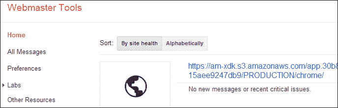
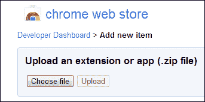
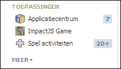
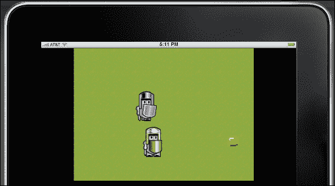

# 第八章。让你的 HTML5 游戏适应分销渠道

当你的游戏最终准备好让全世界看到时，是时候考虑可能的发行渠道了。你想让人们在他们的浏览器中玩你的游戏吗？也许你想让他们用平板电脑或智能手机来玩，无论是在浏览器中还是作为应用。在本章中，我们将研究这些不同的选项，以及要成功实施需要做些什么。

在本章中，您将学习:

*   为网络浏览器准备游戏
*   为移动网络浏览器做出调整
*   将你的游戏发布为谷歌浏览器网络应用
*   把游戏变成安卓应用
*   让你的游戏可以在脸书玩
*   实现 AppMobi 的直接画布

# 为网络浏览器准备游戏

在开发期间，你一直在网络浏览器中测试你的游戏。那么，您的本地服务器和公共或生产服务器有什么区别呢？

就在向公众发布你的游戏之前，你需要烘焙它。**烘焙**游戏无非就是压缩代码。这有两个优点:

1.  压缩代码比未压缩代码更快地加载到浏览器中。更短的加载时间总是一个很大的优势，尤其是对于第一次玩你的游戏的人。这些人还不知道你的游戏非常棒，不想浪费时间看加载栏。
2.  烘焙的代码也更难阅读。您所有不同的模块，整齐地排列在不同的文件中，现在与 ImpactJS 引擎一起在一个文件中。这使得普通的 Joe 更难从浏览器中复制并粘贴您宝贵的源代码，并在他或她自己的游戏中使用它。然而，它并不能保护真正知道自己在做什么的人；代码没有被加密，只是被压缩了。

烘焙工具你的游戏自带你下载的 ImpactJS 引擎。在你游戏的`root`目录的`tools`文件夹中，你应该有四个文件:`bake.bat`、`bake.php`、`bake.sh`和`jsmin.php`。按照以下步骤烘焙您的游戏:

1.  用文本编辑器打开`bake.bat`文件，会发现如下一行:

    ```html
    php tools/bake.php %IMPACT_LIBRARY% %GAME% %OUTPUT_FILE%
    ```

2.  将`php`更改为 XAMPP 或 WAMP 服务器中`php.exe`文件的目录。对于默认的 XAMPP 安装，该行现在将如下所示:

    ```html
    C:/xampp/php/php.exe tools/bake.php %IMPACT_LIBRARY% %GAME% %OUTPUT_FILE%
    ```

3.  Save and close the `bake.bat` file and double-click on it to run it. On Windows, a command window will open and a `game.min.js` script will be created in your game's `root` directory, as shown in the following screenshot:

    

`game.min.js`脚本现在包含了我们所有的代码。我们现在需要做的就是在我们游戏的`root`目录中更改`index.html`文件，这样它就会寻找`game.min.js`而不是`impact.js`和`main.js`脚本。

打开`index.html`文件，找到如下代码:

```html
<script type="text/javascript" src="lib/impact/impact.js"></script>
<script type="text/javascript" src="lib/game/main.js"></script>
```

用我们新的紧凑版本的代码替换之前的代码，如下面的代码片段所示:

```html
<script type="text/javascript" src="game.min.js"></script>
```

你现在可以剥离你的游戏文件夹中除`index.html`和`game.min.js`以外的所有代码文件，并上传到你的服务器。如果你购买了自己的网络空间，你可以使用免费的文件传输协议程序，如**文件传输协议**来做到这一点。

我们的游戏现在已经可以发行了，通过把它加载到网络服务器上，你就已经可以让任何人使用它了。然而，我们还没有考虑移动设备上的浏览器。在我们调查之前，让我们快速回顾一下。

综上所述，结论如下:

*   在向公众发布我们的游戏之前，我们应该先烤一烤。烘焙游戏基本上就是压缩源代码。烘焙有两大优势:
    *   游戏被更快地加载到浏览器中。
    *   代码变得更难阅读，因此更不容易被盗。然而，代码并没有加密，所以对于一个专门的人来说，撤销烘焙仍然非常容易。
*   为了烘焙游戏，我们会在运行之前更改`bake.bat`文件。这个过程创建了一个`game.min.js`脚本。
*   在上传我们的游戏到服务器之前，我们在我们的`index.html`文件中包含`game.min.js`而不是`main.js`和`impact.js`。

# 为移动网络浏览器准备我们的游戏

如果你考虑到人们使用智能手机玩你的游戏的可能性，你已经实现了触摸屏控制。这方面的一个例子可以在[第 5 章](05.html "Chapter 5. Adding Some Advanced Features to Your Game")、*给你的游戏增加一些高级功能*中找到。然而，有时这还不够。您希望玩家能够像使用电脑一样使用智能手机。要做到这一点，我们可以引入**虚拟按钮** 。这些虚拟按钮是屏幕上的区域，就像普通键盘按键一样。我们可以使用`index.html`文件中的 **CSS** ( **层叠样式表**)代码来创建这些。我们可以为玩家的每个动作设置按钮。在我们的 RPG 中，他需要能够全方位行走和射击。在侧滚游戏中，他可以向左或向右移动，飞行和射击。假设我们把飞行和向上运动分开。下面的截图显示了我们的按钮波形图:


以下是创建虚拟按钮的步骤:

1.  打开`index.html`文件，在画布的 CSS 代码下面添加以下代码。如果您使用带有 ImpactJS 引擎示例的`index.html`文件，该文件应该已经包含画布的以下样式代码。此外，[第 3 章](03.html "Chapter 3. Let's Build a Role Playing Game")、*让我们构建一个角色扮演游戏*和[第 4 章](04.html "Chapter 4. Let's Build a Side Scroller Game")、*让我们构建一个侧滚游戏*中的`index.html`文件包含以下画布 CSS 代码:

    ```html
    .button {
      background-image: url(media/iphone-buttons.png);
      background-repeat: no-repeat;
      width: 192px;
      height: 32px;
      position: absolute;
      bottom: 0px;
    }
    -webkit-touch-callout: none;
    -webkit-user-select: none;
    -webkit-tap-highlight-color: rgba(0,0,0,0);
    -webkit-text-size-adjust: none;#buttonLeft {
      position: absolute;
      top: 50%;
      left: 10%;
      width: 32px;
      background-position: -32px;
      height: 32px;
      visibility:hidden;
    }
    ```

2.  首先，我们定义我们的全按钮托盘。它的高度为 32 像素，宽度为 192 像素(六个按钮，每个 32 像素宽)。
3.  在这个按钮内，我们可以分别定义六个不同的部分。这里你可以看到左边按钮的 CSS 代码。其他五个按钮使用完全相同的代码，除了它们的背景位置，因为这是它们在`iphone-buttons.png`图像上的位置。例如，对于左按钮，位置是`-32`，对于右按钮，位置是`0`，对于上按钮，位置是`-64`，因为它是第三排。`webkit`命令是为了保持布局整洁，如预期的那样。如果不提供这些命令，用户可能会无意中通过点击屏幕来更改缩放或颜色。
4.  然而，我们只希望我们的按钮在移动设备上显示。让我们在`index.html`文件中用一小段 JavaScript 代码来控制它，如下面的代码片段所示:

    ```html
    <script type="text/javascript">
      <!--//test if it is a mobile device-->
    varisMobile= {
        Android: function() {
          return navigator.userAgent.match(/Android/i) ? true : false;
        },
        BlackBerry: function() {
          return navigator.userAgent.match(/BlackBerry/i) ? true : false;
        },
        iOS: function() {
          return navigator.userAgent.match(/iPhone|iPad|iPod/i) ? true : false;
        },
        Windows: function() {
          return navigator.userAgent.match(/IEMobile/i) ? true : false;
        },
        any: function() {
          return (isMobile.Android() || isMobile.BlackBerry() || isMobile.iOS() || isMobile.Windows());
        }
      };
      function mobileButtons(){
        <!-- show the mobile buttons -->
        if(isMobile.any()){
          document.getElementById('buttonLeft').style.visibility = 'visible';
          document.getElementById('buttonRight').style.visibility = 'visible';
          document.getElementById('buttonUp').style.visibility = 'visible';
          document.getElementById('buttonDown').style.visibility = 'visible';
          document.getElementById('buttonShoot').style.visibility = 'visible';
          document.getElementById('buttonJump').style.visibility = 'visible';
        }
      };
    </script>
    ```

5.  在这个脚本的第一部分，我们定义了局部变量`isMobile`。如果检测到移动设备，则设置为`true`，否则设置为`false`。在第二部分中，如果`isMobile`是`true`，我们将 CSS 对象的可见性设置为`visible`。请记住，当我们在`index.html`的 CSS 部分创建它们时，它们的可见性被设置为`hidden`。
6.  All that remains to do within our `index.html` file is adding these buttons as the `<div>` elements next to our `canvas` element, as shown in the following code:

    ```html
    <body onLoad='mobileButtons()'>
      <div id="game">
        <canvas id="canvas"></canvas>
     <div class="button" id="buttonLeft"></div>
     <div class="button" id="buttonRight"></div>
     <div class="button" id="buttonUp"></div>
     <div class="button" id="buttonDown"></div>
     <div class="button" id="buttonShoot"></div>
     <div class="button" id="buttonJump"></div>
      </div>
    </body>
    ```

    `index.html`文件现在有按钮，只有在检测到移动设备时才会显示，但它还没有让我们的游戏为此做好准备。为此，我们需要改编我们的`main.js`脚本。

7.  打开`main.js`并将以下代码添加到您的`game`实例的`init()`方法中:

    ```html
    if(ig.ua.mobile){
      // controls are different on a mobile device
      ig.input.bindTouch( '#buttonLeft', 'Left' );
      ig.input.bindTouch( '#buttonRight', 'Right' );
      ig.input.bindTouch( '#buttonUp', 'Up' );
      ig.input.bindTouch( '#buttonDown', 'Down' );
      ig.input.bindTouch( '#buttonJump', 'changeWeapon' );
      ig.input.bindTouch( '#buttonShoot', 'attack' );
      //alert('control setup');
    }else{
      //initiate background music
      var play_music = true;
      var music = ig.music;
      music.add("media/music/backgroundMusic.ogg");
      music.volume = 0.0;
      music.play();
    }
    ```

8.  如果检测到移动设备，虚拟按钮被绑定到游戏输入状态。例如，`<div>`元素`buttonLeft`将绑定到输入状态`Left`。
9.  `else`语句中的代码会打开背景音乐(如果有的话)。正如[第 6 章](06.html "Chapter 6. Music and Sound Effects")、*音乐和音效*所述，一些移动设备不允许声音重叠。因此，对于手机来说，关闭背景音乐是明智的，这样它就不会与其他音效重叠。这可能不会永远是一个问题，但现在考虑这些合理的问题是明智的。
10.  We will also need to adapt our canvas size so that it fits on the screen of the smartphone or iPad. Replace the default canvas call:

    ```html
    ig.main('#canvas', OpenScreen, 60, 320, 320,2);
    ```

    使用以下代码替换默认画布调用:

    ```html
    if( ig.ua.iPad ) {
      ig.main('#canvas', MyGame, 60, 240, 160, 2);
    }
    else if( ig.ua.mobile ) {
      ig.main('#canvas', MyGame, 60, 160, 160, 2);
    }
    else {
      ig.main( '#canvas', OpenScreen, 60, 320, 320, 2 );
    }
    ```

11.  所有这些都是用不同的画布大小初始化游戏，这样它就可以放在更小的屏幕上，比如 iPads(或其他平板电脑)和智能手机。此外，这里跳过介绍屏幕；这是一个选择，你可以把它放在手机里。此外，您还可以针对更多设备调整画布大小。这里只显示了 iPad 和所有其他移动设备，但当然更多的差异化是可能的。

万岁！你的游戏现在可以移动了！上线前别忘了烤一下；移动互联网没有普通的 Wi-Fi 快，所以让你的文件变小在这里绝对算数。

接下来，我们将在看一下为 **Chrome 网络商店**制作一个移动网络应用，但是首先让我们快速回顾一下如何为移动浏览器准备我们的游戏。

综上所述，结论如下:

*   如果我们想让我们的玩家在移动设备上有一个好的游戏体验，我们需要调整我们的游戏界面来适应这一点。我们通过添加虚拟按钮来实现。
*   虚拟按钮的视觉方面是使用 CSS 和`index.html`中的图像文件创建的。我们可以使按钮可见或隐藏，这取决于游戏是否在移动设备上进行。
*   在我们游戏的`main`脚本中，我们需要将这些按钮绑定到游戏动作状态，以便获得与键盘相同的功能。
*   此外，我们可以更改游戏屏幕分辨率和大小，使其更适合玩家使用的设备。

# 将游戏变成谷歌 Chrome 网络商店的网络应用

网络应用是运行在浏览器本身的应用，而不是运行在移动设备的操作系统上。要在谷歌 Chrome 网络商店发布一款网络应用，你需要一个谷歌 Chrome 开发者账号，一次性收费 5 美元。您将需要一个谷歌网站管理员帐户来确认谷歌为您提供的链接的所有权。此外，为了不使事情变得比他们需要的更难，获得一个免费的 AppMobi 帐户是明智的。你可以在他们的网站上这样做:[http://www.appmobi.com](http://www.appmobi.com)。AppMobi 是一个非常有趣的初学者工具，主要有三个原因:

1.  他们简化了将游戏推向几个不同分销渠道的过程。
2.  他们对你的应用或游戏的前 10，000 名用户不收费，让你先赚钱，然后他们再让你分他们一杯羹；一个非常有吸引力的定价方案。
3.  ImpactJS XDK(跨环境开发工具包)通过创建人工视口帮助游戏适应不同的移动设备。它包含许多其他有用的功能，如模拟位置检测。

AppMobi 有助于为以下平台构建游戏版本:iOS、安卓、AppUp、亚马逊、Nook、脸书、Chrome、Mozilla 和 hostMobi(它们自己的云主机服务)。

订阅后，您可以安装他们的 ImpactJS XDK 进行开发。在安装 XDK 时，它在你的 Chrome 浏览器中变得很容易访问，地址栏旁边有一个插件图标，如下图所示:


你可以登录 app hub:app mobi 控制面板来访问他们的所有服务。我们现在特别感兴趣的是构建一个谷歌 Chrome 游戏。以下是构建 Chrome 游戏的步骤:

1.  On first login, you will need to add a new game to your control center by clicking on the button shown in the following screenshot:

    

2.  Give your game a name and upload it in a zipped format to the server, as shown in the following screenshot:

    

3.  You will see the different distribution channels for which AppMobi allows you to prepare a file, as shown in the following screenshot:

    

4.  Before we can build ourselves a Chrome `ready` file, we will need to promote our file to production by pressing the **PROMOTE** button, as shown in the following screenshot:

    

5.  We want to build a game for Chrome, so check out the issues you still have. Chances are you will only need to add an icon for the game. But you do this just before building the game, as shown in the following screenshot:

    

6.  If all goes well, you should be able to download a `production` file which you then need to upload to the Chrome Web Store using the button shown in the following screenshot:

    

7.  差不多是时候把文件上传到 Chrome 网络商店了。但是，在此之前，请打开您刚刚从 AppMobi 网站下载的压缩文件夹，并确保 Chrome 图标的名称与 AppMobi 添加的`manifest.json`文件中所述的名称完全相同。这是一个已知的问题，Chrome 不接受不一致的命名。
8.  If you upload for the first time, you will receive a message saying you need to verify ownership of a domain Google provides you with. To do this, you must insert the tagged HTML file Google allows you to download into the bundle you first uploaded to AppMobi and reupload your game to AppMobi, this time with the verification file inside the zipped bundle. In AppMobi, use the **UPDATE QA** button to upload a new file. Also don't forget to promote to production afterwards.

    

9.  In the Google webmaster tool, you add the link provided by Google and verify it, as shown in the following screenshot:

    

10.  You can now reupload to the Chrome Web Store and fill out all the necessary elements. You will need to add a detailed description of your game, the pricing scheme, and screenshots using the button shown in the following screenshot:

    

如果一切顺利，你将能够测试你的游戏作为一个网络应用，因为它变得可供你添加到你的谷歌浏览器。如果出了问题，AppMobi 有大量关于他们服务的文档和如何使用它们的信息。

我们现在有了一个网络应用，但是我们可以通过大致相同的过程来获得一个真正的应用。在这本书里，我们将以安卓为例。在此之前，让我们快速回顾一下。

综上所述，结论如下:

*   网络应用是在浏览器中运行的应用，而不是直接在设备的操作系统上运行的应用。谷歌浏览器在其谷歌浏览器网络商店中有这样的网络应用。在商店发布需要 5 美元的一次性订阅费。
*   AppMobi 提供了一种简单的方法来构建网络应用和一般应用。注册是免费的，但是一旦游戏达到一定的成功程度，就需要付费。
*   烘焙的游戏需要压缩并上传到 AppMobi 服务器。在这里，它将被 AppMobi 改编，你可以再次下载并上传到 Chrome 开发者账户。
*   谷歌为您提供了一个链接，您需要将该链接重新发布到 AppMobi，并使用谷歌网站管理员帐户进行验证。
*   验证链接后，您可以将游戏重新放入网络商店，并填写游戏描述等详细信息。
*   你可以先在浏览器中测试你的游戏，然后再提交审查并向公众发布。

# 将你的游戏推送到安卓的谷歌游戏商店

现在我们已经知道如何构建网络应用，让我们为**谷歌 play** 商店构建一个实际的移动应用。我们将再次使用我们的 AppMobi 帐户来完成工作。然而，除此之外，你还需要一个谷歌开发者账户，每年定价 25 美元，用于在谷歌游戏商店发布你的游戏。以下是将游戏推送到谷歌游戏商店的步骤:

1.  使用上传到 **AppMobi appHub** 的`Upload game`包或者上传一个新的。
2.  选择**安卓**选项卡下的**构建**，修复您仍然存在的任何问题。如果你成功构建了 Chrome 商店网络应用，应该只剩下一个问题:设置谷歌云消息。为此，您需要一个**谷歌项目 ID** 和一个 **API 密钥**；您需要从您的开发人员帐户中获取这两者。
3.  在[https://play.google.com/apps/publish/signup](https://play.google.com/apps/publish/signup)注册一个开发者账号，如果你已经有了，就登录。
4.  转到你的**谷歌 API**控制台，创建一个新项目。您可以从[https://code.google.com/apis/console/](https://code.google.com/apis/console/)选择您的项目编号。
5.  Enable **Google Cloud Messaging for Android** in the **Services** section, as shown in the following screenshot:

    

6.  在控制中心的**应用编程接口访问**部分选择**创建新的服务器密钥**。创建新服务器后，您还会收到应用编程接口密钥。
7.  Return to the AppMobi appHub where you fill out both the project ID and the API key. You have now set up push messaging. The following screenshot shows the screen after completion of push messaging setup:

    

8.  Your app should now be ready to build. Do so and download the `apk` file by clicking on the **BUILD NOW** button, as shown in the following screenshot:

    

9.  您现在需要做的就是将这个文件上传到您的开发人员控制台。谷歌将要求你填写一个名字，描述，并添加一些截图。完成后，你们都准备好了。

在将你的应用发送给 play store 审核之前，给你一个建议:在几个移动设备上测试你从 AppMobi 下载的`build`文件是否流畅。这可以通过将您的文件上传到自己的网站并使用智能手机下载来实现。或者，您可以使用免费的云存储服务，如 **Dropbox** 将文件从云中传输到您想要测试的任何设备上。

现在我们已经建立了一个应用和一个网络应用，我们将深入研究一种在**脸书**上发布你的游戏的方法。在此之前，让我们快速回顾一下。

综上所述，结论如下:

*   用 AppMobi 构建一个应用几乎和构建一个 web 应用是同一个过程。然而，为了将你的游戏发布为应用，你需要一个谷歌开发者账户，价格为每年 25 美元。
*   如果你还没有上传你的压缩`game`文件到 AppMobi appHub。确保从谷歌 API 接收到项目标识和 API 密钥。
*   构建您的`android`文件，并将其上传到您的开发人员帐户，您可以将其发送到该帐户进行审查。但是，在这样做之前，请务必在几个安卓移动设备上测试您的游戏。

# 让你的游戏在脸书上线

AppMobi 可以用来建立一个脸书应用，但脸书也允许另一个选项来展示你的游戏。你需要一个脸书开发者账号来配合你的脸书账号。目前没有订阅费。您可以访问以下链接获取您的脸书开发商帐户:

[http://developers.facebook.com](http://developers.facebook.com)

如果你已经在自己的网站上启动并运行了游戏，脸书允许你在网站上设置游戏的视窗。

以下是让您的游戏在脸书可用的步骤:

1.  In the app section of your account, create a new app by clicking on the following button:

    

2.  Fill out the **App on Facebook** section, as shown in the following screenshot. If your game can also be viewed by mobile devices, you can also fill out the **Mobile Web** section. Make sure **sandbox mode** is on until you have tested everything thoroughly.

    

3.  Go to the **App Details** page where you need to fill out some basic information about your game: category, description, and some screenshots. Once you are ready, you can preview your game by clicking on one of the following buttons:

    

4.  Try going back to your own profile page and you will find your game in your applications list, as shown in the following screenshot. Click on it to play and beta test your own Facebook game.

    

这不是把你的游戏送到脸书的唯一方法。你可以使用 AppMobi 制作一个真正的脸书应用。然而，一旦你的游戏结束，并且在网络服务器上的某个地方，这是一个在脸书上获得它的非常快速的方法。这种方法还有一个很大的优势:游戏仍然在你控制的服务器上，脸书只是提供了一个视口。这意味着如果脸书改变了一些东西，这对你的游戏兼容性几乎没有影响，你也不会被要求在任何地方改变代码。

作为本章的最后一个主题，我们将快速了解 AppMobi 的直接画布实现。这是一个有趣的概念，因为它允许游戏比其他情况下运行得更快。然而，首先让我们回顾一下。

综上所述，结论如下:

*   有几种方法可以把你的游戏带到脸书。由于我们已经使用 AppMobi 构建了应用，我们研究了视口解决方案。
*   你需要你的游戏在一个服务器和一个免费的脸书开发者账号上运行。
*   转到**应用**部分，使用普通画布和/或移动网址创建一个新应用。还要填写所有的应用细节。
*   在发布游戏之前，测试版会彻底测试你的游戏。你可以在你自己的个人脸书页面中找到你在应用之间的游戏。

# 用 AppMobi 直接画布游戏加速

HTML5 游戏很棒很棒因为 HTML 和 JavaScript 可以被任何浏览器解释，转换成应用相当简单。容易“部署性”是一个很大的优势，但也有一个相当大的劣势。画布元素为了真实渲染你的游戏而占用的资源是惊人的，一旦你想同时使用许多实体，很容易导致系统延迟。游戏体验没有什么比这么大的帧率下降更糟糕的了，变得像看幻灯片一样。但是，有一些技巧可以改进这一点，例如按照[第 7 章](07.html "Chapter 7. Graphics")、*图形*中的建议预渲染图形。

如果您想利用 direct canvas 提供的性能提升，实现相当简单。然而，首先你需要为 AppMobi ImpactJS XDK 准备你的代码。以下是实现直接画布加速的步骤:

1.  转到 Chrome 网络商店，安装 Impact XDK 扩展。
2.  In the XDK, log in to your AppMobi account and add a new project. Choose your game's `root` folder in your XAMPP (or WAMP) library. The following screenshot shows the button to start a new project:

    

3.  The XDK will warn you that you have not yet included the AppMobi library in your game and you will not be able to make use of the AppMobi commands. Copy the code shown in the following screenshot to your clipboard, as suggested by the pop-up:

    

4.  Open your `index.html` file and paste the script in the `head` section of the document. Your game is now ready to be viewed in the Impact XDK and you can add AppMobi commands to it when necessary, as shown in the following code snippet:

    ```html
    <!-- the line below is required for access to the appMobi JS library -->
    <script type="text/javascript" charset="utf-8" src="http://localhost:58888/_appMobi/appmobi.js"></script>
    <script type="text/javascript" language="javascript">
      // This event handler is fired once the AppMobilibraries are ready
      function onDeviceReady() {
        //use AppMobi viewport to handle device resolution differences if you want
        //AppMobi.display.useViewport(768,1024);
        //hide splash screen now that our app is ready to run
        AppMobi.device.hideSplashScreen();
      }
      //initial event handler to detect when appMobi is ready to roll
      document.addEventListener("appMobi.device.ready",onDeviceReady,false);
    </script>
    ```

    我们现在在 XDK 进行比赛。然而，我们还没有直接的画布加速。

5.  在游戏的`root`文件夹中创建一个名为`index.js`的新脚本，并添加以下代码:

    ```html
    AppMobi.context.include( 'lib/impact/impact.js' );
    AppMobi.context.include( 'lib/game/main.js' );
    ```

6.  打开`index.html`并将`AppMobi`命令添加到`onDeviceReady()`事件监听器中。以下代码将加载`index.js`脚本:

    ```html
    functiononDeviceReady() {
      AppMobi.device.hideSplashScreen();
     AppMobi.canvas.load("index.js");
    }
    ```

7.  移除以下包含游戏和影响引擎脚本的`script`标签:

    ```html
    <script type="text/javascript" src="lib/impact/impact.js"></script>
    <script type="text/javascript" src="lib/game/main.js"></script>
    ```

8.  移除以下`canvas`元素:

    ```html
    <body>
     <canvas id="canvas"></canvas>
    </body>
    ```

9.  打开`main.js`脚本，将以下内容添加到所需脚本列表中:

    ```html
    'plugins.dc.dc'
    ```

10.  如果您对画布样式有任何引用，请将其从代码中移除。例如:`ig.system.canvas.style.width = '320px'`。
11.  最后，删除您在为移动设备准备触摸事件时可能已经实现的触摸事件绑定，并将其替换为 AppMobi 版本。`<div>`元素可以留在`index.html`文件中，但需要附加其他事件。例如，对于`shoot`按钮`<div>`元素:

    ```html
    onTouchStart="AppMobi.canvas.execute('ig.input.actions[\'shoot\']=true;ig.input.presses[\'shoot\']=true;');" onTouchEnd="AppMobi.canvas.execute('ig.input.delayedKeyup.push( \'shoot\' )');"
    ```

恭喜你！您现在已经成功实现了直接画布加速！您可能会注意到，在 Impact XDK 中玩游戏时，画布元素轮廓现已消失，如下图所示:



# 总结

这一章的目标是在以多种方式发布你的游戏时提供必要的技术准备。首先我们看一下烘焙游戏代码的过程，这样可以缩短加载时间，降低源代码的可读性。烘焙应该在分发任何游戏之前进行。然后，我们更深入地通过实现触摸控制来使您的游戏适应移动浏览器。将游戏变成网络应用或安卓应用是在 AppMobi 的帮助下完成的。当出版到脸书，你有几个选择，我们更深入地研究了其中之一。在这个解决方案中，你自己的网站充当了实际的平台，而脸书仅仅提供了一个视窗。在移动设备上，运行游戏时，处理能力和内存使用可能是真正的问题。因此，我们看了一下 AppMobi 的直接画布实现。通过去掉普通的 HTML 画布元素，可以消除大量的开销处理，大大减少了必要的资源。

在下一章，也是最后一章，我们将看看作为 HTML5 游戏开发者，你有哪些赚钱的选择，希望能把一个爱好变成你的工作。