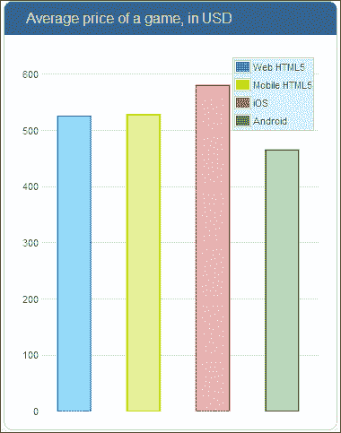

# 第九章。用你的游戏赚钱

在这最后一章中，我们将快速了解一下你可以通过 HTML5 游戏开发赚钱的选择。做游戏可以纯粹作为一种爱好，也可以作为一种职业。然而，后者需要你建立一些相当独特和成功的游戏，因为竞争相当激烈。因此，提供一个独特的游戏主张，辅以健康的营销，似乎是大多数成功游戏开发商的发展之路。在本章中，我们将介绍:

*   当你进入游戏开发时，有几个战略选择
*   在安卓和苹果的应用电路中赚钱
*   游戏内广告的选择及其如何应用于 HTML5 游戏
*   将市场作为向出版商出售发行权的一种方式

# 你的游戏开发策略

如果你想建一个游戏来赚钱，在开始建一个之前，你必须考虑几件事。你需要问自己的第一个问题可能是:我要为谁制作一个游戏？你的目标是每个有能力玩游戏的人，还是你想针对一个非常特定的人群，满足他们的游戏需求？这就是广义目标和小众目标的区别。目标非常广泛的游戏的一个例子是大多数塔防游戏，其中你需要建造具有不同属性的塔来击退一支军队。像俄罗斯方块、宝石迷阵、【扫雷舰 等游戏，以及一般的大多数轻度益智游戏。愤怒的小鸟 是另一个深受广大观众欢迎的游戏例子，因为它简单、可爱的图形和令人难以置信的巧妙营销。

通用中的休闲游戏似乎很吸引大众，原因有以下几个:

*   简单盛行:大多数游戏玩家在几分钟内就习惯了游戏。
*   知识先决条件很少或没有:不期望你已经知道一些背景故事或在这些类型的游戏中有经验。
*   休闲游戏玩家往往做得很好，即使他们投入更少的时间来练习。即使你从一开始就做得很好，你仍然可以变得更好。一个你不能通过重播变得更好的游戏不会持续太久。值得注意的例外是像轮盘赌和老虎机这样的碰运气游戏，它们确实会让人上瘾；但那是出于其他原因，比如赢钱的机会。

构建休闲游戏的主要优势是几乎每个人都是你游戏的潜在用户。因此，可实现的成功可能是巨大的。魔兽世界是一款多年来从相当硬核和小众转向更加休闲的游戏。他们这样做是因为他们已经接触到了大多数普通游戏玩家，并决定说服大众，即使你通常不怎么玩魔兽世界，你也可以玩。试图取悦每个人的缺点是竞争太激烈。在众多游戏中脱颖而出成为一款独特的游戏是非常困难的。如果你没有一个令人印象深刻的营销机器来支持它，这一点尤其正确。

小众游戏的一个很好的例子是任何根据电影制作的游戏。《星际迷航》 《星球大战》 《指环王》 等游戏，大多是针对看过并喜欢那些电影的人。小众游戏也可以是小众的，因为它们只针对特定的游戏玩家群体。例如，喜欢玩 FPS(第一人称射击游戏)游戏的人，每天都在玩。本质上，小众游戏有以下属性(注意，它们反对休闲或目标广泛的游戏):

*   陡峭的学习曲线:掌握需要许多小时的专门游戏。
*   需要一些游戏知识或经验。像 PlanetSide 2 这样的网络射击游戏要求你至少有一些过去射击游戏的经验，因为你要和知道他们在做什么的人对垒。
*   你玩的游戏越多，你得到的有用奖励就越多。玩得多通常会得到让你在游戏中变得更强的物品，从而强化了你已经通过玩得更多而变得更好的事实。

星际争霸是暴雪在 1998 年发布的一款游戏，至今仍在锦标赛中进行，尽管还有后续:星际争霸 2。像最初的星际争霸这样的游戏完全可以在 HTML5 中构建，并在浏览器或智能手机上运行。星际争霸发布时，普通台式电脑的电量比现在的许多智能手机都要少。技术上，道路是开放的；不过，复制同样水平的成功是另一回事。

瞄准一小众玩家的优势是你可以在他们的生活中占据独特的位置。也许你的目标群体中没有很多人，但是你的游戏会更容易吸引和保持他们的注意力，因为它是专门为他们打造的。此外，这并不意味着因为你有一个明确的目标，游戏玩家就不能从意想不到的角落掉进去。你从未想过会玩你的游戏的人仍然会喜欢你所做的事情。正是因为这个原因，了解你的游戏玩家是如此重要，也是为什么像 Playtomic 这样的工具会存在。

小众营销的劣势显而易见:你的游戏极不可能增长到超过某个点；它可能永远不会排在世界上玩得最多的游戏之列。

你要开发的游戏类型是一种选择，你在每一个游戏中投入的细节是另一种选择。你可以尽可能多地投入精力来构建一个你想要的游戏。本质上，一场游戏永远不会结束。一个游戏总是可以有一个额外的关卡，复活节彩蛋，或者另一个不错的小细节。在确定游戏范围时，你必须决定是使用散弹枪还是狙击手开发策略。

在散弹枪策略中，你快速开发和发布游戏。每款游戏都有一个独特的元素，它应该有别于其他游戏:UGP(独特的游戏命题)。但是在散弹枪策略下发布的游戏没有提供很多细节；它们没有抛光。

采用散弹枪策略的优势很多:

*   开发成本低；因此每场比赛都代表低风险
*   上市时间短允许使用世界赛事作为游戏设置
*   你一次在市场上有几个游戏，但通常你只需要一个游戏就能成功，以支付其他游戏的费用
*   短游戏可以免费提供给公众，但可以通过出售附加功能(如关卡)来赚钱

然而，当你采取这种策略时，不仅仅是彩虹和阳光。你不选择散弹枪策略的原因有几个:

*   一个没有感觉完成的游戏比一个完美的游戏成功的几率要小。
*   将你的游戏投放市场不仅测试某个概念是否有效，还会将它暴露给竞争对手，他们现在可以开始构建一个副本。当然，你有先发优势，但这并没有它本来的那么大。
*   你必须时刻注意不要在市场上扔垃圾，否则你可能会毁了你作为开发人员的名声。

但是，不要混淆。霰弹枪策略不是打造平庸游戏的借口。你发布的每一款游戏都应该具有原创性——这是其他游戏所没有的。如果一个游戏没有那种新的味道，为什么会有人比其他游戏更喜欢它呢？

然后当然还有狙击策略，涉及到打造一款像样的，经过深思熟虑的游戏，在最大的关怀和支持下投放市场。这是苹果等分销商敦促开发者做的事情，而且理由很充分——你不会希望你的应用商店里满是蹩脚的游戏，是吗？其他一些游戏发行商，比如 Steam，在他们允许发行的游戏中更加挑剔，使得散弹枪策略几乎不可能实现。但这也是大多数成功的游戏开发者使用的策略。看看诸如 Rockstar(GTA 系列的开发者)、Besthesda (老年卷轴系列的开发者)、Bioware(Mass Effect 系列的开发者)、暴雪(魔兽系列的开发者)等开发者吧。这些都不是小薯条，但他们没有那么多的游戏在市场上。这种开发高质量游戏并希望它们会有回报的策略显然不是没有风险的。为了开发一款真正令人惊叹的游戏，你也需要时间和金钱去做。如果你的游戏卖不出去，这对你或你的公司来说都是一个真正的问题。即使对于 HTML5 游戏来说，情况也可能如此，尤其是因为设备和浏览器的功能越来越强大。当运行游戏的机器变得更强大时，游戏本身往往会变得更复杂，开发时间也会更长。

我们已经了解了进入游戏开发行业需要做出的两个重要选择。现在让我们来看看让你通过游戏赚钱的分销渠道，但在此之前，让我们总结一下我们刚刚讨论的主题:

*   甚至在你开始开发你的游戏之前，决定你想要瞄准谁是极其重要的。
*   广泛瞄准几乎没有瞄准。它是关于让尽可能多的人可以接触到并喜欢一个游戏。
*   小众定位是对某一特定人群进行更深层次的审视和兴趣，并构建一款适合其特定游戏需求的游戏。
*   在开发和发布游戏时，有两大策略:猎枪和狙击手。
*   在散弹枪策略中，你可以快速发布游戏。每一款游戏都有其他游戏所没有的独特元素，但它们并不像它们可能的那样精致或精致。
*   使用狙击策略，你只能构建几个游戏，但是每个游戏在发布的时候已经很完善了，只需要在发布补丁的时候稍微打磨一下。

# 用游戏应用赚钱

如果你把游戏构建成一个应用，你有几个分销渠道可以求助，比如火狐市场、英特尔 pUp 中心、Windows Phone Store 、亚马逊 Appstore 、SlideMe 、Mobango 、Getjar 和苹果 app fire。但目前市场上最受欢迎的玩家是 **【谷歌 Play】**和 **iOS 应用商店** 。iOS 应用商店不要和苹果应用商店混淆。iPad 和 Mac 有两个不同的操作系统，iOS 和 Mac OS，所以它们有独立的商店。游戏可以在 iOS 和苹果商店中发布。谷歌 Play 和 **Chrome 网络商店** 之间也可能存在一些混淆。谷歌 Play 包含所有适用于搭载谷歌安卓操作系统的智能手机的应用程序。Chrome 网络商店允许您将应用程序添加到谷歌 Chrome 浏览器中。因此，有相当多的分销渠道可供选择，在这里，我们将快速查看谷歌游戏、iOS 应用商店和 Chrome 网络商店。

## 谷歌游戏

谷歌 Play 是安卓的默认应用商店，也是 iOS 应用商店最大的竞争对手。

如果你想成为一名安卓应用开发者，你必须阅读 25 美元的费用和开发者分配协议。

作为入场费和签署这份协议的回报，他们允许你使用他们的虚拟货架，并拥有它的所有好处。你可以随心所欲地设定价格，但每卖出一款游戏，谷歌就会套现 30%左右。做一些地质价格歧视是可能的。所以你可以把价格定在，比方说比利时的€1，而德国的€2。你可以随时改变价格；然而，如果你免费发布一款游戏，就没有回头路了。之后将这款应用货币化的唯一方法是允许游戏广告、出售插件或创造一种可以用真金白银购买的游戏内货币。

引入一种用真金白银购买的游戏内货币可能是一种非常吸引人的形式。这种货币化方案的一个真正成功的例子可以在蓝精灵游戏中找到。在这个游戏中，你建造了自己的蓝精灵村，里面有大蓝精灵、蓝精灵和很多蘑菇。随着你种植更多的庄稼和建造新房子，你的城市变得越来越大，但这是一个缓慢的过程。为了加快速度，你可以购买特殊的浆果来换取真金白银，这反过来又可以让你建造专属蘑菇和其他东西。这种货币化方案变得非常受欢迎，就像在传奇联盟、星球大战 2 、坦克世界和许多其他游戏中所展示的那样。对于谷歌 Play 应用，这种应用内支付系统由安卓的谷歌结账支持。

此外，Google 允许您访问游戏的一些基本统计数据，例如玩家数量和他们玩的设备，如下图所示:


像这样的信息允许你重新设计你的游戏来提高你的成功。例如，你可能会注意到某个设备没有那么多独特的用户，尽管它是一个非常受欢迎的设备，被许多人购买。如果是这样的话，也许你的游戏在这个特定的智能手机或平板电脑上看起来不太好，你应该为此进行优化。

所有应用最大的竞争对手和发起者是 iOS 应用商店，让我们看看这个。

## iOS 应用商店

iOS 应用商店是同类商店中的第一家，在撰写本书时，它仍然拥有最大的收入。

为了在 iOS 应用商店发布应用，你需要订阅 iOS 开发者计划，该计划每年收费 99 美元——几乎是谷歌 Play 订阅费的四倍。实际上，他们提供的东西和谷歌游戏差不多；从这个简短的列表中可以看出:

*   你选择自己的价格，获得 70%的销售收入
*   您无需信用卡、托管或营销费用即可获得每月付款
*   有支持和足够的文档来帮助您开始

更重要的是，以下是谷歌 Play 和 iOS 应用商店之间的区别:

*   如前所述，注册谷歌 Play 更便宜。
*   苹果的筛选流程似乎比谷歌 Play 更严格，导致上市时间更长，甚至永远不上市的几率更高。
*   谷歌 Play 加入了退款选项，如果你的应用程序的购买者在 24 小时内卸载该应用程序或游戏，他或她可以获得退款。
*   如果你想让你的游戏使用一些安卓核心功能，这是可能的，因为平台是开源的。另一方面，苹果非常保护自己的 iOS 平台，不允许应用程序有同样程度的灵活性。这个元素对于游戏来说似乎还没有那么重要，但是对于那些想要利用这种自由的非常创新的游戏来说可能是如此。
*   iOS 接触到的人比安卓多，尽管目前的趋势表明，这种情况在不久的将来可能会改变。
*   购买苹果设备的人群和使用安卓操作系统的智能手机或平板电脑的用户似乎有很大的不同。与安卓用户相比，苹果粉丝在他们的应用程序上花钱的门槛往往较低。总的来说，iPads 和 iPhones 比其他平板电脑和智能手机更贵，吸引了那些在设备上花更多钱也没问题的人。目标群体的这种差异似乎让安卓游戏开发者更难从他们的游戏中赚钱。

### 类型

如果您的游戏在 Safari 浏览器上运行，并不意味着它已经准备好在 iOS 应用商店中被接受。把你的游戏变成一个原生应用需要额外的准备。Chrome 浏览器和谷歌游戏商店也是如此。从浏览器游戏到 app 的转换可以使用 AppMobi 完成，如[第 8 章](08.html "Chapter 8. Adapting Your HTML5 Game to the Distribution Channels")、*将你的 HTML5 游戏改编到发行渠道*所示。

我们将在这里讨论的销售应用程序的最后一个选项是 Chrome 网络商店。

## Chrome 网络商店

Chrome 网络商店与谷歌 Play 和 iOS 应用商店的不同之处在于，它专门为 Chrome 浏览器而不是移动设备提供应用。

Chrome 商店提供网络应用。网络应用程序就像你会安装在你的电脑上的应用程序，除了网络应用程序安装在你的浏览器中，并且大部分是使用 HTML、CSS 和 JavaScript 编写的，就像我们的 ImpactJS 游戏一样。Chrome 商店值得注意的第一件事是发布应用程序的一次性 5 美元入场费。如果这本身还不够好，出售应用的交易费只有 5%。这对谷歌 Play 和 iOS 应用商店来说都是一个显著的不同。如果你已经在为自己的网站开发一款游戏，并将其打包为安卓和/或苹果的应用程序，你也可以在 Chrome 网络商店上推出它。将你的 ImpactJS 游戏转化为 Chrome 商店的网络应用程序可以使用 AppMobi 来完成，但是谷歌自己提供了如何手动完成这一操作的详细文档。

网络应用程序的最大好处之一是简化了许可过程。假设您的 web 应用程序需要用户的位置才能工作。虽然 iPad 应用程序每次需要位置数据时都会请求许可，但网络应用程序只会请求一次许可:在安装时。

此外，你有相同的功能和支付方式在谷歌玩，给或拿。例如，也可以选择加入免费试用版，也称为 freemium。免费模式是指你允许免费下载一个演示版本，并可以选择以一定的价格将其升级到完整版本。蓝精灵游戏也使用 freemium 模式，尽管有所不同。整个游戏是免费的，但是玩家可以选择支付真金白银来购买东西，否则他们将花费大量时间来购买。在这种免费模式下，你为方便和独特的物品付费。例如，在 PlanetSide 2 中，根据你选择如何玩 freemium 游戏，获得一把狙击枪可能需要几天或 10 美元。

如果你计划为安卓发布一款 ImpactJS 游戏，没有真正的理由不为 Chrome Web Store 这么做。

话虽如此，让我们快速回顾一下:

*   iOS 应用商店是唯一的应用商店的时代早已过去；有一系列令人印象深刻的应用商店可供选择，其中包括火狐市场、英特尔 AppUp 中心、Windows Phone Store、亚马逊 Appstore、SlideMe、Mobango、Getjar、Appsfire、Google Play 等。
*   目前最大的应用商店是谷歌游戏和 iOS 应用商店。它们在几个方面差异很大，其中最重要的是:
    *   订阅费用
    *   筛选过程
    *   他们吸引的观众类型
*   Chrome 网络商店销售的网络应用程序与普通应用程序类似，但在 Chrome 浏览器中可用。
*   Chrome 网络商店既便宜又容易订阅。你一定要在这个平台上发布你的游戏。

# 游戏内广告

游戏内广告是用你的游戏赚钱的另一种方式。游戏内广告是一个不断增长的市场，目前已经被各大公司使用；巴拉克·奥巴马在 2008 年和 2012 年的竞选中也使用过它，如下图游戏截图所示:


有一种趋势是更有活力的游戏内广告。游戏制造商确保游戏中有广告的空间，但实际的广告本身是以后决定的。根据对你的了解，这些可以改变，成为与你相关的玩家和现实生活中的消费者。

当刚开始制作游戏时，游戏内广告并没有那么引人注目。大多数最知名的在线游戏游戏内广告商甚至不希望他们的广告出现在创业游戏中。

对谷歌 AdSense 的要求如下:

*   **游戏玩法**:每天最低 50 万
*   **游戏类型**:仅基于网络的 Flash
*   **集成**:必须具备 SDK 集成的技术能力
*   **流量来源**:80%的流量必须来自美国和英国
*   **内容**:家庭安全型，面向 13 岁及以上用户
*   **分发**:必须能够报告嵌入的目的地，并且能够控制游戏的分发位置

对另一个大竞争对手 Ad4Game 的要求也不温和:

*   每天至少有 1 万名独特访客
*   不接受子域和博客
*   Alexa 排名应该低于 40 万
*   不允许成人/暴力/种族主义内容

如果你只是起步，这些前提条件都不是好消息。不仅仅是因为你甚至在开始广告之前就需要这么多的玩家，还因为目前所有的支持都流向了 Flash 游戏。HTML5 游戏还没有得到完全支持，尽管这可能会改变。

幸运的是，有一些公司允许你开始使用广告，即使你每天没有 10，000 名访客。Tictacti 就是其中一家公司。

再说一次，几乎所有的支持都给了 Flash 游戏，但是他们有一个选项可以用于 HTML5 游戏:**预滚**。预滚简单来说就是在你可以开始游戏之前出现一个带有广告的屏幕。预卷广告的集成相当简单，不需要更改游戏，只需要更改您的`index.html`文件，如 Tictacti 的以下示例:

```html
//You can use publisherId 3140 and tagTypedemoAPI for testing purposes however the ads will not be credit to you.
<html>
<head>
  <title>Simple Ad</title>
</head>
<body>
<script type="text/javascript"src="http://cdn.tictacti.com/widgets/js/t3widgets.js"></script><script type="text/javascript">
  var publisherId = "3140";var tagType = "jsGameAPI";var agencyUniqueId= "0";var playerWidth = "600";//The Game widthvar playerHeight = "400";//The Game heightvar t3cfg = {wrapperUrl: 'engine/game/3170/tttGameWrapper.swf',
config: { enableDM: false, tttPreloader: false, bgcolor: "#000000", engineConnectorType: 7 , externalId:agencyUniqueId},
    onClose:function(){document.location="http://www.tictacti.com";}
    //Called after the ad is closed. In the Demo after 30 seconds.};
  TicTacTi.renderWidget(publisherId, tagType, playerWidth ,playerHeight , t3cfg);
</script>
</body>
</html>
```

在将这个添加到你游戏的`index.html`文件时，你填写自己的发布者 ID，你就基本上准备好了。

tictacti类似于 Google Analytics，它也为你提供了一些关于你游戏网站上广告的相关信息，如下图所示:


然而，要小心，卷前广告是最侵入性和令人讨厌的广告类型之一。从技术上来说，它甚至根本不是游戏内广告，因为它在你玩游戏之前就运行了。如果你的游戏还没有建立好，不足以说服玩家在能够玩之前忍受广告，不要选择这个选项。在让你的游戏玩家经历这些之前，给你的游戏一些时间来建立声誉。

作为最后一个选择，我们将看看如何使用 MarketJS 出售您的实际分销权。但是让我们首先简要回顾一下游戏内广告:

*   游戏内广告是一个不断增长的市场。甚至巴拉克·奥巴马也利用游戏中的广告牌来支持他的竞选。
*   有一种趋势是更动态的游戏内广告——使用你的位置和人口统计信息来调整游戏中的广告。
*   目前，即使是提供在线游戏内广告的最容易接近的公司也专注于 Flash 游戏，甚至在允许你展示他们的广告之前，就需要许多独特的访问者。Tictacti 是一个值得注意的例外，因为它的先决条件较低，并且易于实现；尽管广告目前只限于滚动广告。
*   始终注意首先为你的游戏建立一个正面的声誉，然后允许广告。

# 通过市场销售分销权

本章我们要调查的最后一个选项是出售你游戏的发行权。你仍然可以通过把你的游戏发布到所有的应用商店和你自己的网站上来赚钱，但是它变得越来越难被注意到。质量只有在人们知道它存在的情况下才能占上风，因此制作一个好的游戏有时是不够的——你需要营销。如果你是一个游戏新手，有很棒的游戏创意和支持这些创意的技能，那很好，但营销可能不是你喜欢的。这就是市场发挥作用的地方。

MarketJS 充当你作为游戏开发者和游戏发行商之间的中介。

一旦有了游戏，程序就很简单了:

1.  你在他们的网站上注册，http://www.marketjs.com。
2.  将游戏上传到自己的网站或直接上传到 MarketJS 服务器。
3.  Post your game for publishers to see. You set several options such as the price and contract type that would suit you the best. You have five contract options:
    *   **完成发行合同**:出售你对游戏的所有发行权。
    *   **独家发行合作伙伴合同** : 在这里你限制自己与一个发行商合作但仍然保留游戏的权利。
    *   **非独家合同**:在这里，任何发行商都可以购买你游戏的使用权，但是你想卖多久就可以继续卖多久。
    *   **收益分成**:这里你协商如何分割游戏产生的收益。
    *   **定制合同**:这个可以基本上没有任何条款。如果你还不确定你想从游戏中得到什么，你可以选择这个选项。您填写合同首选项的网页的一部分显示在以下屏幕截图中:

    

在你发布了一个演示后，你需要等待一个出版商发现它，被它的华丽所震撼，并提出与你合作。

MarketJS 对游戏领域的巨大贡献就是这种让游戏开发者专注于开发游戏的能力。其他人负责营销方面，这是一个完全不同的游戏。

MarketJS 还提供了一些有趣的统计数据，比如他们网站上一款游戏的平均价格，如下图所示。它让你对你是应该以游戏开发为生还是继续把它作为一种爱好有所了解。



根据 MarketJS 的数据，非独家版权的平均价格在 500 到 1000 美元之间，而出售某个游戏的独家版权价格在 1500 到 2000 美元之间。如果你能在这个价格范围内打造一款像样的游戏，你就已经准备好了:

*   MarketJS 是一家将游戏发行商和开发者紧密联系在一起的公司。他们的重点是 HTML5 游戏，所以如果你是一个初创的 ImpactJS 游戏开发者，他们是很棒的。
*   它们不需要订阅费，并且有一个简单的过程来把你的游戏变成一个有价格标签的展示。

# 总结

在这一章中，我们在考虑你的游戏开发策略时，看了一些重要的因素。你希望采用散弹枪的方式，并在短时间内开发大量游戏吗？还是会用狙击策略，只造几个，但是很打磨的游戏？你还需要决定你希望在游戏中接触的观众。你可以选择制作一个大家都喜欢的游戏，但是竞争很激烈。

在应用商店赚钱是有可能的，但对安卓和苹果来说，还有注册费。如果你决定开发应用程序，值得尝试一下 Chrome 网络商店(它运行网络应用程序)。

游戏内广告是为你的努力提供资金的另一种方式，尽管大多数为在线游戏提供这项服务的公司都有很高的先决条件，并且比更新的 HTML5 游戏更支持 Flash 游戏。

最有希望的货币化方案之一是 freemium 模式。玩家可以自由地玩你的游戏，但他们会为额外的东西支付真金白银。这是一个容易被容忍的模式，因为这个游戏基本上是免费的，任何不愿意花钱的人都可以玩，也没有烦人的广告。

游戏内广告和 freemium 的结合也是可能的:被广告惹恼的人会支付费用，作为回报，他们不再为此烦恼。

最后一个选择是通过在 MarketJS 的帮助下出售你的发行权，把营销方面的事情留给其他人。他们的目标是 HTML5 游戏，这个选项对于在营销他或她的游戏时有困难的初学者游戏开发者特别有用。

我们现在已经到了这本书的结尾，涵盖了相当多的信息——从设置服务器的基础知识，到开发一个 ImpactJS 游戏，以及分发您自己的作品。感谢您阅读所有这些内容。

我的希望是让整个过程变得更容易理解，并为你开始创建自己的游戏提供最后的动力，甚至可能以此为生。有时候，开发一个游戏可能会令人沮丧，因为魔鬼往往就在细节中。你可能会发现自己诅咒屏幕的次数比你喜欢的要多，但请记住，这不是电脑的错，只要有足够的决心，你总能找到解决办法。如果你有时发现自己迷失了方向，ImpactJS 网站有一个很棒的论坛，里面充满了非常有用的人，我非常鼓励你利用它，在那里分享你的想法、问题和想法。当你合上这本书，开始构建你的游戏时，不要忘记有一个计划，以一种非常有条理的方式工作将是成功的关键因素，并可能会阻止许多不眠之夜。以循序渐进的方式进行改变和改进，并始终检查一切是否仍按预期运行，这是交付一款功能完善的游戏的方法。但是，不管从有组织和有结构的思维中能获得什么好处，还有另一个最重要的东西:你的想象力。

想想原创，不要被已经存在的东西所束缚，你无疑会创造一个数百万人可能会喜欢的游戏，谁知道呢，甚至会经得起时间的考验。