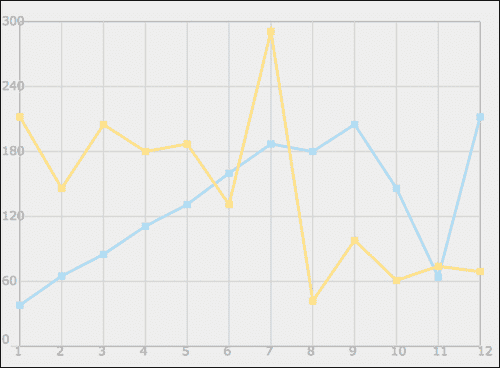
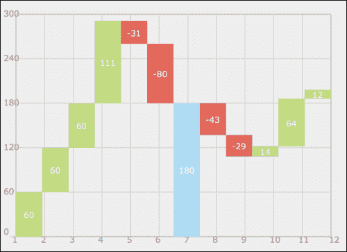
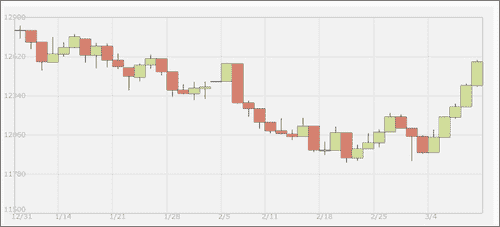

# 三、创建基于笛卡尔坐标的图形

在本章中，我们将涵盖以下主题:

*   从头开始构建条形图
*   在散点图中散布数据
*   建筑折线图
*   创建飞砖图(瀑布图)
*   构建烛台图表(股票图表)

# 简介

我们在显微镜下制作的第一张图表是最受欢迎和最简单的。我们可以将它们大致归类在基于笛卡尔的图中。总的来说这种图形风格比较简单；它打开了创造探索数据的惊人创造性方法的大门。在这一章中，我们将为构建图表奠定基础，并希望激励您就如何创建引人入胜的数据可视化提出自己的想法。

# 从头开始构建条形图

最简单的图表是只保存一维数据的图表(每种类型只有一个值)。有很多方法可以展示这种类型的数据，但最流行、最合理、最简单的方法是创建一个简单的条形图。即使在非常复杂的图表中，创建这个条形图的步骤也会非常相似。这种图表的理想用法是当主要目标是展示简单数据时，如下所示:


## 做好准备

创建一个基本的 HTML 文件，该文件包含一个画布和一个`onLoad`事件，该事件将触发`init`功能。加载`03.01.bar.js`脚本。我们将在配方中创建 JavaScript 文件的内容，如下所示:

```html
<!DOCTYPE html>
<html>
  <head>
    <title>Bar Chart</title>
    <meta charset="utf-8" />
  <script src="03.01.bar.js"></script>		
  </head>
  <body onLoad="init();" style="background:#fafafa">
    <h1>How many cats do they have?</h1>
    <canvas id="bar" width="550" height="400"> </canvas>
  </body>
</html>
```

创建图形通常有三个步骤:定义工作区域、定义数据源，然后绘制数据。

## 怎么做...

在我们的第一种情况下，我们将比较一群朋友和他们各自拥有多少只猫。我们将执行以下步骤:

1.  Define your data set:

    ```html
    var data = [{label:"David",
             value:3,
             style:"rgba(241, 178, 225, 0.5)"},
             {label:"Ben",
             value:2,
             style:"#B1DDF3"},
             {label:"Oren",
             value:9,
             style:"#FFDE89"},
             {label:"Barbera",
             value:6,
             style:"#E3675C"},
             {label:"Belann",
             value:10,
             style:"#C2D985"}];
    ```

    在这个例子中，我创建了一个可以包含无限多个元素的数组。每个元素包含三个值:标签、值和填充颜色的样式。

2.  Define your graph outlines.

    现在我们有了一个数据源，是时候创建我们的基本画布信息了，我们在每个示例中创建:

    ```html
    var can = document.getElementById("bar");
      var wid = can.width;
      var hei = can.height;
      var context = can.getContext("2d");
      context.fillStyle = "#eeeeee";
      context.strokeStyle = "#999999";
      context.fillRect(0,0,wid,hei);
    ```

3.  下一步是定义我们的图表轮廓:

    ```html
    var CHART_PADDING = 20;

      context.font = "12pt Verdana, sans-serif";
      context.fillStyle = "#999999";

      context.moveTo(CHART_PADDING,CHART_PADDING);
      context.lineTo(CHART_PADDING,hei-CHART_PADDING);
      context.lineTo(wid-CHART_PADDING,hei-CHART_PADDING);

      var stepSize = (hei - CHART_PADDING*2)/10;
      for(var i=0; i<10; i++){
        context.moveTo(CHART_PADDING, CHART_PADDING + i*  stepSize);
        context.lineTo(CHART_PADDING*1.3,CHART_PADDING + i*  stepSize);
        context.fillText(10-i, CHART_PADDING*1.5, CHART_PADDING + i*  stepSize + 6);
      }
      context.stroke();
    ```

4.  我们下一步和的最后一步是创建实际的数据条:

    ```html
    var elementWidth =(wid-CHART_PADDING*2)/ data.length;
      context.textAlign = "center";
      for(i=0; i<data.length; i++){
        context.fillStyle = data[i].style;
        context.fillRect(CHART_PADDING +elementWidth*i ,hei-CHART_PADDING - data[i].value*stepSize,elementWidth,data[i].value*stepSize);
        context.fillStyle = "rgba(255, 255, 225, 0.8)";
        context.fillText(data[i].label, CHART_PADDING +elementWidth*(i+.5), hei-CHART_PADDING*1.5);

      }
    ```

就这样。现在，如果您在浏览器中运行该应用，您将发现一个呈现的条形图。

## 它是如何工作的...

我创建了一个名为`CHART_PADDING`的变量，它在整个代码中用来帮助我定位元素(变量是大写的，因为我希望它是一个常量；所以这是为了提醒我自己，这不是一个在应用生命周期中会改变的值)。

让我们从大纲区域开始，深入研究我们创建的示例:

```html
context.moveTo(CHART_PADDING,CHART_PADDING);
context.lineTo(CHART_PADDING,hei-CHART_PADDING);
context.lineTo(wid-CHART_PADDING,hei-CHART_PADDING);
```

在这些行中，我们正在为我们的数据创建 L 形框架；这只是为了提供帮助和视觉辅助。

下一步是定义我们将用来可视化表示数字数据的步骤数。

```html
var stepSize = (hei – CHART_PADDING*2)/10;
```

在我们的示例中，我们对所有数据进行了硬编码。因此，在步长中，我们找到了图表的总高度(画布的高度减去顶部和底部的填充)，然后除以将在以下`for`循环中使用的步长数:

```html
  for(var i=0; i<10; i++){
    context.moveTo(CHART_PADDING, CHART_PADDING + i*  stepSize);
context.lineTo(CHART_PADDING*1.3,CHART_PADDING + i*  stepSize);
    context.fillText(10-i, CHART_PADDING*1.5, CHART_PADDING + i*  stepSize + 6);
  }
```

我们通过每一步循环 10 次来画一条短线。然后我们使用`fillText`方法添加数字信息。

请注意，我们正在发送值`10-i`。这个值很适合我们，因为我们希望最高值为 10。我们从图表的最高值开始；我们希望显示的值为 10，随着`i`值的增加，我们希望我们的值在循环的每一步中沿着垂直线向下移动时变小。

接下来，我们要定义每个条形的宽度。在我们的例子中，我们希望这些条相互接触，为此，我们将占用总的可用空间，并将其除以数据元素的数量。

```html
var elementWidth =(wid-CHART_PADDING*2)/ data.length;
```

在这个阶段，我们已经准备好画横条，但是在画之前，我们应该计算横条的宽度。

然后，我们遍历所有数据并创建条形图:

```html
context.fillStyle = data[i].style;
context.fillRect(CHART_PADDING +elementWidth*i ,hei-CHART_PADDING - data[i].value*stepSize,elementWidth,data[i].value*stepSize);
context.fillStyle = "rgba(255, 255, 225, 0.8)";
context.fillText(data[i].label, CHART_PADDING +elementWidth*(i+.5), hei-CHART_PADDING*1.5);
```

请注意，每次循环运行时，我们都会重置样式两次。如果我们没有，我们就不会得到我们希望得到的颜色。然后，我们将文本放在创建的栏的中间。

```html
context.textAlign = "center";
```

## 还有更多...

在我们的例子中，我们创建了一个非灵活的条形图，如果这是我们创建图表的方式，我们将需要每次从头开始重新创建它们。让我们重新审视我们的代码，并对其进行调整，使其更具可重用性。

### 重访代码

尽管一切都在按照我们希望的方式运转，但如果我们玩弄价值观，它就会停止运转。例如，如果我只想有五个步骤呢；如果我们回到代码，我们将找到以下几行:

```html
var stepSize = (hei - CHART_PADDING*2)/10;
for(var i=0; i<10; i++){
```

我们可以调整它来处理五个步骤:

```html
var stepSize = (hei - CHART_PADDING*2)5;
for(var i=0; i<5; i++){
```

我们会很快发现我们的应用没有像预期的那样工作。

为了解决这个问题，让我们创建一个新的函数来处理创建图表的轮廓。在此之前，让我们提取数据对象并创建一个包含这些步骤的新对象。让我们移动数据，并将其格式化为可访问的格式:

```html
var data = [...];
var chartYData = [{label:"10 cats", value:1},
 {label:"5 cats", value:.5},
 {label:"3 cats", value:.3}];
var range = {min:0, max:10};

var CHART_PADDING = 20;
var wid;
var hei;
function init(){
```

深入研究`chartYData`对象，因为它使我们能够在没有定义的间距规则和存储整个图的最小值和最大值的范围对象的情况下，按照我们想要的方式进行许多步骤。在创建新功能之前，让我们将它们添加到我们的`init`功能中(更改以粗体标记)。

```html
function init(){
  var can = document.getElementById("bar");
  wid = can.width;
   hei = can.height;
  var context = can.getContext("2d");
  context.fillStyle = "#eeeeee";
  context.strokeStyle = "#999999";
  context.fillRect(0,0,wid,hei);

  context.font = "12pt Verdana, sans-serif";
  context.fillStyle = "#999999";

  context.moveTo(CHART_PADDING,CHART_PADDING);
  context.lineTo(CHART_PADDING,hei-CHART_PADDING);
  context.lineTo(wid-CHART_PADDING,hei-CHART_PADDING);
 fillChart(context,chartYData);
 createBars(context,data);
}
```

在这段代码中，我们所做的就是将图表及其条形图的创建提取为两个独立的函数。既然我们有了图表数据和内容的外部数据源，我们就可以构建它们的逻辑。

### 使用填充图表功能

`fillChart`功能的主要目标是创建图表的基础。我们正在整合新的`stepData`对象信息，并根据其信息构建图表。

```html
function fillChart(context, stepsData){
  var steps = stepsData.length;
  var startY = CHART_PADDING;
  var endY = hei-CHART_PADDING;
  var chartHeight = endY-startY;
  var currentY;
  var rangeLength = range.max-range.min;
  for(var i=0; i<steps; i++){
    currentY = startY + (1-(stepsData[i].value/rangeLength)) *  chartHeight;
    context.moveTo(CHART_PADDING, currentY );
    context.lineTo(CHART_PADDING*1.3,currentY);
    context.fillText(stepsData[i].label, CHART_PADDING*1.5, currentY+6);
  }
  context.stroke();

}
```

我们的变化并不多，但有了它们，我们的功能变得比以前更加动态。这一次，我们是基于`stepsData`物体的位置和基于此的距离长度。

### 使用创建条功能

我们的下一步是重新访问`createBars`区域并更新信息，以便可以使用外部对象动态创建该区域。

```html
function createBars(context,data){
  var elementWidth =(wid-CHART_PADDING*2)/ data.length;
  var startY = CHART_PADDING;
  var endY = hei-CHART_PADDING;
  var chartHeight = endY-startY;
  var rangeLength = range.max-range.min;
  var stepSize = chartHeight/rangeLength;
  context.textAlign = "center";
  for(i=0; i<data.length; i++){
    context.fillStyle = data[i].style;
    context.fillRect(CHART_PADDING +elementWidth*i ,hei-CHART_PADDING - data[i].value*stepSize,elementWidth,data[i].value*stepSize);
    context.fillStyle = "rgba(255, 255, 225, 0.8)";
    context.fillText(data[i].label, CHART_PADDING +elementWidth*(i+.5), hei-CHART_PADDING*1.5);	
  }	
}
```

除了我们定位数据和提取硬编码值的方式发生了一些变化之外，这里几乎没有什么变化。比较我们源代码中的两个示例，找出它们之间的差异。

# 在散点图中散布数据

散点图是一个非常强大的图表，主要用于在比较两个数据集时获得鸟瞰图。例如，比较英语课和数学课的分数，找出相关关系。这种视觉比较的方式有助于发现意外数据集之间令人惊讶的关系。

当目标是以非常直观的方式显示许多细节时，这是理想的。


## 做好准备

如果您还没有机会浏览本章中我们第一个食谱的逻辑，我建议您先看一下，因为我们将在此基础上进行大量工作，同时扩展并使其更复杂以容纳两个数据集。

常规的 HTML 启动代码可以在代码包中找到，或者浏览[第 1 章](01.html "Chapter 1. Drawing Shapes in Canvas")、*在画布中绘制形状*，了解创建 HTML 文档的更多信息。

我重新访问了之前食谱中的数据源，并对其进行了修改，以存储学生数学、英语和艺术考试成绩的三个变量

```html
var data = [{label:"David",
 math:50,
 english:80,
 art:92,
       style:"rgba(241, 178, 225, 0.5)"},
       {label:"Ben",
 math:80,
 english:60,
 art:43,
       style:"#B1DDF3"},
       {label:"Oren",
 math:70,
 english:20,
 art:92,
       style:"#FFDE89"},
       {label:"Barbera",
 math:90,
 english:55,
 art:81,
       style:"#E3675C"},
       {label:"Belann",
 math:50,
 english:50,
 art:50,
       style:"#C2D985"}];
```

请注意，这些数据完全是随机的，因此我们无法从数据本身中学到任何东西；但是我们可以学到很多关于如何让我们的图表为真实数据做好准备。我们删除了`value`属性，取而代之的是`math`、`english`和`art`属性。

## 怎么做...

让我们深入了解一下 JavaScript 文件以及我们想要进行的更改:

1.  定义`y`空间和`x`空间。为此，我们将创建一个助手对象来存储所需的信息:

    ```html
    var chartInfo= { y:{min:40, max:100, steps:5,label:"math"},
            x:{min:40, max:100, steps:4,label:"english"}
          };
    ```

2.  It's time for us to set up our other global variables and start up our `init` function:

    ```html
    var CHART_PADDING = 30;
    var wid;
    var hei;
    function init(){

      var can = document.getElementById("bar");

      wid = can.width;
      hei = can.height;
      var context = can.getContext("2d");
      context.fillStyle = "#eeeeee";
      context.strokeStyle = "#999999";
      context.fillRect(0,0,wid,hei);

      context.font = "10pt Verdana, sans-serif";
      context.fillStyle = "#999999";

      context.moveTo(CHART_PADDING,CHART_PADDING);
      context.lineTo(CHART_PADDING,hei-CHART_PADDING);
      context.lineTo(wid-CHART_PADDING,hei-CHART_PADDING);

     fillChart(context,chartInfo);
     createDots(context,data);
    }
    ```

    这里没什么新东西。突出显示了主要变化。让我们开始创建我们的`fillChart`和`createDots`功能。

3.  If you worked on our previous recipe, you might notice that there are a lot of similarities between the functions in the previous recipe and this function. I've deliberately changed the way we create things just to make them more interesting. We are now dealing with two data points as well, so many details have changed. Let's review them:

    ```html
    function fillChart(context, chartInfo){
      var yData = chartInfo.y;
      var steps = yData.steps;
      var startY = CHART_PADDING;
      var endY = hei-CHART_PADDING;
      var chartHeight = endY-startY;
      var currentY;
      var rangeLength = yData.max-yData.min;
      var stepSize = rangeLength/steps;
      context.textAlign = "left";
      for(var i=0; i<steps; i++){
        currentY = startY + (i/steps) *	chartHeight;
        context.moveTo(wid-CHART_PADDING, currentY );
        context.lineTo(CHART_PADDING,currentY);
        context.fillText(yData.min+stepSize*(steps-i), 0, currentY+4);
      }

      currentY = startY +	chartHeight;
      context.moveTo(CHART_PADDING, currentY );
      context.lineTo(CHART_PADDING/2,currentY);
      context.fillText(yData.min, 0, currentY-3);

      var xData = chartInfo.x;
      steps = xData.steps;
      var startX = CHART_PADDING;
      var endX = wid-CHART_PADDING;
      var chartWidth = endX-startX;
      var currentX;
      rangeLength = xData.max-xData.min;
      stepSize = rangeLength/steps;
      context.textAlign = "left";
      for(var i=0; i<steps; i++){
        currentX = startX + (i/steps) *	chartWidth;
        context.moveTo(currentX, startY );
        context.lineTo(currentX,endY);
        context.fillText(xData.min+stepSize*(i), currentX-6, endY+CHART_PADDING/2);
      }

      currentX = startX +	chartWidth;
      context.moveTo(currentX, startY );
      context.lineTo(currentX,endY);
      context.fillText(xData.max, currentX-3, endY+CHART_PADDING/2);

      context.stroke();

    }
    ```

    当您查看这段代码时，您会注意到我们的逻辑几乎重复了两次。在第一个循环和第一批变量中，我们计算出了每个元素在`y`空间中的位置，在这个函数的后半部分，我们继续计算`x`区域的布局。画布中的 y 轴从上到下(上低下高)增长，因此我们需要计算整个图形的高度，然后减去该值以找到位置。

4.  Our last function is to render the data points and to do that we create the `createDots` function:

    ```html
    function createDots(context,data){
      var yDataLabel = chartInfo.y.label;
      var xDataLabel = chartInfo.x.label;
      var yDataRange = chartInfo.y.max-chartInfo.y.min;
      var xDataRange = chartInfo.x.max-chartInfo.x.min;
      var chartHeight = hei- CHART_PADDING*2;
      var chartWidth = wid- CHART_PADDING*2;

      var yPos;
      var xPos;
      for(var i=0; i<data.length;i++){
        xPos = CHART_PADDING + (data[i][xDataLabel]-chartInfo.x.min)/xDataRange * chartWidth;
        yPos = (hei - CHART_PADDING)  -(data[i][yDataLabel]-chartInfo.y.min)/yDataRange * chartHeight;

        context.fillStyle = data[i].style;
        context.fillRect(xPos-4 ,yPos-4,8,8);

      }  
    }
    ```

    这里我们为每个点计算出相同的细节——包括`y`位置和`x`位置——然后我们画一个矩形。让我们现在测试我们的应用！

## 它是如何工作的...

我们从创建一个新的`chartInfo`对象开始:

```html
var chartInfo= { y:{min:40, max:100, steps:5,label:"math"},
        x:{min:40, max:100, steps:4,label:"english"}
      };
```

这个非常简单的对象封装了定义图表实际输出内容的规则。仔细观察你会发现我们设置了一个名为`chartInfo`的对象，它在 y 轴和 x 轴上都有信息。我们有一个最小值(`min`属性)、最大值(`max`属性)和我们希望在图表中拥有的步数(`steps`属性)，并且我们定义了一个标签。

让我们深入了解一下`fillChart`功能的工作方式。本质上，我们有两个数值；一个是屏幕上的实际空间，另一个是空间所代表的值。为了匹配这些值，我们需要知道我们的数据范围和视图范围，因此我们首先找到我们的`startY`点和我们的`endY`点，然后计算这两点之间的像素数:

```html
var startY = CHART_PADDING;
var endY = hei-CHART_PADDING;
var chartHeight = endY-startY;
```

当我们试图从`chartInfo`对象中找出放置数据的位置时，将使用这些值。既然我们已经谈到了这个对象，让我们看看我们如何处理它:

```html
  var yData = chartInfo.y;
  var steps = yData.steps;
  var rangeLength = yData.max-yData.min;
  var stepSize = rangeLength/steps;
```

由于我们现在的重点是高度，我们正在更深入地研究`y`房产，为了舒适起见，我们将它称为`yData`。现在我们已经关注了这个对象，是时候弄清楚这个值的实际数据范围(`rangeLength`)是什么了，这将是我们的转换器号。换句话说，我们想在点`startY`和`endY`之间取一个视觉空间，并根据范围，将其定位在这个空间中。当我们这样做时，我们可以将任何数据转换为 0-1 之间的范围，然后将它们定位在动态可见区域。

最后但同样重要的是，由于我们的新数据对象包含了我们想要添加到图表中的步骤数，因此我们使用该数据来定义步骤值。在这个例子中是 12。我们得到这个值的方法是取我们的`rangeLength` (100 - 40 = 60)值，然后除以`steps`的个数(在我们的例子中是 5)。现在我们已经排除了关键变量，是时候遍历数据并绘制图表了:

```html
var currentY;
context.textAlign = "left";
  for(var i=0; i<steps; i++){
    currentY = startY + (i/steps) *	chartHeight;
    context.moveTo(wid-CHART_PADDING, currentY );
    context.lineTo(CHART_PADDING,currentY);
    context.fillText(yData.min+stepSize*(steps-i), 0, currentY+4);
  }
```

这就是魔法复活的地方。我们跑完步数，然后再次计算新的`Y`位置。如果我们分解它，我们会看到:

```html
currentY = startY + (i/steps) *	chartHeight;
```

我们从图表的起始位置(上部区域)开始，然后通过取当前`i`位置并将其除以总的可能步数(0/5、1/5、2/5 等)来添加步数。在我们的演示中是 5，但是它可以是任何值，并且应该插入到`chartInfo` steps 属性中。我们将返回值乘以之前计算的图表高度。

为了弥补我们从顶部开始的事实，我们需要反转我们放入文本字段的实际文本:

```html
yData.min+stepSize*(steps-i)
```

这段代码采用了我们早期的变量，并使它们发挥作用。我们从取可能的最小值开始，然后将`stepSize`乘以总步数减去当前步数。

让我们深入`createDots`功能看看它是如何工作的。我们从设置变量开始:

```html
var yDataLabel = chartInfo.y.label;
var xDataLabel = chartInfo.x.label;
```

这是这个食谱中我最喜欢的部分之一。我们正在从我们的`chartInfo`对象中抓取标签，并将其用作我们的 ID；这个 ID 将用于从我们的数据对象中获取信息。如果你想改变值，你只需要在`chartInfo`对象中切换标签。

又到了我们计算范围的时候了，就像我们之前在`fillChart`函数中所做的那样。这一次，我们希望获得 x 轴和 y 轴的实际范围，以及我们必须处理的区域的实际宽度和高度:

```html
var yDataRange = chartInfo.y.max-chartInfo.y.min;
var xDataRange = chartInfo.x.max-chartInfo.x.min;
var chartHeight = hei- CHART_PADDING*2;
var chartWidth = wid- CHART_PADDING*2;
```

我们还需要一些变量来帮助我们跟踪循环中的当前`x`和`y`位置:

```html
var yPos;
var xPos;
```

让我们更深入地了解我们的循环，主要是突出显示的代码片段:

```html
for(var i=0; i<data.length;i++){
 xPos = CHART_PADDING + (data[i][xDataLabel]-chartInfo.x.min)/xDataRange * chartWidth;
 yPos = (hei - CHART_PADDING)  -(data[i][yDataLabel]-chartInfo.y.min)/yDataRange * chartHeight;

    context.fillStyle = data[i].style;
    context.fillRect(xPos-4 ,yPos-4,8,8);

  }
```

一切的核心在这里是发现我们的元素需要在哪里。逻辑对于`xPos`和`yPos`变量几乎是相同的，只有一些变化。我们需要做的第一件事就是计算`xPos`变量:

```html
(data[i][xDataLabel]-chartInfo.x.min)

```

在这一部分中，我们使用了我们之前创建的标签`xDataLabel`，以获得该科目的当前学生分数。然后我们从中减去可能的最低分。因为我们的图表不是从 0 开始的，所以我们不希望 0 和最小值之间的值影响屏幕上的位置。例如，假设我们专注于数学，我们的学生得了 80 分；我们从中减去 40(80-40 = 40)，然后应用以下公式:

`(data[i][xDataLabel] - chartInfo.x.min) / xDataRange`

我们用这个值除以我们的数据范围；在我们的情况下，这将是(100 - 40)/60。返回的结果将始终介于 0 和 1 之间。我们可以使用返回的数字，并将其乘以实际的像素空间，以准确知道我们的元素在屏幕上的位置。我们通过将我们得到的值(0 到 1 之间)乘以总可用空间(在本例中是宽度)来实现。一旦我们知道它需要位于何处，我们就在图表上添加起点(填充):

```html
xPos = CHART_PADDING + (data[i][xDataLabel]-chartInfo.x.min)/xDataRange * chartWidth;

```

`yPos`变量的逻辑与`xPos`变量相同，但这里我们只关注高度。

# 建筑线图

折线图基于散点图。与显示两个变量之间孤立相关性的散点图相反，折线图以多种方式讲述一个故事；我们可以回到我们之前的食谱，*在散点图*中传播数据，并在点之间画一条线来建立联系。这种类型的图表通常用于网站统计，跟踪事物随时间、速度、年龄等的变化。让我们跳进去，看看它是如何运作的。



## 做好准备

像往常一样，准备好你的 HTML 包装。在这个配方中，我们实际上是基于之前的配方*进行更改，在散点图*中传播数据。

在本例的案例研究中，我们将创建一个图表，显示 2011 年和 2010 年有多少新成员加入了我的网站[02Geek.com](http://02Geek.com)。我逐月收集信息，并将其收集到两个阵列中:

```html
var a2011 = [38,65,85,111,131,160,187,180,205,146,64,212];
var a2010 = [212,146,205,180,187,131,291,42,98,61,74,69];
```

两个阵列的长度都是 12(一年中的 12 个月)。我特意创建了一个与我们之前使用的数据源完全不同的新数据源。在这个例子中，我这样做是为了让我们的旧地图变得无用。我这样做是为了给这个食谱增加一些额外的价值(这是一个很好的教训，说明即使数据不合适，也要处理数据，而不是重建数据)。

```html
var chartInfo= { y:{min:0, max:300, steps:5,label:"users"},
        x:{min:1, max:12, steps:11,label:"months"}
      };
```

对于我们的图表信息，我们使用相同的对象类型，对于`y`位置，我们将假设范围从 0 到 300(因为我还没有在一个月内拥有超过 300 个成员的特权，但我充满希望)。对于我们的`x`位置，我们将其设置为从 1 到 12 的输出值(一年中的 12 个月)。

好了，是时候建造它了！

## 怎么做...

像往常一样，我们的`init`功能将看起来非常类似于我们在前面的食谱中使用的功能。让我们来看看这个食谱中发生的变化:

1.  更新/创建全局变量:

    ```html
    var a2011 = [38,65,85,111,131,160,187,180,205,146,64,212];
    var a2010 = [212,146,205,180,187,131,291,42,98,61,74,69];

    var chartInfo= { y:{min:0, max:300, steps:5,label:"users"},
            x:{min:1, max:12, steps:11,label:"months"}
          };

    var CHART_PADDING = 20;
    var wid;
    var hei;
    ```

2.  更新`init`功能:

    ```html
    function init(){

      var can = document.getElementById("bar");

      wid = can.width;
      hei = can.height;
      var context = can.getContext("2d");
      context.fillStyle = "#eeeeee";
      context.strokeStyle = "#999999";
      context.fillRect(0,0,wid,hei);

      context.font = "10pt Verdana, sans-serif";
      context.fillStyle = "#999999";

      context.moveTo(CHART_PADDING,CHART_PADDING);
     context.rect(CHART_PADDING,CHART_PADDING,wid-CHART_PADDING*2,hei-CHART_PADDING*2);
     context.stroke();
      context.strokeStyle = "#cccccc";
      fillChart(context,chartInfo);
     addLine(context,formatData(a2011, "/2011","#B1DDF3"),"#B1DDF3");
     addLine(context,formatData(a2010, "/2010","#FFDE89"),"#FFDE89"); 
    }
    ```

3.  将功能`createDots`的名称改为`addLine`，更新逻辑:

    ```html
    function addLine(context,data,style){
      var yDataLabel = chartInfo.y.label;
      var xDataLabel = chartInfo.x.label;
      var yDataRange = chartInfo.y.max-chartInfo.y.min;
      var xDataRange = chartInfo.x.max-chartInfo.x.min;
      var chartHeight = hei- CHART_PADDING*2;
      var chartWidth = wid- CHART_PADDING*2;

      var yPos;
      var xPos;
     context.strokeStyle = style;
     context.beginPath();
     context.lineWidth = 3;
      for(var i=0; i<data.length;i++){
        xPos = CHART_PADDING + (data[i][xDataLabel]-chartInfo.x.min)/xDataRange * chartWidth;
        yPos = (hei - CHART_PADDING)  -(data[i][yDataLabel]-chartInfo.y.min)/yDataRange * chartHeight;

        context.fillStyle = data[i].style;
        context.fillRect(xPos-4 ,yPos-4,8,8);

     i ? context.lineTo(xPos,yPos):context.moveTo(xPos,yPos);

      }
     context.stroke();
    }
    ```

4.  创建`formatData`功能 :

    ```html
    function formatData(data , labelCopy , style){
      newData = [];
      for(var i=0; i<data.length;i++){
        newData.push({	label:(i+1)+labelCopy,
                users:data[i],
                months:i+1,
                style:style
                });	
      }

      return newData;	
    }
    ```

就这样！我们完了！

## 它是如何工作的...

我在我们的画图工具集中增加了一个新的方法`rect`；直到现在，我们一直使用`drawRect`方法。我使用了`rect`方法，因为它只是添加了轮廓而没有绘制任何东西，所以我可以单独执行笔画或填充功能，并创建一个轮廓而不是填充。

`fillChart`功能一点没变，酷吧？我已经将函数`createDots`重命名为`addLine`，因为它似乎更适合我们的示例。该函数中添加了一些内容，一个新的函数`formatData`被用来格式化数据，以符合`addLine`函数的预期。

正如您可能注意到的，我们对代码做了一些小的修改，以适应这种图表风格的需要。让我们深入了解一下他们的行动:

```html
addLine(context,formatData(a2011,"/2011","#B1DDF3"),"#B1DDF3")

```

在我们调用`addLine`函数的方式中，我们可以明显看到的最大变化是，我们调用`formatData`函数来为我们呈现一个可被`addLine`函数接受的数据源。你现在可能会想，为什么我不按照`addLine`功能所需的方式创建数据。当我们多次转向真实、实时的数据源时，我们会发现数据源与我们最初的工作不匹配。这并不意味着我们需要改变我们的工作，通常更好的解决方案是创建一个转换器方法，该方法将修改数据并重建它以匹配我们的应用结构，使其符合我们期望的格式。

我们之前的配方提醒:这是我们的数据源的样子:

```html
var data = [{label:"David",
       math:50,
       english:80,
       art:92
       style:"rgba(241, 178, 225, 0.5)"},
       ...
       ];
```

虽然目前我们的阵列是平面的，但我们需要改变这一点，以适应我们当前的系统；它需要两个属性来定义`x`和`y`值:

```html
var chartInfo= { y:{min:0, max:300, steps:5,label:"users"},
 x:{min:1, max:12, steps:11,label:"months"}

```

换句话说，我们需要创建的对象应该如下所示:

```html
var data = [{label: "01/2011",
       users:200,
      months:1,
      style:"#ff0000"} ... ];
```

让我们创建一个函数来创建这种数据格式:

```html
function formatData(data , labelCopy , style){
  newData = [];
  for(var i=0; i<data.length;i++){
    newData.push({	label:(i+1)+labelCopy,
            users:data[i],
            months:i+1,
            style:style
            });	
  }

  return newData;
}
```

请注意，我们如何循环遍历旧数组，并使用发送到我们的`formatData`函数的数组数据和外部数据对其进行重组，以符合我们预期的数据格式。尽管我们没有使用这个配方中的所有信息，但我想让它与所有基本信息保持同步，以防您想要扩展这个示例。我们将在未来这样做。

### 类型

这是工具集中最强大的编程技巧之一。我遇到过许多开发人员，他们更改代码而不是更改数据来适应所需的应用结构。总有一种方法可以修改数据，使其更容易被应用使用，而且动态修改数据比改变架构要容易得多。

我在这个`addLine`函数的核心逻辑中没有改变任何东西，而是从一个点到下一个点添加了画线。

如果你不熟悉三元运算，这是一个人手不足的`if`语句:

```html
condition ? ifStatement: elseStatement;
```

顺便说一下，如果您担心效率，您可能想通过从循环中提取第一个实例来更改`for`循环，因为这是我们的三元运算符触发 else 值的唯一情况。

## 还有更多...

让我们重新审视我们的代码，并对其进行优化以提高适应性。我们的目标是为我们的图表添加更多的灵活性，以各种模式呈现。

我在这里的目标是使我们的图表能够以三种渲染模式进行渲染:点模式(与上一个示例中一样)、线模式(在本示例中)和填充模式(新增):


虽然，在前面的截图中，我们有三个图表元素，它们都有一个填充，你可以选择新的代码，每增加一行，你希望如何处理它。所以让我们开始吧。

### 启用点和线之间的切换模式

我们在函数中添加的所有工作都不需要经过大的修改，因为在实际渲染之前什么都不是可见的。这在一行中控制，我们在`addLine`函数中创建笔画。因此，让我们添加一个新的规则，如果一个样式没有被发送，这将意味着我们不想创建一条线:

```html
if(style)context.stroke();
```

换句话说，只有当我们有了风格信息，我们刚刚创建的线条才会被绘制出来；如果没有，就不会画线。

### 创建填充形状

为了创建填充形状并且为了保持我们的代码简单，我们将在我们的代码中创建一个`if...else`语句，并且如果用户发送一个新的第四个参数，我们将在填充模式下呈现它(在下面的代码片段中突出显示了这些变化):

```html
function addLine(context,data,style,isFill){
  var yDataLabel = chartInfo.y.label;
  var xDataLabel = chartInfo.x.label;
  var yDataRange = chartInfo.y.max-chartInfo.y.min;
  var xDataRange = chartInfo.x.max-chartInfo.x.min;
  var chartHeight = hei- CHART_PADDING*2;
  var chartWidth = wid- CHART_PADDING*2;

  var yPos;
  var xPos;
  context.strokeStyle = style;
  context.beginPath();
  context.lineWidth = 3;

 if(!isFill){
    for(var i=0; i<data.length;i++){
      xPos = CHART_PADDING + (data[i][xDataLabel]-chartInfo.x.min)/xDataRange * chartWidth;
      yPos = (hei - CHART_PADDING)  -(data[i][yDataLabel]-chartInfo.y.min)/yDataRange * chartHeight;

      context.fillStyle = data[i].style;
      context.fillRect(xPos-4 ,yPos-4,8,8);

      i==0? context.moveTo(xPos,yPos):context.lineTo(xPos,yPos);

    }
    if(style)context.stroke();
 }else{
 context.fillStyle = style;
 context.globalAlpha = .6;
 context.moveTo(CHART_PADDING,hei - CHART_PADDING)
 for(var i=0; i<data.length;i++){
 xPos = CHART_PADDING + (data[i][xDataLabel]-chartInfo.x.min)/xDataRange * chartWidth;
 yPos = (hei - CHART_PADDING)  -(data[i][yDataLabel]-chartInfo.y.min)/yDataRange * chartHeight;

 context.lineTo(xPos,yPos);

 }
 context.lineTo(	CHART_PADDING + chartWidth, CHART_PADDING+chartHeight);
 context.closePath();
 context.fill(); 
 context.globalAlpha = 1;
 }
}
```

新代码中的差异并不大。我们只是删除了一些代码，并添加了一些新的行来创建一个完整的形状。我也叠加了阿尔法值。一个更聪明的方法是重新检查发送的值，并根据需要将阿尔法值放入其中；但那是留给你去改进的。现在我们的`addLine`函数可以添加三种类型的可视化，并且我们可以同时向图表中添加多种类型(查看源代码以了解这一点)。

# 创建飞砖图(瀑布图)

在本章的每个食谱中，我们一直在提高代码的复杂性，因此我们将重新审视条形图，并使其现代化，以适应我们不断发展的图表平台。在我们完成这个迷你任务后，我们将准备好创建我们的第一个瀑布图，从标准图中脱离出来，进入更具创造性的途径。



瀑布图是一个非常有用的图表，可以勾勒出趋势，比如每月的总变化(正的和负的)，而则勾勒出大局的总价值。这种类型的图表有助于概述公司的总资产，同时显示整个月的盈利或亏损情况。这种类型的图表非常适合在正值/负值之间移动的数据。

## 做好准备

我们将利用我们在早期配方中创建的界面，因此我们将把酒吧的创建集成到我们的更新函数库中。为此，我们需要挖掘出在`03.02.bar-revamp.js`中创建的旧`createBars`函数。

以下是实现更改前的代码:

```html
function createBars(context,data){
  var elementWidth =(wid-CHART_PADDING*2)/ data.length;
  var startY = CHART_PADDING;
  var endY = hei-CHART_PADDING;
  var chartHeight = endY-startY;
  var rangeLength = range.max-range.min;
  var stepSize = chartHeight/rangeLength;
  context.textAlign = "center";
  for(i=0; i<data.length; i++){
    context.fillStyle = data[i].style;
    context.fillRect(CHART_PADDING +elementWidth*i ,hei-CHART_PADDING - data[i].value*stepSize,elementWidth,data[i].value*stepSize);
    context.fillStyle = "rgba(255, 255, 225, 0.8)";
    context.fillText(data[i].label, CHART_PADDING +elementWidth*(i+.5), hei-CHART_PADDING*1.5);

  }
}
```

下面是我们最新更新的函数，以适应我们在早期食谱中开发的新技能(更改在下面的代码片段中突出显示)。

```html
function createBars(context,data){

 var range = chartInfo.x;
  var elementWidth =(wid-CHART_PADDING*2)/ data.length;
  var startY = CHART_PADDING;
  var endY = hei-CHART_PADDING;
  var chartHeight = endY-startY;
 var stepSize = chartHeight/(chartInfo.y.max-chartInfo.y.min);
  context.textAlign = "center";
  for(i=0; i<data.length; i++){
    context.fillStyle = data[i].style;
 context.fillRect(CHART_PADDING +elementWidth*i ,endY - data[i][chartInfo.y.label]*stepSize,elementWidth,data[i][chartInfo.y.label]*stepSize);
    context.fillStyle = "rgba(255, 255, 225, 0.8)";
    context.fillText(data[i].label, CHART_PADDING +elementWidth*(i+.5), hei-CHART_PADDING*1.5);

  }

}
```

这些变化不仅仅是表面现象；我们正在利用我们之前几个示例中使用的外部数据馈送。现在，我们的函数是最新的，并且工作在前面两个食谱中开发的最新逻辑中，是时候开始构建我们的瀑布图了。

## 怎么做...

创建瀑布图的第一步是复制、粘贴和重命名函数`createBars`，然后对其进行操作并更改数据的呈现方式(主要是我们定位元素的位置和方式)。在我深入探究为什么以及如何实现之前，请注意我们在这个方法中的变化:

1.  让我们从一个更新的数据源开始:

    ```html
    var a2011 = [60,60,60,111,-31,-80,0,-43,-29,14,64,12];
    var chartInfo= { y:{min:0, max:300, steps:5,label:"users"},
            x:{min:1, max:12, steps:11,label:"months"}
            };
    var CHART_PADDING = 20;
    var wid;
    var hei;
    ```

2.  在`init`函数中，我们将更新以下高亮显示的代码片段:

    ```html
    function init(){

      ...
      context.strokeStyle = "#cccccc";
      fillChart(context,chartInfo);
     createWaterfall(context,formatData(a2011));
    }
    ```

3.  添加几个辅助变量:

    ```html
    function createWaterfall(context,data){

      var range = chartInfo.x;
      var elementWidth =(wid-CHART_PADDING*2)/ data.length;
      var startY = CHART_PADDING;
      var endY = hei-CHART_PADDING;
      var chartHeight = endY-startY;
      var stepSize = chartHeight/(chartInfo.y.max-chartInfo.y.min);
      var currentY= endY;
     var elementValue ;
     var total=0;
      context.textAlign = "center";
    ```

4.  在`for`循环逻辑中，如果值不是`0` :

    ```html
      for(i=0; i<data.length; i++){
     elementValue = data[i][chartInfo.y.label];
     total +=elementValue;
     if(elementValue!=0){
     context.fillStyle = elementValue>0? "#C2D985" :"#E3675C" ;
     currentY -=(elementValue*stepSize);
     context.fillRect(CHART_PADDING +elementWidth*i ,currentY,elementWidth,elementValue*stepSize);
     }

    ```

    ，画一个矩形
5.  如果当前数据值为`0`，则将其作为总计列:

    ```html
    else{
     context.fillStyle = "#B1DDF3" ;

     context.fillRect(CHART_PADDING +elementWidth*i ,currentY,elementWidth,endY-currentY);
     elementValue = total; //hack so we see the right value
     }
     context.fillStyle = "rgba(255, 255, 255, .8)"
    ;

    ```

6.  将更改后的值添加到元素中:

    ```html
     context.fillText(elementValue, CHART_PADDING +elementWidth*(i+.5), endY - (stepSize*total) + (stepSize*elementValue/2) + 6);

      }

    }
    ```

这里有很多变化，但本质上这两个功能做的几乎是同一件事；只有我们的瀑布图更聪明更详细。

## 它是如何工作的...

第一步和我们开始思考如何创建瀑布图的第一个问题是每个元素之间都有关系。为了简化逻辑，我们希望创建一个计数器来存储更改(当前的汇总值)。

```html
  var elementValue ;
  var total=0;
```

第一个变量只是一个帮助变量，试图使我们的代码更易读，而总数是为了跟上当前的总数。

是时候跳进`for`循环，看看大变化了。让我们首先关注在瀑布图中可能需要完成的任务类型。有三种类型(值上升，值下降，值保持不变)。在我们开始弄清楚如何处理这些情况之前，让我们更新我们的变量:

```html
for(i=0; i<data.length; i++){
    elementValue = data[i][chartInfo.y.label];
    total +=elementValue;
```

元素值会给我们当前的数值(别忘了这和屏幕上的大小不对应；当我们想要绘制元素时，我们仍然需要通过`stepSize`号来复制它，因为这是原始实数)。我们的`total`变量也是如此；我们只是跟踪当前的摘要。

如前所述，我们有三个可能的任务，如下创建一个`if...else`案例没有错:

```html
if(elementValue>0){
  //do the positive values
}else if(elementValue<0){
  //do the negative values
}else{
  //do 0
}
```

这将捕获所有三个选项，但会添加一些不需要的额外代码。因此，我们将对负值和正值使用相同的`if`语句，因为它们的逻辑非常接近。这样我们可以重用我们的代码，减少输入。

```html
if(elementValue!=0){
  //do positive/negative values
}else{
  // do 0
}
```

完美！现在让我们深入研究一下积极/消极的任务:

```html
context.fillStyle = elementValue>0? "#C2D985" :"#E3675C" ;
currentY -=(elementValue*stepSize);
context.fillRect(CHART_PADDING +elementWidth*i ,currentY,elementWidth,elementValue*stepSize);
```

请注意，这个块中的第一行代码是正/负值之间的唯一区别。我们实际上只是使用三元运算根据我们是在正范围还是负范围来改变颜色。在计算出我们的`currentY`位置之后，我们在当前位置创建一个矩形(这个当前位置是在值被添加之后，所以这是我们的终点)。最需要注意的是第四个参数，`elementValue*stepSize` 。第四个参数捕获矩形的大小。有了它，它就能捕捉到它是负值还是正值。`elementValue`变量可以是正的也可以是负的。这是我们在这里使用的技巧，因为我们将向上绘制条形图(如果值为负)或向下绘制条形图(如果值为正)。如果我们在更新我们的`currentY`位置之前首先创建绘图，将会困难得多，并且可能需要我们创建三个单独的`if`案例。像这样的案例真的让我觉得编程很有趣；找到这些隐藏的方法来利用相同的代码做相反的事情。

我们该去看看`else`的情况了:

```html
}else{
    context.fillStyle = "#B1DDF3" ;

 context.fillRect(CHART_PADDING +elementWidth*i ,currentY,elementWidth,endY-currentY);
    elementValue = total; //hack so we see the right value
    }
```

在`else`的情况下，我们想画出酒吧的全长，然后是一个小黑客。我们将当前总计的值赋给`elementValue`变量(这不会改变我们的原始数据，因为这是我们不再使用`elementValue`变量后的最后一件事)。我们这样做是为了避免在向栏中添加文本时出现另一个`if...else`语句。只有当值为`0`时，我们才希望显示总数，而不是当前的变化，这就是这次黑客攻击所捕捉到的。

留给我们为瀑布图创建条形图的最后一部分，即获取我们刚刚创建的元素中心的条形图的值:

```html
context.fillStyle = "rgba(255, 255, 255, .8)";
context.fillText(elementValue, CHART_PADDING +elementWidth*(i+.5), endY - (stepSize*total) + (stepSize*elementValue/2) + 6);

```

深入了解文本元素的定位；我花了一点时间才想通。我在这里主要在最后一个参数(我们新文本的`y`位置)中所做的是取我们图表的底部区域，减去当前的总数，这将使我们正好得到条形图的顶端。但是，对于正值来说，这种方法效果不好，因为它会在条形图上方，而对于负值来说，它会将其放在条形图的底部区域。创造性思维来了；与其创建一些案例，不如将我们的文本放在元素的正中间。为了做到这一点，我们可以再次利用我们的`elementValue`变量(因为它是正的或负的)，如果我们取它的一半大小并将其添加到我们的总数中，我们将在酒吧的中心，只留下最后一个调整将 6 添加到我们的值中(因为我们的文本高度为 12 像素)。

给你。您刚刚创建了第一个瀑布图。我们来测试一下；从我们的`init`函数中删除任何数据可视化函数调用(如`createBars`或`addLine`)，代之以我们的新函数:

```html
createWaterfall(context,formatData(a2011));	
```

### 注

请注意，我使用的是`formatData`对象，因为我只是在重用我们之前示例中的数组。我刚刚更新了这些值，这样它们就不会超出总数 300:

```html
var a2011 = [60,60,60,111,-31,-80,0,-43,-29,14,64,12];
```

## 还有更多...

在我们结束的地方，导致我们无法控制数据的问题，我们要求最终用户/开发人员调整的越多，学习曲线就越长。我们的`chartInfo`对象存储了我们的大部分助手信息，这很好，但是如果有人没有填写属性呢？我们的应用应该失败还是应该尽力为用户找出新的默认值？假设在本例中，用户没有填写`y`对象的`max`和`min`属性:

```html
var chartInfo= { y:{steps:5,label:"users"},
        x:{min:1, max:12, steps:11,label:"months"}
        };
```

用户指出他们想要多少步，但是他们不提供图表应该输出的最小和最大值的任何信息。为了解决这个问题，我们需要重新审视我们创建图表的方式。到目前为止，我们通过两个完全独立的步骤创建了图表(我们的`init`函数中的最后两行):

```html
  fillChart(context,chartInfo);
  createWaterfall(context,formatData(a2011));	
```

首先，我们通常创建背景，然后绘制项目，但是在这种情况下，我们在`fillchart`函数和`createWaterfall`函数之间有更清晰的关系。当我们试图减少用户的代码占用时，我们不希望为每个样本添加一堆逻辑，这些逻辑对于每个条类型都是唯一的。因此，我们将重新访问我们创建的所有图形函数(`addLine`、`createBars`和`createWaterfall`)并将`fillChart`函数调用移动到函数中的第一件事。这将使我们能够在调用`fillChart`函数之前创建自定义调整，这对于我们函数的最终用户来说是不可见的(比如几个月后的你，所以你不需要记住一切是如何工作的)。目前一切都应该正常工作，但是只有我们的`createWaterfall`功能会知道如何处理丢失的信息(其他功能的更新就交给你了)。

```html
function createWaterfall(context,data){
  fillChart(context,chartInfo);
//all the rest the same
//do to all 3 functions
```

现在我们有了`fillChart`函数，一切都正常了，让我们在调用`fillChart`函数之前添加一些额外的逻辑，以帮助动态添加`min` / `max`值:

```html
function createWaterfall(context,data){
 if(!chartInfo.y.min || !chartInfo.y.max)
 updateCumulativeChartInfo(chartInfo,data);
  fillChart(context,chartInfo);
```

请注意，我们正在检查是否缺少`min`或`max`值，如果是，我们将调用`updateCumulativeChartInfo`函数来更新或添加这些值。

让我们创建`updateCumulativeChartInfo`函数:

```html
function updateCumulativeChartInfo(chartInfo,data){
  var aTotal=[];
  var total = 0;
  aTotal.push(total);
  for(i=0; i<data.length; i++){
    total +=data[i][chartInfo.y.label]
    aTotal.push(total);

  }
  chartInfo.y.min = Math.min.apply(this,aTotal);
  chartInfo.y.max = Math.max.apply(this,aTotal);
}
```

我们使用两个变量:`aTotal`和`total`。`aTotal`变量存储每个循环中的总数。在我们的`aTotal`数组中的图表的所有阶段都有了`total`变量的值之后，是时候算出最小值和最大值了。我们有个问题。`Math.min`方法可以接受无限数量的参数，但是我们有一个数组与`Math.min`方法的要求不兼容。要确定值，我们可以使用`apply`方法进行有趣的黑客攻击。每个功能都有`apply`方法。`apply`方法的作用是使您能够更改函数的范围，并将参数作为数组发送。

### 注

有关`apply`方法的更多信息，请查看以下网站的视频:

[http://02geek.com/catagory/favorites/apply.html](http://02geek.com/catagory/favorites/apply.html)

现在我们的数据已经动态创建，一切都应该正常了。当我们运行应用时，我们会看到我们得到了一些过于详细的数字(比如 3.33333)。下一步是做一些格式调整。

### 清理数字的格式

为了解决我们的数值非常难看的问题，我们可以创建一个格式化函数，并在每次输出动态创建的值时调用它。让我们首先创建函数:

```html
function formatNumber(num,lead){
  for(var i=0;i<lead;i++) num*=10;
  num = parseInt(num);
  for(var i=0;i<lead;i++) num/=10;
  return num;
}
```

函数参数是要格式化的值(`num`)和小数点后我们想要的位数。在函数中，我们将该值乘以 10；次数基于`lead`变量的值。然后我们把这个数转换成整数，再把这个数除一次。

最后但并非最不重要的是，让我们追踪我们在哪里添加文本；我们将在`fillChart`功能中找到它。剩下的就是找到受影响的正确文本，并更新它以使用我们新的格式化功能:

```html
context.fillText(formatNumber(yData.min+stepSize*(steps-i),2), 0, currentY+4);

```

我们的格式看起来会好得多。是的，您可能应该将这些细节留在外部`chartInfo`对象中进行配置，但是我们将把这些留给您，以使我们的库更加智能。

### 我没有完成的其他任务

我们的新瀑布有一个假设，我们总是从零开始。在我们的示例中，我们不会改变这一点，但是当我们使用烛台图表时，我们将在下一个食谱中重新讨论这个想法。如果你很大胆，试着想出一个解决办法。

# 构建烛台图(股票图)

我们即将实现一个超级飞跃。到目前为止，我们使用的图表有一个数据点，两个数据点，以及它们的一些变体，现在我们正在进入一个每个小节有四个数据点的新世界。股票图是展示给定时间框架内市场变化的一种方式(在我们的例子中，这是一天)。每天股价变化很多次，但最重要的因素是当天的高低值和开盘价、收盘价。股票分析师需要能够快速看到信息并理解整体趋势。我们将跳过三个数据点元素，但我们将在配方*中返回到它们，在[第 4 章](04.html "Chapter 4. Let's Curve Things Up")、*中构建气泡图*，让我们向上弯曲*。



你能做的最糟糕的事情是假设四维数据的唯一用途是在股票市场。这是你能想出下一件大事的地方。以清晰快速的方式可视化数据并将数据转换为逻辑是图表最有趣的事情之一。说到这里，让我们开始创建我们的股票图表。

## 做好准备

我们的第一步是让在这个食谱中有点不同。我创建了一个名为`DJI.txt`的示例 CSV 文件；你可以在我们的源文件中找到它。格式是标准的 CSV 格式，第一行命名所有数据列:

```html
DATE,CLOSE,HIGH,LOW,OPEN,VOLUME
```

所有未来的行都包含数据(在我们的例子中是每日数据):

```html
1309752000000,12479.88,12506.22,12446.05,12505.99,128662688
```

因此我们将需要经历的步骤是加载文件，转换数据以适合我们的标准数据集，然后构建新的图表类型(然后在我们发现问题时进行修复；敏捷开发)。

## 怎么做...

我们将从上一份食谱中留下的地方开始工作。我们将在 JavaScript 文件中开始修改:

1.  让我们更新我们的全局变量:

    ```html
    var chartInfo= { y:{min:11500, max:12900,steps:5,label:"close"},
            x:{min:1, max:12, steps:11,label:"date"}
            };
    var stockData;
    var CHART_PADDING = 20;
    var wid;
    var hei
    ```

2.  在开始内部逻辑之前，我们需要加载新的外部 CSV 文件。我们将`init`函数重命名为`startUp`，然后创建一个新的`init`函数:

    ```html
    function init(){

      var client = new XMLHttpRequest();
      client.open('GET', 'data/DJI.txt');

      client.onreadystatechange = function(e) {
       if(e.target.readyState==4){

         var aStockInfo = e.target.responseText.split("\n");
         stockData = translateCSV(aStockInfo,7);

          startUp()

       }
      }

      client.send();
    }

    function startUp(){
      //old init function
    }
    ```

3.  我们从 CSV 文件中获得的数据需要格式化为我们可以使用的结构。为此，我们创建了`translateCSV`函数，该函数接收原始 CSV 数据，并将其转换为符合我们架构需求的对象:

    ```html
    function translateCSV(data,startIndex){
      startIndex|=1; //if nothing set set to 1
      var newData = [];
      var aCurrent;
      var dataDate;
      for(var i=startIndex; i<data.length;i++){
        aCurrent = data[i].split(",");
        dataDate = aCurrent[0].charAt(0)=="a"?parseInt(aCurrent[0].slice(1)):parseInt(aCurrent[0]);
        newData.push({	date:dataDate,
                close:parseFloat(aCurrent[1]),
                high:parseFloat(aCurrent[2]),
                low:parseFloat(aCurrent[3]),
                open:parseFloat(aCurrent[4]),
                volume:parseFloat(aCurrent[5])
                });	
      }

      return newData;	
    }
    ```

4.  我们的`startUp`功能，正式名称为`init`，除了将`createWaterfall`方法改为`addStock` :

    ```html
    function startUp(){
      ...
     addStock(context,stockData); 
    }
    ```

    外，将保持不变
5.  是时候创建`addStock`功能了:

    ```html
    function addStock(context,data){ 
      fillChart(context,chartInfo);
      var elementWidth =(wid-CHART_PADDING*2)/ data.length;
      var startY = CHART_PADDING;
      var endY = hei-CHART_PADDING;
      var chartHeight = endY-startY;
      var stepSize = chartHeight/(chartInfo.y.max-chartInfo.y.min);
      var openY;
      var closeYOffset;
      var highY;
      var lowY;
      var currentX;
      context.strokeStyle = "#000000";
      for(i=0; i<data.length; i++){
        openY = (data[i].open-chartInfo.y.min)*stepSize;
        closeYOffset = (data[i].open-data[i].close)*stepSize;
        highY = (data[i].high-chartInfo.y.min)*stepSize;
        lowY =(data[i].low-chartInfo.y.min)*stepSize;
        context.beginPath();
        currentX = CHART_PADDING +elementWidth*(i+.5);
        context.moveTo(currentX,endY-highY);
        context.lineTo(currentX,endY-lowY);
        context.rect(CHART_PADDING +elementWidth*i ,endY-openY,elementWidth,closeYOffset);
        context.stroke();
        context.fillStyle = closeYOffset<0? "#C2D985" :"#E3675C" ;
        context.fillRect(CHART_PADDING +elementWidth*i ,endY-openY,elementWidth,closeYOffset);
      }

    }
    ```

创建新的烛台图表需要所有这些步骤。

## 它是如何工作的...

让我们回顾一下加载外部文件的步骤。如果您正在使用诸如 jQuery 之类的开源工具，您最好使用它们来加载外部文件，但是，为了避免使用其他库，我们将使用`XMLHttpRequest`对象，因为它在所有支持 HTML5 的现代浏览器中都受到支持。

我们从创建一个新的`XMLHttpRequest`对象开始:

```html
var client = new XMLHttpRequest();
client.open('GET', 'data/DJI.txt');
```

下一步是设置我们想要做什么(`GET/POST`)和文件名，然后为`onreadystatechange`回调创建一个处理函数并发送我们的请求。

```html
client.onreadystatechange = function(e) {
   if(e.target.readyState==4){
     var aStockInfo = e.target.responseText.split("\n");
     stockData = translateCSV(aStockInfo,1);
      startUp()

   }
  }
  client.send();
```

在文件的加载过程中，事件处理程序`onreadystatechange`会被调用几次。我们只想在文件加载并准备好播放后收听并采取行动；为此，我们将检查`readyState`变量是否等于四(就绪并加载)。加载文件时，我们希望根据换行符将文件拆分成一个数组。

### 注

请注意，该文件是在苹果电脑上创建的。`\n`可以达到目的，但是当你创建自己的文件或下载文件时，你可能需要使用`\r`或组合`\n\r`或`\n\r`。始终通过输出数组的长度并验证其正确的大小来确认您做出了正确的选择(然后测试它的内容是否如您所期望的那样)。

在我们的数组准备好之后，我们希望将其格式化为用户友好的格式，然后启动旧的`init`功能，现在称为`startUp`。

让我们快速回顾一下`translateCSV`格式化功能。我们实际上是在循环遍历之前创建的数据数组，并用一个符合我们需要的格式化对象替换每一行。请注意，我们有一个可选参数`startIndex`。如果没有设置或者设置为零，那么在第一行我们给它赋值`1`:

```html
startIndex||=1; //if nothing set set to 1
```

前者是一种速记方式:

```html
startIndex = startIndex || 1;
```

如果`startIndex`参数的值等于真，那么它将保持原样；如果没有，则转换为`1`。

顺便说一下，如果你不知道如何使用这些快捷方式，我真的建议熟悉一下；他们真的很有趣，节省时间和打字。如果您想了解更多信息，请查看以下链接:

*   [http://www . jquery4u . com/JavaScript/速记-JavaScript-technologies/](http://www.jquery4u.com/javascript/shorthand-javascript-techniques/)
*   [http://02geek.com/javascript/objects-and-arrays.html](http://02geek.com/javascript/objects-and-arrays.html)

太好了。现在我们有了一个数据源，它的格式是我们目前使用的样式。

我们将硬编码我们的`chartInfo`对象。这对我们的`y`值来说效果不错，但对我们的约会要求(在`x`值中)来说就没那么好了。我们将在运行图表后重新讨论这个问题。在之前的练习中，我们创建了一个动态范围生成器，所以如果您想跟上它，请查看它，并将该类型的逻辑也添加到该图表中，但是为了我们的需要，我们将暂时将其硬编码。

好了，让我们深入挖掘`addStock`功能。顺便说一下，请注意，当我们使用相同的格式和整体工具时，我们可以轻松地将图表混合在一起。但是在此之前，让我们先了解一下`addStock`函数实际上是做什么的。让我们从基本变量开始:

```html
  fillChart(context,chartInfo);
  var elementWidth =(wid-CHART_PADDING*2)/ data.length;
  var startY = CHART_PADDING;
  var endY = hei-CHART_PADDING;
  var chartHeight = endY-startY;
  var stepSize = chartHeight/(chartInfo.y.max-chartInfo.y.min);
```

我们正在收集信息，以便在创建从元素宽度(`elementWidth`到数值与图表高度之比)的条形时更容易在循环中工作。所有这些变量都在本章前面的食谱中介绍过。

```html
 var openY;
 var closeYOffset;
 var highY;
 var lowY;
 var currentX;
  context.strokeStyle = "#000000";
```

这些变量将成为我们的辅助变量(在我们的每一轮循环后更新)，以建立高、低、开和关偏移的位置(当我们绘制矩形时，它需要高度，而不是第二个`y`值)。

我们在每一轮循环中做的第一件事是找出这些变量的值:

```html
for(i=0; i<data.length; i++){
    openY = (data[i].open-chartInfo.y.min)*stepSize;
    closeYOffset = (data[i].open-data[i].close)*stepSize;
    highY = (data[i].high-chartInfo.y.min)*stepSize;
    lowY =(data[i].low-chartInfo.y.min)*stepSize;
```

你会注意到所有变量的逻辑几乎是一样的。我们只是从值中减去最小值(因为我们的图表不包括最小值以下的值)，然后将其乘以我们的`stepSize`比率，以使值适合我们的图表维度(这样，即使我们改变图表大小，一切都应该继续工作)。请注意，只有`closeYOffset`变量不减去`min`属性，而是减去`close`属性。

下一步是绘制我们的烛台图表，从一天中从低到高的一条线开始:

```html
    context.beginPath();
    currentX = CHART_PADDING +elementWidth*(i+.5);
    context.moveTo(currentX,endY-highY);
 context.lineTo(currentX,endY-lowY);

```

接下来是代表完全打开和关闭值的矩形:

```html
    context.rect(CHART_PADDING +elementWidth*i ,endY-openY,elementWidth,closeYOffset);
    context.stroke();
    context.fillStyle = closeYOffset<0? "#C2D985" :"#E3675C" ;
    context.fillRect(CHART_PADDING +elementWidth*i ,endY-openY,elementWidth,closeYOffset);
}
```

之后，我们将为这个矩形创建一个填充，并根据`closeYOffset`变量的值设置样式颜色。在这个阶段，我们有一个正在运行的应用，尽管它可以使用一些更多的调整来使它工作得更好。

## 还有更多...

是时候修正我们的`x`坐标值了:

```html
var chartInfo= { y:{min:11500, max:12900,steps:5,label:"close"},
 x:{min:1, max:12, steps:11,label:"date"}
        };
```

我们以前没有改变这个变量，因为直到现在，大纲和我们的内容(图表本身)之间有一个明确的分离；但现阶段作为我们的`x`大纲内容不再是一个线性数字而是一个日期；我们需要以某种方式在`fillChart`方法中引入与图表内容相关的外部数据。这里最大的挑战是，我们不想在这个方法中引入只与我们的图表相关的东西，因为这是一个全局使用的函数。相反，我们希望将我们的唯一数据放在一个外部函数中，并将该函数作为格式化程序发送进来。让我们开始吧:

```html
var chartInfo= { y:{min:11500, max:12900,steps:5,label:"close"},
 x:{label:"date",formatter:weeklyCapture}
        };
```

我们在股价图中的`x`空间代表时间，因此我们以前基于线性数据的用法不适用(在这种情况下，`min`、`max`和`steps`等属性没有任何意义)。我们将移除它们，取而代之的是一个以功能为价值的新属性`formatter`。我们将使用这个`formatter`功能，而不是默认功能。如果设置了这个函数，我们将让一个外部函数来定义规则。当我们描述`weeklyCapture`功能时，我们会在这方面看到更多。这种编码方式叫做**插件编码** 。它的名字来源于这样一个想法，即让我们能够创建可替换的功能，而无需在未来修改我们的核心逻辑。在我们创建`weeklyCapture`函数之前，让我们调整一下`chartInfo`对象，这样我们就有了正确的范围和步数:

```html
function addStock(context,data){
 if(!chartInfo.x.max){
 chartInfo.x.min = 0;
 chartInfo.x.max = data.length;
 chartInfo.x.steps = data.length; 
 }

  fillChart(context,chartInfo);

...
```

我们在这里所做的是，在我们调用`addStock`函数中的`fillChart`函数之前，我们正在检查是否设置了`max`值；如果没有设置，我们将重置所有值，将`min`设置为`0`，将`max`和`steps`设置为数据数组的长度。我们这样做是因为我们希望遍历所有数据元素来测试并查看是否有新的工作日。

现在我们将`weeklyCapture`功能整合到`fillChart`功能中。

```html
function fillChart(context, chartInfo){
  // ....
 var output;
  for(var i=0; i<steps; i++){
 output = chartInfo.x.formatter && chartInfo.x.formatter(i);
 if(output || !chartInfo.x.formatter){
      currentX = startX + (i/steps) *	chartWidth;
      context.moveTo(currentX, startY );
      context.lineTo(currentX,endY);
 context.fillText(output?output:xData.min+stepSize*(i), currentX-6, endY+CHART_PADDING/2);
 }
  }

 if(!chartInfo.x.formatter){
 currentX = startX +	chartWidth;
 context.moveTo(currentX, startY );
 context.lineTo(currentX,endY);
 context.fillText(xData.max, currentX-3, endY+CHART_PADDING/2);
 }

  context.stroke();

}
```

在第一步中，我们将获取从`formatter`函数返回的值。

```html
output = chartInfo.x.formatter && chartInfo.x.formatter(i);
```

逻辑很简单，我们正在检查`formatter`函数是否存在，如果存在，我们正在调用它并发送`i`的当前值(因为我们在循环中)。

下一步是，如果我们的输出不是空的(负的或者具有与 false 相等的值)，或者如果我们的输出是空的，但是我们的格式化程序不是活动的，则呈现数据:

```html
if(output || !chartInfo.x.formatter){
  currentX = startX + (i/steps) *	chartWidth;
  context.moveTo(currentX, startY );
  context.lineTo(currentX,endY);
  context.fillText(output?output:xData.min+stepSize*(i), currentX-6, endY+CHART_PADDING/2);
}
```

只有当`formatter`功能有输出和/或`formatter`功能不存在时，我们才不需要做任何事情。因此，我们需要`if`语句来捕捉这两种情况，如果我们没有`if`语句，那么我们的输出将不会符合我们早期的食谱。我们在这段代码中唯一改变的内容是`fillText`方法。如果我们正在处理我们的输出，我们希望将它用于文本。如果没有，我们希望保持之前的逻辑不变:

```html
if(output || !chartInfo.x.formatter){
  currentX = startX + (i/steps) *	chartWidth;
  context.moveTo(currentX, startY );
  context.lineTo(currentX,endY);
 context.fillText(output?output:xData.min+stepSize*(i), currentX-6, endY+CHART_PADDING/2);
}
```

在我们可以运行我们的应用并看到它在运行之前，我们还有最后一件事要做，那就是创建我们的`weeklyCapture`函数。让我们现在创建它:

```html
var DAY = 1000*60*60*24;
function weeklyCapture(i){
  var d;
  if(i==0){
    d =  new Date(stockData[i].date);	
  }else if ( i>1 && stockData[i].date != stockData[i-1].date+1 ){
    d = new Date(stockData[i].date + DAY*stockData[i].date );
  }

  return d? d.getMonth()+1+"/"+d.getDate():false;

}
```

我们从创建一个名为`DAY`的辅助变量开始，该变量将存储一天中有多少毫秒:

```html
var DAY = 1000*60*60*24;
```

如果你偷看一下我们的外部数据，你会发现只有在`0`日我们才有一个实际的日期(从 1970 年开始以毫秒为单位格式化)。我们只需要将它发送到`date`对象来创建日期:

```html
var d;
  if(i==0){
    d =  new Date(stockData[i].date);	
  }
```

虽然所有其他数据行都只包含一个数字，表示自原始日期以来已经过去了多少天，但我们希望测试并查看当前日期是否仅在最后一天之后一天。只有当日期更改大于一天时，我们才会为其创建新的日期格式:

```html
}else if ( i>1 && stockData[i].date != stockData[i-1].date+1 ){
    d = new Date(stockData[0].date + DAY*stockData[i].date );
  }
```

请注意，要创建日期对象，我们需要从第`0`行获取当前原始日期，然后以毫秒为单位向其添加总天数(将我们的`DAY`变量乘以当前日期值)。

使用这种方法，剩下要检查的就是我们是否有一个有效的日期。让我们格式化并发回，如果没有，我们将发回`false`:

```html
return d? d.getMonth()+1+"/"+d.getDate():false;
```

恭喜你！现在，我们的示例是一个完整的集成烛台图表，带有实时动态日期。

### 向我们的股价图添加其他渲染选项

虽然烛台图表是一个非常受欢迎的选择，但还有另一个受欢迎的技术图表视图。当没有颜色可用时使用的颜色。不使用颜色，在左边我们画一条线来定义开盘价，在右边我们捕捉收盘价。让我们将该逻辑作为可选的呈现模式集成到图表中。我们将为`addStock`函数添加一个新参数:

```html
function addStock(context,data,isCandle){
```

我们现在要调整我们的内部`for`循环，根据这个变量的值来改变渲染:

```html
for(i=0; i<data.length; i++){
    openY = (data[i].open-chartInfo.y.min)*stepSize;
    closeYOffset = (data[i].open-data[i].close)*stepSize;
    highY = (data[i].high-chartInfo.y.min)*stepSize;
    lowY =(data[i].low-chartInfo.y.min)*stepSize;
    context.beginPath();
    currentX = CHART_PADDING +elementWidth*(i+.5);
    context.moveTo(currentX,endY-highY);
    context.lineTo(currentX,endY-lowY);
 if(!isCandle){
 context.moveTo(currentX,endY-openY);
 context.lineTo(CHART_PADDING +elementWidth*(i+.25),endY-openY);
 context.moveTo(currentX,endY-openY+closeYOffset);
 context.lineTo(CHART_PADDING +elementWidth*(i+.75),endY-openY+closeYOffset);
 context.stroke();
 }else{
 context.rect(CHART_PADDING +elementWidth*i ,endY-openY,elementWidth,closeYOffset);
 context.stroke();
 context.fillStyle = closeYOffset<0? "#C2D985" :"#E3675C" ;
 context.fillRect(CHART_PADDING +elementWidth*i ,endY-openY,elementWidth,closeYOffset);

 }

  }
```

开始了。我们将`isCandle`布尔变量的默认值设置为`false`。如果我们再次运行我们的应用，我们会发现它以新的格式呈现。要改变这一点，我们只需要在调用`addStock`函数时提供第三个参数`true`:


这一章是独立的，如果你需要加强你的图表制作技巧，它是所有图表的中心。我建议你重温本章中的一些早期食谱。