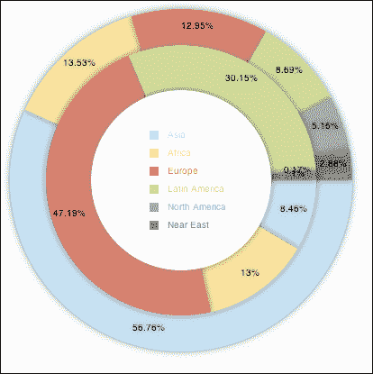
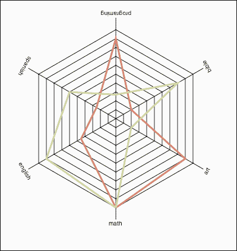

# 四、让我们把事情搞清楚

在本章中，我们将介绍:

*   构建气泡图
*   创建饼图
*   使用圆环图显示关系
*   利用雷达
*   构建树形图

# 简介

在最后一章中，我们构建了一个由点、线和条组成的线性图的组件。我们使用的大部分数据是二维的，而我们用四维图表结束了我们的课程。在本章中，我们将利用创建非线性数据的能力来表示数据。

# 构建气泡图

虽然我们图表中的许多项目将与我们在[第 3 章](03.html "Chapter 3. Creating Cartesian-based Graphs")、*创建基于笛卡尔坐标的图表*中创建的早期图表相关，但我们将从头开始。我们的目标是创建一个包含气泡的图表——气泡使我们能够用三个数据点(x、y 和气泡的大小)展示数据。这种类型的图表在制作动画时非常理想，因为它可以展示随着时间的变化(它可以在几秒钟内展示许多年)。

汉斯·罗斯林在 TED 演讲中展示了泡泡图的强大力量。


## 做好准备

我们将使用画布设置启动我们的项目，并跳过 HTML 结尾。如果您忘记了如何创建，请参考[第 1 章](01.html "Chapter 1. Drawing Shapes in Canvas")、*在画布中绘制形状*中的【2D 画布图形】配方。

有三个主要步骤:

*   创建数据源
*   创建背景
*   将图表数据信息添加到图表

## 怎么做...

让我们列出创建气泡图所需的步骤:

1.  下一个数据对象在数组中应该看起来很熟悉，数组中有学生英语、数学和编程成绩的对象。构建数据对象:

    ```html
    var students2001 = [{name:"Ben",
      math:30,
      english:60,
      programing:30},
      {name:"Joe",
      math:40,
      english:60,
      programing:40},
      {name:"Danny",
      math:50,
      english:90,
      programing:50},
      {name:"Mary",
      math:60,
      english:60,
      programing:60},
      {name:"Jim",
      math:80,
      english:20,
      programing:80}];
    ```

2.  创建我们的图表信息；与以前的图表相反，这张图表有第三个参数用于我们的泡沫信息。定义我们的图表规则:

    ```html
    var chartInfo= { y:{min:0, max:100,steps:5,label:"math"},
      x:{min:0, max:100,steps:5,label:"programing"},
      bubble:{min:0, max:100, minRaduis:3, maxRaduis:20,label:"english"}
    };
    ```

3.  最后一个数据对象将包含我们将来可能想要更改的所有样式信息。添加造型对象:

    ```html
    var styling = { outlinePadding:4,
      barSize:16,
      font:"12pt Verdana, sans-serif",
      background:"eeeeee",
      bar:"cccccc",
      text:"605050"
    };
    ```

4.  当文档准备触发`init`时，我们创建一个事件回调，所以让我们创建`init`函数:

    ```html
    var wid;
    var hei;
    function init(){
      var can = document.getElementById("bar");

      wid = can.width;
      hei = can.height;
      var context = can.getContext("2d");

      createOutline(context,chartInfo);
      addDots(context,chartInfo,students2001,["math","programing","english"],"name");
    }
    ```

5.  当我们创建样式对象时，我们开始创建轮廓。现在是时候把一切都画进我们的画布了。所以我们从设置我们的基础画布风格开始:

    ```html
    function createOutline(context,chartInfo){
      var s = styling;
      var pad = s.outlinePadding;
      var barSize = s.barSize;
      context.fillStyle = s.background;
      context.fillRect(0,0,wid,hei);
      context.fillStyle = s.bar;
      context.fillRect(pad,pad,barSize,hei-pad*2);
      context.font = s.font;
      context.fillStyle = s.text;
    ```

6.  我们需要保存当前的基于画布的图形布局信息，对其进行更改，使其更容易定位元素，然后将其恢复到原始状态:

    ```html
    context.save();
    context.translate(17, hei/2 );
    context.rotate(-Math.PI/2);
    context.textAlign = "center";
    context.fillText(chartInfo.y.label, 0, 0);
    context.restore();

    context.fillStyle = s.bar;
    context.fillRect(pad+barSize,hei-pad-barSize,wid-pad*2-barSize,barSize);
    context.font = s.font;
    context.fillStyle = s.text;
    context.fillText(chartInfo.x.label,( wid-pad*2-barSize)/2, hei-pad*2);

    context.translate(pad+barSize,hei-pad-barSize);
    context.scale(1, -1);
    //SET UP CONSTANTS - NEVER CHANGE AFTER CREATED
    styling.CHART_HEIGHT = hei-pad*2-barSize;
    styling.CHART_WIDTH = wid-pad*2-barSize;
    ```

7.  现在是时候借助我们的`chartInfo`物体

    ```html
    var steps = chartInfo.y.steps;
    var ratio;
    chartInfo.y.range = chartInfo.y.max-chartInfo.y.min;
    var scope = chartInfo.y.range;
    context.strokeStyle = s.text;
    var fontStyle = s.font.split("pt");
    var pointSize = fontStyle[0]/2;
    fontStyle[0]=pointSize;
    fontStyle = fontStyle.join("pt");
    context.font = fontStyle; // making 1/2 original size of bars
      for(var i=1; i<=steps; i++){
        ratio = i/steps;
        context.moveTo(0,ratio*styling.CHART_HEIGHT-1);
        context.lineTo(pad*2,ratio*styling.CHART_HEIGHT-1);
        context.scale(1,-1);

        context.fillText(chartInfo.y.min + (scope/steps)*i,0,(ratio*styling.CHART_HEIGHT-3 -pointSize)*-1);
        context.scale(1,-1);

      }

      steps = chartInfo.x.steps;
      chartInfo.x.range = chartInfo.x.max-chartInfo.x.min;
      scope = chartInfo.x.max-chartInfo.x.min;
      context.textAlign = "right";
      for(var i=1; i<=steps; i++){
        ratio = i/steps;
        context.moveTo(ratio*styling.CHART_WIDTH-1,0);
        context.lineTo(ratio*styling.CHART_WIDTH-1,pad*2);
        context.scale(1,-1);
        context.fillText(chartInfo.x.min + (scope/steps)*i,ratio*styling.CHART_WIDTH-pad,-pad/2);
        context.scale(1,-1);

      }

    context.stroke();
    }
    ```

    画出轮廓了
8.  现在是时候通过创建`addDots`方法将数据添加到我们的图表中了。功能`addDots`将接收带有要使用的规则(键)定义的数据，与我们在早期配方中所做的相反。

    ```html
    function addDots(context,chartInfo,data,keys,label){
      var rangeX = chartInfo.y.range;
      var _y;
      var _x; 

      var _xoffset=0;
      var _yoffset=0;

      if(chartInfo.bubble){
        var range = chartInfo.bubble.max-chartInfo.bubble.min;
        var radRange = chartInfo.bubble.maxRadius-chartInfo.bubble.minRadius; 
        context.textAlign = "left";
      }

      for(var i=0; i<data.length; i++){
        _x = ((data[i][keys[0]] - chartInfo.x.min )/ chartInfo.x.range) * styling.CHART_WIDTH;
        _y = ((data[i][keys[1]] - chartInfo.y.min )/ chartInfo.y.range) * styling.CHART_HEIGHT;
        context.fillStyle = "#44ff44";

        if(data[i][keys[2]]){
          _xoffset = chartInfo.bubble.minRadius + (data[i][keys[2]]-chartInfo.bubble.min)/range *radRange;
          _yoffset = -3;
          context.beginPath();
          context.arc(_x,_y, _xoffset , 0, Math.PI*2, true); 
          context.closePath();
          context.fill();

          _xoffset+=styling.outlinePadding;
        }else{
          context.fillRect(_x,_y,10,10);	
        }

        if(label){
          _x+=_xoffset;
          _y+=_yoffset;
          context.fillStyle = styling.text;
          context.save();
          context.translate(_x,_y );
          context.scale(1,-1);
          context.fillText("Bluping",0,0);
          context.restore();

        }
      }
    }
    ```

这段代码，虽然从头开始重做，但与[第三章](03.html "Chapter 3. Creating Cartesian-based Graphs")、*创建基于笛卡尔坐标的图形*的散点图配方中的数据传播有很多相似之处，修改后启用了第三级数据和新的图表格式。

就这样。你应该有一个运行的泡沫图。现在运行应用，会看到`x`参数展示的是数学成绩，`y`参数展示的是编程成绩，而我们的气泡大小展示的是学生的英语成绩。

## 它是如何工作的...

让我们从`createOutline`功能开始。在这种方法中，除了我们逐渐喜欢的常规画布绘制方法之外，我们引入了一种新的编码风格，在这种风格中，我们操纵实际的画布来帮助我们以更简单的方式定义代码。这里的两个重要关键方法如下:

```html
context.save();
context.restore();
```

我们将利用这两种方法几次。`save`方法保存画布的当前视图，而`restore`方法将用户返回到上次保存的画布:

```html
context.save();
context.translate(17, hei/2 );
context.rotate(-Math.PI/2);
context.textAlign = "center";
context.fillText(chartInfo.y.label, 0, 0);
context.restore();
```

在这种风格的第一次使用中，我们使用它通过向右旋转来绘制文本。`translate`方法移动画布的`0, 0`坐标，而`rotate`方法使用弧度旋转文本。

画出外部线条后，是时候利用这一新功能了。大多数图表依赖于向上增长的 y 坐标，但是该画布的 y 值从画布区域的顶部到底部增长。我们可以通过在循环添加范围值之前添加一些代码来翻转这种关系。

```html
context.translate(pad+barSize,hei-pad-barSize);
context.scale(1, -1);
```

在前面的几行中，我们首先移动画布的`0,0`坐标，使其正好位于图表的右下角，然后通过切换比例值来翻转画布。请注意，从现在开始，如果我们尝试在画布上添加文本，它将会颠倒过来。记住这一点，因为我们现在是在一个翻转过来的画布上画画。

当我们尝试键入新文本时，在第一个循环中需要注意的一点是，当我们想要添加文本时，我们首先撤消缩放，然后返回画布进行翻转:

```html
context.scale(1,-1);
context.fillText(chartInfo.y.min + (scope/steps)*i,0,(ratio*styling.CHART_HEIGHT-3 -pointSize)*-1);
context.scale(1,-1);
```

请注意，我们将 y 坐标乘以`*-1`。我们这样做是因为我们实际上希望 y 坐标的值为负，因为我们刚刚翻转了屏幕。

围绕 x 条文本的工作非常相似；请注意与查找 x 和 y 值计算相关的主要差异。

是时候深入`addDots`功能了。如果您一直在关注[第 3 章](03.html "Chapter 3. Creating Cartesian-based Graphs")、*创建基于笛卡尔坐标的图形*，那么这个功能将再次看起来很熟悉，但是这次我们使用的是修改过的画布。

我们从几个辅助变量开始:

```html
var rangeX = chartInfo.y.range;
var _y;
var _x; 
var _xoffset=0;
var _yoffset=0;
```

我们是动态加入气泡效应，也就是说即使只有两点信息，没有三点，这个方法也可以工作。我们继续测试，看看我们的数据对象是否包含气泡信息:

```html
if(chartInfo.bubble){
  var range = chartInfo.bubble.max-chartInfo.bubble.min;
  var radRange = chartInfo.bubble.maxRaduis-chartInfo.bubble.minRaduis; 
  context.textAlign = "left";
}
```

如果是这样的话，我们再添加几个变量，并将文本向左对齐，因为我们将在本例中使用它。

现在是我们浏览数据对象并在图表上传播数据的时候了。

```html
for(var i=0; i<data.length; i++){
  _x = ((data[i][keys[0]] - chartInfo.x.min )/ chartInfo.x.range) * styling.CHART_WIDTH;
  _y = ((data[i][keys[1]] - chartInfo.y.min )/ chartInfo.y.range) * styling.CHART_HEIGHT;
  context.fillStyle = "#44ff44";
```

对于每个循环，我们根据当前值重新计算`_x`和`_y`坐标。

如果我们有第三个要素，我们就准备好形成泡沫。如果我们没有它，我们需要创建一个简单的点。

```html
if(data[i][keys[2]]){
  _xoffset = chartInfo.bubble.minRaduis + (data[i][keys[2]]-chartInfo.bubble.min)/range *radRange;
  _yoffset = -3;
  context.beginPath();
  context.arc(_x,_y, _xoffset , 0, Math.PI*2, true); 
  context.closePath();
  context.fill();	
  _xoffset+=styling.outlinePadding;
}else{
   context.fillRect(_x,_y,10,10);	
}
```

在这个阶段，我们应该有一个活跃的气泡/点方法。剩下的就是让我们整合我们的覆盖副本。

在添加标签之前，我们先来看一下函数签名:

```html
function addDots(context,chartInfo,data,keys,label){}
```

`context``chartInfo`参数已经是我们样品中的标准。密钥的想法是让我们能够动态地切换要测试的数据。键的值是与 x 和 y 坐标相关的数组位置`0`和`1`，位置`2`用于气泡，正如我们之前看到的。`label`参数使我们能够为标签发送一个键值。这样，如果标签在那里，我们将添加一个标签，如果它不在那里，我们将不会。

```html
if(label){
  _x+=_xoffset;
  _y+=_yoffset;
  context.fillStyle = styling.text;
  context.save();
  context.translate(_x,_y );
  context.scale(1,-1);
  context.fillText(data[i][label],0,0);
  context.restore();						
 }
```

然后我们加上前面的`if`语句。如果设置了标签，我们将定位样式并创建标签的文本。

# 创建饼图

创建饼图的步骤相对简单和简短。饼图非常适合展示我们希望在数据字段之间轻松比较的封闭数据量，例如，在我们的示例中，根据地区将世界上的人数分成组:


## 做好准备

第一步将是更新我们在 HTML 区域的画布大小为矩形区域。在我们的示例中，我们将值更新为 400 x 400。差不多就是这样；让我们开始建造它。

## 怎么做...

在下面的步骤中，我们将创建第一个饼图。让我们开始吧:

1.  设置我们的数据源和全局变量:

    ```html
    var data= [	{label:"Asia", value:3518000000,style:"#B1DDF3"},
      {label:"Africa", value:839000000,style:"#FFDE89"},
      {label:"Europe", value:803000000,style:"#E3675C"},
      {label:"Latin America and Caribbean", value: 539000000,style:"#C2D985"},
      {label:"North America", value:320000000,style:"#eeeeee"},
      {label:"Near East", value:179000000,style:"#aaaaaa"},
      {label:"Oceania", value:32000000,style:"#444444"}
      ];
    var wid;
    var hei;
    var radius = 100;
    ```

2.  准备好我们的画布(从这里开始我们将深入`init`功能):

    ```html
    function init(){
      var can = document.getElementById("bar");

      wid = can.width;
      hei = can.height;
      var context = can.getContext("2d");
    ...
    ```

3.  计算总数据(世界人口):

    ```html
    var total=0;
    for(var i=0; i<data.length; i++) total+=data[i].value;
    ```

4.  以弧度设置 360 度，并将我们的枢轴点移动到`0,0` :

    ```html
    var rad360 = Math.PI*2;
    context.translate(wid/2,hei/2);
    ```

5.  使用以下代码片段绘制饼图:

    ```html
    var currentTotal=0;
      for(i=0; i<data.length; i++){
      context.beginPath();
      context.moveTo(0,0);
      context.fillStyle = data[i].style;
      context.arc( 0,0,radius,currentTotal/total*rad360,(currentTotal+data[i].value)/total*rad360,false);
      context.lineTo(0,0);
      context.closePath();
      context.fill();	

      currentTotal+=data[i].value;
      }
    }
    ```

就是这样；我们刚刚创建了一个基本的饼图——我告诉过你这很容易！

## 它是如何工作的...

我们的饼图，正如它的名称所示，使用了饼图，并且总是显示 100%的数据。由于我们的 arc 方法基于弧度工作，我们需要将这些数据点从百分位转换为弧度。

在计算出所有值的总和和圆中的总弧度(`2*PI`)后，我们准备循环并绘制切片。

```html
var currentTotal=0;
  for(i=0; i<data.length; i++){
    context.beginPath();
    context.moveTo(0,0);
    context.fillStyle = data[i].style;
```

逻辑相对简单；我们循环遍历所有数据元素，根据数据对象更改填充样式，并将我们的指针移动到`0,0`(由于我们已经更改了画布的枢轴点，因此移动到屏幕的中心)。

```html
context.arc( 0,0,radius,currentTotal/total*rad360,(currentTotal+data[i].value)/total*rad360,false);
context.lineTo(0,0);
context.closePath();
context.fill();	

currentTotal+=data[i].value;
```

现在我们画弧线。注意突出显示的文本；我们从当前总和的起点开始，通过这个点，我们以弧度计算角度:

```html
currentTotal/total*rad360

```

我们可以将这个值转换成一个百分比值，我们可以根据圆的总弧度来复制这个值。我们的第二个参数非常接近，所以我们只需将当前区域的当前值加入其中:

```html
(currentTotal+data[i].value)/total*rad360
```

这里要注意的最后一点是，我们将弧的最后一个参数设置为`false`(逆时针)，因为这最适合我们的计算。

最后但同样重要的是，我们更新我们的`currentTotal`值以包含新添加的区域，因为这将是我们下一轮`for`循环的起点。

## 还有更多...

没有任何内容信息的饼图可能不会像有信息的图表那样有效，但是我们可以找出位置...不用担心；我们将重访我们的老朋友`cos`和`sin`来帮助我们定位我们圈子上的点，使我们能够在我们新创建的馅饼上添加文本信息。

### 重温数学. cos()和数学. sin()

我们将从添加一个新的全局变量来存储我们的线条颜色开始，然后我们将其称为`copyStyle`:

```html
var copyStyle = "#0000000000";
```

现在我们回到了我们的`init`函数，让我们在最后一行之前将它添加到我们的`for`循环中:

```html
currentTotal+=data[i].value;
```

正如所料，我们将首先设置新的`copyStyle`变量作为填充和描边值:

```html
context.strokeStype = context.fillStyle =  copyStyle;
```

我们的下一步是找到我们想要在饼图中划出一条线的位置，这样我们就可以添加文本:

```html
midRadian = (currentTotal+data[i].value/2)/total*rad360;
```

为了实现这一点，我们将使用一个新的变量来存储上一个总计和新值之间的中间值(新切片的中心)。目前为止一切顺利。现在我们需要弄清楚如何得到那个点的 x 和 y 位置。幸运的是，通过使用 `Math.cos`(用于 x)和 `Math.sin`(用于 y)函数，有一种非常简单的方法可以在一个圆内完成:

```html
context.beginPath();
context.moveTo(Math.cos(midRadian)*radius,Math.sin(midRadian)*radius);
context.lineTo(Math.cos(midRadian)*(radius+20),Math.sin(midRadian)*(radius+20));
context.stroke();
```

有了我们的`midRadian`变量，我们将得到半径为`1`的圆的值，所以我们剩下要做的就是用我们的真实半径复制这个值来找到我们的起点。当我们想在外部画一条与圆弧方向相同的线时，我们会找到一个更大的假想圆的点；为此，我们将使用相同的公式，但是将半径值升级 20，创建一条与圆弧相关的对角线。

剩下我们要做的就是找出我们想要在图表中包含的文本，使用相同的弧点和更大的圆:

```html
context.fillText(data[i].label,Math.cos(midRadian)*(radius+40),Math.sin(midRadian)*(radius+40));
```

看起来不错...唯一的问题是我们没有自己的价值观；让我们添加它们，并找出与之相关的挑战。

### 改进气泡的文本格式

在一个真实的例子中，如果这是一个实时应用，我们可能想要使用翻转(我们将在后面的章节中讨论这个想法)，但是让我们尝试找出一种方法来创建能够包含所有信息的图表。我们在前面的代码行中停下来，它有一个非常大的外圈(`radius+40`)。那是因为我们想在正下方插入一行新的文本，所以让我们这样做:

```html
context.fillText(formatToMillions(data[i].value) + "(" +formatToPercent(data[i].value/total) + ")" ,Math.cos(midRadian)*(radius+40),Math.sin(midRadian)*(radius+40) + 12);
```

这有点拗口，但它基本上与前一行相同，有一行新的文本和一个额外的变化，因为我们将 y 值移动了 12 个像素，以考虑同一区域的第一行文本。为了做到这一点，我们使用了两个帮助函数来格式化文本:

```html
function formatToPercent(val){
  val*=10000;
  val = parseInt(val);
  val/=100;
  return val + "%"	
}

function formatToMillions(val){
  val/=1000000;
  return val + "Million";	
}
```

如果您以当前格式运行应用，您会发现文本在页面上看起来不太好，这就是您内部的艺术家需要整理的地方。我已经在我们的源文件中继续这个示例，直到它感觉正确为止，所以从现在开始检查它或者创建您自己的变体。

# 用甜甜圈图展示关系

甜甜圈图是一个奇特的饼图。所以如果你还没有创建饼图，我强烈建议你重温之前的食谱，*创建饼图*。甜甜圈图是分层饼图。此图表非常适合将数据类型之间的可比数据压缩成饼图:



## 做好准备

我们将从上一个示例中获取代码，并根据我们的需要进行调整。因此，我们将从上一个示例中相同的 HTML 文件和相同的代码开始。

## 怎么做...

执行以下步骤:

1.  让我们用一些虚拟数据更新我们的数据(我们将创建两个数据对象):

    ```html
    var data1= [	{label:"Asia", value:3518000000,style:"#B1DDF3"},
      {label:"Africa", value:839000000,style:"#FFDE89"},
      {label:"Europe", value:803000000,style:"#E3675C"},
      {label:"Latin America and Caribbean", value: 539000000,style:"#C2D985"},
      {label:"North America", value:320000000,style:"#999999"},
      {label:"Near East", value:179000000,style:"#666666"}
    ];

    var data2= [	{label:"Asia", value:151000,style:"#B1DDF3"},
      {label:"Africa", value:232000,style:"#FFDE89"},
      {label:"Europe", value:842000,style:"#E3675C"},
      {label:"Latin America and Caribbean", value: 538100,style:"#C2D985"},
      {label:"North America", value:3200,style:"#999999"},
      {label:"Near East", value:17900,style:"#666666"}
    ];
    ```

2.  修改`init`函数，将所有创建饼图的线提取到一个单独的函数中，并添加一个新函数`createHole`(对于我们的甜甜圈):

    ```html
    function init(){
      var can = document.getElementById("bar");

      wid = can.width;
      hei = can.height;
      var context = can.getContext("2d");
      context.translate(wid/2,hei/2);

      createPie(context,data1,190);
      createPie(context,data2,150);
      createHole(context,100);
    }
    ```

3.  修改饼图创建以更改文本布局以适合饼图:

    ```html
    function createPie(context,data,radius){
      var total=0;
      for(var i=0; i<data.length;i++) total+=data[i].value;

      var rad360 = Math.PI*2;

      var currentTotal=0;
      var midRadian;
      var offset=0;
      for(i=0; i<data.length; i++){
        context.beginPath();
        context.moveTo(0,0);
        context.fillStyle = data[i].style;
        context.arc( 0,0,radius,currentTotal/total*rad360,(currentTotal+data[i].value)/total*rad360,false);
        context.lineTo(0,0);
        context.closePath();
        context.fill();	

        context.strokeStype = context.fillStyle =  copyStyle;
        midRadian = (currentTotal+data[i].value/2)/total*rad360;
        context.textAlign = "center";
        context.fillText(formatToPercent(data[i].value/total),Math.cos(midRadian)*(radius-20),Math.sin(midRadian)*(radius-20) );

        currentTotal+=data[i].value;

      }

    }
    ```

4.  我们需要创建方法`createHole`(实际上是一个简单的圆):

    ```html
    function createHole(context,radius){
      context.beginPath();
      context.moveTo(0,0);
      context.fillStyle = "#ffffff";
      context.arc( 0,0,radius,0,Math.PI*2,false);
      context.closePath();
      context.fill();

    }
    ```

就这样！我们现在可以通过改变半径来创建一个无限的甜甜圈，有多少层就有多少层，每次添加新层时，半径都会变小。

## 它是如何工作的...

甜甜圈图的核心逻辑与饼图相同。我们的主要焦点实际上是在视觉层面上重新格式化和重新布线要概述的内容。因此，我们的部分工作是删除不相关的内容，并进行必要的更新:

```html
context.fillText(formatToPercent(data[i].value/total),Math.cos(midRadian)*(radius-20),Math.sin(midRadian)*(radius-20) );
```

需要注意的主要事情是，我们正在硬编码一个比当前半径小 20 的值。如果我们想让我们的样本适用于所有可能的选项，我们需要找出一种更智能的方法来生成这些数据，因为理想情况下，我们希望文本在甜甜圈区域之间并旋转，但我们以前做过这种性质的事情，所以我将把它留给您探索。

## 还有更多...

虽然我们的甜甜圈已经创建并准备好了，但是如果我们在其中添加更多的信息，例如轮廓和图例，这将会有所帮助，因为我们从上一个示例中提取了大部分文本。

### 添加轮廓

我们将使用阴影在我们的形状周围创建一个辉光。最简单快捷的方法是重新访问`init`功能，并在其中添加阴影信息以创建这种效果:

```html
function init(){
  var can = document.getElementById("bar");

  wid = can.width;
  hei = can.height;
  var context = can.getContext("2d");
  context.translate(wid/2,hei/2);

 context.shadowOffsetX = 0;
 context.shadowOffsetY = 0;
 context.shadowBlur    = 8;
 context.shadowColor   = 'rgba(0, 0, 0, 0.5)';

  createPie(context,data1,190);
  createPie(context,data2,150);
  createHole(context,100);

}
```

这里的关键是我们将 x 和 y 值的偏移量都设置为`0`，因此我们的阴影被用作光晕。从这里开始绘制的每一个元素都会有一个阴影，这对我们来说是完美的。

### 创造传奇

嘿，既然我们的甜甜圈上有一个大洞，我们把我们的传说放在中间怎么样？由于有时中间并不完全是最好看的东西，所以在我们创建传奇之后，最好手动找出什么是完美的位置。

```html
context.shadowColor   = 'rgba(0, 0, 0, 0)';
context.translate(-35,-55);
createLegend(context,data1);
```

我们从移除阴影开始，通过将它的 alpha 设置为`0`并移动我们的枢轴点。(传奇创作后我一直在调整这些数字，直到开心为止。)

好了，我们准备使用`createLegend`功能创建我们的传奇:

```html
function createLegend(context,data){
  context.textAlign="left";
  for(var i=0;i<data.length;i++){
    context.fillStyle=data[i].style;
    context.fillRect(0,i*20,10,10);	
    context.fillText(data[i].label,20,i*20+8);
  }
}
```

我们已经用一个传说完成了一个完全成熟的甜甜圈图。

## 另见

*   创建饼图的食谱

# 利用雷达

雷达是非常被误解的图表，但确实很神奇。雷达使我们能够以非常简洁的方式展示大量可比数据。雷达图也被称为蜘蛛图。

### 类型

**警告**

你真的需要对`Math.cos`和`Math.sin`功能友好，因为我们将在这个图表类型中使用它们很多次。话虽如此，如果你对它们还感到不舒服，从这一章的开头开始刷新你的记忆将是一个好主意。

## 做好准备

像往常一样，我们将从带有`init`回调的基础 HTML 页面开始。

### 类型

**注**

雷达图实际上是一个折线图，被包裹成一个圆形，涉及许多不同的数学问题；但这是同一个想法——我们不是横向传播我们的数据，而是围绕一个中心点传播我们的数据。



## 怎么做...

让我们看看创建雷达图的步骤是什么:

1.  创建/组织图表数据和实际数据:

    ```html
    var data=[{label:"Ben", style:"#E3675C", math:90,english:45,spanish:25,programing:90,bible:20,art:90},
      {label:"Sharon", style:"#C2D985", math:100,english:90,spanish:60,programing:27,bible:80,art:20}];

    var chartInfo= {steps:10, max:100, types:["math","english","spanish","programing","bible","art"]};
    ```

2.  添加几个辅助变量和一个`init`函数:

    ```html
    var wid;
    var hei;
    var copyStyle = "#0000000000";
    var radius = 180;
    var radianOffset = Math.PI/2

    function init(){
      var can = document.getElementById("bar");

      wid = can.width;
      hei = can.height;
      var context = can.getContext("2d");

      createSpider(context,chartInfo,data);
    }
    ```

3.  现在是时候创建`createSpider`功能 :

    ```html
    function createSpider(context,chartInfo,data){
      drawWeb(context,chartInfo,radius);
      drawDataWeb(context,chartInfo,data,radius);

    }
    ```

4.  我们将雷达网的创建分为两个阶段。第一个是从网中心出来的线，另一个是围绕这个中心点的实际网。让我们从第一步开始，继续第二个循环的下一部分:

    ```html
    function drawWeb(context,chartInfo,radius){
      chartInfo.stepSize = chartInfo.max/chartInfo.steps;
      var hSteps = chartInfo.types.length;
      var hStepSize = (Math.PI*2)/hSteps;
      context.translate(wid/2,hei/2);
      context.strokeStyle = "#000000";
        for(var i=0; i<hSteps; i++){
          context.moveTo(0,0);
          context.lineTo(Math.cos(hStepSize*i + radianOffset)*(radius+20),Math.sin(hStepSize*i + radianOffset)*(radius+20));
        }

        var stepSize = radius/chartInfo.steps;
        var cRad;

        for(var i=1; i<=chartInfo.steps; i++){
          cRad = i*stepSize;
          context.moveTo(Math.cos(radianOffset)*cRad,Math.sin(radianOffset)*cRad);

        for(var j=0;j<hSteps; j++){
          context.lineTo(Math.cos(hStepSize*j + radianOffset)*cRad,Math.sin(hStepSize*j + radianOffset)*cRad);
        }
        context.lineTo(Math.cos(radianOffset)*cRad,Math.sin(radianOffset)*cRad);

      }

      context.stroke();
    }
    ```

5.  现在是时候整合我们的数据了:

    ```html
    function drawDataWeb(context,chartInfo,data,radius){
      var hSteps = chartInfo.types.length;
      var hStepSize = (Math.PI*2)/hSteps;
      for(i=0; i<data.length; i++){
        context.beginPath();
        context.strokeStyle = data[i].style;
        context.lineWidth=3;
        cRad = radius*(data[i][chartInfo.types[0]]/chartInfo.max);
        context.moveTo(Math.cos(radianOffset)*cRad,Math.sin(radianOffset)*cRad);

        for(var j=1;j<hSteps; j++){
          cRad = radius*(data[i][chartInfo.types[j]]/chartInfo.max);
          context.lineTo(Math.cos(hStepSize*j + radianOffset)*cRad,Math.sin(hStepSize*j + radianOffset)*cRad);
        }
        cRad = radius*(data[i][chartInfo.types[0]]/chartInfo.max);
        context.lineTo(Math.cos(radianOffset)*cRad,Math.sin(radianOffset)*cRad);
        context.stroke();
      }

    }
    ```

恭喜你，你刚刚创建了一个雷达/蜘蛛图。

## 它是如何工作的...

雷达图是我们比较复杂的图表类型之一。到目前为止，它使用了很多 cos/sin 函数，但逻辑非常一致，因此相对简单。

让我们深入了解一下`drawWeb`方法:

```html
chartInfo.stepSize = chartInfo.max/chartInfo.steps;
var hSteps = chartInfo.types.length;
var hStepSize = (Math.PI*2)/hSteps;
context.translate(wid/2,hei/2);
context.strokeStyle = "#000000";
```

我们首先创建几个辅助变量，并将我们的枢轴点重新定位到屏幕中心，以帮助我们进行计算。

```html
for(var i=0; i<hSteps; i++){
  context.moveTo(0,0);
  context.lineTo(Math.cos(hStepSize*i + radianOffset)*(radius+20),Math.sin(hStepSize*i + radianOffset)*(radius+20));
}
```

然后，我们根据课程的数量创建尖峰，因为每个课程都用一个尖峰来表示。

既然我们已经有了核心构建模块(尖峰)，现在是时候创建我们的蜘蛛网的交织了:

```html
var stepSize = radius/chartInfo.steps;
  var cRad;

  for(var i=1; i<=chartInfo.steps; i++){
    cRad = i*stepSize;
    context.moveTo(Math.cos(radianOffset)*cRad,Math.sin(radianOffset)*cRad);

    for(var j=0;j<hSteps; j++){
      context.lineTo(Math.cos(hStepSize*j + radianOffset)*cRad,Math.sin(hStepSize*j + radianOffset)*cRad);
    }
    context.lineTo(Math.cos(radianOffset)*cRad,Math.sin(radianOffset)*cRad);

  }

context.stroke();
```

在这个多维循环中，我们一步一步地运行，从圆上的一个点到下一个点(从一个尖峰点到下一个点)画线，每次完成创建一个完整的形状时，我们的半径都会增加。我们在这里创建的每个形状代表学生分数增加 10，因为我们的学生只能有 0 到 100 之间的分数。我们可以忽略这个样本中的极端情况。(如果数据范围不是从 0 开始，您可能需要调整此代码。)

当我们的`drawDataWeb`方法改变时，基于分数的半径假设范围为 0 到 100。(如果您的范围不同，则需要修改此代码，或者在发送到方法时将数据集修改为介于 0 和 100 之间。)

## 还有更多...

我们的雷达并不完美，因为它可以在我们的雷达周围使用一个图例和一些文本信息，以便我们知道每个条代表什么。我们将让你整理一个传奇，就像我们在之前的食谱中所做的那样*使用一个甜甜圈图来显示关系*。

### 添加旋转的图例

为了解决这个问题并添加我们的文本，我们将使用函数中的第一个循环重新访问我们的函数`drawWeb`，而不是更新 cos/sin 值来找到旋转，我们将只是旋转画布并每次在边缘整合我们的文本:

```html
function drawWeb(context,chartInfo,radius){
  chartInfo.stepSize = chartInfo.max/chartInfo.steps;
  var hSteps = chartInfo.types.length;
  var hStepSize = (Math.PI*2)/hSteps;
  context.translate(wid/2,hei/2);
  context.strokeStyle = "#000000";
  context.textAlign="center";
  for(var i=0; i<hSteps; i++){
 context.moveTo(0,0);	context.lineTo(Math.cos( radianOffset)*(radius+20),Math.sin( radianOffset)*(radius+20));
 context.fillText(chartInfo.types[i],Math.cos( radianOffset)*(radius+30),Math.sin( radianOffset)*(radius+30));
  context.rotate(hStepSize);
}
```

这里的逻辑稍微简单一点，因为我们只是每次旋转画布，一遍又一遍地使用完全相同的代码，直到旋转完成一整圈。

# 构建树形图

虚拟世界中的树有很多类型，虽然最直观的是家谱。家谱比类继承树这样的基础数据树复杂一点，因为大部分类只有一个父类，而家谱通常有两个。

我们将为 ActionScript 3.0 的显示对象构建一个继承树。

## 做好准备

请注意，此示例在 HTML5 中是最前沿的。没有人真正知道是否会被采用的新特性之一是 E4X。它已经被火狐所接受，但是并不是所有的浏览器都实现了它(它在 Flash 中也得到了完全的支持)。

**ECMAScript for XML**(**E4X**)是的一种编程语言扩展，它为 ECMAScript 增加了原生的 XML 支持。它已经取代了 DOM 接口，并实现为一个原语(如数字和布尔值)，使其更快、更优化。

由于我们主要在本地工作，我们将直接在 JavaScript 中保存我们的 XML 文档，以避免沙盒安全问题。

为了帮助我们分隔元素，我们将在这个示例中使画布区域变得更大(800 x 400)。好了，让我们开始实现用 E4X 创建的树示例。


## 怎么做...

执行以下步骤:

1.  我们将从创建包含我们的类树的 XML 对象开始(请注意，这仅适用于编写本书时最新版本的火狐):

    ```html
    var xml = <node name ="Display Object">
    <node name="AVM1Mobie" />
      <node name="Bitmap" />
      <node name="InteractiveObject" >
      <node name="DisplayObjectContainer">
      <node name="Loader" />	
      <node name="Sprite" >
      <node name="MovieClip"/>
    </node>	
    <node name="Stage" />	
    </node>	
    <node name="SimpleButton" />	
      <node name="TextField" />	
    </node>
      <node name="MorphShape" />
      <node name="Shape" />
      <node name="StaticText" />
      <node name="Video" />
    </node>;
    ```

2.  然后创建我们的标准助手和造型对象:

    ```html
    var wid;
    var hei;
    var style = {boxWidth:90,boxHeight:30, boxColor:"black",boxCopy:"white", boxSpace:4, lines:"black",lineSpace:30 };
    ```

3.  我们将实现我们的`init`函数，然后调用`drawTree`函数:

    ```html
    function init(){
      var can = document.getElementById("bar");
      wid = can.width;
      hei = can.height;
      var context = can.getContext("2d");
      context.textAlign = "center";
      context.font = "6pt Arial";
      drawTree(context,wid/2,20, xml );
    }
    ```

4.  实现`drawTree`函数的时间(我们的递归函数):

    ```html
    function drawTree(context,_x,_y,node){	
      context.fillStyle=style.boxColor;
      context.fillRect(_x-style.boxWidth/2,_y-style.boxHeight/2,style.boxWidth,style.boxHeight);
      context.fillStyle=style.boxCopy;
      context.fillText(node.@name,_x,_y+8);

      if(node.hasComplexContent()){
        var nodes = node.node;
        var totalWidthOfNewLayer = nodes.length()* style.boxWidth;
        if(nodes.length()>1)totalWidthOfNewLayer += ( nodes.length()-1)* style.boxSpace;
        var startXPoint = _x-totalWidthOfNewLayer/2 + style.boxWidth/2;
        var currentY = _y+style.boxHeight/2;

        context.beginPath();
        context.strokeStyle ="#000000";
        context.lineWidth=3;
        context.moveTo(_x,currentY);
        currentY+=style.lineSpace/2;
        context.lineTo(_x,currentY);
        context.moveTo(startXPoint,currentY);
        context.lineTo(startXPoint+totalWidthOfNewLayer- style.boxWidth,currentY); 
        context.stroke();	

        for(var i=0; i<nodes.length();i++){
          drawTree(context,startXPoint + i*(style.boxWidth + style.boxSpace) ,_y+50,nodes[i]);
        }
      }
    }
    ```

塔达！我们刚刚创造了第一棵树。

## 它是如何工作的...

更多关于E4X 如何工作的信息，我推荐查看一些在线资源，比如[http://goo.gl/jLWYd](http://goo.gl/jLWYd)[http://goo.gl/dsHD4](http://goo.gl/dsHD4)。

让我们更深入地看看我们的递归`drawTree`是如何工作的。`createTree`的基本思想是创建当前焦点节点，检查节点是否有子节点；如果是，将它们发送到`drawTree`并让它们递归地继续，直到所有的子对象都被创建和完成。当创建递归函数(一个调用自身的函数)时，您需要担心的最关键的事情之一是确保它不会无休止地结束，并且由于我们的场景有一个基于 XML 结构的非常明确的结束，所以我们是安全的。

我们从创建聚焦的当前节点开始，基于在函数参数中发送的点值:

```html
context.fillStyle=style.boxColor;
context.fillRect(_x-style.boxWidth/2,_y-style.boxHeight/2,style.boxWidth,style.boxHeight);
context.fillStyle=style.boxCopy;
context.fillText(node.@name,_x,_y+8);
```

就在这些线之后，它开始变得非常有趣。如果我们的节点很复杂，我们将假设它有子节点，因为这是我们创建 XML 对象的基本规则；如果是这样的话，我们就该画孩子们了:

```html
if(node.hasComplexContent()){
```

我们首先绘制一个可视化栏来帮助我们查看当前元素的子元素，并在这个过程中创建一些辅助变量:

```html
var nodes = node.node;
var totalWidthOfNewLayer = nodes.length()* style.boxWidth;
if(nodes.length()>1)
  totalWidthOfNewLayer += ( nodes.length()-1)* style.boxSpace;

  var startXPoint = _x-totalWidthOfNewLayer/2 + style.boxWidth/2;
  var currentY = _y+style.boxHeight/2;

  context.beginPath();
  context.strokeStyle ="#000000";
  context.lineWidth=3;
  context.moveTo(_x,currentY);
  currentY+=style.lineSpace/2;
  context.lineTo(_x,currentY);
  context.moveTo(startXPoint,currentY);
  context.lineTo(startXPoint+totalWidthOfNewLayer- style.boxWidth,currentY); 
context.stroke();
```

在创建了我们的轮廓辅助线之后，是时候让我们循环遍历这些孩子，并用他们的新位置将他们发送到`drawTree`了:

```html
for(var i=0; i<nodes.length();i++){
  drawTree(context,startXPoint + i*(style.boxWidth + style.boxSpace) ,_y+50,nodes[i]);
  }	
}
```

这涵盖了所有的逻辑。在这个阶段，逻辑将为每个元素重新开始，一次一个。

## 还有更多...

在一个完美的世界里，我们对树的工作现在应该已经完成了，但是在现实世界的场景中，我们经常会遇到问题。如果我们对当前的树玩得足够多，我们会发现视觉问题，例如如果一个子节点有多个子节点，它的子节点将与其他树的分支重叠。例如，如果我们更新我们的`Loader`类以有两个新的孩子(两个虚拟类只是为了我们的例子):

```html
var xml = <node name ="Display Object">
  <node name="AVM1Mobie" />
  <node name="Bitmap" />
  <node name="InteractiveObject" >
  <node name="DisplayObjectContainer">
 <node name="Loader">
 <node name="SlideLoader"/>
 <node name="ImageLoader"/>
 </node> 
  <node name="Sprite" >
  <node name="MovieClip"/>
 <node name="MovieClip2"/>
  </node>	
  <node name="Stage" />	
  </node>	
  <node name="SimpleButton" />	
  <node name="TextField" />	
  </node>
  <node name="MorphShape" />
  <node name="Shape" />
  <node name="StaticText" />
  <node name="Video" />
</node>;
```

如果你刷新你的浏览器(目前只有火狐)，你会看到我们的元素是重叠的，因为我们没有考虑有孩子的孩子的选项。如果我们更深入地查看我们的代码，我们会发现在当前的逻辑格式中，没有办法解决这个问题，因为子对象的创建是分开进行的。我们需要找到一种管理线条的方法，这样我们的元素就有办法知道它们将要重叠。

为了解决这个问题，我们将需要使我们的递归函数更加复杂，因为它将需要跟踪其子级的 x 位置，以便每当有重叠时它都可以偏移。请检查修改后的代码(更改以粗体标记):

```html
function drawTree(context,_x,_y,node,nextChildX){
  context.fillStyle=style.boxColor;
  context.fillRect(_x-style.boxWidth/2,_y-style.boxHeight/2,style.boxWidth,style.boxHeight);
  context.fillStyle=style.boxCopy;
  context.fillText(node.@name,_x,_y+8);

  if(node.hasComplexContent()){
    var nodes = node.node;
    var totalWidthOfNewLayer = nodes.length()* style.boxWidth;
    if(nodes.length()>1)totalWidthOfNewLayer += ( nodes.length()-1)* style.boxSpace;
    var startXPoint = _x-totalWidthOfNewLayer/2 + style.boxWidth/2;
    var currentY = _y+style.boxHeight/2;

    context.beginPath();
    context.strokeStyle ="#000000";
    context.lineWidth=3;
    context.moveTo(_x,currentY);

    if(nextChildX>startXPoint){
      currentY+=style.lineSpace/4;
      context.lineTo(_x,currentY);
      context.lineTo(_x + (nextChildX-startXPoint),currentY);

      currentY+=style.lineSpace/4;
      context.lineTo(_x + (nextChildX-startXPoint),currentY);
      startXPoint = nextChildX; // offset correction value
 }else{
      currentY+=style.lineSpace/2;
      context.lineTo(_x,currentY);
 }
    context.moveTo(startXPoint,currentY);
    context.lineTo(startXPoint+totalWidthOfNewLayer- style.boxWidth,currentY); 
    context.stroke();
 var returnedNextChildX=0;
    for(var i=0; i<nodes.length();i++){
      returnedNextChildX = drawTree(context,startXPoint + i*(style.boxWidth + style.boxSpace) ,_y+50,nodes[i],returnedNextChildX);
    }
 return startXPoint + i*(style.boxWidth + style.boxSpace);
  }

 return 0;
}
```

哇，这看起来很复杂——因为它是！所以让我们打破逻辑。

这个想法很简单，但是对于每一个简单的想法来说，有时候在实现之后就很难想象了。想法是每次创建一个新的树元素，如果它没有孩子的话就返回`0`，如果它有孩子的话就把下一个自由位置发回给未来的孩子。我们还在函数中添加了第四个参数，每次循环遍历子函数时，我们都会发送这个信息。这样每个孩子都知道最后一个孩子在哪里停下来了。如果一个元素的真实位置无法计算出来，我们根据偏移量画一条重定向线，并更新`startXPoint`。深入研究一下这个(到目前为止我最喜欢的食谱中的代码)，弄清楚它很有趣！