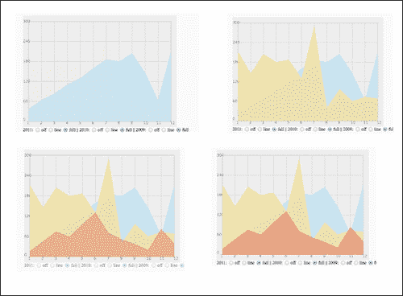
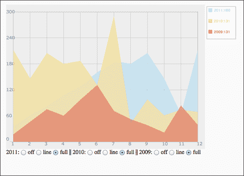

# 六、让静态的东西活起来

在本章中，我们将涵盖以下主题:

*   堆叠图形层
*   转向面向对象的视角
*   设置独立层的动画
*   添加交互式图例
*   创建上下文相关的图例

# 简介

直到现在，保持事情有条理和干净的重要性还不如完成我们的项目的重要性，因为我们有相对较小的项目。这一章将让我们养成一些新的习惯，首先让一切变得动态，然后创建一个更面向对象的程序，这样我们就更容易分离任务并减少代码占用。经过所有这些艰苦的工作，我们将重新审视我们的应用，并开始添加额外的逻辑，以使我们的应用一层一层地动画化。

这一章是重构实践的巨大资源。在本章的前半部分，我们将专注于改进我们的代码结构，以使我们有可能达到本章后半部分所需的控制水平。

# 堆叠图形层

在我们可以在画布上做任何真实的动画之前，我们真的需要重新思考在一个画布层上构建一切的概念。一旦绘制了画布元素，就很难对其进行细微的小更改，例如特定元素的淡入。我们将重温我们著名的图表之一，条形图，我们在前面的章节中多次使用和增强了它。在本章中，我们的目标将是打破逻辑，使其更加模块化。在这个食谱中，我们将分层。当我们准备好制作动画时，每一层都会给我们更多的控制。

## 做好准备

首先抓取上一章的最新文件:`05.02.line-revisit.html`和`05.02.line-revisit.js`。

## 怎么做...

对 HTML 文件进行了以下更改:

1.  更新 HTML 文件以包含更多画布元素(每条绘制线一个):

    ```html
    <body onLoad="init();" style="background:#fafafa">
        <h1>Users Changed between within a year</h1>
        <div class="graphicLayers" >
          <canvas id="base" class="canvasLayer" width="550" height="400"> </canvas>

          <canvas id="i2011" class="canvasLayer" width="550" height="400"> </canvas>
          <canvas id="i2010" class="canvasLayer" width="550" height="400"> </canvas>
          <canvas id="i2009" class="canvasLayer" width="550" height="400"> </canvas>

      </div>
      <div class="controllers">
      2009 : <input type="radio" name="i2009" value="-1" /> off
            <input type="radio" name="i2009" value="0" /> line
            <input type="radio" name="i2009" value="1" select="1" /> full ||
        2010 : <input type="radio" name="i2010" value="-1" /> off
            <input type="radio" name="i2010" value="0" /> line
            <input type="radio" name="i2010" value="1" select="1" /> full ||
        2011 : <input type="radio" name="i2011" value="-1" /> off
            <input type="radio" name="i2011" value="0" /> line
            <input type="radio" name="i2011" value="1" select="1" /> full
      </div>
    </body>
    </html>
    ```

2.  Add a CSS script so the layers will be stacked:

    ```html
    <head>
        <title>Line Chart</title>
        <meta charset="utf-8" />
        <style>
        .graphicLayers {
        	position: relative;	
        	left:100px
        }

        .controllers {
          position: relative;	
          left:100px;
          top:400px;

        }

        .canvasLayer{
          position: absolute; 
          left: 0; 
          top: 0; 
        }
        </style>
      <script src="06.01.layers.js"></script>		
      </head>
    ```

    让我们进入 JavaScript 文件来更新它。

3.  添加一个`window.onload`回调函数(代码片段中突出显示的更改):

    ```html
    window.onload = init;

    function init(){
    ```

4.  从全局范围移除变量`context`(删除突出显示的代码片段):

    ```html
    var CHART_PADDING = 20;
    var wid;
    var hei;
    var context;

    ```

5.  将所有条形图信息合并到一个对象中，以便于控制(删除所有突出显示的代码片段):

    ```html
    var a2011 = [38,65,85,111,131,160,187,180,205,146,64,212];
    var a2010 = [212,146,205,180,187,131,291,42,98,61,74,69];
    var a2009 = [17,46,75,60,97,131,71,52,38,21,84,39];

    var chartInfo= { y:{min:0, max:300, steps:5,label:"users"},
            x:{min:1, max:12, steps:11,label:"months"}
          };

    var HIDE_ELEMENT = -1;
    var LINE_ELEMENT = 0;
    var FILL_ELEMENT = 1;

    var elementStatus={i2009:FILL_ELEMENT,i2010:FILL_ELEMENT,i2011:FILL_ELEMENT};

    var barData = {
            i2009:{
              status:	FILL_ELEMENT,
              style: "#E3675C",
              label: "/2009",
              data:[17,46,75,60,97,131,71,52,38,21,84,39]
            },
            i2010:{
              status:	FILL_ELEMENT,
              style: "#FFDE89",
              label: "/2010",
              data:[212,146,205,180,187,131,291,42,98,61,74,69]
            },
            i2011:{
              status:	FILL_ELEMENT,
              style: "#B1DDF3",
              label: "/2011",
              data:[38,65,85,111,131,160,187,180,205,146,64,212]
            }

          };
    ```

6.  从`init`功能中移除所有画布逻辑，并将其添加到`drawChart`功能 :

    ```html
    function init(){
      var can = document.getElementById("bar");

      wid = can.width;
      hei = can.height;
      context = can.getContext("2d");

      drawChart();

      var radios ;
      for(var id in elementStatus){
        radios = document.getElementsByName(id);
        for (var rid in radios){
           radios[rid].onchange = onChangedRadio;
          if(radios[rid].value == elementStatus[id] ) radios[rid].checked = true;	 
        }

      }

    }

    function drawChart(){
     var can = document.getElementById("base");

     wid = can.width;
     hei = can.height;
     var context = can.getContext("2d");
    ...
    ```

7.  更新对`init`函数中新数据对象的引用:

    ```html
    function init(){
      drawChart();

      var radios ;
     for(var id in barData){
        radios = document.getElementsByName(id);
        for (var rid in radios){
           radios[rid].onchange = onChangedRadio;
     if(radios[rid].value == barData[id].status ) radios[rid].checked = true; 
        }

      }

    }
    ```

8.  在`drawChart`函数中，将线创建的逻辑提取到外部函数中(删除高亮显示的代码片段):

    ```html
     if(elementStatus.i2011>-1) addLine(context,formatData(a2011, "/2011","#B1DDF3"),"#B1DDF3",elementStatus.i2011==1);
     if(elementStatus.i2010>-1) addLine(context,formatData(a2010, "/2010","#FFDE89"),"#FFDE89",elementStatus.i2010==1);
     if(elementStatus.i2009>-1) addLine(context,formatData(a2009, "/2009","#E3675C"),"#E3675C",elementStatus.i2009==1);
      changeLineView("i2011",barData.i2011.status);
      changeLineView("i2010",barData.i2010.status);
      changeLineView("i2009",barData.i2009.status);
    ```

9.  更改`onChangedRadio`回拨功能中的逻辑。让它触发对`changeLineView`函数的调用(我们接下来将创建该函数):

    ```html
    function onChangedRadio(e){
      changeLineView(e.target.name,e.target.value);
    }
    ```

10.  创建功能`changeLineView` :

    ```html
    function changeLineView(id,value){
      barData[id].status = value;
      var dataSource = barData[id];

      can = document.getElementById(id);
      context = can.getContext("2d");
      context.clearRect(0,0,wid,hei);
      if( dataSource.status!=HIDE_ELEMENT){
        context.beginPath();
        addLine(context,formatData(dataSource.data, dataSource.label,dataSource.style),dataSource.style,dataSource.status==1);
      }
    }
    ```

当您在所有这些更改之后运行您的 HTML 文件时，您应该会看到与我们开始进行所有这些更改之前完全相同的内容。如果这是真的，那么你是在一个伟大的地方。然而，我们还看不到任何视觉上的变化。

## 它是如何工作的...

这个食谱的核心是我们的 HTML 文件，它使我们能够将画布元素层层叠加，由于我们的画布在默认情况下是透明的，我们可以看透它下面的元素。在我们的画布分层四层之后，是时候将背景从线条中分离出来了，因此我们希望将所有图表背景信息直接放入基础画布中:

```html
var can = document.getElementById("base");
```

对于每一个线层，我们使用一个预先配置好的画布元素，该元素已经设置好:

```html
changeLineView("i2011",barData.i2011.status);
changeLineView("i2010",barData.i2010.status);
changeLineView("i2009",barData.i2009.status); 
```

第一个参数是画布的 ID 和我们在存储行信息的新对象中使用的密钥(为了保持代码简单):

```html
var barData = {
        i2009:{...},
        i2010:{...},
        i2011:{...}	

      };
```

在这个数据对象中，我们拥有与画布中完全相同数量的元素，并且具有完全相同的名称。这样，我们可以非常容易地获取信息，而无需使用额外的变量或条件。这与创建/更新行的逻辑有关:

```html
function changeLineView(id,value){
  barData[id].status = value;
  var dataSource = barData[id];

  can = document.getElementById(id);
  context = can.getContext("2d");
  context.clearRect(0,0,wid,hei);
  if( dataSource.status!=HIDE_ELEMENT){
    context.beginPath();
    addLine(context,formatData(dataSource.data, dataSource.label,dataSource.style),dataSource.style,dataSource.status==1);
  }
}
```

我们没有改变行的核心逻辑，而是将逻辑重定向到当前行的上下文中:

```html
can = document.getElementById(id);
```

这样，我们可以提取任何直接提到的年份或元素，而无需直接引用元素名称。这样，我们可以添加或删除元素，我们只需要在我们的 HTML 文件中添加另一个画布，添加新的属性，并通过在我们的创建函数中添加行来结束。这还是很多的，那么我们在之前继续优化这个代码怎么样，我们将会有更多的创意。

## 还有更多...

我们的最终目标是，这个方法有助于最大限度地减少用户创建线条所需的更改次数。目前，要添加更多的行，用户需要在三个地方进行更改。接下来的几个优化技巧将帮助我们减少添加/删除行的步骤。

### 优化绘图功能

我们的`drawChart`功能已经通过了的翻新，但是现在，当我们创建我们的线条时，我们仍然直接引用我们当前的元素:

```html
  changeLineView("i2011",barData.i2011.status);
  changeLineView("i2010",barData.i2010.status);
  changeLineView("i2009",barData.i2009.status);
```

相反，让我们利用`barData`对象并使用该对象的数据键。这样，我们就可以完全避免直接引用显式元素的需要，而是依赖数据源作为信息源:

```html
  for(var id in barData){
    changeLineView(id,barData[id].status);
  }
```

完美！现在，我们的`barData`对象中的任何变化都将定义应用启动时最初呈现的元素。我们只是将用户需要做的更改减少到两个。

### 进一步精简我们的代码

我们现在的状态比刚开始时好多了。最初，代码中有三个地方直接引用了图表信息的硬编码值。随着最后一次更新，我们将其减少到两个(一个在 HTML 文件中，一个在我们的数据源中)。

现在是我们移除一个硬编码实例的时候了。让我们移除多余的画布并动态地创建它们。

因此，让我们首先从 HTML 文件中移除图表画布元素，并为我们的`<div>`标签设置一个 ID(删除突出显示的代码片段):

```html
<div id="chartContainer" class="graphicLayers" >
      <canvas id="base" class="canvasLayer" width="550" height="400"> </canvas>

 <canvas id="i2011" class="canvasLayer" width="550" height="400">      </canvas>
 <canvas id="i2010" class="canvasLayer" width="550" height="400">      </canvas>
 <canvas id="i2009" class="canvasLayer" width="550" height="400">      </canvas>

  </div>
```

顺便说一下，我们为包含图层的`<div>`添加了一个标识，这样我们就可以很容易地访问它，并在 JavaScript 中进行更改。

现在，我们的图层没有任何画布，我们只希望在第一次绘制图表时动态创建它们(这发生在带有新的`for`循环的`drawChart`函数中，我们刚刚在前面的配方中的*优化绘制图表函数*部分创建了该循环):

```html
var chartContainer = document.getElementById("chartContainer");

  for(var id in barData){
 can = document.createElement("canvas");
 can.id=id;
 can.width=wid;
 can.height=hei; 
 can.setAttribute("class","canvasLayer");
 chartContainer.appendChild(can);

    changeLineView(id,barData[id].status);

  }

}
```

刷新你的 HTML 文件，你会发现我们的画布元素看起来和以前完全一样。我们还有最后一件事要整理，以真正使这个应用动态化，那就是我们的控制器，它现在被硬编码在 HTML 文件中。

### 动态创建单选按钮

另一个可能是动态的部分是我们创建的单选按钮。因此，让我们从移除 HTML 文件中的单选按钮开始，并向包装器添加一个标识(删除突出显示的代码片段):

```html
<div id="chartContainer" class="controllers">
 2009 : <input type="radio" name="i2009" value="-1" /> off
 <input type="radio" name="i2009" value="0" /> line
 <input type="radio" name="i2009" value="1" select="1" /> full ||
 2010 : <input type="radio" name="i2010" value="-1" /> off
 <input type="radio" name="i2010" value="0" /> line
 <input type="radio" name="i2010" value="1" select="1" /> full ||
 2011 : <input type="radio" name="i2011" value="-1" /> off
 <input type="radio" name="i2011" value="0" /> line
 <input type="radio" name="i2011" value="1" select="1" /> full
  </div>
```

回到我们的 HTML 文件，让我们创建一个创建新单选按钮的函数。我们称之为`appendRadioButton`功能:

```html
function appendRadioButton(container, id,value,text){
  var radioButton = document.createElement("input");
  radioButton.setAttribute("type", "radio");
  radioButton.setAttribute("value", value);
  radioButton.setAttribute("name", id);

  container.appendChild(radioButton);

  container.innerHTML += text;
}
```

最后但并非最不重要的一点是，让我们在开始与它交互之前画出我们的新按钮:

```html
function init(){
  drawChart();

 var radContainer = document.getElementById("controllers");

 var hasLooped= false;
 for(var id in barData){

 radContainer.innerHTML += (hasLooped ? " || ":"") + barData[id].label +": " ;

 appendRadioButton(radContainer,id,-1," off ");
 appendRadioButton(radContainer,id,0," line ");
 appendRadioButton(radContainer,id,1," full ");
 hasLooped = true;

 }

  var radios ;
  for(id in barData){
    radios = document.getElementsByName(id);
    for (var i=0; i<radios.length; i++){
       radios[i].onchange = onChangedRadio;
      if(radios[i].value == barData[id].status ){
         radios[i].checked = true;	 
      }
    }
  }

}
```

请注意，我们没有将两个`for`循环整合在一起。即使看起来是一样的，但分离是必要的。JavaScript 需要一些时间，几纳秒，才能真正将元素呈现到屏幕上，因此通过分离我们的循环，我们给了浏览器一个追赶的机会。创建元素和操作元素之间的分离主要是为了让 JavaScript 有机会在与创建的元素交互之前呈现 HTML 文件。

干得好！我们刚刚更新了我们的内容，使其完全动态。现在一切都通过一个位置来控制，那就是数据源，我们准备在下面的食谱中开始探索分层画布逻辑。

# 转向面向对象的视角

我们的应用一直在以越来越大的势头发展。是时候改变我们的图表，让它更有利于面向对象了。在这个食谱中，我们将进一步清理我们的代码，并将一些代码转换成对象。我们将从上一个食谱中的地方继续，堆叠图形层。

## 做好准备

第一步是获取我们最新的源文件:`06.01.layers.optimized.html`和`06.01.layers.optimized.js`。我们将重命名它们，并添加我们的动画逻辑。除了更改我们的 HTML 文件上的引用，我们不会更改我们的 HTML 文件中的任何其他内容，而是将我们的注意力集中在 JavaScript 文件上。

在 JavaScript 中创建对象最简单的方法之一是使用函数。我们可以创建一个函数，在函数名中引用`this`，这样我们就可以将该函数视为一个对象(更多细节请参见*的工作原理)...*本食谱的一节)。

## 怎么做...

让我们直接进入并开始转换我们的代码，使其更加面向对象友好:

1.  我们在 JavaScript 文件中开始代码更改。创建`LineChart`构造函数方法:

    ```html
    function LineChart(chartInfo,barData){
      this.chartInfo = chartInfo;
      this.barData = barData;

      this.HIDE_ELEMENT = -1;
      this.LINE_ELEMENT = 0;
      this.FILL_ELEMENT = 1;
      this.CHART_PADDING = 20;

      this.wid;
      this.hei;

      drawChart();

      var radContainer = document.getElementById("controllers");

      var hasLooped= false;
      for(var id in barData){

        radContainer.innerHTML += (hasLooped ? " || ":"") + barData[id].label +": " ;

        appendRadioButton(radContainer,id,-1," off ");
        appendRadioButton(radContainer,id,0," line ");
        appendRadioButton(radContainer,id,1," full ");
        hasLooped = true;

      }

      var radios ;
      for(id in barData){
        radios = document.getElementsByName(id);
        for (var i=0; i<radios.length; i++){
           radios[i].onchange = onChangedRadio;
          if(radios[i].value == barData[id].status ){
             radios[i].checked = true;	 
          }
        }
      }

    }
    ```

2.  让我们更新所有的函数成为`LineChart`函数的原型(我们的伪类):

    ```html
    LineChart.prototype.drawChart =function(){...}
    LineChart.prototype.appendRadioButton = function(container, id,value,text){...}
    LineChart.prototype.onChangedRadio = function (e){...}
    LineChart.prototype.changeLineView = function(id,value){...}
    LineChart.prototype.fillChart = function (context, chartInfo){...}
    LineChart.prototype.addLine = function(context,data,style,isFill){ ...}
    LineChart.prototype.formatData = function(data , labelCopy , style){...}
    ```

3.  现在让我们来看看真正困难的部分。我们需要用`this`引用所有的函数和对象变量。要获得完整的更改列表，请查看源文件(因为我们不想为此占用太多页面)。这里有一个小样本:

    ```html
    LineChart.prototype.drawChart =function(){
      var can = document.getElementById("base");

     this.wid = can.width;
     this.hei = can.height;
      var context = can.getContext("2d");

      context.lineWidth = 1;
      context.fillStyle = "#eeeeee";
      context.strokeStyle = "#999999";
      context.fillRect(0,0,this.wid,this.hei);

      context.font = "10pt Verdana, sans-serif";
      context.fillStyle = "#999999";

      context.moveTo(this.CHART_PADDING,this.CHART_PADDING);
     context.rect(this.CHART_PADDING,this.CHART_PADDING,this.wid-this.CHART_PADDING*2,this.hei-this.CHART_PADDING*2);
      context.stroke();
      context.strokeStyle = "#cccccc";
      this.fillChart(context,this.chartInfo);

      var chartContainer = document.getElementById("chartContainer");

      for(var id in this.barData){
        can = document.createElement("canvas");
        can.id=id;
     can.width=this.wid;
     can.height=this.hei; 
        can.setAttribute("class","canvasLayer");
        chartContainer.appendChild(can);
     this.changeLineView(id,this.barData[id].status);

      }

    }
    //continue and update all methods of our new object
    ```

4.  到目前为止，在我们的应用中，为了处理单选按钮，我们只创建了一个设置为所有单选按钮的回调函数。当用户点击我们的单选按钮时，就会触发一个事件。一个问题将会出现，因为我们在事件中的范围将会被打破，因为`this`将会是其他事物的`this`参考，而不是我们的主要对象。单选按钮有自己的范围(自己的`this`参考)。我们想强制改变范围；为此，我们将创建一个助手函数:

    ```html
    LineChart.prototype.bind = function(scope, fun){
       return function () {
            fun.apply(scope, arguments);
        };

    }
    ```

5.  我们现在将在我们的`LineChart`构造函数中重写触发事件的行:

    ```html
    for (var i=0; i<radios.length; i++){
     radios[i].onchange = this.bind(this, this.onChangedRadio);
       if(radios[i].value == barData[id].status ){
             radios[i].checked = true;	 
          }
        }

    ```

6.  我们现在将重写我们的`init`函数。我们将在其中创建数据点:

    ```html
    window.onload = init;

    function init(){
      var chartInfo= { y:{min:0, max:300, steps:5,label:"users"},
            x:{min:1, max:12, steps:11,label:"months"}
          };

      var barData = {
            i2011:{
              status:	FILL_ELEMENT,
              style: "#B1DDF3",
              label: "2011",
              data:[38,65,85,111,131,160,187,180,205,146,64,212]
            },
            i2010:{
              status:	FILL_ELEMENT,
              style: "#FFDE89",
              label: "2010",
              data:[212,146,205,180,187,131,291,42,98,61,74,69]
            },	

            i2009:{
              status:	FILL_ELEMENT,
              style: "#E3675C",
              label: "2009",
              data:[17,46,75,60,97,131,71,52,38,21,84,39]
            }

          };

      chart = new LineChart(chartInfo,barData);	
    }
    ```

7.  删除所有全局变量。

令人惊讶，但仅此而已；你已经把所有的逻辑转移到一个对象中。我们的应用中没有任何全局变量，这使得同时拥有多个图表变得更加容易。

## 它是如何工作的...

我们在这个阶段把我们的变化保持在最低限度。JavaScript 是一种面向对象的编程语言，因此我们可以通过将所有函数打包到一个新的类中来利用它。我们从创建构造函数开始。该函数将用作我们的对象类型/名称:

```html
function MyFirstObject(){
 //constructor code
}
```

为了创建对象变量，我们将使用`this`来引用构造函数变量。`this`运算符是一个动态名称，总是引用当前范围。对象内的当前范围是对象本身；在我们的案例中，`MyFirstObject`功能将如下所示:

```html
function MyFirstObject(){
 this.a = "value";
}
```

您仍然可以使用函数内部的常规变量定义来创建变量，但是在那里，作用域不是对象作用域，而是仅在该函数内。因此，每当您想要创建在整个对象中共享的变量时，您必须创建它们，并用前导`this`引用来引用它们。

下一步是将我们所有的函数重命名为我们创建的新类(函数)的原型。这样，我们的函数将属于我们正在创建的新对象。我们希望我们过去的全局变量的转变成为属于当前对象的对象变量。每当我们想要引用一个对象变量(属性)时，我们需要通过使用`this`指令将 JavaScript 指向我们的对象来明确地让 JavaScript 知道。例如，如果我们想引用`sampleVar`变量，我们可以用以下方式来处理它:

```html
this.sampleVar;
```

我们只有一个问题，那就是当我们在代码中引入其他对象时。指令`this`需要知道它的位置范围，才能知道我们指的是哪个物体。在使用事件的情况下，我们对`this`指代我们的对象的预期不会是真的。实际上，当在事件监听器中处理`this`时，`this`指令总是引用被监听的元素，也称为被操纵的元素。因此，向单选按钮添加事件将导致超出我们的范围。为了解决这个问题，我们创建了一个将我们的范围绑定到侦听器的函数。`bind`方法将我们的功能绑定到我们当前的范围。即使默认情况下，侦听器会有它正在侦听的范围，但我们强制该范围停留在我们的对象上，使我们的代码更好地为我们工作。

这就剩下我们最后的任务了。我们需要创建一个新的对象实例。通过创建一个新实例，我们将激活到目前为止所做的所有工作。创建新对象的步骤与创建其他基础对象的步骤相同，只是这次我们使用了我们的构造函数名:

```html
new LineChart(chartInfo,barData);
```

对我们的对象的真正测试将是我们能否创建一个以上的图表实例。现在我们不能，所以我们需要对我们的逻辑做一些更多的改变来使它工作。

## 还有更多...

虽然现在我们有一个工作的 OOP 对象，但它并没有真正优化，它可以使用一些精炼。由于我们在一个范围内，我们可以重新访问和重新布线可以发送的内容和可以依赖于内部变量的内容。我们将在本章的这一部分探讨下一个任务。

### 将基础画布元素移动到构造函数中

让我们从`drawChart`功能开始。以下逻辑将获取基础画布，并在我们的新构造函数中创建一个全局变量:

```html
var can = document.getElementById("base");

  this.wid = can.width;
  this.hei = can.height;
  this.baseCanvas = can.getContext("2d");
```

接下来将参照我们新创建的`baseCanvas`对象替换`drawChart`方法中的关联行:

```html
LineChart.prototype.drawChart =function(){
  var context = this.baseCanvas;
...
  this.fillChart();
```

请注意，我们从`fillChart`方法中移除了函数参数，因为我们现在可以在方法内部传递它们:

```html
LineChart.prototype.fillChart = function (){ 
  var context = this.baseCanvas;
  var chartInfo = this.chartInfo;
```

我强烈建议您以同样的方式继续并优化其余的功能，但是对于我们的示例，让我们继续下一个主题。

### 动态创建所有的 HTML 组件

为什么我们也想动态地创建我们的控制器和基础画布？因为我们提前创建了一些类，所以我们被迫在每个 HTML 页面中只有一个对象。如果我们已经动态地创建了控制器或者传递了类信息，我们就可以在应用中创建多个控制器。由于我们有如此多的动态创建的元素，继续走这条路似乎是合乎逻辑的。让我们首先动态地创建剩下的两个元素。

让我们从移除 HTML 页面的内部画布细节开始(删除突出显示的代码片段):

```html
<div id="chartContainer" class="graphicLayers" >
 <canvas id="base" class="canvasLayer" width="550" height="400"> </canvas>

	</div>
 <div id="controllers" class="controllers">

 </div>

```

我们将开始在我们的全局`<div>`标签中插入控制器类，该标签将用于我们的画布。我们需要更新控制器的 CSS 信息:

```html
.controllers {
      position: absolute;	
      left:0;
      top:400px;

    }
```

好的。我们现在准备对我们的构造函数进行一些代码更新。突出显示的代码片段是接下来应该实现的更新:

```html
function LineChart(chartInfo,barData,divID){
  this.chartInfo = chartInfo;
  this.barData = barData;

  this.HIDE_ELEMENT = -1;
  this.LINE_ELEMENT = 0;
  this.FILL_ELEMENT = 1;
  this.CHART_PADDING = 20;
  this.BASE_ID = divID;

 var chartContainer = document.getElementById(divID);
 var	can = document.createElement("canvas");
 can.width=chartInfo.width;
 can.height=chartInfo.height; 
 can.setAttribute("class","canvasLayer");
 chartContainer.appendChild(can);

  this.wid = can.width;
  this.hei = can.height;
 this.baseCanvas = can.getContext("2d");

  this.drawChart();

 var	div = document.createElement("div");
 div.setAttribute("class","controllers");
 chartContainer.appendChild(div);
 var radContainer = div;

  var hasLooped= false;
  for(var id in barData){

    radContainer.innerHTML += (hasLooped ? " || ":"") + barData[id].label +": " ;

    this.appendRadioButton(radContainer,id,-1," off ");
    this.appendRadioButton(radContainer,id,0," line ");
    this.appendRadioButton(radContainer,id,1," full ");
    hasLooped = true;

  }

  var radios ;
  for(id in barData){
    radios = document.getElementsByName(id);
    for (var i=0; i<radios.length; i++){
       radios[i].onchange = this.bind(this, this.onChangedRadio);
      if(radios[i].value == barData[id].status ){
         radios[i].checked = true;	 
      }
    }
  }

}
```

我们想通过向我们的`LineChart`对象发送`<div>`标签标识来启动它:

```html
  new LineChart(chartInfo,barData,"chartContainer");	 
```

如果你刷新你的屏幕，所有这些辛苦的工作都应该是看不见的。如果一切都还像我们开始改变之前那样，那么做得很好，你刚刚完成了你的图表的转换，变得聪明和动态。

### 消除损失

虽然我们提取了我们所有的外部画布和控制器，一切都在工作，但我们仍然以一种可以打破它们的方式引用内部画布元素和单选按钮。如果我们试图在它们旁边创建一个镜像图表来解决这个问题，我们将需要查看所有新元素，并在它们的名称后附加一个唯一的键(我们可以使用`div id`元素作为该键，因为在任何 HTML 应用中只能有一个具有相同标识的`<div>`标签)。为了节省一些页面，我将在这里向您展示基本的逻辑，但是获取最新的代码包来查找所有的更新:

```html
LineChart.prototype.extractID = function(str){
  return  str.split(this.BASE_ID + "_")[1];
}

LineChart.prototype.wrapID = function(str){
  return  this.BASE_ID + "_"+str;
}
```

我创建了两个助手函数，它们的作用很简单:通过在名称中添加主`<div>`标签标识来重命名`<div>`标签/类/单选按钮。这样我们就不会有重复的元素。剩下的就是定位我们正在创建元素的所有区域(我们在`drawChart`函数中创建画布，在我们的构造器中创建单选按钮，但是我们在一些函数中与它们交互)。搜索调用`this.extractID`或`this.wrapID`方法的地方的变化，并理解为什么调用它们。

### 通过创建两个图表来测试我们的工作

为了让生活变得更艰难，我们将使用相同的数据源创建完全相同的图表两次(因为这是一个很好的优势案例，所以如果这有效，任何图表都将有效)。更新 HTML 文件，添加两个`<div>`标签，更新 CSS:

```html
<!DOCTYPE html>
<html>
  <head>
    <title>Line Chart</title>
    <meta charset="utf-8" />
    <style>
 #chartContainer {
 position: relative; 
 left:100px
 }
 #chartContainer2{
 position: relative; 
 left:700px
 }
    .controllers {
      position: absolute;	
      left:0;
      top:400px;

    }
    .canvasLayer{
      position: absolute; 
      left: 0; 
      top: 0; 
    }
    </style>
  <script src="06.02.objects.optimized.js"></script>		
  </head>
  <body style="background:#fafafa">
    <h1>Users Changed between within a year</h1>
 <div id="chartContainer" class="graphicLayers" >

 </div>
 <div id="chartContainer2" class="graphicLayers2" >

 </div> 
  </body>
</html>
```

在我们的`init`功能中，让我们设置两个图表:

```html
 new LineChart(chartInfo,barData,"chartContainer"); 
 new LineChart(chartInfo,barData,"chartContainer2"); 

```

没错。我们有两个基于相同代码库同时工作的交互式图表。干得好！别担心，这一章的其余部分会简单得多。

# 为独立层设置动画

几个真正的硬食谱后，让我们做一些有趣和容易的事情；让我们在图表中添加一些动画，并添加一些淡入和延迟。

## 做好准备

我们应用的核心逻辑建立在前面两个食谱*堆叠图形层*和*移动到 OPP 视角*中。我们的状态很好，所以我们扩展和创建内容并将其添加到我们的应用中会非常容易。我们将对我们最新的 HTML 文件进行一些非常轻微的更新，主要是删除我们不需要的东西，然后这些都是 JavaScript。

从我们上一个样本(`06.02.objects.optimized.html`和`06.02.objects.optimized.js`)中抓取最新的文件，让我们继续。

## 怎么做...

我们在接下来的几个步骤中的目标是移除不需要的代码，然后构建我们的分层动画。请执行以下步骤:

1.  删除不需要的 HTML、CSS 和`<div>`标签(删除高亮显示的代码片段):

    ```html
    <!DOCTYPE html>
    <html>
      <head>
        <title>Line Chart</title>
        <meta charset="utf-8" />
        <style>
        #chartContainer {
        	position: relative;	
        	left:100px
        }
     #chartContainer2{
     position: relative; 
     left:700px
     }

        .controllers {
          position: absolute;	
          left:0;
          top:400px;

        }

        .canvasLayer{
          position: absolute; 
          left: 0; 
          top: 0; 
        }
        </style>
      <script src="06.02.objects.optimized.js"></script>		
      </head>
      <body style="background:#fafafa">
        <h1>Users Changed between within a year</h1>
        <div id="chartContainer" class="graphicLayers" >

      </div>
     <div id="chartContainer2" class="graphicLayers2" >

     </div> 
      </body>
    </html>
    ```

2.  创建新的 `Animator`构造函数:

    ```html
    function Animator(refreshRate){
      this.animQue = [];
      this.refreshRate = refreshRate || 50; //if nothing set 20 FPS
      this.interval = 0;
    }
    ```

3.  创建 `add`方法:

    ```html
    Animator.prototype.add = function(obj,property, from,to,time,delay){
      obj[property] = from;
      this.animQue.push({obj:obj,
                p:property,
                crt:from,
                to:to,
                stepSize: (to-from)/(time*1000/this.refreshRate),
                delay:delay*1000 || 0});

      if(!this.interval){ //only start interval if not running already
        this.interval = setInterval(this._animate,this.refreshRate,this);	
      }

    }
    ```

4.  创建内部`_animate`方法:

    ```html
    Animator.prototype._animate = function(scope){
      var obj;
      var data;

      for(var i=0; i<scope.animQue.length; i++){
          data = scope.animQue[i];

          if(data.delay>0){
            data.delay-=scope.refreshRate;
          }else{
            obj = data.obj;
            if(data.crt<data.to){
              data.crt +=data.stepSize;
              obj[data.p] = data.crt;
            }else{
              obj[data.p] = data.to;	
              scope.animQue.splice(i,1);
              --i;
            }
          }

      }

      if(	scope.animQue.length==0){
        clearInterval(scope.interval);
        scope.interval = 0; //so when next animation starts we can start over
      }
    }
    ```

5.  在`LineChart`构造器方法中创建一个新的`Animate`对象，并激活关键组件:

    ```html
    function LineChart(chartInfo,barData,divID){
    ...
     this.animator = new Animator(50);

      var chartContainer =this.mainDiv;
      var	can = document.createElement("canvas");
        can.width=chartInfo.width;
          can.height=chartInfo.height; 
        can.setAttribute("class","canvasLayer");
      chartContainer.appendChild(can);
     this.animator.add(can.style,"opacity",0,1,.5,.2);

    ... 

      var	div = document.createElement("div");
        div.setAttribute("class","controllers");
      chartContainer.appendChild(div);

     this.animator.add(div.style,"opacity",0,1,.4,2.2);
    ...

    ```

6.  在`drawChart`方法中添加动画到画布元素:

    ```html
     var delay = .75;
      for(var id in this.barData){
        can = document.createElement("canvas");
        can.id=this.wrapID(id);
            can.width=this.wid;
            can.height=this.hei; 
        can.setAttribute("class","canvasLayer");
        chartContainer.appendChild(can);
        this.changeLineView(id,this.barData[id].status);

     this.animator.add(can.style,"opacity",0,1,1,delay);
     delay+=.5;

      }
    ```

当你再次运行网页时，你会发现一个单独的层淡入。



## 它是如何工作的...

让我们从查看我们的`Animator`构造器开始。我们从构造函数中的几个变量开始:

```html
function Animator(refreshRate){
  this.animQue = [];
  this.refreshRate = refreshRate || 50; //if nothing set 20 FPS
  this.interval = 0;
}
```

这些变量是其他一切的关键。`animQue`数组将存储我们发出的每个新动画请求。属性将控制我们的动画更新的频率。它更新得越频繁，我们的动画就会越流畅(刷新率值越高，对用户系统的压力就越小)。例如，如果我们想有几个动画，一个在更平滑的设置中，其他的刷新率较低，我们可以设置两个不同刷新率的单独`Animator`类。

我们的`add`方法接收所有必要的信息来激活属性:

```html
Animator.prototype.add = 
    function(obj,property, from,to,time,delay){}
```

然后，发送到动画中的每个元素被转换成一个参考对象，当动画运行时将使用该对象，并将其推入我们的`animQue`数组:

```html
  this.animQue.push({obj:obj,
            p:property,
            crt:from,
            to:to,
            stepSize: (to-from)/(time*1000/this.refreshRate),
            delay:delay*1000 || 0});
```

在队列中存储我们制作元素动画所需的所有信息，从对象的当前状态到每个时间间隔应该做多少改变。除此之外，我们添加了一个延迟选项，使我们能够稍后开始动画。

我们仅在此函数中控制间隔的创建，因此在调用此函数之前，不会有间隔运行:

```html
if(!this.interval){ //only start interval if not running already
    this.interval = setInterval(this._animate,this.refreshRate,this);
  }
```

现在是我们研究对象内部逻辑的时候了。只要有要动画的东西，就在内部调用`_animate`方法。换句话说，只要`animQue`阵中有东西。它循环遍历所有的`animQue`数组元素，并对每个元素进行一些测试:

1.  如果元素设置了延迟，它将通过`refreshRate`属性降低延迟值，使得延迟在每个循环期间变小，直到它为零或更小。当这种情况发生时，下一步就会触发。
2.  现在延迟完成，`_animate`方法换挡。只要`data.crt`的值小于`data.to`，它就开始激活`animQue`数组中的对象。
3.  The interval will continue one more time before testing to remove our element from the array. The separate step here is to help us avoid adding an `if` statement within our core logic reducing the complexity of our `for` loop. As we only need to test this once, we can absorb the cost of one extra loop cycle. In this extra cycle, we force the exact final value to our object and remove it from the animation queue.

    这是唯一奇怪的逻辑，我们强制我们的循环变量值向下:

    ```html
    }else{
      obj[data.p] = data.to;	
      scope.animQue.splice(i,1);
      --i;
    }
    ```

    在这段代码中，我们删除了元素。一旦我们移除元素，我们的当前值`i`将比它应该的值大一个值，因为我们的对象已经缩小了。为了解决这个问题，我们需要强制降低该值，将其重置回新的当前索引。

最后但并非最不重要的一点是，在每次更新结束时，我们都会检查数组中是否有任何内容。如果数组是空的，我们就该去掉这个间隔了。我们希望避免在不需要的时候出现间歇。下次触发`add`方法时，将重新开始间隔:

```html
  if(	scope.animQue.length==0){
    clearInterval(scope.interval);
    scope.interval = 0; //reset interval variable
  }
```

这是我们逻辑的核心，现在是时候创建一个新的`animator`对象，并开始发送我们想要制作动画的元素了。玩转它，制作其他事物的动画，并在速度、延迟和您想要制作动画的属性之间找到您最喜欢的动画平衡。这个`animator`类是所有动画库的基础，虽然我们的样本更小，用户矫枉过正的几率更大，比如多次发送同一个对象。

# 添加互动图例

虽然我们在过去创造了一个传说，但我们的传说必然是非交互式的，因为我们没有办法移动它。在这个示例中，我们将创建一个快速简单的图例，当用户滚动我们的图表时，该图例将更新其位置并淡入淡出。

## 做好准备

从我们之前的食谱`06.03.fade.html`和`06.03.fade.js`中获取最新的文件，让我们直接进入。在这个例子中，我们将硬编码我们的值，但是提取动态元素的更模块化的方法是使这个类可重用的好方法。

## 怎么做...

这次我们将在`LineChart`对象中创建一个方法，为我们创建传说。请执行以下步骤:

1.  创建 `createLegend`方法:

    ```html
    LineChart.prototype.createLegend = function (){
      var	can = document.createElement("canvas");
        can.width=70;
          can.height=100; 
        can.setAttribute("class","canvasLayer");
      chartContainer.appendChild(can);

      this.legend = can;
      this.updateLegend();
      can.style.opacity = 0;
    }
    ```

2.  创建的`updateLegend`方法:

    ```html
    LineChart.prototype.updateLegend = function(){
      var wid = this.legend.width;
      var hei = this.legend.height;
      var context = this.legend.getContext("2d");
      context.fillStyle = "rgba(255,255,255,.7)";
      context.strokeStyle = "rgba(150,150,150,.7)";
      context.fillRect(0,0,wid,hei);
      context.strokeRect(5,5,wid-10,hei-10);

      var nextY= 10;
      var space = (hei-10 - this.chartInfo.bars * nextY) / this.chartInfo.bars;
      for(var id in this.barData){
        context.fillStyle = this.barData[id].style;
        context.fillRect(10,nextY,10,10);
        context.fillText(this.barData[id].label,25, nextY+9);
        nextY+=10+space;

      }
      this.legend.style.left = this.wid +"px";

    }
    ```

3.  我们的下一步是创建一些将用作事件侦听器的方法。让我们添加几个监听器来控制我们的动画:

    ```html
    LineChart.prototype.onMouseMoveArea = function(e){
      this.legend.style.top = (e.layerY) +"px";

    }

    LineChart.prototype.fadeInLegend = function(){
      this.animator.add(this.legend.style,"opacity",this.legend.style.opacity,1,.5);	
    }

    LineChart.prototype.fadeOutLegend = function(){
      this.animator.add(this.legend.style,"opacity",this.legend.style.opacity,0,.5);	
    }
    ```

4.  我们刚才创建的方法已经准备好链接到回调方法，例如我们的`mainDiv`的`onmouseover`或`onmouseout`事件。我们将把我们的范围绑定回我们的主对象，并在用户触发这些内置事件时触发我们之前创建的方法。让我们在构造器中注册我们的监听器:

    ```html
    	this.drawChart();

    this.createLegend();
    this.mainDiv.onmousemove = this.bind(this,this.onMouseMoveArea);
    this.mainDiv.onmouseover = this.bind(this,this.fadeInLegend);
    this.mainDiv.onmouseout = this.bind(this,this.fadeOutLegend);

    ```

5.  在代码中添加一个变量，该变量将计算在`drawChart`更新代码 :

    ```html
    this.chartInfo.bars = 0;
      for(var id in this.barData){
     this.chartInfo.bars++;
        can = document.createElement("canvas");
        can.id=this.wrapID(id);
            can.width=this.wid;
            can.height=this.hei; 
        can.setAttribute("class","canvasLayer");
        chartContainer.appendChild(can);
        this.changeLineView(id,this.barData[id].status);

        this.animator.add(can.style,"opacity",0,1,1,delay);
        delay+=.5;

      }
    ```

    中图表中有多少条

干得好！当你刷新浏览器时，你会看到一个图例根据我们的鼠标移动淡入淡出和重新定位。


## 它是如何工作的...

这次的逻辑很简单，因为我们的应用已经被很好地设置和优化了。我们的`createLegend`方法为我们创建了一个新的画布区域，我们可以将其用于我们的传说。我在其中添加了一些硬编码值，但是将它们提取到我们的`chartInfo`变量中是个好主意。

唯一需要解释的是传说布局所涉及的逻辑。我们需要知道我们的图表包含多少项，以避免再次遍历数据源或要求用户添加这些信息。我们可以在第一次遍历用户生成的数据时计算这个信息，并更新它以包含我们的总项目。

我们以一种方式设置我们的方法，这种方式可以让我们更容易地将动态数据直接放入图表中。我把这个挑战留给你去探索，并为它做好准备。

## 还有更多...

还有一点需要注意的是，如果你在这个例子中努力搜索并对我们的`Animator`类进行压力测试，你会发现它并没有百分百优化。如果我们向`Animator`类发送指令冲突的同一个对象，它不会自动终止冲突。相反，它将贯穿两者直到完成(例如，它将同时淡出和淡入；它不会破坏我们的应用，但会产生不想要的结果)。为了解决像这样的问题，我们需要修改我们的`Animator`类来覆盖冲突的动画。

让我们通过检查我们的动画队列没有相同的对象和相同的属性来修复动画冲突。我们将创建一个`find`函数来帮助我们在`animQue`属性中找到副本的索引:

```html
Animator.prototype.find= function(obj,property){
  for(var i=0; i<this.animQue.length; i++){
    if(this.animQue[i].obj == obj && this.animQue[i].p == property) return i;	

  }

  return -1;
}
```

该功能将扫描我们的`animQue`数组并定位副本。如果找到匹配项，将返回索引值。如果没有，将返回`-1`。现在是时候更新我们的`add`方法来使用这个新的`find`方法了:

```html
Animator.prototype.add = function(obj,property, from,to,time,delay){
  obj[property] = from;

 var index = this.find(obj,property);
  if(index!=-1) this.animQue.splice(index,1);
  this.animQue.push({obj:obj,
            p:property,
            crt:from,
            to:to,
            stepSize: (to-from)/(time*1000/this.refreshRate),
            delay:delay*1000 || 0});

  if(!this.interval){ //only start interval if not running already
    this.interval = setInterval(this._animate,this.refreshRate,this);	
  }

}
```

太好了。问题解决了！虽然在这个例子中我们没有提到动态图例，但是我们将为我们的图例创建一个新的方向，这个方向同样是动态的，并且在我们的下一个配方中可能会更多一点，*创建一个上下文感知的图例*。

# 创建上下文相关的图例

我们的目标将是创建一个图例，当用户在我们的应用上滚动时，该图例会根据用户鼠标光标下的内容进行更新。根据用户的鼠标位置，我们将更新我们的图例，以反映用户鼠标下方的信息。

## 做好准备

从之前的食谱中抓取最新的文件:`06.04.legend.html`和`06.04.legend.js`。

## 怎么做...

我们不会改变 HTML 文件中的任何内容，所以让我们直接跳到 JavaScript 中，构建我们的动态图例:

1.  从`ChartLine`构造函数中，删除翻转/卷展栏事件，因为我们希望保持图例始终可见:

    ```html
      this.drawChart();

      this.createLegend();
      this.mainDiv.onmousemove = this.bind(this,this.onMouseMoveArea);
      this.mainDiv.onmouseover = this.bind(this,this.fadeInLegend);
      this.mainDiv.onmouseout = this.bind(this,this.fadeOutLegend);
    ```

2.  更新的 `createLegend`方法:

    ```html
    LineChart.prototype.createLegend = function (){
      var	can = document.createElement("canvas");
        can.width=90;
          can.height=100; 
        can.setAttribute("class","canvasLayer");
      chartContainer.appendChild(can);

      this.legend = can;
      this.updateLegend(null,-1);
      can.style.left = this.wid +"px";
    }
    ```

3.  更新方法`updateLegend` :

    ```html
    LineChart.prototype.updateLegend = function(ren,currentXIndex){
      var ren = ren || this.barData;	
      var wid = this.legend.width;
      var hei = this.legend.height;
      var context = this.legend.getContext("2d");
      context.fillStyle = "rgba(255,255,255,.7)";
      context.strokeStyle = "rgba(150,150,150,.7)";
      context.fillRect(0,0,wid,hei);
      context.strokeRect(5,5,wid-10,hei-10);

      var nextY= 10;
      var space = (hei-10 - this.chartInfo.bars * nextY) / this.chartInfo.bars;
      var isXIndex = currentXIndex !=-1;
      for(var id in ren){
        context.fillStyle = this.barData[id].style;
        context.fillRect(10,nextY,10,10);
        context.fillText(this.barData[id].label + (isXIndex ? (":"+ this.barData[id].data[currentXIndex] ):""),25, nextY+9);
        nextY+=10+space;

      }

    }
    ```

4.  更改事件监听器`onMouseMoveArea` :

    ```html
    LineChart.prototype.onMouseMoveArea = function(e){
      var pixelData;
      var barCanvas;

      var chartX = e.layerX-this.CHART_PADDING;
      var chartWid = 	this.wid -this.CHART_PADDING*2;
      var currentXIndex = -1;
      if(chartX>=0 && chartX<= chartWid){
        currentXIndex = Math.round(chartX/this.chartInfo.x.stepSize)	
      }

      var renderList = {};
      var count = 0;
      for(var id in this.barData){
        barCanvas = this.barData[id].canvas;		
        pixelData = barCanvas.getImageData(e.layerX, e.layerY, 1, 1).data

        if( pixelData[3]){
           count++;
           renderList[id] = true; //there is content on this layer now
        }
      }

      if(!count) renderList = this.barData;

      this.updateLegend(renderList,currentXIndex);
    }
    ```

5.  我们需要将步长添加到数据中。这个变量应该是动态计算的，因为如果我们可以计算的话，用户不需要知道这个信息。因此，当我们在`fillChart`方法 :

    ```html
    stepSize = rangeLength/steps;
    this.chartInfo.x.stepSize = chartWidth/steps;

    ```

    中计算步长时，我们会将此计算添加到我们的`chartInfo`对象中
6.  最后但同样重要的是，让我们将画布信息直接添加到我们的`barData`对象中，这样我们就可以轻松地与之交互(在`drawChart`功能中添加):

    ```html
    for(var id in this.barData){
        this.chartInfo.bars++;
        can = document.createElement("canvas");
        can.id=this.wrapID(id);
            can.width=this.wid;
            can.height=this.hei;
        can.setAttribute("class","canvasLayer");
        chartContainer.appendChild(can);
     this.barData[id].canvas =can.getContext("2d"); 
        this.changeLineView(id,this.barData[id].status);

        this.animator.add(can.style,"opacity",0,1,1,delay);
        delay+=.5;

      }
    ```

我们应该都准备好了。当您再次运行页面时，您的鼠标应该根据您所在的确切坐标来控制图例提供的信息。

## 它是如何工作的...

在本食谱前一部分的最后两个步骤中，我们添加了一些辅助变量来帮助我们创建鼠标移动逻辑。这是一个有趣的部分，因为除此之外，在这个示例中，我们第一次向画布询问像素信息。我们将主要关注`onMouseMoveArea`事件监听器中的逻辑。

我们首先建立画布区域的边界:

```html
var chartX = e.layerX-this.CHART_PADDING;
var chartWid = 	this.wid -this.CHART_PADDING*2;
```

接下来是对图表中当前区域的快速计算:

```html
var currentXIndex = -1;
	if(chartX>=0 && chartX<= chartWid){
		currentXIndex = Math.round(chartX/this.chartInfo.x.stepSize);	
	}
```

如果我们不在该区域，我们的`currentXIndex`变量将保持`-1`，而如果我们在该区域，我们将根据数据源中的步数获得一个介于`0`和最高可能值之间的值。我们将把这个值发送给我们新更新的`updateLegend`方法，该方法将把来自数据源的索引信息的实际值附加到图例的呈现中。

下一步是 `for`循环，我们在数据中循环测试画布元素，看看它们是否不透明:

```html
var renderList = {};
  var count = 0;
  for(var id in this.barData){
    barCanvas = this.barData[id].canvas;		
    pixelData = barCanvas.getImageData(e.layerX, e.layerY, 1, 1).data;

    if( pixelData[3]){
       count++;
       renderList[id] = true; //there is content on this layer now
    }
  }
```

只有当返回的数据确认鼠标指针下有内容时，我们才会将该 ID 添加到`renderList`对象中。`renderList`对象将成为我们的枢纽；它将控制要发送到`updateLegend`方法的图例数据字段。如果我们的鼠标位于绘制的元素上方，那么我们将展示与用户翻转相关的图例信息；如果没有，我们就不会。

我们将更新我们调用`updateLegend`方法的方式，但是就在我们将它发送到我们的新参数之前，我们想确认我们确实发送了一些东西。如果我们的助手(链接器对象)为空，我们将发送原始对象。这样，如果鼠标指针下没有图表，一切都会呈现出来:

```html
if(!count) renderList = this.barData;
this.updateLegend(renderList,currentXIndex);
```

是时候看看`updateLegend`方法内的变化了。第一个新事物出现在第一行:

```html
var ren = ren || this.barData;
```

这是一个很好的编码技巧，使我们能够更新我们的`ren`参数。它的工作方式非常简单；`||`运算符将总是返回它看到的第一个真值。在我们的例子中，如果`ren`参数为空、零或假，它将返回`this.barData`中的值。逻辑很简单，如果`ren`参数有内容，保持不变，如果是空的`this.barData`属性设置在`ren`变量内。

```html
var isXIndex = currentXIndex !=-1;
 for(var id in ren){
    context.fillStyle = this.barData[id].style;
    context.fillRect(10,nextY,10,10);
 context.fillText(this.barData[id].label + (isXIndex ? (":"+ this.barData[id].data[currentXIndex] ):""),25, nextY+9);
    nextY+=10+space;

  }
```

这真的是这整个食谱的神奇之处。我们不是在`this.barData`属性中循环，而是在包含我们想要渲染的所有项目的关键对象中循环。剩下要做的就是在添加文本时添加数据，如果列出了有效的索引。

给你。我们刚刚添加了一个非常酷的动态图例，它会随着用户浏览我们的图表而变化。

