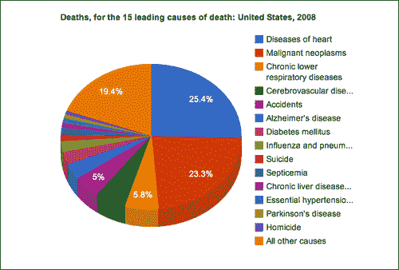
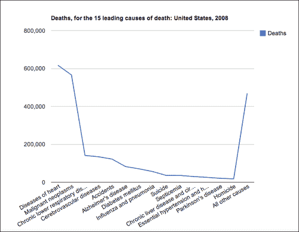
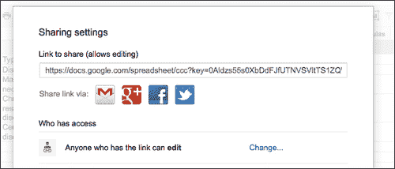
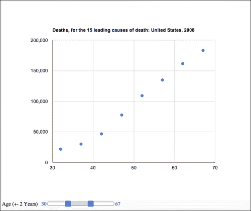

# 第八章。玩谷歌图表

在本章中，我们将介绍:

*   开始使用饼图
*   使用图表包装器创建图表
*   将数据源更改为谷歌电子表格
*   使用选项对象自定义图表属性
*   向图表添加仪表板

# 简介

在本章中，我们将逐个任务地探索谷歌可视化应用编程接口。我们将了解创建图表并将其与图表应用编程接口集成所涉及的步骤。

要使用谷歌应用编程接口，您必须遵守位于[https://google-developers.appspot.com/readme/terms](https://google-developers.appspot.com/readme/terms)的谷歌使用条款和政策。

# 从饼图开始

在第一个食谱中，我们将从谷歌图表开始，通过基于美国疾控中心死亡率(LCWK)的交互式数据集，涵盖使用谷歌图表时需要了解的基本步骤——2008 年美国按种族和性别分列的死亡人数、总死亡人数的百分比以及五岁年龄组 15 种主要死亡原因的死亡率。

## 做好准备

我们将从一个空的 HTML 文件和一个名为`08.01.getting-started.html`和`08.01.getting-started.js`的空 JavaScript 文件开始。

## 怎么做...

让我们从 HTML 文件开始列出完成任务所需的步骤:

1.  让我们从创建一个`head`开始，并将其链接到谷歌`jsapi`和我们的本地 JavaScript 文件:

    ```html
    <!DOCTYPE html>
    <html>
      <head>
        <title>Google Charts Getting Started</title>
        <meta charset="utf-8" />   
        <script src="https://www.google.com/jsapi"></script>
        <script src="./08.01.getting-started.js"></script>
      </head>
    ```

2.  Then create an empty `div` with `id chart`:

    ```html
      <body style="background:#fafafa">
        <div id="chart"></div>
      </body>
    </html>
    ```

    现在，是时候进入`08.01.getting-started.js`档了。

3.  让我们向谷歌请求可视化应用编程接口`jsapi`:T1
4.  我们想添加一个`callback`，当库准备好的时候会被触发:

    ```html
    google.setOnLoadCallback(init);
    ```

5.  Create an `init` function as follows:

    ```html
    function init(){
    ..

    }
    ```

    从现在开始，我们将分解`init`功能中添加的代码:

6.  创建一个新的谷歌数据对象，并提供如下代码片段所示的数据源:

    ```html
    data.addColumn('string', 'Type of Death');
    data.addColumn('number', 'Deaths');
    data.addRows([
            ['Diseases of heart', 616828],
            ['Malignant neoplasms', 565469],
            ['Chronic lower respiratory diseases', 141090], 
            ['Cerebrovascular diseases', 134148],
            ['Accidents', 121902],
            ['Alzheimer\'s disease', 82435],
            ['Diabetes mellitus', 70553],
            ['Influenza and pneumonia', 56284],
            ['Suicide', 36035],
            ['Septicemia', 35927],
            ['Chronic liver disease and cirrhosis', 29963],
            ['Essential hypertension and hypertensive renal disease', 25742],
            ['Parkinson\'s disease', 20483],
            ['Homicide', 17826],
            ['All other causes', 469062]

    ]);
    ```

7.  为图表创建一个`options`对象:

    ```html
    var options = {'title':'Deaths, for the 15 leading causes of death: United States, 2008',
                         'width':800,
                         'height':600};
    ```

8.  使用以下代码片段创建并绘制图表:

    ```html
    var chart = new google.visualization.PieChart(document.getElementById('chart'));
        chart.draw(data, options);
    ```

加载 HTML 文件。您会发现一个工作的交互式图表，如下图所示:


## 它是如何工作的...

让我们探索使用谷歌图表的步骤。使用谷歌应用编程接口时，我们建立的第一步是将谷歌应用编程接口链接添加到我们的 HTML 文件中:

```html
 <script src="https://www.google.com/jsapi"></script>
```

现在，谷歌应用编程接口已经加载到我们的应用程序中，我们可以请求我们希望使用的库。在我们的例子中，我们希望使用可视化应用编程接口和`corechart`包:

```html
google.load('visualization', '1.0', {'packages':['corechart']});
```

请注意，我们正在请求版本 1.0；这可能会令人困惑，但我们实际上是在要求生产图，1.0 总是当前的生产版本。因此，如果你想锁定一个构建，你需要发现它的代码版本并发送它，而不是 1.0 稳定构建。

示例中的`corechart`库定义了最基本的图表。对于不包括在内的图表，您需要传入所需的额外包，如表格图表:

```html
google.load('visualization', '1.0', {'packages':['corechart','table']});
```

这涵盖了如何加载应用编程接口的基础知识。但是在我们完成加载过程之前，我们需要一种回调的方法，这样我们就可以知道库何时可供我们操作:

```html
google.setOnLoadCallback(init);
```

我们要求谷歌应用编程接口让我们知道包什么时候加载，就像我们在文档中添加回调一样。当加载了 API 之后，我们就该开始与制图 API 交互了。

在每个谷歌图表中，您可能会想要探索三个组件:

*   创建数据源
*   向图表添加选项
*   创建图表

让我们探索所有这些选项。

所有的谷歌图表都需要一个数据源。数据源格式基于通过图表应用编程接口创建的内部对象:

```html
var data = new google.visualization.DataTable();
```

数据表是 2D 数组(或表)。它们像数据库一样有列和行。我们的下一步将是定义数据列:

```html
data.addColumn('string', 'Type of Death');
data.addColumn('number', 'Deaths');
```

在我们的例子中，当我们使用饼图时，只需要两行——一行命名我们的元素，另一行为它们提供一个值。`addColumn`方法只有一个强制参数来定义数据类型。数据类型可以是下列之一:

*   `string`
*   `number`
*   `boolean`
*   `date`
*   `datetime`
*   `timeofday`

第二个参数是数据类型的可选描述符，用于可视化，例如在我们的例子中`10 Deaths`。还有其他参数，但是只要我们提供有序列表中的元素，我们就不需要去探索它们。

最后但同样重要的是，我们将称之为`addRows`方法。我们可以调用`addRows`方法并发送一个一维数组(同样按照我们设置`addColumn`的数据顺序)。在我们的例子中，我们使用的是期望二维数组的`addRows`方法:

```html
data.addRows([
        ['Diseases of heart', 616828],
....
]);
```

这涵盖了我们的数据集。只要我们按照数据的顺序设置我们的列，并通过数组发送我们的信息，我们就已经设置好了，不需要深入挖掘数据应用编程接口。

`options`对象使我们能够创建和修改图表的元素。我们在应用程序中控制的元素是宽度、高度和标题。

在创建了数据源并为我们的数组设置了选项之后，就该开始简单的部分了。要创建图表，我们的第一步是选择我们的图表类型，并定义它将在哪里创建。然后我们用数据源和选项来呈现它:

```html
var chart = new google.visualization.PieChart(document.getElementById('chart'));
chart.draw(data, options);
```

## 还有更多...

让我们探索一下谷歌图表的更多技巧、诀窍和高级特性。使用选项`Objectto create 3D chartsTo`，我们可以将我们的图表变成 3D。我们可以非常快速简单地在 options 对象中添加一个新参数:

```html
var options = {'title':'Deaths, for the 15 leading causes of death: United States, 2008',
                     'width':800,
                     'height':600,
                     "is3D": true};
```

结果将是一个在三维空间倾斜的图表。



### 更改图表类型

更改图表类型并不复杂。只要图表类型共享相同数量的数据条目，更改通常是图表的实际构造函数对象的一个字。例如，我们可以通过更改可视化库中名为以下内容的方法来快速切换图表类型:

```html
var chart = new google.visualization.LineChart(document.getElementById('chart'));
    chart.draw(data, options);
```

这将把同样的数据只绘制成折线图(T0)对象。



# 使用图表包装器创建图表

有两种方法用谷歌图表创建图表。一个是我们在食谱中的做法*从饼状图*开始，第二个将在这个食谱中介绍。ChartWrapper 对象的目标是使您能够减少创建图表所需的代码量。

它的主要优点是代码更少，数据源更灵活。它的缺点是对图形创建步骤的控制较少。

## 做好准备

从上一个菜谱中抓取 HTML 文件(*开始使用饼图*)。我们将只修改外部 JavaScript 文件的文件路径，其余代码将保持不变。

## 怎么做...

将 HTML 文件源的路径更改为 JavaScript 文件后，是时候进入 JavaScript 文件并重新开始了:

1.  加载谷歌 API(不需要再提想加载什么了)并添加回调:

    ```html
    google.load('visualization', '1.0');
    google.setOnLoadCallback(init);
    ```

2.  创建`init`功能:

    ```html
    function init(){
    ...
    }
    ```

3.  用数据源

    ```html
    var dataTable = [
            ['Type of Death','Deaths'],
            ['Diseases of heart', 616828],
            ['Malignant neoplasms', 565469],
            ['Chronic lower respiratory diseases', 141090], 
            ['Cerebrovascular diseases', 134148],
            ['Accidents ', 121902],
            ['Alzheimer\'s disease ', 82435],
            ['Diabetes mellitus', 70553],
            ['Influenza and pneumonia', 56284],
            ['Suicide', 36035],
            ['Septicemia', 35927],
            ['Chronic liver disease and cirrhosis', 29963],
            ['Essential hypertension and hypertensive renal disease', 25742],
            ['Parkinson\'s disease', 20483],
            ['Homicide', 17826],
            ['All other causes', 469062]
          ];
    ```

    构建一个 2D 数组
4.  创建对象:

    ```html
    var options = {'title':'Deaths, for the 15 leading causes of death: United States, 2008',
                         'width':800,
                         'height':600,
                         "is3D": true};
    ```

5.  构建和渲染图表:

    ```html
    var chart = new google.visualization.ChartWrapper({
      chartType:'PieChart',
      dataTable:dataTable,
      options:options,
      containerId:'chart'

    });
    chart.draw();
    ```

您已经完成了此图表类型的创建。刷新屏幕，您将看到与上一个示例相同的图表，只是使用的代码更少。

## 它是如何工作的...

这个例子的好处是你不需要更多地了解它是如何工作的。`ChartWrapper`功能本身处理你在上一份食谱中必须处理的所有信息。话虽如此，但这并不意味着这种方式总是更好的方式——如果你需要对步骤进行更多的控制，最后一个例子会更好。

## 还有更多...

由于这个食谱非常简单，让我们添加一个额外的指针。

### 将图表更改为一行

在谷歌图表应用编程接口的视图类型之间切换真的很容易。你所需要做的就是转换类型。让我们把图表改成`BarChart`:

```html
var chart = new google.visualization.ChartWrapper({
  chartType:'BarChart',
  dataTable:dataTable,
  options:options,
  containerId:'chart'

});
```

刷新你的窗口，你会发现一个条形图。


# 将数据源更改为谷歌电子表格

使用谷歌应用编程接口的强大功能之一是产品线之间的深厚关系。在这个配方中，基于上一个配方，我们将创建一个谷歌电子表格，然后将其集成到我们的应用程序中。

## 做好准备

准备一份上一份食谱的源文件(*使用图表包装器*创建图表)。

## 怎么做...

创建新的谷歌文档的步骤很简单，但需要能够整合我们的工作；因此，我们将快速浏览它们。

1.  前往[http://drive.google.com/](http://drive.google.com/)(正式名称为谷歌文档)注册/登录。
2.  创建新的电子表格。
3.  Add data to the spreadsheet.

    

4.  Click on the **Share** button and set the view to public:

    

5.  基于文档标识创建应用编程接口网址:
    *   **Document link**:

        [https://docs . Google . com/spread sheet/CCC？key = 0 aldzs 55s 0 xbddfjfutnvsvts 1 zqwq 0 bnsx 2 xsbv](https://docs.google.com/spreadsheet/ccc?key=0Aldzs55s0XbDdFJfUTNVSVltTS1ZQWQ0bWNsX2xSbVE)键

    *   **API link**:

        [https://spread sheets . Google . com/TQ？key = 0 aldzs 55s 0 xbddfjfutnvsvts 1 zqwq 0 bnsx 2 xsbv](https://spreadsheets.google.com/tq?key=0Aldzs55s0XbDdFJfUTNVSVltTS1ZQWQ0bWNsX2xSbVE)键

6.  现在时间到了进入我们的 JavaScript 文件，删除当前的数据源并用 URL 提要替换它:

    ```html
    google.load('visualization', '1.0');

    google.setOnLoadCallback(init);

    function init(){
      var options = {'title':'Deaths, for the 15 leading causes of death: United States, 2008',
                         'width':800,
                         'height':600};
      var chart = new google.visualization.ChartWrapper({
        chartType:'BarChart',
     dataSourceUrl:"https://spreadsheets.google.com/tq?key=0Aldzs55s0XbDdFJfUTNVSVltTS1ZQWQ0bWNsX2xSbVE",
        options:options,
        containerId:'chart'

      });
      chart.draw();	
    }
    ```

太神奇了！看看我们需要多少代码来创建一个丰富且完全交互的图表:


## 它是如何工作的...

这真的是它最神奇的地方。你只是不需要了解它是如何工作的，你所需要做的就是创建你的图表，并使用前面部分提供的步骤，你可以将自己的任何电子表格转换成谷歌电子表格。

前面步骤中最重要的一步是第 4 步。请注意，通过谷歌文档(谷歌驱动)生成的网址与我们在代码中工作时需要点击的网址不同。这是因为第一个网址旨在呈现为可视页面，而第二个链接生成一个新的谷歌数据对象。别忘了每个页面都有自己唯一的 ID。

## 还有更多...

如果您有一点使用数据库的背景，您可以将简单的 SQL 查询发送到数据源中，并且只获取您想要查看的项目。假设在我们的示例中，我们希望以不同的顺序获取项目，排除列 B，并基于列 D(按年龄)进行排序:

```html
SELECT A,E,D,C ORDER BY D
```

我们的`Select`语句列出了我们想要选择的内容。`ORDER BY`的说法不言自明。让我们将其添加到代码中:

```html
var chart = new google.visualization.ChartWrapper({
  chartType:'BarChart',
  dataSourceUrl:"https://spreadsheets.google.com/tq?key=0Aldzs55s0XbDdFJfUTNVSVltTS1ZQWQ0bWNsX2xSbVE",
  query: 'SELECT A,E,D,C ORDER BY D',
  options:options,
  containerId:'chart'

});
```

当您刷新您的代码时，B 列将丢失，数据将基于 d 列进行组织。

最后但同样重要的是，将此添加到您的代码中:

```html
var chart = new google.visualization.ChartWrapper({
  chartType:'BarChart',
  dataSourceUrl:"https://spreadsheets.google.com/tq?key=0Aldzs55s0XbDdFJfUTNVSVltTS1ZQWQ0bWNsX2xSbVE",
  query: 'SELECT A,E,D,C ORDER BY D',
  refreshInterval: 1,
  options:options,
  containerId:'chart'

});
chart.draw();
```

现在回到公共图表，更改其中的数据。您将看到它会自动更新图表。

# 使用选项对象自定义图表属性

在这个食谱中，我们将使用谷歌图表应用编程接口(一个烛台图表)创建一个新的图表，我们将在其中加入各种配置。

## 做好准备

我们将从头开始，创建一个新的 JavaScript 和一个 HTML 文件。

## 怎么做...

大多数步骤看起来与本章中过去的食谱几乎相同。我们主要关注的是我们的`options` 参数:

1.  创建一个 HTML 文件，并将其链接到一个 JavaScript 文件(在我们的例子中为`08.04.candlestick.js` ):

    ```html
    <!DOCTYPE html>
    <html>
      <head>
        <title>Google Charts Getting Started</title>
        <meta charset="utf-8" />   
        <script src="https://www.google.com/jsapi"></script>
        <script src="./08.04.candlestick.js"></script>		
      </head>
      <body style="background:#fafafa">
        <div id="chart"></div>
      </body>
    </html>
    ```

2.  在`08.04.candlestick.js`文件中，添加 API `load`和`callback`函数:

    ```html
    google.load('visualization', '1', {packages: ['corechart']});
    google.setOnLoadCallback(init);

    function init(){
    ```

3.  在`init`功能中(从现在开始到本食谱结束，我们将保留在`init`功能中)，使用`google.visualization.arrayToDataTable`方法创建一个新的`DataTable`对象:

    ```html
      var data = google.visualization.arrayToDataTable([
        ['Mon', 10, 24, 18, 21],
        ['Tue', 31, 38, 55, 74],
        ['Wed', 50, 55, 20, 103],
        ['Thu', 77, 77, 77, 77],
        ['Fri', 68, 66, 22, 15]
      ], true);
    ```

4.  为图表创建一个`options`对象(配置对象):

    ```html
      var options = {
        legend:'none',
        backgroundColor:{fill:'#eeeeee',strokeWidth:2},
        bar:{groupWidth:17},
        candlestick:{hollowIsRising:true,
          fallingColor:{stroke:'red',fill:'#ffaaaa'},
          risingColor: {stroke:'blue',fill:'#aaaaff'}
        },
        enableInteractivity:false

      };
    ```

5.  使用以下代码片段绘制图表:

    ```html
      var chart = new google.visualization.CandlestickChart(document.getElementById('chart'));
      chart.draw(data, options);

    }
    ```

当您加载 HTML 文件时，您将发现一个定制的烛台图表，如下图所示:


## 它是如何工作的...

这是我们第一次使用这个方法。这个方法接收一个数组并返回一个数据表。当此方法的第二个参数设置为`true`时，它会将数组中的第一行视为数据的一部分；否则它将被视为报头数据。

有许多选项，要获得它们的完整列表，请查看谷歌图表文档。我们将重点关注那些我们挑选出来修改视图的项目。谷歌图表使您能够发送带有参数的对象。每种图表类型都有一组不同的选项。在我们的例子中，我们有许多选项可以控制图表的细节。大多数选项都与风格相关:

```html
backgroundColor:{fill:'#eeeeee',strokeWidth:2},
  bar:{groupWidth:17},
  candlestick:{hollowIsRising:true,
   fallingColor:{stroke:'red',fill:'#ffaaaa'},
  risingColor: {stroke:'blue',fill:'#aaaaff'}
  },
```

一些选项与功能直接相关，例如禁用图例:

```html
legend:'none',
```

或者禁用交互元素:

```html
enableInteractivity:false
```

## 还有更多...

突出显示这个元素的主要目标不是因为它很难，而是因为它很容易，并且它是您发现自己对图表进行更改的主要地方。需要注意的一点是，在使用谷歌图表之前，检查您是否可以使用谷歌图表做您需要的事情，这一点非常重要，因为与其他图表系统相反，您不能进入它们的源文件并更改它们，就像我们在[第 7 章](07.html "Chapter 7. Depending on the Open Source Sphere")、*中的食谱中所做的那样，这取决于开源领域*。

# 向图表添加仪表板

在本章的最后一个食谱中，我们将添加实时控制器，使用户能够更改数据过滤，以查看更多或更少的信息。

## 做好准备

我们将从头开始，所以没有什么可担心的。

## 怎么做...

以下是创建基本仪表板控制器所需的步骤:

1.  创建一个 HTML 文件，并将其链接到一个外部 JavaScript 文件(在我们的例子中，我们将使用文件`08.05.slider.js` ):

    ```html
    <!DOCTYPE html>
    <html>
      <head>
        <title>Google Charts DASHBOARD</title>
        <meta charset="utf-8" />   
        <script src="https://www.google.com/jsapi"></script>
        <script src="./08.05.slider.js"></script>		
      </head>
      <body style="background:#fafafa">
     <div id="chart"></div>
     <div id="dashboard"></div>
     <div id="filter"></div>
      </body>
    </html>
    ```

2.  现在，是时候进入`08.05.slider.js`并加载谷歌可视化应用编程接口了。这次我们将载入控制器包:

    ```html
    google.load('visualization', '1', {packages: ['controls']});
    ```

3.  现在，是时候添加回调了:

    ```html
    google.setOnLoadCallback(init);
    function init(){
    ```

4.  让我们创建我们的数据源。我们将根据疾控中心 2008 年的死亡率来计算:

    ```html
    var data = google.visualization.arrayToDataTable([
        ['Age (+- 2 Years)', 'Deaths'],
            [2, 4730],
            [7, 2502],
            [12, 3149], 
            [17, 12407],
            [22, 19791],
            [27,20786],
            [32,21489],
            [37,29864],
            [42,46506],
            [47,77417],
            [52, 109125],
            [57,134708],
            [62,161474],
            [67,183450],
            [72,218129],
            [77,287370],
            [82,366190],
            [87,372552],
            [92,251381],
             [100,20892],
        ]);
    ```

5.  然后创建一个新的仪表板:

    ```html
    var dashboard = new google.visualization.Dashboard(document.getElementById('dashboard'));
    ```

6.  让我们创建一个滑块并为其提供连接到数据源所需的信息:

    ```html
      var slider = new google.visualization.ControlWrapper({
        containerId: 'filter',
        controlType: 'NumberRangeFilter',
        options: {
        filterColumnLabel: 'Age (+- 2 Years)'
      }
    });
    ```

7.  创建图表:

    ```html
    var chart = new google.visualization.ChartWrapper({
      chartType: 'ScatterChart',
      containerId: 'chart',
      options: {
        legend: 'left',
        title:'Deaths, for the 15 leading causes of death: United States, 2008',
        width: 800,
        height: 600

      }
    });
    ```

8.  最后但并非最不重要的是，是时候绑定并绘制我们的控制器了:

    ```html
    dashboard.bind(slider, chart).draw(data);			
    }
    ```

加载该 HTML 文件，您将发现一个带有控制器的散点图，该控制器使您能够选择您想要深入挖掘的年龄范围。



## 它是如何工作的...

这可能是使用谷歌制图应用编程接口最顺利的部分之一。因此，让我们分解并找出为您的图表创建控制器所涉及的步骤。我们将展示一个控制器，但相同的逻辑流程将适用于所有组件。

首先，在我们的 HTML 文件中，我们需要有一个`div`层，该层有一个与我们的仪表板相关联的标识和一个用于每个后续控制器的`div`。为了添加控制器，我们将它们分配给仪表板。我们从创建仪表板开始:

```html
var dashboard = new google.visualization.Dashboard(document.getElementById('dashboard'));
```

这个仪表板现在将成为我们连接所有控制器(在我们的例子中，一个控制器)的中枢。然后，我们将创建下一个控制器；在我们的例子中，我们希望使用滑块:

```html
var slider = new google.visualization.ControlWrapper({
  containerId: 'filter',
  controlType: 'NumberRangeFilter',
  options: {
    filterColumnLabel: 'Age (+- 2 Years)'
  }
});
```

请注意，我们正在添加一个控件类型来获取我们的范围滑块，并且我们通过给它列标识(第一行中的标签)将其链接到一个列。

我们继续并以与之前相同的方式创建图表。在这种情况下，我们选择了散点图。这里的顺序并不重要，但剩下的最重要的部分是我们的控制器和图表之间的链接。我们通过使用`dashboard.bind`方法做到这一点:

```html
dashboard.bind(slider, chart);	
```

然后，当创建`bind`函数时，当仪表板返回时，我们绘制元素:

```html
dashboard.bind(slider, chart).draw(data);
```

如果我们愿意，我们可以将它分成单独的行，如下所示:

```html
dashboard.bind(slider, chart);
dashboard.draw(data);
```

给你。现在您知道如何使用仪表板了。这些步骤很关键，但是现在您可以添加任何控制器。该产品的其余文档不言自明。