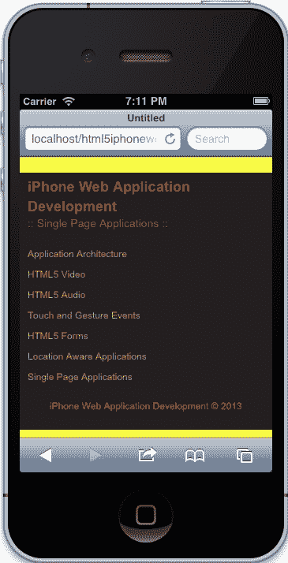

# 第 1 章应用架构

在本章中，我们将为 iPhone 应用创建一个标准体系结构。我们将以 HTML5 移动模板为基础，并根据本书中几个项目的需要对其进行定制。从用 HTML5 标记内容到创建 JavaScript 框架，我们将创建静态页面，帮助我们关注 iPhone Web 应用开发的基础。

在本章中，我们将介绍：

*   实现 HTML5 移动模板
*   创建初步架构
*   定制我们的框架
*   创建语义标记
*   构建我们的样式表
*   响应性设计原则
*   建立我们的 JavaScript 架构
*   路由到移动站点
*   主屏幕图标
*   介绍我们的构建脚本
*   部署我们的项目

# 实现 HTML5 移动模板

当你开始开发时，从一个基本的框架开始总是至关重要的，这个框架可以根据你的项目的需要进行塑造。在许多情况下，我们在自己工作的地方开发这些框架，或者为自己的个人项目开发这些框架。然而，开源社区为我们提供了一个伟大的框架，我们可以在我们的项目中使用 HTML5 移动模板。该框架基于著名的 HTML5 样板，并针对移动设备进行了优化，包括一个精简的 HTML 模板；`Zepto`的使用，以及针对移动设备优化的工具和助手的使用。

## 下载并安装 HTML5 移动模板

我们需要采取的第一步是下载 HTML5 移动模板，该模板位于以下位置：

T0http://html5boilerplate.com/mobile/ T1

下载样板文件后，您将从解压缩的归档文件中看到以下结构：


初步目录结构

下一步是获取这些文件并将它们放置在您选择的目录中。例如，我已将文件放在 Mac 上的以下目录中：

`/Users/alvincrespo/Sites/html5iphonewebapp`

接下来，我们希望使用一个构建系统来帮助我们创建多个环境，简化部署过程，并在我们希望优化站点以进行测试和/或生产时使事情变得更简单。

根据 HTML5 移动模板的文档，有两种不同类型的构建系统，例如节点构建脚本和 Ant 构建脚本。在本书中，我们将使用 Ant 构建脚本。我建议使用 Ant 构建脚本，因为它已经存在了一段时间，并且具有我在项目中使用的适当功能，包括CSS 拆分，这将有助于拆分样板文件附带的主 CSS 文件。

## 集成构建脚本

要下载 Ant 构建脚本，请转到以下链接：

[https://github.com/h5bp/ant-build-script](https://github.com/h5bp/ant-build-script)

然后，点击**下载为 zip**按钮下载 zip 文件。下载 Ant Build脚本后，将文件夹及其内容复制到项目中。

一旦 Ant 构建脚本目录完全转移到项目中，将包含构建脚本的目录重命名为`build`。此时，您应该为本书中的其余应用完全设置您的项目。我们将在本章后面介绍如何利用构建脚本。

# 创建我们的应用框架

对于每个项目，创建一个能够适应项目需要的框架是很重要的。考虑项目的方方面面是至关重要的。从所需的文件到团队的长处和弱点，重要的是我们建立一个坚实的基础，帮助我们建立和调整。

## 修改样板文件

我们现在将修改样板文件，以满足我们将要构建的项目的需要。为简单起见，我们将从文件夹中删除以下项目：

*   `CHANGELOG.md`
*   `crossdomain.xml`
*   `README.md`
*   `/doc (Directory)`

现在目录已经清理完毕，现在是时候看看一些样板代码，并根据本书中项目的需要对其进行定制。

## 定制我们的标记

首先，在您喜爱的文本编辑器中打开应用。在我们选择的编辑器中打开应用后，让我们看看`index.html`。

为了专注于 iPhone Web 应用的开发，需要清理索引文件，同时还需要删除未使用的项目，如 Google Analytics。因此，让我们删除一些我们不需要的代码。

查找以下代码：

```html
<!DOCTYPE html>
<!--[if IEMobile 7 ]>    <html class="no-js iem7"> <![endif]-->
<!--[if (gt IEMobile 7)|!(IEMobile)]><!--> <html class="no-js"> <!--<![endif]-->
```

### 提示

**下载示例代码**

您可以下载您在[账户购买的所有 Packt 书籍的示例代码文件 http://www.packtpub.com](http://www.packtpub.com) 。如果您在其他地方购买了本书，您可以访问[http://www.packtpub.com/support](http://www.packtpub.com/support) 并注册，将文件直接通过电子邮件发送给您。

并将其修改为：

```html
<!DOCTYPE html>
<html class="no-js">
```

我们在这里做的是删除 IE Mobile 的检测。尽管这可能对其他项目有所帮助，但对我们来说，这并不能真正帮助我们为 iPhone 创建完全兼容的应用。但是，我们还需要删除一个`IEMobile`特定的元标记：

```html
<meta http-equiv="cleartype" content="on">
```

前面的 meta 标记为 IE mobile 打开`cleartype`（一个帮助呈现字体的实用程序）。这对我们来说不是必需的，也不是我们的应用的要求。

现在我们已经从页面中删除了一些不必要的标记，我们可以继续并开始启用将增强应用的功能。查找以下元标记并通过删除它们周围的注释来启用它们：

```html
<meta name="apple-mobile-web-app-capable" content="yes">
<meta name="apple-mobile-web-app-status-bar-style" content="black">
```

这些指令通知我们的应用它可以全屏运行，并将状态栏设置为黑色。

我们也可以从文档的`<head>`中删除以下代码：

```html
<!-- This script prevents links from opening in Mobile Safari. https://gist.github.com/1042026 -->
<!--
        <script>(function(a,b,c){if(c in b&&b[c]){var d,e=a.location,f=/^(a|html)$/i;a.addEventListener("click",function(a){d=a.target;while(!f.test(d.nodeName))d=d.parentNode;"href"in d&&(d.href.indexOf("http")||~d.href.indexOf(e.host))&&(a.preventDefault(),e.href=d.href)},!1)}})(document,window.navigator,"standalone")</script>
-->
```

一旦我们删除了之前的脚本，您的标记现在应该如下所示：

```html
<!DOCTYPE html>
<head>
    <meta charset="utf-8">
    <title></title>
    <meta name="description" content="">
    <meta name="HandheldFriendly" content="True">
    <meta name="MobileOptimized" content="320">
    <meta name="viewport" content="width=device-width">
    <link rel="apple-touch-icon-precomposed" sizes="144x144" href="img/touch/apple-touch-icon-144x144-precomposed.png">
    <link rel="apple-touch-icon-precomposed" sizes="114x114" href="img/touch/apple-touch-icon-114x114-precomposed.png">
    <link rel="apple-touch-icon-precomposed" sizes="72x72" href="img/touch/apple-touch-icon-72x72-precomposed.png">
    <link rel="apple-touch-icon-precomposed" href="img/touch/apple-touch-icon-57x57-precomposed.png">
    <link rel="shortcut icon" href="img/touch/apple-touch-icon.png">
    <meta name="apple-mobile-web-app-capable" content="yes">
    <meta name="apple-mobile-web-app-status-bar-style" content="black">
    <link rel="stylesheet" href="css/normalize.css">
    <link rel="stylesheet" href="css/main.css">
    <script src="js/vendor/modernizr-2.6.1.min.js"></script>
</head>
```

现在，我们可以专注于清理我们的身体。幸运的是，我们只需要删除 Google Analytics 中的一项内容，因为我们将不再关注 iPhone 网络应用的跟踪。

要执行此操作，请找到以下代码并将其删除：

```html
<!-- Google Analytics: change UA-XXXXX-X to be your site's ID. -->
<script>
    var _gaq=[["_setAccount","UA-XXXXX-X"],["_trackPageview"]];
    (function(d,t){var g=d.createElement(t),s=d.getElementsByTagName(t)[0];g.async=1;
    g.src=("https:"==location.protocol?"//ssl":"//www")+".google-analytics.com/ga.js";
    s.parentNode.insertBefore(g,s)}(document,"script"));
</script>
```

您在页面上应该拥有的唯一脚本应该是：

```html
<script src="js/vendor/zepto.min.js"></script>
<script src="js/helper.js"></script>
```

完成前面的步骤后，我们的标记应该干净、简单，如下所示：

```html
<!DOCTYPE html>
<html class="no-js">
<head>
    <meta charset="utf-8">
    <title></title>
    <meta name="description" content="">
    <meta name="HandheldFriendly" content="True">
    <meta name="MobileOptimized" content="320">
    <meta name="viewport" content="width=device-width">

    <link rel="apple-touch-icon-precomposed" sizes="144x144" href="img/touch/apple-touch-icon-144x144-precomposed.png">
    <link rel="apple-touch-icon-precomposed" sizes="114x114" href="img/touch/apple-touch-icon-114x114-precomposed.png">
    <link rel="apple-touch-icon-precomposed" sizes="72x72" href="img/touch/apple-touch-icon-72x72-precomposed.png">
    <link rel="apple-touch-icon-precomposed" href="img/touch/apple-touch-icon-57x57-precomposed.png">
    <link rel="shortcut icon" href="img/touch/apple-touch-icon.png">

    <meta name="apple-mobile-web-app-capable" content="yes">
    <meta name="apple-mobile-web-app-status-bar-style" content="black">

    <link rel="stylesheet" href="css/normalize.css">
    <link rel="stylesheet" href="css/main.css">
    <script src="js/vendor/modernizr-2.6.1.min.js"></script>
</head>
    <body>

        <!-- Add your site or application content here -->

        <script src="js/vendor/zepto.min.js"></script>
        <script src="js/helper.js"></script>
    </body>
</html>
```

从这里开始，我们应该检查每个项目的样式表和脚本，并在开始项目之前尽可能地优化它。然而，我们将使用的这个样板已经被社区优化，并在许多开发人员的支持下不断增强，对于我们在这里的使用，样式和脚本都很好。如果您感到好奇，我鼓励您查看`normalize.css`文件，其中包含用于重置页面的优秀指令。查看`main.css`文件也是有益的，该文件已通过此样板文件进行了增强，以支持移动设备。

现在，我们将继续建立我们的框架。

# 定制我们的框架

对于开发人员来说，为他们正在进行的每个项目建立一个框架是至关重要的，无论项目有多小或多大。当然，您的框架也应该根据项目的需求进行调整。在本节中，我们将建立一个简单的框架，我们可以在本书的整个使用过程中使用它。

我们已经根据自己的需要浏览并清理了样板文件，现在我们将浏览并扩展样板文件，以包括对我们将构建的应用至关重要的文件。

第一个应用将基于 HTML5 视频规范（[http://dev.w3.org/html5/spec-author-view/video.html](http://dev.w3.org/html5/spec-author-view/video.html) 。在该应用中，我们将为视频播放器创建一个特定的功能，包括播放、暂停和全屏功能。因此，让我们创建一个特定于此应用的目录；我们将此目录称为`video`。

在这个目录中，我们将创建一个`index.html`文件，并从`index.html`文件的主页复制内容。

现在我们已经创建了视频部分，让我们在`css`目录中创建`video.css`文件。

然后，在我们的`/js`文件夹中创建一个`App`目录。在`/js/App`目录中，我们创建一个`App.js`文件。稍后，我们将详细解释这个文件是什么，但现在它将是我们的主要应用名称空间，它将本质上封装我们应用的全局功能。

最后，让我们创建一个`App.Video.js`文件，该文件将包含`/js/App`目录中的视频应用功能。

现在，您将为我们的每个应用重复前面的步骤；包括视频、音频、触摸、表单、位置、单页和脱机。最后，目录结构应具有以下新目录和文件：

```html
/audio
    index.html
/css
    audio.css
    forms.css
    location.css
    main.css
    normalize.css
    singlepage.css
    touch.css
    video.css
/forms
    index.html
/js
    /App/App.Audio.js
    /App/App.Forms.js
    /App/App.js
    /App/App.Location.js
    /App/App.SinglePage.js
    /App/App.Touch.js
    /App/App.Video.js
/location
    index.html
/offline
    index.html
/singlepage
    index.html
/touch
    index.html
/video
    .index.html
```

此时，我们应该修复对依赖项的引用，例如 JavaScript 和样式表。所以，让我们打开`/video/index.html`。

让我们修改以下行：

```html
<link rel="stylesheet" href="css/normalize.css">
<link rel="stylesheet" href="css/main.css">
<script src="js/vendor/modernizr-2.6.1.min.js"></script>
```

将以前的标记更改为以下内容：

```html
<link rel="stylesheet" href="../css/normalize.css">
<link rel="stylesheet" href="../css/main.css">
<script src="../js/vendor/modernizr-2.6.1.min.js"></script>
```

### 提示

请注意，我们将`../`添加到每个依赖项中。这本质上是告诉页面上一级并检索适当的文件。我们还需要对 apple touch 图标预合成的链接、快捷方式图标和页面底部的脚本执行此操作。

我们的框架现在几乎完成了，只是它们还没有连接。现在我们已经把所有的东西都组织好了，让我们开始把所有的东西连接起来。它看起来并不漂亮，但至少它会工作，并朝着一个功能齐全的应用发展。

让我们从主`index.html`文件`/ourapp/index.html`开始。打开主`index.html`文件后，让我们在`<body>`元素中创建一个基本的站点结构。我们将给它一个`"site-wrapper"`类，并将其放在注释`Add your site or application content here`的正下方：

```html
<body>
    <!-- Add your site or application content here -->
    <div class="site-wrapper">

    </div>
    <script src="js/vendor/zepto.min.js"></script>
    <script src="js/helper.js"></script>
</body>
```

在包含我们网站的包装中，让我们使用新的 HTML5`<nav>`元素从语义上描述将存在于我们所有应用中的主导航栏：

```html
<div class="site-wrapper">
<nav>      
</nav>
</div>
```

还没有什么特别之处，但现在我们将继续使用无序列表元素并创建一个没有样式的导航栏：

```html
<nav>
    <ul>
        <li>
            <a href="./index.html">Application Architecture</a>
        </li>
        <li>
            <a href="./video/index.html">HTML5 Video</a>
        </li>
        <li>
            <a href="./audio/index.html">HTML5 Audio</a>
        </li>
        <li>
            <a href="./touch/index.html">Touch and Gesture Events</a>
        </li>
        <li>
            <a href="./forms/index.html">HTML5 Forms</a>
        </li>
        <li>
            <a href="./location/index.html">Location Aware Applications</a>
        </li>
        <li>
            <a href="./singlepage/index.html">Single Page Applications</a>
        </li>
    </ul>
</nav>
```

如果我们复制在`/video/index.html`中创建的代码并测试页面，您会发现它无法正常工作。对于所有子目录，如视频和音频，我们需要将相对路径从`./`更改为`../`，这样我们就可以进入一个文件夹。考虑到这一点，`nav`元素在其他应用中看起来如下所示：

```html
<nav>
    <ul>
        <li>
            <a href="../index.html">Application Architecture</a>
        </li>
        <li>
            <a href="../video/index.html">HTML5 Video</a>
        </li>
        <li>
            <a href="../audio/index.html">HTML5 Audio</a>
        </li>
        <li>
            <a href="../touch/index.html">Touch and Gesture Events</a>
        </li>
        <li>
            <a href="../forms/index.html">HTML5 Forms</a>
        </li>
        <li>
            <a href="../location/index.html">Location Aware Applications</a>
        </li>
        <li>
            <a href="../singlepage/index.html">Single Page Applications</a>
        </li>
    </ul>
</nav>
```

现在，我们可以将导航从`/video/index.html`复制到其余的应用文件或之前创建的`index.html`文件。一旦完成，我们将有一个单独的站点，现在可以很好地相互连接。

信不信由你，我们这里有一个非常简单的网站。我们的页面设置为基本标记和常规样式。在这一点上，我们需要一个导航，使我们的网页在一起。然而，我们几乎没有涉及到一些重要的方面，包括应用的语义标记，我们将在下面讨论。

# 创建语义标记

语义标记之所以重要，有几个原因，包括搜索引擎优化、创建可维护的体系结构、使代码易于理解，以及满足可访问性要求。但是，您应该熟悉如何使用与内容相关的标记构建页面。HTML5 规范中有助于简化此过程的新元素，包括`<header>`、`<nav>`、`<footer>`、`<section>`、`<article>`和`<aside>`元素。这些元素中的每一个都有助于描述页面的各个方面，并轻松识别应用的组件。在本节中，让我们从视频应用开始构建应用。

## 创建表头

首先，让我们先给我们的主索引页一个标题和一个描述我们所在页面的标题。让我们在`/index.html`打开应用中的主`index.html`文件。

找到`<title>`标签，在`iPhone Web Application Development – Home`中输入。请注意，我们在这里使用连字符。这一点很重要，因为它使用户更容易扫描页面内容，并有助于对特定关键字进行排名。

您现在应该在文档的`<head>`标签中有以下`<title>`：

`<title>iPhone Web Application Development - Home</title>`

现在，我们希望页面内容也能反映标题，并提醒用户他们在我们网站上的进展。我们要做的是创建一个标题来描述他们所在的部分。为了实现这一点，让我们在前面创建的导航之前放置以下代码。然后，您的代码应该如下所示：

```html
<hgroup>
    <h1>iPhone Web Application Development</h1>
    <h2>Home</h2>
</hgroup>
<nav>...</nav>
```

`<hgroup>`元素用于对一个区段的多个标头进行分组。报头的排名基于`<h1>`到`<h6>,`，其中`<h1>`为最高排名，`<h6>`为最低排名。因此，突出显示的文本将我们的`<h1>`内容置于高于`<h2>`的位置。

还要注意，我们还没有使用`<section>`元素。但是，此页面确实使用W3C 标记验证服务（[进行验证 http://validator.w3.org/](http://validator.w3.org/) ）。

我们可以通过将`<hgroup>`和`<nav>`元素包装在`<header>`元素中来进一步描述页面，为页面提供介绍性帮助。完成此操作后，应具有以下代码：

```html
<header>
    <hgroup>... </hgroup>
    <nav>... </nav>
</header>
```

在前面的代码中，我们最终给出了页面的一些结构。我们用站点的主标题和页面的子标题来描述我们的页面。我们还为页面提供了导航菜单，允许用户在应用之间导航。

## 创建页脚

现在，让我们添加一个`<footer>`，其中包含本书的名称及其版权日期：

```html
<footer>
    <p>iPhone Web Application Development &copy; 2013</p>
</footer>
```

前面的代码将基本上与最近的剖切祖先相关。因此，页脚将与之前的内容相关，稍后我们将进行填充。此时，您的内容应如下所示：

```html
<div class="site-wrapper">
    <header>
        <hgroup>...</hgroup>
        <nav>...</nav>
    </header>
    <footer>...</footer>
</div>
```

## 清理工段

您可能想知道为什么我们不立即将`<section>`元素用于包含`<header>`和`<footer>`元素的`<div>`元素。在这种情况下，它不一定有用，因为我们没有创建一个页面，其中元素的内容将列在大纲中。这是 W3C 的建议，每个开发人员在决定使用哪种元素时都应该注意这一点，`<div>`或`<section>`。最后，它归结为内容本身和团队希望创建的大纲。

现在我们已经有了页面的基本结构，我们可以继续对其余的应用执行同样的操作。这将在本书提供的代码中为您完成，以防您希望查看最终版本。

考虑到这一点，我们将继续我们的应用开发，确保在有意义的时候和地点使用语义代码。

# 构建我们的样式表

样式在我们构建的任何应用中都非常重要，特别是因为它是用户体验的任何应用的第一个方面。在本节中，我们将开始适当地构建我们的风格。

## 全球造型

首先，让我们打开位于`CSS`目录中的`main.css`文件。打开此文件时，将看到默认样板样式。现在，让我们跳过这些来创建我们自己的样式。我们将在继续开发应用时回顾这些样式。

在`main.css`中找到以下行：

```html
/* ==========================================================================
   Author's custom styles
========================================================================== */
```

在这个注释之后，我们希望为我们之前编写的语义代码包含全局样式。

首先定义全局站点样式，例如背景色：

```html
html{
    background: #231F20;
    border-top: 10px solid #FDFF3A;
    border-bottom: 5px solid #FDFF3A;
    width: 100%;
}
```

在前面的样式中，我们正在进行一些风格选择，例如设置背景色和一些边框。这里重要的一点是，HTML 元素的宽度定义为 100%。这将基本上允许我们将所有内容的宽度扩展到手机的 100%。

## 定义我们的全球字体

然后我们必须在页面上定义整体字体。这将是目前的基本设计，并可根据我们的应用继续扩展为设计，但目前来看以下样式：

```html
h1, h2, p, a {
    font-family: Arial, Helvetica, sans-serif;
    text-decoration: none;
}

h1, h2 {
    color: #A12E33;
    font-weight: bold;
    margin: 0;
    padding: 0;
}

h1 {
    font-size: 18px;
}

h2 {
    font-size: 14px;
    font-weight: normal;
}

p {
    color: #F15E00;
    font-size: 12px;
}

a,
a:visited {
    color: #F19C28;
}
```

在前面的代码中，您可以看到我们从更高的层次开始工作，这是对级联样式表的基本理解。我们首先使用特定的字体系列定义标题、锚定和段落，并且没有任何装饰。

在我们研究之前的样式时，我们开始更具体地定义每个样式，标题没有填充或边距，并且有特定的颜色。然后，当我们进一步往下看时，我们可以看到每种类型的标题都有特定的字体大小，我们对段落和锚定也会这样做。

## 我们的页面布局

一旦我们定义了一些字体和网站样式，我们将为包含我们内容的`<div>`元素包含一些基本布局信息：

```html
.site-wrapper {
    padding: 5px 10px 10px;
}
```

由于我们的元素自动缩放到屏幕宽度的 100%，我们告诉内容在顶部有`5px`，在左侧和右侧有`10px`，在底部有`10px`的填充。或者，我们可以编写以下样式：

```html
    padding-top: 5px;
    padding-left: 10px;
    padding-right: 10px;
    padding-bottom: 10px;
```

前者被称为速记属性设置，被认为是最佳实践。

## 使用内容为：前和：后

由于我们还希望确保第二个标头以某种形式区分，因此我们可以使用 CSS3 伪类选择器和属性来定义前后内容，如下所示：

```html
hgroup h2:before,
hgroup h2:after {
    content: " :: ";
}
```

### 注

请记住，Safari 3.2 及更高版本支持`:before`和`:after`伪选择器。

前面的选择器以`<hgroup>`元素中的`<h2>`元素为目标，并根据`:before`和`:after`伪类选择器在其前后添加我们在属性中定义的内容。

## 设计我们的导航

接下来，让我们设计导航的样式，使其看起来和感觉更有用。

```html
nav ul {
    padding: 0;
}

nav li {
    list-style: none;
}

nav a {
    display: block;
    font-size: 12px;
    padding: 5px 0;
}
```

在这里，我们删除`<ul>`元素的填充，然后从每个列表元素中删除默认样式选项。最后，我们通过将字体大小设置为`12px`和在每个锚的顶部和底部添加填充，确保每个锚都能正确显示，以便在 iPhone 上轻松选择。

最后，我们将为页脚添加一些样式。

```html
footer p {
    text-align: center;
}
```

非常简单，我们将页脚内的段落对齐到中心。因为我们已经在字体部分定义了段落的默认样式，所以样式被选中。

正确应用以前的样式后，结果应类似于以下显示：



# 响应性设计原则

响应性设计是我们移动应用的关键。鉴于许多移动体验现在已经超过了桌面上的体验，我们必须创建适合我们不断发展的技术环境的应用。幸运的是，HTML5 移动模板附带了我们可以修改的初步样式。

## 媒体对救援的质疑

首先，让我们打开`css`目录中的`main.css`文件。

接下来，向下滚动到文件底部，您将看到以下样式：

```html
/* ==========================================================================
   EXAMPLE Media Queries for Responsive Design.
   Theses examples override the primary ('mobile first') styles.
   Modify as content requires.
========================================================================== */

@media only screen and (min-width: 800px) {
}

@media only screen and (-webkit-min-device-pixel-ratio: 1.5),
       only screen and (min-resolution: 144dpi) {}
```

虽然这种风格让我们起步，但对于 iPhone 的开发，我们需要更多的定制。第一个媒体查询专门针对平板电脑设备，第二个媒体查询通过定位分辨率更高的设备（如 iPhone 4）来帮助我们。

我们想做的是让这更简单一点。由于我们只针对 iPhone，因此我们可以用以下代码替换以前的代码：

```html
/* iPhone 4 and 5 Styles*/
@media only screen and (-webkit-min-device-pixel-ratio: 2) { }
```

前面的代码将针对 iPhone4 和 iPhone5。我们通过检查设备上的`–webkit-min-device-pixel-ratio`属性专门针对这两个设备，如果它是真的，则意味着我们可以提供高清晰度图形。

我们要检查的另一个方面是我们设置的`index.html`页面中的视口设置。幸运的是，我们早些时候清理了它，它应该具有以下内容：

```html
<meta name="viewport" content="width=device-width">
```

前面的代码片段基本上会根据设备的宽度调整内容的大小。

在这一点上，我们应该准备好以后在应用中实现响应式样式。现在，我们已经为应用设置了样式，并且已经具备了足够的通用性，可以进行扩展，让我们开始在脚本后面添加框架。

## 响应图像

图像是任何应用中极其重要的一部分。它有助于展示产品的功能，并举例说明您希望用户理解的信息。然而，当今数量不一的设备要求内容正确响应。除此之外，我们还需要能够提供适合体验的内容，这意味着我们需要定制更高分辨率的设备，以便最高质量的内容能够到达观众。

有多种技术可以提供适当的内容。但是，您选择的一个取决于项目的需求。在本部分中，我们将回顾传统的响应式 web 设计原则，即根据图像的内容和/或容器调整图像大小。

### 流体图像

在这种技术中，开发人员将所有图像设置为 100%的最大宽度。然后我们定义图像的容器以进行相应的调整。

#### 流体宽度图像

为了获得全幅图像，我们可以执行以下操作：

```html
<body>

</body>
```

标记非常简单，我们基本上将一个图像包装成一个元素，扩展我们所需的全部宽度。在这种情况下，主体将延伸 100%的宽度。

接下来，我们将定义图像的样式，如下所示：

```html
img {
    max-width: 100%;
}
```

通过这个简单的 CSS 声明，我们告诉我们的图像将其最大宽度设置为包含内容的 100%。这将随着设备宽度的变化自动调整图像的大小，如果我们想让站点响应用户的设备，这是必不可少的。

#### 全幅图像

在这种情况下，我们希望图像保持其全宽，但我们也需要相应地将其切断。

为了实现这一点，我们可以从简单地创建一个带有`class`的`div`开始，在这种情况下，我们添加了一个`overflow`类：

```html
<div class="overflow"></div>
```

然后，我们可以创建样式，使图像保持全宽，并根据内容的大小进行剪切：

```html
overflow {
    background: transparent url('img/somgimg.jpg') no-repeat 50% 0;
    height: 500px;
    width: 100%;
}
```

这有点复杂，但本质上我们使用`background`属性附加图像。这里的关键是确保我们使用 50%将其居中。height 属性只是显示图像，而 width 告诉容器与其内容 100%相关。

这是我们在实现传统响应式设计时使用的两种技术。我们将在稍后创建视频和图像库时实现这些技术。

# 建立我们的 JavaScript 架构

在为应用建立 JavaScript 体系结构时，需要考虑很多问题，包括近期或短期内可能发生的变化、安全性、易用性和实现性、文档等。一旦我们能够回答我们的各种问题，我们就可以决定模式（模块、门面和/或中介，等等）。我们还需要知道哪些库或框架最适合我们，例如`jQuery`、`Zepto.js`、`Backbone.js`或`Angular.js`。

幸运的是，为了在 iPhone 上提供有效的应用，我们将保持简单明了。我们将利用`Zepto.js`作为我们的支持库来保持它的轻量级。然后，我们将通过创建遵循模块化模式的自定义 JavaScript 框架来构建 Zepto。

## 构建我们的应用功能

首先，让我们在首选文本编辑器中打开应用目录。

接下来，打开我们前面在 JavaScript 目录中创建的`App.js`文件。`App.js`文件应该是完全空的，不应该包含在任何地方。这就是我们将开始编写框架的地方。

### 为我们的应用命名

如果您是 JavaScript 新手，那么您很可能已经在全局范围内创建了大部分代码，可能将大部分 JavaScript 放在了脚本标记中。虽然这可能会实现您的一些目标，但在处理大规模应用时，我们希望避免这种做法。我们希望为应用命名名称空间的一些原因是为了可维护性、效率和可移植性。

让我们首先检查`App`名称空间；如果它存在，我们将使用那里的东西，如果它不存在，那么我们将创建一个空对象。以下代码显示了如何实现这一点：

```html
var App = window.App || {};
```

### 立即调用函数表达式

伟大的我们正在检查`App`名称空间，现在让我们定义它。让我们在检查后包含以下代码：

```html
App = (function(){}());
```

前面的代码做了几件事，让我们一步一步来做。首先，我们将`App`名称空间设置为**立即调用的函数表达式**（**IIFE**）。我们本质上是在创建一个用括号括起来的函数，并在右括号结束后立即调用它。

当我们使用以前的技术或 IIFE 时，我们会创建一个新的执行上下文或范围。这有助于创建自我包含的代码，希望不会影响站点上的其他代码。它保护我们并帮助我们有效地遵循模块化模式。

让我们通过传入窗口、文档和 Zepto 对象来扩展前面的功能，如下所示：

```html
App = (function(window, document, $){
}(window, document, Zepto));
```

我知道这可能有点混乱，但让我们花一秒钟想想我们在这里做什么。首先，我们在名为`window`、`document`和`$`的函数中设置一些参数。然后，当我们调用此方法时，我们将传入`window`、`document`和`Zepto`。记住，我们之前讨论过，这会创建一个新的范围或执行上下文吗？这对我们很有用，因为我们现在可以传递对任何可能是全局对象的引用。

这对我们有什么用处？好吧，想象一下，如果你想反复使用实际的`Zepto`对象，那会有点累。键入`Zepto`并不困难，但您可以将其命名为美元符号并保持简单。

### 严格使用

好的，我们已经完成了模块设置。现在让我们继续扩展它，包括`use strict`指令：

```html
App = (function(window, document, $){
    'use strict';
}(window, document, Zepto));
```

该指令通过更改 JavaScript 的运行方式来帮助我们调试应用，允许抛出某些错误，而不是无声地失败。

### 默认选项

默认选项是给代码库一些扩展性的好方法。例如，如果我们想要自定义或缓存与应用本身相关的元素，那么我们将使用以下默认值：

```html
var _defaults = {
'element': document.body,
    'name': 'App',
    'videoOptions': {},
    'audioOptions': {},
    'touchOptions': {},
    'formOptions': {},
    'locationOptions': {},
    'singlePageOptions': {}
};
```

让我们简单地看一下这些默认值。首先，我们将创建一个`defaults`变量，该变量将包含应用的所有默认值。在它里面，我们已经定义了一个默认位置供我们的应用引用，`'element'`默认设置为`document.body`——它获取我们在**DOM**（**文档对象模型**中的 body 元素。然后我们为我们的应用创建一个名为`'App'`的自定义名称。在此之后，我们为视频、音频、触摸、表单、位置和稍后构建的单页应用创建空对象。当我们继续阅读本书时，这些空对象将被扩展。

### 定义构造函数

现在我们需要在`use strict`指令之后定义构造函数。此构造函数将接受一个名为`options`的参数。然后，我们将使用参数`options`扩展默认设置，并存储这些设置，如果需要，可以在以后检索这些设置。然后，我们将最终将`'element'`选项缓存为`Zepto`对象。

```html
function App(options) {
    this.options = $.extend({}, _defaults, options);
    this.$element = $(this.options.element);
}
```

下面是前面的代码实现的功能。首先，我们使用关键词`this`，这是对应用本身实例的引用。因此，`this`是对象本身的上下文。希望这不会太令人困惑，并且随着我们的继续，它会变得清晰。在本例中，我们使用`this`定义一个对象`options`，该对象将包含`_defaults`的合并内容以及我们传递给构造函数的任何自定义选项。

注意，当我们将空对象或`{}`作为第一个参数传递到`$.extend()`中时，我们告诉`Zepto`将`_defaults`和`options`合并到一个新对象中，从而不会覆盖`_defaults`对象。当我们将来需要使用默认选项进行某种检查时，这非常有用。

一旦我们定义了选项，我们就用`this.$element`缓存元素，其中`element`前面的`$`只是供我参考，这样我就可以立即识别 Zepto 对象而不是普通 JavaScript 对象。

### 原型

好的，我们已经创建了`App`名称空间，构建了一个包含代码的 IIFE，并定义了构造函数。现在，让我们开始创建一些可以访问的公共方法，使其有点模块化。但在我们这么做之前，让我们试着理解 JavaScript 的`prototype`。

把`prototype`想象成一个实时对象，可以随时以任何方式访问、修改和更新。它也可以被认为是一个指针，因为 JavaScript 将继续沿着链向下移动，直到找到对象，或者返回`undefined`。原型只是将功能扩展到任何非普通对象的一种方式。

为了让事情变得更混乱，我提到非普通对象有原型。这些非普通对象将是数组、字符串、数字等。普通对象是我们简单声明空对象的对象，如下所示：

```html
var x = {};
```

`x`变量没有原型，它只是作为一个键/值存储，类似于我们的`_defaults`对象。

如果你还没有理解原型，别担心，这都是关于弄脏你的手和获得一些经验。所以，让我们继续前进，让我们的应用开始工作。

此时，您的`App.js`文件应该如下所示：

```html
var App = window.App || {};
App = (function(window, document, $){
    'use strict';
    var _defaults = {
        'element': document.body,
        'name': 'App',
        // Configurable Options for each other class
        'videoOptions': {},
        'audioOptions': {},
        'touchOptions': {},
        'formOptions': {},
        'locationOptions': {},
        'singlePageOptions': {}
    };
    function App(options) {
        this.options = $.extend({}, _defaults, options);
        this.$element = $(this.options.element);
    }
}(window, document, Zepto));
```

### 定义公共方法

现在我们需要在原型中输入一些公共方法。我们将创建一个`getDefaults`方法，它返回我们的默认选项；`toString`将覆盖本机`toString`方法，因此我们可以返回自定义名称。然后我们将创建初始化方法来创建其他应用，我们将分别命名为`initVideo`、`initAudio`、`initLocalization`、`initTouch`、`initForms`和`initSinglePage`。

```html
App.prototype.getDefaults = function() {
    return _defaults;
};

App.prototype.toString = function() {
    return '[ ' + (this.options.name || 'App') + ' ]';
};

App.prototype.initVideo = function() {
    App.Video.init(this.options.videoOptions);
    return this;
};

App.prototype.initAudio = function() {
    App.Audio.init(this.options.audioOptions);
    return this;
};

App.prototype.initLocalization = function() {
    App.Location.init(this.options.locationOptions);
    return this;
};

App.prototype.initTouch = function() {
    App.Touch.init(this.options.touchOptions);
    return this;
};

App.prototype.initForms = function() {
    App.Forms.init(this.options.formOptions);
    return this;
};

App.prototype.initSinglePage = function() {
    App.SinglePage.init(this.options.singlePageOptions);
    return this;
};
```

此时，我们有几个方法，我们可以在创建`App`实例时公开访问。首先，让我们回顾一下我们之前实现的代码，特别是这一行，它被复制了，但基于`init`方法进行了定制：

```html
App.Touch.init(this.options.touchOptions);
```

对于每个`init`方法，我们都创建了对相应应用的调用，例如，`App.Touch`、`App.Forms`、`App.Video`等等。然后我们将在合并默认值的构造函数中定义的选项传递给它，例如，`this.options.touchOptions`、`this.options.formOptions`、`this.options.videoOptions`等等。

注意，我们还没有为视频、表单、触摸等创建这些类，但我们很快就会创建这些类。

### 返回我们的构造函数/函数

在`App.js`中，我们需要做的最后一件事包括返回构造函数。因此，在前面定义的所有公共方法之后，包括以下代码：

```html
return App;
```

这段代码虽然简单，但非常重要。让我们看一看`App.js`的精简版本，以便更好地了解发生了什么：

```html
App = (function(){
    function App() {}
    return App;
}());
```

如前所述，我们正在创建一个`App`名称空间，将其设置为立即调用的函数表达式。当我们这样做时，我们会在这个函数中创建一个新的作用域。

这就是为什么我们可以有一个名为`App`的函数或构造函数，并且没有冲突或错误。但如果您还记得，我们的函数`App`也是一个对象，就像 JavaScript 中的所有东西都是一个对象一样。这就是为什么当我们返回函数`App`时，`App`名称空间被设置为构造函数。这样，您就可以创建`App`的多个实例，同时将代码集中在一个不可触及的新范围内。

# 集成自定义模块模板

现在，为了将我们的架构的其余部分整合在一起，我们需要打开我们所在的 JavaScript 目录（`/js/App`中的每一个`App`文件。

打开这些文件后，我们需要粘贴以下模板，该模板基于我们为`App.js`编写的脚本：

```html
var App = window.App || {};

App.Module = (function(window, document, $){
    'use strict';

    var _defaults = {
        'name': 'Module'
    };

    function Module(options) {
        this.options = $.extend({}, _defaults, options);

        this.$element = $(this.options.element);
    }

    Module.prototype.getDefaults = function() {
        return _defaults;
    };

    Module.prototype.toString = function() {
        return '[ ' + (this.options.name || 'Module') + ' ]';
    };

    Module.prototype.init = function() {

        return this;
    };

    return Module;

}(window, document, Zepto));
```

当我们有了每个模板之后，我们必须将`Module`更改为适当的类型，即视频、音频、位置等。

一旦您完成了在部分中的粘贴并更改了名称，您就应该可以使用基本的 JavaScript 架构了。

## 包括我们的剧本

您需要注意的最后一项是将此基本架构包含到每个`index.html`文件中。在中，您需要在包含`helper.js`之后，将以下代码粘贴到页面底部：

```html
<script src="js/App/App.js"></script>
<script src="js/App/App.Audio.js"></script>
<script src="js/App/App.Forms.js"></script>
<script src="js/App/App.Location.js"></script>
<script src="js/App/App.SinglePage.js"></script>
<script src="js/App/App.Touch.js"></script>
<script src="js/App/App.Video.js"></script>
<script src="js/main.js"></script>
```

我们基本上包括了框架的每个脚本。这里最重要的是总是先包括`App.js`。原因是`App.js`创建`App`对象并直接修改。如果在所有其他脚本之后包含它，`App.js`将覆盖其他脚本，因为它直接影响`App`对象。

## 初始化我们的框架

我们需要注意的最后一项是，它包括应用的初始化。我们通过在 IIFE 中包装代码，然后将实例公开给`window`对象来实现这一点。我们使用以下代码执行此操作：

```html
(function(window, document) {
    'use strict';

    var app = new App({
        'element': document.querySelector('.site-wrapper')
    });

    window.app = app;

}(window, document));
```

我们前面看到的是一个生命被分配给一个物体。在这里我们看不到，因为这是没有必要的。我们只是想确保我们的代码不会影响代码的其余部分，因为这个项目的简单性，在大多数情况下不会发生这种情况。但是，作为一种最佳实践，在大多数情况下，我都会尝试自行包含代码。

前面代码的不同之处在于，我们在这里看到了框架的初始化：

```html
var app = new App({
    'element': document.querySelector('.site-wrapper')
});
```

我们通过使用`new`关键字，创建`App`的新实例，然后向其传递一个对象，该对象将合并到我们之前编写的默认选项中。

### 注

`querySelector`是附加到文档对象的 JavaScript 方法。这个方法接受我们通常在 CSS 中使用的选择器，解析 DOM，并找到合适的元素。在本例中，我们告诉应用将自身包含到具有`site-wrapper`类的元素中。

当我们最终初始化应用时，我们将`app`附加到`window`对象：

```html
window.app = app;
```

通过将其附加到`window`对象，基本上可以在应用中的任何位置访问它。

我们现在已经完成了应用框架的。虽然我们在页面上没有任何操作，或者附加了与用户输入相关的任何事件，但是我们现在有一个遵循最佳实践的编码的坚实基础，是有效的、高效的和容易访问的。

# 路由到移动站点

除非我们正在创建一个完全响应的站点，其中站点的样式根据设备的尺寸而变化，否则我们很可能需要做一些重定向，以使我们的站点具有移动友好的版本。

幸运的是，这可以通过几种方式轻松实现。虽然我不会详细介绍我们实现这一目标的方法，但这里有一些技术可以帮助我们决定如何前进。

### 提示

由于本书面向前端，因此 PHP 和 htaccess 将简要介绍移动站点的路由。我们始终可以在前端执行此过程，但出于 SEO 和页面排名目的，应避免此过程。

## 通过 PHP 重定向

在 PHP 中，我们可以执行以下类型的重定向：

```html
<?php
    $iphone = strpos($_SERVER['HTTP_USER_AGENT'], "iPhone");
    if ($iphone) {
        header('Location: http://mobile.site.com/');
    }
?>
```

在本例中，我们创建了一个变量`$iPhone`，并给它一个布尔值 true 或 false。如果在用户代理中找到了`iPhone`，这可能是最好的技术，也可能不是最好的技术，那么我们会告诉页面使用 PHP 中的`header()`方法重定向。

同样，还有其他方法可以实现这一点，但这会让你从地面上开始跑步。

## 通过 htaccess 重定向

我们还可以通过使用`htaccess`文件将以下说明放在服务器上，检测 iPhone 并重定向：

```html
RewriteEngine on
RewriteCond %{HTTP_USER_AGENT} iPhone
RewriteRule .* http://mobile.example.com/ [R]
```

在本例中，我们打开重写引擎，创建一个重写条件，检查用户代理中的`iPhone`文本，然后在满足条件时创建一个重写规则。

本质上，如果我们想重定向到我们站点的移动版本，我们需要能够检测设备的类型，而不是其尺寸，然后适当地重定向。

# 主屏幕图标

如果您正在创建一个应用，该应用应该模仿本地应用的感觉，或者只是为了增加 web 应用的体验，最好使用代表您的应用的书签图标。

目前，我们在`index.html`文件中使用以下标记支持此功能：

```html
<link rel="apple-touch-icon-precomposed" sizes="144x144" href="img/touch/apple-touch-icon-144x144-precomposed.png">
<link rel="apple-touch-icon-precomposed" sizes="114x114" href="img/touch/apple-touch-icon-114x114-precomposed.png">
<link rel="apple-touch-icon-precomposed" sizes="72x72" href="img/touch/apple-touch-icon-72x72-precomposed.png">
<link rel="apple-touch-icon-precomposed" href="img/touch/apple-touch-icon-57x57-precomposed.png">
<link rel="shortcut icon" href="img/touch/apple-touch-icon.png">
```

这些指令通知 Safari，我们有适用于相应设备的主屏幕图标。从上到下，我们支持视网膜显示器、第一代 iPad 和非视网膜 iPhone、iPad Touch，甚至 Android 2.1+。

简单地说，我们有一个应用，用户可以将其书签到主屏幕，允许他们从主屏幕立即访问 web 应用。

# 介绍我们的构建脚本

早些时候，我们使用 HTML5 移动模板安装了构建脚本。现在，我们将进一步探索构建脚本，为我们的目的定制它。我们需要确保我们的样式、脚本、图像和标记针对部署进行了优化。我们还需要设置多个环境来彻底测试我们的应用。

## 配置我们的构建脚本

让我们从根据需要配置构建脚本开始，这样我们就有了一个定制的构建脚本，可以立即运行。

### 缩小和连接脚本

首先，让我们确保脚本得到连接和缩小。因此，让我们打开所有的`index.html`文件，并在页面底部用以下注释包装所有脚本：

```html
<!-- scripts concatenated and minified via ant build script-->
<script src="path/to/script.js"></script>
<!-- end scripts-->
```

前面的注释由`ant`任务或构建脚本使用，用于查找正在使用的所有 JavaScript 文件、连接并缩小它们。该过程还将为新优化的 JavaScript 文件使用时间戳，以中断服务器上的缓存。

### 缩小和连接样式

默认情况下，Ant 构建脚本缩小并连接我们的样式。但是，如果我们想保留识别应用特定部分（如视频或音频部分）的评论，那么我们需要做一些事情来保留这些评论。

注释可用于识别一个部分，其可写为：

```html
/*!
  Video Styling
*/
```

为每个样式表编写前面的注释。

然后，我们需要将每个样式表添加到项目属性中，以便 YUI 压缩器可以缩小每个样式表。为此，我们需要打开位于`/build/config`中的`project.properties`文件。

然后找到以下行：

```html
file.stylesheets  =
```

一旦我们找到了那一行，让我们添加所有的`css`文件，如下所示：

```html
file.stylesheets  = audio.css,forms.css,location.css,singlepage.css,touch.css,video.css
```

注意，每个文件后面没有空格。这是生成脚本处理所必需的。

这就是我们目前需要做的一切，以优化我们的风格。

## 创造多种环境

通常，项目将在开发、测试和生产环境中运行。就配置而言，测试环境应该最接近生产环境，允许我们有效地重现可能出现的任何问题。

为了正确构建我们的环境，让我们完成构建项目的过程。首先，让我们打开`Terminal`，一个允许您通过命令行界面与任何 Unix 风格计算机的操作系统交互的程序。

### 浏览我们的目录

一旦终端启动并运行，我们必须导航到我们的项目。以下是一些有助于导航的命令：

```html
cd /somesite
```

前面的命令表示我们正在将目录从当前目录更改为`somesite`目录，相对于您现在所在的位置。

```html
cd ../somesite
```

这个命令告诉我们要更改目录，但先用`../`升一级，然后进入`somesite`目录。

作为一个更容易理解的例子，我的项目存在于`/Sites/html5iphonewebapp`。因此，我可以使用以下命令输入我的项目：

```html
cd /Users/somuser/Sites/html5iphonewebapp
```

这会将我的目录更改为我正在开发此应用的项目。

### 建设我们的项目

一旦我们进入项目目录，我们就可以开始构建我们的项目了。默认情况下，Ant 构建脚本创建一个生产环境，优化流程的所有部分。

```html
ant build
```

这个命令告诉我们构建我们的项目，如前所述，在一个名为`publish`的目录中创建我们的生产版本。您还将注意到，当您运行该命令时，您的终端将更新，让您知道构建过程中的哪个步骤。

构建完成后，目录结构应类似于以下屏幕截图：


`publish`目录代表生产环境。您还将看到已经创建了一个中间目录；这是您的测试环境。

但是，假设您想要完全控制构建并想要手动创建环境，那么您可以在终端中执行以下操作：

```html
ant build -Denv=dev
```

这个命令`ant build –Denv=`允许我们定义要构建的环境，并相应地进行构建。

我们现在有了一个项目，可以在其基础上进行建设。在这个过程中有很多步骤，所以我鼓励您实践这个过程，以便开发一个适合您和/或您的团队的良好体系结构和部署过程。

# 总结

在本章中，我们了解了如何在我们的项目中使用 HTML5 移动模板，从下载默认软件包到根据需要定制它。我们还采取了几个简单的步骤来为 JavaScript、CSS 和 HTML 建立一个坚实的体系结构。作为奖励，我们加入了一个构建过程，并为我们的项目定制了它。然后，我们快速回顾了 JavaScript 应用的最佳实践，并就如何将用户引导到单独的移动站点给出了一些提示。我们现在准备深入开发移动 web 应用。