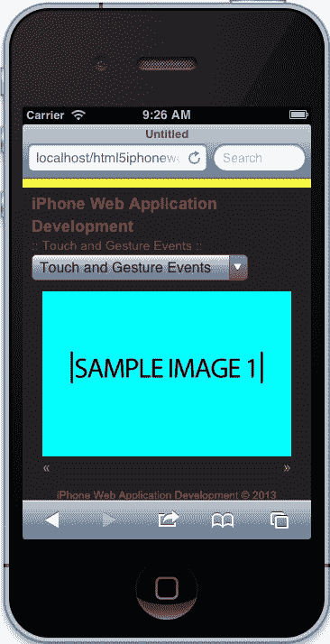
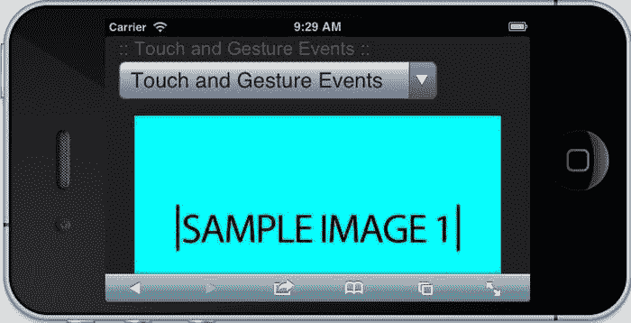

# 四、触摸和手势

默认情况下，创建 iPhone web 应用涉及触摸交互。这是显而易见的，幸运的是，苹果通过将点击映射到默认的触摸事件，在帮助我们快速行动方面做了大量工作。但是，如果我们想要一个对用户的点击做出反应的幻灯片，该怎么办？或者，如果我们想在不影响页面布局的情况下放大照片，当用户在应用的某个定义区域内进行挤压时，该怎么办？嗯，这一切都取决于我们作为开发人员。

在本章中，我们将介绍触摸事件和手势，并使用该技术构建一个对用户触摸和手势做出响应的幻灯片。这里的大多数概念将是帮助您理解这些在传统 web 开发中不常见的新事件的基础。不过，我们还将深入研究一些更高级的功能，使用捏手势放大和缩小图像。但是，首先我们需要通过重新组织导航来调整我们的应用，这样它就不会占用大部分屏幕空间，从那里我们将开始深入到触摸和手势。

在本章中，我们将介绍：

*   简化我们的导航
*   创建快速响应的照片库
*   倾听和处理触摸事件
*   解读触摸事件
*   回应手势
*   将触摸事件扩展为插件

# 简化导航

我们的导航目前占据了一些重要的位置，尽管它对我们前面的示例有效，但它只是与本书的其他示例不起作用。因此，首先我们需要清理这个应用，以便关注应用的实际内容。我们将清理标记以使用`select`组件。然后我们将添加交互性，这样我们的`select`元素实际上可以在页面之间切换。

在开始编码之前，在 JavaScript 目录中创建一个文件。创建文件后，让我们使用以下脚本标记将其包含在页面底部：

```html
<script src="../js/App/App.Nav.js"></script>
```

## 导航标记和样式

在本章的这一部分中，我们着眼于为我们的应用重新设计导航。在大多数情况下，我们希望确保在设备上使用本机控件，因此这里的目标是为用户提供在 iOS 中使用自定义选择控件的能力，但同时为我们提供同样的灵活性，以便在具有相同交互的同时自定义外观和感觉。我们将修改标记，查看自定义控件，然后模拟相同的体验。

### 基本模板

首先，让我们去掉导航中使用的锚定标记。删除这些链接后，让我们创建一个带有选项的`select`元素，并让值指向相应的页面：

```html
<nav>
    <select>
        <option value="../index.html">Application Architecture</option>
        <option value="../video/index.html">HTML5 Video</option>
        <option value="../audio/index.html">HTML5 Audio</option>
        <option value="../touch/index.html" selected>Touch and Gesture Events</option>
        <option value="../forms/index.html">HTML5 Forms</option>
        <option value="../location/index.html">Location Aware Applications</option>
        <option value="../singlepage/index.html">Single Page Applications</option>
    </select>
</nav>
```

在前面的代码中，我们用带有选项的`select`元素替换了锚定标记。每个选项都有一个值，该值指向特定页面，在该选项中是章节名称。因为我们已经移除了锚定标签，所以我们需要调整样式。

### 设置选定组件的样式

我们不需要在这里做太多的事情，但要去掉我们已有的样式。虽然这不是必须的，但为了达到最佳实践，您总是希望删除未使用的样式。这有助于通过降低页面负载来提高应用的性能。

因此，让我们删除以下样式：

```html
/* --- NAVIGATION --- */
nav ul {
    padding: 0;
}
nav li {
    list-style: none;
}
nav a {
    display: block;
    font-size: 12px;
    padding: 5px 0;
}
```

现在，我们需要添加模拟锚定标记默认动作的交互。

## 导航互动

模仿锚定标记的默认行为非常简单。让我们先创建一个基本模板，如前面章节中所做的，然后缓存导航并添加在页面之间切换的行为。让我们开始吧！

### 基本模板

以下是我们的默认模板。和以前一样，这只是一个简单的生活，为我们的导航建立了一个类。此闭包接受`window`、`document`和`Zepto`对象，将`Zepto`对象别名为美元符号。

```html
var App = window.App || {};

App.Nav = (function(window, document, $){

  var _defaults = {};

  function Nav() {}

  return Nav;

}(window, document, Zepto));
```

### 缓存我们的导航

现在，每次需要导航时，我们都可以使用 Zepto 在 DOM 中查找导航。但是按照我们的最佳实践，我们可以缓存导航，并在闭包范围中包含一个变量，该变量可由私有和公共方法使用。

```html
var _defaults = {},
  $nav;

function Nav() {
  $nav = $('nav');
}
```

在前面的代码中，我们创建了一个包含在闭包范围内的`$nav`变量，因此我们现在可以在该闭包中包含的所有方法中引用它。然后在构造函数中，我们将变量设置为`nav`元素。

### 倾听并处理变更事件

现在乐趣开始了。我们需要监听`select`元素的变更事件何时被触发。我们以前为我们的音频播放器做过这个。但是，如果您没有按照顺序进行操作，我们将简要介绍如何执行此操作。

首先，让我们调用一个`attachEvents`方法，接下来我们将定义它：

```html
function Nav() {
  $nav = $('nav');

  attachEvents();
}
```

现在我们正在调用`attachEvents`方法，我们需要创建它。在此方法中，我们希望侦听更改事件，然后处理它：

```html
function attachEvents() {
  $nav.
    on('change', 'select', handleSelectChange);
}
```

在前面的代码中，我们使用 Zepto 的`on`方法告诉缓存的导航侦听`select`元素上的更改事件，该元素包含在导航中。在此基础上，我们分配了一个尚未创建的方法，`handleSelectChange`。这个方法是我们将在下一步定义的处理程序。

最后，我们需要定义我们的处理程序。这个处理程序需要做的就是根据`select`元素的更改值切换页面。

```html
function handleSelectChange(e) {
  window.location = this.value;
}
```

前面的处理程序接受事件参数，但实际上我们不使用它。您可以删除此参数，但通常我喜欢保留处理程序接受的参数。无论哪种方式，我们都是通过将`window.location`设置为`select`元素已更改为的值来告诉窗口对象切换位置。

### 注

请注意，我们正在使用`this.value`设置窗口对象的位置。在这种情况下，`this`指的是 select 元素本身或事件目标上的元素。

### 初始化导航

最后，我们需要做的就是初始化这个类。因为这个导航理论上会出现在我们应用的每一页上，我们可以在创建这个调用后立即创建`App.Nav`的一个新实例。那么让我们在`App.Nav.js`的末尾添加以下代码：

```html
new App.Nav();
```

这就是我们需要模仿之前锚定标记行为的全部内容。完成这项工作后，我们现在有足够的屏幕空间来进行触摸活动。接下来，让我们讨论 iPhone 上的触摸事件和手势。

# 触摸和手势事件

触摸事件在 iPhone 上易于处理；然而，当你开始深入研究事件发生的时间以及在某些情况下如何解释它们时，会有一些“陷阱”。幸运的是，手势也可以通过`GestureEvent`对象轻松实现。在本节中，我们将大致介绍触摸和手势，从根本上了解这些用户体验背后的技术，以便在下一节中，我们能够成功创建可滑动的幻灯片。

## 触摸事件

触摸事件包括移动设备接收到的一个或多个输入。在本书中，我们将重点讨论最多两个手指事件，我们可以用几种方式处理它们。iOS 在解释这些输入方面做得很好；然而，元素可以是可点击的，也可以是可滚动的，正如苹果的开发者文档（[所描述的那样）http://developer.apple.com/library/ios/#documentation/AppleApplications/Reference/SafariWebContent/HandlingEvents/HandlingEvents.html#pageTitle](http://developer.apple.com/library/ios/#documentation/AppleApplications/Reference/SafariWebContent/HandlingEvents/HandlingEvents.html) ：

> 可单击元素是一个链接、表单元素、图像映射区域或具有 mousemove、mousedown、mouseup 或 onclick 处理程序的任何其他元素。可滚动元素是具有适当溢出样式、文本区域和可滚动 iframe 元素的任何元素。由于这些差异，您可能需要将某些元素更改为可单击元素，如“使元素可单击”中所述，以在 iOS 中获得所需的行为。
> 
> 此外，您可以关闭 iOS 上的默认 Safari 行为，如“防止默认行为”中所述，并直接处理自己的多点触摸和手势事件。直接处理多点触摸和手势事件使开发人员能够实现与本机应用类似的独特触摸屏界面。阅读“处理多点触摸事件”和“处理手势事件”，了解有关 DOM 触摸事件的更多信息。

这是必须记住的，因为根据我们需要的功能类型，某些元素在默认情况下的行为会有所不同。如前所述，如果我们想要修改此功能，我们需要通过将某些事件附加到这些元素来覆盖默认值。通过阻止默认功能并用我们自己的功能覆盖它，我们可以创建非常适合我们需要的体验。这方面的一个例子是创建一个完整的页面视差体验，在滚动时播放动画。

一旦我们知道我们想要什么样的行为，我们需要记住几件重要的事情。例如，事件是有条件的，因此根据用户交互，某些手势可能不会生成任何事件。让我们来看看其中的一些事件。

### 卷轴上的

条件事件的一个很好的例子是当用户滚动页面时。在此交互中，滚动事件仅在页面停止移动并重新绘制时触发。由于这个原因，在大多数视差驱动的站点上，页面上的默认行为被阻止，并且实现了自定义滚动解决方案。

### 触控式

当用户触摸可单击元素并按住手指时，将显示一个信息气泡。但如果你想抓住这个手势，那你就倒霉了。根据苹果公司的官方文档，在这种类型的交互过程中不会发送任何事件。

### 双击变焦

在此交互中，用户双击屏幕，页面放大。你可能会认为这种类型的互动会有一个事件，但我们同样没有任何事件可以联系到一起。

如果我们记住前面讨论的例外情况，我们应该能够很好地开发应用并正确处理触摸事件。现在我们需要知道我们可以联系到哪些活动，包括如何倾听和适当处理它们。

### 支持的触摸事件及其工作方式

苹果文档正式列出了 iOS 支持的所有事件，包括以下触摸和手势事件及其支持时间：

<colgroup><col style="text-align: left"> <col style="text-align: left"> <col style="text-align: left"> <col style="text-align: left"></colgroup> 
| 

事件

 | 

生成

 | 

有条件的

 | 

可获得的

 |
| --- | --- | --- | --- |
| `gesturestart` | 对 | 不适用 | iOS 2.0 及更高版本 |
| `gesturechange` | 对 | 不适用 | iOS 2.0 及更高版本 |
| `gestureend` | 对 | 不适用 | iOS 2.0 及更高版本 |
| `touchcancel` | 对 | 不适用 | iOS 2.0 及更高版本 |
| `touchend` | 对 | 不适用 | iOS 2.0 及更高版本 |
| `touchmove` | 对 | 不适用 | iOS 2.0 及更高版本 |
| `touchstart` | 对 | 不适用 | iOS 2.0 及更高版本 |

根据前面的列表，我们已经获得了使用 mobile Safari 在 iPhone上实现复杂用户体验所需的一切。如果您担心这些事件是如何处理的，那么根据苹果公司的开发文档（[的内容），您不必担心 http://developer.apple.com/library/ios/#documentation/AppleApplications/Reference/SafariWebContent/HandlingEvents/HandlingEvents.html](http://developer.apple.com/library/ios/#documentation/AppleApplications/Reference/SafariWebContent/HandlingEvents/HandlingEvents.html) ）这些事件的传递方式与任何其他浏览器相同：

> 鼠标事件的传递顺序与您在其他 web 浏览器中所期望的相同（…）。如果用户点击不可点击的元素，则不会生成任何事件。如果用户点击一个可点击的元素，事件按如下顺序到达：mouseover、mousemove、mousedown、mouseup 和 click。只有当用户点击另一个可点击的项目时，才会发生 mouseout 事件。此外，如果页面内容在 mousemove 事件上发生更改，则不会发送序列中的后续事件。此行为允许用户点击新内容。

现在我们已经很好地理解了单指触摸事件，包括异常及其工作方式，我们应该花一些时间来理解手势。

## 手势

从技术上讲，手势是触摸事件，因此前面的信息也适用于单触事件，因为平移、缩放和滚动都被视为手势。但是，手势也是复杂的互动，可以有不同的解释。基于 Apple 文档（[http://developer.apple.com/library/ios/#documentation/AppleApplications/Reference/SafariWebContent/HandlingEvents/HandlingEvents.html](http://developer.apple.com/library/ios/#documentation/AppleApplications/Reference/SafariWebContent/HandlingEvents/HandlingEvents.html) 我们可以组合多点触控事件来创建自定义手势；

> 通常，可以实现多点触摸事件处理程序来跟踪一次或两次触摸。但您也可以使用多点触摸事件处理程序来识别自定义手势。也就是说，尚未识别的自定义手势（…）

我们已经从前面的图表中看到，我们可以倾听手势，从而创造定制体验；然而，手势和正常触摸事件令人困惑的一点是它们发生的时间。但这并不神秘，因为苹果的文档（[http://developer.apple.com/library/safari/#documentation/UserExperience/Reference/GestureEventClassReference/GestureEvent/GestureEvent.html#//apple_ref/javascript/cl/GestureEvent](http://developer.apple.com/library/safari/#documentation/UserExperience/Reference/GestureEventClassReference/GestureEvent/GestureEvent.html) 向我们提供以下信息：

*（…）对于双指多点触摸手势，事件按以下顺序发生：*

*1。手指 1 的 touchstart。当第一个手指接触表面时发送。*

*2。手势开始。当第二个手指接触表面时发送。*

*3。finger 2 的 touchstart。当食指接触表面时，在手势开始后立即发送。*

*4。当前手势的手势更改。当两个手指仍接触表面时移动时发送。*

*5。手势结束。当食指从表面提起时发送。*

*6。触摸手指 2 的末端。当第二个手指从表面抬起时，在手势结束后立即发送。*

*7。触摸手指 1 的末端。当第一个手指从表面抬起时发送。*

从前面的信息中，我们可以得出触摸和手势事件是同时发生的。这使我们能够在前端做一些有趣的事情，而无需任何猜测。但是，我们如何做到这一点？好的，下一节通过创建一个照片库来解决这个问题，同时响应触摸和手势。

# 创建快速响应的照片库

如果我们专注于我们在传统移动应用中已经看到的一些小功能，例如交互式幻灯片，我们将更好地理解触摸和手势事件。我们在任何地方都看到过这种情况，一个幻灯片显示了“下一步”和“上一步”按钮，还可以从左向右滑动，或者从左向右滑动。按钮很简单，附加触摸事件也相当简单；然而，在 mobile Safari 中，刷卡并不是现成的，所以我们需要构建它。因此，让我们首先规划我们的画廊，然后设计它的样式。

## 画廊标记和样式

与任何幻灯片画廊一样，我们必须创建一个良好的结构。这种结构应该易于遵循，如果我们想将其模块化，实际上不需要太多的元素。

### 基本图库幻灯片列表

让我们从一些非常基本的内容开始。首先，我们创建一个类为`gallery`的`div`：

```html
<div class="gallery"></div>
```

从这里开始，我们需要一个包含所有幻灯片的内容区域。您可能会问，为什么我们不将幻灯片转储到父库容器中，原因是我们可以使用其他功能（如播放和暂停按钮）扩展库，而不会影响幻灯片本身的结构。

让我们在我们的图库中创建另一个`div`，其中包含一个`gallery-content`类，如下所示：

```html
<div class="gallery">
    <div class="gallery-content">
    </div>
</div>
```

现在我们已经为我们的图库设置了一个内容区，我们想要创建一个包含我们的图像的幻灯片无序列表。当我们最终这样做时，我们的`gallery`标记应该如下所示：

```html
<div class="gallery">
    <div class="gallery-content">
        <ul>
            <li>
                
            </li>
            <li>
                
            </li>
            <li>
                
            </li>
            <li>
                
            </li>
        </ul>
    </div>
</div>
```

### 提示

当您查看前面的标记时，您可能会惊讶于我遗漏了`image`标记上`alt`属性的内容。是的，这是一个糟糕的做法，但我在这里这样做是为了移动得更快一点。然而，你不应该在你的应用中这样做，总是给你的图片一个带有相对内容的`alt`属性。

现在我们已经有了一个基本的标记结构，我们应该开始设计这个幻灯片，但是请记住前面的标记不是全部结束，全部结束。我在其他网站上看到了一些非凡的工作，这很酷，但是我们希望在这里保持简单，给你一个基础。我鼓励您尝试新事物，但不要让前面的标记成为您的最终解决方案。在我们设计这个之前，让我们后退一步，理解为什么我们有一个内容区域。

### 添加简单的画廊控件

我们不想让内容区的样式复杂化。如果我们这样做，这可能会导致一些混乱的样式“修复我们的标记”。出于这个原因，我们创建了一个内容区，现在将在幻灯片中添加一个`controls`组。

所以让我们遵循同样的原则；让我们创建一个包含两个锚定标记的类`gallery-controls`的`div`，一个用于下一个按钮，另一个用于上一个按钮。

```html
<div class="gallery-controls">
    <a href="#next">&raquo;</a>
    <a href="#previous">&laquo;</a>
</div>
```

现在，内容区域和控件都是可以独立控制的两个独立区域。当我们开始设计我们的画廊时，您将看到这如何使我们的事情变得简单。现在，相信我，这将使你更容易控制你的画廊。但现在，我们的造型！

### 使图像具有响应性

在本书的第一章中，我们已经介绍了响应式设计，希望您能够理解这些原则。但如果您不这样做，本章将告诉您我们可以做些什么，以确保我们的应用不仅可以在 iPhone 上运行，还可以在其他触摸设备上运行。

假设我们希望我们的图库存在于我们网站的移动版和桌面版上，这是一个非常理想的功能，因为现在您正在构建一个可重用且与设备无关的组件。但这也使事情变得困难，不考虑资产管理，我们需要计算我们的图像必须有多大。在这个例子中，我们希望图像缩放到幻灯片宽度的 100%，我们希望幻灯片占据屏幕宽度的 100%，并且侧面有 12 像素的填充。

为了实现这一点，我们可以简单地将所有图像的宽度设置为 100%，并让我们的图库在侧面应用 12 像素的填充，如下所示：

```html
img {
  width: 100%;
}

.gallery {
  margin: 12px 0 0 0;
  padding: 0 12px;
}
```

### 注

请注意，我们的图库已经占据了屏幕宽度的 100%，减去我们在侧面的填充。因此，在`.gallery`中看不到`width: 100%`属性。另外，考虑到我们在图库顶部添加了 12 个像素，以便在主导航中留出一些空间。最后但并非最不重要的一点是，我们在这里使用速记属性，这样我们就不会使用左边空白、边距顶部等等。这使得我们的代码不仅更短，而且更易于理解和维护。

这就是使用 CSS 创建响应性库所需的全部内容，其余的样式将通过 JavaScript 应用。你们中的一些人可能会对此犹豫不决，但这是一种相当常用的技术，因为我们需要知道设备的宽度，以便正确设置我们的多媒体资料，以便快速使用。但在我们开始之前，让我们先完成我们画廊的造型。

### 设计我们的画廊

现在，让我们在 CSS 中完成我们的图库的样式设置。其中一些仍然适用于响应性应用，但上一节有助于定义原则。不过别担心；我将对这个应用的每个部分的样式进行检查，以便您能够完全理解它。

首先，让我们确保我们的图库内容在宽度上缩放到 100%，因为最终我们的幻灯片将向左浮动，所以我们希望父容器有一个高度；让我们添加一个属性`overflow: hidden`。完成后，您的样式应如下所示：

```html
.gallery .gallery-content {
  width: 100%;
  overflow: hidden;
}
```

接下来，我们要确保无序列表在幻灯片向左浮动时也有一个高度，以便将此高度应用于库内容。不仅如此，因为我们想在用户交互的基础上，对无序列表进行左右动画处理，所以我们需要确保定义了位置和起始`left`值。应用完此样式后，应如下所示：

```html
.gallery .gallery-content > ul {
  left: 0;
  margin: 0;
  overflow: hidden;
  padding: 0;
  position: relative;
}
```

### 提示

这里我们还将`0`值应用于`margin`和`padding`。这主要是一个重置，以便我们以后不会遇到任何布局问题。默认情况下，`Normalize.css`将一些`padding`和`margin`应用于无序列表，这很好，但对于我们的应用来说不是必需的，因此我们删除了这些值。

现在，让我们集中精力设计幻灯片的控件样式。下一步主要是一种设置风格，这样我们在容器中浮动元素时不会遇到任何问题；比如我们之前对`gallery`内容和无序列表所做的。因此，让我们确保我们的控件将`overflow`设置为`hidden`：

```html
.gallery .gallery-controls {
  overflow: hidden;
}
```

由于我们的控件现在在元素溢出时设置为`hidden`，因此我们可以相应地浮动下一个和上一个按钮，以便它们位于幻灯片的适当一侧。

```html
.gallery .gallery-controls a[href="#next"] {
  float: right;
}

.gallery .gallery-controls a[href="#previous"] {
  float: left;
}
```

这就是为幻灯片制作基本样式所需的全部内容。不幸的是，它看起来仍然不漂亮，这是因为我们需要使用 JavaScript 来确定屏幕大小，对幻灯片应用宽度，并对无序列表应用总宽度。然而，我们还可以做一件事，为我们的应用带来一些严重的性能优化，那就是使用 CSS3 转换。

### 注

在我们继续之前，需要注意的是，我们的 CSS 选择器是从`gallery``div`级联而来的。这是一个很好的实践，因为它允许您划分样式。我们所做的基本上是为我们的图库创建默认样式，如果有人想要自定义它，他们可以在`.gallery`之前添加自己的类来覆盖这些样式，从而使图库更加可自定义。这是一个基本的 CSS 基础，但我想我会指出它，以显示创建模块化样式的重要性。

### 使用 CSS3 转换

CSS3 转换对我们的应用非常重要。这不仅是因为它使我们的工作更容易，而且还因为它使我们的性能得到优化。默认情况下，mobile Safari 使用硬件加速进行 CSS3 转换；这意味着硬件将处理这些转换的渲染，因此我们不需要手动执行。传统上，我们需要使用 JavaScript 来实现这一点，因此我们没有获得性能优化，但现在我们使用 CSS3 转换来实现。所以让我们使用它们吧！

这是一个基本的画廊，我们希望它保持简单。让我们把我们的转换添加到无序列表中。毕竟，当用户从控件中滑动或启动操作时，无序列表是我们想要设置动画的对象。要做到这一点，我们将使用`transition`属性并使用速记来定义要设置动画的属性、长度以及要使用的过渡计时函数（也称为缓和方法）。

```html
.gallery .gallery-content > ul {
  left: 0;
  margin: 0;
  overflow: hidden;
  padding: 0;
  position: relative;

  -webkit-transition: left 500ms ease;
  -moz-transition: left 500ms ease;
  -ms-transition: left 500ms ease;
  -o-transition: left 500ms ease;
  transition: left 500ms ease;
}
```

我们在这里做的唯一一件事就是将`transition`属性添加到无序列表中。此属性告诉无序列表在 500 毫秒内设置`left`属性的动画，并使用默认缓和方法。

### 提示

这里我们定义了五个转换属性，每个属性都以浏览器供应商为前缀，而最后一个属性是受支持的标准属性。这样做是为了让我们的图库可以跨设备使用。是的，这有点复杂和混乱，但这是一个必要的邪恶，因为浏览器供应商已经为这个属性添加了前缀，直到现在才开始使用非前缀版本。

## 画廊互动

我们幻灯片的核心在于互动性；从“下一步”和“上一步”按钮中，swipeable content and animation rich 显示我们的幻灯片依赖于 JavaScript。在本节中，我们将深入探讨是什么让幻灯片发挥作用；使用我们的基本框架，我们将构建一个高效的`Gallery`类，并实现前面所述的目标。事实上，我们的图库应该只具有允许它调整大小并朝某个方向播放的功能。但是，像往常一样，这需要一些设置工作，然后我们将所有东西都连接起来。让我们开始吧！

### 基本模板

首先，我们将创建`Gallery`类。该类的设置方式应与我们构建的任何其他类相同。但是，如果您没有按顺序阅读本书，那么我们需要做的就是检查`App`名称空间，然后在其下面创建一个`Gallery`类。封装在一个闭包中，我们将有一些默认值和一个`Gallery`函数，并在闭包声明的末尾返回它。如前所述，我们将有以下内容：

```html
var App = window.App || {};

App.Gallery = (function($) {

    var _defaults = {};

    function Gallery() {}

    return Gallery;

}(Zepto));
```

这里唯一不同的是我们只是在传递`Zepto`对象。之前，我们传入了`window`和`document`，但是对于这个类，我们不需要这两个对象，所以我们将它限制在 Zepto 库中。

这就是我们现在所需要的，但更关键的是缓存我们将要重复使用的元素，此外，它们需要在闭包中可用，以便在私有和公共方法中可用。

### 缓存画廊

缓存对象在我们的应用中非常有用，特别是因为它提高了性能，使我们的应用非常高效。通过减少需要在 DOM 中执行的查找数量，我们可以加快处理速度，并创建一个不太容易出错的应用。

我们不仅希望缓存某些元素，还希望它们在闭包中可用，以便所有方法都可以访问它们。要做到这一点，我们需要做的就是将缓存的变量添加到位于构造上方的`_defaults`变量之后，如下所示：

```html
var _defaults = {},
    $gallery,
    $slides,
    $slidesContainer,
    $slidesLength,
    $galleryControls,
    slidesWidth,
    galleryWidth;
```

在前面的代码中，我们可以看到图库、其幻灯片、幻灯片容器、幻灯片数量、图库控件以及幻灯片和图库宽度将被缓存。然而，目前我们还没有缓存任何内容。让我们开始给他们分配他们应该拥有的值。

初始化值的最佳位置是在构造函数中，或者在创建库实例时。构造器应该继续为运行中的应用的其余部分缓存所需的值。最重要的是，每个变量在语义上描述了它应该包含的内容，使您更容易理解发生了什么。让我们来看看下面的函数：

```html
function Gallery() {
    $gallery = this.$el = $('.gallery');

    $slides = $gallery.find('li');

    $slidesContainer = $gallery.find('.gallery-content > ul');

    $galleryControls = $gallery.find('.gallery-controls');

    $slidesLength = $slides.length;
}
```

通过此函数，我们可以收集缓存库的数据，并由此确定所有其他值。例如，我们使用`$gallery`查找所有幻灯片或列表项。这是非常有用的，因为我们所做的是告诉我们的应用从`gallery`元素开始，然后深入到其中以找到合适的值。否则，我们通常会从文档的顶部开始，然后往下看，这在 DOM 查找方面是非常昂贵的。

这是过程中的一个关键步骤，因为其他一切都应该很简单。所以，让我们开始连接一些互动！

### 连接我们的控制装置

首先，我们希望用户能够单击下一个和上一个按钮。然而，我们现在还不想发生任何事情，我们只想捕捉这些事件。一如既往，让我们从小做起，然后努力工作，我们要做的就是建立一个基础。

#### 附加事件

我们之前已经讨论过如何附加事件，在本章中也没有什么不同。因此，首先创建一个`attachEvents`方法，从库中查找下一个和上一个按钮，然后调用`play`方法。编写完代码后，您应该有如下内容：

```html
function attachEvents() {
    $galleryControls
        on('click', 'a[href="#next"]', play).
        on('click', 'a[href="#previous"]', play);
}
```

这里没有什么不同。我们使用缓存的`$galleryControls`变量，并告诉它监听来自下一个和上一个按钮的`click`事件。当`click`事件来自指定元素时，调用我们的`play`方法。如果我们现在运行代码，不会发生任何事情，只会因为`play`不存在而可能出现错误。但我们不要这样做；相反，在所有设置代码发生后，我们将在构造函数中调用`attachEvents`方法：

```html
function Gallery() {
  // our previous code 

    attachEvents();
}
```

这里没什么疯狂的，我们只是调用`attachEvents`，一个私有方法。你有没有注意到我们是如何使用`$galleryControls`的，尽管它是一种私人方法？这是因为该变量存在于闭包范围内，因此可以更容易地管理变量，而不会污染程序的全局范围。如果你还不明白这里发生了什么，别担心。随着时间的推移和实践，这将是有意义的，事情会变得简单得多。

现在，我们仍然有一个问题。没有`play`方法，所以让我们创建它吧！

#### 处理我们的事件

因为我们的`play`方法不存在，所以我们的应用失败；所以我们需要写它。但它应该做什么呢？好的，对于这个应用，我们希望它确定画廊应该播放的方向。然后，我们希望它根据库所在的当前位置设置左或右动画。你可能会说，这听起来比你想象的要容易。但实际上是这样。让我们一步一步来。

##### 再次缓存变量

是的，我们希望缓存尽可能多的。同样，这是我们为 iPhone 创建的一个移动应用，由于移动的性质，我们需要尽可能地优化。但是我们应该缓存什么呢？首先我们要检查的是方向，然后操纵无序列表的当前左侧位置。为了防止查找这些值，我们只需在方法顶部声明一个`currentLeftPos`和方向，如下所示：

```html
function play(e) {
    var currentLeftPos, direction;
}
```

易于理解的现在，让我们确定这些值。确定方向的一种简单方法是根据单击的元素的值来确定方向。在这种情况下，我们可以检查`href`属性的值是否为“下一个”或“上一个”。为了使它更简单，我们可能还需要删除 hash 标记，以防我们想要公开此方法并允许自己传入`next`或`previous`。让我们这样做：

```html
function play(e) {
    var currentLeftPos, direction;

    direction = $(this).attr('href');

    direction = direction.substr(1, direction.length);
}
```

### 提示

不要太担心这里的细节，但本质上因为`play`是一个事件处理程序，`this`已经成为目标事件，这将是我们的锚定标记。这就是我们如何从这些元素中获得`href`值的方法。另外，不要对正在进行的字符串操作过于紧张。基本上，我们使用`substr`，一种内置的`string`方法，并传递它`1`，使它从位置 1 开始，然后获得字符串的其余部分。这就是我们如何从`href`属性中获取单词 next 或 previous 的方法。

太好了，现在我们已经确定了方向。现在，我们要获取无序列表的最新左侧位置。为此，我们可以在设置方向后添加以下代码位：

```html
function play(e) {

  // Previous code

    currentLeftPos = parseInt($slidesContainer.css('left'), 10);
}
```

### 注

请注意，我们使用的是`parseInt`，这是一种内置的数字方法，它接受整数作为第一个参数，然后接受基数作为第二个参数。我们这样做是因为当我们请求`left`属性的值时，我们得到类似于`0px`的值，我们希望使用的值是整数，而不是字符串。所以`parseInt`通过取`0px`并将其解释为`0`的整数来帮助我们。

现在是时候创建我们应用的神奇部分了。这一部分有点复杂，但最终将帮助我们实现我们所期望的效果。但是，让我们首先关注让我们的应用进行下一次行动调用。为此，我们希望将无序列表的左位置设置为当前左位置减去单个幻灯片的宽度。为此，我们只需在`currentLeftPos`设置后编写以下代码即可：

```html
function play(e) {
    // Previous code

    // Next
    $slidesContainer.css({ 
    'left': currentLeftPos + -(slidesWidth) + 'px' });
}
```

前面的代码将完全按照我们的要求执行；然而，我们遇到了几个问题。首先，即使点击了“上一步”按钮，该操作也将始终运行。第二，当你到达画廊的尽头时，没有支票。这可以很容易地添加到我们的应用中，如下所示：

```html
function play(e) {
    // Previous code

    // Next
    if (direction === 'next') {
        if (Math.abs(currentLeftPos) < (galleryWidth - slidesWidth)) {
            $slidesContainer.css({
                'left': currentLeftPos + -(slidesWidth) + 'px'
            });
        }
    }
}
```

### 提示

您可能已经注意到我们正在`currentLeftPos`上使用`Math.abs`。这是因为我们将得到一个负数作为我们的值，并且由于我们不想使数学或比较复杂化，我们只需使用`Math.abs`将其转换为正整数。保持简单！

在这个调整后的代码中，我们检查方向，寻找`next`，然后检查以确保当前左侧位置小于画廊宽度减去单个幻灯片的宽度。这有助于防止可能出现的任何错误。

现在开始实现我们的`previous`功能。对于这一步，我们将遵循相同的过程；我们将确保我们想要朝`previous`方向前进，然后我们将进行比较以确保我们不会低于`0`标记，最后我们将在满足条件的情况下执行代码。当我们完成此功能的实现时，应该有以下代码：

```html
function play(e) {
    // Previous code

    // Previous
    if (direction === 'previous') {
        if (Math.abs(currentLeftPos) > 0) {
            $slidesContainer.css({
                'left':  currentLeftPos + slidesWidth + 'px'
            });
        }
    }
}
```

这里唯一的区别是我们正在与静态数字`0`进行比较。这是为了防止任何会在我们的图库中导致视觉错误的正值。然后，我们使用正确的值来增加负数，而不是对数字求反，从而给出一个`Previous`动作的外观。

最后，我们的`play`方法应该是这样的：

```html
function play(e) {
    var currentLeftPos, direction;

    direction = $(this).attr('href');

    direction = direction.substr(1, direction.length);

    currentLeftPos = parseInt($slidesContainer.css('left'), 10);

    // Next
    if (direction === 'next') {
        if (Math.abs(currentLeftPos) < (galleryWidth - slidesWidth)) {
            $slidesContainer.css({
                'left': currentLeftPos + -(slidesWidth) + 'px'
            });
        }
    }

    // Previous
    if (direction === 'previous') {
        if (Math.abs(currentLeftPos) > 0) {
            $slidesContainer.css({
                'left':  currentLeftPos + slidesWidth + 'px'
            });
        }
    }
}
```

我们结束了吗？是的，我们是！即使我们只是切换无序列表的左位置值。我们实际上是在制作动画，因为如果您还记得的话，我们已经告诉元素在 CSS 中转换 left 属性。看看使用 CSS3 属性有多简单和有效？通过一个简单的声明，我们能够最小化代码，并对我们的图库进行高度优化。

现在，我们已经完成了我们画廊的核心部分，让我们让它更具响应性！

### 画廊响应性

我们将在这里稍微绕开一步，但值得付出必要的努力！在这一步中，我们将研究如何使图库响应用户设备的宽度。因此，让我们从设置样式开始。

#### 设置画廊风格

在这里，我们将设置所有必要的样式，以使我们的画廊具有响应性。我们需要做几件事。首先，让我们使用`Gallery`函数的`prototype`创建一个公共`setStyles`方法：

```html
Gallery.prototype.setStyles = function() {

    return this;
};
```

您可能已经注意到，前面的方法返回`Gallery`的实例，因此允许您链接您的方法。接下来，获取单个幻灯片的宽度。这个宽度是它所在的容器的 100%，因此它应该与库本身的宽度相同。要获得此宽度，我们可以在`setStyles`内执行以下操作：

```html
Gallery.prototype.setStyles = function() {

    slidesWidth = $slides.width();

    return this;
};
```

现在，我们可以通过将幻灯片数量乘以每个幻灯片设置的宽度来确定图库的全宽，我们在上一步中已经确定了这个宽度。当我们这样做时，我们实现了以下代码：

```html
Gallery.prototype.setStyles = function() {

    slidesWidth = $slides.width();

    galleryWidth = slidesWidth * $slidesLength;

    return this;
};
```

下面这一步可能会让人困惑，但它很关键，因为我们需要手动设置每个幻灯片的宽度，以便使它们彼此相邻浮动。所以我们现在需要做的是对每张幻灯片应用`slideWidth`值，如下所示：

```html
Gallery.prototype.setStyles = function() {

    slidesWidth = $slides.width();

    galleryWidth = slidesWidth * $slidesLength;

    $slides.width(slidesWidth);

    return this;
};
```

现在，我们还可以使用计算库宽度来设置幻灯片容器的宽度。同样，我们需要这样做，以保持一个画廊有幻灯片是浮动到左边。因此，我们将设置幻灯片容器的宽度，然后将所有幻灯片向左浮动。当我们对这些需求进行编码时，您的`setStyles`方法将如下所示：

```html
Gallery.prototype.setStyles = function() {

    slidesWidth = $slides.width();

    galleryWidth = slidesWidth * $slidesLength;

    $slides.width(slidesWidth);

    $slidesContainer.css({'width': galleryWidth});

    $slides.css({'float': 'left'});

    return this;
};
```

这就是以响应的方式设置我们画廊风格所需要的一切。然而，这里有一个问题；样式无法重置，当设备的方向或宽度以某种方式改变时，需要重置样式才能正确确定幻灯片和容器的宽度。让我们做一些设置工作，以便重新设置。

为此，我们只需将我们的功能包装在一个方法中，然后将该方法传递给一个公共的`resetStyles`方法。在这种技术中，我们本质上是发送一个`callback`，当`resetStyles`功能完成时，它将被执行。目前，您的代码应产生以下结果：

```html
Gallery.prototype.setStyles = function() {

    this.resetStyles(function(){
        slidesWidth = $slides.width();

        galleryWidth = slidesWidth * $slidesLength;

        $slides.width(slidesWidth);

        $slidesContainer.css({'width': galleryWidth});

        $slides.css({'float': 'left'});
    });

    return this;
};
```

正如您所看到的所示，我们最初为`setStyles`创建的所有功能都被包装在一个匿名函数中，也称为`callback`，当`resetStyles`运行完毕时，将调用该函数。为了全面了解情况，让我们继续创建`resetStyles`函数。

#### 重新设置图库样式

重置一个元素的样式实际上并没有那么复杂，所以我们将首先讨论这个方法。检查以下代码，这些代码应该在您的`reset`方法中。

```html
Gallery.prototype.resetStyles = function(callback) {
    $slides.attr('style', null);

    $slidesContainer.attr('style', null);

    $slides.attr('style', null);

    if (typeof callback !== 'undefined') {
        callback.call(this);
    }

    return this;
};
```

不太疯狂吧？我们基本上只是删除 Zepto 在使用 JavaScript 设置元素样式时应用的内联样式，或者我们在`setStyles`方法中所做的操作。当我们删除这些样式时，我们会检查`callback`方法并执行该方法。这是一个很好的实践，因为，假设我们因为任何其他原因需要重置我们画廊的样式；我们不想无缘无故地创建不必要的函数。

#### 正在初始化库样式

我们需要做的最后一件事就是初始化我们的风格。为此，当我们的代码在`Gallery`构造函数中初始化时，让我们调用`setStyles`。

```html
function Gallery() {
  // our previous code 

   this.setStyles();
    attachEvents();
}
```

当我们最终确定了样式时，在纵向模式下，我们的应用应该如下所示：



响应画廊

在横向模式下，我们的应用应如下所示：



响应画廊

### 提示

不幸的是，您的应用的外观或行为与这些屏幕截图中显示的不一样；这是因为现在没有连接任何东西，我们甚至没有初始化任何代码。但是如果你真的想马上开始，看看我们是如何做到的，你可以在我们得出结论之前查看本章的最后一节。如果您遵循这些步骤，您应该拥有一个看起来与我们刚才看到的类似的应用。

从技术上讲，我们的图库现在已经完全建成，我们现在可以使用“下一个”和“上一个”按钮与它完全交互。但现在，我们期待已久的乐趣，触摸事件！

## 为触摸扩展通道

默认情况下，我们可以在`Gallery`类中包含触摸交互，但这是不可重用的，不能应用于应用的其他部分。因此，在本节中，我们将创建一个名为`Swipe`的新类，它将包含在特定模块上检测滑动手势所需的所有内容。

### 基本模板

像往常一样，我们希望从我们的基本框架开始，类似于我们以前编写的其他类。要开始，我们可以编写以下基本模板：

```html
var App = window.App || {};

App.Swipe = (function(window, document, $){

  var _defaults = {};

  function Swipe(options) {
    this.options = $.extend({}, _defaults, options);
  }

    return Swipe;

}(window, document, Zepto));
```

`Swipe`类与我们的`Gallery`类有点不同，它接受`window`、`document`和`Zepto`对象。另一个区别是`Swipe`构造函数接受一个名为`options`的参数，用于覆盖我们即将设置的默认值。

### 默认选项和模块化刷卡事件

在`Swipe`课程中，我们想做几件事。首先，我们要确保它只适用于特定的容器，而不是整个文档。然后，我们希望能够缓存某些值，如触摸的初始 x 位置和结束 x 位置。这些缓存的值在闭包范围内也应该是可用的，这样它们在所有方法中都是可用的。

以下是我们想要的默认值以及在闭包范围内可用的缓存值：

```html
var _defaults = {
  'el': document.body,
  '$el': $(document.body)
},
el,
$el,
delta,
initXPos,
endXPos,
threshold = 30;
```

我们在前面的代码中基本上说的是，默认元素，即滑动功能，应该附加到文档的`body`元素。从这里，我们确保可以访问闭包作用域中的这些缓存元素。最后，我们设置了一些变量，将存储有关我们将要听到的触摸手势的信息。

现在在我们的构造函数中，我们希望覆盖这些默认值，并确保其中一些初始值将存在于全局范围中：

```html
function Swipe(options) {
  this.options = $.extend({}, _defaults, options);
  $el = this.$el = this.options.$el = $(this.options.el);
  threshold = this.options.threshold || threshold;

  this.init();
}
```

在这里，我们使用 Zepto 的`extend`方法创建一个新对象，该对象包含将 options 参数合并到 defaults 对象中。然后，我们确保闭包的作用域包含 swipe 类将附加到的缓存元素。最后，我们检查是否传入了自定义阈值，并覆盖默认值 30。在所有这些之后，我们在构造函数的末尾调用 initialize 方法，以便 Swipe 类自动启动。

### 聆听触摸事件

现在我们需要将适当的事件附加到`Swipe`类。这些事件将基于我们前面介绍的触摸事件，但它们的使用方式将模仿刷卡手势。为了实现这一点，我们首先需要监听`touchstart`、`touchend`和`touchmove`事件，并为每个事件分配事件处理程序。我们可以在从构造函数调用的`init`方法中完成所有这些。

因此，首先让我们在刷卡的`prototype`上创建`init`方法，并确保在该方法的末尾返回实例：

```html
Swipe.prototype.init = function() {

  return this;
};
```

在这个方法中，我们想要监听前面提到的触摸事件，并确保它们具有事件处理程序。为此，我们将使用 Zepto 的`on`方法，并将事件附加到缓存的元素：

```html
Swipe.prototype.init = function() {
  this.options.$el.
    on('touchstart', handleTouchStart).
    on('touchend', handleTouchEnd).
    on('touchmove', handleTouchMove);

  return this;
};
```

在前面的代码中，我们将事件作为字符串传递给`on`方法的第一个参数，然后为分配一个我们尚未创建的事件处理程序。您还将注意到，这些方法是可链接的，允许我们同时附加多个事件。这就是为什么我们在公共方法结束时返回`this`，这样我们就可以允许自己同步进行调用。

### 处理触摸事件

现在我们需要来创建分配给每个侦听器的事件处理程序。我们将一次处理一个处理程序，以便解释如何从这些触摸事件创建滑动手势。我们首先要看的是`touchstart`处理程序。

当我们将手指放在手机上时，我们要做的第一件事是存储手指的初始 x 位置。要访问此信息，在触发的事件上有一个`touches`数组。因为我们只想使用第一次触控，所以需要访问`touches`数组中的第一次触控。一旦我们得到第一次触摸，我们就可以通过在该对象上使用`pageX`属性来获得 x 位置。这就是`handleTouchStart`的功能：

```html
function handleTouchStart(e) {
    initXPos = e.touches[0].pageX;
}
```

正如您所看到的，`handleTouchStart`方法接受一个参数，事件对象。然后，我们在事件对象的`touches`数组中的第一次触摸时，将`initXPos`设置为`pageX`属性。这听起来可能很混乱，但基本上我们只是访问我们需要的对象，以便保持触摸的初始 x 值。

接下来，我们要创建`handleTouchMove`事件处理程序。此处理程序将包含与`handleTouchStart`相同的概念，但我们希望更新结束 x 位置，而不是初始 x 位置。这可以在以下代码中看到：

```html
function handleTouchMove(e) {
  e.preventDefault();
    endXPos = e.changedTouches[0].pageX;
}
```

这里有几个不同之处，我会解释。首先，我们防止触摸移动的默认行为。这是为了阻止任何奇怪的行为发生，当我们想要创造一种独特的体验时，通常会被建议，比如一个可旋转的画廊。

你会注意到的另一个区别是，我们正在调查事件中的`changedTouches`对象。这是因为`move`事件不包含`touches`对象。虽然有点争议，但这有助于跟踪每次触摸以及特定触摸的更改属性。因此，如果我有多个触摸，那么我的`changedTouches`对象将适当地包含每个更改的触摸。

到目前为止，我们所做的只是设置初始和结束 x 位置。现在我们需要使用这些值来创建一个`delta`值，然后用于触发向左或向右的滑动。这就是我们的`handleTouchEnd`事件处理程序将为我们做的事情。

以下是`handleTouchEnd`应该包含的代码：

```html
function handleTouchEnd(e) {
    endXPos = e.changedTouches[0].pageX;
    delta = endXPos - initXPos;

    if(delta > threshold) {
        $el.trigger('SwipeLeft');
    }

    // The *-1 converts the threshold to a negative integer
    if(delta < threshold*-1) {
        $el.trigger('SwipeRight');
    }
}
```

现在让我们看一下这个代码，一行一行。首先，我们做与`handleTouchMove`完全相同的事情，即设置端点 x 的位置。接下来，我们设置 delta 值，它是通过从初始 x 位置减去结束 x 位置计算出的差值。现在我们做一个比较；如果增量大于阈值，则触发名为`SwipeLeft`的自定义事件。我们的下一个比较有点混乱，但基本上我们检查`delta`值是否小于负阈值。这样我们就可以检测到正确方向的滑动。

我们的`Swipe`课现在结束了。我们已经创建了必要的功能，可以监听我们的触摸事件，然后模仿我们可以连接的手势。但我们还没有将它连接到我们的图库，这是这个过程的最后一步。感到自豪，你已经达到这一点，因为现在容易的事情发生了！

## 把这一切放在一起

好的，现在我们有了一个图库，并且能够通过触摸事件检测滑动手势。但是现在，没有任何东西是真正相连的，事实上我们还没有初始化我们的`Gallery`类，所以现在没有任何东西可以工作。但这就是最后一节的内容；我们将初始化`Gallery`类，添加`Swipe`功能，然后对刷卡事件做出反应。

### JavaScript

我们要做的第一件事是打开我们的`App.Touch.js`文件，正如您所记得的，该文件属于我们触摸页面的功能，因此是包含所有初始化的文件。打开此文件后，转到`init`方法，或者如果尚未创建，则创建它并初始化`Gallery`的实例：

```html
Touch.prototype.init = function() {
  var that = this;

  // Initializing Gallery
  this.gallery = new App.Gallery();

  return this;
};
```

既然我们已经初始化了`Gallery`类，库应该立即初始化。但请记住，我们没有修改标记以包含此文件。因此，即使在这一点上，你也不会看到你的劳动成果。但是，让我们确保继续安装工作。在下一步中，我们要初始化我们的`Swipe`类，并确保它将自身设置为`gallery`元素：

```html
Touch.prototype.init = function() {
  // Previous code

  // Initializing Swipe
  this.swipe = new App.Swipe({
    'el': document.querySelector('.gallery')
  });

  return this;
};
```

现在，即使在这一点上，我们的图库也不会对刷卡事件做出响应。这是因为我们的滑动功能只检测触摸并分派我们以前设置的自定义事件，所以我们需要做的是在多媒体资料中侦听这些事件，然后告诉它播放下一张或上一张幻灯片：

```html
Touch.prototype.init = function() {
  // Previous code

  // Listen to the swipe and then trigger the appropriate click
  this.swipe.$el.
    on('SwipeLeft', function(){
      that.gallery.$el.find('a[href="#previous"]').trigger('click');
    }).
    on('SwipeRight', function(){
      that.gallery.$el.find('a[href="#next"]').trigger('click');
    });

  return this;
};
```

在前面的代码中，我们监听由我们的 swipe 实例发送的`SwipeLeft`和`SwipeRight`事件。当任何一个事件被调度时，基于该事件，我们模拟单击“上一个”或“下一个”按钮。通过这种方式，我们可以让用户在我们的图库中滑动，同时消除任何复杂情况。

当你写完你的`init`方法后，它应该是这样的：

```html
Touch.prototype.init = function() {
  var that = this;

  // Initializing Gallery
  this.gallery = new App.Gallery();

  // Initializing Swipe
  this.swipe = new App.Swipe({
    'el': document.querySelector('.gallery')
  });

  // Listen to the swipe and then trigger the appropriate click
  this.swipe.$el.
    on('SwipeLeft', function(){
      that.gallery.$el.find('a[href="#previous"]').trigger('click');
    }).
    on('SwipeRight', function(){
      that.gallery.$el.find('a[href="#next"]').trigger('click');
    });

  return this;
};
```

### 加价

最后一项需要注意的是页面上包含脚本的标记。为了简化操作并使您最终正确运行应用，您需要在页面上包括以下内容：

```html
    <script src="../js/vendor/zepto.min.js"></script>
    <script src="../js/helper.js"></script>
    <!-- BEGIN: Our Framework -->
    <script src="../js/App/App.js"></script>
    <script src="../js/App/App.Nav.js"></script>
    <script src="../js/App/App.Gallery.js"></script>
    <script src="../js/App/App.Swipe.js"></script>
    <script src="../js/App/App.Touch.js"></script>
    <!-- END: Our Framework -->
    <script src="../js/main.js"></script>
    <script> touch = new App.Touch(); </script>
```

与其他页面相比，这里的区别在于我们只包含我们需要的项目，包括`App.Nav.js`、`App.Gallery.js`、`App.Swipe.js`和`App.Touch.js`。与其他页面相比，我们包含了整个框架，但是对于这个页面或任何向前移动的页面，我们实际上不需要这样做。需要注意的是，我们还创建了一个全局触摸对象，该对象被设置为`App.Touch`类的一个实例。这样我们就可以很容易地在调试器中引用它，但是应该用`App.touch`替换，这样它就不会污染全局名称空间。

我们已经到了终点！在这一点上，你应该有一个功能齐全的画廊，具有 swipeable 互动。现在拍拍自己的背；这是一个漫长的旅程，但我希望您能够欣赏我们创建了完全自包含的可重用、模块化代码这一事实。最重要的是，我们的多媒体资料完全响应用户的要求，并根据用户的设备进行调整，使他们能够始终如一地享受体验。

# 总结

在本章中，我们重新设计了主导航的样式，介绍了触摸和手势事件的基本原理，然后使用一个可适应用户设备的响应式照片库来实现这两种类型的事件。我们还讨论了附加这些事件，并根据幻灯片中的要求适当地处理它们。从现在开始，您应该很好地了解如何使用触摸事件在 iPhone 以及其他移动设备上创造独特的体验。接下来，让我们来看看 iPhone 上 HTML5 处理表单的一些特殊交互。