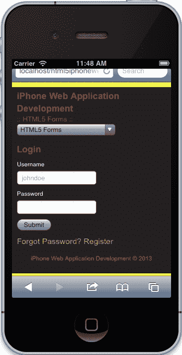
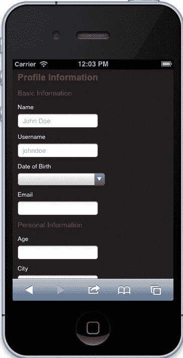
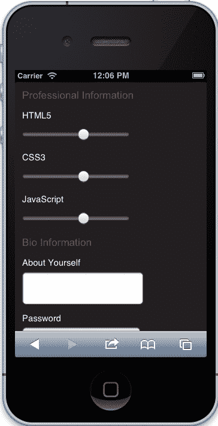
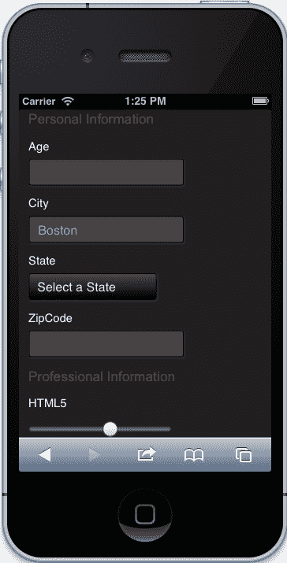

# 五、理解 HTML5 格式

在本章中，我们将介绍使用最新 HTML5 技术的表单，包括新的输入类型和表单属性。我们将简要回顾一些我们将在示例表单中使用的新输入类型。在re 中，我们将讨论规范中的一些新属性，同时也将讨论专门用于移动设备的`autocapitalize`属性。在我们进入我们的样本表单之前，我们考虑 IOS 设备上表单的布局以及与这些表单交互时出现的局限性。最后，我们创建一些示例表单，开发一些简单的验证，然后专门为支持 iOS 和 WebKit 的浏览器设计表单。

一旦我们回顾了所有这些特性并浏览了示例表单，我们就应该对 HTML5 表单以及它们与为 iOS 开发 web 应用的关系有一个坚实的掌握。

以下是我们将在本章中介绍的主题：

*   新的 HTML5 输入类型
*   新的 HTML5 表单特定属性
*   iPhone 的表单布局
*   表单验证
*   iOS 的表单样式

那么，让我们先来看一下新的标准 HTML5 输入类型。

# HTML5 输入类型

HTML5 引入了几种新的输入类型，加快了我们应用的开发。HTML5 规范总共引入了 13 种新的输入类型，包括`datetime`、`datetime-local`、`date`、`month`、`time`、`week`、`number`、`range`、`email`、`url`、`search`、`tel`和`color`。不幸的是，这些新输入中只有 10 个在 iOS 上受支持，但无需担心，因为类型默认为自动文本。这对我们帮助不大，但它确实允许我们为需要但不受支持的类型创建多边形填充。然而，无论哪种方式，下面都是 iOS 支持的所有输入类型的细分以及每种类型的功能说明：

<colgroup><col style="text-align: left"> <col style="text-align: left"></colgroup> 
| 

输入类型

 | 

描述

 |
| --- | --- |
| `button` | 表示没有附加语义的按钮。 |
| `checkbox` | 表示可切换的状态或选项。 |
| `date` | 表示用于将元素值设置为表示日期的字符串的控件。 |
| `datetime` | 表示一个控件，用于将元素的值设置为表示全局日期和时间（带有时区信息）的字符串。 |
| `datetime-local` | 表示一个控件，用于将元素的值设置为表示本地日期和时间（不含时区信息）的字符串。 |
| `email` | 表示用于编辑电子邮件地址列表的控件。 |
| `file` | 表示文件项的列表，每个项由文件名、文件类型和文件正文（文件内容）组成。 |
| `hidden` | 表示用户不打算检查或操纵的值。 |
| `image` | 表示 UA 允许用户从中交互选择一对坐标并提交表单的图像，或者表示用户可以从中提交表单的按钮。 |
| `month` | 表示用于将元素值设置为表示月份的字符串的控件。 |
| `number` | 表示用于将元素值设置为表示数字的字符串的精确控件。 |
| `password` | 表示用于输入密码的单行纯文本编辑控件。 |
| `radio` | 表示从项目列表（单选按钮）中选择一个项目。 |
| `range` | 表示一个不精确的控件，用于将元素的值设置为表示数字的字符串。 |
| `reset` | 表示用于重置窗体的按钮。 |
| `search` | 表示用于输入一个或多个搜索词的单行纯文本编辑控件。 |
| `submit` | 表示用于提交表单的按钮。 |
| `tel` | 表示用于输入电话号码的单行纯文本编辑控件。 |
| `text` | 表示输入元素值的单行纯文本编辑控件。 |
| `time` | 表示一个控件，用于将元素的值设置为表示时间的字符串（不含时区信息）。 |
| `url` | 表示用于编辑元素值中给定的绝对 URL 的控件。 |
| `week` | 表示一个控件，用于将元素的值设置为表示一周的字符串。 |

有关详情，请浏览：

*   [http://www.w3.org/TR/html-markup/input.html](http://www.w3.org/TR/html-markup/input.html)
*   [https://developer.apple.com/library/safari/#documentation/AppleApplications/Reference/SafariHTMLRef/Articles/InputTypes.html#//apple_ref/doc/uid/TP40008055-SW1](http://developer.apple.com/library/safari/#documentation/AppleApplications/Reference/SafariHTMLRef/Articles/InputTypes.html)

尽管我们可以在这里试验大量输入，但我们将只关注新的`email`、`number`、`datetime`和`range`类型。本书中的样本表格还将包含常规类型，包括`text`、`password`和`submit`。

现在我们已经很好地掌握了所支持的内容，并且有了关于哪些类型可能适合我们的需要的参考信息，接下来让我们回顾一下我们还可以利用的属性。

# 表单的 HTML5 属性

我们可以在 HTML5 中使用许多属性，但为了保持这一部分的简单性，我们将重点介绍可以在输入和表单上使用的新属性。以下属性在最新的 HTML5 规范中定义，除了`autocapitalize`之外，iOS 上也支持：

<colgroup><col style="text-align: left"> <col style="text-align: left"></colgroup> 
| 

输入属性

 | 

描述

 |
| --- | --- |
| `autocapitalize` | 指定文本元素的自动大小写行为。 |
| `autocomplete` | 指定元素是否表示 UA 要存储用户输入的值的输入控件（以便 UA 以后可以预先填充表单）。 |
| `min` | 元素值的预期下限。 |
| `max` | 元素值的预期上限。 |
| `multiple` | 指定元素允许多个值。 |
| `placeholder` | 一种简短提示（一个单词或一个短语），旨在帮助用户将数据输入到由其元素表示的控件中。 |
| `required` | 指定元素是表单提交的必需部分。 |

有关这些属性的详细信息，请访问：

*   [http://www.w3.org/TR/html-markup/global-attributes.html#global【属性】](http://www.w3.org/TR/html-markup/global-attributes.html#global-attributes)
*   [https://developer.apple.com/library/safari/#documentation/AppleApplications/Reference/SafariHTMLRef/Articles/Attributes.html#//apple_ref/doc/uid/TP40008058-SW2](https://developer.apple.com/library/safari/#documentation/AppleApplications/Reference/SafariHTMLRef/Articles/Attributes.html)
*   [http://www.w3.org/TR/html-markup/form.html#form.attrs.autocomplete](http://www.w3.org/TR/html-markup/form.html#form.attrs.autocomplete)

### 提示

上表中未列出所有表单属性；仅列出 HTML5 规范中定义的最新支持属性。这是给我们一个最新和最伟大的想法。但是，如果您想更广泛地了解所支持的内容，我鼓励您查看前面详细介绍此信息的来源，并对规范中的每个属性进行透彻的解释。

现在，我们对 iOS 支持的最新属性有了基本的了解。现在，我们可以简要回顾一些设计注意事项，然后直接进入一些示例 HTML5 表单，看看最新的输入类型和属性如何协同工作以简化我们的开发过程。

# iPhone 的表单布局

在本节中，我们简要介绍了为 iOS 创建表单时的一些设计注意事项。您可以完全控制表单的设计，也可以不完全控制表单的设计；但是，为了更容易理解可能出现的限制，下表有助于演示使用表单时屏幕不动产的有限数量。希望这能帮助您解释这些限制，以便进行调整。让我们看看下表：

<colgroup><col style="text-align: left"> <col style="text-align: left"></colgroup> 
| 

用户界面控件

 | 

像素尺寸

 |
| --- | --- |
| 状态栏 | 20 英尺高 |
| URL 文本字段 | 身高 60 |
| 表格助理 | 44 英寸高 |
| 键盘 | 肖像高度 216景观高度 162 |
| 按钮栏 | 肖像高度为 44景观高度为 32 |

有关这些控制措施的详细信息，请参见[https://developer.apple.com/library/safari/#documentation/AppleApplications/Reference/SafariWebContent/DesigningForms/DesigningForms.html](https://developer.apple.com/library/safari/#documentation/AppleApplications/Reference/SafariWebContent/DesigningForms/DesigningForms.html) 。

基于这些值，当这些控件出现时，我们需要针对特定维度调整表单。例如，如果除了按钮栏，所有这些控件都出现了，并且我们的可用高度为 480 像素，那么我们的屏幕实际高度将达到 140 像素。

正如您所见，为 iOS 创建可用表单是一项挑战，但并非不可能。我们可以使用一些有趣的技术在应用中容纳表单。但最好的技巧是简单。确保你不要求你的用户一次提供大量信息；因此，您只需要用户名、密码和电子邮件地址，而不需要姓名、电子邮件、密码和带有出生日期的密码确认。在我们的应用中，保持它的简单有很大的帮助，有助于改善用户体验。

现在，我们已经对为 iOS 设计表单时出现的限制有了一个合理的理解，但现在让我们跳转到功能上，看看如何创建一些简单的表单。

# HTML5 表单示例

现在我们将仔细研究一些代码，包括标记、脚本和样式。您可能已经知道其中的一些内容，并且在大多数情况下，这里只强调新的 HTML5输入和属性。我们将了解它们是如何实现到表单中的，它们对 UI 控件的影响，以及如何在脚本中利用这项新技术。但是首先，让我们做一些设置工作，以便在我们的页面中所有内容都是一致的。

## 安装工作

我们需要做的第一件事是打开表单页面的`index.html`文件。一旦我们打开它，你会看到，我们有了本书开头创建的旧模板。随着应用的发展，我们必须更新此模板以反映这些更改，因此让我们执行以下任务：

*   在我们的主要样式之后包括表单样式（`forms.css`
*   更新导航以反映我们的新菜单
*   包括我们的导航脚本（`App.Nav.js`）和表单脚本（`App.Forms.js`）

### 包括我们的表单样式

目前，我们没有这个页面的任何样式，但是我们应该包括我们特定于页面的样式表。当我们这样做时，我们的头应该是这样的：

```html
    <!DOCTYPE html>
    <html class="no-js">
    <head>
        [PREVIOUS META TAGS]

        <link rel="stylesheet" href="../css/normalize.css">
        <link rel="stylesheet" href="../css/main.css">
        <link rel="stylesheet" href="../css/forms.css">
        <script src="../js/vendor/modernizr-2.6.1.min.js"></script>
    </head>
```

### 更新导航

同样，与上一章一样，我们需要更新导航以反映新的选择菜单。这个帮助我们为应用节省屏幕空间。当我们更新导航时，我们的标记将更新为以下代码：

```html
<nav>
    <select>
        <option value="../index.html">Application Architecture</option>
        <option value="../video/index.html">HTML5 Video</option>
        <option value="../audio/index.html">HTML5 Audio</option>
        <option value="../touch/index.html">Touch and Gesture Events</option>
        <option value="../forms/index.html" selected>HTML5 Forms</option>
        <option value="../location/index.html">Location Aware Applications</option>
        <option value="../singlepage/index.html">Single Page Applications</option>
    </select>
</nav>
```

### 包括我们的导航和表单脚本

现在我们已经准备好了导航，让我们包括导航脚本，同时，让我们包括表单的页面特定脚本：

```html
<script src="../js/vendor/zepto.min.js"></script>
<script src="../js/helper.js"></script>
<!-- BEGIN: Our Framework -->
<script src="../js/App/App.js"></script>
<script src="../js/App/App.Nav.js"></script>
<script src="../js/App/App.Forms.js"></script>
<!-- END: Our Framework -->
<script src="../js/main.js"></script>
```

正如您所看到的，我们只包含此页面正常运行所需的脚本。

## 表格

我们将在页面上开发三种不同的表单，包括登录、注册和个人资料表单。它们非常基本，主要演示表单的实现。在每一段代码之后，我们将回顾新的输入，并提供一些关于它们如何影响我们的标记和用户界面的背景信息。对于这一部分，不要关注整体结构；意思是不必担心表单或带有标题的部分的包含`div`。该结构不会被讨论，主要是作为您的指导方针。那么，让我们从我们的登录表单开始。

### 登录表单

以下是我们的**登录**表单的结构。仔细回顾这一点，主要关注`form`元素及其如何利用`autocapitalize`属性，然后看看所需属性是如何跨用户名和密码字段实现的：

```html
<!-- BEGIN: LOGIN CONTAINER -->
<form autocorrect="off" autocapitalize="off">
    <div class="error-messaging"></div>
    <label for="login-username">Username</label>
    <input name="username" id="login-username" type="text" placeholder="johndoe" required>
    <label for="login-password">Password</label>
    <input name="password" id="login-password" type="password" required>
    <input type="submit" value="Submit">
</form>
<!-- END: LOGIN CONTAINER -->
```

当我们查看最终产品时，由于我们尚未对表单进行样式化，所以现在还没有看到，它应该看起来有点像这样：



我们的登录表

如您所见，我们在`form`元素上设置了`autocapitalize`为 off。这基本上告诉 mobile Safari不要将其中的任何输入资本化。我们可以在每个单独的输入上轻松地将其设置为`off`，但是为了简单起见，我们将其保留在`form`元素上。

另一件很酷的事情是，我们在用户名和密码上都设置了`required`。这很好，因为除非填写这些字段，否则它不会提交表单。在过去，我们需要设置一个`required`类，然后用 JavaScript 检查它；现在我们不知道 HTML5 的出现。

### 提示

我知道你们中的一些人可能会感到震惊，但你们不会收到任何关于 iOS 中需要字段的通知。根据开发人员文档，它不受支持。那为什么在这里提到它呢？因为如果我们真的想支持多个移动设备，那么加入这个属性仍然是一个好主意，这样我们的应用对设备友好，如果苹果选择在将来支持它，那么我们的应用就是面向未来的。同样，这必须由您和您的团队来权衡，但是这个属性符合 HTML5 规范，只是 iOS 还不支持它。

我们还可以看到，`placeholder`属性用于将一些默认文本应用于文本输入。请记住`placeholder`正是：占位符。它没有设置输入的值，因此该值仍然为空。

### 登记表

现在我们来看看我们的登记表。在此表单中，我们将收集用户名、用户名、电子邮件、密码、和确认密码。同样，不要把重点放在结构上。专注于如何在`form`元素上实现`autocorrect`属性，然后使用`email`输入类型。

```html
<!-- BEGIN: REGISTER CONTAINER -->
<form autocorrect="off" autocapitalize="off">
    <div class="error-messaging"></div>
    <div class="field">
        <label for="register-name">Name</label>
        <input name="name" id="register-name" type="text" placeholder="John Doe">
    </div>
    <div class="field">                    
        <label for="register-username">Username</label>
        <input class="required" name="username" id="register-username" type="text" placeholder="johndoe">
    </div>
    <div class="field">
        <label for="profile-email">Email</label>
        <input class="required" type="email" id="profile-email" autocorrect="off">
    </div>
    <div class="field">
        <label for="register-password">Password</label>
        <input class="required" named="password" id="register-password" type="password">
    </div>
    <div class="field">
        <label for="register-password-confirm">Confirm Password</label>
        <input class="required" named="password" id="register-password-confirm" type="password">
    </div>
    <input type="submit" value="Register">
</form>
<!-- BEGIN: REGISTER CONTAINER -->
```

当我们完成本节和一些初步样式后，我们的表格将如下所示：


我们的登记表

在这个表单中，我们关闭了所有表单字段的`autocorrect`。同样，我们可以对每个元素单独执行此操作，但为了使事情更简单，我们选择将其添加到`form`元素中。

最后一点需要考虑的是输入类型`email`的使用。当我们开始使用一些定制的输入类型时，我们的用户界面就适应了。例如，当我们点击`email`输入类型时，我们会看到控件更改为包含`@`符号：


电子邮件输入类型

现在，让我们仔细看看其他输入类型，看看它是如何影响我们的用户界面的。

### 外形形式

下面的表单是登录表单和注册表单的一种组合，带有一些额外的字段。然而，有几个不同点，所以让我们关注一下到底发生了什么变化。在本例中，我们将看到我们已经将`autocapitalize`更改为`sentences`，并且仅在我们希望应用它的字段上将`autocorrect`设置为`off`。除此之外，我们开始使用`datetime`、`number`和`range`输入类型。我们所做的最后一个更改是使用类而不是属性来应用`required`字段。这将在脚本的实现中进一步解释。现在，请查看标记，然后继续阅读以查看说明。

```html
<!-- BEGIN: PROFILE UPDATES -->
<form autocapitalize="sentences">
    <div class="error-messaging"></div>
    <h2>Basic Information</h2>
    <div class="field">
        <label for="profile-name">Name</label>
        <input name="name" id="profile-name" type="text" placeholder="John Doe">
    </div>
    <div class="field">
        <label for="profile-username">Username</label>
        <input name="username" id="profile-username" type="text" placeholder="johndoe" autocorrect="off">
    </div>            
    <div class="field">
        <label for="profile-dob">Date of Birth</label>
        <input type="datetime" id="profile-dob">
    </div>            
    <div class="field">
        <label for="profile-email">Email</label>
        <input type="email" id="profile-email" autocorrect="off">
    </div>
    <h2>Personal Information</h2>
    <div class="field">
        <label for="profile-age">Age</label>
        <input type="number" id="profile-age">
    </div>
    <div class="field">
        <label for="profile-city">City</label>
        <input type="text" id="profile-city" placeholder="Boston">
    </div>
    <div class="field">
        <label for="profile-state">State</label>
        <select name="state" id="profile-state">
            <!-- OPTIONS GO HERE -->
        </select>
    </div>
    <div class="field">
        <label for="profile-zip">ZipCode</label>
        <input type="number" min="0" id="profile-zip">
    </div>
    <h2>Professional Information</h2>
    <div class="field">
        <label for="profile-skills-markup">HTML5</label>
        <input type="range" min="0" max="5" id="profile-skills-markup">
    </div>
    <div class="field">
        <label for="profile-skills-styles">CSS3</label>
        <input type="range" min="0" max="5" id="profile-skills-styles">
    </div>
    <div class="field">
        <label for="profile-skills-scripts">JavaScript</label>
        <input type="range" min="0" max="5" id="profile-skills-scripts">
    </div>
    <h2>Bio Information</h2>
    <label for="profile-bio">About Yourself</label>
    <textarea id="profile-bio" name="about"></textarea>
    <div class="field">
        <label for="register-password">Password</label>
        <input class="required" named="password" id="register-password" type="password">
    </div>
    <p>Provide your password to confirm.</p>
    <input type="submit" value="Update Profile">
</form>
```

我们的最终产品在造型之后会是这样：



我们的个人资料表格

在本例中，我们在`form`元素上将`autocapitalize`设置为`sentences`。这对我们很有帮助，因为现在我们已经准确地定义了我们想要大写的内容，这只是句子。这在苹果的文档中有描述，可以在那里进一步探讨。至于`autocorrect`，我们将其设置在各个项目上，因为我们可能希望它在`textarea`上更正。同样，我们可以选择在`form`元素上将`autocorrect`设置为`off`，然后在`textarea`元素中将其设置为`on`，但这是一个选择问题，完全取决于您作为开发人员。现在让我们回顾一下几种输入类型。

#### 日期时间类型

在本例中，我们使用`datetime`作为**出生日期**字段。这很好，因为我们的 UI 完全符合我们的期望，以便提供准确的信息：


日期时间输入类型

#### 号码类型

`number`输入类型也会操纵我们的 UI，因此我们可以在控件中选择数字作为默认值：


我们的数字输入类型

#### 射程类型

`range`输入类型是表单中非常有用的控件。同样，这种类型提供了一个定制的UI，允许我们使用系统默认值，而不是 JavaScript，来提供我们正在寻找的值类型：



范围输入类型

现在我们已经完成了对 HTML5 中一些新输入字段和属性的回顾，以及它们如何影响 iOS web 应用的 UI。接下来是使用 JavaScript 验证我们的表单。同样，这将是非常基本的，并将向我们介绍如何为表单设置可重用组件，而不会直接与这些新的输入和属性绑定。这是因为这些自定义输入和属性是规范的一部分，有助于加快开发速度，因此您使用脚本进行验证的需要应该受到限制。不管是哪种方式，让我们向前看一看我们的脚本。

# 表单验证

在本节中，我们将回顾为该页面编写的 JavaScript。没有什么真正新鲜的东西，也没有什么突破边界的东西；它明确地说明了如何使用我们在本书中开发的框架来创建自包含的代码，以验证多个表单，并使您更易于扩展。让我们从回顾基本模板开始。

## 基本模板

以下是我们一直使用的基本模板。一种标准的名称空间技术，它用一个`Form`类扩展`App`名称空间，将包含我们的所有功能。

```html
var App = window.App || {};

App.Form = (function(window, document, $){
    'use strict';

    var _defaults = {
            'element': 'form',
            'name': 'Form'
        };

    function Form(options) {
        // Customizes the options by merging them with whatever is passed in
        this.options = $.extend({}, _defaults, options);

        this.init();
    }

    //----------------------------------------------------
    //  Private Methods
    //----------------------------------------------------

    //----------------------------------------------------

    //----------------------------------------------------
    //  Event Handlers
    //----------------------------------------------------

    //----------------------------------------------------

    //----------------------------------------------------
    //  Public Methods
    //----------------------------------------------------
    Form.prototype.getDefaults = function() {
        return _defaults;
    };

    Form.prototype.toString = function() {
        return '[ ' + (this.options.name || 'Form') + ' ]';
    };

    Form.prototype.init = function() {
        // Initialization Code

        return this;
    };

    return Form;

}(window, document, Zepto));
```

请记住，代码是自包含在立即调用的函数表达式或IIFE/Close 中的。当我们初始化`App.Form`时，将调用`Form`构造函数，我们的公共方法`init`将初始化我们在其中编写的任何代码。让我们从这里开始，通过附加适当的事件。

## 初始化我们的表单

我们需要初始化表单，但实际上并不需要为每个表单创建新对象。我们可以做的是让 it 事件驱动，然后使用我们为每个输入编写的属性处理我们的验证。但让我们看看我们的活动设置。

### 附加事件

首先，让我们执行附加事件：

```html
this.$element.
  on('submit', 'form', handleFormSubmission);

this.$cache.loginFormContainer.
  on('click', 'a[href="#forgot-password"]', handleForgotPasswordClick).
  on('click', 'a[href="#register"]', handleRegisterClick);

this.$cache.registerFormContainer.
  on('click', 'a[href="#login"]', handleLoginClick);
```

在前面的代码中，我们进行了一些操作。首先，我们在页面上查找任何表单的提交。然后，我们将调用`handleFormSubmission`方法，稍后我们将在提交表单时编写该方法。以下事件侦听器基本上是登录和注册按钮的显示/隐藏。

这里没有什么新的或突破性的东西，我们基本上在做一些设置工作，如果需要的话，我们可以随时回到这里。这里的关键是，我们没有为每个表单创建一个新的对象实例，而是将我们的代码概括为只侦听每个表单上的`submit`事件。现在，让我们创建或设置处理程序，然后为它们编写功能。

### 事件处理程序

现在，让我们看一看事件处理程序中的 To.t0.

```html
function handleFormSubmission(e) {
  e.preventDefault();

  // Code goes here
}

function handleForgotPasswordClick(e) {
  e.preventDefault();

  // Code goes here
}

function handleRegisterClick(e) {
  e.preventDefault();

  // Code goes here
}

function handleLoginClick(e) {
  e.preventDefault();

  // Code goes here
}
```

我们在这里没有做任何新的事情，我们所采取的唯一步骤是删除代码，以便我们知道每个功能块将存在于何处。从这里，我们看一下每个表单提交的验证代码。我们将不讨论每个表单的显示/隐藏功能，但您确实拥有本书附带的源代码，以防您对其工作原理感到好奇。

## 验证我们的输入

我们将通过来了解`handleFormSubmission`方法，并逐步了解我们是如何验证字段的。如果你在这个过程的任何一步都感到困惑，不要担心。我们都来过这里，我自己有时也会遇到表单验证的问题，以及如何在一个项目一个项目的基础上处理表单验证。

首先，让我们从缓存将要使用的变量开始：

```html
function handleFormSubmission(e) {
  var $target, errors, $required, fields, $errorText, i, required_fields_length;
}
```

这些变量描述它们自己，这是一种标准做法，因为我们想了解发生了什么，因此，必须给变量附加有意义的名称。

现在，我们需要防止表单的默认行为；这意味着我们现在还不想提交表单。为此，让我们执行以下操作：

```html
function handleFormSubmission(e) {
  var $target, errors, $required, fields, $errorText, i, required_fields_length;
  e.preventDefault();
}
```

我们添加了`e.preventDefault`，告知事件防止事件在浏览器中的默认行为。接下来，我们要定义目标，清空所有以前的错误消息，创建一个空的 errors 对象，然后查找所有必需的元素。这可以通过以下代码完成：

```html
function handleFormSubmission(e) {
  // Previous code
  $target = $(e.target);
  $target.find('.error-messaging').empty();
  errors = { 'required': [], 'invalid': [] };
  $required = $target.find(':required');
}
```

### 注

注意，我们的`errors`对象包含两个数组：一个`required`数组和一个`invalid`数组。这个`errors`阵列将跟踪出了什么问题；例如，如果字段为`required`且值为`empty`，则我们将填充`error`对象中的`required`数组，但如果输入已填充但无效，则我们将填充`errors`对象中的`invalid`对象。

现在，还记得我们在 profile 表单中添加了`required`类而不是`required`属性吗？前面的代码无法捕捉到这一点，因此我们将遇到问题。为了防止这种情况，我们可以采取以下措施：

```html
function handleFormSubmission(e) {
  // Previous code
  if ($required.length === 0) {
    $required = $target.find('.required')
  }
}
```

此代码有助于解决`required`类的问题，但存在逻辑缺陷。你能找到那个缺陷吗？我将把这件事留给你，作为你可能要解决的难题。这个过程的下一步是找到所有的`form`元素，然后找到`required`字段并检查它们是否已填写：

```html
function handleFormSubmission(e) {
  //Previous code
  fields = $target[0].elements;

  i = 0, required_fields_length = $required.length;
  for (i; i < required_fields_length; i++) {
  if ($required[i].value === '') {
      errors.required.push($($required[i]).prev('label').text() + ' is required.');
    }
  }
}
```

此时，如果字段为空，我们基本上是在`error`对象内填充`invalid`数组。如果该字段为空，我们将收集与该字段关联的标签值，并附加一条将呈现给用户的自定义消息。

### 注

不幸的是，具体的验证将不包括在内，例如电子邮件、数字和其他约束。然而，这里有空间供您探索并添加到这段代码中，但希望这足以让您理解验证、需求以及如何在代码中处理这些用例。

最后一步是检查错误，如果错误确实存在，则将这些错误呈现给用户，以便用户可以相应地更正错误：

```html
function handleFormSubmission(e) {
  //Previous code
  if (errors.required.length === 0 && errors.invalid.length === 0) {
    console.log('Form Requirements and Validations Passed');
    return;
  } else {
    $errorText = $('<ul />');

    if (errors.required.length !== 0) {
      $errorText.append('<li>' + errors.required.join('</li><li>') + '</li>');
    }

    if (errors.invalid.length !== 0) {
      $errorText.append('<li>' + errors.invalid.join('</li><li>') + '</li>');
    }

    $target.find('.error-messaging').append($errorText);
  }
}
```

我们的检查非常简单，我们基本上检查`invalid`和`required`数组在对象中是否为空。如果是，我们希望继续提交，在本例中，提交将是一个 AJAX 调用。否则，我们希望创建一个包含错误的无序列表，然后将它们附加到表单中，以便用户在不刷新页面的情况下了解出了什么问题。

希望本节能够帮助您理解验证表单的方法。在 HTML5 规范的最新支持下，大部分工作都由浏览器完成。这通过减少定制组件的开发来加快开发，并帮助我们专注于交付。现在，作为一个额外功能，我们继续设计表单的样式。

# iOS 的表单样式

在本节中，我们将关注如何设计我们的表单。如果我们现在在 iOS 设备甚至桌面浏览器上测试我们的表单，那就不好看了。事实上，你可能会对它到底有多丑陋感到不安。所以，让我们设计它，让每个人都开心。我们将从有助于获得良好外观的基本造型开始。然后，我们将考虑如何使用 CSS3 特性定制组件。

## 基本造型

样式化表单非常简单。我们可以简单地使用元素本身，但只有一个“明白了”。您可能会注意到，我们在一个选择器中指定了`[type="datetime"]`。这是因为`datetime`输入类型在 iOS 中显示了用户界面的选择菜单类型，因此典型的输入选择器将不适用。否则，这里真正突出的基本样式就不多了，它基本上提供了我们在前面的图片中讨论表单中使用的输入类型时看到的样式。

```html
/*!
  Forms Styling
*/

label {
    color: #FFF;
    font-family: 'Helvetica', 'Arial', sans-serif;
    font-size: 12px;
    display: block;
    margin: 10px 0 5px 0;
}

input, select, input[type="datetime"], textarea {

    font-size: 13px;

    display: block;
    margin: 0;
    padding: 5px 8px;
}

input[type="submit"] {
    margin: 10px 0;
}

.form-container {
   display: none;
   margin: 15px 0;
}

.form-container.active {
  display: block;
}

form h2 {
    margin: 10px 0 5px 0;
}

.error-messaging ul {
  list-style: square outside;
  margin: 5px 0 0 0;
  padding: 0 0 0 12px;
}

.error-messaging li {
    color: #A12E33;
    font-family: 'Helvetica', 'Arial', sans-serif;
    font-size: 12px;  
}
```

## 定制造型

这就是很多魔法发生的地方。在本节中，我们使用自定义 CSS3 样式来自定义组件。以下样式将自定义我们的输入、选择，并为我们提供与当前样式相匹配的更具样式化的表单。在查看样式时，您可能需要记住的一些事情是将 CSS3`gradient`属性用作`background`和`border-radius`的使用。

```html
/*!
  Forms Styling
*/

label {
    color: #FFF;
    font-family: 'Helvetica', 'Arial', sans-serif;
    font-size: 12px;
    display: block;
    margin: 10px 0 5px 0;
}

input, select, input[type="date-time"], textarea {

    background: rgb(69,72,77);
    background: -moz-linear-gradient(top, rgba(69,72,77,1) 0%, rgba(0,0,0,1) 100%);
    background: -webkit-gradient(linear, left top, left bottom, color-stop(0%,rgba(69,72,77,1)), color-stop(100%,rgba(0,0,0,1)));
    background: -webkit-linear-gradient(top, rgba(69,72,77,1) 0%,rgba(0,0,0,1) 100%);
    background: -o-linear-gradient(top, rgba(69,72,77,1) 0%,rgba(0,0,0,1) 100%);
    background: -ms-linear-gradient(top, rgba(69,72,77,1) 0%,rgba(0,0,0,1) 100%);
    background: linear-gradient(to bottom, rgba(69,72,77,1) 0%,rgba(0,0,0,1) 100%);

    font-size: 13px;
    color: #e5e5e5;

    border: 1px solid #000918;

    -moz-border-radius: 3px;
    -webkit-border-radius: 3px;
    -ms-border-radius: 3px;
    -o-border-radius: 3px;
    border-radius: 3px;

    display: block;
    margin: 0;
    padding: 5px 8px;

    -moz-box-shadow: 1px 1px 1px #333;
    -webkit-box-shadow: 1px 1px 1px #333;
    -ms-box-shadow: 1px 1px 1px #333;
    -o-box-shadow: 1px 1px 1px #333;
    box-shadow: 1px 1px 1px #333;
}

input[type="text"], 
input[type="number"], 
input[type="email"], 
input[type="datetime"],
input[type="password"],
textarea {
  background: -webkit-gradient(linear, left top, left bottom, color-stop(0, #42422F), color-stop(0.09, #444));
}

input[type="submit"] {
    margin: 10px 0;
}

.form-container {
   display: none;
   margin: 15px 0;
}

.form-container.active {
  display: block;
}

form h2 {
    margin: 10px 0 5px 0;
}

.error-messaging ul {
  list-style: square outside;
  margin: 5px 0 0 0;
  padding: 0 0 0 12px;
}

.error-messaging li {
    color: #A12E33;
    font-family: 'Helvetica', 'Arial', sans-serif;
    font-size: 12px;
}
```

当我们应用前面的样式时，我们得到以下 UI：



范围输入类型

如您所见，我们为表单提供了全新的外观和感觉，并且很容易为 select组件设计样式，这在桌面浏览器上是不容易做到的。从这些样式开始，我建议您检查`–webkit-appearance`属性，它本质上允许您进一步自定义表单，并在组件的样式设置方面给予您更多的控制。但是，在这一点上，你应该有一个坚实的基础来为 iOS 构建 HTML5 表单。

# 总结

在本章中，我们回顾了针对示例应用的最新 HTML5 输入类型和属性。然后，我们讨论了 iOS 上表单的布局及其局限性。最后，我们开发了两个表单，并附加了一个非常基本的验证脚本，该脚本利用了这些最新的输入和属性。作为奖励，我们专门为 WebKit 浏览器设计表单，包括 iOS 上的 mobile Safari。

我们现在应该牢牢掌握 iPhone 和 iPad 上的表单，以及如何将它们与最新的 HTML5 技术结合使用以实现我们的优势。本章有助于演示表单的使用以及创建用户友好表单所需考虑的事项。除此之外，我们现在将在下一章中进入位置感知，并将使用这里学到的一些概念来扩展体验。