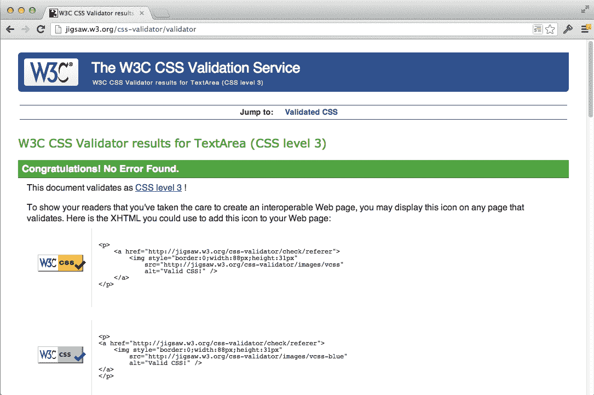
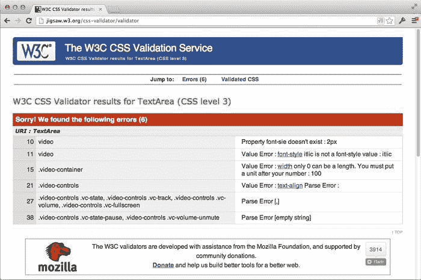
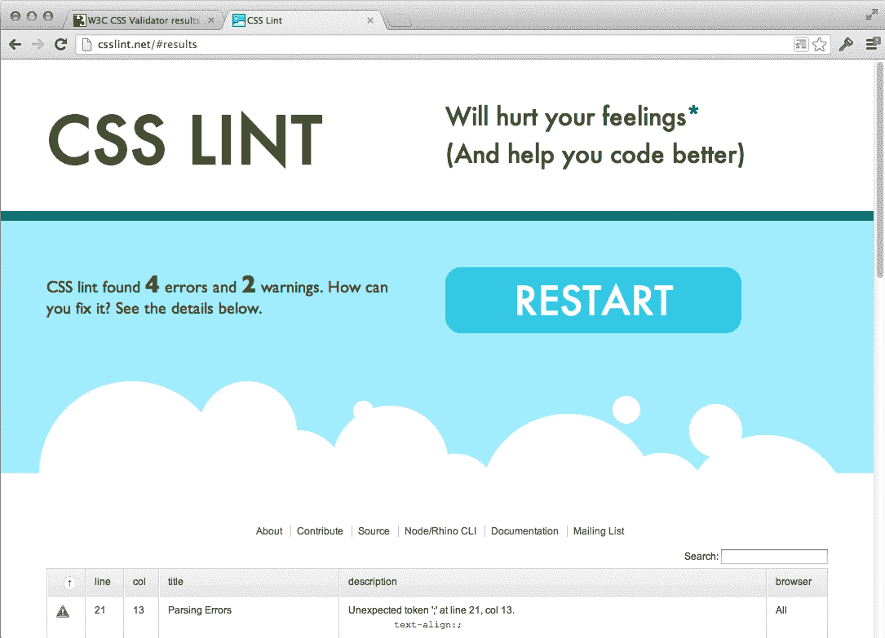
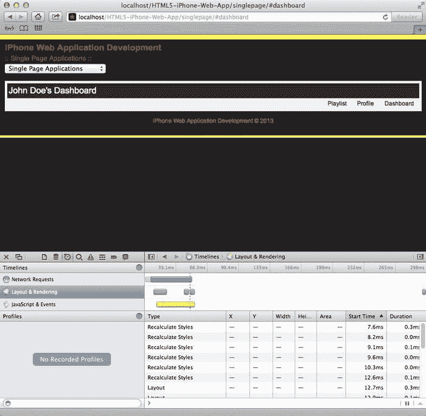
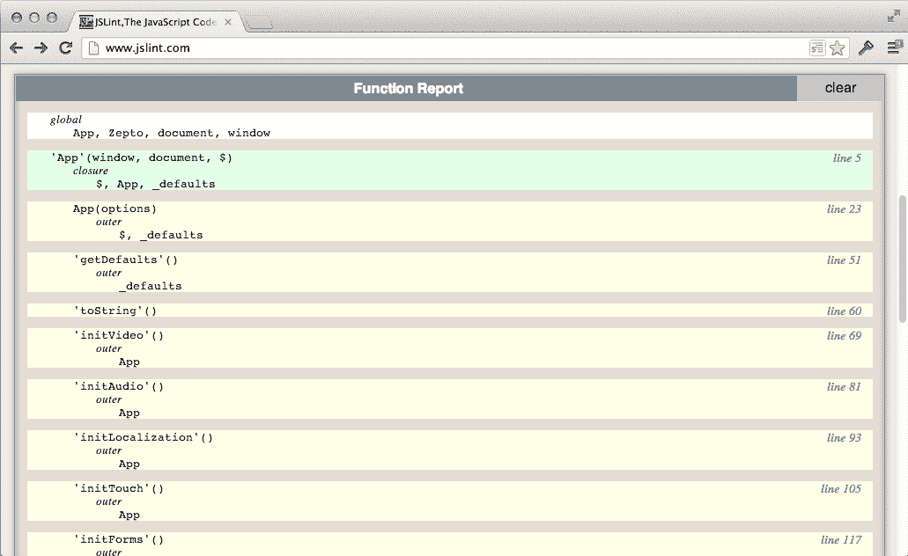
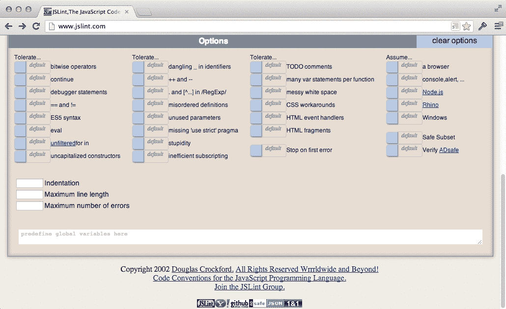

# 九、整理和优化代码的原则

在整本书中，我们从应用开发的一开始就强调了优化的重要性。虽然我们已经讨论了从在 JavaScript 中缓存元素到模块化我们的风格的主题，但在这一章中，我们想总结一下书中使用的技术。毕竟，性能在我们的移动应用中非常重要，原因有几个。在这一章中，我们将讨论优化我们的风格、脚本和媒体。除了涵盖优化技术之外，我们还将讨论一些好的编码标准，这些标准可以增强代码库的可维护性，同时还能提高性能。我们将从讨论样式表开始。

在本章中，我们将涵盖以下主题:

*   正在验证 CSS
*   分析 CSS
*   CSS 最佳实践
*   验证 JavaScript
*   剖析 JavaScript
*   JavaScript 最佳实践

# 优化样式表

传统上，风格没有经过任何预先考虑就被“植入”到 web 应用中。通常，我们只是设计页面风格，而没有考虑模块化、可重用性和可维护性。然而，由于当今 web 应用的广泛性，这已经不再被接受。

在这本书里，我们努力遵守一些行业标准，比如模块化。然而，我们现在确实有工具可以帮助我们验证和描述我们的风格。从分析一个示例 CSS 文件开始，我们可以优化这些样式；这就是我们在本章这一节的目标。

## 验证我们的 CSS

为了优化我们的样式表，我们需要首先验证我们的 CSS 是否有效并符合当今的标准。我们可以使用各种工具来验证我们的风格，包括 W3C CSS Validator 和一个名为 **CSS Lint** 的工具。这两个工具都会检查你的样式表，并给你一个错误的总结，为什么是错误的，以及你应该怎么做。

### W3C CSS 验证器

要访问 W3C CSS 验证器，您可以访问以下网址:

[http://jigsaw.w3.org/css-validator/](http://jigsaw.w3.org/css-validator/)

下面的截图显示了 W3C 验证器的默认视图，它允许你进入包含样式的页面的 URI。它将自动提取您的样式表，并根据 W3C 规范对它们进行验证。然而，我们并不仅仅局限于让我们的页面可以在一个实时或生产就绪的网站上抓取。我们还可以选择上传我们的样式表，或者将它们直接放入这个应用。


W3C CSS 验证器-URI 视图

在下面的视图中，您可以看到我们可以通过文件上传过程来验证样式。这将使简单地通过后端的处理器运行这些样式表，以检查样式是否有效；一旦这个过程完成，我们就会得到结果。


W3C CSS 验证器–文件上传视图

最后，我们可以选择直接将我们的风格插入到工具中，根据项目和团队或个人的需求，这可能是最快和最简单的解决方案。我们不必担心样式被以任何方式剥离或修改；文本字段将正确处理您的所有输入。同样，与其他视图类似，一旦点击**检查**按钮，输入将通过处理器运行，并向您显示结果。


W3C CSS 验证器——直接输入视图

### 可定制选项

与任何高质量的保证工具一样，我们需要能够定制该工具的选项来满足我们的需求。在这种情况下，我们有多种选择，包括:

*   **配置文件**:该选项指定验证样式时要使用的配置文件，例如，CSS Level 1、CSS Level 2、CSS Level 3 等。
*   **警告**:该选项指定报告中要显示的警告，如正常、最重要、无警告等。
*   **中等**:该选项指定样式表应该代表的媒介，例如，屏幕、打印、手持等等。
*   **供应商扩展**:该选项指定在报告中处理供应商扩展(`-webkit-`、`-moz-`、`-o-`)的方式，例如警告或错误。

### 验证一个成功的例子

让我们看一个成功的验证例子。首先，我们用上一章创建的一些样式来看看这个 CSS 是否通过验证；具体来说，让我们使用`singlepage.css`文件内容并将其粘贴到 W3C 验证器的直接输入视图中，并使用默认选项运行它。

当我们运行验证器时，我们的结果应该如下所示:



W3C CSS 验证器——成功验证

如您所见，输出是成功的，并且通过了 CSS Level 3 规范。太神奇了，我们甚至从验证者那里拿到徽章放在我们的网站上！但是不要那样做；即使你应该拍拍自己的背，但这是我们大多数人在网站上并不真正喜欢的东西。现在我们来看一个不成功的例子。

### 验证一个不成功的例子

在编程中，错误无时无刻不在发生，因此我们在样式、脚本和标记中遇到验证错误是很自然的。因此，让我们来看看 W3C CSS Validator 中的验证错误示例是什么样子的。对于这个例子，我们将使用我们在[第二章](02.html "Chapter 2. Integrating HTML5 Video")、*中创建的`video.css`文件的变体，集成 HTML5 视频*。出于本例的目的，我用以下样式介绍了几个错误:

```html
video {
  display: block;
  width: 100%;
  max-width: 640px;
  margin: 0 auto;
  font-size: 2px;
  font-style: italics;
}

.video-container {
  width: 100;
}

.video-controls {
  margin: 12px auto;
  width: 100%;
  text-align:;
}

.video-controls .vc-state,
.video-controls .vc-track,
.video-controls .vc-volume,
.video-controls .vc-fullscreen, {
  display: inline-block;
  margin-right: 10px;
}

.video-controls .vc-fullscreen {
  margin-right: 0;
}

.video-controls .vc-state-pause,
.video-controls .vc-volume-unmute {
  display: none;
```

当我们通过 W3C CSS 验证器传递前面的样式时，我们会得到以下结果:



W3C CSS 验证器——验证失败

在前面的示例中，我们得到了几个值、属性和解析错误，所有这些都可以通过这个不成功的验证示例中给出的引用轻松解决。这样做的好处是，不要试图找出可能破坏布局的原因，对屏幕截图中显示的错误进行简单的修复可能会解决您的所有问题。

从某种意义上来说，这基本上是您确保您的 CSS 在多个浏览器中有效和兼容所需要的全部。然而，如果你能防止这些错误发生呢？嗯，有一个工具，CSS Lint。

### CSS 功能区

在大多数情况下，我们希望避免在编码时一起出现错误，用某种工具尽早发现这些错误是有帮助的。CSS Lint 就是那个工具，事实上可以在你选择的文本编辑器或者 ide 里面使用。CSS Lint 不仅会根据 CSS 的某些原则(比如盒子模型)检查您的样式，还会进行大量的语法检查，帮助您有效地调试您的样式。

> CSS Lint 指出了你的 CSS 代码的问题。它进行基本的语法检查，并对代码应用一组规则来寻找有问题的模式或低效的迹象。这些规则都是可插入的，所以你可以很容易地编写自己的规则或者省略你不想要的规则。

关于 CSS Lint 的详细信息可以在[https://github.com/stubbornella/csslint/wiki/About](https://github.com/stubbornella/csslint/wiki/About)找到。

类似于 W3C CSS Validator，CSS Lint 有它自己的站点，在那里你可以将你的样式复制粘贴到一个文本区域，并让处理器检查你的样式。我们与之交互的页面如下所示:


CSS 功能区

### 可定制选项

CSS Lint 还附带了可定制选项，这些选项非常广泛，您可以根据自己或团队的需求进行定制。可定制选项有六个部分，包括**错误**、**可维护性&重复**、**兼容性**、**可访问性**、**性能**和 **OOCSS** ( **面向对象 CSS** )。

可定制的选项位于 **Lint 的正下方！**按钮:


CSS Lint 选项

检查适当的选项使引擎能够根据这些属性进行验证。通常这些选项因项目而异；例如，您可能正在处理一个应用，该应用要求在某些元素上设置填充和宽度，因此，取消选中**小心断框大小**选项可能更适合您，这样您就不会出现多个错误。

#### 使用 CSS Lint 验证一个成功的例子

当我们定制我们的选项并通过 CSS Lint 传递页面时，使用符合标准的适当样式表，同时也迎合团队的需求，我们应该会收到一个成功的验证，例如下面的截图:


CSS Lint–成功验证

在上面的例子中，我们的 CSS 样式通过了，不需要额外的信息。然而，当我们的 CSS 没有通过验证时会发生什么？

#### 使用 CSS Lint 验证一个不成功的示例

如果我们采用上一节为 W3C CSS Validator 创建的替代视频样式，并通过 CSS Lint 传递它们，我们会得到以下结果:



CSS Lint–验证不成功

但是，仅仅因为我们收到了 4 个错误和 2 个警告并不代表我们无能为力。事实上，当我们向下滚动页面时，我们会看到一个需要处理的项目列表；它还包括问题的类型、描述和错误发生的线路:


CSS Lint–不成功的验证列表

#### 集成 CSS Lint

虽然我们有一个**图形用户界面** ( **图形用户界面**)可以用来验证我们的风格，但是如果我们能够用我们的个人开发工作流来简化这个过程，那么会更容易。例如，如果我们在文本编辑器或**集成开发环境** ( **IDE** )中保存样式表时，可以验证我们的 CSS，那就太好了。CSS Lint 具有很强的可扩展性，允许我们实现这些集成的工作流。

一些 ide 和文本编辑器供应商已经实现了 CSS Lint，包括崇高文本、Cloud 9、微软 Visual Studio 和 Eclipse Orion。虽然将 CSS Lint 安装和设置到您喜欢的工具中不在本书的讨论范围内，但是您可以在这里查找所有需要的信息:

[https://github . com/stubornella/csslint/wiki/IDE-集成](https://github.com/stubbornella/csslint/wiki/IDE-integration)

## 分析我们的 CSS

以前，描述你的 CSS 是非常困难的，事实上可能是不可能的。但是随着浏览器调试工具的进步，我们现在能够在某种程度上分析样式表。在本节中，我们将回顾如何拍摄我们的风格简介，并阅读在苹果电脑上的 Safari 浏览器中呈现给我们的信息。

在接下来的屏幕中，我们将简要介绍如何将概要分析用于样式，以及 Safari 浏览器如何向我们呈现这些信息。我们将只关注我们风格的布局和渲染。使用我们之前构建的单页应用，我们将查看我们的样式的有效性，并了解我们的样式在如何与应用的表示层相关联方面的弱点和优势。

让我们从打开 Safari 调试工具并在配置文件选项卡(时钟符号)上查看单页应用的仪表板视图开始。



Safari 分析工具

当我们第一次加载单页应用并查看页面加载的概要时，我们会看到三个不同的时间表，包括**网络请求**、**布局&渲染**和T5】JavaScript&事件。出于我们的目的，让我们看看**布局&渲染**。

当我们查看**布局&渲染**时间线时，我们可以看到页面加载时进行重画和重新样式计算的位置。调试器还让我们知道运行的是什么类型的进程，何时运行，以及更改的属性，包括开始时间和持续时间。当在我们的页面上寻找性能漏洞时，这些都是非常有用的。但是，运行时分析呢？调试器必须这么做。

事实上，在我们的左侧栏中，在与**配置文件**选项卡相同的线上有一个圆圈，允许我们配置我们的 JavaScript 或 CSS。这很好，因为当我们启用它时，我们将在运行时开始分析应用。因此，假设我们启用了 CSS 的概要分析，然后在我们的应用中，单击**概要文件**选项卡切换页面视图；我们肯定会在视图中执行一些改变，这将使我们的风格发生变化。当我们这样做并停止 CSS 分析时，我们会得到以下结果:


Safari 分析工具–运行时分析

当我们分析我们的配置文件时，我们会看到正在使用的选择器、它呈现的总时间、页面上匹配的数量以及它的来源。这是一个关于发生了什么类型的处理的很好的分解，并且让我们很好地了解每个选择器查找和渲染所花费的时间，让我们很好地了解可以改进什么。给定的情况下，我们这本书的应用很小，但是如果您正在处理一个包含复杂动画或呈现数千行数据的应用，这将有助于调试您的移动应用。

一旦我们对应用的瓶颈有了一个好的概念，我们就需要做些什么。拥有这些信息可以为我们提供关于应用性能和我们应该关注的重点的重要信息。优化阶段基于每个团队或个人面临的问题和需求，因此在下一节中，我们将讨论一些优化技术，这些技术可用于更快地渲染和匹配我们的风格。

## 优化我们的 CSS

在本节中，我们简要回顾一些行业标准，这些标准通过提供高效、可维护和精心制作的模块化风格来帮助我们优化应用渲染时间。这些标准已经被业内知名的个人和组织广泛讨论，并最终被各种框架所采用。当然，这里讨论的标准可能会随着时间的推移而改变，浏览器会实现更好的处理方法，使新技术变得更快、更高效，但对于任何希望创建满足当今需求的样式表的人来说，这应该是一个很好的开始指南。

### 避开普遍规则

不要在规则中使用`*`选择器。它们选择 DOM 中的每个元素，因此它们的遍历方法效率很低。

例如，以下情况效率极低:

```html
header > *
```

前面的代码效率低的一个原因是，它使用了通用选择器。因为 CSS 从右向左读取，所以引擎会说“让我们拾取所有元素，然后看看它们是否与 header 元素直接相关。”因为我们需要遍历整个 DOM，所以这个选择器的呈现比下面这样的东西要慢得多:

```html
header > h1
```

## 不符合身份或类别规则

限定一个 ID 或类涉及到用适当的选择器直接附加标签名，但是效率极低，原因与前面的规则相同。

例如，以下所有选择器都是坏的:

```html
input#name-text-field

.text-field#name-text-field

input.text-field

.text-field.address-text-field
```

尽管其中一些看起来很诱人，但它们是不必要的，也是低效的。但是，这里有一个例外；如果我们想通过向元素添加一个类来改变样式，那么限定一个类可能是必要的。无论哪种方式，我们都可以执行以下操作来更正前面的合格标识或类。

```html
#name-text-field

.text-field

.text-field.address-text-field
```

正如上一段中提到的，当通过 JavaScript 根据用户操作更改元素的样式时，最后一个选择器可能更有用。

### 千万不要用！重要的

这条规则不言自明。使用它来覆盖样式肯定很有诱惑力，但是不要；随着您的应用越来越广泛，这只会引起麻烦。为此，请查看下一条规则。

### 模块化风格

创建通用于 web 应用或网站的样式非常容易；然而，如果我们开始从模块化的角度来思考，我们就开始创建为该应用的一部分保留的风格。例如，以一个表单及其输入为例，假设我们希望站点上的所有表单都包含带有棕色边框的文本字段。我们可以做到以下几点:

```html
form .text-field { border: 1px solid brown; }
```

现在我们已经在一个`form`元素中保留了类`.text-field`的所有字段来包含这个样式。因此，如果任何带有类`.text-field`的输入字段在这个选择器之外，那么我们可以按照我们想要的任何方式来设置它们的样式。或者另一方面，我们可以像这样覆盖样式:

```html
form .personal-information .text-field { border: 1px solid blue; }
```

现在，如果我们在最初的样式之后包含这种样式，它将优先，因为我们实际上正在使用级联原则，使我们的样式更加高效和易于管理。

### 类型

请记住，后代选择器是最昂贵的选择器。然而，它们非常通用，因此我们不应该为了高效的 CSS 而牺牲可维护性或语义。

在大多数情况下，这些规则应该就足够了，但是您很可能会发现实现业内其他一些最佳实践是很有用的。当然，您应该使用为您使用的框架所采用的实践，或者更好的是，适合您的团队。我发现这些非常有帮助，也是一个很好的起点，我鼓励你们根据自己的意愿进行研究和实验。现在，让我们看看如何为我们的应用优化 JavaScript。

# 优化 JavaScript

既然我们已经介绍了样式表的优化，那么让我们来看看我们的脚本。JavaScript 也有一段没有任何预先考虑或计划就被放到页面上的历史，总的来说导致了这种语言的坏名声。但同样，由于 web 应用的复杂性，开源社区帮助塑造了这种语言。

在整本书中，我们采用了几个行业标准，包括名称空间、闭包、缓存变量等等。然而，同样重要的是，我们要验证和分析我们的脚本，以便对它们进行优化。在本节中，我们将详细介绍这一点，并希望涵盖制作高性能移动应用所需的要点。

## 使用 JSLint 验证 JavaScript

近年来，各种工具问世，帮助我们验证我们的 JavaScript。像 JSLint 和 JSHint 这样的工具已经被创建出来来帮助我们编码，类似于 CSS Lint。但是我们为什么要使用这些工具，尤其是对于 JavaScript？JSLint 的网站([http://www.jslint.com/lint.html](http://www.jslint.com/lint.html))提到了该工具背后的推理:

> JavaScript 是一种年轻的语言。它最初是为了在网页中做小任务，对于这些任务来说，Java 太重太笨拙了。但是 JavaScript 是一种能力惊人的语言，现在它正被用于更大的项目中。当项目变得复杂时，许多旨在使语言易于使用的特性是很麻烦的。需要一个 JavaScript 的 lint:JSLint，一个 JavaScript 语法检查器和验证器。

JSLint 的网站也提到以下内容:

> JavaScript 是一种草率的语言，但它里面有一种优雅的、更好的语言。JSLint 帮助您用更好的语言编程，并避免大部分溢出。JSLint 会拒绝浏览器会接受的程序，因为 JSLint 关心的是你的代码质量，而浏览器不关心。你应该接受 JSLint 的所有建议。

为了测试我们的 JavaScript，我们可以轻松地访问 JSLint 的网站([http://www.jslint.com/](http://www.jslint.com/)):


JSLint 网站

如您所见，JSLint 与 CSS Lint 非常相似，以这种方式，您真正需要做的就是将您的 JavaScript 输入到页面上，结果将显示给您。所以让我们看看成功的和不成功的输出会是什么样子。

### 使用 JSLint 验证一个成功的例子

在我们的例子中，我们将利用我们的 JavaScript 来测试 JSLint 实用程序。当我们运行这个文件时，一个成功的输出将详细说明在整个闭包中使用的方法、变量和属性。我们来看看下面的截图:



使用 JSLint 成功验证–方法和变量

前面的例子是使用 JSLint 成功验证的俯视图。验证器将向我们返回一个列表，以所有全局对象的列表开始。然后，它将继续列出方法、变量以及每种方法的一些细节。例如，`initVideo`返回`this`或者`App`的一个实例等等。


使用 JSLint 属性成功验证

### 验证一个不成功的例子

以为例，不修改 JSLint 选项的前一个例子会产生几个错误。这些错误主要是处理器不知道的空白、间距和全局对象。


JSLint–验证不成功

根据前面的输出，错误以红色列出，并带有错误发生的描述、示例代码和行号，允许您轻松调试应用。现在，假设我们不希望空白或间距实际上影响我们验证的结果；然后我们可以为 JSLint 定制选项。

### 可定制选项

与我们在本章中讨论的大多数工具一样，JSLint 也附带了一些选项，可以根据我们的需求进行定制。让我们简要回顾一下通过网站可以获得的一些选项。



JSLint–选项屏幕

我们可以选择的选项非常多，从空白格式到我们放入 JavaScript 的`TODO`注释的正确性。当然，在测试时，这些选项中的一些可能不符合我们的需求，但总的来说，它们非常有助于保持一致的编码标准，从而提供跨平台的有效脚本。

### 集成 JSLint

与 CSS Lint 类似，JSLint 可以在您的 IDE 或文本编辑器中使用——无论您喜欢哪种环境。许多供应商已经为这些工具创建了插件或扩展，允许您在键入或保存代码时轻松地清理掉代码。例如，Sublime Text 有一个`SublimeLinter`包，它附带了 CSS Lint、JSLint 以及其他一些可以帮助你更高效地编码的工具。这怎么可能？

*JSLint 可以在 JavaScript(或 Java)可以运行的任何地方运行。参见例如*[https://github.com/douglascrockford/JSLint/wiki/JSLINT](https://github.com/douglascrockford/JSLint/wiki/JSLINT)。

有关更多详细信息，请参考以下内容:

[https://github . com/doulascrokford/jslint](https://github.com/douglascrockford/JSLint)

本质上，JSLint 是一种 JavaScript 方法，可以在代码中传递，然后由 JavaScript 本身进行评估，这使得处理您的代码和集成到其他环境中变得极其高效。因此，如果您的文本编辑器或集成开发环境还没有它，您可以很容易地创建一个扩展来帮助您使用 JSLint 高质量地编码。

## 剖析我们的 JavaScript

与 CSS 分析一样，在网络的旧时代，测试 JavaScript 的性能是非常困难的。然而，这些天我们真的不需要太担心它，因为几乎每个浏览器调试器都实现了一种分析您的脚本的方法。使用 Safari 的内置调试工具，我们将了解如何调试应用的脚本性能。

在下面的示例中，我们将只查看我们之前构建的单页应用上的 JavaScript 的概要分析，类似于我们在上一节中对样式的概要分析。


Safari 分析工具–JavaScript

前面的截图是对页面加载脚本的回顾。当我们回顾 **JavaScript &事件**时间线时，我们会看到每个脚本的类型、细节、位置、开始时间和持续时间的细分，这有助于脚本的时间线结果。虽然开始时间是我们肯定想知道的，以便了解什么可能会阻塞脚本(其他脚本)，但是持续时间可能更重要，因为如果不是异步引入的话，每个脚本都会阻塞页面呈现的过程。

除了查看脚本对页面加载影响的性能之外，我们还可以分析脚本执行的功能。例如，假设当我们点击应用中的**配置文件**按钮时，我们想要检测我们的方法是如何执行的。通过点击 **配置文件**选项卡中的圆圈，并为我们的 JavaScript 启用配置，这可以很容易地使用与配置你的 CSS 相同的技术来完成；我们将能够看到所有调用的方法及其性能。


Safari 分析工具–JavaScript 运行时

基于我们前面的用例，我们可以非常容易地详细说明我们的应用的性能。从这个例子中我们可以收集到，我们的 `onProfileClick`事件大约需要 8.40 ms 来执行，并且被调用一次。然而，更大的情况是，我们可以看到所有被调用的方法和执行的顺序——这些信息可以用来帮助检测内存泄漏和性能优化，这对我们的应用是必要的。

您可以从这些非常基本的示例中看到，调试我们的应用以获得性能比以往任何时候都更容易。我们可以分析我们的 JavaScript，找出我们的应用是如何工作的，并我们代码的效率。但是现在我们有了这些信息，我们能做些什么来改善我们的代码库呢？这就是我们在下一节中要解决的问题，我们都可以使用一般的优化技巧来使我们的应用在不牺牲代码质量的情况下表现得更好。

## 优化我们的 JavaScript

JavaScript 是高度可扩展的，允许我们做几乎任何我们想做的事情——这很棒，但也可能是极其有害的。例如，你很容易忘记在变量前面使用关键字`var`。然而，我们不想这样做，因为这将使我们的变量在全局范围内可用，这可能会导致与可能使用完全相同变量名的其他脚本的冲突。我们也可以很容易地用`try...catch`语句包装我们的 JavaScript，这并不是最好的做法，因为我们没有弄清楚问题是什么。或者，如果我们想的话，我们可以`eval`或者在没有任何错误检查的情况下非常容易地评估一串 JavaScript。

出于这个原因，业界已经采用了多种真实且经过测试的最佳实践，由目前最常用的开源库实现，包括 jQuery、主干和下划线。在这一节中，我们简要回顾了我在本书中所依据的实践，以及我认为对任何应用的成功都至关重要的实践。

### 避开全局

在全局范围内，或者在我们在应用中创建的闭包之外，创建所有的变量和函数是极其容易和诱人的。但是不要那样做；这是一个可怕的想法，在社区中被人看不起，原因有几个。例如，如果一个变量保持在全局范围内，它必须在应用的整个执行过程中得到维护，从而降低应用的性能。

所以与其这样做:

```html
Var Modal = function(){};
```

你应该这样做:

```html
(function(){ function Modal(){} }());
```

前面的技术和我们一直在做的非常相似。事实上，这就是我们所说的闭包或**立即调用的函数表达式**(**life**)。当我们将一个方法包装在括号内，然后使用`()`调用它时，我们会立即调用该方法并创建一个新的包含范围，因此这些括号内的任何内容在全局范围内都不可用，这使得我们的代码更容易管理。

### 别管 DOM

嗯，我们可能不会这么做，但我们绝对应该把它控制在最低限度。访问 DOM 是非常昂贵的，并且是应用性能的一个问题。让我们看一个用例，比如更新一个信息列表。

避免这样做:

```html
var $list = $('ul');

for (var i; i < 100; i++) {
  var li = '<li>' + i + '</li>';

  $list.append(li);
}
```

相反，您应该这样做:

```html
var $list = $('ul'),
  liArray = [];

for (var i; i < 100; i++) {
  liArray.push('<li>' + i + '</li>');
}

$list.append(liArray.join(''));
```

两者的区别在于，前者在我们每次创建列表项时都会接触到 DOM，而后者会将每一项推送到一个数组中，而在追加时，会用一个空字符串连接数组，只接触 DOM 一次。

### 使用文字

这可以在我们这本书的整个代码库中看到。因为我们不使用`new`关键字，所以效率更高。例如，我们不是通过 new 关键字声明一个新变量，而是使用`Array`文字，如下所示:

```html
var arr = []; // not new Array();
var str = ''; // not new String('');
```

### 模块化功能

为了保持代码的模块化，您需要确保每个函数或类都有一组特定的功能来实现。大多数情况下，每个函数应该有 10 到 15 行代码来实现某个目标。

例如，您可以编写以下功能:

```html
function init() {
  var $list = $('ul'),
    liArray = [];

  for (var i; i < 100; i++) {
    liArray.push('<li>' + i + '</li>');
  }

  $list.append(liArray.join(''));	

  $list.on('click', function() {
    // do something
  });
}
```

我们可以这样做，而不是编写前面的代码:

```html
function populateLists() {
  var $list = $('ul'),
    liArray = [];

  for (var i; i < 100; i++) {
    liArray.push('<li>' + i + '</li>');
  }

  $list.append(liArray.join(''));	

  return $list;
}

function attachListsEvents($list) {
  $list.on('click', doSomething);
}

function doSomething(e) {
  // do something
}

function init() {
  var $list = populateLists();

  attachListsEvents($list);
}
```

如您所见，代码已经被模块化以实现特定的功能集，允许我们创建方法，这些方法运行一组特定的指令，每个方法都通过名称来描述这些指令。这对于在提供有效功能的同时维护我们的代码库非常有用。

# 总结

在本章中，我们考虑了应用各个部分的性能优化，包括样式、脚本和媒体。我们检查了验证、优化和剖析我们的风格和脚本。此外，我们简要介绍了如何优化我们的媒体，包括图像、音频和视频。现在我们已经对整本书中用于优化应用的技术有了坚实的理解，在下一章中，我们将看看可以帮助我们使用 HTML5、CSS3 和 JavaScript 交付本机应用的框架。