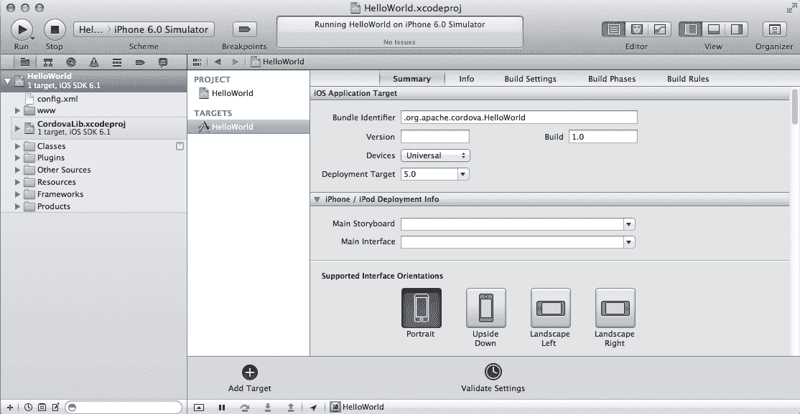
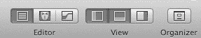
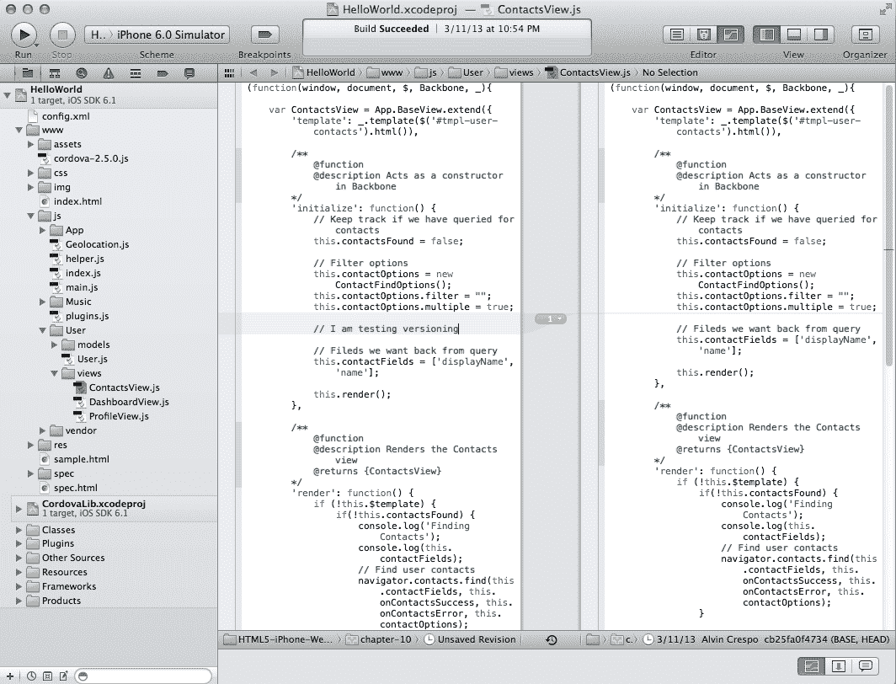
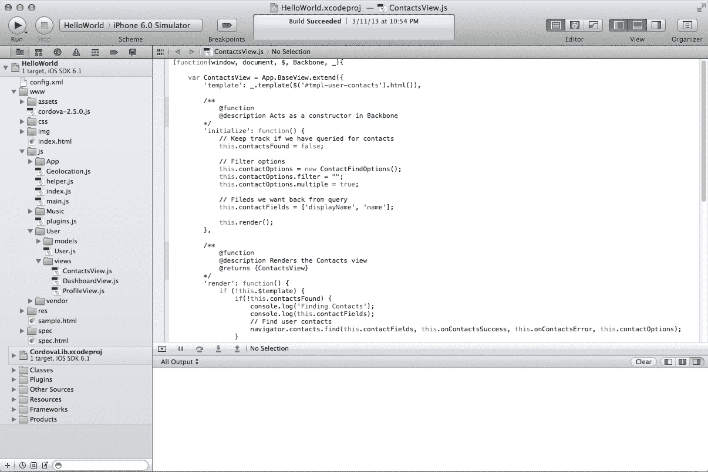
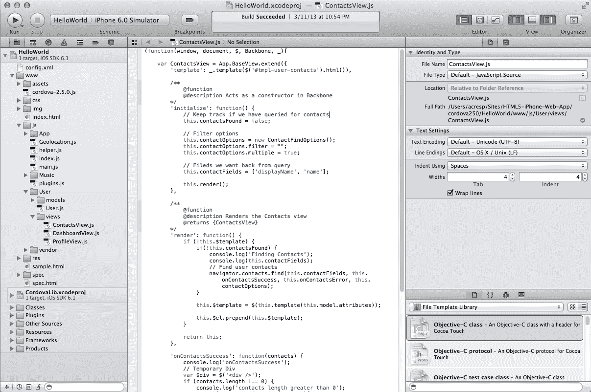
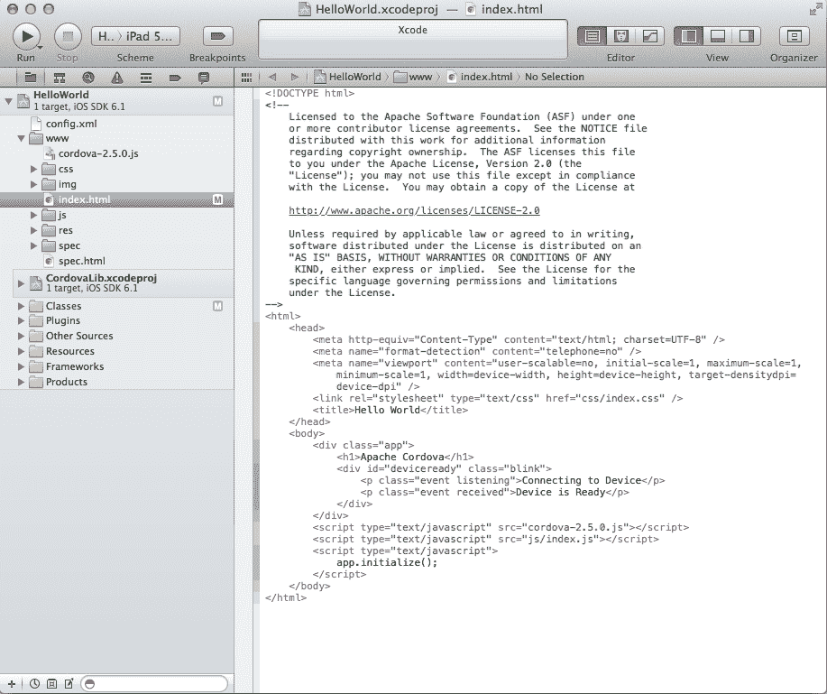
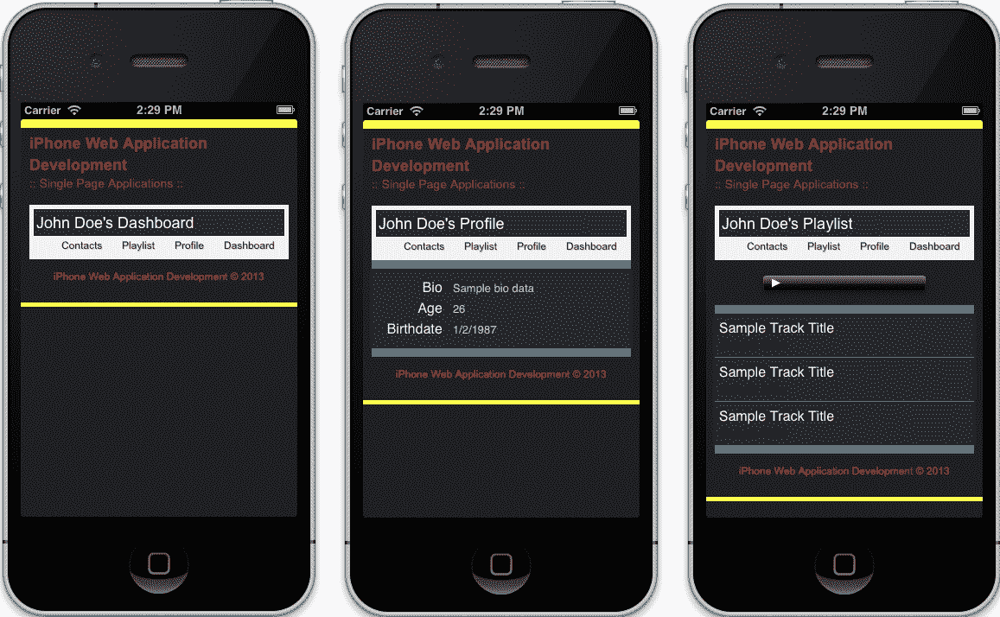
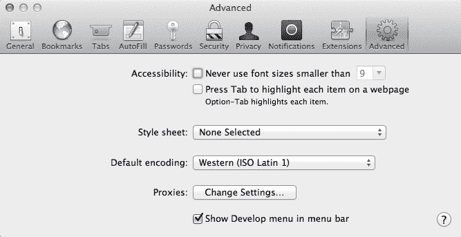
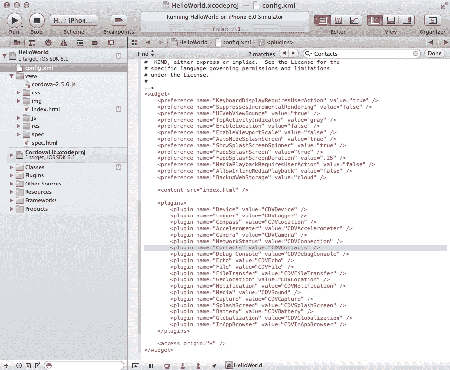

# 第十章。创建本机 iPhone 网络应用程序

在本章中，我们将使用 PhoneGap 框架将 iOS Safari 的本机应用程序转移到本机环境。我们将深入研究开发环境的设置，包括 Xcode IDE 的设置和 iOS 模拟器的使用。我们将构建一个`HelloWorld`示例来演示快速开始是多么容易，然后转移我们的单页应用程序，内置于[第 7 章](07.html "Chapter 7. One-page Applications")、*单页应用程序*。一旦我们对本地应用程序开发有了坚实的基础，我们将通过使用 PhoneGap 的联系人应用编程接口引入我们的联系人并显示他们的一些信息来增强单页应用程序的本地功能。

我们旨在帮助您使用单个代码库实现原生应用程序的一致外观。这里的目标是让您开始使用您已经逐渐喜欢并理解的网络编程语言进行本地应用程序开发。考虑到这一点，让我们从设置我们的开发环境开始。

在本章中，我们将介绍:

*   Xcode 安装
*   使用 iOS 模拟器
*   实施 PhoneGap
*   创建一个`HelloWorld`示例
*   传输当前应用程序，包括 CSS、JavaScript、HTML 和资产
*   使用 PhoneGap 中的联系人应用编程接口绑定到本机功能

# 设置开发环境

如同任何创建软件的工作流程一样，我们的开发环境至关重要。因此，让我们花一些时间设置许多工程师喜欢的环境来创建本地应用程序。在本节中，我们将讨论 Xcode 的安装，以及集成开发环境(IDE)的概述。我们将继续建立 PhoneGap 框架，最后看看 iOS 模拟器如何在测试我们的应用中发挥关键作用。另外，我们将在本章中研究如何配置我们的应用程序来满足我们的需求。让我们开始吧。

## 开始使用 Xcode

Xcode 是 iOS 操作系统上本机应用程序开发的首选集成开发环境，因为它得到了苹果的积极支持，并且专门针对 OS X 和 iOS 操作系统量身定制。 IDE 由苹果提供，可用于创建 Mac OS X、iPhone 和 iPad 应用程序。虽然它也可以用于其他各种类型的开发，但这三个平台通常与 Xcode 相关联。默认情况下，您的苹果电脑没有 Xcode，所以我们需要安装它。

### 安装 Xcode

幸运的是，Xcode非常容易安装。我们可以通过 Mac 应用商店([https://itunes.apple.com/us/app/xcode/id497799835?ls=1&mt = 12](https://itunes.apple.com/us/app/xcode/id497799835?ls=1&mt=12))安装 IDE。安装完成后，我们将在电脑上安装各种软件，包括仪器分析工具、iOS 模拟器和最新的 **Mac OS X 和 iOS 软件开发工具包** ( **SDK** )。

### Xcode IDE 概述–基础知识

默认情况下，Xcode IDE 安装在应用程序目录中；通过双击显示的图标启动它。图标是一个锤子，位于蓝色技术绘图的对角线上，有铅笔、画笔和尺子组成字母 a。当应用程序启动时，我们将看到欢迎屏幕。


欢迎屏幕

这是 Xcode 的欢迎屏幕，它列出了最近的项目以及创建新项目、连接到存储库、了解 Xcode 或查看苹果开发者门户的能力。在你的屏幕上，你很可能没有前面截图中列出的`HelloWorld`项目，这是我们将要构建的，如果这是你的第一次，这应该是空的。

### 类型

因为这一部分是为了让我们熟悉 Xcode 本身，所以不要对接下来的几个屏幕犹豫不决。接下来的屏幕是我们将构建的，但只是为了帮助我们识别 Xcode 应用程序的某些部分，使您更容易使用。

#### Xcode 工作区

现在，让我们回顾一下 Xcode 的用户界面，以了解我们如何利用这个强大的工具。首先，正如我们已经知道的，当我们打开应用程序时，我们会被引入欢迎屏幕。您可以通过在欢迎屏幕上取消选中当 Xcode 启动复选框时**显示该窗口来选择禁用该功能。但是当我们有一个项目，我们已经创建了开放，这是它的样子:**



项目显示

看起来很简单，对吧？这很好，因为这被称为工作空间，这很重要，因为 Xcode 的目标是让所有的开发工作都位于集成开发环境的一个中央窗口中，帮助我们巩固和加快开发过程。但是要认识到这个工作区的两个关键方面:导航区域位于我们所有文件所在的左侧，然后是编辑器区域，我们可以在这里编辑我们所在的项目。


导航器和编辑器区域

前面的截图帮助演示了开发应用程序时 Xcode 最关键的两个方面。请记住，根据所选的文件，您的编辑器区域会发生变化。例如，在前面的截图中，我们有一个图形用户界面，允许我们设置项目的属性。

#### Xcode 工具栏

Xcode 中的工具栏有各种特性，我们在开发原生应用程序时会经常用到。例如，在下面的截图中，有 **【运行】****停止****断点**按钮，包括一个**方案**选择器。调试应用程序时，这些操作非常重要。**运行**按钮完全按照它说的做，它运行你的应用程序。**停止**另一方面将停止所有运行应用程序的活动。并且**断点**按钮将在编辑器区域显示我们的断点。


显示运行、方案和断点的工具栏

**方案**选择器让你选择测试哪个应用程序，在什么环境下测试。在我们的示例应用程序中，`HelloWorld`将使用 iPhone 6.0 模拟器进行测试，但是我们有各种选项可供选择。看下面的截图，我们可以看到，如果安装了，我们可以使用 iPad Simulator 和它的各种版本，以及 iPhone Simulator 来测试我们的应用程序。


工具栏方案选择器

工具栏在集成开发环境的右侧还有各种操作，包括编辑器视图、常规视图和管理器。默认的编辑器视图是一个文本编辑器组件，允许我们对源文件进行基本编辑。中间的编辑器视图是助理编辑器，我们将不涉及它。最后一个编辑器视图是版本编辑器。



工具栏项目显示选项

版本编辑器非常适合我们作为开发人员使用，允许我们编辑文件并立即看到版本控制的发生。例如，在下面的截图中，我们可以看到添加了一个注释，并且原始版本化文件正在通知用户在哪里进行了更改，从而允许我们看到同一文件的实时编辑。



项目版本控制显示

转到**视图**工具栏部分，我们有三个按钮。每个按钮显示了编辑器的某个部分，根据具体情况，它对我们很有用。默认情况下，第一个按钮被选中，因为它向我们显示了左侧的导航区域。中间的按钮显示调试区域，如下图所示:



项目调试显示

这很好，因为我们现在可以在应用程序运行时调试它，并在测试应用程序时查看日志。还记得我们在应用程序中使用的所有日志吗？他们会出现在这里；如果我们没有在浏览器中非常有用的开发人员控制台，它们将非常有用。工具栏中的最后一个按钮控制实用程序。这些实用程序帮助我们控制当前文件的各种设置；从名称到源代码控制，我们可以自定义文件的各种细节。



项目文件配置显示

好了，我们知道了 Xcode 的基本特性，还有很多需要探索的地方——这对我们这些开发人员来说既伟大又有益。我们可以继续介绍 Xcode 的所有非常有用的特性，但是为了我们的利益，让我们继续讨论 PhoneGap，毕竟我们更感兴趣的是学习构建一个原生应用程序。这些工具可以随时根据我们的需要使用和定制。

## 设置电话间隙

Xcode 非常适合在你的应用开发环境中使用。然而，PhoneGap 是所有魔法发生的地方。正是这个框架使我们能够创建基于我们已经用 HTML、CSS 和 JavaScript 编写的代码的原生应用程序。因此，让我们回顾一下如何安装它，创建一个项目，并简要回顾一下它的支持和许可，以便为我们自己的应用程序利用它的能力做好准备。

### 安装 PhoneGap

PhoneGap 非常容易上手；首先让我们从 PhoneGap 的网站安装，这里:[http://phonegap.com/download/](http://phonegap.com/download/)。当 ZIP 文件完全下载完成后，我们将希望提取其内容。现在当您开始检查提取的内容时，您会注意到有很多事情正在进行，尤其是在列出了多个操作系统的`lib`目录中。这很好，因为 PhoneGap 支持多个平台，但我们想要的是专门针对 iOS 的。我们的重点应放在以下方面:


PhoneGap 目录结构

请注意，在 iOS 目录中，我们有多个文件，所有这些文件对于我们第一个 PhoneGap 项目的创建都至关重要。在下一节中，我们将使用这个清理后的版本的 PhoneGap 框架创建我们的第一个 PhoneGap 项目。

### 创建 PhoneGap 项目

现在我们已经下载并简化了 PhoneGap 框架，我们想使用这个框架创建我们的第一个项目。为了做到这一点，我们需要我们信任的 c **ommand-line 接口** ( **CLI** )的帮助。默认情况下，所有的苹果操作系统都带有 **终端**，但是我们也可以使用 iTerm(免费)。无论哪种方式，启动位于`/Applications/Utilities/`的应用程序。

当您打开终端时，我们需要导航到您的 PhoneGap 文件所在的目录。默认情况下，这应该在我们的`Downloads`目录中，具体取决于您的浏览器设置。在这种情况下，我将使用`cd`命令导航到`/Users/acresp/Downloads`，如下所示:

```html
cd /Users/acresp/Downloads
```

一旦我们在 PhoneGap 被提取到的目录中，我们需要导航到`phonegap`内的`iOS`文件夹中查看`bin`目录。为此，我们可以键入以下内容:

```html
cd phonegap-2.5.0/lib/ios/bin/
```

现在我们可以使用`bin`文件夹中的`create`外壳脚本来构建我们的 PhoneGap 应用程序。该脚本的文档如下:

```html
#
# create a Cordova/iOS project
#
# USAGE
#   ./create <path_to_new_project> <package_name> <project_name>
#
# EXAMPLE
#  ./create ~/Desktop/radness org.apache.cordova.radness Radness
#
```

这对我们来说非常好，因为我们知道如何轻松创建应用程序。但是在此之前，让我们确保我们的应用程序目录是在我们的项目中创建的。为了本章的目的，我创建了一个`cordova250`目录，它将包含我们的`HelloWorld`应用程序，也可能包含其他 PhoneGap 项目。

现在，我们已经确定了我们的应用程序目录存在，我们可以运行以下命令来确保我们的应用程序被创建:

```html
./create ~/Sites/HTML5-iPhone-Web-App/cordova250/HelloWorld .org.apache.cordova.HelloWorld HelloWorld
```

这将在`cordova250`文件夹中产生一个名为`HelloWorld`的目录，其中包含我们开始工作所需的所有必要文件。我们现在已经创建了第一个 PhoneGap 项目。目前还没有太多事情发生，但是让我们继续；我们将很快开始开发一个本地的应用程序。首先，让我们回顾一下对这个框架的支持以及支持它的许可证。

### phone gap 许可证

您可能对 PhoneGap 许可证感到疑惑，尤其是因为我们在创建应用程序的过程中使用了许多开源项目。PhoneGap 基于阿帕奇许可证([http://phonegap.com/about/license/](http://phonegap.com/about/license/))。对我们来说更好的是，Apache 基金会为我们提供了关于什么是允许的，什么是禁止的，什么是必需的清晰而简洁的信息。直接从*常见问题*部分*是什么意思？*部分(可在[http://www . Apache . org/foundation/license-FAQ . html # what doesit mean](http://www.apache.org/foundation/license-faq.html#WhatDoesItMEAN)上获得)，我们获得了所需的所有详细信息:

> 它**允许**您:
> 
> 出于个人、公司内部或商业目的，自由下载和使用全部或部分 Apache 软件；
> 
> 在您创建的包或发行版中使用 Apache 软件。
> 
> 它**禁止**你:
> 
> 在没有适当归属的情况下，重新分发源自 Apache 的任何软件；
> 
> 以任何方式使用阿帕奇软件基金会拥有的任何标志，这些标志可能表明或暗示基金会认可您的分发；
> 
> 以任何方式使用阿帕奇软件基金会拥有的任何标记，这些标记可能表明或暗示您创建了有问题的阿帕奇软件。
> 
> 它**要求**你:
> 
> 在您可能进行的任何包含 Apache 软件的再分发中包含许可证副本；
> 
> 为包含 Apache 软件的任何发行版提供 Apache 软件基金会的明确归属。
> 
> 它**不要求**你:
> 
> 将 Apache 软件本身的来源或您可能对其进行的任何修改的来源包含在您可能汇编的任何包含它的再分发中；
> 
> 将您对软件所做的更改提交回 Apache 软件基金会(尽管鼓励这样的反馈)。

基于这些参数，我们可以继续使用 PhoneGap 创建开源软件，只要我们在每次重新分发时都包含许可证副本，只要它明确归属 Apache 软件基金会。如果您对 PhoneGap 的许可证或 Apache 2.0 许可证有任何其他问题，请访问前面的链接和 PhoneGap 的许可证页面([http://phonegap.com/about/license/](http://phonegap.com/about/license/))了解更多信息。

## 配置我们的项目

我们的项目可以是配置，以满足我们的需求，同时也满足我们用户的需求。这个过程相当简单，并在 PhoneGap API 文档网站([http://docs . PhoneGap . com/en/2 . 5 . 0/guide _ Project-settings _ index . MD . html # Project % 20 settings](http://docs.phonegap.com/en/2.5.0/guide_project-settings_index.md.html#Project%20Settings))上有详细记录。这些设置大多可以通过位于我们项目目录`/cordovar250/HelloWorld/HelloWorld/config.xml`中的`config.xml`文件轻松修改。

以下是当前可自定义的项目列表:

<colgroup><col style="text-align: left"> <col style="text-align: left"></colgroup> 
| 

偏爱

 | 

描述

 |
| --- | --- |
| `UIWebViewBounce`(布尔型，默认为**真** | 这将设置橡皮筋类型交互/弹跳动画的属性。 |
| `TopActivityIndicator`(字符串，默认为**灰色** | 这将在状态/电池条中设置旋转颤动器的颜色，有效值为**白色大**、**白色**和**灰色**。 |
| `EnableLocation`(布尔型，默认为**假** | 这决定了是否在启动时初始化地理定位插件，使您的位置在启动时更加准确。 |
| `EnableViewportScale`(布尔型，默认为**假** | 这将启用/禁用视口缩放。 |
| `AutoHideSplashScreen`(布尔型，默认为**真** | 这控制了闪屏是否通过 JavaScript API 隐藏。 |
| `FadeSplashScreen`(布尔型，默认为**真** | 这使闪屏能够淡入淡出。 |
| `FadeSplashScreenDuration`(浮动，默认为 **2** | 这表示闪屏的淡入持续时间(以秒为单位)。 |
| `ShowSplashScreenSpinner`(布尔型，默认为**真** | 这将显示或隐藏闪屏的加载微调器。 |
| `MediaPlaybackRequiresUserAction`(布尔型，默认为**假** | 这允许 HTML5 自动播放。 |
| `AllowInlineMediaPlayback`(布尔型，默认为**假** | 这控制内嵌 HTML5 媒体播放。HTML 文档中的`video`元素还必须包含`webkit-playsinline`属性 |
| `BackupWebStorage`(字符串，默认为**云**) | 如果设置为**云**，存储数据将备份到 iCloud。如果设置为**本地**，将只进行本地备份。如果设置为**无**，则不进行备份。 |
| `KeyboardDisplayRequiresUserAction`(布尔型，默认为**真** | 如果设置为**假**，当通过 JavaScript 的`focus()`调用`form`元素时，键盘将打开。 |
| `SuppressesIncrementalRendering`(布尔型，默认为**假** | 这允许在呈现内容之前接收内容。 |

# 传输网络应用程序

至此，我们已经使用 PhoneGap 和 Xcode 创建了一个示例`HelloWorld`应用程序。现在，我们将通过回顾从[第 7 章](07.html "Chapter 7. One-page Applications")、*单页申请*转移我们的单页申请来提升它。在这一节中，我们将讨论转移我们的资产，包括我们的标记、样式和脚本，然后学习如何调试我们的应用程序。最后，我们将通过使用 PhoneGap 允许我们使用已经编写的代码开发的本机功能来扩展我们的单页应用程序。

## 转让我们的资产

让我们从转移资产开始。本节将简要介绍如何用最少的努力来传递我们所写的内容。这里的目标是基本上拥有我们本地运行的相同应用程序。我们暂时不会使用 PhoneGap 的内置功能，但我们会有一个应用程序快速启动和运行。

### 包括我们的加价

我们在这里要做的第一件事是打开先前使用 PhoneGap 生成的 Xcode 项目。为此，我们首先在 Finder 中找到我们的项目，在我的例子中是`~/Sites/HTML5-iPhone-Web-App/cordova250/HelloWorld/`。找到项目后，双击`HelloWorld.xcodeproj`文件；这将在 Xcode 中启动该项目。

一旦 Xcode 启动了我们的项目，我们将看到它索引我们的文件。当它建立索引时，它不会阻止您与项目进行交互，因此您可以开始编辑文件。因此，让我们继续检查位于`www`目录中的`index.html`文件。



我们项目的初步 HelloWorld 标记

如您所见，我们已经为自己设置了一个基本模板。让我们运行这个`HelloWorld`标记来查看结果。你应该看到的第一个项目是带有默认 PhoneGap 图像的闪屏，紧接着设备准备好介绍。以下是显示结果的截图:


闪屏和设备就绪屏幕

既然我们知道我们的应用程序是用默认的标记和样式运行的，我们应该能够非常快地移动。因此，业务的第一个顺序是从[第 7 章](07.html "Chapter 7. One-page Applications")、*单页应用程序*中看到的单页应用程序屏幕中引入完整的标记。我们不会在这里回顾为该章节编写的代码，但这里有一个模板:

```html
<!DOCTYPE html>
<html class="no-js">
<head>
    <meta charset="utf-8">
    <title></title>

    <meta http-equiv="Content-Type" content="text/html; charset=UTF-8" />
    <meta name="format-detection" content="telephone=no" />
    <meta name="viewport" content="user-scalable=no, initial-scale=1, maximum-scale=1, minimum-scale=1, width=device-width, height=device-height, target-densitydpi=device-dpi" />

    <link rel="stylesheet" href="css/normalize.css">
    <link rel="stylesheet" href="css/main.css">
    <link rel="stylesheet" href="css/singlepage.css">
    <script src="js/vendor/modernizr-2.6.1.min.js"></script>
</head>
    <body>
        <div class="app">
            <div id="deviceready" class="blink">
                <p class="event listening">Connecting to Device</p>
                <div class="event received site-wrapper">
                    <header>
                        <hgroup>
                            <h1>iPhone Web Application Development</h1>
                            <h2>Single Page Applications</h2>
                        </hgroup>
                    </header>
                    <div class="content"></div>
                    <footer>
                        <p>iPhone Web Application Development &copy; 2013</p>
                    </footer>
                </div>
            </div>
        </div>
    </body>
</html>
```

请记住为了适应这个目录结构，我们做了一些修改。例如，我们使用`css/somefile.css`而不是使用`../css/somefile.css`引用我们的 CSS 文件，这同样适用于我们将要导入的任何其他资产。您还会注意到，前面的代码模板不包括我们从[第 7 章](07.html "Chapter 7. One-page Applications")、*单页应用程序*创建的模板；这是为了在如何将资产导入自己的 PhoneGap 项目方面保持前面的模板简短。

在这一点上，我们不会测试我们的应用程序，因为我们还没有完成引入我们的资产，包括样式和脚本，但是我们应该暂时做得很好。我们在这里想带走的是，导入一个已有的静态 web 应用程序就像复制粘贴一样简单，但不要让这愚弄了你；大多数应用程序并不那么简单，这个例子只是为了演示开始是多么容易。现在让我们继续导入我们的风格。

### 融入我们的风格

我们现在已经在我们的项目`index.html`文件中建立了我们的标记。这很简单；这一部分也同样容易。我们所需要做的就是包括我们的 CSS 文件，这些文件正被用于这个项目。为了让事情变得更简单，我刚刚将我们以前的所有样式表都包含在 Xcode 项目的 CSS 目录中。您的项目现在应该如下所示:


我们进口的样式表

现在我们已经将样式表导入到我们的 Xcode 项目中，我们已经进行到一半了。此时，我们需要导入我们的脚本。同样，不要在这里测试您的应用程序，因为它可能不会工作。这最后一点会让我们到达我们需要的地方，所以让我们开始导入我们的脚本。

### 插入我们的脚本

好的，我们已经导入了我们的标记和样式表——这很好。但是还有最后一块，我们的 JavaScript。最后这一部分对于运行我们的应用程序至关重要。所以，让我们从为我们的风格做同样的事情开始；只需将你所有的脚本导入到 Xcode 项目的`js`目录中。当您这样做时，结果将如下:


我们导入的脚本

我们在 Xcode 项目中有我们的脚本。但是我们仍然需要做一些配置，包括在`index.html`文件中正确引用我们的脚本，并确保我们的应用程序将相应地启动。让我们从在`index.html`文件中正确引用我们的脚本开始。

还记得我们在两个部分前用展示的默认模板转移的标记吗？我们将后退一步，再次查看该模板，只不过我们将在`body`标签关闭之前查看标记的底部。这是我们的应用程序以前包含 JavaScript 的地方；所以这里没有什么新内容，我们只是想确保文件被正确引用。只要确保在您的`index.html`文件中，您的脚本如下所示:

```html
        <!-- BEGIN: LIBRARIES / UTILITIES-->
        <script src="cordova-2.5.0.js"></script>
        <script src="js/vendor/zepto.min.js"></script>
        <script src="js/vendor/underscore-1.4.3.js"></script>
        <script src="js/vendor/backbone-0.9.10.js"></script>
        <script src="js/helper.js"></script>
        <!-- END: LIBRARIES / UTILITIES-->
        <!-- BEGIN: FRAMEWORK -->
        <script src="js/App/App.js"></script>
        <script src="js/App/App.Nav.js"></script>
        <script src="js/App/views/BaseView.js"></script>
        <!-- END: FRAMEWORK -->
        <!-- BEGIN: MUSIC PLAYLIST APPLICATION -->
        <script src="js/Music/Music.js"></script>
        <script src="js/Music/models/SongModel.js"></script>
        <script src="js/Music/collections/SongCollection.js"></script>
        <script src="js/Music/views/SongView.js"></script>
        <script src="js/Music/views/PlayListView.js"></script>
        <script src="js/Music/views/AudioPlayerView.js"></script>
        <!-- END: MUSIC PLAYLIST APPLICATION -->
        <!-- BEGIN: USER APPLICATION -->
        <script src="js/User/User.js"></script>
        <script src="js/User/models/UserModel.js"></script>
        <script src="js/User/views/DashboardView.js"></script>
        <script src="js/User/views/ProfileView.js"></script>
  <!-- END: USER APPLICATION -->
        <script src="js/main.js"></script>
        <!-- END: BACKBONE APPLICATION -->
    </body>
</html>
```

请注意这里发生的一些事情。首先，我们在最顶端包含了带有 PhoneGap 的`cordova`库；当我们试图检测一个`deviceready`事件时，这在一两个时刻将是至关重要的。接下来，我们将所有 JavaScript 源文件引用到 Xcode 项目中的`js`目录，而不是`../js`。现在，我们在这里需要做的最后一件事是确保我们的代码在设备准备好时运行，这意味着我们需要修改单页应用程序的启动方式。

为了确保我们的应用程序启动，我们需要收听由 PhoneGap 事件提供的`deviceready`事件。一旦科尔多瓦完全加载，就会触发此事件。这是非常重要的，因为在加载本机代码时，DOM 不会被加载，并且会显示初始屏幕。因此，当在加载 DOM 之前需要 Cordova 函数时，我们可能会遇到问题。因此，出于我们的目的，我们将听取`deviceready`事件，然后开始我们的应用程序。这可以通过以下代码来完成:

```html
<script>
    (function(){
     document.addEventListener('deviceready', onDeviceReady, false);

     function onDeviceReady(){
        console.log("onDeviceReady");
        var parentElement,
            listeningElement,
            receivedElement;

        parentElement = document.getElementById('deviceready');
        listeningElement = parentElement.querySelector('.listening');
        receivedElement = parentElement.querySelector('.received');

        listeningElement.setAttribute('style', 'display:none;');
        receivedElement.setAttribute('style', 'display:block;');

        // Start our application
        Backbone.history.start();
     }
    }());
</script>
```

让我们一行行地检查这段代码。首先，我们创建一个立即执行的闭包。在这个范围内，我们监听 `deviceready`事件，分配`onDeviceReady`回调函数。然后我们定义显示和隐藏我们的应用程序的`onDeviceReady`回调。此方法创建三个变量，`parentElement`、`listeningElement`和`receivedElement`。我们缓存`deviceready` DOM 元素并将其分配给`parentElement`，我们对`listeningElement`和`receivedElement`做同样的事情。接下来，我们在适当的元素上设置`style`属性，显示应用程序并隐藏闪屏。最后，我们启动基于主干的单页应用程序。

让我们将前面的脚本放在`index.html`文件中的所有脚本之后。现在，我们应该能够成功地运行我们的应用程序，并导航仪表板、配置文件和播放列表视图。如果前面讨论的一切都做得正确，您应该能够在本地使用单页应用程序，如下所示:



本机单页应用程序

### 注

注意，在前面的截图中，我们有一个**联系人**导航项。这还没有建立，将是本章最后一节的一部分。

在这一点上，我们已经创建了一个本地应用程序，展示了使用 PhoneGap 传输当前网络应用程序的简单性。是的，我们还没有最大程度地使用 PhoneGap 或 Xcode，但是我们现在知道启动这个过程是非常容易的。我们将回避一会儿来理解调试我们的应用程序，然后最终使用 PhoneGap 的应用编程接口在我们的应用程序中构建一个本机组件。

## 调试我们的应用程序

调试应用程序对任何工作流或流程都至关重要；出于这个原因，我们需要了解调试基于 web 技术构建的本机应用程序是什么感觉。它没有你想象的那么复杂或者容易。但是它仍然是可行的，并且在当前编写的时候，这是调试应用程序的最佳方式之一。让我们开始吧。

### 注销我们的代码

我们都很熟悉通过 JavaScript 提供给我们的控制台对象。我们仍然可以使用它，但是在创建本地应用程序时，试图找到日志输出的位置时会有些混乱。传统上，我们有一个控制台工具，可以在我们的模拟器或实际设备上调试错误；然而，现在已经不是这样了。

首先，让我们看看日志记录是如何在 Xcode 中发生的。还记得本章前面讨论的调试视图吗？嗯，这就是我们想要使用它的地方。首先，让我们启用调试视图。现在，让我们运行当前的应用程序。

当我们运行您的应用程序时，我们应该会在调试器区域看到以下内容:

```html
2013-03-16 14:24:43.732 HelloWorld[2322:c07] Multi-tasking -> Device: YES, App: YES
2013-03-16 14:24:44.624 HelloWorld[2322:c07] Resetting plugins due to page load.
2013-03-16 14:24:45.196 HelloWorld[2322:c07] Finished load of: file:///Users/acresp/Library/Application%20Support/iPhone%20Simulator/6.0/Applications/DEEABC2E-C2D6-40F3-A19E-43E4F7F5EB47/HelloWorld.app/www/index.html
2013-03-16 14:24:45.243 HelloWorld[2322:c07] [LOG] onDeviceReady
```

我们应该关注`[LOG]`发生的最后一行。这是使用`console.log()`生成的输出，目前在我们的`onDeviceReady`回调中。这对我们来说很好，因为我们可以主动查看我们创建的日志。消极的一面是，我们没有在其他浏览器中可以找到的典型开发工具。但是随着最近的发展，我们现在可以使用 Safari 的内置开发工具来调试我们的应用程序，以调试模拟器中运行的 iOS 应用程序。

### 使用 Safari 开发工具

正如我提到的，我们现在能够使用 Safari 的开发工具调试基于 PhoneGap 构建的网络应用程序。因此，让我们通过在电脑上打开 Safari 来快速尝试一下。如果您尚未启用开发工具，请进入 Safari 的偏好设置，并选择**高级**标签下菜单栏中**显示开发菜单的复选框。**



Safari 偏好设置的“高级”标签

一旦我们启用了开发工具，我们就可以从 Safari 的**开发**菜单中访问它们。如果我们让我们的应用程序在 iOS 模拟器中运行，那么我们应该能够通过从 iPhone 模拟器子菜单中选择`index.html`来调试我们的应用程序。这将在 Safari 中启动本机开发工具。


调试环境

现在，我们能够使用 Safari 开发工具对我们的原生应用程序进行完全调试。拥有一个完全集成的开发环境来模拟和调试流程的所有部分确实很容易。虽然关于调试，我们可以更深入的了解，但是已经超出了本书的范围。然而，让我们进入本书的最后一部分，在这里我们将学习利用 PhoneGap 的内置 API 来为我们的单页应用程序绑定本机功能。

## 用本机功能扩展我们的应用程序

恭喜你！我们已经能够使用我们已经用 HTML5、CSS 和 JavaScript 创建的东西来创建我们的第一个本地应用程序。这是令人兴奋的事情，但我们还没有完成。现在让我们利用 PhoneGap 的一个应用编程接口来开发本地功能。

从更高的层次来看，我们希望我们的应用程序显示我们手机上的联系人。当我们点击应用导航中的**联系人**按钮时，我们希望能够访问这些信息。对于本例，我们只想显示联系人的全名。为了实现这些目标，我们将使用 PhoneGap 的联系人应用编程接口。为此，我们将确保在我们的应用程序中进行配置，然后编写适当的代码，在我们的应用程序的现有框架中处理这个问题。让我们从配置开始。

### 配置我们的应用程序

我们之前已经复习了配置应用程序的基础知识，但是让我们再看一遍，以确保它完全理解。首先，让我们打开位于项目顶部的`config.xml`文件。然后通过将其值设置为`CDVContacts`来启用联系人应用编程接口。完成后，您的`config.xml`文件中应包含以下内容:



项目配置

### 设置我们的联系人功能

在本章的这一节中，我们将研究如何在我们的原生应用程序中显示联系人信息。首先我们将创建视图，然后是模板，最后是 PhoneGap 附带的实际应用编程接口。完成后，我们应该对如何利用这些 API 为 iOS 创建本机 web 应用程序有一个很好的想法。

#### 创建联系人视图类

一旦我们为这个应用程序设置了我们的配置，我们需要设置其他的一切以便让联系人视图工作。首先，让我们创建一个要添加到用户目录中的联系人视图。我们稍后将扩展它的功能，但目前我们将使用以下模板:

```html
(function(window, document, $, Backbone, _){

  var ContactsView = App.BaseView.extend({
    'template': _.template($('#tmpl-user-contacts').html()),

    'initialize': function() {

      this.render();
    },

    'render': function() {

      return this;
    }
  });

  window.User.ContactsView = ContactsView;

}(window, document, Zepto, Backbone, _));
```

前面的代码并不是什么新东西。我们基本上是在创建一个`ContactsView`类，它遵循我们之前设置的约定，没有一点额外的功能。请注意，我们已经为此视图设置了一个尚不存在的模板。让我们将这个文件包含在我们已经包含在`index.html`中的脚本中，并将其添加到包含的最后一个视图中。现在，让我们创建与此视图关联的模板。

#### 实现联系人视图模板

使用我们已经为播放列表构建的内容，我们将复制播放列表视图的模板并更改其标题。当在做的时候，我们将把无序列表的类也改成`contacts-list`。完成后，我们的模板将如下所示:

```html
<script type="tmpl/User" id="tmpl-user-contacts">
    <section class="view-contacts">
    <header>
    <h1><%= name + "'s" %> Contacts</h1>
    <% print(_.template($('#tmpl-user-nav').html(), {})); %>
    </header>
    <ul class="contacts-list"></ul>
    </section>
</script>
```

在我们创建的其他模板的剩余部分之后包括这个模板。在这一点上，我们应该有 50%。现在，您可能会遇到一些样式问题，但请确保将`contacts-list`类添加到播放列表使用的相同样式中。我们这里就不赘述了，因为它非常简短；所以我们将继续编写 contacts 实现。

#### 集成联系人应用编程接口

使用 PhoneGap 应用编程接口查找用户的联系人非常简单。事实上，我们的示例将基于文档化的`Navigator`对象`contacts`。但是首先，我们需要创建一个新的`ContactFindOptions`([http://docs . phonegap . com/en/2 . 5 . 0/Cordova _ contacts _ contacts . MD . html # contact find options](http://docs.phonegap.com/en/2.5.0/cordova_contacts_contacts.md.html#ContactFindOptions))实例，它将保存我们查找联系人时的过滤选项。

```html
'initialize': function() {

  // Filter options
  this.contactOptions = new ContactFindOptions();
  this.contactOptions.filter = "";
  this.contactOptions.multiple = true;

  this.render();
},
```

前面的代码在`ContactFindOptions`的实例上设置了`filter`和`multiple`属性。默认`filter`为空，表示没有限制，`multiple`设置为`true`，允许多个联系人通过。接下来，我们想在获取联系人时找到两个字段，它们的`displayName`和`name`。这些字段将在数组中，我们将很快使用它。

```html
'initialize': function() {

  // Filter options
  this.contactOptions = new ContactFindOptions();
  this.contactOptions.filter = "";
  this.contactOptions.multiple = true;

  // Fileds we want back from query
  this.contactFields = ['displayName', 'name'];

  this.render();
},
```

接下来，我们要在视图渲染时找到联系人。所以在渲染视图中，我们希望传递前面的选项。

```html
'render': function() {
    // Find user contacts
    navigator.contacts.find(this.contactFields, this.onContactsSuccess, this.onContactsError, this.contactOptions);

    this.$template = $(this.template(this.model.attributes));

    this.$el.prepend(this.$template);
  }

  return this;
},
```

请注意，我们还没有创建我们的`onContactsError`或`onContactsSuccess`方法。此外，您将看到我们创建了模板，并将其附加到 DOM，就像我们对所有其他视图所做的那样。这个方法没什么可做的了，所以让我们看看我们的回调，从`onContactSuccess`开始。

`onContactSuccess`回调是我们所有魔法发生的地方。我们将在内存中创建一个`div`元素，然后遍历结果，将每个元素作为列表项添加到`div`中。一旦一切完成，我们将把`div`元素的内容添加到我们的`contacts-list`无序列表中。

```html
'onContactsSuccess': function(contacts) {
  console.log('onContactsSuccess');
  // Temporary Div
  var $div = $('<div />');
  if (contacts.length !== 0) {
    console.log('contacts length greater than 0');
    _.each(contacts, function(contact){
      console.log(contact.name);
      $div.append($('<li>' + contact.name.formatted + '</li>'));
    });
  } else {
    alert("No contacts found!");
  }

  $('.contacts-list').append($div.html());
},
```

如您所见，我们使用 **下划线**方法 `each`循环显示结果。正如我们之前提到的，我们创建了一个包含用户名作为文本内容的列表项。这里的行为相当简单，没有什么太复杂的。现在，让我们来看看我们的`onContactsError`回调:

```html
'onContactsError': function(contactsError) {
  alert('onContactsError!');
}
```

在这次回调中，我们只是提醒出现了错误。当然，在我们的实际应用程序中，我们会创建一些更全面的东西，但是对于我们的目的来说，这已经足够好了。如果我们现在运行应用程序，我们应该会得到以下结果:


联系人应用编程接口实现

拍拍自己的背！您已经到达本节的末尾，现在已经成功地将与 PhoneGap 应用编程接口集成在一起，并利用了本机功能。很酷，不是吗？

### 注

请注意，本书提供的源代码附带了一些检查，确保用户每次访问**联系人**视图时不会添加相同的联系人。这样做是为了节省一些时间，真正专注于解决方案的实质。

# 总结

在本章中，我们介绍了使用与 web 应用程序相同的编程语言进行本机应用程序开发。使用流行的开源 PhoneGap 框架，我们实现了创建单页应用程序的能力，该应用程序内置于[第 7 章](07.html "Chapter 7. One-page Applications")、*单页应用程序*中，作为 iOS 的本机应用程序。我们通过在 PhoneGap 中使用 Contacts API 绑定到本机功能来扩展单页应用程序，列出了我们的联系人和一些信息。我们现在应该有一个创建本地应用程序的基础，允许我们使用网络技术为 iOS Safari 和 iOS 操作系统分发网络应用程序。