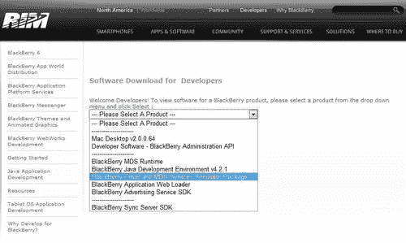
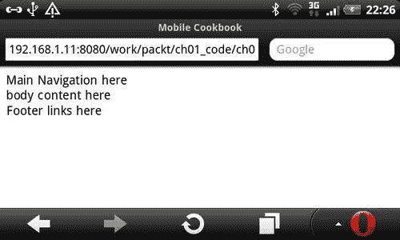
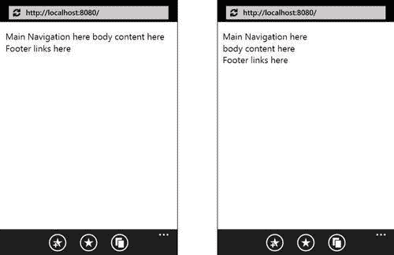
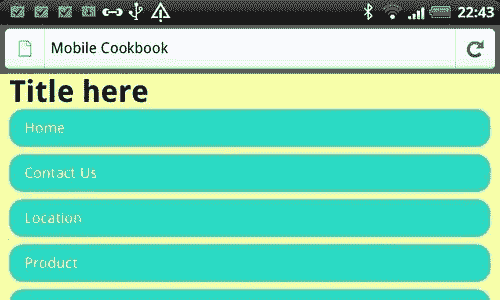
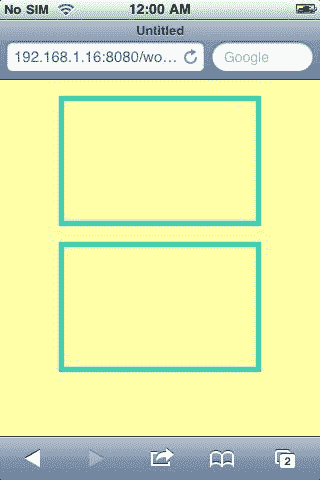
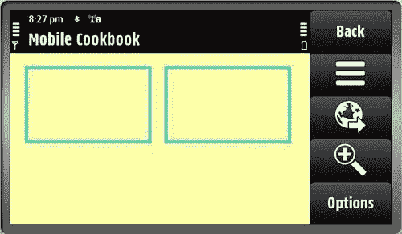
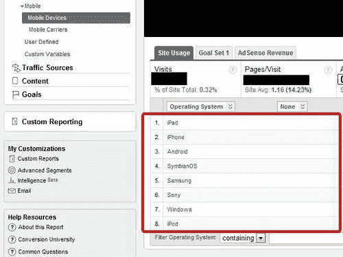

# 第一章。HTML5 和移动网络

在本章中，我们将介绍:

*   准备好您的移动设备
*   仿真器和模拟器
*   设置移动开发环境
*   在移动网络上使用 HTML5
*   使 HTML5 呈现跨浏览器
*   为手机设计
*   确定您的目标移动设备
*   定义内容调整策略

# 简介

HTML5 和移动网络都是很有前景的技术。两者都有相对较短的历史。在本章中，我们将涉及的大多数主题都是相对基础的。这是为了帮助您以最少的努力快速开始移动开发。

手机和 HTML5 本质上都还在进化，你可能会有很多疑问。我们会消除这些疑虑，让你专注于重要的事情。

移动网络发展迅速。我们现在有了手机 Safari，这是 iPhone 上使用最多的应用之一，允许开发人员构建高性能的网络应用，并增强用户的浏览体验。你不需要开发者账号来托管和运营一个移动网站，你不需要获得任何应用市场的批准来推出一个移动网站，你可以随时进行更新，而无需等待批准的麻烦。所有这些都是移动网络开发的好处，但与此同时，也存在一些挑战，例如浏览器之间的不一致性、与本地应用程序相比缺乏某些功能以及安全性。我们不能解决所有问题，但我们肯定能解决其中一些问题。我们将看到，在开发一个移动站点时，我们如何将通用实践与最佳实践分开。

几乎有成千上万的智能手机；你不需要每一个测试你的应用程序。事实上，你可能需要不到 10 个。如果这仍然超出您的预算，那么两台设备就足够了。剩下的，你可以使用模拟器/仿真器来完成这项工作。本书聚焦六款 A 级移动设备，重点特别放在 iPhone、安卓、Windows Phone:

*   ios
*   机器人
*   操作系统
*   黑莓 v6.0 及以上版本
*   Symbian 60
*   Palm webOS

有两种独立于设备的浏览器也将在本书中介绍。它们是:

*   歌剧手机
*   手机火狐浏览器安卓版

仅仅因为其他浏览器不在列表中，并不意味着它们不会被我们在本书中讨论的问题和技术所覆盖。

## 识别您的目标移动设备

目标浏览器:全部

你不可能为每一个移动设备制作一个移动网站。没有人有时间或精力这样做。

跨浏览器移动网页开发可能会很疯狂。工作范围很难界定，正如*John Resig*(jQuery Mobile 的创建者)在描述自己构建 jQuery Mobile 的体验的演示幻灯片中指出的那样([http://www.slideshare.net/jeresig/testing-mobile-javascript](http://www.slideshare.net/jeresig/testing-mobile-javascript))，他问了三个问题:

*   哪些平台和浏览器比较受欢迎？
*   哪些浏览器能够支持现代脚本？
*   我需要什么设备和模拟器来测试？

当你建立一个移动网站时，你必须问自己类似的问题，但不是完全相同的问题，因为记住你的网站应该专门为你的目标受众量身定制。所以你的问题应该是:

*   访问者在我的网站上最常使用哪些平台和浏览器？
*   有多少人通过支持现代脚本的移动设备访问我的网站？
*   测试需要哪些设备和模拟器？

### 我的网站访问者最常用的平台和浏览器有哪些？

现在我们来回答第一个问题。在建立移动网站之前，您必须首先了解谁是您的目标受众，以及他们在访问您的网站时使用什么移动设备。有许多分析工具可以帮助您回答这些问题。其中之一是谷歌分析。你可以在 http://www.google.com/analytics/注册一个免费的谷歌分析账户

方法相当简单:大多数开发者对谷歌分析并不陌生。你所要做的就是包含谷歌分析网站的 JavaScript 代码片段，并将其嵌入到你的网页中。

JavaScript 可以在大多数现代智能手机中呈现，所以在桌面网站和移动网站上使用它真的没有区别。

### 有多少人通过能够支持现代脚本的移动设备访问我的网站？

现在我们来回答第二个问题。你可能想知道的一件事是使用移动浏览器在你的网站上冲浪的人数。你还想知道有多少人使用完全不支持 JavaScript 的遗迹移动浏览器。这是因为，如果使用低端智能手机的人的百分比高于使用高端智能手机的人的百分比，那么一开始使用 HTML5 可能就不值得(尽管这种可能性很低)。

因此，如果你的目标不仅仅是了解使用智能手机的人数，还包括使用旧版本手机的人数，那么谷歌手机分析公司就会出手相助。您可以从以下网址下载脚本:

[http://code . Google . com/mobile/Analytics/Download . html # Download _ the _ Google _ Analytics _ server _ side _ package](http://code.google.com/mobile/analytics/download.html#Download_the_Google_Analytics_server_side_package)

谷歌移动服务器端包分析目前支持 JSP、ASPX、Perl 和 PHP。让我们看一下 PHP 中的一个例子。你所要做的就是用你的 GA 账户号来更改**账户号。不过记得**把‘UA-xx’换成‘MO-xx’**。**

不幸的是，当您使用服务器端版本时，您不能在使用标准 JavaScript 跟踪代码 `ga.js`的页面上使用它。使用服务器端版本意味着您必须放弃 JavaScript 版本。这可能很烦人，因为 JavaScript 版本提供了许多服务器端版本所缺乏的动态跟踪机制:

```html
<?php
// Copyright 2009 Google Inc. All Rights Reserved.
$GA_ACCOUNT = "ACCOUNT ID GOES HERE";
$GA_PIXEL = "ga.php";
function googleAnalyticsGetImageUrl() {
global $GA_ACCOUNT, $GA_PIXEL;
$url = "";
$url .= $GA_PIXEL . "?";
$url .= "utmac=" . $GA_ACCOUNT;
$url .= "&utmn=" . rand(0, 0x7fffffff);
$referer = $_SERVER["HTTP_REFERER"];
$query = $_SERVER["QUERY_STRING"];
$path = $_SERVER["REQUEST_URI"];
if (empty($referer)) {
$referer = "-";
}
$url .= "&utmr=" . urlencode($referer);
if (!empty($path)) {
$url .= "&utmp=" . urlencode($path);
}
$url .= "&guid=ON";
return $url;
}
?>

```

## 谷歌分析的替代方案

谷歌分析并不是市场上唯一的移动分析服务。还有其他服务提供更专业化的服务。例如， **PercentMobile** 是一个托管的移动分析服务，让您的移动受众和机会变得清晰。您可以在找到更多关于这项服务的信息

[http://percent mobile . com/](http://percentmobile.com/)

### 谷歌分析的准确性

移动设备报告的位置可能不总是准确的；谷歌分析使用 IP 地址来确定地图叠加报告的用户位置。它们可能会不准确，因为移动 IP 源自不一定与移动用户同处一地的无线运营商网关。

### 服务器加载速度问题

由于服务器端处理，可能会产生一些额外的服务器负载。谷歌建议你首先在你的几个页面上测试这个片段，以确保在推广到整个网站之前一切正常。

# 设置移动开发工具

目标浏览器:全部

现在有一个问题仍然没有从之前的食谱中得到答案:*我需要哪些设备和模拟器来进行测试？*我们会在这里面找到答案。

如果你已经知道你将支持哪些主要的移动设备，现在是时候看看如何设置它们了。如果您在各种移动设备上进行测试，移动开发成本可能会很高。虽然我们有所有这些可用于测试的移动模拟器和仿真器，但它不如在真实设备上测试。现在让我们来看看如何最大化测试覆盖率和最小化成本。

## 做好准备

我们将在这里做一些假设。每个案例都不一样，但思路是一样的。让我们假设你的桌面上有一个视窗操作系统，但是你网站的顶级访问者使用 iOS、安卓和黑莓进行冲浪。

## 怎么做...

您的目标是最大限度地扩大覆盖面并降低成本。这三种设备都有仿真器，但并非都支持不同的平台。

<colgroup><col style="text-align: left"> <col style="text-align: left"></colgroup> 
| 

名字

 | 

和睦相处

 |
| --- | --- |
| iOS 模拟器 | 苹果个人计算机 |
| 安卓模拟器 | Windows、Mac、Linux |
| 黑莓模拟器 | Windows 操作系统 |

如你所见，由于 iOS 模拟器只适用于 Mac，如果你运行的是 Windows 操作系统，最好也是唯一的选择就是购买 iPhone 进行测试。对于安卓和黑莓，因为都有 Windows 的模拟器，为了节省预算，可以下载模拟器。

## 它是如何工作的...

1.  列出人们用来在你的网站上冲浪的顶级移动设备。
2.  了解您用于开发的机器操作系统。
3.  找出这些设备仿真器与您的开发环境的兼容性。

## 还有更多...

如果您有预算购买多台具有不同操作系统的移动设备，您可以进一步考虑移动设备的屏幕尺寸和 DPI。你可能不需要购买两台高端设备。例如，没有必要拥有 iPhone4 和安卓迅雷。你可以买一个低端的安卓系统来测试你的网站在低端设备上的外观。因此，我们的想法是将您的操作系统、移动设备和仿真器结合起来，以最大限度地覆盖场景。

### 设备模拟器/仿真器下载查找表

下表列出了用于移动网页设计和开发测试的流行移动设备仿真器:

<colgroup><col style="text-align: left"> <col style="text-align: left"> <col style="text-align: left"> <col style="text-align: left"></colgroup> 
| 

名字

 | 

类型

 | 

和睦相处

 | 

统一资源定位器

 |
| --- | --- | --- | --- |
| ios | 模拟器 | 苹果个人计算机 | [https://developer . apple . com/dev center/IOs/index . action #下载](http://developer.apple.com/devcenter/ios/index.action#downloads) |
| 机器人 | 仿真器 | Mac，Win，Linux | [http://developer.android.com/sdk/index.html](http://developer.android.com/sdk/index.html) |
| 惠普网络操作系统 | 虚拟计算机 | Mac，Win，Linux | [http://developer.palm.com/index.php?option=com_content&视图=文章& id=1788 & Itemid=55](http://developer.palm.com/index.php?option=com_content&view=article&id=1788&Itemid=55) |
| 诺基亚塞班 | 仿真器 | 胜利 | [http://www . forum . Nokia . com/info/SW . Nokia . com/id/EC 866 fab-4b 76-49 F6-b5 a5-af 0631419 e9 c/S60 _ All _ in _ One _ sdks . html](http://www.forum.nokia.com/info/sw.nokia.com/id/ec866fab-4b76-49f6-b5a5-af0631419e9c/S60_All_in_One_SDKs.html) |
| 黑莓 | 仿真器 | 胜利 | [http://us . blackberry . com/developers/resources/simulator . JSP](http://us.blackberry.com/developers/resources/simulators.jsp) |
| Windows Mobile 7 | 仿真器 | 胜利 | [http://www.microsoft.com/downloads/en/details.aspx?family id = 04704 ACF-a63a-4f 97-952 c-8b 51 b 34 b 00 ce](http://www.microsoft.com/downloads/en/details.aspx?FamilyID=04704acf-a63a-4f97-952c-8b51b34b00ce) |

### 浏览器模拟器/仿真器下载查找表

除了设备测试工具，我们还有独立于平台的浏览器工具，特别是 Opera 和 Firefox。如下表所示:

<colgroup><col style="text-align: left"> <col style="text-align: left"> <col style="text-align: left"> <col style="text-align: left"></colgroup> 
| 

名字

 | 

类型

 | 

和睦相处

 | 

统一资源定位器

 |
| --- | --- | --- | --- |
| 歌剧手机 | 仿真器 | Mac，Win，Linux | [http://www.opera.com/developer/tools/](http://www.opera.com/developer/tools/) |
| 迷你歌剧 | 模拟器 | Mac，Win，Linux | [http://www . opera . com/developer/tools/http://www . opera . com/mobile/demo/](http://www.opera.com/developer/tools/http://www.opera.com/mobile/demo/) |
| 移动版火狐 | 模拟器 | Mac，Win，Linux | [http://www.mozilla.com/en-US/mobile/download/](http://www.mozilla.com/en-US/mobile/download/) |

### 远程测试

除了仿真器和模拟器之外，还有一些测试框架可以让你远程访问真实设备。其中一个工具是**device anywhere**；一个问题是它不是免费的。

[http://www.deviceanywhere.com/](http://www.deviceanywhere.com/)

# 黑莓模拟器

目标浏览器:黑莓

大多数移动设备模拟器很容易安装和配置，如果你按照他们网站上的说明，但黑莓模拟器的工作方式不同于其他移动设备模拟器。对于黑莓设备模拟器，要连接互联网，除了下载模拟器外，还需要下载安装**黑莓邮箱和 MDS 服务模拟器**。

## 做好准备

确保您已经选择了一个模拟器，可以从以下网址下载:http://us . blackberry . com/developers/resources/simulators . JSP

## 怎么做...

首先，转到页面:[https://swdownloads.blackberry.com/Downloads/entry.do?代码= A8 baa 56554 f 96369 ab 93 E4 F3 bb 068 c 22&CPID =场外软件下载&CP =场外软件下载](http://swdownloads.blackberry.com/Downloads/entry.do?code=A8BAA56554F96369AB93E4F3BB068C22&CPID=OTC-SOFTWAREDOWNLOADS&cp=OTC-SOFTWAREDOWNLOADS)。在那里，您将看到类似于以下截图的产品列表:



现在选择**黑莓邮件和 MDS 服务模拟器包**，然后点击**下一步**。

下载并安装软件后，您必须首先在黑莓模拟器之前启动服务模拟器，以便允许它连接到互联网。

以下是黑莓模拟器的截图:


# 设置移动开发环境

目标浏览器:全部

在我们开始移动 web 开发之前，我们必须首先建立一个开发环境。

## 做好准备

1.  在您的计算机上设置本地主机。对于 Windows、Mac 或 Linux，最简单的设置方法是使用流行且免费的 XAMPP 软件:([http://www.apachefriends.org/en/index.html](http://www.apachefriends.org/en/index.html))。
2.  确保您有无线连接。
3.  此外，你应该随身携带一个移动设备。否则，使用移动模拟器/仿真器。
4.  确保您的移动设备和桌面位于同一无线网络上。

## 怎么做...

1.  Create an HTML file and name it `ch01e1.html` at the root directory of your localhost:

    在`ch01r01.html`中，键入以下内容:

    ```html
    <html>
    <head>
    <meta name="viewport" content="width=device-width, initial-scale=1.0">
    </head>
    <body>
    <header>
    Main Navigation here
    </header>
    body content here
    <footer>
    Footer links here
    </footer>
    </body>
    </html>

    ```

2.  Now get your IP address. If you are using Windows, you can type the following line in your command prompt:

    ```html
    ipconfig

    ```

    ### 类型

    下载本书的示例代码

    您可以从您在[http://www.PacktPub.com](http://www.PacktPub.com)的账户中下载您购买的所有 Packt 书籍的示例代码文件。如果您在其他地方购买了这本书，您可以访问[http://www.PacktPub.com/support](http://www.PacktPub.com/support)并注册，以便将文件直接通过电子邮件发送给您

3.  Once you have got your IP address, (for example, `192.168.1.16.)`, enter it in your mobile browser URL address bar. Now you should see the page load with the text displayed:

    

## 它是如何工作的...

在同一网络中，您的移动设备可以通过您的桌面 IP 地址访问您的桌面主机。

## 还有更多...

如果你没有移动设备，你可以使用其中一个模拟器进行测试。但是建议至少有一两个真正的移动设备进行测试。模拟器可以准确地测试大多数东西，但不是所有东西。

### 在 Safari 桌面上测试

如果你的主要目标受众是 iPhone 手机 Safari 用户，你也可以在桌面上做测试来节省时间。为此，打开 Safari，进入**偏好设置**，点击**高级**标签，勾选**显示开发菜单栏**，如下图:


现在点击当前页面的显示菜单，选择**开发** | **用户代理** | **移动 Safari 3.1.3 - iPhone:**


### 基于社区的仿真器/模拟器集合列表

如果你手头真的没有智能手机，这里有一个仿真器和模拟器的列表。你可以在移动样板项目的维基上找到这个列表:

[https://github . com/h5bp/Mobile-样板/wiki/Mobile-模拟器-&-模拟器](http://github.com/h5bp/mobile-boilerplate/wiki/Mobile-Emulators-&-Simulators)

### Firtman 收集的仿真器/模拟器列表

*Maximiliano Firtman* ，一个移动和网络开发者，也是一个作者，在他的网站上维护了一个模拟器列表，位于:

[http://www.mobilexweb.com/emulators](http://www.mobilexweb.com/emulators)

# 在移动网页上使用 HTML5

目标浏览器:全部

现在我们将为您的移动设备创建一个简单的 HTML5 页面。如果你已经有使用旧版本 HTML 的经验，HTML5 应该很容易理解。如果你以前为桌面制作过网页，那么为移动设备制作一个网页并不难。

## 做好准备

创建新文件 `ch01e2.html`。

## 怎么做...

将以下代码保存在文件中:

```html
<!doctype html>
<html>
<head>
<meta name="viewport" content="width=device-width, initial-scale=1.0">
</head>
<body>
hello to the HTML5 world!
</body>
</html>

```

现在在你的移动浏览器中渲染这个，你会看到文本按照预期渲染。

## 它是如何工作的...

可以看到，HTML5 和其他 HTML 页面唯一的区别就是我们使用的**文档类型定义(DTD)【T2:】`<!doctype html>`。**

您可能已经看到了代码`<meta name="viewport" content="width=device-width, initial-scale=1.0">`，并想知道它是做什么的。它有助于移动 Safari 知道页面和设备一样宽。设置 `initial-scale=1`告诉浏览器不要放大或缩小。

## 还有更多...

以下是 HTML5 的一点历史:HTML5 草案有两个版本，一个是由 W3C 创建的，另一个是由 WHATWG 创建的。W3C 是由一个本质上是民主的团体管理的，但实际上速度非常慢。WHATWG 由一个人编辑，*伊恩·希克森*(也在谷歌工作)，还有一群不公开的人。由于*伊恩*做了大部分的决策，这使得 WHATWG 的版本进展更快。

### HTML5 和版本号

你可能想知道为什么 HTML5 使用了一个甚至没有版本号的声明而变得如此模糊。有很多理由证明这一点:

1.  对 HTML 的版本支持对浏览器来说并不重要。重要的是功能支持。换句话说，如果浏览器支持您正在使用的 HTML5 功能，即使您将文档声明为 HTML4，它仍然会按照预期呈现 HTML5 元素。
2.  打字更容易！

### 移动文档类型

你可能会问一个问题，使用 HTML5 DTD `<!doctype html>`是否安全。答案是 DTDs 是为验证而制作的，而不是浏览器呈现。你的下一个问题可能是:怪癖模式怎么样？`<!doctype html>`是确保浏览器以标准模式呈现所需的最低信息。所以你使用`<!doctype html>`是非常安全的。

你可能已经注意到我们用`<!doctype html>`代替`<!DOCTYPE html>`。原因是 HTML5 不区分大小写，但是为了与其他 HTML 标签保持一致，我们将在整本书中使用小写。

### 免费资源学习 HTML5

有很多优秀的免费书籍，以及关于基本 HTML5 标签的文章。如果您不熟悉 HTML5，可以查看以下内容之一:

*   HTML5 医生:[http://html5doctor.com/](http://html5doctor.com/)T2】
*   深入 html 5:[http://diveintohtml5.org/](http://diveintohtml5.org/)T2】
*   HTML5 岩石:[http://www.html5rocks.com/](http://www.html5rocks.com/)T2】

如果你是那种真正想知道某件事的每一个细节的人，你可以阅读官方的 HTML5 规格。

规范的 W3C 版本位于:

[http://dev.w3.org/html5/spec/Overview.html](http://dev.w3.org/html5/spec/Overview.html)

HTML 生活标准的 WHATWG 版本在:

[http://www . whatwg . org/specs/web-apps/current-work/multipage/](http://www.whatwg.org/specs/web-apps/current-work/multipage/)

# 跨不同浏览器渲染 HTML5

目标浏览器:全部

有一些旧的移动浏览器无法识别 HTML5 元素。这样做的问题是，如果这些元素不被识别，您就不能对它们进行样式化。有许多垫片可以解决这个问题。其中之一就是 Modernizr。

## 做好准备

1.  不识别 HTML5 元素的移动浏览器之一是 Windows Mobile。如果你没有 Windows Mobile，你可以简单地用 IE7 来测试一下，因为它们是基于同一个引擎的。
2.  从网站下载 Modernizr:[http://www.modernizr.com/](http://www.modernizr.com/)。这是由*法鲁克·阿提斯、保罗·爱尔兰*和*亚历克斯·塞克斯顿*写的。

## 怎么做...

1.  创建一个 HTML 文件并命名为 `ch01e3.html`，在文件中输入以下代码:

    ```html
    <!doctype html>
    <html>
    <head>
    <meta charset="utf-8">
    <meta name="viewport" content="width=device-width, initial-scale=1.0">
    <style>
    header, footer {display:block;}
    </style>
    </head>
    <body>
    <header>
    Main Navigation here
    </header>
    body content here
    <footer>
    Footer links here
    </footer>
    </body>
    </html>

    ```

2.  Now create another page with Modernizr included, and name it `ch01e4.html:`

    ```html
    <!doctype html>
    <html>
    <head>
    <meta charset="utf-8">
    <meta name="viewport" content="width=device-width, initial-scale=1.0">
    <script src="modernizr-1.7.min.js"></script>
    <style>
    header, footer {display:block;}
    </style>
    </head>
    <body>
    <header>
    Main Navigation here
    </header>
    body content here
    <footer>
    Footer links here
    </footer>
    </body>
    </html>

    ```

    

### 它是如何工作的...

请记住，如果您将 Modernizr 用于您的项目，您应该始终将其包含在`<head>`标记结束之前的文件头。还有其他用于类似目的的聚合填充料，下面部分列出了其中一些。

### 还有更多...

Modernizr 不是唯一的脚本库助手；还有另外两个值得注意的问题:

*   **html5shim** by *Remy Sharp, Jonathan Neal & community*, enabled for print use, as well as at:

    [http://code.google.com/p/html5shim/](http://code.google.com/p/html5shim/)

*   **innerShiv** by *Joe Bartlett*, enables elements for innerHTML use at:

    [http://jdbartlett.github.com/innershiv/](http://jdbartlett.github.com/innershiv/)

#### HTML5 CSS 复位

您可能想要在样式表中重置一组新的 CSS HTML5 元素:

```html
article, aside, canvas, details, figcaption, figure,footer, header,
hgroup, menu, nav, section, summary,time, mark, audio, video {
margin: 0;
padding: 0;
border: 0;
font-size: 100%;
font: inherit; vertical-align: baseline;
}

```

#### 启用旧 IE 中的块级 HTML5 元素

在您的 CSS 中，您可能希望在您的 CSS 重置中包含一组块级 HTML5 元素。请注意，并非所有 HTML5 元素都必须显示为块元素。

下面是块级 HTML5 元素的列表:

```html
article, aside, details, figcaption, figure,footer, header, hgroup, menu, nav, section {
display: block;
}

```

#### 现代化

Modernizr 不仅仅是让 HTML5 元素在 CSS 中风格化。它还有助于检测用于渲染的浏览器中的 HTML5 功能支持。使用 2.0 版本，您可以选择自定义下载[http://www.modernizr.com/download/](http://www.modernizr.com/download/)。

# 为手机设计

目标浏览器:全部

对于桌面设计，人们倾向于使用固定或流动布局。在移动设备上，人们应该总是使用流畅的布局。流畅的布局可以让你的网站响应浏览器的调整。

## 做好准备

现在在你的文本编辑器中创建两个空的 HTML 文件，命名其中一个 `ch01r06_a.html`和另一个 `ch01r06_b.html`。

## 怎么做...

1.  在 `ch01r06_a.html`中，输入以下代码并保存文件:

    ```html
    <!doctype html>
    <html>
    <head>
    <meta name="viewport" content="width=device-width, initial-scale=1.0, maximum-scale=1.0">
    <script src="modernizr-1.7.min.js"></script>
    <style>
    body, #main ul, #main li, h1 {
    margin:0; padding:0;
    }
    body {
    background:#FFFFA6;
    }
    #container {
    font-family:Arial;
    width:300px;
    margin:0 auto;
    }
    header, footer {
    display:block;
    }
    #main li{
    list-style:none;
    height:40px;
    background:#29D9C2;
    margin-bottom:0.5em;
    line-height:40px;
    -moz-border-radius: 15px;
    -webkit-border-radius: 15px;
    border-radius: 15px;
    }
    #main li a {
    color:white;
    text-decoration:none;
    margin-left:1em;
    }
    </style>
    </head>
    <body>
    <div id="container">
    <header>
    <h1>Title here</h1>
    </header>
    <nav id="main">
    <ul>
    <li><a href="#">Home</a></li>
    <li><a href="#">Contact Us</a></li>
    <li><a href="#">Location</a></li>
    <li><a href="#">Product</a></li>
    <li><a href="#">About</a></li>
    </ul>
    </nav>
    <footer>
    Footer links here
    </footer>
    </div>
    </body>
    </html>

    ```

2.  在 `ch01r06_b.html`中，输入以下代码，保存单据:

    ```html
    <!doctype html>
    <html>
    <head>
    <meta name="viewport" content="width=device-width, initial-scale=1.0, maximum-scale=1.0">
    <script src="modernizr-1.7.min.js"></script>
    <style>
    body, #main ul, #main li, h1 {
    margin:0;
    padding:0;
    }
    body {
    background:#FFFFA6;
    }
    #container {
    font-family:Arial;
    margin:0 10px;
    }
    header, footer {
    display:block;
    }
    #main li{
    list-style:none;
    height:40px;
    background:#29D9C2;
    margin-bottom:0.5em;
    line-height:40px;
    -moz-border-radius: 15px;
    -webkit-border-radius: 15px;
    border-radius: 15px;
    }
    #main li a {
    color:white;
    text-decoration:none;
    margin-left:1em;
    }
    </style>
    </head>
    <body>
    <div id="container">
    <header>
    <h1>Title here</h1>
    </header>
    <nav id="main">
    <ul>
    <li><a href="#">Home</a></li>
    <li><a href="#">Contact Us</a></li>
    <li><a href="#">Location</a></li>
    <li><a href="#">Product</a></li>
    <li><a href="#">About</a></li>
    </ul>
    </nav>
    <footer>
    Footer links here
    </footer>
    </div>
    </body>
    </html>

    ```

### 它是如何工作的...

当你在肖像模式下查看这两个网站时，它们看起来几乎一样:


现在试着旋转你的屏幕，看看会发生什么。

如您现在所见，在横向模式下，第一个示例使用左侧和右侧的空间进行渲染，第二个示例覆盖了屏幕的大部分空间:


第二个示例显示了不同的结果:



这个网站页面在固定布局中看起来很笨拙，但在流动布局中看起来很正常。因此，当您为移动设备设计时，请始终记住，您的站点应该具有这种灵活性。原因是:

*   手机有纵向和横向两种模式
*   Mobile 的空间非常有限，所以您应该使用屏幕上所有可用的像素

### 还有更多...

CSS 媒体查询也是响应设计的一个重要部分。它帮助您实现移动设计的灵活性。

```html
<!doctype html>
<html>
<head>
<meta name="viewport" content="width=device-width, initial-scale=1.0, maximum-scale=1.0">
<script src="modernizr-1.7.min.js"></script>
<style>
body {
margin:0;
padding:0;
background:#FFFFA6;
}
#main section {
display:block;
border:5px solid #29D9C2;
width:60%;
height:120px;
margin:5% auto;
}
@media screen and (min-width: 480px) {
#main {
width:90%;
margin:0 auto;
}
#main > section:first-child {
margin-right:5%;
}
#main section {
float:left;
width:45%;
}
}
</style>
</head>
<body>
<div id="container">
<div id="main">
<section id="top-news"></section>
<section id="sports"></section>
</div>
</div>
</body>
</html>

```

当在较窄的屏幕中渲染时，这两个部分将垂直布局，当在较宽的屏幕中渲染时，这两个部分将水平布局。我们用来实现这一点的技术是使用 CSS 媒体查询。在这个例子中，我们使用了 `@media screen and (min-width: 480px) {..}`，所以这意味着页面呈现在最小宽度为 `480px`的页面上，将应用其中的样式:



现在让我们在定向模式下看到它，如下所示。这两个箱子现在紧挨着。



#### 桌面第一网站

除了建立一个纯粹的移动或桌面网站的想法，也一直有其他方法。其中之一是先建立一个桌面网站，并使其在移动中优雅地降级。

#### 移动第一站点

另一种方法是“移动优先”构建它，但让它在桌面上优雅地呈现。

其中一种方法是在 CSS 中使用以下内容:

```html
@media only screen and (min-width: 320px) {
/* Styles */
}
@media only screen and (min-width: 640px) {
/* Styles */
}
@media only screen and (min-width: 800px) {
/* Styles */
}
@media only screen and (min-width: 1024px) {
/* Styles */
}

```

#### 一种网络方法

第三种方法是有一个“一个网络”版本，通过这个版本，你可以同时关注移动和桌面，而不是两者。

# 定义内容策略

目标浏览器:全部

利用您从分析工具中收集的数据，您可以针对您想要构建的内容定义策略。如果您已经有了网站的桌面版本，这将特别有用。

## 做好准备

确保您的网站上已经嵌入了 JavaScript。

## 怎么做...

1.  Go to your analytics tool and click on **Visitors** | **Mobile** under the left navigation:

    

2.  Now if you click on **Mobile Devices**, you can see the most common devices that people use to surf your site:

    

## 它是如何工作的...

谷歌分析可以帮助找到最常用的移动设备访问您的网站，也可以找到您的网站最受欢迎的部分。

## 还有更多...

您还可以确定移动站点上最有用的页面。人们对待手机冲浪和桌面冲浪是不同的。例如，如果你经营一家本地商店销售产品，大多数人倾向于浏览类似**联系我们、位置**和**服务**移动设备的页面。相反，在桌面上，人们倾向于搜索**产品目录、关于**和**产品描述**。谷歌分析可以帮助你找出你网站上访问量最大的部分/页面。除了谷歌分析，你还可以使用移动百分比，正如我们之前看到的。


### 浏览器等级

使用分析服务是决定您想要支持哪些设备的一种方式。另一种方法是使用浏览器等级来了解您应该瞄准的类别。jQuery Mobile 在[http://jquerymobile.com/gbs/.](http://jquerymobile.com/gbs/.)有一个很棒的网格支持图，jQuery Mobile 上还有一张幻灯片，讲的是[http://www.slideshare.net/jeresig/testing-mobile-javascript](http://www.slideshare.net/jeresig/testing-mobile-javascript)关于移动浏览器 web 开发的整体策略。

### 移动矩阵

我一直在智能手机前端矩阵方面与乔纳森·尼尔和许多其他人合作。你可以看看:

[https://github . com/h5bp/Mobile-样板/wiki/Mobile-matrix](http://github.com/h5bp/mobile-boilerplate/wiki/Mobile-Matrices)

它包含市场上大多数智能手机的信息、屏幕尺寸、DPI 和操作系统。