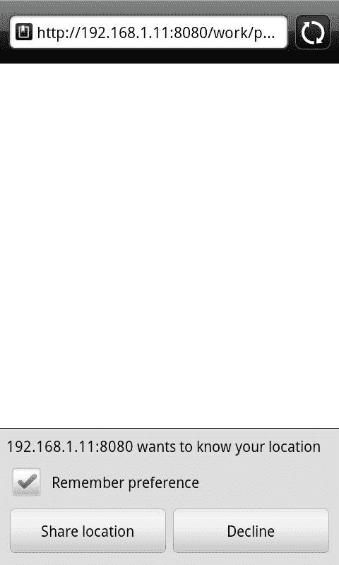
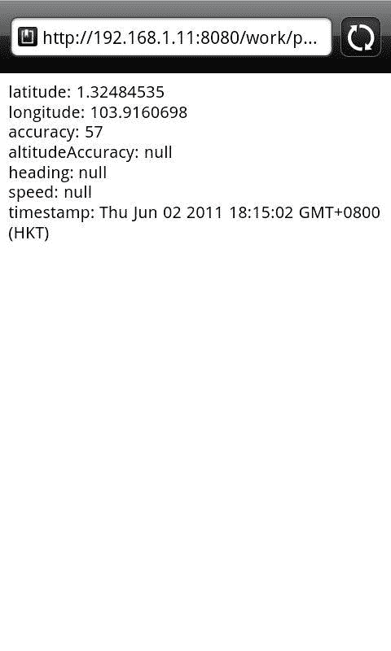
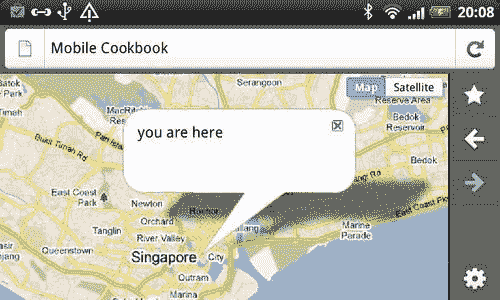
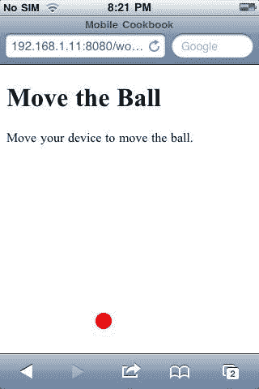

# 第五章。移动设备访问

在本章中，我们将介绍:

*   获取您的位置
*   处理跨浏览器地理定位
*   根据您的地理位置显示地图
*   实时定位
*   `DeviceOrientation`事件
*   用 foursquare 进行地理定位

# 简介

在所有的 HTML5 类中，与移动开发关系最密切的一类必须是设备访问。

以下是 W3C HTML5 运动网站([http://www.w3.org/html/logo/](http://www.w3.org/html/logo/))对设备访问的官方描述:

> 从地理定位应用编程接口开始，网络应用可以呈现丰富的、设备感知的特性和体验。令人难以置信的设备访问创新正在开发和实施，从音频/视频输入到麦克风和摄像头，再到联系人和事件等本地数据，甚至倾斜方向。

你可以在[http://www.w3.org/html/logo/ #科技](http://www.w3.org/html/logo/)找到描述和标志。

像 foursquare 这样基于位置的社交网络对商业运作方式和人员调动方式产生了深远的影响。Groupon 新推出的基于位置的服务如果发布，可能会从根本上改变消费者的行为和零售企业的运作方式。谷歌地图使用实时地理定位和 GPRS 来帮助人们和车辆导航。基于这种设备访问技术，将会有越来越多令人兴奋的创新。

在本章中，我们将研究地理定位应用编程接口和设备定位应用编程接口，解决跨浏览器问题，并了解如何将设备访问与流行的基于位置的服务结合使用。

# 获取您的位置

目标浏览器:安卓、iOS、webOS、Opera、火狐

使用地理定位 API，我们可以返回纬度、经度和您当前位置的精确度等值:

*   纬度和经度:这些属性是地理坐标，以十进制度指定
*   精度:表示经纬度坐标的精度等级，以米为单位

## 做好准备

让我们创建一个 HTML 文档，获得经度和纬度以及精确度。首先，我们创建一个新的 HTML 文件，并将其命名为 `ch05r01.html`。

## 怎么做...

在 HTML 文档中输入以下代码:

```html
<!doctype html>
<html>
<head>
<title>Mobile Cookbook</title>
<meta charset="utf-8">
<meta name="viewport" content="width=device-width, initial-scale=1.0">
</head>
<body>
<div id="main">
<div id="someElm">
</div>
</div>
<script src="http://code.jquery.com/jquery-1.5.2.min.js"></script>
<script>
function getLocation() {
navigator.geolocation.getCurrentPosition(showInfo);
}
function showInfo(position) {
var latitude = position.coords.latitude;
var longitude = position.coords.longitude;
var accuracy = position.coords.accuracy;
$('#someElm').html('latitude: '+latitude+'<br />longitude: '+longitude+'<br />accuracy: '+accuracy);
}
getLocation();
</script>
</body>
</html>

```

当您第一次渲染它时，会出现如下消息提示您:



地理定位支持是选择加入。没有浏览器会自动将设备的物理位置发送到服务器。相反，在执行来回发送设备位置的程序之前，它会征求您的许可。浏览器可以记住您的偏好，以防止它再次从同一网站弹出。

现在按下允许您共享位置的按钮。然后，您将获得屏幕上显示的位置数据，如下所示:



## 它是如何工作的...

`navigator`是一个对于 JavaScript 程序员来说并不陌生的对象。常用于用户代理检测: `navigator.userAgent`。

`geolocation`是 `navigator`对象上的新属性: `navigator.geolocation`。

`getCurrentPosition`是 `navigator.geolocation`的一种方法。在这个例子中，我们执行函数 `showInfo`作为第一个参数:

```html
navigator.geolocation.getCurrentPosition(showInfo);

```

在 `showInfo`函数中，我们从 `position`参数返回三个值，即 `latitude, longitude`和 `accuracy:`

```html
var latitude = position.coords.latitude;
var longitude = position.coords.longitude;
var accuracy = position.coords.accuracy;

```

## 还有更多...

那么，上述属性都是地理定位应用编程接口可以返回的吗？理论上，可以返回更多的信息，但实际上，只有选定的浏览器才会返回附加信息。

# 处理跨浏览器地理定位

目标浏览器:跨浏览器

地理定位并不适用于所有的移动浏览器，即使是那些支持它的浏览器，它们也可能有一个不同于标准的应用编程接口。iOS 和安卓都使用这个标准。已知具有不同应用编程接口的浏览器包括黑莓、诺基亚和掌上电脑。幸运的是，我们有了一个以移动为中心的地理定位聚合器——**地理位置 javascript** 。它有非标准的黑莓和网络操作系统技巧来帮助规范不同的应用编程接口行为。

## 做好准备

下载本章附带的资源，创建一个 `js`文件夹。将 `geo.js`放入 `js`文件夹。现在创建一个名为 `ch05r02.html`的 HTML 文档。

## 怎么做...

在 HTML 文档中输入以下代码:

```html
<!doctype html>
<html>
<head>
<title>Mobile Cookbook</title>
<meta charset="utf-8">
<meta name="viewport" content="width=device-width, initial-scale=1.0">
<script src="http://code.google.com/apis/gears/gears_init.js" type="text/javascript" charset="utf-8"></script>
<script src="js/geo.js" type="text/javascript" charset="utf-8"></script>
</head>
<body>
<div id="main">
<div id="someElm">
</div>
</div>
<script src="http://code.jquery.com/jquery-1.5.2.min.js"></script>
<script>
if(geo_position_js.init()){
geo_position_js.getCurrentPosition(success_callback,error_callback,{enableHighAccuracy:true,options:5000});
}
else{
$('#someElm').html("Functionality not available");
}
function success_callback(p)
{
$('#someElm').html('latitude: '+p.coords.latitude+'<br />longitude: '+p.coords.longitude+'<br />accuracy: '+p.coords.accuracy);
}
function error_callback(p)
{
$('#someElm').html('error='+p.message);
}
</script>
</body>
</html>

```

在 Opera 中测试一下，应该可以看到如下结果:


## 它是如何工作的...

在 HTML 文档的顶部，我们链接到 `gears_init.js`。如果浏览器没有默认支持的地理定位应用编程接口，但安装了齿轮，齿轮应用编程接口可能会返回地理定位数据。对于有地理定位 API 的浏览器，只是方法不同，第二个脚本 `geo.js`将用于规范 API。

如果 `geo_position_js.init()`返回真，这意味着我们能够以某种方式获得地理位置数据。在这种情况下，我们将进行下一步。我们用 `geo_position_js.getCurrentPosition`代替 `navigator.geolocation.getCurrentPosition`作为方法:

```html
geo_position_js.getCurrentPosition(showInfo,error_callback,{enableHighAccuracy:true,options:5000});

```

## 还有更多...

这里有一个额外的资源，可以帮助你获取地理位置信息。

### YQL 地理库

YQL 地理库提供了一种替代方法，一种基于 IP 地址的地理定位。这是一个轻量级的库，与雅虎服务捆绑在一起。可以:

*   从文本中获取地理位置
*   从 lat/lon 获取位置信息
*   从某个网址获取所有地理位置
*   从一个 IP 号码中获取位置

# 根据您的地理位置显示地图

目标浏览器:跨浏览器

谷歌地图应用编程接口 V3 旨在快速加载，并在移动设备上运行良好。特别是，我们专注于开发先进的移动设备，如 iPhone 和运行安卓操作系统的手机。移动设备的屏幕尺寸比桌面上的典型浏览器要小。此外，它们通常有特定于这些设备的特定行为，例如在 iPhone 上的“捏改缩放”。

## 做好准备

让我们创建一个显示在您的移动设备上的地图。首先，让我们创建一个名为 `ch05r03.html`的 HTML 文档。

## 怎么做...

输入以下代码:

```html
<!doctype html>
<html>
<head>
<title>Mobile Cookbook</title>
<meta charset="utf-8">
<meta name="viewport" content="initial-scale=1.0, user-scalable=no" />
<script type="text/javascript" src="http://maps.google.com/maps/api/js?sensor=true"></script>
<script src="http://code.google.com/apis/gears/gears_init.js"></script>
<script src="js/geo.js"></script>
<style>
html {
height: auto;
}
body {
height: auto;
margin: 0;
padding: 0;
}
#map_canvas {
height: auto;
position: absolute;
bottom:0;
left:0;
right:0;
top:0;
}
</style>
</head>
<body>
<div id="map_canvas"></div>
<script src="http://code.jquery.com/jquery-1.5.2.min.js"></script>
<script>
var initialLocation;
var siberia = new google.maps.LatLng(60, 105);
var newyork = new google.maps.LatLng(40.69847032728747, -73.9514422416687);
var browserSupportFlag = new Boolean();
var map;
var infowindow = new google.maps.InfoWindow();
function initialize() {
var myOptions = {
zoom: 12,
mapTypeId: google.maps.MapTypeId.ROADMAP
};
map = new google.maps.Map(document.getElementById("map_canvas"), myOptions);
if(geo_position_js.init()){
browserSupportFlag = true;
geo_position_js.getCurrentPosition(function(position) {
initialLocation = new google.maps.LatLng(position.coords.latitude,position.coords.longitude);
contentString = "you are here";
map.setCenter(initialLocation);
infowindow.setContent(contentString);
infowindow.setPosition(initialLocation);
infowindow.open(map);
});
}
}
function detectBrowser() {
var useragent = navigator.userAgent;
var mapdiv = document.getElementById("map_canvas");
if (useragent.indexOf('iPhone') != -1 || useragent.indexOf('Android') != -1) {
mapdiv.style.width = '100%';
mapdiv.style.height = '100%';
} else {
mapdiv.style.width = '600px';
mapdiv.style.height = '800px';
}
}
detectBrowser();
initialize();
</script>
</body>
</html>

```

当在你的手机浏览器中渲染时，它看起来如下:



## 它是如何工作的...

现在让我们分解代码，看看每个部分都做了什么:

1.  iPhone 有缩放功能，谷歌地图 API V3 对此事件有特殊处理。因此，您可以设置以下元标签，这将确保用户无法调整 iPhone 的大小。运行软件版本 1.5(纸杯蛋糕)的安卓设备也支持这些参数:

    ```html
    <meta name="viewport" content="initial-scale=1.0, user-scalable=no" />

    ```

2.  将包含地图的`<div>`设置为 100%的宽度和高度属性:

    ```html
    mapdiv.style.width = '100%';
    mapdiv.style.height = '100%';

    ```

3.  您可以通过检查 DOM 中的 `navigator.userAgent`属性来检测 iPhone 和 Android 设备:

    ```html
    function detectBrowser() {
    var useragent = navigator.userAgent;
    var mapdiv = document.getElementById("map_canvas");
    if (useragent.indexOf('iPhone') != -1 || useragent.indexOf('Android') != -1 ) {
    mapdiv.style.width = '100%';
    mapdiv.style.height = '100%';
    } else {
    mapdiv.style.width = '600px';
    mapdiv.style.height = '800px';
    }
    }

    ```

4.  Specifying the Sensor Parameter, applications that determine the user's location using a sensor must pass `sensor=true` when loading the Maps API JavaScript.

    ```html
    <script type="text/javascript" src="http://maps.google.com/maps/api/js?sensor=true"></script>

    ```

    使用谷歌地图应用编程接口要求您指出您的应用是否使用传感器(如全球定位系统定位器)来确定用户的位置。这对移动设备尤其重要。当包含地图应用编程接口 JavaScript 代码时，应用必须将所需的传感器参数传递给`<script>`标签，以指示您的应用是否使用传感器设备。

    ### 类型

    请注意，即使我们针对的是不使用传感设备的设备，我们仍然必须传递该参数，将其值设置为 `false`。

5.  我们将地理位置坐标解析为地图应用编程接口的 `LatLng`方法:

    ```html
    initialLocation = new google.maps.LatLng(position.coords.latitude,position.coords.longitude);

    ```

### 还有更多...

您可以在官方文档页面了解更多关于谷歌地图 JavaScript API V3 的信息，网址为:

[http://code.google.com/apis/maps/documentation/javascript/](http://code.google.com/apis/maps/documentation/javascript/)

#### HTML5 地理定位教程

Mobile tuts 有一篇关于移动地理定位的优秀文章，名为 *HTML5 Apps:用地理定位*定位。您可以在以下网址阅读:

*HTML5 应用:地理定位定位*

[http://mobile . tutplus . com/教程/mobile-web-apps/html 5-地理定位/](http://mobile.tutsplus.com/tutorials/mobile-web-apps/html5-geolocation/)

# 实时显示位置

目标浏览器:跨浏览器

除了 `getCurrentPosition`之外，地理定位 API 还有一个方法叫做 `watchPosition`。它在被调用时执行两个重要的动作:

1.  它返回一个标识监视操作的值。
2.  它异步启动监视操作。

## 做好准备

让我们创建一个 HTML 文档并命名为 `ch05r04.html`。

## 怎么做...

在文档中输入以下代码:

```html
<!doctype html>
<html>
<head>
<title>Mobile Cookbook</title>
<meta charset="utf-8">
<meta name="viewport" content="initial-scale=1.0, user-scalable=no" />
<style>
html {
height: auto;
}
body {
height: auto;
margin: 0;
padding: 0;
}
#map_canvas {
height: auto;
position: absolute;
bottom:0;
left:0;
right:0;
top:0;
}
</style>
</head>
<body>
<div id="map_canvas"></div>
<script type="text/javascript" src="http://maps.google.com/maps/api/js?sensor=true"></script>
<script src="http://code.jquery.com/jquery-1.5.2.min.js"></script>
<script>
var watchProcess = null;
var initialLocation;
var map;
var infowindow = new google.maps.InfoWindow();
var myOptions = {
zoom: 12,
mapTypeId: google.maps.MapTypeId.ROADMAP
};
map = new google.maps.Map(document.getElementById("map_canvas"), myOptions);
navigator.geolocation.getCurrentPosition(function(position) {
updatePos(position.coords.latitude,position.coords.longitude,position.coords.accuracy);
});
initiate_watchlocation();
function initiate_watchlocation() {
if (watchProcess == null) {
watchProcess = navigator.geolocation.watchPosition(handle_geolocation_query, handle_errors);
}
}
function stop_watchlocation() {
if (watchProcess != null)
{
navigator.geolocation.clearWatch(watchProcess);
watchProcess = null;
}
}
locationdisplaying, in real timefunction handle_errors(error)
{
switch(error.code)
{
case error.PERMISSION_DENIED: alert("user did not share geolocation data");
break;
case error.POSITION_UNAVAILABLE: alert("could not detect current position");
break;
case error.TIMEOUT: alert("retrieving position timedout");
break;
default: alert("unknown error");
break;
}
}
function handle_geolocation_query(position) {
updatePos(position.coords.latitude,position.coords.longitude,position.coords.accuracy);
}
function updatePos(lat,long,acc) {
var text = "Latitude: " + lat + "<br/>" + "Longitude: " + long + "<br/>" + "Accuracy: " + acc + "m<br/>";
initialLocation = new google.maps.LatLng(lat,long);
contentString = text;
map.setCenter(initialLocation);
infowindow.setContent(contentString);
infowindow.setPosition(initialLocation);
infowindow.open(map);
}
</script>
</body>
</html>

```

以下是它的渲染方式:


## 它是如何工作的...

以下功能将启动位置监视:

```html
function initiate_watchlocation() {
if (watchProcess == null) {
watchProcess = navigator.geolocation.watchPosition(handle_geolocation_query, handle_errors);
}
}

```

`navigator.geolocation.watchPosition`执行时将返回成功或错误。在 success 函数中，您可以解析纬度和经度:

```html
navigator.geolocation.watchPosition(handle_geolocation_query, handle_errors);

```

正在观察位置时， `handle_geolocation_query`用于获取当前位置并解析到更新位置功能:

```html
function handle_geolocation_query(position) {
updatePos(position.coords.latitude,position.coords.longitude,position.coords.accuracy);
}

```

# 使用设备方向事件

目标浏览器:iOS

`DeviceOrientation`事件是设备访问的一个重要方面。它包括设备运动事件和设备方向事件。不幸的是，这些事件目前仅在 iOS 中受支持。

## 做好准备

创建一个 HTML 文档并命名为 `ch05r05.html`。

## 怎么做...

在文档中输入以下代码:

```html
<!doctype html>
<html>
<head>
<title>Mobile Cookbook</title>
<meta charset="utf-8">
<meta name="viewport" content="initial-scale=1.0, user-scalable=no" />
<script type="text/javascript" src="http://maps.google.com/maps/api/js?sensor=true"></script>
<style>
#no {
display: none;
}
#ball {
width: 20px;
height: 20px;
border-radius: 10px;
background-color: red;
position:absolute;
top: 0px;
left: 0px;
}
</style>
</head>
<body>
<div id="content">
<h1>Move the Ball</h1>
<div id="yes">
<p>Move your device to move the ball.</p>
<div id="ball"></div>
</div>
<div id="no">
Your browser does not support Device Orientation and Motion API. Try this sample with iPhone, iPod or iPad with iOS 4.2+.</div>
</div>
<script>
// Position Variables
var x = 0;
var y = 0;
// Speed - Velocity
var vx = 0;
var vy = 0;
// Acceleration
var ax = 0;
var ay = 0;
var delay = 10;
var vMultiplier = 0.01;
if (window.DeviceMotionEvent==undefined) {
document.getElementById("no").style.display="block";
document.getElementById("yes").style.display="none";
} else {
window.ondevicemotion = function(event) {
ax = event.accelerationIncludingGravity.x;
ay = event.accelerationIncludingGravity.y;
}
setInterval(function() {
DeviceOrientation eventusingvy = vy + -(ay);
vx = vx + ax;
var ball = document.getElementById("ball");
y = parseInt(y + vy * vMultiplier);
x = parseInt(x + vx * vMultiplier);
if (x<0) { x = 0; vx = 0; }
if (y<0) { y = 0; vy = 0; }
if (x>document.documentElement.clientWidth-20) { x = document.documentElement.clientWidth-20; vx = 0; }
if (x>document.documentElement.clientWidth-20) { x = document.documentElement.clientWidth-20; vx = 0; }
if (y>document.documentElement.clientHeight-20) { y = document.documentElement.clientHeight-20; vy = 0; }
ball.style.top = y + "px";
ball.style.left = x + "px";
}, delay);
}
</script>
</body>
</html>

```

## 它是如何工作的...

本代码由*Maximiliano Firtman*([http://www . mobilex web . com/blog/safari-IOs-accelerator-web sockets-html 5](http://www.mobilexweb.com/blog/safari-ios-accelerometer-websockets-html5))制作。在示例中，我们使用了 `accelerationIncludingGravity`。它返回设备的总加速度值，包括用户加速度和重力。

x、y、z 三个值代表每个轴的 m/s^2 加速度:

```html
window.ondevicemotion = function(event) {
event.accelerationIncludingGravity.x
event.accelerationIncludingGravity.y
event.accelerationIncludingGravity.z
}

```



## 还有更多...

这里有一个表格显示了当前对 `DeviceOrientationEvent`和 `DeviceMotionEvent:` 的支持

<colgroup><col style="text-align: left"> <col style="text-align: left"> <col style="text-align: left"> <col style="text-align: left"> <col style="text-align: left"></colgroup> 
| 

性能

 | 

描述

 | 

返回值

 | 

班级

 | 

支持

 |
| --- | --- | --- | --- | --- |
| `acceleration` | *用户给予设备的加速度。* | *x，y，z(在 m/s^2)* | `DeviceMotion Event` | *iPhone 4 / iPod Touch 4G* |
| `acceleration IncludingGravity` | *设备的总加速度，包括用户加速度和重力。* | *x，y，z(在 m/s^2)* | `DeviceMotion Event` | *iPhone3 / iPod Touch 3G* |
| `interval` | *自上次设备运动事件以来的时间间隔(毫秒)。* | *毫秒* | `DeviceMotion Event` | *iPhone3 / iPod Touch 3G* |
| `rotationRate` | *装置的转速。* | *α、β和γ(值介于 0 和 360 之间)* | `DeviceMotionEvent` | *iPhone 4 / iPod Touch 4G* |
| `alpha` | *设备框架绕 z 轴旋转的度数。* | *值介于 0 和 360 之间。* | `DeviceOrientation Event` | *iPhone 4 / iPod Touch 4G* |
| `beta` | *设备框架围绕其 x 轴旋转的度数。* | *值在-180 到 180 之间。* | `DeviceOrientation Event` | *iPhone 4 / iPod Touch 4G* |
| `gamma` | *设备框架绕 y 轴旋转的度数。* | *值在-90 到 90 之间。* | `DeviceOrientation Event` | *iPhone 4 / iPod Touch 4G* |

### 设备方向事件规范

[http://dev.w3.org/geo/api/spec-source-orientation.html](http://dev.w3.org/geo/api/spec-source-orientation.html)

### 野生动物园官方指南

`DeviceOrientation`事件规范:

[https://developer . apple . com/library/safari/](http://developer.apple.com/library/safari/#documentation/SafariDOMAdditions/Reference/DeviceMotionEventClassRef/DeviceMotionEvent/DeviceMotionEvent.html)

`DeviceOrientationEvent`等级参考:

[https://developer . apple . com/library/safari/](http://developer.apple.com/library/safari/#documentation/SafariDOMAdditions/Reference/DeviceOrientationEventClassRef/DeviceOrientationEvent/DeviceOrientationEvent.html)

# 使用四方定位

目标浏览器:跨浏览器

近年来，基于位置的社交网站 foursquare 越来越受欢迎。它影响了许多企业的工作方式和消费者的行为。用户在使用移动网站、移动应用或短信的地方“签到”。

## 做好准备

第三方开发者已经发布了许多从各种编程语言访问 foursquare API 的库。其中一个是马莱尔。它基于 jQuery，用 coffeescript 编写。别担心，那只是 JavaScript。

## 怎么做...

去 Marelle([http://praized.github.com/marelle/](http://praized.github.com/marelle/))的 GitHub 页面下载最新版本。有两个例子，一个是登录，另一个是签到。

登录脚本如下所示:

```html
// Supply your foursquare client id
var FSQUARE_CLIENT_ID = 'FOURSQUARE_CLIENT_ID';
// on DOM ready...
$(function() {
// setup with your key and a callback function which
// receives the Marelle Object ( "M" in this example )
$.Marelle( FSQUARE_CLIENT_ID ).done( function( M ){
// grab an authentication promise
var authpromise = M.authenticateVisitor();
// handle logged-in visitor
var authsuccess = function(visitor){
M.signoutButton( document.body );
console.log(visitor)
/*
I think the single entry point is through the visitor
*/
venuepromise = visitor.getVenues()
// venuepromise.then etc..etc...
};
// handle non visitor
var authfailure = function() {
M.signinButton( document.body );
};
// wait for promise to resolve
authpromise.then(authsuccess,authfailure)
}).fail(function(){
consoloe.log('Marelle could not be loaded.')
});
});

```

## 它是如何工作的...

以下是它的工作原理:

1.  首先我们触发 Marelle 初始化 `$.Marelle(clientID)`，它返回一个承诺:

    ```html
    $.Marelle( FSQUARE_CLIENT_ID )

    ```

2.  然后我们使用 `$.Marelle.authenticateVisitor():`

    ```html
    $.Marelle( FSQUARE_CLIENT_ID ).done( function( M ){
    var authpromise = M.authenticateVisitor();
    });

    ```

    获取认证承诺
3.  根据认证结果， `authpromise.then()`用于执行 `authsuccess`或 `authfailure:`T3
4.  如果认证成功，它会在提供的选择器上附加一个“断开”按钮:

    ```html
    M.signoutButton( document.body );

    ```

5.  可以返回推荐场馆列表，添加或搜索场馆:

    ```html
    venuepromise = visitor.getVenues()

    ```

6.  如果认证不成功，它会在提供的选择器上附加一个“连接”按钮:

    ```html
    M.signinButton( document.body );

    ```

### 还有更多..

foursquare APIs 列表可在:找到

[https://developer.foursquare.com/docs/libraries.html](http://developer.foursquare.com/docs/libraries.html)