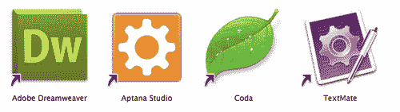
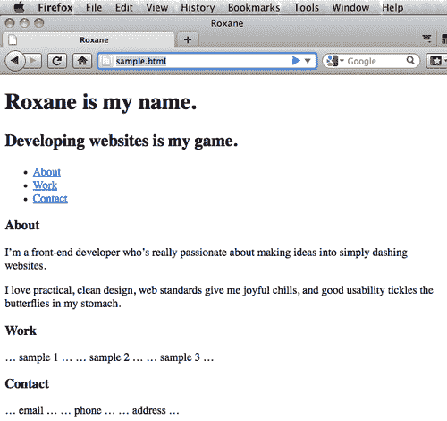

# 第一章。富媒体应用的结构化

在本章中，我们将介绍:

*   设置 HTML5 测试区域
*   将`header`标签用于标识和网站标题
*   使用`nav`标签创建目录
*   使用`section`标签来组织页面区域
*   使用`aside`标签对齐图形
*   使用`aside`标签显示多个边栏
*   实现`footer`标签
*   应用`outline`算法
*   用 HTML5 创建一个时尚的宣传片页面

# 简介

> “谁敢，谁就赢。”未知

不要听唱反调的人:HTML5 的很多方面(没有空间)都在这里，准备给我们使用。尽管有些人可能会这么想，但是没有一个遥远的日期可以让你开始使用这些新技术。事实是，下一代网络标记并不是遥不可及的梦想——它现在就在这里，随时可以探索和使用。

没有简单的超文本标记语言，任何网站都不可能存在。这种开放技术是如此重要。如果你多年来一直使用 HTML 来创建和发布网站和应用，你可能会觉得你现在已经掌握了这门语言。您已经知道语义标记、内容分离、表示和行为的好处，并且非常了解可访问性问题。事情可能会感觉有点无聊。你准备好迎接新的挑战了。

或者你是一个建立第一个网站的年轻开发人员，需要了解使用最新和最伟大技术的来龙去脉，并着眼于网络开发的未来。

无论哪种方式，你的道路都是清晰的:在你现有的 HTML 和相关技术编码能力的基础上，这本书将把你的技能提升到一个新的水平，并迅速让你创造出 HTML 以前从未有过的惊人的东西。

如果你感到自满，继续读下去。事实是，对于一个网络开发者来说，从来没有比这更令人兴奋的时刻了。更丰富的界面、无处不在的互联网以及移动设备的兴起，这些都是你正在寻找的新挑战。

幸运的是，HTML5，级联样式表的自由帮助，以及少量的 JavaScript，正在迎接这些新的挑战。网络开发的最新创新使这成为在线出版商的新黄金时代。在经历了对我们许多人来说的平静之后，我们现在很快发现为网络开发又变得有趣了！毕竟，HTML5 代表的是进化——而不是革命。

在几个成功的高知名度客户端项目中，我使用了自定义的 JavaScript 方法来部署 HTML5 的各个方面，并且仍然支持旧的浏览器，包括微软的 Internet Explorer 6。

在包含的食谱中，您将学习这种强大的方法，以及如何在现实世界的实时生产环境中使用许多仍在开发的 HTML5 标准和功能。

当我们用 HTML5 开发时，我们把语义命名的基本原则(给事物命名为它们是什么，而不是给事物如何出现命名)提升到了一个全新的水平。这是 HTML5 区别于所有前辈的关键因素。在本书的整个过程中，你会发现自己在重新思考和优化许多代码命名约定。

尽管网络超文本应用技术工作组(WHATWG)提出的 HTML5 建议要到 2022 年才能全面实施，但由于浏览器制造商的前瞻性思维，您没有理由不现在就开始使用它，并获得更好的语义命名、增强的可访问性等好处。

让我们开始做饭吧！

在本章中，我们将向您展示如何设置您的开发环境，包括使用合适的`DOCTYPE`和使用哪些浏览器，以及如何使用特定的新标签，包括:

*   `<header>` -一组引导或导航辅助工具
*   `<nav>` -导航列表
*   `<section>` -区分页面区域
*   `<aside>` -对齐特定元素
*   `<footer>` -一页或一节中最下面的信息

最后，我们将把所有这些元素放在一起，用 HTML5 创建一个时尚的专业推广页面。

# 设置 HTML5 测试区

如果我们要使用 HTML5 构建新的令人兴奋的项目，我们需要为成功做好准备。毕竟，我们希望确保我们构建的产品能够以可预测的方式展示给我们自己和我们的客户。让我们用一个代码编辑器和至少一个 web 浏览器构建一个测试套件。

## 做好准备

我们需要开始做一些事情。至少，我们都需要一个代码编辑器和一个浏览器来查看我们的工作。经验丰富的专业人士知道，我们真的需要一系列能够反映受众使用情况的浏览器。我们希望以他们的方式看待事物。我们需要以他们的方式看待事物。

## 怎么做...

许多网络开发人员表示，他们能够使用纯文本软件编写代码，如微软视窗系统的记事本或苹果 OSX 系统的文本编辑。这很好，但是尽管吹嘘，我们不知道有一个网络开发者日复一日这样工作。

相反，大多数人使用某种开发应用，如 Adobe Dreamweaver(适用于 Windows 和 Mac)或 Aptana Studio(适用于 Windows 和 Mac 和 Linux)或 Coda(我的个人首选项，仅适用于 Mac)或 TextMate(也仅适用于 Mac)。

让我们从下载这些应用中的至少一个开始:

*   adobe Dreamweaver:[http://adobe.com/products/dreamweaver](http://adobe.com/products/dreamweaver)T2】
*   Aptana 工作室:[http://aptana.com](http://aptana.com)
*   队列:[http://panic . com/queue](http://panic.com/coda)
*   text te:[http://macro mates . com](http://macromates.com)

最常见的网页编辑器的应用图标如下所示:



## 它是如何工作的...

为了让我们创建的代码正确呈现，我们需要一个网络浏览器——可能不止一个。并非所有浏览器都是平等的。正如我们将看到的，一些浏览器需要一些额外的帮助来显示一些 HTML5 标签。以下是我们将最少使用的浏览器。

如果你在苹果电脑上使用 OSX，苹果 Safari 已经安装了。如果您是微软视窗用户，互联网浏览器已经安装。

如果你使用像 iPhone 或安卓这样的现代移动设备进行开发，它已经至少安装了一个浏览器。

由于我们将在桌面上进行实际编码，让我们从以下位置下载几个浏览器开始。注意:微软互联网浏览器仅适用于个人电脑。

*   苹果野生动物园:[http://apple.com/safari](http://apple.com/safari)
*   谷歌 Chrome:[http://google.com/chrome](http://google.com/chrome)
*   Mozilla Firefox:[http://getfirefox . com](http://getfirefox.com)
*   微软互联网浏览器:[http://windows . Microsoft . com/en-US/windows/products/Internet-Explorer](http://windows.microsoft.com/en-US/windows/products/internet-explorer)

最常见的桌面网络浏览器的应用图标如下所示:


## 还有更多...

为什么我们需要不止一个浏览器？两个原因:

*   这些应用有不同的呈现引擎，并且以稍微不同的方式解释我们的代码。这意味着无论我们的代码多么有效或用心良苦，有时浏览器行为是不可预测的。我们必须为此做好计划并保持灵活性。
*   我们不能总是预测我们的观众会安装哪个浏览器，在哪个设备上，所以作为开发者，我们需要比他们领先一步，才能最好地满足他们和我们自己的需求。

### WebKit 渲染引擎

幸运的是，Safari 和 Chrome 使用相同的 WebKit 渲染引擎。iPhone 和 iPad 的 Mobile Safari，以及安卓移动设备的网络浏览器，都使用了 WebKit 渲染引擎的一个版本。

### 壁虎渲染引擎

火狐及其移动版都使用 Gecko 渲染引擎。

### 三叉戟渲染引擎

我只想告诉你我的感受。必须让你明白:这些年来，微软已经数次改变和更新了其名为 Trident 的 Internet Explorer 渲染引擎，这让我们作为开发人员的生活变得相当困难。我们经常觉得我们瞄准的是一个移动的目标。随着互联网浏览器 10 的出现，似乎不会很快改变。

## 另见

Camino(仅适用于 Mac)和 Opera(适用于微软 Windows、苹果 OSX、Linux 和移动设备)都生产了出色的替代浏览器，支持 HTML5 的许多功能。考虑将这些浏览器也添加到您的测试套件中。

*   卡米诺:[http://caminobrowser.org](http://caminobrowser.org)T2】
*   歌剧:[http://opera.com](http://opera.com)

这里显示了 Camino 和 Opera 网络浏览器的应用图标:


现在我们有了一个开发环境和多个浏览器，让我们创建一些代码！

### 类型

**渐进增强**

我们将使用渐进式增强的概念来构建我们的页面，这意味着从简单的旧 HTML 开始进行标记，然后分层 CSS 进行呈现，最后添加一点 JavaScript 进行行为。我们听到的最好的类比之一是，基本的 HTML 就像黑白电视。添加 CSS 就像添加颜色，添加 JavaScript 就有点像添加高清。

# 将标题标签用于标识和网站标题

> `<header>`元素代表一组介绍性或导航性辅助工具。一个`<header>`元素通常包含该部分的标题(一个`<h1> - <h6>`元素或一个`<hgroup>`元素)，但这不是必需的。`<header>`元素也可以用来包装一个部分的目录、搜索表单或任何相关的标识- WHATWG 的 HTML5 标准草案-[http://whatwg.org/html5](http://whatwg.org/html5)

## 做好准备

关于 HTML5 你首先会注意到的是`DOCTYPE`。如果你是网络开发的老手，你会很高兴知道我们不再需要使用像:这样冗长复杂的`DOCTYPEs`

`<!DOCTYPE html PUBLIC "-//W3C//DTD XHTML 1.0 Strict//EN" "http://www.w3.org/TR/xhtml1/DTD/xhtml1-strict.dtd">`

或者:

`<!DOCTYPE html PUBLIC "-//W3C//DTD XHTML 1.0 Transitional//EN" "http://www.w3.org/TR/xhtml1/DTD/xhtml1-transitional.dtd">`

或者:

`<!DOCTYPE html PUBLIC "-//W3C//DTD XHTML 1.0 Frameset//EN" "http://www.w3.org/TR/xhtml1/DTD/xhtml1-frameset.dtd">`

HTML5 消除了对严格、过渡和框架集的需求`DOCTYPEs`。实际上，它完全消除了对`DOCTYPES`的需求。没有一个，旧版本的互联网浏览器滑入怪癖模式，没有人想要这样。相反，我们可以使用简单的:

`<!DOCTYPE html>`

最后，一`DOCTYPE`来统治他们所有人。

让我们从一个我们都应该熟悉的基本页面结构开始:

```html
<!DOCTYPE html>
<html lang="en">
<head>
<meta charset="UTF-8">
<title></title>
<!--[if lt IE 9]><script src="http://html5shiv.googlecode.com/svn/trunk/html5.js"> </script>[endif]-->
<meta name="viewport" content="width=device-width, initial-scale=1.0">
</head>
<body>
</body>
</html>

```

创建有效的 XHTML 需要引用，但是因为 HTML5 没有耦合到 XML，所以在 HTML5 规范中引用是可选的。然而，作者建议尽可能引用属性。

敏锐的眼睛也会注意到`<meta name="viewport" content="width=device-width, initial-scale=1.0">`。这对于我们来说还不算什么，但是在移动设备上预览您的作品时，这将是至关重要的。

关闭标签也是可选的。虽然这是一个很好的实践，但是您应该权衡是否值得开发时间和增加的页面权重。

您还会注意到一个条件注释检查，以查看用户是否正在使用互联网资源管理器。如果是，我们告诉浏览器执行雷米·夏普的“HTML5 Shiv”脚本，这个脚本只是告诉 IE 表现:`<article>, <aside>, <audio>, <canvas>, <command>, <datalist>, <details>, <embed>, <figcaption>, <figure>, <footer>, <header>, <hgroup>, <keygen>, <mark>, <meter>, <nav>, <output>, <progress>, <rp>, <ruby>, <section>, <source>, <summary>, <time>, <video>, <wbr>`。

该死的互联网浏览器。它缺乏纪律。

## 怎么做...

我们将为一位名叫罗珊妮的年轻开发人员创建一个单页专业网页组合。假设罗珊妮和你一样，是一个才华横溢的网络开发人员，有很多技能。她配得上一个专业的单页作品集网站，配得上她的才华，你也一样。在下面的例子中，请随意用你的信息代替她的信息。

让我们从使用第一个新的`<header>`标签来定义我们整个页面的最顶端区域开始。

在此过程中，我们将合并新的`<hgroup>`标签，以在新的`<header>`标签中包含标题。

```html
<!DOCTYPE html>
<html lang="en">
<head>
<meta charset="UTF-8">
<title>Roxane</title>
<!--[if lt IE 9]><script src="http://html5shiv.googlecode.com/svn/trunk/html5.js"> </script>[endif]-->
<meta name="viewport" content="width=device-width, initial-scale=1.0">
</head>
<body>
<header>
<hgroup>
<h1>Roxane is my name.</h1>
<h2>Developing websites is my game.</h2>
</hgroup>
</header>
</body>
</html>

```

> `<hgroup>`元素代表一个部分的标题。当标题有多个层次时，例如副标题、替代标题或标记行，该元素用于对一组`<h1> - <h6>`元素进行分组。”- WHATWG 的 HTML5 标准草案-[http://whatwg.org/html5](http://whatwg.org/html5)

## 它是如何工作的...

新的`<header>`是我们经常存储标识、公司口号和其他通常与刊头相关的品牌的地方。它通常是 HTML5 页面上的第一个块级元素，通常用于标题，如`<h1>, <h2>`等。结果是一个语义更加丰富的代码库，可以从中构建。

## 还有更多...

在 HTML5 之前，所有的`<div>s`都被浏览器软件以及领先的搜索引擎如谷歌、雅虎给予同等的权重！，还有冰。但是我们知道`<div id="header">`的意图并不像新的`<header>`那么明显。相反，HTML5 规范更喜欢将事物命名为它们实际上是什么*。现在，HTML5 认识到，并不是所有的`<div>s`都是平等的，通过用更多的语义术语替换一些，比如新的`<header>`和`<nav>`和`<footer>`来获得更多的数据丰富性。*

 *### 在别处使用<标题>

有趣的是，刊头并不是唯一可以使用新`<header>`标签的地方。在 HTML5 中，在几乎任何块级元素中使用新的`<header>`标签也是完全可以接受的。

### 内容，不是位置

新的`<header>`标签确实经常出现在网页的顶部，但是它并不总是出现在那里。请记住，在语义上，新的`<header>`标签是由其内容定义的，而不是其位置。

### 语义命名

语义命名也让我们作为网络开发者的工作变得更加容易。像新的`<footer>`标签这样的东西的意图要明显得多，例如像模糊的`<div id="belowleft">`这样的标签。

### 类型

**语义命名的关键**

说出事物的名称，而不是它们的样子。

## 另见

我们将在[http://whatwg.org/specs/web-apps/current-work/multipage](http://whatwg.org/specs/web-apps/current-work/multipage)继续参考 WHATWG 的 HTML5 标准草案，因为它是 HTML5 演进的重要指南。

# 使用导航标签创建目录

> “`<nav>`元素表示一个导航部分，其中只有由主导航块组成的部分才适合`<nav>`元素。”- WHATWG 的 HTML5 标准草案-[http://whatwg.org/html5](http://whatwg.org/html5)

就像新的`<header>`标签取代像`<div id="header">`这样过时的命名约定一样，我们也可以用简单的新`<nav>`取代`<div id="nav">`。更有意义，不是吗？我们也这么认为。

## 做好准备

我们将像在网页上经常看到的那样添加主导航栏。这使用户能够轻松地在页面之间移动，或者在这种情况下，在同一页面内移动。罗珊妮想展示她的履历、工作样本和联系方式，所以我们将把这些作为我们的主播。

## 怎么做...

让我们使用两个最典型的元素来创建导航栏:

1.  无序列表
2.  附带超文本链接

    ```html
    <!DOCTYPE html>
    <html lang="en">
    <head>
    <meta charset="UTF-8">
    <title>Roxane</title>
    <!--[if lt IE 9]><script src="http://html5shiv.googlecode.com/svn/trunk/html5.js"> </script>[endif]-->
    <meta name="viewport" content="width=device-width, initial-scale=1.0">
    </head>
    <body>
    <header>
    <hgroup>
    <h1>Roxane is my name.</h1>
    <h2>Developing websites is my game.</h2>
    </hgroup>
    </header>
    <nav>
    <ul>
    <li><a href="#About">About</a></li>
    <li><a href="#Work">Work</a></li>
    <li><a href="#Contact">Contact</a></li>
    </ul>
    </nav>
    </body>
    </html>

    ```

## 它是如何工作的...

以前，我们会使用类似`<div id="nav">`的东西来存储导航列表。但是有了 HTML5，新的`<nav>`标签就足够了。

当我们应用 CSS 时，我们将浮动这些列表项，并使它们看起来更像传统的网络导航栏。

## 还有更多...

更语义化地命名事物的好处在于，现在我们页面的某些部分完全按照我们认为它们应该做的去做——一个`<header>`包含标题信息，`<nav>`包含导航辅助，等等。避免混淆。

### 在别处使用<导航>

像`<header>, <nav>`一样可以出现在一页的多个地方。

### 语义越多=越好

还要记住，更多的语义命名通常会导致更短、更精简的代码。毕竟`<nav>`肯定比常见的`<div id="nav">`短。这对人类和机器都更有意义。这对我们来说意味着写得更少，这为我们节省了时间。这也意味着浏览器解释和显示的代码更少，从而节省了下载和渲染时间。它还赋予内容意义和结构，类似于大纲为研究论文提供意义和结构的方式。每个人都赢。

### 还在进化

最初，新的`<nav>`元素仅用于“主要”导航块。然而，伊恩希克森，HTML5 背后的驱动力，更新了规范，成为“主要”导航块。

## 另见

由于这是一个仍在发展的标准，我们鼓励您为 HTML5 的发展做出贡献，并帮助塑造语言。加入 WHATWG 的`<[help@whatwg.org](mailto:help@whatwg.org)>`邮件列表，提出建议和问题。报名说明在:[http://whatwg.org/mailing-list#help](http://whatwg.org/mailing-list#help)。

# 使用节标签来组织页面区域

> `<section>`元素表示通用文档内容块或应用块。在这种情况下，`<section>`是内容的主题分组，通常带有标题。”- WHATWG 的 HTML5 标准草案-http://whatwg.org/html5

## 做好准备

让我们为罗珊妮单页投资组合网站的每个主要区域添加新的`<section>`标签。这些`<section>s`将被用作容器，每个容器都有一个标题和通用内容，包含她的个人信息、工作实例和联系方式。

## 怎么做...

新的`<section>`标签的使用可能很棘手。有很多东西不是，但只有某些东西是。

```html
<!DOCTYPE html>
<html lang="en">
<head>
<meta charset="UTF-8">
<title>Roxane</title>
<!--[if lt IE 9]><script src="http://html5shiv.googlecode.com/svn/trunk/html5.js"> </script>[endif]-->
<meta name="viewport" content="width=device-width, initial-scale=1.0">
</head>
<body>
<header>
<hgroup>
<h1>Roxane is my name.</h1>
<h2>Developing websites is my game.</h2>
</hgroup>
</header>
<nav>
<ul>
<li><a href="#About">About</a></li>
<li><a href="#Work">Work</a></li>
<li><a href="#Contact">Contact</a></li>
</ul>
</nav>
<section id="About">
<h3>About</h3>
<p>I'm a front-end developer who's really passionate about making ideas into simply dashing websites.</p>
<p>I love practical, clean design, web standards give me joyful chills, and good usability tickles the butterflies in my stomach.</p>
</section>
<section id="Work">
<h3>Work</h3>
<p>sample 1</p>
<p>sample 2</p>
<p>sample 3</p>
</section>
<section id="Contact">
<h3>Contact</h3>
<p>email</p>
<p>phone</p>
<p>address</p>
</section>
</body>
</html>

```

## 它是如何工作的...

我们使用新的`<section>`标签不是作为`<div>`的通用替换，而是以语义正确的方式作为通常包含标题的相关分组。

## 还有更多...

如果内容分组不相关，可能就不应该是`<section>`。考虑一个`<div>`代替。

### 截面不等于 div

请记住:如果它没有`<header>`，它可能不需要`<section>`。使用`<section>`对内容进行分组，但纯粹出于文体原因对项目进行分组时使用`<div>`。

### 章节指南

仍然不确定`<section>`是否是正确的标签？请记住这些准则:

*   你是仅仅用它来设计风格还是脚本？那是一个`<div>`。
*   如果任何其他标签更合适，请使用它。
*   仅当内容开头有标题时使用。

### 还在进化

HTML5 是一套不断发展的标准。WHATWG 的最新指导建议:

> “鼓励作者使用`<article>`元素，而不是`<section>`元素，如果整合元素的内容是有意义的话。”

发布关于页面？这可能是一个很好的候选人。

## 另见

新的`<section>`标签也可以支持引文的引用属性。

# 使用旁边的标签对齐图形

> `<aside>`元素表示页面的一部分，该部分包含与`<aside>`元素周围的内容相切的内容，并且可以被视为与该内容分离- WHATWG 的 HTML5 标准草案-[http://whatwg.org/html5](http://whatwg.org/html5)

## 做好准备

让我们以一种常见的方式使用新的`<aside>`标签:创建一个缩略图侧栏，列出罗珊妮最近一直忙于阅读的内容。

## 怎么做...

过去，我们在文本的左边或右边放置图像或列表。这仍然有效，但是现在我们可以更好地利用 HTML5 中改进的语义，通过使用新的`<aside>`标签来实现类似的视觉效果。让我们使用:

*   有序列表
*   缩略图
*   书名

```html
<!DOCTYPE html>
<html lang="en">
<head>
<meta charset="UTF-8">
<title>Roxane</title>
<!--[if lt IE 9]><script src="http://html5shiv.googlecode.com/svn/trunk/html5.js"> </script>[endif]-->
<meta name="viewport" content="width=device-width, initial-scale=1.0">
</head>
<body>
<header>
<hgroup>
<h1>Roxane is my name.</h1>
<h2>Developing websites is my game.</h2>
</hgroup>
</header>
<nav>
<ul>
<li><a href="#About">About</a></li>
<li><a href="#Work">Work</a></li>
<li><a href="#Contact">Contact</a></li>
</ul>
</nav>
<section id="About">
<h3>About</h3>
<p>I'm a front-end developer who's really passionate about making ideas into simply dashing websites.</p>
<p>I love practical, clean design, web standards give me joyful chills, and good usability tickles the butterflies in my stomach.</p>
</section>
<section id="Work">
<h3>Work</h3>
<p>sample 1</p>
<p>sample 2</p>
<p>sample 3</p>
</section>
<section id="Contact">
<h3>Contact</h3>
<p>email</p>
<p>phone</p>
<p>address</p>
</section>
<aside>
<h4>What I'm Reading</h4>
<ul>
<li> Inkscape 0.48 Essentials for Web Designers</li>
<li> jQuery 1.4 Reference Guide</li>
<li> Blender 2.5 Lighting and Rendering</li>
<li> Blender 2.5 Lighting and Rendering</li>
</ul>
</aside>
</body>
</html>

```

注意:在这种情况下，ALT 标签周围需要引号来确保有效性。

## 它是如何工作的...

`<aside>`标签有效地用于放置像图像和文本这样的项目，这些项目通常不如主要页面内容重要。

## 还有更多...

在语义上，`<aside>`类似于侧边栏。这不一定是指位置，而是指不相关的内容。

### 不是所有的<段>都是一样的

虽然`<section>`是相关内容的一个通用部分，但是把`<header>, <nav>, <footer>`和`<aside>`想象成`<section>`的专用类型。

### 提示要记住

没有`<aside>`标签内容可以活，但是`<aside>`标签没有内容就活不下去。

### 撇开<撇开>

`<aside>`标签的定义已经扩展到不仅包括与它相关的`<article>`的信息，还包括与站点本身相关的信息，如博客。

## 另见

杰里米·基思写了杰出的*“网页设计师的 html 5”*，这被认为是你了解这一组新技术最不需要知道的。在[找到它。](http://books.alistapart.com/products/html5-for-web-designers)

# 使用侧边标签显示多个边栏

> `<aside>`元素表示页面的一部分，该部分包含与`<aside>`元素周围的内容相切的内容，并且可以被视为与该内容分离- WHATWG 的 HTML5 标准草案-[http://whatwg.org/html5](http://whatwg.org/html5)

## 做好准备

似乎每个博客和许多其他类型的网站都有装满各种信息的侧栏。在这里，我们将使用新的`<aside>`标签向罗珊妮的单页投资组合网站添加一个额外的侧边栏。

## 怎么做...

罗珊妮想让人们知道她还能去哪里，你也一样。让我们使用`<aside>`标签来创建一个侧边栏，并引起对她的网络状态的注意:

```html
<!DOCTYPE html>
<html lang="en">
<head>
<meta charset="UTF-8">
<title>Roxane</title>
<!--[if lt IE 9]><script src="http://html5shiv.googlecode.com/svn/trunk/html5.js"> </script>[endif]-->
<meta name="viewport" content="width=device-width, initial-scale=1.0">
</head>
<body>
<header>
<hgroup>
<h1>Roxane is my name.</h1>
<h2>Developing websites is my game.</h2>
</hgroup>
</header>
<nav>
<ul>
<li><a href="#About">About</a></li>
<li><a href="#Work">Work</a></li>
<li><a href="#Contact">Contact</a></li>
</ul>
</nav>
<section id="About">
<h3>About</h3>
<p>I'm a front-end developer who's really passionate about making ideas into simply dashing websites.</p>
<p>I love practical, clean design, web standards give me joyful chills, and good usability tickles the butterflies in my stomach.</p>
</section>
<section id="Work">
<h3>Work</h3>
<p>sample 1</p>
<p>sample 2</p>
<p>sample 3</p>
</section>
<section id="Contact">
<h3>Contact</h3>
<p>email</p>
<p>phone</p>
<p>address</p>
</section>
<aside>
<h4>What I'm Reading</h4>
<ul>
<li> Inkscape 0.48 Essentials for Web Designers</li>
<li> jQuery 1.4 Reference Guide</li>
<li> Blender 2.5 Lighting and Rendering</li>
</ul>
</aside>
<aside>
<h4>Elsewhere</h4>
<p>You can also find me at:</p>
<ul>
<li><a href="http://linkedin.com/in/">LinkedIn</a></li>
<li><a href="http://twitter.com/">Twitter</a></li>
<li><a href="http://facebook.com/">Facebook</a></li>
</ul>
</aside>
</body>
</html>

```

## 它是如何工作的...

在我们之前成功使用`<aside>`标签的基础上，我们再次使用它来对齐主要信息之后的信息。

## 还有更多...

仅仅因为一个设计需要一个侧边栏，就不要自动去获取`<aside>`标签。在考虑立场之前，仔细考虑你的内容。

### 将对<有利的报价拉到一边>

拉引在新闻文章中很常见，因此是包含在`<aside>`标签中的首选。

### 记得验证

我们需要在这些锚点周围添加引号，以使它们有效。

## 另见

布鲁斯·劳森和雷米·夏普共同撰写了优秀的*介绍 HTML5* 参考资料，可在:[http://peachpit.com/store/product.aspx?isbn=0321687299](http://peachpit.com/store/product.aspx?isbn=0321687299)查阅

# 实现页脚标签

> “`<footer>`元素表示已完成的文档或其最近的祖先切片内容的页脚。”- WHATWG 的 HTML5 标准草案-[http://whatwg.org/html5](http://whatwg.org/html5)

## 做好准备

我们都在网页上使用页脚——通常用于辅助导航等。这包含了你通常在页面底部看到的所有信息，比如版权声明、隐私政策、使用条款等等。像新的`<header>`标签一样，新的`<footer>`标签可以出现在多个地方。

## 怎么做...

在这种情况下，我们将使用新的`<footer>`标签将罗珊妮的版权信息放在页面底部。

### 类型

这是一个成长的基础

记住:版权不代表你有权利复制！

```html
<!DOCTYPE html>
<html lang="en">
<head>
<meta charset="UTF-8">
<title>Roxane</title>
<!--[if lt IE 9]><script src="http://html5shiv.googlecode.com/svn/trunk/html5.js"> </script>[endif]-->
<meta name="viewport" content="width=device-width, initial-scale=1.0">
</head>
<body>
<header>
<hgroup>
<h1>Roxane is my name.</h1>
<h2>Developing websites is my game.</h2>
</hgroup>
</header>
<nav>
<ul>
<li><a href="#About">About</a></li>
<li><a href="#Work">Work</a></li>
<li><a href="#Contact">Contact</a></li>
</ul>
</nav>
<section id="About">
<h3>About</h3>
<p>I'm a front-end developer who's really passionate about making ideas into simply dashing websites.</p>
<p>I love practical, clean design, web standards give me joyful chills, and good usability tickles the butterflies in my stomach.</p>
</section>
<section id="Work">
<h3>Work</h3>
<p>sample 1</p>
<p>sample 2</p>
<p>sample 3</p>
</section>
<section id="Contact">
<h3>Contact</h3>
<p>email</p>
<p>phone</p>
<p>address</p>
</section>
<aside>
<h4>What I'm Reading</h4>
<ul>
<li> Inkscape 0.48 Essentials for Web Designers</li>
<li> jQuery 1.4 Reference Guide</li>
<li> Blender 2.5 Lighting and Rendering</li>
<footer> tagimplementing</ul>
</aside>
<aside>
<h4>Elsewhere</h4>
<p>You can also find me at:</p>
<ul>
<li><a href="http://linkedin.com/in/">LinkedIn</a></li>
<li><a href="http://twitter.com/">Twitter</a></li>
<li><a href="http://facebook.com/">Facebook</a></li>
</ul>
</aside>
<footer>
<h5>All rights reserved. Copyright Roxane.</h5>
</footer>
</body>
</html>

```

## 它是如何工作的...

虽然这个`<footer>`位于罗珊妮单页作品集网站的底部，但它也可以在页面的其他地方使用，比如在`<section>`标签的底部，包含作者、出版日期等信息。结果比旧的`<div id="footer">`允许我们做的更灵活。在这种情况下以及许多其他情况下，HTML5 的新标签允许我们根据我们的内容而不是布局，在最有意义的地方放置适当的标签。

## 还有更多...

HTML5 规范建议作者信息包含在新的`<footer>`标签中，无论`<footer>`是`<section>`还是`<article>`的一部分，甚至是在页面的底部。

### 这种情况通常会发生

绝大多数情况下，您会在文档顶部使用`<header>`标签，在底部使用`<footer>`标签，在侧面使用`<aside>`标签。

### 灵活的页脚内容

当`<footer>`元素包含整个部分时，它们代表附录、索引、长跋、详细的许可协议和其他类似的内容。

### 更灵活的页脚内容

新的`<footer>`标签还可以包含作者归属、相关文档链接、版权等信息。

## 另见

马克·皮尔格林创建了一个非常棒的免费在线 HTML5 参考*潜入 HTML5* 位于:[http://diveintohtml5.org](http://diveintohtml5.org)。

# 应用轮廓算法

对我们来说幸运的是，HTML5 现在有了一种在浏览器中组装页面轮廓的方法，因此搜索引擎和可访问性技术可以更好地理解它们。我们将在以下位置使用 html 5 Outliner:[http://gsnedders.html5.org/outliner](http://gsnedders.html5.org/outliner)T2】

## 做好准备

要使用 HTML5 Outliner，我们可以使用存储在本地计算机上的 HTML 或通过 URL 可见的代码。确保将我们创建的代码保存在本地，或者将其上传到可公开访问的 web 服务器上。

## 怎么做...

让我们确保将此文档保存在本地硬盘或远程服务器上。我们将访问 http://gsnedders.html5.org/outliner 来创建我们的大纲。

使用前面的代码示例，我们可以生成以下代码大纲:

1.  罗珊妮是我的名字。
2.  无标题部分
3.  关于
4.  工作
5.  接触
6.  我在读什么
7.  在别处
8.  保留所有权利。版权所有罗珊妮。

## 它是如何工作的...

> “它是根据遍历 DOM 树的节点来定义的，按照树的顺序，每个节点在遍历过程中当它进入*和当它离开*时都会被访问。”- WHATWG**

## 还有更多...

假设任何标题后面的内容都与该标题相关。因此，我们可以使用许多像`<section>`这样的新 HTML5 标签来明确演示相关内容的开始和结束。

### 你确定吗？

如果 HTML5 Outliner 工具显示类似“无标题部分”的消息，您应该重新考虑如何使用您的每个标签，并确保您的方法符合规范的意图。

### 一个例外

“无标题部分”消息应被视为警告而不是错误。虽然`<section>`和其他新的 HTML5 标签需要一个标题标签，但没有一个标题标签用于`<nav>`区域是完全有效的。

### 记住可达性

创建的大纲确保我们创建的代码符合 W3C 的标记标准，以及 WAI-ARIA 等先进技术的可访问性要求。

### 类型

好的无障碍设计就是好的网页设计。

## 另见

http://html5doctor.com 网站是一个由包括里奇·克拉克、布鲁斯·劳森、杰克·奥斯本、迈克·罗宾逊、雷米·夏普、汤姆·里德贝特和奥利·斯图德霍姆在内的七位思想领袖撰写的非常棒的互动参考资料。

# 用 HTML5 打造时尚的宣传片页面

我们的朋友罗珊妮的单页投资组合网站使用了多种新的 HTML5 元素。她准备好向世界展示她是一个前瞻性的网络开发人员，准备好应对高级项目。

## 做好准备

我们已经做了准备工作，为单页作品集网站汇集了大量内容。它现在还不是很时尚，但是当我们把 CSS 放在它上面的时候，这将会真正地结合在一起，并且会像我们的想象所允许的那样时尚。

## 怎么做...

这是我们目前掌握的代码。它对万维网联盟的 HTML5 和第 508 节可访问性测试有效。无论是在桌面上还是在移动设备上，这种没有样式的代码都应该可以在任何现代网络浏览器中轻松查看。

```html
<!DOCTYPE html>
<html lang="en">
<head>
<meta charset="UTF-8">
<title>Roxane</title>
<!--[if lt IE 9]><script src="http://html5shiv.googlecode.com/svn/trunk/html5.js"> </script>[endif]-->
<meta name="viewport" content="width=device-width, initial-scale=1.0">
</head>
<body>
<header>
<hgroup>
<h1>Roxane is my name.</h1>
<h2>Developing websites is my game.</h2>
</hgroup>
</header>
<nav>
<ul>
<li><a href="#About">About</a></li>
<li><a href="#Work">Work</a></li>
<li><a href="#Contact">Contact</a></li>
</ul>
</nav>
<section id="About">
<h3>About</h3>
<p>I'm a front-end developer who's really passionate about making ideas into simply dashing websites.</p>
<p>I love practical, clean design, web standards give me joyful chills, and good usability tickles the butterflies in my stomach.</p>
</section>
<section id="Work">
<h3>Work</h3>
<p>sample 1</p>
<p>sample 2</p>
<p>sample 3</p>
</section>
<section id="Contact">
<h3>Contact</h3>
<p>email</p>
<p>phone</p>
<p>address</p>
</section>
<aside>
<h4>What I'm Reading</h4>
<ul>
<li> Inkscape 0.48 Essentials for Web Designers</li>
<li> jQuery 1.4 Reference Guide</li>
<li> Blender 2.5 Lighting and Rendering</li>
</ul>
</aside>
<aside>
<h4>Elsewhere</h4>
<p>You can also find me at:</p>
<ul>
<li><a href="http://linkedin.com/in/">LinkedIn</a></li>
<li><a href="http://twitter.com/">Twitter</a></li>
<li><a href="http://facebook.com/">Facebook</a></li>
</ul>
</aside>
<footer>
<h5>All rights reserved. Copyright Roxane.</h5>
</footer>
</body>
</html>

```

## 它是如何工作的...

对于开发人员或设计人员来说，单页的投资组合网站很有意义，因为所有信息都可以很快提供给招聘职位的人员，如人力资源团队或招聘人员。

## 还有更多...

这正是罗珊妮需要展示的那种专业的单页组合网站，她是一个学习运用下一代网络标准的前瞻性开发人员。

### 尽量不带湿婆

作为一个实验，关闭代码中的“HTML5 Shiv”JavaScript 引用，看看不同版本的 Internet Explorer 如何对待我们新的 html 5 标签。

### 移动优先

创建此网站和其他网站时，请记住考虑移动显示器。几乎从来没有一个好的理由阻止整群人看到你的内容。

### IE 邪恶？

在过去的 15 年左右的时间里，我们花费了大量的时间和精力抨击微软互联网浏览器缺乏标准支持和对盒子模型的错误解释。即将到来的 IE10 让我们更接近一个更加统一的网络开发世界，但我们离摆脱诅咒 IE 还有好几年的时间。

## 另见

要获得大量单页作品集和其他网站灵感，请访问[http://onepagelove.com](http://onepagelove.com)画廊。

在大多数主要的现代桌面网络浏览器上显示的无样式单页产品组合:

*