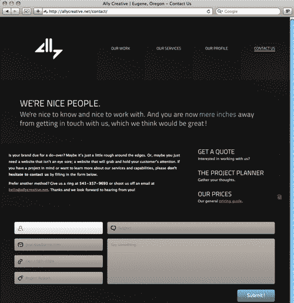
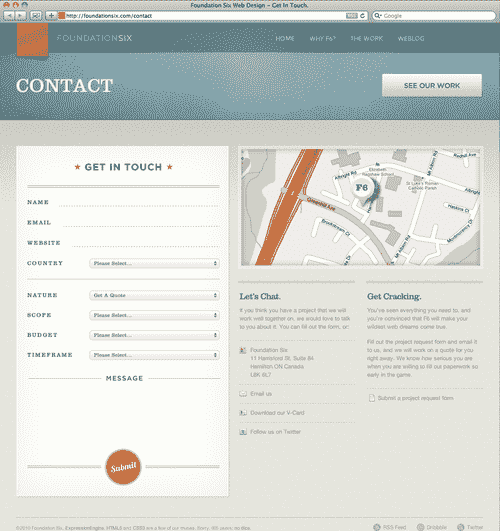
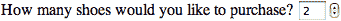

# 第五章。学会热爱形式

在本章中，我们将介绍:

*   显示占位符文本
*   将自动对焦添加到表单域
*   使用 HTML5 和 CSS3 设计表单
*   使用电子邮件输入类型
*   使用网址输入类型添加网址
*   使用数字标签
*   使用范围标签
*   创建搜索字段
*   创建显示日期和时间的选取器

# 简介

> “我们遇到了敌人，他就是我们。”-波哥

无聊。乏味。没脑子。为什么在网上呈现一个互动的形式时，网络用户的眼睛呆滞，头脑麻木？这位作者认为，问题的至少一部分在于安排表单域的信息架构师，以及(在较小程度上)编码表单域的前端开发人员。

诚然，形式并不性感。但是如果你是一名网络开发人员(如果你正在阅读这篇文章，你很有可能是这样的)，那么在你职业生涯的某个时候，你很有可能会被要求标记和设计某种形式。如果你害怕编码这种形式，想象一下你在你的用户身上制造了多少恐惧。现在结束了。

你成熟了，正在寻求与成熟相称的新挑战。如果我们能停止担忧，学会热爱这种形式，我们的观众也会更喜欢这种形式。

在本章中，我们将查看 HTML5 如何用于交互式表单的真实示例，包括显示占位符文本、向表单字段添加自动对焦、使用 HTML5 和 CSS3 设置表单样式、使用电子邮件输入类型、使用 URL 输入类型添加 URL、使用数字标签、使用范围标签、创建搜索字段以及创建显示日期和时间的选取器。

现在我们开始做饭吧！

# 显示占位符文本

我们想要检查的第一个新的 HTML5 表单功能是显示占位符文本的本机功能。

## 怎么做...

我们以前都使用过——甚至创建过——表单占位符文本。但是现在有了 HTML5，我们将做得稍微不同一些，效率也更高。帕克特出版网站具有搜索整个网站或只搜索书籍/电子书的功能。


一旦用户单击这两个表单域之一，占位符文本就会消失。


这是通过使用值属性显示占位符文本的传统方法来实现的:

```html
<form action='/search'>
<div id="search-site">
<input type="text" class="form-text" name='keys' value="Search entire site" onclick='clearIf(this, "Search entire site")'/>
</div>
<div id="search-button-site">
<input type="image" src="/sites/all/themes/pixture_reloadimg/pp/search- button.png">
</div>
</form>
<form action='/books'>
<div id="search-books">
<input type="text" class="form-text" name='keys' value="Search only books/eBooks" onclick='clearIf(this, "Search only books/eBooks")'/>
</div>
<div id="search-button-books">
<input type="image" src="/sites/all/themes/pixture_reloadimg/pp/search- button.png">
</div>
</form>

```

使用`placeholder`属性代替`value`会产生:

```html
<form action='/search'>
<div id="search-site">
<input type="text" class="form-text" name='keys' placeholder="Search entire site" onclick='clearIf(this, "Search entire site")'/>
</div>
<div id="search-button-site">
<input type="image" src="/sites/all/themes/pixture_reloadimg/pp/search- button.png">
</div>
</form>
<form action='/books'>
<div id="search-books">
<input type="text" class="form-text" name='keys' placeholder="Search only books/eBooks" onclick='clearIf(this, "Search only books/eBooks")'/>
</div>
<div id="search-button-books">
<input type="image" src="/sites/all/themes/pixture_reloadimg/pp/search- button.png">
</div>
</form>

```

## 它是如何工作的...

`placeholder`属性可以代替`value`属性在表单中显示占位符文本。在这种情况下，开发人员添加了一个`onclick`事件处理程序来适应旧的浏览器。这是高级语义向标签添加额外含义的另一种情况。

## 还有更多...

请记住，并做好计划，占位符文本本身将在用户单击每个表单域时消失。如果用户点击离开而没有填写表单字段，则`placeholder`会重新出现。

### 仅文本

`placeholder`属性只能包含文本。我们不能在其中包含额外的标记、图像或任何其他元素。

### 拥抱斜体

默认情况下，占位符文本将以斜体显示。不幸的是，没有好的方法来改变这一点。与其把头撞在墙上，不如提前知道这一点，让你的设计师相信文字*应该是斜体的*，让那个人专注于真正重要的事情。

### 浏览器支持

支持新`placeholder`属性的网页浏览器。


## 另见

建立公会是全国网络人的每月聚会。用 HTML5 构建(并使用占位符属性！)在[http://buildguild.org](http://buildguild.org)，开发者可以每隔几周聚在一起边喝边聊。已经有城市的地方分会，如:德克萨斯州阿比林；纽约州奥尔巴尼；比林斯，MT；密歇根州大急流城；康涅狄格州哈特福德；肯塔基州路易斯维尔；威斯康星州密尔沃基；纽约市，纽约；宾夕法尼亚州费城；宾夕法尼亚州匹兹堡；密苏里州圣路易斯；马萨诸塞州塞勒姆。

如果你所在的地区还没有建筑行会，那就创建一个吧！联系[http://buildguild.org](http://buildguild.org)网站主了解入门事宜！胡子可选。

# 为表单域添加自动对焦

在过去，我们不得不依靠 JavaScript 将输入焦点添加到特定的表单字段中，但现在已经不是了！现在我们有能力在 HTML5 中进行原生操作了！

## 怎么做...

在[http://allycreative.net/contact](http://allycreative.net/contact)的盟友创造力在他们的接触形式中有效地使用了`autofocus`能力。



## 它是如何工作的...

他们是这样做的:

```html
<form action="" method="post">
<ol id="left">
<li>
<label for="contact-name" class="label-fade">Jane Doe of ACME Corporation</label>
<input type="text" id="contact-name" name="contact-name" title="Name / Business" autofocus /></li>
<li>
<label for="contact-mail" class="label- fade">jane.doe@acme.com</label>
<input type="text" id="contact-mail" name="contact-mail" title="E-mail Addy" /></li>
<li>
<label for="contact-phone" class="label-fade">541 / 567- 5309</label>
<input type="text" id="contact-phone" name="contact-phone" title="Phone Number" /></li>
<li>
<label for="contact-budget" class="label-fade">Project Budget</label>
<input type="text" id="contact-budget" name="contact-budget" title="Budget" /></li>
<li><input type="hidden" id="contact-human" name="contact-human" title="Human" /></li>
</ol>
<ol id="right">
<li>
<label for="contact-subject" class="label-fade">Subject</label>
<input type="text" id="contact-subject" name="contact-subject" title="Budget" /></li>
<li>
<label for="contact-body" id="textarea-label" class="label- fade">Say something.</label>
<textarea id="contact-body" name="contact-body" title="Contact Copy"></textarea></li>
<li class="f-right"><span id="required"></span> <input type="image" src="http://allycreative.nimg/button.png" id="submit-button" alt="Submit!" /></li>
</ol>
</form>

```

通过简单地将`autofocus`属性应用到联系人姓名的表单字段中，并添加适当的样式来更改背景颜色，Ally Creative 的开发人员创建了一个流畅的交互式表单，便于用户完成。

## 还有更多...

新的 HTML5 `autofocus`属性适用于所有表单控件。所以不管你是在收集用户的姓名、地址、电话号码，还是其他一些数据，都要潇洒地使用`autofocus`这个功能！

### 每页一张

请记住，每页只能将一个表单域设置为`autofocus`。

### 旧版浏览器

一会儿，你会看到目前只有两款现代浏览器支持`autofocus`。幸运的是，旧的浏览器只是忽略了这个属性。考虑像`autofocus`这样的工具，对于那些能够看到它的人来说，它丰富了用户体验，而对于那些使用较少浏览器的人来说，它不会损害或降低用户体验。没有伤害，没有犯规。

### 浏览器支持

支持新`autofocus`属性的网页浏览器:


## 另见

Mozilla 的“HTML5 人物”视频系列展示了 HTML5 运动的许多主要声音。雷米·夏普，我们在别处研究和使用的“html 5*Shim”*的作者，是一个 JavaScript 工匠。当他描述新的 HTML5 规范中他最喜欢的方面时，这应该不足为奇:

“对我来说，HTML5 最令人兴奋的方面是 JavaScript APIs 的深度。很难向乔·布洛格斯解释，实际上这个新指定的 HTML 版本并不主要是 HTML；大部分是 JavaScript。”

阅读并观看完整采访时间:[http://hacks.mozilla.org/2011/01/people-of-html5-remy-sharp](http://hacks.mozilla.org/2011/01/people-of-html5-remy-sharp)。

# 使用 HTML5 和 CSS3 设计表单

作者看到的使用 HTML5 和 CSS3 的最简单但最漂亮的例子之一是由加拿大的 FoundationSix 在 http://foundationsix.com/contact 提供的。他们是这样做的。



## 怎么做...

FoundationSix 的团队从一个相当简单的联系人表单标记开始。请注意，为了节省空间，本例中省略了冗长的国家下拉列表。

## 它是如何工作的...

```html
<form id="contactf6" method="post" action="http://foundationsix.com/index.php" enctype="multipart/form-data" >
<fieldset id="contactinfo">
<ul>
<li>
<label for="name">Name</label>
<input id="name" name="name" type="text" class="required">
</li>
<li>
<label for="email">Email</label>
<input id="email" name="email" type="text" class="required email">
</li>
<li>
<label for="website">Website</label>
<input id="website" name="website" type="text" class="required">
</li>
<li>
<label for="country">Country</label>
<select id="country" name="country" class="selectors">
<option selected value="">Please Select...</option>
</select>
</li>
</ul>
</fieldset>
<fieldset id="natureinfo">
<ul>
<li class="selectli">
<label for="nature">Nature</label>
<select id="nature" name="nature" class="selectors">
<option selected value="Get A Quote">Get A Quote</option>
<option value="Get More Info">Get More Info</option>
<option value="Say Hello">Say Hello</option>
</select>
</li>
<li class="selectli showmore">
<label for="scope">Scope</label>
<select id="scope" name="scope" class="selectors">
<option selected value="">Please Select...</option>
<option value="Complete Website Design">Complete Website Design</option>
<option value="Design Only">Design Only</option>
<option value="Coding Only">HTML / CSS Coding Only</option>
<option value="Other">Other</option>
</select>
</li>
<li class="selectli showmore">
<label for="budget">Budget</label>
<select id="budget" name="budget" class="selectors">
<option selected value="">Please Select...</option>
<option value="$2,500-$5,000">$2,500-$5,000</option>
<option value="$5,000-$7,500">$5,000-$7,500</option>
<option value="$7,500-$10,000">$7,500-$10,000</option>
<option value="$10,000-$15,000">$10,000-$15,000</option>
<option value="$15,000-$20,000">$15,000-$20,000</option>
<option value="$20,000-$50,000">$20,000-$50,000</option>
<option value="$50,000+">$50,000+</option>
</select>
</li>
<li class="selectli showmore">
<label for="timeframe">Timeframe</label>
<select id="timeframe" name="timeframe" class="selectors">
<option selected value="">Please Select...</option>
<option value="Right Away">Right Away</option>
<option value="Within 1 Month">Within 1 Month</option>
<option value="Within 2 Months">Within 2 Months</option>
<option value="Within 3 Months">Within 3 Months</option>
<option value="Within 6 Months">Within 6 Months</option>
<option value="Don't Know Yet">Don't Know Yet</option>
</select>
</li>
</ul>
</fieldset>
<fieldset id="message">
<ul>
<li>
<label for="messagetext">Message</label>
<textarea id="messagetext" name="message"></textarea>
</li>
</ul>
</fieldset>
<div id="submitbutton"><input type="submit" name="submit"></div>
</form>

```

团队只为这个联系页面提供了一个特殊的样式表。注意它有多干净，只定义了必要的值，而省略了任何 cruft。

```html
html {
background: url(../img/sitebg.jpg) repeat; -webkit-font-smoothing: antialiased;
}
body {
color: #8a8a8a; font: 13px/19px "Helvetica Neue", Arial, Helvetica, Geneva, sans-serif; background: url(../img/subbg.jpg) repeat-x;
}
#contactform {
float: left; width: 498px; margin-bottom: 40px;
}
#formtop {
height: 97px; width: 498px; background: url(../img/formtop.png) no-repeat;
}
#formtop h1 {
text-indent: -9999px; width: 445px; height: 57px; margin: 0 auto; background: url(../img/formheader.png) no-repeat; position: relative; top: 39px;
}
#formcontent {
background-image: url(../img/formrepeat.png); width: 498px; background-position: 1px;
}
form {
width: 445px; margin: 0 auto;
}
form label {
font: 13px "ClarendonRoman", Georgia, Times, serif; color: #525250; letter-spacing: 2px; text-transform: uppercase; float: left; position: relative; top: 4px;
}
form label.error {
text-transform: none; letter-spacing: 0; color: #a21714; font: 15px "SeanRegular", Courier New, Courier New, Courier6, monospace; margin-top: -10px; clear: both; padding: 0px 0px 10px 21px; background: url(../img/errow.png) no-repeat 0 0;
}
form ul {
padding-top: 10px;
}
form ul li {
padding-top: 10px; clear: both; overflow: hidden;
}
form ul li.selectli {
padding-bottom: 10px;
}
form select, form input {
float: right;
}
form input {
border-bottom: 1px dashed #989895; border-right: none; border-left: none; border-top: none; color: #4f4f4f; background: none; outline: none; position: relative; bottom: 13px; font: 16px "SeanRegular", Courier New, Courier New, Courier6, monospace; letter-spacing: 1px;
}
form input:focus {
border-bottom: 1px dashed #000; -webkit-transition:border 0.3s ease-in; -moz-transition:border 0.3s ease-in; -o-transition:border 0.3s ease-in; transition:border 0.3s ease-in;
}
form select {
width: 300px;
}
input#name {
width: 370px;
}
input#email {
width: 360px;
}
input#website {
width: 340px;
}
fieldset#contactinfo {
padding-bottom: 23px; border-bottom: 1px solid #a7a7a4;
}
fieldset#natureinfo {
margin-top: 4px;
}
fieldset#message {
background: url(../img/messagebar.png) top no-repeat; width: 445; margin-top: 25px;
background: url(../img/messagebar.png) top no-repeat; width: 445; margin-top: 25px;
}
fieldset#message label {
display: none;
}
textarea#messagetext {
margin-top: 4px; width: 445px; height: 150px; border: none; background: none; outline: none; resize: none; overflow: auto; color: #4f4f4f; font: 16px "SeanRegular", Courier New, Courier New, Courier6, monospace; letter-spacing: 1px; float: left; display: block;
}
#submitbutton {
float: right;
}
#submitbutton input {
cursor: pointer; background: url(../img/submit.png) no-repeat; width: 445px; height: 86px; border: none; text-indent: -9999px; position: relative; bottom: 10px;
}
#submitbutton input:hover {
background-position: 0 -86px;
}
span#formbottom {
background: url(../img/formbottom.png) no-repeat; width: 498px; height: 108px; display: block;
}
#othercontact {
float: right; width: 566px; margin-bottom: 40px;
}
#map {
width: 552px; height: 269px; background: url(../img/map.jpg) center no-repeat rgb(233,233,228); background: url(../img/map.jpg) center no-repeat rgba(255,255,255,0.3); padding: 6px; border: 1px solid rgb(249,249,248); border: 1px solid rgba(255,255,255,0.7); margin-bottom: 28px; position: relative;
}
span#mappointer {
width: 77px; height: 80px; display: block; position: absolute; top: 66px; left: 257px; background-image: url(../img/map-pin.png);
}
section.subcontact {
float: left; width: 267px; position: relative; padding-left: 3px; border-top: 6px solid #d3d2c5; -webkit-transition:border 0.4s ease-in; -moz-transition:border 0.4s ease-in; -o-transition:border 0.4s ease-in; transition:border 0.4s ease-in;
float: left; width: 267px; position: relative; padding-left: 3px; border-top: 6px solid #d3d2c5; -webkit-transition:border 0.4s ease-in; -moz-transition:border 0.4s ease-in; -o-transition:border 0.4s ease-in; transition:border 0.4s ease-in;
}
section.subcontact:hover {
border-top: 6px solid #cc7b58; -webkit-transition:border 0.3s ease-in; -moz-transition:border 0.3s ease-in; -o-transition:border 0.3s ease-in; transition:border 0.3s ease-in;
}
section.subcontact h2 {
padding-top: 17px; color: #5a5a5a; font: 20px "ClarendonRoman", Georgia, Times, serif; margin-bottom: 10px; letter-spacing: -0.05em;
}
section.subcontact p {
margin-bottom: 16px; width: 260px;
}
section.subcontact.subright {
position: relative; left: 25px;
}
ul.iconlist {
padding-top: 6px;
}
ul.iconlist li {
padding: 12px 25px; border-top: 1px dashed #b2b2ab;
}
li#mapicon {
background: url(../img/icons/map.png) no-repeat 0 14px;
}
li#emailicon {
background: url(../img/icons/mail.png) no-repeat 0 13px;
}
li#vcardicon {
background: url(../img/icons/card.png) no-repeat 0 13px;
}
li#twittericon {
background: url(../img/icons/twitter.png) no-repeat 0 13px;
}
li#docicon {
background: url(../img/icons/doc.png) no-repeat 3px 13px;
}

```

## 还有更多...

在很大程度上，向 HTML5 添加级联样式表就像向 XHTML 或以前版本的 HTML 添加 CSS 一样。只是现在我们有了额外的标签来跟踪。

### 类型

记住 HTML5 和 CSS3 是两回事。人们经常把它们放在一起——就像他们对“网络 2.0”这个术语所做的那样，直到这个术语最终失去了所有的意义(如果它真的有意义的话)。我们会不会滥用“HTML5”这个词到最后失去所有意义？还是已经发生了？只有你能防止森林火灾。

### 旧版浏览器

我们在设计 HTML5 时确实需要注意两件事:

1.  当所有浏览器还不支持新元素时，如何设置它们的样式。
2.  当任何给定浏览器都不支持新的 HTML5 元素时，回退是什么样子。

### 测试，测试，测试

设计 HTML5 时，关键是在浏览器中测试、测试、测试。为了我们客户的利益和整个网络开发的利益，我们不得不理解浏览器中发生的事情，并根据我们的体验进行调整。

### 关于伪类

CSS3 提供了一些新的伪类，用于区分需要的表单域和不需要的表单域。我们将把这些与内置的 HTML5 表单验证联系起来:

*   `:required` -让我们根据需要或不需要来设置字段的样式
*   `:optional` -让我们根据需要或不需要来设置字段的样式
*   `:valid` -将与表单验证一起工作
*   `:invalid` -将与表单验证一起工作
*   `:in-range` -使用最小和最大字符，如电话号码
*   `:out-of-range` -使用最小和最大字符，如电话号码

## 另见

如果你想玩使用 CSS3 来设计 HTML5 的能力，蓝色格里芬的人创建了[http://bluegriffon.org](http://bluegriffon.org)，一个新的网络内容编辑器。该工具有多种语言版本，允许用户使用 web 标准，而不必过多考虑代码。

# 使用电子邮件输入类型

HTML5 支持的众多新输入类型之一是`email`。有多少次你使用`<input type="text" />`建立了一个表格，打算收集一个电子邮件地址？现在我们可以使用语义更正确的东西了！稍后，我们将看到它如何支持表单验证。

## 怎么做...

前面的 FoundationSix 示例可以很容易地转换为这种新的输入类型。而不是:

```html
<li>
<label for="email">Email</label>
<input id="email" name="email" type="text" class="required email">
</li>

```

我们可以简单地更改输入类型，最后得到:

```html
<li>
<label for="email">Email</label>
<input id="email" name="email" type="email" class="required email">
</li>

```

视觉上，`<input type="email" />`标签看起来与`<input type="text" />`相同。区别在于浏览器如何处理信息。

## 它是如何工作的...

将类型从`"text"`更改为`"email"`允许较新的浏览器验证用户输入的内容是否是有效的电子邮件地址。请注意，只有在地址本身格式良好的情况下，服务器才能确定电子邮件帐户是否处于活动状态。

## 还有更多...

那么，如果提交的电子邮件地址无效，会发生什么呢？事实是陪审团还没出来。Opera 浏览器有一个实验性的错误消息，Firefox 有自己的实验性插件。不幸的是，这是一个灰色区域，在浏览器以一致的方式处理之前，我们必须耐心等待。

### 浏览器支持

但是`<input type="email" />:`浏览器支持它有一个很酷的地方！算是吧。即使是不理解`<input type="email" />`的浏览器也会默认回`<input type="text" />`，所以还是可以的。太棒了！

### 没有 JavaScript

正如我们将在其他实例中看到的，HTML5 中的`<input type="email" />`允许我们停止使用 JavaScript 黑客来实现类似的结果。我们都使用行为层来弥补标记层或表示层的不足。

### 验证进化

表单验证是从互联网开始发展而来的。在早期，开发人员被迫使用像 CGI 脚本这样的技术来提交表单并完全重新绘制结果页面。直到这时，页面被提交到服务器后，用户才知道他们的信息被接受了。如果不是，他们必须重新开始。

后来，开发人员学会了使用 AJAX 来执行表单的客户端验证。这是可行的，但是重担落在了 JavaScript 身上。当关闭 JavaScript 或者需要可访问性时，这就带来了挑战。

现在有了 HTML5，可以在浏览器中进行一些验证，而无需向服务器发送信息或依赖 JavaScript。尽管不如 AJAX 解决方案健壮，但这种类型的验证会在许多最常见的错误发生之前将其捕获。

# 使用网址输入类型添加网址

HTML5 支持的众多新输入类型中的另一种是`URL`。有多少次你用`<input type="text" />`建立了一个表格，打算收集一个网址？现在我们可以使用语义更正确的东西了！稍后我们将看到它如何支持表单验证。

## 怎么做...

前面的 FoundationSix 示例也可以很容易地转换为这种新的输入类型。而不是:

```html
<li>
<label for="website">Website</label>
<input id="website" name="website" type="text" class="required">
</li>

```

我们可以简单地更改输入类型，最后得到:

```html
<li>
<label for="website">Website</label>
<input id="website" name="website" type="URL" class="required">
</li>

```

就像视觉上的`<input type="email" />`一样，`<input type="URL" />`标签看起来和`<input type="text" />`一样。同样，区别在于浏览器如何处理输入的信息。

## 它是如何工作的...

将类型从`"text"`更改为`"URL"`允许更新的浏览器验证用户输入的内容是否实际上是有效的网站地址。请注意，只有当地址本身格式良好时，服务器才能确定网站是否处于活动状态。

## 还有更多...

那么如果提交的网址无效会怎么样呢？事实是陪审团还在。不幸的是，这是一个灰色区域，在浏览器以一致的方式处理之前，我们必须耐心等待。

### 浏览器支持

但是`<input type="URL" />:`浏览器支持它有一个很酷的地方！算是吧。即使是不理解`<input type="URL" />`的浏览器也会默认回`<input type="text" />`，所以还是可以的。太棒了！

### 没有 JavaScript

正如我们将在其他实例中看到的，HTML5 中的`<input type="URL" />`允许我们停止使用 JavaScript 黑客来实现类似的结果。我们都使用行为层来弥补标记层或表示层的不足。

### 接下来是什么？

随着浏览器的发展，未来我们可能会看到允许浏览器使用`<input type="URL" />`做一些更聪明的事情的实现，比如预取一个收藏夹图标显示在评论栏中。时间会证明一切。

## 另见

乐队 Arcade Fire 与电影制作人 Chris Milk 合作，在[http://thewildernessdowntown.com](http://thewildernessdowntown.com)制作了《荒野闹市》，这是一部基于乐队歌曲《我们*曾经等待过》*的互动网络电影，完全采用 HTML5 和 CSS3 为 Chrome 浏览器制作。由于使用了画布、HTML5 视频、谷歌地图等等，该网站立即成为人们谈论最多的 HTML5 体验之一。

# 使用数字标签

HTML5 现在允许用户在一系列数字中进行选择。例如，如果你想让你的观众购买，你可能会希望他们使用整数。毕竟谁订 2 双鞋？

## 怎么做...

如果我们继续买鞋的例子，我们可以开发这样一个表单:

```html
<form>
<label>How many shoes would you like to purchase?<label>
<input type="number" name="quantity" min="2" max="6" step="2" value="2" size="4" />
</form>

```

请注意，在`input`中，我们可选地指定了可以排序的最小数量(2)和可以排序的最大数量(6)。`Step`允许我们在这种情况下确保用户只能成对订购鞋子，而`value`设置显示的初始项目数量。`Size`然后控制`input`盒子的宽度。

## 它是如何工作的...

指定`<input type="number">`将显示带有上下箭头的新表单控件，允许用户增加和减少字段中的值。这些通常被称为“旋转器”或“旋转盒”您也可以设置该字段的增量:



## 还有更多...

新的`<input type="number" />`标签的用途已经超越了在线电子商务。例如，我们可以想象一个非营利组织用它来建立一个允许用户捐赠固定金额的表单。由于组织有时会为不同的捐赠金额提供保费，因此可以创建表单，只允许以最低的增量进行输入。

### 浏览器支持

目前`<input type="number" />`只有 Opera 以及基于 Webkit 的浏览器如 Chrome 和 Safari 支持。但是`<input type="number" />:`有一点很酷，像`<input type="email" />`和`<input type="URL" />`其他浏览器都支持它！算是吧。像那些标签一样，即使是不理解`<input type="number" />`的浏览器也会默认回到`<input type="text" />`，所以它仍然有效。太棒了！

### 没有 JavaScript

正如我们将在其他实例中看到的，HTML5 中的`<input type="number" />`允许我们停止使用 JavaScript 黑客来实现类似的结果。我们都使用行为层来弥补标记层或表示层的不足。

# 使用范围标签

HTML5 现在允许我们创建一种全新的输入。range 标记创建一个滑块控件，允许用户在一系列值中进行选择。这曾经很难，但现在不再是了！快看。

## 怎么做...

有趣的是，我们可以使用与数字示例中几乎相同的代码，但是将输入类型更改为`"range"`。以下是如何做到这一点:

```html
<form>
<label>How many shoes would you like to purchase?<label>
<input type="range" name="quantity" min="2" max="6" step="2" value="2" />
</form>

```

请注意，我们可以使用相同的可选`min, max, step, value`和`size`属性。

## 它是如何工作的...

指定`<input type="range">`将显示带有滑块的新表单控件，允许用户增加和减少字段中的值:


## 还有更多...

除了电子商务，标签还有很多其他用途。事实上，由于我们看不到当前选择的值，购物可能不是这个新标签的最佳用途。作者可以想象将`<input type="range">`用于基于网络的音乐收听应用程序，用户可以在视觉上增加或减少音量，而不必看到具体的音量数字。

### 小心使用

不幸的是，没有非 JavaScript 的方式来显示范围输入标签的当前选定值。希望随着 HTML5 的进一步定义和更多的浏览器支持它的本地控件，我们能够更好地控制它。在此之前，请谨慎使用。

### 没有 JavaScript

正如我们将在其他实例中看到的，HTML5 中的`<input type="range" />`允许我们停止使用 JavaScript 黑客来实现类似的结果。我们都使用行为层来弥补标记层或表示层的不足。

### 浏览器支持

和`<input type="number" />`一样，目前`<input type="range" />`只有 Opera 以及基于 Webkit 的浏览器(如 Chrome 和 Safari)支持。但是`<input type="range" />:`有个很酷的地方，像`<input type="email" />``<input type="URL" />`和`<input type="number" />`，其他浏览器都支持！算是吧。就像那些标签，连不理解`<input type="range" />`(火狐，我在看你！)会默认回`<input type="text" />`，所以还是好用的。太棒了！

## 另见

Mozilla 的“HTML5 人物”视频系列展示了 HTML5 运动的许多主要声音。作者布鲁斯·劳森颇具权威性，尤其是当他将 HTML5 用作泛指相关但不同的技术时:

> “客户和记者将使用‘html 5’来表示 CSS 3/在石头上运行的视频/支持地理的应用程序。这是新的“网络 2.0”。但是我们从业者需要弄清楚我们的术语。没有 HTML5 图像转换，就像没有 CSS 语义一样——可以说，有迹象表明你没有得到 2001 年关于分离样式和内容的备忘录。”

阅读并观看完整采访，网址为:[http://hacks . Mozilla . org/2011/01/people-of-html 5-Bruce-Lawson](http://hacks.mozilla.org/2011/01/people-of-html5-bruce-lawson)。

# 创建搜索字段

HTML5 支持的众多新输入类型中的另一种是`search`。有多少次你使用`<input type="text" />`建立了一个表单来允许用户搜索网站？现在我们可以使用更具语义性的东西。

## 怎么做...

让我们也使用占位符属性构建一个快速搜索字段。到目前为止，您已经熟悉了这种过时的方法:

```html
<form>
<input name="something" type="text" value="keyword" />
<input type="submit" value="Search" />
</form>

```

我们都做过无数次了，对吧？好吧，让我们试试这个尺寸:

```html
<form>
<input name="something" type="search" placeholder="keyword" />
<input type="submit" value="Search" />
</form>

```

发现差异了吗？我们的类型已从`text`更改为`search`，占位符文本不再使用值标签。对我们开发人员以及搜索引擎和辅助技术更有意义。

## 它是如何工作的...

指定`<input type="search">`将在 Opera 以及基于 Webkit 的浏览器(如 Chrome 和 Safari)中显示带有圆角的新表单域:


## 还有更多...

圆角搜索框是苹果在 OSX 以及 iPad 和 iPhone 上流行的一种设计方法。苹果正在慢慢但肯定地成为移动体验的思想领导者，也是 HTML5 最直言不讳的支持者之一。

### 为什么修圆满？

当然，可以覆盖新 HTML5 搜索栏的默认圆角样式，但为什么呢？看起来已经很酷了！

### 浏览器支持

这已经成为一个熟悉的重复，但是就像`<input type="email" />`和`<input type="URL" />`以及`<input type="number" />`和`<input type="range" />`一样，你可以放心，如果一个浏览器不理解`<input type="search" />`，它会像`<input type="text" />`一样继续下去。

### 搜索结果

新的`search`规范还支持新的`results`属性，以在下拉列表中显示已经搜索到的术语。

## 另见

别介意[的子弹 http://nevermindthebullets.com](http://nevermindthebullets.com)是一款互动网络游戏，专门用来展示微软 Internet Explorer 9 能够处理的 HTML5 和 CSS3 功能，包括:@ font-face；`<canvas>`动画；`<header>`和`<section>`布局；JavaScript 加速；CSS3 2D 变换；CSS3 多背景；可编辑内容；`<audio>`配乐播放器；`<video>`玩家。

# 创建显示日期和时间的拾取器

每个飞机、火车和汽车租赁网站都将有某种时间/日期选择器。终于有了一种语义方法来处理这个问题，这很好，所以让我们看看如何使用 HTML5 创建这些`input`类型。

### 类型

截至本文撰写之时，只有 Opera 浏览器为这些新的`input`标签提供了全面支持。

## 怎么做...

HTML5 实际上有六个不同的新`inputs`，可以控制日期和时间。简单来说，它们是:

*   `<input type="date" />`
*   `<input type="datetime" />`
*   `<input type="datetime-local" />`
*   `<input type="month" />`
*   `<input type="time" />`
*   `<input type="week" />`

每一种`input`类型都可以被认为是彼此的变体。作为开发人员，我们的工作是选择最适合您正在收集的数据的一个。

## 它是如何工作的...

对于日期选择器:

```html
<form>
<input type="date"/>
</form>

```

对于日期/时间选择器:

```html
<form>
<input type="datetime"/>
</form>

```

对于本地日期/时间选择器:

```html
<form>
<input type="datetime-local"/>
</form>

```

对于月/年选取器:

```html
<form>
<input type="month"/>
</form>

```

对于时间选择器:

```html
<form>
<input type="time"/>
</form>

```

对于周选取器:

```html
<form>
<input type="week"/>
</form>

```

## 还有更多...

我们鼓励您尝试每一个新的基于日历的`input`标签，以确定哪一个最适合您的特定网站或应用程序。

### 浏览器支持

截至本文撰写之时，只有 Opera 为这些新的`input`标签提供了全面支持。随着时间的推移，其他浏览器有望迎头赶上。一旦我们有了完全可风格化的基于日期/时间的`input`方法，这将是真正快乐的一天。

同时，那些其他浏览器将默认显示这些`input`类型为纯文本框。它们还会工作，但不会像我们希望的那样漂亮。耐心点，蚱蜢。请记住，我们面对的是最新的技术，而不是完全成熟的、经过试验的、真正的、被认可的方法。

### 如果其他都失败了

用户代理人写了一篇很棒的文章，讲述了当这些各种新的 HTML5 `input`标签不能按照您想要或期望的方式运行时，当您需要后备计划时应该做什么。查看全文，网址为:http://user agentman . com/blog/2010/07/27/跨浏览器-html 5-forms-using-modernizr-web forms 2-和-html 5 widget。

## 另见

[Forrst.com](http://Forrst.com)是凯尔·布拉格使用 HTML5 创建的一个非常棒的在线资源。Forrst 是一个充满活力的网络开发者和设计师社区，他们相信通过分享和建设性地批评彼此的工作，他们都可以增加自己的知识、技能和对网站创作的热情。我们喜欢他们的三角帆。