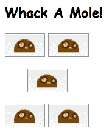
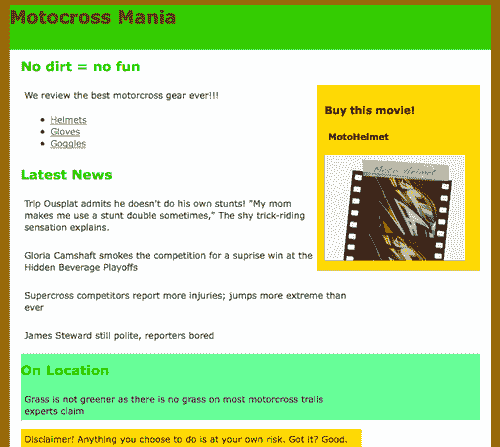
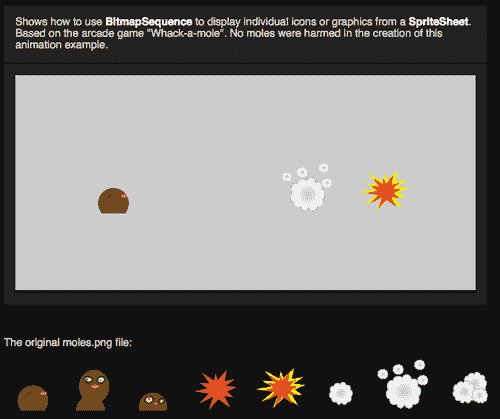

# 第七章。使用 JavaScript 的交互性

在本章中，我们将介绍:

*   用 JavaScript 播放音频文件
*   使用带文本的拖放应用编程接口
*   通过`vid.ly`和 jQuery 支持跨浏览器视频
*   使用 jQuery 动态显示视频
*   使用 jQuery 的可移动视频广告
*   使用`Easel.js`和`canvas`标签控制图像的显示
*   使用`Easel.js`和`canvas`标签制作图像序列的动画
*   使用`canvas`标签和 JavaScript 的随机音频动画

# 简介

虽然 HTML5 可能会结束 Flash 在许多富媒体应用中的使用，但它正导致 JavaScript 变得比以前更受欢迎。有许多库和插件可以用来增强和扩展 HTML5 和 CSS3，以创建丰富的交互体验。

这一章包含的食谱展示了 JavaScript 如何与 HTML5 标签一起使用，例如音频、视频和画布，以及 CSS3 选择器和元素。

# 用 JavaScript 播放音频文件

HTML5 在如何在互联网上使用音频文件方面引入了更多的灵活性。在这个食谱中，我们将创建一个游戏来练习使用音频标签和 JavaScript 加载和播放声音。

## 做好准备

您将需要一个音频文件来播放，一个图像和一个支持 HTML5 的现代浏览器。本章的示例文件可以从[http://www.packtpub.com/support?nid=7940](http://www.packtpub.com/support?nid=7940)下载。自由之声项目([http://freesound.org](http://freesound.org))有音频文件，只要给制作人信用，你就可以使用，照片可以在[http://www.Morguefile.com](http://www.Morguefile.com)找到，用于你的个人项目。

## 怎么做...

现在，我们准备创建一系列按钮和一个简短的 JavaScript 程序，当按下其中一个按钮时，该程序将播放随机音频文件。

打开你的 HTML 编辑器，创建一个 HTML5 页面的开始部分。

```html
<!DOCTYPE html><html lang="en"><head><meta http-equiv="Content-Type" content="text/html; charset=utf-8"> <title>Playing a sound file with JavaScript</title>

```

因为我们只有几个样式，我们将把它们添加到 HTML 页面的头部区域。

```html
<style>h1{font-family:"Comic Sans MS", cursive; font-size:large; font-weight:bold;}
button{ padding:5px;margin:5px;}
button.crosshair { cursor: crosshair; }
button.crosshairthree {margin-left:40px;
cursor:crosshair;} </style>

```

需要为脚本创建三个变量。开始脚本标记和变量应该类似于下面的代码块:

```html
<script>//variables
var mySounds=new Array();
mySounds[0]="boing";
mySounds[1]="impact";
mySounds[2]="squeak";
mySounds[3]="whack";
mySounds[4]="space";
var soundElements;
var soundChoice;

```

现在我们已经为脚本创建了全局变量，我们可以创建函数了。键入`function whackmole(){`开始功能，然后在新的线路上键入`var i = Math.floor(Math.random() * 5)`；使用 JavaScript 数学库生成一个有点随机的数字。接下来，输入`soundChoice = mySounds[i]`；将数组值赋给`soundChoice`。用`soundElements[soundChoice].play();}`关闭该功能。您的函数代码目前应该如下所示:

```html
function whackmole() {
var i = Math.floor(Math.random() *5);
soundChoice = mySounds[i];
soundElements[soundChoice].play();}

```

键入`function init(){`开始该功能。在新的一行中，键入`soundElements = document.getElementsByTagName("audio");} </script>`来完成我们的 JavaScript 代码块。它应该看起来像下面的代码块:

```html
function init(){
soundElements = document.getElementsByTagName("audio");}
</script>

```

关闭头部标签并键入主体标签，向其添加一个`init()`函数调用，使其看起来像:

```html
</head><body onLoad="init();">

```

使用`<header>`标记为页面的标题区域创建标题区域。使用标题标签`<h1>`显示页面标题:

```html
<header><h1>Whack A Mole!</h1></header>

```

有五个按钮来创建一个平衡的外观，它们都被分配了一个类。

```html
<section> <p> <button class="crosshair" onclick="whackmole();"> </button>
<button class="crosshair" onclick="whackmole();"> </button></p>

```

第三个按钮有一个类名`crosshairthree`，让我们可以更好地控制它在屏幕上的定位。

```html
<p style="padding-left:30px;"><button class="crosshair" onclick="whackmole();"></button></p> <p><button class="crosshair" onclick="whackmole();"> </button><button class="crosshair" onclick="whackmole();"></button></p></section>

```

如果您使用的是本书中的代码文件，声音文件标签应该类似于下面的代码块:

```html
<section><audio id ="boing" autobuffer>
<source src="audio/cartoonboing.ogg" />
<source src="audio/cartoonboing.mp3" /></audio>
<audio id ="impact" autobuffer>
<source src="audio/cartoonimpact.ogg" />
<source src="audio/cartoonimpact.mp3" /></audio>
<audio id ="squeak" autobuffer>
<source src="audio/cartoonsqueak.ogg" />
<source src="audio/cartoonsqueak.mp3" /></audio>
<audio id ="whack" autobuffer>
<source src="audio/cartoonwhack.ogg" />
<source src="audio/cartoonwhack.mp3" /></audio>
<audio id="space" autobuffer>
<source src="audio/cartoonspaceboing.ogg" />
<source src="audio/cartoonspaceboing.mp3" /></audio>

```

用结束标签结束页面:

```html
</section></body></html>

```

将文件另存为`playing-audio-files-with-javascript.html`并在浏览器中查看。它应该类似于下面的截图:



## 它是如何工作的...

首先，我们创建了一个基本的 HTML5 页面的开始。然后，我们添加了 CSS 样式来为按钮添加背景图像，并在鼠标或定点设备移动到按钮上时将鼠标图标更改为十字准线。这给了我们一个瞄准武器的视觉模拟，比默认的鼠标图标更有趣。

创建了三个变量用于脚本:`mySounds, soundElements`和`soundch`。我们创建的第一个名为`whackmole()`的函数包含一个内部变量`i`，它保存随机生成的数字的结果。`Math.random()`产生了一个伪随机数。然后，我们将其乘以音频文件的数量`5`，并使用`Math.floor()`中的结果创建一个从 0 到 5 的整数。该值然后被分配给临时变量`i`，该临时变量又被用来用随机生成的数组值填充变量`mySounds`。这个新的数组值，用`soundChoice = mySounds[i]`存储在变量`soundChoice`中；。这使我们能够使用`soundElements[soundChoice].play()`触发`audio`标签的`play()`动作；当按钮被按下时。

我们创建的第二个函数是`init()`，稍后我们使用`onLoad`将它绑定到`body`标签，这样我们就可以使用`audio`标签及其数组值抓取带有`getElementsByTagName`的音频文件，如`soundElements`变量中所携带的。

接下来，我们在页面上添加了身体标签`<body onLoad="init();">`，以及一系列包含我们可爱的鼹鼠形象的按钮。每个按钮都包含一个调用`whackmole()`功能的`onClick()`事件。我们的第三个按钮有一个不同于其他按钮的类别，`crosshairthree`，它在按钮的左侧增加了额外的边距，使其看起来更加居中。

### 注

火狐目前有一个怪癖，如果不先列出`.ogg`音源，它就找不到。

最后，我们使用`<audio>`和`<source>`标签将声音文件添加到页面中。使用源标签列出了每个文件的`ogg`和`mp3`格式。因为源标签被认为是它所包围的父音频标签的“子标签”，所以根据所使用的浏览器，两种文件格式都可以播放，因为不同的浏览器当前喜欢不同的声音文件格式。

## 还有更多...

您可以看到，通过为不同的图像播放不同的声音文件，可以非常容易地创建一个应用，例如儿童朗读的形状或动物页面。

### 用 jQuery 控制音频剪辑的外观

jQuery 中的`.animate`功能开辟了新的途径，当访问者采取行动或作为富媒体体验的一部分时，可以使音频控件出现、淡化和消失。下面是一个例子，你可以如何淡化和音频控制，然后导致它迅速重新出现:

```html
<script> $(document).ready(function(){
$('audio').delay(500).hide('fade', {}, 1000 ).slideDown('fast'); }); </script>
<!- - the HTML -- ><audio id ="boing" autobuffer> <source src="audio/cartoonboing.ogg" /> <source src="audio/cartoonboing.mp3" /></audio>

```

在本章中，我们将使用菜谱中的视频文件来执行类似的技巧。

## 另见

[第 8 章](08.html "Chapter 8. Embracing Audio and Video")、*拥抱音频和视频*将涵盖更多关于音频标签及其使用方法的信息。

# 使用带文本的拖放应用编程接口

虽然所有浏览器都可以本地拖动图像或链接，但删除对象需要复杂的 JavaScript 或第三方库。拖放应用编程接口旨在提供一种更简单、标准化的方法，使用户能够将任何类型的对象拖放到指定的区域。实际上，跨浏览器使用应用编程接口是一个挑战。目前支持这个 API 的主要浏览器有火狐、Chrome 和 Safari。

## 做好准备

在[http://www.packtpub.com/support?nid=7940](http://www.packtpub.com/support?nid=7940)下载本教程的代码。本教程标题使用的字体来自[http://www.fontsquirrel.com](http://www.fontsquirrel.com)，如果你愿意，也可以下载不同的字体。本教程可能不适用于 Internet Explorer。我们将创建一个井字游戏，演示拖放应用编程接口是如何工作的。

## 怎么做...

打开你的 HTML 编辑器，从创建一个基本的 HTML5 页面开始。我们将添加两个样式表链接，一个支持我们将为页面标题加载的`@fontface`字体，另一个支持我们的主样式表。如下所示输入代码，然后将文件保存为`using-drag-drop-api.html`。

```html
<!DOCTYPE html><html lang="en"> <head> <meta charset="utf-8"> <title>Using the drag-and-drop API element</title> <link rel="stylesheet" href="fonts/specimen_files/specimen_stylesheet.css" type="text/css" charset="utf-8" /> <link rel="stylesheet" href="stylesheet.css" type="text/css" charset="utf-8" />

```

让我们开始为这一页设计风格。创建或打开一个名为`stylesheet.css`的 CSS 文件。将页面的`body`整体`margin`设置为`100px`，默认颜色为`#666`。

```html
@charset "UTF-8";/* CSS Document */body { margin:100px; color:#666; }

```

页面的内容标签都应该设置为`display:block`，如下代码所示:

```html
article, aside, figure, footer, header, hgroup, menu, nav, section { display:block; }

```

现在，我们指定`@fontface`信息。代码和字体文件来自`www.fontsquirrel.com`字体工具包，包含在本教程的代码文件中。

```html
@font-face { /* This declaration targets Internet Explorer */ font- family: '3DumbRegular';src: url('3dumb-webfont.eot');}@font-face {/* This declaration targets everything else */font-family: '3DumbRegular';src: url(//:) format('no404'), url('fonts/3dumb- webfont.woff') format('woff'), url('fonts/3dumb-webfont.ttf') format('truetype'), url('fonts/3dumb-webfont.svg#webfontlNpyKhxD') format('svg');font-weight: normal;font-style: normal;}

```

为`h1`标签添加一种颜色，并将`font-family`属性设置为`3DumbRegular`，即我们字体的名称。

```html
h1{color:#C60;font-family: '3DumbRegular';}

```

创建一个名为`gametilebox`的新 div 来保存组成游戏方块的字母。将盒子的`float`属性设置为`left`，宽度和高度设置为`280px`。设置`padding, margin-right, border`和`background-color`，如下代码片段所示:

```html
#gametilebox{ float:left;width:280px; height:280px; padding:10px; margin-right:30px; border:1px solid #000; background-color:#ccc; }

```

游戏板将共享许多与方块相同的属性，因此复制`gametilebox`的样式，粘贴，并将副本命名为“游戏板”。添加一个`images/tictactoegrid.jpg`网址的`background-image`属性，并将`background-color`设置为`aa`。

`gameboard div`应该类似于下面的代码:

```html
#gameboard { float:left; width:280px; height:280px; padding:10px; margin-right:30px;border:1px solid #000; background-image:url(images/tictactoegrid.jpg); background-color:#aaa;}

```

让我们设计放置字母的块。所有`block`草皮上的`float`应设置为`left`。`width`不大于`85px`，不大于`height``80px`。它们将位于 3 乘 3 的网格上，因此第二行和第三行的第一个块也需要有`clear:both`属性。第二行和第三行的第三个块应具有低到无`padding`和`margin-right`属性。因为有 9 个，这里只显示了一个块代码的例子:

```html
#blockA {float:left; width:75px; height:75px; padding:5px 5px 5px 2px; margin-right:10px; border:none; background-color:red;}
#blockB {float:left; width:75px; height:75px; padding:5px; margin-right:10px; border:none; background-color:blue;}

```

现在，我们将设置字母游戏方块的样式。在名为`lettertile`的样式表中创建新类，然后设置该类的属性，如下所示:

```html
.lettertile { width:60px; height:60px; padding:5px; margin:5px; text-align:center; font-weight:bold;font-size:36px;color:#930; background-color:transparent;display:inline-block;}

```

我们要添加的最后一种样式是`draggable`属性。创建以下样式以帮助跨浏览器兼容性:

```html
*[draggable=true] { -moz-user-select:none; -khtml-user-drag: element; cursor: move;}

```

样式表已经完成，所以现在我们可以使用脚本来拖放字母拼贴。

打开之前创建的 html 页面`using-drag-drop-api.html`，输入以下 IE 浏览器代码:

```html
<!--[if IE]><script src="http://html5shiv.googlecode.com/svn/trunk/html5.js"> </script><![endif]-->

```

在样式表链接的正下方添加一个开始的`<script>`标记，并键入第一个函数`dragDefine(ev)`，它接受一个事件参数，并在其后加上一个`{`。花括号后，键入`ev.dataTransfer.effectAllowed ='move'`；然后，在新行上，键入`ev.dataTransfer.setData("text/plain", ev.target.getAttribute('id'))`；设置数据类型和目标属性。最后，键入`return true`；用关闭`}`来完成该功能。

```html
function dragDefine(ev) {ev.dataTransfer.effectAllowed = 'move'; ev.dataTransfer.setData("text/plain", ev.target.getAttribute('id')); return true;}

```

现在，我们需要定义`dragOver`函数。键入`dragOver(ev)`和一个开口`{`，然后通过添加`ev.preventDefault()`来调用`preventDefault()`功能；。功能块应该类似于下面的功能块:

```html
function dragOver(ev) { ev.preventDefault();}

```

我们需要的下一个功能是指示拖动完成。键入`function dragEnd(ev)`，然后打开`{`。键入`return true; }`完成功能。

用一个开口`{`键入`function dragDrop(ev)`，转到新的一行添加我们的第一个方法。类型`var idDrag = ev.dataTransfer.getData("Text")`；要创建保存文本字符串的拖动变量，请键入`ev.target.appendChild (document.getElementById(idDrag))`；。用`ev.preventDefault()`完成功能；。功能块应该如下所示:

```html
function dragDrop(ev) {
var idDrag = ev.dataTransfer.getData("Text");
ev.target.appendChild(document.getElementById(idDrag));
ev.preventDefault();} </script>

```

关闭页面的标题部分。输入`<body><header>`，然后输入`<h1>Drag and Drop Tic Tac Toe</h1></header>`完成页面的标题。

```html
</head><body><header><h1>Drag and Drop Tic Tac Toe</h1></header>

```

接下来，输入`<section><h3>Drag the letters from the gray box to the game board (and back again!)</h3>`。

用`"gametilebox"`、`ondragover ="dragOver(event)"`和`ondrop="dragDrop(event)"`的和 ID 创建一个 div。它应该如下所示:

```html
<div id="gametilebox" ondragover="dragOver(event)" ondrop="dragDrop(event)">

```

现在，我们将为每个游戏方块创建一个`div`。创建六个**“X”**瓷砖和六个**“O”**瓷砖，每个瓷砖都有一个以`"lettertile"`开头并以从`1-12`开始的数值结束的`id`。每个`div`将包含类`"lettertile"`，每个`draggable`属性将包含值`"true"`。每个瓷砖还将包含`ondragstart="return dragDefine(event)"`和`ondragend="dragEnd(event)"`。`div`块应该如下所示:

```html
<div id="lettertile1" class="lettertile" draggable="true" ondragstart="return dragDefine(event)" ondragend="dragEnd(event)">X</div>
<div id="lettertile2" class="lettertile" draggable="true" ondragstart="return dragDefine(event)" ondragend="dragEnd(event)">X</div>
<div id="lettertile3" class="lettertile" draggable="true" ondragstart="return dragDefine(event)" ondragend="dragEnd(event)">X</div>

```

现在，我们可以为我们在**样式表中创建的那些块样式创建实际的`divs`。第一种类型`<div id= "gameboard">`。每个区块 id 应该有一个`div`，范围从“区块 a”到“区块 I”。每个都将包含一个`ondragover="return dragOver(event)"`和一个`ondrop="dragDrop(event)"`。它们应该看起来像下面的代码块。**

```html
<div id="blockA" ondragover="return dragOver(event)" ondrop="dragDrop(event)"></div>
<div id="blockB" ondragover="return dragOver(event)" ondrop="dragDrop(event)"></div>
<div id="blockC" ondragover="return dragOver(event)" ondrop="dragDrop(event)"></div>

```

使用`body`和`html`结束标记关闭页面，命名文件`"using-drag-drop-api.html"`，然后在浏览器窗口中查看结果。拖几个字母过去，结果应该类似于下面的截图:


## 它是如何工作的...

首先，我们创建了一个基本的 HTML5 页面，并使用`@fontface`为标题添加了粗略的字体，以给我们的游戏一个有趣的视觉外观。接下来，我们通过将`body`的`margin`和所有块级元素设置为`display:block`来设计页面；以便更好地控制这些元素的呈现。设计好标题字体后，我们为游戏方块定义了`width`和`height`。这将是一个容器，用来存放组成游戏拼图的字母。

我们的脚本开始于为 IE 浏览器键入一个特殊的注释标签，将它们指向一个额外的脚本文件来触发 HTML5 元素:`<!--[if IE]><script src="http://html5shiv.googlecode.com/svn/trunk/html5.js"></script><![endif]-->`。它是由雷米·夏普(http://remysharp.com/html5-enabling-script/饰)根据麻省理工学院的许可提供的，目的是让我们在使用互联网浏览器时保持清醒。

当用户开始拖动一个项目时，会调用函数`dragDefine()`。首先使用`dataTransfer.effectAllowed='move'`检查项目是否可拖动。然后通过`dataTransfer.setData("text/plain")`设置要传输到`text`的数据类型，并通过`id`使用`target.getAttribute('id'))`识别目标。该函数返回 true，这意味着可以拖动对象。

接下来，我们定义了`dragOver`函数，当一个被拖动的项目在另一个项目上时调用该函数，并接受一个显示为`ev`的事件参数，该参数随后用于调用`preventDefault()`以允许该项目被删除。拖放应用编程接口规范明确指出，我们必须取消拖动，以便为拖放做准备。

然后创建函数`dragEnd()`以在拖动完成时返回真值。它还接受了一个事件论点。

在完成所有的拖动功能后，我们准备创建代码来删除项目。`dragDrop()`函数接受一个事件参数，并使用该值获取文本对象的值，然后将其传递给一个新变量`var idDrag`来保存文本字符串，该字符串又被`getElementById`用来标识要删除的正确元素标识。就像`dragEnd()`一样，我们必须通过从拖放应用编程接口调用`preventDefault()`函数来指示可以放下对象。

在我们关闭了页面的头部区域后，我们在正文中放置了内容框来存放我们的字母牌和游戏板。这些由两个父 div 容器组成，每个容器都包含子 div，子 div 包含字母平铺或游戏棋盘网格的部分。

每当一个字母方块被拖过时，游戏方块就会调用`dragOver()`功能。字母瓷砖草皮本身由`draggable="true"`制成可拖动的，并在拖动时返回`dragDefine()`。当拖动停止时，他们调用`dragEnd()`功能。

因为我们希望字母平铺在游戏板的特定区域，所以我们为网格上的每个单独的块创建了 div，以便当它们被放在游戏板上时将字母保持在适当的位置，当一个对象被拖过它们时，这也将返回`dragOver`事件，当一个对象被放在它们上面时调用`dragDrop()`。

为什么要为街区的草皮烦恼？我们本可以在左边设置我们的游戏方块，在右边设置游戏板，然后就完成了。结果会是，当我们把牌从左边的盒子拖到游戏板上时，它们会掉在上面，并按照掉的顺序排列，而不是我们想把它们放在哪里。当您想要对列表进行排序时，这种默认行为很好，但是当需要精确控制对象的放置位置时，这种默认行为就不好了。

我们需要覆盖对象被丢弃时产生的默认行为。我们创建了九个基本大小相同的游戏棋盘块。每一个的主要变化是`padding`和`margin`。

花点时间在[http://www . what WG . org/specs/web-apps/current-work/multipage/dnd . html](http://www.whatwg.org/specs/web-apps/current-work/multipage/dnd.html)上阅读拖放规范，你会注意到它们明确表示它们只是定义了一个拖放机制，而不是你必须执行什么操作。为什么呢？拥有智能手机或其他触摸屏设备的用户可能没有鼠标等定点设备。

## 还有更多...

这个拖放应用编程接口的演示可以构建成一个完整的带有评分的游戏；一个游戏板重置按钮，以及其他几种方式的交互元素。

### 创建一个基于画布的井字游戏

可以使用两个画布，一个用于游戏方块，另一个用于游戏板。棋盘和游戏方块可以使用画布动态绘制，然后分数或诸如“你赢了”之类的信息可以写入屏幕。

### 在用户播放时显示响应消息

雷米·夏普在 http://html5demos.com/drag-anything 有一个很棒的在线演示，展示了当物体掉落时如何在屏幕上显示信息。

要删除的对象的源标签类似于:

```html
<div id="draggables"> </div>

```

对象将被拖动到的“拖放区”框可能如下所示:

```html
<div class="drop" id="dropnames" data-accept="science-fact"> <p>Learn a science fact!</p> </div>

```

当图像被放入盒子时，你会看到包含在“数据-科学-事实”中的文本，而不是图像。

## 另见

关于 jQuery 的 Packt 书，这本书里的其他食谱，一个高级的 HTML5 Packt 书。

# 支持 vid.ly 和 jQuery 的跨浏览器视频

支持大多数浏览器需要将视频编码成多种格式，然后将正确的格式提供给浏览器。在这个食谱中，我们将使用一个名为 vid . ly([http://www . vid . ly](http://www.vid.ly))的在线视频显示库，跨多个浏览器可靠地准备和共享页面上的视频，并使背景颜色随时间变化。

## 做好准备

你需要一个视频上传到[。有些浏览器不允许在本地提供文件，因此您可能还需要一个可以上传文件和测试页面的位置。](http://www.vid.ly)

## 怎么做...

键入`<!DOCTYPE html> <html lang="en"> <head>`，然后通过键入`<style type="text/css"> h2{color:#303;}`开始添加样式声明。

设计一个包含特色内容的 div:`#featured {position:relative; padding: 40px; width: 480px; background-color:#000000; outline: #333 solid 10px; }`。

键入`video {padding: 3px;background-color:black;}`为视频标签创建样式，然后添加一个结束`</style>`标签。

声明页面中使用的脚本。键入`<script src="http://ajax.googleapis.com/ajax/libs/jquery/1.3.2/jquery.min.js" type="text/javascript" charset="utf-8"></script>`引用主 jQuery 库的最小化版本。然后，键入`<script type="text/javascript" src="http://ajax.googleapis.com/ajax/libs/jqueryui/1.7.2/jquery-ui.min.js"></script>`引用用于颜色变化效果的 jQuery UI 库。最后，我们将通过在结束`</head>`标签前键入`<script type="text/javascript" src="js/mycolor.js"></script>`来引用我们自己的脚本。

输入开始`<body>`和`<section>`标记，然后输入`<header> <h2>Featured Video</h2></header>`显示页面标题。

现在，我们可以创建 div 来保存我们之前设计的特色内容。键入`<div id="featured"> <p>This video was converted to cross-browser formats by <a href="http://vid.ly">vid.ly</a></p>`。

下一步是将视频剪辑上传到 [http://vid.ly](http://vid.ly) 转换成多种文件格式。当该过程完成时，您将收到一封电子邮件，然后可以抓取视频的代码片段，如下图所示:


从网站复制代码，然后将其粘贴到您的页面中。视频和脚本标签中的`src`值应该是 vid.ly 给你的 URL。代码块应该如下所示:

```html
<video id= "vidly-video" controls="controls" width="480" height="360"> <source src="http://vid.ly/7m5x7w?content=video"/> <script id="vidjs" language="javascript" src="http://m.vid.ly/js/html5.js"></script> </video>

```

为了增加一点额外的乐趣，让我们在页面上添加另一个视频标签。键入以下代码:`<p>Awwww it's a baby video!</p>`，为视频标签使用不同的 id 并调整其大小，如图所示:`<video id="tinymovie1" controls="controls" width="190" height="120">`，然后使用相同的源标签:`<source src="http://vid.ly/7m5x7w?content=video"/><script id="vidjs" language="javascript" src="http://m.vid.ly/js/html5.js"></script></video>`，并关闭页面:`</div> </section></body></html>`。将文件另存为`display-videos-using-videly.html`。

我们要做的最后一件事是创建一个 jQuery 脚本来更改`#featured` div 的背景颜色。打开编辑器，创建一个名为`myColor.js`的新文件。

键入`$(document).ready(function() {`然后转到新的一行，键入将调用动画功能并改变背景颜色的代码:`$('#featured').animate({'backgroundColor':'#ff3333', 'color': '#ffffff'}, 6000);})`；。

在浏览器中加载页面，观看主视频加载时的颜色变化。您可以看到以下屏幕截图:


## 它是如何工作的...

首先，我们创建了一个标准的 HTML5 页面，并开始添加样式声明。我们将`featured` div 的位置设置为相对，以便在将来有更多的灵活性，以防我们决定添加额外的 jQuery 效果。将`padding`设置为`40px`，将`outline`颜色设置为深灰色，并加上`10px`的权重，营造出强烈的视觉效果。默认背景颜色设置为黑色`(#000000)`给我们一个高对比度的颜色来比较红色背景。

接下来，我们设计了`video`标签，在它加载时给它一个`black`的`background-color`。我们还可以在这里添加一个背景图片作为海报。

接下来使用`<script src="http://ajax.googleapis.com/ajax/libs/jquery/1.3.2/jquery.min.js" type="text/javascript" charset="utf-8"></script>`声明了基本的 jQuery 脚本。因为它不包含`animate()`这样的效果，我们还需要引用一个最小化版本的 jQuery UI 库，用于颜色变化效果。然后我们通过输入`<script type="text/javascript" src="js/mycolor.js"></script>`来添加对我们自己的脚本的引用。进一步减小脚本文件大小的另一种方法是创建一个自定义脚本，其中只包含来自 jQueryUI 库的动画效果。

接下来，我们创建了主页面内容，包括 vid.ly 上视频的链接。vid.ly 提供的默认代码将`'vidley video'`的 id 应用于`video`标签，但是如果您想要使用自己的风格 id 或将为每个视频使用不同的 id，则可以忽略该 ID。另一种选择是将所有视频分配到同一个类别，然后根据需要为它们分配唯一的标识。

## 另见

[第八章](08.html "Chapter 8. Embracing Audio and Video")、*拥抱音视频*更详细的讲述了视频元素。

# 使用 jQuery 动态显示视频

视频元素让我们能够像对待图像一样对待视频，并以有趣和令人兴奋的方式操纵它们。

## 做好准备

您将需要一个多种文件格式的视频(在本书的章节代码中提供)。建议使用服务器上传文件，因为并非所有浏览器都以可预测的方式在本地播放文件。

## 怎么做...

首先，我们必须准备一个 HTML5 页面来放置它。输入我们页面的开始标签:`<!DOCTYPE html> <html lang="en"> <head> <meta charset="utf-8" /> <title>Video Explosion</title>`。

从下载的代码文件中打开`stylesheet.css`文件或创建一个同名的新文件。

为正文`style: body {background: white;color:#333333; }`键入以下内容，然后为 div 标签设置样式，如图所示:`div {float:left; border:1px solid #444444;padding:5px;margin:5px; background:#999999;}`。

我们需要创建和设计的第一个独特的 div 是`#featured`。键入`#featured {position:relative; width: 480px; background-color:#f2f1f1;}`创建样式。

现在创建一个名为`details`的 div 来保存一个小信息框。键入`#details{ position:relative;display:block;background-color:#6CF;color:#333333; padding:10px;}`创建一个显示在`featured`分区旁边的分区。

保存`css`文件，通过输入`<link rel="stylesheet" href="css/stylesheet.css"type="text/css" media="screen" charset="utf-8"/>`在带有链接标签的 html 页面头部引用。

在样式表链接下方键入以下指向主 jQuery 库的链接:`<script src="http://jquery.com/src/jquery-latest.js" type="text/javascript" charset="utf-8"></script>`，然后通过键入`<script type="text/javascript" src="https://ajax.googleapis.com/ajax/libs/jqueryui/1.8.10/jquery-ui.min.js"></script>`链接到本食谱代码文件中的 jQuery UI 库。最后，通过键入`<script type="text/javascript" src="js/explode.js"></script>`添加我们将要创建的脚本的链接，以完成引用的脚本。

创建一个新文件并命名为`explode.js`，并将其存储在名为`js`的新子文件夹中。类型`$(document).ready(function(){}`。在两个大括号({})之间键入`$('h1').effect('shake', {times:5}, 200)`；创建将导致 featured div 标签中包含的内容爆炸的语句。在新行上，键入`$('#featured').effect('shake', {times:3}, 100).delay(500).hide('explode',{}, 2000).slideDown('fast');)`；来完成剧本。您的代码块应该类似于下面的代码块:

```html
$(document).ready(function(){ $('h1').effect('shake', {times:5}, 200); $('#featured').delay(2000).hide('explode', {}, 2000 ).slideDown('fast'); });

```

保存文件并返回到 html 页面。

为`</head>`添加一个结束标记，并打开`<body>`，标记到 HTML 文件中。接下来，输入开始的`<header>`标签和标题文本:`<h1>Featured`摩托视频< /h1 >然后关闭`</header>`标签以完成标题区域。

创建一个开始`<section>`标签，然后通过键入`<div id="featured">`创建一个 div，以保存我们的视频标签和相关元素。键入`<video id="movie" width="480" height="360" preload controls>`，然后为三种视频文件类型添加一个源标签:`<source src='motogoggles.ogv' type='video/ogg; codecs="theora, vorbis"'/> <source src='motogoggles.mp4' type='video/mp4; codecs="avc1.42E01E, mp4a.40.2"'/> <source src='motogoggles.webm' type='video/webm; codecs="vp8, vorbis"'/>`，然后用`</div>`关闭`</video>`标签和特色 div。

最后一个内容块包含在`details`分区中。要创建它，请键入`<div id="details">`，然后添加带有文本`<h1>Details</h1>`的标题标签，最后是文本的简短说明段落:`<p>The video will explode then appear again!</p>`。关闭`</div></section> </body></html>`标签。将 HTML 文件保存为`exploding-video-dynamically.html`，在浏览器中打开查看结果。它们应该看起来类似于下面的截图，它显示了视频分成几个部分并爆炸。


## 它是如何工作的...

`stylesheet.css`文件包含用于确定视频对象在页面上的位置的特色 div 的样式。首先要注意的是`position`设置为`relative`。这使得我们可以使用 jQuery 移动视频对象并对其执行其他操作。

我们创建了一个名为`details`的分区，它的`position`也是`relative`，但是`background-color`设置为`light blue (#6CF)`。不同的颜色将有助于在视觉上将其与视频对象区分开来。

接下来，我们添加了 jQuery 库脚本。需要 jQuery UI 库，以便我们能够访问`animate`类中包含的方法和函数。在本例中，我们在本地引用它，但是您也可以用访问主 jQuery 库的相同方式链接到它。

最后，我们能够编写自己的脚本来使页面上的元素震动和爆炸！我们创建了一个语句，通过键入`$(document).ready(function(){}`来验证页面已经为我们的代码做好了准备。该函数查询 DOM，并询问页面是否已加载并准备好执行脚本。创建 jQuery 脚本时，最好使用这个包装函数。我们使用 jQuery 函数的别名符号`$`来抓取`h1`选择器，并对其应用包含`shake`参数的动作`effect`，以使元素向侧面移动，这又包含一个参数`times`的数量来摇动元素。震动持续的时间间隔以毫秒为单位，在本例中为`200`。我们使用选择器`$('#featured')`来抓取特色 div 元素，就像我们对`h1`标签所做的那样，我们在每次摇动`100`毫秒的时间段内对其进行`shake`(对于变体仅三次)。现在我们添加一些新的操作。使用`.delay(500)`将`shakes`和爆炸之间的`delay`毫秒附加到命令中。然后，我们将参数`explode`附加到`hide`动作，默认情况下该动作将发生一次，总共持续`2000 milliseconds`。视频爆炸后，`slidedown`动作将其滑回到屏幕上，参数为`fast`。请注意，爆炸所用的时间有点长，所以我们可以很容易地看到。`100-500`毫秒的计时会产生更真实的爆炸效果。如果您只想要视频本身，而不想要特色标签提供的背景或边框，也可以使用`$('video')`直接抓取视频标签。

回到 HTML 文件，我们将视频放在一个名为`featured`的容器 div 中，并创建了一个父`video`标签，该标签将`preload`并包含默认的`controls`。在我们关闭`video`标签之前，我们为其中的三种视频文件类型分别放置了一个`source`标签，这样使用不同浏览器的用户就可以观看视频:我们没有提供 FLASH 后备，但是我们可以使用像`Video.js`这样的 JavaScript 库。然后我们用`</div>`关闭`</video>`标签和特色分区。

最后，我们创建了一个 div 来保存用户期望在`details` div 中发生什么的信息。

## 还有更多...

视频元素、JavaScript 和画布标签还可以做很多事情。继续阅读，了解更多实验。

### 更多使用视频和画布的互动爆款

肖恩·克赖斯特曼在[http://www.craftymind.com](http://www.craftymind.com)有一个惊人的实验，让你能够在使用多个画布播放视频时，同时实时分解视频的多个部分。你可以在这里查看:[http://www . craftymind . com/2010/04/20/blow-up-html 5-video-and-mapping-it-to-3d-space/](http://www.craftymind.com/2010/04/20/blowing-up-html5-video-and-mapping-it-into-3d-space/)但是要注意——这在 Firefox 中是非常耗费资源的。

### 所有的爆炸是怎么回事？

一开始似乎没有任何真正的实际理由来拆分视频。然而，这对于模仿游戏中独特的过渡效果或对用户动作的反应非常有用。

### 实时色度键背景替换

火狐开发者一直在尝试操纵视频元素。他们创建了一个教程，解释了他们如何使用画布、JavaScript 和视频元素的属性来执行色度键替换。您可以在以下网址阅读并观看演示:https://developer . Mozilla . org/En/operating _ video _ using _ canvas。

想象一下，在一个网站上展示一段视频，在视频中，你展示了异国情调的背景，或者创建了产品和人物的交互式混搭。

## 另见

视频元素在本书[第八章](08.html "Chapter 8. Embracing Audio and Video")、*拥抱音视频*中有深入探讨。

# 使用 jQuery 的可移动视频广告

我们将在一个网站上创建一个视频广告，当用户使用 jQuery 和视频标签向下滚动页面时，广告会移动。

## 做好准备

您将需要多种格式的视频文件，如`.ogg/.ogv, .mp4`、`.webm`，或者使用视频服务，如[http://www.vid.ly.com](http://www.vid.ly.com)来提供跨浏览器视频。这个例子没有在 Internet Explorer 中测试过，但是在 Safari、谷歌 Chrome、Opera 和 Firefox 的最新版本中应该可以正常工作。

## 怎么做...

我们将从创建一个典型的网站页面开始。在编辑器中打开一个新文件，保存为`movable-video-ad.html`。`Type <!DOCTYPE html> <html lang="en"><head><meta charset="utf-8" /><title>Movable Video Ad</title>`放置页面上的第一个标签。

现在，为我们的默认样式表`<link rel="stylesheet" href="css/main.css" type="text/css" media="screen" charset="utf-8" />`和名为`<link rel="stylesheet" href="css/scroll.css" type="text/css" media="screen" charset="utf-8" />`的次级样式表创建一个引用链接。

接下来，为 jQuery 脚本创建引用链接。键入`<script src="js/jquery-1.4.min.js" type="text/javascript" charset="utf-8"></script>`引用核心 jQuery 代码。添加链接声明`<script type="text/javascript" src="js/jquery-ui-1.7.2.custom.min.js"></script>`。我们将链接到的最后一个脚本是我们自己的脚本，我们将为名为`myAd.js`的食谱创建该脚本，该脚本将存储在我们创建的名为“js”的子文件夹中。键入`<script type="text/javascript" src="js/myAd.js"></script>`链接到文件。

键入`</head><body><div id="container">to`开始页面的内容区域。通过键入`<header> <h1>Motocross Mania</h1></header>`显示页面标题。

通过键入`<div id="content"> <h2>No dirt = no fun</h2>`开始添加页面内容。现在可以通过输入文本`<div id="motoad"><h3>Buy this movie!</h3>`将包含广告的 div 添加到页面中，然后输入包含在段落元素标签`<p><strong>MotoHelmet</strong></p>`中的电影标题。

然后应添加视频标签`<video width="190" height="143" preload controls>`。键入包含每个视频格式的源标签，如以下代码块所示:

```html
<source src='video/motohelmet.ogv' type='video/ogg; codecs="theora, vorbis"'/> <source src='video/motohelmet.mp4' type='video/mp4; codecs="avc1.42E01E, mp4a.40.2"'/> <source src='video/motohelmet.webm' type='video/webm; codecs="vp8, vorbis"'/></video>

```

关闭`</div>`标签，保存到目前为止的进度。

创建一个 id 为 intro `<p id="intro">`的段落来包含文本`We review the best motorcross gear ever!!!`。在段落标签和文本后面加上一系列虚拟链接:`<ul><li><a href="#">Helmets</a></li> <li><a href="#">Gloves</a></li><li><a href="#">Goggles</a></li></ul>`，用`</p>`结束段落，然后创建一个新的 div 来包含一个虚拟新闻内容块，后面是两个虚拟 div 块、一个页脚标签和结束页面元素，如下代码块所示:

```html
<div id="news"><h2>Latest News</h2> <p>Trip Ousplat admits he doesn't do his own stunts! "My mom makes
me use a stunt double sometimes," The shy trick-riding sensation explains.</p> <p>Gloria Camshaft smokes the competition for a suprise win at the Hidden Beverage Playoffs</p> <p>Supercross competitors report more injuries; jumps more extreme than ever</p><p>James Steward still polite, reporters bored</p>
</div><div id="filler"><h2>On Location</h2> <p>Grass is not greener as there is no grass on most motorcross trails experts claim </p></div> <p id="disclaimer">Disclaimer! Anything you choose to do is at your own risk. Got it? Good.</p><footer><p>&copy; Copyright 2011 Motocross Extreme Publications, Inc.</p></footer></div></body></html>

```

现在，我们将对`main.css`文件中的页面元素进行样式化。第一个关键样式是`#container` div。它应该有`0 auto`的边距和`650px`的宽度。接下来`#motoad`分区应该被设置为`float right`并且包含一个`width`的`200px`来保存视频元素。最后，`#intro` div 应该包含更短宽度的`450px`。这三种样式看起来应该类似于这里显示的代码块:

```html
#container{ margin:0 auto;text-align:left; width: 650px;}
#motoad{ float:right;width:200px;}
#intro{width:450px;}

```

其余的样式是对填充和颜色或其他标准声明的微小调整。

现在，打开`scroll.css`文件定义样式，帮助我们的广告滚动。我们将级联`#motoad`的属性，形成一个可以移动的 div 块。接下来，定义`#content`属性的`height`，段落的宽度和`h2`元素。`scroll.css`中的样式现在应该如下所示:

```html
#motoad {display:block;position: relative; background-color:#FC0;width:200px;padding:10px;}
#content { height:1000px;}
p {width:450px;}h2 {width:460px;}

```

保存文件，准备创建我们的 jQuery 脚本。

打开或创建`myAd.js`，首先输入文档准备功能`$(document).ready(function(){}`和大括号。点击大括号之间的回车，输入滚动功能`$(window).scroll(function() {`。在该函数的左大括号后，键入命令:`$('#motoad').stop().animate({top: $(document).scrollTop()},'slow','easeOutBack')`；。用“}”关闭脚本；});"也是。我们的 jQuery 脚本现在应该看起来像下面的代码块:

```html
$(document).ready(function(){ $(window).scroll(function() { $('#motoad').stop().animate({top: $(document).scrollTop()},'slow','easeOutBack'); }); });

```

保存所有文件，并在浏览器窗口中加载网页。在开始滚动页面之前，页面应该如下图所示。



尝试上下滚动页面。广告也应该在页面上下移动。结果应该类似于下面的截图:


## 它是如何工作的...

在用不同的内容元素创建了一个典型的 HTML 页面之后，我们准备好了样式化 CSS 页面。我们将 CSS 分成`main.css`和`scroll.css`两个文件，这样当我们在 jQuery 脚本中调用滚动函数并主动应用它时，页面上的内容元素就会收缩，这样我们的广告就可以轻松移动，而不会阻塞页面上的任何信息。

我们想让`#motoad` div 标签在窗口滚动事件被调用时移动。为此，我们使用 jQuery 函数的别名符号`$`从 DOM 中抓取`window`选择器，并对其应用包含默认滚动动作参数的动作`scroll`。使用这个函数，我们创建了我们的命令来控制我们的`#motoad` div 块的行为。我们给了它`stop`的动作，这样它就可以动画了。`animate`动作被链接到`stop`命令。我们应用到`#motoad` div 的`animate`的第一个参数导致当滚动条在文档窗口中移动时 div 移动。参数`slow`控制广告上下移动的速度，参数`easeOutBack`参考放松命令来创建流畅的动画移动，而不是突然开始或停止。

## 还有更多...

在这个食谱中，我们通过使自定义 HTML 元素响应页面上的用户操作来制作动画。这只是我们巧妙地添加可用于现实世界解决方案的效果的一种方式。

### 有 HTML 元素，会旅行

探索 jQuery 用户界面库，你会被许多操纵和设计 HTML 元素的方式所启发。访问[http://jqueryui.com](http://jqueryui.com)获取演示和文档。

## 另见

学习 jQuery:使用简单的 JavaScript 技术进行更好的交互设计和网络开发，可从 Packt Publishing 获得。

# 使用画架和画布标签控制图像的显示

JavaScript 库`Easel.js`通过`canvas`标签降低了创建动画和丰富交互环境的复杂性。在这个食谱中，我们将在一个名为“精灵”的文件中使用一系列图像来展示如何使用`Easel.js`来控制精灵中的哪个图形图像被选择性地显示。

## 做好准备

您需要下载`Easel.js`库或使用该配方代码文件中的副本。

## 怎么做...

为一个 HTML5 文件创建开始标记。您的代码应该类似于下面的代码块:

```html
<!DOCTYPE HTML><html><head><meta http-equiv="Content-Type" content="text/html; charset=UTF-8"><title> Animating images using BitmapSequence and SpriteSheet</title>

```

接下来，链接到本食谱中使用的主样式表`styles.css`:`<link href="styles.css" rel="stylesheet" type="text/css" />`。

接下来，我们将通过插入以下脚本文件的链接来导入`Easel.js`框架库:`UID.js, SpriteSheetUtils.js, SpriteSheet.js, DisplayObject.js, Container.js, Stage.js, BitmapSequence.js`和`Ticks.js`。您可以在这里看到每个脚本文件的路径和链接:

```html
<script src="easeljs/utils/UID.js"></script><script src="easeljs/utils/SpriteSheetUtils.js"></script><script src="easeljs/display/SpriteSheet.js"></script><script src="easeljs/display/DisplayObject.js"></script><script src="easeljs/display/Container.js"></script><script src="easeljs/display/Stage.js"></script><script src="easeljs/display/BitmapSequence.js"></script><script src="easeljs/utils/Tick.js"></script>

```

接下来，创建并打开`<script>tag`并声明以下三个变量:`var canvas;var stage;var critterSheet = new Image()`；为了我们的剧本。

键入`function init(){`开始功能，然后按`canvas = document.getElementById("testCanvas")`；将页面主体中的画布绑定到画布变量。通过输入`critterSheet.onload = handleImageLoad`准备加载新的`spriteSheet`；。`critterSheet`变量存储精灵图像的来源。类型`critterSheet.src = "images/moles.png"`；加载我们自己的一系列鼹鼠图像。功能块应该类似于下面的代码块:

```html
function init() {
canvas = document.getElementById("testCanvas");
critterSheet.onload = handleImageLoad;
critterSheet.src = "images/moles.png";}

```

我们将创建的第二个函数是`handleImageLoad()`。键入功能`handleImageLoad() {`然后`stage = new Stage(canvas)`；创建舞台的新实例。键入`var spriteSheet = new SpriteSheet(critterSheet, 76, 80);to`创建新的`spriteSheet`。创建一个名为`critter1`的新位图序列变量，并使用 x 和 y 坐标定义它在舞台上的位置，方法是键入:`var critter1 = new BitmapSequence(spriteSheet); critter1.y = 85;critter1.x = 85`；。通过输入`critter1.gotoAndStop(1)`，从精灵表`moles.png`的第二张图片中添加一只小动物；。接下来，使用命令`stage.addChild(critter1)`将其添加到舞台；。

克隆我们创建的第一个`critter1`变量，通过键入`var critter2 = critter1.clone()`将其值传递给一个新的小动物变量；。使用`critter2.x += 120`添加新变量的当前位置值，将其定位到第一个生物的右侧；。

键入`critter2.gotoAndStop(0)`为`critter2`变量赋值。克隆动物 1 和动物 2 的代码块应该看起来像下面的代码块:

```html
var critter2 = critter1.clone();
critter2.x += 120;
critter2.gotoAndStop(0);
stage.addChild(critter2);

```

滴答间隔`Tick.setInterval(300)`；和听者`Tick.addListener(stage)`；是我们将添加到脚本中的最后两个语句。关闭`handleImageLoad()`函数的大括号(})，并键入一个结束脚本标记。

关闭`</head>`标签，然后输入带有调用`init()`功能的`onload`属性的开始`body`标签。为内容创建一个名为“描述”的 div。添加一个名为`canvasHolder`的 div 来包含画布元素。在页面底部显示图像文件`moles.png`。

```html
<body onload="init();">
<div class="description">Using <strong>BitmapSequence</strong> to animate images from a <strong>SpriteSheet</strong>.
</div>
<div class="canvasHolder">
<canvas id="testCanvas" width="980" height="280" style="background-color:#096"></canvas> </div> </p><p>The original moles.png spritesheet file with all the images:<br/></p> </body></html>

```

将文件另存为`whack-mole-easel-test-single.html`。结果可以在下面的截图中看到:


## 它是如何工作的...

在我们开始设置 HTML5 页面之后，我们准备好导入`Easel.js`框架并创建我们的主脚本。

我们创建了一个开口`<script>tag`并声明了以下全局变量:`var canvas;var stage;var critterSheet = new Image()`；为了我们的剧本。

创建的函数`init()which`将在页面加载时被调用。在使用`document.getElementById("testCanvas");to`将页面主体中的画布绑定到画布变量的过程中，它包含了`canvas`变量。接下来，我们准备通过输入`critterSheet.onload = handleImageLoad`加载一个新的`spriteSheet`；。`critterSheet`变量存储精灵图像的来源。打字`critterSheet.src = "images/moles.png"`；让我们看到了自己的一系列痣图像。

我们创建的第二个函数是`handleImageLoad()`。在这个功能中，我们完成了大部分工作，首先使用`stage = new Stage(canvas)`创建一个新的舞台实例；。接下来，我们使用`var spriteSheet = new SpriteSheet(critterSheet, 76, 80)`创建了一个新的`spriteSheet`；创造一个新的`spriteSheet`。

现在我们有了一个 sprite sheet 实例，我们可以创建一个名为`critter1`的新位图序列变量，并使用 x 和 y 坐标定义它在舞台上的位置，方法是键入:`var critter1 = new BitmapSequence(spriteSheet);critter1.y = 85;critter1.x = 85`；。接下来，我们通过数字来引用我们想要添加的帧，这样我们就可以先对小动物应用正确的动作，然后再对舞台应用正确的动作。我们通过键入`critter1.gotoAndStop(1)`将`critter1`变量链接到精灵表`moles.png`上的第二个图像；。我们使用命令`stage.addChild(critter1)`将图像添加到舞台上；。

我们克隆了我们装箱的第一个`critter1`变量，并通过键入`var critter2 = critter1.clone()`将其值传递给一个新的动物变量；。我们通过使用`critter2.x += 120`添加新变量的当前位置值，将新变量定位到第一个生物的右侧；。我们通过命令`BitSequence`到`goto`第一个图像在`moles.png`和`stop`上的位置，并将其分配给`critter2`变量，从`moles.png`图像文件中为动物分配了自己的图像。

我们增加了`Tick.setInterval(300)`；，其在`Ticks`之间应用了`300`毫秒的时间段。Tick 接口充当全局定时设备，使我们能够在需要时返回每秒帧速率(FPS)。我们在舞台上增加了一个听众`Tick.addListener(stage)`；它的行为类似于其他类型的侦听器，因为它侦听滴答。这可用于帮助在指定时间重绘舞台，或执行其他与时间相关的操作。

我们使用`onload`属性来调用`body`标签中的`init()`函数。这会导致页面加载时调用`init()`功能。

## 另见

*制作一个序列*配方的动画。

# 使用画架和画布标签制作一系列图像的动画

我们可以通过使用`Easel.js` JavaScript 库创建数组和函数，然后使用`canvas`元素操纵它们来制作称为精灵的图像条的动画。在这个食谱中，我们将动画相同的条，但显示两个不同的时间序列。

## 准备

下载该配方的代码文件，使用`Easel.js`框架库和支持文件。您将需要一个最近的浏览器，它将显示 HTML5 元素，以正确查看和测试本食谱中使用的代码。

## 怎么做...

为一个 HTML5 文件创建开始标记。您的代码应该类似于下面的代码块:

```html
<!DOCTYPE HTML><html><head><meta http-equiv="Content-Type" content="text/html; charset=UTF-8"><title> Animating images using BitmapSequence and SpriteSheet</title>

```

链接到本食谱中使用的主样式表`styles.css`:`<link href="styles.css" rel="stylesheet" type="text/css" />`。

通过插入以下脚本文件的链接来导入`Easel.js`框架库:`UID.js, SpriteSheetUtils.js, SpriteSheet.js, DisplayObject.js, Container.js, Stage.js, BitmapSequence.js`和`Ticks.js`。关于框架块的外观，请参考前面的示例。

创建一个期初`<script>`标签，声明以下三个变量:`var canvas;var stage;var critterSheet = new Image()`；为了我们的剧本。

键入`function init(){`开始功能，然后按`canvas = document.getElementById("testCanvas")`；。

通过输入`critterSheet.onload = handleImageLoad`准备加载新的`spriteSheet`；。类型`critterSheet.src = "images/moles.png"`；加载我们自己的一系列鼹鼠图像。功能块应该看起来像下面的代码块:

```html
function init() {
canvas = document.getElementById("testCanvas");
critterSheet.onload = handleImageLoad;
critterSheet.src = "images/moles.png";}

```

我们将创建的第二个函数是`handleImageLoad()`。键入功能`handleImageLoad() {`然后`stage = new Stage(canvas)`；创建舞台的新实例。类型`var spriteSheet = new SpriteSheet(critterSheet, 80, 80)`；创造一个新的`spriteSheet`。现在我们有了一个 sprite 表，创建一个名为`critter1`的新位图序列变量，并使用 x 和 y 坐标定义它在舞台上的位置，方法是键入:`var critter1 = new BitmapSequence(spriteSheet)`；然后`critter1.y = 100;critter1.x = 90`；。接下来，我们将创建一个数组，通过输入`var frameData = {shymole:0, upmole:1, downmole:2, whacked:3, whackedow:4, clouds:5,tinycloud:6, cloudgroup:7}`映射到原始`spritesheet`文件上的每个图像；因此我们有八个名称值，每个名称值都与一个数组 id 相关联。

到目前为止`handleImageLoad()`的代码块应该如下所示:

```html
function handleImageLoad() {
stage = new Stage(canvas);
var spriteSheet = new SpriteSheet(critterSheet, 80, 80);
var critter1 = new BitmapSequence(spriteSheet);
critter1.y = 100;
critter1.x = 90;
var frameData = {shymole:0, upmole:1, downmole:2, whacked:3, whackedow:4, clouds:5,tinycloud:6, cloudgroup:7};

```

通过键入:`spriteSheet = new SpriteSheet(critterSheet, 80, 80, frameData)`创建一个新的`spriteSheet`作为参数；。

创建名为`critter1`的新位图序列变量，并通过键入:`critter1gotoAndStop(0)`应用图像子画面；。使用`stage.addchild(critter1)`将`critter1`添加到`stage`中；。

克隆第一个`critter1`变量，通过输入`var critter2 = critter1.clone()`将其值传递给新的动物变量；。使用`critter2.x += 120`定义新变量的`x`值；。通过输入`critter2.gotoAndStop(5)`，从`moles.png`图像文件中为动物分配自己的图像；用于添加新的`spriteSheet`、创建`critter 1`和克隆`critter 2`的代码块应该如下所示:

```html
spriteSheet = new SpriteSheet(critterSheet, 80, 80, frameData);
critter1.gotoAndStop(0);
stage.addChild(critter1);
var critter2 = critter1.clone();
critter2.x += 120;critter2.gotoAndStop(5);

```

类型:`var critter3 = critter2.clone(); critter3.spriteSheet = spriteSheet`；。就像我们之前创建的其他动物变量一样，通过将`10`添加到其当前值中来重新定义`critter3`的`x`值:`critter3.x += 10`；。下面的代码块显示了我们所做的工作:

```html
var critter3 = critter2.clone();
critter3.spriteSheet = spriteSheet;
critter3.x += 10;

```

通过输入`critter3.gotoAndStop("upmole")`名称引用`moles.png`中的图像`frames`；。通过克隆一个新变量并引用一个新帧，将当前`upmole`帧图像替换为不同的帧:`var critter4 = critter3.clone(); critter4.gotoAndStop("downmole")`；。通过键入:`critter4.x += 10`将该帧移动到`10`像素上；。

将帧再交换一次，并将我们的新帧向右移动`10`个像素:`var critter5 = critter4.clone(); critter5.gotoAndStop("shymole"); critter5.x += 10`；。让我们看看到目前为止应该有的代码块:

```html
critter3.gotoAndStop("upmole");
var critter4 = critter3.clone();
critter4.gotoAndStop("downmole");
critter4.x += 10;
var critter5 = critter4.clone();
critter5.gotoAndStop("shymole");
critter5.x += 10;

```

通过键入以下命令在我们的`moles.png`文件中的帧之间循环:

```html
var critter6 = critter1.clone(); critter6.x = critter5.x + 100; critter6.gotoAndPlay(3);stage.addChild(critter6);.

```

向舞台添加第二个动画序列，当新的小动物精灵添加到舞台时，通过引用不同的开始帧来更改动画的定时:`var critter7 = critter1.clone(); critter7.x = critter6.x + 100; critter7.gotoAndPlay(1); stage.addChild(critter7)`；。

我们的两个动画序列现在应该包含以下代码:

```html
var critter6 = critter1.clone();
critter6.x = critter5.x + 100;
critter6.gotoAndPlay(3);
stage.addChild(critter6);
var critter7 = critter1.clone();
critter7.x = critter6.x + 100;
critter7.gotoAndPlay(1);
stage.addChild(critter7);

```

滴答间隔`Tick.setInterval(200)`；和听者`Tick.addListener(stage)`；是我们将添加到脚本中的最后两个语句。关闭`handleImageLoad()`函数的大括号(})，并键入一个结束脚本标记。

输入`</head>`，然后输入`<body onload="init()">`。创建一个名为`"description"`的分区来保存内容。最后一个 div 是`canvasHolder`，包含画布元素。将宽度设置为`600`，高度设置为`280`，背景颜色设置为浅灰色`(#ccc)`。添加了到图像文件`moles.png`的链接，因此用户可以看到在`moles.png`中引用的图像子画面。

保存文件，并在浏览器窗口中打开它。您应该会在左侧看到一个静止的帧(闭着眼睛的鼹鼠头的图像)，两个动画序列在屏幕的右侧循环播放。下面的截图显示了这两个序列如何加载相同的帧，但时序不同。



## 它是如何工作的...

创建 HTML 页面和引用画布的方法的第一步与前面的方法相同。

在创建了`spriteSheet`之后，我们创建了一个新的变量来保存我们的名为`critter1`的精灵帧，并通过键入:`var critter1 = new BitmapSequence(spriteSheet); critter1.y = 100;critter1.x = 90`来定义帧位置的`x`和`y`坐标；。

我们创建了数组`var frameData`来声明八个键/值对。然后，我们能够创建一个新的`spriteSheet`，它采用一个`spriteSheet`名称的参数，每个帧的默认高度和宽度，并使用`frameData`将所有帧从`moles.png`一次加载到`spriteSheet`中。

接下来，我们尝试使用`frameData`通过数值和名称键引用帧，创建一系列位图序列，然后用它们的克隆替换它们。

我们制作了动画序列，并把它们放在舞台上。它们都遵循相同的格式，但是通过改变`gotoAndPlay`动作中的数字参数，在不同的帧上开始它们的动画序列。

最后，我们增加了`Tick.setInterval(200)`；，它在 Ticks 之间应用了 200 毫秒的时间段。Tick 接口充当一个全局定时设备，如果需要的话，它可以让我们返回每秒帧速(FPS)。我们在舞台上增加了一个听众`Tick.addListener(stage)`；它的行为类似于其他类型的侦听器，因为它侦听滴答。这可用于帮助在指定时间重绘舞台，或执行其他与时间相关的操作。我们使用`onload`属性来调用`body`标签中的`init()`函数。这会导致页面加载时调用`init()`功能。

## 还有更多...

`Easel.js`和其他类似的使控制 HTML5 元素更容易的库正在到处涌现。但是要小心使用它们，因为有些可能不够稳定，无法在生产环境中使用。

### 海盗爱雏菊，你也应该爱

`Easel.js`的创造者被微软要求创建一个名为海盗爱雏菊([http://www.pirateslovedaisies.com](http://www.pirateslovedaisies.com))的概念验证网络游戏，完全使用 HTML5 和 JavaScript 制作，严重依赖`Easel.js`库来操纵`canvas`元素。你可以在任何网络浏览器中玩这个游戏，也可以在一个具有讽刺意味的环境中玩；它包含针对使用 Internet Explorer 9 浏览器的访问者的特殊功能。

### 老式电脑动画技术的回归

当我第一次开始在电脑上玩游戏时，一个游戏在屏幕上有 256 种颜色和 8 位动画是一件大事。电脑动画师使用了很多技巧来复制水动等效果。重温那些日子(或者通过效果游戏的这个演示第一次发现它们:[http://www.effectgames.com/demos/canvascycle/](http://www.effectgames.com/demos/canvascycle/)。

## 另见

这本书有整整一章都是帆布配方。如果你跳过它们，现在就去吃掉它们。

# 使用画布标签和 JavaScript 的随机音频动画

在本食谱中，我们将使用画布标签来绘制一系列形状并制作其动画。我们还将使用音频标签循环播放一个音频文件，同时显示动画。我们正在改编迈克尔·纳特创作的原创动画。我们将创建一个更慢，更放松的动画，看起来像挥舞的草。

## 做好准备

您将需要一个最近更新的浏览器，如火狐 3.6 或谷歌 Chrome，以及一个多种格式的音频文件。在 Opera 浏览器 9 和 10 中，它确实以不同的(更小的)尺寸显示。音频也不会在那些版本的 Opera 中播放。

## 怎么做...

首先，打开一个新的 HTML5 页面，命名为`random-animation-with-audio.html`。输入 HTML5 页面的开头，包括页面标题:

```html
<!DOCTYPE html> <html lang="en"> <head><meta charset="utf-8" /> <title>Canvas Reggae</title>.

```

然后添加页面加载时将要导入的 JavaScript 和 CSS 文件的链接:`<script type="text/javascript" src="js/animatedlines.js"></script><link rel="stylesheet" href="css/stylesheet.css" type="text/css" media="screen" charset="utf-8" />`，用`</head>`关闭头标。

页面加载时，输入`<body onLoad="init();">`激活`init()`功能。

接下来我们为页面`<header><h1>CANVAS Reggae</h1></header>`创建标题，然后通过键入`<canvas id="tutorial" width="480" height="360"></canvas>`添加画布元素。

创建一个新的 div，积分为`id`以保存到迈克尔网站的链接:`<div id="credits">Based on Canvas Party by <a href="http://nuttnet.net/">Michael Nutt</a>&nbsp;&nbsp`；。然后在 div 中添加一个链接来抓取音频元素，并在点击链接时将`pause()`功能应用到音乐中。`<a href="#" onClick="document.getElementsByTagName('audio')[0].pause();">[OFF]</a></div>`。

现在，输入音频标签，并将自动播放设置为真，循环设置为循环:`<audio autoplay="true" loop="loop">`创建两个包含音频格式的源标签:`<source type="audio/ogg" src="audio/randomreggae.ogg" /><source type="audio/mpeg" src="audio/randomreggae.mp3" />`。

在关闭音频标签之前，我们将添加一串文本，如果不支持音频标签，就会出现:`Your browser doesn't recognize the HTML5 audio tag`。

关闭音频、正文和 html 标记，并保存页面。

在我们创建脚本之前，打开`stylesheet.css`页面，并键入以下内容:

```html
body { margin: 0; background-color: #000; color: #FFF; font-family: Helvetica, sans-serif; }
a { color: #FFF; }
h1 { position: absolute; top: 0; margin: auto; z-index: 50; padding: 10px; background-color: #000; color: #FFF; }
div#credits { position: absolute; bottom: 0; right: 0; padding: 10px; }
audio { position: absolute; visibility: hidden; }

```

现在已经构建了 HTML 和 CSS 页面，我们将处理动画脚本。创建一个新的 JavaScript 文件并命名为`animatedLines.js`。我们将把它放在一个名为`js`的新子文件夹中。

首先，我们将声明扁平化变量，并创建一个新的数组函数:`var flatten = function(array) { var r = []`；。接下来，在函数中，我们将创建一个`for`语句来声明一个以一个对象(var `i = 0)`开始的数组，然后在数组长度大于`i. for(var i = 0; i < array.length; i++) {`时增加数组的大小。使用`push`函数，我们将通过键入:`r.push.apply(r, array[i]);}`向数组中添加新值，然后最后通过返回数组:`return r; }`结束函数。

到目前为止，我们的脚本应该看起来像下面的代码块:

```html
var flatten = function(array) { var r = [];
for(var i = 0; i < array.length; i++) {
r.push.apply(r, array[i]); }
return r; }

```

接下来，我们将创建一个名为 shuffle 的函数，它接受一个数组作为参数。键入`function shuffle(array) { var tmp, current, top = array.length`；。在函数内部，我们有一个 if/while 循环来遍历数组中的值。通过在函数末尾输入:`var tmp, current, top = array.length; if(top) while(--top) { current = Math.floor(Math.random() * (top + 1)); tmp = array[current]; array[current] = array[top]; array[top] = tmp; }. Return``array`值将其添加到脚本中。我们随机打乱数组值的函数现在应该看起来像下面的代码块:

```html
function shuffle(array) {
var tmp, current, top = array.length;
if(top) while(--top) {
current = Math.floor(Math.random() * (top + 1));
tmp = array[current];
array[current] = array[top];
array[top] = tmp; }
return array; }

```

现在，我们准备通过键入:`var canvas`来创建一个全局`canvas`变量和一个`context`变量；和`var ctx;respectively`。

创建这些变量后，我们可以将`init()`函数添加到脚本中，所有的动作都从这里开始。键入函数`init() {`，然后输入语句，将我们的 canvas 变量与 canvas 元素相关联:`canvas = document.getElementById('tutorial')`；。

现在，我们将创建一个`if`语句来设置画布变量的宽度和高度属性:`if (canvas.getContext) {canvas.width = window.innerWidth; canvas.height = window.innerHeight - 100; ctx = canvas.getContext('2d'); ctx.lineJoin = "round"; setInterval("draw()", 300); }.This`完成`init()`功能。

接下来，我们为浏览器窗口添加一个监听器来检测它何时被调整大小:`window.addEventListener('resize', function() {canvas.width = window.innerWidth;canvas.height = window.innerHeight - 100; });}`。

我们脚本的最新添加内容现在应该如下所示:

```html
function init() {
canvas = document.getElementById('tutorial');
if (canvas.getContext) {
canvas.width = window.innerWidth;
canvas.height = window.innerHeight - 100;
ctx = canvas.getContext('2d');
ctx.lineJoin = "round";
setInterval("draw()", 300); }
window.addEventListener('resize', function() {
canvas.width = window.innerWidth;
canvas.height = window.innerHeight - 100; }); }

```

我们终于准备好创建一个在画布上绘制形状的函数了。该函数将包含为形状动画提供动力的大部分脚本。键入`function draw(){ctx.globalCompositeOperation = "darker"; ctx.fillStyle = '#000'; ctx.fillRect(0, 0, canvas.width, canvas.height);ctx.globalCompositeOperation = "lighter";to`设置画布背景的外观。

现在，我们将输入动画中使用的颜色。我们将创建一个包含`rgba`值的数组数组。类型:`var colors = ["rgba(134, 154, 67, 0.8)", "rgba(196, 187, 72, 0.8)", "rgba(247, 210, 82, 1)", "rgba(225, 124, 20, 0.8)"];.Our`定义了颜色，所以现在我们将使用包含宽度和高度值的单独数组的数组来设置形状的宽度和高度:`var data = [ [ [5, 20], [15, 2] ], [ [50, 12], [10, 14], [3, 21] ], [ [60, 8]], [ [30, 24], [15, 4], [10, 17] ], [ [5, 10] ], [ [60, 5], [10, 6], [3, 26] ], [ [20, 18] ], [ [90, 11], [40, 13], [15, 10] ], [ [70, 19] ], ]`。

现在我们可以通过`data = shuffle(data)`改变形状的宽度和高度来制作动画；。

为了使形状上下移动以及左右移动，我们需要“压平”或挤压它们的高度。创建一个新的变量来包含`var flatData = flatten(data)`；

现在，我们将扭曲线条，通过向不同方向拉动线条并使用`bezierCurve`，让线条看起来像波浪。这是一个包含在我们之前创建的`draw()`函数中的大型功能块，因此进入`link()`函数，如下所示:

```html
link(topPos, bottomPos, width) {
var padding = 100;
ctx.lineWidth = width;
ctx.beginPath();
var height = parseInt(canvas.height - padding);
var pull = 100;
var topLeft = topPos + (width / 2) + padding;
var bottomLeft = bottomPos + (width / 2) + padding;
ctx.moveTo(topLeft, padding);
ctx.bezierCurveTo(topLeft, pull, bottomLeft, height - pull, bottomLeft, height);
ctx.stroke(); }

```

现在，当我们还在`draw()`函数中时，让我们添加一个新的变量来表示形状的起点，然后添加一个`for`循环来创建一个可以保存数据值集数组的新变量。下面是变量和循环代码:`Var topStartingPoint = 0; for(var i in data) { var group = data[i]; var color = colors[ i % colors.length ];ctx.strokeStyle = color`；。

更进一步，创建一个嵌套的`for`循环，将一组数据值传递给名为`line: for(var j in group) { var line = group[j]`的新变量；然后我们可以在创建一个初始值为零的`bottomStartingPoint`变量后对其进行操作:`var bottomStartingPoint = 0`；。

第三个嵌套的`for`循环将允许我们进一步控制形状的定位和移动:`for(var k in flatData) { if(flatData[k][1] < line[1]) { bottomStartingPoint += flatData[k][0] + 11;} }`。

最后，我们用 link 设置一条线的上下起点，`link(topStartingPoint, bottomStartingPoint, line[0])`；，然后给`topStartingPoint`赋值其当前值加上行数组的值。最后一条语句将`topStartingPoint`值设置为当前值加 5:`topStartingPoint += line[0]; } topStartingPoint += 5; }}`。保存脚本文件。

在浏览器中打开文件`random-animation-with-audio.html`，应该会看到线条来回摆动，类似于下面截图所示:


## 它是如何工作的...

首先，我们创建了一个 HTML5 页面，其中包含指向 JavaScript 和 CSS 文件的链接，这些文件将在页面加载时导入:`<script type="text/javascript" src="js/animatedlines.js"></script><link rel="stylesheet" href="css/stylesheet.css" type="text/css" media="screen" charset="utf-8" />`。为了激活我们的动画序列，我们在 HTML 页面的主体标签中放置了`init()`函数。当页面加载时，`animatedLines.js` JavaScript 文件中的`init()`函数将由`<body onLoad="init();">`初始化。

我们使用`body`样式为页面设置了`0`的全局默认`margin`、一个`background-color`、字体`color`和`font-family`。我们设计了一个基本的链接颜色，然后设计了`h1`标题标签，这样它就会以`position: absolute; top: 0`显示在`top`上；并且总是通过将`z-index`设置为`50`出现在大多数其他内容块的上方。`#credits` div 位于页面右下角，音频标签使用`visibility: hidden`隐藏。

我们创建了一个名为`animatedLines.js`的新脚本，并首先定义了一系列变量和函数来控制形状的行为。

我们建立了一个名为`flatten`的数组，它会给自己增加新的值。接下来，我们需要一个函数来随机旋转数组值。我们使用`Math.floor(Math.random()`语句计算一个随机数，并将结果乘以变量`top + 1`的当前值之和。然后，我们向变量`current`返回一个整数值。

我们通过使用`document.getElementById`在页面加载中抓取`canvas`元素的标识来定义`canvas`变量的尺寸值。我们在 DOM 的帮助下设置了`canvas`变量的`width`和`height`属性:`canvas.height = window.innerHeight - 100; ctx = canvas.getContext('2d')`；然后创建一个语句，用参数`round`将`lineJoin`应用于`canvas`的`2d`上下文。我们使用`setInterval()`功能将画布上的线条绘制速度设置为`300`毫秒。数字越高，动画看起来越慢。我们为我们的浏览器窗口添加了一个监听器，以检测何时使用`window.addEventListener`调整它的大小，它包含浏览器窗口和画布的大小参数。

然后使用`draw()`功能将形状绘制到画布上。`globalCompositeOperation = "darker"`；用来加深线条的颜色。使用`globalCompositeOperation = "lighter"`在画布舞台的前部区域重叠时，线条区域变亮；设置画布背景的外观。

用于装饰线条的颜色需要采用`rgba`格式。rgba 中的“a”指的是 alpha 值，它控制每种颜色的可见性。每个 rgba 值集都包含在一个数组中，这个数组又变成了一个数组列表。我们需要一组匹配的线条宽度和高度值。这些存储在阵列`var data`中。

我们接下来给`data`数组分配从`shuffle()`函数返回的值，这样我们就可以随机化屏幕上线条的外观。然后，我们给变量`flatData`分配了从`flatten()`函数返回的值。给每条线分配一个拉值，使我们能够将它移动到设定的像素数量上。我们将此与`bezierCurve`结合起来，使线条弯曲。

## 还有更多...

将音频标签、画布动画和 JavaScript 结合起来，听起来是一种创建酷的可视化效果的有趣方式。这些都严重依赖于浏览器的支持，所以许多网络浏览器用户在这个时候将无法正确地查看它们。我的意思是大多数标准浏览器在一两年内都无法运行。

### 使用尖端浏览器可视化您的音频

如果你已经下载了测试版火狐 4，你就可以访问火狐音频和视频应用编程接口。您将能够使用频谱可视化工具查看和创建自己的音频可视化效果:

[http://www.storiesinflight.com/jsfft/visualizer/index.html](http://www.storiesinflight.com/jsfft/visualizer/index.html)

### 推动 HTML5 中音频的实现

Alexander Chen 一直在通过移植基于 Flash 的应用来尝试音频和画布。他在使用多个音频文件时遇到了一些问题，这些问题在他的博客中有详细介绍:

[http://blog . chenalexander . com/2011/limits-of-laying-html 5-audio/](http://blog.chenalexander.com/2011/limitations-of-layering-html5-audio/)

## 另见

画布和