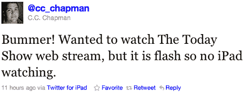
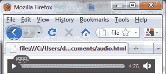
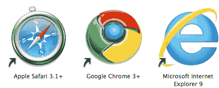
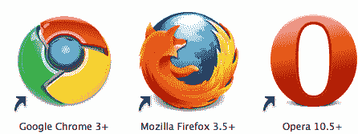
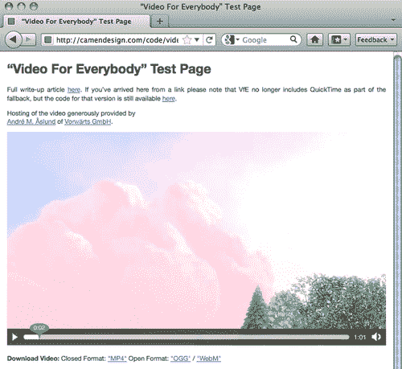
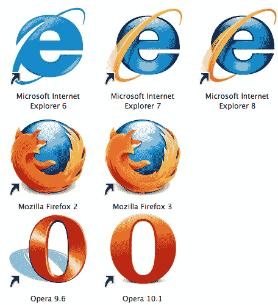
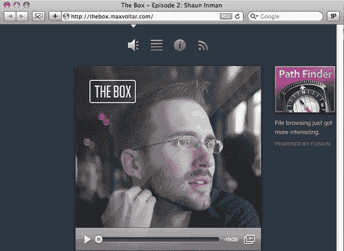
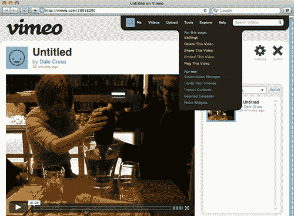

# 八、拥抱音频和视频

在本章中，我们将介绍:

*   对闪光说不
*   了解`audio`和`video`文件格式
*   为每个人显示`video`
*   创建可访问的`audio`和`video`
*   打造一个圆滑的`audio`玩家
*   为移动设备嵌入`audio`和`video`

# 简介

> “Flash 是在 PC 时代创造的——用于 PC 和鼠标。对于 Adobe 来说，闪存是一项成功的业务，我们可以理解他们为什么想把它推向个人电脑之外。但是移动时代是关于低功耗设备、触摸界面和开放网络标准的时代，所有这些都是闪存不足的领域。为苹果移动设备提供内容的媒体铺天盖地，表明 Flash 不再是观看视频或消费任何类型的网络内容所必需的。”史蒂夫·乔布斯

像我们已经看到的许多其他新技术一样，在开源 HTML5 标准中，新的`audio`和`video`元素比以往任何时候都更加成熟和可用。这是一件好事，因为用户对多媒体的期望比以往高得多。回到过去，我们使用 300 波特调制解调器，花了 10 分钟下载一张照片。后来我们用 Napster 非法下载了 MP3 `audio`文件。现在，我们在移动设备上播放电视和色情内容。由于带宽管道变得越来越大，我们对互动娱乐的需求变得几乎无法满足。是时候出手了。

多年来，快手、RealPlayer 和 Flash 一直在争夺网络视频播放的霸主地位。这些浏览器插件很容易安装，并且*通常*会产生预期的结果。

随着时间的推移，QuickTime 和 RealPlayer 继续作为播放平台，但专有 Flash 工具的制造商也创造了一个强大的开发环境，不仅允许设计师，也允许开发人员将其视为一个可行的平台。

而快手和 RealPlayer 还存在的时候，Flash 已经打赢了这场战争。对于动画和漫画来说，Flash 是理想的工具。但是现在上菜`audio`和`video`是最好的吗？史蒂夫·乔布斯肯定不这么认为。

2010 年，苹果电脑负责人乔布斯在沙上划了一条线，表示 Flash 永远不会出现在他最畅销的 iPhones 和 iPads 上。相反，他站出来强烈支持开放的 HTML5 标准，并点燃了一场在线圣战。

很快，“闪电侠之死”的声明成为媒体和整个博客圈的头条新闻。有些人愤怒地写道，就像一座大坝决堤了，所有堆积的污秽和渣滓都被允许淹没我们的集体多媒体对话。

很快，就连非网页设计师和开发人员也注意到了这一点，比如《内容规则》一书的著名作者查普曼(C.C. Chapman)对他的 iPad 上没有《今日秀》表示不满:



这个问题很快就渗透到了我们的在线娱乐讨论中。你不再需要成为一个网页设计师或开发者就知道这里有一个真正的问题。

C.C .说得简单而中肯，但作者知道，当谈到史蒂夫创造的 Flash/HTML5 `video`战争时，他已经成功地说错了话。有时，他过于兴致勃勃、虚张声势地为自己的观点辩护，但事实是，那些像网页设计师杰西卡·波恩这样头脑清晰的人提醒我们 Flash 和 HTML5 `video`可以和平共处时，他们是对的。

史蒂夫发表声明后不到一年，美国广播公司、哥伦比亚广播公司、美国有线电视新闻网、ESPN、脸书、福克斯新闻频道、MSNBC、国家地理、网飞、纽约时报、NPR、人物、体育画报、时代、Vimeo、华尔街日报、YouTube 等网站都采用了新的 HTML5 `audio`和`video`元素。截至本文撰写之时，超过 60%的网络`video`现在已经准备好了 HTML5。可以肯定地说，新的 HTML5 `audio`和`video`功能是一些最令人兴奋和期待的新发展！

支持新 HTML5 `audio`和`video`元素的浏览器包括:


在这一章中，我们将看看现实生活中对 Flash 说不的例子，理解新的`video`和`audio`文件格式，为每个人显示`video`，创建可访问的`audio`和`video`，制作一个光滑的`audio`播放器，以及为移动设备嵌入`audio`和`video`。

现在，让我们开始做饭吧！

# 对闪光说不

作者的妈妈曾经说过凡事都有时间和地点，我们相信 Flash 也有时间和地点。只是现在技术越来越成熟，在笔者看来 Flash 的时间和空间都越来越少了。


在糟糕的过去，如果我们想在一个网页中使用像“Neutraface”这样的 YouTube 视频，排版界对 Lady Gaga 的“Pokerface”的回答，我们必须使用一些像这样的丑陋代码:

```html
<object width="640" height="390">
<param name="movie" value="http://www.youtube.com/v/xHCu28bfxSI?fs=1&amp;hl=en_US"> </param>
<param name="allowFullScreen" value="true"></param>
<param name="allowscriptaccess" value="always"></param>
<embed src="http://www.youtube.com/v/xHCu28bfxSI?fs=1&amp;hl=en_US" type="application/x-shockwave-flash" allowscriptaccess="always" allowfullscreen="true" width="640" height="390"></embed>
</object>

```

那很长，很难看，很复杂，而且不会通过验证测试。它还依赖于第三方插件。啊。

多年来，我们饱受垃圾的折磨，但再也没有了。现在我们可以重建它——我们有技术。

## 怎么做...

现在我们可以使用更优雅的东西来代替臃肿的`object`代码:

```html
<video src="videosource.ogv"></video>

```

这是所有需要的。它很短，很漂亮，而且有效。最棒的是，它不需要插件。再告诉我一次为什么我们认为 Flash 是个好主意。

为了增加更多的风格和功能，让我们包含更多的代码。

```html
<video src="videosource.ogv" controls height="390" width="640"></video>

```

## 它是如何工作的...

这段代码应该非常简单。你可能猜到了，`src`指的是源`video`文件，`controls`表示`video`应该用标准播放和音量控制播放，`height`和`width`不言而喻。

现代浏览器现在有了自己的原生 HTML5 `audio`和`video`回放控件。让我们从苹果 Safari 开始，看看每一个:


这是谷歌浏览器显示回放控件的方式:


Microsoft Internet Explorer 9 以不同的方式显示它:


然后，Mozilla Firefox 的做法仍然不同:



毫不奇怪，Opera 以另一种方式显示回放控制:


每一个看起来都不一样。如果这些不同的外观都能满足你的需求，那就太好了！如果没有，那肯定需要更多的工作来让这些人行动起来，看起来相似。

## 还有更多...

我们也可以包含一些可选属性。它们是:

*   `autobuffer` -这个布尔属性告诉浏览器开始下载歌曲或电影，甚至在用户点击播放按钮之前。
*   `autoplay` -如你所料，这将告诉浏览器自动开始播放 HTML5 `audio`或`video`。
*   `loop` -也是一个布尔属性，它反复播放 HTML5 `audio`或`video`文件。
*   预加载-预加载属性在文件播放之前就开始加载文件。
*   `poster`-`poster`属性是在新的 HTML5 `video`加载时显示的静态占位符图像。显然，这个属性不适用于 HTML5 `audio`文件。

无论您是不添加这些可选属性，还是添加所有这些可选属性，您最终都将获得比依靠闪存为您服务更漂亮、更具语义性、更易于访问的显示`audio`和`video`的方法。

### 一些好消息

与`canvas`章节不同，关于新的 HTML5 `audio`和`video`元素的好消息是它们是可访问的。开箱即用，新的 HTML5 `audio`和`video`元素具有键盘可访问性。由于浏览器现在处理新的 HTML5 `audio`和`video`元素，它可以支持您的键盘，就像它有按钮而不是键一样。光是这一点就能大大促进这项新技术的接受。

### 有风格的视频

新的 HTML5 `audio`和`video`元素在视觉上可以用 CSS 风格化。我们可以使用 CSS 不仅控制玩家的大小，还可以添加`:hover`和`:transform`效果。此外，我们可以使用 JavaScript 来控制新的 HTML5 `audio`和`video`行为。酷！

### 覆盖你的资产

闪存确实有优势的一个领域是保护您的`audio`和`video`内容。请记住，新的 HTML5 `audio`和`video`元素本质上是开源的，没有数字版权管理。如果保护您的`audio`或`video`文件不被下载对您来说是一个交易破坏者，那么新的 HTML5 `audio`和`video`元素不是您的工具——闪存可能仍然是。这并不是说闪存提供了针对盗窃的终极保护——只是说，在开箱即用的情况下，闪存掩盖了找到媒体轨道的能力，新的 HTML5 `<audio>`和`<video>`元素默认情况下会将这些文件公开给任何人。但是，闪存介质服务器确实允许您完全保护您的资产。

还不确定是选择 HTML5 音视频还是 Flash？试试下面这些方便的小技巧。

HTML5 的优势包括:

*   **可访问性:**如果可访问性对你很重要(而且应该如此)，那么新的 HTML5 `audio`和`video`元素是你最好的选择。
*   **iOS:** 如果你想让你的`audio`和`video`在 iPhone 或 iPad 上显示，HTML5 是你唯一的选择。
*   **移动:**苹果以外的移动设备对新的 HTML5 `audio`和`video`元素有很大的支持。
*   `Video/Audio` **流媒体:**如果你正在流媒体的内容不是专有的，也不需要权限管理，那么 HTML5 就是你的最佳选择。

闪存的优势包括:

*   **可及性:**如果你不关心盲人或聋人，就不要支持他们。谁在乎你会不会被起诉，对吧？
*   **动画:**毫无疑问，使用 Flash 的最佳理由是你的网站上有密集的动画。像[http://jibjab.com](http://jibjab.com)这样的网站离不开它。
*   **纯桌面开发:**如果不需要支持移动用户。反正那只是一时的流行。
*   `Video/Audio` **流媒体:**如果你不喜欢分享，必须把你的`audio`或者`video`锁定下来，这样不容易被人下载，那就坚持用 Flash。
*   **网络摄像头:**如果你用网络摄像头(除了[http://chatroulette.com](http://chatroulette.com)之外，还有谁在用？)，那么 Flash 就是要走的路。

这*真的是*使用 Flash 最有说服力的理由吗？


## 另见

想在各大浏览器，包括一路回到 Internet Explorer 6，都能玩新的 HTML5 `audio`和`video`元素？谁不喜欢？如果是这样的话，在[http://projekktor.com](http://projekktor.com)查看免费的开源项目。Sascha Kluger，Projekktor 的大脑孩子使用 JavaScript 来确保各种支持的浏览器每个都能看到他们能够正确解释和显示的特定 HTML5 `video`文件格式。

# 了解音视频文件格式

有很多不同的`audio`和`video`文件格式。这些文件可能不仅包括`video`，还包括`audio`和元数据，所有这些都在一个文件中。这些文件类型包括:

*   `.avi` -音频视频交错文件格式是由微软发明的，这与过去大相径庭。不支持目前使用的大多数现代`audio`和`video`编解码器。
*   `.flv` -闪光`video`。这曾经是 Flash 完全支持的唯一的`video`文件格式。现在还包括对`.mp4`的支持。
*   `.mp4`或`.mpv` - MPEG4 基于苹果的 QuickTime 播放器，需要该软件进行播放。

## 它是如何工作的...

前面提到的每一种`video`文件格式都需要一个浏览器插件或某种独立软件来回放。接下来，我们将看看新的开源`audio`和`video`文件格式，它们不需要插件或特殊软件以及支持它们的浏览器。

*   **H.264** has become of the most commonly used high definition `video` formats. Used on Blu-ray Discs as well as many Internet `video` streaming sites including Flash, iTunes Music Store, Silverlight, Vimeo, YouTube, cable television broadcasts, and real-time videoconferencing. In addition, there is a patent on H.264 is therefore, by definition, not open source. Browsers that support H.264 `video` file format include:

    

    ### 类型

    谷歌现在已经部分拒绝了 H.264 格式，而是更倾向于支持新的 WebM `video`文件格式。

*   **Ogg** might be a funny sounding name, but its potential is very serious, I assure you. Ogg is really two things: Ogg Theora, which is a `video` file format; and Ogg Vorbis, which is an `audio` file format. Theora is really much more of a `video` file compression format than it is a playback file format, though it can be used that way also. It has no patents and is therefore considered open source. We'll discuss Ogg Vorbis in the next section.

    ### 类型

    有趣的事实:根据维基百科，“Theora 是以 Theora Jones 命名的，他是爱迪生·卡特在 Max Headroom 电视节目中的控制器。”

    支持 Ogg `video`文件格式的浏览器包括:

    

*   **WebM** is the newest entrant in the online `video` file format race. This open source `audio/video` file format development is sponsored by Google. A WebM file contains both an Ogg Vorbis `audio` stream as well as a VP8 `video` stream. It is fairly well supported by media players including Miro, Moovidia, VLC, Winamp, and more, including preliminary support by YouTube. The makers of Flash say it will support WebM in the future, as will Internet Explorer 9\. Browsers that currently support WebM include:

    

## 还有更多...

到目前为止，这看起来就像是一系列的`audio`和`video`文件格式，最多也就是不稳定的浏览器支持。如果你开始有这种感觉，你是对的。

事实是，没有一种`audio`或`video`文件格式成为统治它们的唯一真正格式。相反，我们开发人员将不得不以多种格式提供新的`audio`和`video`文件，同时让浏览器决定哪一个最舒服，最能玩。这是一个拖累，但在这里希望在未来，我们满足于更少的格式，更一致的结果。

### 音频文件格式

还有许多`audio`文件格式。让我们看看那些。

*   **AAC** - Advanced Audio Coding files are better known as AACs. This `audio` file format was created by design to sound better than MP3s using the same bitrate. Apple uses this `audio` file format for its iTunes Music Store. Since the AAC `audio` file format supports DRM, Apple offers files in both protected and unprotected formats. There is an AAC patent, so by definition we can't exactly call this `audio` file format open source. All Apple hardware products, including their mobile iPhone and iPad devices as well as Flash, support the AAC `audio` file format. Browsers that support AAC include:

    

*   **MP3** - MPEG-1 Audio Layer 3 files are better known as MP3s. Unless you've been hiding under a rock, you know MP3s are the most ubiquitous `audio` file format in use today. Capable of playing two channels of sound, these files can be encoded using a variety of bitrates up to 320\. Generally, the higher the bitrate, the better the `audio` file sounds. That also means larger file sizes and therefore slower downloads. There is an MP3 patent, so by definition we can't exactly call this `audio` file format open source either. Browsers that support MP3 include:

    

*   **Ogg** - We previously discussed the Ogg Theora `video` file format. Now, let's take a look at the Ogg Vorbis `audio` format. As mentioned before, there is no patent on Ogg files and are therefore considered open source.

    ### 类型

    另一个有趣的事实:根据维基百科，“沃尔比斯是以*特里·普拉切特在*小神*中的一个*discovery*角色，玲珑剔透者沃尔比斯命名的。”*

    

### 文件格式不可知论

我们花了很多时间检查这些不同的`video`和`audio`文件格式。每一个都有它自己的优缺点，并且被不同的浏览器支持(或不支持)。有些工作比别人好，有些声音和外表比别人好。但好消息是:新的 HTML5 `<video>`和`<audio>`元素本身是文件格式不可知的！这些新元素不在乎你引用的是什么样的`video`或`audio`文件。相反，它们提供您指定的任何内容，并让每个浏览器做它最喜欢做的事情。

### 有一天我们能停止疯狂吗？

底线是，在一个新的 HTML5 `audio`和一个新的 HTML5 `video`文件格式成为所有浏览器和设备的明确选择之前，`audio`和`video`文件将不得不被编码不止一次才能回放。不要屏住呼吸，因为这种情况很快就会改变。

# 为大家展示视频

根据作者马克·皮尔格林的说法，你的 HTML5 网页`video`工作流程看起来会是这样的:

*   制作一个使用 WebM 的版本(VP8 和 Vorbis)。
*   在 MP4 容器中制作另一个使用 H.264 基线`video`和 AAC“低复杂度”`audio`的版本。
*   在 Ogg 容器中制作另一个使用 Theora `video`和 Vorbis `audio`的版本。
*   从一个`<video>`元素链接到所有三个`video`文件，然后回到一个基于 Flash 的`video`玩家。

Kroc Camen 在创建“人人视频”时就做到了这一点，这是一段 HTML 代码，如果用户的浏览器可以处理，它会显示新的 HTML5 `video`元素，如果不能处理，它会显示 Flash 电影——所有这些都没有 JavaScript。让我们看看克罗克是如何在[http://camendesign.com/code/video_for_everybody](http://camendesign.com/code/video_for_everybody)做到的。



## 怎么做...

```html
<video controls height="360" width="640">
<source src="__VIDEO__.MP4" type="video/mp4" />
<source src="__VIDEO__.OGV" type="video/ogg" />
<object width="640" height="360" type="application/ x-shockwave-flash" data="__FLASH__.SWF">
<param name="movie" value="__FLASH__.SWF" />
<param name="flashvars" value="controlbar=over&amp; image=__POSTER__.JPG&amp;file=__VIDEO__.MP4" />

</object>
</video>
<p><strong>Download Video:</strong>
Closed Format: <a href="__VIDEO__.MP4">"MP4"</a>
Open Format: <a href="__VIDEO__.OGV">"Ogg"</a>
</p>

```

仔细看，很容易看出克罗克做了什么。首先，他调用了浏览器原生回放`controls`，以及新的 HTML5 `video`元素的关联`height`和`width`。

```html
<video controls height="360" width="640">

```

接下来，一个接一个，Kroc 依次调用每个新的 HTML5 `video`源，从一个 MP4 文件开始。桌面浏览器不会太在意 HTML5 `video`文件包含在哪个顺序中，但是 iPad 挑剔想要先指定一个 MP4 文件，所以没问题。你又赢了，史蒂夫·乔布斯。

```html
<source src="__VIDEO__.MP4" type="video/mp4" />
<source src="__VIDEO__.OGV" type="video/ogg" />

```

Kroc 然后通过为不能处理新的 HTML5 `video`元素的弱浏览器调用同一文件的 Flash `video`版本来对冲他的赌注。

```html
<object width="640" height="360" type="application/x-shockwave-flash" data="__FLASH__.SWF">
<param name="movie" value="__FLASH__.SWF" />
<param name="flashvars" value="controlbar=over&amp; image=__POSTER__.JPG&amp;file=__VIDEO__.MP4" />

</object>

```

最后，Kroc 通过提示用户可选地下载新的 HTML5 `video`文件本身，以关闭(MP4)和打开(Ogg)格式，增加了一个不错的额外触摸。分享就是关怀。

```html
<p><strong>Download Video:</strong>
Closed Format: <a href="__VIDEO__.MP4">"MP4"</a>
Open Format: <a href="__VIDEO__.OGV">"Ogg"</a>
</p>

```

### 类型

当然，您可以用自己文件的路径替换“_VIDEO_.MP4”之类的内容。

这种方法非常成功，因为无论您使用什么网络浏览器，您都可以看到一些东西，而不需要 JavaScript 或下载闪存。

## 它是如何工作的...

这个概念真的很简单:如果你的浏览器能够播放一个新的 HTML5 `video`元素文件，那正是你会看到的。如果它不能做到这一点，那么代码堆栈中也会包含一个 Flash 电影，所以您应该看到它。如果由于某种原因，您的浏览器不支持新的 HTML5 `video`元素，并且 Flash 播放器崩溃或不可用，您将看到一个静态图像。所有人都被掩护了。

使用这种方法显示新 HTML5 `video`元素的浏览器包括:


使用这种方法显示 Flash `video`的浏览器包括:



## 还有更多...

其他所有 Flash `video`嵌入方式，如果还没有安装 Flash，都会提示用户下载。“人人视频”的独特之处在于它没有做到这一点。作者克罗克·卡曼故意这么做的，他说:

> “在没有随机网站提示用户安装东西的情况下，用户已经有了足够多的安全问题——对于那些无论如何都不想或不能使用 Flash 的人来说，这更令人恼火。”

### 哑剧是一种很可怕的浪费

Kroc 提醒我们确保我们的服务器使用正确的`mime-types`，并建议将这些行放在您的`.htaccess`文件中:

```html
AddType video/ogg .ogv
AddType video/mp4 .mp4
AddType video/webm .webm

```

### 外部“人人视频”

现在在[http://WordPress . org/extend/plugins/external-Video-for-Everybody](http://wordpress.org/extend/plugins/external-video-for-everybody)上有一个 WordPress 的“人人视频”插件。现在你也可以很容易地在你的博客上使用克罗克的方法。

### 灵活对待你的方法

稍后我们将看到一种方法，它实现了与克罗克的方法几乎相同的功能，但这次是用 JavaScript。记住:做对你、你的项目、最重要的是对你的客户最有意义的事情。

## 另见

Humanstxt.org 是一个让网站背后的开发者更加出名的项目。该网站鼓励开发人员包含一个小的文本文件，其中包含每个参与创建和构建网站的团队成员的信息。在 http://humanstxt.org查看。

# 创建可访问的音频和视频

我们已经相当广泛地研究了如何为人们提供在线 HTML5 `video`，而不管他们的浏览器是什么，但是没有太多关注那些依赖辅助技术的人。现在结束了。

## 怎么做...

首先，我们将从 Kroc Camen 的“人人视频”代码块开始，并研究如何使其易于访问，最终看起来像这样:

```html
<div id="videowrapper">
<video controls height="360" width="640">
<source src="__VIDEO__.MP4" type="video/mp4" />
<source src="__VIDEO__.OGV" type="video/ogg" />
<object width="640" height="360" type="application/ x-shockwave-flash" data="__FLASH__.SWF">
<param name="movie" value="__FLASH__.SWF" />
<param name="flashvars" value="controlbar=over&amp; image=__POSTER__.JPG&amp;file=__VIDEO__.MP4" />

</object>
<track kind="captions" src="videocaptions.srt" srclang="en" />
<p>Final fallback content</p>
</video>
<div id="captions"></div>
<p><strong>Download Video:</strong>
Closed Format: <a href="__VIDEO__.MP4">"MP4"</a>
Open Format: <a href="__VIDEO__.OGV">"Ogg"</a>
</p>
</div>

```

## 它是如何工作的...

你会注意到的第一件事是我们已经将新的 HTML5 `video`元素包装在包装器`div`中。虽然这在语义上并不是严格必要的，但是它会给我们的 CSS 一个很好的“钩子”。

```html
<div id="videowrapper">

```

下一个块的大部分应该可以从上一节中识别出来。这里没有任何变化:

```html
<video controls height="360" width="640">
<source src="__VIDEO__.MP4" type="video/mp4" />
<source src="__VIDEO__.OGV" type="video/ogg" />
<object width="640" height="360" type="application/ x-shockwave-flash" data="__FLASH__.SWF">
<param name="movie" value="__FLASH__.SWF" />
<param name="flashvars" value="controlbar=over&amp;
image=__POSTER__.JPG&amp;file=__VIDEO__.MP4" />

</object>

```

到目前为止，我们仍然使用为那些能够处理它的浏览器提供新的 HTML5 `video`元素的方法，并使用 Flash 作为我们的第一个后备选项。但是，如果闪存不是一个选项，接下来会发生什么有趣的事情:

```html
<track kind="captions" src="videocaptions.srt" srclang="en" />

```

你可能想知道这到底是什么？

> `track`元素允许作者为媒体元素指定明确的外部定时文本轨道。它本身并不代表任何东西。”- W3C HTML5 规范

这是我们使用 HTML5 规范的另一个新部分的机会:新的`<track>`元素。现在，我们可以参考`kind="captions"`中指定的外部文件类型。如你所料，`kind="captions"`是字幕文件，而`kind="descriptions"`是`audio`描述。当然`src`调用特定的文件，`srclang`为新的 HTML5 `track`元素设置源语言。在这种情况下，`en`代表英语。不幸的是，目前没有浏览器支持新的`track`元素。

最后，我们允许最后一点后备内容，以防用户不能使用新的 HTML5 `video`元素或 Flash，当我们给他们一些纯粹基于文本的东西时。

```html
<p>Final fallback content</p>

```

现在，即使用户看不到图像，他们至少会收到一些描述性的内容。

接下来，我们将创建一个容器`div`来存放基于文本的标题。因此，目前没有浏览器支持新的 HTML5 `audio`或`video`元素的隐藏式字幕，我们必须留出空间来包含我们自己的:

```html
<div id="captions"></div>

```

最后，我们将包括克罗克的文本提示，以关闭或打开的文件格式下载 HTML5 `video`:

```html
<p><strong>Download Video:</strong>
Closed Format: <a href="__VIDEO__.MP4">"MP4"</a>
Open Format: <a href="__VIDEO__.OGV">"Ogg"</a>
</p>

```

## 还有更多...

除了新 HTML5 `audio`和`video`元素可选的`controls`属性外，还有可选的`loop`属性。正如你可能猜到的，这个例子将允许 HTML5 `video`不断播放:

```html
<video controls height="360" loop width="640">

```

### 始终考虑可达性

我们默认的最后一个描述性内容可能是提供可下载链接给那些使用可访问性技术的人的另一个地方。它会混淆那些能看到或听到的人的下载能力，所以你应该确定这种方法是否适合你。

### 浏览器支持

对新 HTML5 `audio`和`video`元素具有最佳可访问性支持的网络浏览器包括:


### 查看更多

你可以在[http://html5accessibility.com](http://html5accessibility.com)追踪 HTML5 的可访问性。该网站追踪像`audio`和`video`这样的 HTML5 新功能在哪些浏览器中可用。您可能会惊讶地发现，在撰写本文时，Opera 是最不容易访问的友好网络浏览器，甚至低于微软的 Internet Explorer 9。惊喜惊喜。

## 另见

视频。Js 是另一个免费的、开源的 HTML5 视频播放器。它是轻量级的，不使用图像，但是通过 CSS 保持完全皮肤化。它看起来很棒，支持苹果 Safari、谷歌 Chrome、微软 Internet Explorer 9、Mozilla Firefox 和 Opera，并有 IE 6-8 的后备支持。它甚至适用于手机、iPad 和安卓等移动设备。在[http://videojs.com](http://videojs.com)查看。

# 制作一个精巧的音频播放器

中子创造公司负责人、联合创始人兼前端开发人员本·博丁在 http://thebox.maxvoltar.com T2 为蒂姆·范·达姆的“盒子”播客制作了一个定制的 HTML5 播放器。本的创作快速、直观、流畅。让我们更深入地看看他是如何做到的。



本定制的 HTML5 `audio`播放器有一张被采访者的迷人照片(在本例中是肖恩·因曼)，一个播放/暂停按钮，一个指示播放进度的轨道，以及将 HTML5 `audio`播放器弹出到单独窗口的能力(如果你愿意的话)。就这样。不需要更多了。作为额外的接触，请注意 HTML5 `audio`玩家栏的轻微透明度的细节。很好。

## 怎么做...

起初，本的标记看似简单:

```html
<p class="player">
<span id="playtoggle" />
<span id="gutter">
<span id="loading" />
<span id="handle" class="ui-slider-handle" />
</span>
<span id="timeleft" />
</p>

```

等一下，我听到你在想，“HTML5 `audio`标签呢？!"永远不要害怕。本是个聪明人，对此有计划。但是首先让我们看看他到目前为止做了什么。

```html
<p class="player">

```

这个到目前为止很简单。本创建了一个包装元素(本例中为`<p>`)来放入他的玩家。他会用`<div>`来代替吗？也许吧。做对你和你的项目最有意义的事情。

```html
<span id="playtoggle" />

```

然后，Ben 使用这种自动关闭(注意结尾的尾斜线)`span`作为播放/暂停切换按钮。

```html
<span id="gutter">
<span id="loading" />
<span id="handle" class="ui-slider-handle" />
</span>

```

现在，它变得有趣了。Ben 的“装订线”`span`容纳了时间轴轨道，其中有一个条表示 HTML5 `audio`文件的加载或缓冲进度，还有一个圆形元素表示回放头，如果您愿意，可以来回“擦洗”。

```html
<span id="timeleft" />

```

最后，本用另一个自闭`span`显示剩余时间，以分和秒为单位。

### 类型

`<span>`元素起了作用，但它不是很语义化，是吗？帕特里克·劳克很快指出，使用可聚焦元素将大大有助于依赖辅助技术的人使用这种方法。

## 它是如何工作的...

Ben 使用 jQuery 检测对 HTML5 `audio`的支持。

```html
if(!!document.createElement('audio').canPlayType) {
var player = '<p class="player"> ... </p>\
<audio>\
<source src="/path/to/episode1.ogg" type="audio/ogg"></source>\
<source src="/path/to/episode1.mp3"
type="audio/mpeg"></source>\
<source src="/path/to/episode1.wav" type="audio/ x-wav"></source>\
</audio>';
$(player).insertAfter("#listen .photo");
}

```

在这段代码中，我们可以看到如果浏览器支持 HTML5 `audio`，它将获得完整的 HTML5 `<audio>`标签，并返回到`.ogg, .mp3`和`.wav`，这是一种我们还没有使用过的文件格式。由于新的 HTML5 `<audio>`和`<video>`元素是文件格式不可知的，一个`.wav`文件应该也能正常工作。

Ben 创建了一个简单的 JavaScript，允许浏览器做他们觉得最舒服的事情。如果这种方法对您和您的项目有意义，请考虑这种方法，但是请记住，您依赖于 JavaScript 来完成繁重的工作，而不是我们所看到的不依赖于它的其他方法。

### 类型

请注意，如果您使用一个`<div>`来包含 HTML5 `video`播放器，那么 JavaScript 也必须进行调整。简单来说，就是把`<p class="player">`……`</p>`改成`<div class="player">`……`</div>`。

## 还有更多...

到目前为止，我们已经为播放器设置了标记，并“嗅探”以查看任何特定浏览器想要的文件格式。现在，我们需要添加一些功能。

```html
audio = $('.player audio').get(0);
loadingIndicator = $('.player #loading');
positionIndicator = $('.player #handle');
timeleft = $('.player #timeleft');
if ((audio.buffered != undefined) && (audio.buffered.length != 0)) {
$(audio).bind('progress', function() {
var loaded = parseInt(((audio.buffered.end(0) / audio.duration) * 100), 10);
loadingIndicator.css({width: loaded + '%'});
});
}
else {
loadingIndicator.remove();
}

```

然后添加一个函数来计算回放头的位置，以确定剩余时间，如果剩余时间需要，请注意包含前导零。

```html
$(audio).bind('timeupdate', function() {
var rem = parseInt(audio.duration - audio.currentTime, 10),
pos = (audio.currentTime / audio.duration) * 100,
mins = Math.floor(rem/60,10),
secs = rem - mins*60;
timeleft.text('-' + mins + ':' + (secs > 9 ? secs : '0' + secs));
if (!manualSeek) { positionIndicator.css({left: pos + '%'}); }
if (!loaded) {
loaded = true;
$('.player #gutter').slider({
value: 0,
step: 0.01,
orientation: "horizontal",
range: "min",
max: audio.duration,
animate: true,
slide: function() {
manualSeek = true;
},
stop:function(e,ui) {
manualSeek = false;
audio.currentTime = ui.value;
}
});
}
});

```

剩下唯一需要调用的是播放/暂停按钮功能。

```html
$(audio).bind('play',function() {
$("#playtoggle").addClass('playing');
}).bind('pause ended', function() {
$("#playtoggle").removeClass('playing');
});
$("#playtoggle").click(function() {
if (audio.paused) { audio.play(); }
else { audio.pause(); }
});

```

### 风格和实质

在简单的标记和详细的 JavaScript 创建了 Ben 定制的 HTML5 `audio`播放器之后，唯一剩下的就是样式:

```html
.player {
display: block;
height: 48px;
width: 400px;
position: absolute;
top: 349px;
left: -1px;
-webkit-box-shadow: 0 -1px 0 rgba(20, 30, 40, .75);
-moz-box-shadow: 0 -1px 0 rgba(20, 30, 40, .75);
-o-box-shadow: 0 -1px 0 rgba(20, 30, 40, .75);
box-shadow: 0 -1px 0 rgba(20, 30, 40, .75);
border-top: 1px solid #c2cbd4;
border-bottom: 1px solid #283541;
background: #939eaa;
background: -webkit-gradient(linear, 0% 0%, 0% 100%, from(rgba(174, 185, 196, .9)), to(rgba(110, 124, 140, .9)), color-stop(.5, rgba(152, 164, 176, .9)), color-stop(.501, rgba(132, 145, 159, .9)));
background: -moz-linear-gradient(top, rgba(174, 185, 196, .9), rgba(152, 164, 176, .9) 50%, rgba(132, 145, 159, .9) 50.1%, rgba(110, 124, 140, .9));
background: linear-gradient(top, rgba(174, 185, 196, .9), rgba(152, 164, 176, .9) 50%, rgba(132, 145, 159, .9) 50.1%, rgba(110, 124, 140, .9));
cursor: default;
}
#playtoggle {
position: absolute;
top: 9px;
left: 10px;
width: 30px;
height: 30px;
background: url(../img/player.png) no-repeat -30px 0;
cursor: pointer;
}
#playtoggle.playing {background-position: 0 0;}
#playtoggle:active {top: 10px;}
#timeleft {
line-height: 48px;
position: absolute;
top: 0;
right: 0;
width: 50px;
text-align: center;
font-size: 11px;
font-weight: bold;
color: #fff;
text-shadow: 0 1px 0 #546374;
}
#wrapper #timeleft {right: 40px;}
#gutter {
position: absolute;
top: 19px;
left: 50px;
right: 50px;
height: 6px;
padding: 2px;
-webkit-border-radius: 5px;
-moz-border-radius: 5px;
-o-border-radius: 5px;
border-radius: 5px;
background: #546374;
background: -webkit-gradient(linear, 0% 0%, 0% 100%, from(#242f3b), to(#516070));
background: -moz-linear-gradient(top, #242f3b, #516070);
background: linear-gradient(top, #242f3b, #516070);
-webkit-box-shadow: 0 1px 4px rgba(20, 30, 40, .75) inset, 0 1px 0 rgba(176, 187, 198, .5);
-moz-box-shadow: 0 1px 4px rgba(20, 30, 40, .75) inset, 0 1px 0 rgba(176, 187, 198, .5);
-o-box-shadow: 0 1px 4px rgba(20, 30, 40, .75) inset, 0 1px 0 rgba(176, 187, 198, .5);
box-shadow: 0 1px 4px rgba(20, 30, 40, .75) inset, 0 1px 0 rgba(176, 187, 198, .5);
}
#wrapper #gutter {right: 90px;}
#loading {
background: #fff;
background: #939eaa;
background: -webkit-gradient(linear, 0% 0%, 0% 100%, from(#eaeef1), to(#c7cfd8));
background: -moz-linear-gradient(top, #eaeef1, #c7cfd8);
background: linear-gradient(top, #eaeef1, #c7cfd8);
-webkit-box-shadow: 0 1px 0 #fff inset, 0 1px 0 #141e28;
-moz-box-shadow: 0 1px 0 #fff inset, 0 1px 0 #141e28;
-o-box-shadow: 0 1px 0 #fff inset, 0 1px 0 #141e28;
box-shadow: 0 1px 0 #fff inset, 0 1px 0 #141e28;
-webkit-border-radius: 3px;
-moz-border-radius: 3px;
-o-border-radius: 3px;
border-radius: 3px;
display: block;
float: left;
min-width: 6px;
height: 6px;
}
#handle {
position: absolute;
top: -5px;
left: 0;
width: 20px;
height: 20px;
margin-left: -10px;
background: url(../img/player.png) no-repeat -65px -5px;
cursor: pointer;
}
.player a.popup {
position: absolute;
top: 9px;
right: 8px;
width: 32px;
height: 30px;
overflow: hidden;
text-indent: -999px;
background: url(../img/player.png) no-repeat -90px 0;
}
.player a.popup:active {background-position: -90px 1px;}Content matters

```

当包装的内容引人注目时，花时间去创造一些有趣的东西会容易得多，也更有收获。盒子音频采访总是一个很好的倾听者——只是太糟糕了，作者蒂姆·范·达姆没有更频繁地发布它们。希望未来会有所改变。在[http://thebox.maxvoltar.com](http://thebox.maxvoltar.com)查看。

### 小心细节

当一次在一个页面上有一个新的 HTML5 `audio`或`video`元素要交付时，这种方法非常有效。如果您需要不止一个，您将不得不修改 JavaScript，以绑定到标记中的多个“钩子”。

## 另见

升华视频对 HTML5 在线`video`播放采取了不同的方式:在这种情况下，播放器不是由你创建或托管的，而是由云中播放器本身的制作者创建的。好处是你总是有最新、最新鲜版本的播放器。这样，当新功能可用或 bug 被修复时，您就没有什么可做的了。你会自动拥有最新鲜的功能。去[http://sublimevideo.net](http://sublimevideo.net)看看吧。

# 为移动设备嵌入音频和视频

到目前为止，我们确实只触及了移动体验，但是随着越来越智能的移动设备的发展，我们需要将注意力转向让我们的新 HTML5 `audio`和`video`在这些设备上显示。事情是这样的。

## 怎么做...

现在，我们知道如何为目标受众选择 HTML5 `audio`或`video`文件格式，我们现在可以将注意力转向确保他们不仅可以在台式电脑和笔记本电脑上，而且可以在移动设备上听到或看到它。

我们将从创建一个 http://vimeo.com 的免费账户开始。注册完成后，在主菜单中选择上传|视频功能。您将选择要上传的文件，添加可选的元数据，并让 Vimeo 服务器完成设置文件的工作。接下来是真正的刺激开始的时候:嵌入`video`。从 Vimeo 主菜单中选择**工具** | **嵌入此视频**。



## 它是如何工作的...

Vimeo 曾经使用我们之前看到的老式 Flash 嵌入方法。现在它使用了一种基于 iFrame 的方法，允许 HTML5 `video`在 iPhone、iPad 和其他移动设备上播放。这里有一个例子，基于作者上传的一个`video`:

```html
<iframe src="http://player.vimeo.com/video/20958090" width="400" height="300" frameborder="0"></iframe><p><a href="http://vimeo.com/20958090">Untitled</a> from <a href="http://vimeo.com/user6281288">Dale Cruse</a> on <a href="http://vimeo.com">Vimeo</a>.</p>

```

## 还有更多...

一旦您将基于 iFrame 的代码片段复制并粘贴到网页上，并在 iPhone 或 iPad 上查看，您应该有一个移动友好的 HTML5 `video`，您可以像这样制作全尺寸:


### Vimeo 提供了更多

Vimeo 还允许您从电子邮件联系人列表中添加朋友、创建`video`订阅、制作小部件等等。他们现在甚至提供视频学校来帮助教育用户如何最有效地捕捉、编辑和分享你的`videos`。

### 来了整整一圈

YouTube，世界上最受欢迎的在线`video-viewing`网站，现在也使用基于 iFrame 的方法嵌入`videos`。我们可以采用与本章开头相同的“Neutraface”`video`方法，使用新的基于 iFrame 的嵌入方法，最终得到语义更丰富、更友好的东西。也通过验证！

```html
<iframe title="YouTube video player" width="1280" height="750" src="http://www.youtube.com/embed/xHCu28bfxSI?rel=0&amp;hd=1" frameborder="0" allowfullscreen></iframe>

```

看看那有多漂亮！

我们已经走了一个完整的圈子，完全改变了我们的`video`捕捉、编辑和回放能力，使其能够在现代浏览器中工作，同时支持那些依赖辅助技术和移动设备的人。这是一个成长的基础。

## 另见

Adobe 是在割自己的喉咙吗？几乎没有。2011 年初，Adobe 推出了一款免费的 Flash 到 HTML5 转换器，代号为“Wallaby”。不幸的是，当 Adobe 声称 Wallaby 可以使用网络标准将 Flash 导出到 HTML5 时，许多设计师和开发人员都觉得承诺过高。事实是，它所做的只是将 Flash CS5 或更高版本中创建的最简单的动画转换为简单的标记和样式。没有能力将 ActionScript 转换为 JavaScript，这种能力将真正使工具变得有价值。在约翰·纳克的博客上查看 Wallaby 公告，网址为[http://blogs . adobe . com/jnack/2011/03/Wallaby-flash-to-html 5-conversion-tool-now-available . html](http://blogs.adobe.com/jnack/2011/03/wallaby-flash-to-html5-conversion-tool-now-available.html)。