# 第一章。HTML5 视频操作指南

欢迎来到 *HTML5 视频操作指南*，在这里，我们将带您踏上一段旅程，使用带有新的 HTML5 标准标签的视频，这些标签现已在大多数现代浏览器中提供。

# 一开始…

回到互联网的早期，多媒体仅限于修补 MIDI 文件和动画 gif——虽然这些在当时被认为是非常先进的，但考虑到当今网络技术的先进水平，我们中的一些人可能想知道为什么我们要使用它们！

如果您想要包含任何多媒体文件，您将被迫包含一个类似于以下代码片段的神秘代码块:

```html
<object width="425" height="344">
  <param name="movie"
value="http://www.youtube.com/v/9sEI1AUFJKw&hl=en_GB&fs=1&"></para
m>
  <param name="allowFullScreen"
    value="true"></param>
  <param name="allowscriptaccess"
    value="always"></param>
  <embed src="http://www.youtube.com/v/9sEI1AUFJKw&hl=en_GB&fs=1&"
    type="application/x-shockwave-flash" allowscriptaccess="always"
    allowfullscreen="true" width="425"
    height="344"></embed>
</object>
```

### 类型

**下载示例代码**

您可以从您在[http://www.PacktPub.com](http://www.PacktPub.com)的账户中下载您购买的所有 Packt 书籍的示例代码文件。如果您在其他地方购买了这本书，您可以访问[http://www.PacktPub.com/support](http://www.PacktPub.com/support)并注册，以便将文件直接通过电子邮件发送给您。

由于自 2005 年以来 HTML 技术的进步，前面的大部分代码片段现在已经变得多余，至少对于现代浏览器来说是如此。正如您将在本书后面看到的，这段代码已经减少到三至四行(尽管如果您愿意，可以在后面添加更多选项)。

这样做的缺点是，虽然 HTML5 标准代码缩小了，但不幸的是浏览器支持没有跟上——使用 HTML5 `<video>`和`<audio>`标签的开发人员必须考虑到不同的格式，正如你将在本章中看到的那样。

# 浏览器不一致

为了适应 HTML5 视频格式仍然存在的一些混乱，作为开发人员，需要考虑多个不同的平台，以确保尽可能广泛的支持，如下表所示:


*以**为来源，截至 2012 年 4 月数据正确。*

最终的结果是你需要迎合几种视频格式——现在主要的是 WebM 和 MP4 你也可以转换成 Ogg Vorbis 格式，虽然这种格式没有那么广泛的使用。

### 注

请注意，本书中的所有任务都是基于使用视窗作为作者的首选平台——只要有可能，都会提供苹果电脑平台上的等效建议。

在本章中，我们将从将您的视频杰作转换为适用于 HTML5 视频的格式开始。

# 将视频转码为 HTML5 格式(必须知道)

以下任务将使用名为“轻松 HTML5 视频转换器”的共享软件应用程序将视频转码为 HTML5 格式，该应用程序可在[http://www.easyhtml5video.com](http://www.easyhtml5video.com)获得。它可以免费用于非商业用途。要移除徽标或将其用于商业目的，您需要购买许可证(在撰写本文时，单个网站的许可证价格为 49 美元，多个网站的许可证价格为 69 美元)。

## 做好准备

在我们转换视频之前，您需要为您的平台下载一份易趣 HTML5 视频转换器——它既适用于 Windows，也适用于苹果电脑。确保你手头也有一份原始视频的拷贝，可以随时转换。为了这个任务的目的，我假设它是`.mov`格式的。

## 怎么做...

1.  第一步是安装软件；所以让我们继续运行`easyhtml5video-setup.exe`程序，接受所有默认值。
2.  Double-click on it to open up **EasyHTML5Video 1.3.4 Free****version** and click on **Select new video**, then drag and drop your video onto the screen that looks similar to the following screenshot:

    

3.  The screen will change to show the selected video and its properties, as shown in the following screenshot:

    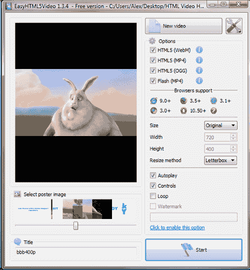

4.  For the purposes of this task, we need Easy HTML5 Video to export copies of the videos into all of the required formats—this includes Flash as the fallback format. The only change you need to make is to the poster image that you want to use—change the slider to an appropriate frame as shown in the following screenshot:

    

    这将作为视频开始前显示的图像。我们将在下一章更详细地了解海报图像。

5.  我们将保持与之前相同的文件名，这将有助于稍后设置`<video>`代码。所以，继续点击**开始**开始转换过程。此时，你可能想去冲杯咖啡，因为根据视频的大小，这个过程需要几分钟的时间！
6.  The final stage of the conversion process is to select where the content will be published. By default, the files will be placed into a folder called `EasyHTML5Video` within your `Documents` folder (as shown in the following screenshot); you can store the files elsewhere if you wish to:

    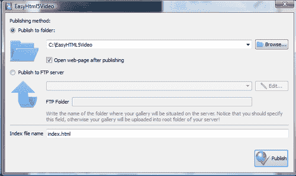

7.  点击 ****发布**。文件转换过程现已完成，视频示例将在您的默认浏览器中开始播放。还制作了一个文件夹，其中包含一些标准的 HTML5 视频代码，根据您使用的浏览器，可以拉进适当的视频进行播放。我们将在本书的后面部分研究这些代码。**

 **## 它是如何工作的...

在这里，我们研究了如何使用新的 HTML5 `<video>`标签同时将您的视频转换为适合播放的格式。EasyHTML5Video 在转换过程中为您节省了大量的辛苦工作——将文件转换为正确的格式变得轻而易举，并自动创建基本代码以允许在浏览器中进行基本回放。

## 还有更多...

在本例中，我们将大部分设置保持在默认值，这对于转换视频文件是完全可以接受的。如果需要，您还可以更改转换后的视频的大小，或者将其设置为首次显示时自动播放(尽管我们在下一章中将会看到，不建议这样做)。

# 安装播放支持(必须知道)

现在我们已经转换了我们的视频，准备回放，是时候确保我们可以在我们的电脑和浏览器上回放它们了。大多数最新的浏览器将至少播放我们在上一个任务中创建的一种格式，但是您可能无法在浏览器之外播放它们。让我们看看如何通过更新安装在您电脑中的编解码器来解决这个问题。

### 注

对于不熟悉编解码器的人来说，它们旨在帮助在创建视频时对资产进行编码，并在回放过程中对其进行解码。软件和硬件制造商将根据它们应该支持的容器和技术来决定每个编解码器的组成；文件大小、质量和带宽等许多因素都在他们的决策中发挥作用。

让我们看看如何更新我们的电脑，以允许正确播放 HTML5 视频。

## 做好准备

有许多个人或公司生产了不同的编解码器，但结果不同。我们来看一个看起来对 Windows 非常好用的包，就是 **K-Lite 编解码包**T3。您需要下载该包的副本，可从[http://file forum . beta news . com/detail/KLite-Codec-Pack-Basic/1094057842/1](http://fileforum.betanews.com/detail/KLite-Codec-Pack-Basic/1094057842/1)—使用页面右侧的蓝色**立即下载**链接。这将下载基本版本，这足以满足我们现阶段的需求。

## 怎么做...

让我们继续安装软件吧！此任务假设您将在视窗电脑平台上使用视窗媒体播放器。

1.  继续双击**K-Lite _ Codec _ Pack _ 860 _ basic . exe**设置文件。点击**下一步**，然后接受所有默认值，直到到达【Windows Media Player 文件关联屏幕(如下图截图所示)；当屏幕 2 提示安装模式时，选择**高级**。
2.  When you reach the **File Associations for Windows Media Player** screen, select the **Select all video** option to enable support for all video formats as shown in the following screenshot:

    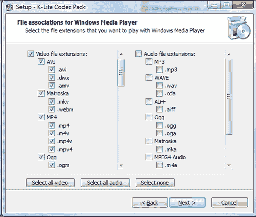

3.  On the next screen, select **Select all** as shown in the following screenshot:

    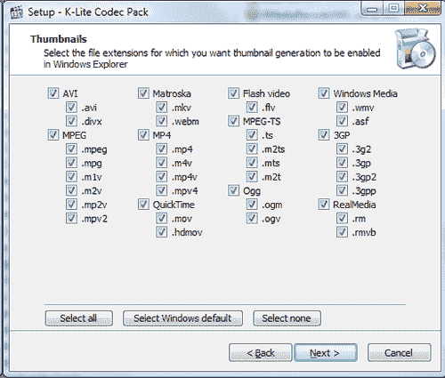

4.  On the **Speaker configuration** screen (as shown in the following screenshot), select the **2.0 (stereo)** option—while you can adjust this later, it is sufficient for the purposes of this task.

    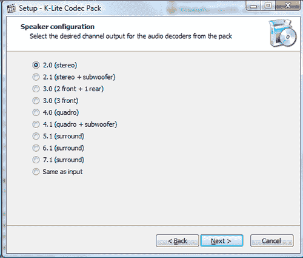

5.  点击**安装**，然后**完成**。编解码器现已安装！

## 它是如何工作的...

为了在 Windows Media Player 中播放 HTML5 格式的视频，您需要确保您有正确的支持；Windows Media Player 默认不理解 HTML5 视频的编码格式。为了克服这一点，我们需要使用为各种可用格式设计的编解码器为这些视频的回放安装额外的支持——K-Lite 包旨在消除这一过程中的一些痛苦。

## 还有更多...

我们在此任务中看到的包仅适用于 Windows 如果您是 Mac 用户，您将需要使用替代方法。有很多选项可供选择:你可以尝试使用 Perian，它会将 MP4 和 WebM 格式添加到 QuickTime 中，并在[http://www.perian.org](http://www.perian.org)提供。苹果电脑本身不支持 OGG 格式，因此如果您想要添加支持，您可以使用第三方应用程序，例如位于[http://www.xiph.org](http://www.xiph.org)的 Xiph.org 快速时间组件。

# 发布视频(应该知道)

既然我们已经有了 HTML5 兼容格式的我们的视频，并且可以在我们的 PC 上播放，我们就需要让其他人可以观看。有几种选择可以实现这一点。在这个任务中，我们将看两个选项，从上传到 YouTube 开始。在本任务的第二部分，我们将重点上传视频到[VideoBin.org](http://VideoBin.org)。

## 做好准备

出于本任务的目的，我们将使用从任务 1 转换而来的一个视频，因此请确保您拥有该视频。

为了在接下来的任务中获得最佳结果，您需要确保使用 HTML5 兼容的浏览器。此外，你需要在 YouTube 上有一个注册的免费账户，并且应该已经在[http://www.youtube.com/html5](http://www.youtube.com/html5)注册了 YouTube 的 HTML5 视频试用。

对于该任务的第二部分，确保最佳回放的唯一先决条件是视频应编码为 Ogg Theora 格式。这是为了节省带宽，尽管也可以使用其他格式——video bin 会动态自动转换(或转码)视频。出于本任务的目的，我将假设您已经使用了您在上一个任务中转换的视频。

## 怎么做...

1.  Browse to [http://www.youtube.com](http://www.youtube.com) and sign in to your account, then click on **Upload** to begin the process, as shown in the following screenshot:

    

2.  We're going to upload one of the video files created from Task 1, so go ahead and click on **Select files from your computer** to choose a video, as shown in the following screenshot:

    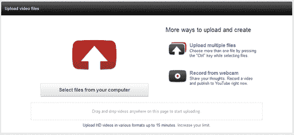

3.  YouTube will upload your video (as shown in the following screenshot)—the video can be up to a maximum of 15 minutes in length:

    

4.  YouTube will show a confirmation once the video has been uploaded. At this stage, you can set the visibility (or who will be able to see this video) as well as the title, description, and tags for your video, as shown in the following screenshot:

    

5.  You will notice a link under the name of the uploaded video—you can click on this link to see how your video will appear in YouTube as seen by other users:

    

使用 YouTube 的一种替代方法是使用另一种服务，在这种服务中，许可没有那么严格；一个这样的服务是 VideoBin，位于 http://www.videobin.org。在任务的这一部分，我们将了解如何从该服务上传和访问内容。

1.  Browse to [http://www.videobin.org](http://www.videobin.org) and click on **Select File..** to browse to your video and then click on **Upload**, as shown in the following screenshot:

    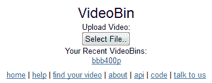

2.  VideoBin.org will display a running total for the conversion process:

    

3.  Once converted, the video will be displayed on screen along with details regarding its site, location, and time so that you can then embed the URL into your site at will, as shown in the following screenshot:

    

## 它是如何工作的...

YouTube 将其上传过程设计得非常灵活且易于使用。您可以上传任何 HTML5 格式的视频(例如我们从任务 1 创建的视频)以及 AVI、MPEG-PS、WMV 和 FLV 格式。文件上传后，会自动转码为 WebM 格式——这实际上是 On2 Technologies 开发的 VP8 格式的免费版本，随后在 2010 年被谷歌收购。

## 还有更多...

在这个阶段，你将有一个完美的工作视频托管在 YouTube 上，你可以用正常的方式嵌入到你的网站。

但是，如果您从 YouTube 内进入视频管理器，您可以编辑分配给该视频的设置，如**隐私**、**视频缩略图**，允许**评论**和收视率，具体取决于您自己的喜好，如下图所示。你甚至可以设置谷歌地图来显示你在哪里录制的视频！

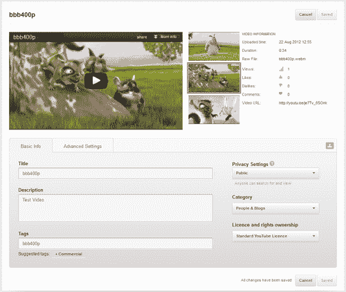

在这项任务的第二部分，我们研究了使用 video bin . org——一种免费的托管服务，与 YouTube 相比，它的许可安排限制较少。使用 Python 和 Django 编写的通过 VideoBin.org 转换视频的设计非常简单，这样您就可以专注于托管您的主要内容，而不用担心在自己的服务器上运行视频的额外需求或开销。然后你就可以随心所欲地设计你的视频播放器，使用适合你网站的风格；我们将在本书后面看到如何做到这一点。

要记住的关键是使用的格式——虽然上传过程故意保持简单，但如果所选视频尚未使用 Ogg Vorbis 格式，您会注意到延迟。作为该过程的一部分，所有上传的视频都将使用 ffmpeg2theora 从原始格式转码为 Ogg Vorbis。

在下一节中，我们将了解如何设计自己的视频播放器，这样您就可以使用适合您网站外观的风格。

到目前为止，我们一直专注于准备我们的视频与 HTML5 视频标签一起使用。现在让我们将注意力转向如何将视频嵌入到您的页面中，请看以下部分:

*   HTML5 视频代码与 Flash 的比较
*   使用 HTML5 嵌入视频
*   向 HTML5 视频代码添加更多选项
*   添加对使用 mime 类型和编解码器的视频的支持
*   支持跨浏览器播放
*   一些预建视频播放器的例子
*   适应 ipad/iphone/安卓

### 注

所有截图，贯穿这一部分(除非另有说明)，都取自“大巴克兔”，电影可从桃子开放电影项目；视频是(c)版权所有 2008，Blender Foundation 在[www.bigbuckbunny.org](http://www.bigbuckbunny.org)。

# 嵌入视频——老派方式(必知)

我们将以及时提醒如何使用经典的`<embed>`和`<object>`标签将视频嵌入网页开始这一部分。

## 做好准备

在这个任务中，你需要利用两个视频——一个是 SWF 格式的，另一个是 WMV 格式的。如果你手头没有任何资料，网上可能有一些例子。一个这样的例子是“大巴克兔”的预告片，可从 http://www.bigbuckbunny.org/index.php/trailer-page/的桃子开放电影项目获得。您可能需要将其转换为本演示所需的正确格式—一个很好的程序是 XMedia Recode，它可以在[http://www . XMedia-Recode . de](http://www.xmedia-recode.de)(德语)上找到。

## 怎么做...

1.  打开你最喜欢的文本编辑器，添加以下代码片段——保存为`videotemplate.html`；我们将在以后的任务中重用它:

    ```html
    <!doctype html>
    <html>
    <head>
    <title>Embedding a video using <embed> and <object> tags</title>
    </head>
    <body>
    </body>
    </html>
    ```

2.  在`<body></body>`标签之间添加代码片段后面的，用您选择的视频的文件名替换`example.swf`和【T2:

    ```html
    <!-- code for embedding windows media player -->
    <object id="mediaplayer" width="192" height="190" classid="clsid:22d6f312-b0f6-11d0-94ab-080c74c7e95"
    standby="Loading Windows Media Player components..." type="application/x-oleobject">
    <param name="filename" value="videofilename.wmv">
    <param name="autostart" value="false">
    <param name="showcontrols" value="true">
    <param name="showstatusbar" value="false">
    <param name="showdisplay" value="false">
    <embed type="application/x-mplayer2" src="videofilename.wmv" name="mediaplayer"
    width="192" height="190" showcontrols="1" showstatusbar="0" showdisplay="0" autostart="0"></embed>
    </object>
    <!-- code for embedding adobe quicktime -->
    <object classid="clsid:d27cdb6e-ae6d-11cf-96b8-444553540000"
    codebase="http://download.macromedia.com/pub/shockwave/
    cabs/flash/swflash.cab#version=6,0,40,0" width="468" height="60" id="mymoviename">
    <param name="movie" value="example.swf" />
    <param name="quality" value="high" /> 
    <param name="bgcolor" value="#ffffff" /> 
    <embed src="example.swf" quality="high" bgcolor="#ffffff"
      width="468" height="60" name="mymoviename" align=""
        type="application/x-shockwave-flash" 
    pluginspage="http://www.macromedia.com/go/getflashplayer"> 
    </embed> 
    </object>
    ```

这是您在使用 Windows Media player 代码时将会看到的一个示例—我使用的是“一只大兔子”视频的副本，可从桃子开放电影项目获得，如下图所示:


## 它是如何工作的...

该代码在网页中嵌入了视窗媒体播放器和 Adobe QuickTime 插件的实例；它使用`codebase`属性引用相关插件。如果为该属性提供的 URL 中包含哈希值，则浏览器会将此版本与当前安装的版本进行比较，并使用它或下载更新的版本。

## 还有更多...

前面的代码片段突出了两个主要缺点:尽管在代码块中使用了`<embed>`和`<object>`标签，但是嵌入代码并不能在所有浏览器中工作；它还需要使用外部插件才能正确运行。

在下一个任务中，我们将研究如何使用 HTML5 的`<video>`标签简化前面的代码片段。

# 用 HTML5 嵌入视频(成为专家)

在之前的任务中，我们看了一下在 HTML5 出现之前你是如何嵌入视频的。在本任务中，我们将更新代码以使用 HTML5 等效版本。

## 做好准备

对于此任务，您需要一份我们在上一节的任务 1 中转换的视频副本。 为了这个任务的目的，我打算使用 WebM 格式的版本。您还需要上一个任务中保存的`videotemplate.html`文件的副本。

## 怎么做...

打开您常用的文本编辑器，加载一份`videotemplate.html`文件，然后进行如下代码片段所示的更改:

```html
<!doctype html>
<html>
<head>
<title>HTML5 Video Test</title>
</head>
<body>
<video>
<source src="trailer_480p.webm" />
</video>
</body>
</html>
```

这就是嵌入视频所需的全部内容——这将在 Firefox 中完美工作，如下图所示:


但是正如我们将在本节后面看到的，它不会在所有浏览器中工作！

## 它是如何工作的...

`<video>`属性的设计是为了将浏览器中嵌入 v ideos 所需的 HTML 代码标准化；源标签充当浏览器嗅探的一种形式，选择合适的视频格式在正在使用的浏览器中播放。在这种情况下，它将只在谷歌浏览器、Opera 和火狐中显示。其他浏览器将什么都不显示——尽管如果增加了第三方支持，IE9 和 Safari 将播放 WebM 格式的视频。

## 还有更多...

如果需要，您可以将代码进一步减少到最低限度，以下代码将与主任务中的代码具有相同的效果:

```html
<!doctype html>
<html>
<head>
<title>HTML5 Video Test</title>
</head>
<body>
<video src="trailer_480p.webm" />
</body>
</html>
```

# 扩展视频代码(应该知道)

之前的任务带我们了解了如何使用 HTML5 `<video>`标签将视频嵌入网页的基础知识。然而，这个标签还有很多功能，比如提供控件、控制高度或宽度，以及添加“海报”图像。在本任务中，我们将了解一些功能。

## 做好准备

对于这个任务，您将需要一份来自前面演示的代码副本——我们将对它进行修改，以提供一个功能更强的播放器。

## 怎么做...

1.  在您常用的文本编辑器中打开上一个演示的代码副本:

    ```html
    <!doctype html>
    <html>
    <head>
    <title>HTML5 Video Test</title>
    </head>
    <body>
    <video>
      <source src="trailer_480p.webm" />
    </video>
    </body>
    </html>
    ```

2.  我们要做的第一个改变是为视频指定一个高度和宽度。因此，对代码进行以下更改，为视频设置一个定义的区域:

    ```html
    <video width="720" height="400" >
    <source src="trailer_480p.webm" />
    </video>
    ```

3.  下一个变化是缺少控制，这很容易解决:

    ```html
    <video width="720" height="400" controls="controls" >
    <source src="trailer_480p.webm" />
    </video>
    ```

4.  我们可以做的另一个改变是添加一个海报图像，显示视频是否正在加载，或者用户是否还没有点击播放:

    ```html
    <video width="720" height="400" controls="controls"
     poster="trailer_480p.jpg">
    <source src="trailer_480p.webm" />
    </video>
    ```

## 它是如何工作的...

该代码的工作方式与上一个任务类似，但这次我们添加了一个请求，显示`<video>`标签的标准浏览器控件，并要求它在视频播放前加载一个图像作为“占位符”。

## 还有更多...

如下表所示，嵌入 HTML5 视频时还可以使用一些标签:

<colgroup><col style="text-align: left"> <col style="text-align: left"> <col style="text-align: left"></colgroup> 
| 

属性名称

 | 

价值

 | 

属性描述

 |
| --- | --- | --- |
| 自动播放 | 自动播放 | 指定视频一准备好就开始播放 |
| 环 | 环 | 指定视频将在每次播放结束后重新开始 |
| 柔和的 | 柔和的 | 指定视频的音频输出应该静音 |
| 事先装好 | 汽车元数据没有人 | 指定页面加载时作者是否以及如何加载视频 |

值得注意的是，这些都是可以使用的，尽管默认情况下您不太可能想要使用它们；一个很好的例子是`autoplay`选项，如果不小心使用，它会对带宽造成不必要的消耗！(在 iPhones 上尤其如此，默认情况下会忽略自动播放。)

您还会注意到，虽然我们只添加了一个命令来显示控件，但不同浏览器使用的颜色和设计会有所不同:

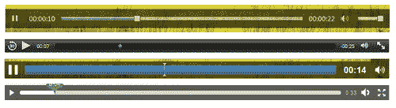

从上一张截图的顶部到底部，我们有互联网浏览器、Safari、谷歌 Chrome 和火狐。

# 添加 mime 类型(必须知道)

现在我们已经设置好了基本的视频代码，现在是尝试播放视频的时候了——在某些情况下，你可能会发现浏览器如果不能确定要使用的 mime 类型，就无法正确播放视频。在这个任务中，我们实现了一个简单的改变来纠正这一点，并允许视频正确播放。

### 注

**多用途邮件扩展(MIME)** 类型由两部分组成——一个类型和一个子类型，是帮助定义文件类型的手段，以便客户端电脑能够正确解释如何处理通过互联网从服务器接收的文件。例如，本书中使用的 HTML5 视频格式具有视频类型，但子类型可能是`.ogg`、`.mp4`或`.webm`。

## 做好准备

对于这个任务，我们不需要任何东西，除了你的文本编辑器。

## 怎么做...

1.  Crank up your favourite text editor and create a new text document. Save it as `.htaccess` into the root folder of your website.

    ### 类型

    保存文件名时，您可能希望在文件名周围使用引号；这将强制文本编辑器将其保存为该文件名。

2.  添加以下文本并保存文件:

    ```html
    AddType video/ogg .ogv
    AddType video/mp4 .mp4
    AddType video/webm .webm
    ```

3.  请尝试现在播放视频—希望您会发现没有任何变化，并且视频仍在继续播放。您现在所做的更改确保了播放视频的任何人都可以根据他们使用的浏览器正常播放视频。

## 它是如何工作的...

在大多数情况下，浏览器通常会播放正确的视频。然而，HTTP 协议不知道文件扩展名的概念——这意味着您不能依赖浏览器一直播放正确的视频。为了避免这种情况，我们添加了这个小的配置更改，这样浏览器就能够根据扩展名正确确定文件格式并播放视频。

## 还有更多...

正如您将在本节后面看到的，当我们调整视频代码以用于其他平台时，一些平台不喜欢在视频代码中使用`type`命令。使用`.htaccess`文件可能对一些人没有吸引力，但却是解决这个问题的有用方法。

# 增加跨浏览器支持(应该知道)

在到目前为止的所有任务中，我们已经看到了对一个使用 WebM 格式的视频的支持。虽然这可以说是不受专利限制的更好的格式之一(开源)，但这意味着默认情况下播放将仅限于 Opera 和 Chrome，因为其他浏览器默认不支持这种格式。在这个任务中，我们将看看如何修改我们的代码，使其能够跨多个平台工作。

## 做好准备

对于此任务，您需要从*扩展视频代码*任务中获得一份代码副本，因为我们将对此代码进行一些更改。除此之外，请确保您有 MP4 和 OGG 格式的视频副本(虽然后一种格式使用不多，但我们仍会将其包含在代码中)。

## 怎么做...

1.  第一步是打开你选择的文本编辑器，从*扩展视频代码*任务

    ```html
    <!doctype html>
    <html>
    <head>
    <title>HTML5 Video Test</title>
    </head>
    <body>
    <video width="720" height="400" controls="controls"
      poster="trailer_480p.jpg">
      <source src="trailer_480p.webm" />
    </video>
    </body>
    </html>
    ```

    加载一份代码
2.  第一步是添加对 MP4 格式的支持(除了 Firefox 和 Opera 之外，所有浏览器都使用这种格式)，因此请按照以下方式更改您的代码:

    ```html
    <video width="720" height="400" controls="controls"
      poster="trailer_480p.jpg">
      <source src="trailer_480p.webm" />
    <source src="trailer_480p.mp4"; type="video/mp4" />
    </video>
    ```

3.  我们还将增加对 OGG 格式视频的支持:

    ```html
    <video width="720" height="400" controls="controls"
      poster="trailer_480p.jpg">
      <source src="trailer_480p.webm" />
      <source src="trailer_480p.mp4" />
    <source src="trailer_480p.ogv" type="video/ogg" />
    </video>
    ```

4.  你们当中眼尖的人会发现 WebM 格式的类型和编解码器设置不存在，所以现在让我们纠正一下:

    ```html
    <video width="720" height="400" controls="controls"
      poster="trailer_480p.jpg">
    <source src="trailer_480p.webm" type="video/webm" />
    <source src="trailer_480p.mp4" type="video/mp4" />
      <source src="trailer_480p.ogv" type="video/ogg" />
    </video>
    ```

## 它是如何工作的...

指定多个不同来源的原因是为了让浏览器选择合适的视频播放；并非所有格式都兼容所有浏览器。您会看到，我们还为每种视频格式指定了 MIME 类型；这是为了帮助浏览器决定是否可以播放该视频，以及应该以哪种格式播放该视频。如果没有指定 MIME 类型，那么浏览器必须开始下载它，以了解它是否可以播放视频；这可能会浪费带宽。

# 添加编解码器定义(必须知道)

在本节的大部分内容中，我们已经看到了允许您播放许多不同视频的代码。大多数情况下，浏览器会自动计算出播放哪个视频；在某些情况下，它可能无法正确播放或拒绝播放代码中列出的任何视频。在本任务中，我们将了解如何为每个视频指定编解码器，这将有助于浏览器确定如何正确播放所选视频。

## 做好准备

我们需要的只是上一个任务的代码副本——如果你在本书的第一部分安装了编解码器，它们应该已经在你的电脑上了。

## 怎么做...

1.  第一步是打开您选择的文本编辑器，从*添加跨浏览器 su*T3【支持】任务加载一份代码副本:

    ```html
    <!doctype html>
    <html>
    <head>
    <title>HTML5 Video Test</title>
    </head>
    <body>
    <video width="720" height="400" controls="controls"
      poster="trailer_480p.jpg">
      <source src="trailer_480p.webm" type="video/webm" />
      <source src="trailer_480p.mp4" type="video/mp4" />
      <source src="trailer_480p.ogv" type="video/ogg" />
    </video>
    </body>
    </html>
    ```

2.  下一步是增加对 MP4 格式的支持(除了火狐和 Opera 之外，所有浏览器都使用这种格式)，所以按照如下方式修改你的代码:

    ```html
    <video width="720" height="400" controls="controls"
      poster="trailer_480p.jpg">
      <source src="trailer_480p.webm" />
    <source src="trailer_480p.mp4" type="video/mp4; 
     codecs='avc1.42E01E, mp4a.40.2'" />
    </video>
    ```

3.  我们还将添加对 OGG 格式视频的支持，如下所示:

    ```html
    <video width="720" height="400" controls="controls"
      poster="trailer_480p.jpg">
      <source src="trailer_480p.webm" />
      <source src="trailer_480p.mp4" type='video/mp4; 
      codecs="avc1.42E01E, mp4a.40.2"' />
    <source src="trailer_480p.ogv" type='video/ogg; 
     codecs="theora, vorbis"' />
    </video>
    ```

4.  你们当中眼尖的人会发现 WebM 格式的类型和编解码器设置不存在，所以现在让我们纠正一下:

    ```html
    <video width="720" height="400" controls="controls"
      poster="trailer_480p.jpg">
    <source src="trailer_480p.webm" 
    type='video/webm; 
     codecs="vp8, vorbis"' />
    <source src='trailer_480p.mp4; type='video/mp4; 
      codecs="avc1.42E01E, mp4a.40.2"' />
      <source src='trailer_480p.ogv; type='video/ogg; 
      codecs="theora, vorbis"' />
    </video>
    ```

## 它是如何工作的...

使用编解码器，尤其是在 HTML5 领域，可能会打开一个真正的混乱雷区。理解它的关键是启用编解码器支持增加了浏览器能够正确确定是否能够正确播放特定视频的可能性。

在前面的代码中，我指定了一些可以使用的典型编解码器——虽然 WebM 和 Ogg 的编解码器很简单，但 MP4(或 MPEG-4)的编解码器就不那么简单了；这里使用的编解码器代表了 H.264 的基线配置文件和 AAC 的低复杂度配置文件。

### 注

您可以使用其他更高级别的配置文件，但是这些文件需要更多的中央处理器处理能力来解码，尽管它们会被更好地压缩。

## 还有更多...

对于特定的视频类型，使用多种不同的编解码器是完全可能的 MP4 格式就是一个很好的例子。选择合适的编解码器时应小心谨慎。如果选择的不是流行的编解码器，则视频可能无法播放。这样做的原因是，如果浏览器识别出文件类型(或者内嵌在代码中，或者通过`.htaccess`文件)，但是没有“看到”安装了合适的编解码器，那么它将拒绝播放视频。

# 提供后备支持(应该知道)

使用 HTML5 `<video>`标签的一个关键部分是，虽然该格式仍在作为标准发展，但仍有必要为不能支持该标签的旧浏览器提供某种形式的后备支持。在这项任务中，我们将考虑提供这种支持。

## 做好准备

为了充分利用这项任务，您需要利用一些手段，以便能够在较旧的浏览器中查看视频页面。根据您选择的浏览器，有几种方法可以实现这一点:

*   **Adobe BrowserLab** :这将允许在 IE、Chrome、Safari 和 Firefox 的不同版本中进行测试。
*   **火狐便携版**([http://portableapps.com/apps/internet/firefox_portable](http://portableapps.com/apps/internet/firefox_portable)):这将允许你安装独立版本的火狐，这不会影响你电脑上的任何现有配置文件。旧版可用于旧浏览器。
*   **对于 Internet Explorer** :这里最好的选择就是尝试使用 IETester；从 5.5 版本到 9 版本，IE 的所有版本都内置于此。这是可从[http://www.my-debugbar.com/wiki/IETester/HomePage.](http://www.my-debugbar.com/wiki/IETester/HomePage.)下载
*   **月景 6** (来自[http://www.lunascape.tv/](http://www.lunascape.tv/)):这是一款三引擎浏览器，支持基于三叉戟(IE)、壁虎(Firefox)和 Webkit (Chrome 和 Safari)的浏览器。

## 怎么做...

1.  首先，打开你最喜欢的文本编辑器，复制下面的代码片段:

    ```html
    <!doctype html>
    <html>
    <head>
    <title>HTML5 Video Test</title>
    </head>
    <body>
    <video width="720" height="400" controls="controls"
      poster="trailer_480p.jpg">
      <source src="trailer_480p.webm" type="video/webm" />
      <source src="trailer_480p.mp4" type="video/mp4" />
      <source src="trailer_480p.ogv" type="video/ogg" />
    </video>
    </body>
    </html>
    ```

2.  在接下来的三个步骤中，我们将从嵌入`<object>`标签开始创建大量的代码。在最后一个`<source>`标签的正下方添加以下代码部分:

    ```html
    <object type="application/x-shockwave-flash" 
      data=flashfox.swf" width="720" height="400" 
      style="position:relative;">
      <param name="movie" value="flashfox.swf" />
      <param name="allowFullScreen" value="true" />
      <param name="flashVars" value="autoplay=true&amp;controls=true&amp;loop=true&amp;src=trail
        er_480p.mp4" />
    ```

3.  我们还需要在之后立即使用`<embed>`标签添加等价的内容:

    ```html
    <embed src="flashfox.swf" width="720" height="400" 
      style="position:relative;"  
      flashVars="autoplay=true&amp;controls=true&amp;
      loop=true&amp;poster=trailer_480p.jpg&amp;src=trailer_480p.mp4"
      allowFullScreen="true" wmode="transparent" 
      type="application/x-shockwave-flash" 
      pluginspage="http://www.adobe.com/go/
    getflashplayer_en" />
    ```

4.  最后一个阶段是添加背景图像，以及回退文字；然后我们结束结束`</object>`标签:

    ```html
    
    </object>
    ```

## 它是如何工作的...

该代码的目的是为显示相当于 Flash 的电影提供后备支持；这是通过使用基于 SWF 的容器来实现的，我们从该容器中运行 MP4 文件，否则该文件将从`<video>`源标签中运行。我们还包括一个普通图像，并为其设置了一个标题属性——如果浏览器无法播放代码中列出的任何视频，这将是浏览器将采取的“最后呼叫”路线。

## 还有更多...

虽然前面的代码将作为 HTML5 视频的后备，但有几点需要注意:

1.  `<embed>`标签实际上不是一个有效的标签——它在早期被设计为提供对网景浏览器的支持，但是更现代的版本确实支持`<object>`标签。`<object>`标签旨在为 IE 浏览器提供支持。
2.  `<object>`标签在 HTML5 中有效——至少，在提供回退支持时应该使用这个标签；我也提供了一个使用`<embed>`标签的例子，尽管这是可选的。

如果您不熟悉 `<object>`和 `<embed>`标签的任何选项，请查看[属性。html](http://helpx.adobe.com/flash/kb/flash-object-embed-tag-attributes. html) ，它有一个方便的列表，列出了每个标签的属性。

# 适配 ipad/iphone/安卓(应该知道)

在本章中，我们已经了解了在页面中回放 HTML5 视频所需的各种元素。虽然代码可以在现代桌面浏览器中工作，但在手持设备上可能会失败——我们将在下一个任务中纠正这一点。

## 做好准备

对于此任务，您需要确保您拥有适合在移动设备上播放的视频大小；您可以尝试使用免费的转换服务，如 Online-Convert.com 在[http://www.online-convert.com](http://www.online-convert.com)将视频转换为预设大小，具体取决于您想要支持的平台。

## 怎么做...

1.  打开您选择的文本编辑器，并添加以下几行，用您的视频名称替换`trailer_480p`:

    ```html
    <!doctype html>
    <html>
    <head>
    <title>HTML5 Video Test</title>
    </head>
    <body>
    <video width="720" height="400" controls="controls" poster="trailer_480p.jpg">
      <source src="trailer_480p.webm" type="video/webm" />
      <source src="trailer_480p.mp4" type="video/mp4" />
      <source src="trailer_480p.ogv" type="video/ogg" />
    </video>
    </body>
    </html>
    ```

2.  我们需要做的第一个改变是海报——iOS 3 . x 不喜欢海报属性，所以不幸的是这个需要去掉:

    ```html
    <video width="720" height="400" controls="controls">
    ```

3.  iOS 3.x 对视频出现的顺序很挑剔——因为它(和其他手持设备)只能回放 MP4 格式的视频，这需要作为第一个视频源出现:

    ```html
    <video width="720" height="400" controls="controls">
    <source src="trailer_480p.mp4" type="video/mp4" />
    <source src="trailer_480p.webm" type="video/webm" />
      <source src="trailer_480p.ogv" type="video/ogg" />
    </video>
    ```

4.  Android < 2.3 不喜欢类型属性，所以我们需要将其从 MP4 源标签(Android 目前支持的唯一容器)中移除。在这里，类型属性被删除，另外两个视频源标签的相关编解码器也被添加:

    ```html
    <video width="320" height="240" controls> 
    <source src="vid.mp4"> 
    <source src="trailer_480p.webm" type='video/webm;
     codecs="vp8, vorbis"'> 
    <source src="trailer_480p.ogv" type='video/ogg;
     codecs="theora, vorbis"'> 
    </video>
    ```

## 它是如何工作的...

本任务中所做的更改旨在避开一些仍然存在的浏览器或操作系统怪癖，以及移动平台上对视频格式的(仍然)有限支持。这项任务突出了 HTML5 视频对一些人来说仍然令人困惑的原因之一——这在很大程度上仍然是由于 HTML5 是一种新兴技术，对它的支持仍在发展。

这项任务的关键是，虽然所需的更改很容易进行，但您应该预计在未来必须进行更改，直到移动平台的 HTML5 成熟。例如，正如您从本任务中看到的，大多数移动平台只支持 MP4 格式，这种情况可能会持续到内置 WebM 格式硬件解码器的移动设备出现。当这种情况发生时，这将意味着没有必要必须包括 MP4 格式作为第一源；订单很可能就不重要了，尽管这取决于移动设备制造商！

### 注

如果你对 WebM 项目的发展状况感兴趣，尤其是硬件支持方面，那么值得一读位于[http://blog.webmproject.org](http://blog.webmproject.org)的 WebM 博客。

# 设置 VideoJS——榜样玩家(成为专家)

在整个部分，我们已经看到了在网页上制作一个基本的 HTML5 视频播放器所需的代码，以及配置播放器的可用选项。对于这个任务和下一个任务，我们将看几个可以从互联网上下载的预建播放器的例子——即 VideoJS 和 Kaltura。两者都是开源应用程序，并且免费提供。

## 做好准备

为此，我们实际上不需要下载任何文件——VideoJS 是内容交付网络(CDN) 上少有的播放器之一；就此任务而言，链接到文件就足够了。

## 怎么做...

1.  启动文本编辑器并添加以下代码片段:

    ```html
    <!doctype html>
    <html>
    <head>
    <title>HTML5 Video Test</title>
    </head>
    <body>
    </body>
    </html>
    ```

2.  让我们开始在你的`<head>`标签中添加 JavaScript 库和 CSS 调用:

    ```html
    <link href="http://vjs.zencdn.net/c/video-js.css" rel="stylesheet">
    <script src="http://vjs.zencdn.net/c/video.js"></script>
    ```

3.  运行播放器所需的大部分代码与我们在本节中使用的代码非常相似——不同之处已经突出显示:

    ```html
    <video id="my_video_1" class="video-js vjs-default-skin"
       controls preload="auto" width="720" height="400"
         poster="trailer_480p.jpg" data-setup="{}">
      <source src="trailer_480p.mp4" type='video/mp4'>
      <source src="trailer_480p.webm" type='video/webm'>
    </video>
    ```

如果一切正常，您将看到一个类似于以下截图的视频:


## 它是如何工作的...

玩家使用的代码与我们在本节中使用的非常相似——但是样式已经使用额外的 CSS 和 JavaScript 进行了定制(类似于我们将在下一节中看到的)。这意味着一个一致的风格可以在大多数(如果不是所有的话)平台上使用，这比你在所有平台上使用不同风格的混合要好得多！这里的额外好处是，因为 JS 和 CSS 文件托管在 CDN 上，所以您不需要担心更新代码，因为这是自动为您完成的。如果您希望在本地托管代码，也可以单独下载。

### 类型

如果你想尝试一些设计，可以访问[http://www . kaltura . org/API/html 5 lib/kplayer-examples/Player _ themable . html](http://www.kaltura.org/apis/html5lib/kplayer-examples/Player_Themable.html)——这有一个独立的播放器链接到 jQuery UI 的 ThemeRoller，你可以在这里选择不同的风格。注意:如果您在图库中更改为不同的主题，请给它大约五秒钟来刷新屏幕，然后再继续

# 设置卡图拉视频——榜样玩家(成为专家)

在这个任务中，我们要去看一下两个示例视频播放器中的第二个，这是 Kaltura 开源视频播放器。软件在[http://www.kaltura.org/project/HTML5_Video_Player](http://www.kaltura.org/project/HTML5_Video_Player)有售，可以通过 CDN 链接或者本地下载的版本使用。

## 做好准备

卡图拉的视频播放器可以从 CDN 链接获得，我们将把它作为任务的一部分，所以我们不需要额外的东西来完成这项任务。

## 怎么做...

1.  打开您选择的文本编辑器，插入以下代码片段:

    ```html
    <!DOCTYPE HTML>
    <html>
    <head>
      <title> Sample Fallback Player </title>     
    </head>
    <body>
    <div></div>
    </body>
    </html>
    ```

2.  我们首先添加对 jQuery 和 Kaltura 库的调用:

    ```html
    <head>
      <title> Sample Fallback Player </title>     
    <script type="text/javascript"
     src="http://html5.kaltura.org/js"></script> 
    </head>
    ```

3.  我们需要一个容器，我们可以在里面保存视频，所以继续修改`<div>`标签如下:

    ```html
    <body>
    <div id="videoContainer" style="width:500px;height:300px;">
    </div>
    ```

4.  最后一个阶段是添加调用视频的代码:

    ```html
    <div id="videoContainer" style="width:500px;height:300px;">
    <video id="vid1" width="480" height="267" durationHint="33" 
    poster="trailer_480p.jpg">
    <source type="video/webm" src="trailer_480p.webm" />
    <sourcesrc="trailer_480p.mp4"/>
    <source src="trailer_480p.ogv" />
    </video>
    </div>
    ```

如果一切正常，您将看到类似以下截图的内容:


## 它是如何工作的...

视频播放器通过重用`<video>`的标准格式代码来工作，但是使用渐进式增强原理部署 CSS 和一些 JavaScript 来重新设计控件。使用 jQuery UI，这为玩家在所有浏览器中提供了一致的主题；使用主题滚轮小程序可以随意改变使用的主题，如下图所示:


与一些依赖 JavaScript 指定视频播放的玩家不同，如果 JavaScript 被禁用，Kaltura 的视频仍然会播放，因为它将使用标准的浏览器控件——这被称为**渐进增强** 。

### 注

如果你想了解更多关于 jQuery UI 主题开发的知识，值得看看 *jQuery UI 主题开发——初学者指南*，作者:*亚当·博多*。

到目前为止，我们已经了解了如何使用`<video>`标签嵌入视频，以及如何调整您的网页以适应通过多种不同浏览器的视频播放。在本节中，我们将通过查看以下内容来关注您如何编写自己的视频播放器:

*   使用 jQuery 构建和打包您自己的视频播放器
*   向视频播放器添加控件
*   设计您的视频播放器并提供颜色主题
*   插入字幕
*   使用 jQuery 聚合接口提供回退支持
*   通过覆盖显示视频

### 注

为了每个任务的目的，我们使用开源电影“大兔子”的预告片视频，可从 http://www.bigbuckbunny.org/index.php/trailer-page/的桃子开放电影项目获得。除非另有说明，视频版权所有 2008，Blender Foundation/[www.bigbuckbunny.org](http://www.bigbuckbunny.org)。

# 构建视频播放器——框架(必须知道)

在的上一部分，我们看了使用`<video>`标签播放视频所需的基本 HTML 代码，以及包含多个源以允许通过多个不同平台播放是多么重要。在这个任务中，我们将复制一份代码并扩展它，为开发我们自己的播放器做准备。

## 做好准备

这项任务需要的只是您最喜欢的文本编辑器，以及我们在本书前面转换的视频副本，其余的将在任务期间添加。

## 怎么做...

1.  创建一个新的文件夹来存储你的演示——称之为`video demo`。打开文件夹，新建如下文件夹:**`js``css``media`**`images`。****
*****   打开你选择的文本编辑器，并添加以下几行:

    ```html
    <!doctype html>
    <html>
    <head>
    <title>HTML5 Video Plugin Test</title>
    </head>
    <body>
    <video controls="controls" poster="trailer_480p.jpg">
       <source src="media/trailer_480p.ogv" type="video/ogv" />
       <source src="media/trailer_480p.mp4" type="video/mp4" />
       <source src="media/trailer_480p.webm" type="video/webm" />
    </video>
    </body>
    </html>
    ```

    *   将此保存为`video demo`文件夹的根目录下的`videoplayer.html`—我们现在需要为 jQuery 插件设置基本框架，因此创建一个新的空白文档，添加以下行，并将该文档保存为`videoplayer.js`。这将在本节后面使用:

    ```html
    (function($) {
        $.fn.oPlayer = function(options) {
             return this.each(function() {
            });
        };
    })(jQuery);
    ```

    *   我们还需要改变 HTML 结构来添加定制控件的框架——首先，添加这个(注意视频控件的 ID 的添加):

    ```html
    <body>
        <div class="video_player">
            <video controls="controls" id="mainvideo" 
     poster="media/trailer_480p.jpg" >
    then alter the code accordingly:
        </video>
            <div class="custom_controls"></div>
        </div>
    </body>

    ```**** 

 ****如果一切正常，浏览器将使用内置的上下文菜单控件在浏览器中播放视频。

## 它是如何工作的...

我们已经复制了使用 HTML5 `<video>`标签显示视频所需的原始 HTML，并根据页面在哪个浏览器中查看，用我们将使用的视频名称进行设置。我们还为 jQuery 插件创建了一个空白模板，我们将在这一部分开始开发。我们已经修改了代码，以允许一些后续任务(如添加自定义控件)所需的更改。您可能还会注意到，默认情况下没有显示任何控件，这是因为我们已经在自己的自定义控件占位符中添加了控件，但是由于其中没有包含任何内容，因此不会显示任何内容！

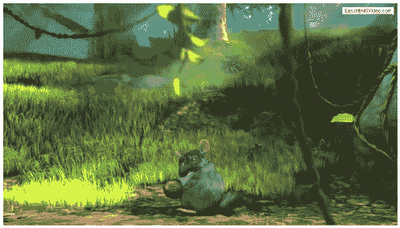

# 给你的玩家增加控制(必须知道)

这个部分的第一个任务相当长，是必要的，这样我们就可以在基础框架中添加使用自定义播放器显示视频所需的内容。现在是时候添加自定义控件的代码了——这将提供播放和暂停按钮的框架，以及用于搜索的滑块和用于控制音量的按钮。

## 做好准备

对于这个任务，因为我们只是在添加代码，所以我们需要的只是文本编辑器。

## 怎么做...

1.  打开上一个任务保存的`videoplayer.html`文件，在`</video>`结束标签下添加如下代码。我们从播放、暂停和时间滑块占位符元素开始:

    ```html
    <div class="custom_controls">
      <a class="play" title="Play"></a>
      <a class="pause" title="Pause"></a>
    <div class="time_slider"></div>
    ```

2.  然后我们继续时间占位符元素:

    ```html
    <div id="time">
      <span class="timer">00:00:00</span> /
      <span class="duration">00:00:00</span>
    </div>
    ```

3.  我们以音量控制元素结束:

    ```html
    <div class="volume">
      <div class="volume_slider"></div>
        <a class="mute" title="Mute"></a>
        <a class="unmute" title="Unmute"></a>
      </div>
    </div>
    ```

## 它是如何工作的...

如果我们在使用 HTML 中的`<video>`标签，那么浏览器将提供自己的控件集。但是，正如上一节所看到的，这些控件会因使用的浏览器而有所不同，它们并不都是相同的。本节的目的是开始创建我们自己的控件，以便我们可以提供一致的外观，无论您使用哪个浏览器来查看视频。一旦你更加熟悉建筑玩家，你将有机会添加额外的玩家。一个很好的例子是显示一个图标的能力，该图标根据音量控制的位置而变化。

# 设计你的视频播放器(应该知道)

如果你在本节前两个任务中的任何阶段都尝试过播放你的视频，你会注意到它看起来并没有那么专业，还要求你使用上下文菜单来控制它——这并不是真正的用户友好，不是吗？我们将通过添加一些基本样式来改变这个任务。

## 做好准备

在我们添加任何代码之前，您需要利用一些图标——这本书的代码下载中包含了一些图标，或者您可以尝试在互联网上查找。你可以尝试像凯文·安德森创建的图标，可从[http://www.tabsicons.com/classic/#tabs_free](http://www.tabsicons.com/classic/#tabs_free)获得。你还会从这个任务中的 CSS 样式代码中注意到，我使用了精灵，以及 CSS 来定位它们——这导致了更平滑的结果，因为图像已经被缓存了。要创建您的雪碧，您可以使用[http://www.csssprite.com](http://www.csssprite.com)的免费在线服务；您将需要相应地重命名您的结果文件-一旦图像被转换，网站会给你所需的 CSS。

我们还需要为音量背景和播放搜索手柄添加图像，同样，您需要在互联网上寻找合适的图像，或者您可以使用本书代码下载中包含的图像。

### 注

请注意，为了清楚起见，我将这个食谱分成了两部分——这将有助于向您展示哪些部分是必须的，哪些部分可以根据需要进行设计。

## 怎么做...

1.  打开你的文本编辑器，加载上一个任务的结果——你的编辑器中应该有这个:

    ```html
    <!DOCTYPE html>
    <html>
      <head>
        <title>HTML5 Video Plugin Test</title>
      </head>
      <body>
        <div class="video_player">
          <video controls="controls" id="mainvideo" 
            poster="media/trailer_480p.jpg" >
            <source src="media/trailer_480p.ogv" 
            type="video/ogg" />
            <source src="media/trailer_480p.mp4" 
            type="video/mp4" />
            <source src="media/trailer_480p.webm" 
            type="video/webm" />
          </video>
        </div>
        <div class="custom_controls">
          <a class="play" title="Play"></a>
          <a class="pause" title="Pause"></a>
          <div class="time_slider"></div>
          <div id="time">
          <span class="timer">00:00:00</span> /
          <span class="duration">00:00:00</span>
          </div>
          <div class="volume">
          <div class="volume_slider"></div>
            <a class="mute" title="Mute"></a>
            <a class="unmute" title="Unmute"></a>
          </div>
        </div>
      </body>
    </html>
    ```

2.  创建一个新的空白文件，并将其作为`videoplayer.css`保存到`css` **文件夹中(从第一个任务开始)。将以下内容添加到您的标题区:

    ```html
    <link href="css/videoplayer.css" rel="stylesheet"   type="text/css" />
    ```** 
***   我们现在需要将 CSS 样式添加到`videoplayer.css`文件中——需要相当多的样式，所以我们将依次查看每个部分，从基本容器开始:

    ```html
    #mainvideo { width: 800px; }
    .video_player { width: 800px; }
    .video_player .custom_controls { background-color: #fcfcfc;
      clear: both; height: 23px; left: 20px; padding: 5px; 
      position: relative; top: -50px; width: 90%; }
    ```

    *   我们现在重点提供播放和暂停按钮，所以添加如下:

    ```html
    .play, .pause, .volume, .time_slider, .timer {float: left; }
    .play, .pause, .mute, .unmute { cursor: pointer; }
    .play, .pause { display: block; height: 24px; margin-left: 5px; margin-right: 15px; opacity: 0.8; width: 33px;
      background: url(img/playpause-icon.png) no-repeat;

      transition: all 0.2s ease-in-out; 
      -moz-transition: all 0.2s ease-in-out;
      -webkit-transition: all 0.2s ease-in-out;
      -o-transition: all 0.2s ease-in-out;
    }
    .play { background-position: 0 0; }
    .pause { background-position: 0px -32px; display: none; }
    .play:hover, .pause:hover { opacity: 1; }
    ```

    *   下一个要添加的项目是控制我们在视频中位置的滑块和手柄:

    ```html
    .ui-slider-handle { display: block; margin-left: -9px; 
      position: absolute; z-index: 2; }
    .ui-slider-range { bottom: 0; display: block; height: 100%;
      left: 0; position: absolute; width: 100%; z-index: 1; }
    .time_slider { border: 1px solid #444; height: 10px; width: 
      470px; margin-top: 5px; position: relative;
      border-radius: 15px 15px 15px 15px;
      -webkit-border-radius: 15px 15px 15px 15px;
      -moz-border-radius: 15px 15px 15px 15px;
      box-shadow: 0 -3px 3px #333 inset;  
      -webkit-box-shadow: 0 -3px 3px #333 inset;
      background: -moz-linear-gradient(center top , #555, #333)
      repeat scroll 0 0 #555;    
      background: -webkit-linear-gradient(center top , #555, 
    #333) repeat scroll 0 0 #555;
      background: -o-linear-gradient(center top , #555, #333) 
        repeat scroll 0 0 #555;
      background: -ms-linear-gradient(center top , #555, #333) 
      repeat scroll 0 0 #555; 
    }
    .time_slider .ui-slider-handle { cursor: pointer; top: -2px;
      background: url(img/handler.png) no-repeat;
      height: 16px; opacity: 0.8; width: 16px; }
    .time_slider .ui-slider-handle.ui-state-hover { opacity: 1; }
    .time_slider .ui-slider-range { border-radius: 5px; -moz-
      border-radius: 5px; -webkit-border-radius: 5px; } 
    ```

    *   我们现在需要调整用于总播放时间和经过时间的样式，所以继续添加:

    ```html
    #time { color: #999999; font-weight: bold; margin-top: 5px;
      font-size: 0.7em; }
    .timer { margin-left: 10px; margin-right: 5px; }
    ```

    *   除非我们想过早失聪，否则我们需要一些手段来控制音量，所以现在让我们解决这个问题:

    ```html
    .volume { bottom: 0; color: #fff; height: 35px; overflow: 
      hidden; padding: 5px 10px 0; position: absolute; right: 0;
      width: 33px; }
    .volume:hover { background: url(img/volume.png) no-
      repeat scroll 8px 0 transparent; height: 161px; }
    .volume_slider { height: 105px; left: -1px; opacity: 0;
      position: relative; width: 33px; }
    .volume:hover .volume_slider { opacity: 1; }
    .volume_slider .ui-slider-handle { opacity: 0.8; width: 14px;
      background: url(img/handler.png) no-repeat;
      height: 15px; left: 9px; margin-bottom: -15px; margin-left: 
      0; }
    .volume_slider .ui-slider-handle.ui-state-hover { opacity: 1; }
    ```

    *   我们需要一些手段来自动静音或取消静音我们的视频，所以继续添加以下内容，这将解决这个问题:

    ```html
    .mute, .unmute { bottom: 7px; display: block; height: 23px;
       opacity: 0.8; position: absolute; text-indent: -999px;
       width: 33px; background: url(img/volumefullmute-
       icon.png) no-repeat; }
    .mute:hover, .unmute:hover { opacity: 1; }
    .mute { background-position: 0px 0px; }
    .unmute { background-position: 0px -32px; display: none; }
    ```

    *   最后一个阶段是添加一个按钮，允许我们通过简单地点击视频本身来控制视频的停止和开始。稍后我们将添加 jQuery 代码来启用该功能，但是现在，添加以下内容:

    ```html
    .video-overlay { background: url("img/button.png") 
      no-repeat scroll 50% 50% rgba(0, 0, 0, 0.4); cursor: 
      pointer; display: block; height: 100%; left: 0; position: 
      absolute; top: 0; width: 100%; }
    ```

    *   If all is well, we will end up with something like this, although the functionality won't work until we've added in the jQuery code:

    ** 

 **## 回顾一下…

在前面的任务中，我们专注于为视频控件提供一种基本的风格，并通过 jQuery 添加控制视频的必要功能。我们所看到的这些风格的一个很大的缺点是它们并不十分吸引人；这是我们可以通过添加最终样式代码来轻松解决的问题，我们现在就要这样做。

1.  创建一个名为`videoplayerstyles.css`的空白文件，并将该文件存储在名为`css`的子文件夹中，我们将在代码中使用以下代码行引用该文件:

    ```html
    <link href="css/videoplayerstyles.css" rel="stylesheet" type="text/css" />
    ```

2.  我们首先添加一小段 CSS，它将作为基本样式的重置:

    ```html
    .video_player .custom_controls { background-color: #000;
      left: -5px; top: 0px; clear: both; height: 30px;
      padding-top: 8px; position: relative; width: 100%; }
    ```

3.  我们现在可以开始设计主视频容器了:

    ```html
    .video_player { border: 5px solid #61625D; float: left; 
      font-family: Arial,Helvetica,sans-serif; padding: 10px;
      position: relative; 
      border-radius: 5px 5px 5px 5px;
      -webkit-border-radius: 5px 5px 5px 5px;    
      -moz-border-radius: 5px 5px 5px 5px;
      box-shadow: 0 15px 35px #535353 inset;   
      -webkit-box-shadow: 0 15px 35px #535353 inset;  
      background: -moz-linear-gradient(center top , #333, #000) 
        repeat scroll 0 0 #000;
      background: -webkit-linear-gradient(center top , #333, 
        #000) repeat scroll 0 0 #000;
      background: -ms-linear-gradient(center top , #333, #000) 
        repeat scroll 0 0 #000;
      background: -o-linear-gradient(center top , #333, #000) 
        repeat scroll 0 0 #000;
    }
    ```

4.  我们需要提供一种可视化的方法，通过使用手柄图标来控制滑块:

    ```html
    .time_slider .ui-slider-handle { opacity: 0.8; width: 16px;
      background: url("img/handler.png") no-repeat scroll 
      0 0 transparent; cursor: pointer; height: 16px; top: -
    2px; }
    ```

5.  现在是时候给探索者控件添加一些颜色和样式，让你可以控制你在视频回放中的位置:

    ```html
    .time_slider .ui-slider-range {
      border-radius: 5px 5px 5px 5px;
      -webkit-border-radius: 5px 5px 5px 5px;    
      -moz-border-radius: 5px 5px 5px 5px;    
      background: -moz-linear-gradient(center top , #434, #778) 
       repeat scroll 0 0 #434;
      background: -moz-linear-gradient(center top , #434, #778) 
        repeat scroll 0 0 #434;
      background: -moz-linear-gradient(center top , #434, #778) 
        repeat scroll 0 0 #434;
      background: -moz-linear-gradient(center top , #434, #778) 
        repeat scroll 0 0 #434;
    }
    ```

6.  If all is well, we should now have a more stylish player, albeit one that won't fully work (just yet)—here's a screenshot of one I prepared earlier:

    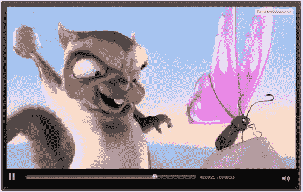

## 它是如何工作的...

唷！那是一项艰巨的任务！在这项任务中，我们研究了许多不同的风格，主要目的是设计一些显示一组基本控件的东西，并且可以在以后进行定制。您还会注意到，在这个配方的第一个截图中，似乎有两组控件——最上面的一组是由这个部分的代码设计的控件；最下面的一个(部分隐藏)是浏览器显示的默认控件集。

本代码第一部分覆盖了原`.video_player` `.custom_controls` CSS 样式；这是基于渐进增强的原则设计的，删除新的主题文件仍然允许使用基本样式。我们添加了一些额外的样式来给背景容器以及音量滑块和音量手柄增加一些颜色。

我们还深入研究了为每个元素设置样式所需的 CSS，例如音量控制、回放按钮、暂停按钮(尚未显示)等——虽然您会发现这些还没有完成，但我们已经为下一个任务奠定了基础，那就是添加 jQuery 功能！

## 还有更多...

现在我们已经将 CSS 样式分成了两个独立的文件(一个用于基本外观，一个用于主题)，我们可以使用搜索者控件上使用的颜色。您可以将`.time_slider` `.ui-slider-range`样式替换为任意数量的不同颜色——选择完全取决于您。颜色选择的一个很好的来源是作为 jQuery UI 的一部分提供的主题——以这个蓝绿色代码为例:

```html
.time_slider .ui-slider-range {
  background: -moz-linear-gradient(center top , #2C4359, 
  #E1E463) repeat scroll 0 0 #2C4359;
  background: -webkit-linear-gradient(center top , #2C4359, 
  #E1E463) repeat scroll 0 0 #2C4359;
  background: linear-gradient(center top , #2C4359, #E1E463) 
  repeat scroll 0 0 #2C4359;
  background: -o-linear-gradient(center top , #2C4359, 
  #E1E463) repeat scroll 0 0 #2C4359;
  border-radius: 5px 5px 5px 5px;
  -webkit-border-radius: 5px 5px 5px 5px;    
  -moz-border-radius: 5px 5px 5px 5px;        
}
```

# 添加 jQuery 功能(必须知道)

到目前为止，我们专注于提供一些基本的控制，并添加了一套基本的风格——正如你已经从截图中看到的，它看起来并不漂亮，但它服务于一个功能目的。我们将把它发展成一个基本主题，但是在此之前，我们需要完成添加 jQuery 功能，这将使播放器工作——这是下一个任务的主题。

## 做好准备

我们需要检索我们之前创建的`videoplayer.js`文件的副本，所以请将它加载到您的普通文本编辑器中。除此之外，不需要任何其他东西——我们将添加必要的代码作为任务的一部分。我将假设您仍在使用以前演示中的文件，如果不是这样，请相应地进行修改。

### 注

在这一节中，假设您对创建 jQuery 插件有一定的了解——如果您想深入研究这一点，那么您可能会喜欢看另一本书，由的 Giulio Bai 编写的《jQuery 插件开发初学者指南》。

## 怎么做...

1.  你需要做的第一个改变是在`videoplayer.html`的`<header>`部分——继续添加这个:

    ```html
    <script type="text/javascript" 
      src=" http://code.jquery.com/jquery-1.7.2.min.js"></script>
    <script type="text/javascript"
      src="https://ajax.googleapis.com/ajax/libs/jqueryui/1.8.18/
      jquery-ui.min.js"></script>
    ```

2.  在我们的插件文件`videoplayer.js`中，我们需要添加一些控制玩家各种不同元素所需的变量，所以去添加下面的代码:

    ```html
    (function($) {
        $.fn.oPlayer = function(options) {
             return this.each(function() {
     // variables
     var $oMain = $(this);
     var $oVideo = $('video', $oMain);
     var $oPlay = $('.play', $oMain);
     var $oPause = $('.pause', $oMain);
     var $oTimeSlider = $('.time_slider', $oMain);
     var $oTimer = $('.timer', $oMain);
     var $oVolSlider = $('.volume_slider', $oMain);
     var $oMute = $('.mute', $oMain);
     var $oUnmute = $('.unmute', $oMain);
     var $oOverlay = $('.video-overlay', $oMain);
     var bTimeSlide = false;
     var iVolume = 1;
     var $oDuration = $('.duration', $oMain); 
            });
        };
    })(jQuery);
    ```

3.  我们现在需要添加一个函数，该函数将准备音量控制，准备在屏幕上显示，因此在上一步的最后一个变量的正下方添加以下代码片段:

    ```html
    var prepareTimeSlider = function() {
       if (! $oVideo[0].readyState) {
       setTimeout(prepareTimeSlider, 1000);
       } else {
       $oTimeSlider.slider({
          value: 0,
             step: 0.01,
          orientation: 'horizontal',
             range: 'min',
          max: $oVideo[0].duration,
          animate: true,
          slide: function() {
                bTimeSlide = true;
             },
             stop:function(e, ui) {
             bTimeSlide = false;
             $oVideo[0].currentTime = ui.value;
             }
          });
       };
    };
    ```

4.  现在基础已经到位，让我们把重点转向让控件工作。我们将从最重要的开始，也就是播放和暂停按钮，所以继续添加这个代码:

    ```html
    $oPlay.click(function () {  
       $oVideo[0].play();
       $oPlay.hide();
       $oPause.css('display', 'block');
       $oOverlay.fadeOut();                  
    });
    $oPause.click(function () { 
       $oVideo[0].pause();
       $oPause.hide();
       $oPlay.css('display', 'block');
       $oOverlay.fadeIn();
    });
    ```

5.  接下来的两个选项将控制声音——下面是静音和取消静音视频的代码:

    ```html
    $oMute.click(function () {  
      $oVideo[0].muted = true;
      $oVolSlider.slider('value', '0');
      $oMute.hide();
      $oUnmute.css('display', 'block');
    });
    $oUnmute.click(function () {  
      $oVideo[0].muted = false;
      $oVolSlider.slider('value', iVolume);
      $oUnmute.hide();
      $oMute.css('display', 'block');
    });
    ```

6.  您的用户将期望能够随意点击视频暂停和播放，让我们通过添加一个功能来解决这个问题:

    ```html
    $oVideo.click(function () {
      if($oVideo[0].paused) {
        $oPlay.click();
      } else {
      $oPause.click();
      }
      return false;
    });
    ```

7.  The basic player will now work perfectly OK, although there will be elements that won't function at all—one of these will be the right-click context menu. Let's fix that now, starting with the play option:

    ```html
    $oVideo.on("play", function() {
      $oPlay.click();
    });
    ```

    然后继续使用暂停选项:

    ```html
    $oVideo.on("pause", function() {
       $oPause.click();
    });
    ```

8.  下一个功能将纠正另一个不太正确的元素——当视频结束时，我们需要重置控制以播放，这样下一个人就可以开始视频:

    ```html
    $oVideo.bind('ended', function() {
       $oVideo[0].pause();
       $oPause.hide();
       $oPlay.css('display', 'block');
    });
    ```

9.  我们的下一个功能是更新玩家的时间控制:

    ```html
    $oVideo.bind('timeupdate', function() {
      var iNow = $oVideo[0].currentTime;
      $oTimer.text(rectime(iNow));
      if (! bTimeSlide)
      $oTimeSlider.slider('value', iNow);
    });
    ```

10.  我们确实需要知道视频有多长，所以让我们添加将在屏幕上显示的代码:

    ```html
    $oVideo.on("canplay", function() {
      $oDuration.text(rectime($oVideo[0].duration));
    });
    ```

11.  虽然我们现在有能力打开或关闭音量，但如果我们能够提供更好的控制，它将带来更好的体验，所以让我们现在就添加进来:

    ```html
    $oVolSlider.slider({
      value: 1,
      orientation: 'vertical',
      range: 'min',
      max: 1,
      step: 0.02,
      animate: true,
      slide: function(e, ui) {
        $oVideo[0].muted = false;
        iVolume = ui.value;
        $oVideo[0].volume = ui.value;
      }
    });
    ```

12.  Finally, we need to initialize the Time slider, and remove the default controls that show:

    ```html
    prepareTimeSlider();
    $oVideo.removeAttr('controls');
    ```

    将所有这些放在一起，应该会得到类似于下面截图的结果:

    

## 它是如何工作的...

在整个任务中，我们一步一步地提供操作视频控件所需的基于 jQuery 的功能；这是浏览器默认视频控件提供的功能，我们将在下一个任务中隐藏它。

## 还有更多...

您会注意到，我已经将谷歌 CDN 链接用于 jQuery 和 jQuery UI——虽然这是完全可以接受的(在某些情况下更可取)，但您可能更喜欢至少为 jQuery UI 使用自定义下载，这可以将文件大小减少到更易于管理的 20KB。如果您想使用这种替代方法，您需要在[http://www.jqueryui.com/download](http://www.jqueryui.com/download)构建一个自定义下载，以包含核心、小部件、鼠标和滑块元素。代码也需要修改——为此更改谷歌 CDN 链接(假设您遵循任务开始时概述的结构):

```html
<script type="text/javascript" src="js/jquery.ui.min.js">
</script>
```

# 添加叠加按钮(应该知道)

到目前为止，在我们的视频播放器中，我们已经通过播放/暂停按钮和右键上下文菜单增加了对播放视频的支持。虽然这导致了一个完全可用的播放器，它缺少了一个重要的功能。大多数人希望能够简单地点击视频来播放或暂停它——这通常是叠加的一部分，会使图片稍微变暗，或者以正常强度显示，这取决于它的当前状态。作为下一个任务的一部分，我们将把这个缺失的功能添加到我们的视频播放器中。

## 做好准备

出于此任务的目的，您需要抓取一个合适的播放图标，该图标可以在覆盖图上使用，只要它的大小与您的视频显示成比例，大小并不重要。您还需要一份我们在这一部分一直在处理的`videoplayer.css`文件的副本。

## 怎么做...

1.  打开你常用的文本编辑器；我们需要为我们的覆盖添加一个占位符，所以继续修改代码，如图所示:

    ```html
    <div class="video_player">
    <span class="video-overlay"></span>
    <video controls="controls" id="mainvideo" poster="media/ 
      trailer_480p.jpg">
    ```

2.  如果没有任何颜色，覆盖层就没有任何用处。将以下内容添加到上一练习的`videoplayer.css` **文件中:

    ```html
    .video-overlay { background: url("img/button.png")
      no-
      repeat scroll 50% 50% rgba(0, 0, 0, 0.4); cursor: 
      pointer; display: block; height: 100%; left: 0; top: 0;
      position: absolute; width: 100%; }
    ```** 
***   我们现在开始添加必要的 jQuery 功能，从点击处理程序开始，允许我们触发处理视频播放和暂停的事件:

    ```html
    $oOverlay.click(function() {
      $oVideo.click();
    });
    ```

    *   The `Play` event needs to be adjusted:

    ```html
    // events section
    $oPlay.click(function () {  
      $oVideo[0].play();
      $oPlay.hide();
      $oPause.css('display', 'block');
     $oOverlay.fadeOut();
    });
    ```

    其次是`Pause`法:

    ```html
    $oPause.click(function () { 
       $oVideo[0].pause();
       $oPause.hide();
       $oPlay.css('display', 'block');
     $oOverlay.fadeIn();
    });
    ```

    *   一旦视频结束，我们需要叠加重新出现，所以让我们继续调整事件处理程序:

    ```html
    // bind extra inner events
    $oVideo.bind('ended', function() {
     $oOverlay.fadeIn();
      $oVideo[0].pause();
      $oPause.hide();
      $oPlay.css('display', 'block');
    });
    ```

    *   The last step is to add in a variable for Overlay, which we define as an instance of the `.video-overlay` class—this is to make it easier when referencing it elsewhere in the code:

    ```html
    var $oUnmute = $('.unmute', $oMain);
    var $oOverlay = $('.video-overlay', $oMain);
    var bTimeSlide = false;
    ```

    更新完所有代码后，您应该会看到类似以下截图的内容:

    ** 

 **## 它是如何工作的...

这个任务中的代码已经变得非常简单，正如我们在前面的练习中注意到的那样，在我们的代码中提供了一个处理视频回放或暂停启动的通用函数。

这项任务有三个关键元素:CSS 样式、覆盖的占位符和 jQuery 函数，通过单击覆盖来处理视频的播放或暂停。我们修改了一些现有的事件处理程序，以允许添加覆盖层——这主要是为了根据视频的当前状态淡入或淡出。通过使用创建的变量来存储代码中引用覆盖的类的实例，所有代码都成为可能。

# 插入字幕(应该知道)

如今，运行视频的一个关键要素是“可访问性”——这不仅仅是能够在不同的浏览器或不同的平台上播放视频，还能为残疾人提供支持。在本任务中，我们将通过使用名为 Cuepoint JS 的库提供字幕支持来了解其中的一个元素，该库可从[http://www.cuepoint.org](http://www.cuepoint.org)获得。

## 做好准备

对于这项任务，您需要利用 Cuepoint JS 的副本，以及早期任务的视频副本——理想情况下，这些应该是 MP4、WebM 和 Ogg 格式。您还需要代码使用的字幕背景图像的副本——这可以在本书附带的代码下载中找到。最后，你还需要一些缩略图，可以作为视频特定部分的跳转链接。在我们的任务中，我们将使用 768 像素宽的视频；为了让跳转链接图像很好地放在下面，我们将使用四个 182 像素宽的图像。如果使用不同的东西，您可能需要更改图像大小。

## 怎么做...

1.  打开您选择的文本编辑器，复制以下代码片段:

    ```html
    <!DOCTYPE html>
    <html lang="en" class="no-js">
    <head>
    <title>A Subtitles Test using Cuepoint JS</title>
    </head>
    <body>
       <div id="container">
       </div>
    </body>
    </html>
    ```

2.  我们需要在代码的`<head>`部分添加对 Cuepoint 库和 jQuery 的引用以及一些样式:

    ```html
    <link rel="stylesheet" href="css/style.css" type="text/css" />
    <script src="http://code.jquery.com/jquery-1.7.2.min.js">
      </script>
    <script src='js/cuepoint.js'></script>
    ```

3.  Cuepoint 需要配置，所以在你的文本编辑器中添加以下内容到一个新文档中，并将其保存为`cuepointscript.js` :

    ```html
    $(document).ready(function(){
    //Slides object with a time (integer) and a html string
    var slides = {
      0: "This is the first subtitle. You can put html in here if you like",
      4: "The home of Big Buck Bunny",
      12: "Let's meet the cast of Big Buck Bunny...",
      23: "Watch out - here they come!"
    }
    cuepoint.init(slides);
    $('#1').click(function(){ cuepoint.setTime(5)});
    $('#2').click(function(){ cuepoint.setTime(10)});
    $('#3').click(function(){ cuepoint.setTime(15)});
    $('#4').click(function(){ cuepoint.setTime(25)});
    });
    ```

4.  添加对`cuepointscript.js`文件的引用，紧接在步骤 2 的代码下面:

    ```html
    <script src="js/cuepointscript.js"></script>
    ```

5.  我们现在需要添加我们的视频，所以继续添加下面的代码片段:

    ```html
    <container>
      <section id='cuePlayer'>
        <video id='video' width="768" preload="auto" controls 
                poster="images/poster.jpg">
          <source src='media/bbb400p.mp4' />
          <source src='media/bbb400p.webm' />
          <source src='media/bbb400p.ogv' />
        </video>
        <div id='subtitles'></div>
    </section>

    ```

6.  我们还需要在缩略图中添加作为跳转链接，紧接在结束`</section>`标签的下方:

    ```html
    <div id='thumbs'>
      
      
      
      
    </div>
    ```

7.  Finally, let's add in the requisite styling—go ahead and create a file called `style.css` and add the following:

    ```html
    body { background: #eee;margin:20px;color:#999; font-family: Helvetica, Arial, sans-serif; }

    #container { width: 768px; margin: 0 auto; padding: 20px 0; 
      overflow: hidden; }
    section { margin-bottom: 20px -5; overflow: hidden; }
    #cuePlayer { overflow: hidden; width: 768px; position: relative; }
    #video { width: 768px; margin: 0 auto 10px auto; background: 
      #555; }
    #thumbs { width: 100%; overflow: hidden; clear: both; margin: 
    0 0 20px 0; }
    #thumbs .thumbnail { width: 182px; height: 182px; float: left;
      background: #333; display: block; margin-right: 13px;
      cursor: pointer; }
    #thumbs .thumbnail:last-child { margin-right: 0; }
    #subtitles { position:absolute; top:0;width:100%; color:#FFF;
      background:url(img/subtitle.png) repeat; opacity: 1;
      height:40px; line-height:40px; padding:0 20px; }
    ```

    如果一切正常，你应该会看到类似下面截图的东西:

    

## 它是如何工作的...

这里，Cuepoint 将多个语句收集到一个数组中；这些根据必须作为阵列的一部分提供的第二计数显示在屏幕上。第二部分创建多个对`cuepoint.setTime()`的调用作为单独的功能，这样如果你依次点击每个，它会将视频提前到那个时间。 **Cuepoint** 是众多旨在提供类似功能的库之一，尽管使用的是自己的方法，而不是 WebVTT 文件。

## 还有更多...

虽然 CuepointJS 有其用途，但它只是被设计成一个简单的实现——如果你想了解更多，掌握 WebVTT 格式和文件是值得的。对该格式的支持仍处于不断变化的状态，尚未纳入所有浏览器；一旦发生这种情况，它看起来将成为标准格式，可以在许多平台上提供一定的一致性。

### 注

网上有很多关于格式的文章——看看[http://html5doctor.com/video-subtitling-and-webvtt/](http://html5doctor.com/video-subtitling-and-webvtt/)，会给你一个很好的基础。

# 使用多填料提供回撤支撑(应该知道)

到目前为止，我们已经把注意力集中在如何使用 HTML5 视频标签上了——这在当前的浏览器中运行得很好，但是旧的呢？在这个反应式设计的时代，网站的访问者将使用许多不同平台中的任何一个来查看内容，并且从一天到下一天不一定是同一个平台。为了解决这个问题，我们必须提供某种形式的后备支持，这将是我们下一个任务的主题。

## 做好准备

这个任务你需要下载一份`mediaElement.js`，可以从[http://www.mediaelementjs.com](http://www.mediaelementjs.com)获得。你还需要你的视频副本；您可以重用之前创建的副本，只要您有 WebM、MP4 和 Ogg 格式的副本。该下载包含许多文件，您只需要其中的几个——您需要将以下文件的副本提取到一个单独的文件夹中，我们称之为`mediaelement demo` :

*   `mediaelement`-和- `player.js`和`jquery.js`存储在名为`js`的文件夹中
*   `flashmediaelement.swf`存储在名为`media`的文件夹中；将视频文件放在同一个文件夹中
*   `mediaelementplayer.css`、`background.png`、`bigplay.png`、`controls.png` **存储在顶级`media` **`element` **`demo` **文件夹中********

 ******## 怎么做...

1.  让我们从的基本框架开始，打开你的文本编辑器，将以下几行保存到一个名为`mediaelementdemo.js`的文件中:

    ```html
    <!DOCType html>
    <html>
      <head>
        <code>
          <script src="js/jquery.js"></script>
          <script src="js/mediaelement-and-player.min.js"> 
          </script>
          <link rel="stylesheet" href="mediaelementplayer.css" />
        </code>
      </head>
      <body>
      </body>
    </html>
    ```

2.  让我们继续添加视频链接，从 HTML5 视频标签开始，如以下代码片段所示:

    ```html
    <video width="700" height="400" controls="controls
      poster="media/trailer_480p.jpg" " preload="none">
      <!-- MP4 for Safari, IE9, iPhone, iPad, Android, and 
        Windows Phone 7 -->
      <source type="video/mp4" src="media/trailer_480p.mp4" />
      <!-- WebM/VP8 for Firefox4, Opera, and Chrome -->
      <source type="video/webm" src="media/trailer_480p.webm" />
      <!-- Ogg/Vorbis for older Firefox and Opera versions -->
      <source type="video/ogg" src="media/trailer_480p.ogv" />
      <!-- Flash fallback for non-HTML5 browsers without 
      JavaScript -->
    ```

3.  第二部分是回退视频代码——在第一个代码片段的正下方添加以下代码片段:

    ```html
    <object width="320" height="240" type="application/x-
      shockwave-flash" data="flashmediaelement.swf">
      <param name="movie" value="flashmediaelement.swf" />
      <param name="flashvars" 
      value="controls=true&file=media/trailer_480p.mp4" />
      <!-- Image as a last resort -->
      
    </object>
    ```

4.  The last step is to add in the script call to `.mediaelementplayer()`:

    ```html
    </video>
    <script>
      $('video').mediaelementplayer();
    </script>
    ```

    如果一切顺利，您将获得类似于以下截图的结果:

    

## 它是如何工作的...

你们当中观察力敏锐的会注意到一些事情——你会正确地认为前面的代码片段与我们在早期食谱中使用的非常相似。如果是这样的话，那么把它包含在这里的原因是什么呢？

这个问题的答案形成了这个任务的关键原因:MediaElement.js 充当了一个 polyfill，提供了一种与旧浏览器兼容的形式，同时仍然使用 *`<video>`标签。它的工作原理是不试图改造 HTML5 视频播放器的向后兼容性，而是提供向前兼容性和一致性；它从在标准的`<object>`标签中使用 MP4 格式的基线开始，但是如果它能够检测到正在使用的浏览器能够使用这个标签，则将它切换到`<video>`标签。*

 *## 还有更多...

目前`<video>`标签的缺点之一是需要为旧浏览器提供回退支持，至少在未来几年是这样。这种方法的问题是，虽然标签的开发仍然处于不断变化的状态，但是没有标准的后退方法可以使用。正是因为这个原因，人们提供了自己的泡沫塑料。你可以尝试的一些显著例子包括 Modernizr([http://www.modernizr.com](http://www.modernizr.com))或 html 5 shiv([http://code.google.com/p/html5shiv/](http://code.google.com/p/html5shiv/))。

# 通过叠加显示视频(应该知道)

到目前为止，我们已经集中精力开发我们的基本视频播放器，使用 jQuery。现在是时候改变轨迹了，看看另一个有用的功能，你可以用在 HTML5 视频上——叠加。这有助于强调显示视频，因为你可以提供一个遮罩来覆盖背景中的元素，从而消除一些干扰。

## 做好准备

对于这项任务，您需要使用共享软件应用程序 VideoLightbox 的副本— 在撰写本文时，最新版本是 2.1，可从[http://www.videolightbox.com](http://www.videolightbox.com)获得。非商业用途免费，所以如果你需要商业使用的话，需要购买一个许可证，写的时候是 49 美元。您还需要一份 MP4 格式的视频拷贝——您之前转换或使用的视频拷贝就可以了。

### 注

VideoLightBox 只接受有限数量的格式——在撰写本文时，这包括 SWF 和 MP4，但不包括 WebM 或 OGG。

## 怎么做...

1.  双击 **视频灯箱-setup.zip** 文件，运行`videolightbox-setup.exe` **文件，接受所有默认值。**
***   Once in VideoLightbox, click on **Videos**, then **Add video** from file—select your file, then click on **Open**. You will see your video listed, as shown in the following screenshot:

    

    *   Click on the **Customize thumbnails** tab, and select your options—for the purposes of this demo, I've chosen **Polaroid** as the **Template** format, followed by **PNG** - **Portable Network Graphics** for the **Thumbnail format** and the **Play button**, as shown in the following screenshot:

    

    *   在下一个选项卡**自定义视频**中，您可以从多个选项中进行选择，包括叠加模板、视频分辨率、和背景颜色。出于本任务的目的，我们将保持**标准**模板的默认值和 **640x480** 的分辨率不变。*   Click on the **Publish** tab, then on the **Publish** button—this will by default publish the video and code to a folder called `VideoLightBox` in your `Documents` folder. VideoLightbox will generate the code for you, and display the results in your default browser:

    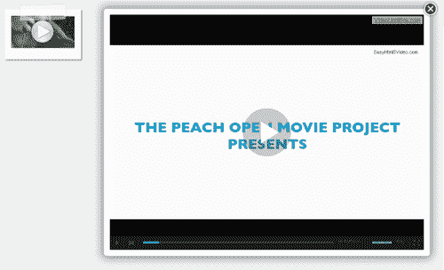

    *   然后，我们可以编辑源代码的副本，并根据我们的需要进行调整——这里有一个简化的例子:

    ```html
    <!DOCTYPE html>
    <html>
      <head>
        <title>VideoLightBox Test</title>
        <link type="text/css"rel="stylesheet" 
        href="index_videolb/videolightbox.css" />
        <link rel="stylesheet" type="text/css" 
        href="index_videolb/overlay-minimal.css"/>
        <script src="http://cdn.jquerytools.org/1.2.7/full/
        jquery.tools.min.js"></script>
        <script src="index_videolb/swfobject.js" 
        type="text/javascript"></script>
      </head>
      <body bgcolor="#f0f0f0">
      <div class="videogallery">
        <a class="voverlay" href="index_videolb/player.swf?url=video/bbb400p.mp4&volume=10 
     0" title="bbb400p">
      
      <span></span>
      </a>
      </div>
      <script src="index_videolb/videolightbox.js" 
        type="text/javascript"></script>
      </body>
    </html>
    ```** 

 **## 它是如何工作的...

VideoLightbox 使用 jQuery Tools([http://www.jquerytools.org](http://www.jquerytools.org))和 SWFObject 库([http://code.google.com/p/swfobject/](http://code.google.com/p/swfobject/))的组合—SWFObject充当一个容器，基本播放器文件存储在该容器中，并且从该容器中播放 MP4 视频。jQuery 工具库用于提供覆盖功能。对播放器“容器”(在本例中为`player.swf`)进行调用，该容器存储我们视频的一个实例，并用于提供视频回放的停止/开始控制。

### 注

如果你想了解更多关于 jQuery 工具的知识，那么你可以看看我的另一本书， *jQuery 工具 UI 库*，也可以从 Packt Publishing 获得。

## 总结

我们看了一些食谱，向您展示了如何在页面中嵌入 HTML5 视频——使用新的`<video>` **标签。这只是您使用新标签所能实现的目标的开始——还有整个世界需要探索。我希望你喜欢研究食谱，就像我喜欢写这本书一样！*********************