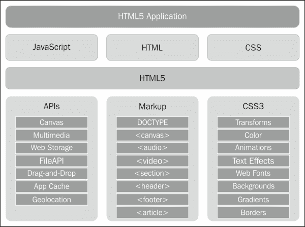
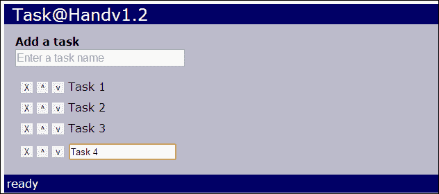

# 一、手头的任务

> “我渴望完成一项伟大而崇高的任务，但我的主要职责是完成小任务，就像它们是伟大而崇高的一样。”
> 
> 海伦·凯勒

*在第一章中，我们将学习创建 HTML5 应用的基础知识。我们将创建一个应用模板，作为快速、轻松地构建新应用的起点。然后，我们将使用该模板创建一个简单的 tasklist 应用。在此过程中，我们将发现如何与用户交互以及如何操作应用的用户界面。我们还将了解我们的第一个新的 HTML5 功能，网络存储应用编程接口。*

在本章中，我们将学习:

*   HTML5 应用的三个基本组件:HTML、CSS 和 JavaScript
*   一些 jQuery 基础知识，适合不熟悉 JavaScript 库的人
*   如何初始化应用并处理用户交互
*   如何操作 DOM 来添加、移除、更改和移动元素
*   如何创建可重用的 HTML 模板
*   如何使用 HTML5 网络存储应用编程接口存储和检索应用的状态

# html 5 应用的组件

在我们开始构建我们的第一个应用之前，我们需要学习一些 HTML5 应用基础知识。HTML5 应用就像用任何其他编程语言编写的应用。在我们开始有趣的部分之前，有一定数量的基础设施和管道需要到位。

当涉及到搭建项目时，Web 应用是非常好的。每次开始新的应用时，您都可以从头开始。但是，当您编写越来越多的应用时，您开始注意到，每次开始时，您都在一遍又一遍地做相同的基本事情，因此，创建一个应用模板来快速开始，而不是每次都重新发明轮子，这是有意义的。

为了理解 HTML5 应用是如何构建的，我们将从头开始，构建我们自己的应用模板，以便在创建新应用时使用。我们将使用这个模板作为我们在本书中构建的所有应用的基础。

每个网络应用都是从三个组件开始的:HTML、CSS 和 JavaScript。您可以将它们都放在一个文件中，这对于一个非常简单的应用来说可能是可以接受的，但是我们正在学习如何在这里构建真正的应用。所以我们将从创建三个文件开始，每个组件一个文件，并将它们放在名为`template`的文件夹中。他们将被命名为`app.html`、`app.css`和`app.js`。

下图是对 HTML5 应用及其组件的解释。我们的应用是建立在 HTML、CSS 和 JavaScript 之上的。这些反过来又建立在 CSS3 和 HTML5 框架之上，后者由新的标记元素和 JavaScript APIs 组成。



让我们看看应用的文件夹结构。我们将把我们创建的所有文件放在应用文件夹的根目录下。我们还将添加一个名为`lib`的文件夹，其中包含我们的应用可能需要的任何第三方 JavaScript 库。因为我们将一直使用 jQuery 库，所以我们将在其中放一份它的副本。如果有其他资产，如图像或音频文件，我们将分别放在`images`和`audio`文件夹中:


### 注

我们可以从在线**内容交付网络** ( **CDN** ) 参考 jQuery 库，但这需要您始终保持互联网连接。听我说，你永远不知道你什么时候会去一个没有联系的地方，然后发现你什么工作都做不了。

# 行动时间–创建 HTML 文件

我们将构建的第一个组件是我们的基础 HTML 文件`app.html`。我们将保持我们的 HTML 尽可能干净。它应该只包含标记。不应该有任何样式或脚本块混合在其中。将标记、样式、和行为分开将使您的应用更容易调试和维护。例如，如果某个东西的外观有问题，我们将知道问题出在 CSS 文件中，而不是 JavaScript 文件中。另一个好处是，您可以通过更改 CSS 来完全重新设计应用的用户界面，而无需接触其功能。

这是我们的基本 HTML 文件的标记。它只包含我们的 CSS 和 JavaScript 以及 jQuery 库，并定义了一个简单的主体结构，我们的大多数应用都将使用它。对于我们将要编写的应用，这是一个很好的起点。

```html
<!DOCTYPE html>
<html>
  <head>
    <title>App</title>
    <link href="app.css" rel="StyleSheet" />
    <script src="lib/jquery-1.8.1.min.js"></script>
    <script src="app.js"></script>
  </head>
  <body>
    <div id="app">
      <header>App</header>
      <div id="main"></div>
      <footer></footer>
    </div>
  </body>
</html>
```

### 类型

**下载示例代码**

您可以从您在[http://www.packtpub.com](http://www.packtpub.com)的账户中下载您购买的所有 Packt 书籍的示例代码文件。如果您在其他地方购买了这本书，您可以访问[http://www.packtpub.com/support](http://www.packtpub.com/support)并注册，以便将文件直接通过电子邮件发送给您。

HTML5 标记和以前版本的 HTML 的主要区别之一是文档类型声明，这已经被大大简化了。大家可能还记得，HTML5 之前的文档类型非常冗长，普通人根本不可能记住。它们看起来像这样:

```html
<!DOCTYPE HTML PUBLIC "-//W3C//DTD HTML 4.01//EN" "http://www.w3.org/TR/html4/strict.dtd">
```

现在满足新的和改进的 HTML5 文档类型声明。很简单，很优雅，最重要的是很容易记住:

```html
<!DOCTYPE html>
```

你可能注意到的另一个区别是`<header>`和`<footer>`元素。这些是 HTML5 中新的语义元素，本质上与`<div>`元素相同。HTML5 实际上有一系列新的语义元素，旨在赋予 HTML 标记更多的“T4”含义，而不仅仅是将所有内容包装在一个“T3”标签中。

因为我们在这里构建应用，而不是编写内容页面，所以我们不会过多关注这些语义元素。很多时候我们会使用质朴古老的`<div>`元素。但为了让您熟悉它们，这里概述了一些最有用的新语义元素:

*   `<article>`:定义文档中的一篇文章
*   `<aside>`:定义除其他页面内容之外的内容
*   `<footer>`:定义文档中某个部分的页脚
*   `<header>`:定义文档中某个部分的标题
*   `<nav>`:包含页面导航链接
*   `<section>`:定义文档中的一个部分

以前版本的 HTML 中存在的一些元素和属性现在不在 HTML5 中了。这些大多是和布局和字体有关的元素，包括`<big>`、`<center>`、`<font>`、`<strike>`、`<u>`。`<frame>`、`<applet>`等过时元素也出了。

现在让我们看看标记中`<body>`元素的内容。首先是`<div id=``app``>`元素。这将包装应用的整个标记。其他标记，如站点导航或任何其他与应用无关的标记，都可以在这个元素之外。

在`app`元素中，我们还有三个元素。这里我们使用了一些新的语义元素。首先，我们在应用中有一个`<header>`元素，它将包含应用的名称，例如标题栏(不要与文档`<head>`部分中的`<title>`元素混淆)。`<div id=`“`main`”`>`元素是应用主要部分的标记。我们在它下面添加了一个`<footer>`元素，它将像状态栏一样显示应用的状态。

# 行动时间–创建 CSS 文件

接下来我们将创建名为`app.css`的基础 CSS 文件。这将有我们的应用将使用的所有基本样式，如默认字体和颜色。CSS 文件的第一部分包含一些文档范围的元素样式，这些样式设置了基本的外观。

```html
body
{
    font: 1em Verdana, Geneva, sans-serif;
    padding: 0;
    margin: 5px;
    color: Black;
    background-color: WhiteSmoke;
}
div
{
    padding: 0;
    margin: 0;
}
button
{
    cursor: pointer;
}
.hidden
{
    display: none;
}
```

首先，我们设置要应用于身体的样式，它将向下渗透到其他元素。我喜欢将字体大小设置为`1em`而不是固定的像素大小，这样它就可以使用浏览器的默认字体大小。然后，您可以使用 ems 或 percent 在此基础上进行其他测量，为您提供更具反应性的布局，并使您以后更容易更改应用的外观。当您总是需要无论什么都一样大的东西，或者需要小的边框和边距值等等时，恒定的像素大小是很好的。

### 注

通常，在大多数浏览器中，1em 默认情况下与 16px 相同。

接下来，我们确保从所有`div`元素中移除所有填充和边距，因此我们将它们清零。当用户将光标悬停在按钮上时，将光标变为指针也很好，因此我们也将在这里进行设置。最后，还有一个`.hidden`类选择器，可以添加到任何元素中以隐藏它不被显示。

我们将以`app`和`main`元素的一些样式来结束 CSS。我们现在设置的只是边距、填充和颜色:

```html
#app
{
    margin: 4px;
    background-color: #bbc;
}
#app>header
{
    padding: 0 0.5em;
    font-size: 1.5em;
    color: WhiteSmoke;
    background-color: #006;
}
#app>footer
{
    padding: 0.25em;
    color: WhiteSmoke;
    background-color: #006;
}
#main
{
    margin: 1em;
}
```

# 行动时间–创建 JavaScript 文件

让我们将移至 JavaScript 文件`app.js`。在这里，我们将为我们的应用模板列出一个基本的大纲。如果你不知道美元符号是什么，它们是 jQuery 库的别名。我们稍后将讨论一些 jQuery 基础知识。

```html
"use strict";

function MyApp()
{
    var version = "v1.0";

    function setStatus(message)
    {
        $("#app>footer").text(message);
    }

    this.start = function()
    {
        $("#app>header").append(version);
        setStatus("ready");
    };
}
```

从顶部开始，我们将在我们的 JavaScript 文件中包含`"use strict"`。这通知 JavaScript 运行时在运行我们的代码时使用更新更严格的标准。例如，在旧版本的 JavaScript 中，使用变量名而不首先使用`var`关键字声明它是完全合法的。这产生了副作用，使其成为附属于`window`对象的全局变量。当`"use strict"`被定义时，如果你试图这样做，你会得到一个错误。它可以帮助你发现可能导致程序错误的错误代码。

### 注

如果你使用的是一些旧的 JavaScript 库，不能在严格模式下工作，你可以在函数声明中添加`"use strict"`来代替，只让那块代码使用严格模式。

```html
function strict()
{
    "use strict";
    // Everything inside here will use strict
// mode
}
```

接下来我们定义主应用对象`myApp`。在 JavaScript 中定义对象的方法有很多，包括使用对象文字和构造函数。对象文字是最简单的定义对象的方式，但是那些对象是在 JavaScript 被加载的时候创建的，通常是在 DOM 准备好之前。以下是我们的对象看起来像一个对象文字:

```html
var myApp = {
    version: "v1.0",
    setStatus: function(message)
    {
        $("#app>footer").text(message);
    },
    start: function()
    {
        $("#app>header").append(this.version);
        this.setStatus("ready");
    };
};
```

因为我们的应用正在操作文档对象模型，所以在文档对象模型准备好之前，我们不想创建对象。这就是为什么我们将使用函数构造函数来创建一个对象。

**DOM** 、或**文档对象模型**，是 HTML 标记的内部表示。这是一个代表 HTML 元素的对象层次树。

使用对象文字的另一个问题是，其中定义的所有内容都是对象的成员，因此必须使用`this`关键字进行访问。注意在前面的对象文字形式中，我们必须如何使用`this`来访问`version`和`setStatus()`。但是，当使用构造函数创建对象时，我们可以在构造函数的内部定义函数和变量，而无需将它们作为对象的成员。因为他们不是会员，所以您不必使用`this`关键字来访问他们。

那么使用`this`有什么不好呢？在你用 JavaScript 编程了一段时间后，你会意识到`this`关键字会引起很多混乱，因为它在不同的时间可能意味着不同的事情。在其他语言中，例如 C#和 Java，`this`总是指向你所在的对象。在 JavaScript 中，`this`是指向调用该函数的对象的指针，对于事件处理程序来说，该对象通常是`window`对象。所以我们越避免使用它，越好。

使用构造函数的另一个优点是能够定义私有和公共方法。请注意，`setStatus()`方法是使用普通函数声明定义的。这将使它成为只能从封装它的对象内部访问的私有方法，并且不需要使用`this`来调用它。另一方面，使用`this`将`start()`方法分配给对象。这将使`start()`成为只能从对象实例访问的公共方法。我们将在整个 JavaScript 中使用这个范例来实现对象的私有和公共成员。

我们最不需要的是一个文档就绪的事件处理程序。一旦页面被加载并且 DOM 层次结构被完全构建，文档就绪事件就会被触发。有两种方法可以使用 jQuery 添加这个事件处理程序。第一种也是更详细的方式是您所期望的:

```html
$(document).ready(handler);
```

然而，由于这可能是您需要实现的最基本和最重要的事件，jQuery 提供了一种简单的简写形式:

```html
$(handler);
```

这是我们的文档就绪事件处理程序:

```html
$(function() {
    window.app = new MyApp();
    window.app.start();
});
```

这是一段重要的代码。它定义了我们应用的起点。相当于 C、C++、C#、Java 等其他语言中的`main()`函数。

在这里，我们创建主应用对象的一个实例，然后通过将它附加到`window`对象来将其分配给名为`app`的全局变量。我们把它做成`global`，这样它就可以在我们的应用中被访问。最后但同样重要的是，我们调用应用对象的`start()`方法来启动应用。

## *刚刚发生了什么？*

我们刚刚创建了一个模板，可以用它在最短的启动时间内开始编写新的应用。它由 HTML、CSS 和 JavaScript 文件组成。至此，我们的模板已经完成，我们已经具备了开始编写新的 HTML5 应用所需的基础知识。

## 美元符号标识符

你可能已经注意到我们的 JavaScript 代码中到处都是美元符号。美元符号只是 jQuery 对象的别名。您可以用 jQuery 替换所有的美元符号，它将是相同的，只是更多的输入。如果你已经了解了 jQuery，你可能会想抢先一步。否则，我将简要概述一下 jQuery。

jQuery 是一个流行的 JavaScript 库，它在最基本的层面上提供了访问和操作 DOM 的功能。它还提供了许多其他有用的功能，例如事件处理、动画和 AJAX 支持。此外，它隐藏了浏览器之间的许多不同怪癖，因此您可以专注于编程，而不是如何让您的代码在每个浏览器中工作。它让编写 JavaScript 应用变得可以忍受，而且我敢说很有趣。没有它，我不会想到写一个 HTML5 应用。它对于 JavaScript 就像系统库对于 Java 和 C#一样重要。

在大多数情况下，jQuery 使用与 CSS 相同的查询语法来选择元素。典型的模式是选择一个或多个元素，然后对它们执行一些操作，或者从中检索数据。例如，这里有一个 jQuery select 来获取 DOM 中的所有`div`元素:

```html
$("div")
```

以下查询将为您提供 ID 为`main`的元素:

```html
$("#main")
```

就像 CSS 一样，散列符号选择具有特定 ID 的元素，点选择具有特定类的元素。您也可以使用复合搜索标准。下一个查询将返回所有元素，这些元素是 ID 为`main`且类为`selected`的元素的后代:

```html
$(#main .selected")
```

选择一个或多个元素后，可以对其执行一些操作。jQuery select 返回一个类似于数组的 jQuery 对象，但也有许多内置函数来做各种事情，我们将在本书中了解这些。例如，下面一行代码将隐藏从上一次选择返回的所有元素(将它们的 CSS `display`属性设置为`none`):

```html
$(#main .selected").hide()
```

简单而强大。那么美元符号到底是怎么回事呢？一些人认为 jQuery 可以使用美元符号作为别名是某种魔力。但显然，美元符号是 JavaScript 中开始变量或函数名的有效字符。

# 创建我们的第一个应用

在这一章和接下来的几章中，我们将构建一个使用 HTML5 和 CSS3 的任务列表应用。在我们开始之前，我们应该详细说明我们的应用的规范，这样我们就知道我们想要构建什么。

*   我们的 tasklist 应用应该允许用户快速输入一个或多个任务名称，并将它们显示在列表中。
*   用户应该能够通过编辑、删除或按照列表的顺序上下移动来轻松操作任务。
*   应用应该记住输入的任务，这样当用户返回时，他们就可以从停止的地方继续。
*   用户界面应该是反应性的，这样它就可以在许多不同屏幕尺寸的不同设备上使用。
*   我们将从简单开始，并在我们已经完成的基础上继续前进。在整个过程中，我们将构建一些可以在后续项目中使用的 JavaScript 库，这样我们就可以开始运行了。

# 行动时间-创建任务列表

现在我们已经掌握了的基础知识，让我们开始使用任务列表应用。我们将我们的应用称为`Task at Hand`，或者`Task@Hand`是 hip。首先复制我们的模板文件夹，并将其重命名为`taskAtHand`。同时将`.html`、`.css`和`.js`文件重命名为`taskAtHand`。现在我们准备开始我们的第一个 HTML5 应用。您可以在`Chapter 1/example1.1`中找到该部分的代码。

我们需要做的第一件事是进入 HTML 文件，将`<head>`元素中的 CSS 和 JS 文件的标题和名称更改为`taskAtHand`:

```html
<head>
  <title>Task@Hand</title>
  <link href="taskAtHand.css" rel="StyleSheet" />
  <script src="lib/jquery-1.8.1.min.js"></script>
  <script src="taskAtHand.js"></script>
</head>
```

接下来我们来看尸体。首先我们在`<header>`元素中更改应用的名称。然后进入`<div id=`“`app`”`>`元素，添加一个文本输入框，用户可以在其中输入任务的名称。最后，我们添加一个空列表来保存我们的任务列表。由于我们正在构建一个列表，我们将使用无序列表`<ul>`元素。

```html
<body>
  <div id="app">
    <header>Task@Hand</header>
    <div id="main">
      <div id="add-task">
        <label for="new-task-name">Add a task</label>
        <input type="text" id="new-task-name" title="Enter a task name" placeholder="Enter a task name"/>
      </div>
      <ul id="task-list">
      </ul>
    </div>
    <footer>
    </footer>
  </div>
</body>
```

这就是我们现在需要的所有标记。这里有一点需要指出，这是 HTML5 的新内容。有一个名为`placeholder`的输入新属性，它会在字段中显示一些文本，直到用户开始键入一些内容。这给用户一个提示，告诉他们应该在字段中输入什么。它对允许用户输入文本的输入元素有效。

让我们进入 JavaScript 文件，开始编码。我们要做的第一件事是将应用对象重命名为`TaskAtHandApp`:

```html
function TaskAtHandApp()
{
    // code not shown…
}
$(function() {
    window.app = new TaskAtHandApp();
    window.app.start();
});
```

### 注

JavaScript 中的一个标准是，只有需要新语句的东西(即对象构造函数)才应该以大写字母开头。这有助于区分什么需要创建`new`关键字。其他的一切，包括变量和函数名，都应该以小写字母开头。

当用户输入完任务名称并点击*回车*键后，我们想要创建一个新的列表项元素并将其添加到列表中。我们需要做的第一件事是在文本字段中添加一个事件处理程序，这样当我们按下一个键时就会得到通知。我们将在我们的应用对象的`start()`方法中添加这个:

```html
this.start = function()
{
    $("#new-task-name").keypress(function(e) {
        if (e.which == 13) // Enter key
        {
            addTask();
            return false;
        }
    })
    .focus();

    $("#app header").append(version);
    setStatus("ready");
};
```

首先，我们通过对文本字段的标识`new-task-name`进行 jQuery select 来获取文本字段。然后，我们向该元素添加一个`keypress()`事件处理程序，每次事件被触发时传递一个要执行的函数。jQuery 将一个参数传递给事件处理函数，它是一个`keypress`事件对象。事件对象包含名为`which`的字段，该字段包含按下的键的字符代码。这里我们感兴趣的是*回车*键，代码为`13`。

当用户按下*进入*键时，我们调用`addTask()`方法(下一步定义)，然后返回`false`。我们这里返回`false`的原因是告诉系统我们处理了按键事件，不希望它做默认动作。当按下*进入*键时，一些浏览器会执行其他动作。

接下来，我们在`keypress()`处理程序的末尾添加另一个函数调用，将焦点设置回文本字段。此时，你可能会问自己，这是如何工作的，在函数上调用一个函数？这被称为函数链接，可能是 jQuery 最有用的特性之一。jQuery 的大多数方法都返回一个指向对象本身的指针，因此我们可以在一行代码中执行多个操作。

现在我们来写一下`addTask()`方法。这个方法将获得任务的名称，并在我们的 HTML 中的`<ul>`元素中添加一个新的列表项:

```html
function addTask()
{
    var taskName = $("#new-task-name").val();
    if (taskName)
    {
        addTaskElement(taskName);
        // Reset the text field
        $("#new-task-name").val("").focus();
    }
}
function addTaskElement(taskName)
{
    var $task = $("<li></li>");
    $task.text(taskName);
    $("#task-list").append($task);
}
```

首先，我们使用 jQuery 的`val()`方法获取`new-task-name`文本字段的值，该方法用于获取输入字段的值。为了确保用户确实输入了一些东西，我们测试了`taskName`变量是“truthy”，这意味着它不是一个空字符串。

接下来我们称之为`addTaskElement()`法。在这里我们创建一个新的`<li>`元素。您可以通过传入元素定义而不是选择 jQuery 来创建新元素。在这种情况下，我们使用`"<li></li>"`创建一个新的空列表项元素，然后将其分配给`$task`变量。然后，我们立即使用`text()`方法用任务名称填充该元素。

### 注

将 jQuery 对象赋给变量时，最好以`$`开始变量名，这样就知道它引用了一个 jQuery 对象。

现在我们有了新元素，我们需要将其添加到文档的正确位置，即`<ul id=`“`task-list`”`>`元素内。这是通过选择`task-list`元素并调用`append()`方法来完成的。这将我们新的`<li>`元素添加到任务列表的末尾。

回到`addTask()`方法，我们要做的最后一件事是清除文本输入字段的值，并将焦点重新设置在它上面，这样用户就可以立即进入另一个任务。我们在这里使用函数链在一条语句中完成这两项工作。请注意，我们使用了 jQuery `val()`方法来设置和获取文本字段的值。如果传入一个值，它将设置控件的值；否则，它返回控件的值。您会发现许多 jQuery 方法都是这样工作的。例如，`text()`方法要么在元素中设置文本，要么在没有传入值的情况下返回文本。

## *刚刚发生了什么？*

我们创建了一个 tasklist 应用，用户可以在其中键入任务名称并构建任务列表。让我们在浏览器中打开该应用，看看目前为止我们得到了什么:


# 行动时间-从列表中删除任务

现在我们可以在列表中添加任务，让我们添加移除任务的能力。为此，我们需要为列表中的每个任务添加一个删除按钮。我们将在`addTaskElement()`方法中添加创建按钮的代码。您可以在`Chapter 1/example1.2`中找到该部分的代码。

```html
function addTaskElement(taskName)
{
    var $task = $("<li></li>");
    var $delete = $("<button class='delete'>X</button>");
    $task.append($delete)
         .append("<span class='task-name'>" + taskName +
                 "</span>"); 
    $delete.click(function() { $task.remove(); });
}
```

这个方法做的第一件事是用类`delete`创建一个新的`<button>`元素。然后它会像我们之前做的那样创建列表项元素，除了首先附加删除按钮，然后附加任务名称。请注意，我们现在将任务名称包装在一个`<span class=`“`task-name`”`>`元素中，以帮助我们跟踪它。最后，我们向删除按钮添加一个 click 事件处理程序。要从列表元素中删除任务，我们只需调用`remove()`方法将其从 DOM 中移除。瞧，它不见了！

# 行动时间–在列表中移动任务

在此过程中，让我们添加按钮，在列表中上下移动任务。为此，我们将向`addTaskElement()`方法添加更多的代码。首先我们需要创建`move-up`和`move-down`按钮，然后和`delete`按钮一起添加到列表元素中。

```html
function addTaskElement(taskName)
{
    var $task = $("<li></li>");
    var $delete = $("<button class='delete'>X</button>");
    var $moveUp = $("<button class='move-up'>^</button>");
    var $moveDown = $("<button class='move-up'>v</button>");
    $task.append($delete)
        .append($moveUp)
        .append($moveDown)
        .append("<span class='task-name'>" + taskName +
                "</span>");
    $("#task-list").append($task);

    $delete.click(function() { $task.remove(); });
    $moveUp.click(function() {
        $task.insertBefore($task.prev());
    });
    $moveDown.click(function() {
        $task.insertAfter($task.next());
    });
}
```

点击**上移**或**下移** 按钮时，使用`prev()`和`next()`方法找到上一个或下一个任务元素。然后它使用 jQuery `insertBefore()`和`insertAfter()`方法在任务列表中上下移动任务元素。

## *刚刚发生了什么？*

我们在每个任务元素中添加了按钮，这样我们就可以删除它们或者按照列表的顺序上下移动它们。我们学习了如何使用 jQuery `remove()`、`insertBefore()`和`insertAfter()`方法来修改 DOM。

# HTML 模板

如你所见，的事情在我们的`addTaskElement()`方法中变得有点乱。我们正在用 JavaScript 以编程方式创建一堆元素，并手动将它们添加到 DOM 中。如果我们可以定义我们希望任务元素的结构在我们的 HTML 文件中是什么样子，并使用它来创建新的任务，不是会容易得多吗？我们可以，我们会的。在本节中，我们将创建一个 HTML 模板，我们可以重用它来轻松创建新任务。

### 注

有很多用于实现 HTML 模板的 JavaScript 库，它们有很多强大的功能，但是对于我们的应用来说，我们只需要一些简单的东西，所以我们将实现我们自己的。

# 行动时间-实施模板

首先，我们需要一个放置模板标记的地方。所以我们将在`app`元素之外给我们的 HTML 文件添加一个`<div id="templates">`，并给它一个`hidden`类。从我们的 CSS 中你可能记得，隐藏类为一个元素设置了`display`到`none`。这将隐藏模板的标记，因此用户永远看不到它。现在让我们定义模板:

```html
<div id="app">
  …
</div>
<div id="templates" class="hidden">
 <ul id="task-template">
 <li class="task">
 <div class="tools">
 <button class="delete" title="Delete">X</button>
 <button class="move-up" title="Up">^</button>
 <button class="move-down" title="Down">v</button>
 </div>
 <span class="task-name"></span>
 </li>
 </ul>
</div>
```

我不知道你怎么样，但对我来说，这比试图在代码中构建任务元素要容易得多。它也更容易阅读、添加和维护。您可能已经注意到添加了一些其他元素和属性，以编程方式添加这些元素和属性会很痛苦。按钮周围放置了一个`<div class="tools">`将它们组合在一起，每个按钮都添加了一个`title`属性，该属性将在浏览器中显示为工具提示。

请注意，我们没有在任务元素的任何地方使用任何标识属性。相反，我们使用类属性来标识不同的元素。这样做的原因是一个标识唯一地标识了一个元素，所以它应该只使用一次。如果我们创建一个有一堆标识的模板并开始复制它，我们将会有重复的标识。如果你不止一次地使用一个标识，那么它对于唯一识别一个元素来说是毫无价值的。

在我们继续之前，我们需要为按钮及其容器添加一些样式。我们希望按钮与任务名称保持在同一行，但是它们的容器`<div>`是块级元素。我们换成`inline-block`这样就不会断了:

```html
#task-list .task .tools
{
    display: inline-block;
}
```

我们还希望移除按钮的边框，使它们大小相同，并移除填充和边距，这样会更紧凑:

```html
#task-list .task .tools button
{
    margin: 0;
    padding: 0;
    width: 1.25em;
    height: 1.25em;
    border: none;
}
```

那么，既然我们有了一个任务模板，我们该如何使用它呢？jQuery 在这里又派上了用场。我们所要做的就是获取模板元素，并使用`clone()`方法复制它。然后在 DOM 中我们想插入的任何地方插入副本。以下是我们新的`addTaskElement()`方法:

```html
function addTaskElement(taskName)
{
    var $task = $("#task-template .task").clone();
 $("span.task-name", $task).text(taskName);

    $("#task-list").append($task);

    $("button.delete", $task).click(function() {
        $task.remove();
    });
    $("button.move-up", $task).click(function() { 
        $task.insertBefore($task.prev());
    });
    $("button.move-down", $task).click(function() {
        $task.insertAfter($task.next());
    });
}
```

我们已经用一行代码替换了所有这些创建元素的行，该代码获取任务模板元素并使用`clone()`方法复制它。第二行将任务名称填充到我们为保存它而设置的`<span class="task-name">`元素中。如果您仔细观察，您会看到我们现在正在选择中向 jQuery 传递第二个参数。这告诉 jQuery 只搜索`task`元素的后代元素。否则，它会找到文档中的每个任务名称元素并对其进行更改。当选择按钮将 click 事件处理程序连接到它们时，我们做同样的事情，使用它们的类名来识别它们。

## *刚刚发生了什么？*

我们实现了一个 HTML 模板，它允许我们移除所有代码来动态生成任务元素，并用对 jQuery 的`clone()`方法的调用来替换它。这使得我们更容易更新和维护 HTML 中的元素结构，而不是 JavaScript。

# 行动时间–编辑列表中的任务

到目前为止，我们有一个任务列表，我们可以在其中添加任务，从其中移除任务，以及更改任务的顺序。让我们添加一些功能来允许用户更改任务的名称。当用户点击一个任务名称时，我们会将其更改为文本输入字段。为此，我们需要在任务名称后面的任务元素模板中添加一个文本输入字段:

```html
<li class="task">
    <div class="tools">
        <button class="delete" title="Delete">X</button>
        <button class="move-up" title="Up">^</button>
        <button class="move-down" title="Down">v</button>
    </div>
    <span class="task-name"></span>
    <input type="text" class="task-name hidden"/>
</li>
```

我们给它一个类`task-name`来标识它，并且还添加了隐藏类，这样默认情况下它是不可见的。我们只想在用户点击任务名称时显示它。因此，让我们进入 JavaScript 文件，在我们的`addTaskElement()`方法的末尾添加一个`<span>`元素上的事件处理程序:

```html
$("span.task-name", $task).click(function() {
    onEditTaskName($(this));
});
```

让我们把它分解一下。首先我们得到`task-name`类的跨度，它是任务元素的子元素。然后我们添加一个调用`onEditTaskName()`方法的点击事件处理程序。`onEditTaskName()`方法参考`<span>`元素作为参数。当您在 jQuery 事件处理函数中时，`this`指的是事件源的元素。所以`$` ( `this`)创建一个包装`<span>`元素的 jQuery 对象，这样我们就可以在上面调用 jQuery 方法:

```html
function onEditTaskName($span)
{
    $span.hide()
        .siblings("input.task-name")
        .val($span.text())
        .show()
        .focus();
}
```

即使`onEditTaskName()`方法在技术上只包含一行代码，但仍有很多事情在进行。它使用函数链在一个紧凑的语句中做了很多工作。首先隐藏`<span>`元素。然后它通过寻找`<span>`元素的一个兄弟来获得文本输入字段，也就是一个类为`task-name`的`<input>`元素。然后，它使用 jQuery 的`text()`方法从`<span>`元素获取任务名称来设置文本字段的值。最后，它使文本字段可见，并在其上设置焦点。

当用户单击任务名称时，它会在他们眼前变成一个可编辑的文本字段。现在，我们只需要一种方法，当用户完成名称编辑后，就可以将它改回来。为此，我们将向文本字段添加一个更改事件处理程序，当用户更改文本字段并点击*进入*或离开它时，该事件处理程序将被触发。将此添加到`addTaskElement()`方法的末尾:

```html
$("input.task-name", $task).change(function() {
    onChangeTaskName($(this));
});
```

这与任务名称点击事件处理程序的工作方式相同。我们将调用一个名为`onChangeTaskName()` 的方法，并向它传递一个包装文本字段输入元素的 jQuery 对象:

```html
function onChangeTaskName($input)
{
    $input.hide();
    var $span = $input.siblings("span.task-name");
    if ($input.val())
    {
        $span.text($input.val());
    }
    $span.show();
}
```

首先我们隐藏文本输入字段，然后获取任务名称`<span>`元素并存储在变量中。在更新名称之前，我们检查以确保用户确实输入了一些内容。如果是，我们更新任务名称。最后，我们调用`show()`使任务名称再次可见。用户看到文本字段变回静态文本。

还有最后一件事要做。如果用户在没有更改任何内容的情况下单击字段，我们将不会得到更改事件，文本字段也不会被隐藏。当这种情况发生时，我们可以得到一个`blur`事件。因此，让我们向文本字段添加一个`blur`事件处理程序，隐藏它并显示静态任务名称`<span>`元素:

```html
$("input.task-name", $task).change(function() {
    onChangeTaskName($(this));
})
.blur(function() {
 $(this).hide().siblings("span.task-name").show();
});

```

## *刚刚发生了什么？*

我们在任务模板中添加了一个文本字段，当用户单击任务名称时会显示出来，这样他们就可以编辑任务名称。当任务名称文本字段更改时，它会更新任务名称标签。



# 保存应用的状态

我们现在有了一个相当实用的 tasklist 应用。我们可以添加、删除和移动任务。我们甚至可以编辑现有任务的名称。只有一个问题。因为我们将所有这些任务元素动态地添加到 DOM 中，所以下次用户回到应用时，它们就不会出现了。我们需要一种方法来保存任务列表，这样下次用户回到应用时，任务仍然会在那里。否则，有什么意义呢？

HTML5 正好有这样的东西——网络存储。网络存储是 HTML5 中的一个新的应用编程接口，允许您在客户端存储信息。过去，客户端上唯一可用的存储是 cookies。但是 cookies 并不是在客户端存储数据的好方法。它们只限于几千字节的数据，并且也包含在 HTTP 请求中，从而扩大了它们的大小。

另一方面，网络存储允许我们保存更多的数据(在大多数浏览器中高达 5 MB)，并且不会给 HTTP 请求增加任何内容。它由两个具有相同界面的全局对象组成， `localStorage` 和`sessionStorage` 。两者唯一的区别是存储在`sessionStorage` 中的数据在浏览器关闭时消失，而存储在`localStorage`中的数据不会消失。由于我们希望在会话之间保存应用数据，我们将只使用`localStorage`。

数据存储为键/值对。您可以使用`setItem()`方法设置值，并使用`getItem()`检索值，如下所示:

```html
localStorage.setItem("myKey", "myValue");
var value = localStorage.getItem("myKey") // returns "myValue"
```

如果您试图使用不存在于`localStorage`中的键来获取值，它将返回`null`。如果你试图给`localStorage`增加一个值，但没有足够的内存，你会得到一个`QUOTA_EXCEEDED_ERR`异常。

对`localStorage`有一些限制:

*   用户不一定能访问存储在那里的任何东西(尽管可以通过浏览器的开发工具访问)。
*   它由域中的所有应用共享，因此存储限制由您的所有应用共享。这也意味着所有应用中的所有密钥都必须是唯一的。如果两个应用使用相同的密钥，它们最终会覆盖彼此的数据。
*   键和值都必须是字符串。如果要存储非字符串的内容，必须先将其转换为字符串。当您从存储中取出该值时，您必须将其从字符串转换回您期望的类型。

对我们来说幸运的是，JavaScript 有一个名为 JSON 的实用程序对象，它提供了将值转换为字符串和从字符串转换值的函数。 **JSON** 代表 **JavaScript 对象符号**，是以可读格式将值表示为字符串的标准。它是 JavaScript 中对象文字符号的子集，所以如果你知道如何定义对象文字，你就知道 JSON。JSON 对象有两种方法；`JSON.stringify()`将值转换为字符串，`JSON.parse()`将字符串转换回值。

# 行动时间–创建本地存储包装

为了帮助绕过`localStorage`的一些限制，我们将创建一个名为`AppStorage`的对象，为`localStorage`对象提供一个包装器。`AppStorage`对象将帮助我们避免键冲突，并提供一种存储非字符串值的简单方法。让我们在一个名为`appStorage.js`的新文件中定义这个对象，这样我们就可以在所有应用中重用它。您可以在`Chapter 1/example1.3`中找到该部分的代码。

```html
function AppStorage(appName)
{
    var prefix = (appName ? appName + "." : "");
```

构造函数接受应用名称作为参数。下一行设置了一个名为`prefix`的私有变量，该变量将用于为我们所有的键加上应用名称的前缀，以避免冲突。如果没有提供`appName`参数，它将不会使用前缀，这对于所有应用之间共享的数据可能是有用的。如果我们将`"myApp"`传递给构造函数，我们应用的所有键都将从`"myApp"`开始(例如，`myApp.settings`或`myApp.data`)。

下一行创建一个公共变量，用于确定浏览器是否支持`localStorage`。它只是检查全局`localStorage`对象是否存在:

```html
this.localStorageSupported = (('localStorage' in window) && window['localStorage']);
```

让我们首先实现用于在本地存储中设置值的`setValue()`方法:

```html
this.setValue = function(key, val)
{
    if (this.localStorageSupported)
        localStorage.setItem(prefix + key, JSON.stringify(val));
    return this;
};
```

`setValue()`方法取一个键和值放入本地存储。它将应用前缀添加到密钥前面，以帮助避免命名冲突。因为您只能将字符串放入本地存储，所以我们使用`JSON.stringify()`方法将值转换为字符串，然后调用`localStorage.setItem()`进行存储。

现在让我们执行`getValue()`方法从`localStorage`获取值:

```html
this.getValue = function(key)
{
    if (this.localStorageSupported)
        return JSON.parse(localStorage.getItem(prefix + key));
    else return null;
};
```

`getValue()`方法取一个键，在其前面加上前缀，并在`localStorage`中返回与之关联的字符串值。它使用`JSON.parse()`将从`localStorage`检索的字符串解析为一个值。如果密钥不存在或不支持本地存储，这些方法返回`null`。

接下来我们需要的是一种移除物品的方法。让我们执行`removeValue()`方法来做到这一点。它简单地调用`localStorage.removeItem()`传入前缀密钥:

```html
this.removeValue = function(key)
{
    if (this.localStorageSupported)
        localStorage.removeItem(prefix + key);
    return this;
};
```

在此过程中，让我们添加一个方法来移除应用的所有键。`localStorage`确实有一个`clear()`方法，但是它完全清空了你的域的`localStorage`，而不仅仅是我们应用的值。因此，我们需要获取应用的所有密钥，然后逐个删除它们:

```html
this.removeAll = function()
{
    var keys = this.getKeys();
    for (var i in keys)
    {
        this.remove(keys[i]);
    }
    return this;
};
```

`removeAll()`方法引用了一个`getKeys()`方法。此方法将返回应用所有键名的数组。我们将使用`getKeys()`方法，因此用户也可以通过一个过滤函数，根据自己的标准进一步过滤结果，如果他们愿意的话:

```html
this.getKeys = function(filter)
{
    var keys = [];
    if (this.localStorageSupported)
    {
        for (var key in localStorage)
        {
            if (isAppKey(key))
            {
                // Remove the prefix from the key
                if (prefix) key = key.slice(prefix.length);
                // Check the filter
                if (!filter || filter(key))
                {
                    keys.push(key);
                }
            }
        }
    }
    return keys;
};
function isAppKey(key)
{
    if (prefix)
    {
        return key.indexOf(prefix) === 0;
    }
    return true;
};
```

这个方法的工作原理是循环遍历`localStorage`中的所有键，通过使用`in`关键字实现循环，您可以像获取一样获取对象或数组中的所有键。它调用私有方法`isAppKey()`来确定密钥是否属于我们的应用。如果是，它将从密钥中删除应用前缀。最后，如果没有定义过滤器或过滤器功能返回`true`，将键添加到键数组中返回。

私有的`isAppKey()`方法以一个密钥名作为参数，如果密钥属于我们的应用，则返回`true`。如果未定义应用名称前缀，则无需检查。否则，我们检查密钥是否以应用前缀开头。

我们需要写最后一个公共方法。`contains()`方法将确定是否有一个值与一个键相关联。它只是尝试获取与密钥关联的值，并检查它是否存在:

```html
this.contains = function(key)
{
    return this.get(key) !== null;
};
```

## *刚刚发生了什么？*

我们在 HTML5 `localStorage`对象上创建了一个名为`AppStorage`的包装对象。它封装了所有与`localStorage`交互和保存 JavaScript 对象的行为。现在我们可以将任何类型的数据保存到`localStorage`中，然后进行检索。

# 行动时间–存储任务列表

让我们回到任务列表应用。首先，我们将在我们的 HTML 文件中添加对`appStorage.js`的引用:

```html
<script src="appStorage.js"></script>
```

接下来，我们将向`TaskAtHandApp`对象添加一个私有`appStorage`变量，将应用的名称传递给构造函数:

```html
function TaskAtHandApp()
{
    var version = "v1.3",
        appStorage = new AppStorage("taskAtHand");
    //…
}
```

现在，让我们添加一个私有方法，每当进行更改时，都可以调用该方法来保存任务:

```html
function saveTaskList()
{
    var tasks = [];
    $("#task-list .task span.task-name").each(function() {
        tasks.push($(this).text())
    });
    appStorage.setValue("taskList", tasks);
}
```

`saveTaskList()`方法查找列表中每个任务的所有任务名称`<span>`元素。然后它调用 jQuery `each()`方法，该方法用于迭代 select 找到的元素。`each()`方法将一个函数作为参数，并为每个元素调用该函数。我们的函数只是将任务名称推到任务数组的末尾。然后我们调用`appStorage.setValue()`告诉它使用`"taskList"`键存储任务数组。

现在我们需要在每次列表改变时给`saveTaskList()`添加一个调用。那将在`addTask()`和`onChangeTaskName()`方法中。另外，在`addTaskElement()`中，我们需要从`delete`、`move-up`和`move-down`的按钮点击事件处理程序调用它。为了便于阅读，让我们对按钮事件处理程序做一点重构，将内联处理程序代码移出到私有方法中:

```html
function addTaskElement(taskName)
{
    // code not shown…
    $("button.delete", $task).click(function() {
        removeTask($task);
    });
    $("button.move-up", $task).click(function() {
        moveTask($task, true);
    });
    $("button.move-down", $task).click(function() {
        moveTask($task, false);
    });
    //…
}
function removeTask($task)
{
    $task.remove();
    saveTaskList();
}
function moveTask($task, moveUp)
{
    if (moveUp)
    {
        $task.insertBefore($task.prev());
    }
    else
    {
        $task.insertAfter($task.next());
    }
    saveTaskList();
}
```

现在让我们在 Chrome 中看看这个。继续添加一些任务，然后按 *F12* 打开开发者工具。如果您点击窗口顶部的**资源**图标，您将在左窗格中看到一个资源列表。展开**本地存储**项目，并单击其下的项目。您应该会在右窗格中看到存储在您的域的本地存储中的所有数据:


在**键**列中，您应该会找到`taskAtHand.taskList`，并在**值**列中看到代表我们任务列表的 JSON，您可能还记得，该值存储为数组。

现在继续玩吧。尝试添加、删除、编辑和移动任务。您应该看到本地存储中的值在每次更改后都会更新。我们现在有一个持久的任务列表。

一些浏览器在使用`file://`协议时不允许访问`localStorage`(也就是说，您直接从文件系统将文件打开到浏览器中)。如果你的`localStorage`不工作，在另一个网络浏览器中尝试它或者通过网络服务器访问你的应用，比如 IIS 或者 Apache。

# 行动时间–加载任务列表

我们已经保存了任务列表。但是如果我们不能加载它，这对我们没有多大好处。那么我们来添加一个新的私有方法`loadTaskList()`:

```html
function loadTaskList()
{
    var tasks = appStorage.getObject("taskList");
    if (tasks)
    {
        for (var i in tasks)
        {
            addTaskElement(tasks[i]);
        }
    }
}
```

这个方法调用`appStorage.getValue()`为我们的任务列表传入密钥。然后它检查以确保我们得到了一些东西回来。如果是这样，它会遍历数组中的所有任务，为每个任务调用`addTaskElement()`方法。

剩下要做的唯一一件事就是从`start()`方法添加对`loadTaskList()`的调用，这样在应用启动时就加载了列表:

```html
this.start = function()
{
    // Code not shown…
    loadTaskList();
    setStatus("ready");
};
```

## *刚刚发生了什么？*

我们在我们的任务列表应用中使用`AppStorage`对象，在任何情况发生变化时将任务列表存储到`localStorage`，然后在用户返回时检索它并构建任务列表。

## 加油英雄

编写一个本地存储浏览器应用，可以用来查看您的域中每个应用的数据。在顶层，列出所有的应用。当您深入应用时，它会显示它的所有本地存储项目。当您单击某个项目时，它会显示该项目的内容。

## 突击测验

Q1。HTML5 应用的三个基本组件是什么？

1.  jQuery、模板和本地存储
2.  文档、对象和模型
3.  标签、元素和属性
4.  HTML、CSS 和 JavaScript

Q2。本地存储中可以存储什么类型的数据？

1.  任何类型
2.  目标
3.  民数记
4.  用线串

# 总结

给你。我们现在有了第一个 HTML5 应用。我们可以在其中添加、删除和编辑任务的任务列表。任务被持久化，这样当用户返回到应用时，他们可以从他们停止的地方继续。我们在本章中介绍了以下概念:

*   我们学习了构建 HTML5 应用及其三个组件(HTML、CSS 和 JS)的基础知识
*   我们创建了一个应用模板来帮助我们快速启动新应用
*   我们学习了如何使用 jQuery 来访问和操作 DOM
*   我们学习了如何初始化 web 应用和处理用户交互
*   我们学习了如何创建 HTML 模板，以便在标记中定义可重用的元素结构
*   我们学习了如何使用网络存储来保存和检索应用的状态，并创建了一个`AppStorage`对象来帮助我们访问`localStorage`

现在，我们已经学习了创建 HTML5 应用的基础知识，并且让我们的 tasklist 应用工作了，我们准备做一些样式设计。在下一章中，我们将了解一些新的 CSS3 特性，这些特性将使我们的应用看起来和任何桌面应用一样好，甚至更好。