# 第二章。让我们变得时尚

> “在风格问题上，随波逐流；在原则问题上，要像石头一样站着。”托马斯·杰斐逊

*在本章中，我们将戴上平面设计师的帽子，做一些造型。现在，我们在第一章中创建的任务列表应用工作正常，但它看起来像是 2005 年的东西。我们将使用 CSS3 将它带到现在和未来，让它看起来干净、现代。我们将使用最新的 CSS3 特性添加圆角、阴影、渐变和过渡。我们还将使用 CSS 精灵向任务列表按钮添加一些图像。*

在本章中，我们将学习:

*   在 CSS3 中指定颜色和设置透明度的新方法
*   如何给元素添加圆角
*   如何给元素和文本添加阴影
*   如何在元素背景中绘制渐变
*   新的 CSS3 背景属性
*   如何在应用中使用 CSS 精灵
*   如何使用过渡和变换向用户界面添加效果
*   如何动态加载样式表以创建可自定义的用户界面

# CSS3 概述

CSS3不是 HTML5 规范的一部分，但它是编写 HTML5 应用不可或缺的一部分。CSS3 正在与 HTML5 一起开发，并提供了许多新的样式，使网页的外观和功能比以往任何时候都更好。曾经属于 Photoshop 领域的东西，如渐变和阴影，现在可以通过样式轻松添加。使用这些新的图形功能将使您的应用看起来现代化，并为您的应用增添特色。

CSS 中一些最令人兴奋的增加是给元素添加渐变和阴影的能力。圆角，这是每个人都想在他们的网页中使用的功能，曾经是许多 HTML 黑客的领域，现在添加起来很简单。不需要下载额外的图像和代码来支持网页和应用，让它们看起来更好从来没有这么容易过。

您可以在`chapter2/css3-examples/css3-examples.html`中看到以下所有 CSS3 样式的示例。

## CSS3 颜色

在开始新效果之前，我们先来讨论一下颜色。CSS3 有新的定义颜色的方法，允许你设置透明度和定义 HSL 格式的颜色。当然，您仍然可以使用十六进制值的旧标准、任何 CSS 颜色名称和 `rgb()`说明符。

添加了新的`rgba()`说明符 ，允许用颜色设置 alpha 或不透明度。就像`rgb()`一样，前三个参数设置红色、绿色和蓝色的量，是从`0`到`255`的值。第四个参数 alpha 是从`0`到`1`的浮点值，其中`0`是完全透明的，`1`是完全不透明的。下面声明了 50%透明的红色背景色:

```html
background-color: rgba(255, 0, 0, 0.5);
```

虽然大多数浏览器都支持`rgba()`，但是为不支持的浏览器指定一个后备是个好主意，方法是在它前面定义一个`rgb()`格式的颜色，如下所示:

```html
background-color: rgb(255, 0, 0);
background-color: rgba(255, 0, 0, 0.5);
```

这里有一个重叠三个元素的例子，所有元素的 alpha 值为`0.5`，颜色为红色、绿色和蓝色(是的，您可以绘制圆形元素，我们将在下一节中看到):

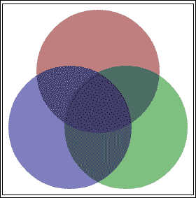

除了 RGB 颜色外，CSS3 还支持 **HSL** 颜色，代表**色相**、**饱和度**、**明度**。HSL 是基于一个色轮，它的边缘是全彩色的，中心逐渐变成灰色。现在将轮子延伸成底部为黑色，顶部为白色，中间为全彩的圆柱体。这就是关于 HSL 颜色的理论。

使用`hsl(h, s, l)`指定。色调是从`0`到`360`的值，映射到色轮上的度数。`0`为红色，`120`为绿色，`240`为蓝色，`360`回绕到红色。饱和度是`0%`全灰、`100%`全彩的颜色百分比。明度为明度的百分比，其中`0%`为黑色，`50%`为全彩，`100%`为白色。可以指定有无 alpha 值，与`rgb()`相同，如下图:

```html
hsl(240, 100%, 50%);
hsla(240, 100%, 50%, 0.5);
```

大多数人不会想到 HSL 中的颜色，但它就在那里，以防你想使用它。如果你想玩它，在[http://hslpicker.com](http://hslpicker.com)有一个不错的 HSL 拾取器。

# 圆角

我们将看到的第一个 CSS3 效果是圆角，因为这在 CSS3 之前是如此受欢迎的特性。在过去，如果你想要圆角，只有几个非最佳的解决方案。您可以加载四个图像，每个角落一个，并添加一些额外的标记来使它们对齐(并尝试使其在所有浏览器中工作)。或者使用多个`div`标签来“绘制”一个圆形边框，从而实现某种黑客攻击。或者其他六种方式中的一种。最后，没有一个是好的解决方案。那么，为什么在 CSS3 之前，我们要竭尽全力让圆角发挥作用呢？因为人们被他们吸引，他们似乎只是让你的设计看起来更自然。

使用 CSS3 新的`border-radius`属性，圆角非常容易添加到元素中。如果希望每个角都有相同的边界半径，只需给它一个值，如下所示:

```html
border-radius: 0.5em;
```

如果您想将边框的每个角设置为不同的半径，您也可以这样做。这些值是 CSS 属性的标准顺序，从左上角开始顺时针排列:左上角、右上角、右下角和左下角。

```html
border-radius: 1px 4px 8px 12px;
```

您可以设置一个、两个、三个或所有四个值。一和四是不言自明的。

*   如果设置了两个值，第一个适用于左上角和右下角，第二个适用于右上角和左下角。所以是相对的角落。
*   如果设置了三个值，第二个值适用于右上和左下。第一个适用于左上角，第三个适用于右下角。

您也可以分别定义每个角的半径，如下所示:

```html
border-top-left-radius: 1px;
border-top-right-radius: 4px;
border-bottom-right-radius: 8px;
border-bottom-left-radius: 12px;
```

### 注

想创建圆还是椭圆？将`border-radius`值设置为`50%`。


# 阴影

在 CSS3 中，给元素和文本添加阴影很简单。使用阴影使某些元素真正突出，并给你的用户界面一个更自然的外观。添加阴影有许多选项，如大小、位置和颜色。阴影不一定总是在元素和文本后面；它们也可以框住、突出显示和添加效果。

## 方块阴影

在添加到圆角中，您可以使用新的 CSS3 `box-shadow`属性为元素添加阴影。`box-shadow`属性接受许多参数，告诉它如何绘制阴影:

```html
box-shadow: h-offset v-offset blur-radius spread-radius color;
```

以下是参数的说明:

*   `h-offset`:阴影的水平偏移量。负值将阴影置于元素的左侧。
*   `v-offset`:阴影的垂直偏移量。负值将阴影置于元素之上。
*   `blur-radius`:确定模糊量；数字越高，模糊越多(可选)。
*   `spread-radius`:阴影的大小。如果为零，它与模糊的大小相同(可选)。
*   `color`:阴影的颜色(可选)。
*   `inset`:添加`inset`到由外到内变换阴影(可选)。

### 注

使用`box-shadow`属性可以产生除阴影以外的一些有趣的效果。您可以通过将`offset`值设置为零并调整模糊和扩散(参见前面两个示例)来为元素赋予内部或外部光晕。


## 文字阴影

在中，除了框阴影之外，CSS3 还支持使用`text-shadow`属性的文本阴影。它的工作原理几乎与`box-shadow`相同，并且使用几乎所有相同的参数:

```html
text-shadow: h-offset v-offset blur-radius color;
```

像`box-shadow`一样，可以产生一些有趣的效果，比如发光的文字:

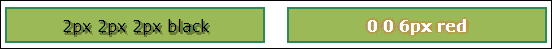

# 行动时间——行动中的风格

让我们在任务列表应用中充分利用`border-radius`和`box-shadow`效果。首先，我们将任务列表放在页面中央。然后我们将在每个任务周围放置一个带有圆角和阴影的方框。让我们打开`taskAtHand.css`进行一些修改。您可以在`chapter2/example2.1`中找到该部分的代码。

首先，我们将更改包含`task-name`文本域和任务列表的`<div id="main">`元素的样式。让我们给这个部分一个最小宽度`9em`和一个最大宽度`25em`。我们不希望任务列表变得太宽或太小，以至于不容易阅读。这将给我们一个反应式布局的开端。我们还将上下页边距设置为`1em`，左右页边距设置为`auto`，使其在页面上居中。

### 注

反应式布局是一种通过调整布局以适应显示设备而对环境做出反应的布局。通过使用反应式布局，您可以确保您的应用在从电话到桌面的任何设备上都能正常工作并看起来不错。

```html
#main
{
    max-width: 25em;
    min-width: 9em;
    margin: 1em auto;
}
```

我们还想通过将其`width`属性设置为`98%`来更改`task-name`文本输入字段，以占据主要部分的整个宽度。这将为文本框的边框留出一点回旋的空间；`100%`会让它在接缝处爆裂:

```html
#task-name
{
    font-size: 1em;
    display: block;
    width: 98%;
}
```

现在让我们来处理`task-list`项。我们会给他们一个背景色，圆角和阴影。我们将使阴影变黑，并给它一些透明度，以便背景颜色显示通过。我们还会将`position`属性设置为`relative`，这样我们就可以将任务按钮放在里面了(见下一张截图):

```html
#task-list .task
{
    position: relative;
    list-style: none;
    padding: 0.25em;
    margin: 0.25em;
    background-color: beige;
    border-radius: 4px;
    box-shadow: 2px 2px 3px rgba(0, 0, 0, 0.6);
}
```

让我们也在任务按钮周围添加一个边框来对它们进行分组，并使用绝对定位将它们移动到`task`元素的右上角。我们也可以把它放在这里，但是绝对定位让我们有更多的控制权:

```html
#task-list .task .tools
{
    position: absolute;
    top: 0.25em;
    right: 0.25em;
    border: 1px solid black;
    border-radius: 2px;
}
```

### 注

使用绝对定位时，元素相对于最接近的父元素定位。在这种情况下，那将是`task`元素。这就是为什么我们将其`position`属性设置为`relative`。

## *刚刚发生了什么？*

如果您在浏览器中查看应用，您会注意到我们的任务列表看起来是多么自然。阴影真正使任务项从页面中弹出，并赋予它们深度。这使他们成为应用的明星。通过将任务按钮移至右侧，我们真正让任务名称脱颖而出:

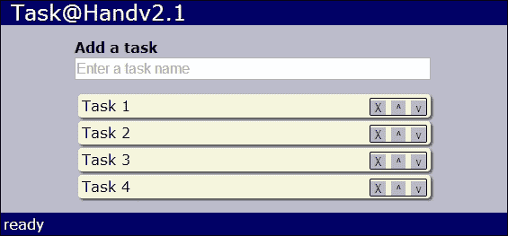

调整浏览器窗口的大小，看看列表的反应。这是同样的布局，大小调整得更小，就像您在手机或其他移动设备上看到的一样:

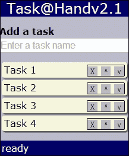

# 背景

有许多新的样式用于设置元素的背景样式。现在，您无需使用图像即可轻松绘制渐变。您可以更改背景图像的大小和来源，甚至可以在背景中使用多个图像。

渐变为从一种颜色渐变为一种或多种其他颜色的元素绘制背景。它们给你的页面增加了深度，并增加了更自然的外观。可以在 CSS3 中指定两种不同类型的渐变:**线性**和**径向**。线性梯度是线性的。它们以直线从一种颜色流向另一种颜色。径向梯度以径向方式从中心点展开。

## 线性梯度

线性梯度是使用`background`属性上的`linear-gradient`说明符定义的。对于最简单的形式，您可以使用我们之前在颜色部分讨论的任何`color`说明符来指定开始和结束颜色，它将从元素的顶部到底部绘制渐变。以下内容由红变蓝:

```html
background: linear-gradient(#FF0000, #0000FF);
```

尽管目前几乎所有浏览器都支持渐变，但您仍然必须使用浏览器特定的前缀才能使它们工作。这意味着指定它们至少四次才能命中大多数浏览器。请记住总是最后指定非专有版本，如下面的 CSS 片段所示，这样它将在可用时覆盖浏览器特定的版本:

```html
background: -webkit-linear-gradient(#FF0000, #0000FF);
background: -moz-linear-gradient(#FF0000, #0000FF);
background: -ms-linear-gradient(#FF0000, #0000FF);
background: linear-gradient(#FF0000, #0000FF);
```

如果希望渐变从顶部以外的某个位置开始，可以指定第一个参数，该参数可以是要开始的边的名称，也可以是要旋转的边的数量。边是`top`、`bottom`、`left`、`right`。您可以指定从`-360deg`到`360deg`的度数，或者从`-6.28rad`到`6.28rad`的弧度。`0`同`left`。正数逆时针旋转，负数顺时针旋转。下图绘制了从`left`到`right`的渐变:

```html
background: linear-gradient(left, #FF0000, #0000FF);
```

下面画一个`45`度的渐变，从左下角开始:

```html
background: linear-gradient(45deg, #FF0000, #0000FF);
```

如果您愿意，也可以添加两个以上的色标。下面以从红到蓝到绿的`45`度角绘制一个渐变:

```html
background: linear-gradient(45deg, #FF0000, #0000FF, #00FF00);
```

下面是这些代码片段的显示方式:

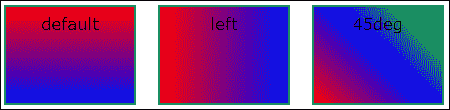

## 径向梯度

径向梯度与它们使用的参数中的线性梯度几乎相同。默认情况下，从元素的中心到边缘绘制渐变:

```html
background: radial-gradient(#FF0000, #0000FF);
```

您也可以使用一个预定义的位置或从左上角开始的偏移点为渐变中心指定一个位置，如`linear-gradient`:

```html
background: radial-gradient(top, #FF0000, #0000FF);
```

下面绘制的渐变中心位于上方`20`像素和下方`20`像素处:

```html
background: radial-gradient(20px 20px, #FF0000, #0000FF);
```

您也可以为径向渐变添加两个以上的颜色停止点。以下绘制渐变，中心位于从红色到蓝色再到绿色的`20`像素上方和`20`像素下方:

```html
background: radial-gradient(20px 20px, #FF0000, #0000FF, #00FF00);
```

下面是这些代码片段的显示方式:


你可以为渐变指定更多的设置来实现一些有趣的效果，但是它们超出了本书的范围。如果你发现创建自己的渐变太难，你可以在[http://www.colorzilla.com/gradient-editor/](http://www.colorzilla.com/gradient-editor/)找到一个优秀的渐变生成器。

## 背景图像

您可以将背景图像的大小设置为固定的像素量或元素面积的百分比。图像将被缩放以适合指定的区域。`background-size`属性采用两个值:水平尺寸和垂直尺寸。如果希望背景图像填充元素的整个背景，可以使用以下方法:

```html
background-size: 100% 100%;
```

您可以通过用逗号分隔来指定多个背景图像。列表中的第一个图像将绘制在顶部，最后一个图像将绘制在底部。下面绘制了两个背景图像:

```html
background: url(bg-front.png),
            url(bg-back.png);
```

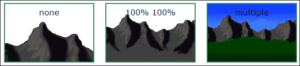

还有一个新的`background-origin`属性，确定背景图像绘制的位置。可能的值如下:

*   `content-box`:仅在元素的内容区域绘制背景图像
*   `padding-box`:将背景图像绘制到元素的填充区域
*   `border-box`:将背景图像一直绘制到元素的边界

这里有一个例子:

```html
background-origin: content-box;
```

这是输出:

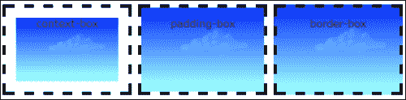

## CSS spreads

接下来我们要讨论的概念是 CSS 精灵。这种技术对 CSS3 来说并不陌生，但是在编写 HTML5 应用时知道如何使用是很重要的。CSS 精灵允许您将应用的所有图像放在一个图像文件中，然后使用 CSS 将各个图像分割成元素。这种技术节省了下载多个映像所需的时间和网络资源。如果您的应用有很多小图像，这尤其有用。

要实现 CSS 精灵，把你所有的图像放入一个单一的图像文件，称为**精灵表** 。然后按照以下步骤将 sprite 表中的图像放入页面的元素中:

1.  使元素与您想要显示的图像大小相同。
2.  将元素的背景图像设置为子画面图像。
3.  调整子画面工作表的背景位置，使您想要查看的图像位于元素的左上角。

我们来看一个例子。下面的精灵表有 16 张图片，每张图片宽 10 像素，高 10 像素。首先，我们将元素的`width`和`height`属性设置为`10`像素。接下来，我们将背景图像设置为`sprite-sheet.png`精灵表。如果我们现在停下来，我们只会看到元素中的第一个图像。

但是我们想展示元素中的第七个图像。所以我们需要将 sprite 表的背景位置向左偏移 20 像素，向上偏移 10 像素。您必须使用负偏移来获得正确的图像位置，因为您移动的是背景图像，而不是元素:

```html
#seven
{
    Width: 10px;
    height: 10px;
    background-image: url(sprite-sheet.png);
    background-position: -20px -10px;
}
```

结果如下:

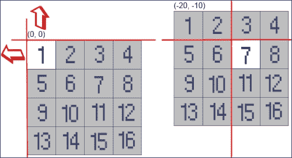

### 注

把它想象成在网页上切一个洞，然后在它后面滑动一张精灵纸，直到正确的图像通过这个洞显示出来。

# 行动时间-添加渐变和按钮图像

让我们使用我们所学的关于渐变和背景图像，使我们的应用看起来更有趣。首先，我们将在任务列表应用的背景中添加一个渐变。我们将为`<div id="app">`元素添加线性渐变。它将从顶部我们以前的背景色开始，并在底部逐渐变成深蓝色。请注意，我们如何保留旧的背景颜色作为不支持渐变的浏览器的后备颜色:

```html
#app
{
    margin: 4px;
    background-color: #bbc;
    background: -webkit-linear-gradient(top, #bbc, #558);
    background: -moz-linear-gradient(top, #bbc, #558);
    background: -ms-linear-gradient(top, #bbc, #558);
    background: linear-gradient(top, #bbc, #558);
}
```

它看起来是这样的:


现在让我们使用 CSS 精灵在我们的任务列表应用中的按钮上添加图像。我们需要删除、上移和下移的图像。我们的按钮将是 16x16 像素，所以我们的图像将需要相同的大小。由于我们有三个图像，我们将创建一个 48 像素宽，16 像素高的精灵表。我们将把名为`icons.png`的精灵表图像文件放入`images`文件夹。


现在让我们打开`taskAtHand.css`并添加样式，将图像从精灵表中取出并放入按钮中。首先，我们将更改应用于所有任务按钮的样式，将尺寸设置为 16x16 像素，并将背景图像设置为我们的精灵表。这样，我们只需指定一次 sprite 工作表图像，它将应用于我们的所有按钮:

```html
#task-list .task .tools button
{
    margin: 0;
    padding: 0;
    border: none;
    color: transparent;
 width: 16px;
 height: 16px;
 background: url(img/icons.png);
}
```

现在我们所有的按钮都将使用`icons.png`作为背景。我们现在要做的就是设置每个按钮的背景位置，使它们与正确的图像对齐:

```html
#task-list .task .tools button.delete
{
    background-position: 0 0;
}
#task-list .task .tools button.move-up
{
    background-position: -16px 0;
}
#task-list .task .tools button.move-down
{
    background-position: -32px 0;
}
```

## *刚刚发生了什么？*

现在看看浏览器中的应用。我们添加了一个渐变，所以它不再那么单调和平坦。现在它看起来既现代又别致。我们使用 CSS 精灵将图像添加到按钮中，以从一个精灵表图像中提取图像。用真正的图标做按钮看起来不是更好吗？


# 过渡

我们现在有了一个非常好看的用户界面，但是我们可以通过一些转换使它变得更好。CSS3 过渡当元素的样式改变时，给元素添加动画效果。例如，如果我们改变一个元素的大小，它将逐渐从较小的大小变为较大的大小，从而为用户提供视觉反馈。当事情逐渐发生变化时，它比突然出现在页面上的东西更能吸引我们的眼球。

CSS3 `transition`属性允许我们在元素上指定过渡。它具有以下格式:

```html
transition: property duration timing-function delay
```

以下是参数的说明:

*   `property`:要添加过渡的 CSS 属性。比如`width`或者`color`。使用`all`将过渡应用到所有属性。
*   `duration`:过渡所花费的时间长度。例如，`0.5s`需要半秒钟完成过渡。
*   `timing-function`:确定过渡在持续时间内如何进行:
    *   `linear`:从头到尾速度相同
    *   `ease`:开始缓慢，然后加速，然后缓慢结束
    *   `ease-in`:先慢后快
    *   `ease-out`:起步快，然后慢下来
    *   `ease-in-out`:先放松后放松
    *   `cubic-bezier()`:如果不喜欢预定义的功能，可以自己建
*   `delay`:开始过渡前等待的时间量。

`cubic-bezier`功能从`0`到`1`取四个参数。以下产生与`ease`功能相同的效果:

```html
transition: all 1s cubic-bezier(0.25, 0.1, 0.25, 1);
```

建立自己的`cubic-bezier`功能不是大多数人头脑中能做的事情。如果您想探索创建自己的计时功能，请查看[http://cubic-bezier.com/](http://cubic-bezier.com/)。

像渐变一样，过渡被广泛支持，但是在声明时仍然应该使用浏览器特定的前缀:

```html
-webkit-transition: all 1s ease;
-moz-transition: all 1s ease;
-o-transition: all  1s ease;
transition: all 1s ease;
```

应用过渡最简单的方法是结合 CSS `hover`选择器。当用户在元素上移动鼠标时，以下内容将在四分之一秒内使元素的背景颜色从白色渐变为蓝色:

```html
#some-element
{
    background-color: White;
    transition: all 0.25s ease;
}
#some-element:hover
{
    background-color: Blue;
}
```

# 变换

CSS3 变换提供更复杂的效果。有 2D 和 3D 变换可用。我们将在这里讨论一些 2D 变换。变换可以与过渡一起使用，以提供一些有趣的效果。以下是`transform`属性的基本形式:

```html
transform: function();
```

有几个不同的 2D `transform`功能。首先我们要看的是 `translate()`。将元素从当前位置移动到新位置。它以 x 和 y 位置为参数。您可以使用负值向上和向左移动。下面将向右移动一个元素`10`像素，向上移动`25`像素:

```html
transform: translate(10px, -25px);
```

`rotate()`功能将元素旋转给定量。旋转量可以用度数或弧度来指定。使用负值逆时针旋转，正值代表顺时针旋转:

```html
transform: rotate(45deg);
```

`scale()`功能通过某种因素调整元素的大小。它需要一两个参数。如果只提供了一个参数，则按该数量进行缩放。如果指定了两个参数，它会分别缩放水平轴和垂直轴。以下示例将元素的宽度加倍，高度减半:

```html
transform: scale(2, 0.5);
```

最后一个我们要看的是 `skew()`功能。此函数倾斜或拉伸元素。它需要两个参数，即 x 轴和 y 轴的旋转量。角度的指定与`rotate()`功能相同:

```html
transform: skew(45deg, 10deg);
```

转换还需要特定于浏览器的前缀:

```html
-webkit-transform: rotate(45deg);
-moz-transform: rotate(45deg);
-o-transform: rotate(45deg);
-ms-transform: rotate(45deg);
transform: rotate(45deg);
```

以下是转换在浏览器中的样子:

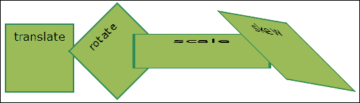

# 行动时间——行动中的效果

让我们给任务列表增加一些效果。首先，我们将在列表中添加选择任务的功能。当一个任务被点击时，它会变大，并有一个彩色的边框，所以很容易判断它被选中了。我们还将为任务添加悬停效果，以便当用户将鼠标移动到任务上时，显示任务的操作按钮。当鼠标离开任务时，按钮将淡出。您可以在`chapter2/example2.2`中找到该部分的代码。

我们需要做的第一件事是回到`taskAtHand.js`，在`addTaskElement()`方法中创建`task`元素后，为其添加一个`click`事件处理程序:

```html
$task.click(function() { onSelectTask($task); });
```

当点击一个任务时，它调用`onSelectTask()`方法。在这个方法中，我们将通过给一个`selected`的类名来标记一个`task`元素为选中。我们还将从先前选择的任务元素中移除`selected`类:

```html
function onSelectTask($task)
{
    if ($task)
    {
        // Unselect other tasks
        $task.siblings(".selected").removeClass("selected");
        // Select this task
        $task.addClass("selected");
    }
}
```

现在让我们为所选任务在`taskAtHand.css`中添加一个样式。我们将增加填充以使元素更大，添加边框以突出显示它，并更改背景颜色:

```html
#task-list .task.selected
{
    padding: 0.6em 0.5em;
    border: 2px solid orange;
    border-radius: 6px;
    background-color: white;
}
```

这很好，但是我们可以通过添加过渡来使它变得更好。我们将把`transition`属性添加到`.task`类中。它将在四分之一秒内缓解所有财产变化。这将在用户选择任务时为他们提供一些不错的视觉反馈:

```html
#task-list .task
{
    /* Not shown... */
    -webkit-transition: all 0.25s ease;
    -moz-transition: all 0.25s ease;
    -o-transition: all 0.25s ease;
    transition: all 0.25s ease;
}
```

在此过程中，让我们再添加一个过渡。我们将隐藏任务操作按钮，直到用户在任务上移动鼠标或选择任务。要做到这一点，我们所需要做的就是增加一点 CSS。首先，我们将通过将其`opacity`属性设置为`0`来隐藏任务按钮的容器元素，以使其透明。然后我们添加与之前相同的`transition`属性:

```html
#task-list .task .tools
{
    position: absolute;
    top: 0.25em;
    right: 0.25em;
    border: 1px solid black;
    border-radius: 2px;
 opacity: 0;

 -webkit-transition: all 0.25s ease;
 -moz-transition: all 0.25s ease;
 -o-transition: all 0.25s ease;
 transition: all 0.25s ease;
}
```

现在我们为`task`元素添加一个`hover`选择器，将`opacity`属性设置为`1`，使其不透明。当用户将鼠标悬停在任务上时，这将与过渡一起使任务按钮看起来逐渐变淡。我们还添加了一个选择器，以便在选择任务时显示任务按钮(以下代码片段中的第二行):

```html
#task-list .task:hover .tools,
#task-list .task.selected .tools
{
    opacity: 1;
}
```

在 CSS3 之前，您可以使用 jQuery `fadeIn()`和`fadeOut()`方法以及一些鼠标事件对 JavaScript 做同样的事情，但是它需要相当多的代码。

## *刚刚发生了什么？*

我们在任务列表中添加了一些 CSS3 过渡，使任务项按钮淡入淡出，并使选定的任务项在单击时变大。我们已经看到，只需几行 CSS，我们就可以为我们的应用添加一些不错的效果。选择**任务 2** 后，我们的任务列表如下:

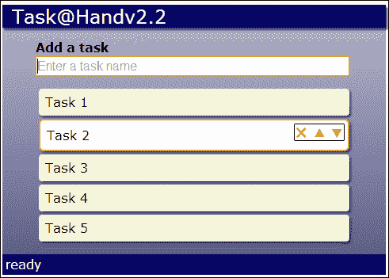

# 动态样式表

让我们在应用中添加一个新的功能，允许用户选择配色方案或主题，这样他们就可以自定义应用的外观和感觉。我们可以通过动态加载 CSS 文件来覆盖默认样式表中的现有样式，从而改变网页的外观。为了实现这一点，我们将向我们的应用添加一个主题下拉列表，用户可以从中进行选择。当他们改变主题时，它将改变样式表，样式表将改变页面的颜色。

# 行动时间-添加主题选择器

首先，我们需要一个放置主题选择器的地方。因此，让我们在`taskAtHand.html`中为任务列表应用的标记添加一个工具栏。我们将把它插入到`<header>`和`<div id="main">`元素之间。工具栏将包含一个`<label>`和一个`<select>`下拉列表。该列表将包含四种不同的颜色主题:`blue`、`green`、`magenta`和`red`。您可以在`chapter2/example2.3`中找到该部分的代码:

```html
<div id="app">
  <header>Task@Hand</header>
 <div id="toolbar">
 <label for="theme">Theme</label>
 <select id="theme" title="Select theme">
 <option value="blue">Blue</option>
 <option value="green">Green</option>

 <option value="magenta">Magenta</option>
 <option value="red">Red</option>
 </select>
 </div>
  <div id="main">
```

现在让我们设计一下工具栏。我们将使字体比页面的其余部分小一点，并将背景颜色设置为黑色，并带有一些透明度，这样它后面的颜色就会渗出:

```html
#toolbar
{
    padding: 0.25em;
    font-size: 0.8em;
    color: WhiteSmoke;
    background-color: rgba(0, 0, 0, 0.4);
}
```

接下来，我们必须实现不同的主题。所以让我们创建几个新的 CSS 文件，每个主题一个。我们将把它们放在一个名为`themes`的文件夹中，以便将它们组合在一起。CSS 文件将具有与`<option>`值相同的名称:`blue.css`、`green.css`、`magenta.css`和`red.css`。我们来看看`green.css`:

```html
#app
{
    background-color: #bcb;
    background: -webkit-linear-gradient(top, #bcb, #585);
    background: -moz-linear-gradient(top, #bcb, #585);
    background: -ms-linear-gradient(top, #bcb, #585);
    background: linear-gradient(top, #bcb, #585);
}
#app>header,
#app>footer
{
    background-color: #060;
}
```

从顶部开始，我们覆盖`app`元素的背景渐变，使其成为绿色，而不是蓝色。我们还改变了`header`和`footer`元素，使它们也变成绿色。除了颜色不同之外，其他的 CSS 文件都会和这个完全一样。

现在让我们为主题 CSS 文件的 HTML 文件的`<header>`元素添加一个样式表`<link>`元素。由于蓝色主题是默认的，我们将它设置为加载`blue.css`:

```html
<link href="taskAtHand.css" rel="StyleSheet" />
<link id="theme-style" href="themes/blue.css" rel="StyleSheet" />

```

请注意，我们在基本样式表之后包含了主题样式表。这将允许我们覆盖默认样式。还要注意的是，我们给了`<link>`元素一个`ID`属性，所以我们稍后可以在我们的 JavaScript 中找到它。

我们需要添加的其余代码在`taskAtHand.js`中。首先，我们将在`TaskAtHand.start()`方法中为主题选择器添加一个`change`事件处理程序:

```html
$("#theme").change(onChangeTheme);
```

当用户选择新的主题时，会调用 `onChangeTheme()`私有方法:

```html
function onChangeTheme()
{
    var theme = $("#theme>option").filter(":selected").val();
    setTheme(theme);
    appStorage.setValue("theme", theme);
}
```

该方法通过获取其`<option>`元素，然后使用`filter()`方法内的 jQuery 的`:selected`选择器找到所选选项，从而从列表中获取所选选项。然后它调用`setTheme()`方法，我们接下来会实现。最后，我们将选定的主题保存到`localStorage`中，以便下次用户返回应用时可以进行设置。

`setTheme()`方法以主题名称为参数。它获取`<link id="theme-style">`元素，并将其`href`属性更改为新样式表的网址:

```html
function setTheme(theme)
{
    $("#theme-style").attr("href", "themes/" + theme + ".css");
}
```

当这种情况发生时，页面将加载新的样式表，并将其样式应用于现有的样式表。就这样，页面改变了颜色。

等等，我们还没完。还记得我们是如何将主题保存到`localStorage`的吗？现在，当用户返回我们的应用时，我们必须把它取出来。我们将创建一个`loadTheme()`方法来做到这一点:

```html
function loadTheme()
{
    var theme = appStorage.getValue("theme");
    if (theme)
    {
        setTheme(theme);
        $("#theme>option[value=" + theme + "]")
            .attr("selected","selected");
    }
}
```

该方法从`localStorage`获取主题名称。如果找到一个，调用`setTheme()`到设置。然后通过在列表中找到以主题名称作为值的`<option>`来选择下拉列表中的主题，并在其上设置`selected`属性。最后要做的是从`start()`方法添加对`loadTheme()`的调用，我们就完成了。

### 注

我们主题的样式更改非常简单，但是您可以使用这种技术完全改变应用的外观。

## *刚刚发生了什么？*

我们添加了一个主题选择器来改变主题样式表，这使得页面使用不同的颜色来绘制背景。我们将选定的主题保存到本地存储中，以便在用户返回应用时记住设置。

# 填充窗口

在我们离开 CSS 这一章之前，还有一件事我们要重新设计。让我们制作这个应用，让它填满窗口的整个空间。现在随着列表的增长，背景渐变变大，页脚下移。如果渐变覆盖整个窗口，页脚总是在底部，那就更好了。

# 行动时间-扩展应用

我们可以使用绝对定位来填充浏览器窗口。让我们将以下内容添加到`<div id="app">`元素的样式中:

```html
#app
{
 position: absolute;
 top: 0;
 bottom: 0;
 left: 0;
 right: 0;
 overflow: auto;
    /* Code not shown… */
}
```

首先，它将元素的位置设置为绝对，这样我们就可以将元素的位置设置为我们想要的任何位置。然后我们将所有`position`属性设置为`0`。这会拉伸元素，使其填充窗口的整个空间。最后，我们将`overflow`属性设置为`auto`。这将使滚动条出现，如果任务列表超出窗口高度，渐变将延伸到窗口底部之下。

我们还需要重新定位页脚，使它粘在窗口的底部。我们也可以这样做，将`position`设置为`absolute`，将`bottom`设置为`0`。请注意，我们没有将`right`设置为`0`，因此页脚不会跨越整个宽度。否则，它可能会干扰任务列表:

```html
#app>footer
{
    position: absolute;
    bottom: 0;
    /* Code not shown… */
}
```

## *刚刚发生了什么？*

我们扩展了主应用元素，占据了浏览器窗口的整个空间，并将页脚移到了底部。让我们看看我们的应用现在在浏览器中的外观:

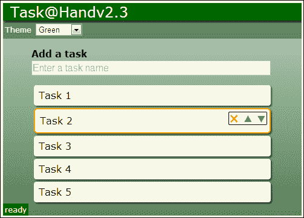

## 加油英雄

想出并实施更多的主题。多使用一些我们学过的 CSS3 特性，比如径向渐变，背景图像，甚至一些方块阴影，来产生一些看起来很有趣的主题。

## 突击测验

Q1。一个渐变可以有几个色点？

1.  一个
2.  二
3.  三
4.  任何数字

Q2。过渡是做什么的？

1.  将 CSS 属性从一个值转换为另一个值
2.  将元素从一种类型转换为另一种类型
3.  从一个类别过渡到另一个类别
4.  从一个视图过渡到另一个视图

# 总结

在这一章中，我们了解了一些新的 CSS3 特性，这些特性可以用来使您的应用弹出，并为用户提供大量的视觉反馈。我们更新了我们的 tasklist 应用，为任务元素添加圆角和阴影，并为任务工具按钮添加图像。我们为背景添加了一个渐变和一个主题选择器，以允许用户更改配色方案。我们还添加了一些过渡，使更改看起来更加自然。

我们在本章中介绍了以下概念。

*   如何在 CSS3 中用透明度定义颜色
*   如何给元素圆角
*   如何给元素和文本添加阴影
*   如何创建线性和径向渐变
*   如何使用 CSS3 过渡和变换来创建视觉效果
*   如何使用 CSS 精灵来减少应用的网络占用空间
*   如何动态加载样式表
*   如何让应用填满整个窗口

在我们继续之前最后一件事。让我给你留下一句警告。仅仅因为 CSS3 有所有这些伟大的效果，并不意味着你必须在你的应用中使用它们。每个文本都不需要阴影，不需要让你的背景有彩虹色的渐变，每个元素都不需要旋转 30 度。明智地使用这些效果将使您的应用看起来专业；过度使用会让它们看起来很滑稽。

在下一章中，我们将通过为每个使用一些新的 HTML5 输入类型的任务添加一个细节部分，将我们的任务列表应用带到下一个层次。我们还将学习如何使用自定义数据属性将数据模型绑定到输入元素。