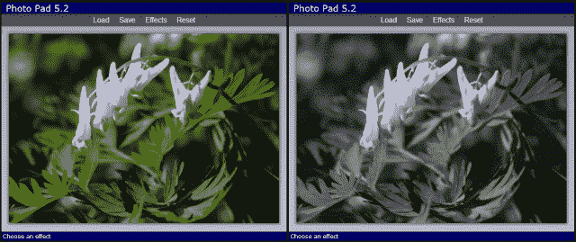
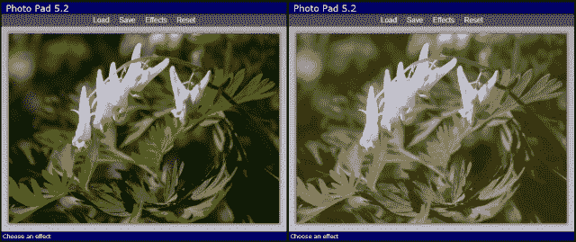

# 五、不那么空白的画布

> “这个世界只是我们想象的画布。”
> 
> 亨利·大卫·梭罗

*在上一章中，我们学习了使用 HTML5 画布的基础知识。我们创建了一个名为 Canvas Pad 的绘图应用，使用工具绘制各种不同颜色和大小的线条和形状。在这一章中，我们将通过扩展 Canvas Pad 来添加更多工具，从而继续探索 Canvas API。然后我们将创建一个名为“照片板”的新应用，在这里我们将了解如何使用文件应用编程接口加载图像，并通过访问和修改画布的单个像素来执行图像处理。*

在本章中，我们将学习:

*   如何获取文本输入并将其绘制到画布上
*   如何使用画布应用编程接口转换函数来更改项目在画布上的绘制方式
*   如何导出画布图像以保存它
*   如何使用 HTML5 文件 API 加载图像
*   如何将位图图像绘制到画布上
*   如何获取画布中每个像素的数据，对其进行操作，并将其放回原处

# 绘制文字

有两种方法可以在画布上绘制文本:`strokeText()`和`fillText()`。`strokeText()`使用当前的`lineWidth`和`strokeStyle`绘制轮廓文本，而`fillText()`使用当前的`fillStyle`绘制。两者采用相同的参数；要绘制的文本以及 x 和 y 坐标。上下文对象有一个全局字体属性来定义使用哪个`font`。您可以像在 CSS 中定义字体一样设置它的值。继续我们在上一章中使用画布板应用的地方，我们将添加一个新的文本绘制工具。你可以在`Chapter 5/example5.1`找到这部分的源代码。

# 行动时间-添加文本工具

让我们从在文本工具的工具下拉菜单中添加一个新项目开始:

```html
<li data-value="text">Text</li>
```

接下来，我们将向`Canvas2D`对象添加一个`drawText()`方法。它将包含要绘制的文本、绘制文本的起点以及一个布尔值，该值指示是填充文本还是仅勾勒文本。如果`fill`为`true`，则使用`fillText()`绘制文字，否则使用`strokeText()`:

```html
this.drawText = function(text, point, fill)
{
    if (fill)
    {
        context.fillText(text, point.x, point.y);
    }
    else
    {
        context.strokeText(text, point.x, point.y);
    }
};
```

现在，我们需要一种方法来允许用户输入他/她想要绘制的文本。我们将需要一个文本输入字段，我们将保持隐藏，直到用户想要添加一些文本。当用户选择文本工具并点击画布时，我们会将文本字段定位在他/她点击的位置，等待他/她输入文本。当用户按下*进入*键时，我们将隐藏文本字段并将文本绘制到画布上。

为了让用户看起来像是在画布上打字，我们需要在画布上下文中为字体设置更多的属性。我们将在构造函数中设置`font`和`textBaseline`属性。基线告诉上下文相对于位置在哪里绘制文本。我们将它设置为`"top"`，这样它将在 y 位置绘制文本的顶部，这也是我们文本字段的位置。其他常见的基线值是`"bottom"`和`"middle"`:

```html
context.font = "24px Verdana, Geneva, sans-serif";
context.textBaseline = "top";
```

现在我们需要一个文本字段供用户输入文本。让我们将其添加到 HTML 文件的底部，在页脚元素之后:

```html
<div id="text-input">
    <input type="text" />
</div>
```

接下来让我们进入 CSS 并定义 `text-input`元素的样式。我们将`display`设置为`none`、使其隐藏，将`position`设置为`absolute`，这样我们就可以在页面上任意定位它。我们还会将字体大小更改为 24 像素，因为这是我们在上下文中设置的字体大小:

```html
#text-input
{
    display: none;
    position: absolute;
    width: 8em; 
}
#text-input>input
{
    font-size: 24px;
}
```

现在让我们给`CanvasPadApp`中的`penDown()`方法添加一些 JavaScript 代码，这样当用户单击鼠标时，它会显示文本输入字段:

```html
function penDown(pageX, pageY)
{
    if (curTool == "text")
 {
 // Check if it's already visible
 if ($("#text-input").is(":visible")) return;
 showTextInput(pageX, pageY);
 }
    else
    {
        drawing = true;
    }

    // code not shown...
}
```

首先，它检查当前工具。如果是文本工具，它会检查文本字段是否已经可见，如果是，则没有必要继续。否则调用`showTextInput()`传入鼠标坐标。请注意，在这种情况下，我们没有将`drawing`设置为`true`，因为我们不需要跟踪鼠标。

`showTextInput()`方法获取鼠标坐标并将`text-input`元素移动到用户在画布上单击鼠标的位置:

```html
function showTextInput(pageX, pageY)
{
    $("#text-input").css("top", pageY)
                    .css("left", pageX)
                    .fadeIn("fast");
    $("#text-input input").val("").focus();
}
```

首先我们设置`top`和`left` CSS 属性，将元素移到用户点击的位置，然后淡入。然后，它重置文本字段的值，并将焦点设置在该字段上，以便用户可以开始键入。这将使用户看起来像是在画布上打字。

当用户完成键入后，他/她可以按下*进入*键来完成文本。我们需要在文本字段中添加一个`keydown`事件处理程序来检查这一点。我们将在`start()`方法中补充说明:

```html
$("#text-input input").keydown(function(e) { 
    checkTextInput(e.which);
});
```

处理程序调用`checkTextInput()`，传入被按下的键的键码。关键代码位于事件对象的`which`字段:

```html
function checkTextInput(key)
{
    if (key == 13) // Enter key
    {
        curAction.text =  $("#text-input input").val();
        $("#text-input").hide();
        redraw();
    }
    else if (key == 27) // Escape
    {
        actions.pop();
        $("#text-input").hide();
    }
}
```

`checkTextInput()`方法查看关键代码，看看该怎么做。如果用户按下*进入*键，即键码 13，会将文本设置为当前动作对象，隐藏文本输入，然后调用`redraw()`。如果键码是 27，也就是 *Escape* 键，它会通过移除动作然后隐藏文本输入来取消文本。

最后要实现的是对 `redraw()`的修改。我们需要将文本动作添加到我们的`switch`语句中。它传递文本、绘制位置以及是否填充:

```html
switch (action.tool)
{
    // code not shown...
    case "text":
 canvas2d.drawText(action.text, action.points[0],
 action.fill);
 break;
}
```

## *刚刚发生了什么？*

我们在应用中添加了一个文本工具，允许用户在画布上键入文本，并绘制填充或轮廓。

## 加油英雄

尝试添加工具栏菜单，供用户选择不同的字体大小。您需要更改画布上下文中的字体大小以及文本输入栏的样式。

# 转换

画布应用编程接口包含四种方法来转换事物在画布上的绘制方式。他们改变画布的坐标系，这样当你画东西的时候，它会在不同的地方画。把它想象成拿一张纸，在上面画画之前移动或旋转它。

*   `translate(x, y)`:这个按照指定的值翻译画布上绘制的任何东西。这些值可以是任何十进制数。负数向左上方平移。通常，在对形状应用其他变换之前，您会使用`translate()`平移到形状的中心。
*   `scale(x, y)`:这个按照指定的值缩放任何绘制到画布上的东西。参数可以是任何正十进制数。如果你想所有的东西都画成一半大小，你可以使用比例(0.5，0.5)。如果你想放大一倍，缩放(2，2)。
*   `rotate(angle)`:这个将画布旋转一个角度。角度以弧度表示，从 0 到 2π。负数将逆时针旋转。
*   `transform(a, b, c, d, e, f)`:如果其他的转化方法都不适合你，你可以用`transform()`自己创造。除非你知道如何使用变换矩阵，否则我不会推荐它。

# 动作时间–添加椭圆工具

让我们使用一些变换在画布板中绘制一个椭圆。椭圆基本上是一个压扁的圆。我们可以使用`scale()`方法在画圆之前改变 x 轴或 y 轴的比例，将其挤压成椭圆。让我们给`Canvas2D`对象添加一个`drawEllipse()`方法。它需要一个中心点、一个端点和一个布尔值来确定是否应该填充:

```html
this.drawEllipse = function(center, endPoint, fill)
{
    var rx = Math.abs(endPoint.x - center.x);
    var ry = Math.abs(endPoint.y - center.y);
    var radius = Math.max(rx, ry);
    var scaleX = rx / radius;
    var scaleY = ry / radius;

    context.save();
    context.translate(center.x, center.y);
    context.scale(scaleX, scaleY);
    context.beginPath();
    context.arc(0, 0, radius, 0, Math.PI * 2, true);
    context.closePath();
    if (fill) context.fill();
    else context.stroke();
    context.restore();

    return this;
};
```

这里发生了很多事情，让我们把它分解一下:

1.  首先，我们通过计算端点和中心点坐标之间的距离，找到水平和垂直半径(rx 和 ry)。哪个最大，就是椭圆的半径。
2.  接下来，我们通过将半径除以最大半径来找到水平和垂直比例。由于其中一个半径是最大半径，因此该比例为 1。另一个比例将小于 1。
3.  接下来我们调用`save()`来保存上下文的状态，然后再开始转换。
4.  现在我们开始转变。首先我们平移到椭圆的中心，所以它会围绕形状的中心进行变换。然后我们按照之前计算的数量进行缩放。
5.  然后我们用`beginPath()`、`arc()`和`closePath()`画圆。因为画布是在一个轴上缩放的，所以圆将被挤压成一个椭圆。
6.  然后我们根据`fill`参数调用`fill()`或`stroke()`在画布上画圆。
7.  最后，我们调用`restore()`将上下文恢复到应用转换之前的样子，我们就完成了。

现在我们有了一个绘制椭圆的方法，我们可以在 HTML 的工具菜单中添加一个椭圆菜单项:

```html
<li data-value="ellipse">Ellipse</li>
```

剩下唯一要做的就是在`redraw()`的`switch`语句中为椭圆工具添加一个选项，我们就完成了:

```html
switch (action.tool)
{
    // code not shown...
    case "ellipse":
        canvas2d.drawEllipse(action.points[0], action.points[1], 
            action.fill);
        break;
}
```

## *刚刚发生了什么？*

我们在应用中添加了一个椭圆工具，并实现了一种在画布上使用变换来挤压一个轴上的圆来绘制椭圆的方法。

# 行动时间–导出图像

我们可以用 Canvas Pad 应用绘制图片，但是如果保存不了又有什么意义呢？由于存在安全风险，HTML5 不具备将文件直接保存到用户文件系统的能力。所以我们在客户端的选择非常有限。我们可以将数据保存到`localStorage`或者我们可以在新的浏览器窗口中打开图像，用户可以使用浏览器的**保存**选项保存图像。我们将做后者，因为它允许用户获得他们可以使用的真实图像文件。

您可以通过在画布元素本身(而不是上下文)上调用`toDataURL()`方法，从画布中获取图像数据作为网址。然后可以使用`window.open()`在另一个窗口打开图片网址。让我们在工具栏中添加一个**保存**按钮，并将`data-action`属性设置为`"save"`:

```html
<button data-action="save">Save</button>
```

接下来让我们在`toolbarButtonClicked()`方法的`switch`语句中添加一个动作检查。点击**保存**按钮，会得到数据网址，然后打开:

```html
switch (action.tool)
{
    // code not shown...
    case "save":
        var url = $("#main>canvas")[0].toDataURL();
        window.open(url, "CanvasPadImage");
        break;
}
```

## *刚刚发生了什么？*

现在，我们可以使用上下文的`toDataUrl()`方法从画布中导出图像，并在另一个浏览器窗口中打开它们，以便用户可以保存它们。


# 处理触摸事件

HTML5 的伟大之处之一是你可以编写一个应用，它将在许多不同的设备上工作。Canvas Pad 作为一个桌面应用非常好用，在这里可以使用鼠标事件。但是它在触摸屏设备上也同样有效。因此，让我们向应用添加对触摸事件的支持。

触摸事件类似于鼠标事件。一个区别是，用户可以用多个手指触摸屏幕，因此触摸事件可能包含多个点。因此，我们在处理这些问题时必须考虑到这一点。

浏览器支持三种基本的触摸事件。

*   `touchstart`:我们在用户触摸屏幕的时候得到这个事件。这相当于`mousedown`事件。
*   `touchmove`:当用户在屏幕上移动手指时，我们在`touchstart`之后获得这些事件。这相当于`mousemove`事件。
*   `touchend`:当用户将手指抬离屏幕时，我们得到这个事件。这相当于`mouseup`事件。

传递给事件处理程序的触摸事件对象包含一个名为`touches`的数组。这个数组包含所有被触摸的点。`touches`数组中的每个对象都有一个`pageX`和一个`pageY`字段，就像鼠标事件一样。

您可以通过检查文档元素是否有 `ontouchstart`方法来测试是否支持触摸事件:

```html
var touchSupported = "ontouchstart" in document.documentElement;
```

jQuery 不包括对触摸事件的支持，但是如果我们可以使用相同的 jQuery 机制向元素添加触摸事件处理程序，那就太好了。因此，让我们编写一个 jQuery 扩展来添加它。我们将创建一个名为`touchEvents.js`的新文件来放入我们的扩展名，这样我们就可以在其他应用中重用它。

# 行动时间–添加触摸事件处理程序

扩展 jQuery 库其实很容易。首先，我们将扩展包装在一个立即调用的函数表达式中，并将 jQuery 对象传递给它。这是确保美元符号真正映射到 jQuery 而不被其他东西使用的最佳实践。然后，我们通过将扩展方法添加到 jQuery 的内部`$.fn`对象来定义它们:

```html
(function($)
{
    $.fn.touchstart = function(handler)
    {
        this.each(function(i, e) { 
            e.addEventListener("touchstart", handler); });
        return this;
    };
    $.fn.touchmove = function(handler)
    {
        this.each(function(i, e) { 
            e.addEventListener("touchmove", handler); });
        return this;
    };

    $.fn.touchend = function(handler)
    {
        this.each(function(i, e) { 
            e.addEventListener("touchend", handler); });
        return this;
    };

    $.isTouchSupported =
        ("ontouchstart" in document.documentElement);
})(jQuery);
```

### 注

请注意，在扩展方法的上下文中，`this`指针指向包装所选元素的 jQuery 对象。因此`this.each()`迭代选择的每个元素。

`touchstart`、`touchmove`和`touchend`的方法都是一样的。他们迭代元素，并为每个元素调用`addEventListener()` 。

我们还直接在 jQuery 对象上定义了一个全局`isTouchSupported`变量。它使用前面描述的方法检查触摸支持。我们将使用它来确定我们是否应该在应用中使用触摸或鼠标事件。

### 注

您可以在 jQuery 网站([http://jquery.com](http://jquery.com))上了解更多关于编写 jQuery 扩展的信息。

我们的扩展完成了，所以让我们回到`CanvasPadApp`并将代码添加到我们的应用中来处理触摸事件。首先，在`start()`方法中，我们需要检查是否支持触摸，并连接正确的事件:

```html
if ($.isTouchSupported)
{
    $("#main>canvas").touchstart(onTouchStart)
        .touchmove(onTouchMove)
        .touchend(onTouchEnd);
}
else
{
    $("#main>canvas").mousedown(onMouseDown)
        .mousemove(onMouseMove)
        .mouseup(onMouseUp)
        .mouseout(onMouseUp);
}
```

`onTouchStart()`事件处理程序方法必须同时调用事件对象上的`stopPropagation()`和`preventDefault()`，以防止其执行默认行为。否则，它可能会尝试拖动屏幕，而不是在画布上绘制:

```html
function onTouchStart(e)
{
    e.stopPropagation();
    e.preventDefault();
    penDown(e.touches[0].pageX, e.touches[0].pageY);
}
```

接下来我们提取用户触摸的点。可能有多个点，但我们只对`touches`数组中的第一个点感兴趣。我们从中提取`pageX`和`pageY`场，并将其传递到`penDown()`方法中。

`onTouchMove()`处理器的工作方式相同，只是它调用`penMoved()`:

```html
function onTouchMove(e)
{
    e.stopPropagation();
    e.preventDefault();
    penMoved(e.touches[0].pageX, e.touches[0].pageY);
}
```

`onTouchEnd()`处理程序只是简单的调用`penUp()`，和`onMouseUp():`一样

```html
function onTouchEnd(e)
{
    penUp();
}
```

## *刚刚发生了什么？*

我们创建了一个可重用的 jQuery 扩展，将触摸事件添加到任何元素中，并为我们的应用添加了触摸支持。我们现在有一个绘图应用，可以用来在桌面和移动设备上绘图。

至此，我们的 Canvas Pad 应用已经完成，但是我们还没有完成对 Canvas 的学习。现在我们将进入下一个应用，照片板，在这里我们将了解一些更高级的画布功能和文件应用编程接口。

# 相片垫

我们要写的下一个应用叫做 Photo Pad。它看起来很像画布板，并为工具栏和菜单重用相同的代码。但它将不再是一个绘图应用，而是一个照片处理应用。用户将能够加载图像，并从一些不同的效果中进行选择，例如反转、黑白或棕褐色，以应用于图像。

# 行动时间-创建相册

让我们像往常一样，从开始，复制我们在[第 1 章](01.html "Chapter 1. The Task at Hand")、*手头的任务*中创建的应用模板，并将文件名重命名为`photoPad.html`、`photoPad.css`和`photoPad.js`。在 HTML 文件中，我们将添加一个带有加载、保存和效果按钮的工具栏。您可以在`Chapter 5/example5.2`中找到该部分的代码:

```html
<body>
    <div id="app">
        <header>Photo Pad </header>
        <div id="main">
            <div id="toolbar">
                <div class="dropdown-menu">
                    <button data-action="menu">Load</button>
                    <ul id="load-menu" data-option="file-picker"
                        class="file-picker menu">
                        <li data-value="file-picker">
                            <input type="file" />
                        </li>
                    </ul>
                </div>
                <button data-action="save">Save</button>
                <div class="dropdown-menu">
                    <button data-action="menu">Effects</button>
                    <ul data-option="applyEffect" class="menu">
                        <li data-value="invert">Invert</li>
                    </ul>
                </div>
            </div>
            <canvas width="0" height="0">
                Sorry, your browser doesn't support canvas.
            </canvas>
        </div>
        <footer>Click load to choose a file</footer>
    </div>
</body>
```

加载工具栏项目有一个下拉菜单，但它没有菜单项，而是有一个文件输入控件，用户可以在其中选择要加载的文件。“效果”项目有一个效果下拉菜单。现在我们只有一个，反转，但是我们稍后会添加更多。

对于我们的 CSS，我们将把我们在`canvasPad.css`中的所有内容复制到`photoPad.css`中，这样我们就可以得到工具栏和菜单的所有相同样式。我们也将使用`toolbar.js`中的`Toolbar`对象。

在我们的 JavaScript 文件中，我们将应用对象名称更改为`PhotoPadApp`。我们还需要`PhotoPadApp`中的几个变量。我们将把`canvas`变量设置为`<canvas>`元素，`context`变量设置为画布的上下文，并定义一个`$img`变量来保存我们将要显示的图像。这里我们使用 jQuery 将其初始化为一个新的``元素:

```html
function PhotoPadApp()
{
    var version = "5.2",
        canvas = $("#main>canvas")[0],
        context = canvas.getContext("2d"),
        $img = $("");
```

我们将实现的第一个工具栏动作是**保存**按钮，因为我们已经从画布板获得了该代码。我们检查`toolbarButtonClicked()`中的动作，看看是否是`"save"`，如果是，我们得到数据 URL，并在新的浏览器窗口中打开它:

```html
function toolbarButtonClicked(action)
{
    switch (action)
    {
        case "save":
            var url = canvas.toDataURL();
            window.open(url, "PhotoPadImage");
            break;
    }
}
```

## *刚刚发生了什么？*

我们为写字板应用创建了支架，其中包含加载、保存和效果工具栏项。我们实现保存功能的方式与我们对画布板的方式相同。

我们将实现的下一件事是加载下拉菜单，因为我们需要一个图像来操作。点击**加载**工具栏按钮，会显示下拉菜单，里面有我们之前定义的文件输入控件。所有这些都是免费的，因为它只是我们工具栏中的另一个下拉菜单。

但是在我们这样做之前，我们需要了解 HTML5 文件应用编程接口。

# 文件应用编程接口

我们可能无法将文件直接保存到用户的文件系统中，但是我们可以使用 HTML5 的文件应用编程接口来访问文件。文件应用编程接口允许您获取关于用户选择的文件的信息，并加载这些文件的内容。用户可以使用类型为`file`的输入元素来选择文件。加载文件的过程如下:

1.  用户使用`<input type="file">`元素选择一个或多个文件。
2.  我们从输入元素的`files`属性获得文件列表。该列表是包含文件对象的`FileList`对象。
3.  You can enumerate over the file list and access the files just like you would an array.

    `File`对象包含三个字段。

    *   `name`:这是文件名。它不包括路径信息。
    *   `size`:这是文件的大小，以字节为单位。
    *   `type`:这是 MIME 类型，如果可以确定的话。
4.  使用`FileReader`对象读取文件的数据。文件是异步加载的。文件被读取后，将调用`onload`事件处理程序。`FileReader`有许多读取文件的方法，这些方法采用`File`对象并返回文件内容。
    *   `readAsArrayBuffer()`:这个方法将文件内容读入一个`ArrayBuffer`对象。
    *   `readAsBinaryString()`:此方法将文件内容读入字符串作为二进制数据。
    *   `readAsText()`:此方法将文件内容读入字符串作为文本。
    *   `readAsDataURL()`:这个方法把文件内容读入一个数据 URL 字符串。您可以将此作为加载图像的网址。

# 动作时间–加载图像文件

让我们在应用的`start()`方法中添加一些代码来检查文件应用编程接口是否可用。您可以通过检查`File`和`FileReader`对象是否存在来确定浏览器是否支持文件应用编程接口:

```html
this.start = function()
{
    // code not shown...
    if (window.File && window.FileReader)
    {
        $("#load-menu input[type=file]").change(function(e) {
            onLoadFile($(this));
        });
    }
    else
    {
        loadImage("img/default.jpg");
    }
}
```

首先，我们检查`window`对象中的`File`和`FileReader`对象是否可用。如果是这样的话，我们为文件输入控件连接一个变更事件处理程序来调用传递到 jQuery 对象中的`<input>`元素的`onLoadFile()`方法。如果文件应用编程接口不可用，我们将通过调用`loadImage()`加载一个默认图像，我们将在稍后编写。

让我们实现 `onLoadFile()`事件处理程序方法:

```html
function onLoadFile($input)
{
    var file = $input[0].files[0];
    if (file.type.match("image.*"))
    {
        var reader = new FileReader();
        reader.onload = function() { loadImage(reader.result); };
        reader.readAsDataURL(file);        
    }
    else
    {
        alert("Not a valid image type: " + file.type);
        setStatus("Error loading image!");
    }
}
```

在这里，我们通过查看文件输入的`files`数组并获取第一个数组来获得选中的文件。接下来，我们检查文件类型，这是一个 MIME 类型，以确保它是一个图像。我们使用`String`对象的正则表达式`match()`方法来检查它是否以`"image"`开头。

如果是图像，我们创建`FileReader`对象的新实例。然后，我们设置`onload`事件处理程序来调用`loadImage()`方法，传入包含文件内容的`FileReader`对象的`result`字段。最后，我们调用`FileReader` 对象的`readAsDataURL()`方法，传入`File`对象开始异步加载文件。

如果不是图像文件，我们会显示一个带有错误信息的警告对话框，并通过调用`setStatus()`在页脚显示一条错误信息。

一旦文件被读取，将调用`loadImage()`方法。在这里，我们将使用从`FileReader`对象的`result`字段获得的数据网址将图像绘制到画布中:

```html
function loadImage(url)
{
    setStatus("Loading image");
    $img.attr("src", url);
    $img[0].onload = function()
    {
        // Here "this" is the image
        canvas.width = this.width;
        canvas.height = this.height;
        context.drawImage(this, 0, 0);
        setStatus("Choose an effect");
    }
    $img[0].onerror = function()
    {
        setStatus("Error loading image!");
    }
}
```

首先，我们将图像元素的`src`属性设置为文件加载后得到的数据 URL。这将导致图像元素加载新图像。

接下来，我们为图像定义`onload`事件处理程序，以便在加载图像时得到通知。请注意，当我们在`onload`事件处理程序中时，`this`指向`<image>`元素。首先，我们将画布的宽度和高度改为图像的宽度和高度。然后我们使用上下文的`drawImage()`方法在画布上绘制图像。它需要绘制图像以及绘制位置的 x 和 y 坐标。在这种情况下，我们在画布的左上角绘制它(0，0)。

最后，我们为图像设置一个`onerror`事件处理程序。如果加载图像时出现错误，我们会在页脚显示一条错误消息。

## *刚刚发生了什么？*

我们学习了如何使用文件应用编程接口从用户的文件系统加载图像文件。加载图像后，我们将画布调整到图像的大小，并将图像绘制到画布上。

# 添加效果

现在我们给效果菜单增加一些效果。我们将实现的第一个是彩色反相器。它将在画布上拍摄图像，并反转颜色，使图像看起来像旧的底片(还记得那些吗？).我们可以通过迭代图像中的每个像素并反转它们的颜色来做到这一点。

您可以使用上下文的`getImageData()`方法从画布中获取像素。它获取画布矩形区域的像素。你把区域的位置和大小传给它:

```html
var data = context.getImageData(0, 0, width, height);
```

`getImageData()`方法返回一个字节数组，每个像素四个字节，代表每个像素的颜色。第一个字节是红色量，第二个是绿色量，第三个是蓝色量，第四个是阿尔法量。所有值都是从 0 到 255。数组中的字节总数为 *4 *宽*高*。

获取图像数据后，您可以访问和更改数组中任何您想要的值。请注意，这只会改变内存中的图像。更改图像数据后，可以使用`putImageData()`方法将其写回画布。此方法获取要绘制的图像数据的参数和绘制位置。

```html
context.putImageData(data, 0, 0);
```

# 动作时间–图像效果对象

我们现在将创建一个名为`imageEffects`的新对象来封装我们图像效果的所有代码，并将其放入一个新文件`imageEffects.js`。`imageEffects`对象将是使用显示模块模式定义的全局静态对象。

### 注

使用揭示模块模式，您可以在私有范围内定义一组函数，然后返回一个匿名对象，该对象揭示了您希望这些方法中的哪一个是公共的。这很适合定义静态对象。

让我们从定义`imageEffects`对象并添加两个保持私有的辅助函数开始。它们用于获取和设置整个画布的图像数据:

```html
var imageEffects = function()
{
    function getImageData(canvas)
    {
        return canvas.getContext("2d").getImageData(0, 0,
            canvas.width, canvas.height)
    }

    function putImageData(canvas, imageData)
    {
        canvas.getContext("2d").putImageData(imageData, 0, 0);
    }
```

`getImageData()`方法获取一个画布并返回整个画布的图像数据。`putImageData()` 方法以画布和图像数据为参数，将图像数据放回画布中。

让我们实现我们的第一个效果；反转图像的颜色。`invert()`方法以画布为参数。反转颜色非常简单。我们只是取每个像素的每个颜色通道，从最大颜色值 255 中减去它的值:

```html
    function invert(canvas)
    {
        var imageData = getImageData(canvas);
        var data = imageData.data;
        for (var i = 0; i < data.length; i += 4)
        {
            data[i]   = 255 - data[i];   //red
            data[i+1] = 255 - data[i+1]; //green
            data[i+2] = 255 - data[i+2]; //blue
            //data[i+3] is alpha
        }

        putImageData(canvas, imageData);
    }
```

首先，我们获取画布的图像数据，然后循环字节，每次递增 4，因为每个像素有 4 个字节。每个颜色通道值被反转并设置回字节。阿尔法数量不变。然后我们把图像数据放回画布上。

现在让我们关闭`imageEffects`对象。我们需要返回一个匿名对象，它定义了我们想要公开的所有方法。到目前为止，我们只有`invert()`方法:

```html
    return {
        invert: invert
    };
}();
```

请注意，我们在函数声明的末尾有左括号和右括号。立即执行该函数，并将返回的匿名对象赋给`imageEffects`变量。所以现在我们有了一个带有“T2”公共方法的对象。

现在我们需要将我们的效果菜单项连接到`imageEffects`对象。我们可以通过`PhotoPadApp`的`menuItemClicked()`方法来做到这一点。之前我们给了我们的菜单元素一个`"applyEffect"`的`data-option`自定义属性。所以我们会检查:

```html
function menuItemClicked(option, value)
{
    if (option == "applyEffect")
    {
        imageEffects[value](canvas);
    }
}
```

我们已经将反转菜单项元素的`data-value`自定义属性设置为`"invert"`。我们将使用这个来动态访问`imageEffects`对象中的`invert()`方法，就像我们在[第 3 章](03.html "Chapter 3. The Devil is in the Details")、*细节*中对数据绑定所做的那样。我们传入`canvas`对象作为参数。对于`"invert"`来说，这相当于调用`imageEffects.invert(canvas)`。我们将以这种方式实现所有菜单项，以便它们自动绑定到`imageEffects`对象中的方法。

## *刚刚发生了什么？*

我们创建了一个`imageEffects`对象来保存我们所有的图像效果算法。我们实现了一个反转图像颜色的效果。我们使用自定义数据属性连接了效果菜单，以将菜单项绑定到`imageEffects`对象中的方法。

现在让我们在浏览器中打开我们的应用，试一试。加载图像后，从**效果**菜单中选择**反转**，您应该会看到反转的图像:


# 行动时间——黑白

好吧，`invert()`方法很简单。让我们尝试一些更具挑战性的东西，但不会太多。我们将实现一种将彩色图像变为黑白的效果。让我们在`imageEffects`对象中实现一个`toBlackAnWhite()`方法:

```html
function toBlackAndWhite(canvas)
{
    var imageData = getImageData(canvas);
    var data = imageData.data;
    for (var i = 0; i < data.length; i += 4)
    {
        var grayscale = (data[i] * 0.3) +
            (data[i + 1] * .59) +
            (data[i + 2] * .11);
        data[i]   = grayscale;
        data[i+1] = grayscale;
        data[i+2] = grayscale;
    }

    putImageData(canvas, imageData);
}
```

对于每个像素，我们通过取每个颜色通道的百分比并将相加来计算灰度值；30%红色，59%绿色，11%蓝色。然后我们将每个颜色通道设置为该灰度值。

现在让我们给效果菜单添加一个黑白菜单项。`data-value`属性设置为我们之前创建的方法`toBlackAndWhite`:

```html
<li data-value="toBlackAndWhite">B&amp;W</li>
```

## *刚刚发生了什么？*

我们创建了一个过滤器来改变每个像素的灰度值，并将其设置回图像数据中。现在，我们可以将彩色图像转换为黑白图像:



# 行动时间——棕褐色

让我们实现另一个简单的效果。这一次，我们将把图像转换成棕褐色，使它看起来像一个古老的图片。除了稍微暖和一点，棕褐色与黑色和白色非常相似。首先我们为其添加菜单项，并将`data-value`属性设置为`toSepia`:

```html
<li data-value="toSpeia">Sepia</li>
```

现在我们给`imageEffects`对象添加一个`toSepia()`方法。：

```html
function toSepia(canvas, depth, intensity)
{
    depth = depth || 20;
    intensity = intensity || 10;

    var imageData = getImageData(canvas);
    var data = imageData.data;
    for (var i = 0; i < data.length; i += 4)
    {
        var grayscale = (data[i] * 0.3) +
            (data[i + 1] * .59) +
            (data[i + 2] * .11);
        data[i]   = Math.min(255, grayscale + (depth * 2));
        data[i+1] = Math.min(255, grayscale + depth);
        data[i+2] = Math.max(0, grayscale - intensity);
    }

    putImageData(canvas, imageData);
}
```

虽然`toSepia()`有三个参数，但我们只会传入一个参数，画布，所以我们可以使用我们默认的效果菜单处理代码，并将其余的设置为默认值。该方法的前两行设置了`depth`和`intensity`参数的默认值。`depth`用于调整红色和绿色通道，`intensity`用于调整蓝色通道，以便对最终结果进行更多微调。

要将像素转换为棕褐色调，我们首先以处理黑白图像的相同方式获取灰度值。然后，我们不再只是为所有颜色通道设置灰度，而是根据通道调整这些值。红色提升最多，这也是棕褐色偏红的原因。绿色也被提振，是红色的一半。蓝色会减少强度。我们使用`Math.max()`和`min()`功能来确保我们没有设置超出范围的值。

## *刚刚发生了什么？*

我们创建了一个过滤器，通过找到灰度，然后以固定的量独立调整颜色通道，将彩色图像转换为棕褐色，该量可以作为参数或默认值传递:



## 加油英雄

在计算灰度值时，尝试使用不同百分比的红色、绿色和蓝色，看看它对图像有什么影响。尝试传递不同的深度和强度值，看看它对棕褐色调有什么影响。

# 图像失真

接下来我们将添加一个更高级的效果。我们将拍摄图像并用波浪扭曲它，使它看起来像水中的反射。我们可以使用`Math.sin()`方法将像素位置偏移到波浪图案中的原始位置。因此，这次我们将移动像素，而不是改变颜色通道。

# 行动时间——兴风作浪

让我们为我们的波浪效果添加菜单项。我们将它的`data-value`自定义属性设置为`makeWaves`:

```html
<li data-value="makeWaves">Waves</li>
```

现在我们将对`makeWaves()`方法进行编码。它需要四个参数；`canvas`、`amplitude`、`frequency`和`phase`。`amplitude`决定波浪有多大，`frequency`决定波浪有多少，`phase`决定波浪从哪里开始。就像`toSepia()`方法一样，我们只会传入`canvas`参数，但是你可以尝试不同的参数，看看它们有什么效果:

```html
function makeWaves(canvas, amplitude, frequency, phase)
{
    amplitude = amplitude || 10;
    frequency = frequency || 4;
    phase = phase || 0;

    var data = getImageData(canvas).data;
    var newImageData = getImageData(canvas);
    var newData = newImageData.data;
    var width = newImageData.width;
    var height = newImageData.height;

    // Adjust frequency to height of image
    frequency = frequency * 2 * Math.PI / height;

    for (var y = 0; y < height; y++)
    {
        var xoff = 4 * Math.floor(amplitude *
            Math.sin(y * frequency + phase));
        var yoff = y * 4 * width;

        for (var x = 0; x < width; x++)
        {
            var pos = yoff + x * 4;
            newData[pos + xoff]     = data[pos];
            newData[pos + xoff + 1] = data[pos+1];
            newData[pos + xoff + 2] = data[pos+2];
            newData[pos + xoff + 3] = data[pos+3];
        }
    }

    putImageData(canvas, newImageData);
}
```

我们首先要做的是设置参数的默认值。然后我们设置一些变量。这次我们需要两组图像数据。一个是我们的原始图像，另一个`newImageData`是我们将要改变并最终写回画布的工作集。

接下来，我们调整频率值，使其与图像的高度相关。这样，如果我们想要一个四倍的频率，从图像的顶部到底部会有四个波。

现在是迭代像素的时候了。在外循环中，我们迭代图像的行。对于每一行，我们通过计算该行的正弦值并将其乘以 4(每个像素的颜色通道数)来计算 x 偏移。这为我们提供了图像数据数组中的偏移量(以字节为单位)。我们还计算 y 偏移量，这是当前行在数组中的字节偏移量。

接下来我们迭代行中的每个像素。在这个循环中，我们将原始图像数据中的像素数据复制到偏移位置的工作图像数据数组中。应用正弦波来获得像素偏移会产生波浪图案:


## *刚刚发生了什么？*

我们创建了一个失真效果，使用正弦波使图像看起来像波浪。它通过计算原始图像的偏移量，并使用该偏移量将像素复制到新图像来实现这一点。

## 加油英雄

试着想出自己的效果，并将其添加到写真板应用中。例如，您可以使图像变暗或变亮。为了获得更高级的效果，尝试通过计算一个像素及其相邻像素的平均颜色来模糊图像(如果您想了解它是如何实现的，我已经在本节的示例代码中实现了它)。

## 突击测验

Q1。触摸事件和鼠标事件有什么不同？

1.  触摸事件可以有任意数量的点
2.  触摸事件没有任何要点
3.  触摸事件没有`preventDefault()`方法
4.  没有区别

Q2。画布图像数据中每个像素有多少字节？

1.  一个
2.  三
3.  四
4.  八

# 总结

在本章中，我们继续使用画布垫应用。我们学习了在画布上绘制文本和通过绘制椭圆进行变换。我们通过增加对触摸事件的支持来启用画布面板触摸。然后，我们创建了一个名为照片板的新应用，在这里我们了解了如何使用 HTML5 文件应用编程接口从用户的文件系统加载文件。我们做了一些图像处理来学习如何直接访问和操作画布上的像素。

我们在本章中介绍了以下概念:

*   如何在画布上绘制文本
*   如何使用画布应用编程接口转换来平移、旋转、缩放等，以改变绘制到画布上的方式
*   如何创建 jQuery 插件来检查触摸设备并向元素添加触摸事件
*   如何使用文件应用编程接口访问用户文件系统上的文件，并使用`FileReader`对象将它们读入内存
*   如何加载图像文件并将其绘制到画布中
*   如何访问画布的像素并操纵它们的颜色来实现一些图像处理过滤器

在下一章中，我们将再次朝着一个全新的方向前进。我们将通过构建一个虚拟钢琴来了解 HTML5 `<audio>`元素和音频 API。