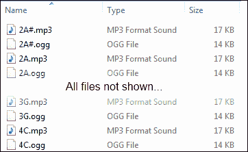
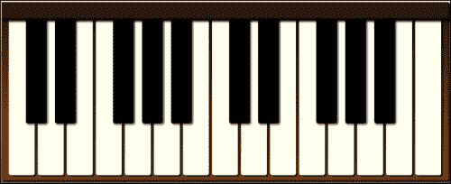
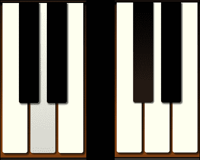
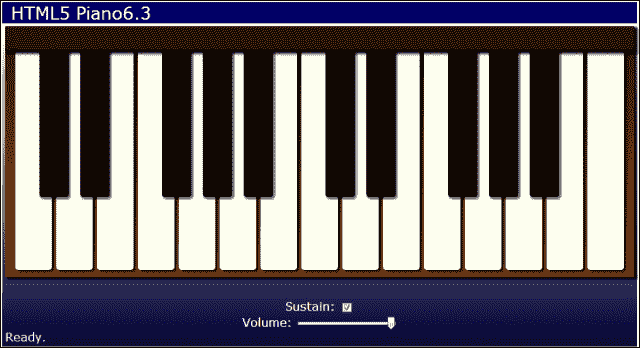

# 第六章。钢琴人

> "音乐不仅仅是艺术，也不仅仅是文学，而是普遍可及的."比利·周

*在本章中，我们将通过创建虚拟钢琴应用程序来学习如何使用音频。首先，我们将了解 HTML5 音频元素和应用编程接口。然后我们将创建一个音频管理器来异步加载音频文件，并缓存它们供以后播放。我们将使用 HTML 元素创建一个键盘，并使用 CSS 为其设置样式。*

我们将在本章中学习以下内容:

*   HTML5 `<audio>`元素及其属性
*   如何在应用程序中使用音频应用编程接口控制音频
*   如何动态加载音频文件
*   如何处理键盘事件将电脑键盘变成钢琴键盘
*   如何使用范围输入来控制音频元素的音量
*   如何检查浏览器是否支持范围输入类型

# HTML5 音频概述

在开始编写我们的钢琴应用程序之前，我们需要学习如何使用 HTML5 音频的基础知识。所以让我们从`<audio>`元素及其 API 的概述开始。

## html 5<音频>元素

HTML5 `<audio>`元素是用来定义在你的网页或应用程序中播放的音频文件。`audio`元素可以在页面上有可见的控件，也可以保持隐藏状态，并通过 JavaScript 进行控制。以下是它支持的一些最有用的属性:

*   `src`:要加载的音频文件的 URL 。
*   `autoplay`:用指定文件一加载就开始播放。
*   `controls`:告诉浏览器在页面上显示音频控件。否则，不会显示该元素的任何内容。
*   `loop`:指定音频循环播放。
*   `muted`:指定将音频静音。
*   `preload`:定义音频文件的加载方式。
*   `auto`:页面加载时加载音频文件。这是默认设置。
*   `none`:是否不预加载文件，等待播放。
*   `metadata`:页面加载时只加载关于文件的元数据。

页面加载后自动播放`audioFile.mp3`，并显示页面上的音频控件:

```html
<audio src="audioFile.mp3" autoplay controls>
    Your browser doesn't support audio.
</audio>
```

以下是它在 Chrome 页面上显示时的样子:


如果浏览器不支持`<audio>`元素，它将显示元素内的任何内容。

虽然可以使用`src`属性指定要加载的文件，但不建议这样做。不同的浏览器支持不同的文件类型，因此如果您只指定一种，它可能无法在所有浏览器上工作。相反，您应该在`<audio>`元素中指定`<source>`子元素，以定义要使用的不同音频文件的列表。浏览器将使用它支持的第一个:

```html
<audio controls>
    <source src="audioFile.mp3">
    <source src="audioFile.ogg">
    <source src="audioFile.wav">
</audio>
```

支持的三种主要音频类型是 MP3、Ogg 和 WAV。你至少应该提供 MP3 和 Ogg 文件，因为所有主要的浏览器都支持其中一个。如果您还想包含一个 WAV 文件，请将其放在列表的最后，因为 WAV 文件没有被压缩，因此下载会占用大量带宽。

## html 5 音频 API

如果你能用 HTML5 音频做的只是在网页上放一个元素让用户听音乐，那就太无聊了，这一章就结束了。但是像`<canvas>`元素一样，`<audio>`元素有一个完整的 API 来支持它。我们可以使用音频应用编程接口来控制如何以及何时从 JavaScript 播放音频剪辑。

音频 API 包含大量的方法和属性。以下是几个最有用的例子:

*   `play()`:开始播放音频片段。
*   `pause()`:暂停音频片段的播放。
*   `canPlayType(type)`:用于判断浏览器是否支持某个音频类型。传入音频 MIME 类型，如`"audio/ogg"`或`"audio/mpeg"`。它返回以下值之一:
    *   `"probably"`:很有可能支持
    *   `"maybe"`:浏览器或许可以播放
    *   `""`(空字符串):不支持
*   `currentTime`:使用获取或设置当前播放时间，单位为秒。这允许我们在播放前的某个时间点提示声音。通常我们会将其设置为`0`重启声音。
*   `volume`:使用获取或设置音量。可以是介于`0`和`1`之间的任何值。
*   `ended`:用于判断声音是否一路播放。

### 注

注意`<audio>`和`<video>`元素都共享同一个 API。所以如果你知道如何使用 HTML 音频，你也知道如何使用视频。

我们可以使用音频应用编程接口用声音做一些有趣的事情。在本章中，我们将创建一个虚拟钢琴，用户可以通过在屏幕上单击钢琴键盘的键来在网页上演奏。

# 加载音频文件

你可以通过在你的 HTML 文件中添加`<audio>`元素来为你的应用定义所有的音频文件。但是，我们也可以从 JavaScript 中动态加载音频文件，以控制它们的加载方式和加载时间。我们可以像上一章动态加载图像文件一样加载它们。首先，我们创建一个新的`<audio>`元素，并将`src`属性设置为音频文件的名称:

```html
var audio = $("<audio>")[0];
audio.src = "2C.mp3";
```

接下来，我们添加一个事件处理程序，以便在音频文件加载完成时得到通知。我们可以使用两个事件。一旦浏览器有足够的数据开始播放音频，就会触发`canplay`事件。文件完全加载后，触发`canplaythrough`事件:

```html
audio.addEventListener("canplaythrough", function()
{
    audio.play();
});
```

# 行动时间–创建音频管理器对象

让我们将音频文件的加载封装成一个可重用的对象。我们将创建一个名为`AudioManager`的新对象，并将其放入名为`audioManager.js`的文件中。该对象将抽象加载、缓存和访问音频文件所需的所有代码。

我们的对象的构造函数采用一个名为`audioPath`的参数，它是音频文件存储的路径:

```html
function AudioManager(audioPath)
{
    audioPath = audioPath || "";
    var audios = {},
        audioExt = getSupportedFileTypeExt();
```

如果`audioPath`没有定义，我们默认为空字符串。然后我们添加一个名为`audios`的变量，它是一个对象，将用于缓存所有加载的`<audio>`元素。最后，我们定义一个变量来保存浏览器支持的音频文件扩展名，我们将通过调用`getSupportedFileTypeExt()`方法来确定:

```html
    function getSupportedFileTypeExt()
    {
        var audio = $("<audio>")[0];
        if (audio.canPlayType("audio/ogg")) return ".ogg";
        if (audio.canPlayType("audio/mpeg")) return ".mp3";
        if (audio.canPlayType("audio/wav")) return ".wav";
        return "";
    };
```

首先，我们在内存中创建新的`<audio>`元素，并使用它来调用`canPlayType()`方法来确定浏览器支持的文件类型。然后我们返回该类型的文件扩展名。

接下来，我们需要一种从`AudioManager`对象获取音频文件的方法。让我们添加一个公共`getAudio()`方法:

```html
    this.getAudio = function(name, onLoaded, onError)
    {
        var audio = audios[name];
        if (!audio)
        {
            audio = createAudio(name, onLoaded, onError);
            // Add to cache
            audios[name] = audio;
        }
        else if (onLoaded)
        {
            onLoaded(audio);
        }
        return audio;
    };
```

`getAudio()`方法取三个参数。第一个是不带扩展名的音频文件的名称。我们将在稍后加载文件时添加音频路径和默认扩展名。下面两个参数是可选的。第二个参数是一个函数，它将在文件加载完成后被调用。第三个是一个函数，如果加载文件时出现错误，将调用该函数。

第一件事情`getAudio()`是检查`audios`对象，看看我们是否已经加载和缓存了那个文件。在这种情况下，`audios`对象像关联数组一样使用，其中键是文件名，值是音频元素。这使得按名称查找`<audio>`元素变得容易。

如果文件还没有添加到缓存中，那么我们创建一个新的`audio`元素，并通过调用`createAudio()`方法来加载它，接下来我们将实现这个方法。然后将新元素添加到`audios`对象中进行缓存。

如果文件名已经在缓存中，那么我们立即调用`onLoaded()`处理函数，该函数是在文件加载后作为参数传入的。

现在我们来写私`createAudio()`法。它采用与前面方法相同的参数:

```html
    function createAudio(name, onLoaded, onError)
    {
        var audio = $("<audio>")[0];
        audio.addEventListener("canplaythrough", function()
        {
            if (onLoaded) onLoaded(audio);
            audio.removeEventListener("canplaythrough",
                arguments.callee);
        });
        audio.onerror = function()
        {
            if (onError) onError(audio);
        };
        audio.src = audioPath + "/" + name + audioExt;
        return audio;
    }
}
```

首先，我们使用 jQuery 创建一个新的`<audio>`元素。然后我们为`canplaythrough`添加一个事件监听器。当事件被触发时，我们检查一个`onLoaded`函数是否被传递到方法中。如果是这样，我们称之为传递新的`<audio>`元素。我们还需要移除事件监听器，因为每次播放音频时，一些浏览器都会调用它。

我们还在`<audio>`元素中添加了一个`onerror`处理程序，用于在加载文件时检查错误。如果我们得到一个错误，它调用`onError`函数，如果它被定义的话。

接下来，我们将`<audio>`元素的`src`属性设置为音频文件的 URL。我们通过组合`audioPath`、名称参数和`audioExt`来构建网址。这将导致音频文件开始加载。最后，我们返回新的`<audio>`元素。

## *刚刚发生了什么？*

我们创建了一个名为`AudioManager`的对象来加载和缓存音频文件。我们第一次请求音频文件时，它会被加载和缓存。下次使用缓存的音频时。例如，如果我们的浏览器支持 Ogg 文件，下面的代码将加载`audio/2C.ogg`音频文件:

```html
var audioManager = new AudioManager("audio");
var audio = audioManager.getAudio("2C");
```

# HTML5 钢琴应用

现在让我们创建我们的 HTML5 钢琴应用程序。我们将有两个八度的钢琴键，黑色和白色，我们将使用一些造型使它看起来像一个真正的键盘。当用户用鼠标点击一个键时，它将播放相应的音符，该音符在音频文件中定义。

您可以在`chapter6/example6.1`中找到该部分的代码。

# 该行动了——创造一架虚拟钢琴

我们将像往常一样开始，复制我们在[第 1 章](01.html "Chapter 1. The Task at Hand")、*手头的任务*中创建的应用程序模板，并将文件重命名为`piano.html`、`piano.css`和`piano.js`。我们还需要上一章创建的`touchEvents.js`。

在`piano.js`里面，我们将应用对象改为`PianoApp`:

```html
function PianoApp()
{
    var version = "6.1",
        audioManager = new AudioManager("audio");
```

我们创建一个`AudioManager`实例，并将路径传递给我们的音频文件，这将是`audio` 文件夹。现在我们打开 HTML 文件，添加所有的钢琴键:

```html
<div id="keyboard">
    <div id="backboard"></div>
    <div class="keys">
        <div data-note="2C" class="piano-key white"></div>
        <div data-note="2C#" class="piano-key black"></div>
        <div data-note="2D" class="piano-key white"></div>
        <div data-note="2D#" class="piano-key black"></div>
        <div data-note="2E" class="piano-key white"></div>
        <div data-note="2F" class="piano-key white"></div>
        <div data-note="2F#" class="piano-key black"></div>
        <div data-note="2G" class="piano-key white"></div>
        <div data-note="2G#" class="piano-key black"></div>
        <div data-note="2A" class="piano-key white"></div>
        <div data-note="2A#" class="piano-key black"></div>
        <div data-note="2B" class="piano-key white"></div>
        <!-- third octave not shown -->
        <div data-note="4C" class="piano-key white"></div>
    </div>
</div>
```

在“主”元素内部，我们添加一个`<div>`标签，将`id`设置为`keyboard`。里面我们有一个`<div>`标签，它将是篮板，还有一个`<div>`标签，它将包含所有的钥匙。每个键由一个元素定义，该元素包含一个类别的`piano-key`和一个类别的`white`或`black`，具体取决于键的颜色。每个关键元素还有一个`data-note`自定义数据属性。这将被设置为钢琴键音符的名称，也将是匹配音频文件的名称。

我们的钢琴有两个全八度的钢琴键。每个键都有自己的音频文件。由于每个八度都有 12 个音符，而我们在键盘的末尾又多了一个 C 音符，所以我们将有 25 个名为`2C`到`4C`的音频文件。我们希望提供 Ogg 和 MP3 格式的音频文件，以支持所有浏览器，因此我们总共有 50 个音频文件:



让我们打开`piano.css`并设置应用程序的样式。首先，我们通过将`position`设置为`absolute`，并将所有`position`值设置为`0`，让应用程序占据整个浏览器窗口。我们会给它一个从白色到蓝色的线性渐变:

```html
#app
{
    position: absolute;
    top: 0;
    bottom: 0;
    left: 0;
    right: 0;
    margin: 4px;
    background-color: #999;
    /* browser specific gradients not shown */
    background: linear-gradient(top, white, #003);
}
```

我们还将`footer`选择器的`position`属性设置为`absolute`，将`bottom`设置为`0`，这样它就拥抱了窗口的底部:

```html
#app>footer
{
    position: absolute;
    bottom: 0;
    padding: 0.25em;
    color: WhiteSmoke;
}
```

在主要部分，我们将`text-align`设置为`center`，这样键盘就位于页面的中心:

```html
#main
{
    padding: 4px;
    text-align: center;
}
```

现在让我们风格的键盘，使其看起来像一个真正的钢琴键盘。首先，我们给整个键盘一个从深棕色到浅棕色的渐变和一个阴影，给它一些深度:

```html
#keyboard
{
    padding-bottom: 6px;
    background-color: saddlebrown;
    /* browser specific gradients not shown */
    background: linear-gradient(top, #2A1506, saddlebrown);
    box-shadow: 3px 3px 4px 1px rgba(0, 0, 0, 0.9);
}
```

接下来，我们设计背板，它隐藏了按键的顶部。我们给它一个深棕色，让它`32`像素高，给它一个阴影增加深度。为了让阴影画在钢琴键上，我们需要将`position`设置为`relative`:

```html
#backboard
{
    position: relative;
    height: 32px;
    background-color: #2A1506;
    border-bottom: 2px solid black;
    box-shadow: 3px 3px 4px 1px rgba(0, 0, 0, 0.9);
}
```

所有钢琴键都共享一些由`piano-key`类定义的基本样式。首先，我们将`display`设置为`inline-block`，这样它们就保持在同一条线上，并且也有宽度和高度。然后我们给底部一个边界半径，使它们看起来圆润。我们还会将`cursor`属性设置为`pointer`，这样用户就可以得到一个他们可以被点击的指示:

```html
#keyboard .piano-key
{
    display: inline-block;
    border-bottom-right-radius: 4px;
    border-bottom-left-radius: 4px;
    cursor: pointer;
}
```

最后，我们来看看黑白键的风格。白键比黑键宽一点，高一点。我们也给他们象牙色和阴影。最后，我们需要将`z-index`设置为`1`，因为它们需要显示在黑键后面:

```html
#keyboard .piano-key.white
{
    width: 50px;
    height: 300px;
    background-color: Ivory;
    box-shadow: 3px 3px 4px 1px rgba(0, 0, 0, 0.7);
    z-index: 1;
}
```

黑色的钥匙比白色的小一点。为了使黑键显示在白键之上，我们将`z-index`设置为`2`。为了让它们看起来像是在白键之间，我们将它们的`position`属性设置为`relative`，并使用负的`left`偏移量将它们移动到白键上方。我们还需要一个负的`right-margin`值，所以下一个白键被拉到它的下面:

```html
#keyboard .piano-key.black
{
    position: relative;
    width: 40px;
    height: 200px;
    left: -23px;
    margin-right: -46px;
    vertical-align: top;
    background-color: black;
    box-shadow: 2px 2px 3px 1px rgba(0, 0, 0, 0.6);
    z-index: 2;
}
```

这就是我们钢琴的样子:


第一个图像显示没有设置边距的关键点。看起来不太像真正的键盘，是吗？下一张图片显示了在`left`边距设置下的样子。越来越好了，但是白钥匙还没移过来。设置正确的边距可以解决这个问题。

## *刚刚发生了什么？*

我们创建了一个新的 HTML5 钢琴应用程序，从我们的应用程序模板开始。我们在 HTML 中定义了所有的键，然后我们使用负偏移和边距来设计它们，使键像真正的键盘一样排列。

给你。我们现在有一个两个八度的键盘，看起来非常逼真:



# 行动时间-载入笔记

我们有一个键盘，但是还没有声音。让我们返回到我们的 JavaScript 并加载所有的音频文件。我们将创建一个名为`loadAudio()` 的新方法，并从应用程序的`start()`方法中调用它。

有两种方法可以加载所有文件。我们可以通过为每个文件调用`audioManager.getAudio()` 一次加载一个，这将非常冗长，并且需要大量输入。或者我们可以遍历所有的`piano-key`元素，从它们的`data-note`属性中获取文件名。通过使用这种方法，我们可以在 HTML 中添加更多的钢琴键，甚至不必接触 JavaScript:

```html
function loadAudio()
{
    var count = 0,
        loaded = 0,
        error = false;

    $(".keyboard .piano-key").each(function()
    {
        count++;
        var noteName = escape($(this).data("note"));
        audioManager.getAudio(noteName,
            function()
            {
                if (error) return;
                if (++loaded == count) setStatus("Ready.");
                else setStatus("Loading " +
                        Math.floor(100 * loaded / count) + "%");
            },
            function(audio)
            {
                error = true;
                setStatus("Error loading: " + audio.src);
            }
        );
    });
}
```

我们做的第一件事是定义一些变量来跟踪正在加载的音频文件的数量和已经加载的数量。我们将使用这些来计算完成百分比。如果加载文件时出错，我们还需要设置一个变量。

下一步我们要做的是使用 jQuery 选择所有`piano-key`元素并调用`each()`来迭代它们。对于每一个，我们执行以下操作:

1.  在`count`变量中加 1，记录文件总数。
2.  从`data-note`属性中获取笔记名称，也是文件名。请注意，我们必须使用`escape()`功能，因为有些笔记包含尖锐的符号`#`，这在网址中是非法的。
3.  传入音符名称调用`audioManager.getAudio()`。这将导致音频文件被加载和缓存。下一次我们为这个音符调用`getAudio()` 时，它将被加载并准备播放。
4.  `getAudio()`的第二个参数是一个函数，当每个文件成功加载完成时调用。在这个函数中，我们增加加载的变量。然后，我们检查是否所有的文件都已加载，如果是，显示一条就绪消息。否则，我们计算加载文件的完成百分比，并通过调用`setStatus()`在页脚显示。
5.  The last parameter to `getAudio()` is a function that gets called if there is an error loading a file. When that happens, we set the `error` variable to `true` and display a message showing the file that couldn't be loaded.

    ### 注

    请注意，如果您通过 IIS 等网络服务器运行此应用程序，您可能需要将`.ogg`文件类型添加到站点的 MIME 类型列表中(`.ogg`、`audio/ogg`)。否则，您将得到一个错误，说找不到文件。

## *刚刚发生了什么？*

我们使用`AudioManager`对象动态加载每个键盘按键的所有声音，使用它们的`data-note`属性作为文件名。现在，我们已经加载、缓存并准备好播放所有音频文件。

# 行动时间——弹奏音符

下一件事我们需要做的是添加事件处理程序，在钢琴键被点击或触摸时播放一个`<audio>`元素。我们将把和事件处理程序连接到我们所有的钢琴键上，并在它们被触发时播放相关的音符。

### 注

在撰写本文时，移动设备上的音频状态不是很好。尽管触摸设备对于钢琴应用来说是完美的，但由于移动浏览器缓存音频的方式(或不缓存)，声音并不总是正确播放。

让我们创建一个名为`initKeyboard()` 的方法，该方法将从应用程序的`start()`方法中调用:

```html
function initKeyboard()
{
    var $keys = $(".keyboard .piano-key");
    if ($.isTouchSupported)
    {
        $keys.touchstart(function(e) {
            e.stopPropagation();
            e.preventDefault();
            keyDown($(this));
        })
        .touchend(function() { keyUp($(this)); })
    }
    else
    {
        $keys.mousedown(function() {
            keyDown($(this));
            return false;
        })
        .mouseup(function() { keyUp($(this)); })
        .mouseleave(function() { keyUp($(this)); });
    }
}
```

首先，我们使用 jQuery 选择键盘上的所有`piano-key`元素。然后，我们使用触摸事件的 jQuery 扩展来检查浏览器是否支持触摸事件。如果是这样，我们将触摸事件处理程序连接到钢琴键。否则，我们会连接鼠标事件处理程序。

当一个键被触摸或者鼠标被点击时，它调用`keyDown()`方法传入包装在 jQuery 对象中的键元素。

### 注

注意，在这个上下文中，`this`是被点击的元素。当按键未被触动或者鼠标被释放，或者鼠标离开元素时，我们称之为`keyUp()`方法。

先写`keyDown()`法:

```html
function keyDown($key)
{
    if (!$key.hasClass("down"))
    {
        $key.addClass("down");
        var noteName = $key.data("note");
        var audio = audioManager.getAudio(escape(noteName));
        audio.currentTime = 0;
        audio.play();
    }
}
```

在`keyDown()`方法中，我们首先通过检查键是否有`down`类来检查键是否已经被按下。如果没有，我们给关键元素增加一类`down`。我们将使用它来设计按键的样式，使其看起来像是被按下了一样。然后，我们从`data-note`自定义属性中获取钥匙的笔记名称。我们将它传递给`audioManager.getAudio()`方法以获得`<audio>`元素。要开始播放音频剪辑，我们首先将`currentTime`属性设置为`0`以在开始时提示声音。然后我们调用音频 API 的`play()`方法开始播放。

```html
function keyUp($key)
{
    $key.removeClass("down");
}
```

`keyUp()`方法只是从元素中移除`down`类，因此该键不会再在向下位置设置样式。

我们需要做的最后一件事是添加按键按下状态的样式。我们将使用渐变使它看起来像是按下了键的末端。我们还将阴影变小了一点，因为按键按下时没有那么高:

```html
.keyboard .piano-key.white.down
{
    background-color: #F1F1F0;
    /* Browser-specific gradients not shown */
    background: linear-gradient(top, Ivory, #D5D5D0);
    box-shadow: 2px 2px 3px 1px rgba(0, 0, 0, 0.6);
}
.keyboard .piano-key.black.down
{
    background-color: #111;
    /* Browser-specific gradients not shown */
    background: linear-gradient(top, Black, #222);
    box-shadow: 1px 1px 2px 1px rgba(0, 0, 0, 0.6);
}
```

## *刚刚发生了什么？*

我们将事件处理程序连接到钢琴键上，以便在用鼠标点击或触摸设备时播放相关音符。我们添加了一些样式，以给出按键被按下的视觉指示。现在我们有了一个使用 HTML5 音频的功能钢琴。继续，在你的浏览器中打开它，然后砰的一声放上几首曲子。



# 键盘事件

使用鼠标在我们的钢琴上弹奏音符可以，但是如果我们可以一次弹奏多个音符就更好了。要做到这一点，我们可以使用电脑的键盘来弹奏音符。为此，我们将在 JavaScript 中向 DOM `document`添加键盘事件处理程序，并将键盘键映射到钢琴键。

键盘的顶部两行将用于第一个八度音阶，底部两行用于第二个八度音阶。比如按下 *Q* 键会播放最低的 C 音。按下 *2* 键将播放 C#， *W* 将播放 D，以此类推。对于第二个八度，按下 *Z* 将播放中间 C， *S* 将播放 C#，以此类推:


您可以在`chapter6/example6.2`中找到该部分的代码。

# 行动时间-添加键盘事件

我们需要做的第一件事是在我们的应用程序中添加`keycodes.js`。该文件包含一个名为`keyCodes`的全局静态对象，该对象将键盘上的键映射到它们相关的键码。比如`keyCodes.ENTER`等于`13`。使用这个将使我们的代码比使用关键代码号更易读。

接下来我们需要做的就是打开 HTML，给`piano-key`元素添加一个新的自定义数据属性。我们称之为`data-keycode`，它将被设置为我们想要与钢琴键关联的`keyCode`对象中的值:

```html
<div data-note="2C" data-keycode="Q" class="piano-key white" title="C2"></div>
<!—elements not shown -->
<div data-note="4C" data-keycode="COMMA" class="piano-key white" title="C4"></div>
```

现在我们需要将键码映射到音符。我们将向我们的应用程序添加一个名为`keyCodesToNotes`的对象来保存我们的映射。我们将用`initKeyboard()`方法初始化它:

```html
function initKeyboard()
{
    // Code not shown...
    $keys.each(function() {
        var $key = $(this);
        var keyCode = keyCodes[$key.data("keycode")];
        keyCodesToNotes[keyCode] = $key.data("note");
    });
}
```

在这里，我们遍历所有`piano-key`元素，获取每个元素的`data-keycode`自定义属性，并使用该属性从`keyCodes`对象获取关键代码。然后我们通过将映射设置为元素的`data-note`自定义属性来将其添加到`keyCodesToNotes`中。例如 *Q* 键的键码为 81，关联的钢琴键音符为 2C。所以`keyCodesToNotes[81]`将设置为`2C`。

现在让我们添加键盘事件处理程序。当检查按键按下、按下或按下事件时，您需要将事件处理程序附加到 HTML 文档。让我们在应用程序的`start()`方法中添加`keydown`和`keyup`事件处理程序:

```html
this.start = function()
{
  // Code not shown... 
    $(document).keydown(onKeyDown)
               .keyup(onKeyUp);
}
```

`keydown`事件处理程序调用`onKeyDown()`方法。`keyup`处理程序调用`onKeyUp()`:

```html
function onKeyDown(e)
{
    var note = keyCodesToNotes[e.which];
    if (note)
    {
        pressPianoKey(note);
    }
}
```

在`onKeyDown()`方法中，我们查找使用`keyCodesToNotes`对象按下的键的注释。jQuery 在关键事件对象上定义了一个包含关键代码的`which`字段。如果键码与我们键盘上的一个音符匹配，那么我们调用`pressPianoKey()`方法将`note`参数传递给它:

```html
function onKeyUp(e)
{
    var note = keyCodesToNotes[e.which];
    if (note)
    {
        releasePianoKey(note);
    }
}
```

`onKeyUp()`方法的工作方式相同，只是我们称之为 `releasePianoKey()`方法。

```html
function pressPianoKey(note)
{
    var $key = getPianoKeyElement(note);
    keyDown($key);
}
```

在`pressPianoKey()`方法中，我们得到要播放的音符的名称作为参数。然后我们调用`getPianoKeyElement()` 来获得与该音符相关联的钢琴键元素。最后，我们将该元素传递到`keyDown()`方法中，我们已经在添加鼠标和触摸事件时实现了该方法。这样，我们模拟用户点击屏幕上的钢琴键元素。

```html
function releasePianoKey(note)
{
    var $key = getPianoKeyElement(note);
    keyUp($key);
}
```

`releasePianoKey()`方法的工作方式完全相同，只是它调用了现有的`keyUp()`方法。

```html
function getPianoKeyElement(note)
{
    return $(".keyboard .piano-key[data-note=" + note + "]");
}
```

在`getPianoKeyElement()`方法中，我们通过使用`data-note`自定义属性上的 jQuery select 匹配找到与注释相关联的`piano-key`元素。

## *刚刚发生了什么？*

我们在应用程序的 HTML 文档中添加了键盘按键事件处理程序。我们把按键按下时的键码映射到钢琴键上，这样用户就可以按键盘上的键来弹钢琴。通过将`piano-key`元素传递到`keyDown()`和`keyUp()`中，我们模拟用户点击这些键。他们得到了`down`类添加到他们，所以看起来他们真的被压。

你自己去看看。试着一次按两三个键，弹奏一些和弦。

# 音量和延音控制

让我们给钢琴添加一些控制，让用户改变音量和延音。您可能还记得，`audio`元素的体积可以设置为从`0`到`1.0`的任何值。我们将使用一个范围输入控件，允许用户通过滑块来控制它。

延音控制允许音符在钢琴键释放后继续演奏。当延音关闭时，一旦释放按键，音符就会停止播放。我们将添加一个复选框来关闭和打开它。

你可以在`chapter6/example6.3`找到这部分的源代码。

# 行动时间-添加延音控制

让我们继续并添加一个持续控制到应用程序。我们将使用复选框输入控制来打开和关闭延音。在我们的 HTML 文件中，我们将在键盘下添加一个类为`controls`的新`<div>`元素来保存我们的控件:

```html
<div id="main">
    <!-- keyboard not shown... -->
    <div class="controls">
        <label for="sustain">Sustain: </label>
        <input type="checkbox" id="sustain" checked /><br />
    </div>
</div>
```

我们定义了一个标签和一个`sustain.`属性为`id`的复选框，默认情况下我们也将其设置为选中状态。

现在让我们在我们的`PianoApp`应用程序对象中实现复选框的代码。首先，我们需要添加一个名为`sustain`的变量，并将其设置为`true`:

```html
function PianoApp()
{
    var version = "6.3",
    // Code not shown...
    sustain = true;
```

接下来，我们连接一个`change`事件处理程序，当复选框改变时得到通知。我们将在应用程序的`start()`方法中实现这一点:

```html
$("#sustain").change(function() { sustain = $(this).is(":checked"); });
```

当复选框发生变化时，我们可以通过 jQuery `is()`过滤方法将它传递给`:checked`过滤器来判断它是否被选中。如果选中，则`sustain`变量设置为`true`。

现在我们需要对`keyUp()`方法做一些的修改。现在所有的方法就是从`piano-key`元素中移除`down`类。我们需要添加代码来检查`sustain`变量，如果该变量设置为`true`，则停止声音播放:

```html
function keyUp($key)
{
    $key.removeClass("down");
    if (!sustain)
    {
        var noteName = $key.data("note");
        var audio = audioManager.getAudio(escape(noteName));
        audio.pause();
    }
}
```

移除`down`类后，我们检查`sustain`变量。如果没有设置延音，我们从`piano-key`元素的`data-note`自定义属性中获取音符名称，并使用它从`audioManager`对象中获取`<audio>`元素。然后我们调用`pause()`方法停止播放声音。

## *刚刚发生了什么？*

我们添加了一个复选框，允许用户打开和关闭延音控制。当延音关闭并且用户释放钢琴键时，我们调用音频应用编程接口的`pause()`方法来停止音符的回放。

# 行动时间-添加音量控制

回到进入 HTML，我们添加一个范围输入控件，允许用户改变音量。我们将把它放在刚刚添加的延音标签和控制下:

```html
<label for="volume">Volume: </label>
<input type="range" id="volume" min="1" max="100" value="100" step="1" />
```

我们用`volume`的`id`属性定义一个标签和一个范围输入。我们将控制范围设置为从`1`到`100`，其中`step`值为`1`。我们还将该值默认为`100`。

回到我们的`PianoApp`对象，我们添加另一个名为`volume`的全局变量，并将其设置为`1.0`，默认情况下，最大音量:

```html
function PianoApp()
{
    var version = "6.3",
    // Code not shown...
    sustain = true,
    volume = 1.0;
```

像`sustain`复选框一样，我们需要为我们的范围控制应用程序的`start()`方法添加一个`change`事件处理程序:

```html
$("#volume").change(function() {
    volume = parseInt($(this).val()) / 100;
});
```

您可能已经注意到，我们的范围输入控件的范围是从`1`到`100`，而`audio` 元素的音量是从`0`到`1.0`定义的。因此，在我们的事件处理程序中，我们将`volume`变量设置为范围控制除以`100`的值。

现在我们只需要在`keyDown()`方法中添加一行代码，在播放之前设置`audio`元素的`volume`属性:

```html
audio.currentTime = 0;
audio.volume = volume;
audio.play();
```

现在让我们在 CSS 中为页面的`controls`部分做一些样式设计:

```html
.controls
{
    margin-top: 2em;
    color: white; 
}
.controls input
{
    vertical-align: middle;
}
.controls input[type=range]
{
    width: 10em;
}
```

我们设置上边距，给控件一点喘息的空间，为控件设置垂直对齐，使标签在中间对齐，并设置音量范围控件的宽度。

还有一件事我们应该做，使我们的应用程序更加动态。并非所有浏览器都广泛支持范围输入控件，因此让我们添加一些代码来检查它是否受支持。我们将添加一个`isInputTypeSupported()`方法:

```html
function isInputTypeSupported(type)
{
    var $test = $("<input>");
    // Set input element to the type we're testing for
    $test.attr("type", type);
    return ($test[0].type == type);
}
```

首先，我们在内存中创建新的`<input>`元素。然后我们将`type`属性设置为我们正在测试的类型。在我们的情况下，那将是`range`。然后我们检查`type`属性，看看它是否卡住了。如果元素保留该类型，则浏览器支持它。

在`start()`方法中，我们将添加范围类型的检查。如果你回忆一下[第三章](03.html "Chapter 3. The Devil is in the Details")、*细节*中的魔鬼，如果一个输入类型不被支持，它只会显示为一个文本输入字段。因此，如果不支持范围类型，我们将更改字段的宽度，使其变小。我们不希望一个宽为`10em`的文本输入字段输入从`0`到`100`的数字:

```html
if (!isInputTypeSupported("range")) $("#volume").css("width", "3em");
```

## *刚刚发生了什么？*

我们添加了一个范围输入控件，允许用户用滑块改变声音的音量。在播放声音之前，我们将音量设置为用户选择的值。我们还编写了一个方法来检查浏览器是否支持某些 HTML5 输入类型。以下是我们创建的内容:



## 加油英雄

为`<audio>`元素创建一个包装对象，该包装对象将元素作为构造函数，并包含访问音频应用编程接口方法的公共方法。增加一些方便的方法，比如`rewind()`，设置`audio.currentTime = 0`，或者`stop()`，调用`pause()``rewind()`。

## 突击测验

Q1。`<audio>`元素支持什么音频类型？

1.  Ogg
2.  MP3 文件
3.  声音资源文件
4.  上述全部

Q2。您将键盘事件附加到哪个对象？

1.  `window`
2.  `document`
3.  `div`
4.  `audio`

# 音频工具

在我们离开这一章之前，我想告诉你几个免费的音频工具，你可以使用它们来获取和操作你的应用程序的音频文件。

## FreeSound.org

[FreeSound.org](http://FreeSound.org)是一个网站，你可以从那里获得在知识共享许可下发布的音频文件。这意味着您可以在各种使用限制下免费使用它们。有公共领域的声音，你可以不用做任何事情就可以使用。有声音，只要你给作者信用，你可以做任何事情。除了商业用途之外，有些声音你可以用来做任何事情。FreeSound 数据库非常庞大，具有强大的搜索和浏览功能。你可以在这个网站上找到几乎任何你需要的声音。

## 胆大妄为

Audacity 是一个免费开源音频编辑器，用于录制、切片和混合音频，运行在许多不同的操作系统上。Audacity 非常适合在多种文件类型之间转换，这对于我们来说非常棒，因为我们需要为不同的浏览器支持不同的音频类型。它支持主要网络浏览器使用的所有主要音频类型，包括 Ogg、MP3 和 WAV。

# 总结

在本章中，我们学习了如何使用 HTML5 `audio`元素和 API 向 web 应用程序添加声音。我们看到了如何通过创建一个可重用的音频管理器对象来加载和缓存音频文件。然后我们使用 HTML5 音频创建了一个虚拟钢琴应用程序，用于在网页中弹奏钢琴。我们使用键盘事件来允许用户通过键盘弹奏钢琴键。我们添加了控制来更改音量和延音音符。

我们在本章中介绍了以下概念:

*   如何将 HTML5 `<audio>`元素添加到网页中，并使用其属性对其进行控制
*   使用 JavaScript 中的音频应用编程接口以编程方式控制音频元素的回放
*   如何加载音频文件并缓存它们以便以后播放
*   如何播放、暂停和重置音频文件
*   如何将键盘事件与文档挂钩，并在我们的应用程序中处理它们
*   如何使用范围输入控件更改`audio`元素的音量
*   如何检查浏览器是否支持任何 HTML5 输入类型

在下一章中，我们将把我们的钢琴应用程序变成一个名为“钢琴英雄”的游戏。我们将通过创建一个音频序列器来学习定时、动画元素和播放音乐。