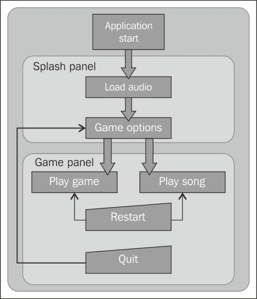
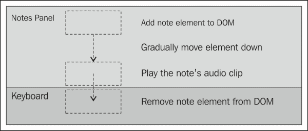
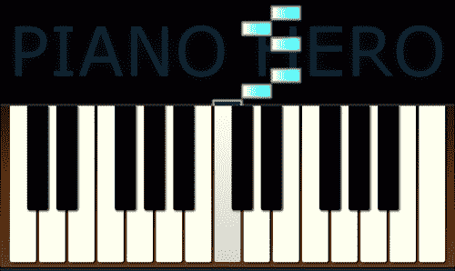

# 第七章。钢琴英雄

> “音乐的一个好处是，当它击中你时，你不会感到疼痛。”
> 
> -鲍勃马利

*在本章中，我们将把前一章中的钢琴应用程序变成一个游戏，玩家必须在一首歌的音符从屏幕上落下时，在正确的时间弹奏它们。我们将创建一个启动页面，跟踪图像加载，并允许玩家选择游戏选项。我们将创建一个音频序列器来播放音乐数据中的歌曲。在游戏中，我们将收集钢琴键盘输入，并验证它以确定玩家的分数。*

我们将在本章中学习以下内容:

*   如何使用 HTML5 进度条元素跟踪资源的加载
*   如何使用 JavaScript 定时器控制音频播放播放歌曲
*   如何制作 DOM 元素的动画以在屏幕上移动它们
*   如何在游戏状态之间转换
*   如何获取用户输入并验证它

# 创造钢琴英雄

我们的钢琴英雄游戏将从上一章我们构建的 HTML5 钢琴应用开始。我们将为它添加一个音频序列器来播放预先录制的歌曲。为了得分，演奏者需要跟随并在正确的时间弹奏歌曲的音符。还会有一个练习模式，只播放歌曲，这样玩家就能听到。

我们的游戏将有两个不同的主面板。首先是闪屏，这是游戏的起点。当应用程序第一次启动时，它会在加载音频时显示一个进度条。加载完成后，它将显示玩游戏的选项。当玩家点击播放按钮时，他们会转换到游戏面板。

游戏面板包含钢琴键盘和一个显示从其上方落下的要弹奏的音符的区域。如果用户在正确的时间播放正确的音符，他们会得到分数。歌曲结束时，会显示玩家的评分和一些统计数据。当游戏完成后，应用程序将转换回闪屏，用户可以在其中选择选项并再次游戏。

画一个流程图来显示游戏如何从一种状态转换到另一种状态通常是有帮助的。



# 行动时间-创建闪屏

首先复制上一章创建的钢琴应用，将文件重命名为`pinaoHero.html`、`pianoHero.js`和`pianoHero.css`。我们也将主应用对象重命名为`PianoHeroApp`。你可以在`Chapter 7/example7.1`找到这个部分的代码。

现在让我们创建启动面板。首先我们将在`pianoHero.html`中定义 HTML。我们将在键盘元素上方添加一个新的`<div>`元素来保持闪屏:

```html
<div id="splash">
    <h1>Piano Hero</h1>
    <section class="loading">
        Loading audio...<br/>
        <progress max="100" value="0"></progress>
    </section>
```

首先我们添加一个类别为`"loading"`的部分，显示应用首次启动时加载音频的状态。请注意，我们正在使用新的 HTML5 `<progress>`元素。此元素用于在应用程序中实现进度条。它有一个定义最大值的`max`属性和一个设置当前值的`value`属性。由于我们显示的是完成百分比，我们将`max`设置为`100`。我们将在加载音频文件时从 JavaScript 中更新`value`属性。

然后我们添加一个类为`"error"`的部分，如果加载音频时出现错误，它将显示一条错误消息。否则将被隐藏:

```html
    <section class="error">
        There was an error loading the audio.
    </section>
```

最后，我们添加了一个显示游戏选项和按钮的部分。加载所有音频后，将显示此面板:

```html
    <section class="loaded hidden">
        <label>Choose a song</label>
        <select id="select-song">
            <option value="rowBoat">Row Your Boat</option>
            <option value="littleStar">
              Twinkle, Twinkle, Little Star</option>
            <option value="londonBridge">London Bridge</option>
            <option value="furElise">Fur Elise</option>
        </select><br/>
        <label>Choose difficulty</label>
        <select id="select-rate">
            <option value="0.5">Slow (60bpm)</option>
            <option value="1" selected>Normal (120bpm)</option>
            <option value="1.5">Fast (180bpm)</option>
        </select>
        <p>
            <button id="start-game">Start Game</button>
            <button id="start-song">Play Song</button>
        </p>
    </section>
</div>
```

在这里，用户从下拉列表中选择歌曲和难度。难度用歌曲播放的速度来表示。值 1 表示默认速度为每分钟 120 次。小于 1 的值较慢，大于 1 的值较快。

现在我们需要设计闪屏。请查看所有风格的源代码。一个值得注意的样式是**钢琴英雄**标题，我们将它放在`<h1>`标题元素中:

```html
#splash h1
{
    font-size: 6em;
    color: #003;
    text-transform: uppercase;
    text-shadow: 3px 3px 0px #fff, 5px 5px 0px #003;
}
```

我们将文本的颜色设置为深蓝色。然后我们用`text-shadow`产生一个有趣的块文字效果。使用`text-shadow,`时，可以指定任意数量的阴影，用逗号分隔。阴影将按照从最后到第一的顺序绘制。因此，在这种情况下，我们首先绘制一个偏移量为 5 像素的深蓝色阴影，然后绘制一个偏移量为 3 像素的白色阴影，最后在此之上绘制深蓝色文本:


现在让我们创建一个名为`splashPanel.js`的新 JavaScript 文件，并在其中定义一个名为`SplashPanel`的新对象，该对象将包含控制闪屏的所有代码。构造器将采用一个参数，引用`audioManager`:

```html
function SplashPanel(audioManager)
{
    var $div = $("#splash"),
    error = false;
```

我们定义一个`$div`对象来保存对闪屏根`<div>`元素的引用，并定义一个`error`变量来设置如果加载音频时出现错误。接下来我们定义公共`show()`和`hide()`方法。这些将由主应用程序对象调用，以显示或隐藏面板:

```html
    this.show = function()
    {
        $div.fadeIn();
        return this;
    };
    this.hide = function()
    {
        $div.hide();
        return this;
    };
}
```

接下来我们将`loadAudio()`方法从`PianoHeroApp`移到`SplashPanel`。在这个方法中，我们需要对 `audioManager.getAudio()`的调用做一些小的修改:

```html
audioManager.getAudio(noteName,
    function()
    {
        if (error) return;
        if (++loaded == count) showOptions();
        else updateProgress(loaded, count);
    },
    function(audio) { showError(audio); }
);
```

在我们每次加载音频文件时都会调用的函数中，我们首先检查是否有错误，如果有，就把它取出来。然后我们检查是否所有的音频文件都已加载(`loaded == count`)，如果是，调用 `showOptions()`方法。否则我们调用`updateProgress()`方法来更新进度条:

```html
function updateProgress(loadedCount, totalCount)
{
    var pctComplete = parseInt(100 * loadedCount / totalCount);
    $("progress", $div)
        .val(pctComplete)
        .text(pctComplete + "%");
}
```

`updateProgress()`方法以加载计数和总计数为参数。我们计算完成的百分比，并用它来更新`<progress>`元素的值。我们还设置了`<progress>`元素的内部文本。这将只显示不支持 `<progress>`元素的浏览器。

```html
function showOptions()
{
    $(".loading", $div).hide();
    $(".options", $div).fadeIn();
}
```

加载完所有音频后，调用`showOptions()`方法。首先我们用`"loading"`类隐藏元素，然后用`"options"`类淡入元素。这将隐藏进度部分，并显示包含游戏选项的部分。

我们的错误处理函数调用`showError()`，将失败的音频元素传递给它:

```html
function showError(audio)
{
    error = true;
    $(".loading", $div).hide();
    $(".error", $div)
        .append("<div>" + audio.src + "<div>")
        .show();
}
```

在`showError()`方法中，我们将`error`标志设置为`true`，因此我们知道不要在`getAudio()`呼叫中继续。首先我们隐藏加载部分，然后我们将失败的文件名附加到错误消息中，并显示错误部分。

我们在启动面板中最不需要的就是将事件处理程序连接到按钮上。有**开始游戏**和**播放歌曲**两个按钮。两者唯一的区别是**播放歌曲**按钮播放歌曲不打分，所以用户可以听到歌曲并练习:

```html
$(".options button", $div).click(function()
{
    var songName = $("#select-song>option:selected", $div).val();
    var rate = Number($("#select-rate>option:selected", $div).val());
    var playGame = ($(this).attr("id") == "start-game");
    app.startGame(songName, rate, playGame);
});
```

我们对两个按钮使用相同的事件处理程序。首先我们得到用户选择的选项，包括歌曲和播放速率。您可以使用`:selected`选择器在 jQuery 中找到选定的`<option>`元素。我们通过查看按钮的`id`属性来确定用户按下了哪个按钮。然后我们调用全局`app`对象上的`startGame()`方法传递选定的选项。我们将在稍后编写该方法。


## *刚刚发生了什么？*

我们使用 HTML5 `<progress>`元素创建了一个显示音频文件加载进度的闪屏。完成后，它会显示游戏选项，然后等待用户选择选项并开始游戏。

# 行动时间-创建游戏面板

接下来我们要创建的是游戏面板。我们已经有了钢琴键盘，这将是它的一部分。我们还需要它上面的一个区域来显示落下的笔记，以及一个在游戏结束时显示结果的地方。让我们将这些添加到`game`元素内和键盘上方的 HTML 文件中:

```html
<div id="game">
    <div id="notes-panel">
        <div class="title">PIANO HERO</div>
    </div>
```

`<div id="notes-panel">`元素将用于保存代表要演奏的音符的元素。现在是空的。`note`元素将在游戏进行过程中动态添加到该元素中。它有一个带有标题的`<div>`元素，会出现在音符后面。

```html
    <div id="results-panel">
        <h1>Score: <span class="score"></span></h1>
        <p>
            You got <span class="correct"></span>
            out of <span class="count"></span> notes correct.
        </p>
        <p>
            Note accuracy: <span class="note-accuracy"></span>%<br/>
            Timing accuracy: <span class="timing-accuracy"></span>%
        </p>
    </div>
```

游戏结束后将显示`<div id="results-panel">`元素。我们添加`<span>`占位符来显示分数、笔记总数以及正确笔记的数量，以及一些准确性统计。

```html
    <div class="keyboard">
        <div class="keys">
            <!-- Code not shown... -->
        </div>
        <div class="controls">
            <button id="stop-button">Stop</button>
            <button id="restart-button">Restart</button>
            <button id="quit-button">Quit</button><br/>
            <label for="sustain">Sustain: </label>
            <input type="checkbox" id="sustain" checked /><br />
            <label for="volume">Volume: </label>
            <input type="range" id="volume" min="1" max="100"
                value="100" step="1" />
        </div>
    </div>
</div>
```

我们还在键盘下方的`<div class="controls">`元素中添加了一些按钮。**停止**按钮将停止游戏，**重启**将从头开始当前歌曲，而**退出**将带玩家回到闪屏。

现在让我们在名为`gamePanel.js`的文件中创建一个`GamePanel`对象，以包含实现游戏所需的所有代码。构造函数将引用`audioManager`对象:

```html
function GamePanel(audioManager)
{
    var $panel = $("#game"),
        $notesPanel = $("#notes-panel"),
        $resultsPanel = $("#results-panel"),
        practiceMode = false,
        noteCount = 0,
        notesCorrect = 0,
        score = 0,
        keyCodesToNotes = {},
        sustain = true,
        volume = 1.0;
```

这里我们定义一些变量来跟踪游戏状态。`practiceMode`变量决定我们是在玩游戏还是在练习。`noteCount`、`notesCorrect`和`score`用于记录玩家的表现。

我们将所有支持键盘的代码从`PianoHeroApp`对象移动到`GamePanel`对象。这其中就包括了`keyCodesToNotes``sustain`，以及 `volume`等变量。我们也动了`initKeyboard()``keyDown()``keyUp()``pressPianoKey()``releasePianoKey()``getPianoKeyElement()`和`isInputTypeSupported()` 的方法。最后，我们移动 `onKeyDown()`和 `onKeyUp()`事件处理程序。

现在让我们为应用程序添加一些公共方法来与游戏面板交互。像闪屏一样，我们需要方法来显示和隐藏它:

```html
this.show = function()
{
    $panel.fadeIn(startGame);
    return this;
};
this.hide = function()
{
    $panel.hide();
    return this;
};
```

`show()`公共方法淡化游戏面板。我们传入一个对`startGame()`方法、的引用，我们将在下一节中写，淡入完成后调用。

## *刚刚发生了什么？*

我们通过添加标记来创建游戏面板，标记区域用于保存动画`note`元素，标记区域用于显示分数。这些是我们在前一章创建的键盘之外的。然后，我们创建了一个 JavaScript 对象来保存游戏面板的所有代码，包括我们之前为键盘编写的所有代码。

# 行动时间-创建控制器

此时我们的主应用对象`PianoHeroApp`所剩无几。我们移动了所有代码以将音频加载到`SplashPanel`对象，并移动了所有代码以使键盘工作到`GamePanel`对象。

`PianoHeroApp`对象现在将仅作为状态控制器来隐藏和显示正确的面板。首先，我们需要添加一些变量来保存对面板的引用:

```html
function PianoHeroApp()
{
    var version = "7.1",
        audioManager = new AudioManager("audio"),
        splashPanel = new SplashPanel(audioManager),
        gamePanel = new GamePanel(audioManager),
        curPanel = undefined;
```

我们定义变量来保存音频管理器、启动面板和游戏面板对象。我们还有一个`curPanel`变量，它将被设置为当前显示的面板。首先，我们将它设置为`undefined`。

接下来，我们将创建一个私有的`showPanel()`方法，它将隐藏当前显示的面板(如果有)，并显示一个不同的面板:

```html
    function showPanel(panel)
    {
        if (curPanel) curPanel.hide();
        curPanel = panel;
        curPanel.show();
    }
```

此方法将要显示的面板作为参数。这将是对`SplashPanel`或`GamePanel`的引用。首先，我们检查面板是否显示，如果显示，我们称其为`hide()`方法。然后我们将`curPanel`设置为新面板，并调用其`show()`方法。

接下来我们定义公共`startGame()`方法。如果您还记得我们为`SplashPanel`对象编写的代码，当用户单击**玩游戏**或**播放歌曲**按钮时，将从事件处理程序调用该代码。它在玩家选择的游戏选项中传递:

```html
    this.startGame = function(songName, rate, playGame)
    {
        gamePanel.setOptions(songName, rate, playGame);
        showPanel(gamePanel);
    };
```

`startGame()`方法取三个参数；要播放的歌曲名称、播放速率(控制游戏进行的速度)和布尔值(确定用户是否点击了**玩游戏**按钮)。

首先我们调用`GamePanel`对象的`setOptions()`方法，后面会写。我们传递的参数与从闪屏获得的参数相同。然后我们把`showPanel()`法传入`GamePanel`对象。这就是将要开始的游戏。

接下来我们将定义公共 `quitGame()`方法。当用户点击**退出**按钮时，将从游戏面板调用该功能:

```html
    this.quitGame = function()
    {
        showPanel(splashPanel);
    };
```

我们在这个方法中所做的就是调用`showPanel()`，传递给它`SplashPanel`对象。

我们需要定义的最后一件事是我们应用的`start()`方法:

```html
    this.start = function()
    {
        $(document).keydown(function(e) { curPanel.onKeyDown(e); })
                   .keyup(function(e) { curPanel.onKeyUp(e); });

        showPanel(splashPanel);
        splashPanel.loadAudio();
    };
```

首先，我们在文档上设置键盘事件处理程序，就像我们在创建钢琴应用程序时所做的那样。但是，在这个应用程序中，我们将键盘事件转发到当前面板。通过将键盘事件处理程序集中在应用程序对象中，当面板显示或隐藏时，我们不必在每个面板中编写一堆代码来订阅和取消订阅文档中的键盘事件处理程序。

我们要做的最后一件事是显示闪屏，然后调用其`loadAudio()`方法来强制启动应用程序。

### 注

我们的闪击和游戏面板执行`show()`、`hide()`、`keydown()`和`keyup()`方法。由于 JavaScript 是无类型的，我们不能用接口来强制执行。所以我们按照惯例来编程，假设所有的面板都将实现这些方法。

## *刚刚发生了什么？*

我们向主应用程序对象添加了代码来控制游戏的状态。当玩家点击闪屏中的一个按钮时，游戏开始，当他们点击游戏中的**退出**时，显示闪屏。

# 创建音频序列器

在可以玩游戏之前，我们需要一些在钢琴上弹奏歌曲的方法，按照一定的顺序，在正确的时间，以正确的速度回放音符。我们将创建一个名为`AudioSequencer`的对象，该对象接受一系列音乐事件对象，并将它们转换为音乐。

为了实现我们的音频序列器，我们需要为我们的音乐事件定义一种格式。我们将大致遵循 MIDI 格式，但要简化得多。MIDI 是记录和回放音乐事件的标准。每个事件都包含有关如何以及何时播放音符或关闭音符的信息。

我们的事件对象将包含三个字段:

*   `deltaTime`:执行事件前等待的时间。
*   `event`:这是决定事件做什么的整数事件代码。它可以是以下之一:
    *   打开便笺
    *   关闭便笺
    *   提示点将在歌曲的开头
    *   曲目结束将标志着歌曲结束
*   `note`:这是弹奏的音符。它包含八度音程和音符，并匹配我们的音频文件名，例如，3C。

音频序列器将通过查看每个事件中的`deltaTime`字段来确定在触发事件之前要等待多长时间。客户端将传入一个事件处理函数，该函数将在事件被激发时被调用。然后，客户端将查看事件数据，并确定播放哪个音符。这个循环一直持续到没有其他事件了。


# 行动时间-创建音频序列器

让我们在名为`audioSequencer.js`的文件中创建我们的`AudioSequencer`对象。我们将从定义几个变量开始:

```html
function AudioSequencer()
{
    var _events = [],
        _playbackRate = 1,
        _playing = false,
        eventHandler = undefined,
        timeoutID = 0;
```

首先我们定义一个`_events`数组来保存所有要播放的音乐事件。`_playbackRate`变量控制歌曲播放的速度。一个值`1`会以正常速度，比`1`慢一点，比`1`快一点。歌曲播放时`_playing`变量设置为`true`。`eventHandler`将被设置为一个事件触发时被调用的函数，`timeoutID`将包含`setTimeout()` 返回的句柄，以防用户停止游戏，我们需要取消超时。

现在让我们定义一些公共属性方法。首先是`events()`。它用于获取或设置 `_events`阵列:

```html
    this.events = function(newEvents)
    {
        if (newEvents) {
            _events = newEvents;
            return this;
        }
        return _events;
    };
```

接下来是 `playbackRate()`。用于获取或设置`_playbackRate`:

```html
    this.playbackRate = function(newRate)
    {
        if (newRate) {
            _playbackRate = newRate;
            return this;
        }
        return _playbackRate;
    };
```

最后我们有 `isPlaying()`，用来判断一首歌当前是否在播放:

```html
    this.isPlaying = function()
    {
        return _playing;
    };
```

现在我们将代码公`startPlayback()`方法。该方法采用两个参数；事件处理函数和可选的起始位置，它是`_events`数组的索引:

```html
    this.startPlayback = function(callback, startPos)
    {
        startPos = startPos || 0;

        if (!_playing && _events.length > 0)
        {
            _playing = true;
            eventHandler = callback;
            playEvent(startPos);
            return true;
        }
        return false;
    };
```

我们要做的第一件事是将`startPos`参数默认为`0,`，如果没有提供的话。接下来，我们检查一首歌还没有播放，并确保我们实际上有一些事件要播放。如果是这样，我们将`_playing`标志设置为`true`，存储事件处理程序引用，然后为第一个事件调用`playEvent()`。如果回放成功开始，我们返回`true`。

现在我们来写`playEvent()`法。它需要一个参数，即下一个要触发的事件的索引:

```html
    function playEvent(index)
    {
        var event = _events[index];
        eventHandler(event.event, event.note, index);

        index++;
        if (index < _events.length)
        {
            timeoutID = setTimeout(function()
            {
                playEvent(index);
            },
            _events[index].deltaTime * (1 / _playbackRate));
        }
        else _playing = false; // all done
    }
```

我们要做的第一件事是获取`_events`数组中指定索引处的事件。然后我们立即调用`startPlayback()`方法中提供的事件处理程序的回调函数，将事件代码、要播放的音符和事件索引传递给它。

接下来，我们增加索引以获得下一个事件。如果有另一个事件，我们调用`setTimeout()`等待事件的`deltaTime`字段中指定的时间量，然后调用`playEvent()`，再次传递给它下一个事件的索引。我们通过将`deltaTime`乘以回放速率的倒数来计算等待时间。例如，如果回放速率是 0.5，那么等待时间将是正常速率的 1、0.5 或 2 倍。这个循环以这种方式继续，直到没有更多的事件可玩。

我们最不需要的就是一个公开的`stopPlayback()`方法。调用此方法来停止事件循环，从而停止音频事件的回放:

```html
    this.stopPlayback = function()
    {
        if (_playing)
        {
            _playing = false;
            if (timeoutID) clearTimeout(timeoutID);
            eventHandler = undefined;
        }
    };
```

首先，我们检查`_playing`标志，以确保一首歌曲正在播放。如果是这样，我们将标志设置为`false`，然后我们调用 `clearTimeout()`来停止超时。这将停止再次调用`playEvent()` ，这将停止回放循环。

我们最后需要的是定义回放事件代码，这样我们就不必记住事件代码编号。我们将使用名为`eventCodes`的对象在`AudioSequencer`上定义一个伪枚举:

```html
AudioSequencer.eventCodes =
{
    noteOn: 1,
    noteOff: 2,
    cuePoint: 3,
    endOfTrack: 4
};
```

## *刚刚发生了什么？*

我们创建了一个音频序列器对象，它接受一系列音乐事件，类似于 MIDI 事件，并使用`setTimeout()`函数在正确的时间调用它们。当一个事件被触发时，它调用由游戏面板传入的事件处理函数。

### 注

虽然我们已经编写了这段代码来播放音乐，但是您可以在任何需要的地方以预定的时间间隔使用相同的技术。

# 播放歌曲

现在我们有了音频序列器，可以进入游戏面板，在练习模式下添加一些代码来播放一首歌。当歌曲播放时，它会在屏幕上按下正确的键，就像钢琴演奏者一样。稍后我们将添加代码来检查玩家的互动，看看他们对歌曲的理解有多好。

# 行动时间-添加音频序列器

让我们将音频序列器添加到游戏面板。我们将进入`GamePanel`对象，并向其添加一个`AudioSequencer`实例:

```html
function GamePanel(audioManager)
{
    var sequencer = new AudioSequencer();
```

接下来我们来写公`setOptions()`法，这是从`PianoHeroApp`的`startGame()`法来调用的。它需要三个参数；歌曲名称、播放速率以及是玩游戏还是在练习模式下播放歌曲:

```html
    this.setOptions = function(songName, rate, playGame)
    {
        sequencer.events(musicData[songName])
                 .playbackRate(rate);
        practiceMode = !playGame;
        return this;
    };
```

我们做的第一件事是将音频序列器的`events()`属性设置为要播放的歌曲的数据。我们从`musicData.js`中定义的`musicData`对象获取歌曲数据。然后，我们设置音频序列器的`playbackRate()`属性。最后我们设置`practiceMode`变量。

`musicData`对象包含事件数据，音序器可以为用户在启动页面上选择的所有歌曲播放这些事件数据。每首歌曲都被定义为一组音乐事件对象。这里有一个例子，是关于韵律*闪烁，闪烁小星星*的数据:

```html
var musicData =
{
    littleStar: [
        { deltaTime: 0, event: 3, note: null },
        { deltaTime: 0, event: 1, note: "3C" },
        { deltaTime: 500, event: 2, note: "3C" },
        { deltaTime: 0, event: 1, note: "3C" },
        { deltaTime: 500, event: 2, note: "3C" },
        { deltaTime: 0, event: 1, note: "3G" },
        { deltaTime: 500, event: 2, note: "3G" },
        // ...
        { deltaTime: 0, event: 4, note: null }
    ]
};
```

它以提示点事件(`event: 3`)开始，然后打开音符 3C ( `event: 1`)。500 毫秒后，它关闭音符 3C ( `event: 2`)。它会一直持续到最后一个事件，也就是音轨结束(`event: 4`)。

接下来我们来写`startGame()`方法，它是从`show()`方法中调用的:

```html
function startGame()
{
    $resultsPanel.hide();
    $notesPanel.show();
    // Reset score
    noteCount = 0;
    notesCorrect = 0;
    score = 0;
    // Start interval for notes animation
    intervalId = setInterval(function() { updateNotes(); },
        1000 / framesPerSecond);
    // Start playback of the song
    sequencer.startPlayback(onAudioEvent, 0);
}
```

我们要做的第一件事是隐藏结果面板并显示注释面板。然后我们重新设置分数和统计数据。

接下来，我们通过调用 JavaScript `setInterval()`函数并将`intervalId`变量设置为返回的句柄来启动间隔计时器。我们稍后将使用它来停止游戏结束时的间隔，或者玩家停止游戏。此间隔用于动画显示从页面顶部落下的“注释”面板中的元素。我们通过将 1000 毫秒除以每秒帧数，将间隔设置为以恒定速率触发。我们将使用每秒 30 帧的帧速率，这足以产生相对平滑的动画，并且不会使游戏停滞不前。在计时器的每一个时间间隔，我们都调用`updateNotes()`方法，我们将在下一节中进行描述。

我们在这个方法中做的最后一件事是调用音频序列发生器的`startPlayback()`方法，将一个引用传递给我们的音频事件处理程序方法 `onAudioEvent()`，以及一个起始位置 0:

```html
function onAudioEvent(eventCode, note)
{
    switch (eventCode)
    {
        case AudioSequencer.eventCodes.noteOn:
            addNote(note);
            break;
        case AudioSequencer.eventCodes.endOfTrack:
            sequencer.stopPlayback();
            break;
    }
}
```

此方法接受两个参数:音频事件代码和要播放的音符。我们使用`switch`语句和`eventCodes`枚举来确定如何处理事件。如果事件代码是`noteOn`，我们调用`addNote()`方法给注释面板添加一个`note`元素。如果是`endOfTrack`事件，我们在音频序列器上称之为`stopPlayback()` 。我们可以暂时忽略所有其他事件。

## *刚刚发生了什么？*

我们在游戏面板中添加了音频序列器，并连接了一个函数来处理音符事件。我们添加了一个`startGame()`方法，开始动画间隔来制作`note`元素的动画。

# 创建动画音符

现在我们将实现笔记面板的代码。这就是笔记从页面顶部掉落的动画发生的地方。它是这样工作的:

*   音频序列器发送一个应该播放音符的事件(参见上一节中的`onAudioEvent()`)。
*   当时实际上并没有演奏这个音符。相反，表示音符的矩形元素被添加到音符面板的顶部。
*   每当我们的动画间隔计时器触发时，`note`元素的 y 位置就会递增，从而向下移动。
*   当元素碰到音符面板的下边缘(和键盘的上边缘)时，它会播放与音符相关联的音频片段。
*   当元素完全离开注释面板时，它将从 DOM 中移除。



# 行动时间-添加注释

先写下上一节被`onAudioEvent()`引用的 `addNote()`法。此方法接受一个参数，即要添加的注释的名称:

```html
function addNote(note)
{
    noteCount++;
    // Add a new note element
    var $note = $("<div class='note'></div>");
    $note.data("note", note);
    $notesPanel.append($note);

    var $key = getPianoKeyElement(note);
    // Position the note element over the piano key
    $note.css("top", "0")
         .css("left", $key.position().left)
         .css("width", $key.css("width"));

    if ($key.hasClass("black"))
    {
        $note.addClass("black");
    }
}
```

首先我们更新`noteCount`变量来跟踪统计数据。然后我们用 jQuery 创建一个新的 note `<div>`元素，并给它一个`"note"`类。我们将`data-note`自定义属性设置为注释的名称。稍后当它到达面板底部时，我们将需要它来知道播放哪个音符。最后，我们使用 jQuery 的 `append()`方法将其添加到注释面板。

下一件事我们做的是将`note`元素放在它所代表的钢琴键上。我们通过调用我们现有的`getPianoKeyElement()`方法来获得与音符相关联的钢琴键元素。我们提取钢琴键的左侧位置和宽度，并将`note`元素设置为相同的值，使其对齐。

我们要做的最后一件事是通过检查钢琴键上是否定义了`"black"`类来检查钢琴键是黑键还是白键。如果是这样，我们也给`note`元素一个`"black"`类。这将使元素以不同的颜色出现。

让我们添加`note`元素的样式:

```html
#notes-panel .note
{
    position: absolute;
    display: block;
    width: 50px;
    height: 20px;
    background-color: cyan;
    /* browser specific gradients not shown */
    background: linear-gradient(left, white, cyan);
    box-shadow: 0 0 4px 4px rgba(255, 255, 255, 0.7);
}
```

我们将`position`设置为`absolute`，因为我们需要移动它们，并将它们放置在我们想要的任何地方。我们给它们一个从左到右的线性渐变，从白色渐变到青色。我们也给它一个没有偏移的白色阴影。这将使它看起来像是在黑色背景下发光:

```html
#notes-panel .note.black
{
    background-color: magenta;
    /* browser specific gradients not shown */
    background: linear-gradient(left, white, magenta);
}
```

带有`"black"`类的音符将覆盖背景颜色，从白色渐变为洋红色。

## *刚刚发生了什么？*

我们创建了一个方法，将表示注释的元素添加到注释面板中。我们将这些音符放在它们所属的钢琴键的正上方。

# 行动时间-制作音符动画

之前，我们用`startGame()`方法中的`setInterval()`开始一个区间。每当时间间隔到期时，就会调用`updateNotes()`方法。此方法负责更新所有`note`元素的位置，因此它们看起来会在屏幕下方移动:

```html
function updateNotes()
{
    $(".note", $notesPanel).each(function()
    {
        var $note = $(this);
        var top = $note.position().top;
        if (top <= 200)
        {
            // Move the note down
            top += pixelsPerFrame;
            $note.css("top", top);
            if (top + 20 > 200)
            {
                // The note hit the bottom of the panel
                currentNote.note = $note.data("note");
                currentNote.time = getCurrentTime();
                currentNote.$note = $note;
                if (practiceMode) pressPianoKey($note.data("note"));
            }
        }
        else
        {
            // Note is below the panel, remove it
            if (practiceMode) releasePianoKey($note.data("note"));
            $note.remove();
        }
    });

    // Check if there are any notes left
    if ($(".note", $notesPanel).length == 0)
    {
        // No more notes, game over man
        if (!practiceMode) showScore();
        endGame();
    }
}
```

首先，我们在笔记面板中选择所有的`note`元素，并在它们上面迭代。对于每一个，我们执行以下操作:

*   获取顶部位置并检查它是否小于 200，这是笔记面板的高度。
*   如果元素仍然在音符面板内，我们将元素向下移动`pixelsPerFrame`变量定义的像素数。以每秒 30 帧的速度，这是 2 个像素。
*   接下来，我们通过检查底部是否超过 200 来检查`note`元素的底部是否碰到音符面板的底部。
*   如果是，我们将`currentNote`对象的`note`变量设置为音符，这样我们就可以检查用户以后是否弹奏了正确的音符。我们还会得到音符触底的准确时间，以确定演奏者离准时演奏有多近。
*   如果我们处于练习模式，我们也可以通过调用`pressPianoKey()` 并传递`note`元素来弹奏音符。
*   如果`note`元素在注释面板之外，那么我们调用`releasePianoKey()` ，并将其从 DOM 中移除。

我们要做的最后一件事是检查笔记面板中是否还有笔记元素。如果没有，游戏结束，我们调用`showScore()`显示结果面板。然后我们调用`endGame()`，停止动画间隔。

## *刚刚发生了什么？*

我们制作了`note`元素的动画，使它们看起来像是落在屏幕上它们所代表的键盘按键上。当音符碰到音符面板的底部时，我们在练习模式下弹奏音符。当`note`元素移出面板时，我们将其从 DOM 中移除。

## 加油英雄

试着玩玩帧率，看看它如何影响动画的质量。可接受的最低帧速率是多少？可感知的最高帧率是多少？

# 处理用户输入

用户已经开始游戏，笔记从屏幕上落下。现在我们需要检查演奏者是否在正确的时间按下了正确的钢琴键。当他们这样做时，我们会根据他们的准确性给他们一些分数。

# 行动时间-检查笔记

我们将在`keyDown()`方法中为`checkNote()`方法添加一个调用。`checkNote()`方法将音符的名称作为参数，并检查音符面板底部是否有与之匹配的`note`元素:

```html
function checkNote(note)
{
    if (currentNote.note == note)
    {
        var dif = getCurrentTime() - currentNote.time;
        if (dif < gracePeriod)
        {
            notesCorrect++;
            score += Math.round(10 * (gracePeriod - dif) / gracePeriod);
            currentNote.$note.css("background", "green");
            addHitEffect();
        }
    }
}
```

首先，我们检查先前在`updateNotes()` 中设置的`currentNote`对象。如果它的音符与用户弹奏的音符相同，那么他们可能会因为在正确的时间弹奏而获得一些分数。为了找出他们是否得到分数，我们首先找到音符敲击面板底部的时间和当前时间之间的时间差，单位为毫秒。如果它在允许的宽限期内，我们设置为 200 毫秒，那么我们计算分数。

我们首先增加正确音符的数量。然后，我们通过计算时间的百分比并乘以 10 来确定分数。这样，每个音符的点数在 1 到 10 之间。最后，为了给用户一些他们做对了的提示，我们将元素的背景颜色改为绿色，调用`addHitEffect()`:

```html
function addHitEffect()
{
    var $title = $(".title", $notesPanel);
    $title.css("color", "#012");
    setTimeout(function() { $title.css("color", "black"); }, 100);
}
```

`addHitEffect()`方法通过改变其颜色，在音符面板的背景中闪烁**钢琴英雄**标题，使用`setTimeout()`调用等待 100 毫秒，然后将其变回黑色。



## *刚刚发生了什么？*

我们添加了一种方法来检查是否在正确的时间为`note`元素按下了正确的钢琴键。如果是这样的话，我们会根据音符播放的时机来加分，并改变音符的颜色来表示成功。

# 结束游戏

现在玩家可以玩游戏了，我们可以记录分数和他们得到的正确音符的数量。当游戏结束时，我们需要显示结果面板，显示分数和一些统计数据。

# 行动时间–创建结果面板

这首歌在所有的音符都演奏完之后， `updateNotes()`方法调用 `showScore()`，我们将在这里显示玩家的得分和一些统计数据:

```html
function showScore()
{
    $notesPanel.hide();
    $resultsPanel.fadeIn();
    $(".score", $resultsPanel).text(score);
    $(".correct", $resultsPanel).text(notesCorrect);
    $(".count", $resultsPanel).text(noteCount);
    $(".note-accuracy", $resultsPanel).text(
        Math.round(100 * notesCorrect / noteCount));
    $(".timing-accuracy", $resultsPanel).text(
        Math.round(10 * score / notesCorrect));
}
```

首先，我们隐藏音符面板，并在乐谱面板的位置淡入。然后，我们将分数和统计数据填入 DOM 中的占位符。我们显示分数、正确的音符数和音符总数。此外，我们使用`notesCorrect`和`noteCount`变量计算他们得到正确音符的百分比。

我们通过将正确音符的分数和数量分解得到计时准确度百分比。记住每个音符总共有 10 个可能的点，所以如果他们得到 17 个音符正确，可能的点总数是 170。如果分数是 154，那就是 154 / 170 ≈ 91%。


## *刚刚发生了什么？*

当游戏结束时，我们显示结果面板，并填充玩家的分数和统计数据。我们的游戏现在结束了。去吧，试一试，成为钢琴英雄！

## 加油英雄

尝试编写一个录音机类，当用户在键盘上播放音符时进行记录，并将其保存到音频序列器可以播放的数据对象数组中。

## 突击测验

Q1。哪一个 JavaScript 函数可以用来创建一个定时触发的定时器，直到被清除？

1.  `setTimeout()`
2.  `setRate()`
3.  `setInterval()`
4.  `wait()`

Q2。`<progress>`元素的哪些属性控制进度条被标记为完成的百分比？

1.  `value`和`max`
2.  `currentValue`和`maxValue`
3.  `start`和`end`
4.  `min`和`max`

# 总结

我们基于上一章写的钢琴应用程序创建了一个游戏。我们使用 JavaScript 定时器实现了一个音频序列器来播放歌曲和创建动画循环。我们创建了闪屏和游戏面板，并学习了如何在它们之间转换游戏状态。

我们在本章中介绍了以下概念:

*   如何创建闪屏并使用文本阴影产生有趣的文本效果
*   如何使用 HTML5 进度条元素显示动态资源加载进度
*   使用 JavaScript 定时器功能创建一个音频序列器，来控制播放歌曲的音频播放
*   如何使用 JavaScript 计时器制作 DOM 元素的动画
*   如何在游戏状态和面板之间转换
*   如何收集用户输入，验证，并在游戏结束时显示结果

在下一章中，我们将学习如何使用 Ajax 通过构建天气小部件来动态加载资源和调用 web 服务。