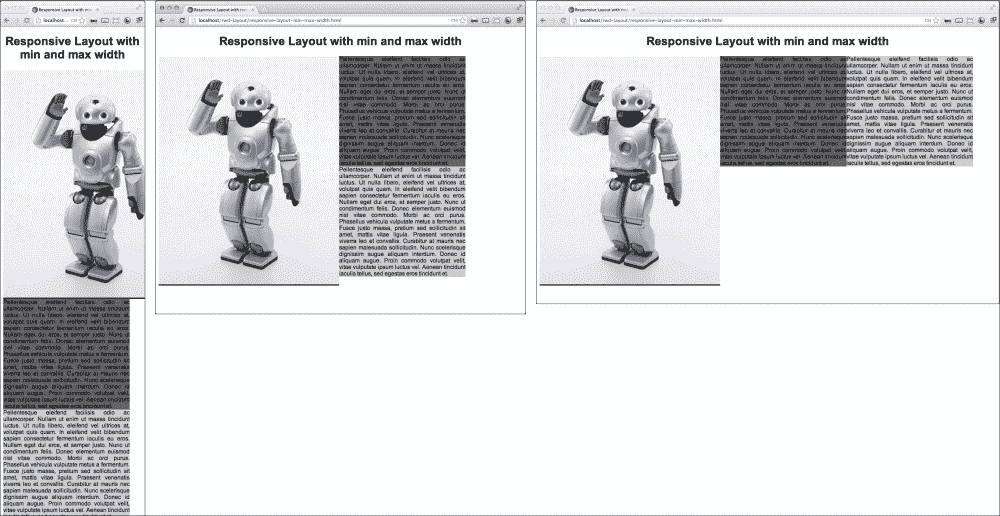
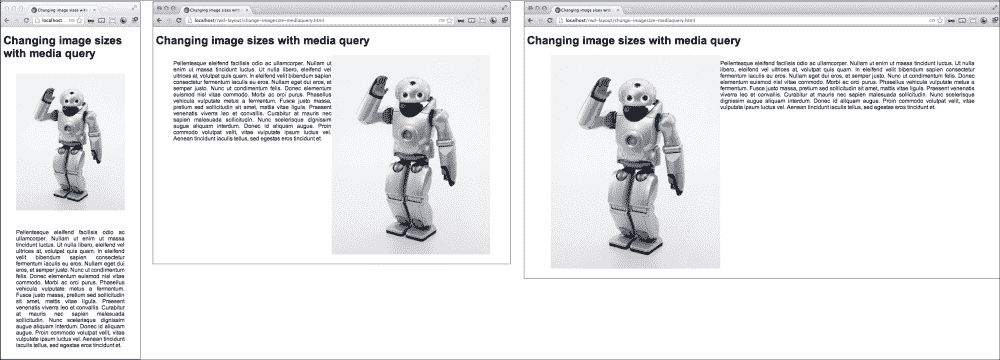

# 三、响应式布局

在本章中，您将了解:

*   具有最小宽度和最大宽度属性的响应布局
*   使用相对填充控制布局
*   向您的 CSS 添加媒体查询
*   使用媒体查询创建响应的宽度布局
*   通过媒体查询更改图像大小
*   隐藏带有媒体查询的元素
*   做出平稳过渡的响应布局

# 简介

这一章有一些具有挑战性的食谱。响应性布局通常会带来一些困难的挑战，这些挑战会促使您创建一个伟大的解决方案。有了响应性的设计方法，你可以做得更多，更有效率。响应式布局为网络开发带来了全新的挑战和新的刺激。

# 具有最小宽度和最大宽度属性的响应布局

许多响应布局技术可能是相当复杂和压倒性的，但是在这个食谱中，你会看到一个相当简单的布局，使用应用于三个浮动元素的`min-width`和`max-width`属性。有了 CSS 这个非常简单的响应布局特性，您就可以在各种大小的移动设备和桌面屏幕上显示您的网站了。

## 做好准备

浮动元素在一个小视口中从多列折叠成一列并不是什么新鲜事。多年来，这一直是 CSS1 的标准属性，然而，在移动设备变得普遍之前，从来没有任何理由认为它有用。因此，让我们将这个旧的、陈旧的属性与其他一些新的 CSS 属性结合起来，以形成一个响应性的布局。

## 怎么做…

创建一个简单的包含在`article`元素中的 HTML 页面，包含一个`h1`标题和三个元素。第一个元素将包含图像，第二个和第三个元素将包含填充文本。为所有内部元素分配一个类别`float`，并分别将`one`、`two`和`three`作为它们的标识:

```html
<article>
     <h1>Responsive Layout with min and max width</h1>

     <div class="one float">
        
     </div>

     <div class ="two float">Pellentesqueeleifendfacilisisodio ac ullamcorper. Nullamutenimutmassatinciduntluctus...
     </div>

     <div class="three float">Pellentesqueeleifendfacilisisodio ac ullamcorper. Nullamutenimutmassatinciduntluctus. Utnullalibero, …
     </div>
</article>
```

接下来，为`.article`元素创建样式，并分配属性:`width: 100%;`、`max-width: 1280px;`和自动侧边边距。然后，居中`h1`标题。为`img`元素分配`width: 100%`和 `height: auto;`属性，使其响应其父元素。对于包含`img`元素的浮动元素，给它一个`min-width`值`500px`。您也可以给每个浮动元素一个不同的背景颜色，使它们更容易识别，但这对布局并不重要。对于`.float`类中的所有浮动元素，添加一个`max-width: 350px`属性，左浮动，为了看起来干净，调整文本。

```html
<style>
article{
     width: 100%;
     max-width: 1280px;
     margin: 0 auto;
}
h1 {text-align:center;}
img {
     width: 100%;
     height: auto;
}
.one {
     background-color: #333;
     min-width: 500px;
}
.two {background-color:#666}
.three {background-color:#ccc}
.float {
     max-width: 350px;
     float: left;
     text-align: justify;
}
   </style>
```

一旦一切都放在一起，你在浏览器中打开 HTML 文档，你会看到布局是如何顺利的从三列布局到两列布局，最后到单列布局，如下图截图所示:



## 它是如何工作的…

柱的`max-width`属性允许它们具有流体但最大宽度。与静态宽度的相比，这种在列的布局上给你更多的灵活性。图像列利用`min-width`属性，因此它可以通过增长和收缩来响应父元素宽度的变化。最后，通过使用`float`属性，整个布局可以从三列平滑地分解为一列；一旦没有足够的空间让元素并排浮动，最后一个元素就会下降到新的一行。

# 用相对填充控制布局

让我们为一个有评论和评论回复的博客设计一个简单的布局。仅使用布局的相对填充是可能的。你说，“这太疯狂了！除了填充，你怎么能控制页面布局？”我们来看看。

## 做好准备

当然，博客比静态的 HTML 页面更加动态，所以这将是你最喜欢的博客软件评论模板部分的一个很好的部分。也就是说，这个食谱非常简单，而且有效。所以，去给自己找一些 Ipsum 填充文本，准备好打击自己。

## 怎么做…

第一步是创建一个非常简单的博客风格页面，在`div`元素中嵌入评论。在你的 HTML 主体中，创建一个包含所有内容的元素，即`.content` div。给它一个`h1`的标题，一段 Ipsum 填充文本，然后加上一个`.comments`元素。在`.comments`元素中，您将构建您的嵌入式评论布局。

```html
<div class="content">
     <header>Control your layout with relative padding</header>
     <p>
Pellent esque eleifend facilis isodio ac ullam corper. Null amuten imut massat incident luctus. Utnull alibero, el eifend vel ultrices at, volut patquis quam...</p>
     <div class="comments">
          <h2>Comments</h2> No 2 x h1
     </div>
</div>
```

在`.comments`标题下，您将添加您的第一条评论。接下来，在该注释中，紧接在结束段落标记之后，向该注释添加注释:

```html
<aside>
     <h1>Comments</h1>
     <div class="comment">
          <p>
Pellent esque eleifend facilis isodio ac ullam corper. Null amuten imut massat incident luctus. Utnull alibero, et...
          </p>
          <div class="comment">
               <p>
Pellent esque eleifend facilis isodio ac ullam corper. Null amuteni mut massat incident luctus. Ut null alibero, el eifend vel ultrices at, volut patquis quam...
               </p>
          </div>
     </div>
</aside>
```

从那里继续，你可以以同样的方式在父评论上插入更多的评论，或者在父`div`元素之外添加一个评论，对父的父进行评论，一直到最初的博文:

```html
<aside>
    <h1>Comments</h1>
      <div class="comment">
        <p>
          Pellent esque el eifend facilis isodio ac ullam corper..
        </p>

      <div class="comment">
        <p>
           Null amuten imut massat incident luctus....
        </p>

      <div class="comment">
        <p>
          Ut null alibero, el eifend velul trices at, volut pat quis quam...
        </p>
      </div>
     </div>
    </div>
   <div class="comment">
       <p>
         Null ameget dui eros, et semper justo. Nun cut condi mentum felis...
       </p>
    </div>
   </div>

</aside>
```

最终，你可以有很多评论和一个好看的工作布局，只需要相对填充。

使这项工作变得异常简单的 CSS。只需添加类别:`.content`、`.comments`和`.comment`。在`content`类中添加一些侧边填充，在`comment`类中向左添加更重的填充。

```html
.content {padding:0 5% 0 5%;}
aside {padding:0 10% 0 20%}
.comment {padding:0 0 0 10%}
```

下面的截图说明了这一点:


## 它是如何工作的…

相对填充属性通过调整自身宽度来响应页面宽度的变化。

# 向你的 CSS 添加媒体查询

在这个食谱中，我们将通过渲染一个简单的网页，用宇宙中所有可用的排列和设备来探索媒体查询的强大力量。好吧，我承认我有点夸张了。但是我们将创建一个简单的网页，它将响应几种浏览器窗口大小、设备和其他可能的呈现方法。

## 做好准备

仅出于本食谱的目的，出去购买这里描述的每一种设备和变体。你需要一台新的高清电视、一部智能手机、一部不那么智能的手机，以及至少一台打印机。不会吧？好吧，但我只是想帮助你和经济。话虽如此，当然不可能真正测试每一个媒体查询，但尽你所能。有惊人数量的可能性。但是在大多数现实生活场景中，你不太可能需要或者愿意使用其中的大部分。我们将至少尝试覆盖最常用的媒体查询。

我会跳过那些我认为对你来说不必要的东西。如果您发现自己处于一个项目中，需要为这些晦涩难懂的设备之一创建演示文稿，那么您可以轻松访问有关这些设备的信息。你永远不知道！如果你需要的话，WC3 有这些的所有详细信息和描述，请访问[http://www.w3.org/TR/css3-mediaqueries/](http://www.w3.org/TR/css3-mediaqueries/)。我将排除这些示例，仅作为参考，包括许多具有特定颜色限制的设备，包括单色、打印、电视和手持设备。您最需要的媒体查询可能是`screen`和`print`。

## 怎么做…

创建一个简单的 HTML 页面，它有一个`h1`标题、一个环绕图像的元素和一段文本。如果周围没有任何文本，请获取一些 Ipsum 填充文本。它看起来如下所示:

```html
<body> 
     <h1>Add Media Query to your CSS</h1>
          <div class="wrap">
               
Pellent esque el eifend facilisis odio ac ullam corper. Nullam ut enim ut massa tincidunt luctus…
          </div>
</body>
```

接下来创建一系列媒体查询。在下面的列表中，我将简要解释每种方法的作用:

```html
@media print{...}
```

打印时，这将应用于网页。可以通过选择**文件** | **打印**然后查看打印预览进行测试。这对于用户将它作为文档打印出来阅读的网页很有用。您可以利用这一点，更改或删除格式，使这个版本尽可能简单。

```html
@media (orientation: portrait){...}
```

这通常适用于以纵向模式显示文档的任何设备。您可以将其用于移动设备，以改变不同方向的外观。请谨慎，因为这也将适用于桌面屏幕，除非您将其指定为仅适用于较小的屏幕或设备。媒体查询方向的另一个可能的价值是横向。

```html
@media (height:500px){...}
```

`height`和`width`媒体查询允许您为特定屏幕尺寸指定样式。

```html
@media (device-width:500px){...}
```

该媒体查询将对在指定尺寸的设备上查看的任何页面应用样式，而不管浏览器的窗口大小如何。

```html
@media screen and (device-aspect-ratio: 16/9) {...}
```

该媒体查询可用于定义具有`16/9`比率的视图窗口的屏幕(非打印)的样式。

```html
@media tv {...}
```

这个宽高比仅适用于使用电视观看的设备。

```html
@media screen and (max-width:960px){...}
@media screen and (min-width:961px) and (max-width:1280px){...}
@media screen and (min-width:1281px) and (max-width:1336px){...}
@media screen and (min-width:1336px){...}
```

`min-width`和`max-width`媒体查询是最有用的。在这里，您可以为任何窗口大小定义响应样式，包括小屏幕移动设备。我通常从定义最小的(或移动的)视口断点开始，并定义它们的样式，然后为最流行的屏幕尺寸创建断点范围，以`min-width`媒体查询结束，以应用于最大的屏幕尺寸。

一旦创建了您认为对当前项目有用的媒体查询，请使用不同的值为媒体查询添加样式:

```html
@media tv { 
     body {color: blue;} 
     h1 {
          font-weight: bold;
          font-size: 140%;
     }
     img {
          float: left;
          width: 20%;
          border: 2px solid #ccc;
          padding: 2%;
          margin: 2%;
     } 
     p {
          width: 62%;
          float: right;
          font-size: 110%;
          padding: 2%;
     }
} 
@media screen and (max-width: 960px) {
     body {color: #000;} 
     h1 {
          font-weight: bold;
          font-size: 120%;
     } 
     img {
          float: right;
          width: 20%;
          border: 2px solid #ccc;
          padding: 1%;
          margin: 1%;
     } 
     P {
          width: 80%;
          float: left;
          font-size: 60%; 
     } 
}
@media screen and (min-width:961px) and (max-width:1280px) { 
     body {color: #000000;} 
     h1 {
          font-weight: bold;
          font-size: 120%;
     }
     img {
          float: right;
          width: 20%;
          border: 2px solid #ccc;
          padding: 1%;
          margin: 1%;
     } 
     P {
          width: 76%;
          float: left;
          font-size: 60%;
     }
} 
@media screen and (min-width: 1281px) {
     body {color: #000000;} 
     h1 {
          font-weight: bold;
          font-size: 120%;
     } 
     img {
          float: right;
          width: 20%;
          border: 2px solid #ccc;
          padding: 1%;
          margin: 1%;
     } 
     P {
          width: 70%;
          float: left;
          font-size: 100%;
     }
} 
```

页面的最终版本如下截图所示:


## 它是如何工作的…

应用这些样式，您会发现不同的样式应用于不同的设备。你可以用一种巧妙的方式将这些结合起来，在你的网站上创造出神奇的响应。

# 通过媒体查询创建响应宽度布局

在本食谱中，我们将制作一个简单的响应宽度布局，可以根据不同的屏幕宽度进行调整。这种布局对于个人博客或新闻杂志来说是一个很好的入门模板，你可以让你的读者对你的内容和彼此的评论进行评论。它甚至可能是吸引巨魔参加火焰战争的一个很好的主题启动器。这一段听起来很傻，对不起！

## 做好准备

这个模板在动态内容管理系统或博客软件中会很好用，但是作为一个普通的网页可能没有多大意义。但是就表现形式而言，大多数主题的工作方式与 HTML 相同。在大多数情况下，您只需用模板标签替换文本和静态导航。这个食谱需要一些填充文字来演示。如果您还没有一些文本要处理，请转到我们的旧备用 Ipsum 生成器来获取一些填充文本。

## 怎么做…

首先，创建一个简单的网页，并在`style`元素中创建您的媒体查询。您总是可以链接到一个外部样式表，但是为了简单起见，这个和大部分的食谱都在标题的`<style>...</style>`部分包含了 CSS。在屏幕尺寸上包括这些标准断点:`960`、`1024`和`1280`。

```html
<style>
@media screen and (max-width: 960px) {…}
@media screen and (min-width: 961px) and (max-width: 1024px) {…} 
@media screen and (min-width: 1025px) and (max-width: 1280px) {…} 
@media screen and (min-width: 1281px) {…}
</style>
```

第一个媒体查询影响所有窄于`960px`的视口。第二个从`961px`到`1024px`，第三个从`1025px`到`1280px`，最后一个影响，所有屏幕尺寸都大于`1281px`。在每个媒体查询中，您将为不同的布局编写一个 CSS。在媒体查询之外会有一些布局 CSS 伴随着你的样式呈现，但是大部分都会在媒体查询中定义。

下一步是创建您的 HTML 布局。基本结构从这些基本`div`元素开始— `nav`、`content`和`comments`:

```html
<body>
  <nav></nav>
  <div class="content"></div>
  <aside class="comments"></aside>
</body>
```

接下来给你的页面添加一些填充内容。这将有助于展示布局。

在`nav`元素中，添加一个带有示例菜单链接的无序列表。这将作为一个响应菜单。在页面最窄的宽度处，菜单将垂直显示。宽度范围从 961px 到 1280px，菜单在顶部水平显示。对于更大的宽度，我们希望菜单返回到垂直显示，并返回到左侧。

在前两个媒体查询中，`content`和`comments`元素会向左浮动，但宽度比不同。在`960px`中，这些元素的宽度应为`90%`。在较大的宽度中，将`content`和`comments`元素分别设置在`60%`和`20%`处。

```html
@media screen and (max-width: 960px) {
     .content {width: 90%;}
     .comments {width: 90%;}
}
@media screen and (min-width: 961px) and (max-width: 1280px) {
     .nav ul li {display: inline-block;} 
     .content {width: 60%;}
     .comments {width: 20%;}
@media screen and (min-width: 1281px) {
     .content {width: 60%;}
     .comments {width: 20%;}
}
```

为了使菜单在大屏幕上向左滑动，我们将使用定位来创建三列布局。在`min-width:1281px`媒体查询中，为绝对定位和宽度添加`.nav`元素和样式:

```html
.nav{
     position: absolute;
     top: 20px;
     left: 0px;
     width:144px;
}
```

这是构建响应性布局所需的几乎所有步骤。为了整理东西，让我们在布局中添加一些填充。将`.nav`、`.content`和`.comments`元素添加到其他媒体查询中，然后添加填充。参考下面的 CSS。`min-width:1281px`媒体查询将没有`.nav`元素的填充，并且`.content`和`.comments`元素的填充被减少以允许垂直菜单。

```html
@media screen and (max-width: 960px){
     .nav {padding: 1% 5%;}
     .content,.comments {padding: 1% 5%;}
     .content {width: 90%;}
}
@media screen and (min-width: 961px) and (max-width: 1280px){
     .nav {padding: 1% 5%;}
     .nav ul li {display: inline;}
     .content,.comments {padding: 1% 5%;}
     .content {width: 60%;}
}
@media screen and (min-width: 1281px){
     .nav {
          position: absolute;
          top: 20px;
          left: 0px;
          width: 144px;
     }
     .content,.comments {padding: 1% 1% 1% 0;}
     .content{
          width: 60%;
          margin-left: 144px;
     }
}
```

您也可以根据自己的需要设置内嵌菜单的样式。现在让我们简单地给`li`元素添加一些边距。在媒体查询之外添加此元素和样式，`.nav ul li{margin: 2px 10px;}`。

最后，在内容和注释上，将填充文本粘贴到`.content`元素中。我还在里面添加了标题和段落标签。我们将为评论做类似的事情。

请记住，我们希望允许嵌入评论，或者允许人们评论评论。将会有一个可能的继承的评论层次，我们仍然需要这个在所有浏览器大小看起来很好，所以我们应该添加一些填充。向`.comment`元素添加静态填充在所有浏览器尺寸中都不好看。相反，给每个媒体查询的`.comments`元素添加一个相对填充，这样当浏览器窗口变小时，它们占用的空间就更少了:`90%`用于`max-width:960px`媒体查询，`20%`用于所有更大的尺寸。在媒体查询之外添加，`padding-left: 8%`到`.comment`元素，将`.content`和`.comments`元素浮动到`left`。您也可以`text-align:justify`它们使文本看起来像一个块。

```html
@media screen and (max-width: 960px) {
     .nav {padding: 1% 5%;}
     .content,.comments {padding: 1% 5%;}
     .content {width: 90%;}
     .comments {width: 90%;}
}@media screen and (min-width: 961px) and (max-width: 1280px) {
     .nav {padding: 1% 5%;}
     .nav ul li {display: inline;}
     .content,.comments {padding: 1% 5%;}
     .content {width: 60%;}
     .comments {width: 20%;}
}
@media screen and (min-width: 1281px) {
     .nav {
          position: absolute;
          top: 20px;
          left: 0;
          width: 144px;
     }
     .content,.comments {padding:1% 1% 1% 0}
     .content {
          width: 60%;
          margin-left: 144px;
     }
     .comments { width: 20%;}
}
.content,.comments {
     float: left;
     text-align: justify;
}
.nav ul li {margin: 2px 10px;}
.comment {padding-left: 8%;}
```

这个 CSS 将使注释和嵌入注释的填充适应浏览器窗口大小的变化。因此，页面的注释部分将显示注释的父子层次结构，以及每个浏览器窗口大小的一致且可行的布局。您可以在下面的截图中看到正在运行的代码:


## 它是如何工作的…

在这个响应布局中，我们使用了几种不同的技术。首先，媒体查询为我们提供了有限但有用的逻辑来为不同的浏览器窗口大小部署不同的布局技术。第二，具有尺寸比的流体和浮动元件容易根据新的布局进行调整。最后但并非最不重要的是，fluid 基于百分比的填充使填充与屏幕大小和布局的比例保持一致。

# 通过媒体查询改变图像尺寸

在本食谱中，您将学习如何使用 CSS 媒体查询来调整图像的大小。这在许多情况下都很有用，尤其是当您只想下载一个图像并在响应布局中以不同大小的版本使用它时。

## 做好准备

对于可以在客户端处理的大小变化，这是一种很好的方法，但是要注意不要滥用这种方法，因为它会导致客户端下载一个非常大的图像文件，并在浏览器中进行大量的大小调整。还有更好的方法，在[第 1 章](01.html "Chapter 1. Responsive Elements and Media")、*响应元素和媒体*中讨论过。

## 怎么做…

我建议放一个小的 HTML 页面，标题为`h1`，元素为`wrap`，内部为`wrap`，图片和一段文字。您确实不需要所有这些额外的东西来在图像查询中更改图像大小，但是，它将帮助您演示在媒体查询中更改图像大小的用途。

接下来，为最频繁的浏览器窗口大小断点创建您的媒体查询:`960px`、`1024px`、`1280px`、`1366px`、`1440px`，最后但同样重要的是`1680px`。在每个媒体查询中，为元素添加样式。在我的示例中，我在`960px`和`1280px`创建了媒体查询:

```html
@media screen and (max-width: 960px){ 
     .wrap {padding:0 5%; width: 90%;} 
     .wrap img { 
          width: 90%; 
          height: auto; 
          padding:5%;
     } 
     .wrap p {
          width: 90%;
          padding: 5%;
          text-align: justify;
     } 
} 
@media screen and (min-width: 961px) and (max-width: 1280px) { 
     .wrap {
          padding: 0 5%;
          width: 90%;
     } 
     .wrap img {
          width: 50%; 
          height: auto; 
          max-width: 600px; 
          float: right; 
          } 
     .wrap p {
          width: 50%;
          text-align: justify;
          float: left;
     } 
} 
@media screen and (min-width:1281px) { 
     .wrap {
          padding: 0 5%;
          width: 90%;
      } 
     .wrap img {
          width: 40%; 
          height: auto; 
          max-width: 500px; 
          float: left; 
      } 
     .wrap p {
          width: 60%;
          text-align: justify;
          float: right;
      } 
}
```

现在，当您调整页面大小时，您可以看到图像如何随着浏览器通过各种媒体查询调整大小而调整大小。下面的截图说明了这一点:



## 它是如何工作的…

当浏览器调用不同的媒体查询时，元素的`width`和`height`属性呈现不同的大小。这允许您针对不同的设备优化图像大小。使用你的判断，如果原始图像太大，寻找一些服务器端调整大小作为替代方法。

# 隐藏带有媒体查询的元素

这个食谱将向你展示一些非常有用的技巧，根据浏览器窗口的大小，通过媒体查询让元素从屏幕上消失。在屏幕上隐藏一个元素有几种不同的方法，我将在这个食谱中介绍其中的三种。

## 做好准备

这个方法可以有多个用例。一个非常有用的例子是，当把一个页面缩小到一个更小的设备时，用它来动态切换菜单。您还可以使用它来更改内容区域或旁边内容的显示方式。当你在方法上有创意时，可能性是无限的。

## 怎么做…

设置一个简单的页面进行演示。在我的例子中，我写了一个有`h1`标题的页面，一个图像，然后是两个里面有文本的元素。接下来，给这些元素添加一些样式。我在每个元素中添加了不同的背景颜色和宽度属性，这样当它们消失时，我可以将它们分开。

然后在断点处添加您的媒体查询。在示例中，我将在`960px`处添加一个断点。在媒体查询中，我们将了解一些不同的方法来消除元素。

在您的第一个媒体查询`max-width: 960px`中，为`img`元素添加位置:绝对和左侧:5000px 属性；这种风格会将元素移动到屏幕左侧足够远的地方，因为它实际上已经消失了。向媒体查询添加一个`display: none`样式到`.bar`元素。这将元素保留在原来的位置，但使其不可见。这两个元素都从页面上消失了，只留下了标题和`.foo`元素。

在第二个媒体查询中，您将尝试一种不同的方式从屏幕中移除元素。首先，将`.foo`元素添加到媒体查询中，并给它一个左边距`5000px`。这将它从屏幕上移除，然而，下一个元素清除它的垂直空间，并在元素所在的位置留下明显的空白。然后，将元素向左浮动，空白将消失。这在下面的代码片段中说明:

```html
.foo {
     background-color: #ccc;
     width: 300px;
} 
.bar {
     background-color: blue;
     width: 600px;
     color: white;
} 
@media screen and (max-width: 960px) { 
     img {
          position: absolute;
          left: 5000px;
     } 
     .bar {display: none;} 
} 
@media screen and (min-width: 961px) { 
     .foo {
          float: left;
          margin-left: -5000px;
     } 
}
```

恭喜你！在浏览器中打开项目，看看它是否像下面的截图:


## 它是如何工作的…

绝对位置和浮动都没有高度属性，因此一旦应用于元素，它们将不会占用任何垂直空间。这是在页面上移动元素的一个特别有用的技巧。当您使用浮动元素进行布局时，也会导致一些问题。这种行为可以通过在元素后插入一个带有`clear:both`属性的断点来修复。

# 制作平稳过渡的响应布局

在这个食谱中，我将引导你创建一个多区域的、有响应的首页。这一个将有许多以不同方式响应的元素；提供丰富的用户体验，提供令人印象深刻的布局。我为我正在工作的一家初创公司开发了这个，发现我非常喜欢它，所以我继续进一步开发它，在这个食谱中与大家分享。

## 做好准备

这个食谱将是一个内容丰富的网站主页的好模板。如果您已经构建内容有一段时间了，这将非常适合登录页面，并且可以轻松地针对单个项目内容页面进行修改。如果你刚刚开始使用你的网站，你可以去 http://lipsum.com 获取一些生成的文本，就像我为这个食谱所做的那样。

## 怎么做...

这个网站分解成三个 HTML 元素或一个页脚，两个元素有时是垂直的，有时是左右浮动的——这取决于屏幕宽度。这些元素本身也分为更小的元素。因此，开始创建一个包含顶部换行元素、中间换行元素和页脚的基本页面:

```html
<body>
  <header>...</header>
  <div class="content" role="main">...</div>
  <footer>...</footer> 
</body>
```

接下来，我们开始这些项目的 CSS。添加一些基本的 CSS 和以下媒体查询:

```html
body{
     margin: 0;
     padding: 0;
}
footer {width: 100%;}
.clear {clear: both;}
@media screen and (max-width: 1280px) {  
     header, .content {width: 100%;} 
} 
@media screen and (min-width: 1281px) { 
     header {
          float: left; 
          width: 60%;
     } 
     .content {
          float: right; 
          width: 40%;
     }
}
```

在这个基本布局中，`header`和`.content`行都占据了页面宽度的`100%`，而页面在`1280px`下。当页面较大时，它们占据各自的`60%` / `40%`分割和浮动`left`和`right`。

接下来让我们构建菜单。该菜单将采用响应技巧，使用媒体查询来隐藏和显示两个不同的菜单。本质上，我们将构建两个不同的菜单，然后使用 CSS 为每个屏幕显示优化的菜单。最小的版本将使用多选下拉菜单，而较大的菜单包含两个内嵌列表。以下是顶部包装元素中的 HTML 外观:

```html
<header>
    <nav>
        <div class="menu small-menu">
             
             <form>
                <select name="URL" onchange='window.location.href=this.form.URL.options[this.form.URL.selectedIndex].value'>
                 <option value="blog.html">Page 1</option>
                 <option value="home.html">Home Page</option>
                 <option value="tutorials.html">Tutorials</option>
                </select>
             </form>
        </div>

        <div class="menu large-menu">
             <div class="top-menu">
                 <nav>
                   <ul>
                    <li><a href="login.html">Log In</a></li>
                    <li><a href="account.html">My Account</a></li>
                   </ul>
                 </nav>
             </div>
        <div class="bottom-menu"> these should be classes so they can be reused. Plus the names are too specific.
           <nav>
             <a href="#" class="logo">
                
             </a>
             <ul>
                <li><a href="blog.html">Page 1</a></li>
                <li><a href="home.html">Home Page</a></li>
                <li><a href="tutorials.html">Tutorials</a></li>
                <li> <a href="news.html">News</a> </li>
             </ul>
          </nav>
        </div>
     </div>
    </nav>
</header>
```

为标题元素添加以下 CSS:

```html
nav .small-menu img{
     width:9%;
     height:auto;
     float:left;
     padding:0 2%;
}
nav .small-menu select {
     margin: 3%;
     width: 80%;
}
```

这将显示菜单的两个不同版本，直到我们添加到我们的媒体查询中。添加媒体查询，以便在较小浏览器窗口上显示下拉菜单和较大浏览器窗口上显示较大内嵌列表菜单之间切换。使用`display`属性显示和隐藏菜单。

```html
@media screen and (max-width: 600px) {
     nav .small-menu {display: inline;}
     nav .large-menu {display: none;}
}
@media screen and (min-width: 601px) {
     nav .small-menu {display: none;}
     nav .large-menu {display: inline;}
}
```

在菜单下，在关闭`</header>`标签之前，创建一个空间，用于在网站上显示大型高质量照片。为了防止它成为一个浪费的空间，让我们在它的正中间放一个搜索框。实际上，我们可以让这个搜索表单紧贴图片中心，并根据屏幕大小的变化做出相应的调整。下面的简单代码说明了这一点:

```html
<div class="img-search">classes
   <div class="search">
       <form>
         <input type="text" placeholder="Find a Robot">
         <input value="Search" class="search-input" type="submit">
       </form>
   </div>
   
</div>
```

当然魔法在 CSS 里。让我们用一些技巧让搜索表单停留在同一个地方。首先给外部的`div`元素一个`100%`的宽度，然后`search`元素在不同的媒体查询下会得到一个绝对位置和很少的不同属性。这个组合将保持搜索表单浮动在`img`区域的中间。请记住，我们正在向媒体查询添加新的 CSS。下面的 CSS 代码只反映了增加的内容，而不是已经存在的内容。如果我每次都显示整个 CSS 扩展，那么它会变得相当长。最后，我将包括整个 CSS，因为它应该处于最终状态。

```html
.img-search {width: 100%;}
.search {position: absolute; }
.top-menu {
     height: 33px; 
     background-color: #ccc;
}
.logo img {height: 87px; float: left;}
.top-menu nav li {display: inline-block;} 
.large-menu ul {margin: 0 5px;}
.large-menu li {display: inline;}

@media screen and (max-width: 600px) {
     .search {
          margin-top: 87px;
          left: 22%;}
   }
@media screen and (min-width: 601px) and (max-width: 1280px) {
     .search {
          margin-top: 144px;
          left: 40%;
     }
}
@media screen and (min-width: 1281px) {
     .search {
          margin-top: 144px;
          left: 22%;
     }
}
```

`.img-search`图像元素将接收`100%`的动态宽度和自动高度。这就是大图像搜索领域。

给下一个元素`.flip-tab`，宽度`100%`，以及任何你想要的高度或其他属性。你不用再担心这个了:

```html
<div class="flip-tab"><h3>Look Down Here</h3></div>

.flip-tab {width: 100%; height: 54px; text-align: center;}
```

下一个元素`.teasers`将获得一个`max-width: 1280px`属性，因此它将自动神奇地位于其父元素`top-wrap`的`100%`宽度处，仅限于`1280px`。这个元素就是简单来说就是三个左浮动`.teaser`元素的容器。这些`.teaser`元素在针对`600px`断点的不同媒体查询下将具有两个不同的属性集。

```html
<div class="teasers">
     <div class="teaser teaser1">
          <h3>The First Law of Robotics</h3>
               <p>
                    Lorem ipsum dolor sit amet,..
               </p> 
     </div>
     <div class="teaser teaser2"> 
          <h3>The First Law of Robotics</h3>
               <p>
                    Lorem ipsum dolor sit amet,..
               </p> 
     </div>
     <div class="teaser teaser3"> 
          <h3>The First Law of Robotics</h3>
               <p>
                    Lorem ipsum dolor sit amet,..
               </p> 
     </div>
</div>
.teasers {max-width: 1280px;}
.teaser {float: left;}
@media screen and (max-width: 600px) {
     .teaser {width: 100%;}
}
@media screen and (min-width: 601px) {
     .teaser {
          width: 32%;
          min-width: 144px;
     }
}
```

这就结束了你在`header`元素中将要做的一切。接下来是`content`元素，它包装将浮动在右侧列中的内容。这个元素中的内容只不过是一个 60/40 比例的两列浮动拆分，或者如果父元素很窄，则每个元素都很宽`100%`。`content`元素在媒体查询下有两个不同的属性集，断点在`1280px`。这些元素的示例内容有限。部署布局后，您可以添加更多内容:

```html
<div class="content" role="main">
     <div class="contact-us">

          <div class="form-wrap">
               <legend>Find a Robot</legend> 

               <form>
                    <input type="text" placeholder="Robot Search">
                    <input value="Search" class="search-input" type="submit">
               </form>
          </div>
                <h4>Search or Like Us Locally</h4>
          <ul class="local-like">                  <li><a href="/search/SanFranciso">San Francisco</a><a href="/like/SanFrancisco">Like</a></li>
               <li><a href="/search/LosAngeles">Los Angeles</a><a href="/like/LosAngeles">Like</a></li>
               <li><a href="/search/Austin">Austin</a><a href="/like/Austin">Like</a></li>
              <li><a href="/search/Houston">Houston</a><a href="/like/Houston">Like</a></li>          </ul>
     </div>
     <divclass="cities"> really?
          <p>Loremipsumdolor sitamet, consecteturadipiscingelit. Nunc non felisutmetusvestibulumcondimentumuteueros.Nam id ipsumnibh.Praesent sit ametvelit...
          </p>
     </div>

</div>
```

这个 CSS 比较复杂，但是记住，你可以在线访问整个作品。正如您所看到的，元素会有一点左右的曲折，但是每个断点都会有一个优化的显示。

```html
.contact-us {float: left;}
.cities {float: left;}
@media screen and (max-width: 600px) {
     .contact-us {width: 100%;}
     .cities {width: 100%;}            
}
@media screen and (min-width: 601px) and (max-width: 1280px) {
     .contact-us {width: 40%;}
     .cities {width: 60%;}
}
@media screen and (min-width: 1281px) and (max-width: 1366px) {
     .contact-us {width: 100%;}
     .cities {width: 100%;}
}
@media screen and (min-width: 1367px) {
     .contact-us {width: 40%;}
     .cities {width: 60%;}
}
```

最后是页脚！(页末！)页脚分为`100%`宽的外部`<footer>`，然后是`100%`宽的`footer-wrap`、`1280px`的`max-width`、动态侧边距和内嵌块显示。里面有三个元素总是有属性`display:inline-block`。当显示屏较小时，这些元素各为`100%`宽，否则为`33%`宽，左浮动，最小宽度为`144px`:

```html
<footer>
     <div class="footer-wrap">
          <div class="footer-1 footer-third">
               <ul>
               <li><span class=""><a href="#">FaceBook</a></span></li>
               <li><span class=""><a href="#">Google +</a></span></li>
               <li><span class=""><a href="#">Twitter</a></span></li>
               </ul>
          </div>
          <div class="footer-2 footer-third">
               <ul>
                 <li><span class=""><a href="#">Link1</a></span></li>
                 <li><span class=""><a href="#">Privacy Policy</a></span></li>
                 <li><span class=""><a href="#">Terms of Use</a></span></li>
               </ul>
          </div>
          <div class="footer-3 footer-third">
               <ul>
                  <li><span class=""><a href="#">Link1</a></span></li>
                  <li><span class=""><a href="#">Link2</a></span></li>
                  <li><span class=""><a href="#">Link3</a></span></li>
               </ul>
          </div>
    </div>
</footer>

.footer-wrap{ 
     width: 100%;
     max-width: 1280px; 
     margin :0 10%;
     display: inline-block;
}
.footer-third {display: inline-block;}

@media screen and (max-width: 600px) {
     .footer-third {width :100%;}
}
@media screen and (min-width: 601px{
     .footer-third {
          float: left; 
          width: 33%;
             min-width: 144px;
     }
}
```

正如我之前所承诺的，下面是完整的 CSS 代码:

```html
body{margin:0;padding:0;}
.img-search {width: 100%} 
.search {position:absolute;}
nav .small-menu img{width:9%;height:auto;float:left;padding:0 2%;}
nav .small-menu select {margin: 3%; width: 80%;}
.main-img {width: 100%; height: auto;}
.top-menu {height: 33px; background-color: #ccc;}
.top-menu nav li {display: inline-block;}
.logo img {height: 87px; float: left;}
.large-menu ul {margin: 0 5px;}
.large-menu li {display: inline;}

.flip-tab {width: 100%; height: 54px; text-align: center;}
.teasers {max-width: 1280px;}
.teaser {float:left;}
.contact-us {float:left;}
.cities {float:left;}

footer {width:100%}
.footer-wrap {width: 100%; max-width: 1280px; margin: 0 10%; display: inline-block;}
.footer-third {display:inline-block;}

@media screen and (max-width: 600px) {
 nav .small-menu {display: inline}
 nav .large-menu {display: none}
 .search {margin-top: 87px; left: 22%;}
 .teaser {width: 100%}
 .contact-us {width: 100%;}
 .cities {width: 100%}
 .footer-third {width: 100%}
}
@media screen and (min-width: 601px) and (max-width: 1280px){
     .search {margin-top: 144px; left: 40%}
     .contact-us {width: 40%;}
     .cities {width: 60%}
}
@media screen and (min-width: 601px) {
 nav .small-menu{display: none}
 nav .large-menu{display: inline}
 .teaser {width: 32%; min-width: 144px;}
 .footer-third {float: left; width: 33%; min-width: 144px;}
}
@media screen and (max-width: 1280px) {
 header, .content {width: 100%;}
}
@media screen and (min-width: 1281px) {
 header {float: left; width: 60%;}
 .content {float: right; width: 40%;}
 .search {margin-top: 144px; left:22%;}
}
@media screen and (min-width: 1281px) and (max-width: 1366px){
 .contact-us {width: 100%}
 .cities {width:100%}
 }
@media screen and (min-width: 1367px) {
.contact-us {width: 40%}
.cities {width: 60%}
}
```

这个又长又难；谢谢你坚持下来！下面的截图说明了这种效果，请将其与您的输出进行比较:


## 它是如何工作的...

这些 CSS 和媒体查询，当结合在一起时，形成了一个反应灵敏的页脚，可以在所有屏幕尺寸中保持居中，并折叠成小的移动浏览器窗口。

响应布局是 web 开发方法学中一个令人兴奋的新领域。响应式方法允许设计者和开发人员为多种设备(尤其是移动设备)进行创作，而无需开发原生应用。很快，如果不是现在，你可以预期许多公司会希望对他们的网站重新设计采取响应的方法。

## 还有更多...

您创建了一个非常简单的方法，几乎完全使用 CSS 进行响应。我将挑战你，通过取消`nav`元素中的双菜单来更进一步。查看[第 5 章](05.html "Chapter 5. Making Mobile-first Web Applications")、*制作移动优先的网络应用*中的*只为移动浏览器添加 JavaScript】食谱，添加一个 jQuery 方法，用移动浏览器中的`<select>`元素替换大菜单。这将防止任何潜在的搜索引擎惩罚在菜单中有重复的内容。*

首先，剪切掉`smallMenu` div 元素及其子元素，并将其粘贴到标题中的某个地方，或者粘贴到正文的顶部，在一个`<script> </script>`元素中作为变量，`smallMenu`。

```html
var smallMenu = '<div class="menu small-menu">…</div>'
```

接下来编写将被调用来移除`large-menu` div 元素并将`smallMenu`变量追加到`nav`元素的脚本。

```html
$(document).ready(function() {
     $('.large-menu').remove();
     $('nav').append(smallMenu);
});
```

现在，当页面加载到移动设备上时，脚本会用缩小的移动版本替换导航，你不会因为你的搜索引擎优化而失眠！