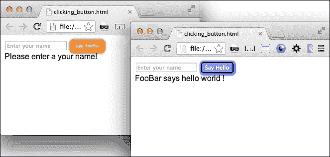
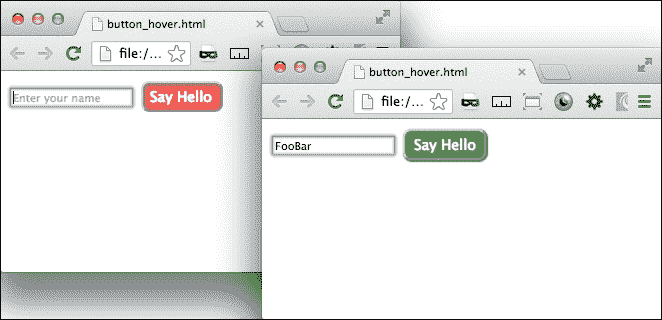
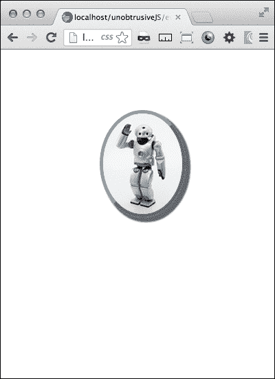

# 第七章。不引人注目的 JavaScript

在本章中，您将学习:

*   低调写“你好世界”
*   用事件监听器创建一个发光的“提交”按钮
*   当你将鼠标悬停在按钮上时，使其突出显示
*   使用不引人注目的 jQuery 调整元素的大小
*   用不引人注目的 JavaScript 屏蔽密码
*   使用事件侦听器制作图像阴影的动画

# 简介

不引人注目的 JavaScript 的概念非常适合响应性设计。通过将交互层与表示层保持一定距离，您可以在 web 应用中构建高度的灵活性。因为移动设备有非常不同的输入方法，所以您可能需要通过不同的事件调用一个函数。你可能想用 JavaScript 创建一个页面的桌面版本，而用 jQuery Mobile 代替你的手机版本；对于相同的模板文件，通过使用不引人注目的 JavaScript，这并不是一项困难的任务。

# 低调写《你好世界》

响应设计的一个重要方面是交互。因为我们知道移动设备和桌面有非常不同的用户界面，所以我们不能期望我们的 JavaScript 交互脚本可以在所有设备上工作。一个说明性的例子是`.mouseover()`或鼠标悬停事件监听器。鼠标没有连接到触摸屏设备上，因此任何在`.mouseover()`事件上的错误尝试都可能起到`.click()`事件的作用。解决这个问题的方法是从模板中完全删除您的交互脚本。

## 做好准备

这种方法被称为不引人注目的 JavaScript。在这里，您可以创建一个外部 JavaScript，通过一系列事件侦听器来设置您的交互，而不是在您的 HTML 模板中嵌入像`onclick()` 这样的脚本。

## 怎么做...

让我们从一个简单的例子开始；我们将只创建一个按钮和一个警报。很多 JavaScripts 都是作为测试开始的；本质上，我将创建一个事件侦听器，然后用警报调试它。我们首先用一个简单的`submit`按钮创建一个 HTML 页面。

```html
<body>
<input type="submit">
</body>
```

给你，这是一个简单的任务，但不是很令人兴奋。这只是一个基本的`submit`按钮，尽管它没有提交任何东西。让我们一步一步来，让它变得更有趣。首先在按钮上添加一些自定义文本，这样我们至少可以对这个页面准备好之后会发生什么有所预期。我们添加`value="Say Hello"`。这对于`body`标签来说已经足够了，接下来我们在标题中添加一个`script`标签:

```html
<script></script>
```

在脚本标签中，您需要添加一个事件来启动 JavaScript。如果没有`$(document).ready(function(){...});`功能，脚本将无法运行:

```html
$(document).ready(function(){
//do something here
};
```

在此功能中，用`:submit`按钮点击事件的监听器替换`//do something`，该事件触发一个功能，以某种方式将 Hello World 显示在屏幕上:

```html
$(":submit").click(function() {
//write "Hello World"
});
```

到目前为止，我们已经创建了一个 JavaScript，当页面加载时加载，当用户点击按钮时监听。当`click`事件发生时，一个函数执行，但此时该函数为空。我们的下一个任务是创建向页面添加“Hello World”文本的方法。

在函数内部，我们希望将“Hello World”文本附加到`:submit`按钮的父元素。由于`:submit`按钮是方法触发的对象，我们可以在 jQuery 中使用`$(this)`来引用它。要附加“Hello World”文本，请使用 jQuery `.append()`方法:

```html
$(this).parent().append("Hello World");
```

jQuery 会在 HTML 的`body`标签后面附加“Hello World”文本。要更好地控制文本的附加位置，请将按钮包装在父`div`元素中。

在浏览器中打开 HTML 文件，测试按钮的功能。如果按下按钮没有使文字 **Hello World** 出现在按钮下方，则说明出了问题。回顾一下教程，看看你误入了什么样的歧途。

在继续之前，我们不能只让文本是纯文本。我们希望以后能在这方面做得更多。用包含`ID`属性`helloWorld`的段落标记来标记它。

至此，我们已经完成了我们的基本意图，点击一个按钮，并编写 Hello World。这很好，但还不够好；因为我们总是超额交货，不是吗？

在`.click()`事件函数之外，为字符串`Hello World`添加一个变量`foo`。接下来，用`foo`变量替换`.append(...)`函数的内部 Hello World 文本。从方法中移除文本并用变量替换它会使事情变得更容易处理，并且只是朝着改进这个函数迈出的一小步。刷新并测试您的页面，确保一切正常。

在`body`标签中，我们现在要通过表单`input`元素将文本发送到脚本来个性化这个页面。在你的 HTML 正文标签中，输入带有`id="bar"`和`placeholder="Enter your name"`的文本`input`元素。

为了从我们的输入框中接收文本，我们需要在您的函数中添加一个新的变量栏。将其设置为等于输入值:

```html
var bar = $('input').val();
```

接下来，更新您的`.append()`方法，将它更改为包括`foo`、`bar`和一些新文本，所有这些都包含在一个可样式化的元素中:

```html
$(this).parent().append("<div class='newText'>" + bar + " says " + foo + "!</div>");
```

现在，当您刷新此页面时，您会看到文本框已被添加。在输入框中输入你的名字，然后观察结果。

这很好，但不完整。现在是时候清理一下了。让我们来看一些我们想要避免的场景。我们不希望能够提交一个空的输入或者继续添加更多的 **Hello World** 的行。

首先，注意空白输入框。让我们添加一个`if`条件来检查输入文本是否为空，然后再将其附加到 HTML 中。在获取输入值的行之后，添加一个带有条件语句的新行，检查变量是否为空字符串。这个条件包装了`append`语句。当输入为空字符串时，还要添加一个`else`语句。在里面，复制`.append()`方法，文本提醒用户在文本输入中输入一个值。

```html
var bar = $('input').val();
if (bar != ""){ 
$(this).parent().append("<div class='newText'>" + bar + " says " + foo + "!</div>");
} else { 
$(this).parent().append("Please enter a your name!") 
};
```

这给你的表单增加了一些验证，如果用空白文本框点击**提交**按钮，会提醒你的用户输入你的名字。还剩下两个清理物品，所以再坚持几分钟。

首先，我们希望每次都重置附加的 HTML。因此，在您的`if`条件语句之后和`else`语句之前添加一行，删除之前添加的`.newText`元素。

```html
$(".newText").remove(); 
```

最后，就在`if`条件结束之前，使用`.val()`方法将输入表单重置为空白值。还可以在文本输入中添加一个`ID`属性，将该值与输入联系起来。

```html
$('input#fooBar').val("");
```

就这样！我们有点过度扼杀了它，但我们有一个非常好的 Hello World 网络应用。

## 它是如何工作的...

不引人注目的 JavaScript 通过在页面加载时加载脚本来工作，并通过使用侦听器来等待页面上发生特定事件来运行。这可能是对你写作方式的一种调整，但这样做的好处是能够将交互与演示分开。

# 用事件监听器创建一个发光的“提交”按钮

使用表单通常是大多数网页设计主题中被忽视的方面，更重要的是，响应性网页设计。非事务性页面通常不使用简单的**联系我们**页面之外的表单，因此表单设计通常是事后的想法。然而，在交易电子商务和软件即服务行业领域，表单是用户交互的最重要元素。在这个世界上，响应性设计不仅仅是响应性的布局和图像，它还包括周到的互动。在这个配方中，我们可以想象一个场景，用户处于表单处理的末尾，准备提交表单。

看到一个人相当滑稽地点击**提交**按钮，看着页面只是坐在那里，看似什么都不做(但实际上是在执行表单的`post`动作)，并通过一次又一次地点击同一个按钮来做出反应，这并不少见。在简单的**联系我们**场景中，这可能会生成一些额外的表单提交电子邮件，但在事务情况下，这可能会激活一长串业务逻辑，并对其他流程造成干扰。

在用户端，可以有这样的想法:点击**提交**按钮后，如果没有立即发生什么，说明出了问题，网站失败了；而最终的结果就是被放弃的交易和受损的对你网站的信任。对此，你可以也应该做很多事情。其中之一是添加视觉提示，让用户知道他们已经成功点击了按钮，并且将要发生一些事情。考虑正在幕后执行的事务以及需要的时间。如果您预计会等待很长时间，请注意您的用户可能不知道这一点。人们通常期望在即时满足的互联网世界里，一切都是即时的，任何不是即时的东西都会被打破。

## 做好准备

在*不引人注意地写“Hello World”*食谱中，我们写了一个简单的提交按钮功能。我们可以把它作为这个食谱的基本构件。如果你手边没有这些代码，你可以在帕克特出版公司的网站([http://www.packtpub.com/](http://www.packtpub.com/))上获得它的最终版本。

## 怎么做...

首先我们需要把提交函数的肉分解成一个单独的函数，由`.click()`事件函数调用。从功能内部剪下所有内容，粘贴到`$(document).ready(function() {...});`功能外部。用对新函数的函数调用来替换您剪切的所有内容。在函数调用中，通过`.attr()`方法将声明的变量`foo`包含在`$(this)`的`ID`值中。然后，将粘贴的代码包装在一个同名的新函数中，并分配它来接收这两个变量。最后在提交输入中添加一个`ID`属性。您的代码应该如下所示:

```html
$(document).ready(function(){ 
     var foo = "hello world "; 
     $(":submit").click(function(){ 
          formAction(foo,$(this).attr("id")); 
     }); 
}); 

function formAction(foo,id){ 
     var bar = $('input').val();
     if (bar != ""){ 
          $(".newText").remove(); 
          $("#" + id).parent().append("<div class='newText'>" + bar + " says " + foo + "!</div>"); 
          $('input#fooBar').val(""); 
      } else { 
          $(".newText").remove(); 
          $("#" + id).parent().append("<div class='newText'>Please enter a your name!</div>"); 
     };
};
```

首先，从`formAction()`函数中移除`bar`变量，并将其粘贴到`.click()`事件侦听器函数中。这将在每次点击事件中构建变量。现在开始建设新的功能；在 JavaScript 中添加一个名为`buttonAnimate()`的新函数，并在`.click()`事件侦听器中的`formAction()`调用之后调用它。在`buttonAnimate()`功能调用中，发送`bar`变量。最后，将`bar`变量添加到`formAction()`函数调用和函数声明变量中。关键的发展是我们已经在`.click()`事件监听器函数中添加了作为变量的输入值，并将其发送给两个函数调用。

有了这种方式，我们现在可以开始在按钮上编写动画效果的新功能了。休息一下，喝杯咖啡。我们打算暂时换挡，写一些 CSS。

向项目中添加样式表；在样式表中，添加两个类`.valid`和`.invalid`，这两个类将针对其两种不同的响应状态`valid`和`invalid`作用于按钮。提交时将文本输入表单时会出现`pass`场景，按下**提交**按钮而不在`form`元素中输入文本时会出现`fail`场景。

```html
.valid{...}
.invalid{...}
```

在`valid`状态下，我们已经提交了输入框中有文本的表单。我们想给代表正态的按钮添加 CSS 按钮已被激活，表示发生了正确的事情。我添加了边框、阴影、文本阴影、背景色、文本色和边框半径。这将是一个足够的指标，表明预期的事情已经发生。

```html
.valid{ 
     border:2px solid #000; 
     -webkit-box-shadow: 1px 1px 5px 3px #0000ff; 
     box-shadow: 1px 1px 5px 3px #0000ff; 
     text-shadow: 1px 1px 1px #666666; 
     filter: dropshadow(color=#666666, offx=1, offy=1); 
     background-color:rgb(150, 150, 255); 
     color:#ffffff; 
     -webkit-border-radius: 5px; 
     border-radius: 5px; 
}
```

我们将相同的 CSS 样式类型添加到`invalid`状态，在该状态下，用户已经提交了输入框中没有文本的表单。在这种情况下，我们希望给出出现问题的视觉线索，并提示用户注意再试一次。在这种情况下，橙色和红色是表示出错的好颜色。此外，我们还添加了带有过渡的 CSS 模糊效果。

```html
.invalid{ 
     border:2px solid #ffff00; 
     -webkit-box-shadow: 1px 1px 5px 3px rgb(255, 0, 0); 
     box-shadow: 1px 1px 5px 3px rgb(255, 0, 0); 
     background-color:rgb(255, 133, 0); 
     color:#ffffff; -webkit-border-radius: 
     5px; border-radius: 5px; 
     -webkit-filter: grayscale(0.1) blur(1px); 
     -webkit-transition: border 0.2s ease; 
     -moz-transition: border 0.2s ease; 
     -ms-transition: border 0.2s ease; 
     -o-transition: border 0.2s ease; 
     transition: border 0.2s ease; 
     text-shadow: 1px 1px 1px #666666; 
     filter: dropshadow(color=#666666, offx=1, offy=1); 
}
```

这就是我们要为这个食谱写的所有 CSS。接下来，我们将编写 JavaScript，将两种不同的风格与实际状态联系起来。很久以前，在这个食谱中，我们创建了一个名为`buttonAnimate()` 的空函数，它接收变量`bar`，现在是时候构建它了。在里面，添加同样的`if`条件语句，检查`bar`是否为空字符串。如果是，在`submit`按钮上增加`valid`等级，如果不是，增加`invalid`等级。这增加了`invalid`类，提醒用户有什么地方出错了，需要采取行动。

```html
if(bar!= ""){ 
     $(":submit").addClass("valid"); 
} else { 
     $(":submit").addClass("invalid"); 
};
```

当采取适当的动作时，即当用户点击表单元素输入文本时，按钮应重置为其原始状态；从技术上讲，应该删除新添加的类。该代码如下:

```html
$('input#fooBar').focus(function(){ 
     $(":submit").removeClass('invalid') 
}); 
```

清理剩下的最后一点是从`if`和`else`条件的开始移除任一类或两类。使用。`removeClass()`方法在`submit`元素上两次，移除与要添加的类相对的类。

```html
function buttonAnimate(bar){ 
     if(bar!= ""){ 
          $(":submit").removeClass("invalid"); 
          $(":submit").addClass("valid"); 
     } else { 
          $(":submit").removeClass("valid"); 
          $(":submit").addClass("invalid"); 
          $('input#fooBar').focus(function(){ 
                $(":submit").removeClass('invalid') 
          }); 
     }; 
};
```

现在重新加载并测试页面，看看你创造的魔法。它看起来像下面的截图:



## 它是如何工作的...

jQuery 是一个很棒的库，它为你快速创建优秀的网络应用提供了很大的帮助，而且只需要很少的代码。在普通的老 JavaScript 的旧世界里，这个功能会花费你更多的代码和时间。它具有库功能，可以读取表单的值，轻松添加 HTML，以及打开和关闭 CSS 类。你只需要实现一些 jQuery 方法和 CSS，剩下的就交给你了。

# 将鼠标悬停在按钮上时，使其突出

有时候，响应性设计的最大挑战是当需求仅仅是构建足够好的东西时，能够真正地过度交付一个项目。按钮是一个机会，你可以为一个让用户惊讶的产品提供额外的抛光。如果我们没有过度交付，我们可以扔一个`:hover`选择器在这，然后完成。然而，在这个食谱中，我们将制作一个按钮，当你悬停在上面时，它会像老板一样发光。

## 做好准备

了解过度交付的陷阱。给予比要求更多是我们都应该努力争取的，但是要注意不要设定你无法满足的不合理的期望，否则会让一个成功的项目走向失败。

在之前的配方中，我们创建了一个带有按钮的表单，当您单击该按钮时，它会显示动画。对于这个配方，您可以继续使用该代码。你也可以去下载那个配方的代码，或者这个配方。

或者你可以制作一个表单和按钮元素。没那么难。

## 怎么做...

我们本质上是从一个包含两个表单元素的页面开始；输入框和提交按钮。正如我前面提到的，这些是在以前的食谱中建立的；你也可以在这里建造它们。我们在食谱中构建的 JavaScript 将与新的交互一起工作，但不是必需的。`input`元素有`id`属性`fooBar`，按钮有`id`属性`submit`。

```html
<input id="fooBar" type="text" placeholder="Enter your name">
<input id="submit" type="submit" value="Say Hello">
```

让我们从让按钮的默认外观更有趣开始。给你的 CSS 添加一个`input#submit`元素的样式。在样式中，添加蓝色背景色、白色字体颜色、8 点边框半径、14 像素字体大小以及 5 像素和 8 像素的填充。这可以使用以下代码来完成:

```html
input#submit{ 
     background-color:blue; 
     color:white; 
     border-radius:8px; 
     font-size:14px; 
     padding:5px 8px; 
}
```

既然按钮的默认外观已经定义，让我们来谈谈交互设计。在这里，我们得到了使用 JavaScript 来处理`.mouseover()`事件而不是 CSS `:hover`选择器的实际优势。我想与`form`元素交互，并询问是否在其中输入了文本。如果输入了文本，我们需要一个特殊的视觉提示，表明表单已经准备好提交；如果没有提交任何文本，强烈的视觉提示应该告诉用户停下来，并返回再次检查他们的表单。

首先，如果表单已准备好提交，按钮会向鼠标指针伸出并变成绿色。CSS 将包括一个带有`!important`覆盖的绿色背景，一个方框阴影和一个文本阴影。有关确切的 CSS 语法，请参见下面的代码片段:

```html
.buttonLight{
     background-color:green !important;
     -webkit-box-shadow: 1px 1px 2px 1px green;
     box-shadow: 1px 1px 2px 1px green;
     text-shadow: 1px 1px 2px #666666;
     filter: dropshadow(color=#666666, offx=1, offy=1);
            }
```

或者，如果表单输入为空，按钮将变为红色，并从鼠标指针处缩回。这个 CSS 将有一个带有`!important`覆盖的红色背景颜色和嵌入阴影，以及一个使文本模糊的文本阴影。

```html
.redButtonLight{
     background-color:red !important;
     -webkit-box-shadow:inset 1px 1px 3px 2px #663535;
     box-shadow:inset 1px 1px 3px 2px #663535;
     text-shadow: 0px 0px 2px #fff;
     filter: dropshadow(color=#fff, offx=0, offy=0);
}
```

这就是我们正在创建的 CSS 的范围。是时候建立互动了。在你的标题中，如果你还没有这样做，创建开始和结束`<script>`标签。首先，我们创建`(document).ready`监听器:

```html
     $(document).ready(function(){
          //do some things here
     });
```

这并没有多大作用，但这是一个开始。所以让我们继续构建交互性。在`(document).ready`监听器功能中，为`.mouseover()`事件添加一个事件监听器，为`.mouseout()`事件添加一个事件监听器。`.mouseover()`监听器取代了悬停在功能，既会动画化按钮，又会添加我们之前构建的一个 CSS 类，而`.mouseout()`监听器则完成了悬停在功能，最终会移除已经添加的`.mouseover()`功能的`class`属性。

```html
$(document).ready(function(){
     $("#submit").mouseover(function(){
          //do something
     });
     $("#submit").mouseout(function(){
          //do something else
     });
});
```

接下来，让我们首先构建`.mouseover()`事件监听器功能。在其核心，它执行两个功能；首先，它查询表单`input`元素的值，然后根据表单`input`元素的值更改`submit`按钮。第一部分，查询输入的值，如下所示:

```html
if($('input').val()!="")
     //do something
} else {
     //do something else
}
```

第一个条件，当表单的值不是空字符串时，应该创建新的变量，`classtoAdd = "buttonLight"`和`paddingAdd = "5px 8px 5px 9px"`。另一个条件，当表单的值为空字符串时，创建相同的变量，`classtoAdd = "redButtonLight"`和`paddingAdd = "5px 9px 5px 7px"`。这些将应用于该功能下一部分的`submit`按钮。

函数的下一部分开始于用`.animate()`方法制作按钮的不透明度和填充动画，并添加由`classtoAdd`变量确定的类。动画应该有点快，比如 100 毫秒。

```html
$("#submit").animate({opacity: 0.7, padding: paddingAdd},
100, function(){ 
     $("#submit").addClass(classtoAdd); 
});
```

这就是`.mouseover()`事件所需要的全部。接下来需要的是`.mouseout()`函数的内部工作。再次激活`submit`按钮的`position`和`padding`属性，但是时间要长一些，然后移除`class`属性。

```html
$("#submit").mouseout(function(){ 
     $("#submit").animate({opacity: 1, padding :"5px 8px"}, 
     300, function(){ 
          $("#submit").removeClass(classtoAdd); 
     }); 
});
```

就是这样。启动页面并观看按钮的交互。下面的截图说明了同样的情况:



## 它是如何工作的...

这个配方使用事件侦听器来替换简单的 CSS `:hover`选择器，该选择器只能使用有限的逻辑来部署，而`.mouseover()`事件侦听器可以对表单`input`元素进行查询，以查看表单数据是否为空。根据页面的表单状态，脚本可以为按钮分配不同的 CSS 类。这为应用的客户端增加了另一层逻辑，并为应用增加了更丰富的交互性。

# 使用不引人注目的 jQuery 调整元素的大小

这个配方的目的是在您的项目中构建一个智能图像元素处理程序。这将是一个简单的元素，可以响应你的屏幕尺寸。我们可以用一个不引人注目的 jQuery 脚本来完成这一切。

在之前的食谱中，我们使用 PHP 通过服务器端脚本调整了图像的大小。这个方法将会达到类似的结果，但是它将是客户端而不是服务器端，并且它将是一个移动优先的响应设计。

这个配方是移动优先响应设计的好工具。例如，如果您希望缩小的图像首先显示文档的加载，并且如果屏幕很大，脚本将使用更大版本的图像替换该图像。这种不引人注目的方面意味着可以通过向图像添加`class`属性来轻松调用脚本。

## 做好准备

这个食谱从头开始，所以你不需要下载任何东西就可以开始。但是，您确实需要插入 jQuery 库来实现这一点。在标题中，包含在线 jQuery 库的路径:

```html
<script src="">
```

## 怎么做...

一旦你用 jQuery 库的路径设置了你的头，就给 HTML 头添加一个脚本元素。在`<script>`标签中，我们将很快添加一些事件监听器和一个调整元素大小的函数。

在你的 HTML 正文中，添加一个 div 元素来包装页面中的子元素。给那堂课`wrap`。在`.wrap` div 元素中，添加两个子 div 元素。

在其中一个 div 元素中，我们将插入一个图像。我们希望有两个版本可供页面显示，因此请打开您的图像编辑软件(如果您没有，请转到[www.gimp.com](http://www.gimp.com)并下载)，为您想要显示的图像创建两个版本，一个大版本和一个小版本。

说出两个图像`imagename-small`和`imagename-large`。我为食谱创建的图像是`robot-small.png`和`robot-large.png`。添加带有图像元素的小图像，并将类`scalable`添加到图像元素中。

```html

```

现在我们已经有了基本的 HTML，让我们做一些轻微的 CSS 布局和样式。将`<style>`标签添加到您的标题中。在内部，为`div.wrap`元素添加一个宽为`75%`的样式。将其第一个子元素向左浮动，并指定`50%`宽度。对第二子元素执行相反的操作。您可以为每个元素添加不同颜色的背景，以查看这两个元素之间的区别。最后，对于`img`，增加一个响应的`100%`宽度和`auto`高度。CSS 显示如下:

```html
div.wrap{width:75%;}
div.wrap div:first-child{float:left;width:50%;background-color:#ccc;}
div.wrap div:nth-child(2){float:right;width:50%;background-color:#666;}
div.wrap div img{width:100%;height:auto;}
```

现在页面布局已经准备好了，是时候构建 JavaScript 了。接下来应该创建替换图像的最重要的功能，即实用功能。它将在一个单独的函数中被调用，该函数带有用大版本还是小版本替换它的参数。

```html
function replaceImage(size){...}
```

在函数内部，首先我们需要看发送的参数是大还是小。用`else`条件创建一个简单的`if`条件语句来检查这一点。

```html
if (size == 'small') {…} else {…};
```

如果参数为`small`，则该功能工作用小版本替换 HTML 中的图像。首先，为了防止函数不必要地用小版本替换小版本，添加另一个`if`条件，使用`.indexOf()`方法检查类为`scalable`的`img`元素在`src`属性中是否有字符串`large`。如果`.indexOf()`方法发现字符串存在，它将返回在`img.scalable`对象中找到它的位置的索引号。具体`if`条件会问指标是否大于`1`；如果大于 1，则`if`条件为真。

```html
if($("img.scalable").attr("src").indexOf('large')>1){…}
```

在条件语句中，创建一个新的变量`newImageReplace`，这将在下一行创建一个字符串来设置`src`属性。设置变量的值以获取`img.scalable`对象的`src`属性，并将字符串部分`-large.`替换为`-small.`(我包含了尾随句点，以防您的原始图像名称包含`-large.`)。

```html
var newImageReplace = $("img.scalable").attr("src").replace("-large.", "-small.");
```

下一行使用`.attr()`方法将`img.scalable`对象的`src`属性的值更新为之前创建的变量`"robot-small.png"`的值。

```html
$("img.scalable").attr({src:newImageReplace});
```

那就是`if`条件，没有`else`条件就没有办法行动。接下来，对于父元素的`else`条件，如果`size`参数不是`small`，该函数将执行与之前完全相反的操作。使用`.indexOf()`方法检查`small`图像是否存在，如果存在，将`src`属性更改为指向`large`图像。

```html
} else {
     if($("img.scalable").attr("src").indexOf('small')>1){
          var newImageReplace =    $("img.scalable").attr("src").replace("-small.", "-large."); 
          $("img.scalable").attr({src:newImageReplace});
     };
};
```

这就完成了最重要的动作功能。现在让我们回溯以创建用参数调用它的函数。这个函数需要获得一些关于屏幕宽度的信息，因此，称之为`measureWindow()`。在内部，首先通过测量窗口宽度将情报收集到一个名为`getWindowWidth`的变量中。如果窗口宽度很小，比如说比`600` px 小，并且你想让它调用小图像，那么它应该调用带有参数`small`的`replaceImage()`函数。如果大于`600` px，用参数`large`调用函数。

```html
function measureWindow(){
     var getWindowWidth = $(window).width();  
     if (getWindowWidth < 600){
          replaceImage("small");
     } else {
          replaceImage("large");
     };
};
```

那个测量屏幕宽度，然后调用调整大小函数的函数，本身就需要调用。它不只是自己开火。我们不希望它一直测量屏幕宽度。我们只希望它发生在两种情况下。首先，在页面加载上，当我们想要检查屏幕是否大，并快速将低分辨率图像替换为更高分辨率的图像时。对于这种情况，调用如下:

```html
$(document).ready(function(){
     measureWindow();            
});
```

第二种情况是用户改变屏幕宽度。我们将使用`.resize()`监听器在调整窗口大小时触发一个函数。

```html
            $(window).resize(function(){
                    measureWindow();
            });
```

现在我们真的完了，这已经够短了。当您在`600` px 下调整屏幕大小时，启动文件并打开您的检查器或调试器来观察图像`src`的变化。如果你想的话，你可以在此基础上提供一些不同的尺寸。

## 它是如何工作的...

这个方法给出了一个使用不引人注目的 JavaScript 进行客户端响应图像传递的可用例子。它测量屏幕宽度，只要有一些变化，并适当地更新图像源。

# 用不引人注目的 JavaScript 屏蔽密码

处理屏蔽密码的最常见方式是在创建输入元素时使用密码类型。这是在桌面上使用时的最佳实践。然而，在移动设备上输入密码时，设备的触摸输入极有可能出现输入错误。这些输入错误通常不会被捕获，因为您看不到加密的文本。这是 iOS 的设计师们真正做对的一个问题。他们创建了一个输入，其中输入文本在变成`*`之前短时间可见，或者在输入下一个字符时发生变化。

在本食谱中，我们将为您的密码输入创建一个模拟该解决方案的密码输入。

您也可以使用这个表单元素来屏蔽其他表单条目。但是请确保您理解底层的隐藏表单包含要传输的条目。除非您指定，否则它不会加密。这只能防止密码被看到。

## 做好准备

您不需要在本地获取任何文件就可以开始。只有在你的标题中包含到 jQuery 库的链接。这将允许您插入 jQuery 库，并使用它们来扩展代码的功能。

```html
<script src="http://code.jquery.com/jquery-1.8.2.min.js"></script>
```

## 怎么做...

第一个任务是在你的 HTML 主体中创建两个`input`元素。第一个有密码的`type`和`ID`属性。这将是表单中提交的加密版本，但最终将被隐藏。第二个会有 ID `altDisplay`并且被禁用，所以用户不能在里面点击。这一个将显示在另一个的顶部，它将看起来是用户正在键入的那个。最后，我们将添加一种样式来隐藏密码字段。

这就是食谱的 HTML 主体所需要的全部内容，当然，您可以根据需要添加其他表单元素。

在标题中，添加一个 JavaScript `<script>`元素，在里面添加 jQuery `$(document).ready`函数。在其中，为`.keyup()`事件的`#password`输入添加一个监听器。这发生在按键被按下之后，当按键被放开时，事件触发。

但是在我们进入这个食谱之前，还有一个小障碍需要处理。第一，不是所有按键都按下输入一个字母；有 *Shift* 、 *Tab* 和功能键，然后有 *Delete* 键。每个按键都有一个数字标识，登录控制台`e.which`即可找到。您将需要数字按键标识符来编写一个条件来过滤掉非字符按键事件。

首先，我们应该设置一系列`if`条件，以确保我们没有得到不是实际字符的击键。在这里面，创建一个附加的`if`语句来检查*删除* (8)键没有被输入。如果没有，我们可以继续使用函数来处理常规字符`keyup`事件，否则我们将需要添加功能来处理`delete keyup`事件(稍后会出现)。

```html
$(document).ready(function(){
     $("#password").keyup(function(e){
          if (e.which!=16 && e.which!=27 && e.which!=91 &&e.which!=18 && e.which!=17 && e.which!=20 ){
               if (e.which!=8){
                    //do something for the character key
               }else{
                    //Do something for the delete key
               }}; 
          });
     });
```

在字符`keyup`、的条件下，我们将把两个输入字段的当前值都变成变量`altDisplayVal`和`passwordVal`。获取`#altDisplay`输入中的值，其值在正则表达式中全部更改为`*`，并存储在`regAltDisplayVal`变量中。取`#password`中的值，用`.charAt()`方法取出最后一个字母放入新变量中。这两个新变量相加，成为`#altDisplay`输入的新值。

```html
var altDisplayVal = $("#altDisplay").val();
var passwordVal = $("#password").val();
var regAltDisplayVal = altDisplayVal.replace(/./g,"*");
var passwordValLastLetter = passwordVal.charAt( passwordVal.length-1 );
$("#altDisplay").val(regAltDisplayVal + passwordValLastLetter);
```

在字符键上处理了`keyup`，接下来让我们为删除键编写功能。删除键的不同之处在于它删除了字符串中的最后一个字符。要处理删除快捷键事件，使用`.charAt()`方法获取`#password`输入中的最后一个字符，并将其保存在`delLast`变量中。

然后使用`.slice()`方法首先通过`delTxt`变量倒数第二个字符。使用正则表达式将字符更改为`*`，并将其存储在`regDelTxt`变量中。最后，添加`regDelTxt`和`delLast`变量，使`#altDisplay`输入元素的新值。

```html
var delLast = this.value.charAt(this.value.length-1);
var delTxt = this.value.slice(0,this.value.length-1);
var regDelTxt = delTxt.replace(/./g,"*");
$("#altDisplay").val(regDelTxt + delLast);
```

这就解决了 JavaScript 的问题。现在，您可以启动页面并在页面上看到两个输入元素。在第一个输入元素中输入文本，然后它将作为`*`进入第二个输入元素。现在唯一的问题是，页面中有两个并排的表单元素并不能使其成为 iOS 风格的密码元素。为了让它真正工作，我们需要将`#password`输入叠加在`#altDisplay`上，使其不可见。您可以使用一些 CSS 来实现这一点，如下所示:

```html
div input:first-child{ 
     position: relative; 
     left: 131px; 
     background: transparent; 
     color: transparent; 
}
```

那里，试试看。刷新屏幕时，您将只看到一个输入元素。当你输入文本时，它会变成星星。

## 它是如何工作的...

这实际上并没有改变提交的输入；它只隐藏它，并将隐藏字段中的值转换为星形字符。它应该很好地模仿了 iOS 密码输入。

# 使用事件监听器激活图像阴影

既然这是最后的食谱，那应该是好玩的食谱。这个采用响应图像，就像我们在[第 1 章](01.html "Chapter 1. Responsive Elements and Media")、*响应元素和媒体*中构建的图像一样，并使用 jQuery 事件监听器和 CSS3 制作阴影动画来跟随您的光标。

这是一个简单的食谱，但它仍然以响应的方式工作。图像将响应页面宽度，而 jQuery 的编写方式仍然是在每次鼠标移动时测量图像位置和鼠标位置。

## 做好准备

这个食谱需要你使用 jQuery。因此，在新文件的标题中，添加一个到 jQuery 库的链接。除此之外，你已经准备好了。

```html
<script src="http://code.jquery.com/jquery-1.8.2.min.js"></script>
```

## 怎么做...

首先，使用类`wrap`的 div 元素创建你的 HTML 文件的主体。在里面，添加一个带有类`topRight`的图像。下一个。CSS。

```html
<div class="wrap">
     
</div>
```

为 CSS 添加一个部分。首先，给身体添加一个`text-align: center`风格。接下来，给`.wrap` div 元素一个宽度`30%`，给一个自动水平宽度。这在下面的代码片段中显示:

```html
body{text-align:center;} 
.wrap{
     width:30%;
     margin:0 auto;
} 
.wrap img{ 
     width:100%; 
     height:auto; 
     margin:80px 1%; 
     border-radius:50%; 
     -webkit-border-radius:50%; 
     border:1px dotted #666; 
}
```

下一组 CSS 将根据鼠标位置改变 jQuery 脚本分配的图像类变量。每个包含不同角度的`box-shadow`。说出不同的等级`topLeft`、`topRight`、`bottomLeft`和`bottomRight`。每一个都有`5`像素的阴影偏移、`2`像素的扩散和`2`像素的模糊半径。

```html
img.topLeft{
     border-top: 5px solid #666;
     border-right:5px solid #999;
     border-bottom: 5px solid #999;
     border-left:5px solid #666;
     -webkit-box-shadow: -5px -5px 2px 2px #666;
     box-shadow: -5px -5px 2px 2px #666;
}
img.topRight{
     border-top: 5px solid #666;
     border-right:5px solid #666;
     border-bottom: 5px solid #999;
     border-left:5px solid #999;
     -webkit-box-shadow: 5px -5px 2px 2px #666;
     box-shadow: 5px -5px 2px 2px #666;
}
img.bottomLeft{
     border-top: 5px solid #999;
     border-right:5px solid #999;
     border-bottom: 5px solid #666;
     border-left:5px solid #666;
     -webkit-box-shadow: -5px 5px 2px 2px #666;
     box-shadow: -5px 5px 2px 2px #666;
}
img.bottomRight{
     border-top: 5px solid #999;
     border-right:5px solid #666;
     border-bottom: 5px solid #666;
     border-left:5px solid #999;|
     -webkit-box-shadow: 5px 5px 2px 2px #666;
     box-shadow: 5px 5px 2px 2px #666;
}
```

优秀工作至今。现在是时候构建 JavaScript 了。在您的`script`标签中，创建标准的`$(document).ready`事件功能。然后，开始给身体添加一个`.mousemove()`事件监听器功能。在其中，为`.wrap img` div 元素的水平和垂直位置创建两个新变量`imgHorz`和`imgVert`。

```html
$("body").mousemove(function(e){
     var imgHorz = ($(".wrap img").offset().left);
     var imgVert = ($(".wrap img").offset().top);
});
```

接下来，在创建了变量之后，我们根据变量值与事件发生时的鼠标位置进行比较来创建一些条件。如果结果为真，那么在添加一个图像类之前，删除所有的 CSS 类。

```html
if(e.pageX < imgHorz && e.pageY < imgVert){ 
     $(".wrap img").removeClass();
     $(".wrap img").addClass("bottomRight");
};
```

然后你会想要添加三个额外的`else` / `if`条件来添加其他类。下面的代码片段显示了显示的四个条件:

```html
if(e.pageX < imgHorz && e.pageY < imgVert){
     $(".wrap img").removeClass(); 
     $(".wrap img").addClass("bottomRight");
} else if (e.pageX > imgHorz && e.pageY < imgVert) {
     $(".wrap img").removeClass(); 
     $(".wrap img").addClass("bottomLeft"); 
} else if(e.pageX > imgHorz && e.pageY > imgVert) { 
     $(".wrap img").removeClass(); 
     $(".wrap img").addClass("topLeft"); 
} else if(e.pageX < imgHorz && e.pageY > imgVert) { 
     $(".wrap img").removeClass(); 
     $(".wrap img").addClass("topRight"); 
};
```

这就结束了 JavaScript。

最后一件事我们还需要制作 CSS 样式之间过渡的动画。因此，与其添加更多的 JavaScript，不如给`.wrap img`元素添加一个 CSS 过渡(每个浏览器都需要自己的过渡命令)。

```html
-webkit-transition: all .5s linear; 
-o-transition: all .5s linear; 
-moz-transition: all .5s linear; 
-ms-transition: all .5s linear; 
-kthtml-transition: all .5s linear; 
transition: all .5s linear;
```

这是一个相当简单的方法，最终的结果是一个有趣的图像元素，阴影跟随鼠标移动。下面的截图说明了这个配方:



## 它是如何工作的...

这个食谱测量每个`.mousemove()`事件中图像和鼠标的位置。每一个的结果是一个新的阴影被应用到对象。现在重要的是思考什么事件适合移动设备而不是台式机。一个`.mousemove()`事件不会工作，因为没有鼠标连接到移动设备。从这里开始，我将参考[第 5 章](05.html "Chapter 5. Making Mobile-first Web Applications")、*制作移动优先的网络应用*，了解如何为移动设备加载像 jQuery Mobile 这样的 JavaScripts。

我们使用不引人注目的 JavaScript 构建了简单的用户界面交互。我希望这些简单的脚本不仅是您可以在项目中实际使用的有用示例，而且还能有效地演示如何编写可以在模板文件之外运行的 JavaScript。当您将它与可调用到移动设备的脚本的移动版本配对时，这符合您的响应设计。展望未来，这将帮助您创建更具响应性和流畅过渡的网络项目。

长命百岁，繁荣昌盛，我的朋友们。