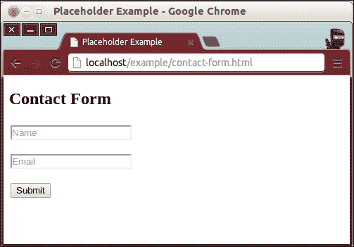

# 第一章。HTML5 概述

欢迎来到迷人的网络开发世界！当我们开始 HTML5 开发之旅时，我们将花时间回顾过去。毕竟，除非你知道自己从哪里来，否则你不可能真正有所成就。除非你在过去的几年里一直生活在岩石下，否则你肯定听说过很多关于网络 2.0、开放网络以及 HTML5 的事情。如果你从三个不同的人那里听到过这些术语，你可能也会听到至少三种不同的定义。为此，我们将简要描述这些术语的含义，为什么你应该对它们感到兴奋，以及 HTML5 是如何改变游戏规则的。

# 什么是 HTML？

第一个术语在我们开始谈论开放网络之前，我们需要弄清楚，HTML5 如何在它的成功中发挥核心作用，就是 HTML。简单地说，HTML 是一种非常基本的标记语言，用于向读取文本文件的程序描述文本文件。虽然这可能是对它的最广义的定义，但有趣的是，这样一项基本技术在我们整个社会的发展中发挥了如此重要的作用。从最初的卑微开始，最初服务于一个非常特定的目的，HTML 已经成为网络的主要标记语言，反过来，它也进入了世界上几乎每一个家庭，以及大多数公文包、口袋和其他电子设备。

鉴于超文本标记语言的这种戏剧性和广泛的影响，很快就清楚了，这项技术需要做的不仅仅是简单地声明一些文本块的颜色，或者存储在一些研究论文中的照片的宽度和高度。由于多年来 Web 的使用方式多种多样，HTML 不断发展和演变，从一种简单的标记语言发展到成为开发功能强大、高度复杂的在线应用程序和服务的基础。

## HTML 简史

**超文本标记语言**，简称 **HTML** ，我们今天所知道的最早是在 1989 年在蒂姆·伯纳斯·李的脑海中构想出来的。当时，蒂姆·伯纳斯·李在瑞士日内瓦的欧洲粒子物理实验室工作，他认为将科学家撰写和使用的各种研究文件联系起来是有益的。这样，不是有一个人可以阅读的大量单独和独立的文档，每个引用另一篇研究论文的文档都可以有一个到另一个文档的超链接，这样读者就可以轻松、及时地从一个文档导航到下一个文档。

为了实现将文档超级链接在一起的想法，蒂姆·伯纳斯·李将一种现有的标记语言作为自己的标记语言的基础——作为起点的标准通用标记语言或 **SGML** 。SGML 是一种简单的语言，旨在通过使用标签词汇表来构造文本。例如，为了指定一个文本块将被解释为一个段落，人们会用一对“段落标记”来包围这样的文本，这看起来与今天的 HTML 中的段落标记相同。虽然蒂姆版本语言中的基本词汇保持不变，但增加了一个关键标签——超链接标签。于是，HTML 诞生了。

请记住，蒂姆对这门语言的设想非常具体。通过 HTML 将文档交叉引用在一起的能力，可以更有效地研究已发表的科研论文。直到许多年后，HTML 才开始被用于除了共享互连文本之外的其他目的。

## 万维网的演变

随着计算机变得越来越普遍，越来越多的人开始拥有自己的机器，随着互联网的应用越来越广泛，人们开始寻找使用新技术的新方法。人们不再简单地用网络来阅读别人写的东西，而是开始用它来通过写作和发布文档与人交流。没过多久，互联网就变成了一个巨大的虚拟社会。

互联网在整个 20 世纪 90 年代持续普及，不同的用途不断涌现。对于如何使用这种惊人的基础设施的每一个新想法，都必须想出新的方法来实现这些想法，因为支持互联网的技术仍然是一样的。就其核心而言，网络应用程序仍然只是一个基于文本的文档，使用 HTML 进行格式化。为了给这个原本静态的数据添加一些逻辑，程序员使用存储在网络服务器中的程序来处理用户的输入，并动态地创建 HTML 文档。同样，用户在互联网上导航时交互的实际文档只不过是纯 HTML。

为了让互联网继续发展，并适应其使用的方式和目的，需要改变。如果有一种方法可以在网页上添加某种代码，这样它就可以在浏览器上处理信息，而不是只向 HTML 阅读器(网络浏览器)发送纯文本数据，这样效率会更高。于是，JavaScript 诞生了。

今天，无论是从使用它的人数来看，还是从使用它的方式和目的来看，网络都在持续增长。好消息是，支持和运行网络的技术也在增长和发展，因此可以适应新的用例。

# 什么是 HTML5？

你无疑听到过人们在不同的语境下使用 HTML5 这个术语，这大概至少造成了一些混乱。像大多数进入普通人群的所谓技术术语一样，HTML5 进入普通人群实际上意味着不止一件事。在最基本的层面上，HTML5 指的是由蒂姆·伯纳斯·李创建的标记语言的下一个版本，现在有一个管理机构来指导它的进展。这个术语的另一个含义是指与标记语言互补的其他技术，以及开放网络的概念，我们将在本章后面详细讨论。

## html 5——进化的下一步

信不信由你，很长一段时间以来，人们一直在尝试开发全功能、复杂的应用程序，以便在网络浏览器中执行。在很大程度上，最大的挑战是实现这一目标所需的技术直到最近才完全可用。使用早期版本的 HTML 创建大型网络应用程序如此困难的原因是 HTML 最初并不是为此而设计的。然而，随着网络的发展，HTML 也在发展。

HTML5 的目标之一就是实现这一点——让开发人员能够创建完全在互联网上运行的强大、非琐碎的应用程序。HTML5 的另一个主要目标是完全向后兼容，以便用于其他目的的网页(即研究文档的超链接)仍然可以发挥相同的功能。

正如蒂姆·伯纳斯·李在 SGML 中添加了超链接标签(以及其他标签)，HTML5 基本上就是这样——在语言的早期版本中添加了更多的标签(或更多的功能)。虽然这是对 HTML5 的一个很好的概述，但故事还有更多的内容。除了添加到 HTML 规范中的新标签之外，术语 HTML5 也指的是 Web 发展的下一步。

有人称之为网络 2.0，也有人称之为未来的 T2。当我提到 HTML 历史上的下一步时，我会提到对 HTML、CSS 和 JavaScript 所做的升级，因为这是这个新互联网背后的三大技术，其中网络应用程序(包括在线游戏)是关注的中心，也是本书的重点之一。

# HTML5 不是单一的功能

在向开发人员提供新功能之前，HTML5 试图解决以前版本的 HTML 中暴露的核心问题，即编程架构。由于最初创建 HTML 时并没有考虑到 web 应用程序开发，因此当程序员开始将它用于此类目的时，他们很快发现自己的代码非常混乱。应用程序数据与表示代码严重混合，而表示代码又与应用程序逻辑紧密耦合。

为了解决这个问题，开发人员获得了**级联样式表** ( **CSS** ) ，这允许他们将 HTML 标记(信息)与信息的呈现方式分开。因此，术语 HTML5 实际上指的是三种独立的技术，即 HTML5(新的语义元素或标签)、CSS3 和 JavaScript(所有新的 API，如网络存储、网络工作者和网络套接字，仅举几例)。

# 更多语义文档结构

当开发人员看到对现有技术的需求，并尝试不同的应用程序时，他们会使用现有的技术，并使其适应新的环境。以前版本的 HTML 就是这种情况。由于只有少数容器标签存在，开发人员用相同的元素描述了非常复杂的文档结构；虽然这完成了工作，但它也使维护结构变得混乱和困难。简单来说，如果你拥有的只是一把锤子，那么你看到的一切都会变成钉子。

例如，开发人员在描述如下图所示的结构时，通常使用`<div>`标记来表示文档的每个部分:


图 1

上图展示了上一代网页设计中构建的大多数网站非常典型的结构。

这种设计可以用以下结构表示:

```html
<div id="wrapper">
  <div id="header"></div>
  <div id="body">
    <div id="main_content">
      <p>Lorem Ipsum...</p>
    </div>
    <div id="sidebar"></div>
  </div>
  <div id="footer"></div>
</div>
```

尽管将`<div>`标签用于任何目的都是完成工作的一种方式，但你可以看到这是如何迅速失控的，并在没有仔细检查的情况下将文档变成难以理解的东西。当您看到一长串结束`<div` >标签时，查看这种类型的代码变得特别麻烦——既然所有标签都有相同的名称，您怎么知道每个结束标签实际上在结束什么？更糟糕的是，你怎么知道你是否有正确数量的结束标签？

在“T0”范式之后设计 HTML 结构的另一个主要问题是，从语义的角度来看，每个标签都完全没有意义。为了使每个`<div>`标签稍微更有意义和自我描述，添加了额外的属性，通常以一个标识或一个类的形式。同样，这个解决方案只是增加了问题，因为更大、更复杂的文档需要越来越多的这些属性，人们必须跟踪这些属性，从而增加了本应简单的解决方案的复杂性。

谢天谢地，在 HTML5 中，这个问题以一种非常优雅的方式得到了解决。看到很多文档出于同样的目的使用`<div>`标签，即定义公共部分，如页眉、页脚、导航和主要内容，添加了新的标签来表示这些公共部分。有了这些新标签，您现在可以直观地浏览设计结构，并非常快速地理解信息的布局方式。此外，为了区分每个`<div>`标签而创建无限的标识属性的需求已经完全消失了。

使用 HTML5 提供的一些新标签，来自*图 1* 的相同设计概念可以表示如下:

```html
<header></header>
<section>
  <article>
    <p>Lorem Ipsum...</p>
  </article>
  <nav></nav>
</section>
<footer></footer>
```

### 类型

**下载示例代码**

您可以从您在[http://www.packtpub.com](http://www.packtpub.com)的账户中下载您购买的所有 Packt 书籍的示例代码文件。如果您在其他地方购买了这本书，您可以访问[http://www.packtpub.com/support](http://www.packtpub.com/support)并注册，以便将文件直接通过电子邮件发送给您。

您可以看到代码变得更加具有描述性。还要记住，这种更有意义的结构的好处不仅仅是对人类更好的可读性。有了 HTML5 中的新语义标签，搜索引擎(如谷歌、微软的 Bing 和雅虎！)能够更好地理解网页的内容，因此可以根据主题更好地索引您的网站，从而使 web 变得更好一点。还有，通过用更具体的标签定义你的 HTML 文件，屏幕阅读器软件能够更好地理解网页内容，从而让依赖这类软件的用户更好地使用和享受互联网。

### 注

既然互联网似乎让我们的世界变得完全平坦，你就不应该假设只有你的朋友和邻居会访问你在网上发布的内容。您的访问者不仅会从其他国家和设备(如智能手机、平板电脑甚至电视机)来到您的网站，而且许多上网的人(因此，来到您的网站消费您提供给他们的材料)也有特殊需求，如视觉或听觉辅助设备或软件。因此，当你放下任何 HTML 代码时，请记住这一点，并考虑屏幕阅读器程序如何解释你的内容，以及用户使用和消费你的作品有多容易。

以下标签被添加到 HTML5 中，以实现这种新的、更精简的语义顺序。请记住，每个标签都有几个属性，我们将在下一章展示示例用法时详细讨论这些属性。此外，由于新的数据属性，元素可以任意扩展。

下表摘自 *HTML5 W3C 候选人推荐 2012 年 12 月 17 日*，可在[http://www.w3.org/TR/2012/CR-html5-20121217/](http://www.w3.org/TR/2012/CR-html5-20121217/)找到。

<colgroup><col style="text-align: left"> <col style="text-align: left"></colgroup> 
| 

标签名

 | 

描述

 |
| --- | --- |
| `<address>` | 该标签表示与其关联的文章元素相关的联系信息，或者当与正文元素关联时与整个文档相关的联系信息。 |
| `<article>` | 这个标签代表一个独立的内容，比如一篇文章或者博客文章。文章元素可以嵌套，在这种情况下，子文章节点将与其父节点相关联，但它仍然独立于文档中的所有其他内容。 |
| `<aside>` | 该标签表示与文档中其他内容元素相关的一段内容，但是仍然可以独立于其相关元素来表示。例如，子导航部分、边栏等等。 |
| `<audio>` | 该标签代表来自单一来源的声音或音频流(或两者)。可以指定多个源，尽管浏览器会选择最合适的源作为流源。 |
| `<bdi>` | 这个标签代表一段可以双向格式化的孤立文本上下文。 |
| `<bdo>` | 这个标签代表一个控制其子元素文本方向的元素。`dir`属性的值指定元素中的文本是从左向右流动(值为`ltr`)还是从右向左流动(值为`rtl`)。 |
| `<canvas>` | 这个标签代表一个矩形面板，它的内容可以通过 JavaScript 展示的渲染上下文 API 来操作。 |
| `<command>` | 该标签代表用户可以执行的命令，如键盘快捷键。 |
| `<details>` | 该标签表示与一些其他元素或内容相关的附加内容。 |
| `<figure>` | 该标签表示可以用作照片、插图等的注释的独立内容。 |
| `<footer>` | 这个标签代表了一段内容，其中包含关于其元素的信息，例如版权信息和关于文章的其他细节。 |
| `<header>` | 这个标签代表一个章节标题，比如目录和导航元素。 |
| `<hgroup>` | 这个标签代表一个小节副标题，比如备选标题和署名。 |
| `<mark>` | 该标签表示标记为引用的内容部分，目的类似于突出显示文本块。 |
| `<meter>` | 这个标签代表一个已知范围内的值，比如剩余的能量。请注意，由于有一个专用的`progress`元素，`meter`元素不应用于表示进度条。 |
| `<nav>` | 这个标签代表一个导航元素，它有到其他文档的链接，或者同一个文档内的链接。 |
| `<progress>` | 这个标记表示在已知范围内完成的进度量，例如注册过程中完成的步骤数。 |
| `<rt>` | 这个标签代表红宝石注释的文本部分。 |
| `<rp>` | 这个标签表示当不支持 ruby 注释时，浏览器显示的 ruby 注释的文本部分。 |
| `<section>` | 该标签表示文档中的通用部分，如幻灯片或显示文章列表的文档区域。 |
| `<summary>` | 这个标签代表了一些内容的总结。 |
| `<time>` | 该标签以人类和机器可读的格式表示日期和时间。浏览器显示的内容是供人类消费的，而数据属性是为浏览器和其他应用程序使用而设计的。 |
| `<video>` | 这个标签代表来自单一来源的视频流。可以指定多个源，尽管浏览器会选择最合适的源作为流源。 |
| `<wbr>` | 这个标记代表一个换行机会，提示浏览器在需要的时候应该在哪里换行。请注意，该元素没有宽度，因此当不需要换行符时，该元素不可见。 |

# 关于性能的警告

在网页设计和前端网页开发中经常被忽视的东西就是性能。虽然今天的主要浏览器使呈现 HTML 看起来像一个琐碎的任务，但实际上有很多工作在幕后进行，以便将一组 HTML 标签和 CSS 变成一个好看的网页。此外，随着通过翻转效果、下拉菜单和自动幻灯片显示向网页添加铃声和哨声变得越来越容易，人们很容易忘记浏览器仍然需要做什么来完成这项工作。

如果你把一个 HTML 文档想象成一个树形结构，其中每个嵌套的标签就像结构中的一个分支，那么很容易理解与浅布局相比，深布局会是什么样子。换句话说，嵌套标签越多，结构就越深。

也就是说，始终要记住，HTML 节点中最微小的变化(例如文本标签在页面上占据的物理大小发生变化，因为悬停效果导致文本变得粗体，从而在屏幕上多占几个像素)都可能会触发所谓的回流，这本质上将导致浏览器对您的 HTML 结构中的每个分支(标签)执行许多计算，因为它需要重新计算每个元素需要去的地方，因此它可以正确地重新绘制页面。

您可以使您的 HTML 结构越浅，浏览器每次需要重新绘制页面时需要进行的计算就越少，从而带来更流畅的体验。虽然深度嵌套的`<div>`标签导致 HTML 文件变得更难阅读和维护的论点可能是主观的，但没有理由认为深度 HTML 结构的性能比更平坦的替代方案差得多。

# 浏览器的原生功能

如前所述，html 5 的优势之一是它反映现实世界需求的方式，并为这种需求带来优雅的解决方案。没有被开发人员大量使用的特性(或者没有被浏览器制造商广泛采用的特性)最终会脱离规范。同样，开发人员反复努力解决重复出现的问题最终会导致新特性被提出，然后被添加到规范中。随着新的推荐被接受为规范的一部分，浏览器制造商实现了这些新功能，最终结果是浏览器得到了扩展，能够做开发人员必须手工编写的事情。

例如，让我们看一下占位符字段。占位符是 HTML 表单中输入字段内的文本，它代替了单独的标签。当输入字段为空时，其中的文本描述了该字段需要的数据(如名字或电子邮件地址)。一旦用户开始在字段中键入，占位符文本就会消失，用户的实际输入会替换它。


虽然这种技术非常直观，但它需要更多的物理空间来表示，这在较小的屏幕尺寸上变得尤其具有挑战性。

一个更动态的解决方案，如下面的截图所示，是使用 JavaScript 和 CSS 的组合来移动字段本身内部的字段标签:



在 HTML5 之前，这种效应会影响相当多行样板 JavaScript 代码:

```html
<style>
.hint-on { color: #ddd; }
.hint-off { color: #333; }
</style>
<input type="text" name="firstName" value="First Name" class="hint-on"
 onblur="if (this.value == '') {
 this.className='hint-on';
 this.value='First Name';
 }"
 onfocus="if (this.value == 'First Name') {
 this.className='hint-off';
 this.value='';
 }" />

```

当然，使用 JavaScript 有很多方法可以达到同样的效果。在 HTML5 中，这个被称为占位符的特性可以通过一行代码来实现，如下面的代码片段所示:

```html
<input type="text" placeholder="Last Name" />
```

第二个版本工作的原因是因为属性*占位符*被添加到浏览器中，以及使其工作所需的逻辑。虽然这看起来像是浏览器学到的一个不错的小技巧，但让我们仔细看看它给我们带来的一些主要好处:

*   作为开发人员，您在整个项目过程中可能会少编写和测试数百行代码，因为浏览器提供了这样一个简单的替代方案
*   开发时间减少有两个原因:需要编写的代码减少了，需要测试的代码也减少了
*   您的代码将更加可移植和可靠，因为您不需要为每个浏览器编写代码逻辑的特定实现，并且您可以相信每个浏览器都会正确地实现该功能(即使它们需要几次更新才能实现)

换句话说，您现在可以将大部分时间投入到构建独特的应用程序中，因为重复的代码被浏览器抽象掉了，而不是投入大量精力来规范代码，使其在尽可能多的浏览器中以相同的方式运行，或者编写大量样板代码来使您的应用程序达到最新的公认标准。

关于 HTML5 的这个积极循环，我想指出的最后一个令人兴奋的点是，由于 HTML5 是如何响应常见用例和现实世界需求的，随着时间的推移，我们只能期待越来越多真正整洁和有用的特性被添加到浏览器中。谁能想象在未来的几年里浏览器会支持哪些新功能？

从这本书开始，以下是现代浏览器支持的一些原生特性(关于这些特性的更多细节将在后面的章节中给出，但是这个列表应该会让你对即将到来的事情有一个很好的预感)。

## 自动表单验证

您告诉浏览器您希望用户输入的确切格式，浏览器将强制执行该格式。提供的任何无效输入(基于您的设置)，浏览器甚至会向用户报告，让用户知道哪里出错了。

## 新的输入类型

以文本、列表或复选框和单选按钮之外的多种格式从用户处收集数据。对于给定数值范围内的值，可以使用滑块输入(也称为范围输入)。您还可以进行与日期、颜色、电话号码或电子邮件地址相关的精确输入。在输入中指定这样的限制所需要的只是一个单一的 HTML 元素属性。

## 电话友好的超链接

当浏览文本文档时，浏览器一直非常擅长从一个文档导航到下一个文档。告诉浏览器下一步去哪里所需要的只是一个锚标签。现在，在世界上的一些地方，智能手机几乎占了所有互联网使用的一半，超链接可以有不同的上下文——例如，告诉您的设备拨打一个号码。使用 HTML5，您可以告诉同一个锚标签将其链接视为要呼叫的电话号码，类似于您当前告诉它将其资源视为电子邮件地址的方式。

## 基于 CSS 的 DOM 选择器

除非你在过去五年左右的时间里一直生活在一块石头下面，否则你可能已经听说过，并且可能使用了当今最流行的 JavaScript 库——jQuery。jQuery 变得如此受欢迎，并被网络开发人员广泛接受的主要原因之一是它允许您访问 DOM 元素的革命性方式。在 jQuery 之前，访问 DOM 元素最常见的三种方式如下:

*   `document.getElementsByTagName()`
*   `document.getElementsByClassName()`
*   `document.getElementById()`

基于 jQuery 对这种访问文档节点的有限方式的解决方案，您现在可以通过指定 CSS 选择器从文档中检索一个元素(或元素集合)。新的选择命令将返回与这些 CSS 选择器匹配的任何或所有节点:

*   `document.querySelector("css query goes here");`
*   `document.querySelectorAll("css query goes here");`

## 文本转语音

文本到语音转换可能是最令人兴奋的之一，也是浏览器固有的强大功能。虽然您的用户可以简单地在输入栏中键入一些输入，并且您可以随心所欲地输入文本，但浏览器现在为您提供了从用户处获取语音输入的能力。无论用户通过麦克风对浏览器说什么，浏览器都会使用自己的文本分析算法，并给你相应的文本转录。通过向您的应用程序(和基于网络的应用程序一样)添加一行代码，您现在可以更接近仅在电影中描述的界面类型(或离线，在基于桌面的应用程序中)。

# CSS3

级联样式表，最常见的简称为 CSS，是另一项有助于 HTML 和万维网成功的技术。CSS 是一种样式语言，它控制 HTML 结构的呈现方式。使用样式语言和标记语言的一些好处包括关注点分离、可视化设计的可重用性、易于维护和可伸缩性。作为 HTML5 革命的一部分，对 CSS 规范进行了一些重要的更新，这也将语言提升到了一个全新的水平。

## 关注点的分离

CSS 给游戏带来的第一个，也可能是最明显的好处是关注点的分离。通过允许 HTML 描述它所代表的数据，而不用担心数据是如何呈现的，CSS 能够控制数据的显示方式。这样，CSS 专家就可以在不需要接触 HTML 文件的情况下设计 web 应用程序的样式。最重要的是，CSS 专家完全不需要任何在给定项目中使用的其他技术的知识。这样，无论项目的其余部分有多复杂，样式都可以独立完成。

## 视觉设计的可重用性

有许多方法可以将 CSS 规则包含到一个 HTML 文档中。例如，您可以将所有的 CSS 代码直接写入使用它的同一个 HTML 文件中，您可以在创建它们时将其写入每个 HTML 元素中，或者您可以将 CSS 样式放在一个完全独立的文件中，然后将样式表导入到 HTML 文件中。最常见的是，您想要做的是将所有的 CSS 代码写在一个或多个单独的文件中(考虑关注点的分离)，然后将每个文件导入到您想要用于每组样式的 HTML 文件中。通过这种方式，您可以拥有一个描述特定视觉*主题*的样式表，然后只需用一行代码导入样式表，就可以在整个应用程序中重用该主题(可能由数千个单独的 HTML 文件和片段组成):

```html
<style>
p {
   color: #cc0000;
   font-size: 23px;
}
</style>
<p>Hello, World!</p>
<p style="color: #cc0000; font-size: 23px;">Hello, World!</p>
```

前面的代码是在特定元素上编写的 CSS 规则的示例。在这种情况下，只有这个 HTML 段落标签会使用这个简单规则定义的样式(它告诉浏览器用红色呈现文本，23 像素高)。

```html
(file: /my-style sheet.css)
p {
   color: #cc0000;
   font-size: 23px;
}
(file: /index.html)
<!doctype html>
<html>
<head>
   <link rel="style sheet" href="my-style sheet.css" />
   (...)
```

前面的代码是在单独的文档中编写的 CSS 规则的一个例子。在这种情况下，文件`index.html`中的任何 HTML 段落标记都将使用这个简单规则定义的样式(它告诉浏览器以红色呈现文本，高度为 23 像素)。如果样式表没有导入到这些文件中，其他文档将不会使用在`my-style sheet.css`中找到的样式规则。

## 易于维护

通过外部 CSS 文件分离您的 HTML 文档的呈现，您获得的另一个巨大好处是维护变得非常容易。想象一下这样的场景:您在使用样式的同一个文档中编写所有样式。如果你只有一份文件，那问题不大。但是，大多数项目都包含多个 HTML 文件。因此，想象一下，您只需将 CSS 从一个文件复制并粘贴到下一个文件中，因为它们共享相同的 CSS 规则。如果您现在有几十个或几百个文件需要更新，您将如何着手更改这些规则，因为要更新的 CSS 在所有这些 HTML 文件中都可以找到？

因此，如果您只有几个只包含 CSS 代码的 CSS，并且所有使用它们的 HTML 文件都只是导入样式表，那么每当您需要为您的项目更改样式时，您只需要更新一个 CSS 文件。一旦该 CSS 文件被更新，所有其他导入该 CSS 的 HTML 文件将自动使用新的样式。

## 可扩展性

最后，使用 CSS 的优势在于，它使项目的表示层非常具有可伸缩性。一旦 CSS 代码到位，您就可以在数十万个文件中使用它(例如，想想维基百科)，并且风格将在所有文件中保持一致。如果您决定升级您的设计，您只需要对一个文件(样式表)进行更改。

## CSS 的进化

虽然拥有一种单独的风格语言来处理 HTML 文档的表示层的想法无疑是非常聪明的，但是对于大多数设计师来说，CSS 有点像噩梦。由于不同的浏览器总是试图与其他竞争浏览器足够独特，以赢得用户的青睐，不同的浏览器以不同的方式实现了 CSS 的某些功能。例如，指定宽度为 500 像素的元素的 CSS 规则不会在所有主要浏览器中表现一致。通过 CSS 指定元素的宽度属性，大多数浏览器将只设置元素的内容宽度，同时允许任何填充、边框和边距宽度使元素的总宽度更大。然而，有些浏览器在设置 CSS 宽度属性时包含元素填充和边框的宽度。


上图显示了一个 CSS 盒子模型的例子。请注意，边距空间始终是透明的，而任何填充空间都会继承其对应元素的背景色或图像。

像这样的不一致使得 CSS 的成功有限且缓慢。当一个设计师承担一个项目时，一个设计需要在许多浏览器中编码，这也意味着它需要在许多不同的浏览器中测试。不仅如此，CSS 提供的实际功能集也是有限的。例如，在版本 3 之前，通过 CSS 创建具有圆角的元素的唯一方法是向元素添加背景图像，其中该图像是具有圆角的框。这不是很实际，并且经常涉及到改变 HTML 结构，这部分地挫败了外部样式表的目的。

然而，由于网络标准的响应特性，新版本的 CSS 和新版本的 HTML 一起发布了。新的规范正式命名为 CSS Level 3，它建立在 CSS Level 2 模块的基础上，并包含了额外的模块。考虑到 CSS 的广泛接受和使用，主要的网络浏览器在更一致地实现特性方面做得更好，这意味着一个代码库更有可能在不同的浏览器上一致地运行。

## 实验特性和供应商前缀

随着新特性被添加到规范中，以及规范本身的发展，浏览器供应商试图保持领先地位，并向设计者和最终用户提供最新和最棒的特性。然而，截止到本书，并非 CSS3 规范中列出的所有特性都能被所有浏览器完全实现。如果浏览器尚未完全支持某个功能(或者某个功能可能不再受特定浏览器支持)，您可以通过以下方式来判断:CSS 规则以破折号为前缀，后跟浏览器的代码名称。比如`-webkit-(rule name)`。

<colgroup><col style="text-align: left"> <col style="text-align: left"></colgroup> 
| 

小贩

 | 

前缀

 |
| --- | --- |
| 谷歌 Chrome | `-webkit-` |
| Mozilla Firefox | `-moz-` |
| 浏览器 | `-ms-` |
| 歌剧 | `-o-` |
| 旅行队 | `-webkit-` |

最终，规范将更加稳定，所有浏览器都将实现相同的 CSS 规范，并且不需要在样式表代码中出现供应商前缀。但是在此之前，您需要重复一些 CSS 级规则，以便每个浏览器都能识别该功能。

## CSS 预处理程序

有时很难跟上所有的 CSS 特性和相应的浏览器支持。一些特性已经脱离了前缀(这意味着所有主要浏览器都支持规则，而规则关键字前面没有供应商前缀关键字)。尽管如此，许多其他浏览器还没有完全超越这个实验阶段，只有一些主要的浏览器支持它们，没有任何供应商前缀。

一些勇敢的开发人员努力掌握最新的浏览器更新，并通过从样式表代码中删除多余的供应商前缀来相应地更新他们的代码。其他人发现这种主动的努力会适得其反，而是将规则的所有可能版本都包含到他们的代码中，在这种情况下，他们只需要在遥远的将来的某一天更新他们的样式表代码。

当然，重复前面每个厂商前缀相同的规则，后面跟着无前缀的规则，很快让你的样式表文件变得非常大，维护起来简直是噩梦。找到最适合你的方法。还有各种工具可以帮助您维护您的 CSS 文件，特别是在供应商前缀不断变化的情况下。

最受欢迎的两个这样的工具(也称为 CSS 预处理程序)是 LESS (参见[http://lesscss.org/](http://lesscss.org/))和 SASS (参见[http://sass-lang.com/](http://sass-lang.com/))。尽管每个预处理器略有不同，但它们都完成了相同的事情，即获取普通的 CSS 样式表，然后在需要的地方添加所有必需的供应商前缀。

## CSS3 模块

新 CSS 三级模块可以分为几个模块，分别是**样式属性****选择器****颜色****媒体查询**。

样式属性告诉浏览器如何渲染(或设置样式)元素。这可以是任何东西，从字体大小为 23 px 的文本字符串，到围绕 y 轴旋转 45 度并放置在其自身反射上方的图像列表的样式，再到使用关键帧动画每半秒制作各种 HTML 节点动画的样式。

选择器是你告诉浏览器什么元素要被设置样式的方式。也就是说，通过 CSS 选择器的特殊表达式语言，您可以处理一个或多个样式规则遵循选择器声明的元素。新的 CSS3 选择器基本上扩展了这种表达式语言，使得以不同的、更灵活的方式针对不同的元素成为可能。

颜色，顾名思义，向浏览器提示元素如何着色。颜色可以应用于网页上的实际文本、文本周围的边框或其他元素，以及元素的背景，遵循框模型方案。

最后，媒体查询允许样式表基于各种条件来定位文档(或文档的一部分)。更重要的是，媒体查询由浏览器实时触发。换句话说，例如，如果您指定的媒体查询定义了仅在浏览器窗口宽度不超过特定宽度时才适用的 CSS 规则，浏览器将根据需要在调整窗口大小时自动更新网页。通过这种方式，网页可以是*响应*，这意味着它会立即响应其环境中的任何变化，从而使任何媒体查询变得有效。

随后将对这些模块进行简单的定义，但是随着每个模型被添加到我们的游戏中，在后续章节中可以找到更深入的讨论以及使用示例。

## 风格属性

在样式属性模块 中，我们可以将特征细分为更小的模块，处理自定义字体、文本效果、其他效果和动画。

<colgroup><col style="text-align: left"> <col style="text-align: left"></colgroup> 
| 

属性

 | 

定义

 |
| --- | --- |
| `border-radius` | 这指定了每个角或一个盒子要圆多少 |
| `border-image` | 这指定了要在框的边框上呈现的图像 |
| `box-shadow` | 这将指定阴影相对于框的方向和大小 |
| `background-size` | 这指定了背景图像的大小 |
| `background-origin` | 这指定了背景图像的偏移位置 |
| `background-clip` | 这指定了绘制背景图像的数量 |
| `animation` | 这指定了动画的各个方面，如关键帧、定时、效果等 |
| `transform` | 这指定了各种类型的 2D 变换和三维变换 |
| `transition` | 这指定了两个属性应该如何从一个转换到另一个 |
| `text-shadow` | 这将指定阴影相对于文本的方向和大小 |
| `@font-face` | 这指定了一个字体文件，浏览器可以将其下载到用户的系统中，并用作本机字体 |

## 选择器

CSS 选择器 最早在 CSS Level 1 中推出，一直都是相当强大和全面的。

<colgroup><col style="text-align: left"> <col style="text-align: left"></colgroup> 
| 

属性

 | 

定义

 |
| --- | --- |
| `E[foo^="bar"]` | 它选择一个属性为`foo`的`E`元素，其值以`bar`开头 |
| `E[foo$="bar"]` | 它选择一个属性为`foo`的`E`元素，其值以`bar`结束 |
| `E[foo*="bar"]` | 它选择一个属性为`foo`的`E`元素，其值包含`bar` |
| `E:root` | 它在文档的根目录下选择一个`E`元素 |
| `E:nth-child(n)` | 它选择第*个*子元素 |
| `E:nth-last-child(n)` | 它选择从最后一个子元素开始计数的第 *N* 个`E`子元素 |
| `E:nth-of-type(n)` | 它选择其类型的第 *N* 个`E`兄弟元素 |
| `E:nth-last-of-type(n)` | 它从最后一个子元素开始计数，选择其类型的第 *N* 个`E`兄弟元素 |
| `E:last-child` | 它选择最后一个`E`元素 |
| `E:first-of-type` | 它选择其类型的第一个`E`兄弟元素 |
| `E:last-of-type` | 它选择其类型的最后一个`E`兄弟元素 |
| `E:only-child` | 如果`E`元素是其父元素的唯一子节点，则选择该元素 |
| `E:only-of-type` | 如果某个`E`元素是其父元素类型的唯一同级节点，它将选择该元素 |
| `E:empty` | 如果没有子节点和文本内容，它将选择一个`E`元素 |
| `E:target` | 它选择一个`E`元素，其`ID`属性与网址散列符号匹配 |
| `E:enabled``E:disabled` | 它选择一个通过其相应属性被禁用的`E`元素 |
| `E:checked` | 它选择一个`E`元素，该元素已经通过其相应的属性或通过适当的用户交互进行了检查 |
| `E:not(S)` | 它选择一个与选择器表达式`S`不匹配的`E`元素 |
| `F ~ E` | 它选择一个以`F`元素开头的`E`元素 |

来源:级联样式表(CSS)快照 2010，W3C 工作组说明 2011 年 5 月 12 日[](http://www.w3.org/TR/CSS/)

## 颜色

CSS Level 3 中颜色的两个主要添加是采用 HSL 颜色，以及一个额外的 alpha 通道。以前，您可以通过为每个通道(红色、绿色和蓝色)指定一个介于 0 和 255 之间的值来使用 RGB 指定颜色。现在，额外的 alpha 通道可以附加到属性的末尾，允许您控制透明度级别:

```html
div { background: RGBA(255, 255, 255, 0.5);
```

此 CSS 规则指定了一个完全白色的背景，不透明度为 50%(半透明)，用小数表示:

```html
div { background: RGBA(100%, 100%, 100%, 50%);
```

或者，您可以使用百分比为所有值指定相同的 CSS 规则，这可能更容易阅读，并使表达式更加一致。

使用**色调、饱和度和亮度** ( **HSL** )来指定颜色同样很容易，而且可以说更加直观。不用`RGB`或`RGBA`关键字，只需使用关键字`HSL`将颜色指定为 HSL 即可(如果您想添加额外的可选 alpha 通道，也可以使用`HSLA`)。使用`HSL`优于`RGB`的另一个好处是`RGB`是面向硬件的，而`HSL`不是。

```html
div { background: HSL(359, 100%, 50%);
```

在这里，您可以通过将饱和度设置为其极限，并将颜色点亮一半来指定非常明亮的红色背景色。请记住，将亮度通道设置为`100%`将导致颜色完全为白色(就像超强光会做的那样)，而将其设置为`0%`将导致颜色完全为黑色，就像您在暗室中所期望的那样；例如，请参见下面一行代码:

```html
div { background: HSLA(359, 100%, 50%, 50%);
```

或者，您可以通过添加 alpha 通道并将其设置为`50%`不透明度来指定具有半透明外观的相同 CSS 规则。

HSL 的色调通道是 0 到 359 之间的数字，表示色轮中的一个角度，红色为 0 度，绿色为 120 度，蓝色为 240 度。请注意，该数字会换行(因为它是一个角度值)，因此 360 表示车轮中与 0 相同的位置。饱和度和亮度通道表示完全显示和完全不显示之间的百分比。

## 媒体查询

媒体查询允许您检查呈现您的 HTML 文件的设备的特定功能。这最常用于实时确定查看站点的窗口的宽度和高度。这个强大功能的一个常见用例是确定用户是否在移动设备上。理解媒体查询的一个简单方法是根据条件语句来考虑它们，例如“如果媒体是(…)”。例如，如下图所示，当一个媒体至少有 500 像素宽时，会应用一组 CSS 规则。当媒体宽度小于 500 像素时，使用另一组 CSS 规则:


由于媒体查询，相同的 HTML 结构根据浏览器的当前状态呈现不同。

```html
@media (orientation: portrait) {
   body {
      background: RGB(100%, 0%, 0%);
   }
}
```

这个简单的示例专门针对纵向模式下的任何设备，并定义了为主体元素指定红色背景颜色的 CSS 规则。

### 注

在幕后，浏览器实现这种特定媒体查询的方式(即`portrait`模式)是通过计算查看页面的窗口宽度与窗口高度的关系。如果窗口恰好比它宽，那么出于所有实际目的，该页面被认为处于`portrait`模式。类似地，如果您手动调整窗口大小，或者如果它恰好位于宽于高的位置，则浏览器将认为页面处于`landscape`模式，并且将触发针对该模式的任何媒体查询。

```html
@media (max-width: 240px) {
   body {
      background: RGB(100%, 100%, 100%);
   }
}
```

在前面的例子中，我们告诉浏览器检查窗口是否小于或等于 240 像素宽。如果是，我们定义 CSS 规则，告诉`body`标签用白色背景渲染自己。

```html
@media (min-width: 800px) and (max-width: 1200px), (min-height:  5000px) {
   body {
      background: RGB(0%, 100%, 0%);
   }
}
```

现在作为最后一个例子，我们告诉浏览器在前面的代码片段中检查一些不同的条件。如果至少有一个条件评估为真，则该媒体查询块内的 CSS 规则将可供页面使用。当针对不同的条件重用规则时，或者当简单地创建不同的规则以应用于不同的情况时，这非常有帮助。在这种特殊情况下，只要两个(或两个)条件中的一个成立，我们就将 body 标签的背景颜色设置为亮绿色:窗口至少有 5000 像素高，或者窗口的宽度在 800 像素和 1200 像素之间(两个值都包括在内)。

# JavaScript API

如前所述，当 HTML 被创建时，它并不打算用于大型企业应用程序的开发。当 JavaScript 在 1995 年首次被创建时，它的主要目标是提供一种简单的脚本语言，允许网页设计者向他们的网页添加一些逻辑。这也不是用来开发大型复杂应用程序的基础工具。

然而，正如我们在 HTML 本身以及 CSS 中看到的那样，JavaScript 已经得到了非常广泛的应用，开发人员已经超越了它有限的能力。看到开发人员采用这种语言的方向，为了利用网络作为平台，浏览器供应商开始尽其所能对 JavaScript 进行改进。因此，出现了非常强大的 JavaScript 引擎。因此，随着 JavaScript 越来越多地被使用，随着浏览器变得越来越强大，一组新的附加功能被添加到 JavaScript 中。

如今，JavaScript 是网络上最流行的脚本语言。考虑到它的功能和可用的最新工具，JavaScript 已经成为开发大型应用程序的一个非常好的选择，尤其是对于游戏。最新的 JavaScript APIs 允许 2D 和三维图形渲染、类似线程的行为、套接字、嵌入式数据库等等。最重要的是，这一新功能是在考虑安全性的情况下构建的，不仅可以在台式计算机上使用，还可以在大多数连接到万维网的设备上使用。

## 新的 JavaScript APIs

虽然以下不是所有新的和即将推出的 API 和语言特性的完整列表，但它确实涵盖了 JavaScript 最重要、最稳定的新增功能，尤其是我们可以用于游戏开发的功能。以下列表中列出的每种 API 的更详细解释以及使用示例将在后续章节中提供:

<colgroup><col style="text-align: left"> <col style="text-align: left"></colgroup> 
| 

应用程序接口

 | 

定义

 |
| --- | --- |
| 画布 API | 它渲染 2D 或三维图形 |
| Web 音频 API〔t0〕 | 它控制音频文件的回放 |
| 网络视频应用编程接口 | 它控制视频文件的回放 |
| 地理定位应用编程接口 | 它提供对托管设备地理位置的访问 |
| 网络套接字应用编程接口 | 它提供了与远程服务器双向通信的协议 |
| 网络工作者应用编程接口 | 它为并发执行提供了一个类似线程的后台工作者 |
| 消息应用编程接口 | 它提供了不同浏览器上下文之间的通信机制 |
| 网络存储应用编程接口 | 它提供了一个键值对持久化机制 |
| 索引数据库应用编程接口 | 它提供了一个 NoSQL 对象存储机制 |
| 拖放 API | 它为拖放对象提供了一个本地机制 |
| 选择器 API | 它提供了一种使用 CSS 选择器选择 DOM 元素的机制 |

### 注

HTML5 中还有另一个持久性应用编程接口，叫做网络 SQL。这个应用编程接口的规范定义了一种异步方式，使用一个实际内置的基于 SQL 的数据库引擎在客户端存储和查询数据。该规范已被弃用，并被更健壮和更被接受的索引数据库应用编程接口完全取代。

# 网络作为一个平台

HTML5 最令人兴奋的一点是，它是万维网的主要语言。换句话说，几乎任何连接到网络的设备都能够运行您在其中编写的任何游戏或应用程序。这使得网络成为一个非常独特的平台。

毫无疑问，你听说过或经历过“游戏机大战”这样的事情，在这场战争中，不同的电子游戏主机制造商为了赢得比竞争对手更大的市场份额而战。虽然有些人拥有不止一个电子游戏主机，但大多数游戏玩家只拥有一个系统。所以这对游戏开发者来说意味着，为了让他们的游戏卖得好，或者换句话说，为了让他们的游戏被尽可能多的玩家玩和享受，他们需要为多个平台开发同一个版本的游戏。这是一个昂贵且非常耗时的过程。创建一个游戏已经很昂贵和耗时，更不用说为一两个其他平台复制所有这些工作了。

如今，随着全球越来越多的用户使用互联网，你不必经历游戏机视频游戏开发者所做的事情。只要你的游戏在一个标准的、现代的网络浏览器中正常运行，它就会在世界上几乎任何其他浏览器中正常运行。换句话说，超过 10 亿人可以享受你相同的代码库，因为他们都运行符合 HTML5 的浏览器。这使得网络成为有史以来最大、最伟大的平台。最棒的是——完全可以自由开发。你不需要有一个特殊的许可证或支付版税给任何人来开发游戏或其他网络应用程序。

# 开放的网络

正如我们在本章前面提到的一样，今天有很多流行语在流通，其含义充其量是不清楚的。根据谁告诉你人类的未来，开放网络这个术语的具体定义可能会有所不同。

最常见的是，术语*开放网络*不是指技术的集合，而是一种哲学，如果你愿意的话。“开放”这个词的意思是，网络不是由特定的几个人封闭的，也不是受某个人或某个特定目的限制的。万维网旨在成为一个欢迎所有人前来、创造、创新、消费和享受的地方。网络上没有中央管理机构。事实上，每个人都拥有网络，尤其是如果没有数百万个独立的服务器和文件，网络就不会是现在的样子。

你可能会问自己，这一切与 HTML 或 HTML5 有什么关系，或者它对你有什么好处。简单来说，一切。真的。开放网络之所以是如此令人兴奋的事情(迄今为止如此成功)，是因为在很大程度上，每个人在那里都是平等的。虽然有几十种不同的服务器端语言和技术，但用户交互的应用程序部分是用三种基本技术编写的，即 HTML、CSS 和 JavaScript。之所以现在是成为开放网络的一部分的如此激动人心的时刻，以及你应该认为自己很幸运能够成为开放网络的一部分的原因，是因为这些技术正在成熟并变得更加成熟。

HTML5 是为开放网络构建的。它有足够的能力来利用网络的分布式范例，并允许您，无论您是独立开发人员还是拥有数百名其他程序员的大型公司的成员，在浏览器上创建类似桌面的体验，随时随地立即接触到全球数亿人。

# html 5–游戏改变

回溯当万维网第一次被引入时，它的创立者心中只有一件事——信息交换。后来，开发了 HTML，目标是描述文本文档。同样，主要目的是帮助交换和分发文本文件。

尽管 HTML5 完全向后兼容，并且仍然为信息分发提供了一个极好的范例，但它在设计时也考虑到了应用程序。今天，网络不再仅仅用于信息交流。人们现在使用网络作为寻找娱乐的手段——看电影、听广播，尤其是玩完整的、功能齐全的电子游戏。

HTML5 至少在三个方面改变了游戏规则，即它的广泛采用，它的强大功能，以及它将它的特性直接带到浏览器的事实——不需要插件。这三种方式解释如下:

*   **广泛采用**:不仅仅是有超过 10 亿人在使用万维网，几乎任何连接到万维网的设备都能够执行 HTML5 代码。这意味着你的程序 HTML5 游戏可以在台式电脑、笔记本电脑、智能手机、平板电脑甚至电视机上玩。
*   **强大的功能**:在 HTML5 之前，很多常用的任务和功能每次都要由开发人员来编程——拖放功能、表单验证、自定义字体等等。有了 HTML5，所有这些事情(以及更多的事情)都可以通过网络浏览器来完成。您不再需要几十行或几百行代码来创建拖放效果。浏览器让开发人员的工作变得微不足道。
*   **没有插件**:虽然【HTML5 带来的很多功能之前已经通过第三方软件看到过，比如 Macromedia Flash(后来被 Adobe 收购)或者 Java 小程序。将这些技术用作 web 应用程序的一部分所面临的挑战是，用户必须安装(并经常升级)扩展浏览器本地功能的插件。不仅如此，开发人员还需要学习和维护至少两个独立的代码库，用不同的语言编写。HTML5 通过烹饪自己强大的功能集来解决这个问题，允许用户使用该软件拥有类似的、通常更好的体验，最重要的是，无需安装或担心单个插件。

总之，网络已经从一个交流信息的地方，变成了用户寻找优质娱乐的地方。针对这一变化，HTML5 旨在让您能够以有趣的视频游戏的形式创建用户在网络上寻找的娱乐。

# 通过游戏开发学习 HTML5

在本书中，我们将了解 HTML5 的所有内容。我们将学习每个特性的目的以及如何使用它们。然而，除此之外，我们还想让这个教学过程变得有趣、简单和难忘。因此，我们的方法可能与大多数其他书籍有些不同。

如果你密切关注大多数老师和作者教授新概念的方式，你会注意到以下模式:首先解释主题，然后，为了巩固学生对刚刚涵盖的材料的理解，给出了一个例子，以展示如何应用该主题。问题是这个例子通常既不有用也不可用。例如，在计算机编程书籍中，你会看到一个描述动物、食物或其他抽象概念的共同主题，这些概念在现实世界的应用中并不适用。因此，学生可能会因为缺少真实世界的应用程序而感到沮丧。

因此，有效学习的关键是一个好的例子或用例，学生可以应用新获得的信息。这样，当学生发现自己处在一个真实的世界中，他们的新技能确实可以被应用，他们可能会很容易地认识到机会，并利用刚刚获得的知识。此外，如果学习过程过于抽象和理论化，学生往往会分心，甚至感到无聊。另一方面，如果教学过程是涉及和有趣的，学生更有可能记住概念，但更好的是，他或她更有可能理解正在教的东西。

我们在这本书里的方法和你可能习惯的略有不同，因为我们将把大部分努力集中在通过一个有趣的游戏来说明每个主题，而不是列出尽可能多的关于 HTML5 及其所有内容的理论信息。

你问，为什么要通过游戏开发来教 HTML5？这有很多原因。首先，游戏很有趣。游戏开发，虽然你的一些朋友可能不同意，也是有趣和非常有益的。此外，碰巧的是，HTML5 的大部分功能都非常适合游戏开发，教授 HTML5 而不为游戏制作应用程序也是不礼貌的。最后，游戏是如此有趣，以至于通过游戏开发学习一种新的编程技术将为学习者提供一组非常令人兴奋的例子来展示行动中的每个概念，以及一个强大的物理产品作为学习过程的结果。

然而，我们在这本书里的目标不是教你如何开发电子游戏。我们要做的是首先教你 HTML5。如果你已经了解游戏开发，并且在这个领域有一些经验，你不仅会学到 HTML5 的最新和最大的特性，还会学到如何将它们直接应用于设计和编程视频游戏。如果你不是一个非常有经验的游戏开发者，或者事实上根本没有做过任何游戏开发，不要害怕！你仍然会学到一些游戏开发的技巧，因为我们将带你了解相关的概念，但请记住，这本书的重点是 HTML5。

我们将要写在书里的游戏将会是有趣的，完整的，并且容易扩展。我们将分层构建每个游戏，这样添加更多功能或重构游戏的部分就足够简单了。在每一章的最后，你将拥有自己的 HTML5 游戏，由于开放网络，你将能够与所有可以访问互联网的朋友以及全球数亿人分享。

最后，由于 HTML 只不过是文本标记，而 JavaScript 是一种动态的解释语言，所以我们不需要昂贵或复杂的工具来开发我们的游戏。如果你的电脑里有一个文本编辑器程序，还有一个现代的网络浏览器，比如谷歌 Chrome、Mozilla Firefox、Opera、Safari 或者最新的 Internet Explorer，那么你就可以开始了。您还需要一种或另一种类型的 web 服务器，我们将在下一章中详细介绍。

由于开放网络和 HTML5 的性质，你有什么样的计算机系统一点都不重要。无论你在你的特定系统上写什么 HTML5 代码，在别人不同的计算机上运行都是一样的。最棒的是，将不再需要安装，这进一步降低了任何阻碍全球数亿人享受你的游戏的障碍。

# 总结

在这一章中，我们了解了什么是 HTML，它来自哪里，它将走向何方。我们讨论了开放网络是如何成为这样一个地方的，在这个地方，任何人至少对使它工作的技术有一些了解，并且有很大的野心(或者足够的好奇心)可以以几乎不存在的成本接触到前所未有的受众。

虽然 HTML5 是对以前版本的 HTML 的升级，但该术语也指与标记语言齐头并进的其他技术的升级，如 CSS 和 JavaScript。所有这三种语言都已升级，以响应当前的需求，并使网络更上一层楼。添加到语言中的许多新特性试图将实现常用功能的艰苦工作从开发人员转移到浏览器。曾经由许多开发人员通过艰苦、耗时且通常昂贵的工作完成的工作，现在可以由浏览器完成，程序员只需付出最小的努力。此外，HTML5 的许多新特性和功能使网络平台成为桌面模式的一个非常激进的对手。单个桌面计算机彼此完全隔离运行，每个运行的程序都来自自己的中央存储系统的想法正在稳步消失。替代方案是基于云的范例，其中有问题的软件从一个连接到网络的中央服务器发送给每个用户。由于这些网络应用程序是在用户的浏览器中执行的，所以应用程序的一些主要部分是用纯 HTML5 编写的。

HTML5 是目前最好掌握的技术，因为它是开放网络的核心。得益于 HTML5 的响应性和不断发展的特性，我们只能等着看未来会发生什么，因为浏览器会继续变得更加强大，计算成本也会继续下降。

我们将探索 HTML5 令人兴奋的世界，并通过设计和开发有趣和引人入胜的游戏来涵盖其主要概念和构建模块。我们采取这种方法不仅是因为游戏很有趣，还因为 HTML5 中的许多新功能非常适合编程视频游戏的复杂问题。此外，通过成功地用纯 HTML5 技术编程完整的游戏，我们将能够测试和证明 HTML5 和开放网络的真正能力。

在下一章中，我们将朝着构建令人敬畏的网络游戏迈出第一步。首先，我们将通过安装 web 服务器来设置开发环境。接下来，我们将构建一个 HTML5 门户网站，我们可以从中访问我们的游戏，并使用新的语义元素进行一些练习。