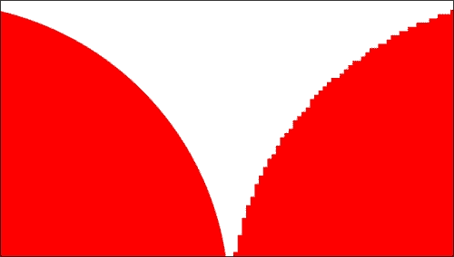
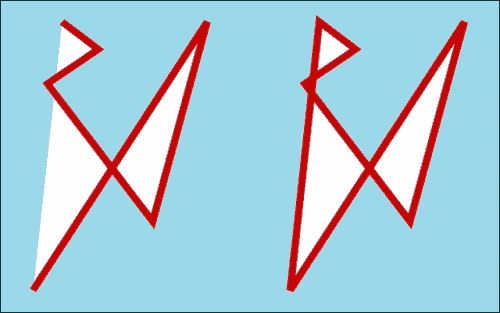
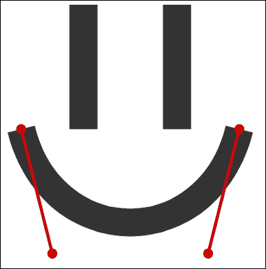

# 三、理解 HTML5 的重要性

在我们进入本章将要构建的游戏之前，我们将研究为什么在多个不同的浏览器中部署时，用 HTML 和 JavaScript 编写应用会很困难。我们将专注于这些问题的简单而实用的解决方案，特别是关于 HTML5 和今天使用的最新 API。

我们将在本章中构建的游戏将是一个基本的果冻摇摆重力游戏。它将利用 HTML5 的新应用编程接口进行矢量图形、本地音频操作和拖放。作为这个游戏的渲染系统的主干，我们将使用旧的 JavaScript 计时器，正如我们将看到的，它完全不适合像这个这样每秒需要多次更新的游戏。谢天谢地，现代浏览器已经解决了这个问题，并且考虑到了我们对高效渲染引擎的需求。然而，我们要到下一场比赛才会讨论这个新功能。只是为了完成，这个新功能被称为**requestAnimationFrame**。

# 浏览器兼容性

任何曾经做过任何网络开发的人都很快对不同浏览器解释和呈现相同代码的方式产生了非常深刻、深刻和彻底的仇恨。然而，如果我们对这一现象进行更深入的挖掘，并寻找这些差异的根本原因，就会让一些人惊讶地意识到问题并不像看起来的那样。虽然找到呈现差异的原因很容易，例如，一些浏览器对盒子模型的定义不同，但找到代码差异的原因可能并不那么清楚。令人惊讶的是，一些开发人员似乎鄙视 JavaScript 语言，因为一些代码在某些浏览器中运行不同。然而，事实的真相是，JavaScript 实际上是相当可移植的，它的 API 相当稳定和一致。

信不信由你，这些令人头疼的问题大多是由 DOM API 引起的，而不是 JavaScript 本身。一些浏览器以一种方式注册与 DOM 相关的事件，而其他浏览器不承认这种方法，而是使用自己的变体。操纵 DOM 元素和子树也是如此。

例如，从 DOM 中移除节点的一种方法是在节点本身上调用`remove`方法。然而，在撰写本文时，只有极少数浏览器公开了这一功能。最常见的是，浏览器允许我们通过调用父节点上的`removeChild`方法，传递要从父节点移除的子节点的引用，来移除 DOM 树中的节点。

这里要说的重点是:JavaScript 本身在不同浏览器之间非常一致，但是浏览器允许我们以编程方式与 DOM 交互的方式(尽管这通常是通过 JavaScript 完成的)可能因浏览器而异。虽然这些对任何人来说都不是新闻，当然也不是 HTML5 独有的，但记住我们为网络平台编程的主要工具，即 JavaScript，是一个非常强大和一致的工具，这一点仍然很重要。我们需要记住的问题是 DOM API(以及 CSS，尽管这个特定的问题变得越来越不重要，因为浏览器开始就相关的通用标准达成一致)。

## 支持不同浏览器

在开发 HTML5 应用时，我们可以采取不同的方法来确保代码在不同的浏览器中运行相同，并且设计也呈现相同。这些做法有些是痛苦和乏味的，有些是不可靠的，有些是足够好的。不幸的是，只要有像今天这样多的浏览器差异，就永远不会有一个单一的银弹完全使问题消失。

当涉及到编写在不同浏览器中运行几乎相同的代码时，两个主要目标是:尽可能少地为每个浏览器编写独特的代码，并编写适度降级的代码。专门针对特定浏览器的几个独特特性是一回事，但是维护两个或更多独立的代码库是完全不同的问题。请记住，无论是从高效执行还是安全性角度来看，您能编写的最好的代码都是您根本不必编写的代码。你写的代码越多，你的代码就越容易出错。因此，避免编写过多的代码，这些代码与您正在编写的其他代码做同样的事情，但是要为不同的浏览器编写唯一的代码。

虽然成为一个完美主义者可能是一个很大的属性，但我们必须现实，我们不会很快达到完美。不仅如此，在大多数情况下(当然在所有涉及视频游戏的情况下)，我们不需要编写近乎完美的软件。说到底，不管你是否同意，软件开发的目标是生产足够好的软件。只要程序解决了它被编写的问题，并且以一种合理的方式这样做，那么对于所有的实际目的，我们可以说软件是好的。

有了这个介绍，在开发 HTML5 应用(包括游戏)时，请记住这两个原则，目标是接触全球数亿人。的确，有一些特定于浏览器的功能可能会使游戏不可玩，或者至少使用户体验明显不同，最终结果可能并不理想。但是，请密切关注您真正想要实现的目标，以便辨别哪些浏览器差异足够好。很可能针对特定浏览器的功能被很少的用户使用，因此该功能没有成本优势。然而，我们永远不想做的是部署一个不可用的产品。

## HTML5 库和框架

在我们以经济高效的方式寻求多浏览器支持的过程中，我们知道在这场斗争中我们并不孤单，这让我们感到安慰。今天，有如此多的开源项目旨在解决浏览器兼容性的相同问题，以至于我们可以玩字母表游戏，在这个游戏中，我们为字母表中的每个字母命名一个不同的 HTML5 库或框架。

这类工具的存在通常有两个原因，一是抽象掉浏览器差异，二是加快开发速度。虽然今天的 JavaScript 工具提供的大多数抽象都试图为客户端提供统一浏览器差异的单一界面，但这些库中的许多库也提供了简单地加快开发时间和精力的功能。

### jQuery

到目前为止，最流行的 JavaScript 库是一个叫 jQuery 的库。如果你以前没有听说过 jQuery，很可能你只是从一个非常深刻的冬眠中醒来，而你的身体正在穿越遥远的星系。使用 jQuery 的一些主要好处包括非常强大的 DOM 查询和操作引擎、非常简单、统一的**XHR**T3(**XML HTTP Request**也称为 Ajax)接口，以及通过定义良好的插件接口扩展它的能力。

尝试向服务器发出异步请求就是一个例子，说明如何使用 JavaScript 库，尤其是 jQuery，可以节省您的开发时间和精力。没有 jQuery，我们需要编写一些样板代码，以便不同的浏览器都表现相同。代码如下:

```html
var xhr = null;

// Attempt to create the xhr object the popular way
try {
  xhr = new XMLHttpRequest();
}
// If the browser doesn't support that construct, try a different one
catch (e) {
  try {
    xhr = new ActiveXObject("Microsoft.XMLHTTP");
  }
  // If it still doesn't support the previous 2 xhr constructs, just give up
  catch (e) {
    throw new Error("This browser doesn't support AJAX");
  }

// If we made it this far, then the xhr object is set, and the rest
// of the API is identical independent of which version we ended up with
xhr.open("GET", "//www.some-website.com", true);
xhr.onreadystatechange = function(response) {
  // Process response
  // (...)
};

xhr.send();
```

相比之下，现在可以使用 jQuery 用下面的代码实现确切的功能:

```html
$.ajax({
  type: "GET",
  url: "//www.some-website.com",
  async: true,  /* This parameter is optional, as its default value is true */
  complete: function(response) {
    // Process response
    // (…)
  }
});
```

jQuery 的 XHR 功能最棒的一点是它非常灵活。至少，我们可以以完全跨浏览器的方式实现与前面代码相同的行为，如下面的代码所示:

```html
$.get("//www.some-website.com", function(response) {
  // Process response
  // (…)
});
```

总之，使用 jQuery 可以用很少的努力、时间和代码完成很多事情。所有这些也带来了额外的好处，即该库是由一个非常敬业的团队开发的，背后有一个非常参与和活跃的社区。更多关于 jQuery 的信息，请查看[http://www.jquery.com](http://www.jquery.com)官方网站。

### 谷歌网络工具包

另一个流行且极其强大的 JavaScript 工具是**谷歌网络工具包** ( **GWT** )。首先，GWT 不仅仅是一个在 JavaScript 之上提供一些抽象的库，而是一个成熟的开发工具包，它使用 Java 语言(它本身具有所有的优点)，然后编译 Java 代码并将其翻译成高度优化的、特定于浏览器的 JavaScript 代码。

试图将 jQuery 与 GWT 进行比较是愚蠢的，因为两者解决的问题不同，对 web 开发的看法也完全不同。然而，值得一提的是，虽然 jQuery 是一个很棒的工具，目前几乎每个网络开发人员的工具箱中都有，但它并不适合，也不太适合实际的游戏开发。另一方面，谷歌网络工具包虽然不是小而琐碎的 HTML 和 JavaScript 项目最合适的工具，但它非常适合游戏开发。事实上，热门游戏《愤怒的小鸟》在开发谷歌 Chrome 版游戏时使用了谷歌 Web Toolkit。

总之，虽然 GWT 是一个足以占据自己的书的主题，但它是一个很好的工具，当你进行下一个大型网络开发项目时，需要考虑，其中一个目标是为你的应用提供多浏览器支持。有关谷歌网络工具包的更多信息，请查看位于[https://developers.google.com/web-toolkit/](https://developers.google.com/web-toolkit/)的官方网站。

## 支持 HTML5 功能有限的浏览器

正如前面提到的一样，上面提到的由浏览器引起的开发问题都不是 HTML5 的新问题，也不是 html 5 特有的问题。然而，重要的是要知道，同样的问题还没有随着 HTML5 而消失。此外，HTML5 还带来了全新的级跨浏览器噩梦。例如，虽然大多数 HTML5 相关的 API 都在文档化的规范中有很好的定义，但也有许多 API 目前处于实验阶段(有关实验性 API 和供应商前缀的讨论，请参考在线章节*设置环境*和[第 2 章](2.html "Chapter 2. HTML5 Typography")、 *HTML5 排版*，其中对主题进行了更深入的讨论)。除此之外，还有一些浏览器还不支持 HTML5 的一些功能，或者目前提供的支持有限，或者更糟的是，它们通过与其他浏览器不同的界面提供支持。

同样，作为 web 开发人员，在创建新应用时，我们必须始终将用户放在优先级列表的首位。既然浏览器兼容性的问题还在我们中间，有些人觉得 HTML5 还是未来的事情，它的新功能的用处还有待观察。本节的其余部分将描述我们今天可以使用 HTML5 的方式，而不必担心不太理想的浏览器，并为使用这种浏览器的用户提供一个功能性应用。

### 优雅地降解

如果您密切关注前面的代码片段，我们试图创建一个在许多不同浏览器中工作的 **XHR** 对象，您会注意到，如果执行代码的浏览器不支持代码搜索的两个选项之一，代码会故意暂停执行。如果可能的话，这是我们不应该做什么的一个很好的例子。每当某个特定的特性对某个浏览器不可用时，第一个选项应该是提供一个替代的构造，即使这个替代的方法不完全提供相同的行为。我们应该尽我们所能，至少在最坏的情况下提供一个功能性的体验，在这种情况下，浏览器对我们试图完成的事情没有任何支持。

例如，HTML5 提供了一种类似于 cookie 的新存储机制(换句话说，是一种简单的键值对存储)，但主要区别在于，这种存储机制将数据完全存储在客户端，并且数据永远不会作为 HTTP 请求的一部分来回发送到服务器。虽然这种存储系统是什么以及它如何工作的细节将在本书的后面介绍，但我们可以总结为，这种存储系统(称为本地存储)存储键值对，并通过定义良好的接口以及名为`localStorage`的窗口对象的属性来存储键值对。

```html
localStorage.setItem("name", "Rodrigo Silveira");
localStorage.length == 1; // true
localStorage.getItem("name"); // "Rodrigo Silveira"
localStorage.removeItem("name");
localStorage.length; // == 0
```

本地存储的一个强大应用是缓存用户发出的异步请求，这样后续请求可以直接从浏览器的本地存储中获取，从而避免了到服务器的往返。但是，如果浏览器不支持本地存储，在这种特殊情况下，最坏的情况是应用需要再次从服务器获取后续请求。虽然不实用也不高效，但这是一个我们不应该失眠的问题，除非这意味着我们需要编写大量额外的代码来测试每次需要使用`localStorage`对象时它的存在，从而用许多重复的条件语句污染代码库。

解决此类问题的简单方法是使用聚合填充，，我们接下来将更深入地讨论它。然而，简而言之，polyfill 是浏览器在原始实现还不可用时可以使用的 JavaScript 替代。这样，如果浏览器需要，您可以加载 polyfill，而代码库的其余部分可以通过原始接口使用该功能，并且永远不知道它正在使用哪个实现。在`localStorage`的情况下，我们可以简单地检查真实的 API 是否可用，如果不可用，则编写模拟其行为的代码。下面的代码片段显示了这种行为:

```html
// If the browser doesn't know anything about localStorage,
// we create our own, or at least an interface that respond
// to the calls we'd make to the real storage object.
if (window.localStorage === undefined) {
  var FauxLocalStorage = function() {
    var items = {};
    this.length = 0;

    this.setItem = function(key, value) {
      items[key] = value;
      this.length++;
      };

    this.getItem = function(key) {
      if (items[key] === undefined)
        return undefined;

        return items[key];
      };

    this.removeItem = function(key) {
      if (items[key] === undefined)
        return undefined;

      this.length--;
        return delete items[key];
      };
  };

  // Now there exists a property of window that behaves just like
  // one would expect the local storage object to (although in this example
  // the functionality is reduced in order to make the point)
  window.localStorage = new FauxStorage();
}

// This code will work just fine whether or not the browser supports the real
// HTML5 API for local storage. No exceptions will be thrown.
localStorage.setItem("name", "Rodrigo Silveira");
localStorage.length == 1; // true
localStorage.getItem("name"); // "Rodrigo Silveira"
localStorage.removeItem("name");
localStorage.length; // == 0
```

尽管前面的 polyfill 实际上不存储当前会话之外的任何数据，但是本地存储 polyfill 的这种特殊实现对于给定应用的需求来说已经足够了。至少，这个实现允许我们向官方接口编码(调用规范定义的真实方法)，并且浏览器不会抛出异常，因为方法确实存在。最终，每当不支持 HTML5 API 的浏览器使用我们的 polyfill 时，因为检查浏览器支持该功能的条件，该条件将不再触发 polyfill 被加载，因此客户端代码将总是引用原始实现，并且不需要对主源代码进行任何更改。

虽然考虑 poly files 能为我们做什么是非常令人兴奋的，但观察力敏锐的学生会很快注意到，编写完整、安全和准确的 poly files 比在样式表中添加简单的 CSS 黑客以使设计兼容不同的浏览器稍微复杂一些。尽管之前显示的示例本地存储 polyfill 相对复杂，但它并没有完全模仿官方界面，也没有 100%地表现出它所实现的小功能。很快，有条理的学生会问，他或她应该花多少时间写防弹聚合材料。我很高兴地报告，答案是肯定的，在下一节中给出并解释。

### 聚合填料

为了回答前面的问题，也就是说，为了能够在今天开始使用 HTML5 特性，并且仍然让您的代码在多个不同的浏览器上运行，您应该期望花费多少时间来编写自己的健壮聚合堆，这是零。除非你真的想要为不同的浏览器编写后备的体验，否则没有理由自己编写库之类的东西，因为已经有数百名其他开发人员在这个领域做了大量的工作，他们已经与社区分享了他们的工作。

有了 polyfills，我们在 HTML5 项目的顶部真的没有一个单独的 JavaScript 导入可以用来神奇地扩展每一个有缺陷的浏览器，并让它们 100%的 HTML5 就绪。但是，有许多单独的项目可用，因此如果您试图使用一个特定的元素，您可以简单地导入该特定的 polyfill。虽然没有明确的来源可以找到所有这些聚合线，但简单的谷歌或必应搜索您想要的特定功能应该可以快速将您连接到适当的聚合线。

### 现代化

一个特别值得一提的工具是 Modernizr。这个 JavaScript 库检查加载它的页面，并检测用户浏览器中哪些 HTML5 特性可用。这样，我们可以非常容易地检查特定的应用编程接口是否可用，并采取相应的行动。

截至本文撰写之时，Modernizr 的当前版本允许我们测试特定的 API 或功能，并在测试返回正或负的情况下加载特定的聚合填充，这使得在需要时添加聚合填充变得非常容易和轻松。

此外，Modernizr 还包括 HTML5 Shiv，这是一个非常小的 JavaScript 片段，允许我们在不识别 HTML5 语义标签的浏览器中使用所有这些标签。请注意，这不会增加标签的实际功能，而只是允许您通过 CSS 来设置这些标签的样式。原因是，在 Internet Explorer 版及以下版本中，如果我们尝试对浏览器无法识别的元素进行样式化，它将简单地忽略应用于它的任何 CSS。然而，通过 Modernizr，这些元素被创建(使用 JavaScript)，这样浏览器就知道标签，从而允许 CSS 应用于它们。

关于 Modernizr 的更多信息，请查看 http://modernizr.com/的官方网站。

# 比赛

我们将在本章中构建的项目游戏简称为*基础果冻摆动重力游戏*。游戏的目标是给我们的主角喂足够的果冻，这样他就会生病，肚子痛得倒在地上。主角是通过键盘上的左右箭头键来控制的，为了吃果冻，你只需要在掉落的果冻下面指挥英雄。每次给英雄喂果冻，他的血量都会略微下降。一旦喂够果冻，血量计达到零，英雄就会生病晕倒。如果你让果冻掉在地板上，除了果冻溅得到处都是，什么都没发生。这是一个基本的果冻摆动重力游戏。你能给乔治王子提供足够的果冻直到他昏过去吗？


为了演示关于 HTML5 游戏开发的几个原则，我们将完全用 DOM 元素来构建这个游戏。虽然这种方法通常不是理想的方法，但您会注意到，许多游戏在大多数现代浏览器上，以及在今天的普通台式机或笔记本电脑上，仍然表现得相当出色。然而，正如我们将在接下来的章节中学习的那样，HTML5 中有一些技术、工具和 API 更适合游戏开发。

此外，正如本书常见的那样，大多数游戏元素在复杂性方面将保持在最低限度，以便于解释和理解。具体来说，在这个游戏中，我们将只使用 SVG 图形作为概念证明，而不是通过 SVG 标准深入挖掘我们可用的潜力和机会。拖放也是如此，因为它还可以做更多的事情。

## 代码结构

这个代码的结构非常简单。游戏中的每个元素都是通过 CSS 绝对定位的，每个元素都是由一些带有背景图像样式的 HTML 容器或者一些 CSS3 属性组成的，这些属性通过圆角、阴影等等给它一个新鲜的外观。此外，虽然有些人可能更喜欢面向对象编程而不是函数编程，以及更好的内聚性而不是全局变量，但我们将在这个游戏中采用这种方法，并专注于 HTML5 方面而不是游戏的设计。图形的风格和质量也是如此。你在这个游戏中看到的一切都是我用免费的照片编辑器程序创建的，我花了不超过 30 分钟就创建了你在游戏中看到的所有图形。这主要是为了表明，即使你有预算，或者没有专门的图形设计团队，也可以制作有趣的游戏。

由于我们将所有的 SVG 实体与我们的 HTML 结构内联加载，我们将它们放在一个对用户隐藏的`div`容器中，然后我们克隆每个我们需要的实体，并在游戏中使用它。我们对所有的果冻和英雄都使用这种技术。英雄 SVG 与从矢量编辑器软件导出的一样。果冻 SVG 稍作修改，去掉了所有设计它们的颜色，代之以 CSS 类。这样我们就可以创建不同的 CSS 类来指定不同的颜色，并且果冻 SVG 的每个新实例都被分配了一个随机的类。最终的结果是一个隐藏在不可见的`div`容器中的单个 SVG 模型，它的每个实例都使用零个额外的代码，被赋予不同的颜色来增加游戏的多样性。我们也可以为每个果冻实例随机分配不同的大小和旋转，但这是留给读者的练习。

```html
<body>
  <div class="health-bar">
    <span></span>
  </div>

    <h1 id="message"></h1>

    <div id="table"></div>
    <div id="bowl"></div>
    <div id="bowl-top-faux-target"></div>
    <div id="bowl-top" class="dragging-icon bowl-closed"
      draggable="true"
      ondragstart="doOnDragStart(event)"
      ondragend="doOnDragEnd(event)"></div>
    <div id="bowl-top-target"
      ondrop="startGame()"
      ondragover="doOnDrop(event)"
      ondragleave="doOnDragLeave(event)"></div>

    <div class="dom-recs">
      <svg class="hero-svg">
      (…)
      </svg>
      <svg class="jelly-svg">
      (…)
      </svg>
    </div>
</body>
```

虽然我们可以对所有这些元素使用数据属性而不是标识属性，但是在标识上使用它们并没有真正的好处，就像在这种情况下使用标识而不是数据属性并没有真正的好处一样。

注意有两个可以拖动`bowl-top`的目标。其实真的只有一个，就是元素`bowl-top-target`。另一个看起来像目标的元素，被巧妙地赋予了`bowl-top-faux-target`的身份，只是为了视觉效果。由于真正的拖放目标(一个可拖动元素可以放在拖动选项末尾的元素)只有在鼠标指针移动到其上时才会被激活，因此该表上没有足够的空间来实现显示小轮廓区域的预期效果，在该区域中`bowl-top`似乎被拖放。

最后，游戏中使用了一个全局定时器，控制我们调用游戏循环函数的频率，命名为`tick()`。虽然这不是关于正确游戏设计的一章，但我会指出，你应该避免为不同目的创建多个计时器的诱惑。有些人在通过一个独立于主游戏计时器的独特计时器启动一个事件之前不会三思。这样做，尤其是在 HTML5 游戏中，会对性能和同步所有事件产生负面影响。

## API 用法

这个游戏使用的三个 API 分别是音频、SVG、拖拽。下面将简要解释这些 API 在游戏中是如何使用的，其中只给出了该功能的概述。然而，在下一节中，我们将详细了解这些特性实际上是做什么的，以及我们如何在这种和其他情况下使用它。要获得这个游戏的完整源代码，请从 Packt Publishing 的网站上查看这本书的页面。

### 网络音频

音频既用于作为背景歌曲的永无止境的循环，也用于当果冻被推出、从墙上反弹、溅到地板上或被饥饿的英雄吃掉时发出的单独音效。当英雄最终因吃太多果冻而死亡时，一种古老的学校音效也会被激发出来。

游戏中管理每个音频实体的方式是通过一个简单的封装，该封装保存对单个声音文件的引用，并公开一个界面，允许我们播放文件、淡入淡出声音文件，以及向该类管理的音频列表中添加新的声音文件。其代码如下:

```html
// ** By assigning an anonymous function to a variable, JavaScript
// allows us to later call the variable's referenced function with
// the keyword 'new'. This style co function creation essentially 
// makes the function behave like a constructor, which allows us to
// simulate classes in JavaScript
var SoundFx = function() {
  // Every sound entity will be stored here for future use
  var sounds = {};

  // ------------------------------------------------------------
  // Register a new sound entity with some basic configurations
  // ------------------------------------------------------------
  function addSound(name, file, loop, autoplay) {

    // Don't create two entities with the same name
    if (sounds[name] instanceof Audio)
      return false;

      // Behold, the new HTML5 Audio element!
      sounds[name] = new Audio();
      sounds[name].src = file;
      sounds[name].controls = false;
      sounds[name].loop = loop;
      sounds[name].autoplay = autoplay;
    }

    // -----------------------------------------------------------
    // Play a file from the beginning, even if it's already playing
    // -----------------------------------------------------------
  function play(name) {
    sounds[name].currentTime = 0;
    sounds[name].play();
  }

    // -----------------------------------------------------------
    // Gradually adjust the volume, either up or down
    // -----------------------------------------------------------
  function fade(name, fadeTo, speed, inOut) {
    if (fadeTo > 1.0)
      return fadeOut(name, 1.0, speed, inOut);

    if (fadeTo < 0.000)
      return fadeOut(name, 0.0, speed, inOut);

      var newVolume = parseFloat(sounds[name].volume + 0.01 * inOut);

    if (newVolume < parseFloat(0.0))
      newVolume = parseFloat(0.0);

      sounds[name].volume = newVolume;

    if (sounds[name].volume > fadeTo)
      setTimeout(function(){ fadeOut(name, fadeTo, speed, inOut); }, speed);
    else
      sounds[name].volume = parseFloat(fadeTo);

      return sounds[name].volume;
  }

    // -----------------------------------------------------------
    // A wrapper function for fade()
    // ------------------------------------------------------------
    function fadeOut(name, fadeTo, speed) {
      fade(name, fadeTo, speed, -1);
    }

    // -----------------------------------------------------------
    // A wrapper function for fade()
    // -----------------------------------------------------------
    function fadeIn(name, fadeTo, speed) {
      fade(name, fadeTo, speed, 1);
    }

    // -----------------------------------------------------------
    // The public interface through which the client can use the class
    // -----------------------------------------------------------
    return {
      add: addSound,
      play: play,
      fadeOut: fadeOut,
      fadeIn: fadeIn
    };
};
```

接下来，我们实例化一个这种自定义`SoundFx`类型的全局对象，其中存储了游戏中使用的每个声音剪辑。这样，如果我们想播放任何类型的声音，我们只需在这个全局引用上调用`play`方法。看看下面的代码:

```html
// Hold every sound effect in the same object for easy access
var sounds = new SoundFx();

// Sound.add() Parameters:
// string: hash key
// string: file url
// bool: loop this sound on play?
// bool: play this sound automatically as soon as it's loaded?
sounds.add("background", "sound/techno-loop-2.mp3", true,  true);
sounds.add("game-over",  "sound/game-over.mp3",     false, false);
sounds.add("splash",     "sound/slurp.mp3",         false, false);
sounds.add("boing",      "sound/boing.mp3",         false, false);
sounds.add("hit",        "sound/swallow.mp3",       false, false);
sounds.add("bounce",     "sound/bounce.mp3",        false, false);
```

### 可缩放矢量图形

如前所述在游戏中使用 SVG 的方式受到了限制，仅仅是因为 SVG 规范非常健壮，可以变得相当复杂。正如您将在对 SVG API 的深入描述中看到的那样，我们可以对通过 SVG 绘制的每个单独的原始形状做很多事情(例如在本地制作英雄面部表情的动画，或者使每个果冻摇动或旋转，等等)。

当果冻掉到地板上时，我们将代表果冻的雪碧转换成溅出的果冻的方式非常聪明。当我们使用矢量编辑器软件绘制果冻矢量时，我们会创建两个独立的图像，每个图像代表果冻的不同状态。两个图像叠放在一起，这样它们就能正确对齐。然后，在 HTML 代码中，我们为这些图像中的每一个分配一个 CSS 类。这些类别被称为果冻块和飞溅，代表果冻处于自然状态，以及溅到地板上的果冻。在这两个类中，一个向量是隐藏的，另一个是不隐藏的。根据每个果冻元素的状态，这两个类来回切换。这都是通过简单地将两个类`jelly-svg-on`和`jelly-svg-off`中的一个分配给包含这两个向量组的父 svg 元素来完成的，如下面的代码所示:

```html
.jelly-svg-off g.jelly-block, .jelly-svg-on g.splash {
    display: none;
}

.jelly-svg-off g.splash, .jelly-svg-on g.jelly-block {
    display: block;
}
```

驱动上述样式的方式很简单。默认情况下，每个果冻元素都被赋予一个`jelly-svg-on`的 CSS 类，这意味着果冻不会被溅到。然后，当一个果冻被计算出落地时，我们移除该类，并添加`jelly-svg-off`的 CSS 类，如下面的代码片段所示:

```html
// Iterate through each jelly and check its state
for (var i in jellies) {

  // Don't do anything to this jelly entity if it's outside the screen,
  // was eaten, or smashed on the floor
  if (!jellies[i].isInPlay())
    continue;

    // Determine if a jelly has already hit the floor
    stillFalling = jellies[i].getY() + jellies[i].getHeight() * 2.5 < document.body.offsetHeight;

    // If it hasn't hit the floor, let gravity move it down
    if (stillFalling) {
      jellies[i].move();
    } else {

    // Stop the jelly from falling
    jellies[i].setY(document.body.offsetHeight - jellies[i].getHeight() - 75);

      // Swap the vectors
      jellies[i].swapClass("jelly-svg-on", "jelly-svg-off");
      jellies[i].setInPlay(false);

      // Play the corresponding sound to this action
      sounds.play("splash");
    }
}
```

### 拖放

类似于游戏中使用的方式，拖放进入了最终产品，让退居网络音频之后。然而，拖放在游戏中扮演的角色可以说是最重要的角色，它启动了游戏。玩家不需要在页面第一次加载时立即开始玩游戏，也不需要用户按下按钮或按键开始玩游戏，而是需要将盖子从储存所有果冻的碗中拖出来，放在桌子上碗的旁边。

拖放在 HTML5 中的工作方式简单直观。我们将至少一个对象注册为可拖动对象(您拖动的对象)，并将至少一个其他对象注册为拖放目标(可拖动对象可以放入的对象)。然后，我们注册回调函数，用于我们希望应用于拖放行为的任何事件。

在游戏中，我们只监听五个事件，两个在可拖动元素上，三个在放置目标元素上。首先，我们监听用户第一次拖动可拖动物体的时间(在拖动开始时)，我们通过使碗盖图像不可见并将盖子的副本放在鼠标指针后面来响应，这样看起来用户真的在拖动那个盖子。

接下来，我们倾听当用户最终释放鼠标按钮时触发的事件，指示拖动动作的结束(在拖动结束时)。此时，我们只需将碗盖恢复到原来的位置，放在碗的顶部。只要拖动操作完成，并且放置没有在有效的放置目标内完成(用户没有将盖子放在预期的位置)，就会触发此事件，这实际上重新启动了该过程。

我们在掉落目标上听到的三个事件是`onDragLeave`、`onDragOver`和`onDrop`。每当一个可拖动物体落在下落目标内时，该目标的`onDrop`事件被触发。在这种情况下，我们所做的就是调用`startGame()`函数，它启动游戏。作为该`startGame`功能设置的一部分，我们将碗盖元素移动到其被放下的确切像素位置，并移除可拖动属性，以便用户不再拖动该元素。

每当鼠标指针移动到目标对象之上或悬停在目标对象之外时，就会分别触发功能`onDragOver`和`onDragLeave`。在我们的例子中，我们在这些功能中所做的只是在拖动发生时切换碗盖的可见性和光标后面显示的图像。这可以在下面的代码中看到:

```html
// ------------------------------------------------------------
// Fired when draggable starts being dragged (onDragStart)
// ------------------------------------------------------------
function doOnDragStart(event) {
  if (bowlTop.isReady) {
    event.target.style.opacity = 0.0;
    event.dataTransfer.setDragImage(bowlTop, 100, 60);
  }
}

// ------------------------------------------------------------
// Fired when draggable is released outside a target (onDragEnd)
// ------------------------------------------------------------
function doOnDragEnd(event) {
  event.target.style.opacity = 1.0;
  document.querySelector("#bowl-top-faux-target").style.opacity = 0.0;
}

// ------------------------------------------------------------
// Fired when draggable enters target (onDragOver)
// ------------------------------------------------------------
function doOnDragOver(event) {
  event.preventDefault();
  document.querySelector("#bowl-top-faux-target").style.opacity = 1.0;
}

// ------------------------------------------------------------
// Fired when draggable is hovered away from a target (onDragLeave)
// ------------------------------------------------------------
function doOnDragLeave(event) {
  document.querySelector("#bowl-top-faux-target").style.opacity = 0.0;
}

// ------------------------------------------------------------
// Fired when draggable is dropped inside a target (onDrop)
// ------------------------------------------------------------
function startGame() {

  // Keep the game from starting more than once
  if (!isPlaying) {

    // Register input handlers
    document.body.addEventListener("keyup", doOnKeyUp);
    document.body.addEventListener("keydown", doOnKeyDown);

    // Reposition the bowl lid
    var bowlTop = document.querySelector("#bowl-top");
    bowlTop.classList.remove("bowl-closed");
    bowlTop.style.left = (event.screenX - bowlTop.offsetWidth + 65) + "px";
    bowlTop.style.top = (event.screenY - bowlTop.offsetHeight + 65 * 0) + "px";

    // Disable dragging on the lid by removing the HTML5 draggable attribute
    bowlTop.removeAttribute("draggable");
    bowlTop.classList.remove("dragging-icon");

    newJelly();
      isPlaying = true;

      // Start out the main game loop
      gameTimer = setInterval(tick, 15);
    }
};
```

# 网络音频

新的网络音频应用编程接口定义了一种在浏览器中播放音频的方式，而不需要一个插件。为了获得高水平的体验，我们可以简单地在整个 HTML 页面中添加一些音频标签，浏览器负责显示一个播放器，供用户交互并播放、暂停、停止、倒带、快进和调整音量。或者，我们可以使用可用的 JavaScript 接口，并使用它控制页面上的音频标签，或者实现更强大和复杂的任务。

关于浏览器支持和网络音频应用编程接口，需要记住的一个关键细节是，不同的浏览器支持不同的文件格式。定义音频标签时，类似于图像标签，我们指定源文件的路径。不同的是，有了音频，我们可以为同一个文件(但格式不同)指定多个来源，然后浏览器可以选择它支持的文件，或者它拥有的最佳选项，以防它支持多种文件格式。目前各大浏览器都支持三种音频格式，分别是`.mp3`、。`wav`和`.ogg`。截至本文撰写之时，所有主要浏览器都不支持单一音频格式，这意味着无论何时我们使用网络音频应用编程接口，如果我们希望接触到尽可能多的受众，我们将需要通过该应用编程接口播放的每个文件的至少两个版本。

最后，请记住，虽然我们可以(也应该)为每个音频元素指定多个音频文件，但每个浏览器只下载其中一个文件。这是一个非常方便(也是显而易见)的特性，因为下载同一个文件的多个副本效率非常低，而且带宽很大。

## 如何使用

开始使用网络音频应用编程接口最简单的方法是使用内嵌的 HTML5 元素。它的代码如下:

```html
<audio>
  <source src="sound-file.mp3" type="audio/mpeg" />
  <source src="sound-file.ogg" type="audio/ogg" />
</audio>
```

将上述代码片段添加到页面中不会导致任何可见的结果。为了给标签添加更多的控制，包括给页面添加一个播放器，以便用户可以与之交互，我们可以从与标签相关的元素中进行选择。这些属性如下:

*   **自动播放**:它一下载完浏览器就开始播放文件
*   **控制**:它显示一个带有按钮的视频播放器，用户可以通过按钮控制音频播放
*   **循环**:是用来无限期连续播放文件
*   **静音**:音频输出静音时使用
*   **预加载** : 指定浏览器如何预加载音频资源

为了通过 JavaScript 实现类似的结果，我们可以创建一个音频类型的 DOM 元素，或者实例化一个音频类型的 JavaScript 对象。添加可选属性的方式与添加任何其他 JavaScript 对象的方式相同。请注意，创建音频实例与创建对 DOM 元素的引用具有完全相同的效果:

```html
// Creating an audio file from a DOM element
var soundOne = document.createElement("audio");
soundOne.setAttribute("controls", "controls");

soundOneSource = document.createElement("source");
soundOneSource.setAttribute("src", "sound-file.mp3");
soundOneSource.setAttribute("type", "audio/mpeg");

soundOne.appendChild(soundOneSource);

document.body.appendChild(soundOne);

// Creating an audio file from Audio
var soundTwo = new Audio("sound-file.mp3");
soundTwo.setAttribute("controls", "controls");

document.body.appendChild(soundTwo);
```

虽然 JavaScript Audio 对象看起来更容易处理，尤其是因为它采用了那个很棒的构造函数参数，节省了我们一整行代码，但它们的行为完全相同，只有当你真的想挑剔并区分它们时，才能在运行时区分它们。您应该知道的一个小细节是，当我们在 JavaScript 中创建音频引用时，没有必要为了播放文件而将其附加到 DOM 中。

无论您决定如何处理这个设置步骤，一旦我们在 JavaScript 中引用了一个音频对象，我们就可以用与该对象相关联的许多事件和属性中的任何一个来控制它。音频对象如下:

*   **播放()**:它开始播放文件。
*   **暂停()**:它停止播放文件，并保持当前时间。
*   **暂停**:是代表当前播放状态的布尔值。
*   **canPlayType** :是用来查找浏览器是否支持特定的音频类型。
*   **currentSrc** :它返回当前分配给对象的文件的绝对路径。
*   **当前时间**:它以秒为单位返回当前播放位置，为浮点数。
*   **时长**:它以秒为单位返回总播放时间，为浮点数。
*   **结束**:是否为布尔值，表示当前时间是否等于持续时间。
*   **readyState** :表示源文件下载的状态。
*   **卷**:它表示文件的当前卷，范围从 0 到 1，包括 0 和 1。该数字是相对于当前系统容量的。

# SVG

**可缩放矢量图形** ( **SVG** )简称是一种描述图形的基于 XML 的格式。这种格式看起来很复杂，可能会与 2D 图形的成熟编程语言混淆，但实际上它只是一种标记语言。虽然 SVG 对一些 web 开发人员来说似乎是新的，但是该规范最早是在 1999 年开发的。

矢量图形和光栅图形(换句话说，位图)的主要区别在于图形的描述方式。在位图中，每个像素基本上由三个或四个数字表示，代表该像素的颜色(RGB)以及可能的不透明度。从更广泛的意义上来看，位图只不过是一个像素网格。另一方面，向量是由一系列描述线条、形状和颜色的数学函数来描述的，而不是整个图像上的每个单独的点。简单来说，矢量图形在缩放尺寸方面做得非常出色，如下图所示:



如果您放大或尝试拉伸矢量图，它将始终像原始图形一样平滑，因为形状是使用相同的数学函数定义(和缩放)的(如左侧图像所示)。另一方面，光栅图形仅由相同的像素网格定义。缩放该网格只是意味着将网格的维度相乘，从而得到由右侧图像表示的块状像素化图像。

现在，SVG 标准不仅仅是简单地定义形状、线条、路径和颜色。该规范还定义了可以应用于任何单个原语、一组原语或整个 SVG 上下文的转换和动画。该规范还允许 SVG 是一种非常容易访问的格式，这意味着可以将文本和其他元数据直接包含到文件中，这样除了图形之外，其他应用也可以以其他方式理解文件。例如，搜索引擎不仅可以抓取和索引您的网页，还可以抓取和索引任何 SVG 图形。

由于 SVG 是基于文本的(与存储二进制数据相反，例如音频文件)，所以也可以使用流行的 Gzip 等压缩算法来压缩 SVG 图像，这在当今的网络开发领域非常普遍。当一个 SVG 文件被保存为它自己的独立文件时，它被赋予扩展名`.svg`。如果文件是 Gzip 压缩的，那么扩展名应该是`.svgz`，这样浏览器在处理之前就知道要解压文件了。

SVG 文件可以通过几种不同的方式在 HTML 文件中使用。由于文件本身可以保存为自己的文件，因此可以使用对象标签、使用普通图像标签，甚至使用 XHR 对象从服务器获取其内容，并将其直接注入到 HTML 文档中，从而将整个文件嵌入到页面上。或者，可以手动将 SVG 文件的内容复制到宿主 HTML 文件中，这样就可以内联导入其内容。

要将一个 SVG 图形内联导入到一个 HTML 文档中，我们只需插入一个`svg`标签，它的所有内容都作为它的子节点。在撰写本文时，需要 XML 名称空间属性以及版本号，如以下代码所示:

```html
<body>
  <svg

    version="1.1"
    width="150"
    height="150">

    <circle
      cx="75"
      cy="75"
      r="50"
      stroke="black"
      stroke-width="2"
      fill="red"></circle></svg>
</body>
```

虽然对于一个简单的红色圆圈来说，这看起来很容易，但是一旦图像变得更加复杂，在一个文件中管理所有这些就有点困难了。因此，简单地将所有的 SVG 文件保存到外部，然后单独导入可能会更方便。这种方法也更有利于资源共享和重用，因为我们可以在多个文件中导入相同的图形，而不必每次都复制整个文件。

```html
<body>
  <object type="image/svg+xml" data="red-circle.svg"
    width="100" height="100">
  </object>

  
</body>
```

在我们深入研究一些示例之前，关于 SVG 的最后一个注意事项是，父`svg`标签内的每个节点(包括该父节点)都由浏览器管理。因此，这些节点中的每一个都可以通过 CSS 进行样式化。如果这还不够，SVG 图形中的每个节点都可以注册浏览器事件，允许我们以与大多数其他 DOM 元素相同的方式与图形及其所有单个组件进行交互。这使得 SVG 成为一种非常动态、高度灵活的图形格式。

如果 svg 实例与 HTML 内联，那么我们可以简单地直接引用父 SVG 节点，或者通过 JavaScript 直接引用任何子节点。一旦我们有了这个引用，我们就可以像其他 DOM 元素一样对对象进行操作。但是，如果 SVG 在 HTML 之外，我们需要多走一步，将实际的 SVG 文件加载到 JavaScript 变量中。一旦这一步完成，我们就可以像处理文件一样处理 SVG 的子树。

```html
<body>
  <object type="image/svg+xml" data="red-circle.svg"
    width="100" height="100">
  </object>

  <script>
    var obj = document.querySelector("object");

    // Very important step! Before calling getSVGDocument, we must register
        // a callback to be fired once the SVG document is loaded.
    obj.onload = function(){
      init(obj.getSVGDocument());
    };

    function init(svg) {
      var circles = svg.getElementsByTagName("circle");

      // Register click handler on all circles
      for (var i = 0, len = circles.length; i < len; i++) {
        circles[i].addEventListener("click", doOnCircleClick);
      }

      // When a circle element is clicked, it adds a CSS class "blue"
            // to itself.
    function doOnCircleClick(event) {
      this.classList.add("blue");
    }
  }
  </script>
</body>
```

关于前面代码片段的一些重要细节，您应该始终记住:

*   导入的 SVG 文档被视为外部文档(类似于 Iframe)，这意味着该文档之外的任何 CSS(如宿主文档)都在其范围之外。因此，如果您想通过`getSVGDocument()`调用将一个 CSS 类应用于一个 SVG 节点，那么该 CSS 类必须在最初导入的相同 SVG 文件中定义。
*   SVG 的 CSS 属性略有不同。例如，您可以定义填充颜色，而不是定义背景颜色。基本上，在 SVG 元素本身上使用的相同属性与您在相应样式表声明中使用的属性相同。
*   任何特定于浏览器的 CSS 属性都可以应用于 SVG 节点(例如，过渡、光标等)。)

因此，前面的示例以下面的`.svg`文件作为相应的`red-circle.svg`文件完成，如下面的代码片段中所使用的:

```html
<svg

  version="1.1"
  width="150"
  height="150">

<style type="text/css">
.blue {
  /* CSS Specific to SVG */
  fill: #0000ff;

  /* CSS Specific to the browser */
  cursor: pointer;
  -webkit-transition: fill 1.25s;
}
</style>
  <circle
    cx="75"
    cy="75"
    r="50"
    stroke="black"
    stroke-width="2"
    fill="red"></circle>
</svg>
```

## 如何使用

虽然强烈建议您在合成复杂的 SVG 图形时使用专业的矢量编辑器软件，如 Inkspace 或 Adobe Illustrator，但本节将为您讲解 SVG 合成的基础知识。这样你就可以手工绘制基本的形状和图形，或者至少熟悉 SVG 绘制的基础。

请记住，无论您是通过前面描述的任何方法将 SVG 图形导入到您的 HTML 中，还是内联绘制它们，甚至是通过 JavaScript 动态创建它们，您都需要将 XML 命名空间包含到根`svg`元素中。这是 SVG 新手常犯的错误，可能会导致你的图形没有出现在页面上。

我们可以用 SVG 绘制的基本形状有矩形、圆形、椭圆形、直线、折线、多边形和路径。其中一些图元共享属性(如宽度和高度)，而其他图元具有该形状独有的属性(如圆的半径)。您在 SVG 图形中看到的一切都是这些图元以某种组合方式一起使用的结果。

SVG 中的所有内容都绘制在 SVG 画布中，该画布由父级`svg`标签定义。这个画布总是矩形的，即使它里面的形状可以是由任何基本体创建的任何形状。此外，画布有自己的坐标系，将点原点放在画布的左上角。画布的宽度和高度(由父级`svg`标签决定)决定绘图区域的尺寸，画布内的所有(x，y)参考点(由`svg`的所有子元素决定)都相对于该点。

作为以下示例的样板，我们将假设一个外部`svg`文件，其中我们将画布大小设置为 1000 x 1000 像素，并在其中绘制。要查看每个示例的最终结果，您可以使用上一节中描述的任何一种方法将 SVG 图像加载到 HTML 文件中。下面的代码片段显示了如何定义`svg`标签:

```html
<svg  version="1.1" width="1000" height="1000">
</svg>
```

画一个矩形是用 SVG 能得到的最简单的。简单的给`rect`元素指定一个宽度和高度，就这样。可选地，我们可以指定笔画宽度和笔画颜色(其中笔画与边框相同)，以及背景颜色。看看下面的代码:

```html
<svg  version="1.1" width="1000" height="1000">
  <rect
    width="400"
    height="150" />
</svg>
```

默认情况下，每个形状都在原点(x = 0，y = 0)渲染，没有描边(`stroke-width = 0`)，背景颜色(填充)设置为全黑(十六进制值#000000，RGB 值为 0，0，0)。

通过指定至少三个属性，即 *x* 和 *y* 位置(由`cx`和`cy`表示)以及半径值(由字母`r`表示)，用`circle`标记绘制圆。圆心位于位置(`cx`、`cy`)，半径长度不考虑笔画宽度(如果有)。

```html
<svg  version="1.1" width="1000" height="1000">
  <circle
    cx="0"
    cy="0"
    r="300"
    fill="#ff3" />

  <circle
    cx="200"
    cy="200"
    r="100"
    fill="#a0a" />
</svg>
```

您会注意到，默认情况下，就像定位的 DOM 元素一样，每个节点都有相同的 z 索引。因此，如果两个或多个元素重叠，最后绘制的元素(意味着它比它的同级元素离父元素更远)将呈现在顶部。

椭圆与圆非常相似，唯一的区别是它们每个方向(垂直和水平)都有一个半径。除了那个小细节，画椭圆和画圆完全一样。当然，我们可以通过绘制两个半径长度相同的椭圆来模拟圆。

```html
<svg  version="1.1" width="1000" height="1000">
  <ellipse
    cx="400"
    cy="300"
    rx="300"
    ry="100"
    fill="#ff3" />

  <ellipse
    cx="230"
    cy="200"
    rx="75"
    ry="75"
    fill="#a0a" />
  <ellipse
    cx="560"
    cy="200"
    rx="75"
    ry="75"
    fill="#a0a" />
</svg>
```

有了这些基本的形状，我们现在将继续绘制更复杂的形状。我们现在可以选择每个点在我们将要绘制的形状中的确切位置，而不仅仅是遵循一些预定义的点和长度。虽然这让手工绘制形状变得稍微困难一些，但也让可能性变得更加广泛。

画线既简单又快捷。只需在 SVG 坐标空间内指定两点，就有了一条线。每个点由枚举的(x，y)对指定。

```html
<svg  version="1.1" width="1000" height="1000">
  <line
    x1="50"
    y1="50"
    x2="300"
    y2="500"
    stroke-width="50"
    stroke="#c00" />
</svg>
```

接下来我们将讨论折线，它是一条常规直线的延伸。线和多段线的区别在于，顾名思义，多段线是线的集合。一条规则的线只接受两个坐标点，而一条折线接受两个或更多的点，用一条线依次连接它们。此外，如果我们为多段线指定填充颜色，最后一个点将连接到第一个点，由该封闭区域形成的形状将应用填充。显然，如果未指定填充，多段线将被渲染为简单的形状，仅由直线组成。

```html
<svg  version="1.1" width="1000" height="1000">
  <polyline
    points="50, 10, 100, 50, 30, 100, 175, 300, 250, 10, 10, 400"
    fill="#fff"
    stroke="#c00"
    stroke-width="10"/>
</svg>
```

我们接下来要看的形状是多边形。与折线极其相似，多边形的绘制方式与折线完全相同，但有两个非常重要的区别。首先，多边形必须至少有三个点。其次，多边形总是一个封闭的形状。这意味着序列的最后一点和第一点是物理连接的，而在多段线中，如果为多段线指定了一个点，则该连接仅通过填充来实现:

```html
<svg  version="1.1" width="1000" height="1000">
    <polygon
        points="50, 10, 100, 50, 30, 100, 175, 300, 250, 10, 10, 400"
        fill="#fff"
        stroke="#c00"
        stroke-width="10"/>
</svg>
```



折线显示在前面截图的左侧，而右侧的形状是一个多边形，使用完全相同的点来描述其位置和方向。两者唯一的区别是一个多边形被强制闭合。当然，我们也可以通过简单地手动连接最后一个点和第一个点，使用折线来模拟这种行为。

SVG 还允许我们用平滑的曲线绘制非常复杂的形状，而不是前面介绍的基于线条的形状。要做到这一点，我们可以使用 path 元素，一开始可能有点复杂，因为它有几个我们可以操作的不同属性。路径的一个关键特征是，它允许我们将指针移动到坐标空间中的某个位置，或者画一条线到某个点。

描述路径的所有路径属性都放在`d`属性中。这些属性如下:

*   **M** :移至
*   **L** :线对
*   **H** :水平线至
*   **V** :垂直线至
*   c:曲线至
*   **S** :平滑曲线至
*   **Q** :二次贝塞尔曲线
*   **T** :平滑的二次贝塞尔曲线
*   **A** :椭圆弧
*   **Z** :关闭路径

这些属性可以根据需要重复多次，尽管将整个图形分解成多个较小的路径可能是个好主意。将较大的图形分成多条路径的一些原因是为了使图形更易于管理、更易于故障排除和更易于理解。这方面的代码如下:

```html
<svg  version="1.1" width="1000" height="1000">
  <path
    d="M 100 100
    L 100 300
    M 250 100
    L 250 300
    M 400 100
    L 400 300"
    fill="transparent"
    stroke-width="45"
    stroke="#333" />
</svg>
```

除非你练习和训练自己去看路径描述，否则可能很难只看那些代码并想象路径。慢慢来，分别看看每个属性。前面的示例首先将指针移动到点(100，100)，然后从该点画一条线到另一个点(100，300)。这就形成了一条从指针所在的最后一个位置到由 line to 属性指定的点的垂直线。接下来，光标从原来的位置改变到新的位置(250，100)。请注意，简单地移动光标不会影响任何以前的绘图调用，也不会在那时进行任何绘图。最后，第二条垂直线画到点(250，300)。第三条线与第一条线的距离相等。这可以在下面的截图中看到:


请注意，我们为填充、描边、描边宽度等定义的任何值都将应用于整个路径。想要不同填充和描边值的问题的解决方案是创建额外的路径。

绘制曲线还是有点复杂。一条曲线需要三个值，即两个控制点，以及绘制直线的最终点。要说明控制点是如何工作的，请观察以下示例:

```html
<svg  version="1.1" width="1000" height="1000">
  <path
    d="M 250 100
    L 250 300
    M 400 100
    L 400 300"
    fill="transparent"
    stroke-width="45"
    stroke="#333" />
  <path
    d="M 150 300
    C 200 500,
    450 500,
    500 300"

    fill="transparent"
    stroke-width="45"
    stroke="#333" />

  <circle
    cx="150"
    cy="300"
    r="8"
    fill="#c00" />
  <circle
    cx="200"
    cy="500"
    r="8"
    fill="#c00" />
  <line
    x1="150"
    y1="300"
    x2="200"
    y2="500"
    stroke-width="5"
    stroke="#c00" />

  <circle
    cx="450"
    cy="500"
    r="8"
    fill="#c00" />
  <circle
    cx="500"
    cy="300"
    r="8"
    fill="#c00" />
  <line
    x1="450"
    y1="500"
    x2="500"
    y2="300"
    stroke-width="5"
    stroke="#c00" />
</svg>
```

在执行如下截图所示的前面的代码时，我们可以看到控制点和一条线的曲率之间的关系:



这是一条三次贝塞尔曲线，其中红线显示第一个和最后一个曲线点与控制点的连接位置。

按照你想要的方式画曲线是一个相当复杂的手工问题。不同的曲线函数表现不同，所以一定要对它们进行实验，直到你对它们各自的工作方式有一个好的感觉。请记住，尽管至少对这些曲线和其他绘图图元的工作原理有所了解是一个好主意，但强烈建议您始终使用适当的软件来帮助您创建绘图。理想情况下，我们会使用我们的创造力来创建绘图，并让计算机弄清楚如何使用 SVG 来表示它。

### 注

路径的描述属性可以使用小写字母或大写字母来指定。区别在于大写字母表示点是绝对的，小写字母表示点是相对的。相对点和绝对点的概念与 HTML 中的概念不太一样，在 HTML 中，相对偏移意味着目标点相对于它自己的原始位置，而绝对点是完全相对于元素父元素的点。

在 SVG 世界中，一个绝对点相对于画布的原点，一个相对点相对于定义的最后一个点。例如，如果您将指针移动到位置(10，10)，然后用值 10-15 进行相对移动，指针将结束，不是在位置(10，15)，而是离 x 位置 10 个单位，离 y 位置 15 个单位。指针的新位置将是位置(20，25)。

最后，SVG 能够将文本渲染到屏幕上。想象一下用线和路径手工渲染每个字母是多么耗时。谢天谢地，SVG API 为文本呈现指定了一个非常简单的界面。

```html
<svg  version="1.1" width="1000" height="1000">
  <text
    x="100"
    y="300"
    fill="#c00"
    stroke="#333"
    stroke-width="2"
    style="font-size: 175px">I Love HTML5!</text>
</svg>
```

现在，SVG 标准不仅仅是简单地定义形状、线条、路径和颜色。该规范还定义了元素组，由此可以对节点集合进行分组，这样就可以将它们作为一个单元来处理。还有变换、动画、渐变，甚至照片滤镜，所有这些都可以应用于前面描述的简单图元。看看下面的代码:

```html
<svg  version="1.1" width="1000" height="1000">
  <rect
    x="500"
    y="500"
    width="900"
    height="600"
    fill="#c00"
    stroke="#333"
    stroke-width="2"
    transform="translate(800, 50)
      rotate(55, 0, 0)
      scale(0.25)">

    <animate
      dur="1.5s"
      attributeName="x"
      values="-50; 100; -50"
      repeatCount="indefinite" />

    <animate
      dur="1.5s"
      attributeName="height"
      values="50; 300; 50"
      repeatCount="indefinite" />
  </rect>
</svg>
```

# 拖放

虽然手动创建拖放功能并不是一个非常具有挑战性的考验，但是 HTML5 将拖放提升到了一个全新的水平。有了新的应用编程接口，我们能够做的不仅仅是让浏览器处理拖放操作。该界面允许自定义拖动的确切方式、拖动操作的外观、可拖动对象携带的数据等。此外，不必担心如何在不同的平台和设备中跟踪低级别事件是一个很好的、受欢迎的接触。

对于好奇的读者来说，我们实现自己的拖放行为的方式真的很简单；首先，我们监听要拖动的元素上的鼠标按下事件。当这种情况发生时，我们设置一个鼠标向下标志，一旦鼠标向上事件被触发，无论我们是否希望拖动元素，我们都会取消设置该标志。接下来，我们监听鼠标移动事件，检查鼠标是否被按下。如果鼠标在移动，同时鼠标向下标志被设置，我们有一个拖动动作。处理它的一种方法是在每次鼠标移动时更新可拖动元素的位置，然后在调用鼠标向上事件时设置元素的位置。当然，有几个小细节我们需要跟踪，或者至少要注意，比如如何检测可拖动元素被放在哪里，以及如果需要，如何将其移回原始位置。

好消息是，浏览器提供的拖放 API 非常灵活，而且效率极高。自从这个特性第一次被引入以来，很多开发人员出于各种原因继续使用它的 JavaScript 实现，但主要是因为很多人觉得原生 HTML5 版本有点难用、有问题，或者不如他们选择使用的任何其他库提供的版本实用。然而，今天，该应用编程接口得到了广泛支持，相当完善，并强烈推荐。

## 如何使用

现在拖拽 API 的工作方式非常直接。首先，我们需要将一个或多个元素标记为可拖动的，方法是将这些元素的`draggable`属性设置为 true，如以下代码所示:

```html
<ul>
  <li draggable="true" class="block"
    ondragstart="doOnDragStart(event)"
    data-name="Block 1">Block #1</li>
</ul>
```

仅仅这一步就能让这些元素都变得可拖动。当然，那没有任何用处，除非我们有地方放下那些元素。信不信由你，我们实际上可以将拖动的元素放到任何地方。问题是我们没有任何代码来处理被丢弃的事件。我们可以在任何元素上注册这样的事件，例如包括 body 标签。这在以下代码中显示:

```html
document.body.ondragover = doOnDragOver;
document.body.ondragleave = doOnDragLeave;
document.body.ondrop = doOnDrop;

function doOnDragOver(event) {
  event.preventDefault();
  document.body.classList.add("dropme");
}

function doOnDragLeave(event) {
  event.preventDefault();
  document.body.classList.remove("dropme");
}

function doOnDrop(event) {
  event.preventDefault();
  document.body.classList.remove("dropme");
  var newItem = document.createElement("li");
  newItem.setAttribute("draggable", true);
  newItem.classList.add("block");

  document.querySelector("ul").appendChild(newItem);
}
```

在这个例子中，我们在每次列表元素被放到页面上的任何地方时都会向无序列表中添加一个新的列表元素，因为页面上的每个元素都是主体节点的子节点。此外，每当可拖动元素悬停在主体元素上时，我们都会添加一个名为`dropme`的 CSS 类，这意味着给用户一个视觉反馈，让他们知道拖动事件正在发生。当拖动被删除时，我们从主体元素中删除该类，指示拖动操作的结束。

使用拖放 API，我们可以做的一件事是在对象之间传输数据。该数据可以是字符串，也可以是任何可以转换为字符串的数据类型。我们通过将所需数据设置到拖动动作期间我们可以使用的`dataTransfer`对象来实现。当系统启动拖动启动功能时，必须设置数据。与`dataTransfer`数据相关联的键可以是我们选择的任何字符串，如以下代码所示:

```html
function doOnDragStart(event) {
    // First we set the data when the drag event first starts
 event.dataTransfer.setData("who-built-me", event.target.getAttribute("data-name"));
}

function doOnDrop(event) {
    event.preventDefault();
    document.body.classList.remove("dropme");

    var num = document.querySelectorAll("li").length + 1;

    // Then we retrieve that data when the drop event is fired by the browser
 var builtBy = event.dataTransfer.getData("who-built-me");

    var newItem = document.createElement("li");
    newItem.ondragstart = doOnDragStart;
    newItem.setAttribute("draggable", true);
    newItem.setAttribute("data-name", "Block " + num);
    newItem.innerText = "Block #" + num + ", built by " + builtBy;

    newItem.classList.add("block");

    document.querySelector("ul").appendChild(newItem);
}
```

# 总结

这一章谈到了浏览器支持和代码可移植性这个非常重要的话题。作为高效的开发人员，我们应该始终努力创建可维护的代码。因此，在相同的代码基础上，我们能支持的浏览器越多，我们的效率就越高。为了帮助我们实现这个目标，我们可以创建抽象来封装因浏览器和设备而异的代码。另一种选择是使用其他人已经编写的现有聚合文件，从而完成同样的事情，但可能需要更少的努力和更高的可靠性。

我们在本章中构建的游戏使用了三个 HTML5 APIs，即拖放、网络音频和 SVG。HTML5 中提供的原生拖放不仅仅是简单地在屏幕上拖动 DOM 元素。有了它，我们可以定制许多与拖放操作相关的可视元素，以及指定通过可拖动元素携带的数据和拖放的目标。

网络音频允许我们管理多个音频实体。虽然大多数现代浏览器都支持多种音频格式，但还没有一种音频格式能被所有这些现代网络浏览器所支持。正因为如此，建议我们通过 API 链接希望播放的每个音频文件的至少两个不同版本，以便所有现代浏览器都能够播放该文件。虽然我们可以为每个音频元素指定多个源(其中每个源是同一文件的不同版本，但编码格式不同)，但浏览器足够智能，只下载它支持并知道如何播放的一个文件，或者最适合它播放的一个文件。这缩短了加载时间，并为用户和服务器节省了大量带宽。

可伸缩矢量图形是一种基于 XML 的二维图形描述语言，可以通过多种方式嵌入到网页中。因为所有的图形元素只不过是由浏览器呈现在 SVG 画布上的 XML 节点，所以这些图形元素中的每一个都由浏览器管理，因此可以通过 CSS 进行样式化，并且将用户输入事件链接到它们。我们还可以为浏览器生成的事件向每个 SVG 原语注册回调函数，例如元素何时被加载、聚焦、模糊等等。

最后，我们看到了 JavaScript 提供的计时器功能完全不适合快速游戏。谢天谢地，有一个新的渲染 API，我们将在下一章中介绍，它可以用来克服 JavaScript 计时器的不足。使用请求动画框架界面可以让我们更高效地渲染我们的游戏，因为浏览器本身管理使用的计时器，并且通过不渲染不可见的屏幕(例如当浏览器最小化或不同的选项卡被聚焦时)，可以让我们的游戏对 CPU 更友好。

在下一章中，我们将编写一个传统的 snake 游戏，主要重点是使用 canvas API(与使用原始 DOM 元素相反)、用于离线游戏的应用缓存、web workers 以及新的强大的 JavaScript 类型数组来渲染整个游戏场景。正如本章前面提到的，我们还将了解在 HTML5 应用中渲染非常动态的图形的新方法，使用 requestAnimationFrame 访问浏览器自己的渲染管道。