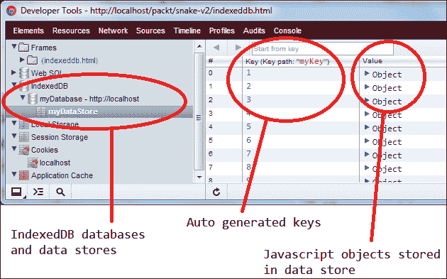

# 五、改进贪食蛇游戏

这一章是这个系列的第二部分，也是最后一部分，我们将构建一个更加健壮的贪食蛇游戏。本章我们将从[第三章](3.html "Chapter 3. Understanding the Gravity of HTML5")、*了解 HTML5* 的引力，并在其中加入更多的 HTML5 APIs，让游戏的功能更加丰富，提供更加吸引人的用户体验。

游戏的第一个版本使用了五个 HTML5 概念，即 2D 画布渲染、离线应用缓存、web workers、类型化数组和 requestAnimationFrame。在这个版本中，我们将包含新的 web 存储 API 的两个特性，即本地存储和会话存储。我们还将研究第三个应用编程接口，它是网络存储的一部分，索引数据库，以及网络消息传递功能，包括跨域消息传递。

本地存储和会话存储是两种机制，允许我们使用键值策略在用户浏览器上保存数据。这类似于 cookie，其中每个值都必须是字符串。这两个存储选项和 cookie 之间的区别首先是 cookie 总是通过 HTTP 请求发送回服务器。当我们有大量想要存储的数据时，这尤其不可取，因为这些数据会消耗额外的带宽，我们对此无能为力。有了 HTML5 的网络存储，我们可以在本地保存更多的数据，这些数据永远不会离开用户的机器，尽管像 cookies 这样的 HTTP 组件会这样做。

IndexedDB，也是 web 存储的一部分，类似于本地和会话存储，数据以键值方式存储，但是 IndexedDB 不仅仅是将值限制为字符串，它更像是一个对象存储，我们可以在其中存储整个 JavaScript 对象。当然，IndexedDB 不仅仅是一个为我们保存对象的散列图。顾名思义，这个新的应用编程接口允许我们索引这些存储的对象，以便能够通过查询系统搜索它们。总之，IndexedDB 是一个通过异步编程接口访问的 NoSQL 数据库。

最后，网络消息应用编程接口提供了一个接口，通过该接口，一个超文本标记语言文档可以与其他超文本标记语言上下文进行通信。这些文档可以通过 iframes、在不同的窗口甚至在不同的域中进行关联。

# 比赛

游戏的第二个版本增加了两个新功能。首先，我们现在跟踪玩家获得的最高分数，通过本地存储保存下来。即使玩家关闭浏览器应用或关闭计算机，该值仍将安全地存储在玩家的硬盘中，并将在游戏再次开始时加载。第二，我们使用会话存储来保存游戏中玩家每次吃水果，以及每当玩家杀死蛇时的游戏状态。这被用作一种额外的敬畏感，在玩家输了之后，我们会显示玩家在那场游戏中获得的所有个人等级提升的快照，以及玩家撞到墙壁或蛇撞到自己的快照，如下图所示:


在每场比赛结束时，会显示玩家获得升级的每个瞬间的图像，以及玩家最终死亡的快照。这些图像是通过画布应用编程接口(调用 `toDataURL`函数)创建的，而构成每个图像的数据在整个游戏中被保存，并使用网络存储应用编程接口存储。

有了这样的功能，我们可以让游戏变得更加有趣，也可能更加社会化。想象一下，如果玩家不仅可以在自己喜欢的社交网站上发布自己的高分，还可以在关键时刻发布自己的游戏图片，那该有多强大。当然，这一章只实现了这个功能的基础(换句话说，我们只拍游戏中这些关键时刻的快照)。添加实际功能以将数据发送到真实的社交网络应用是留给读者的练习。

# API 用法

游戏中使用的每个应用编程接口的一般描述和演示在以下章节中给出。有关如何将每一项功能整合到最终游戏中的解释，请查看代码部分。要获得这个游戏的完整源代码，请从 Packt Publishing 的网站上查看这本书的页面。

## 网络信息

网络消息传递允许我们与其他 HTML 文档实例进行通信，即使它们不在同一个域中。例如，假设我们的贪食蛇游戏，在[http://snake.fun-html5-games.com](http://snake.fun-html5-games.com)托管，通过T0】嵌入到一个社交网站中(假设这个社交网站在[http://www.awesome-html5-games.net](http://www.awesome-html5-games.net)托管)。当玩家获得新的高分时，我们希望将贪食蛇游戏的数据直接发布到主机页面(加载游戏的带有`iframe`的页面)。有了网络消息应用编程接口，这可以在本地完成，而不需要任何服务器端脚本。

在 web 消息传递之前，文档不允许与其他域中的文档进行通信，主要是因为安全性。当然，如果我们只是盲目地从任何应用获取消息，web 应用仍然容易受到恶意外部应用的攻击。然而，网络消息应用编程接口提供了一些可靠的安全措施来保护接收消息的页面。例如，我们可以指定消息要发往的域，这样其他域就无法拦截消息。在接收端，我们还可以检查消息的来源，从而忽略来自任何不可信域的消息。最后，DOM 永远不会通过这个应用编程接口直接公开，这提供了另一层安全性。

### 如何使用

与网络工作者类似，两个或更多的 HTML 上下文可以通过网络消息应用编程接口进行通信的方式是注册消息事件的事件处理程序，并使用`postMessage`功能发送消息:

```html
// ---------------------------------
// Host document: web-messaging.html
// ---------------------------------
var doc = document.querySelector("iframe").contentWindow;
// alternatively:
// var doc = window.open("web-messaging-rec.html", "", "width=800,height=600");
// Post a message to the child document
doc.postMessage({msg: "Hello!"}, "http://localhost");
// --------------------------------------
// Child document: web-messaging-rec.html
// --------------------------------------
window.addEventListener("message", function(event) {
   var data = event.data;
   // Post a message back to the parent document
   event.source.postMessage({msg: "Thanks for saying " + data.msg}, "*");
});
```

使用网络消息应用编程接口的第一步是获取对我们希望与之通信的某个文档的引用。这个可以通过获取一个`iframe`引用的`contentWindow`属性来完成，或者通过打开一个新窗口并保持该引用。保存该引用的文档称为父文档，因为这是开始通信的地方。尽管子窗口可以与其父窗口进行通信，但这只能在这种关系成立时发生。换句话说，一个窗口不能只与任何一个窗口通信；它需要一个对它的引用，要么通过父子关系，要么通过父子关系。

一旦子窗口被引用，父窗口就可以通过`postMessage` 功能向其子窗口发送消息。当然，如果子窗口没有定义一个回调函数来捕获和处理传入的消息，那么首先发送这些消息就没有什么意义了。尽管如此，父窗口无法知道子窗口是否定义了回调来处理传入的消息，因此我们能做的最好的事情就是假设(并希望)子窗口已经准备好接收我们的消息。

`postMessage`函数中使用的参数与 web workers 中使用的版本非常相似。也就是说，可以发送任何 JavaScript 值(数字、字符串、布尔值、对象文字和数组，包括类型化数组)。如果一个函数作为`postMessage`的第一个参数发送(直接发送，或者作为对象的一部分发送)，浏览器将引发`DATA_CLONE_ERR: DOM Exception 25`错误。第二个参数是一个字符串，表示我们允许消息被接收的域。这可以是一个绝对域、一个正斜杠(代表与发送消息的文档相同的原始域)或一个通配符(*)，代表任何域。如果消息由与`postMessage`中第二个参数不匹配的域接收，则整个消息失败。

当接收到消息时，子窗口首先注册消息事件的回调。该函数被传递一个`MessageEvent`对象，该对象包含以下属性:

*   `event.data`:返回消息的数据
*   `event.origin`:对于服务器发送的事件和跨文档消息，返回消息的来源
*   `event.lastEventId`:对于服务器发送的事件，返回最后一个事件标识字符串
*   `event.sourceReturns`:是源窗口的窗口代理，用于跨文档消息传递
*   `event.portsReturns`: It is the MessagePort array sent with the message, for cross-document messaging and channel messaging

    ### 注

    来源:[http://www.w3.org/TR/webmessaging/#messageevent](http://www.w3.org/TR/webmessaging/#messageevent)

作为我们可以在现实世界中使用这个功能的一个例子，就游戏开发而言，想象一下可以玩我们的贪食蛇游戏，但是蛇会穿过几个窗口。这有多有创意？！当然，就实用性而言，这可能不是玩游戏的最佳方式，但我发现很难反驳这样一个事实，即这确实是一个非常独特和吸引人的呈现，否则这是一个常见的游戏。


在网络消息应用编程接口的帮助下，我们可以设置一条蛇，这条蛇不会被限制在一个窗口中。想象一下，当我们将这个聪明的应用编程接口与另一个非常强大的 HTML5 特性相结合时会有什么样的可能性，它恰好非常适合游戏——网络套接字。通过结合网络消息和网络套接字，我们可以玩一个 snake 游戏，不仅可以跨多个窗口，还可以同时与多个玩家一起玩。也许当蛇进入一个给定的窗口时，每个玩家都会控制它，所有玩家都可以同时看到所有的窗口，即使他们每个人都使用一台单独的计算机。可能性是无穷的，真的。

令人惊讶的是，用于设置 snake 的多窗口端口的代码非常简单。基本设置是一样的，我们有一条一次只能朝一个方向移动的蛇。我们也有一个或多个窗户，蛇可以去那里。如果我们将每个窗口存储在一个数组中，我们可以计算出蛇需要呈现在哪个屏幕上，给定它的当前位置。考虑到蛇的世界位置，找出它应该在哪个屏幕是最棘手的部分。

例如，假设每个窗口有 200 像素宽。现在，假设有三扇窗户打开了。每个窗口的画布也只有 200 像素宽，所以当蛇在 350 的位置时，它会在所有画布中被打印得太靠右。因此，我们需要做的是首先确定总的世界宽度(画布宽度乘以画布总数)，计算蛇在哪个窗口(位置/画布宽度)，然后将位置从世界空间向下转换为画布空间，给定蛇所在的画布。

首先，让我们在父文档中定义我们的结构。这方面的代码如下:

```html
// 1\. Create an array to hold each frame (aka. window)
var frames = new Array();
// 2\. Let's keep track of some settings for these frames
frames.max = 3;
frames.width = 200;
frames.height = 300;
frames.margin = 50;
// 3\. Finally, we'll need a snake to move around
var snake = {
  max: 3,
  pos: {
    x: 0,
    y: 0
  },
  w: 25,
  h: 25,
  speed: 3,
  dir: {
    x: 1,
    y: 0
  },
  color: "#0a0"
};
```

当这个脚本加载时，我们将需要一种方法来创建新的窗口，蛇将能够在其中移动。这可以很容易地通过一个按钮来完成，当点击这个按钮时会生成一个新的窗口，然后将这个窗口添加到我们的框架数组中，这样我们就可以遍历这个数组，并告诉每个窗口蛇在哪里。这方面的代码如下:

```html
// Define a few global variables in order to keep the code shorter and simpler
var isPaused = true;
var timer;
var dirChange = 100;
var btn = document.createElement("button");
btn.textContent = "Add Window";
btn.addEventListener("click", function(event){
  var left = frames.length * frames.width + frames.margin * frames.length;
  frames[frames.length] = window.open("/packt/snake-v2/snake-panels.html", "",
    "width=" + frames.width + "," +
    "height=" + frames.height + "," +
    "top=100, left=" + left);
  isPaused = false;
  clearTimeout(timer);
  play();
}, false);
document.body.appendChild(btn);
// We'll close all the windows we have opened to save us the
// trouble of clicking each window when we want them closed
function closeAll() {
  for (var i = 0, len = frames.length; i < len; i++) {
    frames[i].close();
  }
}
window.onunload = closeAll;
```

现在，真正的魔法发生在下面的方法中。我们要做的就是更新蛇的位置，然后告诉每个窗口蛇在哪里。这将通过将蛇的位置从世界坐标转换为画布坐标来完成(因为每个画布都有相同的宽度，所以这对于每个画布来说都很容易做到)，然后告诉每个窗口蛇应该在画布中的哪个位置渲染。因为这个位置对每个窗口都有效，我们也单独告诉每个窗口它们是否应该呈现我们发送给它们的信息。只有我们计算蛇所在的窗口被告知继续渲染。

```html
function play() {
  // This is used to change the snake's position randomly
  // from time to time. The reason for this is so we don't
  // need to implement any event handling to handle user input,
  // since this is just a simple demonstration.
  if (dirChange-- < 0) {
    dirChange = 100;
    var rand = parseInt(Math.random() * 1000) % 4;
    // Make the snake move to the right
    if (rand == 0) {
      snake.dir.x = 1;
      snake.dir.y = 0;
    // Make the snake move to the left
    } else if (rand == 1) {
      snake.dir.x = -1;
      snake.dir.y = 0;
    // Make the snake move down
    } else if (rand == 2) {
      snake.dir.x = 0;
      snake.dir.y = 1;
      // Make the snake move up
    } else if (rand == 3) {
      snake.dir.x = 0;
      snake.dir.y = -1;
    }
  };
  // Update the snake's position, making sure to wrap the snake
  // around each window. If it goes too far to the right, and
  // wanders off one window, it needs to wrap to the left side
  // of the next window.
  snake.pos.x += snake.dir.x * snake.speed;
  snake.pos.x %= frames.width * frames.length;
  snake.pos.y += snake.speed * snake.dir.y;
  if (snake.pos.y < 0)
    snake.pos.y = frames.height - snake.h;
  if (snake.pos.y + snake.h > frames.height)
    snake.pos.y = 0;
  if (snake.pos.x < 0)
    snake.pos.x = (frames.width - snake.w) * frames.width * frames.length;
  var shouldDraw;
  for (var i = 0, len = frames.length; i < len; i++) {
    // Determine which window the snake is in, and tell only that
    // window that it needs to render the snake
    shouldDraw = snake.pos.x + snake.w <= frames.width * (i + 1) &&
        snake.pos.x >= frames.width * i ||
        snake.pos.x <= frames.width * (i + 1) &&
        snake.pos.x >= frames.width * i;
    // Lastly, we pass all this information to each window in canvas coordinates.
    frames[i].postMessage({
      x: snake.pos.x % frames.width,
      y: snake.pos.y,
      w: snake.w,
      h: snake.h,
      shouldDraw: shouldDraw,
      color: snake.color
    }, "*");
  }
}
```

这就是它的全部。组成所有其他窗口的代码对所有窗口都是相同的。事实上，我们只打开了一堆指向完全相同脚本的窗口。就每个窗口而言，它们是唯一打开的窗口。他们所做的只是通过消息传递应用编程接口获取一堆数据，然后在设置了 `shouldDraw`标志的情况下渲染这些数据。否则，他们只是清理画布，静观其变，等待来自其父窗口的进一步指示。

```html
// 1\. Create a canvas
var canvas = document.createElement("canvas");
canvas.width = 400;
canvas.height = 300;
// 2\. Attach the canvas to the DOM
document.body.appendChild(canvas);
// 3\. Get a reference to the canvas' context
var ctx = canvas.getContext("2d");
// 4\. Set up the callback to receive messages from some parent window
function doOnMessage(event) {
  // 5\. For security, make sure we only process input from a trusted window
  if (event.origin == "http://localhost") {
    var data = event.data;
    ctx.clearRect(0, 0, canvas.width, canvas.height);
    // 6\. And here's where the magic happens for this window. If told to
    // draw something through the message received, go ahead and do so.
    if (data.shouldDraw) {
      ctx.fillStyle = data.color;
      ctx.fillRect(data.x, data.y, data.w, data.h);
    }
  }
}
window.addEventListener("message", doOnMessage, false);
```

## 网络存储

在 HTML5 出现之前，网络开发人员必须在客户端存储数据的唯一方式是通过 cookies。虽然的范围有限，但 cookies 做了它们应该做的事情，尽管它们有几个限制。首先，每当一个 cookie保存到客户端时，此后的每个 HTTP 请求都包含该 cookie 的数据。这意味着数据总是被显式地公开，并且这些 HTTP 请求中的每一个都充满了不属于那里的额外数据。当考虑到可能需要存储相对大量数据的 web 应用时，这尤其低效。

有了新的网络存储应用编程接口，这些问题得到了解决和满足。现在有三种不同的客户端存储选项，它们都解决了一个不同的问题。但是，请记住，存储在客户端中的任何和所有数据仍然以纯文本形式向客户端公开，因此不适合安全存储解决方案。

这三种存储解决方案是会话存储、本地存储和索引数据库 NoSQL 数据存储。会话存储允许我们存储持续到浏览器关闭(换句话说，直到会话结束)的键值数据对。本地存储在各方面都类似于中的会话存储，只是数据持续的时间更长。

即使会话关闭，存储在本地存储中的数据仍然存在。只有当用户明确告诉浏览器这样做时，或者当应用本身从存储中删除数据时，本地存储中的数据才会被清除。最后，IndexedDB 是一个健壮的数据存储，允许我们存储自定义对象(不包括包含函数的对象)，然后在数据库中查询这些对象。当然，强大的同时也伴随着巨大的复杂性。虽然在浏览器中内置一个专用的 NoSQL 数据库听起来可能令人兴奋，但不要被愚弄了。虽然使用 IndexedDB 对 HTML 世界来说是一个有趣的补充，但对初学者来说也绝不是一件小事。与本地存储和会话存储相比，IndexedDB 的学习曲线有些陡峭，因为它涉及掌握一些复杂的数据库概念。

### 注

如前所述，本地存储和会话存储之间唯一真正的区别是，每当浏览器关闭时，会话存储就会自行清除。除此之外，两者的一切都是完全一样的。因此，学习如何使用两者将是一个简单的体验，因为学习一个也意味着学习另一个。然而，知道什么时候使用一个比另一个可能需要你多一点思考。为了获得最佳效果，在决定使用哪个应用之前，请尝试关注您自己的应用的独特特性和需求。更重要的是，要认识到在同一应用中使用两个存储系统是完全合法的。关键是要专注于一个独特的功能，并决定什么样的存储应用编程接口最适合这些特定的需求。

本地存储和会话存储对象都是类`Storage`的实例。 `storage`类定义的接口，我们可以通过它与这些存储对象进行交互，定义如下(来源: Web 存储 W3C 候选推荐，2011 年 12 月 08 日，[http://www.w3.org/TR/webstorage/](http://www.w3.org/TR/webstorage/)):

*   `getItem(key)`:返回给定按键关联的当前值。如果给定的键不存在于与对象关联的列表中，则此方法必须返回 null。
*   `setItem(key, value)`:它首先检查在与对象相关联的列表中是否已经存在具有给定键的键/值对。如果没有，则必须向列表中添加一个新的键/值对，给定的键及其值设置为`value`。如果给定的键确实存在于列表中，那么它的值必须更新为`value`。如果无法设置新值，该方法必须抛出`QuotaExceededError`异常。(例如，如果用户禁用了站点的存储，或者超过了配额，设置可能会失败。)
*   `removeItem(key)`:如果存在，它会导致带有给定键的键/值对从与对象相关联的列表中移除。如果不存在具有该键的项，则该方法不能执行任何操作。
*   `clear()`:自动将对象关联的列表清空所有键/值对(如果有)。如果没有，那么该方法必须什么也不做。
*   `key(n)`:返回列表中第 n 个键的名称。键的顺序是用户代理定义的，但是只要键的数量不变，在一个对象内必须是一致的。(因此，添加或删除键可能会改变键的顺序，但仅仅改变现有键的值绝不能。)如果 n 大于或等于对象中键/值对的数量，则此方法必须返回 null。存储对象上受支持的属性名是与该对象关联的列表中当前存在的每个键/值对的键。
*   `length`:返回当前存在于与对象关联的列表中的键/值对的数量。

## 本地存储

本地存储机制通过全局对象的属性来访问，该属性在浏览器上是`window`对象。因此，我们可以通过`window.localStorage`显式地访问存储属性，或者通过`localStorage`隐式地访问存储属性。

`window.localStorage.clear();`

`localStorage.length == 0; // True`

由于只允许将多字符串值存储在本地存储中，因此在存储到本地存储之前，除字符串之外的任何其他值都会转换为字符串。也就是说，我们不能在`localStorage`中存储数组、对象、函数等等。只允许使用普通的 JavaScript 字符串。

```html
var typedArray = new Uint32Array(100);
localStorage.setItem("my-array", typedArray);
var myArray = localStorage.getItem("my-array");
myArray == "[object Uint32Array]"; // True
```

现在，虽然这看起来像是对存储 API 的限制，但实际上这是通过设计完成的。如果您的目标是存储复杂的数据类型供以后使用，本地存储不一定是为了解决这个问题而设计的。在这些情况下，我们有一个更强大、更方便的存储解决方案，我们很快就会看到它(即 IndexedDB)。但是，有一种方法可以在 localStorage 中存储复杂的数据(包括数组、类型化数组、对象等)。

关键在于精彩的`JSON` 数据格式。现代浏览器在全局范围内有非常方便的`JSON`对象，在这里我们可以访问两个重要的功能，即`JSON.stringify`和`JSON.parse`。通过这两种方法，我们可以序列化复杂的数据，将其存储在`localStorage`中，然后对从存储中检索到的数据进行反序列化，并在应用中继续使用。

```html
// 1\. Define some class
var Person = function(name) {
  this.name = name;
};
// 2\. Add functions to the class
Person.prototype.greet = function(){
  return "Hello, " + this.name;
};
// 3\. Create an array of objects of that class
var people = new Array();
people.push(new Person("Rodrigo"));
people.push(new Person("Silveira"));
// 4\. Stringify the complex array, and store it away
var json = JSON.stringify(people);
localStorage.setItem("people", json);
// 5\. Retrieve that serialized data, and parse it back into what it was
people = JSON.parse(localStorage.getItem("people"));
people[0].name == "Rodrigo"; // True
people[0] instanceof Person; // False
people[0].greet(); // TypeError: Object has no method 'greet'
```

虽然这是一个不错的小技巧，但你会注意到一个主要的限制:`JSON stringify`没有序列化函数。此外，如果您密切关注 JSON.stringify 的工作方式，您会意识到类实例失去了所有的“身份”，只有硬数据得到了维护。换句话说，在我们序列化和反序列化`Person`的一个实例之后，结果将是一个没有构造函数或原型信息的简单对象文字。尽管如此，考虑到 localStorage 从未打算扮演对象持久性的角色(而是简单的键-值字符串对)，这应该被视为一个有限但非常巧妙的技巧。

## 会话存储

由于 sessionStorage 界面与 localStorage 的界面相同，因此没有理由重复刚才描述的所有信息。有关会话存储的更深入的讨论，请查看前面两个部分，并将单词“local”替换为“session”。上面提到的适用于本地存储的所有内容也适用于会话存储。同样，两者之间的唯一区别是，当与客户端的会话结束时(即，每当浏览器关闭时)，保存在 `sessionStorage`上的任何数据都会被擦除。

下面将展示一些如何使用 sessionStorage 的示例。在这个例子中，我们将尝试在 sessionStorage 中存储一个值，如果这个值还不存在的话。请记住，当我们为存储设置键值对时，如果该键已经存在于存储中，那么与该键相关联的任何值都将被覆盖。如果密钥不存在，它会自动创建。

```html
var name = sessionStorage.getItem("coolestPerson");
// Only set a new value if the key exists,
// and the value is not what we want
if (name != null && name != "Rodrigo") {
  sessionStorage.setItem("coolestPerson", "Rodrigo");
}
```

请注意，我们还可以使用`in`运算符查询 sessionStorage 对象的特定键，该运算符返回如下所示的布尔值:

```html
if ("coolestPerson" in sessionStorage) {
   // …
}
```

最后，虽然我们可以通过`sessionStorage.length`检查存储中的密钥总量，但是如果我们不知道所有不同的密钥是什么，这本身可能就不是很有用。值得庆幸的是， `sessionStorage.key`函数允许我们获得一个特定的密钥，通过这个密钥我们可以获得用这个密钥存储的值。

```html
sessionStorage.clear();
sessionStorage.length == 0; // True
sessionStorage.setItem("name", "Rodrigo");
sessionStorage.setItem("book", "Learn HTML5");
sessionStorage.setItem("publisher", "Packt Pub");
sessionStorage.setItem("isColor", true);
sessionStorage.setItem("rating", 5);
var values = new Array();
for (var i = 0, len = sessionStorage.length; i < len; i++) {
   var key = sessionStorage.key(i);
   var value = sessionStorage.getItem(key);
   values.push({key: key, value: value});
}
values.length == sessionStorage.length; // True
values[0].key == "book"; // True*
values[0].value == "Learn HTML5"; // True*
```

因此，我们可以在`sessionStorage`查询给定位置的某个键，并接收代表该键的字符串键。然后，使用该密钥，我们可以获得该密钥存储的值。但是，请注意，项目在`sessionStorage`对象中的存储顺序完全是任意的。虽然有些浏览器可能会保留按键值字母顺序排序的存储项目列表，但这在 HTML5 规范中明确规定为由浏览器制造商决定。

# 索引编制

尽管到目前为止网络存储应用编程接口看起来很令人兴奋，但在某些情况下，当我们使用本地或会话存储时，序列化和非序列化数据可能还不够。例如，假设我们在本地存储器中存储了几百条(或者可能是几千条)类似的记录(假设我们存储的敌人描述卡是一个 RPG 游戏的一部分)。考虑如何使用本地存储来完成以下工作:

*   按字母顺序检索存储的前五条记录
*   删除存储的所有包含特定特征的记录(例如，不能在水中生存的敌人)
*   检索存储的最多三个包含特定特征的记录(例如，敌人的命中点得分为 42，000 或更高)

重点是:我们可能想要对存储在本地存储或会话存储中的数据进行的任何查询都必须由我们自己的代码来处理。换句话说，我们将花费大量时间和精力编写代码，只是为了帮助我们获得一些数据。更不用说存储在本地或会话存储中的任何复杂数据都被转换成文字对象，曾经是这些对象一部分的任何和所有函数现在都消失了，除非我们编写更多的代码来处理某种自定义的非序列化。

如果你现在还没有猜到，IndexedDB 非常漂亮地解决了这些和其他问题。从本质上来说，IndexedDB 是一个 NoSQL 数据库引擎，它允许我们存储整个对象，并为它们编制索引，以便快速插入、删除和检索。数据库系统还为我们提供了一个强大的查询引擎，这样我们就可以对已经保存的数据执行非常高级的计算。

下图显示了 IndexedDB 和传统关系数据库之间的一些相似之处。在关系数据库中，数据作为一组行存储在特定的表结构中。另一方面，在 IndexedDB 中，数据被分组到被称为数据存储的广泛定义的桶中。


IndexedDB 的架构与当今大多数 web 开发项目中使用的流行关系数据库系统有些相似。一个核心区别是，关系数据库将数据存储在数据库中，数据库是相关表的集合，而索引数据库系统将数据分组到数据库中，数据库是数据存储的集合。虽然在概念上相似，但实际上这两种体系结构是完全不同的。

### 注

如果您来自关系数据库背景，并且数据库、表、列和行的概念对您来说很有意义，那么您就很有可能成为 IndexedDB 专家。正如您将看到的，系统和方法之间有一些显著的区别。虽然您可能想简单地用表来替换单词 data store，但是要知道这两个概念之间的区别不仅仅是名称上的区别。

数据存储的一个关键特征是它们没有任何特定的模式与之相关联。在关系数据库中，表是由其非常特殊的结构定义的。每个列都是在首次创建表时提前指定的。然后，保存在这样一个表中的每条记录都遵循完全相同的格式。在 NoSQL 数据库(IndexedDB 是其中的一种)中，一个数据存储可以保存任何对象，无论它们的格式如何。本质上，这个概念与关系数据库表中的每个记录都有不同的模式是一样的。

## IDBFactory

首先，我们需要创建一个数据库。这是通过 IDBFactory 的实现来完成的，在浏览器中，IDBFactory 是 `window.indexedDB`对象。删除数据库也是通过 indexedDB 对象完成的，我们很快就会看到。

为了打开一个数据库(或者创建一个，如果它还不存在的话)，我们简单地调用`indexedDB.open`方法，传入一个数据库名称和一个版本号。如果未提供版本号，将使用默认版本号 1，如以下代码片段所示:

```html
var dbName = "myDatabase";
var dbVersion = 1;
var request = indexedDB.open(dbName, dbVersion);
```

正如您很快会注意到的，IndexedDB 中异步请求的每个方法(例如`indexedDB.open`)都会返回一个 IDBRequest 类型的请求对象，或者它的实现。一旦我们有了请求的对象，我们就可以在它的属性上设置回调函数，当与它们相关的各种事件被触发时，回调函数就会被执行，如下面的代码片段所示:

```html
var dbName = "myDatabase";
var dbVersion = 1;
var db = null;
var request = indexedDB.open(dbName, dbVersion);
request.onerror = function(event) {
   console.log("Error:", event);
};
request.onsuccess = function(event) {
   db = event.target.result;
};
```

## idbopend 请求

如前一节所述，一旦我们向 IndexedDB API 发出异步请求，立即返回的对象将是 IDBRequest 类型。在打开请求的特殊情况下，返回给我们的对象是 IDBOpenDBRequest 类型。在前面的代码片段(`onerror`和`onsuccess`)中显示了我们可能想要在这个对象上监听的两个事件。还有一个非常重要的事件，我们可以在其中创建一个对象存储，这是这个存储系统的基础。这个事件就是 `onupgradeneeded`(即需要升级时)事件。这将在首次创建数据库时触发，而且正如您所料，每当用于打开数据库的版本号高于上次打开数据库时使用的值时都会触发，如以下代码所示:

```html
var dbName = "myDatabase";
var dbVersion = 1;
var db = null;
var store = null;
var request = indexedDB.open(dbName, dbVersion);
request.onupgradeneeded = function(event) {
   db = event.target.result;
   store = db.createObjectStore("myDataStore", {keyPath: "myKey"});
};
```

对数据库对象的`createObjectStore`调用有两个参数。第一个是代表对象存储名称的字符串。这个存储可以被认为是关系数据库世界中的一个表。当然，我们不是将记录插入到表的列中，而是将整个对象插入到数据存储中。第二个参数是定义数据存储属性的对象。这个对象必须定义的一个重要属性是`keyPath` 对象，这使得我们存储的每个对象都是唯一的。分配给该属性的值可以是我们选择的任何值。

现在，我们保存在这个数据存储中的任何对象必须有一个与分配给`keyPath`的属性同名的属性。在这个例子中，我们的对象需要有一个属性`myKey`。如果一个新对象被持久化，它将被这个属性的值索引。

为`myKey`存储的具有相同值的任何附加对象将用相同的键替换任何旧对象。因此，每当我们想要一个唯一的对象持久化时，我们必须为这个对象提供一个唯一的值。

或者，我们可以让浏览器为这个键提供一个唯一的值。同样，将这个概念与关系数据库进行比较，我们可以认为`keyPath`对象与特定元素的唯一标识是一回事。正如大多数关系数据库系统将支持某种自动增量一样，IndexedDB 也是如此。为了指定我们想要自动递增的值，我们只需在首次创建(或升级)数据存储时向对象存储属性对象添加标志，如以下代码片段所示:

```html
request.onupgradeneeded = function(event) {
  var settings = {
    keyPath: "myKey",
    autoIncrement: true
  };
  db = event.target.result;
  store = db.createObjectStore("myDataStore", settings);
};
```

现在我们可以持久化一个对象，而不必为属性`myKey`提供唯一的值。事实上，我们甚至根本不需要提供这个属性作为我们在这里存储的任何对象的一部分。IndexedDB 将为我们处理此事。请看下图:



使用谷歌 Chrome 的开发工具，我们可以看到我们为我们的领域创建的所有数据库和数据存储。请注意，主对象键，无论我们在创建数据存储时给它起什么名字，都有 IndexedDB 生成的值，正如我们所指定的，这些值会在最后一个值的基础上递增。

有了这些简单而冗长的样板代码，我们现在可以开始使用我们的数据库和数据存储了。从这一点开始，我们对数据库采取的操作将在单个数据存储对象上完成，这些对象是通过创建它们的数据库对象来访问的。

## idbtr 护理

在处理 IndexDB 时，我们需要记住的最后一件事是我们与数据存储的每一次交互都是在事务内部完成的。如果在事务处理过程中出现问题，整个事务都会回滚，不会有任何效果。同样，如果交易成功，IndexedDB 会自动为我们提交交易，这是一个非常方便的奖励。

要使用事务，我们需要获取对数据库的引用，然后为特定的数据存储请求一个事务。一旦我们有了对数据存储的引用，我们就可以执行与数据存储相关的各种功能，例如将数据放入其中，从其中读取数据，更新数据，最后从数据存储中删除数据。

```html
var TodoItem = function(task) {
  this.task = task;
  this.completed = false;
};
try {
  var trans = db.transaction(storeName, "readwrite");
  var store = trans.objectStore(storeName);
  var task1 = new TodoItem("Buy more pizza");
  var task2 = new TodoItem("Finish writing the book");
  var task3 = new TodoItem("Shave before going to work");
  var request = store.put(task1);
  // We can reuse this request object to store multiple objects
  request = store.put(task2);
  request = store.put(task3);
  request.onsuccess = function(e) {
    log("Success!" + value.key);
  };
  request.onerror = function(e) {
    log(e.stack);
  };
} catch (e) {
   log(e.stack);
}
```

要在数据存储中存储一个项目，我们需要遵循几个步骤。请注意，如果在这个事务中出现任何问题，我们只需捕获浏览器抛出的任何错误，并且由于 try/catch 块，执行会不间断地继续。

在 IndexedDB 中持久化对象的第一步是启动一个事务。这是通过从我们之前打开的数据库中请求一个事务对象来实现的。事务总是与特定的数据存储相关。此外，当请求一个事务时，我们可以指定我们想要启动什么类型的事务。IndexedDB 中可能的事务类型如下:

### 读写

该事务模式允许将对象存储到数据存储中，从中检索、更新和删除。换句话说，读写模式允许完整的 CRUD 功能。

### 只读

这种事务模式类似于读写，但明确限制与数据存储的交互仅限于读取。不允许修改数据存储的任何操作，因此任何创建新记录(换句话说，将新对象保存到数据存储中)、更新现有对象(换句话说，尝试保存已经在数据存储中的对象)或从数据存储中删除对象的尝试都将导致事务失败，并引发异常。

### 版本变更

该事务模式允许我们创建或修改数据存储中使用的对象存储或索引。在这种模式的事务中，我们可以执行任何操作，包括修改数据库的结构。

## 获取元素

如果我们不能在以后的某个时间点检索数据，那么简单地将数据存储到一个黑盒中根本没有用。有了 IndexedDB，这可以通过几种不同的方式来实现。更常见的是，我们保存数据的数据存储是用一个或多个索引建立的，这些索引保持对象由特定的字段组织。同样，对于那些习惯于关系数据库的人来说，这类似于为特定的表列编制索引/应用键。如果我们想得到一个对象，我们可以通过它的唯一标识来查询它，或者我们可以在数据存储中搜索符合特定特征的对象，这可以通过该对象的索引值来实现。

要在数据存储上创建索引，我们必须在数据存储的创建过程中指定我们的意图(在首次创建存储时的 `onupgradeneeded`回调内部，或者在事务模式版本更改内部)。代码如下:

```html
request.onupgradeneeded = function(event) {
  var settings = {
    keyPath: "myKey",
    autoIncrement: true
  };
  db = event.target.result;
  store = db.createObjectStore("myDataStore", settings);
  var indexSettings = {
    unique: true
  };
  store.createIndex("taskIndex", "task", indexSettings);
};
```

在前面的例子中，我们为对象的任务属性创建了一个索引。这个索引的名称可以是我们想要的任何名称，通常与它所应用的对象属性的名称相同。在我们的例子中，我们简单地将其命名为 taskIndex。我们可以配置的可能设置如下:

*   唯一性–如果为真，则以相同属性的重复值存储的对象将被拒绝
*   multiEntry – if true, and the indexed attribute is an array, each element will be indexed

    ### 注

    请注意，可以为数据存储创建零个或多个索引。就像任何其他数据库系统一样，对数据库/数据存储进行索引确实可以提高存储容器的性能。然而，仅仅为了它提供的乐趣而添加索引并不是一个好主意，因为数据存储的大小会相应地增长。一个好的数据存储设计应该考虑数据存储相对于应用的特定上下文，并且仔细考虑每个索引字段。设计数据存储时要记住的一句话是:测量两次，剪切一次。

    尽管任何对象都可以保存在数据存储中(与关系数据库相反，关系数据库中存储的数据必须严格遵循表的架构所定义的表结构)，但是为了优化应用的性能，请尝试使用它将存储的数据来构建数据存储。诚然，任何数据都可以被打包到任何数据存储中，但是明智的开发人员在将数据提交到数据库之前会非常仔细地考虑所存储的数据。

一旦建立了数据存储，并且我们至少有一个有意义的索引，我们就可以开始从数据存储中提取数据。从数据存储中检索对象最简单的方法是使用索引，并查询特定的对象，如以下代码所示:

```html
var TodoItem = function(task) {
  this.task = task;
  this.completed = false;
};
function getTask(taskName, callback) {
  // 1\. Open a transaction. Since we don't need to write anything to
  // the data store, a simple readonly transaction will sufice.
  var trans = db.transaction(storeName, "readonly");
  var store = trans.objectStore(storeName);
  // 2\. specify an index to use, and the data to get from it
  var req = store.index("taskIndex").get(taskName);
  req.onsuccess = function(e) {
    var todoItem = e.target.result;
    // todoItem.task => "Buy more pizza"
    // todoItem.completed => false
    callback(todoItem);
  };
  req.onerror = function(e) {
    // Handle error
  };
};
// Search for a TodoItem object with a task property of "Buy more pizza"
getTask("Buy more pizza", function(taskItem) {
  console.log("TaskItem object: " + taskItem.task);
});
```

前面的函数试图从我们的数据存储中检索一个保存的对象。搜索对象的任务属性与提供给函数的任务名称相匹配。如果找到一个，它将从数据存储中检索，并通过传入回调函数的事件对象传递给存储对象的请求。如果过程中出现错误(例如，如果提供的索引不存在)，则触发`onerror`事件。最后，如果数据存储中没有符合搜索条件的对象，则通过请求参数对象传入的结果属性将为空。

现在，为了搜索多个项目，我们可以采取类似的方法，但是我们请求一个`IndexedDBCursor`对象。光标基本上是指向零个或多个对象的结果集中的特定结果的指针。我们可以使用光标遍历结果集中的每一个对象，直到当前光标指向无对象(空)，表明结果集中不再有对象。

```html
var TodoItem = function(task) {
  this.task = task;
  this.completed = false;
};
function getTask(taskName, callback) {
  // 1\. Open a transaction. Since we don't need to write anything to
  // the data store, a simple readonly transaction will sufice.
  var trans = db.transaction(storeName, "readonly");
  var store = trans.objectStore(storeName);
  // 2\. specify the range in the data store to request data from
  var keyRange = IDBKeyRange.lowerBound(0);
  var req = store.openCursor(keyRange);
  req.onsuccess = function(e) {
    // cursor IDBCursorWithValue
    //   key : int
    //   primaryKey : int
    //   source : IDBObjectStore
    //   value : Object
    //
    var cursor = e.target.result;
    // Before we continue, we need to make sure that we
    // haven't hit the end of the result set
    if (!cursor) {
      callback();
    }
    // If there are still results, let's process them
    //    cursor.value === todoItem
    //    cursor.value.task => "Buy more pizza"
    //    cursor.value.completed => false
    // Since results are plain, typeless object literals, we need to rebuild
    // each object from scratch.
    var todoItem = new TodoItem(cursor.value.task);
    todoItem.myKey = cursor.value.myKey;
    todoItem.completed = cursor.value.completed;
    todoItems.push(todoItem);
     // Tell the cursor to fetch the next result
      cursor.continue();
  };
  req.onerror = function(e) {
    // Handle error
  };
};
// Retrieve every TodoItem in the data store
var todoItems = new Array();
getTask("Buy more pizza", function() {
  for (var i = 0; i < todoItems.length; i++) {
    console.log("TaskItem object: " + todoItems[i].task);
  }
})
```

您将通过上面的代码片段注意到一些事情。首先，任何进入我们的 IndexedDB 数据存储的对象都被去掉了它的 DNA，只有一个简单的散列来代替它。因此，如果我们从数据存储中检索的每个对象的原型信息对应用很重要，那么我们将需要从数据存储中获取的数据手动重建每个对象。

第二，观察我们是否可以过滤出我们想要从其中取出的数据存储子集。这是通过 IndexedDB 键范围对象来完成的，该对象指定了开始获取数据的偏移量。在我们的例子中，我们指定了零的下限，这意味着我们想要的最低主键值是零。换句话说，这个特定的查询请求数据存储中的所有记录。

最后，请记住，请求的结果不是单个结果或结果数组。相反，所有的结果以游标的形式一次返回一个。我们可以一起检查光标的存在，如果确实存在，就使用光标。然后，我们请求下一个光标的方式是调用光标本身的`continue()`函数。

另一种看待光标的方式是想象一个电子表格应用。假设从我们的请求返回的 10 个对象分别代表这个电子表格中的一行。所以 IndexedDB 会将这 10 个对象全部提取到内存中，并通过`onsuccess` 回调中的`event.target.result`属性发送一个指向第一个结果的指针。通过调用`cursor.continue()`，我们简单地告诉 IndexedDB 现在给我们一个结果集中下一个对象的引用(或者，换句话说，我们要求电子表格中的下一行)。这种情况一直持续到第十个对象，之后结果集中不再有对象存在(同样，按照电子表格的比喻，在我们获取最后一行后，其后的下一行为空——它不存在)。结果，数据存储将调用`onsuccess`回调，并传入一个空对象。如果我们试图读取这个空引用中的属性，就像我们正在处理从游标返回的真实对象一样，浏览器将抛出一个空指针异常。

我们可以用一种通用的形式将这个功能抽象出来，而不是试图一次从一个游标的一个属性中重构一个对象。因为持久化到对象存储中的对象不能有任何功能，所以我们不允许将这样的功能保留在对象本身中。然而，由于 JavaScript 能够从对构造函数的引用中构建对象，我们可以创建一个非常通用的对象构建函数，如下所示:

```html
var TodoItem = function(task) {
  this.task = task;
  this.completed = false;
  this.toHTML = function() {
    var el = document.createElement("li");
    el.textContent = this.task;
    if (this.completed) {
      el.style.textDecoration = "line-through";
    }
    return el;
  };
};
function inflatObject(class, object) {
  // 1\. Create an instance of whatever class we reference
  var obj = new class();
  // 2\. Copy every property from the object returned by the cursor
  // into the newly created object
  for (var property in object) {
    obj[property] = object[property];
  }
  // 3\. Return the inflated object
  return obj;
}
// …
var req = store.openCursor(keyRange);
req.onsuccess = function(e) {
  var cursor = e.target.result;
  // Before we continue, we need to make sure that we
  // haven't hit the end of the result set
  if (!cursor) {
    callback();
  }
  var todoItem = inflatObject(TodoItem, cursor.value);
  // We could even call methods on the new inflated object
  var itemElement = todoItem.toHTML();
  document.body.appendChild(itemElement);
  todoItem.myKey == cursor.myKey; // True
  todoItem.task == cursor.task; // True
  todoItem.completed == cursor.completed; // True
  todoItems.push(todoItem);
  // Tell the cursor to fetch the next result
  cursor.continue();
};
```

## 删除元素

要从数据存储中移除特定的元素，检索数据所涉及的相同原则也适用。事实上，整个过程看起来与检索数据相当一致，只是我们在对象存储对象上调用了 delete 函数。不用说，这个动作中使用的事务必须是 readwrite，因为 readonly 限制了对象，所以不能对其进行任何更改(包括删除)。

删除对象的第一种方法是将对象的主键传递给`delete`函数。如下所示:

```html
function deleteTask(taskId, callback) {
  // 1\. Open a transaction. Since we definitely need to change the object
  // in the data store, we need proper access and benefits
  var trans = db.transaction(storeName, "readwrite");
  var store = trans.objectStore(storeName);
  // 2\. specify an index to use, and the data to get from it
  var req = store.delete(taskId);
  req.onsuccess = function(e) {
    // Do something, then call callback
  };
  req.onerror = function(e) {
    // Handle error
  };
};
```

第一种方法的难点在于我们需要知道对象的 ID。在某些情况下，这将涉及一个先前的事务请求，我们将根据一些更容易获得的数据来检索对象。例如，如果我们想删除所有属性设置为 true 的任务，我们需要首先查询这些对象的数据存储，然后使用与每个结果相关联的标识，并在删除对象的事务中使用这些值。

从数据存储中移除数据的第二种方法是简单地在对象存储对象上调用`clear()`。同样，事务必须设置为 readwrite。这样做将删除数据存储中的最后一个对象，即使它们都是不同的类型，如下面的代码片段所示:

```html
var trans = db.transaction(storeName, "readwrite");
var store = trans.objectStore(storeName);
var req = store.clear();
req.onsuccess = function(e) {
  // Do something, then call callback
};
req.onerror = function(e) {
  // Handle error
};
```

最后，我们可以使用游标删除多条记录。这类似于我们检索对象的方式。当我们使用光标遍历结果集时，我们可以简单地删除光标当前所在位置的对象。删除后，游标对象的引用被设置为 null，如下面的代码片段所示:

```html
  // 1\. Be sure to set the transaction to readwrite. Else, there will be a nice
  // exception raised if we try to delete readonly data.
  var trans = db.transaction(storeName, "readwrite");
  var store = trans.objectStore(storeName);
  // 2\. specify the range in the data store to request data from
  var keyRange = IDBKeyRange.lowerBound(0);
  var req = store.openCursor(keyRange);
  req.onsuccess = function(e) {
    var cursor = e.target.result;
    // Before we continue, we need to make sure that we
    // haven't hit the end of the result set
    if (!cursor) {
      callback();
    }
    // Here, we could have accessed the object's primary ID through
    // the cursor object in cursor.value.myKey. However, accessing
    // cursor.primaryKey maps to the specific property name that holds
    // the value of the primary key.
    store.delete(cursor.primaryKey);
    // Tell the cursor to fetch the next result
    cursor.continue();
  };
```

这与获取数据几乎是一样的。唯一的细节是我们绝对需要提供一个对象的密钥。关键是存储在对象的`keyPath`属性中的值，可以是用户提供的，也可以是自动生成的。对我们来说幸运的是，光标对象通过`cursor.primaryKey`属性以及通过对象自身的属性引用了该值(在我们的例子中，我们选择了`keyPath` 属性来命名为`myKey`)返回了至少两个对此键的引用。

# 代码

我们在这个游戏的第二个版本中增加的两个升级很简单，但是它们为游戏增加了很多价值。我们增加了一个持久的高分引擎，所以用户实际上可以跟踪他们的最新记录，并有一个过去成功的粘性记录。我们还增加了一个漂亮的俏皮的功能，每当玩家得分时，以及每当玩家最终死亡时，都会拍摄游戏板的快照。一旦玩家死亡，我们会显示我们在整个游戏中收集的所有快照，允许玩家保存这些图像，并可能与他或她的朋友共享。

## 保存高分

关于这个游戏的前一个版本，你可能注意到的第一件事是我们有一个高分占位符，但这个数字从未改变。现在我们知道如何持久化数据，我们可以很容易地利用这一点，通过各种游戏来持久化一个玩家的高分。在一个更现实的场景中，我们可能会将高分数据发送到后端服务器，在那里每次提供游戏时，我们都可以跟踪整体的高分，每个玩游戏的用户都会知道这个全局分数。然而，在我们的情况下，高分仅在浏览器本地，因为没有持久性 API(本地和会话存储，以及 IndexedDB)在其他浏览器之间共享数据，或者本地共享给远程服务器。

因为我们希望即使一个月之后，高分仍然存在于玩家的浏览器中，所以在电脑多次关机(当然也包括浏览器)之后，在 sessionStorage 上存储这个高分数据是愚蠢的。我们可以将这个数字存储在索引数据库或本地存储器中。因为我们不关心与这个分数相关联的任何其他信息(例如达到分数的日期等等)，所以我们真正存储的只是一个数字。出于这个原因，我认为 localStorage 是一个更好的选择，因为它只需 5 行代码就可以完成。使用 IndexedDB 会起作用，但就像用大炮杀死一只蚊子:

```html
function setHighScore(newScore, el) {
  var element = document.querySelector(el);
  // Multiply by 1 to cast the value from a string to a number
  var score = localStorage.getItem("high-score") * 1;
  // Check if there is a numerical score saved
  if (score && !isNaN(score)) {
    // Check if new score is higher than current high score
    if (newScore > element.textContent * 1) {
      localStorage.setItem("high-score", newScore);
      element.textContent = newScore;
    } else {
        element.textContent = score;
    }
  } else {
    localStorage.setItem("high-score", newScore);
    element.textContent = newScore;
  }
}
```

这个函数非常简单。我们传递给它的两个值是要设置为新高分的实际分数(该值将保存到本地存储，并显示给用户)，以及显示该值的 HTML 元素。

首先，我们检索保存在关键高分下的现有值，并将其转换为数字。我们可以使用函数`parseInt()`，但是将一个字符串乘以一个数字会做同样的事情，但是执行速度会稍微快一些。

接下来，我们检查该值是否评估为真实值。换句话说，如果本地存储中没有保存高分值，那么变量分数将被评估为未定义乘以 1，这不是一个数字。如果有一个值用键高分保存，但那个值不是可以转换成数字的东西(比如一串字母之类的)，我们就知道它不是有效值。在这种情况下，我们将传入的分数设置为新的高分。这将在当前持久值无效或不存在的情况下解决(这将是第一次加载游戏的情况)。

接下来，一旦我们从本地存储中重试了有效得分，我们就检查新值是否高于旧的持久值。如果我们有一个更高的分数，我们会保持这个值，并将其显示在屏幕上。如果新值不高于现有值，我们不会保留任何内容，而是显示保存的值，因为这是当时真正的高分。

## 拍摄游戏截图

这个特性不像保存用户的高分那么简单，但是实现起来非常简单。由于我们不关心我们在一个以上游戏之前捕获的快照，我们将使用`sessionStorage`来保存游戏中的数据，随着玩家的进步而实时保存。

在幕后，我们所做的就是拍摄这些快照，将游戏状态保存到`sessionStorage`中，然后在游戏结束时，我们检索所有我们一直保存的片段，并将这些时间点的游戏重建到一个不可见的画布中。然后，我们使用`canvas.toDataURL()`函数将该数据提取为图像:

```html
function saveEvent(event, snake, fruit) {
  var eventObj = sessionStorage.getItem(event);
  // If this is the first time the event is set, create its structure
  if (!eventObj)  {
    eventObj = {
      snake: new Array(),
      fruit: new Array()
    };
    eventObj.snake.push(snake);
    eventObj.fruit.push(fruit);
    eventObj = JSON.stringify(eventObj);
    sessionStorage.setItem(event, eventObj);
  } else {
    eventObj = JSON.parse(eventObj);
    eventObj.snake.push(snake);
    eventObj.fruit.push(fruit);
    eventObj = JSON.stringify(eventObj);
    sessionStorage.setItem(event, eventObj);
  }
  return JSON.parse(eventObj);
}
```

玩家每吃一个水果，我们就调用这个函数，传递给`snake`(我们在这个游戏中的英雄)和`fruit`(这个游戏的目标)对象一个引用。我们所做的其实很简单:我们创建一个数组，表示我们捕获的每个事件中蛇和水果的状态。这个数组中的每个元素都是一个表示序列化数组的字符串，该数组跟踪水果的位置，以及蛇的每个身体部分的位置。

首先，我们检查这个对象当前是否存在于`sessionStorage`中。我们第一次开始游戏时，这个对象还不存在。因此，我们创建了一个引用这两个对象的对象，即`snake`和`fruit`对象。接下来，我们用字符串表示跟踪我们想要跟踪的元素位置的缓冲区。每次我们添加一个新的事件，我们只需追加到这两个缓冲区。

当然，如果用户关闭浏览器，这些数据将被浏览器本身删除，因为这就是`sessionStorage`的工作方式。然而，我们可能不想保留前一场比赛的数据，所以我们也需要一种方法在每场比赛后清除我们自己的数据。

```html
function clearEvent(event) {
  return sessionStorage.removeItem(event);
}
```

很简单。我们只需要知道用来保存每个元素的键的名称。出于我们的目的，我们简单地将蛇进食的快照称为`"eat"`，将蛇死亡的快照称为`"die"`。所以在每次游戏开始之前，我们可以简单的用这两个全局键值调用`clearEvent()` ，每次缓存都会被清空一个新的。

接下来，随着每个事件的发生，我们简单地调用我们定义的第一个函数，向它发送适当的数据，如下面的代码片段所示:

```html
if (fruit.isAt(head.x, head.y)) {
  // Save current game state
  saveEvent("eat", snake.getBody(), fruit.position);
  fruit.reset();
  snake.grow();
  score.up();
  // Save high score if needed
  setHighScore(document.querySelector("#scores h3:first-child span").textContent);
}
// …
if (!snake.isAlive()) {
  saveEvent("die", snake.getBody(), fruit.position);
}
```

最后，每当我们希望显示所有这些快照时，我们只需要创建一个单独的画布，其尺寸与游戏中使用的相同(这样我们保存的缓冲区就不会超出界限)，并将缓冲区绘制到该画布上。我们需要一个单独的画布元素的原因是因为我们不想在玩家可以看到的同一画布上进行绘制。这样，生成这些快照的过程更加无缝和自然。一旦绘制了每个状态，我们就可以提取每个图像，调整其大小，并将其显示给用户，如下代码所示:

```html
// Use each cached buffer to generate each screen shot
function getEventPictures(event, canvas) {
  // Take the buffer from session storage
  var obj = sessionStorage.getItem(event);
  // Create an array to hold the generated images
  var screenShots = new Array();
  if (!obj)
    return screenShots
  obj = JSON.parse(obj);
  var canvas = canvas.cloneNode();
  var renderer = new Renderer(canvas);
  // Go through each game state, and simply draw the data as though it
  // was being drawn for the actual game in action
  for (var i = 0, len = obj.snake.length; i < len; i++) {
    renderer.clear();
    renderer.draw(obj.snake[i], snake.getSkin());
    renderer.draw(obj.fruit[i], fruit.img);
    var screenShot = renderer.toImg();
    screenShots.push(screenShot);
  }
  return screenShots;
}
// Display a list of images to the user
function drawScreenShots(imgs) {
  var panel = document.querySelector("#screenShots");
  for (var i = 0, len = imgs.length; i < len; i++) {
    var a = document.createElement("a");
    a.target = "_blank";
    a.href = imgs[i].src;
    a.appendChild(imgs[i]);
    panel.appendChild(a);
  }
}
```

注意，我们只是把代表蛇和水果的点画在画布上。画布中的所有其他点都被忽略，这意味着我们生成了一个透明的图像。如果我们希望图像具有实际的背景颜色(即使它只是白色)，我们可以在绘制蛇和水果之前在整个画布表面上调用`fillRect()` ，或者我们可以从渲染上下文遍历 `pixelData`数组中的每个像素，并将 alpha 通道设置为 100%不透明。即使我们手动为每个像素设置颜色，但不使用 alpha 通道，我们也会有彩色像素，但 100%透明。

# 总结

在这一章中，我们采取了一些额外的步骤，使用期待已久的画布应用编程接口进入迷人的 2D 渲染世界。我们利用画布导出图像的能力，使我们的游戏更吸引人，并有可能更加社会化。我们还通过在游戏顶部添加一个持久层，使游戏更具吸引力和社会性，从而能够挽救玩家的高分。

本章探讨了 HTML5 的另外两个新的强大功能，网络消息和索引数据库，尽管这些功能在这个版本的游戏中没有任何用途。网络消息应用编程接口为两个或多个窗口提供了一种通过消息传递直接通信的机制。令人兴奋的是，这些窗口(或 HTML 上下文)不需要在同一个域中。虽然这听起来像是一个安全问题，但是有几个系统可以确保跨文档和跨域消息传递的安全性和效率。

网络存储接口为客户端上的长期数据持久性带来了三种不同的解决方案。这些是会话存储、本地存储和索引数据库。虽然 IndexedDB 是一个成熟的、内置的、完全事务性的和异步的 NoSQL 对象存储，但是本地和会话存储提供了一个非常简单的键值对存储来满足更简单的需求。与传统的基于 cookie 的数据存储相比，所有这三个系统都带来了巨大的好处和收益，包括浏览器中可以持久保存的数据总量要大得多，并且保存在用户浏览器中的数据都不会通过 HTTP 请求在服务器和客户端之间来回传输。

在下一章中，我们将研究一些高级 HTML5 主题，包括 canvas 的 2D 渲染上下文之外的下一步——WebGL。虽然这些主题将被详细介绍，但接下来的功能都不会添加到游戏中。事实上，[第 6 章](6.html "Chapter 6. Adding Features to Your Game")、*为你的游戏*添加功能，是本书中另一个罕见的游戏，它不是建立在有趣的 HTML5 游戏之上的，因为我们一直在一起构建。我们将在[第 7 章](7.html "Chapter 7. HTML5 and Mobile Game Development")、 *HTML5 和移动游戏开发*中挑选游戏构建项目，在这里我们以一款移动空间射击游戏来结束这本书。