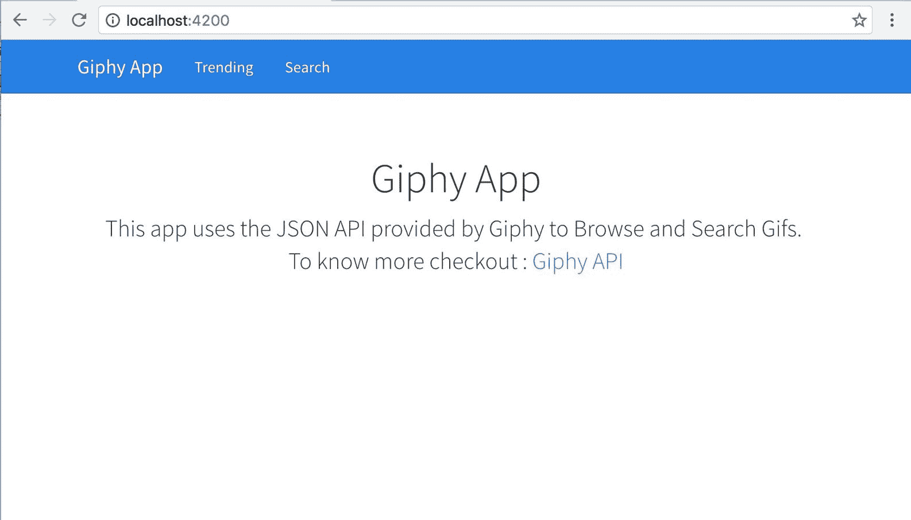
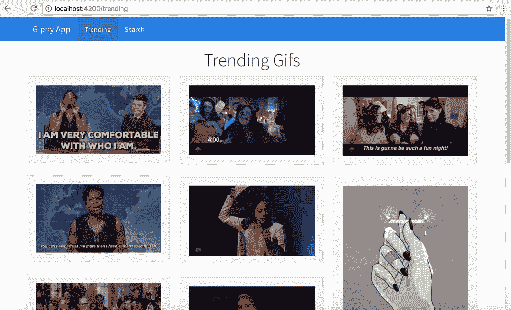

# 一、Angular——入门

当蒂莫西·伯纳斯-李爵士发明互联网时，他从未想到互联网会被用来发布自拍、分享猫视频或用广告轰炸网页。他的主要意图(猜测)是创建一个文档网络，这样互联网上的用户就可以从任何地方访问这些超文本并加以利用。

Craig Buckler 在 Sitepoint 发表了一篇有趣的文章，标题为《网络耗尽磁盘空间([http://www.sitepoint.com/web-runs-disk-space/](http://www.sitepoint.com/web-runs-disk-space/))，展示了互联网上的内容是如何传播的:

*   28.65%的猫图片
*   16.80%的人会自拍
*   14.82%无意义的社交媒体聊天
*   12.73%是无聊的视频
*   9.76%的广告/点击诱饵页面
*   8.70%的骗局和骗局
*   4.79%的文章征集虚假统计数据
*   3.79%的新 JavaScript 工具/库
*   0.76%的文件用于提高人类知识

你可以看到，自从互联网发明到今天，我们是如何进化的。*更好的进化需要更好的框架*来构建和管理这种需要可伸缩、可维护和可测试的应用。这就是 Angular 在 2010 年介入填补空白的地方，从那以后它一直发展得很好。

我们将从了解 Angular 的新变化、TypeScript 的重要性开始我们的旅程，并了解 Ionic 2 如何通过 Angular 进行自我调整，以帮助构建性能高效的现代移动混合应用。

在这一章中，我们将借助一个例子快速浏览作为 Angular 的一部分添加的新主题。除了语言更新之外，Angular (2)中发生的主要变化主要是在性能和组件化方面。我们将在本章中讨论以下主题:

*   《Angular》有什么新内容？
*   字体和Angular
*   构建 phy 应用

# 《Angular》有什么新内容？

Angular 2 是我见过的所有软件中最受期待、最引人注目的版本升级之一。Angular 1 对网络/移动网络/混合应用开发人员来说是一个福音，在那里管理许多事情变得容易了。Angular 1 不仅帮助重组客户端应用开发，还提供了构建应用的平台；不是网站，而是应用。虽然第一个版本在处理大型数据集时遇到了性能问题，但 Angular 团队在 Angular 1 的后续版本(即 Angular 1.4.x 及更高版本)中恢复得相当好，并通过以 Angular (2)的形式发布更稳定的版本来解决这些性能问题。

Angular (2)带来的一些新变化包括:

*   速度和性能的提高。
*   基于组件(不是典型的 MV*)。
*   棱角分明的 CLI。
*   简单明了的语法。
*   进步网络应用。
*   跨平台应用开发，包括桌面、移动和网络。
*   基于科尔多瓦的混合应用开发。
*   服务器端的Angular通用提供者，用于快速初始视图。
*   升级到更好的动画、国际化和可访问性。
*   Angular 可以写在 ES5、ES6 上，TypeScript 和 Dart 都是基于用户对 JavaScript 味道的舒适度。

有了这些新的更新，开发应用变得前所未有的容易，无论是在桌面、移动还是移动混合环境中。

注意:最新版本的 Angular 将被称为 Angular，而不是 Angular 2、AngularJS 4 或 NG4。所以在这本书里，我将把 Angular 版本 2 称为 Angular。

目前最新版本的 Angular 是 4。查看第 11 章、*Ionic 3* ，了解更多关于 Angular 4 及其如何改进Ionic的信息。

You can find more information about Angular here: [https://angular.io](https://angular.io).

注:如果您是 Angular 的新手，可以参考以下书籍:

[https://www.packtpub.com/web-development/learning-angular-2](https://www.packtpub.com/web-development/learning-angular-2)

[https://www . packtpub . com/web-development/mastering-angular-2-组件](https://www.packtpub.com/web-development/mastering-angular-2-components)

[https://www . packtpub . com/web-development/mastering-angular-2](https://www.packtpub.com/web-development/mastering-angular-2)

[https://www.packtpub.com/web-development/angular-2-example](https://www.packtpub.com/web-development/angular-2-example)

或者这些视频:

[https://www . packtpub . com/web-development/angular-2-project-video](https://www.packtpub.com/web-development/angular-2-projects-video)

[https://www . packtpub . com/web-development/web-development-angular-2-and-bootstrap-video](https://www.packtpub.com/web-development/web-development-angular-2-and-bootstrap-video)

[https://www . packtpub . com/web-development/angular-2-web-development-TypeScript-video](https://www.packtpub.com/web-development/angular-2-web-development-TypeScript-video)

# 排版底稿

Angular 在应用开发中广泛使用 TypeScript。因此，作为 Angular 入门的一部分，我们也将更新必要的 TypeScript 概念。

如果您不熟悉 TypeScript，TypeScript 是 JavaScript 的一个类型化超集，可以编译成普通的 JavaScript。TypeScript 提供静态类型、类和接口，并在 ES6 和 ES7 登陆浏览器之前支持它们的几乎所有功能。

保存扩展名为`.ts`的类型脚本文件。

给非类型化语言(JavaScript)添加打字员的主要优势是让 IDEs 理解我们正在尝试做什么，并在编码时更好地帮助我们；换句话说，智能感知。

说到这里，我们可以用 TypeScript 做些什么。

# 变量类型

在普通的 JavaScript 中，我们会这样做:

```html
x = 20; 
// after a few meaningful minutes  
x = 'nah! It's not a number any more';

```

但是在 TypeScript 中，我们不能像前面的代码片段所示的那样做，TypeScript 编译器会抱怨我们在运行时修改了变量类型。

# 定义类型

当我们声明变量时，我们可以选择声明变量的类型。例如:

```html
name: string = 'Arvind'; 
age: number  = 99; 
isAlive: boolean = true; 
hobbies: string[]; 
anyType: any; 
noType = 50; 
noType = 'Random String';

```

这增加了我们试图做的事情的可预测性。

# 班级

我相信 JavaScript 是一种基于对象的编程语言，而不是面向对象的编程语言，我知道很多人不同意我的观点。

在普通的 JavaScript 中，我们有一些函数，它们像一个类一样工作，表现出基于原型的继承。在 TypeScript/ES6 中，我们有这样的类构造:

```html
class Person { 
  name: string; 

constructor(personName: string) {  
this.name = personName;  
} 

getName { 
    return "The Name: " + this.greeting; 
}   
} 
// somewhere else 
arvind:Person = new Person('Arvind');

```

在前面的例子中，我们已经定义了一个名为 Person 的类，并且我们正在定义类构造函数，它在初始化类时接受名称。

为了初始化该类，我们将使用一个新的关键字调用该类，并将该名称传递给构造函数。存储类实例的变量——前面例子中的对象`arvind`，也可以输入到类中。这有助于更好地理解`arvind`物体的可能性。

注意:ES6 中的类仍然遵循基于原型的继承，而不是经典的继承模型。

# 连接

当我们开始构建复杂的应用时，通常需要在整个应用中重复某种类型的结构，这遵循某些规则。这就是界面进入画面的地方。界面提供*结构子类型*或*鸭* *类型*检查实体的类型和*形状*。

例如，如果我们正在使用一个处理汽车的应用，每辆汽车都将有一个特定的公共结构，在应用中使用时需要遵守。因此，我们创建了一个名为 ICar 的接口。任何使用汽车的类都将如下实现这个接口:

```html
Interface ICar { 
  engine : String; 
  color: String; 
  price : Number; 
} 

class CarInfo implements ICar{ 
  engine : String; 
  color: String; 
  price : Number; 

  constructor(){ /* ... */} 
}

```

# 模块和导入

在普通的 JavaScript 中，您一定观察过这样的代码块:

```html
(function(){ 
  var x = 20; 
  var y = x * 30; 
})(); //IIFE 
// x & y are both undefined here.

```

模块在 ES6/TS 中使用导入和导出语法实现:

```html
logic.ts
export function process(){ 
  x = 20; 
  y = x * 30; 
} 

exec.ts 
import { process } from './logic'; 
process();

```

这些是我们开始使用 TypeScript 所需的基本要素。我们将在需要的地方研究更多这样的概念。

至此，我们总结了开始使用 TypeScript 所需的关键概念。让我们从 Angular 开始。

For more information on TypeScript, check out: [https://www.TypeScriptlang.org/docs/tutorial.html](https://www.typescriptlang.org/docs/tutorial.html). Also check out the TypeScript introduction video: [https://channel9.msdn.com/posts/Anders-Hejlsberg-Introducing-TypeScript](https://channel9.msdn.com/posts/Anders-Hejlsberg-Introducing-TypeScript).

# 有角的

Angular (2)增加了一些新功能，更新了现有功能，并在 Angular 1.x 上删除了一些功能。在本节中，我们将介绍 Angular 的一些基本功能。

# 组件

Angular组件的灵感来自网络组件规范。在很高的层次上，网络组件有四个部分:

*   **自定义元素**:用户可以创建自己的 HTML 元素。
*   **HTML 导入**:将一个 HTML 文档导入另一个。
*   **模板**:自定义元素的 HTML 定义。
*   **Shadow DOM** :编写自定义元素封装逻辑的规范。

前面四个规范解释了前端开发人员如何开发他们自己的独立的、隔离的和可重用的组件，类似于 HTML 选择框(`<select></select>`)或文本区域(`<textarea></textarea>`)或输入(`<input />`)。
您可以在这里阅读更多关于网络组件规范的信息:[https://www.w3.org/standards/techs/components#w3c_all](https://www.w3.org/standards/techs/components#w3c_all)。

If you would like to dig deeper into the Web Component, check out: [http://webcomponents.org/](http://webcomponents.org/).

如上所述，Angular 是(松散地)建立在 Web 组件上的，其中前面的四个规范是以 Angular 的方式实现的。

简单来说，我们的整个应用是一个组件树。例如，如果我们查看世界上浏览量最多的页面[https://www.google.com](https://www.google.com)，它将看起来像这样:


如果我们必须在 Angular 中构建这个页面，我们会首先将页面拆分成组件。

进入上一页的所有组件的可视化表示如下:


注意:每个黑盒都是一个(自定义)组件。

从上图中我们可以看到，整个页面是一个自定义组件树。

(自定义)组件通常由三部分组成:

*   `component.ts`:这代表组件逻辑
*   `component.html`:表示组件视图(模板)
*   `component.css`:这代表组件特定的样式

为了构建一个定制的组件，我们需要在一个类的顶部使用一个`Component`装饰器。简单来说，装饰器允许我们用特定的元数据配置一个类。然后，Angular 将使用这些元数据来理解该类的行为。装饰者以`@`开头，后面跟着装饰者的名字。

组件装饰器告诉 Angular，正在处理的类需要展示 Angular 组件的行为。一个简单的装饰器如下所示:

```html
@Component({ 
  selector: 'app-root', 
  templateUrl: './app.component.html', 
  styleUrls: ['./app.component.css'] 
}) 
export class AppComponent { 
  // This is where we write the component logic! 
  title = 'Hello World!'; 
}

```

组件装饰器的一些属性包括:

*   `selector`:在模板中标识该组件的 CSS 选择器
*   `templateUrl`:包含视图模板的外部文件的 URL
*   `styleUrls`:要应用于该组件视图的样式表的 URL 列表
*   `providers`:此组件及其子组件可用的提供程序列表

To know more about the Component decorator, refer to the following link: [https://angular.io/docs/ts/latest/api/core/index/Component-decorator.html](https://angular.io/docs/ts/latest/api/core/index/Component-decorator.html)

# 区域

区域是 Angular 中引入的新概念之一。区域的概念从 Dart 迁移到了 JavaScript。

许多开发人员最初被 Angular 吸引的主要原因是它的*自动数据绑定*以及其他东西。这是使用 Angular 1.x 中的示波器实现的。在 Angular 2 中，我们使用 zone . js([https://github.com/angular/zone.js](https://github.com/angular/zone.js))来实现同样的效果。

每当数据发生变化时，Angular 都会用新数据更新相应的*涉众*(变量、接口、提供者等)。Angular 可以非常容易地跟踪所有同步活动。但是对于异步代码中的变化检测，例如事件处理、AJAX 调用或定时器，Angular 2 使用 Zone.js。

要了解更多关于区域、它们如何工作以及 angular 中的变化检测，请查看 Angular 中的 Zones:[http://blog . thought ram . io/Angular/2016/02/01/Zones-in-Angular-2 . html](http://blog.thoughtram.io/angular/2016/02/01/zones-in-angular-2.html)和 Angular 变化检测解释:[http://blog . thought ram . io/Angular/2016/02/22/Angular-2-change-detection-explained . html](http://blog.thoughtram.io/angular/2016/02/22/angular-2-change-detection-explained.html)。

# 模板

模板用于将组件逻辑绑定到 HTML。模板还用作用户的用户交互和应用逻辑之间的接口。

与 Angular 版本 1 相比，模板发生了很大的变化。但是有一些事情仍然保持不变。例如，我们从组件中获取一个值并在用户界面中显示它的方式与使用双花括号符号(插值语法)的方式相同。

以下是示例`app.component.ts`:

```html
@Component({ 
  selector: 'app-root', 
  templateUrl: './app.component.html', 
  styleUrls: ['./app.component.css'] 
}) 
export class AppComponent { 
  // This is where we write the component logic! 
  title = 'Hello World!'; 
}

```

`app.component.html`看起来像这样:

```html
<h1>
{{title}} <!-- This value gets bound from app.component.ts -->
</h1>

```

也可以通过将模板元数据传递给装饰器而不是`templateUrl`来内联制作模板。这看起来像这样:

```html
 @Component({ 
  selector: 'app-root', 
  template: '<h1>{{title}}</h1>', 
  styleUrls: ['./app.component.css'] 
}) 
export class AppComponent { 
  // This is where we write the component logic! 
  title = 'Hello World!'; 
}

```

The `template` metadata takes higher priority over `templateUrl`. For example, if we have defined both a `template` and `templateUrl` metadata, `template` is picked up and rendered.
We can also write multiline templates using backtick(`) instead of quotes, in both ES6 as well as TypeScript. For more information, refer to Template Literals: [https://developer.mozilla.org/en/docs/Web/JavaScript/Reference/Template_literals](https://developer.mozilla.org/en/docs/Web/JavaScript/Reference/Template_literals)

在 Angular 1.x 中，我们有核心/定制指令。但是在 Angular (2)中，我们有各种各样的符号，使用这些符号我们可以获得与 Angular 1 指令相同的行为。

例如，如果我们想基于表达式的真实性向元素添加一个自定义类，它应该是这样的:

```html
<div [class.highlight]="shouldHighlight">Hair!</div>

```

前面是著名的`ng-class` Angular 1.x 指令的替代。

为了处理事件，我们使用`( )`符号，如:

```html
<button (click)=pullHair($event)">Pull Hair</button>

```

而这个`pullhair()`是在组件类内部定义的。

为了保持数据绑定是最新的，我们使用`[( )]`符号，如:

```html
<input type="text" [(ngModel)]="name">

```

这使得组件类中的 name 属性与 textbox 保持同步。

这里显示了一个代替`ng-repeat`的`*ngFor`的例子:

```html
<ul> 
  <li *ngFor="let todo in todos">{{todo.title}}</li> 

</ul>

```

注意，`todo`前面的`let`表示是该区域的局部变量。

这些是一些基本概念，我们需要从我们的实践例子开始。当其他Angular(2)概念出现在我们的应用中时，我会谈论它们。

# Giphy 应用

使用我们到目前为止所学的概念，我们将使用 Angular 和名为 Giphy 的 Open JSON API 提供程序构建一个简单的应用。

giphy([http://giphy.com](http://giphy.com))是一个简单的 Gif 搜索引擎。Giphy 的人公开了一个开放的 REST 应用编程接口，我们可以使用它来处理数据。

我们将要构建的应用将与 Giphy JSON API 进行对话，并返回结果。使用 Angular，我们将为应用中的三个功能构建界面:

*   显示随机 Gif
*   显示趋势 Gif
*   搜索 Gif

我们将使用 Angular CLI([https://cli.angular.io/](https://cli.angular.io/))和 Twitter Bootstrap([http://getbootstrap.com/](http://getbootstrap.com/))与 Cosmos 主题([https://bootswatch.com/cosmo/](https://bootswatch.com/cosmo/))。

在开始构建应用之前，让我们先了解一下应用的结构。

# 体系结构

我们首先要看的是应用的架构。在客户端，我们将有一个路由器，所有的东西都从它开始流动。路由器将有四条路由:

*   回家路线
*   浏览路线
*   搜索路线
*   找不到页面路由

我们将有一个服务，三个方法将与 Giphy REST 应用编程接口交互。

除了前面提到的项目，我们将有以下组件:

*   **导航组件**:应用导航栏
*   **主页组件**:显示随机 gif 的主页
*   **趋势组件**:显示趋势 gif
*   **搜索组件**:搜索 gif
*   **Giphy 组件**:gif 的模板
*   **找不到页面组件**:显示一个告诉用户什么都没找到的页面

这方面的组件树如下所示:


# 应用接口

Giphy API 非常容易理解和使用。这里可以找到官方的 API 文档:[https://github.com/Giphy/GiphyAPI](https://github.com/Giphy/GiphyAPI)。

我们将使用的 API 有:

*   random gif:[http://API . giphy . com/v1/gif/random？api_key=dc6zaTOxFJmzC](http://api.giphy.com/v1/gifs/random?api_key=dc6zaTOxFJmzC)
*   热门礼物:[http://api.giphy.com/v1/gifs/trending?api_key=dc6zaTOxFJmzC](http://api.giphy.com/v1/gifs/trending?api_key=dc6zaTOxFJmzC)
*   搜寻 gif:t1]http://API . giphy . com/v1/sticks/search？q = cat&API _ key = dc6 zatoxfjmzc

您可以导航到前面的链接来查看示例数据。

At the time of writing, Giphy exposed `dc6zaTOxFJmzC` as the API key to use.

# Angular命令行界面

为了开发我们的 Giphy 应用，我们将使用 Angular CLI。如果你是命令行界面及其功能的新手，我建议你看看这个视频:简单的 Angular 2 应用带 Angular 命令行界面:[https://www.youtube.com/watch?v=QMQbAoTLJX8](https://www.youtube.com/watch?v=QMQbAoTLJX8)。
这个例子是用 Angular CLI 版本 1 . 0 . 0-beta 18 编写的

# 安装软件

为了成功开发 Angular-Giphy App，我们需要安装 node . js([https://nodejs.org/en](https://nodejs.org/en))。我们将使用 NPM([https://www.npmjs.com](https://www.npmjs.com))通过 Angular CLI 下载所需模块。

安装 Node.js 后，打开一个新的命令提示符/终端并运行以下命令:

```html
npm install -g @angular/cli

```

这将继续安装Angular命令行界面生成器。这就是我们开始开发应用所需的全部内容。

注意:我已经使用 angular-cli 版本 1.0.0 来构建这个应用。

# 文本编辑器

关于文本编辑器，您可以使用任何编辑器来处理 Angular 和 ion。您也可以尝试使用崇高文本([http://www.sublimetext.com/3](http://www.sublimetext.com/3))或 Atom 编辑器([https://atom.io/](https://atom.io/))或 Visual Studio Code([https://code.visualstudio.com/](https://code.visualstudio.com/))来处理代码。

如果你正在使用崇高的文本，你可以看看:[https://github.com/Microsoft/TypeScript-Sublime-Plugin](https://github.com/Microsoft/TypeScript-Sublime-Plugin)添加打字脚本智能到你的编辑器。而对于 Atom，请参考以下链接:[https://atom.io/packages/atom-TypeScript](https://atom.io/packages/atom-typescript)。

# 搭建一个 Angular 2 应用

我们要做的第一件事是使用 Angular CLI 搭建一个 Angular 应用。创建一个名为`chapter1`的新文件夹，并在该文件夹中打开命令提示符/终端，然后运行以下命令:

```html
ng new giphy-app

```

现在，Angular CLI 生成器将继续创建与我们的 Angular 应用一起工作所需的所有文件和文件夹。

As mentioned earlier, you can check out Simple Angular 2 app with Angular CLI: [https://www.youtube.com/watch?v=QMQbAoTLJX8](https://www.youtube.com/watch?v=QMQbAoTLJX8), as well to go through Angular CLI docs: [https://cli.angular.io/reference.pdf](https://cli.angular.io/reference.pdf) to know more about it.

脚手架项目结构如下所示:

```html
. 
├── .angular-cli.json 
├── .editorconfig 
├── README.md 
├── e2e 
│   ├── app.e2e-spec.ts 
│   ├── app.po.ts 
│   ├── tsconfig.e2e.json 
├── karma.conf.js 
├── node_modules 
├── package.json 
├── protractor.conf.js 
├── src 
│   ├── app 
│   │   ├── app.component.css 
│   │   ├── app.component.html 
│   │   ├── app.component.spec.ts 
│   │   ├── app.component.ts 
│   │   ├── app.module.ts 
│   ├── assets 
│   │   ├── .gitkeep 
│   ├── environments 
│   │   ├── environment.prod.ts 
│   │   ├── environment.ts 
│   ├── favicon.ico 
│   ├── index.html 
│   ├── main.ts 
│   ├── polyfills.ts 
│   ├── styles.css 
│   ├── test.ts 
│   ├── tsconfig.app.json 
│   ├── tsconfig.spec.json 
│   ├── typings.d.ts 
├── tsconfig.json 
├── tslint.json

```

我们将在`src`文件夹中度过大部分时间。一旦项目完全搭建完成，`cd`进入`giphy-app`文件夹并运行以下内容:

```html
ng serve

```

这将启动内置服务器。构建完成后，我们可以导航到 [http://localhost:4200](http://localhost:4200) 查看页面。页面应该如下所示:


# 构建 Giphy 应用

现在我们已经有了开始的所有部分，我们将从向应用添加推特引导 CSS 开始。

对于这个例子，我们将使用一个来自 https://bootswatch.com/ T2 的名为宇宙的引导主题。我们可以在主题页面找到宇宙 CSS 主题:[https://bootswatch.com/cosmo/](https://bootswatch.com/cosmo/)，通过点击宇宙下拉菜单并选择`bootstrap.min.css`选项。或者，我们可以在这里找到:[https://bootswatch.com/cosmo/bootstrap.min.css](https://bootswatch.com/cosmo/bootstrap.min.css)。

If you want, you can use any other theme or the vanilla Bootstrap CSS as well.

要添加主题文件，导航至`giphy-app/src/styles.css`并在其中添加以下行:

```html
@import "https://bootswatch.com/cosmo/bootstrap.min.css";

```

就是这样，现在我们的应用是由推特引导 CSS 驱动的。

接下来，我们将开始在我们的应用的主页上工作。为此，我们将利用一个名为 Starter Template 的来自 Twitter Bootstrap 的示例模板。模板可以在这里找到:[http://getbootstrap.com/examples/starter-template/](http://getbootstrap.com/examples/starter-template/)。

Starter 模板由导航栏和显示内容的正文部分组成。

对于导航栏部分，我们将生成一个名为`nav-bar`的新组件，并更新其中的相关代码。

要使用 Angular CLI 生成新的自定义组件，请导航至`giphy-app`文件夹并运行以下命令:

```html
ng generate component nav-bar

```

注意:您可以终止当前正在运行的命令，或者生成一个新的命令提示符/终端来运行前面的命令。

你应该看到这样的东西:

```html
create src/app/nav-bar/nav-bar.component.css
create src/app/nav-bar/nav-bar.component.html
create src/app/nav-bar/nav-bar.component.spec.ts
create src/app/nav-bar/nav-bar.component.ts
update src/app/app.module.ts

```

现在打开`giphy-app/src/app/nav-bar/nav-bar.component.html`并更新如下:

```html
<nav class="navbar navbar-inverse navbar-fixed-top"> 
    <div class="container"> 
        <div class="navbar-header"> 
            <a class="navbar-brand" [routerLink]="['/']">Giphy App</a> 
        </div> 
        <div id="navbar" class="collapse navbar-collapse"> 
            <ul class="nav navbar-nav"> 
                <li [routerLinkActive]="['active']"><a [routerLink]="
                  ['/trending']">Trending</a></li> 
                <li [routerLinkActive]="['active']"><a [routerLink]="
                  ['/search']">Search</a></li> 
            </ul> 
        </div> 
    </div> 
</nav>

```

我们在这里所做的就是创建带有两个菜单项和应用名称的标题栏，它充当了一个到主页的链接。

接下来，我们将更新`giphy-app/src/app/app.component.html`以加载`nav-bar`组件。用以下内容替换该文件的内容:

```html
<nav-bar></nav-bar>

```

接下来，我们将开始向应用添加路线。如前所述，我们将有三条路线。

要向当前应用添加路由支持，我们需要做三件事:

1.  创建所需的路线。
2.  配置`@NgModule`。
3.  告诉 Angular 在哪里加载这些路线的内容。

在撰写本文时，Angular CLI 已禁用路由生成。因此，我们将手动创建相同的。否则，我们可以简单地运行`ng generate route home`来生成回家路线。

首先，让我们定义所有的路线。在 app 文件夹内新建一个名为`app.routes.ts`的文件。按如下方式更新文件:

```html
import { HomeComponent } from './home/home.component'; 
import { TrendingComponent } from './trending/trending.component'; 
import { SearchComponent } from './search/search.component'; 
import { PageNotFoundComponent } from './page-not-found/page-not-found.component'; 

export const ROUTES = [ 
  { path: '', component: HomeComponent }, 
  { path: 'trending', component: TrendingComponent }, 
  { path: 'search', component: SearchComponent }, 
  { path: '**', component: PageNotFoundComponent } 
];

```

我们在这里所做的就是导出一系列路线。一定要注意路径`'**'`。这就是我们如何定义路线的另一部分。

我们现在将创建所需的组件。运行以下命令:

```html
ng generate component home
ng generate component trending
ng generate component search
ng generate component pageNotFound

```

接下来，我们将配置`@NgModule`。打开`giphy-app/src/app/app.module.ts`并在顶部添加以下导入:

```html
import { RouterModule }   from '@angular/router'; 
import { ROUTES } from './app.routes';

```

接下来，更新`@NgModule`装饰器的`imports`属性如下:

```html
//.. snipp 
imports: [ 
    BrowserModule, 
    FormsModule, 
    HttpModule, 
    RouterModule.forRoot(ROUTES) 
  ], 
//.. snipp 

```

完成的页面如下所示:

```html
import { BrowserModule } from '@angular/platform-browser'; 
import { NgModule } from '@angular/core'; 
import { FormsModule } from '@angular/forms'; 
import { HttpModule } from '@angular/http'; 
import { RouterModule }   from '@angular/router'; 

import { AppComponent } from './app.component'; 
import { NavBarComponent } from './nav-bar/nav-bar.component'; 
import { HomeComponent } from './home/home.component'; 
import { TrendingComponent } from './trending/trending.component'; 
import { SearchComponent } from './search/search.component'; 
import { PageNotFoundComponent } from './page-not-found/page-not-found.component'; 

import { ROUTES } from './app.routes'; 

@NgModule({ 
  declarations: [ 
    AppComponent, 
    NavBarComponent, 
    HomeComponent, 
    TrendingComponent, 
    SearchComponent, 
    PageNotFoundComponent 
  ], 
  imports: [ 
    BrowserModule, 
    FormsModule, 
    HttpModule, 
    RouterModule.forRoot(ROUTES) 
  ], 
  providers: [], 
  bootstrap: [AppComponent] 
}) 
export class AppModule { }

```

现在，我们将更新应用组件，以显示导航栏以及当前路线内容。

更新`giphy-app/src/app/app.component.html`如下:

```html
<app-nav-bar></app-nav-bar> 
<router-outlet></router-outlet>

```

使用`router-outlet`，我们告诉路由器加载该位置的当前路由内容。

如果你想了解更多关于Angular布线的信息，你可以查看布莱恩·福特的《用组件布线器在 11 个维度上布线:[https://www.youtube.com/watch?v=z1NB-HG0ZH4](https://www.youtube.com/watch?v=z1NB-HG0ZH4)。

接下来，我们将更新主页组件 HTML 并测试应用。

打开`giphy-app/src/app/home/home.component.html`，更新如下:

```html
<div class="container"> 
    <div class="starter-template"> 
        <h1>Giphy App</h1> 
        <p class="lead">This app uses the JSON API provided by Giphy to Browse and Search Gifs. 
            <br> To know more checkout : <a href="https://github.com/Giphy/GiphyAPI#trending-gifs-endpoint">Giphy API</a> </p> 
    </div> 
</div>

```

完成后，保存文件并运行以下命令:

```html
ng  serve

```

我们应该会看到以下页面:


正如我们所看到的，这一页看起来是破的。让我们通过添加一些样式来解决这个问题。打开`giphy-app/src/styles.css`并添加以下内容:

```html
body {
  padding-top: 50px; 
  padding-bottom: 20px; 
} 

.starter-template { 
  padding: 40px 15px; 
  text-align: center; 
}

```

现在我们的页面将如预期的那样:



接下来，我们将从编写与 Giphy API 对话的服务开始。我们将编写三种方法，一种是获取随机 gif，一种是获取最新趋势，还有一种是使用关键字搜索 Gif API。

首先，我们将生成一个服务。运行以下命令:

```html
ng generate service giphy

```

```html
WARNING Service is generated but not provided, it must be provided to be used

```

如警告所示，已生成的服务尚未标记为提供者。所以我们需要手动操作。

打开`giphy-app/src/app/app.module.ts`并导入`GiphyService`:

```html
import { GiphyService } from './giphy.service';

```

接下来，在`@NgModule`装饰器`providers`属性中添加`GiphyService`作为提供者:

```html
//.. snipp 
providers: [ 
    GiphyService 
  ], 
//..snipp

```

完整的`giphy-app/src/app/app.module.ts`如下所示:

```html
import { BrowserModule } from '@angular/platform-browser'; 
import { NgModule } from '@angular/core'; 
import { FormsModule } from '@angular/forms'; 
import { HttpModule } from '@angular/http'; 
import { RouterModule }   from '@angular/router'; 

import { AppComponent } from './app.component'; 
import { NavBarComponent } from './nav-bar/nav-bar.component'; 
import { HomeComponent } from './home/home.component'; 
import { TrendingComponent } from './trending/trending.component'; 
import { SearchComponent } from './search/search.component'; 
import { PageNotFoundComponent } from './page-not-found/page-not-found.component'; 

import { ROUTES } from './app.routes'; 

import { GiphyService } from './giphy.service'; 

@NgModule({ 
  declarations: [ 
    AppComponent, 
    NavBarComponent, 
    HomeComponent, 
    TrendingComponent, 
    SearchComponent, 
    PageNotFoundComponent 
  ], 
  imports: [ 
    BrowserModule, 
    FormsModule, 
    HttpModule, 
    RouterModule.forRoot(ROUTES) 
  ], 
  providers: [ 
    GiphyService 
  ], 
  bootstrap: [AppComponent] 
}) 
export class AppModule { }

```

现在我们用三种方法更新`giphy-app/src/app/giphy.service.ts`。打开`giphy-app/src/app/giphy.service.ts`，更新如下:

```html
import { Injectable } from '@angular/core'; 
import { Http, Response, Jsonp } from '@angular/http'; 
import { Observable } from 'rxjs/Rx'; 
import 'rxjs/Rx'; 

@Injectable() 
export class GiphyService { 
  private giphyAPIBase = 'http://api.giphy.com/v1/gifs'; 
  private APIKEY = 'dc6zaTOxFJmzC'; 

  constructor(private http: Http) { } 

  getRandomGif(): Observable<Response> { 
    return this.http.get(this.giphyAPIBase + 
      '/random?api_key=' + this.APIKEY) 
      .map((res) => res.json()); 
  } 

  getTrendingGifs(offset, limit): Observable<Response> { 
    return this.http.get(this.giphyAPIBase + 
      '/trending?api_key=' + this.APIKEY + '&offset=' + offset + 
      '&limit=' + limit) 
      .map((res) => res.json()); 
  } 

  searchGifs(offset, limit, text): Observable<Response> { 
    return this.http.get(this.giphyAPIBase + '/search?api_key=' + 
      this.APIKEY + '&offset=' + offset + 
      '&limit=' + limit + '&q=' + text) 
      .map((res) => res.json()); 
  } 
}

```

我们在这里所做的就是向相应的 Giphy 应用编程接口网址发出一个 HTTP GET 请求，并返回一个可观察的。

在 RxJS([http://reactivex.io/rxjs/](http://reactivex.io/rxjs/))中，可观测的是一个实体，它可以在一段时间内变化。这是 RxJS 最基本的构件。观察者订阅一个可观察的事物，并对其变化做出反应。这种模式被称为反应模式。

引用文档:

This pattern facilitates concurrent operations because it does not need to block while waiting for the Observable to emit objects, but instead it creates a sentry in the form of an observer that stands ready to react appropriately at whatever future time the Observable does so.

如果您是 Observables 的新手，可以从这里开始:[http://reactivex.io/documentation/observable.html](http://reactivex.io/documentation/observable.html)接着是:利用 angular 中的 Observables:[HTTP://blog . thought ram . io/Angular/2016/01/06/利用 Angular 中的 Observables 2 . html](http://blog.thoughtram.io/angular/2016/01/06/taking-advantage-of-observables-in-angular2.html)和 Angular 2 HTTP 请求搭配 Observables:[https://scotch . io/tutorials/Angular-2-HTTP-requests-with-Observables](https://scotch.io/tutorials/angular-2-http-requests-with-observables)。

现在服务完成了，我们将更新`HomeComponent`获得一个随机 gif 并显示在主页上。

打开`giphy-app/src/app/home/home.component.ts`，更新如下:

```html
import { Component, OnInit } from '@angular/core'; 
import { GiphyService } from '../giphy.service'; 

@Component({ 
  selector: 'app-home', 
  templateUrl: './home.component.html', 
  styleUrls: ['./home.component.css'] 
}) 
export class HomeComponent implements OnInit { 
  public gif: string; 
  public result: any; 
  public isLoading: boolean = true; 

  constructor(private giphyService: GiphyService) { 
    this.getRandomGif(); 
  } 

  ngOnInit() { 
  } 

  getRandomGif() { 
    this.giphyService.getRandomGif().subscribe( 
      (data) => { 
        this.result = data; 
        this.gif = this.result.data.image_url; 
        this.isLoading = false; 
      }, 
      (err) => console.log('Oops!', err), 
      () => console.log('Response', this.result) 
    ) 
  } 
}

```

在前面的代码中，首先，我们导入了`GiphyService`并将其添加到构造函数中。接下来，我们编写了`getRandomGif()`并从构造函数中调用了`getRandomGif()`。在`getRandomGif()`中，我们在`giphyService`上调用了`getRandomGif()`来获得一个随机的 gif。然后我们将 gif 分配给一个名为`gif`的类变量。

只是为了看看是否一切正常，我们将通过执行`ng serve`和打开开发者工具来运行应用。如果一切顺利，我们应该会看到来自 Giphy API 的响应:


现在我们有了响应，我们想要构建一个显示 gif 的组件。我们希望为此构建一个单独的组件，因为我们将在其他页面上使用相同的组件，并在需要的地方显示 gif。

让我们开始搭建组件。运行以下命令:

```html
ng generate component gif-viewr

```

接下来，打开`giphy-app/src/app/gif-viewr/gif-viewr.component.html`，更新如下:

```html
<div class="item"> 
  <div class="well"> 
     
  </div> 
</div>

```

一旦这样做了，我们需要告诉组件期望来自父组件的数据，因为主组件将把`imgUrl`传递给`gif-viewer`组件。

打开`giphy-app/src/app/gif-viewr/gif-viewr.component.ts`。首先，通过添加对输入装饰器的引用来更新导入语句:

```html
import { Component, OnInit, Input} from '@angular/core';

```

接下来，给`imgUrl`变量添加一个输入装饰器:

```html
@Input() imgUrl: string;

```

更新后的`giphy-app/src/app/gif-viewr/gif-viewr.component.ts`如下所示:

```html
import { Component, OnInit, Input} from '@angular/core'; 

@Component({ 
  selector: 'app-gif-viewr', 
  templateUrl: './gif-viewr.component.html', 
  styleUrls: ['./gif-viewr.component.css'] 
}) 
export class GifViewrComponent implements OnInit { 
  @Input() imgUrl: string; 

  constructor() { } 

  ngOnInit() { 
  } 
}

```

Note: To define an input for a component, we use the `@Input` decorator. To know more about the `@Input` decorator, refer to the Attribute Directives section in Angular docs: [https://angular.io/docs/ts/latest/guide/attribute-directives.html](https://angular.io/docs/ts/latest/guide/attribute-directives.html).

保存文件并打开`giphy-app/src/app/home/home.component.html`。我们将在此页面中添加`app-gif-viewr`组件:

```html
<app-gif-viewr class="home" [imgUrl]="gif"></app-gif-viewr>

```

完整的文件如下所示:

```html
<div class="container"> 
    <div class="starter-template"> 
        <h1>Giphy App</h1> 
        <p class="lead">This app uses the JSON API provided by Giphy to 
          Browse and Search Gifs. 
            <br> To know more checkout : 
            <a href=
            "https://github.com/Giphy/GiphyAPI#trending-gifs-endpoint">
            Giphy API</a> </p> 
    </div> 

  <app-gif-viewr class="home" [imgUrl]="gif"></app-gif-viewr> 
</div>

```

接下来，我们将更新 CSS 来美化页面。打开`giphy-app/src/styles.css`并在现有样式中添加以下 CSS:

```html
.home .well{ 
   width: 70%; 
    margin: 0 auto; 
} 

img{ 
  width: 100%; 
}

```

如果我们返回浏览器并刷新，我们应该会看到以下内容:


每次我们刷新一个页面，我们都会看到一个新的 gif 出现。

接下来，我们将进入趋势页面。此页面将显示使用 Pintrest 布局(或砖石布局)的趋势 gif。趋势休息应用编程接口支持分页。我们将利用这个一次加载 12 个 gif。然后提供一个加载更多按钮来获取接下来的 12 个 gif。

首先，让我们从 Giphy API 获取数据。打开`giphy-app/src/app/trending/trending.component.ts`。我们将首先导入`GiphyService`:

```html
import { GiphyService } from '../giphy.service';

```

现在，我们将向构造函数添加相同的内容，并更新构造函数以调用`getTrendingGifs()`:

```html
constructor(private giphyService: GiphyService) { } 
In ngOnInit(), we will call the getTrendingGifs() API: 
  ngOnInit() { 
    this.getTrendingGifs(this.offset, this.perPage); 
  } 
Next, we will add the required class variables:  
private offset = 0; 
private perPage = 12; 
public results: any; 
public gifs: Array<any> = []; 
public isLoading: boolean = true;

```

`offset`和`perPage`将用于管理分页。

`results`将用于存储来自服务器的响应。

`gifs`是由我们向模板展示的一系列趋势 gif 组成的数组。

`isLoading`是一个`boolean`变量，用于跟踪请求是否正在进行。使用`isLoading`，我们将显示/隐藏加载更多按钮。

接下来，我们将添加`getTrendingGifs()`:

```html
getTrendingGifs(offset, limit) { 
    this.giphyService.getTrendingGifs(offset, limit).subscribe( 
      (data) => { 
        this.results = data; 
        this.gifs = this.gifs.concat(this.results.data); 
        this.isLoading = false; 
      }, 
      (err) => console.log('Oops!', err), 
      () => console.log('Response', this.results) 
    ) 
  } 
And finally getMore(), which will be invoked by the Load More button: 
 getMore() { 
    this.isLoading = true; 
    this.offset = this.offset + this.perPage; 
    this.getTrendingGifs(this.offset, this.perPage); 
  }

```

为了显示检索到的 gif，我们将更新趋势组件模板。打开`giphy-app/src/app/trending/trending.component.html`，更新如下:

```html
<div class="container"> 
    <h1 class="text-center">Trending Gifs</h1> 
    <div class="wrapper"> 
        <app-gif-viewr [imgUrl]="gif.images.original.url" *ngFor="let gif of gifs"></app-gif-viewr> 
    </div> 
    <input type="button" value="Load More" class="btn btn-primary btn-block" *ngIf="!isLoading" (click)="getMore()"> 
</div>

```

我们在这里所做的就是设置`app-gif-viewr`通过对其应用`*ngFor`指令来获取 gif URL。底部有一个“加载更多”按钮，用户可以加载更多的 gif。

最后，为了实现 pinrest/砖石布局，我们将添加一些 CSS 规则。打开`giphy-app/src/styles.css`并添加以下样式:

```html
*, *:before, *:after { 
  box-sizing: border-box !important; 
} 

.wrapper { 
  column-width: 18em; 
  column-gap: 1em; 
} 

.item { 
  display: inline-block; 
  padding: .25rem; 
  width: 100%; 
} 

.well { 
  position: relative; 
  display: block; 
}

```

保存所有文件并返回浏览器。如果我们单击导航栏中的趋势菜单项，我们应该会看到以下内容:



如果我们完全向下滚动，我们会看到一个“加载更多”按钮:


单击“加载更多”按钮将加载下一组 gif:


我浪费了大约 15 分钟点击加载更多和观看 gif。我想这就是为什么 APIs 应该有一个速率限制。

最后，我们将实现搜索 gif。打开 giphy- `app/src/app/search/search.component.ts`并导入`GiphyService`:

```html
import { GiphyService } from '../giphy.service';

```

在构造函数中添加`giphyService`作为类变量:

```html
constructor(private giphyService: GiphyService) { }

```

接下来，我们将添加变量来管理分页和响应:

```html
  private offset = 0; 
  private perPage = 12; 
  public results: any; 
  public query: string; 
  public gifs: Array<any> = []; 
  public isLoading: boolean = true;

```

现在我们将调用`searchGifs`，它通过传递查询字符串来调用 REST 来获取搜索到的 gif:

```html
searchGifs(offset, limit, query) { 
    this.giphyService.searchGifs(offset, limit, query).subscribe( 
      (data) => { 
        this.results = data; 
        this.gifs = this.gifs.concat(this.results.data); 
        this.isLoading = false; 
      }, 
      (err) => console.log('Oops!', err), 
      () => console.log('Response', this.results) 
    ) 
  }

```

以下是管理搜索表单提交按钮的方法:

```html
  search(query) { 
    this.query = query; 
    this.isLoading = true; 
    this.searchGifs(this.offset, this.perPage, this.query); 
  }

```

最后，`getMore()`加载相同查询的更多页面:

```html
getMore() { 
    this.isLoading = true; 
    this.offset = this.offset + this.perPage; 
    this.searchGifs(this.offset, this.perPage, this.query); 
  }

```

更新后的`giphy-app/src/app/search/search.component.ts`如下所示:

```html
import { Component, OnInit } from '@angular/core'; 
import { GiphyService } from '../giphy.service'; 

@Component({ 
  selector: 'app-search', 
  templateUrl: './search.component.html', 
  styleUrls: ['./search.component.css'] 
}) 
export class SearchComponent implements OnInit { 
  private offset = 0; 
  private perPage = 12; 
  public results: any; 
  public query: string; 
  public gifs: Array<any> = []; 
  public isLoading: boolean = true; 

  constructor(private giphyService: GiphyService) { } 

  ngOnInit() { 
  } 

  searchGifs(offset, limit, query) { 
    this.giphyService.searchGifs(offset, limit, query).subscribe( 
      (data) => { 
        this.results = data; 
        this.gifs = this.gifs.concat(this.results.data); 
        this.isLoading = false; 
      }, 
      (err) => console.log('Oops!', err), 
      () => console.log('Response', this.results) 
    ) 
  } 

  search(query) { 
    this.query = query; 
    this.isLoading = true; 
    this.searchGifs(this.offset, this.perPage, this.query); 
  } 

  getMore() { 
    this.isLoading = true; 
    this.offset = this.offset + this.perPage; 
    this.searchGifs(this.offset, this.perPage, this.query); 
  } 
}

```

现在我们将更新`giphy-app/src/app/search/search.component.html`。打开`giphy-app/src/app/search/search.component.html`，更新如下:

```html
<div class="container"> 
    <h1 class="text-center">Search Giphy</h1> 
    <div class="row"> 
        <input class="form-control" type="text" placeholder="Search 
          something.. Like.. LOL or Space or Wow" #searchText 
          (keyup.enter)="search(searchText.value)"> 
    </div> 
    <br> 
    <div class="wrapper"> 
        <app-gif-viewr [imgUrl]="gif.images.original.url" *ngFor="let 
          gif of gifs"></app-gif-viewr> 
    </div> 
    <input type="button" value="Load More" class="btn btn-primary btn-block" *ngIf="!isLoading" (click)="getMore()"> 
</div>

```

该视图与趋势组件相同，只是有一个搜索文本框，允许用户通过输入字符串进行搜索。

如果我们保存所有文件，返回浏览器，导航到搜索页面，我们应该会看到一个带有搜索文本框的空页面。此时，加载更多按钮将不显示。如果我们输入文本并按回车键，我们应该会看到结果，如下图所示:


有了这个，我们已经用一个 Angular 应用完成了一个 Giphy 应用接口的实现。

为了结束这个例子，我们将如下更新`giphy-app/src/app/page-not-found/page-not-found.component.html`:

```html
<div class="container"> 
    <div class="starter-template"> 
        <h1>404 Not Found</h1> 
        <p class="lead">Looks Like We Were Not Able To Find What You Are Looking For. 
            <br>Back to : <a [routerLink]="['/']">Home</a>? </p> 
    </div> 
</div>

```

而当我们导航到[http://localhost:4200/no page](http://localhost:4200/nopage)时，应该会看到如下页面:


# 摘要

在这一章中，我们已经对 TypeScript 以及为什么使用 TypeScript 进行了高级概述。接下来，我们熟悉了 Angular 的新语法和组件结构。利用这些知识，我们构建了一个名为 Giphy 的应用，它与 Giphy REST API 接口以获取 gif。

你可以在这里阅读更多关于 Angular 的内容: [https://angular.io](https://angular.io) 。

另外，查看[第 11 章](11.html#523VK0-9757c8e51afd47e0a7a9ced32db749b8)、*Ionic 3* ，了解更多关于 Angular 4 的变化。

在下一章——欢迎来到Ionic，我们将开始使用科尔多瓦进行移动混合开发，我们将看看Ionic如何融入更大的事物计划。