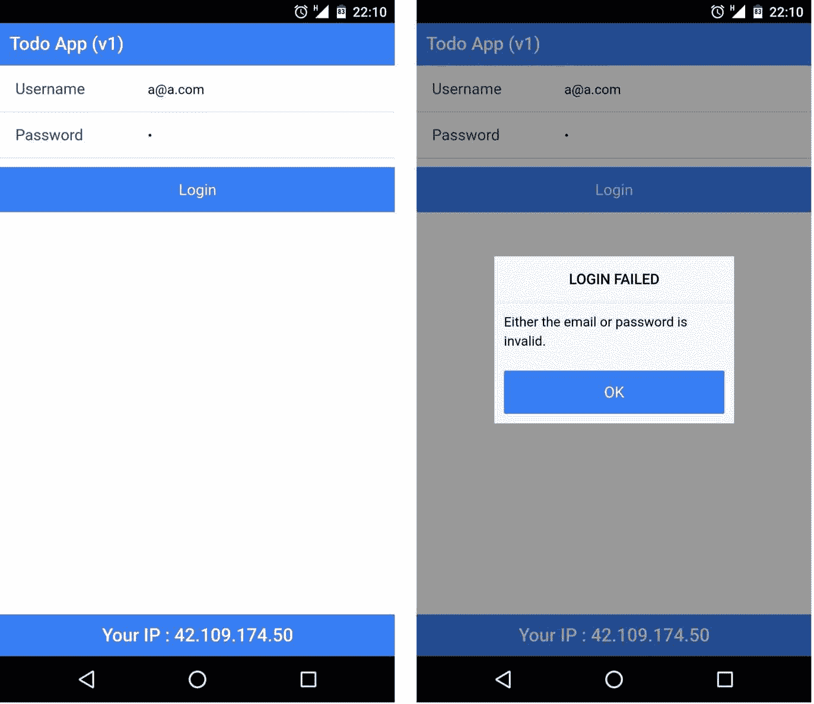
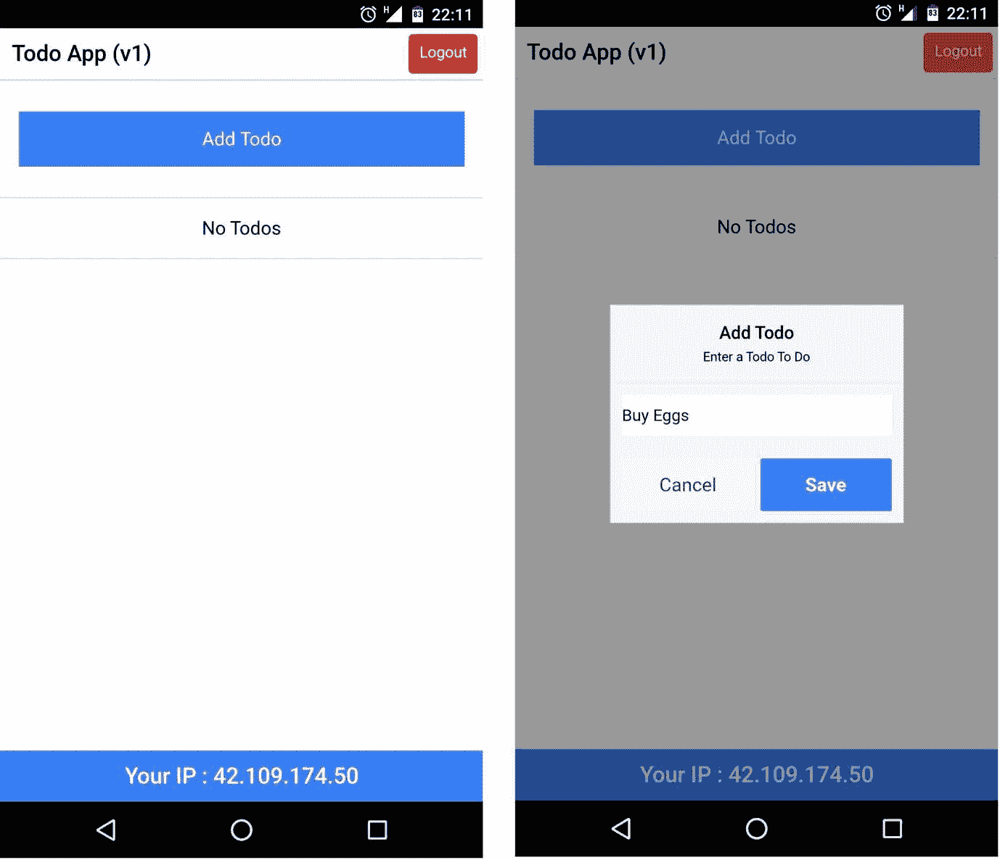
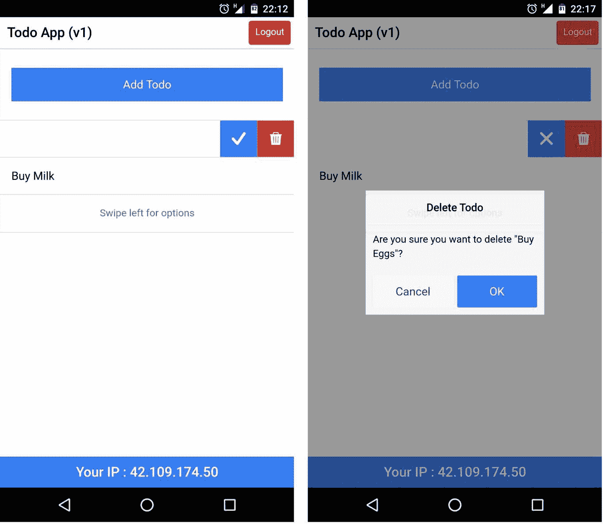
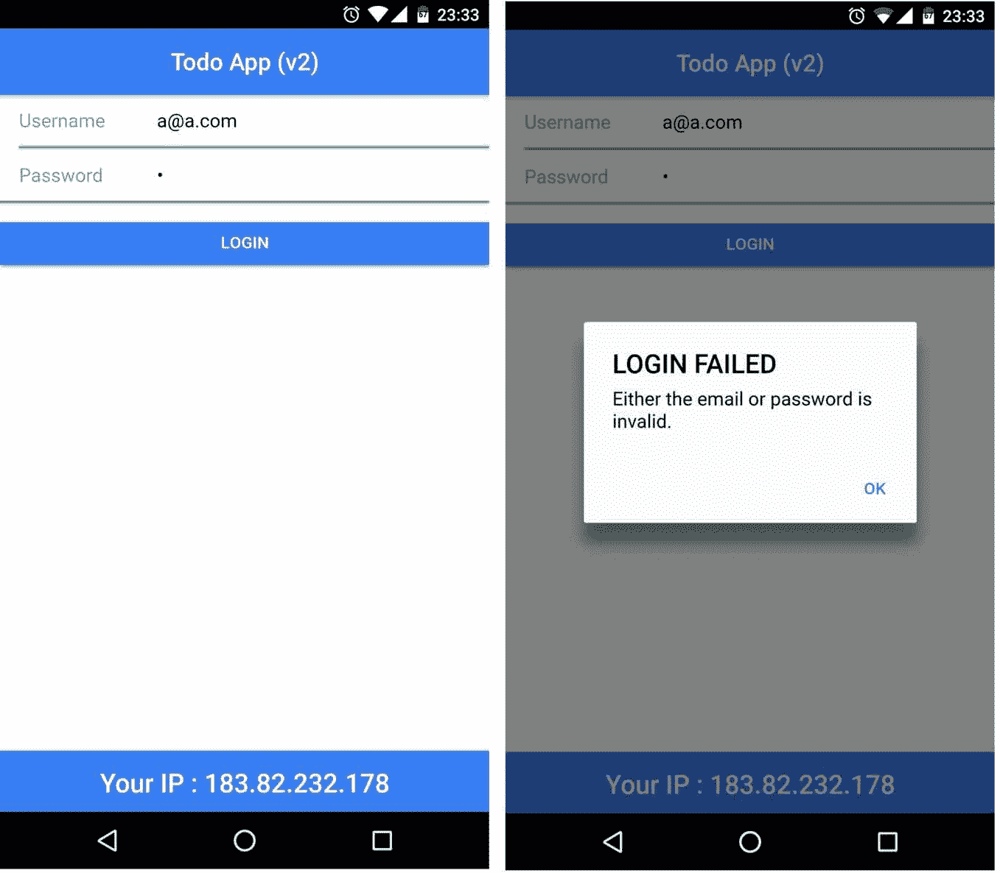
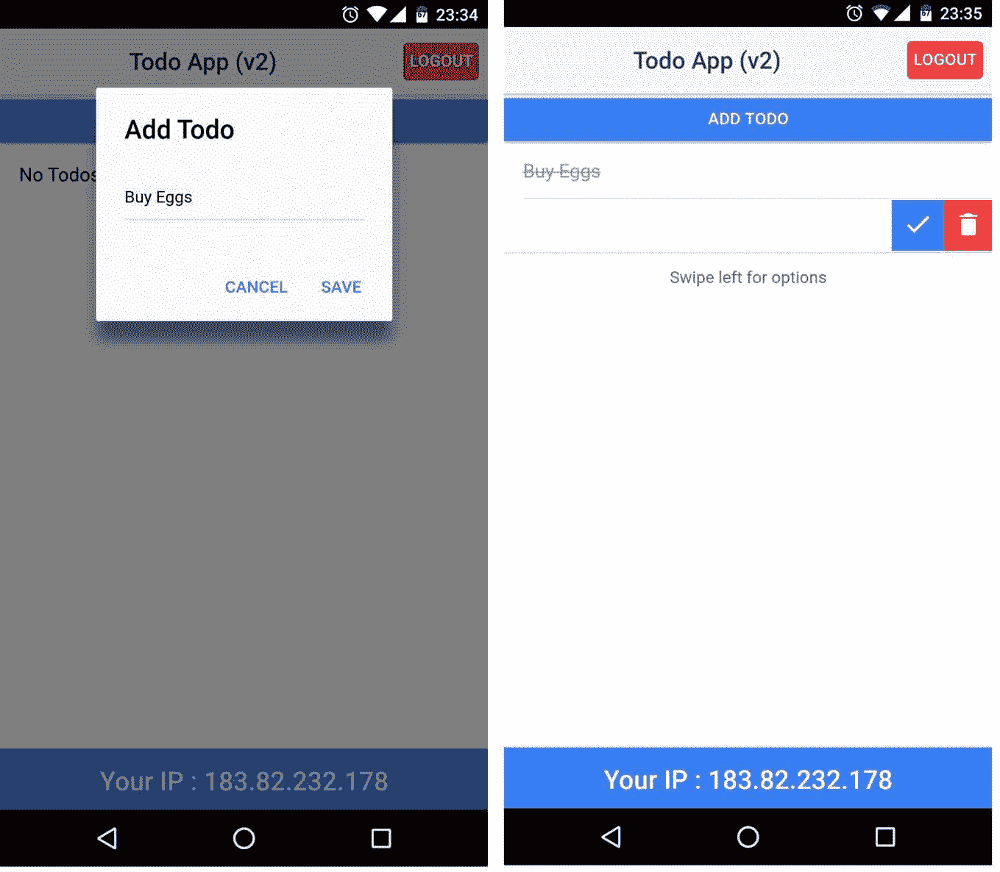

# 离子 2 迁移指南

在本章中，我们将了解如何将现有的离子 1 应用迁移到离子 2/离子 3。我们首先将使用 ion 1 构建一个简单的 Todo 应用，然后了解如何将它迁移到 ion 2:

*   为什么要移民？
*   构建一个简单的 Ionic 1 Todo 应用
*   迁移游戏计划
*   将离子 1 待办事项应用迁移到离子 2

如果您想从离子 1 迁移到离子 3，本迁移指南仍然有效。参考[第十一章](11.html#523VK0-9757c8e51afd47e0a7a9ced32db749b8)、*离子 3* 更好的了解离子 3 的变化。

# 为什么要移民？

到目前为止，在这本书里，我们已经经历了用 ion 2 构建应用的过程，而对 ion 1 一无所知。但就现实世界而言，已经有几千个应用部署了 ion 1。这些应用可以利用离子 2 的改进功能，使应用体验更好。

在软件世界中迁移代码是一项艰巨的任务。在我们的例子中，迁移更加复杂，因为我们不仅仅是将 ion 1 的库升级到 ion 2，而是升级编写这些库的语言本身，例如，将 ES5 升级到 ES6 和 TypeScript。

JavaScript 应用的新生态系统主要围绕 ES6、类型脚本和网络组件展开。适应这些以利用最新的技术是 Angular 2 所做的。ion 2 也做到了这一点。

IMHO，有这么多的变化，将一个功能齐全的应用从离子 1 迁移到离子 2 应该是谨慎的，只需要在必要的时候进行。

*如果事情成功了，为什么还要改变？*

说到把一个应用基础从 ion 1 改成 ion 2，有人称之为迁移，但我称之为重写。

# todo app-Ionical v1

在这一节中，我们将使用 ion 1 构建一个 Todo 应用。我们将要构建的应用将包含一个典型的离子应用的几乎所有功能。我们将拥有:

*   选择途径
*   坚持
*   本地通知
*   REST API 集成

两页 Todo 应用的第一页将是登录页，在第二页，我们使用 Todos。我们将使用`LocalStorage`保存认证状态以及我们将要创建的 Todos。我们还将在用户创建、更新或删除待办事项时显示本地通知。显示本地通知更像是将离子应用与设备功能对接。最后一个 REST API 请求到[https://www.ipify.org/](https://www.ipify.org/)获取我们访问这个应用的设备的 IP 地址。

最终的应用如下图所示:


# 构建应用

现在，我们已经有了一个关于我们要构建什么的想法，让我们开始吧。创建一个名为`chapter8`的文件夹，并在`chapter8`文件夹中打开一个新的命令提示符/终端，然后运行:

```html
ionic start -a "TodoApp-v1" -i app.example.todoapp_v1 todoapp_v1  blank

```

我们正在使用 Ionic v1 搭建一个空白项目。请注意，我们没有使用`--v2`标志。项目搭建完成后，在您最喜欢的文本编辑器中打开它。

在开始处理这两个页面之前，我们将创建所需的服务。我们将创建五项服务:

*   本地存储服务:与本地存储交互
*   本地通知服务:与`$cordovaLocalNotification`交互
*   知识产权服务:与[https://api.ipify.org](https://api.ipify.org)互动
*   认证服务:管理认证
*   托多斯服务:管理托多斯

为此，我们将在`www/js`文件夹中创建另一个名为`services.js`的文件。打开`todoapp_v1/www/js/services.js`并添加以下代码:

```html
angular.module('starter') 
.service('LS', function($window) { // local storage 
    this.set = function(key, value) { 
        // http://stackoverflow.com/a/23656919/1015046 
        $window.localStorage.setItem(key, 
        $window.angular.toJson(value)); 
    } 

    this.get = function(key) { 
        return $window.JSON.parse($window.localStorage.getItem(key)); 
    } 

    this.remove = function(key) { 
        $window.localStorage.removeItem(key); 
    } 
})

```

`LS`服务向 HTML5 `localStorage`公开一个包装器。

接下来，在`LS`服务之后，在同一文件中为本地通知服务添加一个包装器:

```html
// snipp 
.service('LN', function($ionicPlatform, $cordovaLocalNotification) { // local notifications 
    var i = 1; 
    this.show = function(text) { 
        $ionicPlatform.ready(function() { 
            var notifPromise = $cordovaLocalNotification.schedule({ 
                id: i++, 
                title: 'Todo App', 
                text: text 
            }) 
            return notifPromise; 
        }); 
    } 
})

```

我们将在编写代码结束时从`ngCordova`添加所需的依赖项。

接下来，我们将添加`IP`服务与[https://api.ipify.org](https://api.ipify.org)进行交互，获取用户的 IP 地址。附加以下代码:

```html
// snipp 
.service('IP', function ($http) { 
    this.get = function(){ 
        return $http.get('https://api.ipify.org/?format=json'); 
    } 
})

```

最后，管理身份验证和 todos 的两个关键服务。添加以下代码:

```html
// snipp 
.service('AUTH', function(LS) { 
    var LS_AUTH_KEY = 'auth'; 
    this.login = function(user) { 
        if (user.email === 'a@a.com', user.password === 'a') { 
            LS.set(LS_AUTH_KEY, true); 
            return true; 
        } else { 
            return false; 
        } 
    } 

    this.isAuthenticated = function() { 
        return !!LS.get(LS_AUTH_KEY); 
    } 

    this.logout = function() { 
        LS.remove(LS_AUTH_KEY); 
    } 

}) 

.service('TODOS', function(LS) { 
    var LS_TODOS_KEY = 'todos'; 

    this.set = function(todos) { 
        LS.set(LS_TODOS_KEY, todos); 
    } 

    this.get = function() { 
        return LS.get(LS_TODOS_KEY) || []; 
    } 
});

```

这样，我们就完成了所需的服务。

由于这将是一个两页的应用，我们将与国家路由器合作来定义和管理路由。打开`todoapp_v1/www/js/app.js`并在`run`方法下添加以下`config`部分:

```html
.config(function($stateProvider, $urlRouterProvider) { 
    $stateProvider 
        .state('login', { 
            url: '/login', 
            templateUrl: 'templates/login.html', 
            controller: 'LoginCtrl' 
        }) 
        .state('home', { 
            url: '/home', 
            templateUrl: 'templates/home.html', 
            controller: 'HomeCtrl' 
        }); 
    // if none of the above states are matched, use this as the fallback 
    $urlRouterProvider.otherwise('/login'); 
});

```

在前面的代码片段中，我们定义了两条路径——登录和主页。现在我们需要创建所需的模板和控制器。

在`www/js`文件夹内创建一个名为`controllers.js`的新文件。打开`todoapp_v1/www/js/controllers.js`和`LoginCtrl`，如下图所示:

```html
angular.module('starter') 

.controller('LoginCtrl', function($scope, AUTH, $state, $ionicHistory, $ionicPopup) { 

    // check Auth before proceeding 
    if (AUTH.isAuthenticated()) { 
        $state.go('home'); 
    } 

    // hardcode the test user 
    $scope.user = { 
        email: 'a@a.com', 
        password: 'a' 
    } 

    $scope.login = function() { 
        if (AUTH.login($scope.user)) { 
            // remove all views in stack 
            // this way when the user clicks on the  
            // back button on the home page 
            // we do not show the login screen again 
            $ionicHistory.clearHistory(); 
            $state.go('home'); 
        } else { 
            $ionicPopup.alert({ 
                title: 'LOGIN FAILED', 
                template: 'Either the email or password is invalid.' 
            }); 
        }; 
    } 
})

```

这里我们检查用户是否已经通过身份验证，如果是，我们将用户重定向到主页。`login()`获取用户的凭证并用`AUTH.login().`验证它们。如果身份验证失败，我们将使用`$ionicPopup`服务显示警报。

接下来，我们将添加`HomeCtrl`，如下代码所示:

```html
// snipp 

.controller('HomeCtrl', function($scope, $state, AUTH, TODOS, $ionicHistory, $ionicPopup, $ionicListDelegate, LN) { 

    $scope.todo = {}; 
    // check Auth before proceeding 
    if (!AUTH.isAuthenticated()) { 
        $state.go('login'); 
    } 

    // fetch todos on load 
    $scope.todos = TODOS.get(); 

    $scope.add = function() { 
        //reset 
        $scope.todo.text = ''; 
        var addTodoPopup = $ionicPopup.show({ 
            template: '<input type="text" ng-model="todo.text">', 
            title: 'Add Todo', 
            subTitle: 'Enter a Todo To Do', 
            scope: $scope, 
            buttons: [ 
                { text: 'Cancel' }, { 
                    text: '<b>Save</b>', 
                    type: 'button-positive', 
                    onTap: function(e) { 
                        // validation 
                        if (!$scope.todo.text) { 
                            e.preventDefault(); 
                        } else { 
                            return $scope.todo.text; 
                        } 
                    } 
                } 
            ] 
        }); 

        addTodoPopup.then(function(text) { 
            if (text) { 
                var todo = { 
                    text: text, 
                    isCompleted: false 
                }; 

                $scope.todos.push(todo); 
                // save it to LS 
                TODOS.set($scope.todos); 
                LN.show('Todo Created'); 
            } 
        }); 
    } 

    $scope.update = function(todo) { 
        todo.isCompleted = !todo.isCompleted; 
        $ionicListDelegate.closeOptionButtons(); 
        // update LS 
        TODOS.set($scope.todos); 
        LN.show('Todo Updated'); 
    } 

    $scope.delete = function($index, todo) { 

        var deleteConfirmPopup = $ionicPopup.confirm({ 
            title: 'Delete Todo', 
            template: 'Are you sure you want to delete "' + todo.text + 
            '"? ' 
        }); 

        deleteConfirmPopup.then(function(res) { 
            if (res) { 
                $scope.todos.splice($index, 1); 
                // update LS 
                TODOS.set($scope.todos); 
                LN.show('Todo Deleted'); 
            } 
        }); 
    } 

    $scope.logout = function() { 
        AUTH.logout(); 
        $ionicHistory.clearHistory(); 
        $state.go('login'); 
    } 
});

```

我们从检查认证开始。接下来，我们获取所有的 todos。我们在`HomeCtrl`范围内定义了四种方法:`add(),` `update(),` `delete(),`和`logout().`

Add 方法用于添加新的待办事项。我们使用`$ionicPopup`服务显示一个弹出窗口，用户在其中输入 Todo 文本。添加待办事项后，我们使用`LN`服务推送本地通知。

Update 方法更新本地存储中的 todo 的`isCompleted`属性，并推送指示相同内容的本地通知。

删除方法显示一个确认框，要求用户确认删除活动。如果用户确认删除，我们将从集合中移除待办事项，并将集合保存回本地存储。为了完成删除过程，我们推送一个本地通知，指示待办事项已被删除。

最后，注销方法清除身份验证状态，并将用户重定向回登录页面。

现在我们已经完成了控制器，我们将处理所需的模板。在`www`文件夹内新建一个名为`templates`的文件夹。在模板文件夹中，创建一个名为`login.html`的文件。打开`todoapp_v1/www/templates/login.html`并更新，如下代码所示:

```html
<ion-view view-> 
    <ion-content> 
        <div class="list"> 
            <label class="item item-input"> 
                <span class="input-label">Username</span> 
                <input type="email" ng-model="user.email" 
                placeholder="Enter your email"> 
            </label> 
            <label class="item item-input"> 
                <span class="input-label">Password</span> 
                <input type="password" ng-model="user.password" 
                placeholder="Enter your password"> 
            </label> 
            <button ng-click="login()" class="button button-positive 
            button-full" ng-disabled="!user.email || !user.password"> 
                Login 
            </button> 
        </div> 
    </ion-content> 
    <ion-footer-bar align- class="bar-positive"> 
        <h1 class="title">Your IP : {{ip}}</h1> 
    </ion-footer-bar> 
</ion-view>

```

我们有一个简单的登录表单。在页脚，我们将显示用户的 IP 地址。为了获取用户的 IP 地址，我们将在`todoapp_v1/www/js/app.js`中更新`run`方法，如下代码所示:

```html
// snipp 
.run(function($ionicPlatform, IP, $rootScope) { 
    $ionicPlatform.ready(function() { 
        if (window.cordova && window.cordova.plugins.Keyboard) { 
            cordova.plugins.Keyboard.hideKeyboardAccessoryBar(true); 
            cordova.plugins.Keyboard.disableScroll(true); 
        } 
        if (window.StatusBar) { 
            StatusBar.styleDefault(); 
        } 

        IP.get().then(function(resp) { 
            // console.log(resp.data); 
            $rootScope.ip = resp.data.ip; 
        }); 
    }); 
}) 
// snipp

```

我们将 IP 地址存储在根作用域中。

接下来，在`www/templates`文件夹内创建一个名为`home.html`的新文件。更新`todoapp_v1/www/templates/home.html`如下图所示代码:

```html
<ion-view view-> 
    <ion-nav-bar class="bar-default"> 
        <ion-nav-buttons side="right"> 
            <button class="button button-assertive" ng-click=" 
            logout()"> 
                Logout 
            </button> 
        </ion-nav-buttons> 
    </ion-nav-bar> 
    <ion-content> 
        <ion-list can-swipe="true"> 
            <ion-item> 
                <button class="button button-full button-positive" ng-
                click="add()"> 
                    Add Todo 
                </button> 
            </ion-item> 
            <ion-item ng-repeat="todo in todos"> 
                <h2 ng-class="{ 'strike' : todo.isCompleted}">
                {{todo.text}}</h2> 
                <ion-option-button class="button-assertive icon ion-
                trash-a" ng-click="delete($index, todo)">
                </ion-option-button> 
                <ion-option-button class="button-positive icon" ng-               
                class="{'ion-checkmark-round' : 
                !todo.isCompleted, 'ion-close-round' :
                todo.isCompleted}" ng-click="update(todo)">
                </ion-option-button> 
            </ion-item> 
            <ion-item ng-if="todos.length > 0"> 
                <p class="text-center">Swipe left for options</p> 
            </ion-item> 
            <ion-item ng-if="todos.length === 0"> 
                <h2 class="text-center">No Todos</h2> 
            </ion-item> 
        </ion-list> 
    </ion-content> 
    <ion-footer-bar align- class="bar-positive"> 
        <h1 class="title">Your IP : {{ip}}</h1> 
    </ion-footer-bar> 
</ion-view>

```

当用户将一个`todo`标记为完成时，为了视觉效果，我们正在添加一个名为`strike`的类。打开`todoapp_v1/www/css/style.css`并更新，如下代码所示:

```html
.strike{ 
  text-decoration: line-through; 
  color: #999; 
}

```

这样，我们就完成了所需代码的实现。现在，我们将添加所需的依赖项并更新`www/index.html`。

首先，我们将为我们的项目增加`ngCordova`([http://ngcordova.com/](http://ngcordova.com/))支持。运行以下命令:

```html
bower install ngCordova --save

```

接下来，本地通知插件:([http://ngcordova.com/docs/plugins/localNotification/](http://ngcordova.com/docs/plugins/localNotification/))科尔多瓦插件添加:[https://github . com/katzer/科尔多瓦-插件-本地-通知. git](https://github.com/katzer/cordova-plugin-local-notifications.git) 。

现在，我们将更新`www/index.html`以添加`ngCordova`依赖项。添加以下内容:

```html
<script src="lib/ngCordova/dist/ng-cordova.js"></script> before <script src="cordova.js"></script>.

```

接下来，添加对`services.js`和`controllers.js:`的引用

```html
<script src="js/services.js"></script> 
<script src="js/controllers.js"></script>

```

在`app.js`被包含后。接下来，将更新主体部分，如以下代码所示:

```html
<ion-pane> 
        <ion-nav-bar class="bar-positive"> 
        </ion-nav-bar> 
        <ion-nav-view></ion-nav-view> 
</ion-pane>

```

我们增加了`<ion-nav-view></ion-nav-view>`来支持路由。

现在，打开`todoapp_v1/www/js/app.js`并将启动器模块定义更新为:`angular.module('starter', ['ionic', 'ngCordova'])`

就是这样！现在我们需要做的就是添加一个平台，并开始测试用 Ionic v1 构建的 to do 应用:

```html
ionic platform add android or ionic platform add ios

```

然后运行以下命令:

```html
ionic run android or ionic run ios

```

我们应该会看到登录页面出现:



成功登录后，我们应该能够添加新的待办事项:



我们可以更新待办事项或删除待办事项:



添加、更新或删除待办事项时，我们会推送本地通知:


有了这个，我们就完成了一个 Ionic 1 Todo 应用的构建。

# 迁移计划

现在我们已经完成了离子 v1 Todo 应用，我们将考虑将其迁移到离子 2。

Note: If you were planning to migrate from Ionic 1 to Ionic 3, you would be following a similar approach.

计划很简单；我们将使用`--v2`标志搭建一个新的空白模板，并开始组装东西。下表是一个很好的起点:

| **组件** | **离子 1** | **离子 2** |
| 离子起始模板 | 空白的 | 空白的 |
| 引导应用 | ng 应用 | `NgModule` |
| 航行 | 状态路由器 | `NavController` |
| 成分 | 模板和控制器 | `@Component` |
| 服务/工厂 | 互联网服务商 | `@Injectable Provider` |
| 坚持 | 局部存储器 | 存储应用编程接口 |
| 设备交互 | `NgCordova` | 天然离子 |
| 本地通知 | `$cordovaLocalNotification`服务 | LocalNotifications 类 |

既然我们知道了高级映射，我们将从在 v2 中搭建一个新的空白模板开始。

在`chapter8`文件夹内，打开一个新的命令提示符/终端，运行:

```html
ionic start -a "TodoApp-v2" -i app.example.todoapp_v2 todoapp_v2  blank --v2

```

脚手架完成后，`cd`进入`todoapp_v2`文件夹。我们将生成所需的组件和提供商。运行以下命令:

```html
 ionic generate page login

```

这将生成登录页面。接下来，三个提供商:

```html
ionic generate provider auth 
ionic generate provider todos 
ionic generate provider IP

```

由于我们使用的是离子 2 的存储应用编程接口，因此我们不会为此创建单独的提供程序。

现在我们有了所需的页面和提供者，我们将引导应用。

打开`todoapp_v2/src/app/app.module.ts`和所需的进口:

```html
// snipp 
import { LoginPage } from '../pages/login/login'; 

import { Auth } from '../providers/auth'; 
import { Todos } from '../providers/todos'; 
import { IP } from '../providers/ip'; 

import { IonicStorageModule } from '@ionic/storage'; 
import { LocalNotifications } from '@ionic-native/local-notifications';

```

接下来，我们将更新`@NgModule`，如下代码所示:

```html
@NgModule({ 
  declarations: [ 
    MyApp, 
    HomePage, 
    LoginPage 
  ], 
  imports: [ 
    IonicModule.forRoot(MyApp), 
    IonicStorageModule.forRoot() 
  ], 
  bootstrap: [IonicApp], 
  entryComponents: [ 
    MyApp, 
    HomePage, 
    LoginPage 
  ], 
  providers: [ 
    StatusBar, 
    SplashScreen, 
    {provide: ErrorHandler, useClass: IonicErrorHandler}, 
    Auth, 
    Todos, 
    IP, 
    LocalNotifications 
  ] 
})

```

正如我们在 ion 1 应用中所做的那样，我们将在最后安装所需的依赖项。

打开`todoapp_v2/src/app/app.component.ts`，将`rootPage`更新为`LoginPage`。我们会将`'../pages/home/home';`的`import { HomePage }`更新为`import { LoginPage }`的`'../pages/login/login';`和`rootPage = HomePage;`更新为`rootPage = LoginPage;`

现在，我们将更新提供者。打开`todoapp_v2/src/providers/ip.ts`并更新，如下代码所示:

```html
import { Injectable } from '@angular/core'; 
import { Http, Response } from '@angular/http'; 
import { Observable } from 'rxjs/Observable'; 

@Injectable() 
export class IP { 
  constructor(private http: Http) {} 

  get() : Observable <Response>{ 
    return this.http.get('https://api.ipify.org/?format=json'); 
  } 
}

```

接下来，打开`todoapp_v2/src/providers/auth.ts`。更新如下所示:

```html
import { Injectable } from '@angular/core'; 
import { Storage } from '@ionic/storage'; 

@Injectable() 
export class Todos { 
  private LS_TODOS_KEY = 'todos'; 

  constructor(private storage: Storage) { } 

  set(todos): void { 
    this.storage.set(this.LS_TODOS_KEY, todos); 
  } 

  get(): Promise<any> { 
    return this.storage.get(this.LS_TODOS_KEY); 
  } 
}

```

最后打开`todoapp_v2/src/providers/auth.ts`，更新如下:

```html
import { Injectable } from '@angular/core'; 
import { Storage } from '@ionic/storage'; 

@Injectable() 
export class Auth { 
  private LS_AUTH_KEY = 'auth'; 

  constructor(private storage: Storage) { } 

  login(user: any): Boolean { 
    if (user.email === 'a@a.com', user.password === 'a') { 
      this.storage.set(this.LS_AUTH_KEY, true) 
      return true; 
    } else { 
      return false; 
    } 
  } 

  isAuthenticated(): Promise<Storage> { 
    return this.storage.get(this.LS_AUTH_KEY); 
  } 

  logout(): void { 
    this.storage.set(this.LS_AUTH_KEY, undefined); 
  } 
}

```

前面三个提供程序非常简单。它们复制了与离子 1 中所示相同的逻辑，除了这些是按照 Angular 2 结构用 TypeScript 编写的。

现在，我们要开始写了。首先是登录页面。打开`todoapp_v2/src/pages/login/login.ts`并按照以下代码更新:

```html
import { Component } from '@angular/core'; 
import { NavController, AlertController } from 'ionic-angular'; 
import { HomePage } from '../home/home'; 
import { Auth } from '../../providers/auth'; 
import { IP } from '../../providers/ip'; 

@Component({ 
  selector: 'page-login', 
  templateUrl: 'login.html' 
}) 
export class LoginPage { 
  userIp = ''; 
  user = { 
    email: 'a@a.com', 
    password: 'a' 
  } 

  constructor( 
    public navCtrl: NavController, 
    public alertCtrl: AlertController, 
    private auth: Auth, 
    private ip: IP) { 

    // check if the user is already  
    // authenticated 
    auth.isAuthenticated().then((isAuth) => { 
      if (isAuth) { 
        navCtrl.setRoot(HomePage); 
      } 
    }); 

    // Get the user's IP 
    ip.get().subscribe((data) => { 
      this.userIp = data.json().ip; 
    }); 
  } 

  login() { 
    if (this.auth.login(this.user)) { 
      this.navCtrl.setRoot(HomePage); 
    } else { 
      let alert = this.alertCtrl.create({ 
        title: 'LOGIN FAILED', 
        subTitle: 'Either the email or password is invalid.', 
        buttons: ['OK'] 
      }); 
      alert.present(); 
    } 
  } 
}

```

这个文件中的逻辑与 Ionic 1 app 中`LoginCtrl`的逻辑非常相似。接下来我们将更新`todoapp_v2/src/pages/login/login.html`，如下代码所示:

```html
<ion-header class="positive"> 
    <ion-navbar> 
        <ion-title>Todo App (v2)</ion-title> 
    </ion-navbar> 
</ion-header> 
<ion-content> 
    <ion-list> 
        <ion-item> 
            <ion-label fixed>Username</ion-label> 
            <ion-input type="email" placeholder="Enter your email" 
            [(ngModel)]="user.email"></ion-input> 
        </ion-item> 
        <ion-item> 
            <ion-label fixed>Password</ion-label> 
            <ion-input type="password" placeholder="Enter your 
            password" [(ngModel)]="user.password"></ion-input> 
        </ion-item> 
    </ion-list> 
    <button ion-button full (click)="login()" [disabled]="!user.email || !user.password">Login</button> 
</ion-content> 
<ion-footer>
  <h3>Your IP : {{userIp}}</h3>
</ion-footer>

```

页面结构与 ion 1 完全相同，除了我们与组件交互的方式；`[(ngModel)]`双向数据绑定语法`(ng-model)`和`(click)`按钮事件处理语法`(ng-click).`

请注意`ion-header`上的班级正面。我们将使用这一点来为页面提供几乎与我们为 ion 1 应用所做的相同的外观和感觉。

现在我们要进行`todoapp_v2/src/pages/home/home.ts`的工作。更新`todoapp_v2/src/pages/home/home.ts`，如下图所示:

```html
import { Component } from '@angular/core'; 
import { LocalNotifications } from '@ionic-native/local-notifications'; 
import { NavController, AlertController } from 'ionic-angular'; 
import { LoginPage } from '../login/login'; 
import { Auth } from '../../providers/auth'; 
import { IP } from '../../providers/ip'; 
import { Todos } from '../../providers/todos'; 

@Component({ 
  selector: 'page-home', 
  templateUrl: 'home.html' 
}) 
export class HomePage { 
  private i = 1; // ID for notifications 
  userIp = ''; 
  userTodos = []; 

  constructor( 
    public navCtrl: NavController, 
    public alertCtrl: AlertController, 
    private localNotifications: LocalNotifications, 
    private auth: Auth, 
    private ip: IP, 
    private todos: Todos) { 

    // check if the user is authenticated 
    auth.isAuthenticated().then((isAuth) => { 
      if (!isAuth) { 
        navCtrl.setRoot(LoginPage); 
      } 
    }); 

    // fetch todos on load 
    this.todos.get().then((_todos) => { 
      this.userTodos = _todos || []; 
    }); 

    // Get the user's IP 
    ip.get().subscribe((data) => { 
      this.userIp = data.json().ip; 
    }); 
  } 

  add() { 
    let addTodoPopup = this.alertCtrl.create({ 
      title: 'Add Todo', 
      inputs: [ 
        { 
          name: 'text', 
          placeholder: 'Enter a Todo To Do' 
        } 
      ], 
      buttons: [ 
        { 
          text: 'Cancel', 
          role: 'cancel', 
          handler: (data) => { 
            // console.log('Cancel clicked'); 
          } 
        }, 
        { 
          text: 'Save', 
          handler: (data) => { 
            if (data.text) { 
              let todo = { 
                text: data.text, 
                isCompleted: false 
              }; 
              this.userTodos.push(todo); 
              // store the todos 
              this.todos.set(this.userTodos); 
              this.notify('Todo Created'); 

            } else { 
              return false; 
            } 
          } 
        } 

      ] 
    }); 
    addTodoPopup.present(); 
  } 

  update(todo, slidingItem) { 
    todo.isCompleted = !todo.isCompleted; 
    // store the todos 
    this.todos.set(this.userTodos); 
    slidingItem.close(); 
    this.notify('Todo Updated'); 
  } 

  delete(todo, index) { 
    let alert = this.alertCtrl.create({ 
      title: 'Delete Todo', 
      message: 'Are you sure you want to delete "' + todo.text + '"? ', 
      buttons: [ 
        { 
          text: 'No', 
          role: 'cancel', 
          handler: () => { 
            // console.log('Cancel clicked'); 
          } 
        }, 
        { 
          text: 'Yes', 
          handler: () => { 
            this.userTodos.splice(index, 1); 
            this.todos.set(this.userTodos); 
            this.notify('Todo Deleted'); 
          } 
        } 
      ] 
    }); 
    alert.present(); 

  } 

  logout() { 
    this.auth.logout(); 
    this.navCtrl.setRoot(LoginPage); 
  } 

  private notify(text) { 
    this.localNotifications.schedule({ 
      id: this.i++, 
      title: 'Todo App', 
      text: text, 
    }); 
  } 
}

```

`HomeCtrl`同样的逻辑在这里复制。唯一的关键区别是`notify()`被用作呈现本地通知的包装器，不像在 ion 1 应用中，我们有一个相同的服务。

更新后的`todoapp_v2/src/pages/home/home.html`如下:

```html
<ion-header> 
    <ion-navbar> 
        <ion-title>Todo App (v2)</ion-title> 
        <ion-buttons end> 
            <button ion-button color="danger" (click)="logout()"> 
                Logout 
            </button> 
        </ion-buttons> 
    </ion-navbar> 
</ion-header> 
<ion-content> 
    <button ion-button full (click)="add()"> 
        Add Todo 
    </button> 
    <ion-list can-swipe="true"> 
        <ion-item-sliding *ngFor="let todo of userTodos" #slidingItem> 
            <ion-item [class.strike]="todo.isCompleted"> 
                {{todo.text}} 
            </ion-item> 
            <ion-item-options side="right"> 
                <button ion-button icon-only (click)="update(todo, 
                slidingItem)"> 
                    <ion-icon [name]="todo.isCompleted ? 'close' : 
                    'checkmark'"></ion-icon> 
                </button> 
                <button ion-button icon-only color="danger" 
                (click)="delete(todo, index)"> 
                    <ion-icon name="trash"></ion-icon> 
                </button> 
            </ion-item-options> 
        </ion-item-sliding> 
        <ion-item *ngIf="userTodos.length > 0"> 
            <p text-center>Swipe left for options</p> 
        </ion-item> 
        <ion-item *ngIf="userTodos.length === 0"> 
            <h2 class="text-center">No Todos</h2> 
        </ion-item> 
    </ion-list> 
</ion-content> 
<ion-footer> 
    <h3>Your IP : {{userIp}}</h3> 
</ion-footer>

```

最后是款式。打开`todoapp_v2/src/app/app.scss`添加以下 CSS 规则:

```html
ion-header.positive ion-navbar .toolbar-background, 
ion-footer, 
{ 
    background-color: #387ef5; 
} 

ion-header.positive .toolbar-title, 
ion-footer { 
    color: #fff; 
} 

.toolbar-title, 
ion-footer { 
    text-align: center; 
} 

ion-navbar button[color=danger]{ 
    background: #f53d3d; 
    color: #fff; 
    border-radius: 4px 
} 

.strike { 
    text-decoration: line-through; 
    color:#999; 
}

```

这就结束了我们的编码部分。现在，我们将安装所需的依赖项。首先，运行以下与存储相关的依赖项:

```html
ionic plugin add cordova-sqlite-storage -save 
npm install --save @ionic/storage

```

接下来，本地通知依赖关系:

```html
ionic plugin add de.appplant.cordova.plugin.local-notification 
npm install --save @ionic-native/local-notifications

```

这应该考虑到所需的依赖性。

现在，我们将添加一个平台并测试该应用:

```html
ionic platform add android or ionic platform add ios

```

然后运行以下命令:

```html
ionic run android or ionic run ios

```

您应该会看到登录页面出现:



管理 Todos 的主页:



最后，推送的通知:


至此，我们已经完成了我们的 Ionic 1 Todo App 到 ion 2 的迁移。希望这个例子已经给出了一些关于如何将离子 1 应用迁移到离子 2 和离子 3 的想法。

# 摘要

在本章中，我们已经完成了构建一个简单的 Ionic 1 Todo 应用的过程。接下来，我们准备了一个粗略的迁移计划，并遵循同样的计划将 Ionic 1 Todo 应用迁移到 ion 2。在迁移和利用离子原生和存储应用编程接口等最新功能方面，我们看到了离子 1 和离子 2 应用之间的一些关键差异。

一定要查看[第 11 章](11.html#523VK0-9757c8e51afd47e0a7a9ced32db749b8)、*离子 3* 看看离子 2 和离子 3 的区别。

在下一章，我们将测试我们已经迁移的 Ionic 2 Todo 应用。